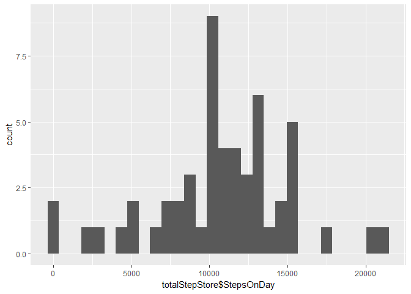
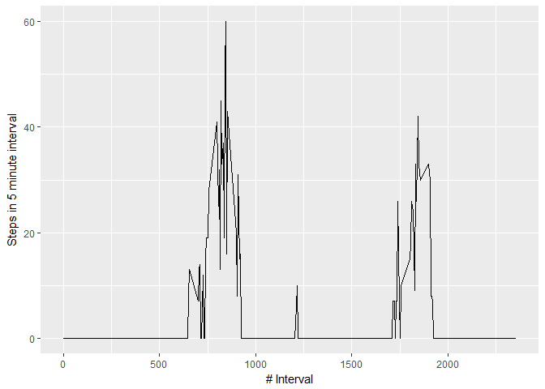
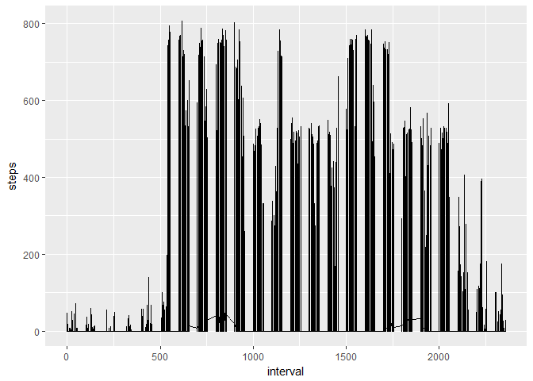

# Introduction 

This document contains the first assignment of the Coursera Reproducible Research course, dated 07/01/2018. The aim is to read in a data set, preprocess it to a usage stage and present an analysis and further extension of the data set.

This section loads the appropriate libraries

```r
library(ggplot2, readr);library(dplyr);library(tidyr)
```

```
## Warning: package 'dplyr' was built under R version 3.3.3
```

```
## 
## Attaching package: 'dplyr'
```

```
## The following objects are masked from 'package:stats':
## 
##     filter, lag
```

```
## The following objects are masked from 'package:base':
## 
##     intersect, setdiff, setequal, union
```

```
## Warning: package 'tidyr' was built under R version 3.3.3
```

## Loading and preprocessing the data

The existing dataset has variables: 
*steps

*date

*interval (representing the 5-minute interval the steps are counted in). The data is read in as is. Specific data tables are made to use for the total step count analysis and the step-count by time analysis


```r
datStore = read.csv("F:/RepData_PeerAssessment1/activity/activity.csv")
totalStepStore <-aggregate(data=datStore,steps~date,sum)
colnames(totalStepStore) <- c("date", "StepsOnDay")
intervalAvg <- aggregate(data=datStore,steps~interval,median)
colnames(intervalAvg) <- c("interval", "steps")
```

## What is mean total number of steps taken per day?

For this section we want a histogram of the total number of steps per day, and the mean and median number of steps per day. Firstly a histrogram of total number of steps per day.


```r
ggplot(data=totalStepStore, aes(totalStepStore$StepsOnDay))+geom_histogram()
```

```
## `stat_bin()` using `bins = 30`. Pick better value with `binwidth`.
```

<!-- -->
And the mean and median number of total steps per day is

```r
mean(totalStepStore$StepsOnDay)
```

```
## [1] 10766.19
```

```r
median(totalStepStore$StepsOnDay)
```

```
## [1] 10765
```

## What is the average daily activity pattern?


```r
ggplot(data=intervalAvg, aes(interval, steps))+geom_line()+ xlab("# Interval")+ylab("Steps in 5 minute interval")
```

<!-- -->

The interval number with the highest average steps is 


```r
intervalAvg$interval[which(intervalAvg$step==max(intervalAvg$steps, na.rm=TRUE))]
```

```
## [1] 845
```

## Imputing missing values

There's a number of NA values in the dataset. The summary of datStore$steps is :

```r
summary(datStore$steps)
```

```
##    Min. 1st Qu.  Median    Mean 3rd Qu.    Max.    NA's 
##    0.00    0.00    0.00   37.38   12.00  806.00    2304
```
and we can see there are 2304 NA values. To fill this in we will use the median number of steps for that interval value. A subfunction that will check is steps is NA in full table, and if so replace with median, will be used. 


```r
filledDatStore <-datStore
replace_unfilled = function(tarOne, tarTwo){
  if(is.na(tarOne)){
    return(tarTwo)
  }
  return(tarOne)
}
filledDatStore$steps = mapply(replace_unfilled, datStore$steps, intervalAvg$steps)
summary(filledDatStore)
```

```
##      steps             date          interval     
##  Min.   :  0   2012-10-01:  288   Min.   :   0.0  
##  1st Qu.:  0   2012-10-02:  288   1st Qu.: 588.8  
##  Median :  0   2012-10-03:  288   Median :1177.5  
##  Mean   : 33   2012-10-04:  288   Mean   :1177.5  
##  3rd Qu.:  8   2012-10-05:  288   3rd Qu.:1766.2  
##  Max.   :806   2012-10-06:  288   Max.   :2355.0  
##                (Other)   :15840
```
The summary shows that there are now no NA values \o/.

The updated histogram of information is


```r
intervalAvgFilled <- aggregate(data=filledDatStore,steps~interval,median)
colnames(intervalAvgFilled) <- c("interval", "steps")

ggplot(data=intervalAvgFilled, aes(interval, steps))+geom_line()+ xlab("# Interval")+ylab("Steps in 5 minute interval")
```

<!-- -->

And the mean and median values are

```r
totalStepStore <-aggregate(data=filledDatStore,steps~date,sum)
mean(totalStepStore$steps)
```

```
## [1] 9503.869
```

```r
median(totalStepStore$steps)
```

```
## [1] 10395
```

As a consequence of this, the mean total steps per day drops from 10766 (excluding NAs) to 9503 (more than 10%, a small decrease) and median from 10765 to 10395, a less significant decrease.

## Are there differences in activity patterns between weekdays and weekends?

First add a factor for weekday or weekend


```r
filledDatStore$dayname <- weekdays(as.Date(filledDatStore$date))
head(filledDatStore)
```

```
##   steps       date interval dayname
## 1     0 2012-10-01        0  Monday
## 2     0 2012-10-01        5  Monday
## 3     0 2012-10-01       10  Monday
## 4     0 2012-10-01       15  Monday
## 5     0 2012-10-01       20  Monday
## 6     0 2012-10-01       25  Monday
```

```r
typeOfDay = function(dayname){
  if(dayname %in% c("Saturday","Sunday")) {
    return("weekend")
  }
  return("weekday")
}

filledDatStore$daytype = as.factor(apply(as.matrix(filledDatStore),1,typeOfDay))
```

```
## Warning in if (dayname %in% c("Saturday", "Sunday")) {: the condition has
## length > 1 and only the first element will be used

## Warning in if (dayname %in% c("Saturday", "Sunday")) {: the condition has
## length > 1 and only the first element will be used

## Warning in if (dayname %in% c("Saturday", "Sunday")) {: the condition has
## length > 1 and only the first element will be used

## Warning in if (dayname %in% c("Saturday", "Sunday")) {: the condition has
## length > 1 and only the first element will be used

## Warning in if (dayname %in% c("Saturday", "Sunday")) {: the condition has
## length > 1 and only the first element will be used

## Warning in if (dayname %in% c("Saturday", "Sunday")) {: the condition has
## length > 1 and only the first element will be used

## Warning in if (dayname %in% c("Saturday", "Sunday")) {: the condition has
## length > 1 and only the first element will be used

## Warning in if (dayname %in% c("Saturday", "Sunday")) {: the condition has
## length > 1 and only the first element will be used

## Warning in if (dayname %in% c("Saturday", "Sunday")) {: the condition has
## length > 1 and only the first element will be used

## Warning in if (dayname %in% c("Saturday", "Sunday")) {: the condition has
## length > 1 and only the first element will be used

## Warning in if (dayname %in% c("Saturday", "Sunday")) {: the condition has
## length > 1 and only the first element will be used

## Warning in if (dayname %in% c("Saturday", "Sunday")) {: the condition has
## length > 1 and only the first element will be used

## Warning in if (dayname %in% c("Saturday", "Sunday")) {: the condition has
## length > 1 and only the first element will be used

## Warning in if (dayname %in% c("Saturday", "Sunday")) {: the condition has
## length > 1 and only the first element will be used

## Warning in if (dayname %in% c("Saturday", "Sunday")) {: the condition has
## length > 1 and only the first element will be used

## Warning in if (dayname %in% c("Saturday", "Sunday")) {: the condition has
## length > 1 and only the first element will be used

## Warning in if (dayname %in% c("Saturday", "Sunday")) {: the condition has
## length > 1 and only the first element will be used

## Warning in if (dayname %in% c("Saturday", "Sunday")) {: the condition has
## length > 1 and only the first element will be used

## Warning in if (dayname %in% c("Saturday", "Sunday")) {: the condition has
## length > 1 and only the first element will be used

## Warning in if (dayname %in% c("Saturday", "Sunday")) {: the condition has
## length > 1 and only the first element will be used

## Warning in if (dayname %in% c("Saturday", "Sunday")) {: the condition has
## length > 1 and only the first element will be used

## Warning in if (dayname %in% c("Saturday", "Sunday")) {: the condition has
## length > 1 and only the first element will be used

## Warning in if (dayname %in% c("Saturday", "Sunday")) {: the condition has
## length > 1 and only the first element will be used

## Warning in if (dayname %in% c("Saturday", "Sunday")) {: the condition has
## length > 1 and only the first element will be used

## Warning in if (dayname %in% c("Saturday", "Sunday")) {: the condition has
## length > 1 and only the first element will be used

## Warning in if (dayname %in% c("Saturday", "Sunday")) {: the condition has
## length > 1 and only the first element will be used

## Warning in if (dayname %in% c("Saturday", "Sunday")) {: the condition has
## length > 1 and only the first element will be used

## Warning in if (dayname %in% c("Saturday", "Sunday")) {: the condition has
## length > 1 and only the first element will be used

## Warning in if (dayname %in% c("Saturday", "Sunday")) {: the condition has
## length > 1 and only the first element will be used

## Warning in if (dayname %in% c("Saturday", "Sunday")) {: the condition has
## length > 1 and only the first element will be used

## Warning in if (dayname %in% c("Saturday", "Sunday")) {: the condition has
## length > 1 and only the first element will be used

## Warning in if (dayname %in% c("Saturday", "Sunday")) {: the condition has
## length > 1 and only the first element will be used

## Warning in if (dayname %in% c("Saturday", "Sunday")) {: the condition has
## length > 1 and only the first element will be used

## Warning in if (dayname %in% c("Saturday", "Sunday")) {: the condition has
## length > 1 and only the first element will be used

## Warning in if (dayname %in% c("Saturday", "Sunday")) {: the condition has
## length > 1 and only the first element will be used

## Warning in if (dayname %in% c("Saturday", "Sunday")) {: the condition has
## length > 1 and only the first element will be used

## Warning in if (dayname %in% c("Saturday", "Sunday")) {: the condition has
## length > 1 and only the first element will be used

## Warning in if (dayname %in% c("Saturday", "Sunday")) {: the condition has
## length > 1 and only the first element will be used

## Warning in if (dayname %in% c("Saturday", "Sunday")) {: the condition has
## length > 1 and only the first element will be used

## Warning in if (dayname %in% c("Saturday", "Sunday")) {: the condition has
## length > 1 and only the first element will be used

## Warning in if (dayname %in% c("Saturday", "Sunday")) {: the condition has
## length > 1 and only the first element will be used

## Warning in if (dayname %in% c("Saturday", "Sunday")) {: the condition has
## length > 1 and only the first element will be used

## Warning in if (dayname %in% c("Saturday", "Sunday")) {: the condition has
## length > 1 and only the first element will be used

## Warning in if (dayname %in% c("Saturday", "Sunday")) {: the condition has
## length > 1 and only the first element will be used

## Warning in if (dayname %in% c("Saturday", "Sunday")) {: the condition has
## length > 1 and only the first element will be used

## Warning in if (dayname %in% c("Saturday", "Sunday")) {: the condition has
## length > 1 and only the first element will be used

## Warning in if (dayname %in% c("Saturday", "Sunday")) {: the condition has
## length > 1 and only the first element will be used

## Warning in if (dayname %in% c("Saturday", "Sunday")) {: the condition has
## length > 1 and only the first element will be used

## Warning in if (dayname %in% c("Saturday", "Sunday")) {: the condition has
## length > 1 and only the first element will be used

## Warning in if (dayname %in% c("Saturday", "Sunday")) {: the condition has
## length > 1 and only the first element will be used

## Warning in if (dayname %in% c("Saturday", "Sunday")) {: the condition has
## length > 1 and only the first element will be used

## Warning in if (dayname %in% c("Saturday", "Sunday")) {: the condition has
## length > 1 and only the first element will be used

## Warning in if (dayname %in% c("Saturday", "Sunday")) {: the condition has
## length > 1 and only the first element will be used

## Warning in if (dayname %in% c("Saturday", "Sunday")) {: the condition has
## length > 1 and only the first element will be used

## Warning in if (dayname %in% c("Saturday", "Sunday")) {: the condition has
## length > 1 and only the first element will be used

## Warning in if (dayname %in% c("Saturday", "Sunday")) {: the condition has
## length > 1 and only the first element will be used

## Warning in if (dayname %in% c("Saturday", "Sunday")) {: the condition has
## length > 1 and only the first element will be used

## Warning in if (dayname %in% c("Saturday", "Sunday")) {: the condition has
## length > 1 and only the first element will be used

## Warning in if (dayname %in% c("Saturday", "Sunday")) {: the condition has
## length > 1 and only the first element will be used

## Warning in if (dayname %in% c("Saturday", "Sunday")) {: the condition has
## length > 1 and only the first element will be used

## Warning in if (dayname %in% c("Saturday", "Sunday")) {: the condition has
## length > 1 and only the first element will be used

## Warning in if (dayname %in% c("Saturday", "Sunday")) {: the condition has
## length > 1 and only the first element will be used

## Warning in if (dayname %in% c("Saturday", "Sunday")) {: the condition has
## length > 1 and only the first element will be used

## Warning in if (dayname %in% c("Saturday", "Sunday")) {: the condition has
## length > 1 and only the first element will be used

## Warning in if (dayname %in% c("Saturday", "Sunday")) {: the condition has
## length > 1 and only the first element will be used

## Warning in if (dayname %in% c("Saturday", "Sunday")) {: the condition has
## length > 1 and only the first element will be used

## Warning in if (dayname %in% c("Saturday", "Sunday")) {: the condition has
## length > 1 and only the first element will be used

## Warning in if (dayname %in% c("Saturday", "Sunday")) {: the condition has
## length > 1 and only the first element will be used

## Warning in if (dayname %in% c("Saturday", "Sunday")) {: the condition has
## length > 1 and only the first element will be used

## Warning in if (dayname %in% c("Saturday", "Sunday")) {: the condition has
## length > 1 and only the first element will be used

## Warning in if (dayname %in% c("Saturday", "Sunday")) {: the condition has
## length > 1 and only the first element will be used

## Warning in if (dayname %in% c("Saturday", "Sunday")) {: the condition has
## length > 1 and only the first element will be used

## Warning in if (dayname %in% c("Saturday", "Sunday")) {: the condition has
## length > 1 and only the first element will be used

## Warning in if (dayname %in% c("Saturday", "Sunday")) {: the condition has
## length > 1 and only the first element will be used

## Warning in if (dayname %in% c("Saturday", "Sunday")) {: the condition has
## length > 1 and only the first element will be used

## Warning in if (dayname %in% c("Saturday", "Sunday")) {: the condition has
## length > 1 and only the first element will be used

## Warning in if (dayname %in% c("Saturday", "Sunday")) {: the condition has
## length > 1 and only the first element will be used

## Warning in if (dayname %in% c("Saturday", "Sunday")) {: the condition has
## length > 1 and only the first element will be used

## Warning in if (dayname %in% c("Saturday", "Sunday")) {: the condition has
## length > 1 and only the first element will be used

## Warning in if (dayname %in% c("Saturday", "Sunday")) {: the condition has
## length > 1 and only the first element will be used

## Warning in if (dayname %in% c("Saturday", "Sunday")) {: the condition has
## length > 1 and only the first element will be used

## Warning in if (dayname %in% c("Saturday", "Sunday")) {: the condition has
## length > 1 and only the first element will be used

## Warning in if (dayname %in% c("Saturday", "Sunday")) {: the condition has
## length > 1 and only the first element will be used

## Warning in if (dayname %in% c("Saturday", "Sunday")) {: the condition has
## length > 1 and only the first element will be used

## Warning in if (dayname %in% c("Saturday", "Sunday")) {: the condition has
## length > 1 and only the first element will be used

## Warning in if (dayname %in% c("Saturday", "Sunday")) {: the condition has
## length > 1 and only the first element will be used

## Warning in if (dayname %in% c("Saturday", "Sunday")) {: the condition has
## length > 1 and only the first element will be used

## Warning in if (dayname %in% c("Saturday", "Sunday")) {: the condition has
## length > 1 and only the first element will be used

## Warning in if (dayname %in% c("Saturday", "Sunday")) {: the condition has
## length > 1 and only the first element will be used

## Warning in if (dayname %in% c("Saturday", "Sunday")) {: the condition has
## length > 1 and only the first element will be used

## Warning in if (dayname %in% c("Saturday", "Sunday")) {: the condition has
## length > 1 and only the first element will be used

## Warning in if (dayname %in% c("Saturday", "Sunday")) {: the condition has
## length > 1 and only the first element will be used

## Warning in if (dayname %in% c("Saturday", "Sunday")) {: the condition has
## length > 1 and only the first element will be used

## Warning in if (dayname %in% c("Saturday", "Sunday")) {: the condition has
## length > 1 and only the first element will be used

## Warning in if (dayname %in% c("Saturday", "Sunday")) {: the condition has
## length > 1 and only the first element will be used

## Warning in if (dayname %in% c("Saturday", "Sunday")) {: the condition has
## length > 1 and only the first element will be used

## Warning in if (dayname %in% c("Saturday", "Sunday")) {: the condition has
## length > 1 and only the first element will be used

## Warning in if (dayname %in% c("Saturday", "Sunday")) {: the condition has
## length > 1 and only the first element will be used

## Warning in if (dayname %in% c("Saturday", "Sunday")) {: the condition has
## length > 1 and only the first element will be used

## Warning in if (dayname %in% c("Saturday", "Sunday")) {: the condition has
## length > 1 and only the first element will be used

## Warning in if (dayname %in% c("Saturday", "Sunday")) {: the condition has
## length > 1 and only the first element will be used

## Warning in if (dayname %in% c("Saturday", "Sunday")) {: the condition has
## length > 1 and only the first element will be used

## Warning in if (dayname %in% c("Saturday", "Sunday")) {: the condition has
## length > 1 and only the first element will be used

## Warning in if (dayname %in% c("Saturday", "Sunday")) {: the condition has
## length > 1 and only the first element will be used

## Warning in if (dayname %in% c("Saturday", "Sunday")) {: the condition has
## length > 1 and only the first element will be used

## Warning in if (dayname %in% c("Saturday", "Sunday")) {: the condition has
## length > 1 and only the first element will be used

## Warning in if (dayname %in% c("Saturday", "Sunday")) {: the condition has
## length > 1 and only the first element will be used

## Warning in if (dayname %in% c("Saturday", "Sunday")) {: the condition has
## length > 1 and only the first element will be used

## Warning in if (dayname %in% c("Saturday", "Sunday")) {: the condition has
## length > 1 and only the first element will be used

## Warning in if (dayname %in% c("Saturday", "Sunday")) {: the condition has
## length > 1 and only the first element will be used

## Warning in if (dayname %in% c("Saturday", "Sunday")) {: the condition has
## length > 1 and only the first element will be used

## Warning in if (dayname %in% c("Saturday", "Sunday")) {: the condition has
## length > 1 and only the first element will be used

## Warning in if (dayname %in% c("Saturday", "Sunday")) {: the condition has
## length > 1 and only the first element will be used

## Warning in if (dayname %in% c("Saturday", "Sunday")) {: the condition has
## length > 1 and only the first element will be used

## Warning in if (dayname %in% c("Saturday", "Sunday")) {: the condition has
## length > 1 and only the first element will be used

## Warning in if (dayname %in% c("Saturday", "Sunday")) {: the condition has
## length > 1 and only the first element will be used

## Warning in if (dayname %in% c("Saturday", "Sunday")) {: the condition has
## length > 1 and only the first element will be used

## Warning in if (dayname %in% c("Saturday", "Sunday")) {: the condition has
## length > 1 and only the first element will be used

## Warning in if (dayname %in% c("Saturday", "Sunday")) {: the condition has
## length > 1 and only the first element will be used

## Warning in if (dayname %in% c("Saturday", "Sunday")) {: the condition has
## length > 1 and only the first element will be used

## Warning in if (dayname %in% c("Saturday", "Sunday")) {: the condition has
## length > 1 and only the first element will be used

## Warning in if (dayname %in% c("Saturday", "Sunday")) {: the condition has
## length > 1 and only the first element will be used

## Warning in if (dayname %in% c("Saturday", "Sunday")) {: the condition has
## length > 1 and only the first element will be used

## Warning in if (dayname %in% c("Saturday", "Sunday")) {: the condition has
## length > 1 and only the first element will be used

## Warning in if (dayname %in% c("Saturday", "Sunday")) {: the condition has
## length > 1 and only the first element will be used

## Warning in if (dayname %in% c("Saturday", "Sunday")) {: the condition has
## length > 1 and only the first element will be used

## Warning in if (dayname %in% c("Saturday", "Sunday")) {: the condition has
## length > 1 and only the first element will be used

## Warning in if (dayname %in% c("Saturday", "Sunday")) {: the condition has
## length > 1 and only the first element will be used

## Warning in if (dayname %in% c("Saturday", "Sunday")) {: the condition has
## length > 1 and only the first element will be used

## Warning in if (dayname %in% c("Saturday", "Sunday")) {: the condition has
## length > 1 and only the first element will be used

## Warning in if (dayname %in% c("Saturday", "Sunday")) {: the condition has
## length > 1 and only the first element will be used

## Warning in if (dayname %in% c("Saturday", "Sunday")) {: the condition has
## length > 1 and only the first element will be used

## Warning in if (dayname %in% c("Saturday", "Sunday")) {: the condition has
## length > 1 and only the first element will be used

## Warning in if (dayname %in% c("Saturday", "Sunday")) {: the condition has
## length > 1 and only the first element will be used

## Warning in if (dayname %in% c("Saturday", "Sunday")) {: the condition has
## length > 1 and only the first element will be used

## Warning in if (dayname %in% c("Saturday", "Sunday")) {: the condition has
## length > 1 and only the first element will be used

## Warning in if (dayname %in% c("Saturday", "Sunday")) {: the condition has
## length > 1 and only the first element will be used

## Warning in if (dayname %in% c("Saturday", "Sunday")) {: the condition has
## length > 1 and only the first element will be used

## Warning in if (dayname %in% c("Saturday", "Sunday")) {: the condition has
## length > 1 and only the first element will be used

## Warning in if (dayname %in% c("Saturday", "Sunday")) {: the condition has
## length > 1 and only the first element will be used

## Warning in if (dayname %in% c("Saturday", "Sunday")) {: the condition has
## length > 1 and only the first element will be used

## Warning in if (dayname %in% c("Saturday", "Sunday")) {: the condition has
## length > 1 and only the first element will be used

## Warning in if (dayname %in% c("Saturday", "Sunday")) {: the condition has
## length > 1 and only the first element will be used

## Warning in if (dayname %in% c("Saturday", "Sunday")) {: the condition has
## length > 1 and only the first element will be used

## Warning in if (dayname %in% c("Saturday", "Sunday")) {: the condition has
## length > 1 and only the first element will be used

## Warning in if (dayname %in% c("Saturday", "Sunday")) {: the condition has
## length > 1 and only the first element will be used

## Warning in if (dayname %in% c("Saturday", "Sunday")) {: the condition has
## length > 1 and only the first element will be used

## Warning in if (dayname %in% c("Saturday", "Sunday")) {: the condition has
## length > 1 and only the first element will be used

## Warning in if (dayname %in% c("Saturday", "Sunday")) {: the condition has
## length > 1 and only the first element will be used

## Warning in if (dayname %in% c("Saturday", "Sunday")) {: the condition has
## length > 1 and only the first element will be used

## Warning in if (dayname %in% c("Saturday", "Sunday")) {: the condition has
## length > 1 and only the first element will be used

## Warning in if (dayname %in% c("Saturday", "Sunday")) {: the condition has
## length > 1 and only the first element will be used

## Warning in if (dayname %in% c("Saturday", "Sunday")) {: the condition has
## length > 1 and only the first element will be used

## Warning in if (dayname %in% c("Saturday", "Sunday")) {: the condition has
## length > 1 and only the first element will be used

## Warning in if (dayname %in% c("Saturday", "Sunday")) {: the condition has
## length > 1 and only the first element will be used

## Warning in if (dayname %in% c("Saturday", "Sunday")) {: the condition has
## length > 1 and only the first element will be used

## Warning in if (dayname %in% c("Saturday", "Sunday")) {: the condition has
## length > 1 and only the first element will be used

## Warning in if (dayname %in% c("Saturday", "Sunday")) {: the condition has
## length > 1 and only the first element will be used

## Warning in if (dayname %in% c("Saturday", "Sunday")) {: the condition has
## length > 1 and only the first element will be used

## Warning in if (dayname %in% c("Saturday", "Sunday")) {: the condition has
## length > 1 and only the first element will be used

## Warning in if (dayname %in% c("Saturday", "Sunday")) {: the condition has
## length > 1 and only the first element will be used

## Warning in if (dayname %in% c("Saturday", "Sunday")) {: the condition has
## length > 1 and only the first element will be used

## Warning in if (dayname %in% c("Saturday", "Sunday")) {: the condition has
## length > 1 and only the first element will be used

## Warning in if (dayname %in% c("Saturday", "Sunday")) {: the condition has
## length > 1 and only the first element will be used

## Warning in if (dayname %in% c("Saturday", "Sunday")) {: the condition has
## length > 1 and only the first element will be used

## Warning in if (dayname %in% c("Saturday", "Sunday")) {: the condition has
## length > 1 and only the first element will be used

## Warning in if (dayname %in% c("Saturday", "Sunday")) {: the condition has
## length > 1 and only the first element will be used

## Warning in if (dayname %in% c("Saturday", "Sunday")) {: the condition has
## length > 1 and only the first element will be used

## Warning in if (dayname %in% c("Saturday", "Sunday")) {: the condition has
## length > 1 and only the first element will be used

## Warning in if (dayname %in% c("Saturday", "Sunday")) {: the condition has
## length > 1 and only the first element will be used

## Warning in if (dayname %in% c("Saturday", "Sunday")) {: the condition has
## length > 1 and only the first element will be used

## Warning in if (dayname %in% c("Saturday", "Sunday")) {: the condition has
## length > 1 and only the first element will be used

## Warning in if (dayname %in% c("Saturday", "Sunday")) {: the condition has
## length > 1 and only the first element will be used

## Warning in if (dayname %in% c("Saturday", "Sunday")) {: the condition has
## length > 1 and only the first element will be used

## Warning in if (dayname %in% c("Saturday", "Sunday")) {: the condition has
## length > 1 and only the first element will be used

## Warning in if (dayname %in% c("Saturday", "Sunday")) {: the condition has
## length > 1 and only the first element will be used

## Warning in if (dayname %in% c("Saturday", "Sunday")) {: the condition has
## length > 1 and only the first element will be used

## Warning in if (dayname %in% c("Saturday", "Sunday")) {: the condition has
## length > 1 and only the first element will be used

## Warning in if (dayname %in% c("Saturday", "Sunday")) {: the condition has
## length > 1 and only the first element will be used

## Warning in if (dayname %in% c("Saturday", "Sunday")) {: the condition has
## length > 1 and only the first element will be used

## Warning in if (dayname %in% c("Saturday", "Sunday")) {: the condition has
## length > 1 and only the first element will be used

## Warning in if (dayname %in% c("Saturday", "Sunday")) {: the condition has
## length > 1 and only the first element will be used

## Warning in if (dayname %in% c("Saturday", "Sunday")) {: the condition has
## length > 1 and only the first element will be used

## Warning in if (dayname %in% c("Saturday", "Sunday")) {: the condition has
## length > 1 and only the first element will be used

## Warning in if (dayname %in% c("Saturday", "Sunday")) {: the condition has
## length > 1 and only the first element will be used

## Warning in if (dayname %in% c("Saturday", "Sunday")) {: the condition has
## length > 1 and only the first element will be used

## Warning in if (dayname %in% c("Saturday", "Sunday")) {: the condition has
## length > 1 and only the first element will be used

## Warning in if (dayname %in% c("Saturday", "Sunday")) {: the condition has
## length > 1 and only the first element will be used

## Warning in if (dayname %in% c("Saturday", "Sunday")) {: the condition has
## length > 1 and only the first element will be used

## Warning in if (dayname %in% c("Saturday", "Sunday")) {: the condition has
## length > 1 and only the first element will be used

## Warning in if (dayname %in% c("Saturday", "Sunday")) {: the condition has
## length > 1 and only the first element will be used

## Warning in if (dayname %in% c("Saturday", "Sunday")) {: the condition has
## length > 1 and only the first element will be used

## Warning in if (dayname %in% c("Saturday", "Sunday")) {: the condition has
## length > 1 and only the first element will be used

## Warning in if (dayname %in% c("Saturday", "Sunday")) {: the condition has
## length > 1 and only the first element will be used

## Warning in if (dayname %in% c("Saturday", "Sunday")) {: the condition has
## length > 1 and only the first element will be used

## Warning in if (dayname %in% c("Saturday", "Sunday")) {: the condition has
## length > 1 and only the first element will be used

## Warning in if (dayname %in% c("Saturday", "Sunday")) {: the condition has
## length > 1 and only the first element will be used

## Warning in if (dayname %in% c("Saturday", "Sunday")) {: the condition has
## length > 1 and only the first element will be used

## Warning in if (dayname %in% c("Saturday", "Sunday")) {: the condition has
## length > 1 and only the first element will be used

## Warning in if (dayname %in% c("Saturday", "Sunday")) {: the condition has
## length > 1 and only the first element will be used

## Warning in if (dayname %in% c("Saturday", "Sunday")) {: the condition has
## length > 1 and only the first element will be used

## Warning in if (dayname %in% c("Saturday", "Sunday")) {: the condition has
## length > 1 and only the first element will be used

## Warning in if (dayname %in% c("Saturday", "Sunday")) {: the condition has
## length > 1 and only the first element will be used

## Warning in if (dayname %in% c("Saturday", "Sunday")) {: the condition has
## length > 1 and only the first element will be used

## Warning in if (dayname %in% c("Saturday", "Sunday")) {: the condition has
## length > 1 and only the first element will be used

## Warning in if (dayname %in% c("Saturday", "Sunday")) {: the condition has
## length > 1 and only the first element will be used

## Warning in if (dayname %in% c("Saturday", "Sunday")) {: the condition has
## length > 1 and only the first element will be used

## Warning in if (dayname %in% c("Saturday", "Sunday")) {: the condition has
## length > 1 and only the first element will be used

## Warning in if (dayname %in% c("Saturday", "Sunday")) {: the condition has
## length > 1 and only the first element will be used

## Warning in if (dayname %in% c("Saturday", "Sunday")) {: the condition has
## length > 1 and only the first element will be used

## Warning in if (dayname %in% c("Saturday", "Sunday")) {: the condition has
## length > 1 and only the first element will be used

## Warning in if (dayname %in% c("Saturday", "Sunday")) {: the condition has
## length > 1 and only the first element will be used

## Warning in if (dayname %in% c("Saturday", "Sunday")) {: the condition has
## length > 1 and only the first element will be used

## Warning in if (dayname %in% c("Saturday", "Sunday")) {: the condition has
## length > 1 and only the first element will be used

## Warning in if (dayname %in% c("Saturday", "Sunday")) {: the condition has
## length > 1 and only the first element will be used

## Warning in if (dayname %in% c("Saturday", "Sunday")) {: the condition has
## length > 1 and only the first element will be used

## Warning in if (dayname %in% c("Saturday", "Sunday")) {: the condition has
## length > 1 and only the first element will be used

## Warning in if (dayname %in% c("Saturday", "Sunday")) {: the condition has
## length > 1 and only the first element will be used

## Warning in if (dayname %in% c("Saturday", "Sunday")) {: the condition has
## length > 1 and only the first element will be used

## Warning in if (dayname %in% c("Saturday", "Sunday")) {: the condition has
## length > 1 and only the first element will be used

## Warning in if (dayname %in% c("Saturday", "Sunday")) {: the condition has
## length > 1 and only the first element will be used

## Warning in if (dayname %in% c("Saturday", "Sunday")) {: the condition has
## length > 1 and only the first element will be used

## Warning in if (dayname %in% c("Saturday", "Sunday")) {: the condition has
## length > 1 and only the first element will be used

## Warning in if (dayname %in% c("Saturday", "Sunday")) {: the condition has
## length > 1 and only the first element will be used

## Warning in if (dayname %in% c("Saturday", "Sunday")) {: the condition has
## length > 1 and only the first element will be used

## Warning in if (dayname %in% c("Saturday", "Sunday")) {: the condition has
## length > 1 and only the first element will be used

## Warning in if (dayname %in% c("Saturday", "Sunday")) {: the condition has
## length > 1 and only the first element will be used

## Warning in if (dayname %in% c("Saturday", "Sunday")) {: the condition has
## length > 1 and only the first element will be used

## Warning in if (dayname %in% c("Saturday", "Sunday")) {: the condition has
## length > 1 and only the first element will be used

## Warning in if (dayname %in% c("Saturday", "Sunday")) {: the condition has
## length > 1 and only the first element will be used

## Warning in if (dayname %in% c("Saturday", "Sunday")) {: the condition has
## length > 1 and only the first element will be used

## Warning in if (dayname %in% c("Saturday", "Sunday")) {: the condition has
## length > 1 and only the first element will be used

## Warning in if (dayname %in% c("Saturday", "Sunday")) {: the condition has
## length > 1 and only the first element will be used

## Warning in if (dayname %in% c("Saturday", "Sunday")) {: the condition has
## length > 1 and only the first element will be used

## Warning in if (dayname %in% c("Saturday", "Sunday")) {: the condition has
## length > 1 and only the first element will be used

## Warning in if (dayname %in% c("Saturday", "Sunday")) {: the condition has
## length > 1 and only the first element will be used

## Warning in if (dayname %in% c("Saturday", "Sunday")) {: the condition has
## length > 1 and only the first element will be used

## Warning in if (dayname %in% c("Saturday", "Sunday")) {: the condition has
## length > 1 and only the first element will be used

## Warning in if (dayname %in% c("Saturday", "Sunday")) {: the condition has
## length > 1 and only the first element will be used

## Warning in if (dayname %in% c("Saturday", "Sunday")) {: the condition has
## length > 1 and only the first element will be used

## Warning in if (dayname %in% c("Saturday", "Sunday")) {: the condition has
## length > 1 and only the first element will be used

## Warning in if (dayname %in% c("Saturday", "Sunday")) {: the condition has
## length > 1 and only the first element will be used

## Warning in if (dayname %in% c("Saturday", "Sunday")) {: the condition has
## length > 1 and only the first element will be used

## Warning in if (dayname %in% c("Saturday", "Sunday")) {: the condition has
## length > 1 and only the first element will be used

## Warning in if (dayname %in% c("Saturday", "Sunday")) {: the condition has
## length > 1 and only the first element will be used

## Warning in if (dayname %in% c("Saturday", "Sunday")) {: the condition has
## length > 1 and only the first element will be used

## Warning in if (dayname %in% c("Saturday", "Sunday")) {: the condition has
## length > 1 and only the first element will be used

## Warning in if (dayname %in% c("Saturday", "Sunday")) {: the condition has
## length > 1 and only the first element will be used

## Warning in if (dayname %in% c("Saturday", "Sunday")) {: the condition has
## length > 1 and only the first element will be used

## Warning in if (dayname %in% c("Saturday", "Sunday")) {: the condition has
## length > 1 and only the first element will be used

## Warning in if (dayname %in% c("Saturday", "Sunday")) {: the condition has
## length > 1 and only the first element will be used

## Warning in if (dayname %in% c("Saturday", "Sunday")) {: the condition has
## length > 1 and only the first element will be used

## Warning in if (dayname %in% c("Saturday", "Sunday")) {: the condition has
## length > 1 and only the first element will be used

## Warning in if (dayname %in% c("Saturday", "Sunday")) {: the condition has
## length > 1 and only the first element will be used

## Warning in if (dayname %in% c("Saturday", "Sunday")) {: the condition has
## length > 1 and only the first element will be used

## Warning in if (dayname %in% c("Saturday", "Sunday")) {: the condition has
## length > 1 and only the first element will be used

## Warning in if (dayname %in% c("Saturday", "Sunday")) {: the condition has
## length > 1 and only the first element will be used

## Warning in if (dayname %in% c("Saturday", "Sunday")) {: the condition has
## length > 1 and only the first element will be used

## Warning in if (dayname %in% c("Saturday", "Sunday")) {: the condition has
## length > 1 and only the first element will be used

## Warning in if (dayname %in% c("Saturday", "Sunday")) {: the condition has
## length > 1 and only the first element will be used

## Warning in if (dayname %in% c("Saturday", "Sunday")) {: the condition has
## length > 1 and only the first element will be used

## Warning in if (dayname %in% c("Saturday", "Sunday")) {: the condition has
## length > 1 and only the first element will be used

## Warning in if (dayname %in% c("Saturday", "Sunday")) {: the condition has
## length > 1 and only the first element will be used

## Warning in if (dayname %in% c("Saturday", "Sunday")) {: the condition has
## length > 1 and only the first element will be used

## Warning in if (dayname %in% c("Saturday", "Sunday")) {: the condition has
## length > 1 and only the first element will be used

## Warning in if (dayname %in% c("Saturday", "Sunday")) {: the condition has
## length > 1 and only the first element will be used

## Warning in if (dayname %in% c("Saturday", "Sunday")) {: the condition has
## length > 1 and only the first element will be used

## Warning in if (dayname %in% c("Saturday", "Sunday")) {: the condition has
## length > 1 and only the first element will be used

## Warning in if (dayname %in% c("Saturday", "Sunday")) {: the condition has
## length > 1 and only the first element will be used

## Warning in if (dayname %in% c("Saturday", "Sunday")) {: the condition has
## length > 1 and only the first element will be used

## Warning in if (dayname %in% c("Saturday", "Sunday")) {: the condition has
## length > 1 and only the first element will be used

## Warning in if (dayname %in% c("Saturday", "Sunday")) {: the condition has
## length > 1 and only the first element will be used

## Warning in if (dayname %in% c("Saturday", "Sunday")) {: the condition has
## length > 1 and only the first element will be used

## Warning in if (dayname %in% c("Saturday", "Sunday")) {: the condition has
## length > 1 and only the first element will be used

## Warning in if (dayname %in% c("Saturday", "Sunday")) {: the condition has
## length > 1 and only the first element will be used

## Warning in if (dayname %in% c("Saturday", "Sunday")) {: the condition has
## length > 1 and only the first element will be used

## Warning in if (dayname %in% c("Saturday", "Sunday")) {: the condition has
## length > 1 and only the first element will be used

## Warning in if (dayname %in% c("Saturday", "Sunday")) {: the condition has
## length > 1 and only the first element will be used

## Warning in if (dayname %in% c("Saturday", "Sunday")) {: the condition has
## length > 1 and only the first element will be used

## Warning in if (dayname %in% c("Saturday", "Sunday")) {: the condition has
## length > 1 and only the first element will be used

## Warning in if (dayname %in% c("Saturday", "Sunday")) {: the condition has
## length > 1 and only the first element will be used

## Warning in if (dayname %in% c("Saturday", "Sunday")) {: the condition has
## length > 1 and only the first element will be used

## Warning in if (dayname %in% c("Saturday", "Sunday")) {: the condition has
## length > 1 and only the first element will be used

## Warning in if (dayname %in% c("Saturday", "Sunday")) {: the condition has
## length > 1 and only the first element will be used

## Warning in if (dayname %in% c("Saturday", "Sunday")) {: the condition has
## length > 1 and only the first element will be used

## Warning in if (dayname %in% c("Saturday", "Sunday")) {: the condition has
## length > 1 and only the first element will be used

## Warning in if (dayname %in% c("Saturday", "Sunday")) {: the condition has
## length > 1 and only the first element will be used

## Warning in if (dayname %in% c("Saturday", "Sunday")) {: the condition has
## length > 1 and only the first element will be used

## Warning in if (dayname %in% c("Saturday", "Sunday")) {: the condition has
## length > 1 and only the first element will be used

## Warning in if (dayname %in% c("Saturday", "Sunday")) {: the condition has
## length > 1 and only the first element will be used

## Warning in if (dayname %in% c("Saturday", "Sunday")) {: the condition has
## length > 1 and only the first element will be used

## Warning in if (dayname %in% c("Saturday", "Sunday")) {: the condition has
## length > 1 and only the first element will be used

## Warning in if (dayname %in% c("Saturday", "Sunday")) {: the condition has
## length > 1 and only the first element will be used

## Warning in if (dayname %in% c("Saturday", "Sunday")) {: the condition has
## length > 1 and only the first element will be used

## Warning in if (dayname %in% c("Saturday", "Sunday")) {: the condition has
## length > 1 and only the first element will be used

## Warning in if (dayname %in% c("Saturday", "Sunday")) {: the condition has
## length > 1 and only the first element will be used

## Warning in if (dayname %in% c("Saturday", "Sunday")) {: the condition has
## length > 1 and only the first element will be used

## Warning in if (dayname %in% c("Saturday", "Sunday")) {: the condition has
## length > 1 and only the first element will be used

## Warning in if (dayname %in% c("Saturday", "Sunday")) {: the condition has
## length > 1 and only the first element will be used

## Warning in if (dayname %in% c("Saturday", "Sunday")) {: the condition has
## length > 1 and only the first element will be used

## Warning in if (dayname %in% c("Saturday", "Sunday")) {: the condition has
## length > 1 and only the first element will be used

## Warning in if (dayname %in% c("Saturday", "Sunday")) {: the condition has
## length > 1 and only the first element will be used

## Warning in if (dayname %in% c("Saturday", "Sunday")) {: the condition has
## length > 1 and only the first element will be used

## Warning in if (dayname %in% c("Saturday", "Sunday")) {: the condition has
## length > 1 and only the first element will be used

## Warning in if (dayname %in% c("Saturday", "Sunday")) {: the condition has
## length > 1 and only the first element will be used

## Warning in if (dayname %in% c("Saturday", "Sunday")) {: the condition has
## length > 1 and only the first element will be used

## Warning in if (dayname %in% c("Saturday", "Sunday")) {: the condition has
## length > 1 and only the first element will be used

## Warning in if (dayname %in% c("Saturday", "Sunday")) {: the condition has
## length > 1 and only the first element will be used

## Warning in if (dayname %in% c("Saturday", "Sunday")) {: the condition has
## length > 1 and only the first element will be used

## Warning in if (dayname %in% c("Saturday", "Sunday")) {: the condition has
## length > 1 and only the first element will be used

## Warning in if (dayname %in% c("Saturday", "Sunday")) {: the condition has
## length > 1 and only the first element will be used

## Warning in if (dayname %in% c("Saturday", "Sunday")) {: the condition has
## length > 1 and only the first element will be used

## Warning in if (dayname %in% c("Saturday", "Sunday")) {: the condition has
## length > 1 and only the first element will be used

## Warning in if (dayname %in% c("Saturday", "Sunday")) {: the condition has
## length > 1 and only the first element will be used

## Warning in if (dayname %in% c("Saturday", "Sunday")) {: the condition has
## length > 1 and only the first element will be used

## Warning in if (dayname %in% c("Saturday", "Sunday")) {: the condition has
## length > 1 and only the first element will be used

## Warning in if (dayname %in% c("Saturday", "Sunday")) {: the condition has
## length > 1 and only the first element will be used

## Warning in if (dayname %in% c("Saturday", "Sunday")) {: the condition has
## length > 1 and only the first element will be used

## Warning in if (dayname %in% c("Saturday", "Sunday")) {: the condition has
## length > 1 and only the first element will be used

## Warning in if (dayname %in% c("Saturday", "Sunday")) {: the condition has
## length > 1 and only the first element will be used

## Warning in if (dayname %in% c("Saturday", "Sunday")) {: the condition has
## length > 1 and only the first element will be used

## Warning in if (dayname %in% c("Saturday", "Sunday")) {: the condition has
## length > 1 and only the first element will be used

## Warning in if (dayname %in% c("Saturday", "Sunday")) {: the condition has
## length > 1 and only the first element will be used

## Warning in if (dayname %in% c("Saturday", "Sunday")) {: the condition has
## length > 1 and only the first element will be used

## Warning in if (dayname %in% c("Saturday", "Sunday")) {: the condition has
## length > 1 and only the first element will be used

## Warning in if (dayname %in% c("Saturday", "Sunday")) {: the condition has
## length > 1 and only the first element will be used

## Warning in if (dayname %in% c("Saturday", "Sunday")) {: the condition has
## length > 1 and only the first element will be used

## Warning in if (dayname %in% c("Saturday", "Sunday")) {: the condition has
## length > 1 and only the first element will be used

## Warning in if (dayname %in% c("Saturday", "Sunday")) {: the condition has
## length > 1 and only the first element will be used

## Warning in if (dayname %in% c("Saturday", "Sunday")) {: the condition has
## length > 1 and only the first element will be used

## Warning in if (dayname %in% c("Saturday", "Sunday")) {: the condition has
## length > 1 and only the first element will be used

## Warning in if (dayname %in% c("Saturday", "Sunday")) {: the condition has
## length > 1 and only the first element will be used

## Warning in if (dayname %in% c("Saturday", "Sunday")) {: the condition has
## length > 1 and only the first element will be used

## Warning in if (dayname %in% c("Saturday", "Sunday")) {: the condition has
## length > 1 and only the first element will be used

## Warning in if (dayname %in% c("Saturday", "Sunday")) {: the condition has
## length > 1 and only the first element will be used

## Warning in if (dayname %in% c("Saturday", "Sunday")) {: the condition has
## length > 1 and only the first element will be used

## Warning in if (dayname %in% c("Saturday", "Sunday")) {: the condition has
## length > 1 and only the first element will be used

## Warning in if (dayname %in% c("Saturday", "Sunday")) {: the condition has
## length > 1 and only the first element will be used

## Warning in if (dayname %in% c("Saturday", "Sunday")) {: the condition has
## length > 1 and only the first element will be used

## Warning in if (dayname %in% c("Saturday", "Sunday")) {: the condition has
## length > 1 and only the first element will be used

## Warning in if (dayname %in% c("Saturday", "Sunday")) {: the condition has
## length > 1 and only the first element will be used

## Warning in if (dayname %in% c("Saturday", "Sunday")) {: the condition has
## length > 1 and only the first element will be used

## Warning in if (dayname %in% c("Saturday", "Sunday")) {: the condition has
## length > 1 and only the first element will be used

## Warning in if (dayname %in% c("Saturday", "Sunday")) {: the condition has
## length > 1 and only the first element will be used

## Warning in if (dayname %in% c("Saturday", "Sunday")) {: the condition has
## length > 1 and only the first element will be used

## Warning in if (dayname %in% c("Saturday", "Sunday")) {: the condition has
## length > 1 and only the first element will be used

## Warning in if (dayname %in% c("Saturday", "Sunday")) {: the condition has
## length > 1 and only the first element will be used

## Warning in if (dayname %in% c("Saturday", "Sunday")) {: the condition has
## length > 1 and only the first element will be used

## Warning in if (dayname %in% c("Saturday", "Sunday")) {: the condition has
## length > 1 and only the first element will be used

## Warning in if (dayname %in% c("Saturday", "Sunday")) {: the condition has
## length > 1 and only the first element will be used

## Warning in if (dayname %in% c("Saturday", "Sunday")) {: the condition has
## length > 1 and only the first element will be used

## Warning in if (dayname %in% c("Saturday", "Sunday")) {: the condition has
## length > 1 and only the first element will be used

## Warning in if (dayname %in% c("Saturday", "Sunday")) {: the condition has
## length > 1 and only the first element will be used

## Warning in if (dayname %in% c("Saturday", "Sunday")) {: the condition has
## length > 1 and only the first element will be used

## Warning in if (dayname %in% c("Saturday", "Sunday")) {: the condition has
## length > 1 and only the first element will be used

## Warning in if (dayname %in% c("Saturday", "Sunday")) {: the condition has
## length > 1 and only the first element will be used

## Warning in if (dayname %in% c("Saturday", "Sunday")) {: the condition has
## length > 1 and only the first element will be used

## Warning in if (dayname %in% c("Saturday", "Sunday")) {: the condition has
## length > 1 and only the first element will be used

## Warning in if (dayname %in% c("Saturday", "Sunday")) {: the condition has
## length > 1 and only the first element will be used

## Warning in if (dayname %in% c("Saturday", "Sunday")) {: the condition has
## length > 1 and only the first element will be used

## Warning in if (dayname %in% c("Saturday", "Sunday")) {: the condition has
## length > 1 and only the first element will be used

## Warning in if (dayname %in% c("Saturday", "Sunday")) {: the condition has
## length > 1 and only the first element will be used

## Warning in if (dayname %in% c("Saturday", "Sunday")) {: the condition has
## length > 1 and only the first element will be used

## Warning in if (dayname %in% c("Saturday", "Sunday")) {: the condition has
## length > 1 and only the first element will be used

## Warning in if (dayname %in% c("Saturday", "Sunday")) {: the condition has
## length > 1 and only the first element will be used

## Warning in if (dayname %in% c("Saturday", "Sunday")) {: the condition has
## length > 1 and only the first element will be used

## Warning in if (dayname %in% c("Saturday", "Sunday")) {: the condition has
## length > 1 and only the first element will be used

## Warning in if (dayname %in% c("Saturday", "Sunday")) {: the condition has
## length > 1 and only the first element will be used

## Warning in if (dayname %in% c("Saturday", "Sunday")) {: the condition has
## length > 1 and only the first element will be used

## Warning in if (dayname %in% c("Saturday", "Sunday")) {: the condition has
## length > 1 and only the first element will be used

## Warning in if (dayname %in% c("Saturday", "Sunday")) {: the condition has
## length > 1 and only the first element will be used

## Warning in if (dayname %in% c("Saturday", "Sunday")) {: the condition has
## length > 1 and only the first element will be used

## Warning in if (dayname %in% c("Saturday", "Sunday")) {: the condition has
## length > 1 and only the first element will be used

## Warning in if (dayname %in% c("Saturday", "Sunday")) {: the condition has
## length > 1 and only the first element will be used

## Warning in if (dayname %in% c("Saturday", "Sunday")) {: the condition has
## length > 1 and only the first element will be used

## Warning in if (dayname %in% c("Saturday", "Sunday")) {: the condition has
## length > 1 and only the first element will be used

## Warning in if (dayname %in% c("Saturday", "Sunday")) {: the condition has
## length > 1 and only the first element will be used

## Warning in if (dayname %in% c("Saturday", "Sunday")) {: the condition has
## length > 1 and only the first element will be used

## Warning in if (dayname %in% c("Saturday", "Sunday")) {: the condition has
## length > 1 and only the first element will be used

## Warning in if (dayname %in% c("Saturday", "Sunday")) {: the condition has
## length > 1 and only the first element will be used

## Warning in if (dayname %in% c("Saturday", "Sunday")) {: the condition has
## length > 1 and only the first element will be used

## Warning in if (dayname %in% c("Saturday", "Sunday")) {: the condition has
## length > 1 and only the first element will be used

## Warning in if (dayname %in% c("Saturday", "Sunday")) {: the condition has
## length > 1 and only the first element will be used

## Warning in if (dayname %in% c("Saturday", "Sunday")) {: the condition has
## length > 1 and only the first element will be used

## Warning in if (dayname %in% c("Saturday", "Sunday")) {: the condition has
## length > 1 and only the first element will be used

## Warning in if (dayname %in% c("Saturday", "Sunday")) {: the condition has
## length > 1 and only the first element will be used

## Warning in if (dayname %in% c("Saturday", "Sunday")) {: the condition has
## length > 1 and only the first element will be used

## Warning in if (dayname %in% c("Saturday", "Sunday")) {: the condition has
## length > 1 and only the first element will be used

## Warning in if (dayname %in% c("Saturday", "Sunday")) {: the condition has
## length > 1 and only the first element will be used

## Warning in if (dayname %in% c("Saturday", "Sunday")) {: the condition has
## length > 1 and only the first element will be used

## Warning in if (dayname %in% c("Saturday", "Sunday")) {: the condition has
## length > 1 and only the first element will be used

## Warning in if (dayname %in% c("Saturday", "Sunday")) {: the condition has
## length > 1 and only the first element will be used

## Warning in if (dayname %in% c("Saturday", "Sunday")) {: the condition has
## length > 1 and only the first element will be used

## Warning in if (dayname %in% c("Saturday", "Sunday")) {: the condition has
## length > 1 and only the first element will be used

## Warning in if (dayname %in% c("Saturday", "Sunday")) {: the condition has
## length > 1 and only the first element will be used

## Warning in if (dayname %in% c("Saturday", "Sunday")) {: the condition has
## length > 1 and only the first element will be used

## Warning in if (dayname %in% c("Saturday", "Sunday")) {: the condition has
## length > 1 and only the first element will be used

## Warning in if (dayname %in% c("Saturday", "Sunday")) {: the condition has
## length > 1 and only the first element will be used

## Warning in if (dayname %in% c("Saturday", "Sunday")) {: the condition has
## length > 1 and only the first element will be used

## Warning in if (dayname %in% c("Saturday", "Sunday")) {: the condition has
## length > 1 and only the first element will be used

## Warning in if (dayname %in% c("Saturday", "Sunday")) {: the condition has
## length > 1 and only the first element will be used

## Warning in if (dayname %in% c("Saturday", "Sunday")) {: the condition has
## length > 1 and only the first element will be used

## Warning in if (dayname %in% c("Saturday", "Sunday")) {: the condition has
## length > 1 and only the first element will be used

## Warning in if (dayname %in% c("Saturday", "Sunday")) {: the condition has
## length > 1 and only the first element will be used

## Warning in if (dayname %in% c("Saturday", "Sunday")) {: the condition has
## length > 1 and only the first element will be used

## Warning in if (dayname %in% c("Saturday", "Sunday")) {: the condition has
## length > 1 and only the first element will be used

## Warning in if (dayname %in% c("Saturday", "Sunday")) {: the condition has
## length > 1 and only the first element will be used

## Warning in if (dayname %in% c("Saturday", "Sunday")) {: the condition has
## length > 1 and only the first element will be used

## Warning in if (dayname %in% c("Saturday", "Sunday")) {: the condition has
## length > 1 and only the first element will be used

## Warning in if (dayname %in% c("Saturday", "Sunday")) {: the condition has
## length > 1 and only the first element will be used

## Warning in if (dayname %in% c("Saturday", "Sunday")) {: the condition has
## length > 1 and only the first element will be used

## Warning in if (dayname %in% c("Saturday", "Sunday")) {: the condition has
## length > 1 and only the first element will be used

## Warning in if (dayname %in% c("Saturday", "Sunday")) {: the condition has
## length > 1 and only the first element will be used

## Warning in if (dayname %in% c("Saturday", "Sunday")) {: the condition has
## length > 1 and only the first element will be used

## Warning in if (dayname %in% c("Saturday", "Sunday")) {: the condition has
## length > 1 and only the first element will be used

## Warning in if (dayname %in% c("Saturday", "Sunday")) {: the condition has
## length > 1 and only the first element will be used

## Warning in if (dayname %in% c("Saturday", "Sunday")) {: the condition has
## length > 1 and only the first element will be used

## Warning in if (dayname %in% c("Saturday", "Sunday")) {: the condition has
## length > 1 and only the first element will be used

## Warning in if (dayname %in% c("Saturday", "Sunday")) {: the condition has
## length > 1 and only the first element will be used

## Warning in if (dayname %in% c("Saturday", "Sunday")) {: the condition has
## length > 1 and only the first element will be used

## Warning in if (dayname %in% c("Saturday", "Sunday")) {: the condition has
## length > 1 and only the first element will be used

## Warning in if (dayname %in% c("Saturday", "Sunday")) {: the condition has
## length > 1 and only the first element will be used

## Warning in if (dayname %in% c("Saturday", "Sunday")) {: the condition has
## length > 1 and only the first element will be used

## Warning in if (dayname %in% c("Saturday", "Sunday")) {: the condition has
## length > 1 and only the first element will be used

## Warning in if (dayname %in% c("Saturday", "Sunday")) {: the condition has
## length > 1 and only the first element will be used

## Warning in if (dayname %in% c("Saturday", "Sunday")) {: the condition has
## length > 1 and only the first element will be used

## Warning in if (dayname %in% c("Saturday", "Sunday")) {: the condition has
## length > 1 and only the first element will be used

## Warning in if (dayname %in% c("Saturday", "Sunday")) {: the condition has
## length > 1 and only the first element will be used

## Warning in if (dayname %in% c("Saturday", "Sunday")) {: the condition has
## length > 1 and only the first element will be used

## Warning in if (dayname %in% c("Saturday", "Sunday")) {: the condition has
## length > 1 and only the first element will be used

## Warning in if (dayname %in% c("Saturday", "Sunday")) {: the condition has
## length > 1 and only the first element will be used

## Warning in if (dayname %in% c("Saturday", "Sunday")) {: the condition has
## length > 1 and only the first element will be used

## Warning in if (dayname %in% c("Saturday", "Sunday")) {: the condition has
## length > 1 and only the first element will be used

## Warning in if (dayname %in% c("Saturday", "Sunday")) {: the condition has
## length > 1 and only the first element will be used

## Warning in if (dayname %in% c("Saturday", "Sunday")) {: the condition has
## length > 1 and only the first element will be used

## Warning in if (dayname %in% c("Saturday", "Sunday")) {: the condition has
## length > 1 and only the first element will be used

## Warning in if (dayname %in% c("Saturday", "Sunday")) {: the condition has
## length > 1 and only the first element will be used

## Warning in if (dayname %in% c("Saturday", "Sunday")) {: the condition has
## length > 1 and only the first element will be used

## Warning in if (dayname %in% c("Saturday", "Sunday")) {: the condition has
## length > 1 and only the first element will be used

## Warning in if (dayname %in% c("Saturday", "Sunday")) {: the condition has
## length > 1 and only the first element will be used

## Warning in if (dayname %in% c("Saturday", "Sunday")) {: the condition has
## length > 1 and only the first element will be used

## Warning in if (dayname %in% c("Saturday", "Sunday")) {: the condition has
## length > 1 and only the first element will be used

## Warning in if (dayname %in% c("Saturday", "Sunday")) {: the condition has
## length > 1 and only the first element will be used

## Warning in if (dayname %in% c("Saturday", "Sunday")) {: the condition has
## length > 1 and only the first element will be used

## Warning in if (dayname %in% c("Saturday", "Sunday")) {: the condition has
## length > 1 and only the first element will be used

## Warning in if (dayname %in% c("Saturday", "Sunday")) {: the condition has
## length > 1 and only the first element will be used

## Warning in if (dayname %in% c("Saturday", "Sunday")) {: the condition has
## length > 1 and only the first element will be used

## Warning in if (dayname %in% c("Saturday", "Sunday")) {: the condition has
## length > 1 and only the first element will be used

## Warning in if (dayname %in% c("Saturday", "Sunday")) {: the condition has
## length > 1 and only the first element will be used

## Warning in if (dayname %in% c("Saturday", "Sunday")) {: the condition has
## length > 1 and only the first element will be used

## Warning in if (dayname %in% c("Saturday", "Sunday")) {: the condition has
## length > 1 and only the first element will be used

## Warning in if (dayname %in% c("Saturday", "Sunday")) {: the condition has
## length > 1 and only the first element will be used

## Warning in if (dayname %in% c("Saturday", "Sunday")) {: the condition has
## length > 1 and only the first element will be used

## Warning in if (dayname %in% c("Saturday", "Sunday")) {: the condition has
## length > 1 and only the first element will be used

## Warning in if (dayname %in% c("Saturday", "Sunday")) {: the condition has
## length > 1 and only the first element will be used

## Warning in if (dayname %in% c("Saturday", "Sunday")) {: the condition has
## length > 1 and only the first element will be used

## Warning in if (dayname %in% c("Saturday", "Sunday")) {: the condition has
## length > 1 and only the first element will be used

## Warning in if (dayname %in% c("Saturday", "Sunday")) {: the condition has
## length > 1 and only the first element will be used

## Warning in if (dayname %in% c("Saturday", "Sunday")) {: the condition has
## length > 1 and only the first element will be used

## Warning in if (dayname %in% c("Saturday", "Sunday")) {: the condition has
## length > 1 and only the first element will be used

## Warning in if (dayname %in% c("Saturday", "Sunday")) {: the condition has
## length > 1 and only the first element will be used

## Warning in if (dayname %in% c("Saturday", "Sunday")) {: the condition has
## length > 1 and only the first element will be used

## Warning in if (dayname %in% c("Saturday", "Sunday")) {: the condition has
## length > 1 and only the first element will be used

## Warning in if (dayname %in% c("Saturday", "Sunday")) {: the condition has
## length > 1 and only the first element will be used

## Warning in if (dayname %in% c("Saturday", "Sunday")) {: the condition has
## length > 1 and only the first element will be used

## Warning in if (dayname %in% c("Saturday", "Sunday")) {: the condition has
## length > 1 and only the first element will be used

## Warning in if (dayname %in% c("Saturday", "Sunday")) {: the condition has
## length > 1 and only the first element will be used

## Warning in if (dayname %in% c("Saturday", "Sunday")) {: the condition has
## length > 1 and only the first element will be used

## Warning in if (dayname %in% c("Saturday", "Sunday")) {: the condition has
## length > 1 and only the first element will be used

## Warning in if (dayname %in% c("Saturday", "Sunday")) {: the condition has
## length > 1 and only the first element will be used

## Warning in if (dayname %in% c("Saturday", "Sunday")) {: the condition has
## length > 1 and only the first element will be used

## Warning in if (dayname %in% c("Saturday", "Sunday")) {: the condition has
## length > 1 and only the first element will be used

## Warning in if (dayname %in% c("Saturday", "Sunday")) {: the condition has
## length > 1 and only the first element will be used

## Warning in if (dayname %in% c("Saturday", "Sunday")) {: the condition has
## length > 1 and only the first element will be used

## Warning in if (dayname %in% c("Saturday", "Sunday")) {: the condition has
## length > 1 and only the first element will be used

## Warning in if (dayname %in% c("Saturday", "Sunday")) {: the condition has
## length > 1 and only the first element will be used

## Warning in if (dayname %in% c("Saturday", "Sunday")) {: the condition has
## length > 1 and only the first element will be used

## Warning in if (dayname %in% c("Saturday", "Sunday")) {: the condition has
## length > 1 and only the first element will be used

## Warning in if (dayname %in% c("Saturday", "Sunday")) {: the condition has
## length > 1 and only the first element will be used

## Warning in if (dayname %in% c("Saturday", "Sunday")) {: the condition has
## length > 1 and only the first element will be used

## Warning in if (dayname %in% c("Saturday", "Sunday")) {: the condition has
## length > 1 and only the first element will be used

## Warning in if (dayname %in% c("Saturday", "Sunday")) {: the condition has
## length > 1 and only the first element will be used

## Warning in if (dayname %in% c("Saturday", "Sunday")) {: the condition has
## length > 1 and only the first element will be used

## Warning in if (dayname %in% c("Saturday", "Sunday")) {: the condition has
## length > 1 and only the first element will be used

## Warning in if (dayname %in% c("Saturday", "Sunday")) {: the condition has
## length > 1 and only the first element will be used

## Warning in if (dayname %in% c("Saturday", "Sunday")) {: the condition has
## length > 1 and only the first element will be used

## Warning in if (dayname %in% c("Saturday", "Sunday")) {: the condition has
## length > 1 and only the first element will be used

## Warning in if (dayname %in% c("Saturday", "Sunday")) {: the condition has
## length > 1 and only the first element will be used

## Warning in if (dayname %in% c("Saturday", "Sunday")) {: the condition has
## length > 1 and only the first element will be used

## Warning in if (dayname %in% c("Saturday", "Sunday")) {: the condition has
## length > 1 and only the first element will be used

## Warning in if (dayname %in% c("Saturday", "Sunday")) {: the condition has
## length > 1 and only the first element will be used

## Warning in if (dayname %in% c("Saturday", "Sunday")) {: the condition has
## length > 1 and only the first element will be used

## Warning in if (dayname %in% c("Saturday", "Sunday")) {: the condition has
## length > 1 and only the first element will be used

## Warning in if (dayname %in% c("Saturday", "Sunday")) {: the condition has
## length > 1 and only the first element will be used

## Warning in if (dayname %in% c("Saturday", "Sunday")) {: the condition has
## length > 1 and only the first element will be used

## Warning in if (dayname %in% c("Saturday", "Sunday")) {: the condition has
## length > 1 and only the first element will be used

## Warning in if (dayname %in% c("Saturday", "Sunday")) {: the condition has
## length > 1 and only the first element will be used

## Warning in if (dayname %in% c("Saturday", "Sunday")) {: the condition has
## length > 1 and only the first element will be used

## Warning in if (dayname %in% c("Saturday", "Sunday")) {: the condition has
## length > 1 and only the first element will be used

## Warning in if (dayname %in% c("Saturday", "Sunday")) {: the condition has
## length > 1 and only the first element will be used

## Warning in if (dayname %in% c("Saturday", "Sunday")) {: the condition has
## length > 1 and only the first element will be used

## Warning in if (dayname %in% c("Saturday", "Sunday")) {: the condition has
## length > 1 and only the first element will be used

## Warning in if (dayname %in% c("Saturday", "Sunday")) {: the condition has
## length > 1 and only the first element will be used

## Warning in if (dayname %in% c("Saturday", "Sunday")) {: the condition has
## length > 1 and only the first element will be used

## Warning in if (dayname %in% c("Saturday", "Sunday")) {: the condition has
## length > 1 and only the first element will be used

## Warning in if (dayname %in% c("Saturday", "Sunday")) {: the condition has
## length > 1 and only the first element will be used

## Warning in if (dayname %in% c("Saturday", "Sunday")) {: the condition has
## length > 1 and only the first element will be used

## Warning in if (dayname %in% c("Saturday", "Sunday")) {: the condition has
## length > 1 and only the first element will be used

## Warning in if (dayname %in% c("Saturday", "Sunday")) {: the condition has
## length > 1 and only the first element will be used

## Warning in if (dayname %in% c("Saturday", "Sunday")) {: the condition has
## length > 1 and only the first element will be used

## Warning in if (dayname %in% c("Saturday", "Sunday")) {: the condition has
## length > 1 and only the first element will be used

## Warning in if (dayname %in% c("Saturday", "Sunday")) {: the condition has
## length > 1 and only the first element will be used

## Warning in if (dayname %in% c("Saturday", "Sunday")) {: the condition has
## length > 1 and only the first element will be used

## Warning in if (dayname %in% c("Saturday", "Sunday")) {: the condition has
## length > 1 and only the first element will be used

## Warning in if (dayname %in% c("Saturday", "Sunday")) {: the condition has
## length > 1 and only the first element will be used

## Warning in if (dayname %in% c("Saturday", "Sunday")) {: the condition has
## length > 1 and only the first element will be used

## Warning in if (dayname %in% c("Saturday", "Sunday")) {: the condition has
## length > 1 and only the first element will be used

## Warning in if (dayname %in% c("Saturday", "Sunday")) {: the condition has
## length > 1 and only the first element will be used

## Warning in if (dayname %in% c("Saturday", "Sunday")) {: the condition has
## length > 1 and only the first element will be used

## Warning in if (dayname %in% c("Saturday", "Sunday")) {: the condition has
## length > 1 and only the first element will be used

## Warning in if (dayname %in% c("Saturday", "Sunday")) {: the condition has
## length > 1 and only the first element will be used

## Warning in if (dayname %in% c("Saturday", "Sunday")) {: the condition has
## length > 1 and only the first element will be used

## Warning in if (dayname %in% c("Saturday", "Sunday")) {: the condition has
## length > 1 and only the first element will be used

## Warning in if (dayname %in% c("Saturday", "Sunday")) {: the condition has
## length > 1 and only the first element will be used

## Warning in if (dayname %in% c("Saturday", "Sunday")) {: the condition has
## length > 1 and only the first element will be used

## Warning in if (dayname %in% c("Saturday", "Sunday")) {: the condition has
## length > 1 and only the first element will be used

## Warning in if (dayname %in% c("Saturday", "Sunday")) {: the condition has
## length > 1 and only the first element will be used

## Warning in if (dayname %in% c("Saturday", "Sunday")) {: the condition has
## length > 1 and only the first element will be used

## Warning in if (dayname %in% c("Saturday", "Sunday")) {: the condition has
## length > 1 and only the first element will be used

## Warning in if (dayname %in% c("Saturday", "Sunday")) {: the condition has
## length > 1 and only the first element will be used

## Warning in if (dayname %in% c("Saturday", "Sunday")) {: the condition has
## length > 1 and only the first element will be used

## Warning in if (dayname %in% c("Saturday", "Sunday")) {: the condition has
## length > 1 and only the first element will be used

## Warning in if (dayname %in% c("Saturday", "Sunday")) {: the condition has
## length > 1 and only the first element will be used

## Warning in if (dayname %in% c("Saturday", "Sunday")) {: the condition has
## length > 1 and only the first element will be used

## Warning in if (dayname %in% c("Saturday", "Sunday")) {: the condition has
## length > 1 and only the first element will be used

## Warning in if (dayname %in% c("Saturday", "Sunday")) {: the condition has
## length > 1 and only the first element will be used

## Warning in if (dayname %in% c("Saturday", "Sunday")) {: the condition has
## length > 1 and only the first element will be used

## Warning in if (dayname %in% c("Saturday", "Sunday")) {: the condition has
## length > 1 and only the first element will be used

## Warning in if (dayname %in% c("Saturday", "Sunday")) {: the condition has
## length > 1 and only the first element will be used

## Warning in if (dayname %in% c("Saturday", "Sunday")) {: the condition has
## length > 1 and only the first element will be used

## Warning in if (dayname %in% c("Saturday", "Sunday")) {: the condition has
## length > 1 and only the first element will be used

## Warning in if (dayname %in% c("Saturday", "Sunday")) {: the condition has
## length > 1 and only the first element will be used

## Warning in if (dayname %in% c("Saturday", "Sunday")) {: the condition has
## length > 1 and only the first element will be used

## Warning in if (dayname %in% c("Saturday", "Sunday")) {: the condition has
## length > 1 and only the first element will be used

## Warning in if (dayname %in% c("Saturday", "Sunday")) {: the condition has
## length > 1 and only the first element will be used

## Warning in if (dayname %in% c("Saturday", "Sunday")) {: the condition has
## length > 1 and only the first element will be used

## Warning in if (dayname %in% c("Saturday", "Sunday")) {: the condition has
## length > 1 and only the first element will be used

## Warning in if (dayname %in% c("Saturday", "Sunday")) {: the condition has
## length > 1 and only the first element will be used

## Warning in if (dayname %in% c("Saturday", "Sunday")) {: the condition has
## length > 1 and only the first element will be used

## Warning in if (dayname %in% c("Saturday", "Sunday")) {: the condition has
## length > 1 and only the first element will be used

## Warning in if (dayname %in% c("Saturday", "Sunday")) {: the condition has
## length > 1 and only the first element will be used

## Warning in if (dayname %in% c("Saturday", "Sunday")) {: the condition has
## length > 1 and only the first element will be used

## Warning in if (dayname %in% c("Saturday", "Sunday")) {: the condition has
## length > 1 and only the first element will be used

## Warning in if (dayname %in% c("Saturday", "Sunday")) {: the condition has
## length > 1 and only the first element will be used

## Warning in if (dayname %in% c("Saturday", "Sunday")) {: the condition has
## length > 1 and only the first element will be used

## Warning in if (dayname %in% c("Saturday", "Sunday")) {: the condition has
## length > 1 and only the first element will be used

## Warning in if (dayname %in% c("Saturday", "Sunday")) {: the condition has
## length > 1 and only the first element will be used

## Warning in if (dayname %in% c("Saturday", "Sunday")) {: the condition has
## length > 1 and only the first element will be used

## Warning in if (dayname %in% c("Saturday", "Sunday")) {: the condition has
## length > 1 and only the first element will be used

## Warning in if (dayname %in% c("Saturday", "Sunday")) {: the condition has
## length > 1 and only the first element will be used

## Warning in if (dayname %in% c("Saturday", "Sunday")) {: the condition has
## length > 1 and only the first element will be used

## Warning in if (dayname %in% c("Saturday", "Sunday")) {: the condition has
## length > 1 and only the first element will be used

## Warning in if (dayname %in% c("Saturday", "Sunday")) {: the condition has
## length > 1 and only the first element will be used

## Warning in if (dayname %in% c("Saturday", "Sunday")) {: the condition has
## length > 1 and only the first element will be used

## Warning in if (dayname %in% c("Saturday", "Sunday")) {: the condition has
## length > 1 and only the first element will be used

## Warning in if (dayname %in% c("Saturday", "Sunday")) {: the condition has
## length > 1 and only the first element will be used

## Warning in if (dayname %in% c("Saturday", "Sunday")) {: the condition has
## length > 1 and only the first element will be used

## Warning in if (dayname %in% c("Saturday", "Sunday")) {: the condition has
## length > 1 and only the first element will be used

## Warning in if (dayname %in% c("Saturday", "Sunday")) {: the condition has
## length > 1 and only the first element will be used

## Warning in if (dayname %in% c("Saturday", "Sunday")) {: the condition has
## length > 1 and only the first element will be used

## Warning in if (dayname %in% c("Saturday", "Sunday")) {: the condition has
## length > 1 and only the first element will be used

## Warning in if (dayname %in% c("Saturday", "Sunday")) {: the condition has
## length > 1 and only the first element will be used

## Warning in if (dayname %in% c("Saturday", "Sunday")) {: the condition has
## length > 1 and only the first element will be used

## Warning in if (dayname %in% c("Saturday", "Sunday")) {: the condition has
## length > 1 and only the first element will be used

## Warning in if (dayname %in% c("Saturday", "Sunday")) {: the condition has
## length > 1 and only the first element will be used

## Warning in if (dayname %in% c("Saturday", "Sunday")) {: the condition has
## length > 1 and only the first element will be used

## Warning in if (dayname %in% c("Saturday", "Sunday")) {: the condition has
## length > 1 and only the first element will be used

## Warning in if (dayname %in% c("Saturday", "Sunday")) {: the condition has
## length > 1 and only the first element will be used

## Warning in if (dayname %in% c("Saturday", "Sunday")) {: the condition has
## length > 1 and only the first element will be used

## Warning in if (dayname %in% c("Saturday", "Sunday")) {: the condition has
## length > 1 and only the first element will be used

## Warning in if (dayname %in% c("Saturday", "Sunday")) {: the condition has
## length > 1 and only the first element will be used

## Warning in if (dayname %in% c("Saturday", "Sunday")) {: the condition has
## length > 1 and only the first element will be used

## Warning in if (dayname %in% c("Saturday", "Sunday")) {: the condition has
## length > 1 and only the first element will be used

## Warning in if (dayname %in% c("Saturday", "Sunday")) {: the condition has
## length > 1 and only the first element will be used

## Warning in if (dayname %in% c("Saturday", "Sunday")) {: the condition has
## length > 1 and only the first element will be used

## Warning in if (dayname %in% c("Saturday", "Sunday")) {: the condition has
## length > 1 and only the first element will be used

## Warning in if (dayname %in% c("Saturday", "Sunday")) {: the condition has
## length > 1 and only the first element will be used

## Warning in if (dayname %in% c("Saturday", "Sunday")) {: the condition has
## length > 1 and only the first element will be used

## Warning in if (dayname %in% c("Saturday", "Sunday")) {: the condition has
## length > 1 and only the first element will be used

## Warning in if (dayname %in% c("Saturday", "Sunday")) {: the condition has
## length > 1 and only the first element will be used

## Warning in if (dayname %in% c("Saturday", "Sunday")) {: the condition has
## length > 1 and only the first element will be used

## Warning in if (dayname %in% c("Saturday", "Sunday")) {: the condition has
## length > 1 and only the first element will be used

## Warning in if (dayname %in% c("Saturday", "Sunday")) {: the condition has
## length > 1 and only the first element will be used

## Warning in if (dayname %in% c("Saturday", "Sunday")) {: the condition has
## length > 1 and only the first element will be used

## Warning in if (dayname %in% c("Saturday", "Sunday")) {: the condition has
## length > 1 and only the first element will be used

## Warning in if (dayname %in% c("Saturday", "Sunday")) {: the condition has
## length > 1 and only the first element will be used

## Warning in if (dayname %in% c("Saturday", "Sunday")) {: the condition has
## length > 1 and only the first element will be used

## Warning in if (dayname %in% c("Saturday", "Sunday")) {: the condition has
## length > 1 and only the first element will be used

## Warning in if (dayname %in% c("Saturday", "Sunday")) {: the condition has
## length > 1 and only the first element will be used

## Warning in if (dayname %in% c("Saturday", "Sunday")) {: the condition has
## length > 1 and only the first element will be used

## Warning in if (dayname %in% c("Saturday", "Sunday")) {: the condition has
## length > 1 and only the first element will be used

## Warning in if (dayname %in% c("Saturday", "Sunday")) {: the condition has
## length > 1 and only the first element will be used

## Warning in if (dayname %in% c("Saturday", "Sunday")) {: the condition has
## length > 1 and only the first element will be used

## Warning in if (dayname %in% c("Saturday", "Sunday")) {: the condition has
## length > 1 and only the first element will be used

## Warning in if (dayname %in% c("Saturday", "Sunday")) {: the condition has
## length > 1 and only the first element will be used

## Warning in if (dayname %in% c("Saturday", "Sunday")) {: the condition has
## length > 1 and only the first element will be used

## Warning in if (dayname %in% c("Saturday", "Sunday")) {: the condition has
## length > 1 and only the first element will be used

## Warning in if (dayname %in% c("Saturday", "Sunday")) {: the condition has
## length > 1 and only the first element will be used

## Warning in if (dayname %in% c("Saturday", "Sunday")) {: the condition has
## length > 1 and only the first element will be used

## Warning in if (dayname %in% c("Saturday", "Sunday")) {: the condition has
## length > 1 and only the first element will be used

## Warning in if (dayname %in% c("Saturday", "Sunday")) {: the condition has
## length > 1 and only the first element will be used

## Warning in if (dayname %in% c("Saturday", "Sunday")) {: the condition has
## length > 1 and only the first element will be used

## Warning in if (dayname %in% c("Saturday", "Sunday")) {: the condition has
## length > 1 and only the first element will be used

## Warning in if (dayname %in% c("Saturday", "Sunday")) {: the condition has
## length > 1 and only the first element will be used

## Warning in if (dayname %in% c("Saturday", "Sunday")) {: the condition has
## length > 1 and only the first element will be used

## Warning in if (dayname %in% c("Saturday", "Sunday")) {: the condition has
## length > 1 and only the first element will be used

## Warning in if (dayname %in% c("Saturday", "Sunday")) {: the condition has
## length > 1 and only the first element will be used

## Warning in if (dayname %in% c("Saturday", "Sunday")) {: the condition has
## length > 1 and only the first element will be used

## Warning in if (dayname %in% c("Saturday", "Sunday")) {: the condition has
## length > 1 and only the first element will be used

## Warning in if (dayname %in% c("Saturday", "Sunday")) {: the condition has
## length > 1 and only the first element will be used

## Warning in if (dayname %in% c("Saturday", "Sunday")) {: the condition has
## length > 1 and only the first element will be used

## Warning in if (dayname %in% c("Saturday", "Sunday")) {: the condition has
## length > 1 and only the first element will be used

## Warning in if (dayname %in% c("Saturday", "Sunday")) {: the condition has
## length > 1 and only the first element will be used

## Warning in if (dayname %in% c("Saturday", "Sunday")) {: the condition has
## length > 1 and only the first element will be used

## Warning in if (dayname %in% c("Saturday", "Sunday")) {: the condition has
## length > 1 and only the first element will be used

## Warning in if (dayname %in% c("Saturday", "Sunday")) {: the condition has
## length > 1 and only the first element will be used

## Warning in if (dayname %in% c("Saturday", "Sunday")) {: the condition has
## length > 1 and only the first element will be used

## Warning in if (dayname %in% c("Saturday", "Sunday")) {: the condition has
## length > 1 and only the first element will be used

## Warning in if (dayname %in% c("Saturday", "Sunday")) {: the condition has
## length > 1 and only the first element will be used

## Warning in if (dayname %in% c("Saturday", "Sunday")) {: the condition has
## length > 1 and only the first element will be used

## Warning in if (dayname %in% c("Saturday", "Sunday")) {: the condition has
## length > 1 and only the first element will be used

## Warning in if (dayname %in% c("Saturday", "Sunday")) {: the condition has
## length > 1 and only the first element will be used

## Warning in if (dayname %in% c("Saturday", "Sunday")) {: the condition has
## length > 1 and only the first element will be used

## Warning in if (dayname %in% c("Saturday", "Sunday")) {: the condition has
## length > 1 and only the first element will be used

## Warning in if (dayname %in% c("Saturday", "Sunday")) {: the condition has
## length > 1 and only the first element will be used

## Warning in if (dayname %in% c("Saturday", "Sunday")) {: the condition has
## length > 1 and only the first element will be used

## Warning in if (dayname %in% c("Saturday", "Sunday")) {: the condition has
## length > 1 and only the first element will be used

## Warning in if (dayname %in% c("Saturday", "Sunday")) {: the condition has
## length > 1 and only the first element will be used

## Warning in if (dayname %in% c("Saturday", "Sunday")) {: the condition has
## length > 1 and only the first element will be used

## Warning in if (dayname %in% c("Saturday", "Sunday")) {: the condition has
## length > 1 and only the first element will be used

## Warning in if (dayname %in% c("Saturday", "Sunday")) {: the condition has
## length > 1 and only the first element will be used

## Warning in if (dayname %in% c("Saturday", "Sunday")) {: the condition has
## length > 1 and only the first element will be used

## Warning in if (dayname %in% c("Saturday", "Sunday")) {: the condition has
## length > 1 and only the first element will be used

## Warning in if (dayname %in% c("Saturday", "Sunday")) {: the condition has
## length > 1 and only the first element will be used

## Warning in if (dayname %in% c("Saturday", "Sunday")) {: the condition has
## length > 1 and only the first element will be used

## Warning in if (dayname %in% c("Saturday", "Sunday")) {: the condition has
## length > 1 and only the first element will be used

## Warning in if (dayname %in% c("Saturday", "Sunday")) {: the condition has
## length > 1 and only the first element will be used

## Warning in if (dayname %in% c("Saturday", "Sunday")) {: the condition has
## length > 1 and only the first element will be used

## Warning in if (dayname %in% c("Saturday", "Sunday")) {: the condition has
## length > 1 and only the first element will be used

## Warning in if (dayname %in% c("Saturday", "Sunday")) {: the condition has
## length > 1 and only the first element will be used

## Warning in if (dayname %in% c("Saturday", "Sunday")) {: the condition has
## length > 1 and only the first element will be used

## Warning in if (dayname %in% c("Saturday", "Sunday")) {: the condition has
## length > 1 and only the first element will be used

## Warning in if (dayname %in% c("Saturday", "Sunday")) {: the condition has
## length > 1 and only the first element will be used

## Warning in if (dayname %in% c("Saturday", "Sunday")) {: the condition has
## length > 1 and only the first element will be used

## Warning in if (dayname %in% c("Saturday", "Sunday")) {: the condition has
## length > 1 and only the first element will be used

## Warning in if (dayname %in% c("Saturday", "Sunday")) {: the condition has
## length > 1 and only the first element will be used

## Warning in if (dayname %in% c("Saturday", "Sunday")) {: the condition has
## length > 1 and only the first element will be used

## Warning in if (dayname %in% c("Saturday", "Sunday")) {: the condition has
## length > 1 and only the first element will be used

## Warning in if (dayname %in% c("Saturday", "Sunday")) {: the condition has
## length > 1 and only the first element will be used

## Warning in if (dayname %in% c("Saturday", "Sunday")) {: the condition has
## length > 1 and only the first element will be used

## Warning in if (dayname %in% c("Saturday", "Sunday")) {: the condition has
## length > 1 and only the first element will be used

## Warning in if (dayname %in% c("Saturday", "Sunday")) {: the condition has
## length > 1 and only the first element will be used

## Warning in if (dayname %in% c("Saturday", "Sunday")) {: the condition has
## length > 1 and only the first element will be used

## Warning in if (dayname %in% c("Saturday", "Sunday")) {: the condition has
## length > 1 and only the first element will be used

## Warning in if (dayname %in% c("Saturday", "Sunday")) {: the condition has
## length > 1 and only the first element will be used

## Warning in if (dayname %in% c("Saturday", "Sunday")) {: the condition has
## length > 1 and only the first element will be used

## Warning in if (dayname %in% c("Saturday", "Sunday")) {: the condition has
## length > 1 and only the first element will be used

## Warning in if (dayname %in% c("Saturday", "Sunday")) {: the condition has
## length > 1 and only the first element will be used

## Warning in if (dayname %in% c("Saturday", "Sunday")) {: the condition has
## length > 1 and only the first element will be used

## Warning in if (dayname %in% c("Saturday", "Sunday")) {: the condition has
## length > 1 and only the first element will be used

## Warning in if (dayname %in% c("Saturday", "Sunday")) {: the condition has
## length > 1 and only the first element will be used

## Warning in if (dayname %in% c("Saturday", "Sunday")) {: the condition has
## length > 1 and only the first element will be used

## Warning in if (dayname %in% c("Saturday", "Sunday")) {: the condition has
## length > 1 and only the first element will be used

## Warning in if (dayname %in% c("Saturday", "Sunday")) {: the condition has
## length > 1 and only the first element will be used

## Warning in if (dayname %in% c("Saturday", "Sunday")) {: the condition has
## length > 1 and only the first element will be used

## Warning in if (dayname %in% c("Saturday", "Sunday")) {: the condition has
## length > 1 and only the first element will be used

## Warning in if (dayname %in% c("Saturday", "Sunday")) {: the condition has
## length > 1 and only the first element will be used

## Warning in if (dayname %in% c("Saturday", "Sunday")) {: the condition has
## length > 1 and only the first element will be used

## Warning in if (dayname %in% c("Saturday", "Sunday")) {: the condition has
## length > 1 and only the first element will be used

## Warning in if (dayname %in% c("Saturday", "Sunday")) {: the condition has
## length > 1 and only the first element will be used

## Warning in if (dayname %in% c("Saturday", "Sunday")) {: the condition has
## length > 1 and only the first element will be used

## Warning in if (dayname %in% c("Saturday", "Sunday")) {: the condition has
## length > 1 and only the first element will be used

## Warning in if (dayname %in% c("Saturday", "Sunday")) {: the condition has
## length > 1 and only the first element will be used

## Warning in if (dayname %in% c("Saturday", "Sunday")) {: the condition has
## length > 1 and only the first element will be used

## Warning in if (dayname %in% c("Saturday", "Sunday")) {: the condition has
## length > 1 and only the first element will be used

## Warning in if (dayname %in% c("Saturday", "Sunday")) {: the condition has
## length > 1 and only the first element will be used

## Warning in if (dayname %in% c("Saturday", "Sunday")) {: the condition has
## length > 1 and only the first element will be used

## Warning in if (dayname %in% c("Saturday", "Sunday")) {: the condition has
## length > 1 and only the first element will be used

## Warning in if (dayname %in% c("Saturday", "Sunday")) {: the condition has
## length > 1 and only the first element will be used

## Warning in if (dayname %in% c("Saturday", "Sunday")) {: the condition has
## length > 1 and only the first element will be used

## Warning in if (dayname %in% c("Saturday", "Sunday")) {: the condition has
## length > 1 and only the first element will be used

## Warning in if (dayname %in% c("Saturday", "Sunday")) {: the condition has
## length > 1 and only the first element will be used

## Warning in if (dayname %in% c("Saturday", "Sunday")) {: the condition has
## length > 1 and only the first element will be used

## Warning in if (dayname %in% c("Saturday", "Sunday")) {: the condition has
## length > 1 and only the first element will be used

## Warning in if (dayname %in% c("Saturday", "Sunday")) {: the condition has
## length > 1 and only the first element will be used

## Warning in if (dayname %in% c("Saturday", "Sunday")) {: the condition has
## length > 1 and only the first element will be used

## Warning in if (dayname %in% c("Saturday", "Sunday")) {: the condition has
## length > 1 and only the first element will be used

## Warning in if (dayname %in% c("Saturday", "Sunday")) {: the condition has
## length > 1 and only the first element will be used

## Warning in if (dayname %in% c("Saturday", "Sunday")) {: the condition has
## length > 1 and only the first element will be used

## Warning in if (dayname %in% c("Saturday", "Sunday")) {: the condition has
## length > 1 and only the first element will be used

## Warning in if (dayname %in% c("Saturday", "Sunday")) {: the condition has
## length > 1 and only the first element will be used

## Warning in if (dayname %in% c("Saturday", "Sunday")) {: the condition has
## length > 1 and only the first element will be used

## Warning in if (dayname %in% c("Saturday", "Sunday")) {: the condition has
## length > 1 and only the first element will be used

## Warning in if (dayname %in% c("Saturday", "Sunday")) {: the condition has
## length > 1 and only the first element will be used

## Warning in if (dayname %in% c("Saturday", "Sunday")) {: the condition has
## length > 1 and only the first element will be used

## Warning in if (dayname %in% c("Saturday", "Sunday")) {: the condition has
## length > 1 and only the first element will be used

## Warning in if (dayname %in% c("Saturday", "Sunday")) {: the condition has
## length > 1 and only the first element will be used

## Warning in if (dayname %in% c("Saturday", "Sunday")) {: the condition has
## length > 1 and only the first element will be used

## Warning in if (dayname %in% c("Saturday", "Sunday")) {: the condition has
## length > 1 and only the first element will be used

## Warning in if (dayname %in% c("Saturday", "Sunday")) {: the condition has
## length > 1 and only the first element will be used

## Warning in if (dayname %in% c("Saturday", "Sunday")) {: the condition has
## length > 1 and only the first element will be used

## Warning in if (dayname %in% c("Saturday", "Sunday")) {: the condition has
## length > 1 and only the first element will be used

## Warning in if (dayname %in% c("Saturday", "Sunday")) {: the condition has
## length > 1 and only the first element will be used

## Warning in if (dayname %in% c("Saturday", "Sunday")) {: the condition has
## length > 1 and only the first element will be used

## Warning in if (dayname %in% c("Saturday", "Sunday")) {: the condition has
## length > 1 and only the first element will be used

## Warning in if (dayname %in% c("Saturday", "Sunday")) {: the condition has
## length > 1 and only the first element will be used

## Warning in if (dayname %in% c("Saturday", "Sunday")) {: the condition has
## length > 1 and only the first element will be used

## Warning in if (dayname %in% c("Saturday", "Sunday")) {: the condition has
## length > 1 and only the first element will be used

## Warning in if (dayname %in% c("Saturday", "Sunday")) {: the condition has
## length > 1 and only the first element will be used

## Warning in if (dayname %in% c("Saturday", "Sunday")) {: the condition has
## length > 1 and only the first element will be used

## Warning in if (dayname %in% c("Saturday", "Sunday")) {: the condition has
## length > 1 and only the first element will be used

## Warning in if (dayname %in% c("Saturday", "Sunday")) {: the condition has
## length > 1 and only the first element will be used

## Warning in if (dayname %in% c("Saturday", "Sunday")) {: the condition has
## length > 1 and only the first element will be used

## Warning in if (dayname %in% c("Saturday", "Sunday")) {: the condition has
## length > 1 and only the first element will be used

## Warning in if (dayname %in% c("Saturday", "Sunday")) {: the condition has
## length > 1 and only the first element will be used

## Warning in if (dayname %in% c("Saturday", "Sunday")) {: the condition has
## length > 1 and only the first element will be used

## Warning in if (dayname %in% c("Saturday", "Sunday")) {: the condition has
## length > 1 and only the first element will be used

## Warning in if (dayname %in% c("Saturday", "Sunday")) {: the condition has
## length > 1 and only the first element will be used

## Warning in if (dayname %in% c("Saturday", "Sunday")) {: the condition has
## length > 1 and only the first element will be used

## Warning in if (dayname %in% c("Saturday", "Sunday")) {: the condition has
## length > 1 and only the first element will be used

## Warning in if (dayname %in% c("Saturday", "Sunday")) {: the condition has
## length > 1 and only the first element will be used

## Warning in if (dayname %in% c("Saturday", "Sunday")) {: the condition has
## length > 1 and only the first element will be used

## Warning in if (dayname %in% c("Saturday", "Sunday")) {: the condition has
## length > 1 and only the first element will be used

## Warning in if (dayname %in% c("Saturday", "Sunday")) {: the condition has
## length > 1 and only the first element will be used

## Warning in if (dayname %in% c("Saturday", "Sunday")) {: the condition has
## length > 1 and only the first element will be used

## Warning in if (dayname %in% c("Saturday", "Sunday")) {: the condition has
## length > 1 and only the first element will be used

## Warning in if (dayname %in% c("Saturday", "Sunday")) {: the condition has
## length > 1 and only the first element will be used

## Warning in if (dayname %in% c("Saturday", "Sunday")) {: the condition has
## length > 1 and only the first element will be used

## Warning in if (dayname %in% c("Saturday", "Sunday")) {: the condition has
## length > 1 and only the first element will be used

## Warning in if (dayname %in% c("Saturday", "Sunday")) {: the condition has
## length > 1 and only the first element will be used

## Warning in if (dayname %in% c("Saturday", "Sunday")) {: the condition has
## length > 1 and only the first element will be used

## Warning in if (dayname %in% c("Saturday", "Sunday")) {: the condition has
## length > 1 and only the first element will be used

## Warning in if (dayname %in% c("Saturday", "Sunday")) {: the condition has
## length > 1 and only the first element will be used

## Warning in if (dayname %in% c("Saturday", "Sunday")) {: the condition has
## length > 1 and only the first element will be used

## Warning in if (dayname %in% c("Saturday", "Sunday")) {: the condition has
## length > 1 and only the first element will be used

## Warning in if (dayname %in% c("Saturday", "Sunday")) {: the condition has
## length > 1 and only the first element will be used

## Warning in if (dayname %in% c("Saturday", "Sunday")) {: the condition has
## length > 1 and only the first element will be used

## Warning in if (dayname %in% c("Saturday", "Sunday")) {: the condition has
## length > 1 and only the first element will be used

## Warning in if (dayname %in% c("Saturday", "Sunday")) {: the condition has
## length > 1 and only the first element will be used

## Warning in if (dayname %in% c("Saturday", "Sunday")) {: the condition has
## length > 1 and only the first element will be used

## Warning in if (dayname %in% c("Saturday", "Sunday")) {: the condition has
## length > 1 and only the first element will be used

## Warning in if (dayname %in% c("Saturday", "Sunday")) {: the condition has
## length > 1 and only the first element will be used

## Warning in if (dayname %in% c("Saturday", "Sunday")) {: the condition has
## length > 1 and only the first element will be used

## Warning in if (dayname %in% c("Saturday", "Sunday")) {: the condition has
## length > 1 and only the first element will be used

## Warning in if (dayname %in% c("Saturday", "Sunday")) {: the condition has
## length > 1 and only the first element will be used

## Warning in if (dayname %in% c("Saturday", "Sunday")) {: the condition has
## length > 1 and only the first element will be used

## Warning in if (dayname %in% c("Saturday", "Sunday")) {: the condition has
## length > 1 and only the first element will be used

## Warning in if (dayname %in% c("Saturday", "Sunday")) {: the condition has
## length > 1 and only the first element will be used

## Warning in if (dayname %in% c("Saturday", "Sunday")) {: the condition has
## length > 1 and only the first element will be used

## Warning in if (dayname %in% c("Saturday", "Sunday")) {: the condition has
## length > 1 and only the first element will be used

## Warning in if (dayname %in% c("Saturday", "Sunday")) {: the condition has
## length > 1 and only the first element will be used

## Warning in if (dayname %in% c("Saturday", "Sunday")) {: the condition has
## length > 1 and only the first element will be used

## Warning in if (dayname %in% c("Saturday", "Sunday")) {: the condition has
## length > 1 and only the first element will be used

## Warning in if (dayname %in% c("Saturday", "Sunday")) {: the condition has
## length > 1 and only the first element will be used

## Warning in if (dayname %in% c("Saturday", "Sunday")) {: the condition has
## length > 1 and only the first element will be used

## Warning in if (dayname %in% c("Saturday", "Sunday")) {: the condition has
## length > 1 and only the first element will be used

## Warning in if (dayname %in% c("Saturday", "Sunday")) {: the condition has
## length > 1 and only the first element will be used

## Warning in if (dayname %in% c("Saturday", "Sunday")) {: the condition has
## length > 1 and only the first element will be used

## Warning in if (dayname %in% c("Saturday", "Sunday")) {: the condition has
## length > 1 and only the first element will be used

## Warning in if (dayname %in% c("Saturday", "Sunday")) {: the condition has
## length > 1 and only the first element will be used

## Warning in if (dayname %in% c("Saturday", "Sunday")) {: the condition has
## length > 1 and only the first element will be used

## Warning in if (dayname %in% c("Saturday", "Sunday")) {: the condition has
## length > 1 and only the first element will be used

## Warning in if (dayname %in% c("Saturday", "Sunday")) {: the condition has
## length > 1 and only the first element will be used

## Warning in if (dayname %in% c("Saturday", "Sunday")) {: the condition has
## length > 1 and only the first element will be used

## Warning in if (dayname %in% c("Saturday", "Sunday")) {: the condition has
## length > 1 and only the first element will be used

## Warning in if (dayname %in% c("Saturday", "Sunday")) {: the condition has
## length > 1 and only the first element will be used

## Warning in if (dayname %in% c("Saturday", "Sunday")) {: the condition has
## length > 1 and only the first element will be used

## Warning in if (dayname %in% c("Saturday", "Sunday")) {: the condition has
## length > 1 and only the first element will be used

## Warning in if (dayname %in% c("Saturday", "Sunday")) {: the condition has
## length > 1 and only the first element will be used

## Warning in if (dayname %in% c("Saturday", "Sunday")) {: the condition has
## length > 1 and only the first element will be used

## Warning in if (dayname %in% c("Saturday", "Sunday")) {: the condition has
## length > 1 and only the first element will be used

## Warning in if (dayname %in% c("Saturday", "Sunday")) {: the condition has
## length > 1 and only the first element will be used

## Warning in if (dayname %in% c("Saturday", "Sunday")) {: the condition has
## length > 1 and only the first element will be used

## Warning in if (dayname %in% c("Saturday", "Sunday")) {: the condition has
## length > 1 and only the first element will be used

## Warning in if (dayname %in% c("Saturday", "Sunday")) {: the condition has
## length > 1 and only the first element will be used

## Warning in if (dayname %in% c("Saturday", "Sunday")) {: the condition has
## length > 1 and only the first element will be used

## Warning in if (dayname %in% c("Saturday", "Sunday")) {: the condition has
## length > 1 and only the first element will be used

## Warning in if (dayname %in% c("Saturday", "Sunday")) {: the condition has
## length > 1 and only the first element will be used

## Warning in if (dayname %in% c("Saturday", "Sunday")) {: the condition has
## length > 1 and only the first element will be used

## Warning in if (dayname %in% c("Saturday", "Sunday")) {: the condition has
## length > 1 and only the first element will be used

## Warning in if (dayname %in% c("Saturday", "Sunday")) {: the condition has
## length > 1 and only the first element will be used

## Warning in if (dayname %in% c("Saturday", "Sunday")) {: the condition has
## length > 1 and only the first element will be used

## Warning in if (dayname %in% c("Saturday", "Sunday")) {: the condition has
## length > 1 and only the first element will be used

## Warning in if (dayname %in% c("Saturday", "Sunday")) {: the condition has
## length > 1 and only the first element will be used

## Warning in if (dayname %in% c("Saturday", "Sunday")) {: the condition has
## length > 1 and only the first element will be used

## Warning in if (dayname %in% c("Saturday", "Sunday")) {: the condition has
## length > 1 and only the first element will be used

## Warning in if (dayname %in% c("Saturday", "Sunday")) {: the condition has
## length > 1 and only the first element will be used

## Warning in if (dayname %in% c("Saturday", "Sunday")) {: the condition has
## length > 1 and only the first element will be used

## Warning in if (dayname %in% c("Saturday", "Sunday")) {: the condition has
## length > 1 and only the first element will be used

## Warning in if (dayname %in% c("Saturday", "Sunday")) {: the condition has
## length > 1 and only the first element will be used

## Warning in if (dayname %in% c("Saturday", "Sunday")) {: the condition has
## length > 1 and only the first element will be used

## Warning in if (dayname %in% c("Saturday", "Sunday")) {: the condition has
## length > 1 and only the first element will be used

## Warning in if (dayname %in% c("Saturday", "Sunday")) {: the condition has
## length > 1 and only the first element will be used

## Warning in if (dayname %in% c("Saturday", "Sunday")) {: the condition has
## length > 1 and only the first element will be used

## Warning in if (dayname %in% c("Saturday", "Sunday")) {: the condition has
## length > 1 and only the first element will be used

## Warning in if (dayname %in% c("Saturday", "Sunday")) {: the condition has
## length > 1 and only the first element will be used

## Warning in if (dayname %in% c("Saturday", "Sunday")) {: the condition has
## length > 1 and only the first element will be used

## Warning in if (dayname %in% c("Saturday", "Sunday")) {: the condition has
## length > 1 and only the first element will be used

## Warning in if (dayname %in% c("Saturday", "Sunday")) {: the condition has
## length > 1 and only the first element will be used

## Warning in if (dayname %in% c("Saturday", "Sunday")) {: the condition has
## length > 1 and only the first element will be used

## Warning in if (dayname %in% c("Saturday", "Sunday")) {: the condition has
## length > 1 and only the first element will be used

## Warning in if (dayname %in% c("Saturday", "Sunday")) {: the condition has
## length > 1 and only the first element will be used

## Warning in if (dayname %in% c("Saturday", "Sunday")) {: the condition has
## length > 1 and only the first element will be used

## Warning in if (dayname %in% c("Saturday", "Sunday")) {: the condition has
## length > 1 and only the first element will be used

## Warning in if (dayname %in% c("Saturday", "Sunday")) {: the condition has
## length > 1 and only the first element will be used

## Warning in if (dayname %in% c("Saturday", "Sunday")) {: the condition has
## length > 1 and only the first element will be used

## Warning in if (dayname %in% c("Saturday", "Sunday")) {: the condition has
## length > 1 and only the first element will be used

## Warning in if (dayname %in% c("Saturday", "Sunday")) {: the condition has
## length > 1 and only the first element will be used

## Warning in if (dayname %in% c("Saturday", "Sunday")) {: the condition has
## length > 1 and only the first element will be used

## Warning in if (dayname %in% c("Saturday", "Sunday")) {: the condition has
## length > 1 and only the first element will be used

## Warning in if (dayname %in% c("Saturday", "Sunday")) {: the condition has
## length > 1 and only the first element will be used

## Warning in if (dayname %in% c("Saturday", "Sunday")) {: the condition has
## length > 1 and only the first element will be used

## Warning in if (dayname %in% c("Saturday", "Sunday")) {: the condition has
## length > 1 and only the first element will be used

## Warning in if (dayname %in% c("Saturday", "Sunday")) {: the condition has
## length > 1 and only the first element will be used

## Warning in if (dayname %in% c("Saturday", "Sunday")) {: the condition has
## length > 1 and only the first element will be used

## Warning in if (dayname %in% c("Saturday", "Sunday")) {: the condition has
## length > 1 and only the first element will be used

## Warning in if (dayname %in% c("Saturday", "Sunday")) {: the condition has
## length > 1 and only the first element will be used

## Warning in if (dayname %in% c("Saturday", "Sunday")) {: the condition has
## length > 1 and only the first element will be used

## Warning in if (dayname %in% c("Saturday", "Sunday")) {: the condition has
## length > 1 and only the first element will be used

## Warning in if (dayname %in% c("Saturday", "Sunday")) {: the condition has
## length > 1 and only the first element will be used

## Warning in if (dayname %in% c("Saturday", "Sunday")) {: the condition has
## length > 1 and only the first element will be used

## Warning in if (dayname %in% c("Saturday", "Sunday")) {: the condition has
## length > 1 and only the first element will be used

## Warning in if (dayname %in% c("Saturday", "Sunday")) {: the condition has
## length > 1 and only the first element will be used

## Warning in if (dayname %in% c("Saturday", "Sunday")) {: the condition has
## length > 1 and only the first element will be used

## Warning in if (dayname %in% c("Saturday", "Sunday")) {: the condition has
## length > 1 and only the first element will be used

## Warning in if (dayname %in% c("Saturday", "Sunday")) {: the condition has
## length > 1 and only the first element will be used

## Warning in if (dayname %in% c("Saturday", "Sunday")) {: the condition has
## length > 1 and only the first element will be used

## Warning in if (dayname %in% c("Saturday", "Sunday")) {: the condition has
## length > 1 and only the first element will be used

## Warning in if (dayname %in% c("Saturday", "Sunday")) {: the condition has
## length > 1 and only the first element will be used

## Warning in if (dayname %in% c("Saturday", "Sunday")) {: the condition has
## length > 1 and only the first element will be used

## Warning in if (dayname %in% c("Saturday", "Sunday")) {: the condition has
## length > 1 and only the first element will be used

## Warning in if (dayname %in% c("Saturday", "Sunday")) {: the condition has
## length > 1 and only the first element will be used

## Warning in if (dayname %in% c("Saturday", "Sunday")) {: the condition has
## length > 1 and only the first element will be used

## Warning in if (dayname %in% c("Saturday", "Sunday")) {: the condition has
## length > 1 and only the first element will be used

## Warning in if (dayname %in% c("Saturday", "Sunday")) {: the condition has
## length > 1 and only the first element will be used

## Warning in if (dayname %in% c("Saturday", "Sunday")) {: the condition has
## length > 1 and only the first element will be used

## Warning in if (dayname %in% c("Saturday", "Sunday")) {: the condition has
## length > 1 and only the first element will be used

## Warning in if (dayname %in% c("Saturday", "Sunday")) {: the condition has
## length > 1 and only the first element will be used

## Warning in if (dayname %in% c("Saturday", "Sunday")) {: the condition has
## length > 1 and only the first element will be used

## Warning in if (dayname %in% c("Saturday", "Sunday")) {: the condition has
## length > 1 and only the first element will be used

## Warning in if (dayname %in% c("Saturday", "Sunday")) {: the condition has
## length > 1 and only the first element will be used

## Warning in if (dayname %in% c("Saturday", "Sunday")) {: the condition has
## length > 1 and only the first element will be used

## Warning in if (dayname %in% c("Saturday", "Sunday")) {: the condition has
## length > 1 and only the first element will be used

## Warning in if (dayname %in% c("Saturday", "Sunday")) {: the condition has
## length > 1 and only the first element will be used

## Warning in if (dayname %in% c("Saturday", "Sunday")) {: the condition has
## length > 1 and only the first element will be used

## Warning in if (dayname %in% c("Saturday", "Sunday")) {: the condition has
## length > 1 and only the first element will be used

## Warning in if (dayname %in% c("Saturday", "Sunday")) {: the condition has
## length > 1 and only the first element will be used

## Warning in if (dayname %in% c("Saturday", "Sunday")) {: the condition has
## length > 1 and only the first element will be used

## Warning in if (dayname %in% c("Saturday", "Sunday")) {: the condition has
## length > 1 and only the first element will be used

## Warning in if (dayname %in% c("Saturday", "Sunday")) {: the condition has
## length > 1 and only the first element will be used

## Warning in if (dayname %in% c("Saturday", "Sunday")) {: the condition has
## length > 1 and only the first element will be used

## Warning in if (dayname %in% c("Saturday", "Sunday")) {: the condition has
## length > 1 and only the first element will be used

## Warning in if (dayname %in% c("Saturday", "Sunday")) {: the condition has
## length > 1 and only the first element will be used

## Warning in if (dayname %in% c("Saturday", "Sunday")) {: the condition has
## length > 1 and only the first element will be used

## Warning in if (dayname %in% c("Saturday", "Sunday")) {: the condition has
## length > 1 and only the first element will be used

## Warning in if (dayname %in% c("Saturday", "Sunday")) {: the condition has
## length > 1 and only the first element will be used

## Warning in if (dayname %in% c("Saturday", "Sunday")) {: the condition has
## length > 1 and only the first element will be used

## Warning in if (dayname %in% c("Saturday", "Sunday")) {: the condition has
## length > 1 and only the first element will be used

## Warning in if (dayname %in% c("Saturday", "Sunday")) {: the condition has
## length > 1 and only the first element will be used

## Warning in if (dayname %in% c("Saturday", "Sunday")) {: the condition has
## length > 1 and only the first element will be used

## Warning in if (dayname %in% c("Saturday", "Sunday")) {: the condition has
## length > 1 and only the first element will be used

## Warning in if (dayname %in% c("Saturday", "Sunday")) {: the condition has
## length > 1 and only the first element will be used

## Warning in if (dayname %in% c("Saturday", "Sunday")) {: the condition has
## length > 1 and only the first element will be used

## Warning in if (dayname %in% c("Saturday", "Sunday")) {: the condition has
## length > 1 and only the first element will be used

## Warning in if (dayname %in% c("Saturday", "Sunday")) {: the condition has
## length > 1 and only the first element will be used

## Warning in if (dayname %in% c("Saturday", "Sunday")) {: the condition has
## length > 1 and only the first element will be used

## Warning in if (dayname %in% c("Saturday", "Sunday")) {: the condition has
## length > 1 and only the first element will be used

## Warning in if (dayname %in% c("Saturday", "Sunday")) {: the condition has
## length > 1 and only the first element will be used

## Warning in if (dayname %in% c("Saturday", "Sunday")) {: the condition has
## length > 1 and only the first element will be used

## Warning in if (dayname %in% c("Saturday", "Sunday")) {: the condition has
## length > 1 and only the first element will be used

## Warning in if (dayname %in% c("Saturday", "Sunday")) {: the condition has
## length > 1 and only the first element will be used

## Warning in if (dayname %in% c("Saturday", "Sunday")) {: the condition has
## length > 1 and only the first element will be used

## Warning in if (dayname %in% c("Saturday", "Sunday")) {: the condition has
## length > 1 and only the first element will be used

## Warning in if (dayname %in% c("Saturday", "Sunday")) {: the condition has
## length > 1 and only the first element will be used

## Warning in if (dayname %in% c("Saturday", "Sunday")) {: the condition has
## length > 1 and only the first element will be used

## Warning in if (dayname %in% c("Saturday", "Sunday")) {: the condition has
## length > 1 and only the first element will be used

## Warning in if (dayname %in% c("Saturday", "Sunday")) {: the condition has
## length > 1 and only the first element will be used

## Warning in if (dayname %in% c("Saturday", "Sunday")) {: the condition has
## length > 1 and only the first element will be used

## Warning in if (dayname %in% c("Saturday", "Sunday")) {: the condition has
## length > 1 and only the first element will be used

## Warning in if (dayname %in% c("Saturday", "Sunday")) {: the condition has
## length > 1 and only the first element will be used

## Warning in if (dayname %in% c("Saturday", "Sunday")) {: the condition has
## length > 1 and only the first element will be used

## Warning in if (dayname %in% c("Saturday", "Sunday")) {: the condition has
## length > 1 and only the first element will be used

## Warning in if (dayname %in% c("Saturday", "Sunday")) {: the condition has
## length > 1 and only the first element will be used

## Warning in if (dayname %in% c("Saturday", "Sunday")) {: the condition has
## length > 1 and only the first element will be used

## Warning in if (dayname %in% c("Saturday", "Sunday")) {: the condition has
## length > 1 and only the first element will be used

## Warning in if (dayname %in% c("Saturday", "Sunday")) {: the condition has
## length > 1 and only the first element will be used

## Warning in if (dayname %in% c("Saturday", "Sunday")) {: the condition has
## length > 1 and only the first element will be used

## Warning in if (dayname %in% c("Saturday", "Sunday")) {: the condition has
## length > 1 and only the first element will be used

## Warning in if (dayname %in% c("Saturday", "Sunday")) {: the condition has
## length > 1 and only the first element will be used

## Warning in if (dayname %in% c("Saturday", "Sunday")) {: the condition has
## length > 1 and only the first element will be used

## Warning in if (dayname %in% c("Saturday", "Sunday")) {: the condition has
## length > 1 and only the first element will be used

## Warning in if (dayname %in% c("Saturday", "Sunday")) {: the condition has
## length > 1 and only the first element will be used

## Warning in if (dayname %in% c("Saturday", "Sunday")) {: the condition has
## length > 1 and only the first element will be used

## Warning in if (dayname %in% c("Saturday", "Sunday")) {: the condition has
## length > 1 and only the first element will be used

## Warning in if (dayname %in% c("Saturday", "Sunday")) {: the condition has
## length > 1 and only the first element will be used

## Warning in if (dayname %in% c("Saturday", "Sunday")) {: the condition has
## length > 1 and only the first element will be used

## Warning in if (dayname %in% c("Saturday", "Sunday")) {: the condition has
## length > 1 and only the first element will be used

## Warning in if (dayname %in% c("Saturday", "Sunday")) {: the condition has
## length > 1 and only the first element will be used

## Warning in if (dayname %in% c("Saturday", "Sunday")) {: the condition has
## length > 1 and only the first element will be used

## Warning in if (dayname %in% c("Saturday", "Sunday")) {: the condition has
## length > 1 and only the first element will be used

## Warning in if (dayname %in% c("Saturday", "Sunday")) {: the condition has
## length > 1 and only the first element will be used

## Warning in if (dayname %in% c("Saturday", "Sunday")) {: the condition has
## length > 1 and only the first element will be used

## Warning in if (dayname %in% c("Saturday", "Sunday")) {: the condition has
## length > 1 and only the first element will be used

## Warning in if (dayname %in% c("Saturday", "Sunday")) {: the condition has
## length > 1 and only the first element will be used

## Warning in if (dayname %in% c("Saturday", "Sunday")) {: the condition has
## length > 1 and only the first element will be used

## Warning in if (dayname %in% c("Saturday", "Sunday")) {: the condition has
## length > 1 and only the first element will be used

## Warning in if (dayname %in% c("Saturday", "Sunday")) {: the condition has
## length > 1 and only the first element will be used

## Warning in if (dayname %in% c("Saturday", "Sunday")) {: the condition has
## length > 1 and only the first element will be used

## Warning in if (dayname %in% c("Saturday", "Sunday")) {: the condition has
## length > 1 and only the first element will be used

## Warning in if (dayname %in% c("Saturday", "Sunday")) {: the condition has
## length > 1 and only the first element will be used

## Warning in if (dayname %in% c("Saturday", "Sunday")) {: the condition has
## length > 1 and only the first element will be used

## Warning in if (dayname %in% c("Saturday", "Sunday")) {: the condition has
## length > 1 and only the first element will be used

## Warning in if (dayname %in% c("Saturday", "Sunday")) {: the condition has
## length > 1 and only the first element will be used

## Warning in if (dayname %in% c("Saturday", "Sunday")) {: the condition has
## length > 1 and only the first element will be used

## Warning in if (dayname %in% c("Saturday", "Sunday")) {: the condition has
## length > 1 and only the first element will be used

## Warning in if (dayname %in% c("Saturday", "Sunday")) {: the condition has
## length > 1 and only the first element will be used

## Warning in if (dayname %in% c("Saturday", "Sunday")) {: the condition has
## length > 1 and only the first element will be used

## Warning in if (dayname %in% c("Saturday", "Sunday")) {: the condition has
## length > 1 and only the first element will be used

## Warning in if (dayname %in% c("Saturday", "Sunday")) {: the condition has
## length > 1 and only the first element will be used

## Warning in if (dayname %in% c("Saturday", "Sunday")) {: the condition has
## length > 1 and only the first element will be used

## Warning in if (dayname %in% c("Saturday", "Sunday")) {: the condition has
## length > 1 and only the first element will be used

## Warning in if (dayname %in% c("Saturday", "Sunday")) {: the condition has
## length > 1 and only the first element will be used

## Warning in if (dayname %in% c("Saturday", "Sunday")) {: the condition has
## length > 1 and only the first element will be used

## Warning in if (dayname %in% c("Saturday", "Sunday")) {: the condition has
## length > 1 and only the first element will be used

## Warning in if (dayname %in% c("Saturday", "Sunday")) {: the condition has
## length > 1 and only the first element will be used

## Warning in if (dayname %in% c("Saturday", "Sunday")) {: the condition has
## length > 1 and only the first element will be used

## Warning in if (dayname %in% c("Saturday", "Sunday")) {: the condition has
## length > 1 and only the first element will be used

## Warning in if (dayname %in% c("Saturday", "Sunday")) {: the condition has
## length > 1 and only the first element will be used

## Warning in if (dayname %in% c("Saturday", "Sunday")) {: the condition has
## length > 1 and only the first element will be used

## Warning in if (dayname %in% c("Saturday", "Sunday")) {: the condition has
## length > 1 and only the first element will be used

## Warning in if (dayname %in% c("Saturday", "Sunday")) {: the condition has
## length > 1 and only the first element will be used

## Warning in if (dayname %in% c("Saturday", "Sunday")) {: the condition has
## length > 1 and only the first element will be used

## Warning in if (dayname %in% c("Saturday", "Sunday")) {: the condition has
## length > 1 and only the first element will be used

## Warning in if (dayname %in% c("Saturday", "Sunday")) {: the condition has
## length > 1 and only the first element will be used

## Warning in if (dayname %in% c("Saturday", "Sunday")) {: the condition has
## length > 1 and only the first element will be used

## Warning in if (dayname %in% c("Saturday", "Sunday")) {: the condition has
## length > 1 and only the first element will be used

## Warning in if (dayname %in% c("Saturday", "Sunday")) {: the condition has
## length > 1 and only the first element will be used

## Warning in if (dayname %in% c("Saturday", "Sunday")) {: the condition has
## length > 1 and only the first element will be used

## Warning in if (dayname %in% c("Saturday", "Sunday")) {: the condition has
## length > 1 and only the first element will be used

## Warning in if (dayname %in% c("Saturday", "Sunday")) {: the condition has
## length > 1 and only the first element will be used

## Warning in if (dayname %in% c("Saturday", "Sunday")) {: the condition has
## length > 1 and only the first element will be used

## Warning in if (dayname %in% c("Saturday", "Sunday")) {: the condition has
## length > 1 and only the first element will be used

## Warning in if (dayname %in% c("Saturday", "Sunday")) {: the condition has
## length > 1 and only the first element will be used

## Warning in if (dayname %in% c("Saturday", "Sunday")) {: the condition has
## length > 1 and only the first element will be used

## Warning in if (dayname %in% c("Saturday", "Sunday")) {: the condition has
## length > 1 and only the first element will be used

## Warning in if (dayname %in% c("Saturday", "Sunday")) {: the condition has
## length > 1 and only the first element will be used

## Warning in if (dayname %in% c("Saturday", "Sunday")) {: the condition has
## length > 1 and only the first element will be used

## Warning in if (dayname %in% c("Saturday", "Sunday")) {: the condition has
## length > 1 and only the first element will be used

## Warning in if (dayname %in% c("Saturday", "Sunday")) {: the condition has
## length > 1 and only the first element will be used

## Warning in if (dayname %in% c("Saturday", "Sunday")) {: the condition has
## length > 1 and only the first element will be used

## Warning in if (dayname %in% c("Saturday", "Sunday")) {: the condition has
## length > 1 and only the first element will be used

## Warning in if (dayname %in% c("Saturday", "Sunday")) {: the condition has
## length > 1 and only the first element will be used

## Warning in if (dayname %in% c("Saturday", "Sunday")) {: the condition has
## length > 1 and only the first element will be used

## Warning in if (dayname %in% c("Saturday", "Sunday")) {: the condition has
## length > 1 and only the first element will be used

## Warning in if (dayname %in% c("Saturday", "Sunday")) {: the condition has
## length > 1 and only the first element will be used

## Warning in if (dayname %in% c("Saturday", "Sunday")) {: the condition has
## length > 1 and only the first element will be used

## Warning in if (dayname %in% c("Saturday", "Sunday")) {: the condition has
## length > 1 and only the first element will be used

## Warning in if (dayname %in% c("Saturday", "Sunday")) {: the condition has
## length > 1 and only the first element will be used

## Warning in if (dayname %in% c("Saturday", "Sunday")) {: the condition has
## length > 1 and only the first element will be used

## Warning in if (dayname %in% c("Saturday", "Sunday")) {: the condition has
## length > 1 and only the first element will be used

## Warning in if (dayname %in% c("Saturday", "Sunday")) {: the condition has
## length > 1 and only the first element will be used

## Warning in if (dayname %in% c("Saturday", "Sunday")) {: the condition has
## length > 1 and only the first element will be used

## Warning in if (dayname %in% c("Saturday", "Sunday")) {: the condition has
## length > 1 and only the first element will be used

## Warning in if (dayname %in% c("Saturday", "Sunday")) {: the condition has
## length > 1 and only the first element will be used

## Warning in if (dayname %in% c("Saturday", "Sunday")) {: the condition has
## length > 1 and only the first element will be used

## Warning in if (dayname %in% c("Saturday", "Sunday")) {: the condition has
## length > 1 and only the first element will be used

## Warning in if (dayname %in% c("Saturday", "Sunday")) {: the condition has
## length > 1 and only the first element will be used

## Warning in if (dayname %in% c("Saturday", "Sunday")) {: the condition has
## length > 1 and only the first element will be used

## Warning in if (dayname %in% c("Saturday", "Sunday")) {: the condition has
## length > 1 and only the first element will be used

## Warning in if (dayname %in% c("Saturday", "Sunday")) {: the condition has
## length > 1 and only the first element will be used

## Warning in if (dayname %in% c("Saturday", "Sunday")) {: the condition has
## length > 1 and only the first element will be used

## Warning in if (dayname %in% c("Saturday", "Sunday")) {: the condition has
## length > 1 and only the first element will be used

## Warning in if (dayname %in% c("Saturday", "Sunday")) {: the condition has
## length > 1 and only the first element will be used

## Warning in if (dayname %in% c("Saturday", "Sunday")) {: the condition has
## length > 1 and only the first element will be used

## Warning in if (dayname %in% c("Saturday", "Sunday")) {: the condition has
## length > 1 and only the first element will be used

## Warning in if (dayname %in% c("Saturday", "Sunday")) {: the condition has
## length > 1 and only the first element will be used

## Warning in if (dayname %in% c("Saturday", "Sunday")) {: the condition has
## length > 1 and only the first element will be used

## Warning in if (dayname %in% c("Saturday", "Sunday")) {: the condition has
## length > 1 and only the first element will be used

## Warning in if (dayname %in% c("Saturday", "Sunday")) {: the condition has
## length > 1 and only the first element will be used

## Warning in if (dayname %in% c("Saturday", "Sunday")) {: the condition has
## length > 1 and only the first element will be used

## Warning in if (dayname %in% c("Saturday", "Sunday")) {: the condition has
## length > 1 and only the first element will be used

## Warning in if (dayname %in% c("Saturday", "Sunday")) {: the condition has
## length > 1 and only the first element will be used

## Warning in if (dayname %in% c("Saturday", "Sunday")) {: the condition has
## length > 1 and only the first element will be used

## Warning in if (dayname %in% c("Saturday", "Sunday")) {: the condition has
## length > 1 and only the first element will be used

## Warning in if (dayname %in% c("Saturday", "Sunday")) {: the condition has
## length > 1 and only the first element will be used

## Warning in if (dayname %in% c("Saturday", "Sunday")) {: the condition has
## length > 1 and only the first element will be used

## Warning in if (dayname %in% c("Saturday", "Sunday")) {: the condition has
## length > 1 and only the first element will be used

## Warning in if (dayname %in% c("Saturday", "Sunday")) {: the condition has
## length > 1 and only the first element will be used

## Warning in if (dayname %in% c("Saturday", "Sunday")) {: the condition has
## length > 1 and only the first element will be used

## Warning in if (dayname %in% c("Saturday", "Sunday")) {: the condition has
## length > 1 and only the first element will be used

## Warning in if (dayname %in% c("Saturday", "Sunday")) {: the condition has
## length > 1 and only the first element will be used

## Warning in if (dayname %in% c("Saturday", "Sunday")) {: the condition has
## length > 1 and only the first element will be used

## Warning in if (dayname %in% c("Saturday", "Sunday")) {: the condition has
## length > 1 and only the first element will be used

## Warning in if (dayname %in% c("Saturday", "Sunday")) {: the condition has
## length > 1 and only the first element will be used

## Warning in if (dayname %in% c("Saturday", "Sunday")) {: the condition has
## length > 1 and only the first element will be used

## Warning in if (dayname %in% c("Saturday", "Sunday")) {: the condition has
## length > 1 and only the first element will be used

## Warning in if (dayname %in% c("Saturday", "Sunday")) {: the condition has
## length > 1 and only the first element will be used

## Warning in if (dayname %in% c("Saturday", "Sunday")) {: the condition has
## length > 1 and only the first element will be used

## Warning in if (dayname %in% c("Saturday", "Sunday")) {: the condition has
## length > 1 and only the first element will be used

## Warning in if (dayname %in% c("Saturday", "Sunday")) {: the condition has
## length > 1 and only the first element will be used

## Warning in if (dayname %in% c("Saturday", "Sunday")) {: the condition has
## length > 1 and only the first element will be used

## Warning in if (dayname %in% c("Saturday", "Sunday")) {: the condition has
## length > 1 and only the first element will be used

## Warning in if (dayname %in% c("Saturday", "Sunday")) {: the condition has
## length > 1 and only the first element will be used

## Warning in if (dayname %in% c("Saturday", "Sunday")) {: the condition has
## length > 1 and only the first element will be used

## Warning in if (dayname %in% c("Saturday", "Sunday")) {: the condition has
## length > 1 and only the first element will be used

## Warning in if (dayname %in% c("Saturday", "Sunday")) {: the condition has
## length > 1 and only the first element will be used

## Warning in if (dayname %in% c("Saturday", "Sunday")) {: the condition has
## length > 1 and only the first element will be used

## Warning in if (dayname %in% c("Saturday", "Sunday")) {: the condition has
## length > 1 and only the first element will be used

## Warning in if (dayname %in% c("Saturday", "Sunday")) {: the condition has
## length > 1 and only the first element will be used

## Warning in if (dayname %in% c("Saturday", "Sunday")) {: the condition has
## length > 1 and only the first element will be used

## Warning in if (dayname %in% c("Saturday", "Sunday")) {: the condition has
## length > 1 and only the first element will be used

## Warning in if (dayname %in% c("Saturday", "Sunday")) {: the condition has
## length > 1 and only the first element will be used

## Warning in if (dayname %in% c("Saturday", "Sunday")) {: the condition has
## length > 1 and only the first element will be used

## Warning in if (dayname %in% c("Saturday", "Sunday")) {: the condition has
## length > 1 and only the first element will be used

## Warning in if (dayname %in% c("Saturday", "Sunday")) {: the condition has
## length > 1 and only the first element will be used

## Warning in if (dayname %in% c("Saturday", "Sunday")) {: the condition has
## length > 1 and only the first element will be used

## Warning in if (dayname %in% c("Saturday", "Sunday")) {: the condition has
## length > 1 and only the first element will be used

## Warning in if (dayname %in% c("Saturday", "Sunday")) {: the condition has
## length > 1 and only the first element will be used

## Warning in if (dayname %in% c("Saturday", "Sunday")) {: the condition has
## length > 1 and only the first element will be used

## Warning in if (dayname %in% c("Saturday", "Sunday")) {: the condition has
## length > 1 and only the first element will be used

## Warning in if (dayname %in% c("Saturday", "Sunday")) {: the condition has
## length > 1 and only the first element will be used

## Warning in if (dayname %in% c("Saturday", "Sunday")) {: the condition has
## length > 1 and only the first element will be used

## Warning in if (dayname %in% c("Saturday", "Sunday")) {: the condition has
## length > 1 and only the first element will be used

## Warning in if (dayname %in% c("Saturday", "Sunday")) {: the condition has
## length > 1 and only the first element will be used

## Warning in if (dayname %in% c("Saturday", "Sunday")) {: the condition has
## length > 1 and only the first element will be used

## Warning in if (dayname %in% c("Saturday", "Sunday")) {: the condition has
## length > 1 and only the first element will be used

## Warning in if (dayname %in% c("Saturday", "Sunday")) {: the condition has
## length > 1 and only the first element will be used

## Warning in if (dayname %in% c("Saturday", "Sunday")) {: the condition has
## length > 1 and only the first element will be used

## Warning in if (dayname %in% c("Saturday", "Sunday")) {: the condition has
## length > 1 and only the first element will be used

## Warning in if (dayname %in% c("Saturday", "Sunday")) {: the condition has
## length > 1 and only the first element will be used

## Warning in if (dayname %in% c("Saturday", "Sunday")) {: the condition has
## length > 1 and only the first element will be used

## Warning in if (dayname %in% c("Saturday", "Sunday")) {: the condition has
## length > 1 and only the first element will be used

## Warning in if (dayname %in% c("Saturday", "Sunday")) {: the condition has
## length > 1 and only the first element will be used

## Warning in if (dayname %in% c("Saturday", "Sunday")) {: the condition has
## length > 1 and only the first element will be used

## Warning in if (dayname %in% c("Saturday", "Sunday")) {: the condition has
## length > 1 and only the first element will be used

## Warning in if (dayname %in% c("Saturday", "Sunday")) {: the condition has
## length > 1 and only the first element will be used

## Warning in if (dayname %in% c("Saturday", "Sunday")) {: the condition has
## length > 1 and only the first element will be used

## Warning in if (dayname %in% c("Saturday", "Sunday")) {: the condition has
## length > 1 and only the first element will be used

## Warning in if (dayname %in% c("Saturday", "Sunday")) {: the condition has
## length > 1 and only the first element will be used

## Warning in if (dayname %in% c("Saturday", "Sunday")) {: the condition has
## length > 1 and only the first element will be used

## Warning in if (dayname %in% c("Saturday", "Sunday")) {: the condition has
## length > 1 and only the first element will be used

## Warning in if (dayname %in% c("Saturday", "Sunday")) {: the condition has
## length > 1 and only the first element will be used

## Warning in if (dayname %in% c("Saturday", "Sunday")) {: the condition has
## length > 1 and only the first element will be used

## Warning in if (dayname %in% c("Saturday", "Sunday")) {: the condition has
## length > 1 and only the first element will be used

## Warning in if (dayname %in% c("Saturday", "Sunday")) {: the condition has
## length > 1 and only the first element will be used

## Warning in if (dayname %in% c("Saturday", "Sunday")) {: the condition has
## length > 1 and only the first element will be used

## Warning in if (dayname %in% c("Saturday", "Sunday")) {: the condition has
## length > 1 and only the first element will be used

## Warning in if (dayname %in% c("Saturday", "Sunday")) {: the condition has
## length > 1 and only the first element will be used

## Warning in if (dayname %in% c("Saturday", "Sunday")) {: the condition has
## length > 1 and only the first element will be used

## Warning in if (dayname %in% c("Saturday", "Sunday")) {: the condition has
## length > 1 and only the first element will be used

## Warning in if (dayname %in% c("Saturday", "Sunday")) {: the condition has
## length > 1 and only the first element will be used

## Warning in if (dayname %in% c("Saturday", "Sunday")) {: the condition has
## length > 1 and only the first element will be used

## Warning in if (dayname %in% c("Saturday", "Sunday")) {: the condition has
## length > 1 and only the first element will be used

## Warning in if (dayname %in% c("Saturday", "Sunday")) {: the condition has
## length > 1 and only the first element will be used

## Warning in if (dayname %in% c("Saturday", "Sunday")) {: the condition has
## length > 1 and only the first element will be used

## Warning in if (dayname %in% c("Saturday", "Sunday")) {: the condition has
## length > 1 and only the first element will be used

## Warning in if (dayname %in% c("Saturday", "Sunday")) {: the condition has
## length > 1 and only the first element will be used

## Warning in if (dayname %in% c("Saturday", "Sunday")) {: the condition has
## length > 1 and only the first element will be used

## Warning in if (dayname %in% c("Saturday", "Sunday")) {: the condition has
## length > 1 and only the first element will be used

## Warning in if (dayname %in% c("Saturday", "Sunday")) {: the condition has
## length > 1 and only the first element will be used

## Warning in if (dayname %in% c("Saturday", "Sunday")) {: the condition has
## length > 1 and only the first element will be used

## Warning in if (dayname %in% c("Saturday", "Sunday")) {: the condition has
## length > 1 and only the first element will be used

## Warning in if (dayname %in% c("Saturday", "Sunday")) {: the condition has
## length > 1 and only the first element will be used

## Warning in if (dayname %in% c("Saturday", "Sunday")) {: the condition has
## length > 1 and only the first element will be used

## Warning in if (dayname %in% c("Saturday", "Sunday")) {: the condition has
## length > 1 and only the first element will be used

## Warning in if (dayname %in% c("Saturday", "Sunday")) {: the condition has
## length > 1 and only the first element will be used

## Warning in if (dayname %in% c("Saturday", "Sunday")) {: the condition has
## length > 1 and only the first element will be used

## Warning in if (dayname %in% c("Saturday", "Sunday")) {: the condition has
## length > 1 and only the first element will be used

## Warning in if (dayname %in% c("Saturday", "Sunday")) {: the condition has
## length > 1 and only the first element will be used

## Warning in if (dayname %in% c("Saturday", "Sunday")) {: the condition has
## length > 1 and only the first element will be used

## Warning in if (dayname %in% c("Saturday", "Sunday")) {: the condition has
## length > 1 and only the first element will be used

## Warning in if (dayname %in% c("Saturday", "Sunday")) {: the condition has
## length > 1 and only the first element will be used

## Warning in if (dayname %in% c("Saturday", "Sunday")) {: the condition has
## length > 1 and only the first element will be used

## Warning in if (dayname %in% c("Saturday", "Sunday")) {: the condition has
## length > 1 and only the first element will be used

## Warning in if (dayname %in% c("Saturday", "Sunday")) {: the condition has
## length > 1 and only the first element will be used

## Warning in if (dayname %in% c("Saturday", "Sunday")) {: the condition has
## length > 1 and only the first element will be used

## Warning in if (dayname %in% c("Saturday", "Sunday")) {: the condition has
## length > 1 and only the first element will be used

## Warning in if (dayname %in% c("Saturday", "Sunday")) {: the condition has
## length > 1 and only the first element will be used

## Warning in if (dayname %in% c("Saturday", "Sunday")) {: the condition has
## length > 1 and only the first element will be used

## Warning in if (dayname %in% c("Saturday", "Sunday")) {: the condition has
## length > 1 and only the first element will be used

## Warning in if (dayname %in% c("Saturday", "Sunday")) {: the condition has
## length > 1 and only the first element will be used

## Warning in if (dayname %in% c("Saturday", "Sunday")) {: the condition has
## length > 1 and only the first element will be used

## Warning in if (dayname %in% c("Saturday", "Sunday")) {: the condition has
## length > 1 and only the first element will be used

## Warning in if (dayname %in% c("Saturday", "Sunday")) {: the condition has
## length > 1 and only the first element will be used

## Warning in if (dayname %in% c("Saturday", "Sunday")) {: the condition has
## length > 1 and only the first element will be used

## Warning in if (dayname %in% c("Saturday", "Sunday")) {: the condition has
## length > 1 and only the first element will be used

## Warning in if (dayname %in% c("Saturday", "Sunday")) {: the condition has
## length > 1 and only the first element will be used

## Warning in if (dayname %in% c("Saturday", "Sunday")) {: the condition has
## length > 1 and only the first element will be used

## Warning in if (dayname %in% c("Saturday", "Sunday")) {: the condition has
## length > 1 and only the first element will be used

## Warning in if (dayname %in% c("Saturday", "Sunday")) {: the condition has
## length > 1 and only the first element will be used

## Warning in if (dayname %in% c("Saturday", "Sunday")) {: the condition has
## length > 1 and only the first element will be used

## Warning in if (dayname %in% c("Saturday", "Sunday")) {: the condition has
## length > 1 and only the first element will be used

## Warning in if (dayname %in% c("Saturday", "Sunday")) {: the condition has
## length > 1 and only the first element will be used

## Warning in if (dayname %in% c("Saturday", "Sunday")) {: the condition has
## length > 1 and only the first element will be used

## Warning in if (dayname %in% c("Saturday", "Sunday")) {: the condition has
## length > 1 and only the first element will be used

## Warning in if (dayname %in% c("Saturday", "Sunday")) {: the condition has
## length > 1 and only the first element will be used

## Warning in if (dayname %in% c("Saturday", "Sunday")) {: the condition has
## length > 1 and only the first element will be used

## Warning in if (dayname %in% c("Saturday", "Sunday")) {: the condition has
## length > 1 and only the first element will be used

## Warning in if (dayname %in% c("Saturday", "Sunday")) {: the condition has
## length > 1 and only the first element will be used

## Warning in if (dayname %in% c("Saturday", "Sunday")) {: the condition has
## length > 1 and only the first element will be used

## Warning in if (dayname %in% c("Saturday", "Sunday")) {: the condition has
## length > 1 and only the first element will be used

## Warning in if (dayname %in% c("Saturday", "Sunday")) {: the condition has
## length > 1 and only the first element will be used

## Warning in if (dayname %in% c("Saturday", "Sunday")) {: the condition has
## length > 1 and only the first element will be used

## Warning in if (dayname %in% c("Saturday", "Sunday")) {: the condition has
## length > 1 and only the first element will be used

## Warning in if (dayname %in% c("Saturday", "Sunday")) {: the condition has
## length > 1 and only the first element will be used

## Warning in if (dayname %in% c("Saturday", "Sunday")) {: the condition has
## length > 1 and only the first element will be used

## Warning in if (dayname %in% c("Saturday", "Sunday")) {: the condition has
## length > 1 and only the first element will be used

## Warning in if (dayname %in% c("Saturday", "Sunday")) {: the condition has
## length > 1 and only the first element will be used

## Warning in if (dayname %in% c("Saturday", "Sunday")) {: the condition has
## length > 1 and only the first element will be used

## Warning in if (dayname %in% c("Saturday", "Sunday")) {: the condition has
## length > 1 and only the first element will be used

## Warning in if (dayname %in% c("Saturday", "Sunday")) {: the condition has
## length > 1 and only the first element will be used

## Warning in if (dayname %in% c("Saturday", "Sunday")) {: the condition has
## length > 1 and only the first element will be used

## Warning in if (dayname %in% c("Saturday", "Sunday")) {: the condition has
## length > 1 and only the first element will be used

## Warning in if (dayname %in% c("Saturday", "Sunday")) {: the condition has
## length > 1 and only the first element will be used

## Warning in if (dayname %in% c("Saturday", "Sunday")) {: the condition has
## length > 1 and only the first element will be used

## Warning in if (dayname %in% c("Saturday", "Sunday")) {: the condition has
## length > 1 and only the first element will be used

## Warning in if (dayname %in% c("Saturday", "Sunday")) {: the condition has
## length > 1 and only the first element will be used

## Warning in if (dayname %in% c("Saturday", "Sunday")) {: the condition has
## length > 1 and only the first element will be used

## Warning in if (dayname %in% c("Saturday", "Sunday")) {: the condition has
## length > 1 and only the first element will be used

## Warning in if (dayname %in% c("Saturday", "Sunday")) {: the condition has
## length > 1 and only the first element will be used

## Warning in if (dayname %in% c("Saturday", "Sunday")) {: the condition has
## length > 1 and only the first element will be used

## Warning in if (dayname %in% c("Saturday", "Sunday")) {: the condition has
## length > 1 and only the first element will be used

## Warning in if (dayname %in% c("Saturday", "Sunday")) {: the condition has
## length > 1 and only the first element will be used

## Warning in if (dayname %in% c("Saturday", "Sunday")) {: the condition has
## length > 1 and only the first element will be used

## Warning in if (dayname %in% c("Saturday", "Sunday")) {: the condition has
## length > 1 and only the first element will be used

## Warning in if (dayname %in% c("Saturday", "Sunday")) {: the condition has
## length > 1 and only the first element will be used

## Warning in if (dayname %in% c("Saturday", "Sunday")) {: the condition has
## length > 1 and only the first element will be used

## Warning in if (dayname %in% c("Saturday", "Sunday")) {: the condition has
## length > 1 and only the first element will be used

## Warning in if (dayname %in% c("Saturday", "Sunday")) {: the condition has
## length > 1 and only the first element will be used

## Warning in if (dayname %in% c("Saturday", "Sunday")) {: the condition has
## length > 1 and only the first element will be used

## Warning in if (dayname %in% c("Saturday", "Sunday")) {: the condition has
## length > 1 and only the first element will be used

## Warning in if (dayname %in% c("Saturday", "Sunday")) {: the condition has
## length > 1 and only the first element will be used

## Warning in if (dayname %in% c("Saturday", "Sunday")) {: the condition has
## length > 1 and only the first element will be used

## Warning in if (dayname %in% c("Saturday", "Sunday")) {: the condition has
## length > 1 and only the first element will be used

## Warning in if (dayname %in% c("Saturday", "Sunday")) {: the condition has
## length > 1 and only the first element will be used

## Warning in if (dayname %in% c("Saturday", "Sunday")) {: the condition has
## length > 1 and only the first element will be used

## Warning in if (dayname %in% c("Saturday", "Sunday")) {: the condition has
## length > 1 and only the first element will be used

## Warning in if (dayname %in% c("Saturday", "Sunday")) {: the condition has
## length > 1 and only the first element will be used

## Warning in if (dayname %in% c("Saturday", "Sunday")) {: the condition has
## length > 1 and only the first element will be used

## Warning in if (dayname %in% c("Saturday", "Sunday")) {: the condition has
## length > 1 and only the first element will be used

## Warning in if (dayname %in% c("Saturday", "Sunday")) {: the condition has
## length > 1 and only the first element will be used

## Warning in if (dayname %in% c("Saturday", "Sunday")) {: the condition has
## length > 1 and only the first element will be used

## Warning in if (dayname %in% c("Saturday", "Sunday")) {: the condition has
## length > 1 and only the first element will be used

## Warning in if (dayname %in% c("Saturday", "Sunday")) {: the condition has
## length > 1 and only the first element will be used

## Warning in if (dayname %in% c("Saturday", "Sunday")) {: the condition has
## length > 1 and only the first element will be used

## Warning in if (dayname %in% c("Saturday", "Sunday")) {: the condition has
## length > 1 and only the first element will be used

## Warning in if (dayname %in% c("Saturday", "Sunday")) {: the condition has
## length > 1 and only the first element will be used

## Warning in if (dayname %in% c("Saturday", "Sunday")) {: the condition has
## length > 1 and only the first element will be used

## Warning in if (dayname %in% c("Saturday", "Sunday")) {: the condition has
## length > 1 and only the first element will be used

## Warning in if (dayname %in% c("Saturday", "Sunday")) {: the condition has
## length > 1 and only the first element will be used

## Warning in if (dayname %in% c("Saturday", "Sunday")) {: the condition has
## length > 1 and only the first element will be used

## Warning in if (dayname %in% c("Saturday", "Sunday")) {: the condition has
## length > 1 and only the first element will be used

## Warning in if (dayname %in% c("Saturday", "Sunday")) {: the condition has
## length > 1 and only the first element will be used

## Warning in if (dayname %in% c("Saturday", "Sunday")) {: the condition has
## length > 1 and only the first element will be used

## Warning in if (dayname %in% c("Saturday", "Sunday")) {: the condition has
## length > 1 and only the first element will be used

## Warning in if (dayname %in% c("Saturday", "Sunday")) {: the condition has
## length > 1 and only the first element will be used

## Warning in if (dayname %in% c("Saturday", "Sunday")) {: the condition has
## length > 1 and only the first element will be used

## Warning in if (dayname %in% c("Saturday", "Sunday")) {: the condition has
## length > 1 and only the first element will be used

## Warning in if (dayname %in% c("Saturday", "Sunday")) {: the condition has
## length > 1 and only the first element will be used

## Warning in if (dayname %in% c("Saturday", "Sunday")) {: the condition has
## length > 1 and only the first element will be used

## Warning in if (dayname %in% c("Saturday", "Sunday")) {: the condition has
## length > 1 and only the first element will be used

## Warning in if (dayname %in% c("Saturday", "Sunday")) {: the condition has
## length > 1 and only the first element will be used

## Warning in if (dayname %in% c("Saturday", "Sunday")) {: the condition has
## length > 1 and only the first element will be used

## Warning in if (dayname %in% c("Saturday", "Sunday")) {: the condition has
## length > 1 and only the first element will be used

## Warning in if (dayname %in% c("Saturday", "Sunday")) {: the condition has
## length > 1 and only the first element will be used

## Warning in if (dayname %in% c("Saturday", "Sunday")) {: the condition has
## length > 1 and only the first element will be used

## Warning in if (dayname %in% c("Saturday", "Sunday")) {: the condition has
## length > 1 and only the first element will be used

## Warning in if (dayname %in% c("Saturday", "Sunday")) {: the condition has
## length > 1 and only the first element will be used

## Warning in if (dayname %in% c("Saturday", "Sunday")) {: the condition has
## length > 1 and only the first element will be used

## Warning in if (dayname %in% c("Saturday", "Sunday")) {: the condition has
## length > 1 and only the first element will be used

## Warning in if (dayname %in% c("Saturday", "Sunday")) {: the condition has
## length > 1 and only the first element will be used

## Warning in if (dayname %in% c("Saturday", "Sunday")) {: the condition has
## length > 1 and only the first element will be used

## Warning in if (dayname %in% c("Saturday", "Sunday")) {: the condition has
## length > 1 and only the first element will be used

## Warning in if (dayname %in% c("Saturday", "Sunday")) {: the condition has
## length > 1 and only the first element will be used

## Warning in if (dayname %in% c("Saturday", "Sunday")) {: the condition has
## length > 1 and only the first element will be used

## Warning in if (dayname %in% c("Saturday", "Sunday")) {: the condition has
## length > 1 and only the first element will be used

## Warning in if (dayname %in% c("Saturday", "Sunday")) {: the condition has
## length > 1 and only the first element will be used

## Warning in if (dayname %in% c("Saturday", "Sunday")) {: the condition has
## length > 1 and only the first element will be used

## Warning in if (dayname %in% c("Saturday", "Sunday")) {: the condition has
## length > 1 and only the first element will be used

## Warning in if (dayname %in% c("Saturday", "Sunday")) {: the condition has
## length > 1 and only the first element will be used

## Warning in if (dayname %in% c("Saturday", "Sunday")) {: the condition has
## length > 1 and only the first element will be used

## Warning in if (dayname %in% c("Saturday", "Sunday")) {: the condition has
## length > 1 and only the first element will be used

## Warning in if (dayname %in% c("Saturday", "Sunday")) {: the condition has
## length > 1 and only the first element will be used

## Warning in if (dayname %in% c("Saturday", "Sunday")) {: the condition has
## length > 1 and only the first element will be used

## Warning in if (dayname %in% c("Saturday", "Sunday")) {: the condition has
## length > 1 and only the first element will be used

## Warning in if (dayname %in% c("Saturday", "Sunday")) {: the condition has
## length > 1 and only the first element will be used

## Warning in if (dayname %in% c("Saturday", "Sunday")) {: the condition has
## length > 1 and only the first element will be used

## Warning in if (dayname %in% c("Saturday", "Sunday")) {: the condition has
## length > 1 and only the first element will be used

## Warning in if (dayname %in% c("Saturday", "Sunday")) {: the condition has
## length > 1 and only the first element will be used

## Warning in if (dayname %in% c("Saturday", "Sunday")) {: the condition has
## length > 1 and only the first element will be used

## Warning in if (dayname %in% c("Saturday", "Sunday")) {: the condition has
## length > 1 and only the first element will be used

## Warning in if (dayname %in% c("Saturday", "Sunday")) {: the condition has
## length > 1 and only the first element will be used

## Warning in if (dayname %in% c("Saturday", "Sunday")) {: the condition has
## length > 1 and only the first element will be used

## Warning in if (dayname %in% c("Saturday", "Sunday")) {: the condition has
## length > 1 and only the first element will be used

## Warning in if (dayname %in% c("Saturday", "Sunday")) {: the condition has
## length > 1 and only the first element will be used

## Warning in if (dayname %in% c("Saturday", "Sunday")) {: the condition has
## length > 1 and only the first element will be used

## Warning in if (dayname %in% c("Saturday", "Sunday")) {: the condition has
## length > 1 and only the first element will be used

## Warning in if (dayname %in% c("Saturday", "Sunday")) {: the condition has
## length > 1 and only the first element will be used

## Warning in if (dayname %in% c("Saturday", "Sunday")) {: the condition has
## length > 1 and only the first element will be used

## Warning in if (dayname %in% c("Saturday", "Sunday")) {: the condition has
## length > 1 and only the first element will be used

## Warning in if (dayname %in% c("Saturday", "Sunday")) {: the condition has
## length > 1 and only the first element will be used

## Warning in if (dayname %in% c("Saturday", "Sunday")) {: the condition has
## length > 1 and only the first element will be used

## Warning in if (dayname %in% c("Saturday", "Sunday")) {: the condition has
## length > 1 and only the first element will be used

## Warning in if (dayname %in% c("Saturday", "Sunday")) {: the condition has
## length > 1 and only the first element will be used

## Warning in if (dayname %in% c("Saturday", "Sunday")) {: the condition has
## length > 1 and only the first element will be used

## Warning in if (dayname %in% c("Saturday", "Sunday")) {: the condition has
## length > 1 and only the first element will be used

## Warning in if (dayname %in% c("Saturday", "Sunday")) {: the condition has
## length > 1 and only the first element will be used

## Warning in if (dayname %in% c("Saturday", "Sunday")) {: the condition has
## length > 1 and only the first element will be used

## Warning in if (dayname %in% c("Saturday", "Sunday")) {: the condition has
## length > 1 and only the first element will be used

## Warning in if (dayname %in% c("Saturday", "Sunday")) {: the condition has
## length > 1 and only the first element will be used

## Warning in if (dayname %in% c("Saturday", "Sunday")) {: the condition has
## length > 1 and only the first element will be used

## Warning in if (dayname %in% c("Saturday", "Sunday")) {: the condition has
## length > 1 and only the first element will be used

## Warning in if (dayname %in% c("Saturday", "Sunday")) {: the condition has
## length > 1 and only the first element will be used

## Warning in if (dayname %in% c("Saturday", "Sunday")) {: the condition has
## length > 1 and only the first element will be used

## Warning in if (dayname %in% c("Saturday", "Sunday")) {: the condition has
## length > 1 and only the first element will be used

## Warning in if (dayname %in% c("Saturday", "Sunday")) {: the condition has
## length > 1 and only the first element will be used

## Warning in if (dayname %in% c("Saturday", "Sunday")) {: the condition has
## length > 1 and only the first element will be used

## Warning in if (dayname %in% c("Saturday", "Sunday")) {: the condition has
## length > 1 and only the first element will be used

## Warning in if (dayname %in% c("Saturday", "Sunday")) {: the condition has
## length > 1 and only the first element will be used

## Warning in if (dayname %in% c("Saturday", "Sunday")) {: the condition has
## length > 1 and only the first element will be used

## Warning in if (dayname %in% c("Saturday", "Sunday")) {: the condition has
## length > 1 and only the first element will be used

## Warning in if (dayname %in% c("Saturday", "Sunday")) {: the condition has
## length > 1 and only the first element will be used

## Warning in if (dayname %in% c("Saturday", "Sunday")) {: the condition has
## length > 1 and only the first element will be used

## Warning in if (dayname %in% c("Saturday", "Sunday")) {: the condition has
## length > 1 and only the first element will be used

## Warning in if (dayname %in% c("Saturday", "Sunday")) {: the condition has
## length > 1 and only the first element will be used

## Warning in if (dayname %in% c("Saturday", "Sunday")) {: the condition has
## length > 1 and only the first element will be used

## Warning in if (dayname %in% c("Saturday", "Sunday")) {: the condition has
## length > 1 and only the first element will be used

## Warning in if (dayname %in% c("Saturday", "Sunday")) {: the condition has
## length > 1 and only the first element will be used

## Warning in if (dayname %in% c("Saturday", "Sunday")) {: the condition has
## length > 1 and only the first element will be used

## Warning in if (dayname %in% c("Saturday", "Sunday")) {: the condition has
## length > 1 and only the first element will be used

## Warning in if (dayname %in% c("Saturday", "Sunday")) {: the condition has
## length > 1 and only the first element will be used

## Warning in if (dayname %in% c("Saturday", "Sunday")) {: the condition has
## length > 1 and only the first element will be used

## Warning in if (dayname %in% c("Saturday", "Sunday")) {: the condition has
## length > 1 and only the first element will be used

## Warning in if (dayname %in% c("Saturday", "Sunday")) {: the condition has
## length > 1 and only the first element will be used

## Warning in if (dayname %in% c("Saturday", "Sunday")) {: the condition has
## length > 1 and only the first element will be used

## Warning in if (dayname %in% c("Saturday", "Sunday")) {: the condition has
## length > 1 and only the first element will be used

## Warning in if (dayname %in% c("Saturday", "Sunday")) {: the condition has
## length > 1 and only the first element will be used

## Warning in if (dayname %in% c("Saturday", "Sunday")) {: the condition has
## length > 1 and only the first element will be used

## Warning in if (dayname %in% c("Saturday", "Sunday")) {: the condition has
## length > 1 and only the first element will be used

## Warning in if (dayname %in% c("Saturday", "Sunday")) {: the condition has
## length > 1 and only the first element will be used

## Warning in if (dayname %in% c("Saturday", "Sunday")) {: the condition has
## length > 1 and only the first element will be used

## Warning in if (dayname %in% c("Saturday", "Sunday")) {: the condition has
## length > 1 and only the first element will be used

## Warning in if (dayname %in% c("Saturday", "Sunday")) {: the condition has
## length > 1 and only the first element will be used

## Warning in if (dayname %in% c("Saturday", "Sunday")) {: the condition has
## length > 1 and only the first element will be used

## Warning in if (dayname %in% c("Saturday", "Sunday")) {: the condition has
## length > 1 and only the first element will be used

## Warning in if (dayname %in% c("Saturday", "Sunday")) {: the condition has
## length > 1 and only the first element will be used

## Warning in if (dayname %in% c("Saturday", "Sunday")) {: the condition has
## length > 1 and only the first element will be used

## Warning in if (dayname %in% c("Saturday", "Sunday")) {: the condition has
## length > 1 and only the first element will be used

## Warning in if (dayname %in% c("Saturday", "Sunday")) {: the condition has
## length > 1 and only the first element will be used

## Warning in if (dayname %in% c("Saturday", "Sunday")) {: the condition has
## length > 1 and only the first element will be used

## Warning in if (dayname %in% c("Saturday", "Sunday")) {: the condition has
## length > 1 and only the first element will be used

## Warning in if (dayname %in% c("Saturday", "Sunday")) {: the condition has
## length > 1 and only the first element will be used

## Warning in if (dayname %in% c("Saturday", "Sunday")) {: the condition has
## length > 1 and only the first element will be used

## Warning in if (dayname %in% c("Saturday", "Sunday")) {: the condition has
## length > 1 and only the first element will be used

## Warning in if (dayname %in% c("Saturday", "Sunday")) {: the condition has
## length > 1 and only the first element will be used

## Warning in if (dayname %in% c("Saturday", "Sunday")) {: the condition has
## length > 1 and only the first element will be used

## Warning in if (dayname %in% c("Saturday", "Sunday")) {: the condition has
## length > 1 and only the first element will be used

## Warning in if (dayname %in% c("Saturday", "Sunday")) {: the condition has
## length > 1 and only the first element will be used

## Warning in if (dayname %in% c("Saturday", "Sunday")) {: the condition has
## length > 1 and only the first element will be used

## Warning in if (dayname %in% c("Saturday", "Sunday")) {: the condition has
## length > 1 and only the first element will be used

## Warning in if (dayname %in% c("Saturday", "Sunday")) {: the condition has
## length > 1 and only the first element will be used

## Warning in if (dayname %in% c("Saturday", "Sunday")) {: the condition has
## length > 1 and only the first element will be used

## Warning in if (dayname %in% c("Saturday", "Sunday")) {: the condition has
## length > 1 and only the first element will be used

## Warning in if (dayname %in% c("Saturday", "Sunday")) {: the condition has
## length > 1 and only the first element will be used

## Warning in if (dayname %in% c("Saturday", "Sunday")) {: the condition has
## length > 1 and only the first element will be used

## Warning in if (dayname %in% c("Saturday", "Sunday")) {: the condition has
## length > 1 and only the first element will be used

## Warning in if (dayname %in% c("Saturday", "Sunday")) {: the condition has
## length > 1 and only the first element will be used

## Warning in if (dayname %in% c("Saturday", "Sunday")) {: the condition has
## length > 1 and only the first element will be used

## Warning in if (dayname %in% c("Saturday", "Sunday")) {: the condition has
## length > 1 and only the first element will be used

## Warning in if (dayname %in% c("Saturday", "Sunday")) {: the condition has
## length > 1 and only the first element will be used

## Warning in if (dayname %in% c("Saturday", "Sunday")) {: the condition has
## length > 1 and only the first element will be used

## Warning in if (dayname %in% c("Saturday", "Sunday")) {: the condition has
## length > 1 and only the first element will be used

## Warning in if (dayname %in% c("Saturday", "Sunday")) {: the condition has
## length > 1 and only the first element will be used

## Warning in if (dayname %in% c("Saturday", "Sunday")) {: the condition has
## length > 1 and only the first element will be used

## Warning in if (dayname %in% c("Saturday", "Sunday")) {: the condition has
## length > 1 and only the first element will be used

## Warning in if (dayname %in% c("Saturday", "Sunday")) {: the condition has
## length > 1 and only the first element will be used

## Warning in if (dayname %in% c("Saturday", "Sunday")) {: the condition has
## length > 1 and only the first element will be used

## Warning in if (dayname %in% c("Saturday", "Sunday")) {: the condition has
## length > 1 and only the first element will be used

## Warning in if (dayname %in% c("Saturday", "Sunday")) {: the condition has
## length > 1 and only the first element will be used

## Warning in if (dayname %in% c("Saturday", "Sunday")) {: the condition has
## length > 1 and only the first element will be used

## Warning in if (dayname %in% c("Saturday", "Sunday")) {: the condition has
## length > 1 and only the first element will be used

## Warning in if (dayname %in% c("Saturday", "Sunday")) {: the condition has
## length > 1 and only the first element will be used

## Warning in if (dayname %in% c("Saturday", "Sunday")) {: the condition has
## length > 1 and only the first element will be used

## Warning in if (dayname %in% c("Saturday", "Sunday")) {: the condition has
## length > 1 and only the first element will be used

## Warning in if (dayname %in% c("Saturday", "Sunday")) {: the condition has
## length > 1 and only the first element will be used

## Warning in if (dayname %in% c("Saturday", "Sunday")) {: the condition has
## length > 1 and only the first element will be used

## Warning in if (dayname %in% c("Saturday", "Sunday")) {: the condition has
## length > 1 and only the first element will be used

## Warning in if (dayname %in% c("Saturday", "Sunday")) {: the condition has
## length > 1 and only the first element will be used

## Warning in if (dayname %in% c("Saturday", "Sunday")) {: the condition has
## length > 1 and only the first element will be used

## Warning in if (dayname %in% c("Saturday", "Sunday")) {: the condition has
## length > 1 and only the first element will be used

## Warning in if (dayname %in% c("Saturday", "Sunday")) {: the condition has
## length > 1 and only the first element will be used

## Warning in if (dayname %in% c("Saturday", "Sunday")) {: the condition has
## length > 1 and only the first element will be used

## Warning in if (dayname %in% c("Saturday", "Sunday")) {: the condition has
## length > 1 and only the first element will be used

## Warning in if (dayname %in% c("Saturday", "Sunday")) {: the condition has
## length > 1 and only the first element will be used

## Warning in if (dayname %in% c("Saturday", "Sunday")) {: the condition has
## length > 1 and only the first element will be used

## Warning in if (dayname %in% c("Saturday", "Sunday")) {: the condition has
## length > 1 and only the first element will be used

## Warning in if (dayname %in% c("Saturday", "Sunday")) {: the condition has
## length > 1 and only the first element will be used

## Warning in if (dayname %in% c("Saturday", "Sunday")) {: the condition has
## length > 1 and only the first element will be used

## Warning in if (dayname %in% c("Saturday", "Sunday")) {: the condition has
## length > 1 and only the first element will be used

## Warning in if (dayname %in% c("Saturday", "Sunday")) {: the condition has
## length > 1 and only the first element will be used

## Warning in if (dayname %in% c("Saturday", "Sunday")) {: the condition has
## length > 1 and only the first element will be used

## Warning in if (dayname %in% c("Saturday", "Sunday")) {: the condition has
## length > 1 and only the first element will be used

## Warning in if (dayname %in% c("Saturday", "Sunday")) {: the condition has
## length > 1 and only the first element will be used

## Warning in if (dayname %in% c("Saturday", "Sunday")) {: the condition has
## length > 1 and only the first element will be used

## Warning in if (dayname %in% c("Saturday", "Sunday")) {: the condition has
## length > 1 and only the first element will be used

## Warning in if (dayname %in% c("Saturday", "Sunday")) {: the condition has
## length > 1 and only the first element will be used

## Warning in if (dayname %in% c("Saturday", "Sunday")) {: the condition has
## length > 1 and only the first element will be used

## Warning in if (dayname %in% c("Saturday", "Sunday")) {: the condition has
## length > 1 and only the first element will be used

## Warning in if (dayname %in% c("Saturday", "Sunday")) {: the condition has
## length > 1 and only the first element will be used

## Warning in if (dayname %in% c("Saturday", "Sunday")) {: the condition has
## length > 1 and only the first element will be used

## Warning in if (dayname %in% c("Saturday", "Sunday")) {: the condition has
## length > 1 and only the first element will be used

## Warning in if (dayname %in% c("Saturday", "Sunday")) {: the condition has
## length > 1 and only the first element will be used

## Warning in if (dayname %in% c("Saturday", "Sunday")) {: the condition has
## length > 1 and only the first element will be used

## Warning in if (dayname %in% c("Saturday", "Sunday")) {: the condition has
## length > 1 and only the first element will be used

## Warning in if (dayname %in% c("Saturday", "Sunday")) {: the condition has
## length > 1 and only the first element will be used

## Warning in if (dayname %in% c("Saturday", "Sunday")) {: the condition has
## length > 1 and only the first element will be used

## Warning in if (dayname %in% c("Saturday", "Sunday")) {: the condition has
## length > 1 and only the first element will be used

## Warning in if (dayname %in% c("Saturday", "Sunday")) {: the condition has
## length > 1 and only the first element will be used

## Warning in if (dayname %in% c("Saturday", "Sunday")) {: the condition has
## length > 1 and only the first element will be used

## Warning in if (dayname %in% c("Saturday", "Sunday")) {: the condition has
## length > 1 and only the first element will be used

## Warning in if (dayname %in% c("Saturday", "Sunday")) {: the condition has
## length > 1 and only the first element will be used

## Warning in if (dayname %in% c("Saturday", "Sunday")) {: the condition has
## length > 1 and only the first element will be used

## Warning in if (dayname %in% c("Saturday", "Sunday")) {: the condition has
## length > 1 and only the first element will be used

## Warning in if (dayname %in% c("Saturday", "Sunday")) {: the condition has
## length > 1 and only the first element will be used

## Warning in if (dayname %in% c("Saturday", "Sunday")) {: the condition has
## length > 1 and only the first element will be used

## Warning in if (dayname %in% c("Saturday", "Sunday")) {: the condition has
## length > 1 and only the first element will be used

## Warning in if (dayname %in% c("Saturday", "Sunday")) {: the condition has
## length > 1 and only the first element will be used

## Warning in if (dayname %in% c("Saturday", "Sunday")) {: the condition has
## length > 1 and only the first element will be used

## Warning in if (dayname %in% c("Saturday", "Sunday")) {: the condition has
## length > 1 and only the first element will be used

## Warning in if (dayname %in% c("Saturday", "Sunday")) {: the condition has
## length > 1 and only the first element will be used

## Warning in if (dayname %in% c("Saturday", "Sunday")) {: the condition has
## length > 1 and only the first element will be used

## Warning in if (dayname %in% c("Saturday", "Sunday")) {: the condition has
## length > 1 and only the first element will be used

## Warning in if (dayname %in% c("Saturday", "Sunday")) {: the condition has
## length > 1 and only the first element will be used

## Warning in if (dayname %in% c("Saturday", "Sunday")) {: the condition has
## length > 1 and only the first element will be used

## Warning in if (dayname %in% c("Saturday", "Sunday")) {: the condition has
## length > 1 and only the first element will be used

## Warning in if (dayname %in% c("Saturday", "Sunday")) {: the condition has
## length > 1 and only the first element will be used

## Warning in if (dayname %in% c("Saturday", "Sunday")) {: the condition has
## length > 1 and only the first element will be used

## Warning in if (dayname %in% c("Saturday", "Sunday")) {: the condition has
## length > 1 and only the first element will be used

## Warning in if (dayname %in% c("Saturday", "Sunday")) {: the condition has
## length > 1 and only the first element will be used

## Warning in if (dayname %in% c("Saturday", "Sunday")) {: the condition has
## length > 1 and only the first element will be used

## Warning in if (dayname %in% c("Saturday", "Sunday")) {: the condition has
## length > 1 and only the first element will be used

## Warning in if (dayname %in% c("Saturday", "Sunday")) {: the condition has
## length > 1 and only the first element will be used

## Warning in if (dayname %in% c("Saturday", "Sunday")) {: the condition has
## length > 1 and only the first element will be used

## Warning in if (dayname %in% c("Saturday", "Sunday")) {: the condition has
## length > 1 and only the first element will be used

## Warning in if (dayname %in% c("Saturday", "Sunday")) {: the condition has
## length > 1 and only the first element will be used

## Warning in if (dayname %in% c("Saturday", "Sunday")) {: the condition has
## length > 1 and only the first element will be used

## Warning in if (dayname %in% c("Saturday", "Sunday")) {: the condition has
## length > 1 and only the first element will be used

## Warning in if (dayname %in% c("Saturday", "Sunday")) {: the condition has
## length > 1 and only the first element will be used

## Warning in if (dayname %in% c("Saturday", "Sunday")) {: the condition has
## length > 1 and only the first element will be used

## Warning in if (dayname %in% c("Saturday", "Sunday")) {: the condition has
## length > 1 and only the first element will be used

## Warning in if (dayname %in% c("Saturday", "Sunday")) {: the condition has
## length > 1 and only the first element will be used

## Warning in if (dayname %in% c("Saturday", "Sunday")) {: the condition has
## length > 1 and only the first element will be used

## Warning in if (dayname %in% c("Saturday", "Sunday")) {: the condition has
## length > 1 and only the first element will be used

## Warning in if (dayname %in% c("Saturday", "Sunday")) {: the condition has
## length > 1 and only the first element will be used

## Warning in if (dayname %in% c("Saturday", "Sunday")) {: the condition has
## length > 1 and only the first element will be used

## Warning in if (dayname %in% c("Saturday", "Sunday")) {: the condition has
## length > 1 and only the first element will be used

## Warning in if (dayname %in% c("Saturday", "Sunday")) {: the condition has
## length > 1 and only the first element will be used

## Warning in if (dayname %in% c("Saturday", "Sunday")) {: the condition has
## length > 1 and only the first element will be used

## Warning in if (dayname %in% c("Saturday", "Sunday")) {: the condition has
## length > 1 and only the first element will be used

## Warning in if (dayname %in% c("Saturday", "Sunday")) {: the condition has
## length > 1 and only the first element will be used

## Warning in if (dayname %in% c("Saturday", "Sunday")) {: the condition has
## length > 1 and only the first element will be used

## Warning in if (dayname %in% c("Saturday", "Sunday")) {: the condition has
## length > 1 and only the first element will be used

## Warning in if (dayname %in% c("Saturday", "Sunday")) {: the condition has
## length > 1 and only the first element will be used

## Warning in if (dayname %in% c("Saturday", "Sunday")) {: the condition has
## length > 1 and only the first element will be used

## Warning in if (dayname %in% c("Saturday", "Sunday")) {: the condition has
## length > 1 and only the first element will be used

## Warning in if (dayname %in% c("Saturday", "Sunday")) {: the condition has
## length > 1 and only the first element will be used

## Warning in if (dayname %in% c("Saturday", "Sunday")) {: the condition has
## length > 1 and only the first element will be used

## Warning in if (dayname %in% c("Saturday", "Sunday")) {: the condition has
## length > 1 and only the first element will be used

## Warning in if (dayname %in% c("Saturday", "Sunday")) {: the condition has
## length > 1 and only the first element will be used

## Warning in if (dayname %in% c("Saturday", "Sunday")) {: the condition has
## length > 1 and only the first element will be used

## Warning in if (dayname %in% c("Saturday", "Sunday")) {: the condition has
## length > 1 and only the first element will be used

## Warning in if (dayname %in% c("Saturday", "Sunday")) {: the condition has
## length > 1 and only the first element will be used

## Warning in if (dayname %in% c("Saturday", "Sunday")) {: the condition has
## length > 1 and only the first element will be used

## Warning in if (dayname %in% c("Saturday", "Sunday")) {: the condition has
## length > 1 and only the first element will be used

## Warning in if (dayname %in% c("Saturday", "Sunday")) {: the condition has
## length > 1 and only the first element will be used

## Warning in if (dayname %in% c("Saturday", "Sunday")) {: the condition has
## length > 1 and only the first element will be used

## Warning in if (dayname %in% c("Saturday", "Sunday")) {: the condition has
## length > 1 and only the first element will be used

## Warning in if (dayname %in% c("Saturday", "Sunday")) {: the condition has
## length > 1 and only the first element will be used

## Warning in if (dayname %in% c("Saturday", "Sunday")) {: the condition has
## length > 1 and only the first element will be used

## Warning in if (dayname %in% c("Saturday", "Sunday")) {: the condition has
## length > 1 and only the first element will be used

## Warning in if (dayname %in% c("Saturday", "Sunday")) {: the condition has
## length > 1 and only the first element will be used

## Warning in if (dayname %in% c("Saturday", "Sunday")) {: the condition has
## length > 1 and only the first element will be used

## Warning in if (dayname %in% c("Saturday", "Sunday")) {: the condition has
## length > 1 and only the first element will be used

## Warning in if (dayname %in% c("Saturday", "Sunday")) {: the condition has
## length > 1 and only the first element will be used

## Warning in if (dayname %in% c("Saturday", "Sunday")) {: the condition has
## length > 1 and only the first element will be used

## Warning in if (dayname %in% c("Saturday", "Sunday")) {: the condition has
## length > 1 and only the first element will be used

## Warning in if (dayname %in% c("Saturday", "Sunday")) {: the condition has
## length > 1 and only the first element will be used

## Warning in if (dayname %in% c("Saturday", "Sunday")) {: the condition has
## length > 1 and only the first element will be used

## Warning in if (dayname %in% c("Saturday", "Sunday")) {: the condition has
## length > 1 and only the first element will be used

## Warning in if (dayname %in% c("Saturday", "Sunday")) {: the condition has
## length > 1 and only the first element will be used

## Warning in if (dayname %in% c("Saturday", "Sunday")) {: the condition has
## length > 1 and only the first element will be used

## Warning in if (dayname %in% c("Saturday", "Sunday")) {: the condition has
## length > 1 and only the first element will be used

## Warning in if (dayname %in% c("Saturday", "Sunday")) {: the condition has
## length > 1 and only the first element will be used

## Warning in if (dayname %in% c("Saturday", "Sunday")) {: the condition has
## length > 1 and only the first element will be used

## Warning in if (dayname %in% c("Saturday", "Sunday")) {: the condition has
## length > 1 and only the first element will be used

## Warning in if (dayname %in% c("Saturday", "Sunday")) {: the condition has
## length > 1 and only the first element will be used

## Warning in if (dayname %in% c("Saturday", "Sunday")) {: the condition has
## length > 1 and only the first element will be used

## Warning in if (dayname %in% c("Saturday", "Sunday")) {: the condition has
## length > 1 and only the first element will be used

## Warning in if (dayname %in% c("Saturday", "Sunday")) {: the condition has
## length > 1 and only the first element will be used

## Warning in if (dayname %in% c("Saturday", "Sunday")) {: the condition has
## length > 1 and only the first element will be used

## Warning in if (dayname %in% c("Saturday", "Sunday")) {: the condition has
## length > 1 and only the first element will be used

## Warning in if (dayname %in% c("Saturday", "Sunday")) {: the condition has
## length > 1 and only the first element will be used

## Warning in if (dayname %in% c("Saturday", "Sunday")) {: the condition has
## length > 1 and only the first element will be used

## Warning in if (dayname %in% c("Saturday", "Sunday")) {: the condition has
## length > 1 and only the first element will be used

## Warning in if (dayname %in% c("Saturday", "Sunday")) {: the condition has
## length > 1 and only the first element will be used

## Warning in if (dayname %in% c("Saturday", "Sunday")) {: the condition has
## length > 1 and only the first element will be used

## Warning in if (dayname %in% c("Saturday", "Sunday")) {: the condition has
## length > 1 and only the first element will be used

## Warning in if (dayname %in% c("Saturday", "Sunday")) {: the condition has
## length > 1 and only the first element will be used

## Warning in if (dayname %in% c("Saturday", "Sunday")) {: the condition has
## length > 1 and only the first element will be used

## Warning in if (dayname %in% c("Saturday", "Sunday")) {: the condition has
## length > 1 and only the first element will be used

## Warning in if (dayname %in% c("Saturday", "Sunday")) {: the condition has
## length > 1 and only the first element will be used

## Warning in if (dayname %in% c("Saturday", "Sunday")) {: the condition has
## length > 1 and only the first element will be used

## Warning in if (dayname %in% c("Saturday", "Sunday")) {: the condition has
## length > 1 and only the first element will be used

## Warning in if (dayname %in% c("Saturday", "Sunday")) {: the condition has
## length > 1 and only the first element will be used

## Warning in if (dayname %in% c("Saturday", "Sunday")) {: the condition has
## length > 1 and only the first element will be used

## Warning in if (dayname %in% c("Saturday", "Sunday")) {: the condition has
## length > 1 and only the first element will be used

## Warning in if (dayname %in% c("Saturday", "Sunday")) {: the condition has
## length > 1 and only the first element will be used

## Warning in if (dayname %in% c("Saturday", "Sunday")) {: the condition has
## length > 1 and only the first element will be used

## Warning in if (dayname %in% c("Saturday", "Sunday")) {: the condition has
## length > 1 and only the first element will be used

## Warning in if (dayname %in% c("Saturday", "Sunday")) {: the condition has
## length > 1 and only the first element will be used

## Warning in if (dayname %in% c("Saturday", "Sunday")) {: the condition has
## length > 1 and only the first element will be used

## Warning in if (dayname %in% c("Saturday", "Sunday")) {: the condition has
## length > 1 and only the first element will be used

## Warning in if (dayname %in% c("Saturday", "Sunday")) {: the condition has
## length > 1 and only the first element will be used

## Warning in if (dayname %in% c("Saturday", "Sunday")) {: the condition has
## length > 1 and only the first element will be used

## Warning in if (dayname %in% c("Saturday", "Sunday")) {: the condition has
## length > 1 and only the first element will be used

## Warning in if (dayname %in% c("Saturday", "Sunday")) {: the condition has
## length > 1 and only the first element will be used

## Warning in if (dayname %in% c("Saturday", "Sunday")) {: the condition has
## length > 1 and only the first element will be used

## Warning in if (dayname %in% c("Saturday", "Sunday")) {: the condition has
## length > 1 and only the first element will be used

## Warning in if (dayname %in% c("Saturday", "Sunday")) {: the condition has
## length > 1 and only the first element will be used

## Warning in if (dayname %in% c("Saturday", "Sunday")) {: the condition has
## length > 1 and only the first element will be used

## Warning in if (dayname %in% c("Saturday", "Sunday")) {: the condition has
## length > 1 and only the first element will be used

## Warning in if (dayname %in% c("Saturday", "Sunday")) {: the condition has
## length > 1 and only the first element will be used

## Warning in if (dayname %in% c("Saturday", "Sunday")) {: the condition has
## length > 1 and only the first element will be used

## Warning in if (dayname %in% c("Saturday", "Sunday")) {: the condition has
## length > 1 and only the first element will be used

## Warning in if (dayname %in% c("Saturday", "Sunday")) {: the condition has
## length > 1 and only the first element will be used

## Warning in if (dayname %in% c("Saturday", "Sunday")) {: the condition has
## length > 1 and only the first element will be used

## Warning in if (dayname %in% c("Saturday", "Sunday")) {: the condition has
## length > 1 and only the first element will be used

## Warning in if (dayname %in% c("Saturday", "Sunday")) {: the condition has
## length > 1 and only the first element will be used

## Warning in if (dayname %in% c("Saturday", "Sunday")) {: the condition has
## length > 1 and only the first element will be used

## Warning in if (dayname %in% c("Saturday", "Sunday")) {: the condition has
## length > 1 and only the first element will be used

## Warning in if (dayname %in% c("Saturday", "Sunday")) {: the condition has
## length > 1 and only the first element will be used

## Warning in if (dayname %in% c("Saturday", "Sunday")) {: the condition has
## length > 1 and only the first element will be used

## Warning in if (dayname %in% c("Saturday", "Sunday")) {: the condition has
## length > 1 and only the first element will be used

## Warning in if (dayname %in% c("Saturday", "Sunday")) {: the condition has
## length > 1 and only the first element will be used

## Warning in if (dayname %in% c("Saturday", "Sunday")) {: the condition has
## length > 1 and only the first element will be used

## Warning in if (dayname %in% c("Saturday", "Sunday")) {: the condition has
## length > 1 and only the first element will be used

## Warning in if (dayname %in% c("Saturday", "Sunday")) {: the condition has
## length > 1 and only the first element will be used

## Warning in if (dayname %in% c("Saturday", "Sunday")) {: the condition has
## length > 1 and only the first element will be used

## Warning in if (dayname %in% c("Saturday", "Sunday")) {: the condition has
## length > 1 and only the first element will be used

## Warning in if (dayname %in% c("Saturday", "Sunday")) {: the condition has
## length > 1 and only the first element will be used

## Warning in if (dayname %in% c("Saturday", "Sunday")) {: the condition has
## length > 1 and only the first element will be used

## Warning in if (dayname %in% c("Saturday", "Sunday")) {: the condition has
## length > 1 and only the first element will be used

## Warning in if (dayname %in% c("Saturday", "Sunday")) {: the condition has
## length > 1 and only the first element will be used

## Warning in if (dayname %in% c("Saturday", "Sunday")) {: the condition has
## length > 1 and only the first element will be used

## Warning in if (dayname %in% c("Saturday", "Sunday")) {: the condition has
## length > 1 and only the first element will be used

## Warning in if (dayname %in% c("Saturday", "Sunday")) {: the condition has
## length > 1 and only the first element will be used

## Warning in if (dayname %in% c("Saturday", "Sunday")) {: the condition has
## length > 1 and only the first element will be used

## Warning in if (dayname %in% c("Saturday", "Sunday")) {: the condition has
## length > 1 and only the first element will be used

## Warning in if (dayname %in% c("Saturday", "Sunday")) {: the condition has
## length > 1 and only the first element will be used

## Warning in if (dayname %in% c("Saturday", "Sunday")) {: the condition has
## length > 1 and only the first element will be used

## Warning in if (dayname %in% c("Saturday", "Sunday")) {: the condition has
## length > 1 and only the first element will be used

## Warning in if (dayname %in% c("Saturday", "Sunday")) {: the condition has
## length > 1 and only the first element will be used

## Warning in if (dayname %in% c("Saturday", "Sunday")) {: the condition has
## length > 1 and only the first element will be used

## Warning in if (dayname %in% c("Saturday", "Sunday")) {: the condition has
## length > 1 and only the first element will be used

## Warning in if (dayname %in% c("Saturday", "Sunday")) {: the condition has
## length > 1 and only the first element will be used

## Warning in if (dayname %in% c("Saturday", "Sunday")) {: the condition has
## length > 1 and only the first element will be used

## Warning in if (dayname %in% c("Saturday", "Sunday")) {: the condition has
## length > 1 and only the first element will be used

## Warning in if (dayname %in% c("Saturday", "Sunday")) {: the condition has
## length > 1 and only the first element will be used

## Warning in if (dayname %in% c("Saturday", "Sunday")) {: the condition has
## length > 1 and only the first element will be used

## Warning in if (dayname %in% c("Saturday", "Sunday")) {: the condition has
## length > 1 and only the first element will be used

## Warning in if (dayname %in% c("Saturday", "Sunday")) {: the condition has
## length > 1 and only the first element will be used

## Warning in if (dayname %in% c("Saturday", "Sunday")) {: the condition has
## length > 1 and only the first element will be used

## Warning in if (dayname %in% c("Saturday", "Sunday")) {: the condition has
## length > 1 and only the first element will be used

## Warning in if (dayname %in% c("Saturday", "Sunday")) {: the condition has
## length > 1 and only the first element will be used

## Warning in if (dayname %in% c("Saturday", "Sunday")) {: the condition has
## length > 1 and only the first element will be used

## Warning in if (dayname %in% c("Saturday", "Sunday")) {: the condition has
## length > 1 and only the first element will be used

## Warning in if (dayname %in% c("Saturday", "Sunday")) {: the condition has
## length > 1 and only the first element will be used

## Warning in if (dayname %in% c("Saturday", "Sunday")) {: the condition has
## length > 1 and only the first element will be used

## Warning in if (dayname %in% c("Saturday", "Sunday")) {: the condition has
## length > 1 and only the first element will be used

## Warning in if (dayname %in% c("Saturday", "Sunday")) {: the condition has
## length > 1 and only the first element will be used

## Warning in if (dayname %in% c("Saturday", "Sunday")) {: the condition has
## length > 1 and only the first element will be used

## Warning in if (dayname %in% c("Saturday", "Sunday")) {: the condition has
## length > 1 and only the first element will be used

## Warning in if (dayname %in% c("Saturday", "Sunday")) {: the condition has
## length > 1 and only the first element will be used

## Warning in if (dayname %in% c("Saturday", "Sunday")) {: the condition has
## length > 1 and only the first element will be used

## Warning in if (dayname %in% c("Saturday", "Sunday")) {: the condition has
## length > 1 and only the first element will be used

## Warning in if (dayname %in% c("Saturday", "Sunday")) {: the condition has
## length > 1 and only the first element will be used

## Warning in if (dayname %in% c("Saturday", "Sunday")) {: the condition has
## length > 1 and only the first element will be used

## Warning in if (dayname %in% c("Saturday", "Sunday")) {: the condition has
## length > 1 and only the first element will be used

## Warning in if (dayname %in% c("Saturday", "Sunday")) {: the condition has
## length > 1 and only the first element will be used

## Warning in if (dayname %in% c("Saturday", "Sunday")) {: the condition has
## length > 1 and only the first element will be used

## Warning in if (dayname %in% c("Saturday", "Sunday")) {: the condition has
## length > 1 and only the first element will be used

## Warning in if (dayname %in% c("Saturday", "Sunday")) {: the condition has
## length > 1 and only the first element will be used

## Warning in if (dayname %in% c("Saturday", "Sunday")) {: the condition has
## length > 1 and only the first element will be used

## Warning in if (dayname %in% c("Saturday", "Sunday")) {: the condition has
## length > 1 and only the first element will be used

## Warning in if (dayname %in% c("Saturday", "Sunday")) {: the condition has
## length > 1 and only the first element will be used

## Warning in if (dayname %in% c("Saturday", "Sunday")) {: the condition has
## length > 1 and only the first element will be used

## Warning in if (dayname %in% c("Saturday", "Sunday")) {: the condition has
## length > 1 and only the first element will be used

## Warning in if (dayname %in% c("Saturday", "Sunday")) {: the condition has
## length > 1 and only the first element will be used

## Warning in if (dayname %in% c("Saturday", "Sunday")) {: the condition has
## length > 1 and only the first element will be used

## Warning in if (dayname %in% c("Saturday", "Sunday")) {: the condition has
## length > 1 and only the first element will be used

## Warning in if (dayname %in% c("Saturday", "Sunday")) {: the condition has
## length > 1 and only the first element will be used

## Warning in if (dayname %in% c("Saturday", "Sunday")) {: the condition has
## length > 1 and only the first element will be used

## Warning in if (dayname %in% c("Saturday", "Sunday")) {: the condition has
## length > 1 and only the first element will be used

## Warning in if (dayname %in% c("Saturday", "Sunday")) {: the condition has
## length > 1 and only the first element will be used

## Warning in if (dayname %in% c("Saturday", "Sunday")) {: the condition has
## length > 1 and only the first element will be used

## Warning in if (dayname %in% c("Saturday", "Sunday")) {: the condition has
## length > 1 and only the first element will be used

## Warning in if (dayname %in% c("Saturday", "Sunday")) {: the condition has
## length > 1 and only the first element will be used

## Warning in if (dayname %in% c("Saturday", "Sunday")) {: the condition has
## length > 1 and only the first element will be used

## Warning in if (dayname %in% c("Saturday", "Sunday")) {: the condition has
## length > 1 and only the first element will be used

## Warning in if (dayname %in% c("Saturday", "Sunday")) {: the condition has
## length > 1 and only the first element will be used

## Warning in if (dayname %in% c("Saturday", "Sunday")) {: the condition has
## length > 1 and only the first element will be used

## Warning in if (dayname %in% c("Saturday", "Sunday")) {: the condition has
## length > 1 and only the first element will be used

## Warning in if (dayname %in% c("Saturday", "Sunday")) {: the condition has
## length > 1 and only the first element will be used

## Warning in if (dayname %in% c("Saturday", "Sunday")) {: the condition has
## length > 1 and only the first element will be used

## Warning in if (dayname %in% c("Saturday", "Sunday")) {: the condition has
## length > 1 and only the first element will be used

## Warning in if (dayname %in% c("Saturday", "Sunday")) {: the condition has
## length > 1 and only the first element will be used

## Warning in if (dayname %in% c("Saturday", "Sunday")) {: the condition has
## length > 1 and only the first element will be used

## Warning in if (dayname %in% c("Saturday", "Sunday")) {: the condition has
## length > 1 and only the first element will be used

## Warning in if (dayname %in% c("Saturday", "Sunday")) {: the condition has
## length > 1 and only the first element will be used

## Warning in if (dayname %in% c("Saturday", "Sunday")) {: the condition has
## length > 1 and only the first element will be used

## Warning in if (dayname %in% c("Saturday", "Sunday")) {: the condition has
## length > 1 and only the first element will be used

## Warning in if (dayname %in% c("Saturday", "Sunday")) {: the condition has
## length > 1 and only the first element will be used

## Warning in if (dayname %in% c("Saturday", "Sunday")) {: the condition has
## length > 1 and only the first element will be used

## Warning in if (dayname %in% c("Saturday", "Sunday")) {: the condition has
## length > 1 and only the first element will be used

## Warning in if (dayname %in% c("Saturday", "Sunday")) {: the condition has
## length > 1 and only the first element will be used

## Warning in if (dayname %in% c("Saturday", "Sunday")) {: the condition has
## length > 1 and only the first element will be used

## Warning in if (dayname %in% c("Saturday", "Sunday")) {: the condition has
## length > 1 and only the first element will be used

## Warning in if (dayname %in% c("Saturday", "Sunday")) {: the condition has
## length > 1 and only the first element will be used

## Warning in if (dayname %in% c("Saturday", "Sunday")) {: the condition has
## length > 1 and only the first element will be used

## Warning in if (dayname %in% c("Saturday", "Sunday")) {: the condition has
## length > 1 and only the first element will be used

## Warning in if (dayname %in% c("Saturday", "Sunday")) {: the condition has
## length > 1 and only the first element will be used

## Warning in if (dayname %in% c("Saturday", "Sunday")) {: the condition has
## length > 1 and only the first element will be used

## Warning in if (dayname %in% c("Saturday", "Sunday")) {: the condition has
## length > 1 and only the first element will be used

## Warning in if (dayname %in% c("Saturday", "Sunday")) {: the condition has
## length > 1 and only the first element will be used

## Warning in if (dayname %in% c("Saturday", "Sunday")) {: the condition has
## length > 1 and only the first element will be used

## Warning in if (dayname %in% c("Saturday", "Sunday")) {: the condition has
## length > 1 and only the first element will be used

## Warning in if (dayname %in% c("Saturday", "Sunday")) {: the condition has
## length > 1 and only the first element will be used

## Warning in if (dayname %in% c("Saturday", "Sunday")) {: the condition has
## length > 1 and only the first element will be used

## Warning in if (dayname %in% c("Saturday", "Sunday")) {: the condition has
## length > 1 and only the first element will be used

## Warning in if (dayname %in% c("Saturday", "Sunday")) {: the condition has
## length > 1 and only the first element will be used

## Warning in if (dayname %in% c("Saturday", "Sunday")) {: the condition has
## length > 1 and only the first element will be used

## Warning in if (dayname %in% c("Saturday", "Sunday")) {: the condition has
## length > 1 and only the first element will be used

## Warning in if (dayname %in% c("Saturday", "Sunday")) {: the condition has
## length > 1 and only the first element will be used

## Warning in if (dayname %in% c("Saturday", "Sunday")) {: the condition has
## length > 1 and only the first element will be used

## Warning in if (dayname %in% c("Saturday", "Sunday")) {: the condition has
## length > 1 and only the first element will be used

## Warning in if (dayname %in% c("Saturday", "Sunday")) {: the condition has
## length > 1 and only the first element will be used

## Warning in if (dayname %in% c("Saturday", "Sunday")) {: the condition has
## length > 1 and only the first element will be used

## Warning in if (dayname %in% c("Saturday", "Sunday")) {: the condition has
## length > 1 and only the first element will be used

## Warning in if (dayname %in% c("Saturday", "Sunday")) {: the condition has
## length > 1 and only the first element will be used

## Warning in if (dayname %in% c("Saturday", "Sunday")) {: the condition has
## length > 1 and only the first element will be used

## Warning in if (dayname %in% c("Saturday", "Sunday")) {: the condition has
## length > 1 and only the first element will be used

## Warning in if (dayname %in% c("Saturday", "Sunday")) {: the condition has
## length > 1 and only the first element will be used

## Warning in if (dayname %in% c("Saturday", "Sunday")) {: the condition has
## length > 1 and only the first element will be used

## Warning in if (dayname %in% c("Saturday", "Sunday")) {: the condition has
## length > 1 and only the first element will be used

## Warning in if (dayname %in% c("Saturday", "Sunday")) {: the condition has
## length > 1 and only the first element will be used

## Warning in if (dayname %in% c("Saturday", "Sunday")) {: the condition has
## length > 1 and only the first element will be used

## Warning in if (dayname %in% c("Saturday", "Sunday")) {: the condition has
## length > 1 and only the first element will be used

## Warning in if (dayname %in% c("Saturday", "Sunday")) {: the condition has
## length > 1 and only the first element will be used

## Warning in if (dayname %in% c("Saturday", "Sunday")) {: the condition has
## length > 1 and only the first element will be used

## Warning in if (dayname %in% c("Saturday", "Sunday")) {: the condition has
## length > 1 and only the first element will be used

## Warning in if (dayname %in% c("Saturday", "Sunday")) {: the condition has
## length > 1 and only the first element will be used

## Warning in if (dayname %in% c("Saturday", "Sunday")) {: the condition has
## length > 1 and only the first element will be used

## Warning in if (dayname %in% c("Saturday", "Sunday")) {: the condition has
## length > 1 and only the first element will be used

## Warning in if (dayname %in% c("Saturday", "Sunday")) {: the condition has
## length > 1 and only the first element will be used

## Warning in if (dayname %in% c("Saturday", "Sunday")) {: the condition has
## length > 1 and only the first element will be used

## Warning in if (dayname %in% c("Saturday", "Sunday")) {: the condition has
## length > 1 and only the first element will be used

## Warning in if (dayname %in% c("Saturday", "Sunday")) {: the condition has
## length > 1 and only the first element will be used

## Warning in if (dayname %in% c("Saturday", "Sunday")) {: the condition has
## length > 1 and only the first element will be used

## Warning in if (dayname %in% c("Saturday", "Sunday")) {: the condition has
## length > 1 and only the first element will be used

## Warning in if (dayname %in% c("Saturday", "Sunday")) {: the condition has
## length > 1 and only the first element will be used

## Warning in if (dayname %in% c("Saturday", "Sunday")) {: the condition has
## length > 1 and only the first element will be used

## Warning in if (dayname %in% c("Saturday", "Sunday")) {: the condition has
## length > 1 and only the first element will be used

## Warning in if (dayname %in% c("Saturday", "Sunday")) {: the condition has
## length > 1 and only the first element will be used

## Warning in if (dayname %in% c("Saturday", "Sunday")) {: the condition has
## length > 1 and only the first element will be used

## Warning in if (dayname %in% c("Saturday", "Sunday")) {: the condition has
## length > 1 and only the first element will be used

## Warning in if (dayname %in% c("Saturday", "Sunday")) {: the condition has
## length > 1 and only the first element will be used

## Warning in if (dayname %in% c("Saturday", "Sunday")) {: the condition has
## length > 1 and only the first element will be used

## Warning in if (dayname %in% c("Saturday", "Sunday")) {: the condition has
## length > 1 and only the first element will be used

## Warning in if (dayname %in% c("Saturday", "Sunday")) {: the condition has
## length > 1 and only the first element will be used

## Warning in if (dayname %in% c("Saturday", "Sunday")) {: the condition has
## length > 1 and only the first element will be used

## Warning in if (dayname %in% c("Saturday", "Sunday")) {: the condition has
## length > 1 and only the first element will be used

## Warning in if (dayname %in% c("Saturday", "Sunday")) {: the condition has
## length > 1 and only the first element will be used

## Warning in if (dayname %in% c("Saturday", "Sunday")) {: the condition has
## length > 1 and only the first element will be used

## Warning in if (dayname %in% c("Saturday", "Sunday")) {: the condition has
## length > 1 and only the first element will be used

## Warning in if (dayname %in% c("Saturday", "Sunday")) {: the condition has
## length > 1 and only the first element will be used

## Warning in if (dayname %in% c("Saturday", "Sunday")) {: the condition has
## length > 1 and only the first element will be used

## Warning in if (dayname %in% c("Saturday", "Sunday")) {: the condition has
## length > 1 and only the first element will be used

## Warning in if (dayname %in% c("Saturday", "Sunday")) {: the condition has
## length > 1 and only the first element will be used

## Warning in if (dayname %in% c("Saturday", "Sunday")) {: the condition has
## length > 1 and only the first element will be used

## Warning in if (dayname %in% c("Saturday", "Sunday")) {: the condition has
## length > 1 and only the first element will be used

## Warning in if (dayname %in% c("Saturday", "Sunday")) {: the condition has
## length > 1 and only the first element will be used

## Warning in if (dayname %in% c("Saturday", "Sunday")) {: the condition has
## length > 1 and only the first element will be used

## Warning in if (dayname %in% c("Saturday", "Sunday")) {: the condition has
## length > 1 and only the first element will be used

## Warning in if (dayname %in% c("Saturday", "Sunday")) {: the condition has
## length > 1 and only the first element will be used

## Warning in if (dayname %in% c("Saturday", "Sunday")) {: the condition has
## length > 1 and only the first element will be used

## Warning in if (dayname %in% c("Saturday", "Sunday")) {: the condition has
## length > 1 and only the first element will be used

## Warning in if (dayname %in% c("Saturday", "Sunday")) {: the condition has
## length > 1 and only the first element will be used

## Warning in if (dayname %in% c("Saturday", "Sunday")) {: the condition has
## length > 1 and only the first element will be used

## Warning in if (dayname %in% c("Saturday", "Sunday")) {: the condition has
## length > 1 and only the first element will be used

## Warning in if (dayname %in% c("Saturday", "Sunday")) {: the condition has
## length > 1 and only the first element will be used

## Warning in if (dayname %in% c("Saturday", "Sunday")) {: the condition has
## length > 1 and only the first element will be used

## Warning in if (dayname %in% c("Saturday", "Sunday")) {: the condition has
## length > 1 and only the first element will be used

## Warning in if (dayname %in% c("Saturday", "Sunday")) {: the condition has
## length > 1 and only the first element will be used

## Warning in if (dayname %in% c("Saturday", "Sunday")) {: the condition has
## length > 1 and only the first element will be used

## Warning in if (dayname %in% c("Saturday", "Sunday")) {: the condition has
## length > 1 and only the first element will be used

## Warning in if (dayname %in% c("Saturday", "Sunday")) {: the condition has
## length > 1 and only the first element will be used

## Warning in if (dayname %in% c("Saturday", "Sunday")) {: the condition has
## length > 1 and only the first element will be used

## Warning in if (dayname %in% c("Saturday", "Sunday")) {: the condition has
## length > 1 and only the first element will be used

## Warning in if (dayname %in% c("Saturday", "Sunday")) {: the condition has
## length > 1 and only the first element will be used

## Warning in if (dayname %in% c("Saturday", "Sunday")) {: the condition has
## length > 1 and only the first element will be used

## Warning in if (dayname %in% c("Saturday", "Sunday")) {: the condition has
## length > 1 and only the first element will be used

## Warning in if (dayname %in% c("Saturday", "Sunday")) {: the condition has
## length > 1 and only the first element will be used

## Warning in if (dayname %in% c("Saturday", "Sunday")) {: the condition has
## length > 1 and only the first element will be used

## Warning in if (dayname %in% c("Saturday", "Sunday")) {: the condition has
## length > 1 and only the first element will be used

## Warning in if (dayname %in% c("Saturday", "Sunday")) {: the condition has
## length > 1 and only the first element will be used

## Warning in if (dayname %in% c("Saturday", "Sunday")) {: the condition has
## length > 1 and only the first element will be used

## Warning in if (dayname %in% c("Saturday", "Sunday")) {: the condition has
## length > 1 and only the first element will be used

## Warning in if (dayname %in% c("Saturday", "Sunday")) {: the condition has
## length > 1 and only the first element will be used

## Warning in if (dayname %in% c("Saturday", "Sunday")) {: the condition has
## length > 1 and only the first element will be used

## Warning in if (dayname %in% c("Saturday", "Sunday")) {: the condition has
## length > 1 and only the first element will be used

## Warning in if (dayname %in% c("Saturday", "Sunday")) {: the condition has
## length > 1 and only the first element will be used

## Warning in if (dayname %in% c("Saturday", "Sunday")) {: the condition has
## length > 1 and only the first element will be used

## Warning in if (dayname %in% c("Saturday", "Sunday")) {: the condition has
## length > 1 and only the first element will be used

## Warning in if (dayname %in% c("Saturday", "Sunday")) {: the condition has
## length > 1 and only the first element will be used

## Warning in if (dayname %in% c("Saturday", "Sunday")) {: the condition has
## length > 1 and only the first element will be used

## Warning in if (dayname %in% c("Saturday", "Sunday")) {: the condition has
## length > 1 and only the first element will be used

## Warning in if (dayname %in% c("Saturday", "Sunday")) {: the condition has
## length > 1 and only the first element will be used

## Warning in if (dayname %in% c("Saturday", "Sunday")) {: the condition has
## length > 1 and only the first element will be used

## Warning in if (dayname %in% c("Saturday", "Sunday")) {: the condition has
## length > 1 and only the first element will be used

## Warning in if (dayname %in% c("Saturday", "Sunday")) {: the condition has
## length > 1 and only the first element will be used

## Warning in if (dayname %in% c("Saturday", "Sunday")) {: the condition has
## length > 1 and only the first element will be used

## Warning in if (dayname %in% c("Saturday", "Sunday")) {: the condition has
## length > 1 and only the first element will be used

## Warning in if (dayname %in% c("Saturday", "Sunday")) {: the condition has
## length > 1 and only the first element will be used

## Warning in if (dayname %in% c("Saturday", "Sunday")) {: the condition has
## length > 1 and only the first element will be used

## Warning in if (dayname %in% c("Saturday", "Sunday")) {: the condition has
## length > 1 and only the first element will be used

## Warning in if (dayname %in% c("Saturday", "Sunday")) {: the condition has
## length > 1 and only the first element will be used

## Warning in if (dayname %in% c("Saturday", "Sunday")) {: the condition has
## length > 1 and only the first element will be used

## Warning in if (dayname %in% c("Saturday", "Sunday")) {: the condition has
## length > 1 and only the first element will be used

## Warning in if (dayname %in% c("Saturday", "Sunday")) {: the condition has
## length > 1 and only the first element will be used

## Warning in if (dayname %in% c("Saturday", "Sunday")) {: the condition has
## length > 1 and only the first element will be used

## Warning in if (dayname %in% c("Saturday", "Sunday")) {: the condition has
## length > 1 and only the first element will be used

## Warning in if (dayname %in% c("Saturday", "Sunday")) {: the condition has
## length > 1 and only the first element will be used

## Warning in if (dayname %in% c("Saturday", "Sunday")) {: the condition has
## length > 1 and only the first element will be used

## Warning in if (dayname %in% c("Saturday", "Sunday")) {: the condition has
## length > 1 and only the first element will be used

## Warning in if (dayname %in% c("Saturday", "Sunday")) {: the condition has
## length > 1 and only the first element will be used

## Warning in if (dayname %in% c("Saturday", "Sunday")) {: the condition has
## length > 1 and only the first element will be used

## Warning in if (dayname %in% c("Saturday", "Sunday")) {: the condition has
## length > 1 and only the first element will be used

## Warning in if (dayname %in% c("Saturday", "Sunday")) {: the condition has
## length > 1 and only the first element will be used

## Warning in if (dayname %in% c("Saturday", "Sunday")) {: the condition has
## length > 1 and only the first element will be used

## Warning in if (dayname %in% c("Saturday", "Sunday")) {: the condition has
## length > 1 and only the first element will be used

## Warning in if (dayname %in% c("Saturday", "Sunday")) {: the condition has
## length > 1 and only the first element will be used

## Warning in if (dayname %in% c("Saturday", "Sunday")) {: the condition has
## length > 1 and only the first element will be used

## Warning in if (dayname %in% c("Saturday", "Sunday")) {: the condition has
## length > 1 and only the first element will be used

## Warning in if (dayname %in% c("Saturday", "Sunday")) {: the condition has
## length > 1 and only the first element will be used

## Warning in if (dayname %in% c("Saturday", "Sunday")) {: the condition has
## length > 1 and only the first element will be used

## Warning in if (dayname %in% c("Saturday", "Sunday")) {: the condition has
## length > 1 and only the first element will be used

## Warning in if (dayname %in% c("Saturday", "Sunday")) {: the condition has
## length > 1 and only the first element will be used

## Warning in if (dayname %in% c("Saturday", "Sunday")) {: the condition has
## length > 1 and only the first element will be used

## Warning in if (dayname %in% c("Saturday", "Sunday")) {: the condition has
## length > 1 and only the first element will be used

## Warning in if (dayname %in% c("Saturday", "Sunday")) {: the condition has
## length > 1 and only the first element will be used

## Warning in if (dayname %in% c("Saturday", "Sunday")) {: the condition has
## length > 1 and only the first element will be used

## Warning in if (dayname %in% c("Saturday", "Sunday")) {: the condition has
## length > 1 and only the first element will be used

## Warning in if (dayname %in% c("Saturday", "Sunday")) {: the condition has
## length > 1 and only the first element will be used

## Warning in if (dayname %in% c("Saturday", "Sunday")) {: the condition has
## length > 1 and only the first element will be used

## Warning in if (dayname %in% c("Saturday", "Sunday")) {: the condition has
## length > 1 and only the first element will be used

## Warning in if (dayname %in% c("Saturday", "Sunday")) {: the condition has
## length > 1 and only the first element will be used

## Warning in if (dayname %in% c("Saturday", "Sunday")) {: the condition has
## length > 1 and only the first element will be used

## Warning in if (dayname %in% c("Saturday", "Sunday")) {: the condition has
## length > 1 and only the first element will be used

## Warning in if (dayname %in% c("Saturday", "Sunday")) {: the condition has
## length > 1 and only the first element will be used

## Warning in if (dayname %in% c("Saturday", "Sunday")) {: the condition has
## length > 1 and only the first element will be used

## Warning in if (dayname %in% c("Saturday", "Sunday")) {: the condition has
## length > 1 and only the first element will be used

## Warning in if (dayname %in% c("Saturday", "Sunday")) {: the condition has
## length > 1 and only the first element will be used

## Warning in if (dayname %in% c("Saturday", "Sunday")) {: the condition has
## length > 1 and only the first element will be used

## Warning in if (dayname %in% c("Saturday", "Sunday")) {: the condition has
## length > 1 and only the first element will be used

## Warning in if (dayname %in% c("Saturday", "Sunday")) {: the condition has
## length > 1 and only the first element will be used

## Warning in if (dayname %in% c("Saturday", "Sunday")) {: the condition has
## length > 1 and only the first element will be used

## Warning in if (dayname %in% c("Saturday", "Sunday")) {: the condition has
## length > 1 and only the first element will be used

## Warning in if (dayname %in% c("Saturday", "Sunday")) {: the condition has
## length > 1 and only the first element will be used

## Warning in if (dayname %in% c("Saturday", "Sunday")) {: the condition has
## length > 1 and only the first element will be used

## Warning in if (dayname %in% c("Saturday", "Sunday")) {: the condition has
## length > 1 and only the first element will be used

## Warning in if (dayname %in% c("Saturday", "Sunday")) {: the condition has
## length > 1 and only the first element will be used

## Warning in if (dayname %in% c("Saturday", "Sunday")) {: the condition has
## length > 1 and only the first element will be used

## Warning in if (dayname %in% c("Saturday", "Sunday")) {: the condition has
## length > 1 and only the first element will be used

## Warning in if (dayname %in% c("Saturday", "Sunday")) {: the condition has
## length > 1 and only the first element will be used

## Warning in if (dayname %in% c("Saturday", "Sunday")) {: the condition has
## length > 1 and only the first element will be used

## Warning in if (dayname %in% c("Saturday", "Sunday")) {: the condition has
## length > 1 and only the first element will be used

## Warning in if (dayname %in% c("Saturday", "Sunday")) {: the condition has
## length > 1 and only the first element will be used

## Warning in if (dayname %in% c("Saturday", "Sunday")) {: the condition has
## length > 1 and only the first element will be used

## Warning in if (dayname %in% c("Saturday", "Sunday")) {: the condition has
## length > 1 and only the first element will be used

## Warning in if (dayname %in% c("Saturday", "Sunday")) {: the condition has
## length > 1 and only the first element will be used

## Warning in if (dayname %in% c("Saturday", "Sunday")) {: the condition has
## length > 1 and only the first element will be used

## Warning in if (dayname %in% c("Saturday", "Sunday")) {: the condition has
## length > 1 and only the first element will be used

## Warning in if (dayname %in% c("Saturday", "Sunday")) {: the condition has
## length > 1 and only the first element will be used

## Warning in if (dayname %in% c("Saturday", "Sunday")) {: the condition has
## length > 1 and only the first element will be used

## Warning in if (dayname %in% c("Saturday", "Sunday")) {: the condition has
## length > 1 and only the first element will be used

## Warning in if (dayname %in% c("Saturday", "Sunday")) {: the condition has
## length > 1 and only the first element will be used

## Warning in if (dayname %in% c("Saturday", "Sunday")) {: the condition has
## length > 1 and only the first element will be used

## Warning in if (dayname %in% c("Saturday", "Sunday")) {: the condition has
## length > 1 and only the first element will be used

## Warning in if (dayname %in% c("Saturday", "Sunday")) {: the condition has
## length > 1 and only the first element will be used

## Warning in if (dayname %in% c("Saturday", "Sunday")) {: the condition has
## length > 1 and only the first element will be used

## Warning in if (dayname %in% c("Saturday", "Sunday")) {: the condition has
## length > 1 and only the first element will be used

## Warning in if (dayname %in% c("Saturday", "Sunday")) {: the condition has
## length > 1 and only the first element will be used

## Warning in if (dayname %in% c("Saturday", "Sunday")) {: the condition has
## length > 1 and only the first element will be used

## Warning in if (dayname %in% c("Saturday", "Sunday")) {: the condition has
## length > 1 and only the first element will be used

## Warning in if (dayname %in% c("Saturday", "Sunday")) {: the condition has
## length > 1 and only the first element will be used

## Warning in if (dayname %in% c("Saturday", "Sunday")) {: the condition has
## length > 1 and only the first element will be used

## Warning in if (dayname %in% c("Saturday", "Sunday")) {: the condition has
## length > 1 and only the first element will be used

## Warning in if (dayname %in% c("Saturday", "Sunday")) {: the condition has
## length > 1 and only the first element will be used

## Warning in if (dayname %in% c("Saturday", "Sunday")) {: the condition has
## length > 1 and only the first element will be used

## Warning in if (dayname %in% c("Saturday", "Sunday")) {: the condition has
## length > 1 and only the first element will be used

## Warning in if (dayname %in% c("Saturday", "Sunday")) {: the condition has
## length > 1 and only the first element will be used

## Warning in if (dayname %in% c("Saturday", "Sunday")) {: the condition has
## length > 1 and only the first element will be used

## Warning in if (dayname %in% c("Saturday", "Sunday")) {: the condition has
## length > 1 and only the first element will be used

## Warning in if (dayname %in% c("Saturday", "Sunday")) {: the condition has
## length > 1 and only the first element will be used

## Warning in if (dayname %in% c("Saturday", "Sunday")) {: the condition has
## length > 1 and only the first element will be used

## Warning in if (dayname %in% c("Saturday", "Sunday")) {: the condition has
## length > 1 and only the first element will be used

## Warning in if (dayname %in% c("Saturday", "Sunday")) {: the condition has
## length > 1 and only the first element will be used

## Warning in if (dayname %in% c("Saturday", "Sunday")) {: the condition has
## length > 1 and only the first element will be used

## Warning in if (dayname %in% c("Saturday", "Sunday")) {: the condition has
## length > 1 and only the first element will be used

## Warning in if (dayname %in% c("Saturday", "Sunday")) {: the condition has
## length > 1 and only the first element will be used

## Warning in if (dayname %in% c("Saturday", "Sunday")) {: the condition has
## length > 1 and only the first element will be used

## Warning in if (dayname %in% c("Saturday", "Sunday")) {: the condition has
## length > 1 and only the first element will be used

## Warning in if (dayname %in% c("Saturday", "Sunday")) {: the condition has
## length > 1 and only the first element will be used

## Warning in if (dayname %in% c("Saturday", "Sunday")) {: the condition has
## length > 1 and only the first element will be used

## Warning in if (dayname %in% c("Saturday", "Sunday")) {: the condition has
## length > 1 and only the first element will be used

## Warning in if (dayname %in% c("Saturday", "Sunday")) {: the condition has
## length > 1 and only the first element will be used

## Warning in if (dayname %in% c("Saturday", "Sunday")) {: the condition has
## length > 1 and only the first element will be used

## Warning in if (dayname %in% c("Saturday", "Sunday")) {: the condition has
## length > 1 and only the first element will be used

## Warning in if (dayname %in% c("Saturday", "Sunday")) {: the condition has
## length > 1 and only the first element will be used

## Warning in if (dayname %in% c("Saturday", "Sunday")) {: the condition has
## length > 1 and only the first element will be used

## Warning in if (dayname %in% c("Saturday", "Sunday")) {: the condition has
## length > 1 and only the first element will be used

## Warning in if (dayname %in% c("Saturday", "Sunday")) {: the condition has
## length > 1 and only the first element will be used

## Warning in if (dayname %in% c("Saturday", "Sunday")) {: the condition has
## length > 1 and only the first element will be used

## Warning in if (dayname %in% c("Saturday", "Sunday")) {: the condition has
## length > 1 and only the first element will be used

## Warning in if (dayname %in% c("Saturday", "Sunday")) {: the condition has
## length > 1 and only the first element will be used

## Warning in if (dayname %in% c("Saturday", "Sunday")) {: the condition has
## length > 1 and only the first element will be used

## Warning in if (dayname %in% c("Saturday", "Sunday")) {: the condition has
## length > 1 and only the first element will be used

## Warning in if (dayname %in% c("Saturday", "Sunday")) {: the condition has
## length > 1 and only the first element will be used

## Warning in if (dayname %in% c("Saturday", "Sunday")) {: the condition has
## length > 1 and only the first element will be used

## Warning in if (dayname %in% c("Saturday", "Sunday")) {: the condition has
## length > 1 and only the first element will be used

## Warning in if (dayname %in% c("Saturday", "Sunday")) {: the condition has
## length > 1 and only the first element will be used

## Warning in if (dayname %in% c("Saturday", "Sunday")) {: the condition has
## length > 1 and only the first element will be used

## Warning in if (dayname %in% c("Saturday", "Sunday")) {: the condition has
## length > 1 and only the first element will be used

## Warning in if (dayname %in% c("Saturday", "Sunday")) {: the condition has
## length > 1 and only the first element will be used

## Warning in if (dayname %in% c("Saturday", "Sunday")) {: the condition has
## length > 1 and only the first element will be used

## Warning in if (dayname %in% c("Saturday", "Sunday")) {: the condition has
## length > 1 and only the first element will be used

## Warning in if (dayname %in% c("Saturday", "Sunday")) {: the condition has
## length > 1 and only the first element will be used

## Warning in if (dayname %in% c("Saturday", "Sunday")) {: the condition has
## length > 1 and only the first element will be used

## Warning in if (dayname %in% c("Saturday", "Sunday")) {: the condition has
## length > 1 and only the first element will be used

## Warning in if (dayname %in% c("Saturday", "Sunday")) {: the condition has
## length > 1 and only the first element will be used

## Warning in if (dayname %in% c("Saturday", "Sunday")) {: the condition has
## length > 1 and only the first element will be used

## Warning in if (dayname %in% c("Saturday", "Sunday")) {: the condition has
## length > 1 and only the first element will be used

## Warning in if (dayname %in% c("Saturday", "Sunday")) {: the condition has
## length > 1 and only the first element will be used

## Warning in if (dayname %in% c("Saturday", "Sunday")) {: the condition has
## length > 1 and only the first element will be used

## Warning in if (dayname %in% c("Saturday", "Sunday")) {: the condition has
## length > 1 and only the first element will be used

## Warning in if (dayname %in% c("Saturday", "Sunday")) {: the condition has
## length > 1 and only the first element will be used

## Warning in if (dayname %in% c("Saturday", "Sunday")) {: the condition has
## length > 1 and only the first element will be used

## Warning in if (dayname %in% c("Saturday", "Sunday")) {: the condition has
## length > 1 and only the first element will be used

## Warning in if (dayname %in% c("Saturday", "Sunday")) {: the condition has
## length > 1 and only the first element will be used

## Warning in if (dayname %in% c("Saturday", "Sunday")) {: the condition has
## length > 1 and only the first element will be used

## Warning in if (dayname %in% c("Saturday", "Sunday")) {: the condition has
## length > 1 and only the first element will be used

## Warning in if (dayname %in% c("Saturday", "Sunday")) {: the condition has
## length > 1 and only the first element will be used

## Warning in if (dayname %in% c("Saturday", "Sunday")) {: the condition has
## length > 1 and only the first element will be used

## Warning in if (dayname %in% c("Saturday", "Sunday")) {: the condition has
## length > 1 and only the first element will be used

## Warning in if (dayname %in% c("Saturday", "Sunday")) {: the condition has
## length > 1 and only the first element will be used

## Warning in if (dayname %in% c("Saturday", "Sunday")) {: the condition has
## length > 1 and only the first element will be used

## Warning in if (dayname %in% c("Saturday", "Sunday")) {: the condition has
## length > 1 and only the first element will be used

## Warning in if (dayname %in% c("Saturday", "Sunday")) {: the condition has
## length > 1 and only the first element will be used

## Warning in if (dayname %in% c("Saturday", "Sunday")) {: the condition has
## length > 1 and only the first element will be used

## Warning in if (dayname %in% c("Saturday", "Sunday")) {: the condition has
## length > 1 and only the first element will be used

## Warning in if (dayname %in% c("Saturday", "Sunday")) {: the condition has
## length > 1 and only the first element will be used

## Warning in if (dayname %in% c("Saturday", "Sunday")) {: the condition has
## length > 1 and only the first element will be used

## Warning in if (dayname %in% c("Saturday", "Sunday")) {: the condition has
## length > 1 and only the first element will be used

## Warning in if (dayname %in% c("Saturday", "Sunday")) {: the condition has
## length > 1 and only the first element will be used

## Warning in if (dayname %in% c("Saturday", "Sunday")) {: the condition has
## length > 1 and only the first element will be used

## Warning in if (dayname %in% c("Saturday", "Sunday")) {: the condition has
## length > 1 and only the first element will be used

## Warning in if (dayname %in% c("Saturday", "Sunday")) {: the condition has
## length > 1 and only the first element will be used

## Warning in if (dayname %in% c("Saturday", "Sunday")) {: the condition has
## length > 1 and only the first element will be used

## Warning in if (dayname %in% c("Saturday", "Sunday")) {: the condition has
## length > 1 and only the first element will be used

## Warning in if (dayname %in% c("Saturday", "Sunday")) {: the condition has
## length > 1 and only the first element will be used

## Warning in if (dayname %in% c("Saturday", "Sunday")) {: the condition has
## length > 1 and only the first element will be used

## Warning in if (dayname %in% c("Saturday", "Sunday")) {: the condition has
## length > 1 and only the first element will be used

## Warning in if (dayname %in% c("Saturday", "Sunday")) {: the condition has
## length > 1 and only the first element will be used

## Warning in if (dayname %in% c("Saturday", "Sunday")) {: the condition has
## length > 1 and only the first element will be used

## Warning in if (dayname %in% c("Saturday", "Sunday")) {: the condition has
## length > 1 and only the first element will be used

## Warning in if (dayname %in% c("Saturday", "Sunday")) {: the condition has
## length > 1 and only the first element will be used

## Warning in if (dayname %in% c("Saturday", "Sunday")) {: the condition has
## length > 1 and only the first element will be used

## Warning in if (dayname %in% c("Saturday", "Sunday")) {: the condition has
## length > 1 and only the first element will be used

## Warning in if (dayname %in% c("Saturday", "Sunday")) {: the condition has
## length > 1 and only the first element will be used

## Warning in if (dayname %in% c("Saturday", "Sunday")) {: the condition has
## length > 1 and only the first element will be used

## Warning in if (dayname %in% c("Saturday", "Sunday")) {: the condition has
## length > 1 and only the first element will be used

## Warning in if (dayname %in% c("Saturday", "Sunday")) {: the condition has
## length > 1 and only the first element will be used

## Warning in if (dayname %in% c("Saturday", "Sunday")) {: the condition has
## length > 1 and only the first element will be used

## Warning in if (dayname %in% c("Saturday", "Sunday")) {: the condition has
## length > 1 and only the first element will be used

## Warning in if (dayname %in% c("Saturday", "Sunday")) {: the condition has
## length > 1 and only the first element will be used

## Warning in if (dayname %in% c("Saturday", "Sunday")) {: the condition has
## length > 1 and only the first element will be used

## Warning in if (dayname %in% c("Saturday", "Sunday")) {: the condition has
## length > 1 and only the first element will be used

## Warning in if (dayname %in% c("Saturday", "Sunday")) {: the condition has
## length > 1 and only the first element will be used

## Warning in if (dayname %in% c("Saturday", "Sunday")) {: the condition has
## length > 1 and only the first element will be used

## Warning in if (dayname %in% c("Saturday", "Sunday")) {: the condition has
## length > 1 and only the first element will be used

## Warning in if (dayname %in% c("Saturday", "Sunday")) {: the condition has
## length > 1 and only the first element will be used

## Warning in if (dayname %in% c("Saturday", "Sunday")) {: the condition has
## length > 1 and only the first element will be used

## Warning in if (dayname %in% c("Saturday", "Sunday")) {: the condition has
## length > 1 and only the first element will be used

## Warning in if (dayname %in% c("Saturday", "Sunday")) {: the condition has
## length > 1 and only the first element will be used

## Warning in if (dayname %in% c("Saturday", "Sunday")) {: the condition has
## length > 1 and only the first element will be used

## Warning in if (dayname %in% c("Saturday", "Sunday")) {: the condition has
## length > 1 and only the first element will be used

## Warning in if (dayname %in% c("Saturday", "Sunday")) {: the condition has
## length > 1 and only the first element will be used

## Warning in if (dayname %in% c("Saturday", "Sunday")) {: the condition has
## length > 1 and only the first element will be used

## Warning in if (dayname %in% c("Saturday", "Sunday")) {: the condition has
## length > 1 and only the first element will be used

## Warning in if (dayname %in% c("Saturday", "Sunday")) {: the condition has
## length > 1 and only the first element will be used

## Warning in if (dayname %in% c("Saturday", "Sunday")) {: the condition has
## length > 1 and only the first element will be used

## Warning in if (dayname %in% c("Saturday", "Sunday")) {: the condition has
## length > 1 and only the first element will be used

## Warning in if (dayname %in% c("Saturday", "Sunday")) {: the condition has
## length > 1 and only the first element will be used

## Warning in if (dayname %in% c("Saturday", "Sunday")) {: the condition has
## length > 1 and only the first element will be used

## Warning in if (dayname %in% c("Saturday", "Sunday")) {: the condition has
## length > 1 and only the first element will be used

## Warning in if (dayname %in% c("Saturday", "Sunday")) {: the condition has
## length > 1 and only the first element will be used

## Warning in if (dayname %in% c("Saturday", "Sunday")) {: the condition has
## length > 1 and only the first element will be used

## Warning in if (dayname %in% c("Saturday", "Sunday")) {: the condition has
## length > 1 and only the first element will be used

## Warning in if (dayname %in% c("Saturday", "Sunday")) {: the condition has
## length > 1 and only the first element will be used

## Warning in if (dayname %in% c("Saturday", "Sunday")) {: the condition has
## length > 1 and only the first element will be used

## Warning in if (dayname %in% c("Saturday", "Sunday")) {: the condition has
## length > 1 and only the first element will be used

## Warning in if (dayname %in% c("Saturday", "Sunday")) {: the condition has
## length > 1 and only the first element will be used

## Warning in if (dayname %in% c("Saturday", "Sunday")) {: the condition has
## length > 1 and only the first element will be used

## Warning in if (dayname %in% c("Saturday", "Sunday")) {: the condition has
## length > 1 and only the first element will be used

## Warning in if (dayname %in% c("Saturday", "Sunday")) {: the condition has
## length > 1 and only the first element will be used

## Warning in if (dayname %in% c("Saturday", "Sunday")) {: the condition has
## length > 1 and only the first element will be used

## Warning in if (dayname %in% c("Saturday", "Sunday")) {: the condition has
## length > 1 and only the first element will be used

## Warning in if (dayname %in% c("Saturday", "Sunday")) {: the condition has
## length > 1 and only the first element will be used

## Warning in if (dayname %in% c("Saturday", "Sunday")) {: the condition has
## length > 1 and only the first element will be used

## Warning in if (dayname %in% c("Saturday", "Sunday")) {: the condition has
## length > 1 and only the first element will be used

## Warning in if (dayname %in% c("Saturday", "Sunday")) {: the condition has
## length > 1 and only the first element will be used

## Warning in if (dayname %in% c("Saturday", "Sunday")) {: the condition has
## length > 1 and only the first element will be used

## Warning in if (dayname %in% c("Saturday", "Sunday")) {: the condition has
## length > 1 and only the first element will be used

## Warning in if (dayname %in% c("Saturday", "Sunday")) {: the condition has
## length > 1 and only the first element will be used

## Warning in if (dayname %in% c("Saturday", "Sunday")) {: the condition has
## length > 1 and only the first element will be used

## Warning in if (dayname %in% c("Saturday", "Sunday")) {: the condition has
## length > 1 and only the first element will be used

## Warning in if (dayname %in% c("Saturday", "Sunday")) {: the condition has
## length > 1 and only the first element will be used

## Warning in if (dayname %in% c("Saturday", "Sunday")) {: the condition has
## length > 1 and only the first element will be used

## Warning in if (dayname %in% c("Saturday", "Sunday")) {: the condition has
## length > 1 and only the first element will be used

## Warning in if (dayname %in% c("Saturday", "Sunday")) {: the condition has
## length > 1 and only the first element will be used

## Warning in if (dayname %in% c("Saturday", "Sunday")) {: the condition has
## length > 1 and only the first element will be used

## Warning in if (dayname %in% c("Saturday", "Sunday")) {: the condition has
## length > 1 and only the first element will be used

## Warning in if (dayname %in% c("Saturday", "Sunday")) {: the condition has
## length > 1 and only the first element will be used

## Warning in if (dayname %in% c("Saturday", "Sunday")) {: the condition has
## length > 1 and only the first element will be used

## Warning in if (dayname %in% c("Saturday", "Sunday")) {: the condition has
## length > 1 and only the first element will be used

## Warning in if (dayname %in% c("Saturday", "Sunday")) {: the condition has
## length > 1 and only the first element will be used

## Warning in if (dayname %in% c("Saturday", "Sunday")) {: the condition has
## length > 1 and only the first element will be used

## Warning in if (dayname %in% c("Saturday", "Sunday")) {: the condition has
## length > 1 and only the first element will be used

## Warning in if (dayname %in% c("Saturday", "Sunday")) {: the condition has
## length > 1 and only the first element will be used

## Warning in if (dayname %in% c("Saturday", "Sunday")) {: the condition has
## length > 1 and only the first element will be used

## Warning in if (dayname %in% c("Saturday", "Sunday")) {: the condition has
## length > 1 and only the first element will be used

## Warning in if (dayname %in% c("Saturday", "Sunday")) {: the condition has
## length > 1 and only the first element will be used

## Warning in if (dayname %in% c("Saturday", "Sunday")) {: the condition has
## length > 1 and only the first element will be used

## Warning in if (dayname %in% c("Saturday", "Sunday")) {: the condition has
## length > 1 and only the first element will be used

## Warning in if (dayname %in% c("Saturday", "Sunday")) {: the condition has
## length > 1 and only the first element will be used

## Warning in if (dayname %in% c("Saturday", "Sunday")) {: the condition has
## length > 1 and only the first element will be used

## Warning in if (dayname %in% c("Saturday", "Sunday")) {: the condition has
## length > 1 and only the first element will be used

## Warning in if (dayname %in% c("Saturday", "Sunday")) {: the condition has
## length > 1 and only the first element will be used

## Warning in if (dayname %in% c("Saturday", "Sunday")) {: the condition has
## length > 1 and only the first element will be used

## Warning in if (dayname %in% c("Saturday", "Sunday")) {: the condition has
## length > 1 and only the first element will be used

## Warning in if (dayname %in% c("Saturday", "Sunday")) {: the condition has
## length > 1 and only the first element will be used

## Warning in if (dayname %in% c("Saturday", "Sunday")) {: the condition has
## length > 1 and only the first element will be used

## Warning in if (dayname %in% c("Saturday", "Sunday")) {: the condition has
## length > 1 and only the first element will be used

## Warning in if (dayname %in% c("Saturday", "Sunday")) {: the condition has
## length > 1 and only the first element will be used

## Warning in if (dayname %in% c("Saturday", "Sunday")) {: the condition has
## length > 1 and only the first element will be used

## Warning in if (dayname %in% c("Saturday", "Sunday")) {: the condition has
## length > 1 and only the first element will be used

## Warning in if (dayname %in% c("Saturday", "Sunday")) {: the condition has
## length > 1 and only the first element will be used

## Warning in if (dayname %in% c("Saturday", "Sunday")) {: the condition has
## length > 1 and only the first element will be used

## Warning in if (dayname %in% c("Saturday", "Sunday")) {: the condition has
## length > 1 and only the first element will be used

## Warning in if (dayname %in% c("Saturday", "Sunday")) {: the condition has
## length > 1 and only the first element will be used

## Warning in if (dayname %in% c("Saturday", "Sunday")) {: the condition has
## length > 1 and only the first element will be used

## Warning in if (dayname %in% c("Saturday", "Sunday")) {: the condition has
## length > 1 and only the first element will be used

## Warning in if (dayname %in% c("Saturday", "Sunday")) {: the condition has
## length > 1 and only the first element will be used

## Warning in if (dayname %in% c("Saturday", "Sunday")) {: the condition has
## length > 1 and only the first element will be used

## Warning in if (dayname %in% c("Saturday", "Sunday")) {: the condition has
## length > 1 and only the first element will be used

## Warning in if (dayname %in% c("Saturday", "Sunday")) {: the condition has
## length > 1 and only the first element will be used

## Warning in if (dayname %in% c("Saturday", "Sunday")) {: the condition has
## length > 1 and only the first element will be used

## Warning in if (dayname %in% c("Saturday", "Sunday")) {: the condition has
## length > 1 and only the first element will be used

## Warning in if (dayname %in% c("Saturday", "Sunday")) {: the condition has
## length > 1 and only the first element will be used

## Warning in if (dayname %in% c("Saturday", "Sunday")) {: the condition has
## length > 1 and only the first element will be used

## Warning in if (dayname %in% c("Saturday", "Sunday")) {: the condition has
## length > 1 and only the first element will be used

## Warning in if (dayname %in% c("Saturday", "Sunday")) {: the condition has
## length > 1 and only the first element will be used

## Warning in if (dayname %in% c("Saturday", "Sunday")) {: the condition has
## length > 1 and only the first element will be used

## Warning in if (dayname %in% c("Saturday", "Sunday")) {: the condition has
## length > 1 and only the first element will be used

## Warning in if (dayname %in% c("Saturday", "Sunday")) {: the condition has
## length > 1 and only the first element will be used

## Warning in if (dayname %in% c("Saturday", "Sunday")) {: the condition has
## length > 1 and only the first element will be used

## Warning in if (dayname %in% c("Saturday", "Sunday")) {: the condition has
## length > 1 and only the first element will be used

## Warning in if (dayname %in% c("Saturday", "Sunday")) {: the condition has
## length > 1 and only the first element will be used

## Warning in if (dayname %in% c("Saturday", "Sunday")) {: the condition has
## length > 1 and only the first element will be used

## Warning in if (dayname %in% c("Saturday", "Sunday")) {: the condition has
## length > 1 and only the first element will be used

## Warning in if (dayname %in% c("Saturday", "Sunday")) {: the condition has
## length > 1 and only the first element will be used

## Warning in if (dayname %in% c("Saturday", "Sunday")) {: the condition has
## length > 1 and only the first element will be used

## Warning in if (dayname %in% c("Saturday", "Sunday")) {: the condition has
## length > 1 and only the first element will be used

## Warning in if (dayname %in% c("Saturday", "Sunday")) {: the condition has
## length > 1 and only the first element will be used

## Warning in if (dayname %in% c("Saturday", "Sunday")) {: the condition has
## length > 1 and only the first element will be used

## Warning in if (dayname %in% c("Saturday", "Sunday")) {: the condition has
## length > 1 and only the first element will be used

## Warning in if (dayname %in% c("Saturday", "Sunday")) {: the condition has
## length > 1 and only the first element will be used

## Warning in if (dayname %in% c("Saturday", "Sunday")) {: the condition has
## length > 1 and only the first element will be used

## Warning in if (dayname %in% c("Saturday", "Sunday")) {: the condition has
## length > 1 and only the first element will be used

## Warning in if (dayname %in% c("Saturday", "Sunday")) {: the condition has
## length > 1 and only the first element will be used

## Warning in if (dayname %in% c("Saturday", "Sunday")) {: the condition has
## length > 1 and only the first element will be used

## Warning in if (dayname %in% c("Saturday", "Sunday")) {: the condition has
## length > 1 and only the first element will be used

## Warning in if (dayname %in% c("Saturday", "Sunday")) {: the condition has
## length > 1 and only the first element will be used

## Warning in if (dayname %in% c("Saturday", "Sunday")) {: the condition has
## length > 1 and only the first element will be used

## Warning in if (dayname %in% c("Saturday", "Sunday")) {: the condition has
## length > 1 and only the first element will be used

## Warning in if (dayname %in% c("Saturday", "Sunday")) {: the condition has
## length > 1 and only the first element will be used

## Warning in if (dayname %in% c("Saturday", "Sunday")) {: the condition has
## length > 1 and only the first element will be used

## Warning in if (dayname %in% c("Saturday", "Sunday")) {: the condition has
## length > 1 and only the first element will be used

## Warning in if (dayname %in% c("Saturday", "Sunday")) {: the condition has
## length > 1 and only the first element will be used

## Warning in if (dayname %in% c("Saturday", "Sunday")) {: the condition has
## length > 1 and only the first element will be used

## Warning in if (dayname %in% c("Saturday", "Sunday")) {: the condition has
## length > 1 and only the first element will be used

## Warning in if (dayname %in% c("Saturday", "Sunday")) {: the condition has
## length > 1 and only the first element will be used

## Warning in if (dayname %in% c("Saturday", "Sunday")) {: the condition has
## length > 1 and only the first element will be used

## Warning in if (dayname %in% c("Saturday", "Sunday")) {: the condition has
## length > 1 and only the first element will be used

## Warning in if (dayname %in% c("Saturday", "Sunday")) {: the condition has
## length > 1 and only the first element will be used

## Warning in if (dayname %in% c("Saturday", "Sunday")) {: the condition has
## length > 1 and only the first element will be used

## Warning in if (dayname %in% c("Saturday", "Sunday")) {: the condition has
## length > 1 and only the first element will be used

## Warning in if (dayname %in% c("Saturday", "Sunday")) {: the condition has
## length > 1 and only the first element will be used

## Warning in if (dayname %in% c("Saturday", "Sunday")) {: the condition has
## length > 1 and only the first element will be used

## Warning in if (dayname %in% c("Saturday", "Sunday")) {: the condition has
## length > 1 and only the first element will be used

## Warning in if (dayname %in% c("Saturday", "Sunday")) {: the condition has
## length > 1 and only the first element will be used

## Warning in if (dayname %in% c("Saturday", "Sunday")) {: the condition has
## length > 1 and only the first element will be used

## Warning in if (dayname %in% c("Saturday", "Sunday")) {: the condition has
## length > 1 and only the first element will be used

## Warning in if (dayname %in% c("Saturday", "Sunday")) {: the condition has
## length > 1 and only the first element will be used

## Warning in if (dayname %in% c("Saturday", "Sunday")) {: the condition has
## length > 1 and only the first element will be used

## Warning in if (dayname %in% c("Saturday", "Sunday")) {: the condition has
## length > 1 and only the first element will be used

## Warning in if (dayname %in% c("Saturday", "Sunday")) {: the condition has
## length > 1 and only the first element will be used

## Warning in if (dayname %in% c("Saturday", "Sunday")) {: the condition has
## length > 1 and only the first element will be used

## Warning in if (dayname %in% c("Saturday", "Sunday")) {: the condition has
## length > 1 and only the first element will be used

## Warning in if (dayname %in% c("Saturday", "Sunday")) {: the condition has
## length > 1 and only the first element will be used

## Warning in if (dayname %in% c("Saturday", "Sunday")) {: the condition has
## length > 1 and only the first element will be used

## Warning in if (dayname %in% c("Saturday", "Sunday")) {: the condition has
## length > 1 and only the first element will be used

## Warning in if (dayname %in% c("Saturday", "Sunday")) {: the condition has
## length > 1 and only the first element will be used

## Warning in if (dayname %in% c("Saturday", "Sunday")) {: the condition has
## length > 1 and only the first element will be used

## Warning in if (dayname %in% c("Saturday", "Sunday")) {: the condition has
## length > 1 and only the first element will be used

## Warning in if (dayname %in% c("Saturday", "Sunday")) {: the condition has
## length > 1 and only the first element will be used

## Warning in if (dayname %in% c("Saturday", "Sunday")) {: the condition has
## length > 1 and only the first element will be used

## Warning in if (dayname %in% c("Saturday", "Sunday")) {: the condition has
## length > 1 and only the first element will be used

## Warning in if (dayname %in% c("Saturday", "Sunday")) {: the condition has
## length > 1 and only the first element will be used

## Warning in if (dayname %in% c("Saturday", "Sunday")) {: the condition has
## length > 1 and only the first element will be used

## Warning in if (dayname %in% c("Saturday", "Sunday")) {: the condition has
## length > 1 and only the first element will be used

## Warning in if (dayname %in% c("Saturday", "Sunday")) {: the condition has
## length > 1 and only the first element will be used

## Warning in if (dayname %in% c("Saturday", "Sunday")) {: the condition has
## length > 1 and only the first element will be used

## Warning in if (dayname %in% c("Saturday", "Sunday")) {: the condition has
## length > 1 and only the first element will be used

## Warning in if (dayname %in% c("Saturday", "Sunday")) {: the condition has
## length > 1 and only the first element will be used

## Warning in if (dayname %in% c("Saturday", "Sunday")) {: the condition has
## length > 1 and only the first element will be used

## Warning in if (dayname %in% c("Saturday", "Sunday")) {: the condition has
## length > 1 and only the first element will be used

## Warning in if (dayname %in% c("Saturday", "Sunday")) {: the condition has
## length > 1 and only the first element will be used

## Warning in if (dayname %in% c("Saturday", "Sunday")) {: the condition has
## length > 1 and only the first element will be used

## Warning in if (dayname %in% c("Saturday", "Sunday")) {: the condition has
## length > 1 and only the first element will be used

## Warning in if (dayname %in% c("Saturday", "Sunday")) {: the condition has
## length > 1 and only the first element will be used

## Warning in if (dayname %in% c("Saturday", "Sunday")) {: the condition has
## length > 1 and only the first element will be used

## Warning in if (dayname %in% c("Saturday", "Sunday")) {: the condition has
## length > 1 and only the first element will be used

## Warning in if (dayname %in% c("Saturday", "Sunday")) {: the condition has
## length > 1 and only the first element will be used

## Warning in if (dayname %in% c("Saturday", "Sunday")) {: the condition has
## length > 1 and only the first element will be used

## Warning in if (dayname %in% c("Saturday", "Sunday")) {: the condition has
## length > 1 and only the first element will be used

## Warning in if (dayname %in% c("Saturday", "Sunday")) {: the condition has
## length > 1 and only the first element will be used

## Warning in if (dayname %in% c("Saturday", "Sunday")) {: the condition has
## length > 1 and only the first element will be used

## Warning in if (dayname %in% c("Saturday", "Sunday")) {: the condition has
## length > 1 and only the first element will be used

## Warning in if (dayname %in% c("Saturday", "Sunday")) {: the condition has
## length > 1 and only the first element will be used

## Warning in if (dayname %in% c("Saturday", "Sunday")) {: the condition has
## length > 1 and only the first element will be used

## Warning in if (dayname %in% c("Saturday", "Sunday")) {: the condition has
## length > 1 and only the first element will be used

## Warning in if (dayname %in% c("Saturday", "Sunday")) {: the condition has
## length > 1 and only the first element will be used

## Warning in if (dayname %in% c("Saturday", "Sunday")) {: the condition has
## length > 1 and only the first element will be used

## Warning in if (dayname %in% c("Saturday", "Sunday")) {: the condition has
## length > 1 and only the first element will be used

## Warning in if (dayname %in% c("Saturday", "Sunday")) {: the condition has
## length > 1 and only the first element will be used

## Warning in if (dayname %in% c("Saturday", "Sunday")) {: the condition has
## length > 1 and only the first element will be used

## Warning in if (dayname %in% c("Saturday", "Sunday")) {: the condition has
## length > 1 and only the first element will be used

## Warning in if (dayname %in% c("Saturday", "Sunday")) {: the condition has
## length > 1 and only the first element will be used

## Warning in if (dayname %in% c("Saturday", "Sunday")) {: the condition has
## length > 1 and only the first element will be used

## Warning in if (dayname %in% c("Saturday", "Sunday")) {: the condition has
## length > 1 and only the first element will be used

## Warning in if (dayname %in% c("Saturday", "Sunday")) {: the condition has
## length > 1 and only the first element will be used

## Warning in if (dayname %in% c("Saturday", "Sunday")) {: the condition has
## length > 1 and only the first element will be used

## Warning in if (dayname %in% c("Saturday", "Sunday")) {: the condition has
## length > 1 and only the first element will be used

## Warning in if (dayname %in% c("Saturday", "Sunday")) {: the condition has
## length > 1 and only the first element will be used

## Warning in if (dayname %in% c("Saturday", "Sunday")) {: the condition has
## length > 1 and only the first element will be used

## Warning in if (dayname %in% c("Saturday", "Sunday")) {: the condition has
## length > 1 and only the first element will be used

## Warning in if (dayname %in% c("Saturday", "Sunday")) {: the condition has
## length > 1 and only the first element will be used

## Warning in if (dayname %in% c("Saturday", "Sunday")) {: the condition has
## length > 1 and only the first element will be used

## Warning in if (dayname %in% c("Saturday", "Sunday")) {: the condition has
## length > 1 and only the first element will be used

## Warning in if (dayname %in% c("Saturday", "Sunday")) {: the condition has
## length > 1 and only the first element will be used

## Warning in if (dayname %in% c("Saturday", "Sunday")) {: the condition has
## length > 1 and only the first element will be used

## Warning in if (dayname %in% c("Saturday", "Sunday")) {: the condition has
## length > 1 and only the first element will be used

## Warning in if (dayname %in% c("Saturday", "Sunday")) {: the condition has
## length > 1 and only the first element will be used

## Warning in if (dayname %in% c("Saturday", "Sunday")) {: the condition has
## length > 1 and only the first element will be used

## Warning in if (dayname %in% c("Saturday", "Sunday")) {: the condition has
## length > 1 and only the first element will be used

## Warning in if (dayname %in% c("Saturday", "Sunday")) {: the condition has
## length > 1 and only the first element will be used

## Warning in if (dayname %in% c("Saturday", "Sunday")) {: the condition has
## length > 1 and only the first element will be used

## Warning in if (dayname %in% c("Saturday", "Sunday")) {: the condition has
## length > 1 and only the first element will be used

## Warning in if (dayname %in% c("Saturday", "Sunday")) {: the condition has
## length > 1 and only the first element will be used

## Warning in if (dayname %in% c("Saturday", "Sunday")) {: the condition has
## length > 1 and only the first element will be used

## Warning in if (dayname %in% c("Saturday", "Sunday")) {: the condition has
## length > 1 and only the first element will be used

## Warning in if (dayname %in% c("Saturday", "Sunday")) {: the condition has
## length > 1 and only the first element will be used

## Warning in if (dayname %in% c("Saturday", "Sunday")) {: the condition has
## length > 1 and only the first element will be used

## Warning in if (dayname %in% c("Saturday", "Sunday")) {: the condition has
## length > 1 and only the first element will be used

## Warning in if (dayname %in% c("Saturday", "Sunday")) {: the condition has
## length > 1 and only the first element will be used

## Warning in if (dayname %in% c("Saturday", "Sunday")) {: the condition has
## length > 1 and only the first element will be used

## Warning in if (dayname %in% c("Saturday", "Sunday")) {: the condition has
## length > 1 and only the first element will be used

## Warning in if (dayname %in% c("Saturday", "Sunday")) {: the condition has
## length > 1 and only the first element will be used

## Warning in if (dayname %in% c("Saturday", "Sunday")) {: the condition has
## length > 1 and only the first element will be used

## Warning in if (dayname %in% c("Saturday", "Sunday")) {: the condition has
## length > 1 and only the first element will be used

## Warning in if (dayname %in% c("Saturday", "Sunday")) {: the condition has
## length > 1 and only the first element will be used

## Warning in if (dayname %in% c("Saturday", "Sunday")) {: the condition has
## length > 1 and only the first element will be used

## Warning in if (dayname %in% c("Saturday", "Sunday")) {: the condition has
## length > 1 and only the first element will be used

## Warning in if (dayname %in% c("Saturday", "Sunday")) {: the condition has
## length > 1 and only the first element will be used

## Warning in if (dayname %in% c("Saturday", "Sunday")) {: the condition has
## length > 1 and only the first element will be used

## Warning in if (dayname %in% c("Saturday", "Sunday")) {: the condition has
## length > 1 and only the first element will be used

## Warning in if (dayname %in% c("Saturday", "Sunday")) {: the condition has
## length > 1 and only the first element will be used

## Warning in if (dayname %in% c("Saturday", "Sunday")) {: the condition has
## length > 1 and only the first element will be used

## Warning in if (dayname %in% c("Saturday", "Sunday")) {: the condition has
## length > 1 and only the first element will be used

## Warning in if (dayname %in% c("Saturday", "Sunday")) {: the condition has
## length > 1 and only the first element will be used

## Warning in if (dayname %in% c("Saturday", "Sunday")) {: the condition has
## length > 1 and only the first element will be used

## Warning in if (dayname %in% c("Saturday", "Sunday")) {: the condition has
## length > 1 and only the first element will be used

## Warning in if (dayname %in% c("Saturday", "Sunday")) {: the condition has
## length > 1 and only the first element will be used

## Warning in if (dayname %in% c("Saturday", "Sunday")) {: the condition has
## length > 1 and only the first element will be used

## Warning in if (dayname %in% c("Saturday", "Sunday")) {: the condition has
## length > 1 and only the first element will be used

## Warning in if (dayname %in% c("Saturday", "Sunday")) {: the condition has
## length > 1 and only the first element will be used

## Warning in if (dayname %in% c("Saturday", "Sunday")) {: the condition has
## length > 1 and only the first element will be used

## Warning in if (dayname %in% c("Saturday", "Sunday")) {: the condition has
## length > 1 and only the first element will be used

## Warning in if (dayname %in% c("Saturday", "Sunday")) {: the condition has
## length > 1 and only the first element will be used

## Warning in if (dayname %in% c("Saturday", "Sunday")) {: the condition has
## length > 1 and only the first element will be used

## Warning in if (dayname %in% c("Saturday", "Sunday")) {: the condition has
## length > 1 and only the first element will be used

## Warning in if (dayname %in% c("Saturday", "Sunday")) {: the condition has
## length > 1 and only the first element will be used

## Warning in if (dayname %in% c("Saturday", "Sunday")) {: the condition has
## length > 1 and only the first element will be used

## Warning in if (dayname %in% c("Saturday", "Sunday")) {: the condition has
## length > 1 and only the first element will be used

## Warning in if (dayname %in% c("Saturday", "Sunday")) {: the condition has
## length > 1 and only the first element will be used

## Warning in if (dayname %in% c("Saturday", "Sunday")) {: the condition has
## length > 1 and only the first element will be used

## Warning in if (dayname %in% c("Saturday", "Sunday")) {: the condition has
## length > 1 and only the first element will be used

## Warning in if (dayname %in% c("Saturday", "Sunday")) {: the condition has
## length > 1 and only the first element will be used

## Warning in if (dayname %in% c("Saturday", "Sunday")) {: the condition has
## length > 1 and only the first element will be used

## Warning in if (dayname %in% c("Saturday", "Sunday")) {: the condition has
## length > 1 and only the first element will be used

## Warning in if (dayname %in% c("Saturday", "Sunday")) {: the condition has
## length > 1 and only the first element will be used

## Warning in if (dayname %in% c("Saturday", "Sunday")) {: the condition has
## length > 1 and only the first element will be used

## Warning in if (dayname %in% c("Saturday", "Sunday")) {: the condition has
## length > 1 and only the first element will be used

## Warning in if (dayname %in% c("Saturday", "Sunday")) {: the condition has
## length > 1 and only the first element will be used

## Warning in if (dayname %in% c("Saturday", "Sunday")) {: the condition has
## length > 1 and only the first element will be used

## Warning in if (dayname %in% c("Saturday", "Sunday")) {: the condition has
## length > 1 and only the first element will be used

## Warning in if (dayname %in% c("Saturday", "Sunday")) {: the condition has
## length > 1 and only the first element will be used

## Warning in if (dayname %in% c("Saturday", "Sunday")) {: the condition has
## length > 1 and only the first element will be used

## Warning in if (dayname %in% c("Saturday", "Sunday")) {: the condition has
## length > 1 and only the first element will be used

## Warning in if (dayname %in% c("Saturday", "Sunday")) {: the condition has
## length > 1 and only the first element will be used

## Warning in if (dayname %in% c("Saturday", "Sunday")) {: the condition has
## length > 1 and only the first element will be used

## Warning in if (dayname %in% c("Saturday", "Sunday")) {: the condition has
## length > 1 and only the first element will be used

## Warning in if (dayname %in% c("Saturday", "Sunday")) {: the condition has
## length > 1 and only the first element will be used

## Warning in if (dayname %in% c("Saturday", "Sunday")) {: the condition has
## length > 1 and only the first element will be used

## Warning in if (dayname %in% c("Saturday", "Sunday")) {: the condition has
## length > 1 and only the first element will be used

## Warning in if (dayname %in% c("Saturday", "Sunday")) {: the condition has
## length > 1 and only the first element will be used

## Warning in if (dayname %in% c("Saturday", "Sunday")) {: the condition has
## length > 1 and only the first element will be used

## Warning in if (dayname %in% c("Saturday", "Sunday")) {: the condition has
## length > 1 and only the first element will be used

## Warning in if (dayname %in% c("Saturday", "Sunday")) {: the condition has
## length > 1 and only the first element will be used

## Warning in if (dayname %in% c("Saturday", "Sunday")) {: the condition has
## length > 1 and only the first element will be used

## Warning in if (dayname %in% c("Saturday", "Sunday")) {: the condition has
## length > 1 and only the first element will be used

## Warning in if (dayname %in% c("Saturday", "Sunday")) {: the condition has
## length > 1 and only the first element will be used

## Warning in if (dayname %in% c("Saturday", "Sunday")) {: the condition has
## length > 1 and only the first element will be used

## Warning in if (dayname %in% c("Saturday", "Sunday")) {: the condition has
## length > 1 and only the first element will be used

## Warning in if (dayname %in% c("Saturday", "Sunday")) {: the condition has
## length > 1 and only the first element will be used

## Warning in if (dayname %in% c("Saturday", "Sunday")) {: the condition has
## length > 1 and only the first element will be used

## Warning in if (dayname %in% c("Saturday", "Sunday")) {: the condition has
## length > 1 and only the first element will be used

## Warning in if (dayname %in% c("Saturday", "Sunday")) {: the condition has
## length > 1 and only the first element will be used

## Warning in if (dayname %in% c("Saturday", "Sunday")) {: the condition has
## length > 1 and only the first element will be used

## Warning in if (dayname %in% c("Saturday", "Sunday")) {: the condition has
## length > 1 and only the first element will be used

## Warning in if (dayname %in% c("Saturday", "Sunday")) {: the condition has
## length > 1 and only the first element will be used

## Warning in if (dayname %in% c("Saturday", "Sunday")) {: the condition has
## length > 1 and only the first element will be used

## Warning in if (dayname %in% c("Saturday", "Sunday")) {: the condition has
## length > 1 and only the first element will be used

## Warning in if (dayname %in% c("Saturday", "Sunday")) {: the condition has
## length > 1 and only the first element will be used

## Warning in if (dayname %in% c("Saturday", "Sunday")) {: the condition has
## length > 1 and only the first element will be used

## Warning in if (dayname %in% c("Saturday", "Sunday")) {: the condition has
## length > 1 and only the first element will be used

## Warning in if (dayname %in% c("Saturday", "Sunday")) {: the condition has
## length > 1 and only the first element will be used

## Warning in if (dayname %in% c("Saturday", "Sunday")) {: the condition has
## length > 1 and only the first element will be used

## Warning in if (dayname %in% c("Saturday", "Sunday")) {: the condition has
## length > 1 and only the first element will be used

## Warning in if (dayname %in% c("Saturday", "Sunday")) {: the condition has
## length > 1 and only the first element will be used

## Warning in if (dayname %in% c("Saturday", "Sunday")) {: the condition has
## length > 1 and only the first element will be used

## Warning in if (dayname %in% c("Saturday", "Sunday")) {: the condition has
## length > 1 and only the first element will be used

## Warning in if (dayname %in% c("Saturday", "Sunday")) {: the condition has
## length > 1 and only the first element will be used

## Warning in if (dayname %in% c("Saturday", "Sunday")) {: the condition has
## length > 1 and only the first element will be used

## Warning in if (dayname %in% c("Saturday", "Sunday")) {: the condition has
## length > 1 and only the first element will be used

## Warning in if (dayname %in% c("Saturday", "Sunday")) {: the condition has
## length > 1 and only the first element will be used

## Warning in if (dayname %in% c("Saturday", "Sunday")) {: the condition has
## length > 1 and only the first element will be used

## Warning in if (dayname %in% c("Saturday", "Sunday")) {: the condition has
## length > 1 and only the first element will be used

## Warning in if (dayname %in% c("Saturday", "Sunday")) {: the condition has
## length > 1 and only the first element will be used

## Warning in if (dayname %in% c("Saturday", "Sunday")) {: the condition has
## length > 1 and only the first element will be used

## Warning in if (dayname %in% c("Saturday", "Sunday")) {: the condition has
## length > 1 and only the first element will be used

## Warning in if (dayname %in% c("Saturday", "Sunday")) {: the condition has
## length > 1 and only the first element will be used

## Warning in if (dayname %in% c("Saturday", "Sunday")) {: the condition has
## length > 1 and only the first element will be used

## Warning in if (dayname %in% c("Saturday", "Sunday")) {: the condition has
## length > 1 and only the first element will be used

## Warning in if (dayname %in% c("Saturday", "Sunday")) {: the condition has
## length > 1 and only the first element will be used

## Warning in if (dayname %in% c("Saturday", "Sunday")) {: the condition has
## length > 1 and only the first element will be used

## Warning in if (dayname %in% c("Saturday", "Sunday")) {: the condition has
## length > 1 and only the first element will be used

## Warning in if (dayname %in% c("Saturday", "Sunday")) {: the condition has
## length > 1 and only the first element will be used

## Warning in if (dayname %in% c("Saturday", "Sunday")) {: the condition has
## length > 1 and only the first element will be used

## Warning in if (dayname %in% c("Saturday", "Sunday")) {: the condition has
## length > 1 and only the first element will be used

## Warning in if (dayname %in% c("Saturday", "Sunday")) {: the condition has
## length > 1 and only the first element will be used

## Warning in if (dayname %in% c("Saturday", "Sunday")) {: the condition has
## length > 1 and only the first element will be used

## Warning in if (dayname %in% c("Saturday", "Sunday")) {: the condition has
## length > 1 and only the first element will be used

## Warning in if (dayname %in% c("Saturday", "Sunday")) {: the condition has
## length > 1 and only the first element will be used

## Warning in if (dayname %in% c("Saturday", "Sunday")) {: the condition has
## length > 1 and only the first element will be used

## Warning in if (dayname %in% c("Saturday", "Sunday")) {: the condition has
## length > 1 and only the first element will be used

## Warning in if (dayname %in% c("Saturday", "Sunday")) {: the condition has
## length > 1 and only the first element will be used

## Warning in if (dayname %in% c("Saturday", "Sunday")) {: the condition has
## length > 1 and only the first element will be used

## Warning in if (dayname %in% c("Saturday", "Sunday")) {: the condition has
## length > 1 and only the first element will be used

## Warning in if (dayname %in% c("Saturday", "Sunday")) {: the condition has
## length > 1 and only the first element will be used

## Warning in if (dayname %in% c("Saturday", "Sunday")) {: the condition has
## length > 1 and only the first element will be used

## Warning in if (dayname %in% c("Saturday", "Sunday")) {: the condition has
## length > 1 and only the first element will be used

## Warning in if (dayname %in% c("Saturday", "Sunday")) {: the condition has
## length > 1 and only the first element will be used

## Warning in if (dayname %in% c("Saturday", "Sunday")) {: the condition has
## length > 1 and only the first element will be used

## Warning in if (dayname %in% c("Saturday", "Sunday")) {: the condition has
## length > 1 and only the first element will be used

## Warning in if (dayname %in% c("Saturday", "Sunday")) {: the condition has
## length > 1 and only the first element will be used

## Warning in if (dayname %in% c("Saturday", "Sunday")) {: the condition has
## length > 1 and only the first element will be used

## Warning in if (dayname %in% c("Saturday", "Sunday")) {: the condition has
## length > 1 and only the first element will be used

## Warning in if (dayname %in% c("Saturday", "Sunday")) {: the condition has
## length > 1 and only the first element will be used

## Warning in if (dayname %in% c("Saturday", "Sunday")) {: the condition has
## length > 1 and only the first element will be used

## Warning in if (dayname %in% c("Saturday", "Sunday")) {: the condition has
## length > 1 and only the first element will be used

## Warning in if (dayname %in% c("Saturday", "Sunday")) {: the condition has
## length > 1 and only the first element will be used

## Warning in if (dayname %in% c("Saturday", "Sunday")) {: the condition has
## length > 1 and only the first element will be used

## Warning in if (dayname %in% c("Saturday", "Sunday")) {: the condition has
## length > 1 and only the first element will be used

## Warning in if (dayname %in% c("Saturday", "Sunday")) {: the condition has
## length > 1 and only the first element will be used

## Warning in if (dayname %in% c("Saturday", "Sunday")) {: the condition has
## length > 1 and only the first element will be used

## Warning in if (dayname %in% c("Saturday", "Sunday")) {: the condition has
## length > 1 and only the first element will be used

## Warning in if (dayname %in% c("Saturday", "Sunday")) {: the condition has
## length > 1 and only the first element will be used

## Warning in if (dayname %in% c("Saturday", "Sunday")) {: the condition has
## length > 1 and only the first element will be used

## Warning in if (dayname %in% c("Saturday", "Sunday")) {: the condition has
## length > 1 and only the first element will be used

## Warning in if (dayname %in% c("Saturday", "Sunday")) {: the condition has
## length > 1 and only the first element will be used

## Warning in if (dayname %in% c("Saturday", "Sunday")) {: the condition has
## length > 1 and only the first element will be used

## Warning in if (dayname %in% c("Saturday", "Sunday")) {: the condition has
## length > 1 and only the first element will be used

## Warning in if (dayname %in% c("Saturday", "Sunday")) {: the condition has
## length > 1 and only the first element will be used

## Warning in if (dayname %in% c("Saturday", "Sunday")) {: the condition has
## length > 1 and only the first element will be used

## Warning in if (dayname %in% c("Saturday", "Sunday")) {: the condition has
## length > 1 and only the first element will be used

## Warning in if (dayname %in% c("Saturday", "Sunday")) {: the condition has
## length > 1 and only the first element will be used

## Warning in if (dayname %in% c("Saturday", "Sunday")) {: the condition has
## length > 1 and only the first element will be used

## Warning in if (dayname %in% c("Saturday", "Sunday")) {: the condition has
## length > 1 and only the first element will be used

## Warning in if (dayname %in% c("Saturday", "Sunday")) {: the condition has
## length > 1 and only the first element will be used

## Warning in if (dayname %in% c("Saturday", "Sunday")) {: the condition has
## length > 1 and only the first element will be used

## Warning in if (dayname %in% c("Saturday", "Sunday")) {: the condition has
## length > 1 and only the first element will be used

## Warning in if (dayname %in% c("Saturday", "Sunday")) {: the condition has
## length > 1 and only the first element will be used

## Warning in if (dayname %in% c("Saturday", "Sunday")) {: the condition has
## length > 1 and only the first element will be used

## Warning in if (dayname %in% c("Saturday", "Sunday")) {: the condition has
## length > 1 and only the first element will be used

## Warning in if (dayname %in% c("Saturday", "Sunday")) {: the condition has
## length > 1 and only the first element will be used

## Warning in if (dayname %in% c("Saturday", "Sunday")) {: the condition has
## length > 1 and only the first element will be used

## Warning in if (dayname %in% c("Saturday", "Sunday")) {: the condition has
## length > 1 and only the first element will be used

## Warning in if (dayname %in% c("Saturday", "Sunday")) {: the condition has
## length > 1 and only the first element will be used

## Warning in if (dayname %in% c("Saturday", "Sunday")) {: the condition has
## length > 1 and only the first element will be used

## Warning in if (dayname %in% c("Saturday", "Sunday")) {: the condition has
## length > 1 and only the first element will be used

## Warning in if (dayname %in% c("Saturday", "Sunday")) {: the condition has
## length > 1 and only the first element will be used

## Warning in if (dayname %in% c("Saturday", "Sunday")) {: the condition has
## length > 1 and only the first element will be used

## Warning in if (dayname %in% c("Saturday", "Sunday")) {: the condition has
## length > 1 and only the first element will be used

## Warning in if (dayname %in% c("Saturday", "Sunday")) {: the condition has
## length > 1 and only the first element will be used

## Warning in if (dayname %in% c("Saturday", "Sunday")) {: the condition has
## length > 1 and only the first element will be used

## Warning in if (dayname %in% c("Saturday", "Sunday")) {: the condition has
## length > 1 and only the first element will be used

## Warning in if (dayname %in% c("Saturday", "Sunday")) {: the condition has
## length > 1 and only the first element will be used

## Warning in if (dayname %in% c("Saturday", "Sunday")) {: the condition has
## length > 1 and only the first element will be used

## Warning in if (dayname %in% c("Saturday", "Sunday")) {: the condition has
## length > 1 and only the first element will be used

## Warning in if (dayname %in% c("Saturday", "Sunday")) {: the condition has
## length > 1 and only the first element will be used

## Warning in if (dayname %in% c("Saturday", "Sunday")) {: the condition has
## length > 1 and only the first element will be used

## Warning in if (dayname %in% c("Saturday", "Sunday")) {: the condition has
## length > 1 and only the first element will be used

## Warning in if (dayname %in% c("Saturday", "Sunday")) {: the condition has
## length > 1 and only the first element will be used

## Warning in if (dayname %in% c("Saturday", "Sunday")) {: the condition has
## length > 1 and only the first element will be used

## Warning in if (dayname %in% c("Saturday", "Sunday")) {: the condition has
## length > 1 and only the first element will be used

## Warning in if (dayname %in% c("Saturday", "Sunday")) {: the condition has
## length > 1 and only the first element will be used

## Warning in if (dayname %in% c("Saturday", "Sunday")) {: the condition has
## length > 1 and only the first element will be used

## Warning in if (dayname %in% c("Saturday", "Sunday")) {: the condition has
## length > 1 and only the first element will be used

## Warning in if (dayname %in% c("Saturday", "Sunday")) {: the condition has
## length > 1 and only the first element will be used

## Warning in if (dayname %in% c("Saturday", "Sunday")) {: the condition has
## length > 1 and only the first element will be used

## Warning in if (dayname %in% c("Saturday", "Sunday")) {: the condition has
## length > 1 and only the first element will be used

## Warning in if (dayname %in% c("Saturday", "Sunday")) {: the condition has
## length > 1 and only the first element will be used

## Warning in if (dayname %in% c("Saturday", "Sunday")) {: the condition has
## length > 1 and only the first element will be used

## Warning in if (dayname %in% c("Saturday", "Sunday")) {: the condition has
## length > 1 and only the first element will be used

## Warning in if (dayname %in% c("Saturday", "Sunday")) {: the condition has
## length > 1 and only the first element will be used

## Warning in if (dayname %in% c("Saturday", "Sunday")) {: the condition has
## length > 1 and only the first element will be used

## Warning in if (dayname %in% c("Saturday", "Sunday")) {: the condition has
## length > 1 and only the first element will be used

## Warning in if (dayname %in% c("Saturday", "Sunday")) {: the condition has
## length > 1 and only the first element will be used

## Warning in if (dayname %in% c("Saturday", "Sunday")) {: the condition has
## length > 1 and only the first element will be used

## Warning in if (dayname %in% c("Saturday", "Sunday")) {: the condition has
## length > 1 and only the first element will be used

## Warning in if (dayname %in% c("Saturday", "Sunday")) {: the condition has
## length > 1 and only the first element will be used

## Warning in if (dayname %in% c("Saturday", "Sunday")) {: the condition has
## length > 1 and only the first element will be used

## Warning in if (dayname %in% c("Saturday", "Sunday")) {: the condition has
## length > 1 and only the first element will be used

## Warning in if (dayname %in% c("Saturday", "Sunday")) {: the condition has
## length > 1 and only the first element will be used

## Warning in if (dayname %in% c("Saturday", "Sunday")) {: the condition has
## length > 1 and only the first element will be used

## Warning in if (dayname %in% c("Saturday", "Sunday")) {: the condition has
## length > 1 and only the first element will be used

## Warning in if (dayname %in% c("Saturday", "Sunday")) {: the condition has
## length > 1 and only the first element will be used

## Warning in if (dayname %in% c("Saturday", "Sunday")) {: the condition has
## length > 1 and only the first element will be used

## Warning in if (dayname %in% c("Saturday", "Sunday")) {: the condition has
## length > 1 and only the first element will be used

## Warning in if (dayname %in% c("Saturday", "Sunday")) {: the condition has
## length > 1 and only the first element will be used

## Warning in if (dayname %in% c("Saturday", "Sunday")) {: the condition has
## length > 1 and only the first element will be used

## Warning in if (dayname %in% c("Saturday", "Sunday")) {: the condition has
## length > 1 and only the first element will be used

## Warning in if (dayname %in% c("Saturday", "Sunday")) {: the condition has
## length > 1 and only the first element will be used

## Warning in if (dayname %in% c("Saturday", "Sunday")) {: the condition has
## length > 1 and only the first element will be used

## Warning in if (dayname %in% c("Saturday", "Sunday")) {: the condition has
## length > 1 and only the first element will be used

## Warning in if (dayname %in% c("Saturday", "Sunday")) {: the condition has
## length > 1 and only the first element will be used

## Warning in if (dayname %in% c("Saturday", "Sunday")) {: the condition has
## length > 1 and only the first element will be used

## Warning in if (dayname %in% c("Saturday", "Sunday")) {: the condition has
## length > 1 and only the first element will be used

## Warning in if (dayname %in% c("Saturday", "Sunday")) {: the condition has
## length > 1 and only the first element will be used

## Warning in if (dayname %in% c("Saturday", "Sunday")) {: the condition has
## length > 1 and only the first element will be used

## Warning in if (dayname %in% c("Saturday", "Sunday")) {: the condition has
## length > 1 and only the first element will be used

## Warning in if (dayname %in% c("Saturday", "Sunday")) {: the condition has
## length > 1 and only the first element will be used

## Warning in if (dayname %in% c("Saturday", "Sunday")) {: the condition has
## length > 1 and only the first element will be used

## Warning in if (dayname %in% c("Saturday", "Sunday")) {: the condition has
## length > 1 and only the first element will be used

## Warning in if (dayname %in% c("Saturday", "Sunday")) {: the condition has
## length > 1 and only the first element will be used

## Warning in if (dayname %in% c("Saturday", "Sunday")) {: the condition has
## length > 1 and only the first element will be used

## Warning in if (dayname %in% c("Saturday", "Sunday")) {: the condition has
## length > 1 and only the first element will be used

## Warning in if (dayname %in% c("Saturday", "Sunday")) {: the condition has
## length > 1 and only the first element will be used

## Warning in if (dayname %in% c("Saturday", "Sunday")) {: the condition has
## length > 1 and only the first element will be used

## Warning in if (dayname %in% c("Saturday", "Sunday")) {: the condition has
## length > 1 and only the first element will be used

## Warning in if (dayname %in% c("Saturday", "Sunday")) {: the condition has
## length > 1 and only the first element will be used

## Warning in if (dayname %in% c("Saturday", "Sunday")) {: the condition has
## length > 1 and only the first element will be used

## Warning in if (dayname %in% c("Saturday", "Sunday")) {: the condition has
## length > 1 and only the first element will be used

## Warning in if (dayname %in% c("Saturday", "Sunday")) {: the condition has
## length > 1 and only the first element will be used

## Warning in if (dayname %in% c("Saturday", "Sunday")) {: the condition has
## length > 1 and only the first element will be used

## Warning in if (dayname %in% c("Saturday", "Sunday")) {: the condition has
## length > 1 and only the first element will be used

## Warning in if (dayname %in% c("Saturday", "Sunday")) {: the condition has
## length > 1 and only the first element will be used

## Warning in if (dayname %in% c("Saturday", "Sunday")) {: the condition has
## length > 1 and only the first element will be used

## Warning in if (dayname %in% c("Saturday", "Sunday")) {: the condition has
## length > 1 and only the first element will be used

## Warning in if (dayname %in% c("Saturday", "Sunday")) {: the condition has
## length > 1 and only the first element will be used

## Warning in if (dayname %in% c("Saturday", "Sunday")) {: the condition has
## length > 1 and only the first element will be used

## Warning in if (dayname %in% c("Saturday", "Sunday")) {: the condition has
## length > 1 and only the first element will be used

## Warning in if (dayname %in% c("Saturday", "Sunday")) {: the condition has
## length > 1 and only the first element will be used

## Warning in if (dayname %in% c("Saturday", "Sunday")) {: the condition has
## length > 1 and only the first element will be used

## Warning in if (dayname %in% c("Saturday", "Sunday")) {: the condition has
## length > 1 and only the first element will be used

## Warning in if (dayname %in% c("Saturday", "Sunday")) {: the condition has
## length > 1 and only the first element will be used

## Warning in if (dayname %in% c("Saturday", "Sunday")) {: the condition has
## length > 1 and only the first element will be used

## Warning in if (dayname %in% c("Saturday", "Sunday")) {: the condition has
## length > 1 and only the first element will be used

## Warning in if (dayname %in% c("Saturday", "Sunday")) {: the condition has
## length > 1 and only the first element will be used

## Warning in if (dayname %in% c("Saturday", "Sunday")) {: the condition has
## length > 1 and only the first element will be used

## Warning in if (dayname %in% c("Saturday", "Sunday")) {: the condition has
## length > 1 and only the first element will be used

## Warning in if (dayname %in% c("Saturday", "Sunday")) {: the condition has
## length > 1 and only the first element will be used

## Warning in if (dayname %in% c("Saturday", "Sunday")) {: the condition has
## length > 1 and only the first element will be used

## Warning in if (dayname %in% c("Saturday", "Sunday")) {: the condition has
## length > 1 and only the first element will be used

## Warning in if (dayname %in% c("Saturday", "Sunday")) {: the condition has
## length > 1 and only the first element will be used

## Warning in if (dayname %in% c("Saturday", "Sunday")) {: the condition has
## length > 1 and only the first element will be used

## Warning in if (dayname %in% c("Saturday", "Sunday")) {: the condition has
## length > 1 and only the first element will be used

## Warning in if (dayname %in% c("Saturday", "Sunday")) {: the condition has
## length > 1 and only the first element will be used

## Warning in if (dayname %in% c("Saturday", "Sunday")) {: the condition has
## length > 1 and only the first element will be used

## Warning in if (dayname %in% c("Saturday", "Sunday")) {: the condition has
## length > 1 and only the first element will be used

## Warning in if (dayname %in% c("Saturday", "Sunday")) {: the condition has
## length > 1 and only the first element will be used

## Warning in if (dayname %in% c("Saturday", "Sunday")) {: the condition has
## length > 1 and only the first element will be used

## Warning in if (dayname %in% c("Saturday", "Sunday")) {: the condition has
## length > 1 and only the first element will be used

## Warning in if (dayname %in% c("Saturday", "Sunday")) {: the condition has
## length > 1 and only the first element will be used

## Warning in if (dayname %in% c("Saturday", "Sunday")) {: the condition has
## length > 1 and only the first element will be used

## Warning in if (dayname %in% c("Saturday", "Sunday")) {: the condition has
## length > 1 and only the first element will be used

## Warning in if (dayname %in% c("Saturday", "Sunday")) {: the condition has
## length > 1 and only the first element will be used

## Warning in if (dayname %in% c("Saturday", "Sunday")) {: the condition has
## length > 1 and only the first element will be used

## Warning in if (dayname %in% c("Saturday", "Sunday")) {: the condition has
## length > 1 and only the first element will be used

## Warning in if (dayname %in% c("Saturday", "Sunday")) {: the condition has
## length > 1 and only the first element will be used

## Warning in if (dayname %in% c("Saturday", "Sunday")) {: the condition has
## length > 1 and only the first element will be used

## Warning in if (dayname %in% c("Saturday", "Sunday")) {: the condition has
## length > 1 and only the first element will be used

## Warning in if (dayname %in% c("Saturday", "Sunday")) {: the condition has
## length > 1 and only the first element will be used

## Warning in if (dayname %in% c("Saturday", "Sunday")) {: the condition has
## length > 1 and only the first element will be used

## Warning in if (dayname %in% c("Saturday", "Sunday")) {: the condition has
## length > 1 and only the first element will be used

## Warning in if (dayname %in% c("Saturday", "Sunday")) {: the condition has
## length > 1 and only the first element will be used

## Warning in if (dayname %in% c("Saturday", "Sunday")) {: the condition has
## length > 1 and only the first element will be used

## Warning in if (dayname %in% c("Saturday", "Sunday")) {: the condition has
## length > 1 and only the first element will be used

## Warning in if (dayname %in% c("Saturday", "Sunday")) {: the condition has
## length > 1 and only the first element will be used

## Warning in if (dayname %in% c("Saturday", "Sunday")) {: the condition has
## length > 1 and only the first element will be used

## Warning in if (dayname %in% c("Saturday", "Sunday")) {: the condition has
## length > 1 and only the first element will be used

## Warning in if (dayname %in% c("Saturday", "Sunday")) {: the condition has
## length > 1 and only the first element will be used

## Warning in if (dayname %in% c("Saturday", "Sunday")) {: the condition has
## length > 1 and only the first element will be used

## Warning in if (dayname %in% c("Saturday", "Sunday")) {: the condition has
## length > 1 and only the first element will be used

## Warning in if (dayname %in% c("Saturday", "Sunday")) {: the condition has
## length > 1 and only the first element will be used

## Warning in if (dayname %in% c("Saturday", "Sunday")) {: the condition has
## length > 1 and only the first element will be used

## Warning in if (dayname %in% c("Saturday", "Sunday")) {: the condition has
## length > 1 and only the first element will be used

## Warning in if (dayname %in% c("Saturday", "Sunday")) {: the condition has
## length > 1 and only the first element will be used

## Warning in if (dayname %in% c("Saturday", "Sunday")) {: the condition has
## length > 1 and only the first element will be used

## Warning in if (dayname %in% c("Saturday", "Sunday")) {: the condition has
## length > 1 and only the first element will be used

## Warning in if (dayname %in% c("Saturday", "Sunday")) {: the condition has
## length > 1 and only the first element will be used

## Warning in if (dayname %in% c("Saturday", "Sunday")) {: the condition has
## length > 1 and only the first element will be used

## Warning in if (dayname %in% c("Saturday", "Sunday")) {: the condition has
## length > 1 and only the first element will be used

## Warning in if (dayname %in% c("Saturday", "Sunday")) {: the condition has
## length > 1 and only the first element will be used

## Warning in if (dayname %in% c("Saturday", "Sunday")) {: the condition has
## length > 1 and only the first element will be used

## Warning in if (dayname %in% c("Saturday", "Sunday")) {: the condition has
## length > 1 and only the first element will be used

## Warning in if (dayname %in% c("Saturday", "Sunday")) {: the condition has
## length > 1 and only the first element will be used

## Warning in if (dayname %in% c("Saturday", "Sunday")) {: the condition has
## length > 1 and only the first element will be used

## Warning in if (dayname %in% c("Saturday", "Sunday")) {: the condition has
## length > 1 and only the first element will be used

## Warning in if (dayname %in% c("Saturday", "Sunday")) {: the condition has
## length > 1 and only the first element will be used

## Warning in if (dayname %in% c("Saturday", "Sunday")) {: the condition has
## length > 1 and only the first element will be used

## Warning in if (dayname %in% c("Saturday", "Sunday")) {: the condition has
## length > 1 and only the first element will be used

## Warning in if (dayname %in% c("Saturday", "Sunday")) {: the condition has
## length > 1 and only the first element will be used

## Warning in if (dayname %in% c("Saturday", "Sunday")) {: the condition has
## length > 1 and only the first element will be used

## Warning in if (dayname %in% c("Saturday", "Sunday")) {: the condition has
## length > 1 and only the first element will be used

## Warning in if (dayname %in% c("Saturday", "Sunday")) {: the condition has
## length > 1 and only the first element will be used

## Warning in if (dayname %in% c("Saturday", "Sunday")) {: the condition has
## length > 1 and only the first element will be used

## Warning in if (dayname %in% c("Saturday", "Sunday")) {: the condition has
## length > 1 and only the first element will be used

## Warning in if (dayname %in% c("Saturday", "Sunday")) {: the condition has
## length > 1 and only the first element will be used

## Warning in if (dayname %in% c("Saturday", "Sunday")) {: the condition has
## length > 1 and only the first element will be used

## Warning in if (dayname %in% c("Saturday", "Sunday")) {: the condition has
## length > 1 and only the first element will be used

## Warning in if (dayname %in% c("Saturday", "Sunday")) {: the condition has
## length > 1 and only the first element will be used

## Warning in if (dayname %in% c("Saturday", "Sunday")) {: the condition has
## length > 1 and only the first element will be used

## Warning in if (dayname %in% c("Saturday", "Sunday")) {: the condition has
## length > 1 and only the first element will be used

## Warning in if (dayname %in% c("Saturday", "Sunday")) {: the condition has
## length > 1 and only the first element will be used

## Warning in if (dayname %in% c("Saturday", "Sunday")) {: the condition has
## length > 1 and only the first element will be used

## Warning in if (dayname %in% c("Saturday", "Sunday")) {: the condition has
## length > 1 and only the first element will be used

## Warning in if (dayname %in% c("Saturday", "Sunday")) {: the condition has
## length > 1 and only the first element will be used

## Warning in if (dayname %in% c("Saturday", "Sunday")) {: the condition has
## length > 1 and only the first element will be used

## Warning in if (dayname %in% c("Saturday", "Sunday")) {: the condition has
## length > 1 and only the first element will be used

## Warning in if (dayname %in% c("Saturday", "Sunday")) {: the condition has
## length > 1 and only the first element will be used

## Warning in if (dayname %in% c("Saturday", "Sunday")) {: the condition has
## length > 1 and only the first element will be used

## Warning in if (dayname %in% c("Saturday", "Sunday")) {: the condition has
## length > 1 and only the first element will be used

## Warning in if (dayname %in% c("Saturday", "Sunday")) {: the condition has
## length > 1 and only the first element will be used

## Warning in if (dayname %in% c("Saturday", "Sunday")) {: the condition has
## length > 1 and only the first element will be used

## Warning in if (dayname %in% c("Saturday", "Sunday")) {: the condition has
## length > 1 and only the first element will be used

## Warning in if (dayname %in% c("Saturday", "Sunday")) {: the condition has
## length > 1 and only the first element will be used

## Warning in if (dayname %in% c("Saturday", "Sunday")) {: the condition has
## length > 1 and only the first element will be used

## Warning in if (dayname %in% c("Saturday", "Sunday")) {: the condition has
## length > 1 and only the first element will be used

## Warning in if (dayname %in% c("Saturday", "Sunday")) {: the condition has
## length > 1 and only the first element will be used

## Warning in if (dayname %in% c("Saturday", "Sunday")) {: the condition has
## length > 1 and only the first element will be used

## Warning in if (dayname %in% c("Saturday", "Sunday")) {: the condition has
## length > 1 and only the first element will be used

## Warning in if (dayname %in% c("Saturday", "Sunday")) {: the condition has
## length > 1 and only the first element will be used

## Warning in if (dayname %in% c("Saturday", "Sunday")) {: the condition has
## length > 1 and only the first element will be used

## Warning in if (dayname %in% c("Saturday", "Sunday")) {: the condition has
## length > 1 and only the first element will be used

## Warning in if (dayname %in% c("Saturday", "Sunday")) {: the condition has
## length > 1 and only the first element will be used

## Warning in if (dayname %in% c("Saturday", "Sunday")) {: the condition has
## length > 1 and only the first element will be used

## Warning in if (dayname %in% c("Saturday", "Sunday")) {: the condition has
## length > 1 and only the first element will be used

## Warning in if (dayname %in% c("Saturday", "Sunday")) {: the condition has
## length > 1 and only the first element will be used

## Warning in if (dayname %in% c("Saturday", "Sunday")) {: the condition has
## length > 1 and only the first element will be used

## Warning in if (dayname %in% c("Saturday", "Sunday")) {: the condition has
## length > 1 and only the first element will be used

## Warning in if (dayname %in% c("Saturday", "Sunday")) {: the condition has
## length > 1 and only the first element will be used

## Warning in if (dayname %in% c("Saturday", "Sunday")) {: the condition has
## length > 1 and only the first element will be used

## Warning in if (dayname %in% c("Saturday", "Sunday")) {: the condition has
## length > 1 and only the first element will be used

## Warning in if (dayname %in% c("Saturday", "Sunday")) {: the condition has
## length > 1 and only the first element will be used

## Warning in if (dayname %in% c("Saturday", "Sunday")) {: the condition has
## length > 1 and only the first element will be used

## Warning in if (dayname %in% c("Saturday", "Sunday")) {: the condition has
## length > 1 and only the first element will be used

## Warning in if (dayname %in% c("Saturday", "Sunday")) {: the condition has
## length > 1 and only the first element will be used

## Warning in if (dayname %in% c("Saturday", "Sunday")) {: the condition has
## length > 1 and only the first element will be used

## Warning in if (dayname %in% c("Saturday", "Sunday")) {: the condition has
## length > 1 and only the first element will be used

## Warning in if (dayname %in% c("Saturday", "Sunday")) {: the condition has
## length > 1 and only the first element will be used

## Warning in if (dayname %in% c("Saturday", "Sunday")) {: the condition has
## length > 1 and only the first element will be used

## Warning in if (dayname %in% c("Saturday", "Sunday")) {: the condition has
## length > 1 and only the first element will be used

## Warning in if (dayname %in% c("Saturday", "Sunday")) {: the condition has
## length > 1 and only the first element will be used

## Warning in if (dayname %in% c("Saturday", "Sunday")) {: the condition has
## length > 1 and only the first element will be used

## Warning in if (dayname %in% c("Saturday", "Sunday")) {: the condition has
## length > 1 and only the first element will be used

## Warning in if (dayname %in% c("Saturday", "Sunday")) {: the condition has
## length > 1 and only the first element will be used

## Warning in if (dayname %in% c("Saturday", "Sunday")) {: the condition has
## length > 1 and only the first element will be used

## Warning in if (dayname %in% c("Saturday", "Sunday")) {: the condition has
## length > 1 and only the first element will be used

## Warning in if (dayname %in% c("Saturday", "Sunday")) {: the condition has
## length > 1 and only the first element will be used

## Warning in if (dayname %in% c("Saturday", "Sunday")) {: the condition has
## length > 1 and only the first element will be used

## Warning in if (dayname %in% c("Saturday", "Sunday")) {: the condition has
## length > 1 and only the first element will be used

## Warning in if (dayname %in% c("Saturday", "Sunday")) {: the condition has
## length > 1 and only the first element will be used

## Warning in if (dayname %in% c("Saturday", "Sunday")) {: the condition has
## length > 1 and only the first element will be used

## Warning in if (dayname %in% c("Saturday", "Sunday")) {: the condition has
## length > 1 and only the first element will be used

## Warning in if (dayname %in% c("Saturday", "Sunday")) {: the condition has
## length > 1 and only the first element will be used

## Warning in if (dayname %in% c("Saturday", "Sunday")) {: the condition has
## length > 1 and only the first element will be used

## Warning in if (dayname %in% c("Saturday", "Sunday")) {: the condition has
## length > 1 and only the first element will be used

## Warning in if (dayname %in% c("Saturday", "Sunday")) {: the condition has
## length > 1 and only the first element will be used

## Warning in if (dayname %in% c("Saturday", "Sunday")) {: the condition has
## length > 1 and only the first element will be used

## Warning in if (dayname %in% c("Saturday", "Sunday")) {: the condition has
## length > 1 and only the first element will be used

## Warning in if (dayname %in% c("Saturday", "Sunday")) {: the condition has
## length > 1 and only the first element will be used

## Warning in if (dayname %in% c("Saturday", "Sunday")) {: the condition has
## length > 1 and only the first element will be used

## Warning in if (dayname %in% c("Saturday", "Sunday")) {: the condition has
## length > 1 and only the first element will be used

## Warning in if (dayname %in% c("Saturday", "Sunday")) {: the condition has
## length > 1 and only the first element will be used

## Warning in if (dayname %in% c("Saturday", "Sunday")) {: the condition has
## length > 1 and only the first element will be used

## Warning in if (dayname %in% c("Saturday", "Sunday")) {: the condition has
## length > 1 and only the first element will be used

## Warning in if (dayname %in% c("Saturday", "Sunday")) {: the condition has
## length > 1 and only the first element will be used

## Warning in if (dayname %in% c("Saturday", "Sunday")) {: the condition has
## length > 1 and only the first element will be used

## Warning in if (dayname %in% c("Saturday", "Sunday")) {: the condition has
## length > 1 and only the first element will be used

## Warning in if (dayname %in% c("Saturday", "Sunday")) {: the condition has
## length > 1 and only the first element will be used

## Warning in if (dayname %in% c("Saturday", "Sunday")) {: the condition has
## length > 1 and only the first element will be used

## Warning in if (dayname %in% c("Saturday", "Sunday")) {: the condition has
## length > 1 and only the first element will be used

## Warning in if (dayname %in% c("Saturday", "Sunday")) {: the condition has
## length > 1 and only the first element will be used

## Warning in if (dayname %in% c("Saturday", "Sunday")) {: the condition has
## length > 1 and only the first element will be used

## Warning in if (dayname %in% c("Saturday", "Sunday")) {: the condition has
## length > 1 and only the first element will be used

## Warning in if (dayname %in% c("Saturday", "Sunday")) {: the condition has
## length > 1 and only the first element will be used

## Warning in if (dayname %in% c("Saturday", "Sunday")) {: the condition has
## length > 1 and only the first element will be used

## Warning in if (dayname %in% c("Saturday", "Sunday")) {: the condition has
## length > 1 and only the first element will be used

## Warning in if (dayname %in% c("Saturday", "Sunday")) {: the condition has
## length > 1 and only the first element will be used

## Warning in if (dayname %in% c("Saturday", "Sunday")) {: the condition has
## length > 1 and only the first element will be used

## Warning in if (dayname %in% c("Saturday", "Sunday")) {: the condition has
## length > 1 and only the first element will be used

## Warning in if (dayname %in% c("Saturday", "Sunday")) {: the condition has
## length > 1 and only the first element will be used

## Warning in if (dayname %in% c("Saturday", "Sunday")) {: the condition has
## length > 1 and only the first element will be used

## Warning in if (dayname %in% c("Saturday", "Sunday")) {: the condition has
## length > 1 and only the first element will be used

## Warning in if (dayname %in% c("Saturday", "Sunday")) {: the condition has
## length > 1 and only the first element will be used

## Warning in if (dayname %in% c("Saturday", "Sunday")) {: the condition has
## length > 1 and only the first element will be used

## Warning in if (dayname %in% c("Saturday", "Sunday")) {: the condition has
## length > 1 and only the first element will be used

## Warning in if (dayname %in% c("Saturday", "Sunday")) {: the condition has
## length > 1 and only the first element will be used

## Warning in if (dayname %in% c("Saturday", "Sunday")) {: the condition has
## length > 1 and only the first element will be used

## Warning in if (dayname %in% c("Saturday", "Sunday")) {: the condition has
## length > 1 and only the first element will be used

## Warning in if (dayname %in% c("Saturday", "Sunday")) {: the condition has
## length > 1 and only the first element will be used

## Warning in if (dayname %in% c("Saturday", "Sunday")) {: the condition has
## length > 1 and only the first element will be used

## Warning in if (dayname %in% c("Saturday", "Sunday")) {: the condition has
## length > 1 and only the first element will be used

## Warning in if (dayname %in% c("Saturday", "Sunday")) {: the condition has
## length > 1 and only the first element will be used

## Warning in if (dayname %in% c("Saturday", "Sunday")) {: the condition has
## length > 1 and only the first element will be used

## Warning in if (dayname %in% c("Saturday", "Sunday")) {: the condition has
## length > 1 and only the first element will be used

## Warning in if (dayname %in% c("Saturday", "Sunday")) {: the condition has
## length > 1 and only the first element will be used

## Warning in if (dayname %in% c("Saturday", "Sunday")) {: the condition has
## length > 1 and only the first element will be used

## Warning in if (dayname %in% c("Saturday", "Sunday")) {: the condition has
## length > 1 and only the first element will be used

## Warning in if (dayname %in% c("Saturday", "Sunday")) {: the condition has
## length > 1 and only the first element will be used

## Warning in if (dayname %in% c("Saturday", "Sunday")) {: the condition has
## length > 1 and only the first element will be used

## Warning in if (dayname %in% c("Saturday", "Sunday")) {: the condition has
## length > 1 and only the first element will be used

## Warning in if (dayname %in% c("Saturday", "Sunday")) {: the condition has
## length > 1 and only the first element will be used

## Warning in if (dayname %in% c("Saturday", "Sunday")) {: the condition has
## length > 1 and only the first element will be used

## Warning in if (dayname %in% c("Saturday", "Sunday")) {: the condition has
## length > 1 and only the first element will be used

## Warning in if (dayname %in% c("Saturday", "Sunday")) {: the condition has
## length > 1 and only the first element will be used

## Warning in if (dayname %in% c("Saturday", "Sunday")) {: the condition has
## length > 1 and only the first element will be used

## Warning in if (dayname %in% c("Saturday", "Sunday")) {: the condition has
## length > 1 and only the first element will be used

## Warning in if (dayname %in% c("Saturday", "Sunday")) {: the condition has
## length > 1 and only the first element will be used

## Warning in if (dayname %in% c("Saturday", "Sunday")) {: the condition has
## length > 1 and only the first element will be used

## Warning in if (dayname %in% c("Saturday", "Sunday")) {: the condition has
## length > 1 and only the first element will be used

## Warning in if (dayname %in% c("Saturday", "Sunday")) {: the condition has
## length > 1 and only the first element will be used

## Warning in if (dayname %in% c("Saturday", "Sunday")) {: the condition has
## length > 1 and only the first element will be used

## Warning in if (dayname %in% c("Saturday", "Sunday")) {: the condition has
## length > 1 and only the first element will be used

## Warning in if (dayname %in% c("Saturday", "Sunday")) {: the condition has
## length > 1 and only the first element will be used

## Warning in if (dayname %in% c("Saturday", "Sunday")) {: the condition has
## length > 1 and only the first element will be used

## Warning in if (dayname %in% c("Saturday", "Sunday")) {: the condition has
## length > 1 and only the first element will be used

## Warning in if (dayname %in% c("Saturday", "Sunday")) {: the condition has
## length > 1 and only the first element will be used

## Warning in if (dayname %in% c("Saturday", "Sunday")) {: the condition has
## length > 1 and only the first element will be used

## Warning in if (dayname %in% c("Saturday", "Sunday")) {: the condition has
## length > 1 and only the first element will be used

## Warning in if (dayname %in% c("Saturday", "Sunday")) {: the condition has
## length > 1 and only the first element will be used

## Warning in if (dayname %in% c("Saturday", "Sunday")) {: the condition has
## length > 1 and only the first element will be used

## Warning in if (dayname %in% c("Saturday", "Sunday")) {: the condition has
## length > 1 and only the first element will be used

## Warning in if (dayname %in% c("Saturday", "Sunday")) {: the condition has
## length > 1 and only the first element will be used

## Warning in if (dayname %in% c("Saturday", "Sunday")) {: the condition has
## length > 1 and only the first element will be used

## Warning in if (dayname %in% c("Saturday", "Sunday")) {: the condition has
## length > 1 and only the first element will be used

## Warning in if (dayname %in% c("Saturday", "Sunday")) {: the condition has
## length > 1 and only the first element will be used

## Warning in if (dayname %in% c("Saturday", "Sunday")) {: the condition has
## length > 1 and only the first element will be used

## Warning in if (dayname %in% c("Saturday", "Sunday")) {: the condition has
## length > 1 and only the first element will be used

## Warning in if (dayname %in% c("Saturday", "Sunday")) {: the condition has
## length > 1 and only the first element will be used

## Warning in if (dayname %in% c("Saturday", "Sunday")) {: the condition has
## length > 1 and only the first element will be used

## Warning in if (dayname %in% c("Saturday", "Sunday")) {: the condition has
## length > 1 and only the first element will be used

## Warning in if (dayname %in% c("Saturday", "Sunday")) {: the condition has
## length > 1 and only the first element will be used

## Warning in if (dayname %in% c("Saturday", "Sunday")) {: the condition has
## length > 1 and only the first element will be used

## Warning in if (dayname %in% c("Saturday", "Sunday")) {: the condition has
## length > 1 and only the first element will be used

## Warning in if (dayname %in% c("Saturday", "Sunday")) {: the condition has
## length > 1 and only the first element will be used

## Warning in if (dayname %in% c("Saturday", "Sunday")) {: the condition has
## length > 1 and only the first element will be used

## Warning in if (dayname %in% c("Saturday", "Sunday")) {: the condition has
## length > 1 and only the first element will be used

## Warning in if (dayname %in% c("Saturday", "Sunday")) {: the condition has
## length > 1 and only the first element will be used

## Warning in if (dayname %in% c("Saturday", "Sunday")) {: the condition has
## length > 1 and only the first element will be used

## Warning in if (dayname %in% c("Saturday", "Sunday")) {: the condition has
## length > 1 and only the first element will be used

## Warning in if (dayname %in% c("Saturday", "Sunday")) {: the condition has
## length > 1 and only the first element will be used

## Warning in if (dayname %in% c("Saturday", "Sunday")) {: the condition has
## length > 1 and only the first element will be used

## Warning in if (dayname %in% c("Saturday", "Sunday")) {: the condition has
## length > 1 and only the first element will be used

## Warning in if (dayname %in% c("Saturday", "Sunday")) {: the condition has
## length > 1 and only the first element will be used

## Warning in if (dayname %in% c("Saturday", "Sunday")) {: the condition has
## length > 1 and only the first element will be used

## Warning in if (dayname %in% c("Saturday", "Sunday")) {: the condition has
## length > 1 and only the first element will be used

## Warning in if (dayname %in% c("Saturday", "Sunday")) {: the condition has
## length > 1 and only the first element will be used

## Warning in if (dayname %in% c("Saturday", "Sunday")) {: the condition has
## length > 1 and only the first element will be used

## Warning in if (dayname %in% c("Saturday", "Sunday")) {: the condition has
## length > 1 and only the first element will be used

## Warning in if (dayname %in% c("Saturday", "Sunday")) {: the condition has
## length > 1 and only the first element will be used

## Warning in if (dayname %in% c("Saturday", "Sunday")) {: the condition has
## length > 1 and only the first element will be used

## Warning in if (dayname %in% c("Saturday", "Sunday")) {: the condition has
## length > 1 and only the first element will be used

## Warning in if (dayname %in% c("Saturday", "Sunday")) {: the condition has
## length > 1 and only the first element will be used

## Warning in if (dayname %in% c("Saturday", "Sunday")) {: the condition has
## length > 1 and only the first element will be used

## Warning in if (dayname %in% c("Saturday", "Sunday")) {: the condition has
## length > 1 and only the first element will be used

## Warning in if (dayname %in% c("Saturday", "Sunday")) {: the condition has
## length > 1 and only the first element will be used

## Warning in if (dayname %in% c("Saturday", "Sunday")) {: the condition has
## length > 1 and only the first element will be used

## Warning in if (dayname %in% c("Saturday", "Sunday")) {: the condition has
## length > 1 and only the first element will be used

## Warning in if (dayname %in% c("Saturday", "Sunday")) {: the condition has
## length > 1 and only the first element will be used

## Warning in if (dayname %in% c("Saturday", "Sunday")) {: the condition has
## length > 1 and only the first element will be used

## Warning in if (dayname %in% c("Saturday", "Sunday")) {: the condition has
## length > 1 and only the first element will be used

## Warning in if (dayname %in% c("Saturday", "Sunday")) {: the condition has
## length > 1 and only the first element will be used

## Warning in if (dayname %in% c("Saturday", "Sunday")) {: the condition has
## length > 1 and only the first element will be used

## Warning in if (dayname %in% c("Saturday", "Sunday")) {: the condition has
## length > 1 and only the first element will be used

## Warning in if (dayname %in% c("Saturday", "Sunday")) {: the condition has
## length > 1 and only the first element will be used

## Warning in if (dayname %in% c("Saturday", "Sunday")) {: the condition has
## length > 1 and only the first element will be used

## Warning in if (dayname %in% c("Saturday", "Sunday")) {: the condition has
## length > 1 and only the first element will be used

## Warning in if (dayname %in% c("Saturday", "Sunday")) {: the condition has
## length > 1 and only the first element will be used

## Warning in if (dayname %in% c("Saturday", "Sunday")) {: the condition has
## length > 1 and only the first element will be used

## Warning in if (dayname %in% c("Saturday", "Sunday")) {: the condition has
## length > 1 and only the first element will be used

## Warning in if (dayname %in% c("Saturday", "Sunday")) {: the condition has
## length > 1 and only the first element will be used

## Warning in if (dayname %in% c("Saturday", "Sunday")) {: the condition has
## length > 1 and only the first element will be used

## Warning in if (dayname %in% c("Saturday", "Sunday")) {: the condition has
## length > 1 and only the first element will be used

## Warning in if (dayname %in% c("Saturday", "Sunday")) {: the condition has
## length > 1 and only the first element will be used

## Warning in if (dayname %in% c("Saturday", "Sunday")) {: the condition has
## length > 1 and only the first element will be used

## Warning in if (dayname %in% c("Saturday", "Sunday")) {: the condition has
## length > 1 and only the first element will be used

## Warning in if (dayname %in% c("Saturday", "Sunday")) {: the condition has
## length > 1 and only the first element will be used

## Warning in if (dayname %in% c("Saturday", "Sunday")) {: the condition has
## length > 1 and only the first element will be used

## Warning in if (dayname %in% c("Saturday", "Sunday")) {: the condition has
## length > 1 and only the first element will be used

## Warning in if (dayname %in% c("Saturday", "Sunday")) {: the condition has
## length > 1 and only the first element will be used

## Warning in if (dayname %in% c("Saturday", "Sunday")) {: the condition has
## length > 1 and only the first element will be used

## Warning in if (dayname %in% c("Saturday", "Sunday")) {: the condition has
## length > 1 and only the first element will be used

## Warning in if (dayname %in% c("Saturday", "Sunday")) {: the condition has
## length > 1 and only the first element will be used

## Warning in if (dayname %in% c("Saturday", "Sunday")) {: the condition has
## length > 1 and only the first element will be used

## Warning in if (dayname %in% c("Saturday", "Sunday")) {: the condition has
## length > 1 and only the first element will be used

## Warning in if (dayname %in% c("Saturday", "Sunday")) {: the condition has
## length > 1 and only the first element will be used

## Warning in if (dayname %in% c("Saturday", "Sunday")) {: the condition has
## length > 1 and only the first element will be used

## Warning in if (dayname %in% c("Saturday", "Sunday")) {: the condition has
## length > 1 and only the first element will be used

## Warning in if (dayname %in% c("Saturday", "Sunday")) {: the condition has
## length > 1 and only the first element will be used

## Warning in if (dayname %in% c("Saturday", "Sunday")) {: the condition has
## length > 1 and only the first element will be used

## Warning in if (dayname %in% c("Saturday", "Sunday")) {: the condition has
## length > 1 and only the first element will be used

## Warning in if (dayname %in% c("Saturday", "Sunday")) {: the condition has
## length > 1 and only the first element will be used

## Warning in if (dayname %in% c("Saturday", "Sunday")) {: the condition has
## length > 1 and only the first element will be used

## Warning in if (dayname %in% c("Saturday", "Sunday")) {: the condition has
## length > 1 and only the first element will be used

## Warning in if (dayname %in% c("Saturday", "Sunday")) {: the condition has
## length > 1 and only the first element will be used

## Warning in if (dayname %in% c("Saturday", "Sunday")) {: the condition has
## length > 1 and only the first element will be used

## Warning in if (dayname %in% c("Saturday", "Sunday")) {: the condition has
## length > 1 and only the first element will be used

## Warning in if (dayname %in% c("Saturday", "Sunday")) {: the condition has
## length > 1 and only the first element will be used

## Warning in if (dayname %in% c("Saturday", "Sunday")) {: the condition has
## length > 1 and only the first element will be used

## Warning in if (dayname %in% c("Saturday", "Sunday")) {: the condition has
## length > 1 and only the first element will be used

## Warning in if (dayname %in% c("Saturday", "Sunday")) {: the condition has
## length > 1 and only the first element will be used

## Warning in if (dayname %in% c("Saturday", "Sunday")) {: the condition has
## length > 1 and only the first element will be used

## Warning in if (dayname %in% c("Saturday", "Sunday")) {: the condition has
## length > 1 and only the first element will be used

## Warning in if (dayname %in% c("Saturday", "Sunday")) {: the condition has
## length > 1 and only the first element will be used

## Warning in if (dayname %in% c("Saturday", "Sunday")) {: the condition has
## length > 1 and only the first element will be used

## Warning in if (dayname %in% c("Saturday", "Sunday")) {: the condition has
## length > 1 and only the first element will be used

## Warning in if (dayname %in% c("Saturday", "Sunday")) {: the condition has
## length > 1 and only the first element will be used

## Warning in if (dayname %in% c("Saturday", "Sunday")) {: the condition has
## length > 1 and only the first element will be used

## Warning in if (dayname %in% c("Saturday", "Sunday")) {: the condition has
## length > 1 and only the first element will be used

## Warning in if (dayname %in% c("Saturday", "Sunday")) {: the condition has
## length > 1 and only the first element will be used

## Warning in if (dayname %in% c("Saturday", "Sunday")) {: the condition has
## length > 1 and only the first element will be used

## Warning in if (dayname %in% c("Saturday", "Sunday")) {: the condition has
## length > 1 and only the first element will be used

## Warning in if (dayname %in% c("Saturday", "Sunday")) {: the condition has
## length > 1 and only the first element will be used

## Warning in if (dayname %in% c("Saturday", "Sunday")) {: the condition has
## length > 1 and only the first element will be used

## Warning in if (dayname %in% c("Saturday", "Sunday")) {: the condition has
## length > 1 and only the first element will be used

## Warning in if (dayname %in% c("Saturday", "Sunday")) {: the condition has
## length > 1 and only the first element will be used

## Warning in if (dayname %in% c("Saturday", "Sunday")) {: the condition has
## length > 1 and only the first element will be used

## Warning in if (dayname %in% c("Saturday", "Sunday")) {: the condition has
## length > 1 and only the first element will be used

## Warning in if (dayname %in% c("Saturday", "Sunday")) {: the condition has
## length > 1 and only the first element will be used

## Warning in if (dayname %in% c("Saturday", "Sunday")) {: the condition has
## length > 1 and only the first element will be used

## Warning in if (dayname %in% c("Saturday", "Sunday")) {: the condition has
## length > 1 and only the first element will be used

## Warning in if (dayname %in% c("Saturday", "Sunday")) {: the condition has
## length > 1 and only the first element will be used

## Warning in if (dayname %in% c("Saturday", "Sunday")) {: the condition has
## length > 1 and only the first element will be used

## Warning in if (dayname %in% c("Saturday", "Sunday")) {: the condition has
## length > 1 and only the first element will be used

## Warning in if (dayname %in% c("Saturday", "Sunday")) {: the condition has
## length > 1 and only the first element will be used

## Warning in if (dayname %in% c("Saturday", "Sunday")) {: the condition has
## length > 1 and only the first element will be used

## Warning in if (dayname %in% c("Saturday", "Sunday")) {: the condition has
## length > 1 and only the first element will be used

## Warning in if (dayname %in% c("Saturday", "Sunday")) {: the condition has
## length > 1 and only the first element will be used

## Warning in if (dayname %in% c("Saturday", "Sunday")) {: the condition has
## length > 1 and only the first element will be used

## Warning in if (dayname %in% c("Saturday", "Sunday")) {: the condition has
## length > 1 and only the first element will be used

## Warning in if (dayname %in% c("Saturday", "Sunday")) {: the condition has
## length > 1 and only the first element will be used

## Warning in if (dayname %in% c("Saturday", "Sunday")) {: the condition has
## length > 1 and only the first element will be used

## Warning in if (dayname %in% c("Saturday", "Sunday")) {: the condition has
## length > 1 and only the first element will be used

## Warning in if (dayname %in% c("Saturday", "Sunday")) {: the condition has
## length > 1 and only the first element will be used

## Warning in if (dayname %in% c("Saturday", "Sunday")) {: the condition has
## length > 1 and only the first element will be used

## Warning in if (dayname %in% c("Saturday", "Sunday")) {: the condition has
## length > 1 and only the first element will be used

## Warning in if (dayname %in% c("Saturday", "Sunday")) {: the condition has
## length > 1 and only the first element will be used

## Warning in if (dayname %in% c("Saturday", "Sunday")) {: the condition has
## length > 1 and only the first element will be used

## Warning in if (dayname %in% c("Saturday", "Sunday")) {: the condition has
## length > 1 and only the first element will be used

## Warning in if (dayname %in% c("Saturday", "Sunday")) {: the condition has
## length > 1 and only the first element will be used

## Warning in if (dayname %in% c("Saturday", "Sunday")) {: the condition has
## length > 1 and only the first element will be used

## Warning in if (dayname %in% c("Saturday", "Sunday")) {: the condition has
## length > 1 and only the first element will be used

## Warning in if (dayname %in% c("Saturday", "Sunday")) {: the condition has
## length > 1 and only the first element will be used

## Warning in if (dayname %in% c("Saturday", "Sunday")) {: the condition has
## length > 1 and only the first element will be used

## Warning in if (dayname %in% c("Saturday", "Sunday")) {: the condition has
## length > 1 and only the first element will be used

## Warning in if (dayname %in% c("Saturday", "Sunday")) {: the condition has
## length > 1 and only the first element will be used

## Warning in if (dayname %in% c("Saturday", "Sunday")) {: the condition has
## length > 1 and only the first element will be used

## Warning in if (dayname %in% c("Saturday", "Sunday")) {: the condition has
## length > 1 and only the first element will be used

## Warning in if (dayname %in% c("Saturday", "Sunday")) {: the condition has
## length > 1 and only the first element will be used

## Warning in if (dayname %in% c("Saturday", "Sunday")) {: the condition has
## length > 1 and only the first element will be used

## Warning in if (dayname %in% c("Saturday", "Sunday")) {: the condition has
## length > 1 and only the first element will be used

## Warning in if (dayname %in% c("Saturday", "Sunday")) {: the condition has
## length > 1 and only the first element will be used

## Warning in if (dayname %in% c("Saturday", "Sunday")) {: the condition has
## length > 1 and only the first element will be used

## Warning in if (dayname %in% c("Saturday", "Sunday")) {: the condition has
## length > 1 and only the first element will be used

## Warning in if (dayname %in% c("Saturday", "Sunday")) {: the condition has
## length > 1 and only the first element will be used

## Warning in if (dayname %in% c("Saturday", "Sunday")) {: the condition has
## length > 1 and only the first element will be used

## Warning in if (dayname %in% c("Saturday", "Sunday")) {: the condition has
## length > 1 and only the first element will be used

## Warning in if (dayname %in% c("Saturday", "Sunday")) {: the condition has
## length > 1 and only the first element will be used

## Warning in if (dayname %in% c("Saturday", "Sunday")) {: the condition has
## length > 1 and only the first element will be used

## Warning in if (dayname %in% c("Saturday", "Sunday")) {: the condition has
## length > 1 and only the first element will be used

## Warning in if (dayname %in% c("Saturday", "Sunday")) {: the condition has
## length > 1 and only the first element will be used

## Warning in if (dayname %in% c("Saturday", "Sunday")) {: the condition has
## length > 1 and only the first element will be used

## Warning in if (dayname %in% c("Saturday", "Sunday")) {: the condition has
## length > 1 and only the first element will be used

## Warning in if (dayname %in% c("Saturday", "Sunday")) {: the condition has
## length > 1 and only the first element will be used

## Warning in if (dayname %in% c("Saturday", "Sunday")) {: the condition has
## length > 1 and only the first element will be used

## Warning in if (dayname %in% c("Saturday", "Sunday")) {: the condition has
## length > 1 and only the first element will be used

## Warning in if (dayname %in% c("Saturday", "Sunday")) {: the condition has
## length > 1 and only the first element will be used

## Warning in if (dayname %in% c("Saturday", "Sunday")) {: the condition has
## length > 1 and only the first element will be used

## Warning in if (dayname %in% c("Saturday", "Sunday")) {: the condition has
## length > 1 and only the first element will be used

## Warning in if (dayname %in% c("Saturday", "Sunday")) {: the condition has
## length > 1 and only the first element will be used

## Warning in if (dayname %in% c("Saturday", "Sunday")) {: the condition has
## length > 1 and only the first element will be used

## Warning in if (dayname %in% c("Saturday", "Sunday")) {: the condition has
## length > 1 and only the first element will be used

## Warning in if (dayname %in% c("Saturday", "Sunday")) {: the condition has
## length > 1 and only the first element will be used

## Warning in if (dayname %in% c("Saturday", "Sunday")) {: the condition has
## length > 1 and only the first element will be used

## Warning in if (dayname %in% c("Saturday", "Sunday")) {: the condition has
## length > 1 and only the first element will be used

## Warning in if (dayname %in% c("Saturday", "Sunday")) {: the condition has
## length > 1 and only the first element will be used

## Warning in if (dayname %in% c("Saturday", "Sunday")) {: the condition has
## length > 1 and only the first element will be used

## Warning in if (dayname %in% c("Saturday", "Sunday")) {: the condition has
## length > 1 and only the first element will be used

## Warning in if (dayname %in% c("Saturday", "Sunday")) {: the condition has
## length > 1 and only the first element will be used

## Warning in if (dayname %in% c("Saturday", "Sunday")) {: the condition has
## length > 1 and only the first element will be used

## Warning in if (dayname %in% c("Saturday", "Sunday")) {: the condition has
## length > 1 and only the first element will be used

## Warning in if (dayname %in% c("Saturday", "Sunday")) {: the condition has
## length > 1 and only the first element will be used

## Warning in if (dayname %in% c("Saturday", "Sunday")) {: the condition has
## length > 1 and only the first element will be used

## Warning in if (dayname %in% c("Saturday", "Sunday")) {: the condition has
## length > 1 and only the first element will be used

## Warning in if (dayname %in% c("Saturday", "Sunday")) {: the condition has
## length > 1 and only the first element will be used

## Warning in if (dayname %in% c("Saturday", "Sunday")) {: the condition has
## length > 1 and only the first element will be used

## Warning in if (dayname %in% c("Saturday", "Sunday")) {: the condition has
## length > 1 and only the first element will be used

## Warning in if (dayname %in% c("Saturday", "Sunday")) {: the condition has
## length > 1 and only the first element will be used

## Warning in if (dayname %in% c("Saturday", "Sunday")) {: the condition has
## length > 1 and only the first element will be used

## Warning in if (dayname %in% c("Saturday", "Sunday")) {: the condition has
## length > 1 and only the first element will be used

## Warning in if (dayname %in% c("Saturday", "Sunday")) {: the condition has
## length > 1 and only the first element will be used

## Warning in if (dayname %in% c("Saturday", "Sunday")) {: the condition has
## length > 1 and only the first element will be used

## Warning in if (dayname %in% c("Saturday", "Sunday")) {: the condition has
## length > 1 and only the first element will be used

## Warning in if (dayname %in% c("Saturday", "Sunday")) {: the condition has
## length > 1 and only the first element will be used

## Warning in if (dayname %in% c("Saturday", "Sunday")) {: the condition has
## length > 1 and only the first element will be used

## Warning in if (dayname %in% c("Saturday", "Sunday")) {: the condition has
## length > 1 and only the first element will be used

## Warning in if (dayname %in% c("Saturday", "Sunday")) {: the condition has
## length > 1 and only the first element will be used

## Warning in if (dayname %in% c("Saturday", "Sunday")) {: the condition has
## length > 1 and only the first element will be used

## Warning in if (dayname %in% c("Saturday", "Sunday")) {: the condition has
## length > 1 and only the first element will be used

## Warning in if (dayname %in% c("Saturday", "Sunday")) {: the condition has
## length > 1 and only the first element will be used

## Warning in if (dayname %in% c("Saturday", "Sunday")) {: the condition has
## length > 1 and only the first element will be used

## Warning in if (dayname %in% c("Saturday", "Sunday")) {: the condition has
## length > 1 and only the first element will be used

## Warning in if (dayname %in% c("Saturday", "Sunday")) {: the condition has
## length > 1 and only the first element will be used

## Warning in if (dayname %in% c("Saturday", "Sunday")) {: the condition has
## length > 1 and only the first element will be used

## Warning in if (dayname %in% c("Saturday", "Sunday")) {: the condition has
## length > 1 and only the first element will be used

## Warning in if (dayname %in% c("Saturday", "Sunday")) {: the condition has
## length > 1 and only the first element will be used

## Warning in if (dayname %in% c("Saturday", "Sunday")) {: the condition has
## length > 1 and only the first element will be used

## Warning in if (dayname %in% c("Saturday", "Sunday")) {: the condition has
## length > 1 and only the first element will be used

## Warning in if (dayname %in% c("Saturday", "Sunday")) {: the condition has
## length > 1 and only the first element will be used

## Warning in if (dayname %in% c("Saturday", "Sunday")) {: the condition has
## length > 1 and only the first element will be used

## Warning in if (dayname %in% c("Saturday", "Sunday")) {: the condition has
## length > 1 and only the first element will be used

## Warning in if (dayname %in% c("Saturday", "Sunday")) {: the condition has
## length > 1 and only the first element will be used

## Warning in if (dayname %in% c("Saturday", "Sunday")) {: the condition has
## length > 1 and only the first element will be used

## Warning in if (dayname %in% c("Saturday", "Sunday")) {: the condition has
## length > 1 and only the first element will be used

## Warning in if (dayname %in% c("Saturday", "Sunday")) {: the condition has
## length > 1 and only the first element will be used

## Warning in if (dayname %in% c("Saturday", "Sunday")) {: the condition has
## length > 1 and only the first element will be used

## Warning in if (dayname %in% c("Saturday", "Sunday")) {: the condition has
## length > 1 and only the first element will be used

## Warning in if (dayname %in% c("Saturday", "Sunday")) {: the condition has
## length > 1 and only the first element will be used

## Warning in if (dayname %in% c("Saturday", "Sunday")) {: the condition has
## length > 1 and only the first element will be used

## Warning in if (dayname %in% c("Saturday", "Sunday")) {: the condition has
## length > 1 and only the first element will be used

## Warning in if (dayname %in% c("Saturday", "Sunday")) {: the condition has
## length > 1 and only the first element will be used

## Warning in if (dayname %in% c("Saturday", "Sunday")) {: the condition has
## length > 1 and only the first element will be used

## Warning in if (dayname %in% c("Saturday", "Sunday")) {: the condition has
## length > 1 and only the first element will be used

## Warning in if (dayname %in% c("Saturday", "Sunday")) {: the condition has
## length > 1 and only the first element will be used

## Warning in if (dayname %in% c("Saturday", "Sunday")) {: the condition has
## length > 1 and only the first element will be used

## Warning in if (dayname %in% c("Saturday", "Sunday")) {: the condition has
## length > 1 and only the first element will be used

## Warning in if (dayname %in% c("Saturday", "Sunday")) {: the condition has
## length > 1 and only the first element will be used

## Warning in if (dayname %in% c("Saturday", "Sunday")) {: the condition has
## length > 1 and only the first element will be used

## Warning in if (dayname %in% c("Saturday", "Sunday")) {: the condition has
## length > 1 and only the first element will be used

## Warning in if (dayname %in% c("Saturday", "Sunday")) {: the condition has
## length > 1 and only the first element will be used

## Warning in if (dayname %in% c("Saturday", "Sunday")) {: the condition has
## length > 1 and only the first element will be used

## Warning in if (dayname %in% c("Saturday", "Sunday")) {: the condition has
## length > 1 and only the first element will be used

## Warning in if (dayname %in% c("Saturday", "Sunday")) {: the condition has
## length > 1 and only the first element will be used

## Warning in if (dayname %in% c("Saturday", "Sunday")) {: the condition has
## length > 1 and only the first element will be used

## Warning in if (dayname %in% c("Saturday", "Sunday")) {: the condition has
## length > 1 and only the first element will be used

## Warning in if (dayname %in% c("Saturday", "Sunday")) {: the condition has
## length > 1 and only the first element will be used

## Warning in if (dayname %in% c("Saturday", "Sunday")) {: the condition has
## length > 1 and only the first element will be used

## Warning in if (dayname %in% c("Saturday", "Sunday")) {: the condition has
## length > 1 and only the first element will be used

## Warning in if (dayname %in% c("Saturday", "Sunday")) {: the condition has
## length > 1 and only the first element will be used

## Warning in if (dayname %in% c("Saturday", "Sunday")) {: the condition has
## length > 1 and only the first element will be used

## Warning in if (dayname %in% c("Saturday", "Sunday")) {: the condition has
## length > 1 and only the first element will be used

## Warning in if (dayname %in% c("Saturday", "Sunday")) {: the condition has
## length > 1 and only the first element will be used

## Warning in if (dayname %in% c("Saturday", "Sunday")) {: the condition has
## length > 1 and only the first element will be used

## Warning in if (dayname %in% c("Saturday", "Sunday")) {: the condition has
## length > 1 and only the first element will be used

## Warning in if (dayname %in% c("Saturday", "Sunday")) {: the condition has
## length > 1 and only the first element will be used

## Warning in if (dayname %in% c("Saturday", "Sunday")) {: the condition has
## length > 1 and only the first element will be used

## Warning in if (dayname %in% c("Saturday", "Sunday")) {: the condition has
## length > 1 and only the first element will be used

## Warning in if (dayname %in% c("Saturday", "Sunday")) {: the condition has
## length > 1 and only the first element will be used

## Warning in if (dayname %in% c("Saturday", "Sunday")) {: the condition has
## length > 1 and only the first element will be used

## Warning in if (dayname %in% c("Saturday", "Sunday")) {: the condition has
## length > 1 and only the first element will be used

## Warning in if (dayname %in% c("Saturday", "Sunday")) {: the condition has
## length > 1 and only the first element will be used

## Warning in if (dayname %in% c("Saturday", "Sunday")) {: the condition has
## length > 1 and only the first element will be used

## Warning in if (dayname %in% c("Saturday", "Sunday")) {: the condition has
## length > 1 and only the first element will be used

## Warning in if (dayname %in% c("Saturday", "Sunday")) {: the condition has
## length > 1 and only the first element will be used

## Warning in if (dayname %in% c("Saturday", "Sunday")) {: the condition has
## length > 1 and only the first element will be used

## Warning in if (dayname %in% c("Saturday", "Sunday")) {: the condition has
## length > 1 and only the first element will be used

## Warning in if (dayname %in% c("Saturday", "Sunday")) {: the condition has
## length > 1 and only the first element will be used

## Warning in if (dayname %in% c("Saturday", "Sunday")) {: the condition has
## length > 1 and only the first element will be used

## Warning in if (dayname %in% c("Saturday", "Sunday")) {: the condition has
## length > 1 and only the first element will be used

## Warning in if (dayname %in% c("Saturday", "Sunday")) {: the condition has
## length > 1 and only the first element will be used

## Warning in if (dayname %in% c("Saturday", "Sunday")) {: the condition has
## length > 1 and only the first element will be used

## Warning in if (dayname %in% c("Saturday", "Sunday")) {: the condition has
## length > 1 and only the first element will be used

## Warning in if (dayname %in% c("Saturday", "Sunday")) {: the condition has
## length > 1 and only the first element will be used

## Warning in if (dayname %in% c("Saturday", "Sunday")) {: the condition has
## length > 1 and only the first element will be used

## Warning in if (dayname %in% c("Saturday", "Sunday")) {: the condition has
## length > 1 and only the first element will be used

## Warning in if (dayname %in% c("Saturday", "Sunday")) {: the condition has
## length > 1 and only the first element will be used

## Warning in if (dayname %in% c("Saturday", "Sunday")) {: the condition has
## length > 1 and only the first element will be used

## Warning in if (dayname %in% c("Saturday", "Sunday")) {: the condition has
## length > 1 and only the first element will be used

## Warning in if (dayname %in% c("Saturday", "Sunday")) {: the condition has
## length > 1 and only the first element will be used

## Warning in if (dayname %in% c("Saturday", "Sunday")) {: the condition has
## length > 1 and only the first element will be used

## Warning in if (dayname %in% c("Saturday", "Sunday")) {: the condition has
## length > 1 and only the first element will be used

## Warning in if (dayname %in% c("Saturday", "Sunday")) {: the condition has
## length > 1 and only the first element will be used

## Warning in if (dayname %in% c("Saturday", "Sunday")) {: the condition has
## length > 1 and only the first element will be used

## Warning in if (dayname %in% c("Saturday", "Sunday")) {: the condition has
## length > 1 and only the first element will be used

## Warning in if (dayname %in% c("Saturday", "Sunday")) {: the condition has
## length > 1 and only the first element will be used

## Warning in if (dayname %in% c("Saturday", "Sunday")) {: the condition has
## length > 1 and only the first element will be used

## Warning in if (dayname %in% c("Saturday", "Sunday")) {: the condition has
## length > 1 and only the first element will be used

## Warning in if (dayname %in% c("Saturday", "Sunday")) {: the condition has
## length > 1 and only the first element will be used

## Warning in if (dayname %in% c("Saturday", "Sunday")) {: the condition has
## length > 1 and only the first element will be used

## Warning in if (dayname %in% c("Saturday", "Sunday")) {: the condition has
## length > 1 and only the first element will be used

## Warning in if (dayname %in% c("Saturday", "Sunday")) {: the condition has
## length > 1 and only the first element will be used

## Warning in if (dayname %in% c("Saturday", "Sunday")) {: the condition has
## length > 1 and only the first element will be used

## Warning in if (dayname %in% c("Saturday", "Sunday")) {: the condition has
## length > 1 and only the first element will be used

## Warning in if (dayname %in% c("Saturday", "Sunday")) {: the condition has
## length > 1 and only the first element will be used

## Warning in if (dayname %in% c("Saturday", "Sunday")) {: the condition has
## length > 1 and only the first element will be used

## Warning in if (dayname %in% c("Saturday", "Sunday")) {: the condition has
## length > 1 and only the first element will be used

## Warning in if (dayname %in% c("Saturday", "Sunday")) {: the condition has
## length > 1 and only the first element will be used

## Warning in if (dayname %in% c("Saturday", "Sunday")) {: the condition has
## length > 1 and only the first element will be used

## Warning in if (dayname %in% c("Saturday", "Sunday")) {: the condition has
## length > 1 and only the first element will be used

## Warning in if (dayname %in% c("Saturday", "Sunday")) {: the condition has
## length > 1 and only the first element will be used

## Warning in if (dayname %in% c("Saturday", "Sunday")) {: the condition has
## length > 1 and only the first element will be used

## Warning in if (dayname %in% c("Saturday", "Sunday")) {: the condition has
## length > 1 and only the first element will be used

## Warning in if (dayname %in% c("Saturday", "Sunday")) {: the condition has
## length > 1 and only the first element will be used

## Warning in if (dayname %in% c("Saturday", "Sunday")) {: the condition has
## length > 1 and only the first element will be used

## Warning in if (dayname %in% c("Saturday", "Sunday")) {: the condition has
## length > 1 and only the first element will be used

## Warning in if (dayname %in% c("Saturday", "Sunday")) {: the condition has
## length > 1 and only the first element will be used

## Warning in if (dayname %in% c("Saturday", "Sunday")) {: the condition has
## length > 1 and only the first element will be used

## Warning in if (dayname %in% c("Saturday", "Sunday")) {: the condition has
## length > 1 and only the first element will be used

## Warning in if (dayname %in% c("Saturday", "Sunday")) {: the condition has
## length > 1 and only the first element will be used

## Warning in if (dayname %in% c("Saturday", "Sunday")) {: the condition has
## length > 1 and only the first element will be used

## Warning in if (dayname %in% c("Saturday", "Sunday")) {: the condition has
## length > 1 and only the first element will be used

## Warning in if (dayname %in% c("Saturday", "Sunday")) {: the condition has
## length > 1 and only the first element will be used

## Warning in if (dayname %in% c("Saturday", "Sunday")) {: the condition has
## length > 1 and only the first element will be used

## Warning in if (dayname %in% c("Saturday", "Sunday")) {: the condition has
## length > 1 and only the first element will be used

## Warning in if (dayname %in% c("Saturday", "Sunday")) {: the condition has
## length > 1 and only the first element will be used

## Warning in if (dayname %in% c("Saturday", "Sunday")) {: the condition has
## length > 1 and only the first element will be used

## Warning in if (dayname %in% c("Saturday", "Sunday")) {: the condition has
## length > 1 and only the first element will be used

## Warning in if (dayname %in% c("Saturday", "Sunday")) {: the condition has
## length > 1 and only the first element will be used

## Warning in if (dayname %in% c("Saturday", "Sunday")) {: the condition has
## length > 1 and only the first element will be used

## Warning in if (dayname %in% c("Saturday", "Sunday")) {: the condition has
## length > 1 and only the first element will be used

## Warning in if (dayname %in% c("Saturday", "Sunday")) {: the condition has
## length > 1 and only the first element will be used

## Warning in if (dayname %in% c("Saturday", "Sunday")) {: the condition has
## length > 1 and only the first element will be used

## Warning in if (dayname %in% c("Saturday", "Sunday")) {: the condition has
## length > 1 and only the first element will be used

## Warning in if (dayname %in% c("Saturday", "Sunday")) {: the condition has
## length > 1 and only the first element will be used

## Warning in if (dayname %in% c("Saturday", "Sunday")) {: the condition has
## length > 1 and only the first element will be used

## Warning in if (dayname %in% c("Saturday", "Sunday")) {: the condition has
## length > 1 and only the first element will be used

## Warning in if (dayname %in% c("Saturday", "Sunday")) {: the condition has
## length > 1 and only the first element will be used

## Warning in if (dayname %in% c("Saturday", "Sunday")) {: the condition has
## length > 1 and only the first element will be used

## Warning in if (dayname %in% c("Saturday", "Sunday")) {: the condition has
## length > 1 and only the first element will be used

## Warning in if (dayname %in% c("Saturday", "Sunday")) {: the condition has
## length > 1 and only the first element will be used

## Warning in if (dayname %in% c("Saturday", "Sunday")) {: the condition has
## length > 1 and only the first element will be used

## Warning in if (dayname %in% c("Saturday", "Sunday")) {: the condition has
## length > 1 and only the first element will be used

## Warning in if (dayname %in% c("Saturday", "Sunday")) {: the condition has
## length > 1 and only the first element will be used

## Warning in if (dayname %in% c("Saturday", "Sunday")) {: the condition has
## length > 1 and only the first element will be used

## Warning in if (dayname %in% c("Saturday", "Sunday")) {: the condition has
## length > 1 and only the first element will be used

## Warning in if (dayname %in% c("Saturday", "Sunday")) {: the condition has
## length > 1 and only the first element will be used

## Warning in if (dayname %in% c("Saturday", "Sunday")) {: the condition has
## length > 1 and only the first element will be used

## Warning in if (dayname %in% c("Saturday", "Sunday")) {: the condition has
## length > 1 and only the first element will be used

## Warning in if (dayname %in% c("Saturday", "Sunday")) {: the condition has
## length > 1 and only the first element will be used

## Warning in if (dayname %in% c("Saturday", "Sunday")) {: the condition has
## length > 1 and only the first element will be used

## Warning in if (dayname %in% c("Saturday", "Sunday")) {: the condition has
## length > 1 and only the first element will be used

## Warning in if (dayname %in% c("Saturday", "Sunday")) {: the condition has
## length > 1 and only the first element will be used

## Warning in if (dayname %in% c("Saturday", "Sunday")) {: the condition has
## length > 1 and only the first element will be used

## Warning in if (dayname %in% c("Saturday", "Sunday")) {: the condition has
## length > 1 and only the first element will be used

## Warning in if (dayname %in% c("Saturday", "Sunday")) {: the condition has
## length > 1 and only the first element will be used

## Warning in if (dayname %in% c("Saturday", "Sunday")) {: the condition has
## length > 1 and only the first element will be used

## Warning in if (dayname %in% c("Saturday", "Sunday")) {: the condition has
## length > 1 and only the first element will be used

## Warning in if (dayname %in% c("Saturday", "Sunday")) {: the condition has
## length > 1 and only the first element will be used

## Warning in if (dayname %in% c("Saturday", "Sunday")) {: the condition has
## length > 1 and only the first element will be used

## Warning in if (dayname %in% c("Saturday", "Sunday")) {: the condition has
## length > 1 and only the first element will be used

## Warning in if (dayname %in% c("Saturday", "Sunday")) {: the condition has
## length > 1 and only the first element will be used

## Warning in if (dayname %in% c("Saturday", "Sunday")) {: the condition has
## length > 1 and only the first element will be used

## Warning in if (dayname %in% c("Saturday", "Sunday")) {: the condition has
## length > 1 and only the first element will be used

## Warning in if (dayname %in% c("Saturday", "Sunday")) {: the condition has
## length > 1 and only the first element will be used

## Warning in if (dayname %in% c("Saturday", "Sunday")) {: the condition has
## length > 1 and only the first element will be used

## Warning in if (dayname %in% c("Saturday", "Sunday")) {: the condition has
## length > 1 and only the first element will be used

## Warning in if (dayname %in% c("Saturday", "Sunday")) {: the condition has
## length > 1 and only the first element will be used

## Warning in if (dayname %in% c("Saturday", "Sunday")) {: the condition has
## length > 1 and only the first element will be used

## Warning in if (dayname %in% c("Saturday", "Sunday")) {: the condition has
## length > 1 and only the first element will be used

## Warning in if (dayname %in% c("Saturday", "Sunday")) {: the condition has
## length > 1 and only the first element will be used

## Warning in if (dayname %in% c("Saturday", "Sunday")) {: the condition has
## length > 1 and only the first element will be used

## Warning in if (dayname %in% c("Saturday", "Sunday")) {: the condition has
## length > 1 and only the first element will be used

## Warning in if (dayname %in% c("Saturday", "Sunday")) {: the condition has
## length > 1 and only the first element will be used

## Warning in if (dayname %in% c("Saturday", "Sunday")) {: the condition has
## length > 1 and only the first element will be used

## Warning in if (dayname %in% c("Saturday", "Sunday")) {: the condition has
## length > 1 and only the first element will be used

## Warning in if (dayname %in% c("Saturday", "Sunday")) {: the condition has
## length > 1 and only the first element will be used

## Warning in if (dayname %in% c("Saturday", "Sunday")) {: the condition has
## length > 1 and only the first element will be used

## Warning in if (dayname %in% c("Saturday", "Sunday")) {: the condition has
## length > 1 and only the first element will be used

## Warning in if (dayname %in% c("Saturday", "Sunday")) {: the condition has
## length > 1 and only the first element will be used

## Warning in if (dayname %in% c("Saturday", "Sunday")) {: the condition has
## length > 1 and only the first element will be used

## Warning in if (dayname %in% c("Saturday", "Sunday")) {: the condition has
## length > 1 and only the first element will be used

## Warning in if (dayname %in% c("Saturday", "Sunday")) {: the condition has
## length > 1 and only the first element will be used

## Warning in if (dayname %in% c("Saturday", "Sunday")) {: the condition has
## length > 1 and only the first element will be used

## Warning in if (dayname %in% c("Saturday", "Sunday")) {: the condition has
## length > 1 and only the first element will be used

## Warning in if (dayname %in% c("Saturday", "Sunday")) {: the condition has
## length > 1 and only the first element will be used

## Warning in if (dayname %in% c("Saturday", "Sunday")) {: the condition has
## length > 1 and only the first element will be used

## Warning in if (dayname %in% c("Saturday", "Sunday")) {: the condition has
## length > 1 and only the first element will be used

## Warning in if (dayname %in% c("Saturday", "Sunday")) {: the condition has
## length > 1 and only the first element will be used

## Warning in if (dayname %in% c("Saturday", "Sunday")) {: the condition has
## length > 1 and only the first element will be used

## Warning in if (dayname %in% c("Saturday", "Sunday")) {: the condition has
## length > 1 and only the first element will be used

## Warning in if (dayname %in% c("Saturday", "Sunday")) {: the condition has
## length > 1 and only the first element will be used

## Warning in if (dayname %in% c("Saturday", "Sunday")) {: the condition has
## length > 1 and only the first element will be used

## Warning in if (dayname %in% c("Saturday", "Sunday")) {: the condition has
## length > 1 and only the first element will be used

## Warning in if (dayname %in% c("Saturday", "Sunday")) {: the condition has
## length > 1 and only the first element will be used

## Warning in if (dayname %in% c("Saturday", "Sunday")) {: the condition has
## length > 1 and only the first element will be used

## Warning in if (dayname %in% c("Saturday", "Sunday")) {: the condition has
## length > 1 and only the first element will be used

## Warning in if (dayname %in% c("Saturday", "Sunday")) {: the condition has
## length > 1 and only the first element will be used

## Warning in if (dayname %in% c("Saturday", "Sunday")) {: the condition has
## length > 1 and only the first element will be used

## Warning in if (dayname %in% c("Saturday", "Sunday")) {: the condition has
## length > 1 and only the first element will be used

## Warning in if (dayname %in% c("Saturday", "Sunday")) {: the condition has
## length > 1 and only the first element will be used

## Warning in if (dayname %in% c("Saturday", "Sunday")) {: the condition has
## length > 1 and only the first element will be used

## Warning in if (dayname %in% c("Saturday", "Sunday")) {: the condition has
## length > 1 and only the first element will be used

## Warning in if (dayname %in% c("Saturday", "Sunday")) {: the condition has
## length > 1 and only the first element will be used

## Warning in if (dayname %in% c("Saturday", "Sunday")) {: the condition has
## length > 1 and only the first element will be used

## Warning in if (dayname %in% c("Saturday", "Sunday")) {: the condition has
## length > 1 and only the first element will be used

## Warning in if (dayname %in% c("Saturday", "Sunday")) {: the condition has
## length > 1 and only the first element will be used

## Warning in if (dayname %in% c("Saturday", "Sunday")) {: the condition has
## length > 1 and only the first element will be used

## Warning in if (dayname %in% c("Saturday", "Sunday")) {: the condition has
## length > 1 and only the first element will be used

## Warning in if (dayname %in% c("Saturday", "Sunday")) {: the condition has
## length > 1 and only the first element will be used

## Warning in if (dayname %in% c("Saturday", "Sunday")) {: the condition has
## length > 1 and only the first element will be used

## Warning in if (dayname %in% c("Saturday", "Sunday")) {: the condition has
## length > 1 and only the first element will be used

## Warning in if (dayname %in% c("Saturday", "Sunday")) {: the condition has
## length > 1 and only the first element will be used

## Warning in if (dayname %in% c("Saturday", "Sunday")) {: the condition has
## length > 1 and only the first element will be used

## Warning in if (dayname %in% c("Saturday", "Sunday")) {: the condition has
## length > 1 and only the first element will be used

## Warning in if (dayname %in% c("Saturday", "Sunday")) {: the condition has
## length > 1 and only the first element will be used

## Warning in if (dayname %in% c("Saturday", "Sunday")) {: the condition has
## length > 1 and only the first element will be used

## Warning in if (dayname %in% c("Saturday", "Sunday")) {: the condition has
## length > 1 and only the first element will be used

## Warning in if (dayname %in% c("Saturday", "Sunday")) {: the condition has
## length > 1 and only the first element will be used

## Warning in if (dayname %in% c("Saturday", "Sunday")) {: the condition has
## length > 1 and only the first element will be used

## Warning in if (dayname %in% c("Saturday", "Sunday")) {: the condition has
## length > 1 and only the first element will be used

## Warning in if (dayname %in% c("Saturday", "Sunday")) {: the condition has
## length > 1 and only the first element will be used

## Warning in if (dayname %in% c("Saturday", "Sunday")) {: the condition has
## length > 1 and only the first element will be used

## Warning in if (dayname %in% c("Saturday", "Sunday")) {: the condition has
## length > 1 and only the first element will be used

## Warning in if (dayname %in% c("Saturday", "Sunday")) {: the condition has
## length > 1 and only the first element will be used

## Warning in if (dayname %in% c("Saturday", "Sunday")) {: the condition has
## length > 1 and only the first element will be used

## Warning in if (dayname %in% c("Saturday", "Sunday")) {: the condition has
## length > 1 and only the first element will be used

## Warning in if (dayname %in% c("Saturday", "Sunday")) {: the condition has
## length > 1 and only the first element will be used

## Warning in if (dayname %in% c("Saturday", "Sunday")) {: the condition has
## length > 1 and only the first element will be used

## Warning in if (dayname %in% c("Saturday", "Sunday")) {: the condition has
## length > 1 and only the first element will be used

## Warning in if (dayname %in% c("Saturday", "Sunday")) {: the condition has
## length > 1 and only the first element will be used

## Warning in if (dayname %in% c("Saturday", "Sunday")) {: the condition has
## length > 1 and only the first element will be used

## Warning in if (dayname %in% c("Saturday", "Sunday")) {: the condition has
## length > 1 and only the first element will be used

## Warning in if (dayname %in% c("Saturday", "Sunday")) {: the condition has
## length > 1 and only the first element will be used

## Warning in if (dayname %in% c("Saturday", "Sunday")) {: the condition has
## length > 1 and only the first element will be used

## Warning in if (dayname %in% c("Saturday", "Sunday")) {: the condition has
## length > 1 and only the first element will be used

## Warning in if (dayname %in% c("Saturday", "Sunday")) {: the condition has
## length > 1 and only the first element will be used

## Warning in if (dayname %in% c("Saturday", "Sunday")) {: the condition has
## length > 1 and only the first element will be used

## Warning in if (dayname %in% c("Saturday", "Sunday")) {: the condition has
## length > 1 and only the first element will be used

## Warning in if (dayname %in% c("Saturday", "Sunday")) {: the condition has
## length > 1 and only the first element will be used

## Warning in if (dayname %in% c("Saturday", "Sunday")) {: the condition has
## length > 1 and only the first element will be used

## Warning in if (dayname %in% c("Saturday", "Sunday")) {: the condition has
## length > 1 and only the first element will be used

## Warning in if (dayname %in% c("Saturday", "Sunday")) {: the condition has
## length > 1 and only the first element will be used

## Warning in if (dayname %in% c("Saturday", "Sunday")) {: the condition has
## length > 1 and only the first element will be used

## Warning in if (dayname %in% c("Saturday", "Sunday")) {: the condition has
## length > 1 and only the first element will be used

## Warning in if (dayname %in% c("Saturday", "Sunday")) {: the condition has
## length > 1 and only the first element will be used

## Warning in if (dayname %in% c("Saturday", "Sunday")) {: the condition has
## length > 1 and only the first element will be used

## Warning in if (dayname %in% c("Saturday", "Sunday")) {: the condition has
## length > 1 and only the first element will be used

## Warning in if (dayname %in% c("Saturday", "Sunday")) {: the condition has
## length > 1 and only the first element will be used

## Warning in if (dayname %in% c("Saturday", "Sunday")) {: the condition has
## length > 1 and only the first element will be used

## Warning in if (dayname %in% c("Saturday", "Sunday")) {: the condition has
## length > 1 and only the first element will be used

## Warning in if (dayname %in% c("Saturday", "Sunday")) {: the condition has
## length > 1 and only the first element will be used

## Warning in if (dayname %in% c("Saturday", "Sunday")) {: the condition has
## length > 1 and only the first element will be used

## Warning in if (dayname %in% c("Saturday", "Sunday")) {: the condition has
## length > 1 and only the first element will be used

## Warning in if (dayname %in% c("Saturday", "Sunday")) {: the condition has
## length > 1 and only the first element will be used

## Warning in if (dayname %in% c("Saturday", "Sunday")) {: the condition has
## length > 1 and only the first element will be used

## Warning in if (dayname %in% c("Saturday", "Sunday")) {: the condition has
## length > 1 and only the first element will be used

## Warning in if (dayname %in% c("Saturday", "Sunday")) {: the condition has
## length > 1 and only the first element will be used

## Warning in if (dayname %in% c("Saturday", "Sunday")) {: the condition has
## length > 1 and only the first element will be used

## Warning in if (dayname %in% c("Saturday", "Sunday")) {: the condition has
## length > 1 and only the first element will be used

## Warning in if (dayname %in% c("Saturday", "Sunday")) {: the condition has
## length > 1 and only the first element will be used

## Warning in if (dayname %in% c("Saturday", "Sunday")) {: the condition has
## length > 1 and only the first element will be used

## Warning in if (dayname %in% c("Saturday", "Sunday")) {: the condition has
## length > 1 and only the first element will be used

## Warning in if (dayname %in% c("Saturday", "Sunday")) {: the condition has
## length > 1 and only the first element will be used

## Warning in if (dayname %in% c("Saturday", "Sunday")) {: the condition has
## length > 1 and only the first element will be used

## Warning in if (dayname %in% c("Saturday", "Sunday")) {: the condition has
## length > 1 and only the first element will be used

## Warning in if (dayname %in% c("Saturday", "Sunday")) {: the condition has
## length > 1 and only the first element will be used

## Warning in if (dayname %in% c("Saturday", "Sunday")) {: the condition has
## length > 1 and only the first element will be used

## Warning in if (dayname %in% c("Saturday", "Sunday")) {: the condition has
## length > 1 and only the first element will be used

## Warning in if (dayname %in% c("Saturday", "Sunday")) {: the condition has
## length > 1 and only the first element will be used

## Warning in if (dayname %in% c("Saturday", "Sunday")) {: the condition has
## length > 1 and only the first element will be used

## Warning in if (dayname %in% c("Saturday", "Sunday")) {: the condition has
## length > 1 and only the first element will be used

## Warning in if (dayname %in% c("Saturday", "Sunday")) {: the condition has
## length > 1 and only the first element will be used

## Warning in if (dayname %in% c("Saturday", "Sunday")) {: the condition has
## length > 1 and only the first element will be used

## Warning in if (dayname %in% c("Saturday", "Sunday")) {: the condition has
## length > 1 and only the first element will be used

## Warning in if (dayname %in% c("Saturday", "Sunday")) {: the condition has
## length > 1 and only the first element will be used

## Warning in if (dayname %in% c("Saturday", "Sunday")) {: the condition has
## length > 1 and only the first element will be used

## Warning in if (dayname %in% c("Saturday", "Sunday")) {: the condition has
## length > 1 and only the first element will be used

## Warning in if (dayname %in% c("Saturday", "Sunday")) {: the condition has
## length > 1 and only the first element will be used

## Warning in if (dayname %in% c("Saturday", "Sunday")) {: the condition has
## length > 1 and only the first element will be used

## Warning in if (dayname %in% c("Saturday", "Sunday")) {: the condition has
## length > 1 and only the first element will be used

## Warning in if (dayname %in% c("Saturday", "Sunday")) {: the condition has
## length > 1 and only the first element will be used

## Warning in if (dayname %in% c("Saturday", "Sunday")) {: the condition has
## length > 1 and only the first element will be used

## Warning in if (dayname %in% c("Saturday", "Sunday")) {: the condition has
## length > 1 and only the first element will be used

## Warning in if (dayname %in% c("Saturday", "Sunday")) {: the condition has
## length > 1 and only the first element will be used

## Warning in if (dayname %in% c("Saturday", "Sunday")) {: the condition has
## length > 1 and only the first element will be used

## Warning in if (dayname %in% c("Saturday", "Sunday")) {: the condition has
## length > 1 and only the first element will be used

## Warning in if (dayname %in% c("Saturday", "Sunday")) {: the condition has
## length > 1 and only the first element will be used

## Warning in if (dayname %in% c("Saturday", "Sunday")) {: the condition has
## length > 1 and only the first element will be used

## Warning in if (dayname %in% c("Saturday", "Sunday")) {: the condition has
## length > 1 and only the first element will be used

## Warning in if (dayname %in% c("Saturday", "Sunday")) {: the condition has
## length > 1 and only the first element will be used

## Warning in if (dayname %in% c("Saturday", "Sunday")) {: the condition has
## length > 1 and only the first element will be used

## Warning in if (dayname %in% c("Saturday", "Sunday")) {: the condition has
## length > 1 and only the first element will be used

## Warning in if (dayname %in% c("Saturday", "Sunday")) {: the condition has
## length > 1 and only the first element will be used

## Warning in if (dayname %in% c("Saturday", "Sunday")) {: the condition has
## length > 1 and only the first element will be used

## Warning in if (dayname %in% c("Saturday", "Sunday")) {: the condition has
## length > 1 and only the first element will be used

## Warning in if (dayname %in% c("Saturday", "Sunday")) {: the condition has
## length > 1 and only the first element will be used

## Warning in if (dayname %in% c("Saturday", "Sunday")) {: the condition has
## length > 1 and only the first element will be used

## Warning in if (dayname %in% c("Saturday", "Sunday")) {: the condition has
## length > 1 and only the first element will be used

## Warning in if (dayname %in% c("Saturday", "Sunday")) {: the condition has
## length > 1 and only the first element will be used

## Warning in if (dayname %in% c("Saturday", "Sunday")) {: the condition has
## length > 1 and only the first element will be used

## Warning in if (dayname %in% c("Saturday", "Sunday")) {: the condition has
## length > 1 and only the first element will be used

## Warning in if (dayname %in% c("Saturday", "Sunday")) {: the condition has
## length > 1 and only the first element will be used

## Warning in if (dayname %in% c("Saturday", "Sunday")) {: the condition has
## length > 1 and only the first element will be used

## Warning in if (dayname %in% c("Saturday", "Sunday")) {: the condition has
## length > 1 and only the first element will be used

## Warning in if (dayname %in% c("Saturday", "Sunday")) {: the condition has
## length > 1 and only the first element will be used

## Warning in if (dayname %in% c("Saturday", "Sunday")) {: the condition has
## length > 1 and only the first element will be used

## Warning in if (dayname %in% c("Saturday", "Sunday")) {: the condition has
## length > 1 and only the first element will be used

## Warning in if (dayname %in% c("Saturday", "Sunday")) {: the condition has
## length > 1 and only the first element will be used

## Warning in if (dayname %in% c("Saturday", "Sunday")) {: the condition has
## length > 1 and only the first element will be used

## Warning in if (dayname %in% c("Saturday", "Sunday")) {: the condition has
## length > 1 and only the first element will be used

## Warning in if (dayname %in% c("Saturday", "Sunday")) {: the condition has
## length > 1 and only the first element will be used

## Warning in if (dayname %in% c("Saturday", "Sunday")) {: the condition has
## length > 1 and only the first element will be used

## Warning in if (dayname %in% c("Saturday", "Sunday")) {: the condition has
## length > 1 and only the first element will be used

## Warning in if (dayname %in% c("Saturday", "Sunday")) {: the condition has
## length > 1 and only the first element will be used

## Warning in if (dayname %in% c("Saturday", "Sunday")) {: the condition has
## length > 1 and only the first element will be used

## Warning in if (dayname %in% c("Saturday", "Sunday")) {: the condition has
## length > 1 and only the first element will be used

## Warning in if (dayname %in% c("Saturday", "Sunday")) {: the condition has
## length > 1 and only the first element will be used

## Warning in if (dayname %in% c("Saturday", "Sunday")) {: the condition has
## length > 1 and only the first element will be used

## Warning in if (dayname %in% c("Saturday", "Sunday")) {: the condition has
## length > 1 and only the first element will be used

## Warning in if (dayname %in% c("Saturday", "Sunday")) {: the condition has
## length > 1 and only the first element will be used

## Warning in if (dayname %in% c("Saturday", "Sunday")) {: the condition has
## length > 1 and only the first element will be used

## Warning in if (dayname %in% c("Saturday", "Sunday")) {: the condition has
## length > 1 and only the first element will be used

## Warning in if (dayname %in% c("Saturday", "Sunday")) {: the condition has
## length > 1 and only the first element will be used

## Warning in if (dayname %in% c("Saturday", "Sunday")) {: the condition has
## length > 1 and only the first element will be used

## Warning in if (dayname %in% c("Saturday", "Sunday")) {: the condition has
## length > 1 and only the first element will be used

## Warning in if (dayname %in% c("Saturday", "Sunday")) {: the condition has
## length > 1 and only the first element will be used

## Warning in if (dayname %in% c("Saturday", "Sunday")) {: the condition has
## length > 1 and only the first element will be used

## Warning in if (dayname %in% c("Saturday", "Sunday")) {: the condition has
## length > 1 and only the first element will be used

## Warning in if (dayname %in% c("Saturday", "Sunday")) {: the condition has
## length > 1 and only the first element will be used

## Warning in if (dayname %in% c("Saturday", "Sunday")) {: the condition has
## length > 1 and only the first element will be used

## Warning in if (dayname %in% c("Saturday", "Sunday")) {: the condition has
## length > 1 and only the first element will be used

## Warning in if (dayname %in% c("Saturday", "Sunday")) {: the condition has
## length > 1 and only the first element will be used

## Warning in if (dayname %in% c("Saturday", "Sunday")) {: the condition has
## length > 1 and only the first element will be used

## Warning in if (dayname %in% c("Saturday", "Sunday")) {: the condition has
## length > 1 and only the first element will be used

## Warning in if (dayname %in% c("Saturday", "Sunday")) {: the condition has
## length > 1 and only the first element will be used

## Warning in if (dayname %in% c("Saturday", "Sunday")) {: the condition has
## length > 1 and only the first element will be used

## Warning in if (dayname %in% c("Saturday", "Sunday")) {: the condition has
## length > 1 and only the first element will be used

## Warning in if (dayname %in% c("Saturday", "Sunday")) {: the condition has
## length > 1 and only the first element will be used

## Warning in if (dayname %in% c("Saturday", "Sunday")) {: the condition has
## length > 1 and only the first element will be used

## Warning in if (dayname %in% c("Saturday", "Sunday")) {: the condition has
## length > 1 and only the first element will be used

## Warning in if (dayname %in% c("Saturday", "Sunday")) {: the condition has
## length > 1 and only the first element will be used

## Warning in if (dayname %in% c("Saturday", "Sunday")) {: the condition has
## length > 1 and only the first element will be used

## Warning in if (dayname %in% c("Saturday", "Sunday")) {: the condition has
## length > 1 and only the first element will be used

## Warning in if (dayname %in% c("Saturday", "Sunday")) {: the condition has
## length > 1 and only the first element will be used

## Warning in if (dayname %in% c("Saturday", "Sunday")) {: the condition has
## length > 1 and only the first element will be used

## Warning in if (dayname %in% c("Saturday", "Sunday")) {: the condition has
## length > 1 and only the first element will be used

## Warning in if (dayname %in% c("Saturday", "Sunday")) {: the condition has
## length > 1 and only the first element will be used

## Warning in if (dayname %in% c("Saturday", "Sunday")) {: the condition has
## length > 1 and only the first element will be used

## Warning in if (dayname %in% c("Saturday", "Sunday")) {: the condition has
## length > 1 and only the first element will be used

## Warning in if (dayname %in% c("Saturday", "Sunday")) {: the condition has
## length > 1 and only the first element will be used

## Warning in if (dayname %in% c("Saturday", "Sunday")) {: the condition has
## length > 1 and only the first element will be used

## Warning in if (dayname %in% c("Saturday", "Sunday")) {: the condition has
## length > 1 and only the first element will be used

## Warning in if (dayname %in% c("Saturday", "Sunday")) {: the condition has
## length > 1 and only the first element will be used

## Warning in if (dayname %in% c("Saturday", "Sunday")) {: the condition has
## length > 1 and only the first element will be used

## Warning in if (dayname %in% c("Saturday", "Sunday")) {: the condition has
## length > 1 and only the first element will be used

## Warning in if (dayname %in% c("Saturday", "Sunday")) {: the condition has
## length > 1 and only the first element will be used

## Warning in if (dayname %in% c("Saturday", "Sunday")) {: the condition has
## length > 1 and only the first element will be used

## Warning in if (dayname %in% c("Saturday", "Sunday")) {: the condition has
## length > 1 and only the first element will be used

## Warning in if (dayname %in% c("Saturday", "Sunday")) {: the condition has
## length > 1 and only the first element will be used

## Warning in if (dayname %in% c("Saturday", "Sunday")) {: the condition has
## length > 1 and only the first element will be used

## Warning in if (dayname %in% c("Saturday", "Sunday")) {: the condition has
## length > 1 and only the first element will be used

## Warning in if (dayname %in% c("Saturday", "Sunday")) {: the condition has
## length > 1 and only the first element will be used

## Warning in if (dayname %in% c("Saturday", "Sunday")) {: the condition has
## length > 1 and only the first element will be used

## Warning in if (dayname %in% c("Saturday", "Sunday")) {: the condition has
## length > 1 and only the first element will be used

## Warning in if (dayname %in% c("Saturday", "Sunday")) {: the condition has
## length > 1 and only the first element will be used

## Warning in if (dayname %in% c("Saturday", "Sunday")) {: the condition has
## length > 1 and only the first element will be used

## Warning in if (dayname %in% c("Saturday", "Sunday")) {: the condition has
## length > 1 and only the first element will be used

## Warning in if (dayname %in% c("Saturday", "Sunday")) {: the condition has
## length > 1 and only the first element will be used

## Warning in if (dayname %in% c("Saturday", "Sunday")) {: the condition has
## length > 1 and only the first element will be used

## Warning in if (dayname %in% c("Saturday", "Sunday")) {: the condition has
## length > 1 and only the first element will be used

## Warning in if (dayname %in% c("Saturday", "Sunday")) {: the condition has
## length > 1 and only the first element will be used

## Warning in if (dayname %in% c("Saturday", "Sunday")) {: the condition has
## length > 1 and only the first element will be used

## Warning in if (dayname %in% c("Saturday", "Sunday")) {: the condition has
## length > 1 and only the first element will be used

## Warning in if (dayname %in% c("Saturday", "Sunday")) {: the condition has
## length > 1 and only the first element will be used

## Warning in if (dayname %in% c("Saturday", "Sunday")) {: the condition has
## length > 1 and only the first element will be used

## Warning in if (dayname %in% c("Saturday", "Sunday")) {: the condition has
## length > 1 and only the first element will be used

## Warning in if (dayname %in% c("Saturday", "Sunday")) {: the condition has
## length > 1 and only the first element will be used

## Warning in if (dayname %in% c("Saturday", "Sunday")) {: the condition has
## length > 1 and only the first element will be used

## Warning in if (dayname %in% c("Saturday", "Sunday")) {: the condition has
## length > 1 and only the first element will be used

## Warning in if (dayname %in% c("Saturday", "Sunday")) {: the condition has
## length > 1 and only the first element will be used

## Warning in if (dayname %in% c("Saturday", "Sunday")) {: the condition has
## length > 1 and only the first element will be used

## Warning in if (dayname %in% c("Saturday", "Sunday")) {: the condition has
## length > 1 and only the first element will be used

## Warning in if (dayname %in% c("Saturday", "Sunday")) {: the condition has
## length > 1 and only the first element will be used

## Warning in if (dayname %in% c("Saturday", "Sunday")) {: the condition has
## length > 1 and only the first element will be used

## Warning in if (dayname %in% c("Saturday", "Sunday")) {: the condition has
## length > 1 and only the first element will be used

## Warning in if (dayname %in% c("Saturday", "Sunday")) {: the condition has
## length > 1 and only the first element will be used

## Warning in if (dayname %in% c("Saturday", "Sunday")) {: the condition has
## length > 1 and only the first element will be used

## Warning in if (dayname %in% c("Saturday", "Sunday")) {: the condition has
## length > 1 and only the first element will be used

## Warning in if (dayname %in% c("Saturday", "Sunday")) {: the condition has
## length > 1 and only the first element will be used

## Warning in if (dayname %in% c("Saturday", "Sunday")) {: the condition has
## length > 1 and only the first element will be used

## Warning in if (dayname %in% c("Saturday", "Sunday")) {: the condition has
## length > 1 and only the first element will be used

## Warning in if (dayname %in% c("Saturday", "Sunday")) {: the condition has
## length > 1 and only the first element will be used

## Warning in if (dayname %in% c("Saturday", "Sunday")) {: the condition has
## length > 1 and only the first element will be used

## Warning in if (dayname %in% c("Saturday", "Sunday")) {: the condition has
## length > 1 and only the first element will be used

## Warning in if (dayname %in% c("Saturday", "Sunday")) {: the condition has
## length > 1 and only the first element will be used

## Warning in if (dayname %in% c("Saturday", "Sunday")) {: the condition has
## length > 1 and only the first element will be used

## Warning in if (dayname %in% c("Saturday", "Sunday")) {: the condition has
## length > 1 and only the first element will be used

## Warning in if (dayname %in% c("Saturday", "Sunday")) {: the condition has
## length > 1 and only the first element will be used

## Warning in if (dayname %in% c("Saturday", "Sunday")) {: the condition has
## length > 1 and only the first element will be used

## Warning in if (dayname %in% c("Saturday", "Sunday")) {: the condition has
## length > 1 and only the first element will be used

## Warning in if (dayname %in% c("Saturday", "Sunday")) {: the condition has
## length > 1 and only the first element will be used

## Warning in if (dayname %in% c("Saturday", "Sunday")) {: the condition has
## length > 1 and only the first element will be used

## Warning in if (dayname %in% c("Saturday", "Sunday")) {: the condition has
## length > 1 and only the first element will be used

## Warning in if (dayname %in% c("Saturday", "Sunday")) {: the condition has
## length > 1 and only the first element will be used

## Warning in if (dayname %in% c("Saturday", "Sunday")) {: the condition has
## length > 1 and only the first element will be used

## Warning in if (dayname %in% c("Saturday", "Sunday")) {: the condition has
## length > 1 and only the first element will be used

## Warning in if (dayname %in% c("Saturday", "Sunday")) {: the condition has
## length > 1 and only the first element will be used

## Warning in if (dayname %in% c("Saturday", "Sunday")) {: the condition has
## length > 1 and only the first element will be used

## Warning in if (dayname %in% c("Saturday", "Sunday")) {: the condition has
## length > 1 and only the first element will be used

## Warning in if (dayname %in% c("Saturday", "Sunday")) {: the condition has
## length > 1 and only the first element will be used

## Warning in if (dayname %in% c("Saturday", "Sunday")) {: the condition has
## length > 1 and only the first element will be used

## Warning in if (dayname %in% c("Saturday", "Sunday")) {: the condition has
## length > 1 and only the first element will be used

## Warning in if (dayname %in% c("Saturday", "Sunday")) {: the condition has
## length > 1 and only the first element will be used

## Warning in if (dayname %in% c("Saturday", "Sunday")) {: the condition has
## length > 1 and only the first element will be used

## Warning in if (dayname %in% c("Saturday", "Sunday")) {: the condition has
## length > 1 and only the first element will be used

## Warning in if (dayname %in% c("Saturday", "Sunday")) {: the condition has
## length > 1 and only the first element will be used

## Warning in if (dayname %in% c("Saturday", "Sunday")) {: the condition has
## length > 1 and only the first element will be used

## Warning in if (dayname %in% c("Saturday", "Sunday")) {: the condition has
## length > 1 and only the first element will be used

## Warning in if (dayname %in% c("Saturday", "Sunday")) {: the condition has
## length > 1 and only the first element will be used

## Warning in if (dayname %in% c("Saturday", "Sunday")) {: the condition has
## length > 1 and only the first element will be used

## Warning in if (dayname %in% c("Saturday", "Sunday")) {: the condition has
## length > 1 and only the first element will be used

## Warning in if (dayname %in% c("Saturday", "Sunday")) {: the condition has
## length > 1 and only the first element will be used

## Warning in if (dayname %in% c("Saturday", "Sunday")) {: the condition has
## length > 1 and only the first element will be used

## Warning in if (dayname %in% c("Saturday", "Sunday")) {: the condition has
## length > 1 and only the first element will be used

## Warning in if (dayname %in% c("Saturday", "Sunday")) {: the condition has
## length > 1 and only the first element will be used

## Warning in if (dayname %in% c("Saturday", "Sunday")) {: the condition has
## length > 1 and only the first element will be used

## Warning in if (dayname %in% c("Saturday", "Sunday")) {: the condition has
## length > 1 and only the first element will be used

## Warning in if (dayname %in% c("Saturday", "Sunday")) {: the condition has
## length > 1 and only the first element will be used

## Warning in if (dayname %in% c("Saturday", "Sunday")) {: the condition has
## length > 1 and only the first element will be used

## Warning in if (dayname %in% c("Saturday", "Sunday")) {: the condition has
## length > 1 and only the first element will be used

## Warning in if (dayname %in% c("Saturday", "Sunday")) {: the condition has
## length > 1 and only the first element will be used

## Warning in if (dayname %in% c("Saturday", "Sunday")) {: the condition has
## length > 1 and only the first element will be used

## Warning in if (dayname %in% c("Saturday", "Sunday")) {: the condition has
## length > 1 and only the first element will be used

## Warning in if (dayname %in% c("Saturday", "Sunday")) {: the condition has
## length > 1 and only the first element will be used

## Warning in if (dayname %in% c("Saturday", "Sunday")) {: the condition has
## length > 1 and only the first element will be used

## Warning in if (dayname %in% c("Saturday", "Sunday")) {: the condition has
## length > 1 and only the first element will be used

## Warning in if (dayname %in% c("Saturday", "Sunday")) {: the condition has
## length > 1 and only the first element will be used

## Warning in if (dayname %in% c("Saturday", "Sunday")) {: the condition has
## length > 1 and only the first element will be used

## Warning in if (dayname %in% c("Saturday", "Sunday")) {: the condition has
## length > 1 and only the first element will be used

## Warning in if (dayname %in% c("Saturday", "Sunday")) {: the condition has
## length > 1 and only the first element will be used

## Warning in if (dayname %in% c("Saturday", "Sunday")) {: the condition has
## length > 1 and only the first element will be used

## Warning in if (dayname %in% c("Saturday", "Sunday")) {: the condition has
## length > 1 and only the first element will be used

## Warning in if (dayname %in% c("Saturday", "Sunday")) {: the condition has
## length > 1 and only the first element will be used

## Warning in if (dayname %in% c("Saturday", "Sunday")) {: the condition has
## length > 1 and only the first element will be used

## Warning in if (dayname %in% c("Saturday", "Sunday")) {: the condition has
## length > 1 and only the first element will be used

## Warning in if (dayname %in% c("Saturday", "Sunday")) {: the condition has
## length > 1 and only the first element will be used

## Warning in if (dayname %in% c("Saturday", "Sunday")) {: the condition has
## length > 1 and only the first element will be used

## Warning in if (dayname %in% c("Saturday", "Sunday")) {: the condition has
## length > 1 and only the first element will be used

## Warning in if (dayname %in% c("Saturday", "Sunday")) {: the condition has
## length > 1 and only the first element will be used

## Warning in if (dayname %in% c("Saturday", "Sunday")) {: the condition has
## length > 1 and only the first element will be used

## Warning in if (dayname %in% c("Saturday", "Sunday")) {: the condition has
## length > 1 and only the first element will be used

## Warning in if (dayname %in% c("Saturday", "Sunday")) {: the condition has
## length > 1 and only the first element will be used

## Warning in if (dayname %in% c("Saturday", "Sunday")) {: the condition has
## length > 1 and only the first element will be used

## Warning in if (dayname %in% c("Saturday", "Sunday")) {: the condition has
## length > 1 and only the first element will be used

## Warning in if (dayname %in% c("Saturday", "Sunday")) {: the condition has
## length > 1 and only the first element will be used

## Warning in if (dayname %in% c("Saturday", "Sunday")) {: the condition has
## length > 1 and only the first element will be used

## Warning in if (dayname %in% c("Saturday", "Sunday")) {: the condition has
## length > 1 and only the first element will be used

## Warning in if (dayname %in% c("Saturday", "Sunday")) {: the condition has
## length > 1 and only the first element will be used

## Warning in if (dayname %in% c("Saturday", "Sunday")) {: the condition has
## length > 1 and only the first element will be used

## Warning in if (dayname %in% c("Saturday", "Sunday")) {: the condition has
## length > 1 and only the first element will be used

## Warning in if (dayname %in% c("Saturday", "Sunday")) {: the condition has
## length > 1 and only the first element will be used

## Warning in if (dayname %in% c("Saturday", "Sunday")) {: the condition has
## length > 1 and only the first element will be used

## Warning in if (dayname %in% c("Saturday", "Sunday")) {: the condition has
## length > 1 and only the first element will be used

## Warning in if (dayname %in% c("Saturday", "Sunday")) {: the condition has
## length > 1 and only the first element will be used

## Warning in if (dayname %in% c("Saturday", "Sunday")) {: the condition has
## length > 1 and only the first element will be used

## Warning in if (dayname %in% c("Saturday", "Sunday")) {: the condition has
## length > 1 and only the first element will be used

## Warning in if (dayname %in% c("Saturday", "Sunday")) {: the condition has
## length > 1 and only the first element will be used

## Warning in if (dayname %in% c("Saturday", "Sunday")) {: the condition has
## length > 1 and only the first element will be used

## Warning in if (dayname %in% c("Saturday", "Sunday")) {: the condition has
## length > 1 and only the first element will be used

## Warning in if (dayname %in% c("Saturday", "Sunday")) {: the condition has
## length > 1 and only the first element will be used

## Warning in if (dayname %in% c("Saturday", "Sunday")) {: the condition has
## length > 1 and only the first element will be used

## Warning in if (dayname %in% c("Saturday", "Sunday")) {: the condition has
## length > 1 and only the first element will be used

## Warning in if (dayname %in% c("Saturday", "Sunday")) {: the condition has
## length > 1 and only the first element will be used

## Warning in if (dayname %in% c("Saturday", "Sunday")) {: the condition has
## length > 1 and only the first element will be used

## Warning in if (dayname %in% c("Saturday", "Sunday")) {: the condition has
## length > 1 and only the first element will be used

## Warning in if (dayname %in% c("Saturday", "Sunday")) {: the condition has
## length > 1 and only the first element will be used

## Warning in if (dayname %in% c("Saturday", "Sunday")) {: the condition has
## length > 1 and only the first element will be used

## Warning in if (dayname %in% c("Saturday", "Sunday")) {: the condition has
## length > 1 and only the first element will be used

## Warning in if (dayname %in% c("Saturday", "Sunday")) {: the condition has
## length > 1 and only the first element will be used

## Warning in if (dayname %in% c("Saturday", "Sunday")) {: the condition has
## length > 1 and only the first element will be used

## Warning in if (dayname %in% c("Saturday", "Sunday")) {: the condition has
## length > 1 and only the first element will be used

## Warning in if (dayname %in% c("Saturday", "Sunday")) {: the condition has
## length > 1 and only the first element will be used

## Warning in if (dayname %in% c("Saturday", "Sunday")) {: the condition has
## length > 1 and only the first element will be used

## Warning in if (dayname %in% c("Saturday", "Sunday")) {: the condition has
## length > 1 and only the first element will be used

## Warning in if (dayname %in% c("Saturday", "Sunday")) {: the condition has
## length > 1 and only the first element will be used

## Warning in if (dayname %in% c("Saturday", "Sunday")) {: the condition has
## length > 1 and only the first element will be used

## Warning in if (dayname %in% c("Saturday", "Sunday")) {: the condition has
## length > 1 and only the first element will be used

## Warning in if (dayname %in% c("Saturday", "Sunday")) {: the condition has
## length > 1 and only the first element will be used

## Warning in if (dayname %in% c("Saturday", "Sunday")) {: the condition has
## length > 1 and only the first element will be used

## Warning in if (dayname %in% c("Saturday", "Sunday")) {: the condition has
## length > 1 and only the first element will be used

## Warning in if (dayname %in% c("Saturday", "Sunday")) {: the condition has
## length > 1 and only the first element will be used

## Warning in if (dayname %in% c("Saturday", "Sunday")) {: the condition has
## length > 1 and only the first element will be used

## Warning in if (dayname %in% c("Saturday", "Sunday")) {: the condition has
## length > 1 and only the first element will be used

## Warning in if (dayname %in% c("Saturday", "Sunday")) {: the condition has
## length > 1 and only the first element will be used

## Warning in if (dayname %in% c("Saturday", "Sunday")) {: the condition has
## length > 1 and only the first element will be used

## Warning in if (dayname %in% c("Saturday", "Sunday")) {: the condition has
## length > 1 and only the first element will be used

## Warning in if (dayname %in% c("Saturday", "Sunday")) {: the condition has
## length > 1 and only the first element will be used

## Warning in if (dayname %in% c("Saturday", "Sunday")) {: the condition has
## length > 1 and only the first element will be used

## Warning in if (dayname %in% c("Saturday", "Sunday")) {: the condition has
## length > 1 and only the first element will be used

## Warning in if (dayname %in% c("Saturday", "Sunday")) {: the condition has
## length > 1 and only the first element will be used

## Warning in if (dayname %in% c("Saturday", "Sunday")) {: the condition has
## length > 1 and only the first element will be used

## Warning in if (dayname %in% c("Saturday", "Sunday")) {: the condition has
## length > 1 and only the first element will be used

## Warning in if (dayname %in% c("Saturday", "Sunday")) {: the condition has
## length > 1 and only the first element will be used

## Warning in if (dayname %in% c("Saturday", "Sunday")) {: the condition has
## length > 1 and only the first element will be used

## Warning in if (dayname %in% c("Saturday", "Sunday")) {: the condition has
## length > 1 and only the first element will be used

## Warning in if (dayname %in% c("Saturday", "Sunday")) {: the condition has
## length > 1 and only the first element will be used

## Warning in if (dayname %in% c("Saturday", "Sunday")) {: the condition has
## length > 1 and only the first element will be used

## Warning in if (dayname %in% c("Saturday", "Sunday")) {: the condition has
## length > 1 and only the first element will be used

## Warning in if (dayname %in% c("Saturday", "Sunday")) {: the condition has
## length > 1 and only the first element will be used

## Warning in if (dayname %in% c("Saturday", "Sunday")) {: the condition has
## length > 1 and only the first element will be used

## Warning in if (dayname %in% c("Saturday", "Sunday")) {: the condition has
## length > 1 and only the first element will be used

## Warning in if (dayname %in% c("Saturday", "Sunday")) {: the condition has
## length > 1 and only the first element will be used

## Warning in if (dayname %in% c("Saturday", "Sunday")) {: the condition has
## length > 1 and only the first element will be used

## Warning in if (dayname %in% c("Saturday", "Sunday")) {: the condition has
## length > 1 and only the first element will be used

## Warning in if (dayname %in% c("Saturday", "Sunday")) {: the condition has
## length > 1 and only the first element will be used

## Warning in if (dayname %in% c("Saturday", "Sunday")) {: the condition has
## length > 1 and only the first element will be used

## Warning in if (dayname %in% c("Saturday", "Sunday")) {: the condition has
## length > 1 and only the first element will be used

## Warning in if (dayname %in% c("Saturday", "Sunday")) {: the condition has
## length > 1 and only the first element will be used

## Warning in if (dayname %in% c("Saturday", "Sunday")) {: the condition has
## length > 1 and only the first element will be used

## Warning in if (dayname %in% c("Saturday", "Sunday")) {: the condition has
## length > 1 and only the first element will be used

## Warning in if (dayname %in% c("Saturday", "Sunday")) {: the condition has
## length > 1 and only the first element will be used

## Warning in if (dayname %in% c("Saturday", "Sunday")) {: the condition has
## length > 1 and only the first element will be used

## Warning in if (dayname %in% c("Saturday", "Sunday")) {: the condition has
## length > 1 and only the first element will be used

## Warning in if (dayname %in% c("Saturday", "Sunday")) {: the condition has
## length > 1 and only the first element will be used

## Warning in if (dayname %in% c("Saturday", "Sunday")) {: the condition has
## length > 1 and only the first element will be used

## Warning in if (dayname %in% c("Saturday", "Sunday")) {: the condition has
## length > 1 and only the first element will be used

## Warning in if (dayname %in% c("Saturday", "Sunday")) {: the condition has
## length > 1 and only the first element will be used

## Warning in if (dayname %in% c("Saturday", "Sunday")) {: the condition has
## length > 1 and only the first element will be used

## Warning in if (dayname %in% c("Saturday", "Sunday")) {: the condition has
## length > 1 and only the first element will be used

## Warning in if (dayname %in% c("Saturday", "Sunday")) {: the condition has
## length > 1 and only the first element will be used

## Warning in if (dayname %in% c("Saturday", "Sunday")) {: the condition has
## length > 1 and only the first element will be used

## Warning in if (dayname %in% c("Saturday", "Sunday")) {: the condition has
## length > 1 and only the first element will be used

## Warning in if (dayname %in% c("Saturday", "Sunday")) {: the condition has
## length > 1 and only the first element will be used

## Warning in if (dayname %in% c("Saturday", "Sunday")) {: the condition has
## length > 1 and only the first element will be used

## Warning in if (dayname %in% c("Saturday", "Sunday")) {: the condition has
## length > 1 and only the first element will be used

## Warning in if (dayname %in% c("Saturday", "Sunday")) {: the condition has
## length > 1 and only the first element will be used

## Warning in if (dayname %in% c("Saturday", "Sunday")) {: the condition has
## length > 1 and only the first element will be used

## Warning in if (dayname %in% c("Saturday", "Sunday")) {: the condition has
## length > 1 and only the first element will be used

## Warning in if (dayname %in% c("Saturday", "Sunday")) {: the condition has
## length > 1 and only the first element will be used

## Warning in if (dayname %in% c("Saturday", "Sunday")) {: the condition has
## length > 1 and only the first element will be used

## Warning in if (dayname %in% c("Saturday", "Sunday")) {: the condition has
## length > 1 and only the first element will be used

## Warning in if (dayname %in% c("Saturday", "Sunday")) {: the condition has
## length > 1 and only the first element will be used

## Warning in if (dayname %in% c("Saturday", "Sunday")) {: the condition has
## length > 1 and only the first element will be used

## Warning in if (dayname %in% c("Saturday", "Sunday")) {: the condition has
## length > 1 and only the first element will be used

## Warning in if (dayname %in% c("Saturday", "Sunday")) {: the condition has
## length > 1 and only the first element will be used

## Warning in if (dayname %in% c("Saturday", "Sunday")) {: the condition has
## length > 1 and only the first element will be used

## Warning in if (dayname %in% c("Saturday", "Sunday")) {: the condition has
## length > 1 and only the first element will be used

## Warning in if (dayname %in% c("Saturday", "Sunday")) {: the condition has
## length > 1 and only the first element will be used

## Warning in if (dayname %in% c("Saturday", "Sunday")) {: the condition has
## length > 1 and only the first element will be used

## Warning in if (dayname %in% c("Saturday", "Sunday")) {: the condition has
## length > 1 and only the first element will be used

## Warning in if (dayname %in% c("Saturday", "Sunday")) {: the condition has
## length > 1 and only the first element will be used

## Warning in if (dayname %in% c("Saturday", "Sunday")) {: the condition has
## length > 1 and only the first element will be used

## Warning in if (dayname %in% c("Saturday", "Sunday")) {: the condition has
## length > 1 and only the first element will be used

## Warning in if (dayname %in% c("Saturday", "Sunday")) {: the condition has
## length > 1 and only the first element will be used

## Warning in if (dayname %in% c("Saturday", "Sunday")) {: the condition has
## length > 1 and only the first element will be used

## Warning in if (dayname %in% c("Saturday", "Sunday")) {: the condition has
## length > 1 and only the first element will be used

## Warning in if (dayname %in% c("Saturday", "Sunday")) {: the condition has
## length > 1 and only the first element will be used

## Warning in if (dayname %in% c("Saturday", "Sunday")) {: the condition has
## length > 1 and only the first element will be used

## Warning in if (dayname %in% c("Saturday", "Sunday")) {: the condition has
## length > 1 and only the first element will be used

## Warning in if (dayname %in% c("Saturday", "Sunday")) {: the condition has
## length > 1 and only the first element will be used

## Warning in if (dayname %in% c("Saturday", "Sunday")) {: the condition has
## length > 1 and only the first element will be used

## Warning in if (dayname %in% c("Saturday", "Sunday")) {: the condition has
## length > 1 and only the first element will be used

## Warning in if (dayname %in% c("Saturday", "Sunday")) {: the condition has
## length > 1 and only the first element will be used

## Warning in if (dayname %in% c("Saturday", "Sunday")) {: the condition has
## length > 1 and only the first element will be used

## Warning in if (dayname %in% c("Saturday", "Sunday")) {: the condition has
## length > 1 and only the first element will be used

## Warning in if (dayname %in% c("Saturday", "Sunday")) {: the condition has
## length > 1 and only the first element will be used

## Warning in if (dayname %in% c("Saturday", "Sunday")) {: the condition has
## length > 1 and only the first element will be used

## Warning in if (dayname %in% c("Saturday", "Sunday")) {: the condition has
## length > 1 and only the first element will be used

## Warning in if (dayname %in% c("Saturday", "Sunday")) {: the condition has
## length > 1 and only the first element will be used

## Warning in if (dayname %in% c("Saturday", "Sunday")) {: the condition has
## length > 1 and only the first element will be used

## Warning in if (dayname %in% c("Saturday", "Sunday")) {: the condition has
## length > 1 and only the first element will be used

## Warning in if (dayname %in% c("Saturday", "Sunday")) {: the condition has
## length > 1 and only the first element will be used

## Warning in if (dayname %in% c("Saturday", "Sunday")) {: the condition has
## length > 1 and only the first element will be used

## Warning in if (dayname %in% c("Saturday", "Sunday")) {: the condition has
## length > 1 and only the first element will be used

## Warning in if (dayname %in% c("Saturday", "Sunday")) {: the condition has
## length > 1 and only the first element will be used

## Warning in if (dayname %in% c("Saturday", "Sunday")) {: the condition has
## length > 1 and only the first element will be used

## Warning in if (dayname %in% c("Saturday", "Sunday")) {: the condition has
## length > 1 and only the first element will be used

## Warning in if (dayname %in% c("Saturday", "Sunday")) {: the condition has
## length > 1 and only the first element will be used

## Warning in if (dayname %in% c("Saturday", "Sunday")) {: the condition has
## length > 1 and only the first element will be used

## Warning in if (dayname %in% c("Saturday", "Sunday")) {: the condition has
## length > 1 and only the first element will be used

## Warning in if (dayname %in% c("Saturday", "Sunday")) {: the condition has
## length > 1 and only the first element will be used

## Warning in if (dayname %in% c("Saturday", "Sunday")) {: the condition has
## length > 1 and only the first element will be used

## Warning in if (dayname %in% c("Saturday", "Sunday")) {: the condition has
## length > 1 and only the first element will be used

## Warning in if (dayname %in% c("Saturday", "Sunday")) {: the condition has
## length > 1 and only the first element will be used

## Warning in if (dayname %in% c("Saturday", "Sunday")) {: the condition has
## length > 1 and only the first element will be used

## Warning in if (dayname %in% c("Saturday", "Sunday")) {: the condition has
## length > 1 and only the first element will be used

## Warning in if (dayname %in% c("Saturday", "Sunday")) {: the condition has
## length > 1 and only the first element will be used

## Warning in if (dayname %in% c("Saturday", "Sunday")) {: the condition has
## length > 1 and only the first element will be used

## Warning in if (dayname %in% c("Saturday", "Sunday")) {: the condition has
## length > 1 and only the first element will be used

## Warning in if (dayname %in% c("Saturday", "Sunday")) {: the condition has
## length > 1 and only the first element will be used

## Warning in if (dayname %in% c("Saturday", "Sunday")) {: the condition has
## length > 1 and only the first element will be used

## Warning in if (dayname %in% c("Saturday", "Sunday")) {: the condition has
## length > 1 and only the first element will be used

## Warning in if (dayname %in% c("Saturday", "Sunday")) {: the condition has
## length > 1 and only the first element will be used

## Warning in if (dayname %in% c("Saturday", "Sunday")) {: the condition has
## length > 1 and only the first element will be used

## Warning in if (dayname %in% c("Saturday", "Sunday")) {: the condition has
## length > 1 and only the first element will be used

## Warning in if (dayname %in% c("Saturday", "Sunday")) {: the condition has
## length > 1 and only the first element will be used

## Warning in if (dayname %in% c("Saturday", "Sunday")) {: the condition has
## length > 1 and only the first element will be used

## Warning in if (dayname %in% c("Saturday", "Sunday")) {: the condition has
## length > 1 and only the first element will be used

## Warning in if (dayname %in% c("Saturday", "Sunday")) {: the condition has
## length > 1 and only the first element will be used

## Warning in if (dayname %in% c("Saturday", "Sunday")) {: the condition has
## length > 1 and only the first element will be used

## Warning in if (dayname %in% c("Saturday", "Sunday")) {: the condition has
## length > 1 and only the first element will be used

## Warning in if (dayname %in% c("Saturday", "Sunday")) {: the condition has
## length > 1 and only the first element will be used

## Warning in if (dayname %in% c("Saturday", "Sunday")) {: the condition has
## length > 1 and only the first element will be used

## Warning in if (dayname %in% c("Saturday", "Sunday")) {: the condition has
## length > 1 and only the first element will be used

## Warning in if (dayname %in% c("Saturday", "Sunday")) {: the condition has
## length > 1 and only the first element will be used

## Warning in if (dayname %in% c("Saturday", "Sunday")) {: the condition has
## length > 1 and only the first element will be used

## Warning in if (dayname %in% c("Saturday", "Sunday")) {: the condition has
## length > 1 and only the first element will be used

## Warning in if (dayname %in% c("Saturday", "Sunday")) {: the condition has
## length > 1 and only the first element will be used

## Warning in if (dayname %in% c("Saturday", "Sunday")) {: the condition has
## length > 1 and only the first element will be used

## Warning in if (dayname %in% c("Saturday", "Sunday")) {: the condition has
## length > 1 and only the first element will be used

## Warning in if (dayname %in% c("Saturday", "Sunday")) {: the condition has
## length > 1 and only the first element will be used

## Warning in if (dayname %in% c("Saturday", "Sunday")) {: the condition has
## length > 1 and only the first element will be used

## Warning in if (dayname %in% c("Saturday", "Sunday")) {: the condition has
## length > 1 and only the first element will be used

## Warning in if (dayname %in% c("Saturday", "Sunday")) {: the condition has
## length > 1 and only the first element will be used

## Warning in if (dayname %in% c("Saturday", "Sunday")) {: the condition has
## length > 1 and only the first element will be used

## Warning in if (dayname %in% c("Saturday", "Sunday")) {: the condition has
## length > 1 and only the first element will be used

## Warning in if (dayname %in% c("Saturday", "Sunday")) {: the condition has
## length > 1 and only the first element will be used

## Warning in if (dayname %in% c("Saturday", "Sunday")) {: the condition has
## length > 1 and only the first element will be used

## Warning in if (dayname %in% c("Saturday", "Sunday")) {: the condition has
## length > 1 and only the first element will be used

## Warning in if (dayname %in% c("Saturday", "Sunday")) {: the condition has
## length > 1 and only the first element will be used

## Warning in if (dayname %in% c("Saturday", "Sunday")) {: the condition has
## length > 1 and only the first element will be used

## Warning in if (dayname %in% c("Saturday", "Sunday")) {: the condition has
## length > 1 and only the first element will be used

## Warning in if (dayname %in% c("Saturday", "Sunday")) {: the condition has
## length > 1 and only the first element will be used

## Warning in if (dayname %in% c("Saturday", "Sunday")) {: the condition has
## length > 1 and only the first element will be used

## Warning in if (dayname %in% c("Saturday", "Sunday")) {: the condition has
## length > 1 and only the first element will be used

## Warning in if (dayname %in% c("Saturday", "Sunday")) {: the condition has
## length > 1 and only the first element will be used

## Warning in if (dayname %in% c("Saturday", "Sunday")) {: the condition has
## length > 1 and only the first element will be used

## Warning in if (dayname %in% c("Saturday", "Sunday")) {: the condition has
## length > 1 and only the first element will be used

## Warning in if (dayname %in% c("Saturday", "Sunday")) {: the condition has
## length > 1 and only the first element will be used

## Warning in if (dayname %in% c("Saturday", "Sunday")) {: the condition has
## length > 1 and only the first element will be used

## Warning in if (dayname %in% c("Saturday", "Sunday")) {: the condition has
## length > 1 and only the first element will be used

## Warning in if (dayname %in% c("Saturday", "Sunday")) {: the condition has
## length > 1 and only the first element will be used

## Warning in if (dayname %in% c("Saturday", "Sunday")) {: the condition has
## length > 1 and only the first element will be used

## Warning in if (dayname %in% c("Saturday", "Sunday")) {: the condition has
## length > 1 and only the first element will be used

## Warning in if (dayname %in% c("Saturday", "Sunday")) {: the condition has
## length > 1 and only the first element will be used

## Warning in if (dayname %in% c("Saturday", "Sunday")) {: the condition has
## length > 1 and only the first element will be used

## Warning in if (dayname %in% c("Saturday", "Sunday")) {: the condition has
## length > 1 and only the first element will be used

## Warning in if (dayname %in% c("Saturday", "Sunday")) {: the condition has
## length > 1 and only the first element will be used

## Warning in if (dayname %in% c("Saturday", "Sunday")) {: the condition has
## length > 1 and only the first element will be used

## Warning in if (dayname %in% c("Saturday", "Sunday")) {: the condition has
## length > 1 and only the first element will be used

## Warning in if (dayname %in% c("Saturday", "Sunday")) {: the condition has
## length > 1 and only the first element will be used

## Warning in if (dayname %in% c("Saturday", "Sunday")) {: the condition has
## length > 1 and only the first element will be used

## Warning in if (dayname %in% c("Saturday", "Sunday")) {: the condition has
## length > 1 and only the first element will be used

## Warning in if (dayname %in% c("Saturday", "Sunday")) {: the condition has
## length > 1 and only the first element will be used

## Warning in if (dayname %in% c("Saturday", "Sunday")) {: the condition has
## length > 1 and only the first element will be used

## Warning in if (dayname %in% c("Saturday", "Sunday")) {: the condition has
## length > 1 and only the first element will be used

## Warning in if (dayname %in% c("Saturday", "Sunday")) {: the condition has
## length > 1 and only the first element will be used

## Warning in if (dayname %in% c("Saturday", "Sunday")) {: the condition has
## length > 1 and only the first element will be used

## Warning in if (dayname %in% c("Saturday", "Sunday")) {: the condition has
## length > 1 and only the first element will be used

## Warning in if (dayname %in% c("Saturday", "Sunday")) {: the condition has
## length > 1 and only the first element will be used

## Warning in if (dayname %in% c("Saturday", "Sunday")) {: the condition has
## length > 1 and only the first element will be used

## Warning in if (dayname %in% c("Saturday", "Sunday")) {: the condition has
## length > 1 and only the first element will be used

## Warning in if (dayname %in% c("Saturday", "Sunday")) {: the condition has
## length > 1 and only the first element will be used

## Warning in if (dayname %in% c("Saturday", "Sunday")) {: the condition has
## length > 1 and only the first element will be used

## Warning in if (dayname %in% c("Saturday", "Sunday")) {: the condition has
## length > 1 and only the first element will be used

## Warning in if (dayname %in% c("Saturday", "Sunday")) {: the condition has
## length > 1 and only the first element will be used

## Warning in if (dayname %in% c("Saturday", "Sunday")) {: the condition has
## length > 1 and only the first element will be used

## Warning in if (dayname %in% c("Saturday", "Sunday")) {: the condition has
## length > 1 and only the first element will be used

## Warning in if (dayname %in% c("Saturday", "Sunday")) {: the condition has
## length > 1 and only the first element will be used

## Warning in if (dayname %in% c("Saturday", "Sunday")) {: the condition has
## length > 1 and only the first element will be used

## Warning in if (dayname %in% c("Saturday", "Sunday")) {: the condition has
## length > 1 and only the first element will be used

## Warning in if (dayname %in% c("Saturday", "Sunday")) {: the condition has
## length > 1 and only the first element will be used

## Warning in if (dayname %in% c("Saturday", "Sunday")) {: the condition has
## length > 1 and only the first element will be used

## Warning in if (dayname %in% c("Saturday", "Sunday")) {: the condition has
## length > 1 and only the first element will be used

## Warning in if (dayname %in% c("Saturday", "Sunday")) {: the condition has
## length > 1 and only the first element will be used

## Warning in if (dayname %in% c("Saturday", "Sunday")) {: the condition has
## length > 1 and only the first element will be used

## Warning in if (dayname %in% c("Saturday", "Sunday")) {: the condition has
## length > 1 and only the first element will be used

## Warning in if (dayname %in% c("Saturday", "Sunday")) {: the condition has
## length > 1 and only the first element will be used

## Warning in if (dayname %in% c("Saturday", "Sunday")) {: the condition has
## length > 1 and only the first element will be used

## Warning in if (dayname %in% c("Saturday", "Sunday")) {: the condition has
## length > 1 and only the first element will be used

## Warning in if (dayname %in% c("Saturday", "Sunday")) {: the condition has
## length > 1 and only the first element will be used

## Warning in if (dayname %in% c("Saturday", "Sunday")) {: the condition has
## length > 1 and only the first element will be used

## Warning in if (dayname %in% c("Saturday", "Sunday")) {: the condition has
## length > 1 and only the first element will be used

## Warning in if (dayname %in% c("Saturday", "Sunday")) {: the condition has
## length > 1 and only the first element will be used

## Warning in if (dayname %in% c("Saturday", "Sunday")) {: the condition has
## length > 1 and only the first element will be used

## Warning in if (dayname %in% c("Saturday", "Sunday")) {: the condition has
## length > 1 and only the first element will be used

## Warning in if (dayname %in% c("Saturday", "Sunday")) {: the condition has
## length > 1 and only the first element will be used

## Warning in if (dayname %in% c("Saturday", "Sunday")) {: the condition has
## length > 1 and only the first element will be used

## Warning in if (dayname %in% c("Saturday", "Sunday")) {: the condition has
## length > 1 and only the first element will be used

## Warning in if (dayname %in% c("Saturday", "Sunday")) {: the condition has
## length > 1 and only the first element will be used

## Warning in if (dayname %in% c("Saturday", "Sunday")) {: the condition has
## length > 1 and only the first element will be used

## Warning in if (dayname %in% c("Saturday", "Sunday")) {: the condition has
## length > 1 and only the first element will be used

## Warning in if (dayname %in% c("Saturday", "Sunday")) {: the condition has
## length > 1 and only the first element will be used

## Warning in if (dayname %in% c("Saturday", "Sunday")) {: the condition has
## length > 1 and only the first element will be used

## Warning in if (dayname %in% c("Saturday", "Sunday")) {: the condition has
## length > 1 and only the first element will be used

## Warning in if (dayname %in% c("Saturday", "Sunday")) {: the condition has
## length > 1 and only the first element will be used

## Warning in if (dayname %in% c("Saturday", "Sunday")) {: the condition has
## length > 1 and only the first element will be used

## Warning in if (dayname %in% c("Saturday", "Sunday")) {: the condition has
## length > 1 and only the first element will be used

## Warning in if (dayname %in% c("Saturday", "Sunday")) {: the condition has
## length > 1 and only the first element will be used

## Warning in if (dayname %in% c("Saturday", "Sunday")) {: the condition has
## length > 1 and only the first element will be used

## Warning in if (dayname %in% c("Saturday", "Sunday")) {: the condition has
## length > 1 and only the first element will be used

## Warning in if (dayname %in% c("Saturday", "Sunday")) {: the condition has
## length > 1 and only the first element will be used

## Warning in if (dayname %in% c("Saturday", "Sunday")) {: the condition has
## length > 1 and only the first element will be used

## Warning in if (dayname %in% c("Saturday", "Sunday")) {: the condition has
## length > 1 and only the first element will be used

## Warning in if (dayname %in% c("Saturday", "Sunday")) {: the condition has
## length > 1 and only the first element will be used

## Warning in if (dayname %in% c("Saturday", "Sunday")) {: the condition has
## length > 1 and only the first element will be used

## Warning in if (dayname %in% c("Saturday", "Sunday")) {: the condition has
## length > 1 and only the first element will be used

## Warning in if (dayname %in% c("Saturday", "Sunday")) {: the condition has
## length > 1 and only the first element will be used

## Warning in if (dayname %in% c("Saturday", "Sunday")) {: the condition has
## length > 1 and only the first element will be used

## Warning in if (dayname %in% c("Saturday", "Sunday")) {: the condition has
## length > 1 and only the first element will be used

## Warning in if (dayname %in% c("Saturday", "Sunday")) {: the condition has
## length > 1 and only the first element will be used

## Warning in if (dayname %in% c("Saturday", "Sunday")) {: the condition has
## length > 1 and only the first element will be used

## Warning in if (dayname %in% c("Saturday", "Sunday")) {: the condition has
## length > 1 and only the first element will be used

## Warning in if (dayname %in% c("Saturday", "Sunday")) {: the condition has
## length > 1 and only the first element will be used

## Warning in if (dayname %in% c("Saturday", "Sunday")) {: the condition has
## length > 1 and only the first element will be used

## Warning in if (dayname %in% c("Saturday", "Sunday")) {: the condition has
## length > 1 and only the first element will be used

## Warning in if (dayname %in% c("Saturday", "Sunday")) {: the condition has
## length > 1 and only the first element will be used

## Warning in if (dayname %in% c("Saturday", "Sunday")) {: the condition has
## length > 1 and only the first element will be used

## Warning in if (dayname %in% c("Saturday", "Sunday")) {: the condition has
## length > 1 and only the first element will be used

## Warning in if (dayname %in% c("Saturday", "Sunday")) {: the condition has
## length > 1 and only the first element will be used

## Warning in if (dayname %in% c("Saturday", "Sunday")) {: the condition has
## length > 1 and only the first element will be used

## Warning in if (dayname %in% c("Saturday", "Sunday")) {: the condition has
## length > 1 and only the first element will be used

## Warning in if (dayname %in% c("Saturday", "Sunday")) {: the condition has
## length > 1 and only the first element will be used

## Warning in if (dayname %in% c("Saturday", "Sunday")) {: the condition has
## length > 1 and only the first element will be used

## Warning in if (dayname %in% c("Saturday", "Sunday")) {: the condition has
## length > 1 and only the first element will be used

## Warning in if (dayname %in% c("Saturday", "Sunday")) {: the condition has
## length > 1 and only the first element will be used

## Warning in if (dayname %in% c("Saturday", "Sunday")) {: the condition has
## length > 1 and only the first element will be used

## Warning in if (dayname %in% c("Saturday", "Sunday")) {: the condition has
## length > 1 and only the first element will be used

## Warning in if (dayname %in% c("Saturday", "Sunday")) {: the condition has
## length > 1 and only the first element will be used

## Warning in if (dayname %in% c("Saturday", "Sunday")) {: the condition has
## length > 1 and only the first element will be used

## Warning in if (dayname %in% c("Saturday", "Sunday")) {: the condition has
## length > 1 and only the first element will be used

## Warning in if (dayname %in% c("Saturday", "Sunday")) {: the condition has
## length > 1 and only the first element will be used

## Warning in if (dayname %in% c("Saturday", "Sunday")) {: the condition has
## length > 1 and only the first element will be used

## Warning in if (dayname %in% c("Saturday", "Sunday")) {: the condition has
## length > 1 and only the first element will be used

## Warning in if (dayname %in% c("Saturday", "Sunday")) {: the condition has
## length > 1 and only the first element will be used

## Warning in if (dayname %in% c("Saturday", "Sunday")) {: the condition has
## length > 1 and only the first element will be used

## Warning in if (dayname %in% c("Saturday", "Sunday")) {: the condition has
## length > 1 and only the first element will be used

## Warning in if (dayname %in% c("Saturday", "Sunday")) {: the condition has
## length > 1 and only the first element will be used

## Warning in if (dayname %in% c("Saturday", "Sunday")) {: the condition has
## length > 1 and only the first element will be used

## Warning in if (dayname %in% c("Saturday", "Sunday")) {: the condition has
## length > 1 and only the first element will be used

## Warning in if (dayname %in% c("Saturday", "Sunday")) {: the condition has
## length > 1 and only the first element will be used

## Warning in if (dayname %in% c("Saturday", "Sunday")) {: the condition has
## length > 1 and only the first element will be used

## Warning in if (dayname %in% c("Saturday", "Sunday")) {: the condition has
## length > 1 and only the first element will be used

## Warning in if (dayname %in% c("Saturday", "Sunday")) {: the condition has
## length > 1 and only the first element will be used

## Warning in if (dayname %in% c("Saturday", "Sunday")) {: the condition has
## length > 1 and only the first element will be used

## Warning in if (dayname %in% c("Saturday", "Sunday")) {: the condition has
## length > 1 and only the first element will be used

## Warning in if (dayname %in% c("Saturday", "Sunday")) {: the condition has
## length > 1 and only the first element will be used

## Warning in if (dayname %in% c("Saturday", "Sunday")) {: the condition has
## length > 1 and only the first element will be used

## Warning in if (dayname %in% c("Saturday", "Sunday")) {: the condition has
## length > 1 and only the first element will be used

## Warning in if (dayname %in% c("Saturday", "Sunday")) {: the condition has
## length > 1 and only the first element will be used

## Warning in if (dayname %in% c("Saturday", "Sunday")) {: the condition has
## length > 1 and only the first element will be used

## Warning in if (dayname %in% c("Saturday", "Sunday")) {: the condition has
## length > 1 and only the first element will be used

## Warning in if (dayname %in% c("Saturday", "Sunday")) {: the condition has
## length > 1 and only the first element will be used

## Warning in if (dayname %in% c("Saturday", "Sunday")) {: the condition has
## length > 1 and only the first element will be used

## Warning in if (dayname %in% c("Saturday", "Sunday")) {: the condition has
## length > 1 and only the first element will be used

## Warning in if (dayname %in% c("Saturday", "Sunday")) {: the condition has
## length > 1 and only the first element will be used

## Warning in if (dayname %in% c("Saturday", "Sunday")) {: the condition has
## length > 1 and only the first element will be used

## Warning in if (dayname %in% c("Saturday", "Sunday")) {: the condition has
## length > 1 and only the first element will be used

## Warning in if (dayname %in% c("Saturday", "Sunday")) {: the condition has
## length > 1 and only the first element will be used

## Warning in if (dayname %in% c("Saturday", "Sunday")) {: the condition has
## length > 1 and only the first element will be used

## Warning in if (dayname %in% c("Saturday", "Sunday")) {: the condition has
## length > 1 and only the first element will be used

## Warning in if (dayname %in% c("Saturday", "Sunday")) {: the condition has
## length > 1 and only the first element will be used

## Warning in if (dayname %in% c("Saturday", "Sunday")) {: the condition has
## length > 1 and only the first element will be used

## Warning in if (dayname %in% c("Saturday", "Sunday")) {: the condition has
## length > 1 and only the first element will be used

## Warning in if (dayname %in% c("Saturday", "Sunday")) {: the condition has
## length > 1 and only the first element will be used

## Warning in if (dayname %in% c("Saturday", "Sunday")) {: the condition has
## length > 1 and only the first element will be used

## Warning in if (dayname %in% c("Saturday", "Sunday")) {: the condition has
## length > 1 and only the first element will be used

## Warning in if (dayname %in% c("Saturday", "Sunday")) {: the condition has
## length > 1 and only the first element will be used

## Warning in if (dayname %in% c("Saturday", "Sunday")) {: the condition has
## length > 1 and only the first element will be used

## Warning in if (dayname %in% c("Saturday", "Sunday")) {: the condition has
## length > 1 and only the first element will be used

## Warning in if (dayname %in% c("Saturday", "Sunday")) {: the condition has
## length > 1 and only the first element will be used

## Warning in if (dayname %in% c("Saturday", "Sunday")) {: the condition has
## length > 1 and only the first element will be used

## Warning in if (dayname %in% c("Saturday", "Sunday")) {: the condition has
## length > 1 and only the first element will be used

## Warning in if (dayname %in% c("Saturday", "Sunday")) {: the condition has
## length > 1 and only the first element will be used

## Warning in if (dayname %in% c("Saturday", "Sunday")) {: the condition has
## length > 1 and only the first element will be used

## Warning in if (dayname %in% c("Saturday", "Sunday")) {: the condition has
## length > 1 and only the first element will be used

## Warning in if (dayname %in% c("Saturday", "Sunday")) {: the condition has
## length > 1 and only the first element will be used

## Warning in if (dayname %in% c("Saturday", "Sunday")) {: the condition has
## length > 1 and only the first element will be used

## Warning in if (dayname %in% c("Saturday", "Sunday")) {: the condition has
## length > 1 and only the first element will be used

## Warning in if (dayname %in% c("Saturday", "Sunday")) {: the condition has
## length > 1 and only the first element will be used

## Warning in if (dayname %in% c("Saturday", "Sunday")) {: the condition has
## length > 1 and only the first element will be used

## Warning in if (dayname %in% c("Saturday", "Sunday")) {: the condition has
## length > 1 and only the first element will be used

## Warning in if (dayname %in% c("Saturday", "Sunday")) {: the condition has
## length > 1 and only the first element will be used

## Warning in if (dayname %in% c("Saturday", "Sunday")) {: the condition has
## length > 1 and only the first element will be used

## Warning in if (dayname %in% c("Saturday", "Sunday")) {: the condition has
## length > 1 and only the first element will be used

## Warning in if (dayname %in% c("Saturday", "Sunday")) {: the condition has
## length > 1 and only the first element will be used

## Warning in if (dayname %in% c("Saturday", "Sunday")) {: the condition has
## length > 1 and only the first element will be used

## Warning in if (dayname %in% c("Saturday", "Sunday")) {: the condition has
## length > 1 and only the first element will be used

## Warning in if (dayname %in% c("Saturday", "Sunday")) {: the condition has
## length > 1 and only the first element will be used

## Warning in if (dayname %in% c("Saturday", "Sunday")) {: the condition has
## length > 1 and only the first element will be used

## Warning in if (dayname %in% c("Saturday", "Sunday")) {: the condition has
## length > 1 and only the first element will be used

## Warning in if (dayname %in% c("Saturday", "Sunday")) {: the condition has
## length > 1 and only the first element will be used

## Warning in if (dayname %in% c("Saturday", "Sunday")) {: the condition has
## length > 1 and only the first element will be used

## Warning in if (dayname %in% c("Saturday", "Sunday")) {: the condition has
## length > 1 and only the first element will be used

## Warning in if (dayname %in% c("Saturday", "Sunday")) {: the condition has
## length > 1 and only the first element will be used

## Warning in if (dayname %in% c("Saturday", "Sunday")) {: the condition has
## length > 1 and only the first element will be used

## Warning in if (dayname %in% c("Saturday", "Sunday")) {: the condition has
## length > 1 and only the first element will be used

## Warning in if (dayname %in% c("Saturday", "Sunday")) {: the condition has
## length > 1 and only the first element will be used

## Warning in if (dayname %in% c("Saturday", "Sunday")) {: the condition has
## length > 1 and only the first element will be used

## Warning in if (dayname %in% c("Saturday", "Sunday")) {: the condition has
## length > 1 and only the first element will be used

## Warning in if (dayname %in% c("Saturday", "Sunday")) {: the condition has
## length > 1 and only the first element will be used

## Warning in if (dayname %in% c("Saturday", "Sunday")) {: the condition has
## length > 1 and only the first element will be used

## Warning in if (dayname %in% c("Saturday", "Sunday")) {: the condition has
## length > 1 and only the first element will be used

## Warning in if (dayname %in% c("Saturday", "Sunday")) {: the condition has
## length > 1 and only the first element will be used

## Warning in if (dayname %in% c("Saturday", "Sunday")) {: the condition has
## length > 1 and only the first element will be used

## Warning in if (dayname %in% c("Saturday", "Sunday")) {: the condition has
## length > 1 and only the first element will be used

## Warning in if (dayname %in% c("Saturday", "Sunday")) {: the condition has
## length > 1 and only the first element will be used

## Warning in if (dayname %in% c("Saturday", "Sunday")) {: the condition has
## length > 1 and only the first element will be used

## Warning in if (dayname %in% c("Saturday", "Sunday")) {: the condition has
## length > 1 and only the first element will be used

## Warning in if (dayname %in% c("Saturday", "Sunday")) {: the condition has
## length > 1 and only the first element will be used

## Warning in if (dayname %in% c("Saturday", "Sunday")) {: the condition has
## length > 1 and only the first element will be used

## Warning in if (dayname %in% c("Saturday", "Sunday")) {: the condition has
## length > 1 and only the first element will be used

## Warning in if (dayname %in% c("Saturday", "Sunday")) {: the condition has
## length > 1 and only the first element will be used

## Warning in if (dayname %in% c("Saturday", "Sunday")) {: the condition has
## length > 1 and only the first element will be used

## Warning in if (dayname %in% c("Saturday", "Sunday")) {: the condition has
## length > 1 and only the first element will be used

## Warning in if (dayname %in% c("Saturday", "Sunday")) {: the condition has
## length > 1 and only the first element will be used

## Warning in if (dayname %in% c("Saturday", "Sunday")) {: the condition has
## length > 1 and only the first element will be used

## Warning in if (dayname %in% c("Saturday", "Sunday")) {: the condition has
## length > 1 and only the first element will be used

## Warning in if (dayname %in% c("Saturday", "Sunday")) {: the condition has
## length > 1 and only the first element will be used

## Warning in if (dayname %in% c("Saturday", "Sunday")) {: the condition has
## length > 1 and only the first element will be used

## Warning in if (dayname %in% c("Saturday", "Sunday")) {: the condition has
## length > 1 and only the first element will be used

## Warning in if (dayname %in% c("Saturday", "Sunday")) {: the condition has
## length > 1 and only the first element will be used

## Warning in if (dayname %in% c("Saturday", "Sunday")) {: the condition has
## length > 1 and only the first element will be used

## Warning in if (dayname %in% c("Saturday", "Sunday")) {: the condition has
## length > 1 and only the first element will be used

## Warning in if (dayname %in% c("Saturday", "Sunday")) {: the condition has
## length > 1 and only the first element will be used

## Warning in if (dayname %in% c("Saturday", "Sunday")) {: the condition has
## length > 1 and only the first element will be used

## Warning in if (dayname %in% c("Saturday", "Sunday")) {: the condition has
## length > 1 and only the first element will be used

## Warning in if (dayname %in% c("Saturday", "Sunday")) {: the condition has
## length > 1 and only the first element will be used

## Warning in if (dayname %in% c("Saturday", "Sunday")) {: the condition has
## length > 1 and only the first element will be used

## Warning in if (dayname %in% c("Saturday", "Sunday")) {: the condition has
## length > 1 and only the first element will be used

## Warning in if (dayname %in% c("Saturday", "Sunday")) {: the condition has
## length > 1 and only the first element will be used

## Warning in if (dayname %in% c("Saturday", "Sunday")) {: the condition has
## length > 1 and only the first element will be used

## Warning in if (dayname %in% c("Saturday", "Sunday")) {: the condition has
## length > 1 and only the first element will be used

## Warning in if (dayname %in% c("Saturday", "Sunday")) {: the condition has
## length > 1 and only the first element will be used

## Warning in if (dayname %in% c("Saturday", "Sunday")) {: the condition has
## length > 1 and only the first element will be used

## Warning in if (dayname %in% c("Saturday", "Sunday")) {: the condition has
## length > 1 and only the first element will be used

## Warning in if (dayname %in% c("Saturday", "Sunday")) {: the condition has
## length > 1 and only the first element will be used

## Warning in if (dayname %in% c("Saturday", "Sunday")) {: the condition has
## length > 1 and only the first element will be used

## Warning in if (dayname %in% c("Saturday", "Sunday")) {: the condition has
## length > 1 and only the first element will be used

## Warning in if (dayname %in% c("Saturday", "Sunday")) {: the condition has
## length > 1 and only the first element will be used

## Warning in if (dayname %in% c("Saturday", "Sunday")) {: the condition has
## length > 1 and only the first element will be used

## Warning in if (dayname %in% c("Saturday", "Sunday")) {: the condition has
## length > 1 and only the first element will be used

## Warning in if (dayname %in% c("Saturday", "Sunday")) {: the condition has
## length > 1 and only the first element will be used

## Warning in if (dayname %in% c("Saturday", "Sunday")) {: the condition has
## length > 1 and only the first element will be used

## Warning in if (dayname %in% c("Saturday", "Sunday")) {: the condition has
## length > 1 and only the first element will be used

## Warning in if (dayname %in% c("Saturday", "Sunday")) {: the condition has
## length > 1 and only the first element will be used

## Warning in if (dayname %in% c("Saturday", "Sunday")) {: the condition has
## length > 1 and only the first element will be used

## Warning in if (dayname %in% c("Saturday", "Sunday")) {: the condition has
## length > 1 and only the first element will be used

## Warning in if (dayname %in% c("Saturday", "Sunday")) {: the condition has
## length > 1 and only the first element will be used

## Warning in if (dayname %in% c("Saturday", "Sunday")) {: the condition has
## length > 1 and only the first element will be used

## Warning in if (dayname %in% c("Saturday", "Sunday")) {: the condition has
## length > 1 and only the first element will be used

## Warning in if (dayname %in% c("Saturday", "Sunday")) {: the condition has
## length > 1 and only the first element will be used

## Warning in if (dayname %in% c("Saturday", "Sunday")) {: the condition has
## length > 1 and only the first element will be used

## Warning in if (dayname %in% c("Saturday", "Sunday")) {: the condition has
## length > 1 and only the first element will be used

## Warning in if (dayname %in% c("Saturday", "Sunday")) {: the condition has
## length > 1 and only the first element will be used

## Warning in if (dayname %in% c("Saturday", "Sunday")) {: the condition has
## length > 1 and only the first element will be used

## Warning in if (dayname %in% c("Saturday", "Sunday")) {: the condition has
## length > 1 and only the first element will be used

## Warning in if (dayname %in% c("Saturday", "Sunday")) {: the condition has
## length > 1 and only the first element will be used

## Warning in if (dayname %in% c("Saturday", "Sunday")) {: the condition has
## length > 1 and only the first element will be used

## Warning in if (dayname %in% c("Saturday", "Sunday")) {: the condition has
## length > 1 and only the first element will be used

## Warning in if (dayname %in% c("Saturday", "Sunday")) {: the condition has
## length > 1 and only the first element will be used

## Warning in if (dayname %in% c("Saturday", "Sunday")) {: the condition has
## length > 1 and only the first element will be used

## Warning in if (dayname %in% c("Saturday", "Sunday")) {: the condition has
## length > 1 and only the first element will be used

## Warning in if (dayname %in% c("Saturday", "Sunday")) {: the condition has
## length > 1 and only the first element will be used

## Warning in if (dayname %in% c("Saturday", "Sunday")) {: the condition has
## length > 1 and only the first element will be used

## Warning in if (dayname %in% c("Saturday", "Sunday")) {: the condition has
## length > 1 and only the first element will be used

## Warning in if (dayname %in% c("Saturday", "Sunday")) {: the condition has
## length > 1 and only the first element will be used

## Warning in if (dayname %in% c("Saturday", "Sunday")) {: the condition has
## length > 1 and only the first element will be used

## Warning in if (dayname %in% c("Saturday", "Sunday")) {: the condition has
## length > 1 and only the first element will be used

## Warning in if (dayname %in% c("Saturday", "Sunday")) {: the condition has
## length > 1 and only the first element will be used

## Warning in if (dayname %in% c("Saturday", "Sunday")) {: the condition has
## length > 1 and only the first element will be used

## Warning in if (dayname %in% c("Saturday", "Sunday")) {: the condition has
## length > 1 and only the first element will be used

## Warning in if (dayname %in% c("Saturday", "Sunday")) {: the condition has
## length > 1 and only the first element will be used

## Warning in if (dayname %in% c("Saturday", "Sunday")) {: the condition has
## length > 1 and only the first element will be used

## Warning in if (dayname %in% c("Saturday", "Sunday")) {: the condition has
## length > 1 and only the first element will be used

## Warning in if (dayname %in% c("Saturday", "Sunday")) {: the condition has
## length > 1 and only the first element will be used

## Warning in if (dayname %in% c("Saturday", "Sunday")) {: the condition has
## length > 1 and only the first element will be used

## Warning in if (dayname %in% c("Saturday", "Sunday")) {: the condition has
## length > 1 and only the first element will be used

## Warning in if (dayname %in% c("Saturday", "Sunday")) {: the condition has
## length > 1 and only the first element will be used

## Warning in if (dayname %in% c("Saturday", "Sunday")) {: the condition has
## length > 1 and only the first element will be used

## Warning in if (dayname %in% c("Saturday", "Sunday")) {: the condition has
## length > 1 and only the first element will be used

## Warning in if (dayname %in% c("Saturday", "Sunday")) {: the condition has
## length > 1 and only the first element will be used

## Warning in if (dayname %in% c("Saturday", "Sunday")) {: the condition has
## length > 1 and only the first element will be used

## Warning in if (dayname %in% c("Saturday", "Sunday")) {: the condition has
## length > 1 and only the first element will be used

## Warning in if (dayname %in% c("Saturday", "Sunday")) {: the condition has
## length > 1 and only the first element will be used

## Warning in if (dayname %in% c("Saturday", "Sunday")) {: the condition has
## length > 1 and only the first element will be used

## Warning in if (dayname %in% c("Saturday", "Sunday")) {: the condition has
## length > 1 and only the first element will be used

## Warning in if (dayname %in% c("Saturday", "Sunday")) {: the condition has
## length > 1 and only the first element will be used

## Warning in if (dayname %in% c("Saturday", "Sunday")) {: the condition has
## length > 1 and only the first element will be used

## Warning in if (dayname %in% c("Saturday", "Sunday")) {: the condition has
## length > 1 and only the first element will be used

## Warning in if (dayname %in% c("Saturday", "Sunday")) {: the condition has
## length > 1 and only the first element will be used

## Warning in if (dayname %in% c("Saturday", "Sunday")) {: the condition has
## length > 1 and only the first element will be used

## Warning in if (dayname %in% c("Saturday", "Sunday")) {: the condition has
## length > 1 and only the first element will be used

## Warning in if (dayname %in% c("Saturday", "Sunday")) {: the condition has
## length > 1 and only the first element will be used

## Warning in if (dayname %in% c("Saturday", "Sunday")) {: the condition has
## length > 1 and only the first element will be used

## Warning in if (dayname %in% c("Saturday", "Sunday")) {: the condition has
## length > 1 and only the first element will be used

## Warning in if (dayname %in% c("Saturday", "Sunday")) {: the condition has
## length > 1 and only the first element will be used

## Warning in if (dayname %in% c("Saturday", "Sunday")) {: the condition has
## length > 1 and only the first element will be used

## Warning in if (dayname %in% c("Saturday", "Sunday")) {: the condition has
## length > 1 and only the first element will be used

## Warning in if (dayname %in% c("Saturday", "Sunday")) {: the condition has
## length > 1 and only the first element will be used

## Warning in if (dayname %in% c("Saturday", "Sunday")) {: the condition has
## length > 1 and only the first element will be used

## Warning in if (dayname %in% c("Saturday", "Sunday")) {: the condition has
## length > 1 and only the first element will be used

## Warning in if (dayname %in% c("Saturday", "Sunday")) {: the condition has
## length > 1 and only the first element will be used

## Warning in if (dayname %in% c("Saturday", "Sunday")) {: the condition has
## length > 1 and only the first element will be used

## Warning in if (dayname %in% c("Saturday", "Sunday")) {: the condition has
## length > 1 and only the first element will be used

## Warning in if (dayname %in% c("Saturday", "Sunday")) {: the condition has
## length > 1 and only the first element will be used

## Warning in if (dayname %in% c("Saturday", "Sunday")) {: the condition has
## length > 1 and only the first element will be used

## Warning in if (dayname %in% c("Saturday", "Sunday")) {: the condition has
## length > 1 and only the first element will be used

## Warning in if (dayname %in% c("Saturday", "Sunday")) {: the condition has
## length > 1 and only the first element will be used

## Warning in if (dayname %in% c("Saturday", "Sunday")) {: the condition has
## length > 1 and only the first element will be used

## Warning in if (dayname %in% c("Saturday", "Sunday")) {: the condition has
## length > 1 and only the first element will be used

## Warning in if (dayname %in% c("Saturday", "Sunday")) {: the condition has
## length > 1 and only the first element will be used

## Warning in if (dayname %in% c("Saturday", "Sunday")) {: the condition has
## length > 1 and only the first element will be used

## Warning in if (dayname %in% c("Saturday", "Sunday")) {: the condition has
## length > 1 and only the first element will be used

## Warning in if (dayname %in% c("Saturday", "Sunday")) {: the condition has
## length > 1 and only the first element will be used

## Warning in if (dayname %in% c("Saturday", "Sunday")) {: the condition has
## length > 1 and only the first element will be used

## Warning in if (dayname %in% c("Saturday", "Sunday")) {: the condition has
## length > 1 and only the first element will be used

## Warning in if (dayname %in% c("Saturday", "Sunday")) {: the condition has
## length > 1 and only the first element will be used

## Warning in if (dayname %in% c("Saturday", "Sunday")) {: the condition has
## length > 1 and only the first element will be used

## Warning in if (dayname %in% c("Saturday", "Sunday")) {: the condition has
## length > 1 and only the first element will be used

## Warning in if (dayname %in% c("Saturday", "Sunday")) {: the condition has
## length > 1 and only the first element will be used

## Warning in if (dayname %in% c("Saturday", "Sunday")) {: the condition has
## length > 1 and only the first element will be used

## Warning in if (dayname %in% c("Saturday", "Sunday")) {: the condition has
## length > 1 and only the first element will be used

## Warning in if (dayname %in% c("Saturday", "Sunday")) {: the condition has
## length > 1 and only the first element will be used

## Warning in if (dayname %in% c("Saturday", "Sunday")) {: the condition has
## length > 1 and only the first element will be used

## Warning in if (dayname %in% c("Saturday", "Sunday")) {: the condition has
## length > 1 and only the first element will be used

## Warning in if (dayname %in% c("Saturday", "Sunday")) {: the condition has
## length > 1 and only the first element will be used

## Warning in if (dayname %in% c("Saturday", "Sunday")) {: the condition has
## length > 1 and only the first element will be used

## Warning in if (dayname %in% c("Saturday", "Sunday")) {: the condition has
## length > 1 and only the first element will be used

## Warning in if (dayname %in% c("Saturday", "Sunday")) {: the condition has
## length > 1 and only the first element will be used

## Warning in if (dayname %in% c("Saturday", "Sunday")) {: the condition has
## length > 1 and only the first element will be used

## Warning in if (dayname %in% c("Saturday", "Sunday")) {: the condition has
## length > 1 and only the first element will be used

## Warning in if (dayname %in% c("Saturday", "Sunday")) {: the condition has
## length > 1 and only the first element will be used

## Warning in if (dayname %in% c("Saturday", "Sunday")) {: the condition has
## length > 1 and only the first element will be used

## Warning in if (dayname %in% c("Saturday", "Sunday")) {: the condition has
## length > 1 and only the first element will be used

## Warning in if (dayname %in% c("Saturday", "Sunday")) {: the condition has
## length > 1 and only the first element will be used

## Warning in if (dayname %in% c("Saturday", "Sunday")) {: the condition has
## length > 1 and only the first element will be used

## Warning in if (dayname %in% c("Saturday", "Sunday")) {: the condition has
## length > 1 and only the first element will be used

## Warning in if (dayname %in% c("Saturday", "Sunday")) {: the condition has
## length > 1 and only the first element will be used

## Warning in if (dayname %in% c("Saturday", "Sunday")) {: the condition has
## length > 1 and only the first element will be used

## Warning in if (dayname %in% c("Saturday", "Sunday")) {: the condition has
## length > 1 and only the first element will be used

## Warning in if (dayname %in% c("Saturday", "Sunday")) {: the condition has
## length > 1 and only the first element will be used

## Warning in if (dayname %in% c("Saturday", "Sunday")) {: the condition has
## length > 1 and only the first element will be used

## Warning in if (dayname %in% c("Saturday", "Sunday")) {: the condition has
## length > 1 and only the first element will be used

## Warning in if (dayname %in% c("Saturday", "Sunday")) {: the condition has
## length > 1 and only the first element will be used

## Warning in if (dayname %in% c("Saturday", "Sunday")) {: the condition has
## length > 1 and only the first element will be used

## Warning in if (dayname %in% c("Saturday", "Sunday")) {: the condition has
## length > 1 and only the first element will be used

## Warning in if (dayname %in% c("Saturday", "Sunday")) {: the condition has
## length > 1 and only the first element will be used

## Warning in if (dayname %in% c("Saturday", "Sunday")) {: the condition has
## length > 1 and only the first element will be used

## Warning in if (dayname %in% c("Saturday", "Sunday")) {: the condition has
## length > 1 and only the first element will be used

## Warning in if (dayname %in% c("Saturday", "Sunday")) {: the condition has
## length > 1 and only the first element will be used

## Warning in if (dayname %in% c("Saturday", "Sunday")) {: the condition has
## length > 1 and only the first element will be used

## Warning in if (dayname %in% c("Saturday", "Sunday")) {: the condition has
## length > 1 and only the first element will be used

## Warning in if (dayname %in% c("Saturday", "Sunday")) {: the condition has
## length > 1 and only the first element will be used

## Warning in if (dayname %in% c("Saturday", "Sunday")) {: the condition has
## length > 1 and only the first element will be used

## Warning in if (dayname %in% c("Saturday", "Sunday")) {: the condition has
## length > 1 and only the first element will be used

## Warning in if (dayname %in% c("Saturday", "Sunday")) {: the condition has
## length > 1 and only the first element will be used

## Warning in if (dayname %in% c("Saturday", "Sunday")) {: the condition has
## length > 1 and only the first element will be used

## Warning in if (dayname %in% c("Saturday", "Sunday")) {: the condition has
## length > 1 and only the first element will be used

## Warning in if (dayname %in% c("Saturday", "Sunday")) {: the condition has
## length > 1 and only the first element will be used

## Warning in if (dayname %in% c("Saturday", "Sunday")) {: the condition has
## length > 1 and only the first element will be used

## Warning in if (dayname %in% c("Saturday", "Sunday")) {: the condition has
## length > 1 and only the first element will be used

## Warning in if (dayname %in% c("Saturday", "Sunday")) {: the condition has
## length > 1 and only the first element will be used

## Warning in if (dayname %in% c("Saturday", "Sunday")) {: the condition has
## length > 1 and only the first element will be used

## Warning in if (dayname %in% c("Saturday", "Sunday")) {: the condition has
## length > 1 and only the first element will be used

## Warning in if (dayname %in% c("Saturday", "Sunday")) {: the condition has
## length > 1 and only the first element will be used

## Warning in if (dayname %in% c("Saturday", "Sunday")) {: the condition has
## length > 1 and only the first element will be used

## Warning in if (dayname %in% c("Saturday", "Sunday")) {: the condition has
## length > 1 and only the first element will be used

## Warning in if (dayname %in% c("Saturday", "Sunday")) {: the condition has
## length > 1 and only the first element will be used

## Warning in if (dayname %in% c("Saturday", "Sunday")) {: the condition has
## length > 1 and only the first element will be used

## Warning in if (dayname %in% c("Saturday", "Sunday")) {: the condition has
## length > 1 and only the first element will be used

## Warning in if (dayname %in% c("Saturday", "Sunday")) {: the condition has
## length > 1 and only the first element will be used

## Warning in if (dayname %in% c("Saturday", "Sunday")) {: the condition has
## length > 1 and only the first element will be used

## Warning in if (dayname %in% c("Saturday", "Sunday")) {: the condition has
## length > 1 and only the first element will be used

## Warning in if (dayname %in% c("Saturday", "Sunday")) {: the condition has
## length > 1 and only the first element will be used

## Warning in if (dayname %in% c("Saturday", "Sunday")) {: the condition has
## length > 1 and only the first element will be used

## Warning in if (dayname %in% c("Saturday", "Sunday")) {: the condition has
## length > 1 and only the first element will be used

## Warning in if (dayname %in% c("Saturday", "Sunday")) {: the condition has
## length > 1 and only the first element will be used

## Warning in if (dayname %in% c("Saturday", "Sunday")) {: the condition has
## length > 1 and only the first element will be used

## Warning in if (dayname %in% c("Saturday", "Sunday")) {: the condition has
## length > 1 and only the first element will be used

## Warning in if (dayname %in% c("Saturday", "Sunday")) {: the condition has
## length > 1 and only the first element will be used

## Warning in if (dayname %in% c("Saturday", "Sunday")) {: the condition has
## length > 1 and only the first element will be used

## Warning in if (dayname %in% c("Saturday", "Sunday")) {: the condition has
## length > 1 and only the first element will be used

## Warning in if (dayname %in% c("Saturday", "Sunday")) {: the condition has
## length > 1 and only the first element will be used

## Warning in if (dayname %in% c("Saturday", "Sunday")) {: the condition has
## length > 1 and only the first element will be used

## Warning in if (dayname %in% c("Saturday", "Sunday")) {: the condition has
## length > 1 and only the first element will be used

## Warning in if (dayname %in% c("Saturday", "Sunday")) {: the condition has
## length > 1 and only the first element will be used

## Warning in if (dayname %in% c("Saturday", "Sunday")) {: the condition has
## length > 1 and only the first element will be used

## Warning in if (dayname %in% c("Saturday", "Sunday")) {: the condition has
## length > 1 and only the first element will be used

## Warning in if (dayname %in% c("Saturday", "Sunday")) {: the condition has
## length > 1 and only the first element will be used

## Warning in if (dayname %in% c("Saturday", "Sunday")) {: the condition has
## length > 1 and only the first element will be used

## Warning in if (dayname %in% c("Saturday", "Sunday")) {: the condition has
## length > 1 and only the first element will be used

## Warning in if (dayname %in% c("Saturday", "Sunday")) {: the condition has
## length > 1 and only the first element will be used

## Warning in if (dayname %in% c("Saturday", "Sunday")) {: the condition has
## length > 1 and only the first element will be used

## Warning in if (dayname %in% c("Saturday", "Sunday")) {: the condition has
## length > 1 and only the first element will be used

## Warning in if (dayname %in% c("Saturday", "Sunday")) {: the condition has
## length > 1 and only the first element will be used

## Warning in if (dayname %in% c("Saturday", "Sunday")) {: the condition has
## length > 1 and only the first element will be used

## Warning in if (dayname %in% c("Saturday", "Sunday")) {: the condition has
## length > 1 and only the first element will be used

## Warning in if (dayname %in% c("Saturday", "Sunday")) {: the condition has
## length > 1 and only the first element will be used

## Warning in if (dayname %in% c("Saturday", "Sunday")) {: the condition has
## length > 1 and only the first element will be used

## Warning in if (dayname %in% c("Saturday", "Sunday")) {: the condition has
## length > 1 and only the first element will be used

## Warning in if (dayname %in% c("Saturday", "Sunday")) {: the condition has
## length > 1 and only the first element will be used

## Warning in if (dayname %in% c("Saturday", "Sunday")) {: the condition has
## length > 1 and only the first element will be used

## Warning in if (dayname %in% c("Saturday", "Sunday")) {: the condition has
## length > 1 and only the first element will be used

## Warning in if (dayname %in% c("Saturday", "Sunday")) {: the condition has
## length > 1 and only the first element will be used

## Warning in if (dayname %in% c("Saturday", "Sunday")) {: the condition has
## length > 1 and only the first element will be used

## Warning in if (dayname %in% c("Saturday", "Sunday")) {: the condition has
## length > 1 and only the first element will be used

## Warning in if (dayname %in% c("Saturday", "Sunday")) {: the condition has
## length > 1 and only the first element will be used

## Warning in if (dayname %in% c("Saturday", "Sunday")) {: the condition has
## length > 1 and only the first element will be used

## Warning in if (dayname %in% c("Saturday", "Sunday")) {: the condition has
## length > 1 and only the first element will be used

## Warning in if (dayname %in% c("Saturday", "Sunday")) {: the condition has
## length > 1 and only the first element will be used

## Warning in if (dayname %in% c("Saturday", "Sunday")) {: the condition has
## length > 1 and only the first element will be used

## Warning in if (dayname %in% c("Saturday", "Sunday")) {: the condition has
## length > 1 and only the first element will be used

## Warning in if (dayname %in% c("Saturday", "Sunday")) {: the condition has
## length > 1 and only the first element will be used

## Warning in if (dayname %in% c("Saturday", "Sunday")) {: the condition has
## length > 1 and only the first element will be used

## Warning in if (dayname %in% c("Saturday", "Sunday")) {: the condition has
## length > 1 and only the first element will be used

## Warning in if (dayname %in% c("Saturday", "Sunday")) {: the condition has
## length > 1 and only the first element will be used

## Warning in if (dayname %in% c("Saturday", "Sunday")) {: the condition has
## length > 1 and only the first element will be used

## Warning in if (dayname %in% c("Saturday", "Sunday")) {: the condition has
## length > 1 and only the first element will be used

## Warning in if (dayname %in% c("Saturday", "Sunday")) {: the condition has
## length > 1 and only the first element will be used

## Warning in if (dayname %in% c("Saturday", "Sunday")) {: the condition has
## length > 1 and only the first element will be used

## Warning in if (dayname %in% c("Saturday", "Sunday")) {: the condition has
## length > 1 and only the first element will be used

## Warning in if (dayname %in% c("Saturday", "Sunday")) {: the condition has
## length > 1 and only the first element will be used

## Warning in if (dayname %in% c("Saturday", "Sunday")) {: the condition has
## length > 1 and only the first element will be used

## Warning in if (dayname %in% c("Saturday", "Sunday")) {: the condition has
## length > 1 and only the first element will be used

## Warning in if (dayname %in% c("Saturday", "Sunday")) {: the condition has
## length > 1 and only the first element will be used

## Warning in if (dayname %in% c("Saturday", "Sunday")) {: the condition has
## length > 1 and only the first element will be used

## Warning in if (dayname %in% c("Saturday", "Sunday")) {: the condition has
## length > 1 and only the first element will be used

## Warning in if (dayname %in% c("Saturday", "Sunday")) {: the condition has
## length > 1 and only the first element will be used

## Warning in if (dayname %in% c("Saturday", "Sunday")) {: the condition has
## length > 1 and only the first element will be used

## Warning in if (dayname %in% c("Saturday", "Sunday")) {: the condition has
## length > 1 and only the first element will be used

## Warning in if (dayname %in% c("Saturday", "Sunday")) {: the condition has
## length > 1 and only the first element will be used

## Warning in if (dayname %in% c("Saturday", "Sunday")) {: the condition has
## length > 1 and only the first element will be used

## Warning in if (dayname %in% c("Saturday", "Sunday")) {: the condition has
## length > 1 and only the first element will be used

## Warning in if (dayname %in% c("Saturday", "Sunday")) {: the condition has
## length > 1 and only the first element will be used

## Warning in if (dayname %in% c("Saturday", "Sunday")) {: the condition has
## length > 1 and only the first element will be used

## Warning in if (dayname %in% c("Saturday", "Sunday")) {: the condition has
## length > 1 and only the first element will be used

## Warning in if (dayname %in% c("Saturday", "Sunday")) {: the condition has
## length > 1 and only the first element will be used

## Warning in if (dayname %in% c("Saturday", "Sunday")) {: the condition has
## length > 1 and only the first element will be used

## Warning in if (dayname %in% c("Saturday", "Sunday")) {: the condition has
## length > 1 and only the first element will be used

## Warning in if (dayname %in% c("Saturday", "Sunday")) {: the condition has
## length > 1 and only the first element will be used

## Warning in if (dayname %in% c("Saturday", "Sunday")) {: the condition has
## length > 1 and only the first element will be used

## Warning in if (dayname %in% c("Saturday", "Sunday")) {: the condition has
## length > 1 and only the first element will be used

## Warning in if (dayname %in% c("Saturday", "Sunday")) {: the condition has
## length > 1 and only the first element will be used

## Warning in if (dayname %in% c("Saturday", "Sunday")) {: the condition has
## length > 1 and only the first element will be used

## Warning in if (dayname %in% c("Saturday", "Sunday")) {: the condition has
## length > 1 and only the first element will be used

## Warning in if (dayname %in% c("Saturday", "Sunday")) {: the condition has
## length > 1 and only the first element will be used

## Warning in if (dayname %in% c("Saturday", "Sunday")) {: the condition has
## length > 1 and only the first element will be used

## Warning in if (dayname %in% c("Saturday", "Sunday")) {: the condition has
## length > 1 and only the first element will be used

## Warning in if (dayname %in% c("Saturday", "Sunday")) {: the condition has
## length > 1 and only the first element will be used

## Warning in if (dayname %in% c("Saturday", "Sunday")) {: the condition has
## length > 1 and only the first element will be used

## Warning in if (dayname %in% c("Saturday", "Sunday")) {: the condition has
## length > 1 and only the first element will be used

## Warning in if (dayname %in% c("Saturday", "Sunday")) {: the condition has
## length > 1 and only the first element will be used

## Warning in if (dayname %in% c("Saturday", "Sunday")) {: the condition has
## length > 1 and only the first element will be used

## Warning in if (dayname %in% c("Saturday", "Sunday")) {: the condition has
## length > 1 and only the first element will be used

## Warning in if (dayname %in% c("Saturday", "Sunday")) {: the condition has
## length > 1 and only the first element will be used

## Warning in if (dayname %in% c("Saturday", "Sunday")) {: the condition has
## length > 1 and only the first element will be used

## Warning in if (dayname %in% c("Saturday", "Sunday")) {: the condition has
## length > 1 and only the first element will be used

## Warning in if (dayname %in% c("Saturday", "Sunday")) {: the condition has
## length > 1 and only the first element will be used

## Warning in if (dayname %in% c("Saturday", "Sunday")) {: the condition has
## length > 1 and only the first element will be used

## Warning in if (dayname %in% c("Saturday", "Sunday")) {: the condition has
## length > 1 and only the first element will be used

## Warning in if (dayname %in% c("Saturday", "Sunday")) {: the condition has
## length > 1 and only the first element will be used

## Warning in if (dayname %in% c("Saturday", "Sunday")) {: the condition has
## length > 1 and only the first element will be used

## Warning in if (dayname %in% c("Saturday", "Sunday")) {: the condition has
## length > 1 and only the first element will be used

## Warning in if (dayname %in% c("Saturday", "Sunday")) {: the condition has
## length > 1 and only the first element will be used

## Warning in if (dayname %in% c("Saturday", "Sunday")) {: the condition has
## length > 1 and only the first element will be used

## Warning in if (dayname %in% c("Saturday", "Sunday")) {: the condition has
## length > 1 and only the first element will be used

## Warning in if (dayname %in% c("Saturday", "Sunday")) {: the condition has
## length > 1 and only the first element will be used

## Warning in if (dayname %in% c("Saturday", "Sunday")) {: the condition has
## length > 1 and only the first element will be used

## Warning in if (dayname %in% c("Saturday", "Sunday")) {: the condition has
## length > 1 and only the first element will be used

## Warning in if (dayname %in% c("Saturday", "Sunday")) {: the condition has
## length > 1 and only the first element will be used

## Warning in if (dayname %in% c("Saturday", "Sunday")) {: the condition has
## length > 1 and only the first element will be used

## Warning in if (dayname %in% c("Saturday", "Sunday")) {: the condition has
## length > 1 and only the first element will be used

## Warning in if (dayname %in% c("Saturday", "Sunday")) {: the condition has
## length > 1 and only the first element will be used

## Warning in if (dayname %in% c("Saturday", "Sunday")) {: the condition has
## length > 1 and only the first element will be used

## Warning in if (dayname %in% c("Saturday", "Sunday")) {: the condition has
## length > 1 and only the first element will be used

## Warning in if (dayname %in% c("Saturday", "Sunday")) {: the condition has
## length > 1 and only the first element will be used

## Warning in if (dayname %in% c("Saturday", "Sunday")) {: the condition has
## length > 1 and only the first element will be used

## Warning in if (dayname %in% c("Saturday", "Sunday")) {: the condition has
## length > 1 and only the first element will be used

## Warning in if (dayname %in% c("Saturday", "Sunday")) {: the condition has
## length > 1 and only the first element will be used

## Warning in if (dayname %in% c("Saturday", "Sunday")) {: the condition has
## length > 1 and only the first element will be used

## Warning in if (dayname %in% c("Saturday", "Sunday")) {: the condition has
## length > 1 and only the first element will be used

## Warning in if (dayname %in% c("Saturday", "Sunday")) {: the condition has
## length > 1 and only the first element will be used

## Warning in if (dayname %in% c("Saturday", "Sunday")) {: the condition has
## length > 1 and only the first element will be used

## Warning in if (dayname %in% c("Saturday", "Sunday")) {: the condition has
## length > 1 and only the first element will be used

## Warning in if (dayname %in% c("Saturday", "Sunday")) {: the condition has
## length > 1 and only the first element will be used

## Warning in if (dayname %in% c("Saturday", "Sunday")) {: the condition has
## length > 1 and only the first element will be used

## Warning in if (dayname %in% c("Saturday", "Sunday")) {: the condition has
## length > 1 and only the first element will be used

## Warning in if (dayname %in% c("Saturday", "Sunday")) {: the condition has
## length > 1 and only the first element will be used

## Warning in if (dayname %in% c("Saturday", "Sunday")) {: the condition has
## length > 1 and only the first element will be used

## Warning in if (dayname %in% c("Saturday", "Sunday")) {: the condition has
## length > 1 and only the first element will be used

## Warning in if (dayname %in% c("Saturday", "Sunday")) {: the condition has
## length > 1 and only the first element will be used

## Warning in if (dayname %in% c("Saturday", "Sunday")) {: the condition has
## length > 1 and only the first element will be used

## Warning in if (dayname %in% c("Saturday", "Sunday")) {: the condition has
## length > 1 and only the first element will be used

## Warning in if (dayname %in% c("Saturday", "Sunday")) {: the condition has
## length > 1 and only the first element will be used

## Warning in if (dayname %in% c("Saturday", "Sunday")) {: the condition has
## length > 1 and only the first element will be used

## Warning in if (dayname %in% c("Saturday", "Sunday")) {: the condition has
## length > 1 and only the first element will be used

## Warning in if (dayname %in% c("Saturday", "Sunday")) {: the condition has
## length > 1 and only the first element will be used

## Warning in if (dayname %in% c("Saturday", "Sunday")) {: the condition has
## length > 1 and only the first element will be used

## Warning in if (dayname %in% c("Saturday", "Sunday")) {: the condition has
## length > 1 and only the first element will be used

## Warning in if (dayname %in% c("Saturday", "Sunday")) {: the condition has
## length > 1 and only the first element will be used

## Warning in if (dayname %in% c("Saturday", "Sunday")) {: the condition has
## length > 1 and only the first element will be used

## Warning in if (dayname %in% c("Saturday", "Sunday")) {: the condition has
## length > 1 and only the first element will be used

## Warning in if (dayname %in% c("Saturday", "Sunday")) {: the condition has
## length > 1 and only the first element will be used

## Warning in if (dayname %in% c("Saturday", "Sunday")) {: the condition has
## length > 1 and only the first element will be used

## Warning in if (dayname %in% c("Saturday", "Sunday")) {: the condition has
## length > 1 and only the first element will be used

## Warning in if (dayname %in% c("Saturday", "Sunday")) {: the condition has
## length > 1 and only the first element will be used

## Warning in if (dayname %in% c("Saturday", "Sunday")) {: the condition has
## length > 1 and only the first element will be used

## Warning in if (dayname %in% c("Saturday", "Sunday")) {: the condition has
## length > 1 and only the first element will be used

## Warning in if (dayname %in% c("Saturday", "Sunday")) {: the condition has
## length > 1 and only the first element will be used

## Warning in if (dayname %in% c("Saturday", "Sunday")) {: the condition has
## length > 1 and only the first element will be used

## Warning in if (dayname %in% c("Saturday", "Sunday")) {: the condition has
## length > 1 and only the first element will be used

## Warning in if (dayname %in% c("Saturday", "Sunday")) {: the condition has
## length > 1 and only the first element will be used

## Warning in if (dayname %in% c("Saturday", "Sunday")) {: the condition has
## length > 1 and only the first element will be used

## Warning in if (dayname %in% c("Saturday", "Sunday")) {: the condition has
## length > 1 and only the first element will be used

## Warning in if (dayname %in% c("Saturday", "Sunday")) {: the condition has
## length > 1 and only the first element will be used

## Warning in if (dayname %in% c("Saturday", "Sunday")) {: the condition has
## length > 1 and only the first element will be used

## Warning in if (dayname %in% c("Saturday", "Sunday")) {: the condition has
## length > 1 and only the first element will be used

## Warning in if (dayname %in% c("Saturday", "Sunday")) {: the condition has
## length > 1 and only the first element will be used

## Warning in if (dayname %in% c("Saturday", "Sunday")) {: the condition has
## length > 1 and only the first element will be used

## Warning in if (dayname %in% c("Saturday", "Sunday")) {: the condition has
## length > 1 and only the first element will be used

## Warning in if (dayname %in% c("Saturday", "Sunday")) {: the condition has
## length > 1 and only the first element will be used

## Warning in if (dayname %in% c("Saturday", "Sunday")) {: the condition has
## length > 1 and only the first element will be used

## Warning in if (dayname %in% c("Saturday", "Sunday")) {: the condition has
## length > 1 and only the first element will be used

## Warning in if (dayname %in% c("Saturday", "Sunday")) {: the condition has
## length > 1 and only the first element will be used

## Warning in if (dayname %in% c("Saturday", "Sunday")) {: the condition has
## length > 1 and only the first element will be used

## Warning in if (dayname %in% c("Saturday", "Sunday")) {: the condition has
## length > 1 and only the first element will be used

## Warning in if (dayname %in% c("Saturday", "Sunday")) {: the condition has
## length > 1 and only the first element will be used

## Warning in if (dayname %in% c("Saturday", "Sunday")) {: the condition has
## length > 1 and only the first element will be used

## Warning in if (dayname %in% c("Saturday", "Sunday")) {: the condition has
## length > 1 and only the first element will be used

## Warning in if (dayname %in% c("Saturday", "Sunday")) {: the condition has
## length > 1 and only the first element will be used

## Warning in if (dayname %in% c("Saturday", "Sunday")) {: the condition has
## length > 1 and only the first element will be used

## Warning in if (dayname %in% c("Saturday", "Sunday")) {: the condition has
## length > 1 and only the first element will be used

## Warning in if (dayname %in% c("Saturday", "Sunday")) {: the condition has
## length > 1 and only the first element will be used

## Warning in if (dayname %in% c("Saturday", "Sunday")) {: the condition has
## length > 1 and only the first element will be used

## Warning in if (dayname %in% c("Saturday", "Sunday")) {: the condition has
## length > 1 and only the first element will be used

## Warning in if (dayname %in% c("Saturday", "Sunday")) {: the condition has
## length > 1 and only the first element will be used

## Warning in if (dayname %in% c("Saturday", "Sunday")) {: the condition has
## length > 1 and only the first element will be used

## Warning in if (dayname %in% c("Saturday", "Sunday")) {: the condition has
## length > 1 and only the first element will be used

## Warning in if (dayname %in% c("Saturday", "Sunday")) {: the condition has
## length > 1 and only the first element will be used

## Warning in if (dayname %in% c("Saturday", "Sunday")) {: the condition has
## length > 1 and only the first element will be used

## Warning in if (dayname %in% c("Saturday", "Sunday")) {: the condition has
## length > 1 and only the first element will be used

## Warning in if (dayname %in% c("Saturday", "Sunday")) {: the condition has
## length > 1 and only the first element will be used

## Warning in if (dayname %in% c("Saturday", "Sunday")) {: the condition has
## length > 1 and only the first element will be used

## Warning in if (dayname %in% c("Saturday", "Sunday")) {: the condition has
## length > 1 and only the first element will be used

## Warning in if (dayname %in% c("Saturday", "Sunday")) {: the condition has
## length > 1 and only the first element will be used

## Warning in if (dayname %in% c("Saturday", "Sunday")) {: the condition has
## length > 1 and only the first element will be used

## Warning in if (dayname %in% c("Saturday", "Sunday")) {: the condition has
## length > 1 and only the first element will be used

## Warning in if (dayname %in% c("Saturday", "Sunday")) {: the condition has
## length > 1 and only the first element will be used

## Warning in if (dayname %in% c("Saturday", "Sunday")) {: the condition has
## length > 1 and only the first element will be used

## Warning in if (dayname %in% c("Saturday", "Sunday")) {: the condition has
## length > 1 and only the first element will be used

## Warning in if (dayname %in% c("Saturday", "Sunday")) {: the condition has
## length > 1 and only the first element will be used

## Warning in if (dayname %in% c("Saturday", "Sunday")) {: the condition has
## length > 1 and only the first element will be used

## Warning in if (dayname %in% c("Saturday", "Sunday")) {: the condition has
## length > 1 and only the first element will be used

## Warning in if (dayname %in% c("Saturday", "Sunday")) {: the condition has
## length > 1 and only the first element will be used

## Warning in if (dayname %in% c("Saturday", "Sunday")) {: the condition has
## length > 1 and only the first element will be used

## Warning in if (dayname %in% c("Saturday", "Sunday")) {: the condition has
## length > 1 and only the first element will be used

## Warning in if (dayname %in% c("Saturday", "Sunday")) {: the condition has
## length > 1 and only the first element will be used

## Warning in if (dayname %in% c("Saturday", "Sunday")) {: the condition has
## length > 1 and only the first element will be used

## Warning in if (dayname %in% c("Saturday", "Sunday")) {: the condition has
## length > 1 and only the first element will be used

## Warning in if (dayname %in% c("Saturday", "Sunday")) {: the condition has
## length > 1 and only the first element will be used

## Warning in if (dayname %in% c("Saturday", "Sunday")) {: the condition has
## length > 1 and only the first element will be used

## Warning in if (dayname %in% c("Saturday", "Sunday")) {: the condition has
## length > 1 and only the first element will be used

## Warning in if (dayname %in% c("Saturday", "Sunday")) {: the condition has
## length > 1 and only the first element will be used

## Warning in if (dayname %in% c("Saturday", "Sunday")) {: the condition has
## length > 1 and only the first element will be used

## Warning in if (dayname %in% c("Saturday", "Sunday")) {: the condition has
## length > 1 and only the first element will be used

## Warning in if (dayname %in% c("Saturday", "Sunday")) {: the condition has
## length > 1 and only the first element will be used

## Warning in if (dayname %in% c("Saturday", "Sunday")) {: the condition has
## length > 1 and only the first element will be used

## Warning in if (dayname %in% c("Saturday", "Sunday")) {: the condition has
## length > 1 and only the first element will be used

## Warning in if (dayname %in% c("Saturday", "Sunday")) {: the condition has
## length > 1 and only the first element will be used

## Warning in if (dayname %in% c("Saturday", "Sunday")) {: the condition has
## length > 1 and only the first element will be used

## Warning in if (dayname %in% c("Saturday", "Sunday")) {: the condition has
## length > 1 and only the first element will be used

## Warning in if (dayname %in% c("Saturday", "Sunday")) {: the condition has
## length > 1 and only the first element will be used

## Warning in if (dayname %in% c("Saturday", "Sunday")) {: the condition has
## length > 1 and only the first element will be used

## Warning in if (dayname %in% c("Saturday", "Sunday")) {: the condition has
## length > 1 and only the first element will be used

## Warning in if (dayname %in% c("Saturday", "Sunday")) {: the condition has
## length > 1 and only the first element will be used

## Warning in if (dayname %in% c("Saturday", "Sunday")) {: the condition has
## length > 1 and only the first element will be used

## Warning in if (dayname %in% c("Saturday", "Sunday")) {: the condition has
## length > 1 and only the first element will be used

## Warning in if (dayname %in% c("Saturday", "Sunday")) {: the condition has
## length > 1 and only the first element will be used

## Warning in if (dayname %in% c("Saturday", "Sunday")) {: the condition has
## length > 1 and only the first element will be used

## Warning in if (dayname %in% c("Saturday", "Sunday")) {: the condition has
## length > 1 and only the first element will be used

## Warning in if (dayname %in% c("Saturday", "Sunday")) {: the condition has
## length > 1 and only the first element will be used

## Warning in if (dayname %in% c("Saturday", "Sunday")) {: the condition has
## length > 1 and only the first element will be used

## Warning in if (dayname %in% c("Saturday", "Sunday")) {: the condition has
## length > 1 and only the first element will be used

## Warning in if (dayname %in% c("Saturday", "Sunday")) {: the condition has
## length > 1 and only the first element will be used

## Warning in if (dayname %in% c("Saturday", "Sunday")) {: the condition has
## length > 1 and only the first element will be used

## Warning in if (dayname %in% c("Saturday", "Sunday")) {: the condition has
## length > 1 and only the first element will be used

## Warning in if (dayname %in% c("Saturday", "Sunday")) {: the condition has
## length > 1 and only the first element will be used

## Warning in if (dayname %in% c("Saturday", "Sunday")) {: the condition has
## length > 1 and only the first element will be used

## Warning in if (dayname %in% c("Saturday", "Sunday")) {: the condition has
## length > 1 and only the first element will be used

## Warning in if (dayname %in% c("Saturday", "Sunday")) {: the condition has
## length > 1 and only the first element will be used

## Warning in if (dayname %in% c("Saturday", "Sunday")) {: the condition has
## length > 1 and only the first element will be used

## Warning in if (dayname %in% c("Saturday", "Sunday")) {: the condition has
## length > 1 and only the first element will be used

## Warning in if (dayname %in% c("Saturday", "Sunday")) {: the condition has
## length > 1 and only the first element will be used

## Warning in if (dayname %in% c("Saturday", "Sunday")) {: the condition has
## length > 1 and only the first element will be used

## Warning in if (dayname %in% c("Saturday", "Sunday")) {: the condition has
## length > 1 and only the first element will be used

## Warning in if (dayname %in% c("Saturday", "Sunday")) {: the condition has
## length > 1 and only the first element will be used

## Warning in if (dayname %in% c("Saturday", "Sunday")) {: the condition has
## length > 1 and only the first element will be used

## Warning in if (dayname %in% c("Saturday", "Sunday")) {: the condition has
## length > 1 and only the first element will be used

## Warning in if (dayname %in% c("Saturday", "Sunday")) {: the condition has
## length > 1 and only the first element will be used

## Warning in if (dayname %in% c("Saturday", "Sunday")) {: the condition has
## length > 1 and only the first element will be used

## Warning in if (dayname %in% c("Saturday", "Sunday")) {: the condition has
## length > 1 and only the first element will be used

## Warning in if (dayname %in% c("Saturday", "Sunday")) {: the condition has
## length > 1 and only the first element will be used

## Warning in if (dayname %in% c("Saturday", "Sunday")) {: the condition has
## length > 1 and only the first element will be used

## Warning in if (dayname %in% c("Saturday", "Sunday")) {: the condition has
## length > 1 and only the first element will be used

## Warning in if (dayname %in% c("Saturday", "Sunday")) {: the condition has
## length > 1 and only the first element will be used

## Warning in if (dayname %in% c("Saturday", "Sunday")) {: the condition has
## length > 1 and only the first element will be used

## Warning in if (dayname %in% c("Saturday", "Sunday")) {: the condition has
## length > 1 and only the first element will be used

## Warning in if (dayname %in% c("Saturday", "Sunday")) {: the condition has
## length > 1 and only the first element will be used

## Warning in if (dayname %in% c("Saturday", "Sunday")) {: the condition has
## length > 1 and only the first element will be used

## Warning in if (dayname %in% c("Saturday", "Sunday")) {: the condition has
## length > 1 and only the first element will be used

## Warning in if (dayname %in% c("Saturday", "Sunday")) {: the condition has
## length > 1 and only the first element will be used

## Warning in if (dayname %in% c("Saturday", "Sunday")) {: the condition has
## length > 1 and only the first element will be used

## Warning in if (dayname %in% c("Saturday", "Sunday")) {: the condition has
## length > 1 and only the first element will be used

## Warning in if (dayname %in% c("Saturday", "Sunday")) {: the condition has
## length > 1 and only the first element will be used

## Warning in if (dayname %in% c("Saturday", "Sunday")) {: the condition has
## length > 1 and only the first element will be used

## Warning in if (dayname %in% c("Saturday", "Sunday")) {: the condition has
## length > 1 and only the first element will be used

## Warning in if (dayname %in% c("Saturday", "Sunday")) {: the condition has
## length > 1 and only the first element will be used

## Warning in if (dayname %in% c("Saturday", "Sunday")) {: the condition has
## length > 1 and only the first element will be used

## Warning in if (dayname %in% c("Saturday", "Sunday")) {: the condition has
## length > 1 and only the first element will be used

## Warning in if (dayname %in% c("Saturday", "Sunday")) {: the condition has
## length > 1 and only the first element will be used

## Warning in if (dayname %in% c("Saturday", "Sunday")) {: the condition has
## length > 1 and only the first element will be used

## Warning in if (dayname %in% c("Saturday", "Sunday")) {: the condition has
## length > 1 and only the first element will be used

## Warning in if (dayname %in% c("Saturday", "Sunday")) {: the condition has
## length > 1 and only the first element will be used

## Warning in if (dayname %in% c("Saturday", "Sunday")) {: the condition has
## length > 1 and only the first element will be used

## Warning in if (dayname %in% c("Saturday", "Sunday")) {: the condition has
## length > 1 and only the first element will be used

## Warning in if (dayname %in% c("Saturday", "Sunday")) {: the condition has
## length > 1 and only the first element will be used

## Warning in if (dayname %in% c("Saturday", "Sunday")) {: the condition has
## length > 1 and only the first element will be used

## Warning in if (dayname %in% c("Saturday", "Sunday")) {: the condition has
## length > 1 and only the first element will be used

## Warning in if (dayname %in% c("Saturday", "Sunday")) {: the condition has
## length > 1 and only the first element will be used

## Warning in if (dayname %in% c("Saturday", "Sunday")) {: the condition has
## length > 1 and only the first element will be used

## Warning in if (dayname %in% c("Saturday", "Sunday")) {: the condition has
## length > 1 and only the first element will be used

## Warning in if (dayname %in% c("Saturday", "Sunday")) {: the condition has
## length > 1 and only the first element will be used

## Warning in if (dayname %in% c("Saturday", "Sunday")) {: the condition has
## length > 1 and only the first element will be used

## Warning in if (dayname %in% c("Saturday", "Sunday")) {: the condition has
## length > 1 and only the first element will be used

## Warning in if (dayname %in% c("Saturday", "Sunday")) {: the condition has
## length > 1 and only the first element will be used

## Warning in if (dayname %in% c("Saturday", "Sunday")) {: the condition has
## length > 1 and only the first element will be used

## Warning in if (dayname %in% c("Saturday", "Sunday")) {: the condition has
## length > 1 and only the first element will be used

## Warning in if (dayname %in% c("Saturday", "Sunday")) {: the condition has
## length > 1 and only the first element will be used

## Warning in if (dayname %in% c("Saturday", "Sunday")) {: the condition has
## length > 1 and only the first element will be used

## Warning in if (dayname %in% c("Saturday", "Sunday")) {: the condition has
## length > 1 and only the first element will be used

## Warning in if (dayname %in% c("Saturday", "Sunday")) {: the condition has
## length > 1 and only the first element will be used

## Warning in if (dayname %in% c("Saturday", "Sunday")) {: the condition has
## length > 1 and only the first element will be used

## Warning in if (dayname %in% c("Saturday", "Sunday")) {: the condition has
## length > 1 and only the first element will be used

## Warning in if (dayname %in% c("Saturday", "Sunday")) {: the condition has
## length > 1 and only the first element will be used

## Warning in if (dayname %in% c("Saturday", "Sunday")) {: the condition has
## length > 1 and only the first element will be used

## Warning in if (dayname %in% c("Saturday", "Sunday")) {: the condition has
## length > 1 and only the first element will be used

## Warning in if (dayname %in% c("Saturday", "Sunday")) {: the condition has
## length > 1 and only the first element will be used

## Warning in if (dayname %in% c("Saturday", "Sunday")) {: the condition has
## length > 1 and only the first element will be used

## Warning in if (dayname %in% c("Saturday", "Sunday")) {: the condition has
## length > 1 and only the first element will be used

## Warning in if (dayname %in% c("Saturday", "Sunday")) {: the condition has
## length > 1 and only the first element will be used

## Warning in if (dayname %in% c("Saturday", "Sunday")) {: the condition has
## length > 1 and only the first element will be used

## Warning in if (dayname %in% c("Saturday", "Sunday")) {: the condition has
## length > 1 and only the first element will be used

## Warning in if (dayname %in% c("Saturday", "Sunday")) {: the condition has
## length > 1 and only the first element will be used

## Warning in if (dayname %in% c("Saturday", "Sunday")) {: the condition has
## length > 1 and only the first element will be used

## Warning in if (dayname %in% c("Saturday", "Sunday")) {: the condition has
## length > 1 and only the first element will be used

## Warning in if (dayname %in% c("Saturday", "Sunday")) {: the condition has
## length > 1 and only the first element will be used

## Warning in if (dayname %in% c("Saturday", "Sunday")) {: the condition has
## length > 1 and only the first element will be used

## Warning in if (dayname %in% c("Saturday", "Sunday")) {: the condition has
## length > 1 and only the first element will be used

## Warning in if (dayname %in% c("Saturday", "Sunday")) {: the condition has
## length > 1 and only the first element will be used

## Warning in if (dayname %in% c("Saturday", "Sunday")) {: the condition has
## length > 1 and only the first element will be used

## Warning in if (dayname %in% c("Saturday", "Sunday")) {: the condition has
## length > 1 and only the first element will be used

## Warning in if (dayname %in% c("Saturday", "Sunday")) {: the condition has
## length > 1 and only the first element will be used

## Warning in if (dayname %in% c("Saturday", "Sunday")) {: the condition has
## length > 1 and only the first element will be used

## Warning in if (dayname %in% c("Saturday", "Sunday")) {: the condition has
## length > 1 and only the first element will be used

## Warning in if (dayname %in% c("Saturday", "Sunday")) {: the condition has
## length > 1 and only the first element will be used

## Warning in if (dayname %in% c("Saturday", "Sunday")) {: the condition has
## length > 1 and only the first element will be used

## Warning in if (dayname %in% c("Saturday", "Sunday")) {: the condition has
## length > 1 and only the first element will be used

## Warning in if (dayname %in% c("Saturday", "Sunday")) {: the condition has
## length > 1 and only the first element will be used

## Warning in if (dayname %in% c("Saturday", "Sunday")) {: the condition has
## length > 1 and only the first element will be used

## Warning in if (dayname %in% c("Saturday", "Sunday")) {: the condition has
## length > 1 and only the first element will be used

## Warning in if (dayname %in% c("Saturday", "Sunday")) {: the condition has
## length > 1 and only the first element will be used

## Warning in if (dayname %in% c("Saturday", "Sunday")) {: the condition has
## length > 1 and only the first element will be used

## Warning in if (dayname %in% c("Saturday", "Sunday")) {: the condition has
## length > 1 and only the first element will be used

## Warning in if (dayname %in% c("Saturday", "Sunday")) {: the condition has
## length > 1 and only the first element will be used

## Warning in if (dayname %in% c("Saturday", "Sunday")) {: the condition has
## length > 1 and only the first element will be used

## Warning in if (dayname %in% c("Saturday", "Sunday")) {: the condition has
## length > 1 and only the first element will be used

## Warning in if (dayname %in% c("Saturday", "Sunday")) {: the condition has
## length > 1 and only the first element will be used

## Warning in if (dayname %in% c("Saturday", "Sunday")) {: the condition has
## length > 1 and only the first element will be used

## Warning in if (dayname %in% c("Saturday", "Sunday")) {: the condition has
## length > 1 and only the first element will be used

## Warning in if (dayname %in% c("Saturday", "Sunday")) {: the condition has
## length > 1 and only the first element will be used

## Warning in if (dayname %in% c("Saturday", "Sunday")) {: the condition has
## length > 1 and only the first element will be used

## Warning in if (dayname %in% c("Saturday", "Sunday")) {: the condition has
## length > 1 and only the first element will be used

## Warning in if (dayname %in% c("Saturday", "Sunday")) {: the condition has
## length > 1 and only the first element will be used

## Warning in if (dayname %in% c("Saturday", "Sunday")) {: the condition has
## length > 1 and only the first element will be used

## Warning in if (dayname %in% c("Saturday", "Sunday")) {: the condition has
## length > 1 and only the first element will be used

## Warning in if (dayname %in% c("Saturday", "Sunday")) {: the condition has
## length > 1 and only the first element will be used

## Warning in if (dayname %in% c("Saturday", "Sunday")) {: the condition has
## length > 1 and only the first element will be used

## Warning in if (dayname %in% c("Saturday", "Sunday")) {: the condition has
## length > 1 and only the first element will be used

## Warning in if (dayname %in% c("Saturday", "Sunday")) {: the condition has
## length > 1 and only the first element will be used

## Warning in if (dayname %in% c("Saturday", "Sunday")) {: the condition has
## length > 1 and only the first element will be used

## Warning in if (dayname %in% c("Saturday", "Sunday")) {: the condition has
## length > 1 and only the first element will be used

## Warning in if (dayname %in% c("Saturday", "Sunday")) {: the condition has
## length > 1 and only the first element will be used

## Warning in if (dayname %in% c("Saturday", "Sunday")) {: the condition has
## length > 1 and only the first element will be used

## Warning in if (dayname %in% c("Saturday", "Sunday")) {: the condition has
## length > 1 and only the first element will be used

## Warning in if (dayname %in% c("Saturday", "Sunday")) {: the condition has
## length > 1 and only the first element will be used

## Warning in if (dayname %in% c("Saturday", "Sunday")) {: the condition has
## length > 1 and only the first element will be used

## Warning in if (dayname %in% c("Saturday", "Sunday")) {: the condition has
## length > 1 and only the first element will be used

## Warning in if (dayname %in% c("Saturday", "Sunday")) {: the condition has
## length > 1 and only the first element will be used

## Warning in if (dayname %in% c("Saturday", "Sunday")) {: the condition has
## length > 1 and only the first element will be used

## Warning in if (dayname %in% c("Saturday", "Sunday")) {: the condition has
## length > 1 and only the first element will be used

## Warning in if (dayname %in% c("Saturday", "Sunday")) {: the condition has
## length > 1 and only the first element will be used

## Warning in if (dayname %in% c("Saturday", "Sunday")) {: the condition has
## length > 1 and only the first element will be used

## Warning in if (dayname %in% c("Saturday", "Sunday")) {: the condition has
## length > 1 and only the first element will be used

## Warning in if (dayname %in% c("Saturday", "Sunday")) {: the condition has
## length > 1 and only the first element will be used

## Warning in if (dayname %in% c("Saturday", "Sunday")) {: the condition has
## length > 1 and only the first element will be used

## Warning in if (dayname %in% c("Saturday", "Sunday")) {: the condition has
## length > 1 and only the first element will be used

## Warning in if (dayname %in% c("Saturday", "Sunday")) {: the condition has
## length > 1 and only the first element will be used

## Warning in if (dayname %in% c("Saturday", "Sunday")) {: the condition has
## length > 1 and only the first element will be used

## Warning in if (dayname %in% c("Saturday", "Sunday")) {: the condition has
## length > 1 and only the first element will be used

## Warning in if (dayname %in% c("Saturday", "Sunday")) {: the condition has
## length > 1 and only the first element will be used

## Warning in if (dayname %in% c("Saturday", "Sunday")) {: the condition has
## length > 1 and only the first element will be used

## Warning in if (dayname %in% c("Saturday", "Sunday")) {: the condition has
## length > 1 and only the first element will be used

## Warning in if (dayname %in% c("Saturday", "Sunday")) {: the condition has
## length > 1 and only the first element will be used

## Warning in if (dayname %in% c("Saturday", "Sunday")) {: the condition has
## length > 1 and only the first element will be used

## Warning in if (dayname %in% c("Saturday", "Sunday")) {: the condition has
## length > 1 and only the first element will be used

## Warning in if (dayname %in% c("Saturday", "Sunday")) {: the condition has
## length > 1 and only the first element will be used

## Warning in if (dayname %in% c("Saturday", "Sunday")) {: the condition has
## length > 1 and only the first element will be used

## Warning in if (dayname %in% c("Saturday", "Sunday")) {: the condition has
## length > 1 and only the first element will be used

## Warning in if (dayname %in% c("Saturday", "Sunday")) {: the condition has
## length > 1 and only the first element will be used

## Warning in if (dayname %in% c("Saturday", "Sunday")) {: the condition has
## length > 1 and only the first element will be used

## Warning in if (dayname %in% c("Saturday", "Sunday")) {: the condition has
## length > 1 and only the first element will be used

## Warning in if (dayname %in% c("Saturday", "Sunday")) {: the condition has
## length > 1 and only the first element will be used

## Warning in if (dayname %in% c("Saturday", "Sunday")) {: the condition has
## length > 1 and only the first element will be used

## Warning in if (dayname %in% c("Saturday", "Sunday")) {: the condition has
## length > 1 and only the first element will be used

## Warning in if (dayname %in% c("Saturday", "Sunday")) {: the condition has
## length > 1 and only the first element will be used

## Warning in if (dayname %in% c("Saturday", "Sunday")) {: the condition has
## length > 1 and only the first element will be used

## Warning in if (dayname %in% c("Saturday", "Sunday")) {: the condition has
## length > 1 and only the first element will be used

## Warning in if (dayname %in% c("Saturday", "Sunday")) {: the condition has
## length > 1 and only the first element will be used

## Warning in if (dayname %in% c("Saturday", "Sunday")) {: the condition has
## length > 1 and only the first element will be used

## Warning in if (dayname %in% c("Saturday", "Sunday")) {: the condition has
## length > 1 and only the first element will be used

## Warning in if (dayname %in% c("Saturday", "Sunday")) {: the condition has
## length > 1 and only the first element will be used

## Warning in if (dayname %in% c("Saturday", "Sunday")) {: the condition has
## length > 1 and only the first element will be used

## Warning in if (dayname %in% c("Saturday", "Sunday")) {: the condition has
## length > 1 and only the first element will be used

## Warning in if (dayname %in% c("Saturday", "Sunday")) {: the condition has
## length > 1 and only the first element will be used

## Warning in if (dayname %in% c("Saturday", "Sunday")) {: the condition has
## length > 1 and only the first element will be used

## Warning in if (dayname %in% c("Saturday", "Sunday")) {: the condition has
## length > 1 and only the first element will be used

## Warning in if (dayname %in% c("Saturday", "Sunday")) {: the condition has
## length > 1 and only the first element will be used

## Warning in if (dayname %in% c("Saturday", "Sunday")) {: the condition has
## length > 1 and only the first element will be used

## Warning in if (dayname %in% c("Saturday", "Sunday")) {: the condition has
## length > 1 and only the first element will be used

## Warning in if (dayname %in% c("Saturday", "Sunday")) {: the condition has
## length > 1 and only the first element will be used

## Warning in if (dayname %in% c("Saturday", "Sunday")) {: the condition has
## length > 1 and only the first element will be used

## Warning in if (dayname %in% c("Saturday", "Sunday")) {: the condition has
## length > 1 and only the first element will be used

## Warning in if (dayname %in% c("Saturday", "Sunday")) {: the condition has
## length > 1 and only the first element will be used

## Warning in if (dayname %in% c("Saturday", "Sunday")) {: the condition has
## length > 1 and only the first element will be used

## Warning in if (dayname %in% c("Saturday", "Sunday")) {: the condition has
## length > 1 and only the first element will be used

## Warning in if (dayname %in% c("Saturday", "Sunday")) {: the condition has
## length > 1 and only the first element will be used

## Warning in if (dayname %in% c("Saturday", "Sunday")) {: the condition has
## length > 1 and only the first element will be used

## Warning in if (dayname %in% c("Saturday", "Sunday")) {: the condition has
## length > 1 and only the first element will be used

## Warning in if (dayname %in% c("Saturday", "Sunday")) {: the condition has
## length > 1 and only the first element will be used

## Warning in if (dayname %in% c("Saturday", "Sunday")) {: the condition has
## length > 1 and only the first element will be used

## Warning in if (dayname %in% c("Saturday", "Sunday")) {: the condition has
## length > 1 and only the first element will be used

## Warning in if (dayname %in% c("Saturday", "Sunday")) {: the condition has
## length > 1 and only the first element will be used

## Warning in if (dayname %in% c("Saturday", "Sunday")) {: the condition has
## length > 1 and only the first element will be used

## Warning in if (dayname %in% c("Saturday", "Sunday")) {: the condition has
## length > 1 and only the first element will be used

## Warning in if (dayname %in% c("Saturday", "Sunday")) {: the condition has
## length > 1 and only the first element will be used

## Warning in if (dayname %in% c("Saturday", "Sunday")) {: the condition has
## length > 1 and only the first element will be used

## Warning in if (dayname %in% c("Saturday", "Sunday")) {: the condition has
## length > 1 and only the first element will be used

## Warning in if (dayname %in% c("Saturday", "Sunday")) {: the condition has
## length > 1 and only the first element will be used

## Warning in if (dayname %in% c("Saturday", "Sunday")) {: the condition has
## length > 1 and only the first element will be used

## Warning in if (dayname %in% c("Saturday", "Sunday")) {: the condition has
## length > 1 and only the first element will be used

## Warning in if (dayname %in% c("Saturday", "Sunday")) {: the condition has
## length > 1 and only the first element will be used

## Warning in if (dayname %in% c("Saturday", "Sunday")) {: the condition has
## length > 1 and only the first element will be used

## Warning in if (dayname %in% c("Saturday", "Sunday")) {: the condition has
## length > 1 and only the first element will be used

## Warning in if (dayname %in% c("Saturday", "Sunday")) {: the condition has
## length > 1 and only the first element will be used

## Warning in if (dayname %in% c("Saturday", "Sunday")) {: the condition has
## length > 1 and only the first element will be used

## Warning in if (dayname %in% c("Saturday", "Sunday")) {: the condition has
## length > 1 and only the first element will be used

## Warning in if (dayname %in% c("Saturday", "Sunday")) {: the condition has
## length > 1 and only the first element will be used

## Warning in if (dayname %in% c("Saturday", "Sunday")) {: the condition has
## length > 1 and only the first element will be used

## Warning in if (dayname %in% c("Saturday", "Sunday")) {: the condition has
## length > 1 and only the first element will be used

## Warning in if (dayname %in% c("Saturday", "Sunday")) {: the condition has
## length > 1 and only the first element will be used

## Warning in if (dayname %in% c("Saturday", "Sunday")) {: the condition has
## length > 1 and only the first element will be used

## Warning in if (dayname %in% c("Saturday", "Sunday")) {: the condition has
## length > 1 and only the first element will be used

## Warning in if (dayname %in% c("Saturday", "Sunday")) {: the condition has
## length > 1 and only the first element will be used

## Warning in if (dayname %in% c("Saturday", "Sunday")) {: the condition has
## length > 1 and only the first element will be used

## Warning in if (dayname %in% c("Saturday", "Sunday")) {: the condition has
## length > 1 and only the first element will be used

## Warning in if (dayname %in% c("Saturday", "Sunday")) {: the condition has
## length > 1 and only the first element will be used

## Warning in if (dayname %in% c("Saturday", "Sunday")) {: the condition has
## length > 1 and only the first element will be used

## Warning in if (dayname %in% c("Saturday", "Sunday")) {: the condition has
## length > 1 and only the first element will be used

## Warning in if (dayname %in% c("Saturday", "Sunday")) {: the condition has
## length > 1 and only the first element will be used

## Warning in if (dayname %in% c("Saturday", "Sunday")) {: the condition has
## length > 1 and only the first element will be used

## Warning in if (dayname %in% c("Saturday", "Sunday")) {: the condition has
## length > 1 and only the first element will be used

## Warning in if (dayname %in% c("Saturday", "Sunday")) {: the condition has
## length > 1 and only the first element will be used

## Warning in if (dayname %in% c("Saturday", "Sunday")) {: the condition has
## length > 1 and only the first element will be used

## Warning in if (dayname %in% c("Saturday", "Sunday")) {: the condition has
## length > 1 and only the first element will be used

## Warning in if (dayname %in% c("Saturday", "Sunday")) {: the condition has
## length > 1 and only the first element will be used

## Warning in if (dayname %in% c("Saturday", "Sunday")) {: the condition has
## length > 1 and only the first element will be used

## Warning in if (dayname %in% c("Saturday", "Sunday")) {: the condition has
## length > 1 and only the first element will be used

## Warning in if (dayname %in% c("Saturday", "Sunday")) {: the condition has
## length > 1 and only the first element will be used

## Warning in if (dayname %in% c("Saturday", "Sunday")) {: the condition has
## length > 1 and only the first element will be used

## Warning in if (dayname %in% c("Saturday", "Sunday")) {: the condition has
## length > 1 and only the first element will be used

## Warning in if (dayname %in% c("Saturday", "Sunday")) {: the condition has
## length > 1 and only the first element will be used

## Warning in if (dayname %in% c("Saturday", "Sunday")) {: the condition has
## length > 1 and only the first element will be used

## Warning in if (dayname %in% c("Saturday", "Sunday")) {: the condition has
## length > 1 and only the first element will be used

## Warning in if (dayname %in% c("Saturday", "Sunday")) {: the condition has
## length > 1 and only the first element will be used

## Warning in if (dayname %in% c("Saturday", "Sunday")) {: the condition has
## length > 1 and only the first element will be used

## Warning in if (dayname %in% c("Saturday", "Sunday")) {: the condition has
## length > 1 and only the first element will be used

## Warning in if (dayname %in% c("Saturday", "Sunday")) {: the condition has
## length > 1 and only the first element will be used

## Warning in if (dayname %in% c("Saturday", "Sunday")) {: the condition has
## length > 1 and only the first element will be used

## Warning in if (dayname %in% c("Saturday", "Sunday")) {: the condition has
## length > 1 and only the first element will be used

## Warning in if (dayname %in% c("Saturday", "Sunday")) {: the condition has
## length > 1 and only the first element will be used

## Warning in if (dayname %in% c("Saturday", "Sunday")) {: the condition has
## length > 1 and only the first element will be used

## Warning in if (dayname %in% c("Saturday", "Sunday")) {: the condition has
## length > 1 and only the first element will be used

## Warning in if (dayname %in% c("Saturday", "Sunday")) {: the condition has
## length > 1 and only the first element will be used

## Warning in if (dayname %in% c("Saturday", "Sunday")) {: the condition has
## length > 1 and only the first element will be used

## Warning in if (dayname %in% c("Saturday", "Sunday")) {: the condition has
## length > 1 and only the first element will be used

## Warning in if (dayname %in% c("Saturday", "Sunday")) {: the condition has
## length > 1 and only the first element will be used

## Warning in if (dayname %in% c("Saturday", "Sunday")) {: the condition has
## length > 1 and only the first element will be used

## Warning in if (dayname %in% c("Saturday", "Sunday")) {: the condition has
## length > 1 and only the first element will be used

## Warning in if (dayname %in% c("Saturday", "Sunday")) {: the condition has
## length > 1 and only the first element will be used

## Warning in if (dayname %in% c("Saturday", "Sunday")) {: the condition has
## length > 1 and only the first element will be used

## Warning in if (dayname %in% c("Saturday", "Sunday")) {: the condition has
## length > 1 and only the first element will be used

## Warning in if (dayname %in% c("Saturday", "Sunday")) {: the condition has
## length > 1 and only the first element will be used

## Warning in if (dayname %in% c("Saturday", "Sunday")) {: the condition has
## length > 1 and only the first element will be used

## Warning in if (dayname %in% c("Saturday", "Sunday")) {: the condition has
## length > 1 and only the first element will be used

## Warning in if (dayname %in% c("Saturday", "Sunday")) {: the condition has
## length > 1 and only the first element will be used

## Warning in if (dayname %in% c("Saturday", "Sunday")) {: the condition has
## length > 1 and only the first element will be used

## Warning in if (dayname %in% c("Saturday", "Sunday")) {: the condition has
## length > 1 and only the first element will be used

## Warning in if (dayname %in% c("Saturday", "Sunday")) {: the condition has
## length > 1 and only the first element will be used

## Warning in if (dayname %in% c("Saturday", "Sunday")) {: the condition has
## length > 1 and only the first element will be used

## Warning in if (dayname %in% c("Saturday", "Sunday")) {: the condition has
## length > 1 and only the first element will be used

## Warning in if (dayname %in% c("Saturday", "Sunday")) {: the condition has
## length > 1 and only the first element will be used

## Warning in if (dayname %in% c("Saturday", "Sunday")) {: the condition has
## length > 1 and only the first element will be used

## Warning in if (dayname %in% c("Saturday", "Sunday")) {: the condition has
## length > 1 and only the first element will be used

## Warning in if (dayname %in% c("Saturday", "Sunday")) {: the condition has
## length > 1 and only the first element will be used

## Warning in if (dayname %in% c("Saturday", "Sunday")) {: the condition has
## length > 1 and only the first element will be used

## Warning in if (dayname %in% c("Saturday", "Sunday")) {: the condition has
## length > 1 and only the first element will be used

## Warning in if (dayname %in% c("Saturday", "Sunday")) {: the condition has
## length > 1 and only the first element will be used

## Warning in if (dayname %in% c("Saturday", "Sunday")) {: the condition has
## length > 1 and only the first element will be used

## Warning in if (dayname %in% c("Saturday", "Sunday")) {: the condition has
## length > 1 and only the first element will be used

## Warning in if (dayname %in% c("Saturday", "Sunday")) {: the condition has
## length > 1 and only the first element will be used

## Warning in if (dayname %in% c("Saturday", "Sunday")) {: the condition has
## length > 1 and only the first element will be used

## Warning in if (dayname %in% c("Saturday", "Sunday")) {: the condition has
## length > 1 and only the first element will be used

## Warning in if (dayname %in% c("Saturday", "Sunday")) {: the condition has
## length > 1 and only the first element will be used

## Warning in if (dayname %in% c("Saturday", "Sunday")) {: the condition has
## length > 1 and only the first element will be used

## Warning in if (dayname %in% c("Saturday", "Sunday")) {: the condition has
## length > 1 and only the first element will be used

## Warning in if (dayname %in% c("Saturday", "Sunday")) {: the condition has
## length > 1 and only the first element will be used

## Warning in if (dayname %in% c("Saturday", "Sunday")) {: the condition has
## length > 1 and only the first element will be used

## Warning in if (dayname %in% c("Saturday", "Sunday")) {: the condition has
## length > 1 and only the first element will be used

## Warning in if (dayname %in% c("Saturday", "Sunday")) {: the condition has
## length > 1 and only the first element will be used

## Warning in if (dayname %in% c("Saturday", "Sunday")) {: the condition has
## length > 1 and only the first element will be used

## Warning in if (dayname %in% c("Saturday", "Sunday")) {: the condition has
## length > 1 and only the first element will be used

## Warning in if (dayname %in% c("Saturday", "Sunday")) {: the condition has
## length > 1 and only the first element will be used

## Warning in if (dayname %in% c("Saturday", "Sunday")) {: the condition has
## length > 1 and only the first element will be used

## Warning in if (dayname %in% c("Saturday", "Sunday")) {: the condition has
## length > 1 and only the first element will be used

## Warning in if (dayname %in% c("Saturday", "Sunday")) {: the condition has
## length > 1 and only the first element will be used

## Warning in if (dayname %in% c("Saturday", "Sunday")) {: the condition has
## length > 1 and only the first element will be used

## Warning in if (dayname %in% c("Saturday", "Sunday")) {: the condition has
## length > 1 and only the first element will be used

## Warning in if (dayname %in% c("Saturday", "Sunday")) {: the condition has
## length > 1 and only the first element will be used

## Warning in if (dayname %in% c("Saturday", "Sunday")) {: the condition has
## length > 1 and only the first element will be used

## Warning in if (dayname %in% c("Saturday", "Sunday")) {: the condition has
## length > 1 and only the first element will be used

## Warning in if (dayname %in% c("Saturday", "Sunday")) {: the condition has
## length > 1 and only the first element will be used

## Warning in if (dayname %in% c("Saturday", "Sunday")) {: the condition has
## length > 1 and only the first element will be used

## Warning in if (dayname %in% c("Saturday", "Sunday")) {: the condition has
## length > 1 and only the first element will be used

## Warning in if (dayname %in% c("Saturday", "Sunday")) {: the condition has
## length > 1 and only the first element will be used

## Warning in if (dayname %in% c("Saturday", "Sunday")) {: the condition has
## length > 1 and only the first element will be used

## Warning in if (dayname %in% c("Saturday", "Sunday")) {: the condition has
## length > 1 and only the first element will be used

## Warning in if (dayname %in% c("Saturday", "Sunday")) {: the condition has
## length > 1 and only the first element will be used

## Warning in if (dayname %in% c("Saturday", "Sunday")) {: the condition has
## length > 1 and only the first element will be used

## Warning in if (dayname %in% c("Saturday", "Sunday")) {: the condition has
## length > 1 and only the first element will be used

## Warning in if (dayname %in% c("Saturday", "Sunday")) {: the condition has
## length > 1 and only the first element will be used

## Warning in if (dayname %in% c("Saturday", "Sunday")) {: the condition has
## length > 1 and only the first element will be used

## Warning in if (dayname %in% c("Saturday", "Sunday")) {: the condition has
## length > 1 and only the first element will be used

## Warning in if (dayname %in% c("Saturday", "Sunday")) {: the condition has
## length > 1 and only the first element will be used

## Warning in if (dayname %in% c("Saturday", "Sunday")) {: the condition has
## length > 1 and only the first element will be used

## Warning in if (dayname %in% c("Saturday", "Sunday")) {: the condition has
## length > 1 and only the first element will be used

## Warning in if (dayname %in% c("Saturday", "Sunday")) {: the condition has
## length > 1 and only the first element will be used

## Warning in if (dayname %in% c("Saturday", "Sunday")) {: the condition has
## length > 1 and only the first element will be used

## Warning in if (dayname %in% c("Saturday", "Sunday")) {: the condition has
## length > 1 and only the first element will be used

## Warning in if (dayname %in% c("Saturday", "Sunday")) {: the condition has
## length > 1 and only the first element will be used

## Warning in if (dayname %in% c("Saturday", "Sunday")) {: the condition has
## length > 1 and only the first element will be used

## Warning in if (dayname %in% c("Saturday", "Sunday")) {: the condition has
## length > 1 and only the first element will be used

## Warning in if (dayname %in% c("Saturday", "Sunday")) {: the condition has
## length > 1 and only the first element will be used

## Warning in if (dayname %in% c("Saturday", "Sunday")) {: the condition has
## length > 1 and only the first element will be used

## Warning in if (dayname %in% c("Saturday", "Sunday")) {: the condition has
## length > 1 and only the first element will be used

## Warning in if (dayname %in% c("Saturday", "Sunday")) {: the condition has
## length > 1 and only the first element will be used

## Warning in if (dayname %in% c("Saturday", "Sunday")) {: the condition has
## length > 1 and only the first element will be used

## Warning in if (dayname %in% c("Saturday", "Sunday")) {: the condition has
## length > 1 and only the first element will be used

## Warning in if (dayname %in% c("Saturday", "Sunday")) {: the condition has
## length > 1 and only the first element will be used

## Warning in if (dayname %in% c("Saturday", "Sunday")) {: the condition has
## length > 1 and only the first element will be used

## Warning in if (dayname %in% c("Saturday", "Sunday")) {: the condition has
## length > 1 and only the first element will be used

## Warning in if (dayname %in% c("Saturday", "Sunday")) {: the condition has
## length > 1 and only the first element will be used

## Warning in if (dayname %in% c("Saturday", "Sunday")) {: the condition has
## length > 1 and only the first element will be used

## Warning in if (dayname %in% c("Saturday", "Sunday")) {: the condition has
## length > 1 and only the first element will be used

## Warning in if (dayname %in% c("Saturday", "Sunday")) {: the condition has
## length > 1 and only the first element will be used

## Warning in if (dayname %in% c("Saturday", "Sunday")) {: the condition has
## length > 1 and only the first element will be used

## Warning in if (dayname %in% c("Saturday", "Sunday")) {: the condition has
## length > 1 and only the first element will be used

## Warning in if (dayname %in% c("Saturday", "Sunday")) {: the condition has
## length > 1 and only the first element will be used

## Warning in if (dayname %in% c("Saturday", "Sunday")) {: the condition has
## length > 1 and only the first element will be used

## Warning in if (dayname %in% c("Saturday", "Sunday")) {: the condition has
## length > 1 and only the first element will be used

## Warning in if (dayname %in% c("Saturday", "Sunday")) {: the condition has
## length > 1 and only the first element will be used

## Warning in if (dayname %in% c("Saturday", "Sunday")) {: the condition has
## length > 1 and only the first element will be used

## Warning in if (dayname %in% c("Saturday", "Sunday")) {: the condition has
## length > 1 and only the first element will be used

## Warning in if (dayname %in% c("Saturday", "Sunday")) {: the condition has
## length > 1 and only the first element will be used

## Warning in if (dayname %in% c("Saturday", "Sunday")) {: the condition has
## length > 1 and only the first element will be used

## Warning in if (dayname %in% c("Saturday", "Sunday")) {: the condition has
## length > 1 and only the first element will be used

## Warning in if (dayname %in% c("Saturday", "Sunday")) {: the condition has
## length > 1 and only the first element will be used

## Warning in if (dayname %in% c("Saturday", "Sunday")) {: the condition has
## length > 1 and only the first element will be used

## Warning in if (dayname %in% c("Saturday", "Sunday")) {: the condition has
## length > 1 and only the first element will be used

## Warning in if (dayname %in% c("Saturday", "Sunday")) {: the condition has
## length > 1 and only the first element will be used

## Warning in if (dayname %in% c("Saturday", "Sunday")) {: the condition has
## length > 1 and only the first element will be used

## Warning in if (dayname %in% c("Saturday", "Sunday")) {: the condition has
## length > 1 and only the first element will be used

## Warning in if (dayname %in% c("Saturday", "Sunday")) {: the condition has
## length > 1 and only the first element will be used

## Warning in if (dayname %in% c("Saturday", "Sunday")) {: the condition has
## length > 1 and only the first element will be used

## Warning in if (dayname %in% c("Saturday", "Sunday")) {: the condition has
## length > 1 and only the first element will be used

## Warning in if (dayname %in% c("Saturday", "Sunday")) {: the condition has
## length > 1 and only the first element will be used

## Warning in if (dayname %in% c("Saturday", "Sunday")) {: the condition has
## length > 1 and only the first element will be used

## Warning in if (dayname %in% c("Saturday", "Sunday")) {: the condition has
## length > 1 and only the first element will be used

## Warning in if (dayname %in% c("Saturday", "Sunday")) {: the condition has
## length > 1 and only the first element will be used

## Warning in if (dayname %in% c("Saturday", "Sunday")) {: the condition has
## length > 1 and only the first element will be used

## Warning in if (dayname %in% c("Saturday", "Sunday")) {: the condition has
## length > 1 and only the first element will be used

## Warning in if (dayname %in% c("Saturday", "Sunday")) {: the condition has
## length > 1 and only the first element will be used

## Warning in if (dayname %in% c("Saturday", "Sunday")) {: the condition has
## length > 1 and only the first element will be used

## Warning in if (dayname %in% c("Saturday", "Sunday")) {: the condition has
## length > 1 and only the first element will be used

## Warning in if (dayname %in% c("Saturday", "Sunday")) {: the condition has
## length > 1 and only the first element will be used

## Warning in if (dayname %in% c("Saturday", "Sunday")) {: the condition has
## length > 1 and only the first element will be used

## Warning in if (dayname %in% c("Saturday", "Sunday")) {: the condition has
## length > 1 and only the first element will be used

## Warning in if (dayname %in% c("Saturday", "Sunday")) {: the condition has
## length > 1 and only the first element will be used

## Warning in if (dayname %in% c("Saturday", "Sunday")) {: the condition has
## length > 1 and only the first element will be used

## Warning in if (dayname %in% c("Saturday", "Sunday")) {: the condition has
## length > 1 and only the first element will be used

## Warning in if (dayname %in% c("Saturday", "Sunday")) {: the condition has
## length > 1 and only the first element will be used

## Warning in if (dayname %in% c("Saturday", "Sunday")) {: the condition has
## length > 1 and only the first element will be used

## Warning in if (dayname %in% c("Saturday", "Sunday")) {: the condition has
## length > 1 and only the first element will be used

## Warning in if (dayname %in% c("Saturday", "Sunday")) {: the condition has
## length > 1 and only the first element will be used

## Warning in if (dayname %in% c("Saturday", "Sunday")) {: the condition has
## length > 1 and only the first element will be used

## Warning in if (dayname %in% c("Saturday", "Sunday")) {: the condition has
## length > 1 and only the first element will be used

## Warning in if (dayname %in% c("Saturday", "Sunday")) {: the condition has
## length > 1 and only the first element will be used

## Warning in if (dayname %in% c("Saturday", "Sunday")) {: the condition has
## length > 1 and only the first element will be used

## Warning in if (dayname %in% c("Saturday", "Sunday")) {: the condition has
## length > 1 and only the first element will be used

## Warning in if (dayname %in% c("Saturday", "Sunday")) {: the condition has
## length > 1 and only the first element will be used

## Warning in if (dayname %in% c("Saturday", "Sunday")) {: the condition has
## length > 1 and only the first element will be used

## Warning in if (dayname %in% c("Saturday", "Sunday")) {: the condition has
## length > 1 and only the first element will be used

## Warning in if (dayname %in% c("Saturday", "Sunday")) {: the condition has
## length > 1 and only the first element will be used

## Warning in if (dayname %in% c("Saturday", "Sunday")) {: the condition has
## length > 1 and only the first element will be used

## Warning in if (dayname %in% c("Saturday", "Sunday")) {: the condition has
## length > 1 and only the first element will be used

## Warning in if (dayname %in% c("Saturday", "Sunday")) {: the condition has
## length > 1 and only the first element will be used

## Warning in if (dayname %in% c("Saturday", "Sunday")) {: the condition has
## length > 1 and only the first element will be used

## Warning in if (dayname %in% c("Saturday", "Sunday")) {: the condition has
## length > 1 and only the first element will be used

## Warning in if (dayname %in% c("Saturday", "Sunday")) {: the condition has
## length > 1 and only the first element will be used

## Warning in if (dayname %in% c("Saturday", "Sunday")) {: the condition has
## length > 1 and only the first element will be used

## Warning in if (dayname %in% c("Saturday", "Sunday")) {: the condition has
## length > 1 and only the first element will be used

## Warning in if (dayname %in% c("Saturday", "Sunday")) {: the condition has
## length > 1 and only the first element will be used

## Warning in if (dayname %in% c("Saturday", "Sunday")) {: the condition has
## length > 1 and only the first element will be used

## Warning in if (dayname %in% c("Saturday", "Sunday")) {: the condition has
## length > 1 and only the first element will be used

## Warning in if (dayname %in% c("Saturday", "Sunday")) {: the condition has
## length > 1 and only the first element will be used

## Warning in if (dayname %in% c("Saturday", "Sunday")) {: the condition has
## length > 1 and only the first element will be used

## Warning in if (dayname %in% c("Saturday", "Sunday")) {: the condition has
## length > 1 and only the first element will be used

## Warning in if (dayname %in% c("Saturday", "Sunday")) {: the condition has
## length > 1 and only the first element will be used

## Warning in if (dayname %in% c("Saturday", "Sunday")) {: the condition has
## length > 1 and only the first element will be used

## Warning in if (dayname %in% c("Saturday", "Sunday")) {: the condition has
## length > 1 and only the first element will be used

## Warning in if (dayname %in% c("Saturday", "Sunday")) {: the condition has
## length > 1 and only the first element will be used

## Warning in if (dayname %in% c("Saturday", "Sunday")) {: the condition has
## length > 1 and only the first element will be used

## Warning in if (dayname %in% c("Saturday", "Sunday")) {: the condition has
## length > 1 and only the first element will be used

## Warning in if (dayname %in% c("Saturday", "Sunday")) {: the condition has
## length > 1 and only the first element will be used

## Warning in if (dayname %in% c("Saturday", "Sunday")) {: the condition has
## length > 1 and only the first element will be used

## Warning in if (dayname %in% c("Saturday", "Sunday")) {: the condition has
## length > 1 and only the first element will be used

## Warning in if (dayname %in% c("Saturday", "Sunday")) {: the condition has
## length > 1 and only the first element will be used

## Warning in if (dayname %in% c("Saturday", "Sunday")) {: the condition has
## length > 1 and only the first element will be used

## Warning in if (dayname %in% c("Saturday", "Sunday")) {: the condition has
## length > 1 and only the first element will be used

## Warning in if (dayname %in% c("Saturday", "Sunday")) {: the condition has
## length > 1 and only the first element will be used

## Warning in if (dayname %in% c("Saturday", "Sunday")) {: the condition has
## length > 1 and only the first element will be used

## Warning in if (dayname %in% c("Saturday", "Sunday")) {: the condition has
## length > 1 and only the first element will be used

## Warning in if (dayname %in% c("Saturday", "Sunday")) {: the condition has
## length > 1 and only the first element will be used

## Warning in if (dayname %in% c("Saturday", "Sunday")) {: the condition has
## length > 1 and only the first element will be used

## Warning in if (dayname %in% c("Saturday", "Sunday")) {: the condition has
## length > 1 and only the first element will be used

## Warning in if (dayname %in% c("Saturday", "Sunday")) {: the condition has
## length > 1 and only the first element will be used

## Warning in if (dayname %in% c("Saturday", "Sunday")) {: the condition has
## length > 1 and only the first element will be used

## Warning in if (dayname %in% c("Saturday", "Sunday")) {: the condition has
## length > 1 and only the first element will be used

## Warning in if (dayname %in% c("Saturday", "Sunday")) {: the condition has
## length > 1 and only the first element will be used

## Warning in if (dayname %in% c("Saturday", "Sunday")) {: the condition has
## length > 1 and only the first element will be used

## Warning in if (dayname %in% c("Saturday", "Sunday")) {: the condition has
## length > 1 and only the first element will be used

## Warning in if (dayname %in% c("Saturday", "Sunday")) {: the condition has
## length > 1 and only the first element will be used

## Warning in if (dayname %in% c("Saturday", "Sunday")) {: the condition has
## length > 1 and only the first element will be used

## Warning in if (dayname %in% c("Saturday", "Sunday")) {: the condition has
## length > 1 and only the first element will be used

## Warning in if (dayname %in% c("Saturday", "Sunday")) {: the condition has
## length > 1 and only the first element will be used

## Warning in if (dayname %in% c("Saturday", "Sunday")) {: the condition has
## length > 1 and only the first element will be used

## Warning in if (dayname %in% c("Saturday", "Sunday")) {: the condition has
## length > 1 and only the first element will be used

## Warning in if (dayname %in% c("Saturday", "Sunday")) {: the condition has
## length > 1 and only the first element will be used

## Warning in if (dayname %in% c("Saturday", "Sunday")) {: the condition has
## length > 1 and only the first element will be used

## Warning in if (dayname %in% c("Saturday", "Sunday")) {: the condition has
## length > 1 and only the first element will be used

## Warning in if (dayname %in% c("Saturday", "Sunday")) {: the condition has
## length > 1 and only the first element will be used

## Warning in if (dayname %in% c("Saturday", "Sunday")) {: the condition has
## length > 1 and only the first element will be used

## Warning in if (dayname %in% c("Saturday", "Sunday")) {: the condition has
## length > 1 and only the first element will be used

## Warning in if (dayname %in% c("Saturday", "Sunday")) {: the condition has
## length > 1 and only the first element will be used

## Warning in if (dayname %in% c("Saturday", "Sunday")) {: the condition has
## length > 1 and only the first element will be used

## Warning in if (dayname %in% c("Saturday", "Sunday")) {: the condition has
## length > 1 and only the first element will be used

## Warning in if (dayname %in% c("Saturday", "Sunday")) {: the condition has
## length > 1 and only the first element will be used

## Warning in if (dayname %in% c("Saturday", "Sunday")) {: the condition has
## length > 1 and only the first element will be used

## Warning in if (dayname %in% c("Saturday", "Sunday")) {: the condition has
## length > 1 and only the first element will be used

## Warning in if (dayname %in% c("Saturday", "Sunday")) {: the condition has
## length > 1 and only the first element will be used

## Warning in if (dayname %in% c("Saturday", "Sunday")) {: the condition has
## length > 1 and only the first element will be used

## Warning in if (dayname %in% c("Saturday", "Sunday")) {: the condition has
## length > 1 and only the first element will be used

## Warning in if (dayname %in% c("Saturday", "Sunday")) {: the condition has
## length > 1 and only the first element will be used

## Warning in if (dayname %in% c("Saturday", "Sunday")) {: the condition has
## length > 1 and only the first element will be used

## Warning in if (dayname %in% c("Saturday", "Sunday")) {: the condition has
## length > 1 and only the first element will be used

## Warning in if (dayname %in% c("Saturday", "Sunday")) {: the condition has
## length > 1 and only the first element will be used

## Warning in if (dayname %in% c("Saturday", "Sunday")) {: the condition has
## length > 1 and only the first element will be used

## Warning in if (dayname %in% c("Saturday", "Sunday")) {: the condition has
## length > 1 and only the first element will be used

## Warning in if (dayname %in% c("Saturday", "Sunday")) {: the condition has
## length > 1 and only the first element will be used

## Warning in if (dayname %in% c("Saturday", "Sunday")) {: the condition has
## length > 1 and only the first element will be used

## Warning in if (dayname %in% c("Saturday", "Sunday")) {: the condition has
## length > 1 and only the first element will be used

## Warning in if (dayname %in% c("Saturday", "Sunday")) {: the condition has
## length > 1 and only the first element will be used

## Warning in if (dayname %in% c("Saturday", "Sunday")) {: the condition has
## length > 1 and only the first element will be used

## Warning in if (dayname %in% c("Saturday", "Sunday")) {: the condition has
## length > 1 and only the first element will be used

## Warning in if (dayname %in% c("Saturday", "Sunday")) {: the condition has
## length > 1 and only the first element will be used

## Warning in if (dayname %in% c("Saturday", "Sunday")) {: the condition has
## length > 1 and only the first element will be used

## Warning in if (dayname %in% c("Saturday", "Sunday")) {: the condition has
## length > 1 and only the first element will be used

## Warning in if (dayname %in% c("Saturday", "Sunday")) {: the condition has
## length > 1 and only the first element will be used

## Warning in if (dayname %in% c("Saturday", "Sunday")) {: the condition has
## length > 1 and only the first element will be used

## Warning in if (dayname %in% c("Saturday", "Sunday")) {: the condition has
## length > 1 and only the first element will be used

## Warning in if (dayname %in% c("Saturday", "Sunday")) {: the condition has
## length > 1 and only the first element will be used

## Warning in if (dayname %in% c("Saturday", "Sunday")) {: the condition has
## length > 1 and only the first element will be used

## Warning in if (dayname %in% c("Saturday", "Sunday")) {: the condition has
## length > 1 and only the first element will be used

## Warning in if (dayname %in% c("Saturday", "Sunday")) {: the condition has
## length > 1 and only the first element will be used

## Warning in if (dayname %in% c("Saturday", "Sunday")) {: the condition has
## length > 1 and only the first element will be used

## Warning in if (dayname %in% c("Saturday", "Sunday")) {: the condition has
## length > 1 and only the first element will be used

## Warning in if (dayname %in% c("Saturday", "Sunday")) {: the condition has
## length > 1 and only the first element will be used

## Warning in if (dayname %in% c("Saturday", "Sunday")) {: the condition has
## length > 1 and only the first element will be used

## Warning in if (dayname %in% c("Saturday", "Sunday")) {: the condition has
## length > 1 and only the first element will be used

## Warning in if (dayname %in% c("Saturday", "Sunday")) {: the condition has
## length > 1 and only the first element will be used

## Warning in if (dayname %in% c("Saturday", "Sunday")) {: the condition has
## length > 1 and only the first element will be used

## Warning in if (dayname %in% c("Saturday", "Sunday")) {: the condition has
## length > 1 and only the first element will be used

## Warning in if (dayname %in% c("Saturday", "Sunday")) {: the condition has
## length > 1 and only the first element will be used

## Warning in if (dayname %in% c("Saturday", "Sunday")) {: the condition has
## length > 1 and only the first element will be used

## Warning in if (dayname %in% c("Saturday", "Sunday")) {: the condition has
## length > 1 and only the first element will be used

## Warning in if (dayname %in% c("Saturday", "Sunday")) {: the condition has
## length > 1 and only the first element will be used

## Warning in if (dayname %in% c("Saturday", "Sunday")) {: the condition has
## length > 1 and only the first element will be used

## Warning in if (dayname %in% c("Saturday", "Sunday")) {: the condition has
## length > 1 and only the first element will be used

## Warning in if (dayname %in% c("Saturday", "Sunday")) {: the condition has
## length > 1 and only the first element will be used

## Warning in if (dayname %in% c("Saturday", "Sunday")) {: the condition has
## length > 1 and only the first element will be used

## Warning in if (dayname %in% c("Saturday", "Sunday")) {: the condition has
## length > 1 and only the first element will be used

## Warning in if (dayname %in% c("Saturday", "Sunday")) {: the condition has
## length > 1 and only the first element will be used

## Warning in if (dayname %in% c("Saturday", "Sunday")) {: the condition has
## length > 1 and only the first element will be used

## Warning in if (dayname %in% c("Saturday", "Sunday")) {: the condition has
## length > 1 and only the first element will be used

## Warning in if (dayname %in% c("Saturday", "Sunday")) {: the condition has
## length > 1 and only the first element will be used

## Warning in if (dayname %in% c("Saturday", "Sunday")) {: the condition has
## length > 1 and only the first element will be used

## Warning in if (dayname %in% c("Saturday", "Sunday")) {: the condition has
## length > 1 and only the first element will be used

## Warning in if (dayname %in% c("Saturday", "Sunday")) {: the condition has
## length > 1 and only the first element will be used

## Warning in if (dayname %in% c("Saturday", "Sunday")) {: the condition has
## length > 1 and only the first element will be used

## Warning in if (dayname %in% c("Saturday", "Sunday")) {: the condition has
## length > 1 and only the first element will be used

## Warning in if (dayname %in% c("Saturday", "Sunday")) {: the condition has
## length > 1 and only the first element will be used

## Warning in if (dayname %in% c("Saturday", "Sunday")) {: the condition has
## length > 1 and only the first element will be used

## Warning in if (dayname %in% c("Saturday", "Sunday")) {: the condition has
## length > 1 and only the first element will be used

## Warning in if (dayname %in% c("Saturday", "Sunday")) {: the condition has
## length > 1 and only the first element will be used

## Warning in if (dayname %in% c("Saturday", "Sunday")) {: the condition has
## length > 1 and only the first element will be used

## Warning in if (dayname %in% c("Saturday", "Sunday")) {: the condition has
## length > 1 and only the first element will be used

## Warning in if (dayname %in% c("Saturday", "Sunday")) {: the condition has
## length > 1 and only the first element will be used

## Warning in if (dayname %in% c("Saturday", "Sunday")) {: the condition has
## length > 1 and only the first element will be used

## Warning in if (dayname %in% c("Saturday", "Sunday")) {: the condition has
## length > 1 and only the first element will be used

## Warning in if (dayname %in% c("Saturday", "Sunday")) {: the condition has
## length > 1 and only the first element will be used

## Warning in if (dayname %in% c("Saturday", "Sunday")) {: the condition has
## length > 1 and only the first element will be used

## Warning in if (dayname %in% c("Saturday", "Sunday")) {: the condition has
## length > 1 and only the first element will be used

## Warning in if (dayname %in% c("Saturday", "Sunday")) {: the condition has
## length > 1 and only the first element will be used

## Warning in if (dayname %in% c("Saturday", "Sunday")) {: the condition has
## length > 1 and only the first element will be used

## Warning in if (dayname %in% c("Saturday", "Sunday")) {: the condition has
## length > 1 and only the first element will be used

## Warning in if (dayname %in% c("Saturday", "Sunday")) {: the condition has
## length > 1 and only the first element will be used

## Warning in if (dayname %in% c("Saturday", "Sunday")) {: the condition has
## length > 1 and only the first element will be used

## Warning in if (dayname %in% c("Saturday", "Sunday")) {: the condition has
## length > 1 and only the first element will be used

## Warning in if (dayname %in% c("Saturday", "Sunday")) {: the condition has
## length > 1 and only the first element will be used

## Warning in if (dayname %in% c("Saturday", "Sunday")) {: the condition has
## length > 1 and only the first element will be used

## Warning in if (dayname %in% c("Saturday", "Sunday")) {: the condition has
## length > 1 and only the first element will be used

## Warning in if (dayname %in% c("Saturday", "Sunday")) {: the condition has
## length > 1 and only the first element will be used

## Warning in if (dayname %in% c("Saturday", "Sunday")) {: the condition has
## length > 1 and only the first element will be used

## Warning in if (dayname %in% c("Saturday", "Sunday")) {: the condition has
## length > 1 and only the first element will be used

## Warning in if (dayname %in% c("Saturday", "Sunday")) {: the condition has
## length > 1 and only the first element will be used

## Warning in if (dayname %in% c("Saturday", "Sunday")) {: the condition has
## length > 1 and only the first element will be used

## Warning in if (dayname %in% c("Saturday", "Sunday")) {: the condition has
## length > 1 and only the first element will be used

## Warning in if (dayname %in% c("Saturday", "Sunday")) {: the condition has
## length > 1 and only the first element will be used

## Warning in if (dayname %in% c("Saturday", "Sunday")) {: the condition has
## length > 1 and only the first element will be used

## Warning in if (dayname %in% c("Saturday", "Sunday")) {: the condition has
## length > 1 and only the first element will be used

## Warning in if (dayname %in% c("Saturday", "Sunday")) {: the condition has
## length > 1 and only the first element will be used

## Warning in if (dayname %in% c("Saturday", "Sunday")) {: the condition has
## length > 1 and only the first element will be used

## Warning in if (dayname %in% c("Saturday", "Sunday")) {: the condition has
## length > 1 and only the first element will be used

## Warning in if (dayname %in% c("Saturday", "Sunday")) {: the condition has
## length > 1 and only the first element will be used

## Warning in if (dayname %in% c("Saturday", "Sunday")) {: the condition has
## length > 1 and only the first element will be used

## Warning in if (dayname %in% c("Saturday", "Sunday")) {: the condition has
## length > 1 and only the first element will be used

## Warning in if (dayname %in% c("Saturday", "Sunday")) {: the condition has
## length > 1 and only the first element will be used

## Warning in if (dayname %in% c("Saturday", "Sunday")) {: the condition has
## length > 1 and only the first element will be used

## Warning in if (dayname %in% c("Saturday", "Sunday")) {: the condition has
## length > 1 and only the first element will be used

## Warning in if (dayname %in% c("Saturday", "Sunday")) {: the condition has
## length > 1 and only the first element will be used

## Warning in if (dayname %in% c("Saturday", "Sunday")) {: the condition has
## length > 1 and only the first element will be used

## Warning in if (dayname %in% c("Saturday", "Sunday")) {: the condition has
## length > 1 and only the first element will be used

## Warning in if (dayname %in% c("Saturday", "Sunday")) {: the condition has
## length > 1 and only the first element will be used

## Warning in if (dayname %in% c("Saturday", "Sunday")) {: the condition has
## length > 1 and only the first element will be used

## Warning in if (dayname %in% c("Saturday", "Sunday")) {: the condition has
## length > 1 and only the first element will be used

## Warning in if (dayname %in% c("Saturday", "Sunday")) {: the condition has
## length > 1 and only the first element will be used

## Warning in if (dayname %in% c("Saturday", "Sunday")) {: the condition has
## length > 1 and only the first element will be used

## Warning in if (dayname %in% c("Saturday", "Sunday")) {: the condition has
## length > 1 and only the first element will be used

## Warning in if (dayname %in% c("Saturday", "Sunday")) {: the condition has
## length > 1 and only the first element will be used

## Warning in if (dayname %in% c("Saturday", "Sunday")) {: the condition has
## length > 1 and only the first element will be used

## Warning in if (dayname %in% c("Saturday", "Sunday")) {: the condition has
## length > 1 and only the first element will be used

## Warning in if (dayname %in% c("Saturday", "Sunday")) {: the condition has
## length > 1 and only the first element will be used

## Warning in if (dayname %in% c("Saturday", "Sunday")) {: the condition has
## length > 1 and only the first element will be used

## Warning in if (dayname %in% c("Saturday", "Sunday")) {: the condition has
## length > 1 and only the first element will be used

## Warning in if (dayname %in% c("Saturday", "Sunday")) {: the condition has
## length > 1 and only the first element will be used

## Warning in if (dayname %in% c("Saturday", "Sunday")) {: the condition has
## length > 1 and only the first element will be used

## Warning in if (dayname %in% c("Saturday", "Sunday")) {: the condition has
## length > 1 and only the first element will be used

## Warning in if (dayname %in% c("Saturday", "Sunday")) {: the condition has
## length > 1 and only the first element will be used

## Warning in if (dayname %in% c("Saturday", "Sunday")) {: the condition has
## length > 1 and only the first element will be used

## Warning in if (dayname %in% c("Saturday", "Sunday")) {: the condition has
## length > 1 and only the first element will be used

## Warning in if (dayname %in% c("Saturday", "Sunday")) {: the condition has
## length > 1 and only the first element will be used

## Warning in if (dayname %in% c("Saturday", "Sunday")) {: the condition has
## length > 1 and only the first element will be used

## Warning in if (dayname %in% c("Saturday", "Sunday")) {: the condition has
## length > 1 and only the first element will be used

## Warning in if (dayname %in% c("Saturday", "Sunday")) {: the condition has
## length > 1 and only the first element will be used

## Warning in if (dayname %in% c("Saturday", "Sunday")) {: the condition has
## length > 1 and only the first element will be used

## Warning in if (dayname %in% c("Saturday", "Sunday")) {: the condition has
## length > 1 and only the first element will be used

## Warning in if (dayname %in% c("Saturday", "Sunday")) {: the condition has
## length > 1 and only the first element will be used

## Warning in if (dayname %in% c("Saturday", "Sunday")) {: the condition has
## length > 1 and only the first element will be used

## Warning in if (dayname %in% c("Saturday", "Sunday")) {: the condition has
## length > 1 and only the first element will be used

## Warning in if (dayname %in% c("Saturday", "Sunday")) {: the condition has
## length > 1 and only the first element will be used

## Warning in if (dayname %in% c("Saturday", "Sunday")) {: the condition has
## length > 1 and only the first element will be used

## Warning in if (dayname %in% c("Saturday", "Sunday")) {: the condition has
## length > 1 and only the first element will be used

## Warning in if (dayname %in% c("Saturday", "Sunday")) {: the condition has
## length > 1 and only the first element will be used

## Warning in if (dayname %in% c("Saturday", "Sunday")) {: the condition has
## length > 1 and only the first element will be used

## Warning in if (dayname %in% c("Saturday", "Sunday")) {: the condition has
## length > 1 and only the first element will be used

## Warning in if (dayname %in% c("Saturday", "Sunday")) {: the condition has
## length > 1 and only the first element will be used

## Warning in if (dayname %in% c("Saturday", "Sunday")) {: the condition has
## length > 1 and only the first element will be used

## Warning in if (dayname %in% c("Saturday", "Sunday")) {: the condition has
## length > 1 and only the first element will be used

## Warning in if (dayname %in% c("Saturday", "Sunday")) {: the condition has
## length > 1 and only the first element will be used

## Warning in if (dayname %in% c("Saturday", "Sunday")) {: the condition has
## length > 1 and only the first element will be used

## Warning in if (dayname %in% c("Saturday", "Sunday")) {: the condition has
## length > 1 and only the first element will be used

## Warning in if (dayname %in% c("Saturday", "Sunday")) {: the condition has
## length > 1 and only the first element will be used

## Warning in if (dayname %in% c("Saturday", "Sunday")) {: the condition has
## length > 1 and only the first element will be used

## Warning in if (dayname %in% c("Saturday", "Sunday")) {: the condition has
## length > 1 and only the first element will be used

## Warning in if (dayname %in% c("Saturday", "Sunday")) {: the condition has
## length > 1 and only the first element will be used

## Warning in if (dayname %in% c("Saturday", "Sunday")) {: the condition has
## length > 1 and only the first element will be used

## Warning in if (dayname %in% c("Saturday", "Sunday")) {: the condition has
## length > 1 and only the first element will be used

## Warning in if (dayname %in% c("Saturday", "Sunday")) {: the condition has
## length > 1 and only the first element will be used

## Warning in if (dayname %in% c("Saturday", "Sunday")) {: the condition has
## length > 1 and only the first element will be used

## Warning in if (dayname %in% c("Saturday", "Sunday")) {: the condition has
## length > 1 and only the first element will be used

## Warning in if (dayname %in% c("Saturday", "Sunday")) {: the condition has
## length > 1 and only the first element will be used

## Warning in if (dayname %in% c("Saturday", "Sunday")) {: the condition has
## length > 1 and only the first element will be used

## Warning in if (dayname %in% c("Saturday", "Sunday")) {: the condition has
## length > 1 and only the first element will be used

## Warning in if (dayname %in% c("Saturday", "Sunday")) {: the condition has
## length > 1 and only the first element will be used

## Warning in if (dayname %in% c("Saturday", "Sunday")) {: the condition has
## length > 1 and only the first element will be used

## Warning in if (dayname %in% c("Saturday", "Sunday")) {: the condition has
## length > 1 and only the first element will be used

## Warning in if (dayname %in% c("Saturday", "Sunday")) {: the condition has
## length > 1 and only the first element will be used

## Warning in if (dayname %in% c("Saturday", "Sunday")) {: the condition has
## length > 1 and only the first element will be used

## Warning in if (dayname %in% c("Saturday", "Sunday")) {: the condition has
## length > 1 and only the first element will be used

## Warning in if (dayname %in% c("Saturday", "Sunday")) {: the condition has
## length > 1 and only the first element will be used

## Warning in if (dayname %in% c("Saturday", "Sunday")) {: the condition has
## length > 1 and only the first element will be used

## Warning in if (dayname %in% c("Saturday", "Sunday")) {: the condition has
## length > 1 and only the first element will be used

## Warning in if (dayname %in% c("Saturday", "Sunday")) {: the condition has
## length > 1 and only the first element will be used

## Warning in if (dayname %in% c("Saturday", "Sunday")) {: the condition has
## length > 1 and only the first element will be used

## Warning in if (dayname %in% c("Saturday", "Sunday")) {: the condition has
## length > 1 and only the first element will be used

## Warning in if (dayname %in% c("Saturday", "Sunday")) {: the condition has
## length > 1 and only the first element will be used

## Warning in if (dayname %in% c("Saturday", "Sunday")) {: the condition has
## length > 1 and only the first element will be used

## Warning in if (dayname %in% c("Saturday", "Sunday")) {: the condition has
## length > 1 and only the first element will be used

## Warning in if (dayname %in% c("Saturday", "Sunday")) {: the condition has
## length > 1 and only the first element will be used

## Warning in if (dayname %in% c("Saturday", "Sunday")) {: the condition has
## length > 1 and only the first element will be used

## Warning in if (dayname %in% c("Saturday", "Sunday")) {: the condition has
## length > 1 and only the first element will be used

## Warning in if (dayname %in% c("Saturday", "Sunday")) {: the condition has
## length > 1 and only the first element will be used

## Warning in if (dayname %in% c("Saturday", "Sunday")) {: the condition has
## length > 1 and only the first element will be used

## Warning in if (dayname %in% c("Saturday", "Sunday")) {: the condition has
## length > 1 and only the first element will be used

## Warning in if (dayname %in% c("Saturday", "Sunday")) {: the condition has
## length > 1 and only the first element will be used

## Warning in if (dayname %in% c("Saturday", "Sunday")) {: the condition has
## length > 1 and only the first element will be used

## Warning in if (dayname %in% c("Saturday", "Sunday")) {: the condition has
## length > 1 and only the first element will be used

## Warning in if (dayname %in% c("Saturday", "Sunday")) {: the condition has
## length > 1 and only the first element will be used

## Warning in if (dayname %in% c("Saturday", "Sunday")) {: the condition has
## length > 1 and only the first element will be used

## Warning in if (dayname %in% c("Saturday", "Sunday")) {: the condition has
## length > 1 and only the first element will be used

## Warning in if (dayname %in% c("Saturday", "Sunday")) {: the condition has
## length > 1 and only the first element will be used

## Warning in if (dayname %in% c("Saturday", "Sunday")) {: the condition has
## length > 1 and only the first element will be used

## Warning in if (dayname %in% c("Saturday", "Sunday")) {: the condition has
## length > 1 and only the first element will be used

## Warning in if (dayname %in% c("Saturday", "Sunday")) {: the condition has
## length > 1 and only the first element will be used

## Warning in if (dayname %in% c("Saturday", "Sunday")) {: the condition has
## length > 1 and only the first element will be used

## Warning in if (dayname %in% c("Saturday", "Sunday")) {: the condition has
## length > 1 and only the first element will be used

## Warning in if (dayname %in% c("Saturday", "Sunday")) {: the condition has
## length > 1 and only the first element will be used

## Warning in if (dayname %in% c("Saturday", "Sunday")) {: the condition has
## length > 1 and only the first element will be used

## Warning in if (dayname %in% c("Saturday", "Sunday")) {: the condition has
## length > 1 and only the first element will be used

## Warning in if (dayname %in% c("Saturday", "Sunday")) {: the condition has
## length > 1 and only the first element will be used

## Warning in if (dayname %in% c("Saturday", "Sunday")) {: the condition has
## length > 1 and only the first element will be used

## Warning in if (dayname %in% c("Saturday", "Sunday")) {: the condition has
## length > 1 and only the first element will be used

## Warning in if (dayname %in% c("Saturday", "Sunday")) {: the condition has
## length > 1 and only the first element will be used

## Warning in if (dayname %in% c("Saturday", "Sunday")) {: the condition has
## length > 1 and only the first element will be used

## Warning in if (dayname %in% c("Saturday", "Sunday")) {: the condition has
## length > 1 and only the first element will be used

## Warning in if (dayname %in% c("Saturday", "Sunday")) {: the condition has
## length > 1 and only the first element will be used

## Warning in if (dayname %in% c("Saturday", "Sunday")) {: the condition has
## length > 1 and only the first element will be used

## Warning in if (dayname %in% c("Saturday", "Sunday")) {: the condition has
## length > 1 and only the first element will be used

## Warning in if (dayname %in% c("Saturday", "Sunday")) {: the condition has
## length > 1 and only the first element will be used

## Warning in if (dayname %in% c("Saturday", "Sunday")) {: the condition has
## length > 1 and only the first element will be used

## Warning in if (dayname %in% c("Saturday", "Sunday")) {: the condition has
## length > 1 and only the first element will be used

## Warning in if (dayname %in% c("Saturday", "Sunday")) {: the condition has
## length > 1 and only the first element will be used

## Warning in if (dayname %in% c("Saturday", "Sunday")) {: the condition has
## length > 1 and only the first element will be used

## Warning in if (dayname %in% c("Saturday", "Sunday")) {: the condition has
## length > 1 and only the first element will be used

## Warning in if (dayname %in% c("Saturday", "Sunday")) {: the condition has
## length > 1 and only the first element will be used

## Warning in if (dayname %in% c("Saturday", "Sunday")) {: the condition has
## length > 1 and only the first element will be used

## Warning in if (dayname %in% c("Saturday", "Sunday")) {: the condition has
## length > 1 and only the first element will be used

## Warning in if (dayname %in% c("Saturday", "Sunday")) {: the condition has
## length > 1 and only the first element will be used

## Warning in if (dayname %in% c("Saturday", "Sunday")) {: the condition has
## length > 1 and only the first element will be used

## Warning in if (dayname %in% c("Saturday", "Sunday")) {: the condition has
## length > 1 and only the first element will be used

## Warning in if (dayname %in% c("Saturday", "Sunday")) {: the condition has
## length > 1 and only the first element will be used

## Warning in if (dayname %in% c("Saturday", "Sunday")) {: the condition has
## length > 1 and only the first element will be used

## Warning in if (dayname %in% c("Saturday", "Sunday")) {: the condition has
## length > 1 and only the first element will be used

## Warning in if (dayname %in% c("Saturday", "Sunday")) {: the condition has
## length > 1 and only the first element will be used

## Warning in if (dayname %in% c("Saturday", "Sunday")) {: the condition has
## length > 1 and only the first element will be used

## Warning in if (dayname %in% c("Saturday", "Sunday")) {: the condition has
## length > 1 and only the first element will be used

## Warning in if (dayname %in% c("Saturday", "Sunday")) {: the condition has
## length > 1 and only the first element will be used

## Warning in if (dayname %in% c("Saturday", "Sunday")) {: the condition has
## length > 1 and only the first element will be used

## Warning in if (dayname %in% c("Saturday", "Sunday")) {: the condition has
## length > 1 and only the first element will be used

## Warning in if (dayname %in% c("Saturday", "Sunday")) {: the condition has
## length > 1 and only the first element will be used

## Warning in if (dayname %in% c("Saturday", "Sunday")) {: the condition has
## length > 1 and only the first element will be used

## Warning in if (dayname %in% c("Saturday", "Sunday")) {: the condition has
## length > 1 and only the first element will be used

## Warning in if (dayname %in% c("Saturday", "Sunday")) {: the condition has
## length > 1 and only the first element will be used

## Warning in if (dayname %in% c("Saturday", "Sunday")) {: the condition has
## length > 1 and only the first element will be used

## Warning in if (dayname %in% c("Saturday", "Sunday")) {: the condition has
## length > 1 and only the first element will be used

## Warning in if (dayname %in% c("Saturday", "Sunday")) {: the condition has
## length > 1 and only the first element will be used

## Warning in if (dayname %in% c("Saturday", "Sunday")) {: the condition has
## length > 1 and only the first element will be used

## Warning in if (dayname %in% c("Saturday", "Sunday")) {: the condition has
## length > 1 and only the first element will be used

## Warning in if (dayname %in% c("Saturday", "Sunday")) {: the condition has
## length > 1 and only the first element will be used

## Warning in if (dayname %in% c("Saturday", "Sunday")) {: the condition has
## length > 1 and only the first element will be used

## Warning in if (dayname %in% c("Saturday", "Sunday")) {: the condition has
## length > 1 and only the first element will be used

## Warning in if (dayname %in% c("Saturday", "Sunday")) {: the condition has
## length > 1 and only the first element will be used

## Warning in if (dayname %in% c("Saturday", "Sunday")) {: the condition has
## length > 1 and only the first element will be used

## Warning in if (dayname %in% c("Saturday", "Sunday")) {: the condition has
## length > 1 and only the first element will be used

## Warning in if (dayname %in% c("Saturday", "Sunday")) {: the condition has
## length > 1 and only the first element will be used

## Warning in if (dayname %in% c("Saturday", "Sunday")) {: the condition has
## length > 1 and only the first element will be used

## Warning in if (dayname %in% c("Saturday", "Sunday")) {: the condition has
## length > 1 and only the first element will be used

## Warning in if (dayname %in% c("Saturday", "Sunday")) {: the condition has
## length > 1 and only the first element will be used

## Warning in if (dayname %in% c("Saturday", "Sunday")) {: the condition has
## length > 1 and only the first element will be used

## Warning in if (dayname %in% c("Saturday", "Sunday")) {: the condition has
## length > 1 and only the first element will be used

## Warning in if (dayname %in% c("Saturday", "Sunday")) {: the condition has
## length > 1 and only the first element will be used

## Warning in if (dayname %in% c("Saturday", "Sunday")) {: the condition has
## length > 1 and only the first element will be used

## Warning in if (dayname %in% c("Saturday", "Sunday")) {: the condition has
## length > 1 and only the first element will be used

## Warning in if (dayname %in% c("Saturday", "Sunday")) {: the condition has
## length > 1 and only the first element will be used

## Warning in if (dayname %in% c("Saturday", "Sunday")) {: the condition has
## length > 1 and only the first element will be used

## Warning in if (dayname %in% c("Saturday", "Sunday")) {: the condition has
## length > 1 and only the first element will be used

## Warning in if (dayname %in% c("Saturday", "Sunday")) {: the condition has
## length > 1 and only the first element will be used

## Warning in if (dayname %in% c("Saturday", "Sunday")) {: the condition has
## length > 1 and only the first element will be used

## Warning in if (dayname %in% c("Saturday", "Sunday")) {: the condition has
## length > 1 and only the first element will be used

## Warning in if (dayname %in% c("Saturday", "Sunday")) {: the condition has
## length > 1 and only the first element will be used

## Warning in if (dayname %in% c("Saturday", "Sunday")) {: the condition has
## length > 1 and only the first element will be used

## Warning in if (dayname %in% c("Saturday", "Sunday")) {: the condition has
## length > 1 and only the first element will be used

## Warning in if (dayname %in% c("Saturday", "Sunday")) {: the condition has
## length > 1 and only the first element will be used

## Warning in if (dayname %in% c("Saturday", "Sunday")) {: the condition has
## length > 1 and only the first element will be used

## Warning in if (dayname %in% c("Saturday", "Sunday")) {: the condition has
## length > 1 and only the first element will be used

## Warning in if (dayname %in% c("Saturday", "Sunday")) {: the condition has
## length > 1 and only the first element will be used

## Warning in if (dayname %in% c("Saturday", "Sunday")) {: the condition has
## length > 1 and only the first element will be used

## Warning in if (dayname %in% c("Saturday", "Sunday")) {: the condition has
## length > 1 and only the first element will be used

## Warning in if (dayname %in% c("Saturday", "Sunday")) {: the condition has
## length > 1 and only the first element will be used

## Warning in if (dayname %in% c("Saturday", "Sunday")) {: the condition has
## length > 1 and only the first element will be used

## Warning in if (dayname %in% c("Saturday", "Sunday")) {: the condition has
## length > 1 and only the first element will be used

## Warning in if (dayname %in% c("Saturday", "Sunday")) {: the condition has
## length > 1 and only the first element will be used

## Warning in if (dayname %in% c("Saturday", "Sunday")) {: the condition has
## length > 1 and only the first element will be used

## Warning in if (dayname %in% c("Saturday", "Sunday")) {: the condition has
## length > 1 and only the first element will be used

## Warning in if (dayname %in% c("Saturday", "Sunday")) {: the condition has
## length > 1 and only the first element will be used

## Warning in if (dayname %in% c("Saturday", "Sunday")) {: the condition has
## length > 1 and only the first element will be used

## Warning in if (dayname %in% c("Saturday", "Sunday")) {: the condition has
## length > 1 and only the first element will be used

## Warning in if (dayname %in% c("Saturday", "Sunday")) {: the condition has
## length > 1 and only the first element will be used

## Warning in if (dayname %in% c("Saturday", "Sunday")) {: the condition has
## length > 1 and only the first element will be used

## Warning in if (dayname %in% c("Saturday", "Sunday")) {: the condition has
## length > 1 and only the first element will be used

## Warning in if (dayname %in% c("Saturday", "Sunday")) {: the condition has
## length > 1 and only the first element will be used

## Warning in if (dayname %in% c("Saturday", "Sunday")) {: the condition has
## length > 1 and only the first element will be used

## Warning in if (dayname %in% c("Saturday", "Sunday")) {: the condition has
## length > 1 and only the first element will be used

## Warning in if (dayname %in% c("Saturday", "Sunday")) {: the condition has
## length > 1 and only the first element will be used

## Warning in if (dayname %in% c("Saturday", "Sunday")) {: the condition has
## length > 1 and only the first element will be used

## Warning in if (dayname %in% c("Saturday", "Sunday")) {: the condition has
## length > 1 and only the first element will be used

## Warning in if (dayname %in% c("Saturday", "Sunday")) {: the condition has
## length > 1 and only the first element will be used

## Warning in if (dayname %in% c("Saturday", "Sunday")) {: the condition has
## length > 1 and only the first element will be used

## Warning in if (dayname %in% c("Saturday", "Sunday")) {: the condition has
## length > 1 and only the first element will be used

## Warning in if (dayname %in% c("Saturday", "Sunday")) {: the condition has
## length > 1 and only the first element will be used

## Warning in if (dayname %in% c("Saturday", "Sunday")) {: the condition has
## length > 1 and only the first element will be used

## Warning in if (dayname %in% c("Saturday", "Sunday")) {: the condition has
## length > 1 and only the first element will be used

## Warning in if (dayname %in% c("Saturday", "Sunday")) {: the condition has
## length > 1 and only the first element will be used

## Warning in if (dayname %in% c("Saturday", "Sunday")) {: the condition has
## length > 1 and only the first element will be used

## Warning in if (dayname %in% c("Saturday", "Sunday")) {: the condition has
## length > 1 and only the first element will be used

## Warning in if (dayname %in% c("Saturday", "Sunday")) {: the condition has
## length > 1 and only the first element will be used

## Warning in if (dayname %in% c("Saturday", "Sunday")) {: the condition has
## length > 1 and only the first element will be used

## Warning in if (dayname %in% c("Saturday", "Sunday")) {: the condition has
## length > 1 and only the first element will be used

## Warning in if (dayname %in% c("Saturday", "Sunday")) {: the condition has
## length > 1 and only the first element will be used

## Warning in if (dayname %in% c("Saturday", "Sunday")) {: the condition has
## length > 1 and only the first element will be used

## Warning in if (dayname %in% c("Saturday", "Sunday")) {: the condition has
## length > 1 and only the first element will be used

## Warning in if (dayname %in% c("Saturday", "Sunday")) {: the condition has
## length > 1 and only the first element will be used

## Warning in if (dayname %in% c("Saturday", "Sunday")) {: the condition has
## length > 1 and only the first element will be used

## Warning in if (dayname %in% c("Saturday", "Sunday")) {: the condition has
## length > 1 and only the first element will be used

## Warning in if (dayname %in% c("Saturday", "Sunday")) {: the condition has
## length > 1 and only the first element will be used

## Warning in if (dayname %in% c("Saturday", "Sunday")) {: the condition has
## length > 1 and only the first element will be used

## Warning in if (dayname %in% c("Saturday", "Sunday")) {: the condition has
## length > 1 and only the first element will be used

## Warning in if (dayname %in% c("Saturday", "Sunday")) {: the condition has
## length > 1 and only the first element will be used

## Warning in if (dayname %in% c("Saturday", "Sunday")) {: the condition has
## length > 1 and only the first element will be used

## Warning in if (dayname %in% c("Saturday", "Sunday")) {: the condition has
## length > 1 and only the first element will be used

## Warning in if (dayname %in% c("Saturday", "Sunday")) {: the condition has
## length > 1 and only the first element will be used

## Warning in if (dayname %in% c("Saturday", "Sunday")) {: the condition has
## length > 1 and only the first element will be used

## Warning in if (dayname %in% c("Saturday", "Sunday")) {: the condition has
## length > 1 and only the first element will be used

## Warning in if (dayname %in% c("Saturday", "Sunday")) {: the condition has
## length > 1 and only the first element will be used

## Warning in if (dayname %in% c("Saturday", "Sunday")) {: the condition has
## length > 1 and only the first element will be used

## Warning in if (dayname %in% c("Saturday", "Sunday")) {: the condition has
## length > 1 and only the first element will be used

## Warning in if (dayname %in% c("Saturday", "Sunday")) {: the condition has
## length > 1 and only the first element will be used

## Warning in if (dayname %in% c("Saturday", "Sunday")) {: the condition has
## length > 1 and only the first element will be used

## Warning in if (dayname %in% c("Saturday", "Sunday")) {: the condition has
## length > 1 and only the first element will be used

## Warning in if (dayname %in% c("Saturday", "Sunday")) {: the condition has
## length > 1 and only the first element will be used

## Warning in if (dayname %in% c("Saturday", "Sunday")) {: the condition has
## length > 1 and only the first element will be used

## Warning in if (dayname %in% c("Saturday", "Sunday")) {: the condition has
## length > 1 and only the first element will be used

## Warning in if (dayname %in% c("Saturday", "Sunday")) {: the condition has
## length > 1 and only the first element will be used

## Warning in if (dayname %in% c("Saturday", "Sunday")) {: the condition has
## length > 1 and only the first element will be used

## Warning in if (dayname %in% c("Saturday", "Sunday")) {: the condition has
## length > 1 and only the first element will be used

## Warning in if (dayname %in% c("Saturday", "Sunday")) {: the condition has
## length > 1 and only the first element will be used

## Warning in if (dayname %in% c("Saturday", "Sunday")) {: the condition has
## length > 1 and only the first element will be used

## Warning in if (dayname %in% c("Saturday", "Sunday")) {: the condition has
## length > 1 and only the first element will be used

## Warning in if (dayname %in% c("Saturday", "Sunday")) {: the condition has
## length > 1 and only the first element will be used

## Warning in if (dayname %in% c("Saturday", "Sunday")) {: the condition has
## length > 1 and only the first element will be used

## Warning in if (dayname %in% c("Saturday", "Sunday")) {: the condition has
## length > 1 and only the first element will be used

## Warning in if (dayname %in% c("Saturday", "Sunday")) {: the condition has
## length > 1 and only the first element will be used

## Warning in if (dayname %in% c("Saturday", "Sunday")) {: the condition has
## length > 1 and only the first element will be used

## Warning in if (dayname %in% c("Saturday", "Sunday")) {: the condition has
## length > 1 and only the first element will be used

## Warning in if (dayname %in% c("Saturday", "Sunday")) {: the condition has
## length > 1 and only the first element will be used

## Warning in if (dayname %in% c("Saturday", "Sunday")) {: the condition has
## length > 1 and only the first element will be used

## Warning in if (dayname %in% c("Saturday", "Sunday")) {: the condition has
## length > 1 and only the first element will be used

## Warning in if (dayname %in% c("Saturday", "Sunday")) {: the condition has
## length > 1 and only the first element will be used

## Warning in if (dayname %in% c("Saturday", "Sunday")) {: the condition has
## length > 1 and only the first element will be used

## Warning in if (dayname %in% c("Saturday", "Sunday")) {: the condition has
## length > 1 and only the first element will be used

## Warning in if (dayname %in% c("Saturday", "Sunday")) {: the condition has
## length > 1 and only the first element will be used

## Warning in if (dayname %in% c("Saturday", "Sunday")) {: the condition has
## length > 1 and only the first element will be used

## Warning in if (dayname %in% c("Saturday", "Sunday")) {: the condition has
## length > 1 and only the first element will be used

## Warning in if (dayname %in% c("Saturday", "Sunday")) {: the condition has
## length > 1 and only the first element will be used

## Warning in if (dayname %in% c("Saturday", "Sunday")) {: the condition has
## length > 1 and only the first element will be used

## Warning in if (dayname %in% c("Saturday", "Sunday")) {: the condition has
## length > 1 and only the first element will be used

## Warning in if (dayname %in% c("Saturday", "Sunday")) {: the condition has
## length > 1 and only the first element will be used

## Warning in if (dayname %in% c("Saturday", "Sunday")) {: the condition has
## length > 1 and only the first element will be used

## Warning in if (dayname %in% c("Saturday", "Sunday")) {: the condition has
## length > 1 and only the first element will be used

## Warning in if (dayname %in% c("Saturday", "Sunday")) {: the condition has
## length > 1 and only the first element will be used

## Warning in if (dayname %in% c("Saturday", "Sunday")) {: the condition has
## length > 1 and only the first element will be used

## Warning in if (dayname %in% c("Saturday", "Sunday")) {: the condition has
## length > 1 and only the first element will be used

## Warning in if (dayname %in% c("Saturday", "Sunday")) {: the condition has
## length > 1 and only the first element will be used

## Warning in if (dayname %in% c("Saturday", "Sunday")) {: the condition has
## length > 1 and only the first element will be used

## Warning in if (dayname %in% c("Saturday", "Sunday")) {: the condition has
## length > 1 and only the first element will be used

## Warning in if (dayname %in% c("Saturday", "Sunday")) {: the condition has
## length > 1 and only the first element will be used

## Warning in if (dayname %in% c("Saturday", "Sunday")) {: the condition has
## length > 1 and only the first element will be used

## Warning in if (dayname %in% c("Saturday", "Sunday")) {: the condition has
## length > 1 and only the first element will be used

## Warning in if (dayname %in% c("Saturday", "Sunday")) {: the condition has
## length > 1 and only the first element will be used

## Warning in if (dayname %in% c("Saturday", "Sunday")) {: the condition has
## length > 1 and only the first element will be used

## Warning in if (dayname %in% c("Saturday", "Sunday")) {: the condition has
## length > 1 and only the first element will be used

## Warning in if (dayname %in% c("Saturday", "Sunday")) {: the condition has
## length > 1 and only the first element will be used

## Warning in if (dayname %in% c("Saturday", "Sunday")) {: the condition has
## length > 1 and only the first element will be used

## Warning in if (dayname %in% c("Saturday", "Sunday")) {: the condition has
## length > 1 and only the first element will be used

## Warning in if (dayname %in% c("Saturday", "Sunday")) {: the condition has
## length > 1 and only the first element will be used

## Warning in if (dayname %in% c("Saturday", "Sunday")) {: the condition has
## length > 1 and only the first element will be used

## Warning in if (dayname %in% c("Saturday", "Sunday")) {: the condition has
## length > 1 and only the first element will be used

## Warning in if (dayname %in% c("Saturday", "Sunday")) {: the condition has
## length > 1 and only the first element will be used

## Warning in if (dayname %in% c("Saturday", "Sunday")) {: the condition has
## length > 1 and only the first element will be used

## Warning in if (dayname %in% c("Saturday", "Sunday")) {: the condition has
## length > 1 and only the first element will be used

## Warning in if (dayname %in% c("Saturday", "Sunday")) {: the condition has
## length > 1 and only the first element will be used

## Warning in if (dayname %in% c("Saturday", "Sunday")) {: the condition has
## length > 1 and only the first element will be used

## Warning in if (dayname %in% c("Saturday", "Sunday")) {: the condition has
## length > 1 and only the first element will be used

## Warning in if (dayname %in% c("Saturday", "Sunday")) {: the condition has
## length > 1 and only the first element will be used

## Warning in if (dayname %in% c("Saturday", "Sunday")) {: the condition has
## length > 1 and only the first element will be used

## Warning in if (dayname %in% c("Saturday", "Sunday")) {: the condition has
## length > 1 and only the first element will be used

## Warning in if (dayname %in% c("Saturday", "Sunday")) {: the condition has
## length > 1 and only the first element will be used

## Warning in if (dayname %in% c("Saturday", "Sunday")) {: the condition has
## length > 1 and only the first element will be used

## Warning in if (dayname %in% c("Saturday", "Sunday")) {: the condition has
## length > 1 and only the first element will be used

## Warning in if (dayname %in% c("Saturday", "Sunday")) {: the condition has
## length > 1 and only the first element will be used

## Warning in if (dayname %in% c("Saturday", "Sunday")) {: the condition has
## length > 1 and only the first element will be used

## Warning in if (dayname %in% c("Saturday", "Sunday")) {: the condition has
## length > 1 and only the first element will be used

## Warning in if (dayname %in% c("Saturday", "Sunday")) {: the condition has
## length > 1 and only the first element will be used

## Warning in if (dayname %in% c("Saturday", "Sunday")) {: the condition has
## length > 1 and only the first element will be used

## Warning in if (dayname %in% c("Saturday", "Sunday")) {: the condition has
## length > 1 and only the first element will be used

## Warning in if (dayname %in% c("Saturday", "Sunday")) {: the condition has
## length > 1 and only the first element will be used

## Warning in if (dayname %in% c("Saturday", "Sunday")) {: the condition has
## length > 1 and only the first element will be used

## Warning in if (dayname %in% c("Saturday", "Sunday")) {: the condition has
## length > 1 and only the first element will be used

## Warning in if (dayname %in% c("Saturday", "Sunday")) {: the condition has
## length > 1 and only the first element will be used

## Warning in if (dayname %in% c("Saturday", "Sunday")) {: the condition has
## length > 1 and only the first element will be used

## Warning in if (dayname %in% c("Saturday", "Sunday")) {: the condition has
## length > 1 and only the first element will be used

## Warning in if (dayname %in% c("Saturday", "Sunday")) {: the condition has
## length > 1 and only the first element will be used

## Warning in if (dayname %in% c("Saturday", "Sunday")) {: the condition has
## length > 1 and only the first element will be used

## Warning in if (dayname %in% c("Saturday", "Sunday")) {: the condition has
## length > 1 and only the first element will be used

## Warning in if (dayname %in% c("Saturday", "Sunday")) {: the condition has
## length > 1 and only the first element will be used

## Warning in if (dayname %in% c("Saturday", "Sunday")) {: the condition has
## length > 1 and only the first element will be used

## Warning in if (dayname %in% c("Saturday", "Sunday")) {: the condition has
## length > 1 and only the first element will be used

## Warning in if (dayname %in% c("Saturday", "Sunday")) {: the condition has
## length > 1 and only the first element will be used

## Warning in if (dayname %in% c("Saturday", "Sunday")) {: the condition has
## length > 1 and only the first element will be used

## Warning in if (dayname %in% c("Saturday", "Sunday")) {: the condition has
## length > 1 and only the first element will be used

## Warning in if (dayname %in% c("Saturday", "Sunday")) {: the condition has
## length > 1 and only the first element will be used

## Warning in if (dayname %in% c("Saturday", "Sunday")) {: the condition has
## length > 1 and only the first element will be used

## Warning in if (dayname %in% c("Saturday", "Sunday")) {: the condition has
## length > 1 and only the first element will be used

## Warning in if (dayname %in% c("Saturday", "Sunday")) {: the condition has
## length > 1 and only the first element will be used

## Warning in if (dayname %in% c("Saturday", "Sunday")) {: the condition has
## length > 1 and only the first element will be used

## Warning in if (dayname %in% c("Saturday", "Sunday")) {: the condition has
## length > 1 and only the first element will be used

## Warning in if (dayname %in% c("Saturday", "Sunday")) {: the condition has
## length > 1 and only the first element will be used

## Warning in if (dayname %in% c("Saturday", "Sunday")) {: the condition has
## length > 1 and only the first element will be used

## Warning in if (dayname %in% c("Saturday", "Sunday")) {: the condition has
## length > 1 and only the first element will be used

## Warning in if (dayname %in% c("Saturday", "Sunday")) {: the condition has
## length > 1 and only the first element will be used

## Warning in if (dayname %in% c("Saturday", "Sunday")) {: the condition has
## length > 1 and only the first element will be used

## Warning in if (dayname %in% c("Saturday", "Sunday")) {: the condition has
## length > 1 and only the first element will be used

## Warning in if (dayname %in% c("Saturday", "Sunday")) {: the condition has
## length > 1 and only the first element will be used

## Warning in if (dayname %in% c("Saturday", "Sunday")) {: the condition has
## length > 1 and only the first element will be used

## Warning in if (dayname %in% c("Saturday", "Sunday")) {: the condition has
## length > 1 and only the first element will be used

## Warning in if (dayname %in% c("Saturday", "Sunday")) {: the condition has
## length > 1 and only the first element will be used

## Warning in if (dayname %in% c("Saturday", "Sunday")) {: the condition has
## length > 1 and only the first element will be used

## Warning in if (dayname %in% c("Saturday", "Sunday")) {: the condition has
## length > 1 and only the first element will be used

## Warning in if (dayname %in% c("Saturday", "Sunday")) {: the condition has
## length > 1 and only the first element will be used

## Warning in if (dayname %in% c("Saturday", "Sunday")) {: the condition has
## length > 1 and only the first element will be used

## Warning in if (dayname %in% c("Saturday", "Sunday")) {: the condition has
## length > 1 and only the first element will be used

## Warning in if (dayname %in% c("Saturday", "Sunday")) {: the condition has
## length > 1 and only the first element will be used

## Warning in if (dayname %in% c("Saturday", "Sunday")) {: the condition has
## length > 1 and only the first element will be used

## Warning in if (dayname %in% c("Saturday", "Sunday")) {: the condition has
## length > 1 and only the first element will be used

## Warning in if (dayname %in% c("Saturday", "Sunday")) {: the condition has
## length > 1 and only the first element will be used

## Warning in if (dayname %in% c("Saturday", "Sunday")) {: the condition has
## length > 1 and only the first element will be used

## Warning in if (dayname %in% c("Saturday", "Sunday")) {: the condition has
## length > 1 and only the first element will be used

## Warning in if (dayname %in% c("Saturday", "Sunday")) {: the condition has
## length > 1 and only the first element will be used

## Warning in if (dayname %in% c("Saturday", "Sunday")) {: the condition has
## length > 1 and only the first element will be used

## Warning in if (dayname %in% c("Saturday", "Sunday")) {: the condition has
## length > 1 and only the first element will be used

## Warning in if (dayname %in% c("Saturday", "Sunday")) {: the condition has
## length > 1 and only the first element will be used

## Warning in if (dayname %in% c("Saturday", "Sunday")) {: the condition has
## length > 1 and only the first element will be used

## Warning in if (dayname %in% c("Saturday", "Sunday")) {: the condition has
## length > 1 and only the first element will be used

## Warning in if (dayname %in% c("Saturday", "Sunday")) {: the condition has
## length > 1 and only the first element will be used

## Warning in if (dayname %in% c("Saturday", "Sunday")) {: the condition has
## length > 1 and only the first element will be used

## Warning in if (dayname %in% c("Saturday", "Sunday")) {: the condition has
## length > 1 and only the first element will be used

## Warning in if (dayname %in% c("Saturday", "Sunday")) {: the condition has
## length > 1 and only the first element will be used

## Warning in if (dayname %in% c("Saturday", "Sunday")) {: the condition has
## length > 1 and only the first element will be used

## Warning in if (dayname %in% c("Saturday", "Sunday")) {: the condition has
## length > 1 and only the first element will be used

## Warning in if (dayname %in% c("Saturday", "Sunday")) {: the condition has
## length > 1 and only the first element will be used

## Warning in if (dayname %in% c("Saturday", "Sunday")) {: the condition has
## length > 1 and only the first element will be used

## Warning in if (dayname %in% c("Saturday", "Sunday")) {: the condition has
## length > 1 and only the first element will be used

## Warning in if (dayname %in% c("Saturday", "Sunday")) {: the condition has
## length > 1 and only the first element will be used

## Warning in if (dayname %in% c("Saturday", "Sunday")) {: the condition has
## length > 1 and only the first element will be used

## Warning in if (dayname %in% c("Saturday", "Sunday")) {: the condition has
## length > 1 and only the first element will be used

## Warning in if (dayname %in% c("Saturday", "Sunday")) {: the condition has
## length > 1 and only the first element will be used

## Warning in if (dayname %in% c("Saturday", "Sunday")) {: the condition has
## length > 1 and only the first element will be used

## Warning in if (dayname %in% c("Saturday", "Sunday")) {: the condition has
## length > 1 and only the first element will be used

## Warning in if (dayname %in% c("Saturday", "Sunday")) {: the condition has
## length > 1 and only the first element will be used

## Warning in if (dayname %in% c("Saturday", "Sunday")) {: the condition has
## length > 1 and only the first element will be used

## Warning in if (dayname %in% c("Saturday", "Sunday")) {: the condition has
## length > 1 and only the first element will be used

## Warning in if (dayname %in% c("Saturday", "Sunday")) {: the condition has
## length > 1 and only the first element will be used

## Warning in if (dayname %in% c("Saturday", "Sunday")) {: the condition has
## length > 1 and only the first element will be used

## Warning in if (dayname %in% c("Saturday", "Sunday")) {: the condition has
## length > 1 and only the first element will be used

## Warning in if (dayname %in% c("Saturday", "Sunday")) {: the condition has
## length > 1 and only the first element will be used

## Warning in if (dayname %in% c("Saturday", "Sunday")) {: the condition has
## length > 1 and only the first element will be used

## Warning in if (dayname %in% c("Saturday", "Sunday")) {: the condition has
## length > 1 and only the first element will be used

## Warning in if (dayname %in% c("Saturday", "Sunday")) {: the condition has
## length > 1 and only the first element will be used

## Warning in if (dayname %in% c("Saturday", "Sunday")) {: the condition has
## length > 1 and only the first element will be used

## Warning in if (dayname %in% c("Saturday", "Sunday")) {: the condition has
## length > 1 and only the first element will be used

## Warning in if (dayname %in% c("Saturday", "Sunday")) {: the condition has
## length > 1 and only the first element will be used

## Warning in if (dayname %in% c("Saturday", "Sunday")) {: the condition has
## length > 1 and only the first element will be used

## Warning in if (dayname %in% c("Saturday", "Sunday")) {: the condition has
## length > 1 and only the first element will be used

## Warning in if (dayname %in% c("Saturday", "Sunday")) {: the condition has
## length > 1 and only the first element will be used

## Warning in if (dayname %in% c("Saturday", "Sunday")) {: the condition has
## length > 1 and only the first element will be used

## Warning in if (dayname %in% c("Saturday", "Sunday")) {: the condition has
## length > 1 and only the first element will be used

## Warning in if (dayname %in% c("Saturday", "Sunday")) {: the condition has
## length > 1 and only the first element will be used

## Warning in if (dayname %in% c("Saturday", "Sunday")) {: the condition has
## length > 1 and only the first element will be used

## Warning in if (dayname %in% c("Saturday", "Sunday")) {: the condition has
## length > 1 and only the first element will be used

## Warning in if (dayname %in% c("Saturday", "Sunday")) {: the condition has
## length > 1 and only the first element will be used

## Warning in if (dayname %in% c("Saturday", "Sunday")) {: the condition has
## length > 1 and only the first element will be used

## Warning in if (dayname %in% c("Saturday", "Sunday")) {: the condition has
## length > 1 and only the first element will be used

## Warning in if (dayname %in% c("Saturday", "Sunday")) {: the condition has
## length > 1 and only the first element will be used

## Warning in if (dayname %in% c("Saturday", "Sunday")) {: the condition has
## length > 1 and only the first element will be used

## Warning in if (dayname %in% c("Saturday", "Sunday")) {: the condition has
## length > 1 and only the first element will be used

## Warning in if (dayname %in% c("Saturday", "Sunday")) {: the condition has
## length > 1 and only the first element will be used

## Warning in if (dayname %in% c("Saturday", "Sunday")) {: the condition has
## length > 1 and only the first element will be used

## Warning in if (dayname %in% c("Saturday", "Sunday")) {: the condition has
## length > 1 and only the first element will be used

## Warning in if (dayname %in% c("Saturday", "Sunday")) {: the condition has
## length > 1 and only the first element will be used

## Warning in if (dayname %in% c("Saturday", "Sunday")) {: the condition has
## length > 1 and only the first element will be used

## Warning in if (dayname %in% c("Saturday", "Sunday")) {: the condition has
## length > 1 and only the first element will be used

## Warning in if (dayname %in% c("Saturday", "Sunday")) {: the condition has
## length > 1 and only the first element will be used

## Warning in if (dayname %in% c("Saturday", "Sunday")) {: the condition has
## length > 1 and only the first element will be used

## Warning in if (dayname %in% c("Saturday", "Sunday")) {: the condition has
## length > 1 and only the first element will be used

## Warning in if (dayname %in% c("Saturday", "Sunday")) {: the condition has
## length > 1 and only the first element will be used

## Warning in if (dayname %in% c("Saturday", "Sunday")) {: the condition has
## length > 1 and only the first element will be used

## Warning in if (dayname %in% c("Saturday", "Sunday")) {: the condition has
## length > 1 and only the first element will be used

## Warning in if (dayname %in% c("Saturday", "Sunday")) {: the condition has
## length > 1 and only the first element will be used

## Warning in if (dayname %in% c("Saturday", "Sunday")) {: the condition has
## length > 1 and only the first element will be used

## Warning in if (dayname %in% c("Saturday", "Sunday")) {: the condition has
## length > 1 and only the first element will be used

## Warning in if (dayname %in% c("Saturday", "Sunday")) {: the condition has
## length > 1 and only the first element will be used

## Warning in if (dayname %in% c("Saturday", "Sunday")) {: the condition has
## length > 1 and only the first element will be used

## Warning in if (dayname %in% c("Saturday", "Sunday")) {: the condition has
## length > 1 and only the first element will be used

## Warning in if (dayname %in% c("Saturday", "Sunday")) {: the condition has
## length > 1 and only the first element will be used

## Warning in if (dayname %in% c("Saturday", "Sunday")) {: the condition has
## length > 1 and only the first element will be used

## Warning in if (dayname %in% c("Saturday", "Sunday")) {: the condition has
## length > 1 and only the first element will be used

## Warning in if (dayname %in% c("Saturday", "Sunday")) {: the condition has
## length > 1 and only the first element will be used

## Warning in if (dayname %in% c("Saturday", "Sunday")) {: the condition has
## length > 1 and only the first element will be used

## Warning in if (dayname %in% c("Saturday", "Sunday")) {: the condition has
## length > 1 and only the first element will be used

## Warning in if (dayname %in% c("Saturday", "Sunday")) {: the condition has
## length > 1 and only the first element will be used

## Warning in if (dayname %in% c("Saturday", "Sunday")) {: the condition has
## length > 1 and only the first element will be used

## Warning in if (dayname %in% c("Saturday", "Sunday")) {: the condition has
## length > 1 and only the first element will be used

## Warning in if (dayname %in% c("Saturday", "Sunday")) {: the condition has
## length > 1 and only the first element will be used

## Warning in if (dayname %in% c("Saturday", "Sunday")) {: the condition has
## length > 1 and only the first element will be used

## Warning in if (dayname %in% c("Saturday", "Sunday")) {: the condition has
## length > 1 and only the first element will be used

## Warning in if (dayname %in% c("Saturday", "Sunday")) {: the condition has
## length > 1 and only the first element will be used

## Warning in if (dayname %in% c("Saturday", "Sunday")) {: the condition has
## length > 1 and only the first element will be used

## Warning in if (dayname %in% c("Saturday", "Sunday")) {: the condition has
## length > 1 and only the first element will be used

## Warning in if (dayname %in% c("Saturday", "Sunday")) {: the condition has
## length > 1 and only the first element will be used

## Warning in if (dayname %in% c("Saturday", "Sunday")) {: the condition has
## length > 1 and only the first element will be used

## Warning in if (dayname %in% c("Saturday", "Sunday")) {: the condition has
## length > 1 and only the first element will be used

## Warning in if (dayname %in% c("Saturday", "Sunday")) {: the condition has
## length > 1 and only the first element will be used

## Warning in if (dayname %in% c("Saturday", "Sunday")) {: the condition has
## length > 1 and only the first element will be used

## Warning in if (dayname %in% c("Saturday", "Sunday")) {: the condition has
## length > 1 and only the first element will be used

## Warning in if (dayname %in% c("Saturday", "Sunday")) {: the condition has
## length > 1 and only the first element will be used

## Warning in if (dayname %in% c("Saturday", "Sunday")) {: the condition has
## length > 1 and only the first element will be used

## Warning in if (dayname %in% c("Saturday", "Sunday")) {: the condition has
## length > 1 and only the first element will be used

## Warning in if (dayname %in% c("Saturday", "Sunday")) {: the condition has
## length > 1 and only the first element will be used

## Warning in if (dayname %in% c("Saturday", "Sunday")) {: the condition has
## length > 1 and only the first element will be used

## Warning in if (dayname %in% c("Saturday", "Sunday")) {: the condition has
## length > 1 and only the first element will be used

## Warning in if (dayname %in% c("Saturday", "Sunday")) {: the condition has
## length > 1 and only the first element will be used

## Warning in if (dayname %in% c("Saturday", "Sunday")) {: the condition has
## length > 1 and only the first element will be used

## Warning in if (dayname %in% c("Saturday", "Sunday")) {: the condition has
## length > 1 and only the first element will be used

## Warning in if (dayname %in% c("Saturday", "Sunday")) {: the condition has
## length > 1 and only the first element will be used

## Warning in if (dayname %in% c("Saturday", "Sunday")) {: the condition has
## length > 1 and only the first element will be used

## Warning in if (dayname %in% c("Saturday", "Sunday")) {: the condition has
## length > 1 and only the first element will be used

## Warning in if (dayname %in% c("Saturday", "Sunday")) {: the condition has
## length > 1 and only the first element will be used

## Warning in if (dayname %in% c("Saturday", "Sunday")) {: the condition has
## length > 1 and only the first element will be used

## Warning in if (dayname %in% c("Saturday", "Sunday")) {: the condition has
## length > 1 and only the first element will be used

## Warning in if (dayname %in% c("Saturday", "Sunday")) {: the condition has
## length > 1 and only the first element will be used

## Warning in if (dayname %in% c("Saturday", "Sunday")) {: the condition has
## length > 1 and only the first element will be used

## Warning in if (dayname %in% c("Saturday", "Sunday")) {: the condition has
## length > 1 and only the first element will be used

## Warning in if (dayname %in% c("Saturday", "Sunday")) {: the condition has
## length > 1 and only the first element will be used

## Warning in if (dayname %in% c("Saturday", "Sunday")) {: the condition has
## length > 1 and only the first element will be used

## Warning in if (dayname %in% c("Saturday", "Sunday")) {: the condition has
## length > 1 and only the first element will be used

## Warning in if (dayname %in% c("Saturday", "Sunday")) {: the condition has
## length > 1 and only the first element will be used

## Warning in if (dayname %in% c("Saturday", "Sunday")) {: the condition has
## length > 1 and only the first element will be used

## Warning in if (dayname %in% c("Saturday", "Sunday")) {: the condition has
## length > 1 and only the first element will be used

## Warning in if (dayname %in% c("Saturday", "Sunday")) {: the condition has
## length > 1 and only the first element will be used

## Warning in if (dayname %in% c("Saturday", "Sunday")) {: the condition has
## length > 1 and only the first element will be used

## Warning in if (dayname %in% c("Saturday", "Sunday")) {: the condition has
## length > 1 and only the first element will be used

## Warning in if (dayname %in% c("Saturday", "Sunday")) {: the condition has
## length > 1 and only the first element will be used

## Warning in if (dayname %in% c("Saturday", "Sunday")) {: the condition has
## length > 1 and only the first element will be used

## Warning in if (dayname %in% c("Saturday", "Sunday")) {: the condition has
## length > 1 and only the first element will be used

## Warning in if (dayname %in% c("Saturday", "Sunday")) {: the condition has
## length > 1 and only the first element will be used

## Warning in if (dayname %in% c("Saturday", "Sunday")) {: the condition has
## length > 1 and only the first element will be used

## Warning in if (dayname %in% c("Saturday", "Sunday")) {: the condition has
## length > 1 and only the first element will be used

## Warning in if (dayname %in% c("Saturday", "Sunday")) {: the condition has
## length > 1 and only the first element will be used

## Warning in if (dayname %in% c("Saturday", "Sunday")) {: the condition has
## length > 1 and only the first element will be used

## Warning in if (dayname %in% c("Saturday", "Sunday")) {: the condition has
## length > 1 and only the first element will be used

## Warning in if (dayname %in% c("Saturday", "Sunday")) {: the condition has
## length > 1 and only the first element will be used

## Warning in if (dayname %in% c("Saturday", "Sunday")) {: the condition has
## length > 1 and only the first element will be used

## Warning in if (dayname %in% c("Saturday", "Sunday")) {: the condition has
## length > 1 and only the first element will be used

## Warning in if (dayname %in% c("Saturday", "Sunday")) {: the condition has
## length > 1 and only the first element will be used

## Warning in if (dayname %in% c("Saturday", "Sunday")) {: the condition has
## length > 1 and only the first element will be used

## Warning in if (dayname %in% c("Saturday", "Sunday")) {: the condition has
## length > 1 and only the first element will be used

## Warning in if (dayname %in% c("Saturday", "Sunday")) {: the condition has
## length > 1 and only the first element will be used

## Warning in if (dayname %in% c("Saturday", "Sunday")) {: the condition has
## length > 1 and only the first element will be used

## Warning in if (dayname %in% c("Saturday", "Sunday")) {: the condition has
## length > 1 and only the first element will be used

## Warning in if (dayname %in% c("Saturday", "Sunday")) {: the condition has
## length > 1 and only the first element will be used

## Warning in if (dayname %in% c("Saturday", "Sunday")) {: the condition has
## length > 1 and only the first element will be used

## Warning in if (dayname %in% c("Saturday", "Sunday")) {: the condition has
## length > 1 and only the first element will be used

## Warning in if (dayname %in% c("Saturday", "Sunday")) {: the condition has
## length > 1 and only the first element will be used

## Warning in if (dayname %in% c("Saturday", "Sunday")) {: the condition has
## length > 1 and only the first element will be used

## Warning in if (dayname %in% c("Saturday", "Sunday")) {: the condition has
## length > 1 and only the first element will be used

## Warning in if (dayname %in% c("Saturday", "Sunday")) {: the condition has
## length > 1 and only the first element will be used

## Warning in if (dayname %in% c("Saturday", "Sunday")) {: the condition has
## length > 1 and only the first element will be used

## Warning in if (dayname %in% c("Saturday", "Sunday")) {: the condition has
## length > 1 and only the first element will be used

## Warning in if (dayname %in% c("Saturday", "Sunday")) {: the condition has
## length > 1 and only the first element will be used

## Warning in if (dayname %in% c("Saturday", "Sunday")) {: the condition has
## length > 1 and only the first element will be used

## Warning in if (dayname %in% c("Saturday", "Sunday")) {: the condition has
## length > 1 and only the first element will be used

## Warning in if (dayname %in% c("Saturday", "Sunday")) {: the condition has
## length > 1 and only the first element will be used

## Warning in if (dayname %in% c("Saturday", "Sunday")) {: the condition has
## length > 1 and only the first element will be used

## Warning in if (dayname %in% c("Saturday", "Sunday")) {: the condition has
## length > 1 and only the first element will be used

## Warning in if (dayname %in% c("Saturday", "Sunday")) {: the condition has
## length > 1 and only the first element will be used

## Warning in if (dayname %in% c("Saturday", "Sunday")) {: the condition has
## length > 1 and only the first element will be used

## Warning in if (dayname %in% c("Saturday", "Sunday")) {: the condition has
## length > 1 and only the first element will be used

## Warning in if (dayname %in% c("Saturday", "Sunday")) {: the condition has
## length > 1 and only the first element will be used

## Warning in if (dayname %in% c("Saturday", "Sunday")) {: the condition has
## length > 1 and only the first element will be used

## Warning in if (dayname %in% c("Saturday", "Sunday")) {: the condition has
## length > 1 and only the first element will be used

## Warning in if (dayname %in% c("Saturday", "Sunday")) {: the condition has
## length > 1 and only the first element will be used

## Warning in if (dayname %in% c("Saturday", "Sunday")) {: the condition has
## length > 1 and only the first element will be used

## Warning in if (dayname %in% c("Saturday", "Sunday")) {: the condition has
## length > 1 and only the first element will be used

## Warning in if (dayname %in% c("Saturday", "Sunday")) {: the condition has
## length > 1 and only the first element will be used

## Warning in if (dayname %in% c("Saturday", "Sunday")) {: the condition has
## length > 1 and only the first element will be used

## Warning in if (dayname %in% c("Saturday", "Sunday")) {: the condition has
## length > 1 and only the first element will be used

## Warning in if (dayname %in% c("Saturday", "Sunday")) {: the condition has
## length > 1 and only the first element will be used

## Warning in if (dayname %in% c("Saturday", "Sunday")) {: the condition has
## length > 1 and only the first element will be used

## Warning in if (dayname %in% c("Saturday", "Sunday")) {: the condition has
## length > 1 and only the first element will be used

## Warning in if (dayname %in% c("Saturday", "Sunday")) {: the condition has
## length > 1 and only the first element will be used

## Warning in if (dayname %in% c("Saturday", "Sunday")) {: the condition has
## length > 1 and only the first element will be used

## Warning in if (dayname %in% c("Saturday", "Sunday")) {: the condition has
## length > 1 and only the first element will be used

## Warning in if (dayname %in% c("Saturday", "Sunday")) {: the condition has
## length > 1 and only the first element will be used

## Warning in if (dayname %in% c("Saturday", "Sunday")) {: the condition has
## length > 1 and only the first element will be used

## Warning in if (dayname %in% c("Saturday", "Sunday")) {: the condition has
## length > 1 and only the first element will be used

## Warning in if (dayname %in% c("Saturday", "Sunday")) {: the condition has
## length > 1 and only the first element will be used

## Warning in if (dayname %in% c("Saturday", "Sunday")) {: the condition has
## length > 1 and only the first element will be used

## Warning in if (dayname %in% c("Saturday", "Sunday")) {: the condition has
## length > 1 and only the first element will be used

## Warning in if (dayname %in% c("Saturday", "Sunday")) {: the condition has
## length > 1 and only the first element will be used

## Warning in if (dayname %in% c("Saturday", "Sunday")) {: the condition has
## length > 1 and only the first element will be used

## Warning in if (dayname %in% c("Saturday", "Sunday")) {: the condition has
## length > 1 and only the first element will be used

## Warning in if (dayname %in% c("Saturday", "Sunday")) {: the condition has
## length > 1 and only the first element will be used

## Warning in if (dayname %in% c("Saturday", "Sunday")) {: the condition has
## length > 1 and only the first element will be used

## Warning in if (dayname %in% c("Saturday", "Sunday")) {: the condition has
## length > 1 and only the first element will be used

## Warning in if (dayname %in% c("Saturday", "Sunday")) {: the condition has
## length > 1 and only the first element will be used

## Warning in if (dayname %in% c("Saturday", "Sunday")) {: the condition has
## length > 1 and only the first element will be used

## Warning in if (dayname %in% c("Saturday", "Sunday")) {: the condition has
## length > 1 and only the first element will be used

## Warning in if (dayname %in% c("Saturday", "Sunday")) {: the condition has
## length > 1 and only the first element will be used

## Warning in if (dayname %in% c("Saturday", "Sunday")) {: the condition has
## length > 1 and only the first element will be used

## Warning in if (dayname %in% c("Saturday", "Sunday")) {: the condition has
## length > 1 and only the first element will be used

## Warning in if (dayname %in% c("Saturday", "Sunday")) {: the condition has
## length > 1 and only the first element will be used

## Warning in if (dayname %in% c("Saturday", "Sunday")) {: the condition has
## length > 1 and only the first element will be used

## Warning in if (dayname %in% c("Saturday", "Sunday")) {: the condition has
## length > 1 and only the first element will be used

## Warning in if (dayname %in% c("Saturday", "Sunday")) {: the condition has
## length > 1 and only the first element will be used

## Warning in if (dayname %in% c("Saturday", "Sunday")) {: the condition has
## length > 1 and only the first element will be used

## Warning in if (dayname %in% c("Saturday", "Sunday")) {: the condition has
## length > 1 and only the first element will be used

## Warning in if (dayname %in% c("Saturday", "Sunday")) {: the condition has
## length > 1 and only the first element will be used

## Warning in if (dayname %in% c("Saturday", "Sunday")) {: the condition has
## length > 1 and only the first element will be used

## Warning in if (dayname %in% c("Saturday", "Sunday")) {: the condition has
## length > 1 and only the first element will be used

## Warning in if (dayname %in% c("Saturday", "Sunday")) {: the condition has
## length > 1 and only the first element will be used

## Warning in if (dayname %in% c("Saturday", "Sunday")) {: the condition has
## length > 1 and only the first element will be used

## Warning in if (dayname %in% c("Saturday", "Sunday")) {: the condition has
## length > 1 and only the first element will be used

## Warning in if (dayname %in% c("Saturday", "Sunday")) {: the condition has
## length > 1 and only the first element will be used

## Warning in if (dayname %in% c("Saturday", "Sunday")) {: the condition has
## length > 1 and only the first element will be used

## Warning in if (dayname %in% c("Saturday", "Sunday")) {: the condition has
## length > 1 and only the first element will be used

## Warning in if (dayname %in% c("Saturday", "Sunday")) {: the condition has
## length > 1 and only the first element will be used

## Warning in if (dayname %in% c("Saturday", "Sunday")) {: the condition has
## length > 1 and only the first element will be used

## Warning in if (dayname %in% c("Saturday", "Sunday")) {: the condition has
## length > 1 and only the first element will be used

## Warning in if (dayname %in% c("Saturday", "Sunday")) {: the condition has
## length > 1 and only the first element will be used

## Warning in if (dayname %in% c("Saturday", "Sunday")) {: the condition has
## length > 1 and only the first element will be used

## Warning in if (dayname %in% c("Saturday", "Sunday")) {: the condition has
## length > 1 and only the first element will be used

## Warning in if (dayname %in% c("Saturday", "Sunday")) {: the condition has
## length > 1 and only the first element will be used

## Warning in if (dayname %in% c("Saturday", "Sunday")) {: the condition has
## length > 1 and only the first element will be used

## Warning in if (dayname %in% c("Saturday", "Sunday")) {: the condition has
## length > 1 and only the first element will be used

## Warning in if (dayname %in% c("Saturday", "Sunday")) {: the condition has
## length > 1 and only the first element will be used

## Warning in if (dayname %in% c("Saturday", "Sunday")) {: the condition has
## length > 1 and only the first element will be used

## Warning in if (dayname %in% c("Saturday", "Sunday")) {: the condition has
## length > 1 and only the first element will be used

## Warning in if (dayname %in% c("Saturday", "Sunday")) {: the condition has
## length > 1 and only the first element will be used

## Warning in if (dayname %in% c("Saturday", "Sunday")) {: the condition has
## length > 1 and only the first element will be used

## Warning in if (dayname %in% c("Saturday", "Sunday")) {: the condition has
## length > 1 and only the first element will be used

## Warning in if (dayname %in% c("Saturday", "Sunday")) {: the condition has
## length > 1 and only the first element will be used

## Warning in if (dayname %in% c("Saturday", "Sunday")) {: the condition has
## length > 1 and only the first element will be used

## Warning in if (dayname %in% c("Saturday", "Sunday")) {: the condition has
## length > 1 and only the first element will be used

## Warning in if (dayname %in% c("Saturday", "Sunday")) {: the condition has
## length > 1 and only the first element will be used

## Warning in if (dayname %in% c("Saturday", "Sunday")) {: the condition has
## length > 1 and only the first element will be used

## Warning in if (dayname %in% c("Saturday", "Sunday")) {: the condition has
## length > 1 and only the first element will be used

## Warning in if (dayname %in% c("Saturday", "Sunday")) {: the condition has
## length > 1 and only the first element will be used

## Warning in if (dayname %in% c("Saturday", "Sunday")) {: the condition has
## length > 1 and only the first element will be used

## Warning in if (dayname %in% c("Saturday", "Sunday")) {: the condition has
## length > 1 and only the first element will be used

## Warning in if (dayname %in% c("Saturday", "Sunday")) {: the condition has
## length > 1 and only the first element will be used

## Warning in if (dayname %in% c("Saturday", "Sunday")) {: the condition has
## length > 1 and only the first element will be used

## Warning in if (dayname %in% c("Saturday", "Sunday")) {: the condition has
## length > 1 and only the first element will be used

## Warning in if (dayname %in% c("Saturday", "Sunday")) {: the condition has
## length > 1 and only the first element will be used

## Warning in if (dayname %in% c("Saturday", "Sunday")) {: the condition has
## length > 1 and only the first element will be used

## Warning in if (dayname %in% c("Saturday", "Sunday")) {: the condition has
## length > 1 and only the first element will be used

## Warning in if (dayname %in% c("Saturday", "Sunday")) {: the condition has
## length > 1 and only the first element will be used

## Warning in if (dayname %in% c("Saturday", "Sunday")) {: the condition has
## length > 1 and only the first element will be used

## Warning in if (dayname %in% c("Saturday", "Sunday")) {: the condition has
## length > 1 and only the first element will be used

## Warning in if (dayname %in% c("Saturday", "Sunday")) {: the condition has
## length > 1 and only the first element will be used

## Warning in if (dayname %in% c("Saturday", "Sunday")) {: the condition has
## length > 1 and only the first element will be used

## Warning in if (dayname %in% c("Saturday", "Sunday")) {: the condition has
## length > 1 and only the first element will be used

## Warning in if (dayname %in% c("Saturday", "Sunday")) {: the condition has
## length > 1 and only the first element will be used

## Warning in if (dayname %in% c("Saturday", "Sunday")) {: the condition has
## length > 1 and only the first element will be used

## Warning in if (dayname %in% c("Saturday", "Sunday")) {: the condition has
## length > 1 and only the first element will be used

## Warning in if (dayname %in% c("Saturday", "Sunday")) {: the condition has
## length > 1 and only the first element will be used

## Warning in if (dayname %in% c("Saturday", "Sunday")) {: the condition has
## length > 1 and only the first element will be used

## Warning in if (dayname %in% c("Saturday", "Sunday")) {: the condition has
## length > 1 and only the first element will be used

## Warning in if (dayname %in% c("Saturday", "Sunday")) {: the condition has
## length > 1 and only the first element will be used

## Warning in if (dayname %in% c("Saturday", "Sunday")) {: the condition has
## length > 1 and only the first element will be used

## Warning in if (dayname %in% c("Saturday", "Sunday")) {: the condition has
## length > 1 and only the first element will be used

## Warning in if (dayname %in% c("Saturday", "Sunday")) {: the condition has
## length > 1 and only the first element will be used

## Warning in if (dayname %in% c("Saturday", "Sunday")) {: the condition has
## length > 1 and only the first element will be used

## Warning in if (dayname %in% c("Saturday", "Sunday")) {: the condition has
## length > 1 and only the first element will be used

## Warning in if (dayname %in% c("Saturday", "Sunday")) {: the condition has
## length > 1 and only the first element will be used

## Warning in if (dayname %in% c("Saturday", "Sunday")) {: the condition has
## length > 1 and only the first element will be used

## Warning in if (dayname %in% c("Saturday", "Sunday")) {: the condition has
## length > 1 and only the first element will be used

## Warning in if (dayname %in% c("Saturday", "Sunday")) {: the condition has
## length > 1 and only the first element will be used

## Warning in if (dayname %in% c("Saturday", "Sunday")) {: the condition has
## length > 1 and only the first element will be used

## Warning in if (dayname %in% c("Saturday", "Sunday")) {: the condition has
## length > 1 and only the first element will be used

## Warning in if (dayname %in% c("Saturday", "Sunday")) {: the condition has
## length > 1 and only the first element will be used

## Warning in if (dayname %in% c("Saturday", "Sunday")) {: the condition has
## length > 1 and only the first element will be used

## Warning in if (dayname %in% c("Saturday", "Sunday")) {: the condition has
## length > 1 and only the first element will be used

## Warning in if (dayname %in% c("Saturday", "Sunday")) {: the condition has
## length > 1 and only the first element will be used

## Warning in if (dayname %in% c("Saturday", "Sunday")) {: the condition has
## length > 1 and only the first element will be used

## Warning in if (dayname %in% c("Saturday", "Sunday")) {: the condition has
## length > 1 and only the first element will be used

## Warning in if (dayname %in% c("Saturday", "Sunday")) {: the condition has
## length > 1 and only the first element will be used

## Warning in if (dayname %in% c("Saturday", "Sunday")) {: the condition has
## length > 1 and only the first element will be used

## Warning in if (dayname %in% c("Saturday", "Sunday")) {: the condition has
## length > 1 and only the first element will be used

## Warning in if (dayname %in% c("Saturday", "Sunday")) {: the condition has
## length > 1 and only the first element will be used

## Warning in if (dayname %in% c("Saturday", "Sunday")) {: the condition has
## length > 1 and only the first element will be used

## Warning in if (dayname %in% c("Saturday", "Sunday")) {: the condition has
## length > 1 and only the first element will be used

## Warning in if (dayname %in% c("Saturday", "Sunday")) {: the condition has
## length > 1 and only the first element will be used

## Warning in if (dayname %in% c("Saturday", "Sunday")) {: the condition has
## length > 1 and only the first element will be used

## Warning in if (dayname %in% c("Saturday", "Sunday")) {: the condition has
## length > 1 and only the first element will be used

## Warning in if (dayname %in% c("Saturday", "Sunday")) {: the condition has
## length > 1 and only the first element will be used

## Warning in if (dayname %in% c("Saturday", "Sunday")) {: the condition has
## length > 1 and only the first element will be used

## Warning in if (dayname %in% c("Saturday", "Sunday")) {: the condition has
## length > 1 and only the first element will be used

## Warning in if (dayname %in% c("Saturday", "Sunday")) {: the condition has
## length > 1 and only the first element will be used

## Warning in if (dayname %in% c("Saturday", "Sunday")) {: the condition has
## length > 1 and only the first element will be used

## Warning in if (dayname %in% c("Saturday", "Sunday")) {: the condition has
## length > 1 and only the first element will be used

## Warning in if (dayname %in% c("Saturday", "Sunday")) {: the condition has
## length > 1 and only the first element will be used

## Warning in if (dayname %in% c("Saturday", "Sunday")) {: the condition has
## length > 1 and only the first element will be used

## Warning in if (dayname %in% c("Saturday", "Sunday")) {: the condition has
## length > 1 and only the first element will be used

## Warning in if (dayname %in% c("Saturday", "Sunday")) {: the condition has
## length > 1 and only the first element will be used

## Warning in if (dayname %in% c("Saturday", "Sunday")) {: the condition has
## length > 1 and only the first element will be used

## Warning in if (dayname %in% c("Saturday", "Sunday")) {: the condition has
## length > 1 and only the first element will be used

## Warning in if (dayname %in% c("Saturday", "Sunday")) {: the condition has
## length > 1 and only the first element will be used

## Warning in if (dayname %in% c("Saturday", "Sunday")) {: the condition has
## length > 1 and only the first element will be used

## Warning in if (dayname %in% c("Saturday", "Sunday")) {: the condition has
## length > 1 and only the first element will be used

## Warning in if (dayname %in% c("Saturday", "Sunday")) {: the condition has
## length > 1 and only the first element will be used

## Warning in if (dayname %in% c("Saturday", "Sunday")) {: the condition has
## length > 1 and only the first element will be used

## Warning in if (dayname %in% c("Saturday", "Sunday")) {: the condition has
## length > 1 and only the first element will be used

## Warning in if (dayname %in% c("Saturday", "Sunday")) {: the condition has
## length > 1 and only the first element will be used

## Warning in if (dayname %in% c("Saturday", "Sunday")) {: the condition has
## length > 1 and only the first element will be used

## Warning in if (dayname %in% c("Saturday", "Sunday")) {: the condition has
## length > 1 and only the first element will be used

## Warning in if (dayname %in% c("Saturday", "Sunday")) {: the condition has
## length > 1 and only the first element will be used

## Warning in if (dayname %in% c("Saturday", "Sunday")) {: the condition has
## length > 1 and only the first element will be used

## Warning in if (dayname %in% c("Saturday", "Sunday")) {: the condition has
## length > 1 and only the first element will be used

## Warning in if (dayname %in% c("Saturday", "Sunday")) {: the condition has
## length > 1 and only the first element will be used

## Warning in if (dayname %in% c("Saturday", "Sunday")) {: the condition has
## length > 1 and only the first element will be used

## Warning in if (dayname %in% c("Saturday", "Sunday")) {: the condition has
## length > 1 and only the first element will be used

## Warning in if (dayname %in% c("Saturday", "Sunday")) {: the condition has
## length > 1 and only the first element will be used

## Warning in if (dayname %in% c("Saturday", "Sunday")) {: the condition has
## length > 1 and only the first element will be used

## Warning in if (dayname %in% c("Saturday", "Sunday")) {: the condition has
## length > 1 and only the first element will be used

## Warning in if (dayname %in% c("Saturday", "Sunday")) {: the condition has
## length > 1 and only the first element will be used

## Warning in if (dayname %in% c("Saturday", "Sunday")) {: the condition has
## length > 1 and only the first element will be used

## Warning in if (dayname %in% c("Saturday", "Sunday")) {: the condition has
## length > 1 and only the first element will be used

## Warning in if (dayname %in% c("Saturday", "Sunday")) {: the condition has
## length > 1 and only the first element will be used

## Warning in if (dayname %in% c("Saturday", "Sunday")) {: the condition has
## length > 1 and only the first element will be used

## Warning in if (dayname %in% c("Saturday", "Sunday")) {: the condition has
## length > 1 and only the first element will be used

## Warning in if (dayname %in% c("Saturday", "Sunday")) {: the condition has
## length > 1 and only the first element will be used

## Warning in if (dayname %in% c("Saturday", "Sunday")) {: the condition has
## length > 1 and only the first element will be used

## Warning in if (dayname %in% c("Saturday", "Sunday")) {: the condition has
## length > 1 and only the first element will be used

## Warning in if (dayname %in% c("Saturday", "Sunday")) {: the condition has
## length > 1 and only the first element will be used

## Warning in if (dayname %in% c("Saturday", "Sunday")) {: the condition has
## length > 1 and only the first element will be used

## Warning in if (dayname %in% c("Saturday", "Sunday")) {: the condition has
## length > 1 and only the first element will be used

## Warning in if (dayname %in% c("Saturday", "Sunday")) {: the condition has
## length > 1 and only the first element will be used

## Warning in if (dayname %in% c("Saturday", "Sunday")) {: the condition has
## length > 1 and only the first element will be used

## Warning in if (dayname %in% c("Saturday", "Sunday")) {: the condition has
## length > 1 and only the first element will be used

## Warning in if (dayname %in% c("Saturday", "Sunday")) {: the condition has
## length > 1 and only the first element will be used

## Warning in if (dayname %in% c("Saturday", "Sunday")) {: the condition has
## length > 1 and only the first element will be used

## Warning in if (dayname %in% c("Saturday", "Sunday")) {: the condition has
## length > 1 and only the first element will be used

## Warning in if (dayname %in% c("Saturday", "Sunday")) {: the condition has
## length > 1 and only the first element will be used

## Warning in if (dayname %in% c("Saturday", "Sunday")) {: the condition has
## length > 1 and only the first element will be used

## Warning in if (dayname %in% c("Saturday", "Sunday")) {: the condition has
## length > 1 and only the first element will be used

## Warning in if (dayname %in% c("Saturday", "Sunday")) {: the condition has
## length > 1 and only the first element will be used

## Warning in if (dayname %in% c("Saturday", "Sunday")) {: the condition has
## length > 1 and only the first element will be used

## Warning in if (dayname %in% c("Saturday", "Sunday")) {: the condition has
## length > 1 and only the first element will be used

## Warning in if (dayname %in% c("Saturday", "Sunday")) {: the condition has
## length > 1 and only the first element will be used

## Warning in if (dayname %in% c("Saturday", "Sunday")) {: the condition has
## length > 1 and only the first element will be used

## Warning in if (dayname %in% c("Saturday", "Sunday")) {: the condition has
## length > 1 and only the first element will be used

## Warning in if (dayname %in% c("Saturday", "Sunday")) {: the condition has
## length > 1 and only the first element will be used

## Warning in if (dayname %in% c("Saturday", "Sunday")) {: the condition has
## length > 1 and only the first element will be used

## Warning in if (dayname %in% c("Saturday", "Sunday")) {: the condition has
## length > 1 and only the first element will be used

## Warning in if (dayname %in% c("Saturday", "Sunday")) {: the condition has
## length > 1 and only the first element will be used

## Warning in if (dayname %in% c("Saturday", "Sunday")) {: the condition has
## length > 1 and only the first element will be used

## Warning in if (dayname %in% c("Saturday", "Sunday")) {: the condition has
## length > 1 and only the first element will be used

## Warning in if (dayname %in% c("Saturday", "Sunday")) {: the condition has
## length > 1 and only the first element will be used

## Warning in if (dayname %in% c("Saturday", "Sunday")) {: the condition has
## length > 1 and only the first element will be used

## Warning in if (dayname %in% c("Saturday", "Sunday")) {: the condition has
## length > 1 and only the first element will be used

## Warning in if (dayname %in% c("Saturday", "Sunday")) {: the condition has
## length > 1 and only the first element will be used

## Warning in if (dayname %in% c("Saturday", "Sunday")) {: the condition has
## length > 1 and only the first element will be used

## Warning in if (dayname %in% c("Saturday", "Sunday")) {: the condition has
## length > 1 and only the first element will be used

## Warning in if (dayname %in% c("Saturday", "Sunday")) {: the condition has
## length > 1 and only the first element will be used

## Warning in if (dayname %in% c("Saturday", "Sunday")) {: the condition has
## length > 1 and only the first element will be used

## Warning in if (dayname %in% c("Saturday", "Sunday")) {: the condition has
## length > 1 and only the first element will be used

## Warning in if (dayname %in% c("Saturday", "Sunday")) {: the condition has
## length > 1 and only the first element will be used

## Warning in if (dayname %in% c("Saturday", "Sunday")) {: the condition has
## length > 1 and only the first element will be used

## Warning in if (dayname %in% c("Saturday", "Sunday")) {: the condition has
## length > 1 and only the first element will be used

## Warning in if (dayname %in% c("Saturday", "Sunday")) {: the condition has
## length > 1 and only the first element will be used

## Warning in if (dayname %in% c("Saturday", "Sunday")) {: the condition has
## length > 1 and only the first element will be used

## Warning in if (dayname %in% c("Saturday", "Sunday")) {: the condition has
## length > 1 and only the first element will be used

## Warning in if (dayname %in% c("Saturday", "Sunday")) {: the condition has
## length > 1 and only the first element will be used

## Warning in if (dayname %in% c("Saturday", "Sunday")) {: the condition has
## length > 1 and only the first element will be used

## Warning in if (dayname %in% c("Saturday", "Sunday")) {: the condition has
## length > 1 and only the first element will be used

## Warning in if (dayname %in% c("Saturday", "Sunday")) {: the condition has
## length > 1 and only the first element will be used

## Warning in if (dayname %in% c("Saturday", "Sunday")) {: the condition has
## length > 1 and only the first element will be used

## Warning in if (dayname %in% c("Saturday", "Sunday")) {: the condition has
## length > 1 and only the first element will be used

## Warning in if (dayname %in% c("Saturday", "Sunday")) {: the condition has
## length > 1 and only the first element will be used

## Warning in if (dayname %in% c("Saturday", "Sunday")) {: the condition has
## length > 1 and only the first element will be used

## Warning in if (dayname %in% c("Saturday", "Sunday")) {: the condition has
## length > 1 and only the first element will be used

## Warning in if (dayname %in% c("Saturday", "Sunday")) {: the condition has
## length > 1 and only the first element will be used

## Warning in if (dayname %in% c("Saturday", "Sunday")) {: the condition has
## length > 1 and only the first element will be used

## Warning in if (dayname %in% c("Saturday", "Sunday")) {: the condition has
## length > 1 and only the first element will be used

## Warning in if (dayname %in% c("Saturday", "Sunday")) {: the condition has
## length > 1 and only the first element will be used

## Warning in if (dayname %in% c("Saturday", "Sunday")) {: the condition has
## length > 1 and only the first element will be used

## Warning in if (dayname %in% c("Saturday", "Sunday")) {: the condition has
## length > 1 and only the first element will be used

## Warning in if (dayname %in% c("Saturday", "Sunday")) {: the condition has
## length > 1 and only the first element will be used

## Warning in if (dayname %in% c("Saturday", "Sunday")) {: the condition has
## length > 1 and only the first element will be used

## Warning in if (dayname %in% c("Saturday", "Sunday")) {: the condition has
## length > 1 and only the first element will be used

## Warning in if (dayname %in% c("Saturday", "Sunday")) {: the condition has
## length > 1 and only the first element will be used

## Warning in if (dayname %in% c("Saturday", "Sunday")) {: the condition has
## length > 1 and only the first element will be used

## Warning in if (dayname %in% c("Saturday", "Sunday")) {: the condition has
## length > 1 and only the first element will be used

## Warning in if (dayname %in% c("Saturday", "Sunday")) {: the condition has
## length > 1 and only the first element will be used

## Warning in if (dayname %in% c("Saturday", "Sunday")) {: the condition has
## length > 1 and only the first element will be used

## Warning in if (dayname %in% c("Saturday", "Sunday")) {: the condition has
## length > 1 and only the first element will be used

## Warning in if (dayname %in% c("Saturday", "Sunday")) {: the condition has
## length > 1 and only the first element will be used

## Warning in if (dayname %in% c("Saturday", "Sunday")) {: the condition has
## length > 1 and only the first element will be used

## Warning in if (dayname %in% c("Saturday", "Sunday")) {: the condition has
## length > 1 and only the first element will be used

## Warning in if (dayname %in% c("Saturday", "Sunday")) {: the condition has
## length > 1 and only the first element will be used

## Warning in if (dayname %in% c("Saturday", "Sunday")) {: the condition has
## length > 1 and only the first element will be used

## Warning in if (dayname %in% c("Saturday", "Sunday")) {: the condition has
## length > 1 and only the first element will be used

## Warning in if (dayname %in% c("Saturday", "Sunday")) {: the condition has
## length > 1 and only the first element will be used

## Warning in if (dayname %in% c("Saturday", "Sunday")) {: the condition has
## length > 1 and only the first element will be used

## Warning in if (dayname %in% c("Saturday", "Sunday")) {: the condition has
## length > 1 and only the first element will be used

## Warning in if (dayname %in% c("Saturday", "Sunday")) {: the condition has
## length > 1 and only the first element will be used

## Warning in if (dayname %in% c("Saturday", "Sunday")) {: the condition has
## length > 1 and only the first element will be used

## Warning in if (dayname %in% c("Saturday", "Sunday")) {: the condition has
## length > 1 and only the first element will be used

## Warning in if (dayname %in% c("Saturday", "Sunday")) {: the condition has
## length > 1 and only the first element will be used

## Warning in if (dayname %in% c("Saturday", "Sunday")) {: the condition has
## length > 1 and only the first element will be used

## Warning in if (dayname %in% c("Saturday", "Sunday")) {: the condition has
## length > 1 and only the first element will be used

## Warning in if (dayname %in% c("Saturday", "Sunday")) {: the condition has
## length > 1 and only the first element will be used

## Warning in if (dayname %in% c("Saturday", "Sunday")) {: the condition has
## length > 1 and only the first element will be used

## Warning in if (dayname %in% c("Saturday", "Sunday")) {: the condition has
## length > 1 and only the first element will be used

## Warning in if (dayname %in% c("Saturday", "Sunday")) {: the condition has
## length > 1 and only the first element will be used

## Warning in if (dayname %in% c("Saturday", "Sunday")) {: the condition has
## length > 1 and only the first element will be used

## Warning in if (dayname %in% c("Saturday", "Sunday")) {: the condition has
## length > 1 and only the first element will be used

## Warning in if (dayname %in% c("Saturday", "Sunday")) {: the condition has
## length > 1 and only the first element will be used

## Warning in if (dayname %in% c("Saturday", "Sunday")) {: the condition has
## length > 1 and only the first element will be used

## Warning in if (dayname %in% c("Saturday", "Sunday")) {: the condition has
## length > 1 and only the first element will be used

## Warning in if (dayname %in% c("Saturday", "Sunday")) {: the condition has
## length > 1 and only the first element will be used

## Warning in if (dayname %in% c("Saturday", "Sunday")) {: the condition has
## length > 1 and only the first element will be used

## Warning in if (dayname %in% c("Saturday", "Sunday")) {: the condition has
## length > 1 and only the first element will be used

## Warning in if (dayname %in% c("Saturday", "Sunday")) {: the condition has
## length > 1 and only the first element will be used

## Warning in if (dayname %in% c("Saturday", "Sunday")) {: the condition has
## length > 1 and only the first element will be used

## Warning in if (dayname %in% c("Saturday", "Sunday")) {: the condition has
## length > 1 and only the first element will be used

## Warning in if (dayname %in% c("Saturday", "Sunday")) {: the condition has
## length > 1 and only the first element will be used

## Warning in if (dayname %in% c("Saturday", "Sunday")) {: the condition has
## length > 1 and only the first element will be used

## Warning in if (dayname %in% c("Saturday", "Sunday")) {: the condition has
## length > 1 and only the first element will be used

## Warning in if (dayname %in% c("Saturday", "Sunday")) {: the condition has
## length > 1 and only the first element will be used

## Warning in if (dayname %in% c("Saturday", "Sunday")) {: the condition has
## length > 1 and only the first element will be used

## Warning in if (dayname %in% c("Saturday", "Sunday")) {: the condition has
## length > 1 and only the first element will be used

## Warning in if (dayname %in% c("Saturday", "Sunday")) {: the condition has
## length > 1 and only the first element will be used

## Warning in if (dayname %in% c("Saturday", "Sunday")) {: the condition has
## length > 1 and only the first element will be used

## Warning in if (dayname %in% c("Saturday", "Sunday")) {: the condition has
## length > 1 and only the first element will be used

## Warning in if (dayname %in% c("Saturday", "Sunday")) {: the condition has
## length > 1 and only the first element will be used

## Warning in if (dayname %in% c("Saturday", "Sunday")) {: the condition has
## length > 1 and only the first element will be used

## Warning in if (dayname %in% c("Saturday", "Sunday")) {: the condition has
## length > 1 and only the first element will be used

## Warning in if (dayname %in% c("Saturday", "Sunday")) {: the condition has
## length > 1 and only the first element will be used

## Warning in if (dayname %in% c("Saturday", "Sunday")) {: the condition has
## length > 1 and only the first element will be used

## Warning in if (dayname %in% c("Saturday", "Sunday")) {: the condition has
## length > 1 and only the first element will be used

## Warning in if (dayname %in% c("Saturday", "Sunday")) {: the condition has
## length > 1 and only the first element will be used

## Warning in if (dayname %in% c("Saturday", "Sunday")) {: the condition has
## length > 1 and only the first element will be used

## Warning in if (dayname %in% c("Saturday", "Sunday")) {: the condition has
## length > 1 and only the first element will be used

## Warning in if (dayname %in% c("Saturday", "Sunday")) {: the condition has
## length > 1 and only the first element will be used

## Warning in if (dayname %in% c("Saturday", "Sunday")) {: the condition has
## length > 1 and only the first element will be used

## Warning in if (dayname %in% c("Saturday", "Sunday")) {: the condition has
## length > 1 and only the first element will be used

## Warning in if (dayname %in% c("Saturday", "Sunday")) {: the condition has
## length > 1 and only the first element will be used

## Warning in if (dayname %in% c("Saturday", "Sunday")) {: the condition has
## length > 1 and only the first element will be used

## Warning in if (dayname %in% c("Saturday", "Sunday")) {: the condition has
## length > 1 and only the first element will be used

## Warning in if (dayname %in% c("Saturday", "Sunday")) {: the condition has
## length > 1 and only the first element will be used

## Warning in if (dayname %in% c("Saturday", "Sunday")) {: the condition has
## length > 1 and only the first element will be used

## Warning in if (dayname %in% c("Saturday", "Sunday")) {: the condition has
## length > 1 and only the first element will be used

## Warning in if (dayname %in% c("Saturday", "Sunday")) {: the condition has
## length > 1 and only the first element will be used

## Warning in if (dayname %in% c("Saturday", "Sunday")) {: the condition has
## length > 1 and only the first element will be used

## Warning in if (dayname %in% c("Saturday", "Sunday")) {: the condition has
## length > 1 and only the first element will be used

## Warning in if (dayname %in% c("Saturday", "Sunday")) {: the condition has
## length > 1 and only the first element will be used

## Warning in if (dayname %in% c("Saturday", "Sunday")) {: the condition has
## length > 1 and only the first element will be used

## Warning in if (dayname %in% c("Saturday", "Sunday")) {: the condition has
## length > 1 and only the first element will be used

## Warning in if (dayname %in% c("Saturday", "Sunday")) {: the condition has
## length > 1 and only the first element will be used

## Warning in if (dayname %in% c("Saturday", "Sunday")) {: the condition has
## length > 1 and only the first element will be used

## Warning in if (dayname %in% c("Saturday", "Sunday")) {: the condition has
## length > 1 and only the first element will be used

## Warning in if (dayname %in% c("Saturday", "Sunday")) {: the condition has
## length > 1 and only the first element will be used

## Warning in if (dayname %in% c("Saturday", "Sunday")) {: the condition has
## length > 1 and only the first element will be used

## Warning in if (dayname %in% c("Saturday", "Sunday")) {: the condition has
## length > 1 and only the first element will be used

## Warning in if (dayname %in% c("Saturday", "Sunday")) {: the condition has
## length > 1 and only the first element will be used

## Warning in if (dayname %in% c("Saturday", "Sunday")) {: the condition has
## length > 1 and only the first element will be used

## Warning in if (dayname %in% c("Saturday", "Sunday")) {: the condition has
## length > 1 and only the first element will be used

## Warning in if (dayname %in% c("Saturday", "Sunday")) {: the condition has
## length > 1 and only the first element will be used

## Warning in if (dayname %in% c("Saturday", "Sunday")) {: the condition has
## length > 1 and only the first element will be used

## Warning in if (dayname %in% c("Saturday", "Sunday")) {: the condition has
## length > 1 and only the first element will be used

## Warning in if (dayname %in% c("Saturday", "Sunday")) {: the condition has
## length > 1 and only the first element will be used

## Warning in if (dayname %in% c("Saturday", "Sunday")) {: the condition has
## length > 1 and only the first element will be used

## Warning in if (dayname %in% c("Saturday", "Sunday")) {: the condition has
## length > 1 and only the first element will be used

## Warning in if (dayname %in% c("Saturday", "Sunday")) {: the condition has
## length > 1 and only the first element will be used

## Warning in if (dayname %in% c("Saturday", "Sunday")) {: the condition has
## length > 1 and only the first element will be used

## Warning in if (dayname %in% c("Saturday", "Sunday")) {: the condition has
## length > 1 and only the first element will be used

## Warning in if (dayname %in% c("Saturday", "Sunday")) {: the condition has
## length > 1 and only the first element will be used

## Warning in if (dayname %in% c("Saturday", "Sunday")) {: the condition has
## length > 1 and only the first element will be used

## Warning in if (dayname %in% c("Saturday", "Sunday")) {: the condition has
## length > 1 and only the first element will be used

## Warning in if (dayname %in% c("Saturday", "Sunday")) {: the condition has
## length > 1 and only the first element will be used

## Warning in if (dayname %in% c("Saturday", "Sunday")) {: the condition has
## length > 1 and only the first element will be used

## Warning in if (dayname %in% c("Saturday", "Sunday")) {: the condition has
## length > 1 and only the first element will be used

## Warning in if (dayname %in% c("Saturday", "Sunday")) {: the condition has
## length > 1 and only the first element will be used

## Warning in if (dayname %in% c("Saturday", "Sunday")) {: the condition has
## length > 1 and only the first element will be used

## Warning in if (dayname %in% c("Saturday", "Sunday")) {: the condition has
## length > 1 and only the first element will be used

## Warning in if (dayname %in% c("Saturday", "Sunday")) {: the condition has
## length > 1 and only the first element will be used

## Warning in if (dayname %in% c("Saturday", "Sunday")) {: the condition has
## length > 1 and only the first element will be used

## Warning in if (dayname %in% c("Saturday", "Sunday")) {: the condition has
## length > 1 and only the first element will be used

## Warning in if (dayname %in% c("Saturday", "Sunday")) {: the condition has
## length > 1 and only the first element will be used

## Warning in if (dayname %in% c("Saturday", "Sunday")) {: the condition has
## length > 1 and only the first element will be used

## Warning in if (dayname %in% c("Saturday", "Sunday")) {: the condition has
## length > 1 and only the first element will be used

## Warning in if (dayname %in% c("Saturday", "Sunday")) {: the condition has
## length > 1 and only the first element will be used

## Warning in if (dayname %in% c("Saturday", "Sunday")) {: the condition has
## length > 1 and only the first element will be used

## Warning in if (dayname %in% c("Saturday", "Sunday")) {: the condition has
## length > 1 and only the first element will be used

## Warning in if (dayname %in% c("Saturday", "Sunday")) {: the condition has
## length > 1 and only the first element will be used

## Warning in if (dayname %in% c("Saturday", "Sunday")) {: the condition has
## length > 1 and only the first element will be used

## Warning in if (dayname %in% c("Saturday", "Sunday")) {: the condition has
## length > 1 and only the first element will be used

## Warning in if (dayname %in% c("Saturday", "Sunday")) {: the condition has
## length > 1 and only the first element will be used

## Warning in if (dayname %in% c("Saturday", "Sunday")) {: the condition has
## length > 1 and only the first element will be used

## Warning in if (dayname %in% c("Saturday", "Sunday")) {: the condition has
## length > 1 and only the first element will be used

## Warning in if (dayname %in% c("Saturday", "Sunday")) {: the condition has
## length > 1 and only the first element will be used

## Warning in if (dayname %in% c("Saturday", "Sunday")) {: the condition has
## length > 1 and only the first element will be used

## Warning in if (dayname %in% c("Saturday", "Sunday")) {: the condition has
## length > 1 and only the first element will be used

## Warning in if (dayname %in% c("Saturday", "Sunday")) {: the condition has
## length > 1 and only the first element will be used

## Warning in if (dayname %in% c("Saturday", "Sunday")) {: the condition has
## length > 1 and only the first element will be used

## Warning in if (dayname %in% c("Saturday", "Sunday")) {: the condition has
## length > 1 and only the first element will be used

## Warning in if (dayname %in% c("Saturday", "Sunday")) {: the condition has
## length > 1 and only the first element will be used

## Warning in if (dayname %in% c("Saturday", "Sunday")) {: the condition has
## length > 1 and only the first element will be used

## Warning in if (dayname %in% c("Saturday", "Sunday")) {: the condition has
## length > 1 and only the first element will be used

## Warning in if (dayname %in% c("Saturday", "Sunday")) {: the condition has
## length > 1 and only the first element will be used

## Warning in if (dayname %in% c("Saturday", "Sunday")) {: the condition has
## length > 1 and only the first element will be used

## Warning in if (dayname %in% c("Saturday", "Sunday")) {: the condition has
## length > 1 and only the first element will be used

## Warning in if (dayname %in% c("Saturday", "Sunday")) {: the condition has
## length > 1 and only the first element will be used

## Warning in if (dayname %in% c("Saturday", "Sunday")) {: the condition has
## length > 1 and only the first element will be used

## Warning in if (dayname %in% c("Saturday", "Sunday")) {: the condition has
## length > 1 and only the first element will be used

## Warning in if (dayname %in% c("Saturday", "Sunday")) {: the condition has
## length > 1 and only the first element will be used

## Warning in if (dayname %in% c("Saturday", "Sunday")) {: the condition has
## length > 1 and only the first element will be used

## Warning in if (dayname %in% c("Saturday", "Sunday")) {: the condition has
## length > 1 and only the first element will be used

## Warning in if (dayname %in% c("Saturday", "Sunday")) {: the condition has
## length > 1 and only the first element will be used

## Warning in if (dayname %in% c("Saturday", "Sunday")) {: the condition has
## length > 1 and only the first element will be used

## Warning in if (dayname %in% c("Saturday", "Sunday")) {: the condition has
## length > 1 and only the first element will be used

## Warning in if (dayname %in% c("Saturday", "Sunday")) {: the condition has
## length > 1 and only the first element will be used

## Warning in if (dayname %in% c("Saturday", "Sunday")) {: the condition has
## length > 1 and only the first element will be used

## Warning in if (dayname %in% c("Saturday", "Sunday")) {: the condition has
## length > 1 and only the first element will be used

## Warning in if (dayname %in% c("Saturday", "Sunday")) {: the condition has
## length > 1 and only the first element will be used

## Warning in if (dayname %in% c("Saturday", "Sunday")) {: the condition has
## length > 1 and only the first element will be used

## Warning in if (dayname %in% c("Saturday", "Sunday")) {: the condition has
## length > 1 and only the first element will be used

## Warning in if (dayname %in% c("Saturday", "Sunday")) {: the condition has
## length > 1 and only the first element will be used

## Warning in if (dayname %in% c("Saturday", "Sunday")) {: the condition has
## length > 1 and only the first element will be used

## Warning in if (dayname %in% c("Saturday", "Sunday")) {: the condition has
## length > 1 and only the first element will be used

## Warning in if (dayname %in% c("Saturday", "Sunday")) {: the condition has
## length > 1 and only the first element will be used

## Warning in if (dayname %in% c("Saturday", "Sunday")) {: the condition has
## length > 1 and only the first element will be used

## Warning in if (dayname %in% c("Saturday", "Sunday")) {: the condition has
## length > 1 and only the first element will be used

## Warning in if (dayname %in% c("Saturday", "Sunday")) {: the condition has
## length > 1 and only the first element will be used

## Warning in if (dayname %in% c("Saturday", "Sunday")) {: the condition has
## length > 1 and only the first element will be used

## Warning in if (dayname %in% c("Saturday", "Sunday")) {: the condition has
## length > 1 and only the first element will be used

## Warning in if (dayname %in% c("Saturday", "Sunday")) {: the condition has
## length > 1 and only the first element will be used

## Warning in if (dayname %in% c("Saturday", "Sunday")) {: the condition has
## length > 1 and only the first element will be used

## Warning in if (dayname %in% c("Saturday", "Sunday")) {: the condition has
## length > 1 and only the first element will be used

## Warning in if (dayname %in% c("Saturday", "Sunday")) {: the condition has
## length > 1 and only the first element will be used

## Warning in if (dayname %in% c("Saturday", "Sunday")) {: the condition has
## length > 1 and only the first element will be used

## Warning in if (dayname %in% c("Saturday", "Sunday")) {: the condition has
## length > 1 and only the first element will be used

## Warning in if (dayname %in% c("Saturday", "Sunday")) {: the condition has
## length > 1 and only the first element will be used

## Warning in if (dayname %in% c("Saturday", "Sunday")) {: the condition has
## length > 1 and only the first element will be used

## Warning in if (dayname %in% c("Saturday", "Sunday")) {: the condition has
## length > 1 and only the first element will be used

## Warning in if (dayname %in% c("Saturday", "Sunday")) {: the condition has
## length > 1 and only the first element will be used

## Warning in if (dayname %in% c("Saturday", "Sunday")) {: the condition has
## length > 1 and only the first element will be used

## Warning in if (dayname %in% c("Saturday", "Sunday")) {: the condition has
## length > 1 and only the first element will be used

## Warning in if (dayname %in% c("Saturday", "Sunday")) {: the condition has
## length > 1 and only the first element will be used

## Warning in if (dayname %in% c("Saturday", "Sunday")) {: the condition has
## length > 1 and only the first element will be used

## Warning in if (dayname %in% c("Saturday", "Sunday")) {: the condition has
## length > 1 and only the first element will be used

## Warning in if (dayname %in% c("Saturday", "Sunday")) {: the condition has
## length > 1 and only the first element will be used

## Warning in if (dayname %in% c("Saturday", "Sunday")) {: the condition has
## length > 1 and only the first element will be used

## Warning in if (dayname %in% c("Saturday", "Sunday")) {: the condition has
## length > 1 and only the first element will be used

## Warning in if (dayname %in% c("Saturday", "Sunday")) {: the condition has
## length > 1 and only the first element will be used

## Warning in if (dayname %in% c("Saturday", "Sunday")) {: the condition has
## length > 1 and only the first element will be used

## Warning in if (dayname %in% c("Saturday", "Sunday")) {: the condition has
## length > 1 and only the first element will be used

## Warning in if (dayname %in% c("Saturday", "Sunday")) {: the condition has
## length > 1 and only the first element will be used

## Warning in if (dayname %in% c("Saturday", "Sunday")) {: the condition has
## length > 1 and only the first element will be used

## Warning in if (dayname %in% c("Saturday", "Sunday")) {: the condition has
## length > 1 and only the first element will be used

## Warning in if (dayname %in% c("Saturday", "Sunday")) {: the condition has
## length > 1 and only the first element will be used

## Warning in if (dayname %in% c("Saturday", "Sunday")) {: the condition has
## length > 1 and only the first element will be used

## Warning in if (dayname %in% c("Saturday", "Sunday")) {: the condition has
## length > 1 and only the first element will be used

## Warning in if (dayname %in% c("Saturday", "Sunday")) {: the condition has
## length > 1 and only the first element will be used

## Warning in if (dayname %in% c("Saturday", "Sunday")) {: the condition has
## length > 1 and only the first element will be used

## Warning in if (dayname %in% c("Saturday", "Sunday")) {: the condition has
## length > 1 and only the first element will be used

## Warning in if (dayname %in% c("Saturday", "Sunday")) {: the condition has
## length > 1 and only the first element will be used

## Warning in if (dayname %in% c("Saturday", "Sunday")) {: the condition has
## length > 1 and only the first element will be used

## Warning in if (dayname %in% c("Saturday", "Sunday")) {: the condition has
## length > 1 and only the first element will be used

## Warning in if (dayname %in% c("Saturday", "Sunday")) {: the condition has
## length > 1 and only the first element will be used

## Warning in if (dayname %in% c("Saturday", "Sunday")) {: the condition has
## length > 1 and only the first element will be used

## Warning in if (dayname %in% c("Saturday", "Sunday")) {: the condition has
## length > 1 and only the first element will be used

## Warning in if (dayname %in% c("Saturday", "Sunday")) {: the condition has
## length > 1 and only the first element will be used

## Warning in if (dayname %in% c("Saturday", "Sunday")) {: the condition has
## length > 1 and only the first element will be used

## Warning in if (dayname %in% c("Saturday", "Sunday")) {: the condition has
## length > 1 and only the first element will be used

## Warning in if (dayname %in% c("Saturday", "Sunday")) {: the condition has
## length > 1 and only the first element will be used

## Warning in if (dayname %in% c("Saturday", "Sunday")) {: the condition has
## length > 1 and only the first element will be used

## Warning in if (dayname %in% c("Saturday", "Sunday")) {: the condition has
## length > 1 and only the first element will be used

## Warning in if (dayname %in% c("Saturday", "Sunday")) {: the condition has
## length > 1 and only the first element will be used

## Warning in if (dayname %in% c("Saturday", "Sunday")) {: the condition has
## length > 1 and only the first element will be used

## Warning in if (dayname %in% c("Saturday", "Sunday")) {: the condition has
## length > 1 and only the first element will be used

## Warning in if (dayname %in% c("Saturday", "Sunday")) {: the condition has
## length > 1 and only the first element will be used

## Warning in if (dayname %in% c("Saturday", "Sunday")) {: the condition has
## length > 1 and only the first element will be used

## Warning in if (dayname %in% c("Saturday", "Sunday")) {: the condition has
## length > 1 and only the first element will be used

## Warning in if (dayname %in% c("Saturday", "Sunday")) {: the condition has
## length > 1 and only the first element will be used

## Warning in if (dayname %in% c("Saturday", "Sunday")) {: the condition has
## length > 1 and only the first element will be used

## Warning in if (dayname %in% c("Saturday", "Sunday")) {: the condition has
## length > 1 and only the first element will be used

## Warning in if (dayname %in% c("Saturday", "Sunday")) {: the condition has
## length > 1 and only the first element will be used

## Warning in if (dayname %in% c("Saturday", "Sunday")) {: the condition has
## length > 1 and only the first element will be used

## Warning in if (dayname %in% c("Saturday", "Sunday")) {: the condition has
## length > 1 and only the first element will be used

## Warning in if (dayname %in% c("Saturday", "Sunday")) {: the condition has
## length > 1 and only the first element will be used

## Warning in if (dayname %in% c("Saturday", "Sunday")) {: the condition has
## length > 1 and only the first element will be used

## Warning in if (dayname %in% c("Saturday", "Sunday")) {: the condition has
## length > 1 and only the first element will be used

## Warning in if (dayname %in% c("Saturday", "Sunday")) {: the condition has
## length > 1 and only the first element will be used

## Warning in if (dayname %in% c("Saturday", "Sunday")) {: the condition has
## length > 1 and only the first element will be used

## Warning in if (dayname %in% c("Saturday", "Sunday")) {: the condition has
## length > 1 and only the first element will be used

## Warning in if (dayname %in% c("Saturday", "Sunday")) {: the condition has
## length > 1 and only the first element will be used

## Warning in if (dayname %in% c("Saturday", "Sunday")) {: the condition has
## length > 1 and only the first element will be used

## Warning in if (dayname %in% c("Saturday", "Sunday")) {: the condition has
## length > 1 and only the first element will be used

## Warning in if (dayname %in% c("Saturday", "Sunday")) {: the condition has
## length > 1 and only the first element will be used

## Warning in if (dayname %in% c("Saturday", "Sunday")) {: the condition has
## length > 1 and only the first element will be used

## Warning in if (dayname %in% c("Saturday", "Sunday")) {: the condition has
## length > 1 and only the first element will be used

## Warning in if (dayname %in% c("Saturday", "Sunday")) {: the condition has
## length > 1 and only the first element will be used

## Warning in if (dayname %in% c("Saturday", "Sunday")) {: the condition has
## length > 1 and only the first element will be used

## Warning in if (dayname %in% c("Saturday", "Sunday")) {: the condition has
## length > 1 and only the first element will be used

## Warning in if (dayname %in% c("Saturday", "Sunday")) {: the condition has
## length > 1 and only the first element will be used

## Warning in if (dayname %in% c("Saturday", "Sunday")) {: the condition has
## length > 1 and only the first element will be used

## Warning in if (dayname %in% c("Saturday", "Sunday")) {: the condition has
## length > 1 and only the first element will be used

## Warning in if (dayname %in% c("Saturday", "Sunday")) {: the condition has
## length > 1 and only the first element will be used

## Warning in if (dayname %in% c("Saturday", "Sunday")) {: the condition has
## length > 1 and only the first element will be used

## Warning in if (dayname %in% c("Saturday", "Sunday")) {: the condition has
## length > 1 and only the first element will be used

## Warning in if (dayname %in% c("Saturday", "Sunday")) {: the condition has
## length > 1 and only the first element will be used

## Warning in if (dayname %in% c("Saturday", "Sunday")) {: the condition has
## length > 1 and only the first element will be used

## Warning in if (dayname %in% c("Saturday", "Sunday")) {: the condition has
## length > 1 and only the first element will be used

## Warning in if (dayname %in% c("Saturday", "Sunday")) {: the condition has
## length > 1 and only the first element will be used

## Warning in if (dayname %in% c("Saturday", "Sunday")) {: the condition has
## length > 1 and only the first element will be used

## Warning in if (dayname %in% c("Saturday", "Sunday")) {: the condition has
## length > 1 and only the first element will be used

## Warning in if (dayname %in% c("Saturday", "Sunday")) {: the condition has
## length > 1 and only the first element will be used

## Warning in if (dayname %in% c("Saturday", "Sunday")) {: the condition has
## length > 1 and only the first element will be used

## Warning in if (dayname %in% c("Saturday", "Sunday")) {: the condition has
## length > 1 and only the first element will be used

## Warning in if (dayname %in% c("Saturday", "Sunday")) {: the condition has
## length > 1 and only the first element will be used

## Warning in if (dayname %in% c("Saturday", "Sunday")) {: the condition has
## length > 1 and only the first element will be used

## Warning in if (dayname %in% c("Saturday", "Sunday")) {: the condition has
## length > 1 and only the first element will be used

## Warning in if (dayname %in% c("Saturday", "Sunday")) {: the condition has
## length > 1 and only the first element will be used

## Warning in if (dayname %in% c("Saturday", "Sunday")) {: the condition has
## length > 1 and only the first element will be used

## Warning in if (dayname %in% c("Saturday", "Sunday")) {: the condition has
## length > 1 and only the first element will be used

## Warning in if (dayname %in% c("Saturday", "Sunday")) {: the condition has
## length > 1 and only the first element will be used

## Warning in if (dayname %in% c("Saturday", "Sunday")) {: the condition has
## length > 1 and only the first element will be used

## Warning in if (dayname %in% c("Saturday", "Sunday")) {: the condition has
## length > 1 and only the first element will be used

## Warning in if (dayname %in% c("Saturday", "Sunday")) {: the condition has
## length > 1 and only the first element will be used

## Warning in if (dayname %in% c("Saturday", "Sunday")) {: the condition has
## length > 1 and only the first element will be used

## Warning in if (dayname %in% c("Saturday", "Sunday")) {: the condition has
## length > 1 and only the first element will be used

## Warning in if (dayname %in% c("Saturday", "Sunday")) {: the condition has
## length > 1 and only the first element will be used

## Warning in if (dayname %in% c("Saturday", "Sunday")) {: the condition has
## length > 1 and only the first element will be used

## Warning in if (dayname %in% c("Saturday", "Sunday")) {: the condition has
## length > 1 and only the first element will be used

## Warning in if (dayname %in% c("Saturday", "Sunday")) {: the condition has
## length > 1 and only the first element will be used

## Warning in if (dayname %in% c("Saturday", "Sunday")) {: the condition has
## length > 1 and only the first element will be used

## Warning in if (dayname %in% c("Saturday", "Sunday")) {: the condition has
## length > 1 and only the first element will be used

## Warning in if (dayname %in% c("Saturday", "Sunday")) {: the condition has
## length > 1 and only the first element will be used

## Warning in if (dayname %in% c("Saturday", "Sunday")) {: the condition has
## length > 1 and only the first element will be used

## Warning in if (dayname %in% c("Saturday", "Sunday")) {: the condition has
## length > 1 and only the first element will be used

## Warning in if (dayname %in% c("Saturday", "Sunday")) {: the condition has
## length > 1 and only the first element will be used

## Warning in if (dayname %in% c("Saturday", "Sunday")) {: the condition has
## length > 1 and only the first element will be used

## Warning in if (dayname %in% c("Saturday", "Sunday")) {: the condition has
## length > 1 and only the first element will be used

## Warning in if (dayname %in% c("Saturday", "Sunday")) {: the condition has
## length > 1 and only the first element will be used

## Warning in if (dayname %in% c("Saturday", "Sunday")) {: the condition has
## length > 1 and only the first element will be used

## Warning in if (dayname %in% c("Saturday", "Sunday")) {: the condition has
## length > 1 and only the first element will be used

## Warning in if (dayname %in% c("Saturday", "Sunday")) {: the condition has
## length > 1 and only the first element will be used

## Warning in if (dayname %in% c("Saturday", "Sunday")) {: the condition has
## length > 1 and only the first element will be used

## Warning in if (dayname %in% c("Saturday", "Sunday")) {: the condition has
## length > 1 and only the first element will be used

## Warning in if (dayname %in% c("Saturday", "Sunday")) {: the condition has
## length > 1 and only the first element will be used

## Warning in if (dayname %in% c("Saturday", "Sunday")) {: the condition has
## length > 1 and only the first element will be used

## Warning in if (dayname %in% c("Saturday", "Sunday")) {: the condition has
## length > 1 and only the first element will be used

## Warning in if (dayname %in% c("Saturday", "Sunday")) {: the condition has
## length > 1 and only the first element will be used

## Warning in if (dayname %in% c("Saturday", "Sunday")) {: the condition has
## length > 1 and only the first element will be used

## Warning in if (dayname %in% c("Saturday", "Sunday")) {: the condition has
## length > 1 and only the first element will be used

## Warning in if (dayname %in% c("Saturday", "Sunday")) {: the condition has
## length > 1 and only the first element will be used

## Warning in if (dayname %in% c("Saturday", "Sunday")) {: the condition has
## length > 1 and only the first element will be used

## Warning in if (dayname %in% c("Saturday", "Sunday")) {: the condition has
## length > 1 and only the first element will be used

## Warning in if (dayname %in% c("Saturday", "Sunday")) {: the condition has
## length > 1 and only the first element will be used

## Warning in if (dayname %in% c("Saturday", "Sunday")) {: the condition has
## length > 1 and only the first element will be used

## Warning in if (dayname %in% c("Saturday", "Sunday")) {: the condition has
## length > 1 and only the first element will be used

## Warning in if (dayname %in% c("Saturday", "Sunday")) {: the condition has
## length > 1 and only the first element will be used

## Warning in if (dayname %in% c("Saturday", "Sunday")) {: the condition has
## length > 1 and only the first element will be used

## Warning in if (dayname %in% c("Saturday", "Sunday")) {: the condition has
## length > 1 and only the first element will be used

## Warning in if (dayname %in% c("Saturday", "Sunday")) {: the condition has
## length > 1 and only the first element will be used

## Warning in if (dayname %in% c("Saturday", "Sunday")) {: the condition has
## length > 1 and only the first element will be used

## Warning in if (dayname %in% c("Saturday", "Sunday")) {: the condition has
## length > 1 and only the first element will be used

## Warning in if (dayname %in% c("Saturday", "Sunday")) {: the condition has
## length > 1 and only the first element will be used

## Warning in if (dayname %in% c("Saturday", "Sunday")) {: the condition has
## length > 1 and only the first element will be used

## Warning in if (dayname %in% c("Saturday", "Sunday")) {: the condition has
## length > 1 and only the first element will be used

## Warning in if (dayname %in% c("Saturday", "Sunday")) {: the condition has
## length > 1 and only the first element will be used

## Warning in if (dayname %in% c("Saturday", "Sunday")) {: the condition has
## length > 1 and only the first element will be used

## Warning in if (dayname %in% c("Saturday", "Sunday")) {: the condition has
## length > 1 and only the first element will be used

## Warning in if (dayname %in% c("Saturday", "Sunday")) {: the condition has
## length > 1 and only the first element will be used

## Warning in if (dayname %in% c("Saturday", "Sunday")) {: the condition has
## length > 1 and only the first element will be used

## Warning in if (dayname %in% c("Saturday", "Sunday")) {: the condition has
## length > 1 and only the first element will be used

## Warning in if (dayname %in% c("Saturday", "Sunday")) {: the condition has
## length > 1 and only the first element will be used

## Warning in if (dayname %in% c("Saturday", "Sunday")) {: the condition has
## length > 1 and only the first element will be used

## Warning in if (dayname %in% c("Saturday", "Sunday")) {: the condition has
## length > 1 and only the first element will be used

## Warning in if (dayname %in% c("Saturday", "Sunday")) {: the condition has
## length > 1 and only the first element will be used

## Warning in if (dayname %in% c("Saturday", "Sunday")) {: the condition has
## length > 1 and only the first element will be used

## Warning in if (dayname %in% c("Saturday", "Sunday")) {: the condition has
## length > 1 and only the first element will be used

## Warning in if (dayname %in% c("Saturday", "Sunday")) {: the condition has
## length > 1 and only the first element will be used

## Warning in if (dayname %in% c("Saturday", "Sunday")) {: the condition has
## length > 1 and only the first element will be used

## Warning in if (dayname %in% c("Saturday", "Sunday")) {: the condition has
## length > 1 and only the first element will be used

## Warning in if (dayname %in% c("Saturday", "Sunday")) {: the condition has
## length > 1 and only the first element will be used

## Warning in if (dayname %in% c("Saturday", "Sunday")) {: the condition has
## length > 1 and only the first element will be used

## Warning in if (dayname %in% c("Saturday", "Sunday")) {: the condition has
## length > 1 and only the first element will be used

## Warning in if (dayname %in% c("Saturday", "Sunday")) {: the condition has
## length > 1 and only the first element will be used

## Warning in if (dayname %in% c("Saturday", "Sunday")) {: the condition has
## length > 1 and only the first element will be used

## Warning in if (dayname %in% c("Saturday", "Sunday")) {: the condition has
## length > 1 and only the first element will be used

## Warning in if (dayname %in% c("Saturday", "Sunday")) {: the condition has
## length > 1 and only the first element will be used

## Warning in if (dayname %in% c("Saturday", "Sunday")) {: the condition has
## length > 1 and only the first element will be used

## Warning in if (dayname %in% c("Saturday", "Sunday")) {: the condition has
## length > 1 and only the first element will be used

## Warning in if (dayname %in% c("Saturday", "Sunday")) {: the condition has
## length > 1 and only the first element will be used

## Warning in if (dayname %in% c("Saturday", "Sunday")) {: the condition has
## length > 1 and only the first element will be used

## Warning in if (dayname %in% c("Saturday", "Sunday")) {: the condition has
## length > 1 and only the first element will be used

## Warning in if (dayname %in% c("Saturday", "Sunday")) {: the condition has
## length > 1 and only the first element will be used

## Warning in if (dayname %in% c("Saturday", "Sunday")) {: the condition has
## length > 1 and only the first element will be used

## Warning in if (dayname %in% c("Saturday", "Sunday")) {: the condition has
## length > 1 and only the first element will be used

## Warning in if (dayname %in% c("Saturday", "Sunday")) {: the condition has
## length > 1 and only the first element will be used

## Warning in if (dayname %in% c("Saturday", "Sunday")) {: the condition has
## length > 1 and only the first element will be used

## Warning in if (dayname %in% c("Saturday", "Sunday")) {: the condition has
## length > 1 and only the first element will be used

## Warning in if (dayname %in% c("Saturday", "Sunday")) {: the condition has
## length > 1 and only the first element will be used

## Warning in if (dayname %in% c("Saturday", "Sunday")) {: the condition has
## length > 1 and only the first element will be used

## Warning in if (dayname %in% c("Saturday", "Sunday")) {: the condition has
## length > 1 and only the first element will be used

## Warning in if (dayname %in% c("Saturday", "Sunday")) {: the condition has
## length > 1 and only the first element will be used

## Warning in if (dayname %in% c("Saturday", "Sunday")) {: the condition has
## length > 1 and only the first element will be used

## Warning in if (dayname %in% c("Saturday", "Sunday")) {: the condition has
## length > 1 and only the first element will be used

## Warning in if (dayname %in% c("Saturday", "Sunday")) {: the condition has
## length > 1 and only the first element will be used

## Warning in if (dayname %in% c("Saturday", "Sunday")) {: the condition has
## length > 1 and only the first element will be used

## Warning in if (dayname %in% c("Saturday", "Sunday")) {: the condition has
## length > 1 and only the first element will be used

## Warning in if (dayname %in% c("Saturday", "Sunday")) {: the condition has
## length > 1 and only the first element will be used

## Warning in if (dayname %in% c("Saturday", "Sunday")) {: the condition has
## length > 1 and only the first element will be used

## Warning in if (dayname %in% c("Saturday", "Sunday")) {: the condition has
## length > 1 and only the first element will be used

## Warning in if (dayname %in% c("Saturday", "Sunday")) {: the condition has
## length > 1 and only the first element will be used

## Warning in if (dayname %in% c("Saturday", "Sunday")) {: the condition has
## length > 1 and only the first element will be used

## Warning in if (dayname %in% c("Saturday", "Sunday")) {: the condition has
## length > 1 and only the first element will be used

## Warning in if (dayname %in% c("Saturday", "Sunday")) {: the condition has
## length > 1 and only the first element will be used

## Warning in if (dayname %in% c("Saturday", "Sunday")) {: the condition has
## length > 1 and only the first element will be used

## Warning in if (dayname %in% c("Saturday", "Sunday")) {: the condition has
## length > 1 and only the first element will be used

## Warning in if (dayname %in% c("Saturday", "Sunday")) {: the condition has
## length > 1 and only the first element will be used

## Warning in if (dayname %in% c("Saturday", "Sunday")) {: the condition has
## length > 1 and only the first element will be used

## Warning in if (dayname %in% c("Saturday", "Sunday")) {: the condition has
## length > 1 and only the first element will be used

## Warning in if (dayname %in% c("Saturday", "Sunday")) {: the condition has
## length > 1 and only the first element will be used

## Warning in if (dayname %in% c("Saturday", "Sunday")) {: the condition has
## length > 1 and only the first element will be used

## Warning in if (dayname %in% c("Saturday", "Sunday")) {: the condition has
## length > 1 and only the first element will be used

## Warning in if (dayname %in% c("Saturday", "Sunday")) {: the condition has
## length > 1 and only the first element will be used

## Warning in if (dayname %in% c("Saturday", "Sunday")) {: the condition has
## length > 1 and only the first element will be used

## Warning in if (dayname %in% c("Saturday", "Sunday")) {: the condition has
## length > 1 and only the first element will be used

## Warning in if (dayname %in% c("Saturday", "Sunday")) {: the condition has
## length > 1 and only the first element will be used

## Warning in if (dayname %in% c("Saturday", "Sunday")) {: the condition has
## length > 1 and only the first element will be used

## Warning in if (dayname %in% c("Saturday", "Sunday")) {: the condition has
## length > 1 and only the first element will be used

## Warning in if (dayname %in% c("Saturday", "Sunday")) {: the condition has
## length > 1 and only the first element will be used

## Warning in if (dayname %in% c("Saturday", "Sunday")) {: the condition has
## length > 1 and only the first element will be used

## Warning in if (dayname %in% c("Saturday", "Sunday")) {: the condition has
## length > 1 and only the first element will be used

## Warning in if (dayname %in% c("Saturday", "Sunday")) {: the condition has
## length > 1 and only the first element will be used

## Warning in if (dayname %in% c("Saturday", "Sunday")) {: the condition has
## length > 1 and only the first element will be used

## Warning in if (dayname %in% c("Saturday", "Sunday")) {: the condition has
## length > 1 and only the first element will be used

## Warning in if (dayname %in% c("Saturday", "Sunday")) {: the condition has
## length > 1 and only the first element will be used

## Warning in if (dayname %in% c("Saturday", "Sunday")) {: the condition has
## length > 1 and only the first element will be used

## Warning in if (dayname %in% c("Saturday", "Sunday")) {: the condition has
## length > 1 and only the first element will be used

## Warning in if (dayname %in% c("Saturday", "Sunday")) {: the condition has
## length > 1 and only the first element will be used

## Warning in if (dayname %in% c("Saturday", "Sunday")) {: the condition has
## length > 1 and only the first element will be used

## Warning in if (dayname %in% c("Saturday", "Sunday")) {: the condition has
## length > 1 and only the first element will be used

## Warning in if (dayname %in% c("Saturday", "Sunday")) {: the condition has
## length > 1 and only the first element will be used

## Warning in if (dayname %in% c("Saturday", "Sunday")) {: the condition has
## length > 1 and only the first element will be used

## Warning in if (dayname %in% c("Saturday", "Sunday")) {: the condition has
## length > 1 and only the first element will be used

## Warning in if (dayname %in% c("Saturday", "Sunday")) {: the condition has
## length > 1 and only the first element will be used

## Warning in if (dayname %in% c("Saturday", "Sunday")) {: the condition has
## length > 1 and only the first element will be used

## Warning in if (dayname %in% c("Saturday", "Sunday")) {: the condition has
## length > 1 and only the first element will be used

## Warning in if (dayname %in% c("Saturday", "Sunday")) {: the condition has
## length > 1 and only the first element will be used

## Warning in if (dayname %in% c("Saturday", "Sunday")) {: the condition has
## length > 1 and only the first element will be used

## Warning in if (dayname %in% c("Saturday", "Sunday")) {: the condition has
## length > 1 and only the first element will be used

## Warning in if (dayname %in% c("Saturday", "Sunday")) {: the condition has
## length > 1 and only the first element will be used

## Warning in if (dayname %in% c("Saturday", "Sunday")) {: the condition has
## length > 1 and only the first element will be used

## Warning in if (dayname %in% c("Saturday", "Sunday")) {: the condition has
## length > 1 and only the first element will be used

## Warning in if (dayname %in% c("Saturday", "Sunday")) {: the condition has
## length > 1 and only the first element will be used

## Warning in if (dayname %in% c("Saturday", "Sunday")) {: the condition has
## length > 1 and only the first element will be used

## Warning in if (dayname %in% c("Saturday", "Sunday")) {: the condition has
## length > 1 and only the first element will be used

## Warning in if (dayname %in% c("Saturday", "Sunday")) {: the condition has
## length > 1 and only the first element will be used

## Warning in if (dayname %in% c("Saturday", "Sunday")) {: the condition has
## length > 1 and only the first element will be used

## Warning in if (dayname %in% c("Saturday", "Sunday")) {: the condition has
## length > 1 and only the first element will be used

## Warning in if (dayname %in% c("Saturday", "Sunday")) {: the condition has
## length > 1 and only the first element will be used

## Warning in if (dayname %in% c("Saturday", "Sunday")) {: the condition has
## length > 1 and only the first element will be used

## Warning in if (dayname %in% c("Saturday", "Sunday")) {: the condition has
## length > 1 and only the first element will be used

## Warning in if (dayname %in% c("Saturday", "Sunday")) {: the condition has
## length > 1 and only the first element will be used

## Warning in if (dayname %in% c("Saturday", "Sunday")) {: the condition has
## length > 1 and only the first element will be used

## Warning in if (dayname %in% c("Saturday", "Sunday")) {: the condition has
## length > 1 and only the first element will be used

## Warning in if (dayname %in% c("Saturday", "Sunday")) {: the condition has
## length > 1 and only the first element will be used

## Warning in if (dayname %in% c("Saturday", "Sunday")) {: the condition has
## length > 1 and only the first element will be used

## Warning in if (dayname %in% c("Saturday", "Sunday")) {: the condition has
## length > 1 and only the first element will be used

## Warning in if (dayname %in% c("Saturday", "Sunday")) {: the condition has
## length > 1 and only the first element will be used

## Warning in if (dayname %in% c("Saturday", "Sunday")) {: the condition has
## length > 1 and only the first element will be used

## Warning in if (dayname %in% c("Saturday", "Sunday")) {: the condition has
## length > 1 and only the first element will be used

## Warning in if (dayname %in% c("Saturday", "Sunday")) {: the condition has
## length > 1 and only the first element will be used

## Warning in if (dayname %in% c("Saturday", "Sunday")) {: the condition has
## length > 1 and only the first element will be used

## Warning in if (dayname %in% c("Saturday", "Sunday")) {: the condition has
## length > 1 and only the first element will be used

## Warning in if (dayname %in% c("Saturday", "Sunday")) {: the condition has
## length > 1 and only the first element will be used

## Warning in if (dayname %in% c("Saturday", "Sunday")) {: the condition has
## length > 1 and only the first element will be used

## Warning in if (dayname %in% c("Saturday", "Sunday")) {: the condition has
## length > 1 and only the first element will be used

## Warning in if (dayname %in% c("Saturday", "Sunday")) {: the condition has
## length > 1 and only the first element will be used

## Warning in if (dayname %in% c("Saturday", "Sunday")) {: the condition has
## length > 1 and only the first element will be used

## Warning in if (dayname %in% c("Saturday", "Sunday")) {: the condition has
## length > 1 and only the first element will be used

## Warning in if (dayname %in% c("Saturday", "Sunday")) {: the condition has
## length > 1 and only the first element will be used

## Warning in if (dayname %in% c("Saturday", "Sunday")) {: the condition has
## length > 1 and only the first element will be used

## Warning in if (dayname %in% c("Saturday", "Sunday")) {: the condition has
## length > 1 and only the first element will be used

## Warning in if (dayname %in% c("Saturday", "Sunday")) {: the condition has
## length > 1 and only the first element will be used

## Warning in if (dayname %in% c("Saturday", "Sunday")) {: the condition has
## length > 1 and only the first element will be used

## Warning in if (dayname %in% c("Saturday", "Sunday")) {: the condition has
## length > 1 and only the first element will be used

## Warning in if (dayname %in% c("Saturday", "Sunday")) {: the condition has
## length > 1 and only the first element will be used

## Warning in if (dayname %in% c("Saturday", "Sunday")) {: the condition has
## length > 1 and only the first element will be used

## Warning in if (dayname %in% c("Saturday", "Sunday")) {: the condition has
## length > 1 and only the first element will be used

## Warning in if (dayname %in% c("Saturday", "Sunday")) {: the condition has
## length > 1 and only the first element will be used

## Warning in if (dayname %in% c("Saturday", "Sunday")) {: the condition has
## length > 1 and only the first element will be used

## Warning in if (dayname %in% c("Saturday", "Sunday")) {: the condition has
## length > 1 and only the first element will be used

## Warning in if (dayname %in% c("Saturday", "Sunday")) {: the condition has
## length > 1 and only the first element will be used

## Warning in if (dayname %in% c("Saturday", "Sunday")) {: the condition has
## length > 1 and only the first element will be used

## Warning in if (dayname %in% c("Saturday", "Sunday")) {: the condition has
## length > 1 and only the first element will be used

## Warning in if (dayname %in% c("Saturday", "Sunday")) {: the condition has
## length > 1 and only the first element will be used

## Warning in if (dayname %in% c("Saturday", "Sunday")) {: the condition has
## length > 1 and only the first element will be used

## Warning in if (dayname %in% c("Saturday", "Sunday")) {: the condition has
## length > 1 and only the first element will be used

## Warning in if (dayname %in% c("Saturday", "Sunday")) {: the condition has
## length > 1 and only the first element will be used

## Warning in if (dayname %in% c("Saturday", "Sunday")) {: the condition has
## length > 1 and only the first element will be used

## Warning in if (dayname %in% c("Saturday", "Sunday")) {: the condition has
## length > 1 and only the first element will be used

## Warning in if (dayname %in% c("Saturday", "Sunday")) {: the condition has
## length > 1 and only the first element will be used

## Warning in if (dayname %in% c("Saturday", "Sunday")) {: the condition has
## length > 1 and only the first element will be used

## Warning in if (dayname %in% c("Saturday", "Sunday")) {: the condition has
## length > 1 and only the first element will be used

## Warning in if (dayname %in% c("Saturday", "Sunday")) {: the condition has
## length > 1 and only the first element will be used

## Warning in if (dayname %in% c("Saturday", "Sunday")) {: the condition has
## length > 1 and only the first element will be used

## Warning in if (dayname %in% c("Saturday", "Sunday")) {: the condition has
## length > 1 and only the first element will be used

## Warning in if (dayname %in% c("Saturday", "Sunday")) {: the condition has
## length > 1 and only the first element will be used

## Warning in if (dayname %in% c("Saturday", "Sunday")) {: the condition has
## length > 1 and only the first element will be used

## Warning in if (dayname %in% c("Saturday", "Sunday")) {: the condition has
## length > 1 and only the first element will be used

## Warning in if (dayname %in% c("Saturday", "Sunday")) {: the condition has
## length > 1 and only the first element will be used

## Warning in if (dayname %in% c("Saturday", "Sunday")) {: the condition has
## length > 1 and only the first element will be used

## Warning in if (dayname %in% c("Saturday", "Sunday")) {: the condition has
## length > 1 and only the first element will be used

## Warning in if (dayname %in% c("Saturday", "Sunday")) {: the condition has
## length > 1 and only the first element will be used

## Warning in if (dayname %in% c("Saturday", "Sunday")) {: the condition has
## length > 1 and only the first element will be used

## Warning in if (dayname %in% c("Saturday", "Sunday")) {: the condition has
## length > 1 and only the first element will be used

## Warning in if (dayname %in% c("Saturday", "Sunday")) {: the condition has
## length > 1 and only the first element will be used

## Warning in if (dayname %in% c("Saturday", "Sunday")) {: the condition has
## length > 1 and only the first element will be used

## Warning in if (dayname %in% c("Saturday", "Sunday")) {: the condition has
## length > 1 and only the first element will be used

## Warning in if (dayname %in% c("Saturday", "Sunday")) {: the condition has
## length > 1 and only the first element will be used

## Warning in if (dayname %in% c("Saturday", "Sunday")) {: the condition has
## length > 1 and only the first element will be used

## Warning in if (dayname %in% c("Saturday", "Sunday")) {: the condition has
## length > 1 and only the first element will be used

## Warning in if (dayname %in% c("Saturday", "Sunday")) {: the condition has
## length > 1 and only the first element will be used

## Warning in if (dayname %in% c("Saturday", "Sunday")) {: the condition has
## length > 1 and only the first element will be used

## Warning in if (dayname %in% c("Saturday", "Sunday")) {: the condition has
## length > 1 and only the first element will be used

## Warning in if (dayname %in% c("Saturday", "Sunday")) {: the condition has
## length > 1 and only the first element will be used

## Warning in if (dayname %in% c("Saturday", "Sunday")) {: the condition has
## length > 1 and only the first element will be used

## Warning in if (dayname %in% c("Saturday", "Sunday")) {: the condition has
## length > 1 and only the first element will be used

## Warning in if (dayname %in% c("Saturday", "Sunday")) {: the condition has
## length > 1 and only the first element will be used

## Warning in if (dayname %in% c("Saturday", "Sunday")) {: the condition has
## length > 1 and only the first element will be used

## Warning in if (dayname %in% c("Saturday", "Sunday")) {: the condition has
## length > 1 and only the first element will be used

## Warning in if (dayname %in% c("Saturday", "Sunday")) {: the condition has
## length > 1 and only the first element will be used

## Warning in if (dayname %in% c("Saturday", "Sunday")) {: the condition has
## length > 1 and only the first element will be used

## Warning in if (dayname %in% c("Saturday", "Sunday")) {: the condition has
## length > 1 and only the first element will be used

## Warning in if (dayname %in% c("Saturday", "Sunday")) {: the condition has
## length > 1 and only the first element will be used

## Warning in if (dayname %in% c("Saturday", "Sunday")) {: the condition has
## length > 1 and only the first element will be used

## Warning in if (dayname %in% c("Saturday", "Sunday")) {: the condition has
## length > 1 and only the first element will be used

## Warning in if (dayname %in% c("Saturday", "Sunday")) {: the condition has
## length > 1 and only the first element will be used

## Warning in if (dayname %in% c("Saturday", "Sunday")) {: the condition has
## length > 1 and only the first element will be used

## Warning in if (dayname %in% c("Saturday", "Sunday")) {: the condition has
## length > 1 and only the first element will be used

## Warning in if (dayname %in% c("Saturday", "Sunday")) {: the condition has
## length > 1 and only the first element will be used

## Warning in if (dayname %in% c("Saturday", "Sunday")) {: the condition has
## length > 1 and only the first element will be used

## Warning in if (dayname %in% c("Saturday", "Sunday")) {: the condition has
## length > 1 and only the first element will be used

## Warning in if (dayname %in% c("Saturday", "Sunday")) {: the condition has
## length > 1 and only the first element will be used

## Warning in if (dayname %in% c("Saturday", "Sunday")) {: the condition has
## length > 1 and only the first element will be used

## Warning in if (dayname %in% c("Saturday", "Sunday")) {: the condition has
## length > 1 and only the first element will be used

## Warning in if (dayname %in% c("Saturday", "Sunday")) {: the condition has
## length > 1 and only the first element will be used

## Warning in if (dayname %in% c("Saturday", "Sunday")) {: the condition has
## length > 1 and only the first element will be used

## Warning in if (dayname %in% c("Saturday", "Sunday")) {: the condition has
## length > 1 and only the first element will be used

## Warning in if (dayname %in% c("Saturday", "Sunday")) {: the condition has
## length > 1 and only the first element will be used

## Warning in if (dayname %in% c("Saturday", "Sunday")) {: the condition has
## length > 1 and only the first element will be used

## Warning in if (dayname %in% c("Saturday", "Sunday")) {: the condition has
## length > 1 and only the first element will be used

## Warning in if (dayname %in% c("Saturday", "Sunday")) {: the condition has
## length > 1 and only the first element will be used

## Warning in if (dayname %in% c("Saturday", "Sunday")) {: the condition has
## length > 1 and only the first element will be used

## Warning in if (dayname %in% c("Saturday", "Sunday")) {: the condition has
## length > 1 and only the first element will be used

## Warning in if (dayname %in% c("Saturday", "Sunday")) {: the condition has
## length > 1 and only the first element will be used

## Warning in if (dayname %in% c("Saturday", "Sunday")) {: the condition has
## length > 1 and only the first element will be used

## Warning in if (dayname %in% c("Saturday", "Sunday")) {: the condition has
## length > 1 and only the first element will be used

## Warning in if (dayname %in% c("Saturday", "Sunday")) {: the condition has
## length > 1 and only the first element will be used

## Warning in if (dayname %in% c("Saturday", "Sunday")) {: the condition has
## length > 1 and only the first element will be used

## Warning in if (dayname %in% c("Saturday", "Sunday")) {: the condition has
## length > 1 and only the first element will be used

## Warning in if (dayname %in% c("Saturday", "Sunday")) {: the condition has
## length > 1 and only the first element will be used

## Warning in if (dayname %in% c("Saturday", "Sunday")) {: the condition has
## length > 1 and only the first element will be used

## Warning in if (dayname %in% c("Saturday", "Sunday")) {: the condition has
## length > 1 and only the first element will be used

## Warning in if (dayname %in% c("Saturday", "Sunday")) {: the condition has
## length > 1 and only the first element will be used

## Warning in if (dayname %in% c("Saturday", "Sunday")) {: the condition has
## length > 1 and only the first element will be used

## Warning in if (dayname %in% c("Saturday", "Sunday")) {: the condition has
## length > 1 and only the first element will be used

## Warning in if (dayname %in% c("Saturday", "Sunday")) {: the condition has
## length > 1 and only the first element will be used

## Warning in if (dayname %in% c("Saturday", "Sunday")) {: the condition has
## length > 1 and only the first element will be used

## Warning in if (dayname %in% c("Saturday", "Sunday")) {: the condition has
## length > 1 and only the first element will be used

## Warning in if (dayname %in% c("Saturday", "Sunday")) {: the condition has
## length > 1 and only the first element will be used

## Warning in if (dayname %in% c("Saturday", "Sunday")) {: the condition has
## length > 1 and only the first element will be used

## Warning in if (dayname %in% c("Saturday", "Sunday")) {: the condition has
## length > 1 and only the first element will be used

## Warning in if (dayname %in% c("Saturday", "Sunday")) {: the condition has
## length > 1 and only the first element will be used

## Warning in if (dayname %in% c("Saturday", "Sunday")) {: the condition has
## length > 1 and only the first element will be used

## Warning in if (dayname %in% c("Saturday", "Sunday")) {: the condition has
## length > 1 and only the first element will be used

## Warning in if (dayname %in% c("Saturday", "Sunday")) {: the condition has
## length > 1 and only the first element will be used

## Warning in if (dayname %in% c("Saturday", "Sunday")) {: the condition has
## length > 1 and only the first element will be used

## Warning in if (dayname %in% c("Saturday", "Sunday")) {: the condition has
## length > 1 and only the first element will be used

## Warning in if (dayname %in% c("Saturday", "Sunday")) {: the condition has
## length > 1 and only the first element will be used

## Warning in if (dayname %in% c("Saturday", "Sunday")) {: the condition has
## length > 1 and only the first element will be used

## Warning in if (dayname %in% c("Saturday", "Sunday")) {: the condition has
## length > 1 and only the first element will be used

## Warning in if (dayname %in% c("Saturday", "Sunday")) {: the condition has
## length > 1 and only the first element will be used

## Warning in if (dayname %in% c("Saturday", "Sunday")) {: the condition has
## length > 1 and only the first element will be used

## Warning in if (dayname %in% c("Saturday", "Sunday")) {: the condition has
## length > 1 and only the first element will be used

## Warning in if (dayname %in% c("Saturday", "Sunday")) {: the condition has
## length > 1 and only the first element will be used

## Warning in if (dayname %in% c("Saturday", "Sunday")) {: the condition has
## length > 1 and only the first element will be used

## Warning in if (dayname %in% c("Saturday", "Sunday")) {: the condition has
## length > 1 and only the first element will be used

## Warning in if (dayname %in% c("Saturday", "Sunday")) {: the condition has
## length > 1 and only the first element will be used

## Warning in if (dayname %in% c("Saturday", "Sunday")) {: the condition has
## length > 1 and only the first element will be used

## Warning in if (dayname %in% c("Saturday", "Sunday")) {: the condition has
## length > 1 and only the first element will be used

## Warning in if (dayname %in% c("Saturday", "Sunday")) {: the condition has
## length > 1 and only the first element will be used

## Warning in if (dayname %in% c("Saturday", "Sunday")) {: the condition has
## length > 1 and only the first element will be used

## Warning in if (dayname %in% c("Saturday", "Sunday")) {: the condition has
## length > 1 and only the first element will be used

## Warning in if (dayname %in% c("Saturday", "Sunday")) {: the condition has
## length > 1 and only the first element will be used

## Warning in if (dayname %in% c("Saturday", "Sunday")) {: the condition has
## length > 1 and only the first element will be used

## Warning in if (dayname %in% c("Saturday", "Sunday")) {: the condition has
## length > 1 and only the first element will be used

## Warning in if (dayname %in% c("Saturday", "Sunday")) {: the condition has
## length > 1 and only the first element will be used

## Warning in if (dayname %in% c("Saturday", "Sunday")) {: the condition has
## length > 1 and only the first element will be used

## Warning in if (dayname %in% c("Saturday", "Sunday")) {: the condition has
## length > 1 and only the first element will be used

## Warning in if (dayname %in% c("Saturday", "Sunday")) {: the condition has
## length > 1 and only the first element will be used

## Warning in if (dayname %in% c("Saturday", "Sunday")) {: the condition has
## length > 1 and only the first element will be used

## Warning in if (dayname %in% c("Saturday", "Sunday")) {: the condition has
## length > 1 and only the first element will be used

## Warning in if (dayname %in% c("Saturday", "Sunday")) {: the condition has
## length > 1 and only the first element will be used

## Warning in if (dayname %in% c("Saturday", "Sunday")) {: the condition has
## length > 1 and only the first element will be used

## Warning in if (dayname %in% c("Saturday", "Sunday")) {: the condition has
## length > 1 and only the first element will be used

## Warning in if (dayname %in% c("Saturday", "Sunday")) {: the condition has
## length > 1 and only the first element will be used

## Warning in if (dayname %in% c("Saturday", "Sunday")) {: the condition has
## length > 1 and only the first element will be used

## Warning in if (dayname %in% c("Saturday", "Sunday")) {: the condition has
## length > 1 and only the first element will be used

## Warning in if (dayname %in% c("Saturday", "Sunday")) {: the condition has
## length > 1 and only the first element will be used

## Warning in if (dayname %in% c("Saturday", "Sunday")) {: the condition has
## length > 1 and only the first element will be used

## Warning in if (dayname %in% c("Saturday", "Sunday")) {: the condition has
## length > 1 and only the first element will be used

## Warning in if (dayname %in% c("Saturday", "Sunday")) {: the condition has
## length > 1 and only the first element will be used

## Warning in if (dayname %in% c("Saturday", "Sunday")) {: the condition has
## length > 1 and only the first element will be used

## Warning in if (dayname %in% c("Saturday", "Sunday")) {: the condition has
## length > 1 and only the first element will be used

## Warning in if (dayname %in% c("Saturday", "Sunday")) {: the condition has
## length > 1 and only the first element will be used

## Warning in if (dayname %in% c("Saturday", "Sunday")) {: the condition has
## length > 1 and only the first element will be used

## Warning in if (dayname %in% c("Saturday", "Sunday")) {: the condition has
## length > 1 and only the first element will be used

## Warning in if (dayname %in% c("Saturday", "Sunday")) {: the condition has
## length > 1 and only the first element will be used

## Warning in if (dayname %in% c("Saturday", "Sunday")) {: the condition has
## length > 1 and only the first element will be used

## Warning in if (dayname %in% c("Saturday", "Sunday")) {: the condition has
## length > 1 and only the first element will be used

## Warning in if (dayname %in% c("Saturday", "Sunday")) {: the condition has
## length > 1 and only the first element will be used

## Warning in if (dayname %in% c("Saturday", "Sunday")) {: the condition has
## length > 1 and only the first element will be used

## Warning in if (dayname %in% c("Saturday", "Sunday")) {: the condition has
## length > 1 and only the first element will be used

## Warning in if (dayname %in% c("Saturday", "Sunday")) {: the condition has
## length > 1 and only the first element will be used

## Warning in if (dayname %in% c("Saturday", "Sunday")) {: the condition has
## length > 1 and only the first element will be used

## Warning in if (dayname %in% c("Saturday", "Sunday")) {: the condition has
## length > 1 and only the first element will be used

## Warning in if (dayname %in% c("Saturday", "Sunday")) {: the condition has
## length > 1 and only the first element will be used

## Warning in if (dayname %in% c("Saturday", "Sunday")) {: the condition has
## length > 1 and only the first element will be used

## Warning in if (dayname %in% c("Saturday", "Sunday")) {: the condition has
## length > 1 and only the first element will be used

## Warning in if (dayname %in% c("Saturday", "Sunday")) {: the condition has
## length > 1 and only the first element will be used

## Warning in if (dayname %in% c("Saturday", "Sunday")) {: the condition has
## length > 1 and only the first element will be used

## Warning in if (dayname %in% c("Saturday", "Sunday")) {: the condition has
## length > 1 and only the first element will be used

## Warning in if (dayname %in% c("Saturday", "Sunday")) {: the condition has
## length > 1 and only the first element will be used

## Warning in if (dayname %in% c("Saturday", "Sunday")) {: the condition has
## length > 1 and only the first element will be used

## Warning in if (dayname %in% c("Saturday", "Sunday")) {: the condition has
## length > 1 and only the first element will be used

## Warning in if (dayname %in% c("Saturday", "Sunday")) {: the condition has
## length > 1 and only the first element will be used

## Warning in if (dayname %in% c("Saturday", "Sunday")) {: the condition has
## length > 1 and only the first element will be used

## Warning in if (dayname %in% c("Saturday", "Sunday")) {: the condition has
## length > 1 and only the first element will be used

## Warning in if (dayname %in% c("Saturday", "Sunday")) {: the condition has
## length > 1 and only the first element will be used

## Warning in if (dayname %in% c("Saturday", "Sunday")) {: the condition has
## length > 1 and only the first element will be used

## Warning in if (dayname %in% c("Saturday", "Sunday")) {: the condition has
## length > 1 and only the first element will be used

## Warning in if (dayname %in% c("Saturday", "Sunday")) {: the condition has
## length > 1 and only the first element will be used

## Warning in if (dayname %in% c("Saturday", "Sunday")) {: the condition has
## length > 1 and only the first element will be used

## Warning in if (dayname %in% c("Saturday", "Sunday")) {: the condition has
## length > 1 and only the first element will be used

## Warning in if (dayname %in% c("Saturday", "Sunday")) {: the condition has
## length > 1 and only the first element will be used

## Warning in if (dayname %in% c("Saturday", "Sunday")) {: the condition has
## length > 1 and only the first element will be used

## Warning in if (dayname %in% c("Saturday", "Sunday")) {: the condition has
## length > 1 and only the first element will be used

## Warning in if (dayname %in% c("Saturday", "Sunday")) {: the condition has
## length > 1 and only the first element will be used

## Warning in if (dayname %in% c("Saturday", "Sunday")) {: the condition has
## length > 1 and only the first element will be used

## Warning in if (dayname %in% c("Saturday", "Sunday")) {: the condition has
## length > 1 and only the first element will be used

## Warning in if (dayname %in% c("Saturday", "Sunday")) {: the condition has
## length > 1 and only the first element will be used

## Warning in if (dayname %in% c("Saturday", "Sunday")) {: the condition has
## length > 1 and only the first element will be used

## Warning in if (dayname %in% c("Saturday", "Sunday")) {: the condition has
## length > 1 and only the first element will be used

## Warning in if (dayname %in% c("Saturday", "Sunday")) {: the condition has
## length > 1 and only the first element will be used

## Warning in if (dayname %in% c("Saturday", "Sunday")) {: the condition has
## length > 1 and only the first element will be used

## Warning in if (dayname %in% c("Saturday", "Sunday")) {: the condition has
## length > 1 and only the first element will be used

## Warning in if (dayname %in% c("Saturday", "Sunday")) {: the condition has
## length > 1 and only the first element will be used

## Warning in if (dayname %in% c("Saturday", "Sunday")) {: the condition has
## length > 1 and only the first element will be used

## Warning in if (dayname %in% c("Saturday", "Sunday")) {: the condition has
## length > 1 and only the first element will be used

## Warning in if (dayname %in% c("Saturday", "Sunday")) {: the condition has
## length > 1 and only the first element will be used

## Warning in if (dayname %in% c("Saturday", "Sunday")) {: the condition has
## length > 1 and only the first element will be used

## Warning in if (dayname %in% c("Saturday", "Sunday")) {: the condition has
## length > 1 and only the first element will be used

## Warning in if (dayname %in% c("Saturday", "Sunday")) {: the condition has
## length > 1 and only the first element will be used

## Warning in if (dayname %in% c("Saturday", "Sunday")) {: the condition has
## length > 1 and only the first element will be used

## Warning in if (dayname %in% c("Saturday", "Sunday")) {: the condition has
## length > 1 and only the first element will be used

## Warning in if (dayname %in% c("Saturday", "Sunday")) {: the condition has
## length > 1 and only the first element will be used

## Warning in if (dayname %in% c("Saturday", "Sunday")) {: the condition has
## length > 1 and only the first element will be used

## Warning in if (dayname %in% c("Saturday", "Sunday")) {: the condition has
## length > 1 and only the first element will be used

## Warning in if (dayname %in% c("Saturday", "Sunday")) {: the condition has
## length > 1 and only the first element will be used

## Warning in if (dayname %in% c("Saturday", "Sunday")) {: the condition has
## length > 1 and only the first element will be used

## Warning in if (dayname %in% c("Saturday", "Sunday")) {: the condition has
## length > 1 and only the first element will be used

## Warning in if (dayname %in% c("Saturday", "Sunday")) {: the condition has
## length > 1 and only the first element will be used

## Warning in if (dayname %in% c("Saturday", "Sunday")) {: the condition has
## length > 1 and only the first element will be used

## Warning in if (dayname %in% c("Saturday", "Sunday")) {: the condition has
## length > 1 and only the first element will be used

## Warning in if (dayname %in% c("Saturday", "Sunday")) {: the condition has
## length > 1 and only the first element will be used

## Warning in if (dayname %in% c("Saturday", "Sunday")) {: the condition has
## length > 1 and only the first element will be used

## Warning in if (dayname %in% c("Saturday", "Sunday")) {: the condition has
## length > 1 and only the first element will be used

## Warning in if (dayname %in% c("Saturday", "Sunday")) {: the condition has
## length > 1 and only the first element will be used

## Warning in if (dayname %in% c("Saturday", "Sunday")) {: the condition has
## length > 1 and only the first element will be used

## Warning in if (dayname %in% c("Saturday", "Sunday")) {: the condition has
## length > 1 and only the first element will be used

## Warning in if (dayname %in% c("Saturday", "Sunday")) {: the condition has
## length > 1 and only the first element will be used

## Warning in if (dayname %in% c("Saturday", "Sunday")) {: the condition has
## length > 1 and only the first element will be used

## Warning in if (dayname %in% c("Saturday", "Sunday")) {: the condition has
## length > 1 and only the first element will be used

## Warning in if (dayname %in% c("Saturday", "Sunday")) {: the condition has
## length > 1 and only the first element will be used

## Warning in if (dayname %in% c("Saturday", "Sunday")) {: the condition has
## length > 1 and only the first element will be used

## Warning in if (dayname %in% c("Saturday", "Sunday")) {: the condition has
## length > 1 and only the first element will be used

## Warning in if (dayname %in% c("Saturday", "Sunday")) {: the condition has
## length > 1 and only the first element will be used

## Warning in if (dayname %in% c("Saturday", "Sunday")) {: the condition has
## length > 1 and only the first element will be used

## Warning in if (dayname %in% c("Saturday", "Sunday")) {: the condition has
## length > 1 and only the first element will be used

## Warning in if (dayname %in% c("Saturday", "Sunday")) {: the condition has
## length > 1 and only the first element will be used

## Warning in if (dayname %in% c("Saturday", "Sunday")) {: the condition has
## length > 1 and only the first element will be used

## Warning in if (dayname %in% c("Saturday", "Sunday")) {: the condition has
## length > 1 and only the first element will be used

## Warning in if (dayname %in% c("Saturday", "Sunday")) {: the condition has
## length > 1 and only the first element will be used

## Warning in if (dayname %in% c("Saturday", "Sunday")) {: the condition has
## length > 1 and only the first element will be used

## Warning in if (dayname %in% c("Saturday", "Sunday")) {: the condition has
## length > 1 and only the first element will be used

## Warning in if (dayname %in% c("Saturday", "Sunday")) {: the condition has
## length > 1 and only the first element will be used

## Warning in if (dayname %in% c("Saturday", "Sunday")) {: the condition has
## length > 1 and only the first element will be used

## Warning in if (dayname %in% c("Saturday", "Sunday")) {: the condition has
## length > 1 and only the first element will be used

## Warning in if (dayname %in% c("Saturday", "Sunday")) {: the condition has
## length > 1 and only the first element will be used

## Warning in if (dayname %in% c("Saturday", "Sunday")) {: the condition has
## length > 1 and only the first element will be used

## Warning in if (dayname %in% c("Saturday", "Sunday")) {: the condition has
## length > 1 and only the first element will be used

## Warning in if (dayname %in% c("Saturday", "Sunday")) {: the condition has
## length > 1 and only the first element will be used

## Warning in if (dayname %in% c("Saturday", "Sunday")) {: the condition has
## length > 1 and only the first element will be used

## Warning in if (dayname %in% c("Saturday", "Sunday")) {: the condition has
## length > 1 and only the first element will be used

## Warning in if (dayname %in% c("Saturday", "Sunday")) {: the condition has
## length > 1 and only the first element will be used

## Warning in if (dayname %in% c("Saturday", "Sunday")) {: the condition has
## length > 1 and only the first element will be used

## Warning in if (dayname %in% c("Saturday", "Sunday")) {: the condition has
## length > 1 and only the first element will be used

## Warning in if (dayname %in% c("Saturday", "Sunday")) {: the condition has
## length > 1 and only the first element will be used

## Warning in if (dayname %in% c("Saturday", "Sunday")) {: the condition has
## length > 1 and only the first element will be used

## Warning in if (dayname %in% c("Saturday", "Sunday")) {: the condition has
## length > 1 and only the first element will be used

## Warning in if (dayname %in% c("Saturday", "Sunday")) {: the condition has
## length > 1 and only the first element will be used

## Warning in if (dayname %in% c("Saturday", "Sunday")) {: the condition has
## length > 1 and only the first element will be used

## Warning in if (dayname %in% c("Saturday", "Sunday")) {: the condition has
## length > 1 and only the first element will be used

## Warning in if (dayname %in% c("Saturday", "Sunday")) {: the condition has
## length > 1 and only the first element will be used

## Warning in if (dayname %in% c("Saturday", "Sunday")) {: the condition has
## length > 1 and only the first element will be used

## Warning in if (dayname %in% c("Saturday", "Sunday")) {: the condition has
## length > 1 and only the first element will be used

## Warning in if (dayname %in% c("Saturday", "Sunday")) {: the condition has
## length > 1 and only the first element will be used

## Warning in if (dayname %in% c("Saturday", "Sunday")) {: the condition has
## length > 1 and only the first element will be used

## Warning in if (dayname %in% c("Saturday", "Sunday")) {: the condition has
## length > 1 and only the first element will be used

## Warning in if (dayname %in% c("Saturday", "Sunday")) {: the condition has
## length > 1 and only the first element will be used

## Warning in if (dayname %in% c("Saturday", "Sunday")) {: the condition has
## length > 1 and only the first element will be used

## Warning in if (dayname %in% c("Saturday", "Sunday")) {: the condition has
## length > 1 and only the first element will be used

## Warning in if (dayname %in% c("Saturday", "Sunday")) {: the condition has
## length > 1 and only the first element will be used

## Warning in if (dayname %in% c("Saturday", "Sunday")) {: the condition has
## length > 1 and only the first element will be used

## Warning in if (dayname %in% c("Saturday", "Sunday")) {: the condition has
## length > 1 and only the first element will be used

## Warning in if (dayname %in% c("Saturday", "Sunday")) {: the condition has
## length > 1 and only the first element will be used

## Warning in if (dayname %in% c("Saturday", "Sunday")) {: the condition has
## length > 1 and only the first element will be used

## Warning in if (dayname %in% c("Saturday", "Sunday")) {: the condition has
## length > 1 and only the first element will be used

## Warning in if (dayname %in% c("Saturday", "Sunday")) {: the condition has
## length > 1 and only the first element will be used

## Warning in if (dayname %in% c("Saturday", "Sunday")) {: the condition has
## length > 1 and only the first element will be used

## Warning in if (dayname %in% c("Saturday", "Sunday")) {: the condition has
## length > 1 and only the first element will be used

## Warning in if (dayname %in% c("Saturday", "Sunday")) {: the condition has
## length > 1 and only the first element will be used

## Warning in if (dayname %in% c("Saturday", "Sunday")) {: the condition has
## length > 1 and only the first element will be used

## Warning in if (dayname %in% c("Saturday", "Sunday")) {: the condition has
## length > 1 and only the first element will be used

## Warning in if (dayname %in% c("Saturday", "Sunday")) {: the condition has
## length > 1 and only the first element will be used

## Warning in if (dayname %in% c("Saturday", "Sunday")) {: the condition has
## length > 1 and only the first element will be used

## Warning in if (dayname %in% c("Saturday", "Sunday")) {: the condition has
## length > 1 and only the first element will be used

## Warning in if (dayname %in% c("Saturday", "Sunday")) {: the condition has
## length > 1 and only the first element will be used

## Warning in if (dayname %in% c("Saturday", "Sunday")) {: the condition has
## length > 1 and only the first element will be used

## Warning in if (dayname %in% c("Saturday", "Sunday")) {: the condition has
## length > 1 and only the first element will be used

## Warning in if (dayname %in% c("Saturday", "Sunday")) {: the condition has
## length > 1 and only the first element will be used

## Warning in if (dayname %in% c("Saturday", "Sunday")) {: the condition has
## length > 1 and only the first element will be used

## Warning in if (dayname %in% c("Saturday", "Sunday")) {: the condition has
## length > 1 and only the first element will be used

## Warning in if (dayname %in% c("Saturday", "Sunday")) {: the condition has
## length > 1 and only the first element will be used

## Warning in if (dayname %in% c("Saturday", "Sunday")) {: the condition has
## length > 1 and only the first element will be used

## Warning in if (dayname %in% c("Saturday", "Sunday")) {: the condition has
## length > 1 and only the first element will be used

## Warning in if (dayname %in% c("Saturday", "Sunday")) {: the condition has
## length > 1 and only the first element will be used

## Warning in if (dayname %in% c("Saturday", "Sunday")) {: the condition has
## length > 1 and only the first element will be used

## Warning in if (dayname %in% c("Saturday", "Sunday")) {: the condition has
## length > 1 and only the first element will be used

## Warning in if (dayname %in% c("Saturday", "Sunday")) {: the condition has
## length > 1 and only the first element will be used

## Warning in if (dayname %in% c("Saturday", "Sunday")) {: the condition has
## length > 1 and only the first element will be used

## Warning in if (dayname %in% c("Saturday", "Sunday")) {: the condition has
## length > 1 and only the first element will be used

## Warning in if (dayname %in% c("Saturday", "Sunday")) {: the condition has
## length > 1 and only the first element will be used

## Warning in if (dayname %in% c("Saturday", "Sunday")) {: the condition has
## length > 1 and only the first element will be used

## Warning in if (dayname %in% c("Saturday", "Sunday")) {: the condition has
## length > 1 and only the first element will be used

## Warning in if (dayname %in% c("Saturday", "Sunday")) {: the condition has
## length > 1 and only the first element will be used

## Warning in if (dayname %in% c("Saturday", "Sunday")) {: the condition has
## length > 1 and only the first element will be used

## Warning in if (dayname %in% c("Saturday", "Sunday")) {: the condition has
## length > 1 and only the first element will be used

## Warning in if (dayname %in% c("Saturday", "Sunday")) {: the condition has
## length > 1 and only the first element will be used

## Warning in if (dayname %in% c("Saturday", "Sunday")) {: the condition has
## length > 1 and only the first element will be used

## Warning in if (dayname %in% c("Saturday", "Sunday")) {: the condition has
## length > 1 and only the first element will be used

## Warning in if (dayname %in% c("Saturday", "Sunday")) {: the condition has
## length > 1 and only the first element will be used

## Warning in if (dayname %in% c("Saturday", "Sunday")) {: the condition has
## length > 1 and only the first element will be used

## Warning in if (dayname %in% c("Saturday", "Sunday")) {: the condition has
## length > 1 and only the first element will be used

## Warning in if (dayname %in% c("Saturday", "Sunday")) {: the condition has
## length > 1 and only the first element will be used

## Warning in if (dayname %in% c("Saturday", "Sunday")) {: the condition has
## length > 1 and only the first element will be used

## Warning in if (dayname %in% c("Saturday", "Sunday")) {: the condition has
## length > 1 and only the first element will be used

## Warning in if (dayname %in% c("Saturday", "Sunday")) {: the condition has
## length > 1 and only the first element will be used

## Warning in if (dayname %in% c("Saturday", "Sunday")) {: the condition has
## length > 1 and only the first element will be used

## Warning in if (dayname %in% c("Saturday", "Sunday")) {: the condition has
## length > 1 and only the first element will be used

## Warning in if (dayname %in% c("Saturday", "Sunday")) {: the condition has
## length > 1 and only the first element will be used

## Warning in if (dayname %in% c("Saturday", "Sunday")) {: the condition has
## length > 1 and only the first element will be used

## Warning in if (dayname %in% c("Saturday", "Sunday")) {: the condition has
## length > 1 and only the first element will be used

## Warning in if (dayname %in% c("Saturday", "Sunday")) {: the condition has
## length > 1 and only the first element will be used

## Warning in if (dayname %in% c("Saturday", "Sunday")) {: the condition has
## length > 1 and only the first element will be used

## Warning in if (dayname %in% c("Saturday", "Sunday")) {: the condition has
## length > 1 and only the first element will be used

## Warning in if (dayname %in% c("Saturday", "Sunday")) {: the condition has
## length > 1 and only the first element will be used

## Warning in if (dayname %in% c("Saturday", "Sunday")) {: the condition has
## length > 1 and only the first element will be used

## Warning in if (dayname %in% c("Saturday", "Sunday")) {: the condition has
## length > 1 and only the first element will be used

## Warning in if (dayname %in% c("Saturday", "Sunday")) {: the condition has
## length > 1 and only the first element will be used

## Warning in if (dayname %in% c("Saturday", "Sunday")) {: the condition has
## length > 1 and only the first element will be used

## Warning in if (dayname %in% c("Saturday", "Sunday")) {: the condition has
## length > 1 and only the first element will be used

## Warning in if (dayname %in% c("Saturday", "Sunday")) {: the condition has
## length > 1 and only the first element will be used

## Warning in if (dayname %in% c("Saturday", "Sunday")) {: the condition has
## length > 1 and only the first element will be used

## Warning in if (dayname %in% c("Saturday", "Sunday")) {: the condition has
## length > 1 and only the first element will be used

## Warning in if (dayname %in% c("Saturday", "Sunday")) {: the condition has
## length > 1 and only the first element will be used

## Warning in if (dayname %in% c("Saturday", "Sunday")) {: the condition has
## length > 1 and only the first element will be used

## Warning in if (dayname %in% c("Saturday", "Sunday")) {: the condition has
## length > 1 and only the first element will be used

## Warning in if (dayname %in% c("Saturday", "Sunday")) {: the condition has
## length > 1 and only the first element will be used

## Warning in if (dayname %in% c("Saturday", "Sunday")) {: the condition has
## length > 1 and only the first element will be used

## Warning in if (dayname %in% c("Saturday", "Sunday")) {: the condition has
## length > 1 and only the first element will be used

## Warning in if (dayname %in% c("Saturday", "Sunday")) {: the condition has
## length > 1 and only the first element will be used

## Warning in if (dayname %in% c("Saturday", "Sunday")) {: the condition has
## length > 1 and only the first element will be used

## Warning in if (dayname %in% c("Saturday", "Sunday")) {: the condition has
## length > 1 and only the first element will be used

## Warning in if (dayname %in% c("Saturday", "Sunday")) {: the condition has
## length > 1 and only the first element will be used

## Warning in if (dayname %in% c("Saturday", "Sunday")) {: the condition has
## length > 1 and only the first element will be used

## Warning in if (dayname %in% c("Saturday", "Sunday")) {: the condition has
## length > 1 and only the first element will be used

## Warning in if (dayname %in% c("Saturday", "Sunday")) {: the condition has
## length > 1 and only the first element will be used

## Warning in if (dayname %in% c("Saturday", "Sunday")) {: the condition has
## length > 1 and only the first element will be used

## Warning in if (dayname %in% c("Saturday", "Sunday")) {: the condition has
## length > 1 and only the first element will be used

## Warning in if (dayname %in% c("Saturday", "Sunday")) {: the condition has
## length > 1 and only the first element will be used

## Warning in if (dayname %in% c("Saturday", "Sunday")) {: the condition has
## length > 1 and only the first element will be used

## Warning in if (dayname %in% c("Saturday", "Sunday")) {: the condition has
## length > 1 and only the first element will be used

## Warning in if (dayname %in% c("Saturday", "Sunday")) {: the condition has
## length > 1 and only the first element will be used

## Warning in if (dayname %in% c("Saturday", "Sunday")) {: the condition has
## length > 1 and only the first element will be used

## Warning in if (dayname %in% c("Saturday", "Sunday")) {: the condition has
## length > 1 and only the first element will be used

## Warning in if (dayname %in% c("Saturday", "Sunday")) {: the condition has
## length > 1 and only the first element will be used

## Warning in if (dayname %in% c("Saturday", "Sunday")) {: the condition has
## length > 1 and only the first element will be used

## Warning in if (dayname %in% c("Saturday", "Sunday")) {: the condition has
## length > 1 and only the first element will be used

## Warning in if (dayname %in% c("Saturday", "Sunday")) {: the condition has
## length > 1 and only the first element will be used

## Warning in if (dayname %in% c("Saturday", "Sunday")) {: the condition has
## length > 1 and only the first element will be used

## Warning in if (dayname %in% c("Saturday", "Sunday")) {: the condition has
## length > 1 and only the first element will be used

## Warning in if (dayname %in% c("Saturday", "Sunday")) {: the condition has
## length > 1 and only the first element will be used

## Warning in if (dayname %in% c("Saturday", "Sunday")) {: the condition has
## length > 1 and only the first element will be used

## Warning in if (dayname %in% c("Saturday", "Sunday")) {: the condition has
## length > 1 and only the first element will be used

## Warning in if (dayname %in% c("Saturday", "Sunday")) {: the condition has
## length > 1 and only the first element will be used

## Warning in if (dayname %in% c("Saturday", "Sunday")) {: the condition has
## length > 1 and only the first element will be used

## Warning in if (dayname %in% c("Saturday", "Sunday")) {: the condition has
## length > 1 and only the first element will be used

## Warning in if (dayname %in% c("Saturday", "Sunday")) {: the condition has
## length > 1 and only the first element will be used

## Warning in if (dayname %in% c("Saturday", "Sunday")) {: the condition has
## length > 1 and only the first element will be used

## Warning in if (dayname %in% c("Saturday", "Sunday")) {: the condition has
## length > 1 and only the first element will be used

## Warning in if (dayname %in% c("Saturday", "Sunday")) {: the condition has
## length > 1 and only the first element will be used

## Warning in if (dayname %in% c("Saturday", "Sunday")) {: the condition has
## length > 1 and only the first element will be used

## Warning in if (dayname %in% c("Saturday", "Sunday")) {: the condition has
## length > 1 and only the first element will be used

## Warning in if (dayname %in% c("Saturday", "Sunday")) {: the condition has
## length > 1 and only the first element will be used

## Warning in if (dayname %in% c("Saturday", "Sunday")) {: the condition has
## length > 1 and only the first element will be used

## Warning in if (dayname %in% c("Saturday", "Sunday")) {: the condition has
## length > 1 and only the first element will be used

## Warning in if (dayname %in% c("Saturday", "Sunday")) {: the condition has
## length > 1 and only the first element will be used

## Warning in if (dayname %in% c("Saturday", "Sunday")) {: the condition has
## length > 1 and only the first element will be used

## Warning in if (dayname %in% c("Saturday", "Sunday")) {: the condition has
## length > 1 and only the first element will be used

## Warning in if (dayname %in% c("Saturday", "Sunday")) {: the condition has
## length > 1 and only the first element will be used

## Warning in if (dayname %in% c("Saturday", "Sunday")) {: the condition has
## length > 1 and only the first element will be used

## Warning in if (dayname %in% c("Saturday", "Sunday")) {: the condition has
## length > 1 and only the first element will be used

## Warning in if (dayname %in% c("Saturday", "Sunday")) {: the condition has
## length > 1 and only the first element will be used

## Warning in if (dayname %in% c("Saturday", "Sunday")) {: the condition has
## length > 1 and only the first element will be used

## Warning in if (dayname %in% c("Saturday", "Sunday")) {: the condition has
## length > 1 and only the first element will be used

## Warning in if (dayname %in% c("Saturday", "Sunday")) {: the condition has
## length > 1 and only the first element will be used

## Warning in if (dayname %in% c("Saturday", "Sunday")) {: the condition has
## length > 1 and only the first element will be used

## Warning in if (dayname %in% c("Saturday", "Sunday")) {: the condition has
## length > 1 and only the first element will be used

## Warning in if (dayname %in% c("Saturday", "Sunday")) {: the condition has
## length > 1 and only the first element will be used

## Warning in if (dayname %in% c("Saturday", "Sunday")) {: the condition has
## length > 1 and only the first element will be used

## Warning in if (dayname %in% c("Saturday", "Sunday")) {: the condition has
## length > 1 and only the first element will be used

## Warning in if (dayname %in% c("Saturday", "Sunday")) {: the condition has
## length > 1 and only the first element will be used

## Warning in if (dayname %in% c("Saturday", "Sunday")) {: the condition has
## length > 1 and only the first element will be used

## Warning in if (dayname %in% c("Saturday", "Sunday")) {: the condition has
## length > 1 and only the first element will be used

## Warning in if (dayname %in% c("Saturday", "Sunday")) {: the condition has
## length > 1 and only the first element will be used

## Warning in if (dayname %in% c("Saturday", "Sunday")) {: the condition has
## length > 1 and only the first element will be used

## Warning in if (dayname %in% c("Saturday", "Sunday")) {: the condition has
## length > 1 and only the first element will be used

## Warning in if (dayname %in% c("Saturday", "Sunday")) {: the condition has
## length > 1 and only the first element will be used

## Warning in if (dayname %in% c("Saturday", "Sunday")) {: the condition has
## length > 1 and only the first element will be used

## Warning in if (dayname %in% c("Saturday", "Sunday")) {: the condition has
## length > 1 and only the first element will be used

## Warning in if (dayname %in% c("Saturday", "Sunday")) {: the condition has
## length > 1 and only the first element will be used

## Warning in if (dayname %in% c("Saturday", "Sunday")) {: the condition has
## length > 1 and only the first element will be used

## Warning in if (dayname %in% c("Saturday", "Sunday")) {: the condition has
## length > 1 and only the first element will be used

## Warning in if (dayname %in% c("Saturday", "Sunday")) {: the condition has
## length > 1 and only the first element will be used

## Warning in if (dayname %in% c("Saturday", "Sunday")) {: the condition has
## length > 1 and only the first element will be used

## Warning in if (dayname %in% c("Saturday", "Sunday")) {: the condition has
## length > 1 and only the first element will be used

## Warning in if (dayname %in% c("Saturday", "Sunday")) {: the condition has
## length > 1 and only the first element will be used

## Warning in if (dayname %in% c("Saturday", "Sunday")) {: the condition has
## length > 1 and only the first element will be used

## Warning in if (dayname %in% c("Saturday", "Sunday")) {: the condition has
## length > 1 and only the first element will be used

## Warning in if (dayname %in% c("Saturday", "Sunday")) {: the condition has
## length > 1 and only the first element will be used

## Warning in if (dayname %in% c("Saturday", "Sunday")) {: the condition has
## length > 1 and only the first element will be used

## Warning in if (dayname %in% c("Saturday", "Sunday")) {: the condition has
## length > 1 and only the first element will be used

## Warning in if (dayname %in% c("Saturday", "Sunday")) {: the condition has
## length > 1 and only the first element will be used

## Warning in if (dayname %in% c("Saturday", "Sunday")) {: the condition has
## length > 1 and only the first element will be used

## Warning in if (dayname %in% c("Saturday", "Sunday")) {: the condition has
## length > 1 and only the first element will be used

## Warning in if (dayname %in% c("Saturday", "Sunday")) {: the condition has
## length > 1 and only the first element will be used

## Warning in if (dayname %in% c("Saturday", "Sunday")) {: the condition has
## length > 1 and only the first element will be used

## Warning in if (dayname %in% c("Saturday", "Sunday")) {: the condition has
## length > 1 and only the first element will be used

## Warning in if (dayname %in% c("Saturday", "Sunday")) {: the condition has
## length > 1 and only the first element will be used

## Warning in if (dayname %in% c("Saturday", "Sunday")) {: the condition has
## length > 1 and only the first element will be used

## Warning in if (dayname %in% c("Saturday", "Sunday")) {: the condition has
## length > 1 and only the first element will be used

## Warning in if (dayname %in% c("Saturday", "Sunday")) {: the condition has
## length > 1 and only the first element will be used

## Warning in if (dayname %in% c("Saturday", "Sunday")) {: the condition has
## length > 1 and only the first element will be used

## Warning in if (dayname %in% c("Saturday", "Sunday")) {: the condition has
## length > 1 and only the first element will be used

## Warning in if (dayname %in% c("Saturday", "Sunday")) {: the condition has
## length > 1 and only the first element will be used

## Warning in if (dayname %in% c("Saturday", "Sunday")) {: the condition has
## length > 1 and only the first element will be used

## Warning in if (dayname %in% c("Saturday", "Sunday")) {: the condition has
## length > 1 and only the first element will be used

## Warning in if (dayname %in% c("Saturday", "Sunday")) {: the condition has
## length > 1 and only the first element will be used

## Warning in if (dayname %in% c("Saturday", "Sunday")) {: the condition has
## length > 1 and only the first element will be used

## Warning in if (dayname %in% c("Saturday", "Sunday")) {: the condition has
## length > 1 and only the first element will be used

## Warning in if (dayname %in% c("Saturday", "Sunday")) {: the condition has
## length > 1 and only the first element will be used

## Warning in if (dayname %in% c("Saturday", "Sunday")) {: the condition has
## length > 1 and only the first element will be used

## Warning in if (dayname %in% c("Saturday", "Sunday")) {: the condition has
## length > 1 and only the first element will be used

## Warning in if (dayname %in% c("Saturday", "Sunday")) {: the condition has
## length > 1 and only the first element will be used

## Warning in if (dayname %in% c("Saturday", "Sunday")) {: the condition has
## length > 1 and only the first element will be used

## Warning in if (dayname %in% c("Saturday", "Sunday")) {: the condition has
## length > 1 and only the first element will be used

## Warning in if (dayname %in% c("Saturday", "Sunday")) {: the condition has
## length > 1 and only the first element will be used

## Warning in if (dayname %in% c("Saturday", "Sunday")) {: the condition has
## length > 1 and only the first element will be used

## Warning in if (dayname %in% c("Saturday", "Sunday")) {: the condition has
## length > 1 and only the first element will be used

## Warning in if (dayname %in% c("Saturday", "Sunday")) {: the condition has
## length > 1 and only the first element will be used

## Warning in if (dayname %in% c("Saturday", "Sunday")) {: the condition has
## length > 1 and only the first element will be used

## Warning in if (dayname %in% c("Saturday", "Sunday")) {: the condition has
## length > 1 and only the first element will be used

## Warning in if (dayname %in% c("Saturday", "Sunday")) {: the condition has
## length > 1 and only the first element will be used

## Warning in if (dayname %in% c("Saturday", "Sunday")) {: the condition has
## length > 1 and only the first element will be used

## Warning in if (dayname %in% c("Saturday", "Sunday")) {: the condition has
## length > 1 and only the first element will be used

## Warning in if (dayname %in% c("Saturday", "Sunday")) {: the condition has
## length > 1 and only the first element will be used

## Warning in if (dayname %in% c("Saturday", "Sunday")) {: the condition has
## length > 1 and only the first element will be used

## Warning in if (dayname %in% c("Saturday", "Sunday")) {: the condition has
## length > 1 and only the first element will be used

## Warning in if (dayname %in% c("Saturday", "Sunday")) {: the condition has
## length > 1 and only the first element will be used

## Warning in if (dayname %in% c("Saturday", "Sunday")) {: the condition has
## length > 1 and only the first element will be used

## Warning in if (dayname %in% c("Saturday", "Sunday")) {: the condition has
## length > 1 and only the first element will be used

## Warning in if (dayname %in% c("Saturday", "Sunday")) {: the condition has
## length > 1 and only the first element will be used

## Warning in if (dayname %in% c("Saturday", "Sunday")) {: the condition has
## length > 1 and only the first element will be used

## Warning in if (dayname %in% c("Saturday", "Sunday")) {: the condition has
## length > 1 and only the first element will be used

## Warning in if (dayname %in% c("Saturday", "Sunday")) {: the condition has
## length > 1 and only the first element will be used

## Warning in if (dayname %in% c("Saturday", "Sunday")) {: the condition has
## length > 1 and only the first element will be used

## Warning in if (dayname %in% c("Saturday", "Sunday")) {: the condition has
## length > 1 and only the first element will be used

## Warning in if (dayname %in% c("Saturday", "Sunday")) {: the condition has
## length > 1 and only the first element will be used

## Warning in if (dayname %in% c("Saturday", "Sunday")) {: the condition has
## length > 1 and only the first element will be used

## Warning in if (dayname %in% c("Saturday", "Sunday")) {: the condition has
## length > 1 and only the first element will be used

## Warning in if (dayname %in% c("Saturday", "Sunday")) {: the condition has
## length > 1 and only the first element will be used

## Warning in if (dayname %in% c("Saturday", "Sunday")) {: the condition has
## length > 1 and only the first element will be used

## Warning in if (dayname %in% c("Saturday", "Sunday")) {: the condition has
## length > 1 and only the first element will be used

## Warning in if (dayname %in% c("Saturday", "Sunday")) {: the condition has
## length > 1 and only the first element will be used

## Warning in if (dayname %in% c("Saturday", "Sunday")) {: the condition has
## length > 1 and only the first element will be used

## Warning in if (dayname %in% c("Saturday", "Sunday")) {: the condition has
## length > 1 and only the first element will be used

## Warning in if (dayname %in% c("Saturday", "Sunday")) {: the condition has
## length > 1 and only the first element will be used

## Warning in if (dayname %in% c("Saturday", "Sunday")) {: the condition has
## length > 1 and only the first element will be used

## Warning in if (dayname %in% c("Saturday", "Sunday")) {: the condition has
## length > 1 and only the first element will be used

## Warning in if (dayname %in% c("Saturday", "Sunday")) {: the condition has
## length > 1 and only the first element will be used

## Warning in if (dayname %in% c("Saturday", "Sunday")) {: the condition has
## length > 1 and only the first element will be used

## Warning in if (dayname %in% c("Saturday", "Sunday")) {: the condition has
## length > 1 and only the first element will be used

## Warning in if (dayname %in% c("Saturday", "Sunday")) {: the condition has
## length > 1 and only the first element will be used

## Warning in if (dayname %in% c("Saturday", "Sunday")) {: the condition has
## length > 1 and only the first element will be used

## Warning in if (dayname %in% c("Saturday", "Sunday")) {: the condition has
## length > 1 and only the first element will be used

## Warning in if (dayname %in% c("Saturday", "Sunday")) {: the condition has
## length > 1 and only the first element will be used

## Warning in if (dayname %in% c("Saturday", "Sunday")) {: the condition has
## length > 1 and only the first element will be used

## Warning in if (dayname %in% c("Saturday", "Sunday")) {: the condition has
## length > 1 and only the first element will be used

## Warning in if (dayname %in% c("Saturday", "Sunday")) {: the condition has
## length > 1 and only the first element will be used

## Warning in if (dayname %in% c("Saturday", "Sunday")) {: the condition has
## length > 1 and only the first element will be used

## Warning in if (dayname %in% c("Saturday", "Sunday")) {: the condition has
## length > 1 and only the first element will be used

## Warning in if (dayname %in% c("Saturday", "Sunday")) {: the condition has
## length > 1 and only the first element will be used

## Warning in if (dayname %in% c("Saturday", "Sunday")) {: the condition has
## length > 1 and only the first element will be used

## Warning in if (dayname %in% c("Saturday", "Sunday")) {: the condition has
## length > 1 and only the first element will be used

## Warning in if (dayname %in% c("Saturday", "Sunday")) {: the condition has
## length > 1 and only the first element will be used

## Warning in if (dayname %in% c("Saturday", "Sunday")) {: the condition has
## length > 1 and only the first element will be used

## Warning in if (dayname %in% c("Saturday", "Sunday")) {: the condition has
## length > 1 and only the first element will be used

## Warning in if (dayname %in% c("Saturday", "Sunday")) {: the condition has
## length > 1 and only the first element will be used

## Warning in if (dayname %in% c("Saturday", "Sunday")) {: the condition has
## length > 1 and only the first element will be used

## Warning in if (dayname %in% c("Saturday", "Sunday")) {: the condition has
## length > 1 and only the first element will be used

## Warning in if (dayname %in% c("Saturday", "Sunday")) {: the condition has
## length > 1 and only the first element will be used

## Warning in if (dayname %in% c("Saturday", "Sunday")) {: the condition has
## length > 1 and only the first element will be used

## Warning in if (dayname %in% c("Saturday", "Sunday")) {: the condition has
## length > 1 and only the first element will be used

## Warning in if (dayname %in% c("Saturday", "Sunday")) {: the condition has
## length > 1 and only the first element will be used

## Warning in if (dayname %in% c("Saturday", "Sunday")) {: the condition has
## length > 1 and only the first element will be used

## Warning in if (dayname %in% c("Saturday", "Sunday")) {: the condition has
## length > 1 and only the first element will be used

## Warning in if (dayname %in% c("Saturday", "Sunday")) {: the condition has
## length > 1 and only the first element will be used

## Warning in if (dayname %in% c("Saturday", "Sunday")) {: the condition has
## length > 1 and only the first element will be used

## Warning in if (dayname %in% c("Saturday", "Sunday")) {: the condition has
## length > 1 and only the first element will be used

## Warning in if (dayname %in% c("Saturday", "Sunday")) {: the condition has
## length > 1 and only the first element will be used

## Warning in if (dayname %in% c("Saturday", "Sunday")) {: the condition has
## length > 1 and only the first element will be used

## Warning in if (dayname %in% c("Saturday", "Sunday")) {: the condition has
## length > 1 and only the first element will be used

## Warning in if (dayname %in% c("Saturday", "Sunday")) {: the condition has
## length > 1 and only the first element will be used

## Warning in if (dayname %in% c("Saturday", "Sunday")) {: the condition has
## length > 1 and only the first element will be used

## Warning in if (dayname %in% c("Saturday", "Sunday")) {: the condition has
## length > 1 and only the first element will be used

## Warning in if (dayname %in% c("Saturday", "Sunday")) {: the condition has
## length > 1 and only the first element will be used

## Warning in if (dayname %in% c("Saturday", "Sunday")) {: the condition has
## length > 1 and only the first element will be used

## Warning in if (dayname %in% c("Saturday", "Sunday")) {: the condition has
## length > 1 and only the first element will be used

## Warning in if (dayname %in% c("Saturday", "Sunday")) {: the condition has
## length > 1 and only the first element will be used

## Warning in if (dayname %in% c("Saturday", "Sunday")) {: the condition has
## length > 1 and only the first element will be used

## Warning in if (dayname %in% c("Saturday", "Sunday")) {: the condition has
## length > 1 and only the first element will be used

## Warning in if (dayname %in% c("Saturday", "Sunday")) {: the condition has
## length > 1 and only the first element will be used

## Warning in if (dayname %in% c("Saturday", "Sunday")) {: the condition has
## length > 1 and only the first element will be used

## Warning in if (dayname %in% c("Saturday", "Sunday")) {: the condition has
## length > 1 and only the first element will be used

## Warning in if (dayname %in% c("Saturday", "Sunday")) {: the condition has
## length > 1 and only the first element will be used

## Warning in if (dayname %in% c("Saturday", "Sunday")) {: the condition has
## length > 1 and only the first element will be used

## Warning in if (dayname %in% c("Saturday", "Sunday")) {: the condition has
## length > 1 and only the first element will be used

## Warning in if (dayname %in% c("Saturday", "Sunday")) {: the condition has
## length > 1 and only the first element will be used

## Warning in if (dayname %in% c("Saturday", "Sunday")) {: the condition has
## length > 1 and only the first element will be used

## Warning in if (dayname %in% c("Saturday", "Sunday")) {: the condition has
## length > 1 and only the first element will be used

## Warning in if (dayname %in% c("Saturday", "Sunday")) {: the condition has
## length > 1 and only the first element will be used

## Warning in if (dayname %in% c("Saturday", "Sunday")) {: the condition has
## length > 1 and only the first element will be used

## Warning in if (dayname %in% c("Saturday", "Sunday")) {: the condition has
## length > 1 and only the first element will be used

## Warning in if (dayname %in% c("Saturday", "Sunday")) {: the condition has
## length > 1 and only the first element will be used

## Warning in if (dayname %in% c("Saturday", "Sunday")) {: the condition has
## length > 1 and only the first element will be used

## Warning in if (dayname %in% c("Saturday", "Sunday")) {: the condition has
## length > 1 and only the first element will be used

## Warning in if (dayname %in% c("Saturday", "Sunday")) {: the condition has
## length > 1 and only the first element will be used

## Warning in if (dayname %in% c("Saturday", "Sunday")) {: the condition has
## length > 1 and only the first element will be used

## Warning in if (dayname %in% c("Saturday", "Sunday")) {: the condition has
## length > 1 and only the first element will be used

## Warning in if (dayname %in% c("Saturday", "Sunday")) {: the condition has
## length > 1 and only the first element will be used

## Warning in if (dayname %in% c("Saturday", "Sunday")) {: the condition has
## length > 1 and only the first element will be used

## Warning in if (dayname %in% c("Saturday", "Sunday")) {: the condition has
## length > 1 and only the first element will be used

## Warning in if (dayname %in% c("Saturday", "Sunday")) {: the condition has
## length > 1 and only the first element will be used

## Warning in if (dayname %in% c("Saturday", "Sunday")) {: the condition has
## length > 1 and only the first element will be used

## Warning in if (dayname %in% c("Saturday", "Sunday")) {: the condition has
## length > 1 and only the first element will be used

## Warning in if (dayname %in% c("Saturday", "Sunday")) {: the condition has
## length > 1 and only the first element will be used

## Warning in if (dayname %in% c("Saturday", "Sunday")) {: the condition has
## length > 1 and only the first element will be used

## Warning in if (dayname %in% c("Saturday", "Sunday")) {: the condition has
## length > 1 and only the first element will be used

## Warning in if (dayname %in% c("Saturday", "Sunday")) {: the condition has
## length > 1 and only the first element will be used

## Warning in if (dayname %in% c("Saturday", "Sunday")) {: the condition has
## length > 1 and only the first element will be used

## Warning in if (dayname %in% c("Saturday", "Sunday")) {: the condition has
## length > 1 and only the first element will be used

## Warning in if (dayname %in% c("Saturday", "Sunday")) {: the condition has
## length > 1 and only the first element will be used

## Warning in if (dayname %in% c("Saturday", "Sunday")) {: the condition has
## length > 1 and only the first element will be used

## Warning in if (dayname %in% c("Saturday", "Sunday")) {: the condition has
## length > 1 and only the first element will be used

## Warning in if (dayname %in% c("Saturday", "Sunday")) {: the condition has
## length > 1 and only the first element will be used

## Warning in if (dayname %in% c("Saturday", "Sunday")) {: the condition has
## length > 1 and only the first element will be used

## Warning in if (dayname %in% c("Saturday", "Sunday")) {: the condition has
## length > 1 and only the first element will be used

## Warning in if (dayname %in% c("Saturday", "Sunday")) {: the condition has
## length > 1 and only the first element will be used

## Warning in if (dayname %in% c("Saturday", "Sunday")) {: the condition has
## length > 1 and only the first element will be used

## Warning in if (dayname %in% c("Saturday", "Sunday")) {: the condition has
## length > 1 and only the first element will be used

## Warning in if (dayname %in% c("Saturday", "Sunday")) {: the condition has
## length > 1 and only the first element will be used

## Warning in if (dayname %in% c("Saturday", "Sunday")) {: the condition has
## length > 1 and only the first element will be used

## Warning in if (dayname %in% c("Saturday", "Sunday")) {: the condition has
## length > 1 and only the first element will be used

## Warning in if (dayname %in% c("Saturday", "Sunday")) {: the condition has
## length > 1 and only the first element will be used

## Warning in if (dayname %in% c("Saturday", "Sunday")) {: the condition has
## length > 1 and only the first element will be used

## Warning in if (dayname %in% c("Saturday", "Sunday")) {: the condition has
## length > 1 and only the first element will be used

## Warning in if (dayname %in% c("Saturday", "Sunday")) {: the condition has
## length > 1 and only the first element will be used

## Warning in if (dayname %in% c("Saturday", "Sunday")) {: the condition has
## length > 1 and only the first element will be used

## Warning in if (dayname %in% c("Saturday", "Sunday")) {: the condition has
## length > 1 and only the first element will be used

## Warning in if (dayname %in% c("Saturday", "Sunday")) {: the condition has
## length > 1 and only the first element will be used

## Warning in if (dayname %in% c("Saturday", "Sunday")) {: the condition has
## length > 1 and only the first element will be used

## Warning in if (dayname %in% c("Saturday", "Sunday")) {: the condition has
## length > 1 and only the first element will be used

## Warning in if (dayname %in% c("Saturday", "Sunday")) {: the condition has
## length > 1 and only the first element will be used

## Warning in if (dayname %in% c("Saturday", "Sunday")) {: the condition has
## length > 1 and only the first element will be used

## Warning in if (dayname %in% c("Saturday", "Sunday")) {: the condition has
## length > 1 and only the first element will be used

## Warning in if (dayname %in% c("Saturday", "Sunday")) {: the condition has
## length > 1 and only the first element will be used

## Warning in if (dayname %in% c("Saturday", "Sunday")) {: the condition has
## length > 1 and only the first element will be used

## Warning in if (dayname %in% c("Saturday", "Sunday")) {: the condition has
## length > 1 and only the first element will be used

## Warning in if (dayname %in% c("Saturday", "Sunday")) {: the condition has
## length > 1 and only the first element will be used

## Warning in if (dayname %in% c("Saturday", "Sunday")) {: the condition has
## length > 1 and only the first element will be used

## Warning in if (dayname %in% c("Saturday", "Sunday")) {: the condition has
## length > 1 and only the first element will be used

## Warning in if (dayname %in% c("Saturday", "Sunday")) {: the condition has
## length > 1 and only the first element will be used

## Warning in if (dayname %in% c("Saturday", "Sunday")) {: the condition has
## length > 1 and only the first element will be used

## Warning in if (dayname %in% c("Saturday", "Sunday")) {: the condition has
## length > 1 and only the first element will be used

## Warning in if (dayname %in% c("Saturday", "Sunday")) {: the condition has
## length > 1 and only the first element will be used

## Warning in if (dayname %in% c("Saturday", "Sunday")) {: the condition has
## length > 1 and only the first element will be used

## Warning in if (dayname %in% c("Saturday", "Sunday")) {: the condition has
## length > 1 and only the first element will be used

## Warning in if (dayname %in% c("Saturday", "Sunday")) {: the condition has
## length > 1 and only the first element will be used

## Warning in if (dayname %in% c("Saturday", "Sunday")) {: the condition has
## length > 1 and only the first element will be used

## Warning in if (dayname %in% c("Saturday", "Sunday")) {: the condition has
## length > 1 and only the first element will be used

## Warning in if (dayname %in% c("Saturday", "Sunday")) {: the condition has
## length > 1 and only the first element will be used

## Warning in if (dayname %in% c("Saturday", "Sunday")) {: the condition has
## length > 1 and only the first element will be used

## Warning in if (dayname %in% c("Saturday", "Sunday")) {: the condition has
## length > 1 and only the first element will be used

## Warning in if (dayname %in% c("Saturday", "Sunday")) {: the condition has
## length > 1 and only the first element will be used

## Warning in if (dayname %in% c("Saturday", "Sunday")) {: the condition has
## length > 1 and only the first element will be used

## Warning in if (dayname %in% c("Saturday", "Sunday")) {: the condition has
## length > 1 and only the first element will be used

## Warning in if (dayname %in% c("Saturday", "Sunday")) {: the condition has
## length > 1 and only the first element will be used

## Warning in if (dayname %in% c("Saturday", "Sunday")) {: the condition has
## length > 1 and only the first element will be used

## Warning in if (dayname %in% c("Saturday", "Sunday")) {: the condition has
## length > 1 and only the first element will be used

## Warning in if (dayname %in% c("Saturday", "Sunday")) {: the condition has
## length > 1 and only the first element will be used

## Warning in if (dayname %in% c("Saturday", "Sunday")) {: the condition has
## length > 1 and only the first element will be used

## Warning in if (dayname %in% c("Saturday", "Sunday")) {: the condition has
## length > 1 and only the first element will be used

## Warning in if (dayname %in% c("Saturday", "Sunday")) {: the condition has
## length > 1 and only the first element will be used

## Warning in if (dayname %in% c("Saturday", "Sunday")) {: the condition has
## length > 1 and only the first element will be used

## Warning in if (dayname %in% c("Saturday", "Sunday")) {: the condition has
## length > 1 and only the first element will be used

## Warning in if (dayname %in% c("Saturday", "Sunday")) {: the condition has
## length > 1 and only the first element will be used

## Warning in if (dayname %in% c("Saturday", "Sunday")) {: the condition has
## length > 1 and only the first element will be used

## Warning in if (dayname %in% c("Saturday", "Sunday")) {: the condition has
## length > 1 and only the first element will be used

## Warning in if (dayname %in% c("Saturday", "Sunday")) {: the condition has
## length > 1 and only the first element will be used

## Warning in if (dayname %in% c("Saturday", "Sunday")) {: the condition has
## length > 1 and only the first element will be used

## Warning in if (dayname %in% c("Saturday", "Sunday")) {: the condition has
## length > 1 and only the first element will be used

## Warning in if (dayname %in% c("Saturday", "Sunday")) {: the condition has
## length > 1 and only the first element will be used

## Warning in if (dayname %in% c("Saturday", "Sunday")) {: the condition has
## length > 1 and only the first element will be used

## Warning in if (dayname %in% c("Saturday", "Sunday")) {: the condition has
## length > 1 and only the first element will be used

## Warning in if (dayname %in% c("Saturday", "Sunday")) {: the condition has
## length > 1 and only the first element will be used

## Warning in if (dayname %in% c("Saturday", "Sunday")) {: the condition has
## length > 1 and only the first element will be used

## Warning in if (dayname %in% c("Saturday", "Sunday")) {: the condition has
## length > 1 and only the first element will be used

## Warning in if (dayname %in% c("Saturday", "Sunday")) {: the condition has
## length > 1 and only the first element will be used

## Warning in if (dayname %in% c("Saturday", "Sunday")) {: the condition has
## length > 1 and only the first element will be used

## Warning in if (dayname %in% c("Saturday", "Sunday")) {: the condition has
## length > 1 and only the first element will be used

## Warning in if (dayname %in% c("Saturday", "Sunday")) {: the condition has
## length > 1 and only the first element will be used

## Warning in if (dayname %in% c("Saturday", "Sunday")) {: the condition has
## length > 1 and only the first element will be used

## Warning in if (dayname %in% c("Saturday", "Sunday")) {: the condition has
## length > 1 and only the first element will be used

## Warning in if (dayname %in% c("Saturday", "Sunday")) {: the condition has
## length > 1 and only the first element will be used

## Warning in if (dayname %in% c("Saturday", "Sunday")) {: the condition has
## length > 1 and only the first element will be used

## Warning in if (dayname %in% c("Saturday", "Sunday")) {: the condition has
## length > 1 and only the first element will be used

## Warning in if (dayname %in% c("Saturday", "Sunday")) {: the condition has
## length > 1 and only the first element will be used

## Warning in if (dayname %in% c("Saturday", "Sunday")) {: the condition has
## length > 1 and only the first element will be used

## Warning in if (dayname %in% c("Saturday", "Sunday")) {: the condition has
## length > 1 and only the first element will be used

## Warning in if (dayname %in% c("Saturday", "Sunday")) {: the condition has
## length > 1 and only the first element will be used

## Warning in if (dayname %in% c("Saturday", "Sunday")) {: the condition has
## length > 1 and only the first element will be used

## Warning in if (dayname %in% c("Saturday", "Sunday")) {: the condition has
## length > 1 and only the first element will be used

## Warning in if (dayname %in% c("Saturday", "Sunday")) {: the condition has
## length > 1 and only the first element will be used

## Warning in if (dayname %in% c("Saturday", "Sunday")) {: the condition has
## length > 1 and only the first element will be used

## Warning in if (dayname %in% c("Saturday", "Sunday")) {: the condition has
## length > 1 and only the first element will be used

## Warning in if (dayname %in% c("Saturday", "Sunday")) {: the condition has
## length > 1 and only the first element will be used

## Warning in if (dayname %in% c("Saturday", "Sunday")) {: the condition has
## length > 1 and only the first element will be used

## Warning in if (dayname %in% c("Saturday", "Sunday")) {: the condition has
## length > 1 and only the first element will be used

## Warning in if (dayname %in% c("Saturday", "Sunday")) {: the condition has
## length > 1 and only the first element will be used

## Warning in if (dayname %in% c("Saturday", "Sunday")) {: the condition has
## length > 1 and only the first element will be used

## Warning in if (dayname %in% c("Saturday", "Sunday")) {: the condition has
## length > 1 and only the first element will be used

## Warning in if (dayname %in% c("Saturday", "Sunday")) {: the condition has
## length > 1 and only the first element will be used

## Warning in if (dayname %in% c("Saturday", "Sunday")) {: the condition has
## length > 1 and only the first element will be used

## Warning in if (dayname %in% c("Saturday", "Sunday")) {: the condition has
## length > 1 and only the first element will be used

## Warning in if (dayname %in% c("Saturday", "Sunday")) {: the condition has
## length > 1 and only the first element will be used

## Warning in if (dayname %in% c("Saturday", "Sunday")) {: the condition has
## length > 1 and only the first element will be used

## Warning in if (dayname %in% c("Saturday", "Sunday")) {: the condition has
## length > 1 and only the first element will be used

## Warning in if (dayname %in% c("Saturday", "Sunday")) {: the condition has
## length > 1 and only the first element will be used

## Warning in if (dayname %in% c("Saturday", "Sunday")) {: the condition has
## length > 1 and only the first element will be used

## Warning in if (dayname %in% c("Saturday", "Sunday")) {: the condition has
## length > 1 and only the first element will be used

## Warning in if (dayname %in% c("Saturday", "Sunday")) {: the condition has
## length > 1 and only the first element will be used

## Warning in if (dayname %in% c("Saturday", "Sunday")) {: the condition has
## length > 1 and only the first element will be used

## Warning in if (dayname %in% c("Saturday", "Sunday")) {: the condition has
## length > 1 and only the first element will be used

## Warning in if (dayname %in% c("Saturday", "Sunday")) {: the condition has
## length > 1 and only the first element will be used

## Warning in if (dayname %in% c("Saturday", "Sunday")) {: the condition has
## length > 1 and only the first element will be used

## Warning in if (dayname %in% c("Saturday", "Sunday")) {: the condition has
## length > 1 and only the first element will be used

## Warning in if (dayname %in% c("Saturday", "Sunday")) {: the condition has
## length > 1 and only the first element will be used

## Warning in if (dayname %in% c("Saturday", "Sunday")) {: the condition has
## length > 1 and only the first element will be used

## Warning in if (dayname %in% c("Saturday", "Sunday")) {: the condition has
## length > 1 and only the first element will be used

## Warning in if (dayname %in% c("Saturday", "Sunday")) {: the condition has
## length > 1 and only the first element will be used

## Warning in if (dayname %in% c("Saturday", "Sunday")) {: the condition has
## length > 1 and only the first element will be used

## Warning in if (dayname %in% c("Saturday", "Sunday")) {: the condition has
## length > 1 and only the first element will be used

## Warning in if (dayname %in% c("Saturday", "Sunday")) {: the condition has
## length > 1 and only the first element will be used

## Warning in if (dayname %in% c("Saturday", "Sunday")) {: the condition has
## length > 1 and only the first element will be used

## Warning in if (dayname %in% c("Saturday", "Sunday")) {: the condition has
## length > 1 and only the first element will be used

## Warning in if (dayname %in% c("Saturday", "Sunday")) {: the condition has
## length > 1 and only the first element will be used

## Warning in if (dayname %in% c("Saturday", "Sunday")) {: the condition has
## length > 1 and only the first element will be used

## Warning in if (dayname %in% c("Saturday", "Sunday")) {: the condition has
## length > 1 and only the first element will be used

## Warning in if (dayname %in% c("Saturday", "Sunday")) {: the condition has
## length > 1 and only the first element will be used

## Warning in if (dayname %in% c("Saturday", "Sunday")) {: the condition has
## length > 1 and only the first element will be used

## Warning in if (dayname %in% c("Saturday", "Sunday")) {: the condition has
## length > 1 and only the first element will be used

## Warning in if (dayname %in% c("Saturday", "Sunday")) {: the condition has
## length > 1 and only the first element will be used

## Warning in if (dayname %in% c("Saturday", "Sunday")) {: the condition has
## length > 1 and only the first element will be used

## Warning in if (dayname %in% c("Saturday", "Sunday")) {: the condition has
## length > 1 and only the first element will be used

## Warning in if (dayname %in% c("Saturday", "Sunday")) {: the condition has
## length > 1 and only the first element will be used

## Warning in if (dayname %in% c("Saturday", "Sunday")) {: the condition has
## length > 1 and only the first element will be used

## Warning in if (dayname %in% c("Saturday", "Sunday")) {: the condition has
## length > 1 and only the first element will be used

## Warning in if (dayname %in% c("Saturday", "Sunday")) {: the condition has
## length > 1 and only the first element will be used

## Warning in if (dayname %in% c("Saturday", "Sunday")) {: the condition has
## length > 1 and only the first element will be used

## Warning in if (dayname %in% c("Saturday", "Sunday")) {: the condition has
## length > 1 and only the first element will be used

## Warning in if (dayname %in% c("Saturday", "Sunday")) {: the condition has
## length > 1 and only the first element will be used

## Warning in if (dayname %in% c("Saturday", "Sunday")) {: the condition has
## length > 1 and only the first element will be used

## Warning in if (dayname %in% c("Saturday", "Sunday")) {: the condition has
## length > 1 and only the first element will be used

## Warning in if (dayname %in% c("Saturday", "Sunday")) {: the condition has
## length > 1 and only the first element will be used

## Warning in if (dayname %in% c("Saturday", "Sunday")) {: the condition has
## length > 1 and only the first element will be used

## Warning in if (dayname %in% c("Saturday", "Sunday")) {: the condition has
## length > 1 and only the first element will be used

## Warning in if (dayname %in% c("Saturday", "Sunday")) {: the condition has
## length > 1 and only the first element will be used

## Warning in if (dayname %in% c("Saturday", "Sunday")) {: the condition has
## length > 1 and only the first element will be used

## Warning in if (dayname %in% c("Saturday", "Sunday")) {: the condition has
## length > 1 and only the first element will be used

## Warning in if (dayname %in% c("Saturday", "Sunday")) {: the condition has
## length > 1 and only the first element will be used

## Warning in if (dayname %in% c("Saturday", "Sunday")) {: the condition has
## length > 1 and only the first element will be used

## Warning in if (dayname %in% c("Saturday", "Sunday")) {: the condition has
## length > 1 and only the first element will be used

## Warning in if (dayname %in% c("Saturday", "Sunday")) {: the condition has
## length > 1 and only the first element will be used

## Warning in if (dayname %in% c("Saturday", "Sunday")) {: the condition has
## length > 1 and only the first element will be used

## Warning in if (dayname %in% c("Saturday", "Sunday")) {: the condition has
## length > 1 and only the first element will be used

## Warning in if (dayname %in% c("Saturday", "Sunday")) {: the condition has
## length > 1 and only the first element will be used

## Warning in if (dayname %in% c("Saturday", "Sunday")) {: the condition has
## length > 1 and only the first element will be used

## Warning in if (dayname %in% c("Saturday", "Sunday")) {: the condition has
## length > 1 and only the first element will be used

## Warning in if (dayname %in% c("Saturday", "Sunday")) {: the condition has
## length > 1 and only the first element will be used

## Warning in if (dayname %in% c("Saturday", "Sunday")) {: the condition has
## length > 1 and only the first element will be used

## Warning in if (dayname %in% c("Saturday", "Sunday")) {: the condition has
## length > 1 and only the first element will be used

## Warning in if (dayname %in% c("Saturday", "Sunday")) {: the condition has
## length > 1 and only the first element will be used

## Warning in if (dayname %in% c("Saturday", "Sunday")) {: the condition has
## length > 1 and only the first element will be used

## Warning in if (dayname %in% c("Saturday", "Sunday")) {: the condition has
## length > 1 and only the first element will be used

## Warning in if (dayname %in% c("Saturday", "Sunday")) {: the condition has
## length > 1 and only the first element will be used

## Warning in if (dayname %in% c("Saturday", "Sunday")) {: the condition has
## length > 1 and only the first element will be used

## Warning in if (dayname %in% c("Saturday", "Sunday")) {: the condition has
## length > 1 and only the first element will be used

## Warning in if (dayname %in% c("Saturday", "Sunday")) {: the condition has
## length > 1 and only the first element will be used

## Warning in if (dayname %in% c("Saturday", "Sunday")) {: the condition has
## length > 1 and only the first element will be used

## Warning in if (dayname %in% c("Saturday", "Sunday")) {: the condition has
## length > 1 and only the first element will be used

## Warning in if (dayname %in% c("Saturday", "Sunday")) {: the condition has
## length > 1 and only the first element will be used

## Warning in if (dayname %in% c("Saturday", "Sunday")) {: the condition has
## length > 1 and only the first element will be used

## Warning in if (dayname %in% c("Saturday", "Sunday")) {: the condition has
## length > 1 and only the first element will be used

## Warning in if (dayname %in% c("Saturday", "Sunday")) {: the condition has
## length > 1 and only the first element will be used

## Warning in if (dayname %in% c("Saturday", "Sunday")) {: the condition has
## length > 1 and only the first element will be used

## Warning in if (dayname %in% c("Saturday", "Sunday")) {: the condition has
## length > 1 and only the first element will be used

## Warning in if (dayname %in% c("Saturday", "Sunday")) {: the condition has
## length > 1 and only the first element will be used

## Warning in if (dayname %in% c("Saturday", "Sunday")) {: the condition has
## length > 1 and only the first element will be used

## Warning in if (dayname %in% c("Saturday", "Sunday")) {: the condition has
## length > 1 and only the first element will be used

## Warning in if (dayname %in% c("Saturday", "Sunday")) {: the condition has
## length > 1 and only the first element will be used

## Warning in if (dayname %in% c("Saturday", "Sunday")) {: the condition has
## length > 1 and only the first element will be used

## Warning in if (dayname %in% c("Saturday", "Sunday")) {: the condition has
## length > 1 and only the first element will be used

## Warning in if (dayname %in% c("Saturday", "Sunday")) {: the condition has
## length > 1 and only the first element will be used

## Warning in if (dayname %in% c("Saturday", "Sunday")) {: the condition has
## length > 1 and only the first element will be used

## Warning in if (dayname %in% c("Saturday", "Sunday")) {: the condition has
## length > 1 and only the first element will be used

## Warning in if (dayname %in% c("Saturday", "Sunday")) {: the condition has
## length > 1 and only the first element will be used

## Warning in if (dayname %in% c("Saturday", "Sunday")) {: the condition has
## length > 1 and only the first element will be used

## Warning in if (dayname %in% c("Saturday", "Sunday")) {: the condition has
## length > 1 and only the first element will be used

## Warning in if (dayname %in% c("Saturday", "Sunday")) {: the condition has
## length > 1 and only the first element will be used

## Warning in if (dayname %in% c("Saturday", "Sunday")) {: the condition has
## length > 1 and only the first element will be used

## Warning in if (dayname %in% c("Saturday", "Sunday")) {: the condition has
## length > 1 and only the first element will be used

## Warning in if (dayname %in% c("Saturday", "Sunday")) {: the condition has
## length > 1 and only the first element will be used

## Warning in if (dayname %in% c("Saturday", "Sunday")) {: the condition has
## length > 1 and only the first element will be used

## Warning in if (dayname %in% c("Saturday", "Sunday")) {: the condition has
## length > 1 and only the first element will be used

## Warning in if (dayname %in% c("Saturday", "Sunday")) {: the condition has
## length > 1 and only the first element will be used

## Warning in if (dayname %in% c("Saturday", "Sunday")) {: the condition has
## length > 1 and only the first element will be used

## Warning in if (dayname %in% c("Saturday", "Sunday")) {: the condition has
## length > 1 and only the first element will be used

## Warning in if (dayname %in% c("Saturday", "Sunday")) {: the condition has
## length > 1 and only the first element will be used

## Warning in if (dayname %in% c("Saturday", "Sunday")) {: the condition has
## length > 1 and only the first element will be used

## Warning in if (dayname %in% c("Saturday", "Sunday")) {: the condition has
## length > 1 and only the first element will be used

## Warning in if (dayname %in% c("Saturday", "Sunday")) {: the condition has
## length > 1 and only the first element will be used

## Warning in if (dayname %in% c("Saturday", "Sunday")) {: the condition has
## length > 1 and only the first element will be used

## Warning in if (dayname %in% c("Saturday", "Sunday")) {: the condition has
## length > 1 and only the first element will be used

## Warning in if (dayname %in% c("Saturday", "Sunday")) {: the condition has
## length > 1 and only the first element will be used

## Warning in if (dayname %in% c("Saturday", "Sunday")) {: the condition has
## length > 1 and only the first element will be used

## Warning in if (dayname %in% c("Saturday", "Sunday")) {: the condition has
## length > 1 and only the first element will be used

## Warning in if (dayname %in% c("Saturday", "Sunday")) {: the condition has
## length > 1 and only the first element will be used

## Warning in if (dayname %in% c("Saturday", "Sunday")) {: the condition has
## length > 1 and only the first element will be used

## Warning in if (dayname %in% c("Saturday", "Sunday")) {: the condition has
## length > 1 and only the first element will be used

## Warning in if (dayname %in% c("Saturday", "Sunday")) {: the condition has
## length > 1 and only the first element will be used

## Warning in if (dayname %in% c("Saturday", "Sunday")) {: the condition has
## length > 1 and only the first element will be used

## Warning in if (dayname %in% c("Saturday", "Sunday")) {: the condition has
## length > 1 and only the first element will be used

## Warning in if (dayname %in% c("Saturday", "Sunday")) {: the condition has
## length > 1 and only the first element will be used

## Warning in if (dayname %in% c("Saturday", "Sunday")) {: the condition has
## length > 1 and only the first element will be used

## Warning in if (dayname %in% c("Saturday", "Sunday")) {: the condition has
## length > 1 and only the first element will be used

## Warning in if (dayname %in% c("Saturday", "Sunday")) {: the condition has
## length > 1 and only the first element will be used

## Warning in if (dayname %in% c("Saturday", "Sunday")) {: the condition has
## length > 1 and only the first element will be used

## Warning in if (dayname %in% c("Saturday", "Sunday")) {: the condition has
## length > 1 and only the first element will be used

## Warning in if (dayname %in% c("Saturday", "Sunday")) {: the condition has
## length > 1 and only the first element will be used

## Warning in if (dayname %in% c("Saturday", "Sunday")) {: the condition has
## length > 1 and only the first element will be used

## Warning in if (dayname %in% c("Saturday", "Sunday")) {: the condition has
## length > 1 and only the first element will be used

## Warning in if (dayname %in% c("Saturday", "Sunday")) {: the condition has
## length > 1 and only the first element will be used

## Warning in if (dayname %in% c("Saturday", "Sunday")) {: the condition has
## length > 1 and only the first element will be used

## Warning in if (dayname %in% c("Saturday", "Sunday")) {: the condition has
## length > 1 and only the first element will be used

## Warning in if (dayname %in% c("Saturday", "Sunday")) {: the condition has
## length > 1 and only the first element will be used

## Warning in if (dayname %in% c("Saturday", "Sunday")) {: the condition has
## length > 1 and only the first element will be used

## Warning in if (dayname %in% c("Saturday", "Sunday")) {: the condition has
## length > 1 and only the first element will be used

## Warning in if (dayname %in% c("Saturday", "Sunday")) {: the condition has
## length > 1 and only the first element will be used

## Warning in if (dayname %in% c("Saturday", "Sunday")) {: the condition has
## length > 1 and only the first element will be used

## Warning in if (dayname %in% c("Saturday", "Sunday")) {: the condition has
## length > 1 and only the first element will be used

## Warning in if (dayname %in% c("Saturday", "Sunday")) {: the condition has
## length > 1 and only the first element will be used

## Warning in if (dayname %in% c("Saturday", "Sunday")) {: the condition has
## length > 1 and only the first element will be used

## Warning in if (dayname %in% c("Saturday", "Sunday")) {: the condition has
## length > 1 and only the first element will be used

## Warning in if (dayname %in% c("Saturday", "Sunday")) {: the condition has
## length > 1 and only the first element will be used

## Warning in if (dayname %in% c("Saturday", "Sunday")) {: the condition has
## length > 1 and only the first element will be used

## Warning in if (dayname %in% c("Saturday", "Sunday")) {: the condition has
## length > 1 and only the first element will be used

## Warning in if (dayname %in% c("Saturday", "Sunday")) {: the condition has
## length > 1 and only the first element will be used

## Warning in if (dayname %in% c("Saturday", "Sunday")) {: the condition has
## length > 1 and only the first element will be used

## Warning in if (dayname %in% c("Saturday", "Sunday")) {: the condition has
## length > 1 and only the first element will be used

## Warning in if (dayname %in% c("Saturday", "Sunday")) {: the condition has
## length > 1 and only the first element will be used

## Warning in if (dayname %in% c("Saturday", "Sunday")) {: the condition has
## length > 1 and only the first element will be used

## Warning in if (dayname %in% c("Saturday", "Sunday")) {: the condition has
## length > 1 and only the first element will be used

## Warning in if (dayname %in% c("Saturday", "Sunday")) {: the condition has
## length > 1 and only the first element will be used

## Warning in if (dayname %in% c("Saturday", "Sunday")) {: the condition has
## length > 1 and only the first element will be used

## Warning in if (dayname %in% c("Saturday", "Sunday")) {: the condition has
## length > 1 and only the first element will be used

## Warning in if (dayname %in% c("Saturday", "Sunday")) {: the condition has
## length > 1 and only the first element will be used

## Warning in if (dayname %in% c("Saturday", "Sunday")) {: the condition has
## length > 1 and only the first element will be used

## Warning in if (dayname %in% c("Saturday", "Sunday")) {: the condition has
## length > 1 and only the first element will be used

## Warning in if (dayname %in% c("Saturday", "Sunday")) {: the condition has
## length > 1 and only the first element will be used

## Warning in if (dayname %in% c("Saturday", "Sunday")) {: the condition has
## length > 1 and only the first element will be used

## Warning in if (dayname %in% c("Saturday", "Sunday")) {: the condition has
## length > 1 and only the first element will be used

## Warning in if (dayname %in% c("Saturday", "Sunday")) {: the condition has
## length > 1 and only the first element will be used

## Warning in if (dayname %in% c("Saturday", "Sunday")) {: the condition has
## length > 1 and only the first element will be used

## Warning in if (dayname %in% c("Saturday", "Sunday")) {: the condition has
## length > 1 and only the first element will be used

## Warning in if (dayname %in% c("Saturday", "Sunday")) {: the condition has
## length > 1 and only the first element will be used

## Warning in if (dayname %in% c("Saturday", "Sunday")) {: the condition has
## length > 1 and only the first element will be used

## Warning in if (dayname %in% c("Saturday", "Sunday")) {: the condition has
## length > 1 and only the first element will be used

## Warning in if (dayname %in% c("Saturday", "Sunday")) {: the condition has
## length > 1 and only the first element will be used

## Warning in if (dayname %in% c("Saturday", "Sunday")) {: the condition has
## length > 1 and only the first element will be used

## Warning in if (dayname %in% c("Saturday", "Sunday")) {: the condition has
## length > 1 and only the first element will be used

## Warning in if (dayname %in% c("Saturday", "Sunday")) {: the condition has
## length > 1 and only the first element will be used

## Warning in if (dayname %in% c("Saturday", "Sunday")) {: the condition has
## length > 1 and only the first element will be used

## Warning in if (dayname %in% c("Saturday", "Sunday")) {: the condition has
## length > 1 and only the first element will be used

## Warning in if (dayname %in% c("Saturday", "Sunday")) {: the condition has
## length > 1 and only the first element will be used

## Warning in if (dayname %in% c("Saturday", "Sunday")) {: the condition has
## length > 1 and only the first element will be used

## Warning in if (dayname %in% c("Saturday", "Sunday")) {: the condition has
## length > 1 and only the first element will be used

## Warning in if (dayname %in% c("Saturday", "Sunday")) {: the condition has
## length > 1 and only the first element will be used

## Warning in if (dayname %in% c("Saturday", "Sunday")) {: the condition has
## length > 1 and only the first element will be used

## Warning in if (dayname %in% c("Saturday", "Sunday")) {: the condition has
## length > 1 and only the first element will be used

## Warning in if (dayname %in% c("Saturday", "Sunday")) {: the condition has
## length > 1 and only the first element will be used

## Warning in if (dayname %in% c("Saturday", "Sunday")) {: the condition has
## length > 1 and only the first element will be used

## Warning in if (dayname %in% c("Saturday", "Sunday")) {: the condition has
## length > 1 and only the first element will be used

## Warning in if (dayname %in% c("Saturday", "Sunday")) {: the condition has
## length > 1 and only the first element will be used

## Warning in if (dayname %in% c("Saturday", "Sunday")) {: the condition has
## length > 1 and only the first element will be used

## Warning in if (dayname %in% c("Saturday", "Sunday")) {: the condition has
## length > 1 and only the first element will be used

## Warning in if (dayname %in% c("Saturday", "Sunday")) {: the condition has
## length > 1 and only the first element will be used

## Warning in if (dayname %in% c("Saturday", "Sunday")) {: the condition has
## length > 1 and only the first element will be used

## Warning in if (dayname %in% c("Saturday", "Sunday")) {: the condition has
## length > 1 and only the first element will be used

## Warning in if (dayname %in% c("Saturday", "Sunday")) {: the condition has
## length > 1 and only the first element will be used

## Warning in if (dayname %in% c("Saturday", "Sunday")) {: the condition has
## length > 1 and only the first element will be used

## Warning in if (dayname %in% c("Saturday", "Sunday")) {: the condition has
## length > 1 and only the first element will be used

## Warning in if (dayname %in% c("Saturday", "Sunday")) {: the condition has
## length > 1 and only the first element will be used

## Warning in if (dayname %in% c("Saturday", "Sunday")) {: the condition has
## length > 1 and only the first element will be used

## Warning in if (dayname %in% c("Saturday", "Sunday")) {: the condition has
## length > 1 and only the first element will be used

## Warning in if (dayname %in% c("Saturday", "Sunday")) {: the condition has
## length > 1 and only the first element will be used

## Warning in if (dayname %in% c("Saturday", "Sunday")) {: the condition has
## length > 1 and only the first element will be used

## Warning in if (dayname %in% c("Saturday", "Sunday")) {: the condition has
## length > 1 and only the first element will be used

## Warning in if (dayname %in% c("Saturday", "Sunday")) {: the condition has
## length > 1 and only the first element will be used

## Warning in if (dayname %in% c("Saturday", "Sunday")) {: the condition has
## length > 1 and only the first element will be used

## Warning in if (dayname %in% c("Saturday", "Sunday")) {: the condition has
## length > 1 and only the first element will be used

## Warning in if (dayname %in% c("Saturday", "Sunday")) {: the condition has
## length > 1 and only the first element will be used

## Warning in if (dayname %in% c("Saturday", "Sunday")) {: the condition has
## length > 1 and only the first element will be used

## Warning in if (dayname %in% c("Saturday", "Sunday")) {: the condition has
## length > 1 and only the first element will be used

## Warning in if (dayname %in% c("Saturday", "Sunday")) {: the condition has
## length > 1 and only the first element will be used

## Warning in if (dayname %in% c("Saturday", "Sunday")) {: the condition has
## length > 1 and only the first element will be used

## Warning in if (dayname %in% c("Saturday", "Sunday")) {: the condition has
## length > 1 and only the first element will be used

## Warning in if (dayname %in% c("Saturday", "Sunday")) {: the condition has
## length > 1 and only the first element will be used

## Warning in if (dayname %in% c("Saturday", "Sunday")) {: the condition has
## length > 1 and only the first element will be used

## Warning in if (dayname %in% c("Saturday", "Sunday")) {: the condition has
## length > 1 and only the first element will be used

## Warning in if (dayname %in% c("Saturday", "Sunday")) {: the condition has
## length > 1 and only the first element will be used

## Warning in if (dayname %in% c("Saturday", "Sunday")) {: the condition has
## length > 1 and only the first element will be used

## Warning in if (dayname %in% c("Saturday", "Sunday")) {: the condition has
## length > 1 and only the first element will be used

## Warning in if (dayname %in% c("Saturday", "Sunday")) {: the condition has
## length > 1 and only the first element will be used

## Warning in if (dayname %in% c("Saturday", "Sunday")) {: the condition has
## length > 1 and only the first element will be used

## Warning in if (dayname %in% c("Saturday", "Sunday")) {: the condition has
## length > 1 and only the first element will be used

## Warning in if (dayname %in% c("Saturday", "Sunday")) {: the condition has
## length > 1 and only the first element will be used

## Warning in if (dayname %in% c("Saturday", "Sunday")) {: the condition has
## length > 1 and only the first element will be used

## Warning in if (dayname %in% c("Saturday", "Sunday")) {: the condition has
## length > 1 and only the first element will be used

## Warning in if (dayname %in% c("Saturday", "Sunday")) {: the condition has
## length > 1 and only the first element will be used

## Warning in if (dayname %in% c("Saturday", "Sunday")) {: the condition has
## length > 1 and only the first element will be used

## Warning in if (dayname %in% c("Saturday", "Sunday")) {: the condition has
## length > 1 and only the first element will be used

## Warning in if (dayname %in% c("Saturday", "Sunday")) {: the condition has
## length > 1 and only the first element will be used

## Warning in if (dayname %in% c("Saturday", "Sunday")) {: the condition has
## length > 1 and only the first element will be used

## Warning in if (dayname %in% c("Saturday", "Sunday")) {: the condition has
## length > 1 and only the first element will be used

## Warning in if (dayname %in% c("Saturday", "Sunday")) {: the condition has
## length > 1 and only the first element will be used

## Warning in if (dayname %in% c("Saturday", "Sunday")) {: the condition has
## length > 1 and only the first element will be used

## Warning in if (dayname %in% c("Saturday", "Sunday")) {: the condition has
## length > 1 and only the first element will be used

## Warning in if (dayname %in% c("Saturday", "Sunday")) {: the condition has
## length > 1 and only the first element will be used

## Warning in if (dayname %in% c("Saturday", "Sunday")) {: the condition has
## length > 1 and only the first element will be used

## Warning in if (dayname %in% c("Saturday", "Sunday")) {: the condition has
## length > 1 and only the first element will be used

## Warning in if (dayname %in% c("Saturday", "Sunday")) {: the condition has
## length > 1 and only the first element will be used

## Warning in if (dayname %in% c("Saturday", "Sunday")) {: the condition has
## length > 1 and only the first element will be used

## Warning in if (dayname %in% c("Saturday", "Sunday")) {: the condition has
## length > 1 and only the first element will be used

## Warning in if (dayname %in% c("Saturday", "Sunday")) {: the condition has
## length > 1 and only the first element will be used

## Warning in if (dayname %in% c("Saturday", "Sunday")) {: the condition has
## length > 1 and only the first element will be used

## Warning in if (dayname %in% c("Saturday", "Sunday")) {: the condition has
## length > 1 and only the first element will be used

## Warning in if (dayname %in% c("Saturday", "Sunday")) {: the condition has
## length > 1 and only the first element will be used

## Warning in if (dayname %in% c("Saturday", "Sunday")) {: the condition has
## length > 1 and only the first element will be used

## Warning in if (dayname %in% c("Saturday", "Sunday")) {: the condition has
## length > 1 and only the first element will be used

## Warning in if (dayname %in% c("Saturday", "Sunday")) {: the condition has
## length > 1 and only the first element will be used

## Warning in if (dayname %in% c("Saturday", "Sunday")) {: the condition has
## length > 1 and only the first element will be used

## Warning in if (dayname %in% c("Saturday", "Sunday")) {: the condition has
## length > 1 and only the first element will be used

## Warning in if (dayname %in% c("Saturday", "Sunday")) {: the condition has
## length > 1 and only the first element will be used

## Warning in if (dayname %in% c("Saturday", "Sunday")) {: the condition has
## length > 1 and only the first element will be used

## Warning in if (dayname %in% c("Saturday", "Sunday")) {: the condition has
## length > 1 and only the first element will be used

## Warning in if (dayname %in% c("Saturday", "Sunday")) {: the condition has
## length > 1 and only the first element will be used

## Warning in if (dayname %in% c("Saturday", "Sunday")) {: the condition has
## length > 1 and only the first element will be used

## Warning in if (dayname %in% c("Saturday", "Sunday")) {: the condition has
## length > 1 and only the first element will be used

## Warning in if (dayname %in% c("Saturday", "Sunday")) {: the condition has
## length > 1 and only the first element will be used

## Warning in if (dayname %in% c("Saturday", "Sunday")) {: the condition has
## length > 1 and only the first element will be used

## Warning in if (dayname %in% c("Saturday", "Sunday")) {: the condition has
## length > 1 and only the first element will be used

## Warning in if (dayname %in% c("Saturday", "Sunday")) {: the condition has
## length > 1 and only the first element will be used

## Warning in if (dayname %in% c("Saturday", "Sunday")) {: the condition has
## length > 1 and only the first element will be used

## Warning in if (dayname %in% c("Saturday", "Sunday")) {: the condition has
## length > 1 and only the first element will be used

## Warning in if (dayname %in% c("Saturday", "Sunday")) {: the condition has
## length > 1 and only the first element will be used

## Warning in if (dayname %in% c("Saturday", "Sunday")) {: the condition has
## length > 1 and only the first element will be used

## Warning in if (dayname %in% c("Saturday", "Sunday")) {: the condition has
## length > 1 and only the first element will be used

## Warning in if (dayname %in% c("Saturday", "Sunday")) {: the condition has
## length > 1 and only the first element will be used

## Warning in if (dayname %in% c("Saturday", "Sunday")) {: the condition has
## length > 1 and only the first element will be used

## Warning in if (dayname %in% c("Saturday", "Sunday")) {: the condition has
## length > 1 and only the first element will be used

## Warning in if (dayname %in% c("Saturday", "Sunday")) {: the condition has
## length > 1 and only the first element will be used

## Warning in if (dayname %in% c("Saturday", "Sunday")) {: the condition has
## length > 1 and only the first element will be used

## Warning in if (dayname %in% c("Saturday", "Sunday")) {: the condition has
## length > 1 and only the first element will be used

## Warning in if (dayname %in% c("Saturday", "Sunday")) {: the condition has
## length > 1 and only the first element will be used

## Warning in if (dayname %in% c("Saturday", "Sunday")) {: the condition has
## length > 1 and only the first element will be used

## Warning in if (dayname %in% c("Saturday", "Sunday")) {: the condition has
## length > 1 and only the first element will be used

## Warning in if (dayname %in% c("Saturday", "Sunday")) {: the condition has
## length > 1 and only the first element will be used

## Warning in if (dayname %in% c("Saturday", "Sunday")) {: the condition has
## length > 1 and only the first element will be used

## Warning in if (dayname %in% c("Saturday", "Sunday")) {: the condition has
## length > 1 and only the first element will be used

## Warning in if (dayname %in% c("Saturday", "Sunday")) {: the condition has
## length > 1 and only the first element will be used

## Warning in if (dayname %in% c("Saturday", "Sunday")) {: the condition has
## length > 1 and only the first element will be used

## Warning in if (dayname %in% c("Saturday", "Sunday")) {: the condition has
## length > 1 and only the first element will be used

## Warning in if (dayname %in% c("Saturday", "Sunday")) {: the condition has
## length > 1 and only the first element will be used

## Warning in if (dayname %in% c("Saturday", "Sunday")) {: the condition has
## length > 1 and only the first element will be used

## Warning in if (dayname %in% c("Saturday", "Sunday")) {: the condition has
## length > 1 and only the first element will be used

## Warning in if (dayname %in% c("Saturday", "Sunday")) {: the condition has
## length > 1 and only the first element will be used

## Warning in if (dayname %in% c("Saturday", "Sunday")) {: the condition has
## length > 1 and only the first element will be used

## Warning in if (dayname %in% c("Saturday", "Sunday")) {: the condition has
## length > 1 and only the first element will be used

## Warning in if (dayname %in% c("Saturday", "Sunday")) {: the condition has
## length > 1 and only the first element will be used

## Warning in if (dayname %in% c("Saturday", "Sunday")) {: the condition has
## length > 1 and only the first element will be used

## Warning in if (dayname %in% c("Saturday", "Sunday")) {: the condition has
## length > 1 and only the first element will be used

## Warning in if (dayname %in% c("Saturday", "Sunday")) {: the condition has
## length > 1 and only the first element will be used

## Warning in if (dayname %in% c("Saturday", "Sunday")) {: the condition has
## length > 1 and only the first element will be used

## Warning in if (dayname %in% c("Saturday", "Sunday")) {: the condition has
## length > 1 and only the first element will be used

## Warning in if (dayname %in% c("Saturday", "Sunday")) {: the condition has
## length > 1 and only the first element will be used

## Warning in if (dayname %in% c("Saturday", "Sunday")) {: the condition has
## length > 1 and only the first element will be used

## Warning in if (dayname %in% c("Saturday", "Sunday")) {: the condition has
## length > 1 and only the first element will be used

## Warning in if (dayname %in% c("Saturday", "Sunday")) {: the condition has
## length > 1 and only the first element will be used

## Warning in if (dayname %in% c("Saturday", "Sunday")) {: the condition has
## length > 1 and only the first element will be used

## Warning in if (dayname %in% c("Saturday", "Sunday")) {: the condition has
## length > 1 and only the first element will be used

## Warning in if (dayname %in% c("Saturday", "Sunday")) {: the condition has
## length > 1 and only the first element will be used

## Warning in if (dayname %in% c("Saturday", "Sunday")) {: the condition has
## length > 1 and only the first element will be used

## Warning in if (dayname %in% c("Saturday", "Sunday")) {: the condition has
## length > 1 and only the first element will be used

## Warning in if (dayname %in% c("Saturday", "Sunday")) {: the condition has
## length > 1 and only the first element will be used

## Warning in if (dayname %in% c("Saturday", "Sunday")) {: the condition has
## length > 1 and only the first element will be used

## Warning in if (dayname %in% c("Saturday", "Sunday")) {: the condition has
## length > 1 and only the first element will be used

## Warning in if (dayname %in% c("Saturday", "Sunday")) {: the condition has
## length > 1 and only the first element will be used

## Warning in if (dayname %in% c("Saturday", "Sunday")) {: the condition has
## length > 1 and only the first element will be used

## Warning in if (dayname %in% c("Saturday", "Sunday")) {: the condition has
## length > 1 and only the first element will be used

## Warning in if (dayname %in% c("Saturday", "Sunday")) {: the condition has
## length > 1 and only the first element will be used

## Warning in if (dayname %in% c("Saturday", "Sunday")) {: the condition has
## length > 1 and only the first element will be used

## Warning in if (dayname %in% c("Saturday", "Sunday")) {: the condition has
## length > 1 and only the first element will be used

## Warning in if (dayname %in% c("Saturday", "Sunday")) {: the condition has
## length > 1 and only the first element will be used

## Warning in if (dayname %in% c("Saturday", "Sunday")) {: the condition has
## length > 1 and only the first element will be used

## Warning in if (dayname %in% c("Saturday", "Sunday")) {: the condition has
## length > 1 and only the first element will be used

## Warning in if (dayname %in% c("Saturday", "Sunday")) {: the condition has
## length > 1 and only the first element will be used

## Warning in if (dayname %in% c("Saturday", "Sunday")) {: the condition has
## length > 1 and only the first element will be used

## Warning in if (dayname %in% c("Saturday", "Sunday")) {: the condition has
## length > 1 and only the first element will be used

## Warning in if (dayname %in% c("Saturday", "Sunday")) {: the condition has
## length > 1 and only the first element will be used

## Warning in if (dayname %in% c("Saturday", "Sunday")) {: the condition has
## length > 1 and only the first element will be used

## Warning in if (dayname %in% c("Saturday", "Sunday")) {: the condition has
## length > 1 and only the first element will be used

## Warning in if (dayname %in% c("Saturday", "Sunday")) {: the condition has
## length > 1 and only the first element will be used

## Warning in if (dayname %in% c("Saturday", "Sunday")) {: the condition has
## length > 1 and only the first element will be used

## Warning in if (dayname %in% c("Saturday", "Sunday")) {: the condition has
## length > 1 and only the first element will be used

## Warning in if (dayname %in% c("Saturday", "Sunday")) {: the condition has
## length > 1 and only the first element will be used

## Warning in if (dayname %in% c("Saturday", "Sunday")) {: the condition has
## length > 1 and only the first element will be used

## Warning in if (dayname %in% c("Saturday", "Sunday")) {: the condition has
## length > 1 and only the first element will be used

## Warning in if (dayname %in% c("Saturday", "Sunday")) {: the condition has
## length > 1 and only the first element will be used

## Warning in if (dayname %in% c("Saturday", "Sunday")) {: the condition has
## length > 1 and only the first element will be used

## Warning in if (dayname %in% c("Saturday", "Sunday")) {: the condition has
## length > 1 and only the first element will be used

## Warning in if (dayname %in% c("Saturday", "Sunday")) {: the condition has
## length > 1 and only the first element will be used

## Warning in if (dayname %in% c("Saturday", "Sunday")) {: the condition has
## length > 1 and only the first element will be used

## Warning in if (dayname %in% c("Saturday", "Sunday")) {: the condition has
## length > 1 and only the first element will be used

## Warning in if (dayname %in% c("Saturday", "Sunday")) {: the condition has
## length > 1 and only the first element will be used

## Warning in if (dayname %in% c("Saturday", "Sunday")) {: the condition has
## length > 1 and only the first element will be used

## Warning in if (dayname %in% c("Saturday", "Sunday")) {: the condition has
## length > 1 and only the first element will be used

## Warning in if (dayname %in% c("Saturday", "Sunday")) {: the condition has
## length > 1 and only the first element will be used

## Warning in if (dayname %in% c("Saturday", "Sunday")) {: the condition has
## length > 1 and only the first element will be used

## Warning in if (dayname %in% c("Saturday", "Sunday")) {: the condition has
## length > 1 and only the first element will be used

## Warning in if (dayname %in% c("Saturday", "Sunday")) {: the condition has
## length > 1 and only the first element will be used

## Warning in if (dayname %in% c("Saturday", "Sunday")) {: the condition has
## length > 1 and only the first element will be used

## Warning in if (dayname %in% c("Saturday", "Sunday")) {: the condition has
## length > 1 and only the first element will be used

## Warning in if (dayname %in% c("Saturday", "Sunday")) {: the condition has
## length > 1 and only the first element will be used

## Warning in if (dayname %in% c("Saturday", "Sunday")) {: the condition has
## length > 1 and only the first element will be used

## Warning in if (dayname %in% c("Saturday", "Sunday")) {: the condition has
## length > 1 and only the first element will be used

## Warning in if (dayname %in% c("Saturday", "Sunday")) {: the condition has
## length > 1 and only the first element will be used

## Warning in if (dayname %in% c("Saturday", "Sunday")) {: the condition has
## length > 1 and only the first element will be used

## Warning in if (dayname %in% c("Saturday", "Sunday")) {: the condition has
## length > 1 and only the first element will be used

## Warning in if (dayname %in% c("Saturday", "Sunday")) {: the condition has
## length > 1 and only the first element will be used

## Warning in if (dayname %in% c("Saturday", "Sunday")) {: the condition has
## length > 1 and only the first element will be used

## Warning in if (dayname %in% c("Saturday", "Sunday")) {: the condition has
## length > 1 and only the first element will be used

## Warning in if (dayname %in% c("Saturday", "Sunday")) {: the condition has
## length > 1 and only the first element will be used

## Warning in if (dayname %in% c("Saturday", "Sunday")) {: the condition has
## length > 1 and only the first element will be used

## Warning in if (dayname %in% c("Saturday", "Sunday")) {: the condition has
## length > 1 and only the first element will be used

## Warning in if (dayname %in% c("Saturday", "Sunday")) {: the condition has
## length > 1 and only the first element will be used

## Warning in if (dayname %in% c("Saturday", "Sunday")) {: the condition has
## length > 1 and only the first element will be used

## Warning in if (dayname %in% c("Saturday", "Sunday")) {: the condition has
## length > 1 and only the first element will be used

## Warning in if (dayname %in% c("Saturday", "Sunday")) {: the condition has
## length > 1 and only the first element will be used

## Warning in if (dayname %in% c("Saturday", "Sunday")) {: the condition has
## length > 1 and only the first element will be used

## Warning in if (dayname %in% c("Saturday", "Sunday")) {: the condition has
## length > 1 and only the first element will be used

## Warning in if (dayname %in% c("Saturday", "Sunday")) {: the condition has
## length > 1 and only the first element will be used

## Warning in if (dayname %in% c("Saturday", "Sunday")) {: the condition has
## length > 1 and only the first element will be used

## Warning in if (dayname %in% c("Saturday", "Sunday")) {: the condition has
## length > 1 and only the first element will be used

## Warning in if (dayname %in% c("Saturday", "Sunday")) {: the condition has
## length > 1 and only the first element will be used

## Warning in if (dayname %in% c("Saturday", "Sunday")) {: the condition has
## length > 1 and only the first element will be used

## Warning in if (dayname %in% c("Saturday", "Sunday")) {: the condition has
## length > 1 and only the first element will be used

## Warning in if (dayname %in% c("Saturday", "Sunday")) {: the condition has
## length > 1 and only the first element will be used

## Warning in if (dayname %in% c("Saturday", "Sunday")) {: the condition has
## length > 1 and only the first element will be used

## Warning in if (dayname %in% c("Saturday", "Sunday")) {: the condition has
## length > 1 and only the first element will be used

## Warning in if (dayname %in% c("Saturday", "Sunday")) {: the condition has
## length > 1 and only the first element will be used

## Warning in if (dayname %in% c("Saturday", "Sunday")) {: the condition has
## length > 1 and only the first element will be used

## Warning in if (dayname %in% c("Saturday", "Sunday")) {: the condition has
## length > 1 and only the first element will be used

## Warning in if (dayname %in% c("Saturday", "Sunday")) {: the condition has
## length > 1 and only the first element will be used

## Warning in if (dayname %in% c("Saturday", "Sunday")) {: the condition has
## length > 1 and only the first element will be used

## Warning in if (dayname %in% c("Saturday", "Sunday")) {: the condition has
## length > 1 and only the first element will be used

## Warning in if (dayname %in% c("Saturday", "Sunday")) {: the condition has
## length > 1 and only the first element will be used

## Warning in if (dayname %in% c("Saturday", "Sunday")) {: the condition has
## length > 1 and only the first element will be used

## Warning in if (dayname %in% c("Saturday", "Sunday")) {: the condition has
## length > 1 and only the first element will be used

## Warning in if (dayname %in% c("Saturday", "Sunday")) {: the condition has
## length > 1 and only the first element will be used

## Warning in if (dayname %in% c("Saturday", "Sunday")) {: the condition has
## length > 1 and only the first element will be used

## Warning in if (dayname %in% c("Saturday", "Sunday")) {: the condition has
## length > 1 and only the first element will be used

## Warning in if (dayname %in% c("Saturday", "Sunday")) {: the condition has
## length > 1 and only the first element will be used

## Warning in if (dayname %in% c("Saturday", "Sunday")) {: the condition has
## length > 1 and only the first element will be used

## Warning in if (dayname %in% c("Saturday", "Sunday")) {: the condition has
## length > 1 and only the first element will be used

## Warning in if (dayname %in% c("Saturday", "Sunday")) {: the condition has
## length > 1 and only the first element will be used

## Warning in if (dayname %in% c("Saturday", "Sunday")) {: the condition has
## length > 1 and only the first element will be used

## Warning in if (dayname %in% c("Saturday", "Sunday")) {: the condition has
## length > 1 and only the first element will be used

## Warning in if (dayname %in% c("Saturday", "Sunday")) {: the condition has
## length > 1 and only the first element will be used

## Warning in if (dayname %in% c("Saturday", "Sunday")) {: the condition has
## length > 1 and only the first element will be used

## Warning in if (dayname %in% c("Saturday", "Sunday")) {: the condition has
## length > 1 and only the first element will be used

## Warning in if (dayname %in% c("Saturday", "Sunday")) {: the condition has
## length > 1 and only the first element will be used

## Warning in if (dayname %in% c("Saturday", "Sunday")) {: the condition has
## length > 1 and only the first element will be used

## Warning in if (dayname %in% c("Saturday", "Sunday")) {: the condition has
## length > 1 and only the first element will be used

## Warning in if (dayname %in% c("Saturday", "Sunday")) {: the condition has
## length > 1 and only the first element will be used

## Warning in if (dayname %in% c("Saturday", "Sunday")) {: the condition has
## length > 1 and only the first element will be used

## Warning in if (dayname %in% c("Saturday", "Sunday")) {: the condition has
## length > 1 and only the first element will be used

## Warning in if (dayname %in% c("Saturday", "Sunday")) {: the condition has
## length > 1 and only the first element will be used

## Warning in if (dayname %in% c("Saturday", "Sunday")) {: the condition has
## length > 1 and only the first element will be used

## Warning in if (dayname %in% c("Saturday", "Sunday")) {: the condition has
## length > 1 and only the first element will be used

## Warning in if (dayname %in% c("Saturday", "Sunday")) {: the condition has
## length > 1 and only the first element will be used

## Warning in if (dayname %in% c("Saturday", "Sunday")) {: the condition has
## length > 1 and only the first element will be used

## Warning in if (dayname %in% c("Saturday", "Sunday")) {: the condition has
## length > 1 and only the first element will be used

## Warning in if (dayname %in% c("Saturday", "Sunday")) {: the condition has
## length > 1 and only the first element will be used

## Warning in if (dayname %in% c("Saturday", "Sunday")) {: the condition has
## length > 1 and only the first element will be used

## Warning in if (dayname %in% c("Saturday", "Sunday")) {: the condition has
## length > 1 and only the first element will be used

## Warning in if (dayname %in% c("Saturday", "Sunday")) {: the condition has
## length > 1 and only the first element will be used

## Warning in if (dayname %in% c("Saturday", "Sunday")) {: the condition has
## length > 1 and only the first element will be used

## Warning in if (dayname %in% c("Saturday", "Sunday")) {: the condition has
## length > 1 and only the first element will be used

## Warning in if (dayname %in% c("Saturday", "Sunday")) {: the condition has
## length > 1 and only the first element will be used

## Warning in if (dayname %in% c("Saturday", "Sunday")) {: the condition has
## length > 1 and only the first element will be used

## Warning in if (dayname %in% c("Saturday", "Sunday")) {: the condition has
## length > 1 and only the first element will be used

## Warning in if (dayname %in% c("Saturday", "Sunday")) {: the condition has
## length > 1 and only the first element will be used

## Warning in if (dayname %in% c("Saturday", "Sunday")) {: the condition has
## length > 1 and only the first element will be used

## Warning in if (dayname %in% c("Saturday", "Sunday")) {: the condition has
## length > 1 and only the first element will be used

## Warning in if (dayname %in% c("Saturday", "Sunday")) {: the condition has
## length > 1 and only the first element will be used

## Warning in if (dayname %in% c("Saturday", "Sunday")) {: the condition has
## length > 1 and only the first element will be used

## Warning in if (dayname %in% c("Saturday", "Sunday")) {: the condition has
## length > 1 and only the first element will be used

## Warning in if (dayname %in% c("Saturday", "Sunday")) {: the condition has
## length > 1 and only the first element will be used

## Warning in if (dayname %in% c("Saturday", "Sunday")) {: the condition has
## length > 1 and only the first element will be used

## Warning in if (dayname %in% c("Saturday", "Sunday")) {: the condition has
## length > 1 and only the first element will be used

## Warning in if (dayname %in% c("Saturday", "Sunday")) {: the condition has
## length > 1 and only the first element will be used

## Warning in if (dayname %in% c("Saturday", "Sunday")) {: the condition has
## length > 1 and only the first element will be used

## Warning in if (dayname %in% c("Saturday", "Sunday")) {: the condition has
## length > 1 and only the first element will be used

## Warning in if (dayname %in% c("Saturday", "Sunday")) {: the condition has
## length > 1 and only the first element will be used

## Warning in if (dayname %in% c("Saturday", "Sunday")) {: the condition has
## length > 1 and only the first element will be used

## Warning in if (dayname %in% c("Saturday", "Sunday")) {: the condition has
## length > 1 and only the first element will be used

## Warning in if (dayname %in% c("Saturday", "Sunday")) {: the condition has
## length > 1 and only the first element will be used

## Warning in if (dayname %in% c("Saturday", "Sunday")) {: the condition has
## length > 1 and only the first element will be used

## Warning in if (dayname %in% c("Saturday", "Sunday")) {: the condition has
## length > 1 and only the first element will be used

## Warning in if (dayname %in% c("Saturday", "Sunday")) {: the condition has
## length > 1 and only the first element will be used

## Warning in if (dayname %in% c("Saturday", "Sunday")) {: the condition has
## length > 1 and only the first element will be used

## Warning in if (dayname %in% c("Saturday", "Sunday")) {: the condition has
## length > 1 and only the first element will be used

## Warning in if (dayname %in% c("Saturday", "Sunday")) {: the condition has
## length > 1 and only the first element will be used

## Warning in if (dayname %in% c("Saturday", "Sunday")) {: the condition has
## length > 1 and only the first element will be used

## Warning in if (dayname %in% c("Saturday", "Sunday")) {: the condition has
## length > 1 and only the first element will be used

## Warning in if (dayname %in% c("Saturday", "Sunday")) {: the condition has
## length > 1 and only the first element will be used

## Warning in if (dayname %in% c("Saturday", "Sunday")) {: the condition has
## length > 1 and only the first element will be used

## Warning in if (dayname %in% c("Saturday", "Sunday")) {: the condition has
## length > 1 and only the first element will be used

## Warning in if (dayname %in% c("Saturday", "Sunday")) {: the condition has
## length > 1 and only the first element will be used

## Warning in if (dayname %in% c("Saturday", "Sunday")) {: the condition has
## length > 1 and only the first element will be used

## Warning in if (dayname %in% c("Saturday", "Sunday")) {: the condition has
## length > 1 and only the first element will be used

## Warning in if (dayname %in% c("Saturday", "Sunday")) {: the condition has
## length > 1 and only the first element will be used

## Warning in if (dayname %in% c("Saturday", "Sunday")) {: the condition has
## length > 1 and only the first element will be used

## Warning in if (dayname %in% c("Saturday", "Sunday")) {: the condition has
## length > 1 and only the first element will be used

## Warning in if (dayname %in% c("Saturday", "Sunday")) {: the condition has
## length > 1 and only the first element will be used

## Warning in if (dayname %in% c("Saturday", "Sunday")) {: the condition has
## length > 1 and only the first element will be used

## Warning in if (dayname %in% c("Saturday", "Sunday")) {: the condition has
## length > 1 and only the first element will be used

## Warning in if (dayname %in% c("Saturday", "Sunday")) {: the condition has
## length > 1 and only the first element will be used

## Warning in if (dayname %in% c("Saturday", "Sunday")) {: the condition has
## length > 1 and only the first element will be used

## Warning in if (dayname %in% c("Saturday", "Sunday")) {: the condition has
## length > 1 and only the first element will be used

## Warning in if (dayname %in% c("Saturday", "Sunday")) {: the condition has
## length > 1 and only the first element will be used

## Warning in if (dayname %in% c("Saturday", "Sunday")) {: the condition has
## length > 1 and only the first element will be used

## Warning in if (dayname %in% c("Saturday", "Sunday")) {: the condition has
## length > 1 and only the first element will be used

## Warning in if (dayname %in% c("Saturday", "Sunday")) {: the condition has
## length > 1 and only the first element will be used

## Warning in if (dayname %in% c("Saturday", "Sunday")) {: the condition has
## length > 1 and only the first element will be used

## Warning in if (dayname %in% c("Saturday", "Sunday")) {: the condition has
## length > 1 and only the first element will be used

## Warning in if (dayname %in% c("Saturday", "Sunday")) {: the condition has
## length > 1 and only the first element will be used

## Warning in if (dayname %in% c("Saturday", "Sunday")) {: the condition has
## length > 1 and only the first element will be used

## Warning in if (dayname %in% c("Saturday", "Sunday")) {: the condition has
## length > 1 and only the first element will be used

## Warning in if (dayname %in% c("Saturday", "Sunday")) {: the condition has
## length > 1 and only the first element will be used

## Warning in if (dayname %in% c("Saturday", "Sunday")) {: the condition has
## length > 1 and only the first element will be used

## Warning in if (dayname %in% c("Saturday", "Sunday")) {: the condition has
## length > 1 and only the first element will be used

## Warning in if (dayname %in% c("Saturday", "Sunday")) {: the condition has
## length > 1 and only the first element will be used

## Warning in if (dayname %in% c("Saturday", "Sunday")) {: the condition has
## length > 1 and only the first element will be used

## Warning in if (dayname %in% c("Saturday", "Sunday")) {: the condition has
## length > 1 and only the first element will be used

## Warning in if (dayname %in% c("Saturday", "Sunday")) {: the condition has
## length > 1 and only the first element will be used

## Warning in if (dayname %in% c("Saturday", "Sunday")) {: the condition has
## length > 1 and only the first element will be used

## Warning in if (dayname %in% c("Saturday", "Sunday")) {: the condition has
## length > 1 and only the first element will be used

## Warning in if (dayname %in% c("Saturday", "Sunday")) {: the condition has
## length > 1 and only the first element will be used

## Warning in if (dayname %in% c("Saturday", "Sunday")) {: the condition has
## length > 1 and only the first element will be used

## Warning in if (dayname %in% c("Saturday", "Sunday")) {: the condition has
## length > 1 and only the first element will be used

## Warning in if (dayname %in% c("Saturday", "Sunday")) {: the condition has
## length > 1 and only the first element will be used

## Warning in if (dayname %in% c("Saturday", "Sunday")) {: the condition has
## length > 1 and only the first element will be used

## Warning in if (dayname %in% c("Saturday", "Sunday")) {: the condition has
## length > 1 and only the first element will be used

## Warning in if (dayname %in% c("Saturday", "Sunday")) {: the condition has
## length > 1 and only the first element will be used

## Warning in if (dayname %in% c("Saturday", "Sunday")) {: the condition has
## length > 1 and only the first element will be used

## Warning in if (dayname %in% c("Saturday", "Sunday")) {: the condition has
## length > 1 and only the first element will be used

## Warning in if (dayname %in% c("Saturday", "Sunday")) {: the condition has
## length > 1 and only the first element will be used

## Warning in if (dayname %in% c("Saturday", "Sunday")) {: the condition has
## length > 1 and only the first element will be used

## Warning in if (dayname %in% c("Saturday", "Sunday")) {: the condition has
## length > 1 and only the first element will be used

## Warning in if (dayname %in% c("Saturday", "Sunday")) {: the condition has
## length > 1 and only the first element will be used

## Warning in if (dayname %in% c("Saturday", "Sunday")) {: the condition has
## length > 1 and only the first element will be used

## Warning in if (dayname %in% c("Saturday", "Sunday")) {: the condition has
## length > 1 and only the first element will be used

## Warning in if (dayname %in% c("Saturday", "Sunday")) {: the condition has
## length > 1 and only the first element will be used

## Warning in if (dayname %in% c("Saturday", "Sunday")) {: the condition has
## length > 1 and only the first element will be used

## Warning in if (dayname %in% c("Saturday", "Sunday")) {: the condition has
## length > 1 and only the first element will be used

## Warning in if (dayname %in% c("Saturday", "Sunday")) {: the condition has
## length > 1 and only the first element will be used

## Warning in if (dayname %in% c("Saturday", "Sunday")) {: the condition has
## length > 1 and only the first element will be used

## Warning in if (dayname %in% c("Saturday", "Sunday")) {: the condition has
## length > 1 and only the first element will be used

## Warning in if (dayname %in% c("Saturday", "Sunday")) {: the condition has
## length > 1 and only the first element will be used

## Warning in if (dayname %in% c("Saturday", "Sunday")) {: the condition has
## length > 1 and only the first element will be used

## Warning in if (dayname %in% c("Saturday", "Sunday")) {: the condition has
## length > 1 and only the first element will be used

## Warning in if (dayname %in% c("Saturday", "Sunday")) {: the condition has
## length > 1 and only the first element will be used

## Warning in if (dayname %in% c("Saturday", "Sunday")) {: the condition has
## length > 1 and only the first element will be used

## Warning in if (dayname %in% c("Saturday", "Sunday")) {: the condition has
## length > 1 and only the first element will be used

## Warning in if (dayname %in% c("Saturday", "Sunday")) {: the condition has
## length > 1 and only the first element will be used

## Warning in if (dayname %in% c("Saturday", "Sunday")) {: the condition has
## length > 1 and only the first element will be used

## Warning in if (dayname %in% c("Saturday", "Sunday")) {: the condition has
## length > 1 and only the first element will be used

## Warning in if (dayname %in% c("Saturday", "Sunday")) {: the condition has
## length > 1 and only the first element will be used

## Warning in if (dayname %in% c("Saturday", "Sunday")) {: the condition has
## length > 1 and only the first element will be used

## Warning in if (dayname %in% c("Saturday", "Sunday")) {: the condition has
## length > 1 and only the first element will be used

## Warning in if (dayname %in% c("Saturday", "Sunday")) {: the condition has
## length > 1 and only the first element will be used

## Warning in if (dayname %in% c("Saturday", "Sunday")) {: the condition has
## length > 1 and only the first element will be used

## Warning in if (dayname %in% c("Saturday", "Sunday")) {: the condition has
## length > 1 and only the first element will be used

## Warning in if (dayname %in% c("Saturday", "Sunday")) {: the condition has
## length > 1 and only the first element will be used

## Warning in if (dayname %in% c("Saturday", "Sunday")) {: the condition has
## length > 1 and only the first element will be used

## Warning in if (dayname %in% c("Saturday", "Sunday")) {: the condition has
## length > 1 and only the first element will be used

## Warning in if (dayname %in% c("Saturday", "Sunday")) {: the condition has
## length > 1 and only the first element will be used

## Warning in if (dayname %in% c("Saturday", "Sunday")) {: the condition has
## length > 1 and only the first element will be used

## Warning in if (dayname %in% c("Saturday", "Sunday")) {: the condition has
## length > 1 and only the first element will be used

## Warning in if (dayname %in% c("Saturday", "Sunday")) {: the condition has
## length > 1 and only the first element will be used

## Warning in if (dayname %in% c("Saturday", "Sunday")) {: the condition has
## length > 1 and only the first element will be used

## Warning in if (dayname %in% c("Saturday", "Sunday")) {: the condition has
## length > 1 and only the first element will be used

## Warning in if (dayname %in% c("Saturday", "Sunday")) {: the condition has
## length > 1 and only the first element will be used

## Warning in if (dayname %in% c("Saturday", "Sunday")) {: the condition has
## length > 1 and only the first element will be used

## Warning in if (dayname %in% c("Saturday", "Sunday")) {: the condition has
## length > 1 and only the first element will be used

## Warning in if (dayname %in% c("Saturday", "Sunday")) {: the condition has
## length > 1 and only the first element will be used

## Warning in if (dayname %in% c("Saturday", "Sunday")) {: the condition has
## length > 1 and only the first element will be used

## Warning in if (dayname %in% c("Saturday", "Sunday")) {: the condition has
## length > 1 and only the first element will be used

## Warning in if (dayname %in% c("Saturday", "Sunday")) {: the condition has
## length > 1 and only the first element will be used

## Warning in if (dayname %in% c("Saturday", "Sunday")) {: the condition has
## length > 1 and only the first element will be used

## Warning in if (dayname %in% c("Saturday", "Sunday")) {: the condition has
## length > 1 and only the first element will be used

## Warning in if (dayname %in% c("Saturday", "Sunday")) {: the condition has
## length > 1 and only the first element will be used

## Warning in if (dayname %in% c("Saturday", "Sunday")) {: the condition has
## length > 1 and only the first element will be used

## Warning in if (dayname %in% c("Saturday", "Sunday")) {: the condition has
## length > 1 and only the first element will be used

## Warning in if (dayname %in% c("Saturday", "Sunday")) {: the condition has
## length > 1 and only the first element will be used

## Warning in if (dayname %in% c("Saturday", "Sunday")) {: the condition has
## length > 1 and only the first element will be used

## Warning in if (dayname %in% c("Saturday", "Sunday")) {: the condition has
## length > 1 and only the first element will be used

## Warning in if (dayname %in% c("Saturday", "Sunday")) {: the condition has
## length > 1 and only the first element will be used

## Warning in if (dayname %in% c("Saturday", "Sunday")) {: the condition has
## length > 1 and only the first element will be used

## Warning in if (dayname %in% c("Saturday", "Sunday")) {: the condition has
## length > 1 and only the first element will be used

## Warning in if (dayname %in% c("Saturday", "Sunday")) {: the condition has
## length > 1 and only the first element will be used

## Warning in if (dayname %in% c("Saturday", "Sunday")) {: the condition has
## length > 1 and only the first element will be used

## Warning in if (dayname %in% c("Saturday", "Sunday")) {: the condition has
## length > 1 and only the first element will be used

## Warning in if (dayname %in% c("Saturday", "Sunday")) {: the condition has
## length > 1 and only the first element will be used

## Warning in if (dayname %in% c("Saturday", "Sunday")) {: the condition has
## length > 1 and only the first element will be used

## Warning in if (dayname %in% c("Saturday", "Sunday")) {: the condition has
## length > 1 and only the first element will be used

## Warning in if (dayname %in% c("Saturday", "Sunday")) {: the condition has
## length > 1 and only the first element will be used

## Warning in if (dayname %in% c("Saturday", "Sunday")) {: the condition has
## length > 1 and only the first element will be used

## Warning in if (dayname %in% c("Saturday", "Sunday")) {: the condition has
## length > 1 and only the first element will be used

## Warning in if (dayname %in% c("Saturday", "Sunday")) {: the condition has
## length > 1 and only the first element will be used

## Warning in if (dayname %in% c("Saturday", "Sunday")) {: the condition has
## length > 1 and only the first element will be used

## Warning in if (dayname %in% c("Saturday", "Sunday")) {: the condition has
## length > 1 and only the first element will be used

## Warning in if (dayname %in% c("Saturday", "Sunday")) {: the condition has
## length > 1 and only the first element will be used

## Warning in if (dayname %in% c("Saturday", "Sunday")) {: the condition has
## length > 1 and only the first element will be used

## Warning in if (dayname %in% c("Saturday", "Sunday")) {: the condition has
## length > 1 and only the first element will be used

## Warning in if (dayname %in% c("Saturday", "Sunday")) {: the condition has
## length > 1 and only the first element will be used

## Warning in if (dayname %in% c("Saturday", "Sunday")) {: the condition has
## length > 1 and only the first element will be used

## Warning in if (dayname %in% c("Saturday", "Sunday")) {: the condition has
## length > 1 and only the first element will be used

## Warning in if (dayname %in% c("Saturday", "Sunday")) {: the condition has
## length > 1 and only the first element will be used

## Warning in if (dayname %in% c("Saturday", "Sunday")) {: the condition has
## length > 1 and only the first element will be used

## Warning in if (dayname %in% c("Saturday", "Sunday")) {: the condition has
## length > 1 and only the first element will be used

## Warning in if (dayname %in% c("Saturday", "Sunday")) {: the condition has
## length > 1 and only the first element will be used

## Warning in if (dayname %in% c("Saturday", "Sunday")) {: the condition has
## length > 1 and only the first element will be used

## Warning in if (dayname %in% c("Saturday", "Sunday")) {: the condition has
## length > 1 and only the first element will be used

## Warning in if (dayname %in% c("Saturday", "Sunday")) {: the condition has
## length > 1 and only the first element will be used

## Warning in if (dayname %in% c("Saturday", "Sunday")) {: the condition has
## length > 1 and only the first element will be used

## Warning in if (dayname %in% c("Saturday", "Sunday")) {: the condition has
## length > 1 and only the first element will be used

## Warning in if (dayname %in% c("Saturday", "Sunday")) {: the condition has
## length > 1 and only the first element will be used

## Warning in if (dayname %in% c("Saturday", "Sunday")) {: the condition has
## length > 1 and only the first element will be used

## Warning in if (dayname %in% c("Saturday", "Sunday")) {: the condition has
## length > 1 and only the first element will be used

## Warning in if (dayname %in% c("Saturday", "Sunday")) {: the condition has
## length > 1 and only the first element will be used

## Warning in if (dayname %in% c("Saturday", "Sunday")) {: the condition has
## length > 1 and only the first element will be used

## Warning in if (dayname %in% c("Saturday", "Sunday")) {: the condition has
## length > 1 and only the first element will be used

## Warning in if (dayname %in% c("Saturday", "Sunday")) {: the condition has
## length > 1 and only the first element will be used

## Warning in if (dayname %in% c("Saturday", "Sunday")) {: the condition has
## length > 1 and only the first element will be used

## Warning in if (dayname %in% c("Saturday", "Sunday")) {: the condition has
## length > 1 and only the first element will be used

## Warning in if (dayname %in% c("Saturday", "Sunday")) {: the condition has
## length > 1 and only the first element will be used

## Warning in if (dayname %in% c("Saturday", "Sunday")) {: the condition has
## length > 1 and only the first element will be used

## Warning in if (dayname %in% c("Saturday", "Sunday")) {: the condition has
## length > 1 and only the first element will be used

## Warning in if (dayname %in% c("Saturday", "Sunday")) {: the condition has
## length > 1 and only the first element will be used

## Warning in if (dayname %in% c("Saturday", "Sunday")) {: the condition has
## length > 1 and only the first element will be used

## Warning in if (dayname %in% c("Saturday", "Sunday")) {: the condition has
## length > 1 and only the first element will be used

## Warning in if (dayname %in% c("Saturday", "Sunday")) {: the condition has
## length > 1 and only the first element will be used

## Warning in if (dayname %in% c("Saturday", "Sunday")) {: the condition has
## length > 1 and only the first element will be used

## Warning in if (dayname %in% c("Saturday", "Sunday")) {: the condition has
## length > 1 and only the first element will be used

## Warning in if (dayname %in% c("Saturday", "Sunday")) {: the condition has
## length > 1 and only the first element will be used

## Warning in if (dayname %in% c("Saturday", "Sunday")) {: the condition has
## length > 1 and only the first element will be used

## Warning in if (dayname %in% c("Saturday", "Sunday")) {: the condition has
## length > 1 and only the first element will be used

## Warning in if (dayname %in% c("Saturday", "Sunday")) {: the condition has
## length > 1 and only the first element will be used

## Warning in if (dayname %in% c("Saturday", "Sunday")) {: the condition has
## length > 1 and only the first element will be used

## Warning in if (dayname %in% c("Saturday", "Sunday")) {: the condition has
## length > 1 and only the first element will be used

## Warning in if (dayname %in% c("Saturday", "Sunday")) {: the condition has
## length > 1 and only the first element will be used

## Warning in if (dayname %in% c("Saturday", "Sunday")) {: the condition has
## length > 1 and only the first element will be used

## Warning in if (dayname %in% c("Saturday", "Sunday")) {: the condition has
## length > 1 and only the first element will be used

## Warning in if (dayname %in% c("Saturday", "Sunday")) {: the condition has
## length > 1 and only the first element will be used

## Warning in if (dayname %in% c("Saturday", "Sunday")) {: the condition has
## length > 1 and only the first element will be used

## Warning in if (dayname %in% c("Saturday", "Sunday")) {: the condition has
## length > 1 and only the first element will be used

## Warning in if (dayname %in% c("Saturday", "Sunday")) {: the condition has
## length > 1 and only the first element will be used

## Warning in if (dayname %in% c("Saturday", "Sunday")) {: the condition has
## length > 1 and only the first element will be used

## Warning in if (dayname %in% c("Saturday", "Sunday")) {: the condition has
## length > 1 and only the first element will be used

## Warning in if (dayname %in% c("Saturday", "Sunday")) {: the condition has
## length > 1 and only the first element will be used

## Warning in if (dayname %in% c("Saturday", "Sunday")) {: the condition has
## length > 1 and only the first element will be used

## Warning in if (dayname %in% c("Saturday", "Sunday")) {: the condition has
## length > 1 and only the first element will be used

## Warning in if (dayname %in% c("Saturday", "Sunday")) {: the condition has
## length > 1 and only the first element will be used

## Warning in if (dayname %in% c("Saturday", "Sunday")) {: the condition has
## length > 1 and only the first element will be used

## Warning in if (dayname %in% c("Saturday", "Sunday")) {: the condition has
## length > 1 and only the first element will be used

## Warning in if (dayname %in% c("Saturday", "Sunday")) {: the condition has
## length > 1 and only the first element will be used

## Warning in if (dayname %in% c("Saturday", "Sunday")) {: the condition has
## length > 1 and only the first element will be used

## Warning in if (dayname %in% c("Saturday", "Sunday")) {: the condition has
## length > 1 and only the first element will be used

## Warning in if (dayname %in% c("Saturday", "Sunday")) {: the condition has
## length > 1 and only the first element will be used

## Warning in if (dayname %in% c("Saturday", "Sunday")) {: the condition has
## length > 1 and only the first element will be used

## Warning in if (dayname %in% c("Saturday", "Sunday")) {: the condition has
## length > 1 and only the first element will be used

## Warning in if (dayname %in% c("Saturday", "Sunday")) {: the condition has
## length > 1 and only the first element will be used

## Warning in if (dayname %in% c("Saturday", "Sunday")) {: the condition has
## length > 1 and only the first element will be used

## Warning in if (dayname %in% c("Saturday", "Sunday")) {: the condition has
## length > 1 and only the first element will be used

## Warning in if (dayname %in% c("Saturday", "Sunday")) {: the condition has
## length > 1 and only the first element will be used

## Warning in if (dayname %in% c("Saturday", "Sunday")) {: the condition has
## length > 1 and only the first element will be used

## Warning in if (dayname %in% c("Saturday", "Sunday")) {: the condition has
## length > 1 and only the first element will be used

## Warning in if (dayname %in% c("Saturday", "Sunday")) {: the condition has
## length > 1 and only the first element will be used

## Warning in if (dayname %in% c("Saturday", "Sunday")) {: the condition has
## length > 1 and only the first element will be used

## Warning in if (dayname %in% c("Saturday", "Sunday")) {: the condition has
## length > 1 and only the first element will be used

## Warning in if (dayname %in% c("Saturday", "Sunday")) {: the condition has
## length > 1 and only the first element will be used

## Warning in if (dayname %in% c("Saturday", "Sunday")) {: the condition has
## length > 1 and only the first element will be used

## Warning in if (dayname %in% c("Saturday", "Sunday")) {: the condition has
## length > 1 and only the first element will be used

## Warning in if (dayname %in% c("Saturday", "Sunday")) {: the condition has
## length > 1 and only the first element will be used

## Warning in if (dayname %in% c("Saturday", "Sunday")) {: the condition has
## length > 1 and only the first element will be used

## Warning in if (dayname %in% c("Saturday", "Sunday")) {: the condition has
## length > 1 and only the first element will be used

## Warning in if (dayname %in% c("Saturday", "Sunday")) {: the condition has
## length > 1 and only the first element will be used

## Warning in if (dayname %in% c("Saturday", "Sunday")) {: the condition has
## length > 1 and only the first element will be used

## Warning in if (dayname %in% c("Saturday", "Sunday")) {: the condition has
## length > 1 and only the first element will be used

## Warning in if (dayname %in% c("Saturday", "Sunday")) {: the condition has
## length > 1 and only the first element will be used

## Warning in if (dayname %in% c("Saturday", "Sunday")) {: the condition has
## length > 1 and only the first element will be used

## Warning in if (dayname %in% c("Saturday", "Sunday")) {: the condition has
## length > 1 and only the first element will be used

## Warning in if (dayname %in% c("Saturday", "Sunday")) {: the condition has
## length > 1 and only the first element will be used

## Warning in if (dayname %in% c("Saturday", "Sunday")) {: the condition has
## length > 1 and only the first element will be used

## Warning in if (dayname %in% c("Saturday", "Sunday")) {: the condition has
## length > 1 and only the first element will be used

## Warning in if (dayname %in% c("Saturday", "Sunday")) {: the condition has
## length > 1 and only the first element will be used

## Warning in if (dayname %in% c("Saturday", "Sunday")) {: the condition has
## length > 1 and only the first element will be used

## Warning in if (dayname %in% c("Saturday", "Sunday")) {: the condition has
## length > 1 and only the first element will be used

## Warning in if (dayname %in% c("Saturday", "Sunday")) {: the condition has
## length > 1 and only the first element will be used

## Warning in if (dayname %in% c("Saturday", "Sunday")) {: the condition has
## length > 1 and only the first element will be used

## Warning in if (dayname %in% c("Saturday", "Sunday")) {: the condition has
## length > 1 and only the first element will be used

## Warning in if (dayname %in% c("Saturday", "Sunday")) {: the condition has
## length > 1 and only the first element will be used

## Warning in if (dayname %in% c("Saturday", "Sunday")) {: the condition has
## length > 1 and only the first element will be used

## Warning in if (dayname %in% c("Saturday", "Sunday")) {: the condition has
## length > 1 and only the first element will be used

## Warning in if (dayname %in% c("Saturday", "Sunday")) {: the condition has
## length > 1 and only the first element will be used

## Warning in if (dayname %in% c("Saturday", "Sunday")) {: the condition has
## length > 1 and only the first element will be used

## Warning in if (dayname %in% c("Saturday", "Sunday")) {: the condition has
## length > 1 and only the first element will be used

## Warning in if (dayname %in% c("Saturday", "Sunday")) {: the condition has
## length > 1 and only the first element will be used

## Warning in if (dayname %in% c("Saturday", "Sunday")) {: the condition has
## length > 1 and only the first element will be used

## Warning in if (dayname %in% c("Saturday", "Sunday")) {: the condition has
## length > 1 and only the first element will be used

## Warning in if (dayname %in% c("Saturday", "Sunday")) {: the condition has
## length > 1 and only the first element will be used

## Warning in if (dayname %in% c("Saturday", "Sunday")) {: the condition has
## length > 1 and only the first element will be used

## Warning in if (dayname %in% c("Saturday", "Sunday")) {: the condition has
## length > 1 and only the first element will be used

## Warning in if (dayname %in% c("Saturday", "Sunday")) {: the condition has
## length > 1 and only the first element will be used

## Warning in if (dayname %in% c("Saturday", "Sunday")) {: the condition has
## length > 1 and only the first element will be used

## Warning in if (dayname %in% c("Saturday", "Sunday")) {: the condition has
## length > 1 and only the first element will be used

## Warning in if (dayname %in% c("Saturday", "Sunday")) {: the condition has
## length > 1 and only the first element will be used

## Warning in if (dayname %in% c("Saturday", "Sunday")) {: the condition has
## length > 1 and only the first element will be used

## Warning in if (dayname %in% c("Saturday", "Sunday")) {: the condition has
## length > 1 and only the first element will be used

## Warning in if (dayname %in% c("Saturday", "Sunday")) {: the condition has
## length > 1 and only the first element will be used

## Warning in if (dayname %in% c("Saturday", "Sunday")) {: the condition has
## length > 1 and only the first element will be used

## Warning in if (dayname %in% c("Saturday", "Sunday")) {: the condition has
## length > 1 and only the first element will be used

## Warning in if (dayname %in% c("Saturday", "Sunday")) {: the condition has
## length > 1 and only the first element will be used

## Warning in if (dayname %in% c("Saturday", "Sunday")) {: the condition has
## length > 1 and only the first element will be used

## Warning in if (dayname %in% c("Saturday", "Sunday")) {: the condition has
## length > 1 and only the first element will be used

## Warning in if (dayname %in% c("Saturday", "Sunday")) {: the condition has
## length > 1 and only the first element will be used

## Warning in if (dayname %in% c("Saturday", "Sunday")) {: the condition has
## length > 1 and only the first element will be used

## Warning in if (dayname %in% c("Saturday", "Sunday")) {: the condition has
## length > 1 and only the first element will be used

## Warning in if (dayname %in% c("Saturday", "Sunday")) {: the condition has
## length > 1 and only the first element will be used

## Warning in if (dayname %in% c("Saturday", "Sunday")) {: the condition has
## length > 1 and only the first element will be used

## Warning in if (dayname %in% c("Saturday", "Sunday")) {: the condition has
## length > 1 and only the first element will be used

## Warning in if (dayname %in% c("Saturday", "Sunday")) {: the condition has
## length > 1 and only the first element will be used

## Warning in if (dayname %in% c("Saturday", "Sunday")) {: the condition has
## length > 1 and only the first element will be used

## Warning in if (dayname %in% c("Saturday", "Sunday")) {: the condition has
## length > 1 and only the first element will be used

## Warning in if (dayname %in% c("Saturday", "Sunday")) {: the condition has
## length > 1 and only the first element will be used

## Warning in if (dayname %in% c("Saturday", "Sunday")) {: the condition has
## length > 1 and only the first element will be used

## Warning in if (dayname %in% c("Saturday", "Sunday")) {: the condition has
## length > 1 and only the first element will be used

## Warning in if (dayname %in% c("Saturday", "Sunday")) {: the condition has
## length > 1 and only the first element will be used

## Warning in if (dayname %in% c("Saturday", "Sunday")) {: the condition has
## length > 1 and only the first element will be used

## Warning in if (dayname %in% c("Saturday", "Sunday")) {: the condition has
## length > 1 and only the first element will be used

## Warning in if (dayname %in% c("Saturday", "Sunday")) {: the condition has
## length > 1 and only the first element will be used

## Warning in if (dayname %in% c("Saturday", "Sunday")) {: the condition has
## length > 1 and only the first element will be used

## Warning in if (dayname %in% c("Saturday", "Sunday")) {: the condition has
## length > 1 and only the first element will be used

## Warning in if (dayname %in% c("Saturday", "Sunday")) {: the condition has
## length > 1 and only the first element will be used

## Warning in if (dayname %in% c("Saturday", "Sunday")) {: the condition has
## length > 1 and only the first element will be used

## Warning in if (dayname %in% c("Saturday", "Sunday")) {: the condition has
## length > 1 and only the first element will be used

## Warning in if (dayname %in% c("Saturday", "Sunday")) {: the condition has
## length > 1 and only the first element will be used

## Warning in if (dayname %in% c("Saturday", "Sunday")) {: the condition has
## length > 1 and only the first element will be used

## Warning in if (dayname %in% c("Saturday", "Sunday")) {: the condition has
## length > 1 and only the first element will be used

## Warning in if (dayname %in% c("Saturday", "Sunday")) {: the condition has
## length > 1 and only the first element will be used

## Warning in if (dayname %in% c("Saturday", "Sunday")) {: the condition has
## length > 1 and only the first element will be used

## Warning in if (dayname %in% c("Saturday", "Sunday")) {: the condition has
## length > 1 and only the first element will be used

## Warning in if (dayname %in% c("Saturday", "Sunday")) {: the condition has
## length > 1 and only the first element will be used

## Warning in if (dayname %in% c("Saturday", "Sunday")) {: the condition has
## length > 1 and only the first element will be used

## Warning in if (dayname %in% c("Saturday", "Sunday")) {: the condition has
## length > 1 and only the first element will be used

## Warning in if (dayname %in% c("Saturday", "Sunday")) {: the condition has
## length > 1 and only the first element will be used

## Warning in if (dayname %in% c("Saturday", "Sunday")) {: the condition has
## length > 1 and only the first element will be used

## Warning in if (dayname %in% c("Saturday", "Sunday")) {: the condition has
## length > 1 and only the first element will be used

## Warning in if (dayname %in% c("Saturday", "Sunday")) {: the condition has
## length > 1 and only the first element will be used

## Warning in if (dayname %in% c("Saturday", "Sunday")) {: the condition has
## length > 1 and only the first element will be used

## Warning in if (dayname %in% c("Saturday", "Sunday")) {: the condition has
## length > 1 and only the first element will be used

## Warning in if (dayname %in% c("Saturday", "Sunday")) {: the condition has
## length > 1 and only the first element will be used

## Warning in if (dayname %in% c("Saturday", "Sunday")) {: the condition has
## length > 1 and only the first element will be used

## Warning in if (dayname %in% c("Saturday", "Sunday")) {: the condition has
## length > 1 and only the first element will be used

## Warning in if (dayname %in% c("Saturday", "Sunday")) {: the condition has
## length > 1 and only the first element will be used

## Warning in if (dayname %in% c("Saturday", "Sunday")) {: the condition has
## length > 1 and only the first element will be used

## Warning in if (dayname %in% c("Saturday", "Sunday")) {: the condition has
## length > 1 and only the first element will be used

## Warning in if (dayname %in% c("Saturday", "Sunday")) {: the condition has
## length > 1 and only the first element will be used

## Warning in if (dayname %in% c("Saturday", "Sunday")) {: the condition has
## length > 1 and only the first element will be used

## Warning in if (dayname %in% c("Saturday", "Sunday")) {: the condition has
## length > 1 and only the first element will be used

## Warning in if (dayname %in% c("Saturday", "Sunday")) {: the condition has
## length > 1 and only the first element will be used

## Warning in if (dayname %in% c("Saturday", "Sunday")) {: the condition has
## length > 1 and only the first element will be used

## Warning in if (dayname %in% c("Saturday", "Sunday")) {: the condition has
## length > 1 and only the first element will be used

## Warning in if (dayname %in% c("Saturday", "Sunday")) {: the condition has
## length > 1 and only the first element will be used

## Warning in if (dayname %in% c("Saturday", "Sunday")) {: the condition has
## length > 1 and only the first element will be used

## Warning in if (dayname %in% c("Saturday", "Sunday")) {: the condition has
## length > 1 and only the first element will be used

## Warning in if (dayname %in% c("Saturday", "Sunday")) {: the condition has
## length > 1 and only the first element will be used

## Warning in if (dayname %in% c("Saturday", "Sunday")) {: the condition has
## length > 1 and only the first element will be used

## Warning in if (dayname %in% c("Saturday", "Sunday")) {: the condition has
## length > 1 and only the first element will be used

## Warning in if (dayname %in% c("Saturday", "Sunday")) {: the condition has
## length > 1 and only the first element will be used

## Warning in if (dayname %in% c("Saturday", "Sunday")) {: the condition has
## length > 1 and only the first element will be used

## Warning in if (dayname %in% c("Saturday", "Sunday")) {: the condition has
## length > 1 and only the first element will be used

## Warning in if (dayname %in% c("Saturday", "Sunday")) {: the condition has
## length > 1 and only the first element will be used

## Warning in if (dayname %in% c("Saturday", "Sunday")) {: the condition has
## length > 1 and only the first element will be used

## Warning in if (dayname %in% c("Saturday", "Sunday")) {: the condition has
## length > 1 and only the first element will be used

## Warning in if (dayname %in% c("Saturday", "Sunday")) {: the condition has
## length > 1 and only the first element will be used

## Warning in if (dayname %in% c("Saturday", "Sunday")) {: the condition has
## length > 1 and only the first element will be used

## Warning in if (dayname %in% c("Saturday", "Sunday")) {: the condition has
## length > 1 and only the first element will be used

## Warning in if (dayname %in% c("Saturday", "Sunday")) {: the condition has
## length > 1 and only the first element will be used

## Warning in if (dayname %in% c("Saturday", "Sunday")) {: the condition has
## length > 1 and only the first element will be used

## Warning in if (dayname %in% c("Saturday", "Sunday")) {: the condition has
## length > 1 and only the first element will be used

## Warning in if (dayname %in% c("Saturday", "Sunday")) {: the condition has
## length > 1 and only the first element will be used

## Warning in if (dayname %in% c("Saturday", "Sunday")) {: the condition has
## length > 1 and only the first element will be used

## Warning in if (dayname %in% c("Saturday", "Sunday")) {: the condition has
## length > 1 and only the first element will be used

## Warning in if (dayname %in% c("Saturday", "Sunday")) {: the condition has
## length > 1 and only the first element will be used

## Warning in if (dayname %in% c("Saturday", "Sunday")) {: the condition has
## length > 1 and only the first element will be used

## Warning in if (dayname %in% c("Saturday", "Sunday")) {: the condition has
## length > 1 and only the first element will be used

## Warning in if (dayname %in% c("Saturday", "Sunday")) {: the condition has
## length > 1 and only the first element will be used

## Warning in if (dayname %in% c("Saturday", "Sunday")) {: the condition has
## length > 1 and only the first element will be used

## Warning in if (dayname %in% c("Saturday", "Sunday")) {: the condition has
## length > 1 and only the first element will be used

## Warning in if (dayname %in% c("Saturday", "Sunday")) {: the condition has
## length > 1 and only the first element will be used

## Warning in if (dayname %in% c("Saturday", "Sunday")) {: the condition has
## length > 1 and only the first element will be used

## Warning in if (dayname %in% c("Saturday", "Sunday")) {: the condition has
## length > 1 and only the first element will be used

## Warning in if (dayname %in% c("Saturday", "Sunday")) {: the condition has
## length > 1 and only the first element will be used

## Warning in if (dayname %in% c("Saturday", "Sunday")) {: the condition has
## length > 1 and only the first element will be used

## Warning in if (dayname %in% c("Saturday", "Sunday")) {: the condition has
## length > 1 and only the first element will be used

## Warning in if (dayname %in% c("Saturday", "Sunday")) {: the condition has
## length > 1 and only the first element will be used

## Warning in if (dayname %in% c("Saturday", "Sunday")) {: the condition has
## length > 1 and only the first element will be used

## Warning in if (dayname %in% c("Saturday", "Sunday")) {: the condition has
## length > 1 and only the first element will be used

## Warning in if (dayname %in% c("Saturday", "Sunday")) {: the condition has
## length > 1 and only the first element will be used

## Warning in if (dayname %in% c("Saturday", "Sunday")) {: the condition has
## length > 1 and only the first element will be used

## Warning in if (dayname %in% c("Saturday", "Sunday")) {: the condition has
## length > 1 and only the first element will be used

## Warning in if (dayname %in% c("Saturday", "Sunday")) {: the condition has
## length > 1 and only the first element will be used

## Warning in if (dayname %in% c("Saturday", "Sunday")) {: the condition has
## length > 1 and only the first element will be used

## Warning in if (dayname %in% c("Saturday", "Sunday")) {: the condition has
## length > 1 and only the first element will be used

## Warning in if (dayname %in% c("Saturday", "Sunday")) {: the condition has
## length > 1 and only the first element will be used

## Warning in if (dayname %in% c("Saturday", "Sunday")) {: the condition has
## length > 1 and only the first element will be used

## Warning in if (dayname %in% c("Saturday", "Sunday")) {: the condition has
## length > 1 and only the first element will be used

## Warning in if (dayname %in% c("Saturday", "Sunday")) {: the condition has
## length > 1 and only the first element will be used

## Warning in if (dayname %in% c("Saturday", "Sunday")) {: the condition has
## length > 1 and only the first element will be used

## Warning in if (dayname %in% c("Saturday", "Sunday")) {: the condition has
## length > 1 and only the first element will be used

## Warning in if (dayname %in% c("Saturday", "Sunday")) {: the condition has
## length > 1 and only the first element will be used

## Warning in if (dayname %in% c("Saturday", "Sunday")) {: the condition has
## length > 1 and only the first element will be used

## Warning in if (dayname %in% c("Saturday", "Sunday")) {: the condition has
## length > 1 and only the first element will be used

## Warning in if (dayname %in% c("Saturday", "Sunday")) {: the condition has
## length > 1 and only the first element will be used

## Warning in if (dayname %in% c("Saturday", "Sunday")) {: the condition has
## length > 1 and only the first element will be used

## Warning in if (dayname %in% c("Saturday", "Sunday")) {: the condition has
## length > 1 and only the first element will be used

## Warning in if (dayname %in% c("Saturday", "Sunday")) {: the condition has
## length > 1 and only the first element will be used

## Warning in if (dayname %in% c("Saturday", "Sunday")) {: the condition has
## length > 1 and only the first element will be used

## Warning in if (dayname %in% c("Saturday", "Sunday")) {: the condition has
## length > 1 and only the first element will be used

## Warning in if (dayname %in% c("Saturday", "Sunday")) {: the condition has
## length > 1 and only the first element will be used

## Warning in if (dayname %in% c("Saturday", "Sunday")) {: the condition has
## length > 1 and only the first element will be used

## Warning in if (dayname %in% c("Saturday", "Sunday")) {: the condition has
## length > 1 and only the first element will be used

## Warning in if (dayname %in% c("Saturday", "Sunday")) {: the condition has
## length > 1 and only the first element will be used

## Warning in if (dayname %in% c("Saturday", "Sunday")) {: the condition has
## length > 1 and only the first element will be used

## Warning in if (dayname %in% c("Saturday", "Sunday")) {: the condition has
## length > 1 and only the first element will be used

## Warning in if (dayname %in% c("Saturday", "Sunday")) {: the condition has
## length > 1 and only the first element will be used

## Warning in if (dayname %in% c("Saturday", "Sunday")) {: the condition has
## length > 1 and only the first element will be used

## Warning in if (dayname %in% c("Saturday", "Sunday")) {: the condition has
## length > 1 and only the first element will be used

## Warning in if (dayname %in% c("Saturday", "Sunday")) {: the condition has
## length > 1 and only the first element will be used

## Warning in if (dayname %in% c("Saturday", "Sunday")) {: the condition has
## length > 1 and only the first element will be used

## Warning in if (dayname %in% c("Saturday", "Sunday")) {: the condition has
## length > 1 and only the first element will be used

## Warning in if (dayname %in% c("Saturday", "Sunday")) {: the condition has
## length > 1 and only the first element will be used

## Warning in if (dayname %in% c("Saturday", "Sunday")) {: the condition has
## length > 1 and only the first element will be used

## Warning in if (dayname %in% c("Saturday", "Sunday")) {: the condition has
## length > 1 and only the first element will be used

## Warning in if (dayname %in% c("Saturday", "Sunday")) {: the condition has
## length > 1 and only the first element will be used

## Warning in if (dayname %in% c("Saturday", "Sunday")) {: the condition has
## length > 1 and only the first element will be used

## Warning in if (dayname %in% c("Saturday", "Sunday")) {: the condition has
## length > 1 and only the first element will be used

## Warning in if (dayname %in% c("Saturday", "Sunday")) {: the condition has
## length > 1 and only the first element will be used

## Warning in if (dayname %in% c("Saturday", "Sunday")) {: the condition has
## length > 1 and only the first element will be used

## Warning in if (dayname %in% c("Saturday", "Sunday")) {: the condition has
## length > 1 and only the first element will be used

## Warning in if (dayname %in% c("Saturday", "Sunday")) {: the condition has
## length > 1 and only the first element will be used

## Warning in if (dayname %in% c("Saturday", "Sunday")) {: the condition has
## length > 1 and only the first element will be used

## Warning in if (dayname %in% c("Saturday", "Sunday")) {: the condition has
## length > 1 and only the first element will be used

## Warning in if (dayname %in% c("Saturday", "Sunday")) {: the condition has
## length > 1 and only the first element will be used

## Warning in if (dayname %in% c("Saturday", "Sunday")) {: the condition has
## length > 1 and only the first element will be used

## Warning in if (dayname %in% c("Saturday", "Sunday")) {: the condition has
## length > 1 and only the first element will be used

## Warning in if (dayname %in% c("Saturday", "Sunday")) {: the condition has
## length > 1 and only the first element will be used

## Warning in if (dayname %in% c("Saturday", "Sunday")) {: the condition has
## length > 1 and only the first element will be used

## Warning in if (dayname %in% c("Saturday", "Sunday")) {: the condition has
## length > 1 and only the first element will be used

## Warning in if (dayname %in% c("Saturday", "Sunday")) {: the condition has
## length > 1 and only the first element will be used

## Warning in if (dayname %in% c("Saturday", "Sunday")) {: the condition has
## length > 1 and only the first element will be used

## Warning in if (dayname %in% c("Saturday", "Sunday")) {: the condition has
## length > 1 and only the first element will be used

## Warning in if (dayname %in% c("Saturday", "Sunday")) {: the condition has
## length > 1 and only the first element will be used

## Warning in if (dayname %in% c("Saturday", "Sunday")) {: the condition has
## length > 1 and only the first element will be used

## Warning in if (dayname %in% c("Saturday", "Sunday")) {: the condition has
## length > 1 and only the first element will be used

## Warning in if (dayname %in% c("Saturday", "Sunday")) {: the condition has
## length > 1 and only the first element will be used

## Warning in if (dayname %in% c("Saturday", "Sunday")) {: the condition has
## length > 1 and only the first element will be used

## Warning in if (dayname %in% c("Saturday", "Sunday")) {: the condition has
## length > 1 and only the first element will be used

## Warning in if (dayname %in% c("Saturday", "Sunday")) {: the condition has
## length > 1 and only the first element will be used

## Warning in if (dayname %in% c("Saturday", "Sunday")) {: the condition has
## length > 1 and only the first element will be used

## Warning in if (dayname %in% c("Saturday", "Sunday")) {: the condition has
## length > 1 and only the first element will be used

## Warning in if (dayname %in% c("Saturday", "Sunday")) {: the condition has
## length > 1 and only the first element will be used

## Warning in if (dayname %in% c("Saturday", "Sunday")) {: the condition has
## length > 1 and only the first element will be used

## Warning in if (dayname %in% c("Saturday", "Sunday")) {: the condition has
## length > 1 and only the first element will be used

## Warning in if (dayname %in% c("Saturday", "Sunday")) {: the condition has
## length > 1 and only the first element will be used

## Warning in if (dayname %in% c("Saturday", "Sunday")) {: the condition has
## length > 1 and only the first element will be used

## Warning in if (dayname %in% c("Saturday", "Sunday")) {: the condition has
## length > 1 and only the first element will be used

## Warning in if (dayname %in% c("Saturday", "Sunday")) {: the condition has
## length > 1 and only the first element will be used

## Warning in if (dayname %in% c("Saturday", "Sunday")) {: the condition has
## length > 1 and only the first element will be used

## Warning in if (dayname %in% c("Saturday", "Sunday")) {: the condition has
## length > 1 and only the first element will be used

## Warning in if (dayname %in% c("Saturday", "Sunday")) {: the condition has
## length > 1 and only the first element will be used

## Warning in if (dayname %in% c("Saturday", "Sunday")) {: the condition has
## length > 1 and only the first element will be used

## Warning in if (dayname %in% c("Saturday", "Sunday")) {: the condition has
## length > 1 and only the first element will be used

## Warning in if (dayname %in% c("Saturday", "Sunday")) {: the condition has
## length > 1 and only the first element will be used

## Warning in if (dayname %in% c("Saturday", "Sunday")) {: the condition has
## length > 1 and only the first element will be used

## Warning in if (dayname %in% c("Saturday", "Sunday")) {: the condition has
## length > 1 and only the first element will be used

## Warning in if (dayname %in% c("Saturday", "Sunday")) {: the condition has
## length > 1 and only the first element will be used

## Warning in if (dayname %in% c("Saturday", "Sunday")) {: the condition has
## length > 1 and only the first element will be used

## Warning in if (dayname %in% c("Saturday", "Sunday")) {: the condition has
## length > 1 and only the first element will be used

## Warning in if (dayname %in% c("Saturday", "Sunday")) {: the condition has
## length > 1 and only the first element will be used

## Warning in if (dayname %in% c("Saturday", "Sunday")) {: the condition has
## length > 1 and only the first element will be used

## Warning in if (dayname %in% c("Saturday", "Sunday")) {: the condition has
## length > 1 and only the first element will be used

## Warning in if (dayname %in% c("Saturday", "Sunday")) {: the condition has
## length > 1 and only the first element will be used

## Warning in if (dayname %in% c("Saturday", "Sunday")) {: the condition has
## length > 1 and only the first element will be used

## Warning in if (dayname %in% c("Saturday", "Sunday")) {: the condition has
## length > 1 and only the first element will be used

## Warning in if (dayname %in% c("Saturday", "Sunday")) {: the condition has
## length > 1 and only the first element will be used

## Warning in if (dayname %in% c("Saturday", "Sunday")) {: the condition has
## length > 1 and only the first element will be used

## Warning in if (dayname %in% c("Saturday", "Sunday")) {: the condition has
## length > 1 and only the first element will be used

## Warning in if (dayname %in% c("Saturday", "Sunday")) {: the condition has
## length > 1 and only the first element will be used

## Warning in if (dayname %in% c("Saturday", "Sunday")) {: the condition has
## length > 1 and only the first element will be used

## Warning in if (dayname %in% c("Saturday", "Sunday")) {: the condition has
## length > 1 and only the first element will be used

## Warning in if (dayname %in% c("Saturday", "Sunday")) {: the condition has
## length > 1 and only the first element will be used

## Warning in if (dayname %in% c("Saturday", "Sunday")) {: the condition has
## length > 1 and only the first element will be used

## Warning in if (dayname %in% c("Saturday", "Sunday")) {: the condition has
## length > 1 and only the first element will be used

## Warning in if (dayname %in% c("Saturday", "Sunday")) {: the condition has
## length > 1 and only the first element will be used

## Warning in if (dayname %in% c("Saturday", "Sunday")) {: the condition has
## length > 1 and only the first element will be used

## Warning in if (dayname %in% c("Saturday", "Sunday")) {: the condition has
## length > 1 and only the first element will be used

## Warning in if (dayname %in% c("Saturday", "Sunday")) {: the condition has
## length > 1 and only the first element will be used

## Warning in if (dayname %in% c("Saturday", "Sunday")) {: the condition has
## length > 1 and only the first element will be used

## Warning in if (dayname %in% c("Saturday", "Sunday")) {: the condition has
## length > 1 and only the first element will be used

## Warning in if (dayname %in% c("Saturday", "Sunday")) {: the condition has
## length > 1 and only the first element will be used

## Warning in if (dayname %in% c("Saturday", "Sunday")) {: the condition has
## length > 1 and only the first element will be used

## Warning in if (dayname %in% c("Saturday", "Sunday")) {: the condition has
## length > 1 and only the first element will be used

## Warning in if (dayname %in% c("Saturday", "Sunday")) {: the condition has
## length > 1 and only the first element will be used

## Warning in if (dayname %in% c("Saturday", "Sunday")) {: the condition has
## length > 1 and only the first element will be used

## Warning in if (dayname %in% c("Saturday", "Sunday")) {: the condition has
## length > 1 and only the first element will be used

## Warning in if (dayname %in% c("Saturday", "Sunday")) {: the condition has
## length > 1 and only the first element will be used

## Warning in if (dayname %in% c("Saturday", "Sunday")) {: the condition has
## length > 1 and only the first element will be used

## Warning in if (dayname %in% c("Saturday", "Sunday")) {: the condition has
## length > 1 and only the first element will be used

## Warning in if (dayname %in% c("Saturday", "Sunday")) {: the condition has
## length > 1 and only the first element will be used

## Warning in if (dayname %in% c("Saturday", "Sunday")) {: the condition has
## length > 1 and only the first element will be used

## Warning in if (dayname %in% c("Saturday", "Sunday")) {: the condition has
## length > 1 and only the first element will be used

## Warning in if (dayname %in% c("Saturday", "Sunday")) {: the condition has
## length > 1 and only the first element will be used

## Warning in if (dayname %in% c("Saturday", "Sunday")) {: the condition has
## length > 1 and only the first element will be used

## Warning in if (dayname %in% c("Saturday", "Sunday")) {: the condition has
## length > 1 and only the first element will be used

## Warning in if (dayname %in% c("Saturday", "Sunday")) {: the condition has
## length > 1 and only the first element will be used

## Warning in if (dayname %in% c("Saturday", "Sunday")) {: the condition has
## length > 1 and only the first element will be used

## Warning in if (dayname %in% c("Saturday", "Sunday")) {: the condition has
## length > 1 and only the first element will be used

## Warning in if (dayname %in% c("Saturday", "Sunday")) {: the condition has
## length > 1 and only the first element will be used

## Warning in if (dayname %in% c("Saturday", "Sunday")) {: the condition has
## length > 1 and only the first element will be used

## Warning in if (dayname %in% c("Saturday", "Sunday")) {: the condition has
## length > 1 and only the first element will be used

## Warning in if (dayname %in% c("Saturday", "Sunday")) {: the condition has
## length > 1 and only the first element will be used

## Warning in if (dayname %in% c("Saturday", "Sunday")) {: the condition has
## length > 1 and only the first element will be used

## Warning in if (dayname %in% c("Saturday", "Sunday")) {: the condition has
## length > 1 and only the first element will be used

## Warning in if (dayname %in% c("Saturday", "Sunday")) {: the condition has
## length > 1 and only the first element will be used

## Warning in if (dayname %in% c("Saturday", "Sunday")) {: the condition has
## length > 1 and only the first element will be used

## Warning in if (dayname %in% c("Saturday", "Sunday")) {: the condition has
## length > 1 and only the first element will be used

## Warning in if (dayname %in% c("Saturday", "Sunday")) {: the condition has
## length > 1 and only the first element will be used

## Warning in if (dayname %in% c("Saturday", "Sunday")) {: the condition has
## length > 1 and only the first element will be used

## Warning in if (dayname %in% c("Saturday", "Sunday")) {: the condition has
## length > 1 and only the first element will be used

## Warning in if (dayname %in% c("Saturday", "Sunday")) {: the condition has
## length > 1 and only the first element will be used

## Warning in if (dayname %in% c("Saturday", "Sunday")) {: the condition has
## length > 1 and only the first element will be used

## Warning in if (dayname %in% c("Saturday", "Sunday")) {: the condition has
## length > 1 and only the first element will be used

## Warning in if (dayname %in% c("Saturday", "Sunday")) {: the condition has
## length > 1 and only the first element will be used

## Warning in if (dayname %in% c("Saturday", "Sunday")) {: the condition has
## length > 1 and only the first element will be used

## Warning in if (dayname %in% c("Saturday", "Sunday")) {: the condition has
## length > 1 and only the first element will be used

## Warning in if (dayname %in% c("Saturday", "Sunday")) {: the condition has
## length > 1 and only the first element will be used

## Warning in if (dayname %in% c("Saturday", "Sunday")) {: the condition has
## length > 1 and only the first element will be used

## Warning in if (dayname %in% c("Saturday", "Sunday")) {: the condition has
## length > 1 and only the first element will be used

## Warning in if (dayname %in% c("Saturday", "Sunday")) {: the condition has
## length > 1 and only the first element will be used

## Warning in if (dayname %in% c("Saturday", "Sunday")) {: the condition has
## length > 1 and only the first element will be used

## Warning in if (dayname %in% c("Saturday", "Sunday")) {: the condition has
## length > 1 and only the first element will be used

## Warning in if (dayname %in% c("Saturday", "Sunday")) {: the condition has
## length > 1 and only the first element will be used

## Warning in if (dayname %in% c("Saturday", "Sunday")) {: the condition has
## length > 1 and only the first element will be used

## Warning in if (dayname %in% c("Saturday", "Sunday")) {: the condition has
## length > 1 and only the first element will be used

## Warning in if (dayname %in% c("Saturday", "Sunday")) {: the condition has
## length > 1 and only the first element will be used

## Warning in if (dayname %in% c("Saturday", "Sunday")) {: the condition has
## length > 1 and only the first element will be used

## Warning in if (dayname %in% c("Saturday", "Sunday")) {: the condition has
## length > 1 and only the first element will be used

## Warning in if (dayname %in% c("Saturday", "Sunday")) {: the condition has
## length > 1 and only the first element will be used

## Warning in if (dayname %in% c("Saturday", "Sunday")) {: the condition has
## length > 1 and only the first element will be used

## Warning in if (dayname %in% c("Saturday", "Sunday")) {: the condition has
## length > 1 and only the first element will be used

## Warning in if (dayname %in% c("Saturday", "Sunday")) {: the condition has
## length > 1 and only the first element will be used

## Warning in if (dayname %in% c("Saturday", "Sunday")) {: the condition has
## length > 1 and only the first element will be used

## Warning in if (dayname %in% c("Saturday", "Sunday")) {: the condition has
## length > 1 and only the first element will be used

## Warning in if (dayname %in% c("Saturday", "Sunday")) {: the condition has
## length > 1 and only the first element will be used

## Warning in if (dayname %in% c("Saturday", "Sunday")) {: the condition has
## length > 1 and only the first element will be used

## Warning in if (dayname %in% c("Saturday", "Sunday")) {: the condition has
## length > 1 and only the first element will be used

## Warning in if (dayname %in% c("Saturday", "Sunday")) {: the condition has
## length > 1 and only the first element will be used

## Warning in if (dayname %in% c("Saturday", "Sunday")) {: the condition has
## length > 1 and only the first element will be used

## Warning in if (dayname %in% c("Saturday", "Sunday")) {: the condition has
## length > 1 and only the first element will be used

## Warning in if (dayname %in% c("Saturday", "Sunday")) {: the condition has
## length > 1 and only the first element will be used

## Warning in if (dayname %in% c("Saturday", "Sunday")) {: the condition has
## length > 1 and only the first element will be used

## Warning in if (dayname %in% c("Saturday", "Sunday")) {: the condition has
## length > 1 and only the first element will be used

## Warning in if (dayname %in% c("Saturday", "Sunday")) {: the condition has
## length > 1 and only the first element will be used

## Warning in if (dayname %in% c("Saturday", "Sunday")) {: the condition has
## length > 1 and only the first element will be used

## Warning in if (dayname %in% c("Saturday", "Sunday")) {: the condition has
## length > 1 and only the first element will be used

## Warning in if (dayname %in% c("Saturday", "Sunday")) {: the condition has
## length > 1 and only the first element will be used

## Warning in if (dayname %in% c("Saturday", "Sunday")) {: the condition has
## length > 1 and only the first element will be used

## Warning in if (dayname %in% c("Saturday", "Sunday")) {: the condition has
## length > 1 and only the first element will be used

## Warning in if (dayname %in% c("Saturday", "Sunday")) {: the condition has
## length > 1 and only the first element will be used

## Warning in if (dayname %in% c("Saturday", "Sunday")) {: the condition has
## length > 1 and only the first element will be used

## Warning in if (dayname %in% c("Saturday", "Sunday")) {: the condition has
## length > 1 and only the first element will be used

## Warning in if (dayname %in% c("Saturday", "Sunday")) {: the condition has
## length > 1 and only the first element will be used

## Warning in if (dayname %in% c("Saturday", "Sunday")) {: the condition has
## length > 1 and only the first element will be used

## Warning in if (dayname %in% c("Saturday", "Sunday")) {: the condition has
## length > 1 and only the first element will be used

## Warning in if (dayname %in% c("Saturday", "Sunday")) {: the condition has
## length > 1 and only the first element will be used

## Warning in if (dayname %in% c("Saturday", "Sunday")) {: the condition has
## length > 1 and only the first element will be used

## Warning in if (dayname %in% c("Saturday", "Sunday")) {: the condition has
## length > 1 and only the first element will be used

## Warning in if (dayname %in% c("Saturday", "Sunday")) {: the condition has
## length > 1 and only the first element will be used

## Warning in if (dayname %in% c("Saturday", "Sunday")) {: the condition has
## length > 1 and only the first element will be used

## Warning in if (dayname %in% c("Saturday", "Sunday")) {: the condition has
## length > 1 and only the first element will be used

## Warning in if (dayname %in% c("Saturday", "Sunday")) {: the condition has
## length > 1 and only the first element will be used

## Warning in if (dayname %in% c("Saturday", "Sunday")) {: the condition has
## length > 1 and only the first element will be used

## Warning in if (dayname %in% c("Saturday", "Sunday")) {: the condition has
## length > 1 and only the first element will be used

## Warning in if (dayname %in% c("Saturday", "Sunday")) {: the condition has
## length > 1 and only the first element will be used

## Warning in if (dayname %in% c("Saturday", "Sunday")) {: the condition has
## length > 1 and only the first element will be used

## Warning in if (dayname %in% c("Saturday", "Sunday")) {: the condition has
## length > 1 and only the first element will be used

## Warning in if (dayname %in% c("Saturday", "Sunday")) {: the condition has
## length > 1 and only the first element will be used

## Warning in if (dayname %in% c("Saturday", "Sunday")) {: the condition has
## length > 1 and only the first element will be used

## Warning in if (dayname %in% c("Saturday", "Sunday")) {: the condition has
## length > 1 and only the first element will be used

## Warning in if (dayname %in% c("Saturday", "Sunday")) {: the condition has
## length > 1 and only the first element will be used

## Warning in if (dayname %in% c("Saturday", "Sunday")) {: the condition has
## length > 1 and only the first element will be used

## Warning in if (dayname %in% c("Saturday", "Sunday")) {: the condition has
## length > 1 and only the first element will be used

## Warning in if (dayname %in% c("Saturday", "Sunday")) {: the condition has
## length > 1 and only the first element will be used

## Warning in if (dayname %in% c("Saturday", "Sunday")) {: the condition has
## length > 1 and only the first element will be used

## Warning in if (dayname %in% c("Saturday", "Sunday")) {: the condition has
## length > 1 and only the first element will be used

## Warning in if (dayname %in% c("Saturday", "Sunday")) {: the condition has
## length > 1 and only the first element will be used

## Warning in if (dayname %in% c("Saturday", "Sunday")) {: the condition has
## length > 1 and only the first element will be used

## Warning in if (dayname %in% c("Saturday", "Sunday")) {: the condition has
## length > 1 and only the first element will be used

## Warning in if (dayname %in% c("Saturday", "Sunday")) {: the condition has
## length > 1 and only the first element will be used

## Warning in if (dayname %in% c("Saturday", "Sunday")) {: the condition has
## length > 1 and only the first element will be used

## Warning in if (dayname %in% c("Saturday", "Sunday")) {: the condition has
## length > 1 and only the first element will be used

## Warning in if (dayname %in% c("Saturday", "Sunday")) {: the condition has
## length > 1 and only the first element will be used

## Warning in if (dayname %in% c("Saturday", "Sunday")) {: the condition has
## length > 1 and only the first element will be used

## Warning in if (dayname %in% c("Saturday", "Sunday")) {: the condition has
## length > 1 and only the first element will be used

## Warning in if (dayname %in% c("Saturday", "Sunday")) {: the condition has
## length > 1 and only the first element will be used

## Warning in if (dayname %in% c("Saturday", "Sunday")) {: the condition has
## length > 1 and only the first element will be used

## Warning in if (dayname %in% c("Saturday", "Sunday")) {: the condition has
## length > 1 and only the first element will be used

## Warning in if (dayname %in% c("Saturday", "Sunday")) {: the condition has
## length > 1 and only the first element will be used

## Warning in if (dayname %in% c("Saturday", "Sunday")) {: the condition has
## length > 1 and only the first element will be used

## Warning in if (dayname %in% c("Saturday", "Sunday")) {: the condition has
## length > 1 and only the first element will be used

## Warning in if (dayname %in% c("Saturday", "Sunday")) {: the condition has
## length > 1 and only the first element will be used

## Warning in if (dayname %in% c("Saturday", "Sunday")) {: the condition has
## length > 1 and only the first element will be used

## Warning in if (dayname %in% c("Saturday", "Sunday")) {: the condition has
## length > 1 and only the first element will be used

## Warning in if (dayname %in% c("Saturday", "Sunday")) {: the condition has
## length > 1 and only the first element will be used

## Warning in if (dayname %in% c("Saturday", "Sunday")) {: the condition has
## length > 1 and only the first element will be used

## Warning in if (dayname %in% c("Saturday", "Sunday")) {: the condition has
## length > 1 and only the first element will be used

## Warning in if (dayname %in% c("Saturday", "Sunday")) {: the condition has
## length > 1 and only the first element will be used

## Warning in if (dayname %in% c("Saturday", "Sunday")) {: the condition has
## length > 1 and only the first element will be used

## Warning in if (dayname %in% c("Saturday", "Sunday")) {: the condition has
## length > 1 and only the first element will be used

## Warning in if (dayname %in% c("Saturday", "Sunday")) {: the condition has
## length > 1 and only the first element will be used

## Warning in if (dayname %in% c("Saturday", "Sunday")) {: the condition has
## length > 1 and only the first element will be used

## Warning in if (dayname %in% c("Saturday", "Sunday")) {: the condition has
## length > 1 and only the first element will be used

## Warning in if (dayname %in% c("Saturday", "Sunday")) {: the condition has
## length > 1 and only the first element will be used

## Warning in if (dayname %in% c("Saturday", "Sunday")) {: the condition has
## length > 1 and only the first element will be used

## Warning in if (dayname %in% c("Saturday", "Sunday")) {: the condition has
## length > 1 and only the first element will be used

## Warning in if (dayname %in% c("Saturday", "Sunday")) {: the condition has
## length > 1 and only the first element will be used

## Warning in if (dayname %in% c("Saturday", "Sunday")) {: the condition has
## length > 1 and only the first element will be used

## Warning in if (dayname %in% c("Saturday", "Sunday")) {: the condition has
## length > 1 and only the first element will be used

## Warning in if (dayname %in% c("Saturday", "Sunday")) {: the condition has
## length > 1 and only the first element will be used

## Warning in if (dayname %in% c("Saturday", "Sunday")) {: the condition has
## length > 1 and only the first element will be used

## Warning in if (dayname %in% c("Saturday", "Sunday")) {: the condition has
## length > 1 and only the first element will be used

## Warning in if (dayname %in% c("Saturday", "Sunday")) {: the condition has
## length > 1 and only the first element will be used

## Warning in if (dayname %in% c("Saturday", "Sunday")) {: the condition has
## length > 1 and only the first element will be used

## Warning in if (dayname %in% c("Saturday", "Sunday")) {: the condition has
## length > 1 and only the first element will be used

## Warning in if (dayname %in% c("Saturday", "Sunday")) {: the condition has
## length > 1 and only the first element will be used

## Warning in if (dayname %in% c("Saturday", "Sunday")) {: the condition has
## length > 1 and only the first element will be used

## Warning in if (dayname %in% c("Saturday", "Sunday")) {: the condition has
## length > 1 and only the first element will be used

## Warning in if (dayname %in% c("Saturday", "Sunday")) {: the condition has
## length > 1 and only the first element will be used

## Warning in if (dayname %in% c("Saturday", "Sunday")) {: the condition has
## length > 1 and only the first element will be used

## Warning in if (dayname %in% c("Saturday", "Sunday")) {: the condition has
## length > 1 and only the first element will be used

## Warning in if (dayname %in% c("Saturday", "Sunday")) {: the condition has
## length > 1 and only the first element will be used

## Warning in if (dayname %in% c("Saturday", "Sunday")) {: the condition has
## length > 1 and only the first element will be used

## Warning in if (dayname %in% c("Saturday", "Sunday")) {: the condition has
## length > 1 and only the first element will be used

## Warning in if (dayname %in% c("Saturday", "Sunday")) {: the condition has
## length > 1 and only the first element will be used

## Warning in if (dayname %in% c("Saturday", "Sunday")) {: the condition has
## length > 1 and only the first element will be used

## Warning in if (dayname %in% c("Saturday", "Sunday")) {: the condition has
## length > 1 and only the first element will be used

## Warning in if (dayname %in% c("Saturday", "Sunday")) {: the condition has
## length > 1 and only the first element will be used

## Warning in if (dayname %in% c("Saturday", "Sunday")) {: the condition has
## length > 1 and only the first element will be used

## Warning in if (dayname %in% c("Saturday", "Sunday")) {: the condition has
## length > 1 and only the first element will be used

## Warning in if (dayname %in% c("Saturday", "Sunday")) {: the condition has
## length > 1 and only the first element will be used

## Warning in if (dayname %in% c("Saturday", "Sunday")) {: the condition has
## length > 1 and only the first element will be used

## Warning in if (dayname %in% c("Saturday", "Sunday")) {: the condition has
## length > 1 and only the first element will be used

## Warning in if (dayname %in% c("Saturday", "Sunday")) {: the condition has
## length > 1 and only the first element will be used

## Warning in if (dayname %in% c("Saturday", "Sunday")) {: the condition has
## length > 1 and only the first element will be used

## Warning in if (dayname %in% c("Saturday", "Sunday")) {: the condition has
## length > 1 and only the first element will be used

## Warning in if (dayname %in% c("Saturday", "Sunday")) {: the condition has
## length > 1 and only the first element will be used

## Warning in if (dayname %in% c("Saturday", "Sunday")) {: the condition has
## length > 1 and only the first element will be used

## Warning in if (dayname %in% c("Saturday", "Sunday")) {: the condition has
## length > 1 and only the first element will be used

## Warning in if (dayname %in% c("Saturday", "Sunday")) {: the condition has
## length > 1 and only the first element will be used

## Warning in if (dayname %in% c("Saturday", "Sunday")) {: the condition has
## length > 1 and only the first element will be used

## Warning in if (dayname %in% c("Saturday", "Sunday")) {: the condition has
## length > 1 and only the first element will be used

## Warning in if (dayname %in% c("Saturday", "Sunday")) {: the condition has
## length > 1 and only the first element will be used

## Warning in if (dayname %in% c("Saturday", "Sunday")) {: the condition has
## length > 1 and only the first element will be used

## Warning in if (dayname %in% c("Saturday", "Sunday")) {: the condition has
## length > 1 and only the first element will be used

## Warning in if (dayname %in% c("Saturday", "Sunday")) {: the condition has
## length > 1 and only the first element will be used

## Warning in if (dayname %in% c("Saturday", "Sunday")) {: the condition has
## length > 1 and only the first element will be used

## Warning in if (dayname %in% c("Saturday", "Sunday")) {: the condition has
## length > 1 and only the first element will be used

## Warning in if (dayname %in% c("Saturday", "Sunday")) {: the condition has
## length > 1 and only the first element will be used

## Warning in if (dayname %in% c("Saturday", "Sunday")) {: the condition has
## length > 1 and only the first element will be used

## Warning in if (dayname %in% c("Saturday", "Sunday")) {: the condition has
## length > 1 and only the first element will be used

## Warning in if (dayname %in% c("Saturday", "Sunday")) {: the condition has
## length > 1 and only the first element will be used

## Warning in if (dayname %in% c("Saturday", "Sunday")) {: the condition has
## length > 1 and only the first element will be used

## Warning in if (dayname %in% c("Saturday", "Sunday")) {: the condition has
## length > 1 and only the first element will be used

## Warning in if (dayname %in% c("Saturday", "Sunday")) {: the condition has
## length > 1 and only the first element will be used

## Warning in if (dayname %in% c("Saturday", "Sunday")) {: the condition has
## length > 1 and only the first element will be used

## Warning in if (dayname %in% c("Saturday", "Sunday")) {: the condition has
## length > 1 and only the first element will be used

## Warning in if (dayname %in% c("Saturday", "Sunday")) {: the condition has
## length > 1 and only the first element will be used

## Warning in if (dayname %in% c("Saturday", "Sunday")) {: the condition has
## length > 1 and only the first element will be used

## Warning in if (dayname %in% c("Saturday", "Sunday")) {: the condition has
## length > 1 and only the first element will be used

## Warning in if (dayname %in% c("Saturday", "Sunday")) {: the condition has
## length > 1 and only the first element will be used

## Warning in if (dayname %in% c("Saturday", "Sunday")) {: the condition has
## length > 1 and only the first element will be used

## Warning in if (dayname %in% c("Saturday", "Sunday")) {: the condition has
## length > 1 and only the first element will be used

## Warning in if (dayname %in% c("Saturday", "Sunday")) {: the condition has
## length > 1 and only the first element will be used

## Warning in if (dayname %in% c("Saturday", "Sunday")) {: the condition has
## length > 1 and only the first element will be used

## Warning in if (dayname %in% c("Saturday", "Sunday")) {: the condition has
## length > 1 and only the first element will be used

## Warning in if (dayname %in% c("Saturday", "Sunday")) {: the condition has
## length > 1 and only the first element will be used

## Warning in if (dayname %in% c("Saturday", "Sunday")) {: the condition has
## length > 1 and only the first element will be used

## Warning in if (dayname %in% c("Saturday", "Sunday")) {: the condition has
## length > 1 and only the first element will be used

## Warning in if (dayname %in% c("Saturday", "Sunday")) {: the condition has
## length > 1 and only the first element will be used

## Warning in if (dayname %in% c("Saturday", "Sunday")) {: the condition has
## length > 1 and only the first element will be used

## Warning in if (dayname %in% c("Saturday", "Sunday")) {: the condition has
## length > 1 and only the first element will be used

## Warning in if (dayname %in% c("Saturday", "Sunday")) {: the condition has
## length > 1 and only the first element will be used

## Warning in if (dayname %in% c("Saturday", "Sunday")) {: the condition has
## length > 1 and only the first element will be used

## Warning in if (dayname %in% c("Saturday", "Sunday")) {: the condition has
## length > 1 and only the first element will be used

## Warning in if (dayname %in% c("Saturday", "Sunday")) {: the condition has
## length > 1 and only the first element will be used

## Warning in if (dayname %in% c("Saturday", "Sunday")) {: the condition has
## length > 1 and only the first element will be used

## Warning in if (dayname %in% c("Saturday", "Sunday")) {: the condition has
## length > 1 and only the first element will be used

## Warning in if (dayname %in% c("Saturday", "Sunday")) {: the condition has
## length > 1 and only the first element will be used

## Warning in if (dayname %in% c("Saturday", "Sunday")) {: the condition has
## length > 1 and only the first element will be used

## Warning in if (dayname %in% c("Saturday", "Sunday")) {: the condition has
## length > 1 and only the first element will be used

## Warning in if (dayname %in% c("Saturday", "Sunday")) {: the condition has
## length > 1 and only the first element will be used

## Warning in if (dayname %in% c("Saturday", "Sunday")) {: the condition has
## length > 1 and only the first element will be used

## Warning in if (dayname %in% c("Saturday", "Sunday")) {: the condition has
## length > 1 and only the first element will be used

## Warning in if (dayname %in% c("Saturday", "Sunday")) {: the condition has
## length > 1 and only the first element will be used

## Warning in if (dayname %in% c("Saturday", "Sunday")) {: the condition has
## length > 1 and only the first element will be used

## Warning in if (dayname %in% c("Saturday", "Sunday")) {: the condition has
## length > 1 and only the first element will be used

## Warning in if (dayname %in% c("Saturday", "Sunday")) {: the condition has
## length > 1 and only the first element will be used

## Warning in if (dayname %in% c("Saturday", "Sunday")) {: the condition has
## length > 1 and only the first element will be used

## Warning in if (dayname %in% c("Saturday", "Sunday")) {: the condition has
## length > 1 and only the first element will be used

## Warning in if (dayname %in% c("Saturday", "Sunday")) {: the condition has
## length > 1 and only the first element will be used

## Warning in if (dayname %in% c("Saturday", "Sunday")) {: the condition has
## length > 1 and only the first element will be used

## Warning in if (dayname %in% c("Saturday", "Sunday")) {: the condition has
## length > 1 and only the first element will be used

## Warning in if (dayname %in% c("Saturday", "Sunday")) {: the condition has
## length > 1 and only the first element will be used

## Warning in if (dayname %in% c("Saturday", "Sunday")) {: the condition has
## length > 1 and only the first element will be used

## Warning in if (dayname %in% c("Saturday", "Sunday")) {: the condition has
## length > 1 and only the first element will be used

## Warning in if (dayname %in% c("Saturday", "Sunday")) {: the condition has
## length > 1 and only the first element will be used

## Warning in if (dayname %in% c("Saturday", "Sunday")) {: the condition has
## length > 1 and only the first element will be used

## Warning in if (dayname %in% c("Saturday", "Sunday")) {: the condition has
## length > 1 and only the first element will be used

## Warning in if (dayname %in% c("Saturday", "Sunday")) {: the condition has
## length > 1 and only the first element will be used

## Warning in if (dayname %in% c("Saturday", "Sunday")) {: the condition has
## length > 1 and only the first element will be used

## Warning in if (dayname %in% c("Saturday", "Sunday")) {: the condition has
## length > 1 and only the first element will be used

## Warning in if (dayname %in% c("Saturday", "Sunday")) {: the condition has
## length > 1 and only the first element will be used

## Warning in if (dayname %in% c("Saturday", "Sunday")) {: the condition has
## length > 1 and only the first element will be used

## Warning in if (dayname %in% c("Saturday", "Sunday")) {: the condition has
## length > 1 and only the first element will be used

## Warning in if (dayname %in% c("Saturday", "Sunday")) {: the condition has
## length > 1 and only the first element will be used

## Warning in if (dayname %in% c("Saturday", "Sunday")) {: the condition has
## length > 1 and only the first element will be used

## Warning in if (dayname %in% c("Saturday", "Sunday")) {: the condition has
## length > 1 and only the first element will be used

## Warning in if (dayname %in% c("Saturday", "Sunday")) {: the condition has
## length > 1 and only the first element will be used

## Warning in if (dayname %in% c("Saturday", "Sunday")) {: the condition has
## length > 1 and only the first element will be used

## Warning in if (dayname %in% c("Saturday", "Sunday")) {: the condition has
## length > 1 and only the first element will be used

## Warning in if (dayname %in% c("Saturday", "Sunday")) {: the condition has
## length > 1 and only the first element will be used

## Warning in if (dayname %in% c("Saturday", "Sunday")) {: the condition has
## length > 1 and only the first element will be used

## Warning in if (dayname %in% c("Saturday", "Sunday")) {: the condition has
## length > 1 and only the first element will be used

## Warning in if (dayname %in% c("Saturday", "Sunday")) {: the condition has
## length > 1 and only the first element will be used

## Warning in if (dayname %in% c("Saturday", "Sunday")) {: the condition has
## length > 1 and only the first element will be used

## Warning in if (dayname %in% c("Saturday", "Sunday")) {: the condition has
## length > 1 and only the first element will be used

## Warning in if (dayname %in% c("Saturday", "Sunday")) {: the condition has
## length > 1 and only the first element will be used

## Warning in if (dayname %in% c("Saturday", "Sunday")) {: the condition has
## length > 1 and only the first element will be used

## Warning in if (dayname %in% c("Saturday", "Sunday")) {: the condition has
## length > 1 and only the first element will be used

## Warning in if (dayname %in% c("Saturday", "Sunday")) {: the condition has
## length > 1 and only the first element will be used

## Warning in if (dayname %in% c("Saturday", "Sunday")) {: the condition has
## length > 1 and only the first element will be used

## Warning in if (dayname %in% c("Saturday", "Sunday")) {: the condition has
## length > 1 and only the first element will be used

## Warning in if (dayname %in% c("Saturday", "Sunday")) {: the condition has
## length > 1 and only the first element will be used

## Warning in if (dayname %in% c("Saturday", "Sunday")) {: the condition has
## length > 1 and only the first element will be used

## Warning in if (dayname %in% c("Saturday", "Sunday")) {: the condition has
## length > 1 and only the first element will be used

## Warning in if (dayname %in% c("Saturday", "Sunday")) {: the condition has
## length > 1 and only the first element will be used

## Warning in if (dayname %in% c("Saturday", "Sunday")) {: the condition has
## length > 1 and only the first element will be used

## Warning in if (dayname %in% c("Saturday", "Sunday")) {: the condition has
## length > 1 and only the first element will be used

## Warning in if (dayname %in% c("Saturday", "Sunday")) {: the condition has
## length > 1 and only the first element will be used

## Warning in if (dayname %in% c("Saturday", "Sunday")) {: the condition has
## length > 1 and only the first element will be used

## Warning in if (dayname %in% c("Saturday", "Sunday")) {: the condition has
## length > 1 and only the first element will be used

## Warning in if (dayname %in% c("Saturday", "Sunday")) {: the condition has
## length > 1 and only the first element will be used

## Warning in if (dayname %in% c("Saturday", "Sunday")) {: the condition has
## length > 1 and only the first element will be used

## Warning in if (dayname %in% c("Saturday", "Sunday")) {: the condition has
## length > 1 and only the first element will be used

## Warning in if (dayname %in% c("Saturday", "Sunday")) {: the condition has
## length > 1 and only the first element will be used

## Warning in if (dayname %in% c("Saturday", "Sunday")) {: the condition has
## length > 1 and only the first element will be used

## Warning in if (dayname %in% c("Saturday", "Sunday")) {: the condition has
## length > 1 and only the first element will be used

## Warning in if (dayname %in% c("Saturday", "Sunday")) {: the condition has
## length > 1 and only the first element will be used

## Warning in if (dayname %in% c("Saturday", "Sunday")) {: the condition has
## length > 1 and only the first element will be used

## Warning in if (dayname %in% c("Saturday", "Sunday")) {: the condition has
## length > 1 and only the first element will be used

## Warning in if (dayname %in% c("Saturday", "Sunday")) {: the condition has
## length > 1 and only the first element will be used

## Warning in if (dayname %in% c("Saturday", "Sunday")) {: the condition has
## length > 1 and only the first element will be used

## Warning in if (dayname %in% c("Saturday", "Sunday")) {: the condition has
## length > 1 and only the first element will be used

## Warning in if (dayname %in% c("Saturday", "Sunday")) {: the condition has
## length > 1 and only the first element will be used

## Warning in if (dayname %in% c("Saturday", "Sunday")) {: the condition has
## length > 1 and only the first element will be used

## Warning in if (dayname %in% c("Saturday", "Sunday")) {: the condition has
## length > 1 and only the first element will be used

## Warning in if (dayname %in% c("Saturday", "Sunday")) {: the condition has
## length > 1 and only the first element will be used

## Warning in if (dayname %in% c("Saturday", "Sunday")) {: the condition has
## length > 1 and only the first element will be used

## Warning in if (dayname %in% c("Saturday", "Sunday")) {: the condition has
## length > 1 and only the first element will be used

## Warning in if (dayname %in% c("Saturday", "Sunday")) {: the condition has
## length > 1 and only the first element will be used

## Warning in if (dayname %in% c("Saturday", "Sunday")) {: the condition has
## length > 1 and only the first element will be used

## Warning in if (dayname %in% c("Saturday", "Sunday")) {: the condition has
## length > 1 and only the first element will be used

## Warning in if (dayname %in% c("Saturday", "Sunday")) {: the condition has
## length > 1 and only the first element will be used

## Warning in if (dayname %in% c("Saturday", "Sunday")) {: the condition has
## length > 1 and only the first element will be used

## Warning in if (dayname %in% c("Saturday", "Sunday")) {: the condition has
## length > 1 and only the first element will be used

## Warning in if (dayname %in% c("Saturday", "Sunday")) {: the condition has
## length > 1 and only the first element will be used

## Warning in if (dayname %in% c("Saturday", "Sunday")) {: the condition has
## length > 1 and only the first element will be used

## Warning in if (dayname %in% c("Saturday", "Sunday")) {: the condition has
## length > 1 and only the first element will be used

## Warning in if (dayname %in% c("Saturday", "Sunday")) {: the condition has
## length > 1 and only the first element will be used

## Warning in if (dayname %in% c("Saturday", "Sunday")) {: the condition has
## length > 1 and only the first element will be used

## Warning in if (dayname %in% c("Saturday", "Sunday")) {: the condition has
## length > 1 and only the first element will be used

## Warning in if (dayname %in% c("Saturday", "Sunday")) {: the condition has
## length > 1 and only the first element will be used

## Warning in if (dayname %in% c("Saturday", "Sunday")) {: the condition has
## length > 1 and only the first element will be used

## Warning in if (dayname %in% c("Saturday", "Sunday")) {: the condition has
## length > 1 and only the first element will be used

## Warning in if (dayname %in% c("Saturday", "Sunday")) {: the condition has
## length > 1 and only the first element will be used

## Warning in if (dayname %in% c("Saturday", "Sunday")) {: the condition has
## length > 1 and only the first element will be used

## Warning in if (dayname %in% c("Saturday", "Sunday")) {: the condition has
## length > 1 and only the first element will be used

## Warning in if (dayname %in% c("Saturday", "Sunday")) {: the condition has
## length > 1 and only the first element will be used

## Warning in if (dayname %in% c("Saturday", "Sunday")) {: the condition has
## length > 1 and only the first element will be used

## Warning in if (dayname %in% c("Saturday", "Sunday")) {: the condition has
## length > 1 and only the first element will be used

## Warning in if (dayname %in% c("Saturday", "Sunday")) {: the condition has
## length > 1 and only the first element will be used

## Warning in if (dayname %in% c("Saturday", "Sunday")) {: the condition has
## length > 1 and only the first element will be used

## Warning in if (dayname %in% c("Saturday", "Sunday")) {: the condition has
## length > 1 and only the first element will be used

## Warning in if (dayname %in% c("Saturday", "Sunday")) {: the condition has
## length > 1 and only the first element will be used

## Warning in if (dayname %in% c("Saturday", "Sunday")) {: the condition has
## length > 1 and only the first element will be used

## Warning in if (dayname %in% c("Saturday", "Sunday")) {: the condition has
## length > 1 and only the first element will be used

## Warning in if (dayname %in% c("Saturday", "Sunday")) {: the condition has
## length > 1 and only the first element will be used

## Warning in if (dayname %in% c("Saturday", "Sunday")) {: the condition has
## length > 1 and only the first element will be used

## Warning in if (dayname %in% c("Saturday", "Sunday")) {: the condition has
## length > 1 and only the first element will be used

## Warning in if (dayname %in% c("Saturday", "Sunday")) {: the condition has
## length > 1 and only the first element will be used

## Warning in if (dayname %in% c("Saturday", "Sunday")) {: the condition has
## length > 1 and only the first element will be used

## Warning in if (dayname %in% c("Saturday", "Sunday")) {: the condition has
## length > 1 and only the first element will be used

## Warning in if (dayname %in% c("Saturday", "Sunday")) {: the condition has
## length > 1 and only the first element will be used

## Warning in if (dayname %in% c("Saturday", "Sunday")) {: the condition has
## length > 1 and only the first element will be used

## Warning in if (dayname %in% c("Saturday", "Sunday")) {: the condition has
## length > 1 and only the first element will be used

## Warning in if (dayname %in% c("Saturday", "Sunday")) {: the condition has
## length > 1 and only the first element will be used

## Warning in if (dayname %in% c("Saturday", "Sunday")) {: the condition has
## length > 1 and only the first element will be used

## Warning in if (dayname %in% c("Saturday", "Sunday")) {: the condition has
## length > 1 and only the first element will be used

## Warning in if (dayname %in% c("Saturday", "Sunday")) {: the condition has
## length > 1 and only the first element will be used

## Warning in if (dayname %in% c("Saturday", "Sunday")) {: the condition has
## length > 1 and only the first element will be used

## Warning in if (dayname %in% c("Saturday", "Sunday")) {: the condition has
## length > 1 and only the first element will be used

## Warning in if (dayname %in% c("Saturday", "Sunday")) {: the condition has
## length > 1 and only the first element will be used

## Warning in if (dayname %in% c("Saturday", "Sunday")) {: the condition has
## length > 1 and only the first element will be used

## Warning in if (dayname %in% c("Saturday", "Sunday")) {: the condition has
## length > 1 and only the first element will be used

## Warning in if (dayname %in% c("Saturday", "Sunday")) {: the condition has
## length > 1 and only the first element will be used

## Warning in if (dayname %in% c("Saturday", "Sunday")) {: the condition has
## length > 1 and only the first element will be used

## Warning in if (dayname %in% c("Saturday", "Sunday")) {: the condition has
## length > 1 and only the first element will be used

## Warning in if (dayname %in% c("Saturday", "Sunday")) {: the condition has
## length > 1 and only the first element will be used

## Warning in if (dayname %in% c("Saturday", "Sunday")) {: the condition has
## length > 1 and only the first element will be used

## Warning in if (dayname %in% c("Saturday", "Sunday")) {: the condition has
## length > 1 and only the first element will be used

## Warning in if (dayname %in% c("Saturday", "Sunday")) {: the condition has
## length > 1 and only the first element will be used

## Warning in if (dayname %in% c("Saturday", "Sunday")) {: the condition has
## length > 1 and only the first element will be used

## Warning in if (dayname %in% c("Saturday", "Sunday")) {: the condition has
## length > 1 and only the first element will be used

## Warning in if (dayname %in% c("Saturday", "Sunday")) {: the condition has
## length > 1 and only the first element will be used

## Warning in if (dayname %in% c("Saturday", "Sunday")) {: the condition has
## length > 1 and only the first element will be used

## Warning in if (dayname %in% c("Saturday", "Sunday")) {: the condition has
## length > 1 and only the first element will be used

## Warning in if (dayname %in% c("Saturday", "Sunday")) {: the condition has
## length > 1 and only the first element will be used

## Warning in if (dayname %in% c("Saturday", "Sunday")) {: the condition has
## length > 1 and only the first element will be used

## Warning in if (dayname %in% c("Saturday", "Sunday")) {: the condition has
## length > 1 and only the first element will be used

## Warning in if (dayname %in% c("Saturday", "Sunday")) {: the condition has
## length > 1 and only the first element will be used

## Warning in if (dayname %in% c("Saturday", "Sunday")) {: the condition has
## length > 1 and only the first element will be used

## Warning in if (dayname %in% c("Saturday", "Sunday")) {: the condition has
## length > 1 and only the first element will be used

## Warning in if (dayname %in% c("Saturday", "Sunday")) {: the condition has
## length > 1 and only the first element will be used

## Warning in if (dayname %in% c("Saturday", "Sunday")) {: the condition has
## length > 1 and only the first element will be used

## Warning in if (dayname %in% c("Saturday", "Sunday")) {: the condition has
## length > 1 and only the first element will be used

## Warning in if (dayname %in% c("Saturday", "Sunday")) {: the condition has
## length > 1 and only the first element will be used

## Warning in if (dayname %in% c("Saturday", "Sunday")) {: the condition has
## length > 1 and only the first element will be used

## Warning in if (dayname %in% c("Saturday", "Sunday")) {: the condition has
## length > 1 and only the first element will be used

## Warning in if (dayname %in% c("Saturday", "Sunday")) {: the condition has
## length > 1 and only the first element will be used

## Warning in if (dayname %in% c("Saturday", "Sunday")) {: the condition has
## length > 1 and only the first element will be used

## Warning in if (dayname %in% c("Saturday", "Sunday")) {: the condition has
## length > 1 and only the first element will be used

## Warning in if (dayname %in% c("Saturday", "Sunday")) {: the condition has
## length > 1 and only the first element will be used

## Warning in if (dayname %in% c("Saturday", "Sunday")) {: the condition has
## length > 1 and only the first element will be used

## Warning in if (dayname %in% c("Saturday", "Sunday")) {: the condition has
## length > 1 and only the first element will be used

## Warning in if (dayname %in% c("Saturday", "Sunday")) {: the condition has
## length > 1 and only the first element will be used

## Warning in if (dayname %in% c("Saturday", "Sunday")) {: the condition has
## length > 1 and only the first element will be used

## Warning in if (dayname %in% c("Saturday", "Sunday")) {: the condition has
## length > 1 and only the first element will be used

## Warning in if (dayname %in% c("Saturday", "Sunday")) {: the condition has
## length > 1 and only the first element will be used

## Warning in if (dayname %in% c("Saturday", "Sunday")) {: the condition has
## length > 1 and only the first element will be used

## Warning in if (dayname %in% c("Saturday", "Sunday")) {: the condition has
## length > 1 and only the first element will be used

## Warning in if (dayname %in% c("Saturday", "Sunday")) {: the condition has
## length > 1 and only the first element will be used

## Warning in if (dayname %in% c("Saturday", "Sunday")) {: the condition has
## length > 1 and only the first element will be used

## Warning in if (dayname %in% c("Saturday", "Sunday")) {: the condition has
## length > 1 and only the first element will be used

## Warning in if (dayname %in% c("Saturday", "Sunday")) {: the condition has
## length > 1 and only the first element will be used

## Warning in if (dayname %in% c("Saturday", "Sunday")) {: the condition has
## length > 1 and only the first element will be used

## Warning in if (dayname %in% c("Saturday", "Sunday")) {: the condition has
## length > 1 and only the first element will be used

## Warning in if (dayname %in% c("Saturday", "Sunday")) {: the condition has
## length > 1 and only the first element will be used

## Warning in if (dayname %in% c("Saturday", "Sunday")) {: the condition has
## length > 1 and only the first element will be used

## Warning in if (dayname %in% c("Saturday", "Sunday")) {: the condition has
## length > 1 and only the first element will be used

## Warning in if (dayname %in% c("Saturday", "Sunday")) {: the condition has
## length > 1 and only the first element will be used

## Warning in if (dayname %in% c("Saturday", "Sunday")) {: the condition has
## length > 1 and only the first element will be used

## Warning in if (dayname %in% c("Saturday", "Sunday")) {: the condition has
## length > 1 and only the first element will be used

## Warning in if (dayname %in% c("Saturday", "Sunday")) {: the condition has
## length > 1 and only the first element will be used

## Warning in if (dayname %in% c("Saturday", "Sunday")) {: the condition has
## length > 1 and only the first element will be used

## Warning in if (dayname %in% c("Saturday", "Sunday")) {: the condition has
## length > 1 and only the first element will be used

## Warning in if (dayname %in% c("Saturday", "Sunday")) {: the condition has
## length > 1 and only the first element will be used

## Warning in if (dayname %in% c("Saturday", "Sunday")) {: the condition has
## length > 1 and only the first element will be used

## Warning in if (dayname %in% c("Saturday", "Sunday")) {: the condition has
## length > 1 and only the first element will be used

## Warning in if (dayname %in% c("Saturday", "Sunday")) {: the condition has
## length > 1 and only the first element will be used

## Warning in if (dayname %in% c("Saturday", "Sunday")) {: the condition has
## length > 1 and only the first element will be used

## Warning in if (dayname %in% c("Saturday", "Sunday")) {: the condition has
## length > 1 and only the first element will be used

## Warning in if (dayname %in% c("Saturday", "Sunday")) {: the condition has
## length > 1 and only the first element will be used

## Warning in if (dayname %in% c("Saturday", "Sunday")) {: the condition has
## length > 1 and only the first element will be used

## Warning in if (dayname %in% c("Saturday", "Sunday")) {: the condition has
## length > 1 and only the first element will be used

## Warning in if (dayname %in% c("Saturday", "Sunday")) {: the condition has
## length > 1 and only the first element will be used

## Warning in if (dayname %in% c("Saturday", "Sunday")) {: the condition has
## length > 1 and only the first element will be used

## Warning in if (dayname %in% c("Saturday", "Sunday")) {: the condition has
## length > 1 and only the first element will be used

## Warning in if (dayname %in% c("Saturday", "Sunday")) {: the condition has
## length > 1 and only the first element will be used

## Warning in if (dayname %in% c("Saturday", "Sunday")) {: the condition has
## length > 1 and only the first element will be used

## Warning in if (dayname %in% c("Saturday", "Sunday")) {: the condition has
## length > 1 and only the first element will be used

## Warning in if (dayname %in% c("Saturday", "Sunday")) {: the condition has
## length > 1 and only the first element will be used

## Warning in if (dayname %in% c("Saturday", "Sunday")) {: the condition has
## length > 1 and only the first element will be used

## Warning in if (dayname %in% c("Saturday", "Sunday")) {: the condition has
## length > 1 and only the first element will be used

## Warning in if (dayname %in% c("Saturday", "Sunday")) {: the condition has
## length > 1 and only the first element will be used

## Warning in if (dayname %in% c("Saturday", "Sunday")) {: the condition has
## length > 1 and only the first element will be used

## Warning in if (dayname %in% c("Saturday", "Sunday")) {: the condition has
## length > 1 and only the first element will be used

## Warning in if (dayname %in% c("Saturday", "Sunday")) {: the condition has
## length > 1 and only the first element will be used

## Warning in if (dayname %in% c("Saturday", "Sunday")) {: the condition has
## length > 1 and only the first element will be used

## Warning in if (dayname %in% c("Saturday", "Sunday")) {: the condition has
## length > 1 and only the first element will be used

## Warning in if (dayname %in% c("Saturday", "Sunday")) {: the condition has
## length > 1 and only the first element will be used

## Warning in if (dayname %in% c("Saturday", "Sunday")) {: the condition has
## length > 1 and only the first element will be used

## Warning in if (dayname %in% c("Saturday", "Sunday")) {: the condition has
## length > 1 and only the first element will be used

## Warning in if (dayname %in% c("Saturday", "Sunday")) {: the condition has
## length > 1 and only the first element will be used

## Warning in if (dayname %in% c("Saturday", "Sunday")) {: the condition has
## length > 1 and only the first element will be used

## Warning in if (dayname %in% c("Saturday", "Sunday")) {: the condition has
## length > 1 and only the first element will be used

## Warning in if (dayname %in% c("Saturday", "Sunday")) {: the condition has
## length > 1 and only the first element will be used

## Warning in if (dayname %in% c("Saturday", "Sunday")) {: the condition has
## length > 1 and only the first element will be used

## Warning in if (dayname %in% c("Saturday", "Sunday")) {: the condition has
## length > 1 and only the first element will be used

## Warning in if (dayname %in% c("Saturday", "Sunday")) {: the condition has
## length > 1 and only the first element will be used

## Warning in if (dayname %in% c("Saturday", "Sunday")) {: the condition has
## length > 1 and only the first element will be used

## Warning in if (dayname %in% c("Saturday", "Sunday")) {: the condition has
## length > 1 and only the first element will be used

## Warning in if (dayname %in% c("Saturday", "Sunday")) {: the condition has
## length > 1 and only the first element will be used

## Warning in if (dayname %in% c("Saturday", "Sunday")) {: the condition has
## length > 1 and only the first element will be used

## Warning in if (dayname %in% c("Saturday", "Sunday")) {: the condition has
## length > 1 and only the first element will be used

## Warning in if (dayname %in% c("Saturday", "Sunday")) {: the condition has
## length > 1 and only the first element will be used

## Warning in if (dayname %in% c("Saturday", "Sunday")) {: the condition has
## length > 1 and only the first element will be used

## Warning in if (dayname %in% c("Saturday", "Sunday")) {: the condition has
## length > 1 and only the first element will be used

## Warning in if (dayname %in% c("Saturday", "Sunday")) {: the condition has
## length > 1 and only the first element will be used

## Warning in if (dayname %in% c("Saturday", "Sunday")) {: the condition has
## length > 1 and only the first element will be used

## Warning in if (dayname %in% c("Saturday", "Sunday")) {: the condition has
## length > 1 and only the first element will be used

## Warning in if (dayname %in% c("Saturday", "Sunday")) {: the condition has
## length > 1 and only the first element will be used

## Warning in if (dayname %in% c("Saturday", "Sunday")) {: the condition has
## length > 1 and only the first element will be used

## Warning in if (dayname %in% c("Saturday", "Sunday")) {: the condition has
## length > 1 and only the first element will be used

## Warning in if (dayname %in% c("Saturday", "Sunday")) {: the condition has
## length > 1 and only the first element will be used

## Warning in if (dayname %in% c("Saturday", "Sunday")) {: the condition has
## length > 1 and only the first element will be used

## Warning in if (dayname %in% c("Saturday", "Sunday")) {: the condition has
## length > 1 and only the first element will be used

## Warning in if (dayname %in% c("Saturday", "Sunday")) {: the condition has
## length > 1 and only the first element will be used

## Warning in if (dayname %in% c("Saturday", "Sunday")) {: the condition has
## length > 1 and only the first element will be used

## Warning in if (dayname %in% c("Saturday", "Sunday")) {: the condition has
## length > 1 and only the first element will be used

## Warning in if (dayname %in% c("Saturday", "Sunday")) {: the condition has
## length > 1 and only the first element will be used

## Warning in if (dayname %in% c("Saturday", "Sunday")) {: the condition has
## length > 1 and only the first element will be used

## Warning in if (dayname %in% c("Saturday", "Sunday")) {: the condition has
## length > 1 and only the first element will be used

## Warning in if (dayname %in% c("Saturday", "Sunday")) {: the condition has
## length > 1 and only the first element will be used

## Warning in if (dayname %in% c("Saturday", "Sunday")) {: the condition has
## length > 1 and only the first element will be used

## Warning in if (dayname %in% c("Saturday", "Sunday")) {: the condition has
## length > 1 and only the first element will be used

## Warning in if (dayname %in% c("Saturday", "Sunday")) {: the condition has
## length > 1 and only the first element will be used

## Warning in if (dayname %in% c("Saturday", "Sunday")) {: the condition has
## length > 1 and only the first element will be used

## Warning in if (dayname %in% c("Saturday", "Sunday")) {: the condition has
## length > 1 and only the first element will be used

## Warning in if (dayname %in% c("Saturday", "Sunday")) {: the condition has
## length > 1 and only the first element will be used

## Warning in if (dayname %in% c("Saturday", "Sunday")) {: the condition has
## length > 1 and only the first element will be used

## Warning in if (dayname %in% c("Saturday", "Sunday")) {: the condition has
## length > 1 and only the first element will be used

## Warning in if (dayname %in% c("Saturday", "Sunday")) {: the condition has
## length > 1 and only the first element will be used

## Warning in if (dayname %in% c("Saturday", "Sunday")) {: the condition has
## length > 1 and only the first element will be used

## Warning in if (dayname %in% c("Saturday", "Sunday")) {: the condition has
## length > 1 and only the first element will be used

## Warning in if (dayname %in% c("Saturday", "Sunday")) {: the condition has
## length > 1 and only the first element will be used

## Warning in if (dayname %in% c("Saturday", "Sunday")) {: the condition has
## length > 1 and only the first element will be used

## Warning in if (dayname %in% c("Saturday", "Sunday")) {: the condition has
## length > 1 and only the first element will be used

## Warning in if (dayname %in% c("Saturday", "Sunday")) {: the condition has
## length > 1 and only the first element will be used

## Warning in if (dayname %in% c("Saturday", "Sunday")) {: the condition has
## length > 1 and only the first element will be used

## Warning in if (dayname %in% c("Saturday", "Sunday")) {: the condition has
## length > 1 and only the first element will be used

## Warning in if (dayname %in% c("Saturday", "Sunday")) {: the condition has
## length > 1 and only the first element will be used

## Warning in if (dayname %in% c("Saturday", "Sunday")) {: the condition has
## length > 1 and only the first element will be used

## Warning in if (dayname %in% c("Saturday", "Sunday")) {: the condition has
## length > 1 and only the first element will be used

## Warning in if (dayname %in% c("Saturday", "Sunday")) {: the condition has
## length > 1 and only the first element will be used

## Warning in if (dayname %in% c("Saturday", "Sunday")) {: the condition has
## length > 1 and only the first element will be used

## Warning in if (dayname %in% c("Saturday", "Sunday")) {: the condition has
## length > 1 and only the first element will be used

## Warning in if (dayname %in% c("Saturday", "Sunday")) {: the condition has
## length > 1 and only the first element will be used

## Warning in if (dayname %in% c("Saturday", "Sunday")) {: the condition has
## length > 1 and only the first element will be used

## Warning in if (dayname %in% c("Saturday", "Sunday")) {: the condition has
## length > 1 and only the first element will be used

## Warning in if (dayname %in% c("Saturday", "Sunday")) {: the condition has
## length > 1 and only the first element will be used

## Warning in if (dayname %in% c("Saturday", "Sunday")) {: the condition has
## length > 1 and only the first element will be used

## Warning in if (dayname %in% c("Saturday", "Sunday")) {: the condition has
## length > 1 and only the first element will be used

## Warning in if (dayname %in% c("Saturday", "Sunday")) {: the condition has
## length > 1 and only the first element will be used

## Warning in if (dayname %in% c("Saturday", "Sunday")) {: the condition has
## length > 1 and only the first element will be used

## Warning in if (dayname %in% c("Saturday", "Sunday")) {: the condition has
## length > 1 and only the first element will be used

## Warning in if (dayname %in% c("Saturday", "Sunday")) {: the condition has
## length > 1 and only the first element will be used

## Warning in if (dayname %in% c("Saturday", "Sunday")) {: the condition has
## length > 1 and only the first element will be used

## Warning in if (dayname %in% c("Saturday", "Sunday")) {: the condition has
## length > 1 and only the first element will be used

## Warning in if (dayname %in% c("Saturday", "Sunday")) {: the condition has
## length > 1 and only the first element will be used

## Warning in if (dayname %in% c("Saturday", "Sunday")) {: the condition has
## length > 1 and only the first element will be used

## Warning in if (dayname %in% c("Saturday", "Sunday")) {: the condition has
## length > 1 and only the first element will be used

## Warning in if (dayname %in% c("Saturday", "Sunday")) {: the condition has
## length > 1 and only the first element will be used

## Warning in if (dayname %in% c("Saturday", "Sunday")) {: the condition has
## length > 1 and only the first element will be used

## Warning in if (dayname %in% c("Saturday", "Sunday")) {: the condition has
## length > 1 and only the first element will be used

## Warning in if (dayname %in% c("Saturday", "Sunday")) {: the condition has
## length > 1 and only the first element will be used

## Warning in if (dayname %in% c("Saturday", "Sunday")) {: the condition has
## length > 1 and only the first element will be used

## Warning in if (dayname %in% c("Saturday", "Sunday")) {: the condition has
## length > 1 and only the first element will be used

## Warning in if (dayname %in% c("Saturday", "Sunday")) {: the condition has
## length > 1 and only the first element will be used

## Warning in if (dayname %in% c("Saturday", "Sunday")) {: the condition has
## length > 1 and only the first element will be used

## Warning in if (dayname %in% c("Saturday", "Sunday")) {: the condition has
## length > 1 and only the first element will be used

## Warning in if (dayname %in% c("Saturday", "Sunday")) {: the condition has
## length > 1 and only the first element will be used

## Warning in if (dayname %in% c("Saturday", "Sunday")) {: the condition has
## length > 1 and only the first element will be used

## Warning in if (dayname %in% c("Saturday", "Sunday")) {: the condition has
## length > 1 and only the first element will be used

## Warning in if (dayname %in% c("Saturday", "Sunday")) {: the condition has
## length > 1 and only the first element will be used

## Warning in if (dayname %in% c("Saturday", "Sunday")) {: the condition has
## length > 1 and only the first element will be used

## Warning in if (dayname %in% c("Saturday", "Sunday")) {: the condition has
## length > 1 and only the first element will be used

## Warning in if (dayname %in% c("Saturday", "Sunday")) {: the condition has
## length > 1 and only the first element will be used

## Warning in if (dayname %in% c("Saturday", "Sunday")) {: the condition has
## length > 1 and only the first element will be used

## Warning in if (dayname %in% c("Saturday", "Sunday")) {: the condition has
## length > 1 and only the first element will be used

## Warning in if (dayname %in% c("Saturday", "Sunday")) {: the condition has
## length > 1 and only the first element will be used

## Warning in if (dayname %in% c("Saturday", "Sunday")) {: the condition has
## length > 1 and only the first element will be used

## Warning in if (dayname %in% c("Saturday", "Sunday")) {: the condition has
## length > 1 and only the first element will be used

## Warning in if (dayname %in% c("Saturday", "Sunday")) {: the condition has
## length > 1 and only the first element will be used

## Warning in if (dayname %in% c("Saturday", "Sunday")) {: the condition has
## length > 1 and only the first element will be used

## Warning in if (dayname %in% c("Saturday", "Sunday")) {: the condition has
## length > 1 and only the first element will be used

## Warning in if (dayname %in% c("Saturday", "Sunday")) {: the condition has
## length > 1 and only the first element will be used

## Warning in if (dayname %in% c("Saturday", "Sunday")) {: the condition has
## length > 1 and only the first element will be used

## Warning in if (dayname %in% c("Saturday", "Sunday")) {: the condition has
## length > 1 and only the first element will be used

## Warning in if (dayname %in% c("Saturday", "Sunday")) {: the condition has
## length > 1 and only the first element will be used

## Warning in if (dayname %in% c("Saturday", "Sunday")) {: the condition has
## length > 1 and only the first element will be used

## Warning in if (dayname %in% c("Saturday", "Sunday")) {: the condition has
## length > 1 and only the first element will be used

## Warning in if (dayname %in% c("Saturday", "Sunday")) {: the condition has
## length > 1 and only the first element will be used

## Warning in if (dayname %in% c("Saturday", "Sunday")) {: the condition has
## length > 1 and only the first element will be used

## Warning in if (dayname %in% c("Saturday", "Sunday")) {: the condition has
## length > 1 and only the first element will be used

## Warning in if (dayname %in% c("Saturday", "Sunday")) {: the condition has
## length > 1 and only the first element will be used

## Warning in if (dayname %in% c("Saturday", "Sunday")) {: the condition has
## length > 1 and only the first element will be used

## Warning in if (dayname %in% c("Saturday", "Sunday")) {: the condition has
## length > 1 and only the first element will be used

## Warning in if (dayname %in% c("Saturday", "Sunday")) {: the condition has
## length > 1 and only the first element will be used

## Warning in if (dayname %in% c("Saturday", "Sunday")) {: the condition has
## length > 1 and only the first element will be used

## Warning in if (dayname %in% c("Saturday", "Sunday")) {: the condition has
## length > 1 and only the first element will be used

## Warning in if (dayname %in% c("Saturday", "Sunday")) {: the condition has
## length > 1 and only the first element will be used

## Warning in if (dayname %in% c("Saturday", "Sunday")) {: the condition has
## length > 1 and only the first element will be used

## Warning in if (dayname %in% c("Saturday", "Sunday")) {: the condition has
## length > 1 and only the first element will be used

## Warning in if (dayname %in% c("Saturday", "Sunday")) {: the condition has
## length > 1 and only the first element will be used

## Warning in if (dayname %in% c("Saturday", "Sunday")) {: the condition has
## length > 1 and only the first element will be used

## Warning in if (dayname %in% c("Saturday", "Sunday")) {: the condition has
## length > 1 and only the first element will be used

## Warning in if (dayname %in% c("Saturday", "Sunday")) {: the condition has
## length > 1 and only the first element will be used

## Warning in if (dayname %in% c("Saturday", "Sunday")) {: the condition has
## length > 1 and only the first element will be used

## Warning in if (dayname %in% c("Saturday", "Sunday")) {: the condition has
## length > 1 and only the first element will be used

## Warning in if (dayname %in% c("Saturday", "Sunday")) {: the condition has
## length > 1 and only the first element will be used

## Warning in if (dayname %in% c("Saturday", "Sunday")) {: the condition has
## length > 1 and only the first element will be used

## Warning in if (dayname %in% c("Saturday", "Sunday")) {: the condition has
## length > 1 and only the first element will be used

## Warning in if (dayname %in% c("Saturday", "Sunday")) {: the condition has
## length > 1 and only the first element will be used

## Warning in if (dayname %in% c("Saturday", "Sunday")) {: the condition has
## length > 1 and only the first element will be used

## Warning in if (dayname %in% c("Saturday", "Sunday")) {: the condition has
## length > 1 and only the first element will be used

## Warning in if (dayname %in% c("Saturday", "Sunday")) {: the condition has
## length > 1 and only the first element will be used

## Warning in if (dayname %in% c("Saturday", "Sunday")) {: the condition has
## length > 1 and only the first element will be used

## Warning in if (dayname %in% c("Saturday", "Sunday")) {: the condition has
## length > 1 and only the first element will be used

## Warning in if (dayname %in% c("Saturday", "Sunday")) {: the condition has
## length > 1 and only the first element will be used

## Warning in if (dayname %in% c("Saturday", "Sunday")) {: the condition has
## length > 1 and only the first element will be used

## Warning in if (dayname %in% c("Saturday", "Sunday")) {: the condition has
## length > 1 and only the first element will be used

## Warning in if (dayname %in% c("Saturday", "Sunday")) {: the condition has
## length > 1 and only the first element will be used

## Warning in if (dayname %in% c("Saturday", "Sunday")) {: the condition has
## length > 1 and only the first element will be used

## Warning in if (dayname %in% c("Saturday", "Sunday")) {: the condition has
## length > 1 and only the first element will be used

## Warning in if (dayname %in% c("Saturday", "Sunday")) {: the condition has
## length > 1 and only the first element will be used

## Warning in if (dayname %in% c("Saturday", "Sunday")) {: the condition has
## length > 1 and only the first element will be used

## Warning in if (dayname %in% c("Saturday", "Sunday")) {: the condition has
## length > 1 and only the first element will be used

## Warning in if (dayname %in% c("Saturday", "Sunday")) {: the condition has
## length > 1 and only the first element will be used

## Warning in if (dayname %in% c("Saturday", "Sunday")) {: the condition has
## length > 1 and only the first element will be used

## Warning in if (dayname %in% c("Saturday", "Sunday")) {: the condition has
## length > 1 and only the first element will be used

## Warning in if (dayname %in% c("Saturday", "Sunday")) {: the condition has
## length > 1 and only the first element will be used

## Warning in if (dayname %in% c("Saturday", "Sunday")) {: the condition has
## length > 1 and only the first element will be used

## Warning in if (dayname %in% c("Saturday", "Sunday")) {: the condition has
## length > 1 and only the first element will be used

## Warning in if (dayname %in% c("Saturday", "Sunday")) {: the condition has
## length > 1 and only the first element will be used

## Warning in if (dayname %in% c("Saturday", "Sunday")) {: the condition has
## length > 1 and only the first element will be used

## Warning in if (dayname %in% c("Saturday", "Sunday")) {: the condition has
## length > 1 and only the first element will be used

## Warning in if (dayname %in% c("Saturday", "Sunday")) {: the condition has
## length > 1 and only the first element will be used

## Warning in if (dayname %in% c("Saturday", "Sunday")) {: the condition has
## length > 1 and only the first element will be used

## Warning in if (dayname %in% c("Saturday", "Sunday")) {: the condition has
## length > 1 and only the first element will be used

## Warning in if (dayname %in% c("Saturday", "Sunday")) {: the condition has
## length > 1 and only the first element will be used

## Warning in if (dayname %in% c("Saturday", "Sunday")) {: the condition has
## length > 1 and only the first element will be used

## Warning in if (dayname %in% c("Saturday", "Sunday")) {: the condition has
## length > 1 and only the first element will be used

## Warning in if (dayname %in% c("Saturday", "Sunday")) {: the condition has
## length > 1 and only the first element will be used

## Warning in if (dayname %in% c("Saturday", "Sunday")) {: the condition has
## length > 1 and only the first element will be used

## Warning in if (dayname %in% c("Saturday", "Sunday")) {: the condition has
## length > 1 and only the first element will be used

## Warning in if (dayname %in% c("Saturday", "Sunday")) {: the condition has
## length > 1 and only the first element will be used

## Warning in if (dayname %in% c("Saturday", "Sunday")) {: the condition has
## length > 1 and only the first element will be used

## Warning in if (dayname %in% c("Saturday", "Sunday")) {: the condition has
## length > 1 and only the first element will be used

## Warning in if (dayname %in% c("Saturday", "Sunday")) {: the condition has
## length > 1 and only the first element will be used

## Warning in if (dayname %in% c("Saturday", "Sunday")) {: the condition has
## length > 1 and only the first element will be used

## Warning in if (dayname %in% c("Saturday", "Sunday")) {: the condition has
## length > 1 and only the first element will be used

## Warning in if (dayname %in% c("Saturday", "Sunday")) {: the condition has
## length > 1 and only the first element will be used

## Warning in if (dayname %in% c("Saturday", "Sunday")) {: the condition has
## length > 1 and only the first element will be used

## Warning in if (dayname %in% c("Saturday", "Sunday")) {: the condition has
## length > 1 and only the first element will be used

## Warning in if (dayname %in% c("Saturday", "Sunday")) {: the condition has
## length > 1 and only the first element will be used

## Warning in if (dayname %in% c("Saturday", "Sunday")) {: the condition has
## length > 1 and only the first element will be used

## Warning in if (dayname %in% c("Saturday", "Sunday")) {: the condition has
## length > 1 and only the first element will be used

## Warning in if (dayname %in% c("Saturday", "Sunday")) {: the condition has
## length > 1 and only the first element will be used

## Warning in if (dayname %in% c("Saturday", "Sunday")) {: the condition has
## length > 1 and only the first element will be used

## Warning in if (dayname %in% c("Saturday", "Sunday")) {: the condition has
## length > 1 and only the first element will be used

## Warning in if (dayname %in% c("Saturday", "Sunday")) {: the condition has
## length > 1 and only the first element will be used

## Warning in if (dayname %in% c("Saturday", "Sunday")) {: the condition has
## length > 1 and only the first element will be used

## Warning in if (dayname %in% c("Saturday", "Sunday")) {: the condition has
## length > 1 and only the first element will be used

## Warning in if (dayname %in% c("Saturday", "Sunday")) {: the condition has
## length > 1 and only the first element will be used

## Warning in if (dayname %in% c("Saturday", "Sunday")) {: the condition has
## length > 1 and only the first element will be used

## Warning in if (dayname %in% c("Saturday", "Sunday")) {: the condition has
## length > 1 and only the first element will be used

## Warning in if (dayname %in% c("Saturday", "Sunday")) {: the condition has
## length > 1 and only the first element will be used

## Warning in if (dayname %in% c("Saturday", "Sunday")) {: the condition has
## length > 1 and only the first element will be used

## Warning in if (dayname %in% c("Saturday", "Sunday")) {: the condition has
## length > 1 and only the first element will be used

## Warning in if (dayname %in% c("Saturday", "Sunday")) {: the condition has
## length > 1 and only the first element will be used

## Warning in if (dayname %in% c("Saturday", "Sunday")) {: the condition has
## length > 1 and only the first element will be used

## Warning in if (dayname %in% c("Saturday", "Sunday")) {: the condition has
## length > 1 and only the first element will be used

## Warning in if (dayname %in% c("Saturday", "Sunday")) {: the condition has
## length > 1 and only the first element will be used

## Warning in if (dayname %in% c("Saturday", "Sunday")) {: the condition has
## length > 1 and only the first element will be used

## Warning in if (dayname %in% c("Saturday", "Sunday")) {: the condition has
## length > 1 and only the first element will be used

## Warning in if (dayname %in% c("Saturday", "Sunday")) {: the condition has
## length > 1 and only the first element will be used

## Warning in if (dayname %in% c("Saturday", "Sunday")) {: the condition has
## length > 1 and only the first element will be used

## Warning in if (dayname %in% c("Saturday", "Sunday")) {: the condition has
## length > 1 and only the first element will be used

## Warning in if (dayname %in% c("Saturday", "Sunday")) {: the condition has
## length > 1 and only the first element will be used

## Warning in if (dayname %in% c("Saturday", "Sunday")) {: the condition has
## length > 1 and only the first element will be used

## Warning in if (dayname %in% c("Saturday", "Sunday")) {: the condition has
## length > 1 and only the first element will be used

## Warning in if (dayname %in% c("Saturday", "Sunday")) {: the condition has
## length > 1 and only the first element will be used

## Warning in if (dayname %in% c("Saturday", "Sunday")) {: the condition has
## length > 1 and only the first element will be used

## Warning in if (dayname %in% c("Saturday", "Sunday")) {: the condition has
## length > 1 and only the first element will be used

## Warning in if (dayname %in% c("Saturday", "Sunday")) {: the condition has
## length > 1 and only the first element will be used

## Warning in if (dayname %in% c("Saturday", "Sunday")) {: the condition has
## length > 1 and only the first element will be used

## Warning in if (dayname %in% c("Saturday", "Sunday")) {: the condition has
## length > 1 and only the first element will be used

## Warning in if (dayname %in% c("Saturday", "Sunday")) {: the condition has
## length > 1 and only the first element will be used

## Warning in if (dayname %in% c("Saturday", "Sunday")) {: the condition has
## length > 1 and only the first element will be used

## Warning in if (dayname %in% c("Saturday", "Sunday")) {: the condition has
## length > 1 and only the first element will be used

## Warning in if (dayname %in% c("Saturday", "Sunday")) {: the condition has
## length > 1 and only the first element will be used

## Warning in if (dayname %in% c("Saturday", "Sunday")) {: the condition has
## length > 1 and only the first element will be used

## Warning in if (dayname %in% c("Saturday", "Sunday")) {: the condition has
## length > 1 and only the first element will be used

## Warning in if (dayname %in% c("Saturday", "Sunday")) {: the condition has
## length > 1 and only the first element will be used

## Warning in if (dayname %in% c("Saturday", "Sunday")) {: the condition has
## length > 1 and only the first element will be used

## Warning in if (dayname %in% c("Saturday", "Sunday")) {: the condition has
## length > 1 and only the first element will be used

## Warning in if (dayname %in% c("Saturday", "Sunday")) {: the condition has
## length > 1 and only the first element will be used

## Warning in if (dayname %in% c("Saturday", "Sunday")) {: the condition has
## length > 1 and only the first element will be used

## Warning in if (dayname %in% c("Saturday", "Sunday")) {: the condition has
## length > 1 and only the first element will be used

## Warning in if (dayname %in% c("Saturday", "Sunday")) {: the condition has
## length > 1 and only the first element will be used

## Warning in if (dayname %in% c("Saturday", "Sunday")) {: the condition has
## length > 1 and only the first element will be used

## Warning in if (dayname %in% c("Saturday", "Sunday")) {: the condition has
## length > 1 and only the first element will be used

## Warning in if (dayname %in% c("Saturday", "Sunday")) {: the condition has
## length > 1 and only the first element will be used

## Warning in if (dayname %in% c("Saturday", "Sunday")) {: the condition has
## length > 1 and only the first element will be used

## Warning in if (dayname %in% c("Saturday", "Sunday")) {: the condition has
## length > 1 and only the first element will be used

## Warning in if (dayname %in% c("Saturday", "Sunday")) {: the condition has
## length > 1 and only the first element will be used

## Warning in if (dayname %in% c("Saturday", "Sunday")) {: the condition has
## length > 1 and only the first element will be used

## Warning in if (dayname %in% c("Saturday", "Sunday")) {: the condition has
## length > 1 and only the first element will be used

## Warning in if (dayname %in% c("Saturday", "Sunday")) {: the condition has
## length > 1 and only the first element will be used

## Warning in if (dayname %in% c("Saturday", "Sunday")) {: the condition has
## length > 1 and only the first element will be used

## Warning in if (dayname %in% c("Saturday", "Sunday")) {: the condition has
## length > 1 and only the first element will be used

## Warning in if (dayname %in% c("Saturday", "Sunday")) {: the condition has
## length > 1 and only the first element will be used

## Warning in if (dayname %in% c("Saturday", "Sunday")) {: the condition has
## length > 1 and only the first element will be used

## Warning in if (dayname %in% c("Saturday", "Sunday")) {: the condition has
## length > 1 and only the first element will be used

## Warning in if (dayname %in% c("Saturday", "Sunday")) {: the condition has
## length > 1 and only the first element will be used

## Warning in if (dayname %in% c("Saturday", "Sunday")) {: the condition has
## length > 1 and only the first element will be used

## Warning in if (dayname %in% c("Saturday", "Sunday")) {: the condition has
## length > 1 and only the first element will be used

## Warning in if (dayname %in% c("Saturday", "Sunday")) {: the condition has
## length > 1 and only the first element will be used

## Warning in if (dayname %in% c("Saturday", "Sunday")) {: the condition has
## length > 1 and only the first element will be used

## Warning in if (dayname %in% c("Saturday", "Sunday")) {: the condition has
## length > 1 and only the first element will be used

## Warning in if (dayname %in% c("Saturday", "Sunday")) {: the condition has
## length > 1 and only the first element will be used

## Warning in if (dayname %in% c("Saturday", "Sunday")) {: the condition has
## length > 1 and only the first element will be used

## Warning in if (dayname %in% c("Saturday", "Sunday")) {: the condition has
## length > 1 and only the first element will be used

## Warning in if (dayname %in% c("Saturday", "Sunday")) {: the condition has
## length > 1 and only the first element will be used

## Warning in if (dayname %in% c("Saturday", "Sunday")) {: the condition has
## length > 1 and only the first element will be used

## Warning in if (dayname %in% c("Saturday", "Sunday")) {: the condition has
## length > 1 and only the first element will be used

## Warning in if (dayname %in% c("Saturday", "Sunday")) {: the condition has
## length > 1 and only the first element will be used

## Warning in if (dayname %in% c("Saturday", "Sunday")) {: the condition has
## length > 1 and only the first element will be used

## Warning in if (dayname %in% c("Saturday", "Sunday")) {: the condition has
## length > 1 and only the first element will be used

## Warning in if (dayname %in% c("Saturday", "Sunday")) {: the condition has
## length > 1 and only the first element will be used

## Warning in if (dayname %in% c("Saturday", "Sunday")) {: the condition has
## length > 1 and only the first element will be used

## Warning in if (dayname %in% c("Saturday", "Sunday")) {: the condition has
## length > 1 and only the first element will be used

## Warning in if (dayname %in% c("Saturday", "Sunday")) {: the condition has
## length > 1 and only the first element will be used

## Warning in if (dayname %in% c("Saturday", "Sunday")) {: the condition has
## length > 1 and only the first element will be used

## Warning in if (dayname %in% c("Saturday", "Sunday")) {: the condition has
## length > 1 and only the first element will be used

## Warning in if (dayname %in% c("Saturday", "Sunday")) {: the condition has
## length > 1 and only the first element will be used

## Warning in if (dayname %in% c("Saturday", "Sunday")) {: the condition has
## length > 1 and only the first element will be used

## Warning in if (dayname %in% c("Saturday", "Sunday")) {: the condition has
## length > 1 and only the first element will be used

## Warning in if (dayname %in% c("Saturday", "Sunday")) {: the condition has
## length > 1 and only the first element will be used

## Warning in if (dayname %in% c("Saturday", "Sunday")) {: the condition has
## length > 1 and only the first element will be used

## Warning in if (dayname %in% c("Saturday", "Sunday")) {: the condition has
## length > 1 and only the first element will be used

## Warning in if (dayname %in% c("Saturday", "Sunday")) {: the condition has
## length > 1 and only the first element will be used

## Warning in if (dayname %in% c("Saturday", "Sunday")) {: the condition has
## length > 1 and only the first element will be used

## Warning in if (dayname %in% c("Saturday", "Sunday")) {: the condition has
## length > 1 and only the first element will be used

## Warning in if (dayname %in% c("Saturday", "Sunday")) {: the condition has
## length > 1 and only the first element will be used

## Warning in if (dayname %in% c("Saturday", "Sunday")) {: the condition has
## length > 1 and only the first element will be used

## Warning in if (dayname %in% c("Saturday", "Sunday")) {: the condition has
## length > 1 and only the first element will be used

## Warning in if (dayname %in% c("Saturday", "Sunday")) {: the condition has
## length > 1 and only the first element will be used

## Warning in if (dayname %in% c("Saturday", "Sunday")) {: the condition has
## length > 1 and only the first element will be used

## Warning in if (dayname %in% c("Saturday", "Sunday")) {: the condition has
## length > 1 and only the first element will be used

## Warning in if (dayname %in% c("Saturday", "Sunday")) {: the condition has
## length > 1 and only the first element will be used

## Warning in if (dayname %in% c("Saturday", "Sunday")) {: the condition has
## length > 1 and only the first element will be used

## Warning in if (dayname %in% c("Saturday", "Sunday")) {: the condition has
## length > 1 and only the first element will be used

## Warning in if (dayname %in% c("Saturday", "Sunday")) {: the condition has
## length > 1 and only the first element will be used

## Warning in if (dayname %in% c("Saturday", "Sunday")) {: the condition has
## length > 1 and only the first element will be used

## Warning in if (dayname %in% c("Saturday", "Sunday")) {: the condition has
## length > 1 and only the first element will be used

## Warning in if (dayname %in% c("Saturday", "Sunday")) {: the condition has
## length > 1 and only the first element will be used

## Warning in if (dayname %in% c("Saturday", "Sunday")) {: the condition has
## length > 1 and only the first element will be used

## Warning in if (dayname %in% c("Saturday", "Sunday")) {: the condition has
## length > 1 and only the first element will be used

## Warning in if (dayname %in% c("Saturday", "Sunday")) {: the condition has
## length > 1 and only the first element will be used

## Warning in if (dayname %in% c("Saturday", "Sunday")) {: the condition has
## length > 1 and only the first element will be used

## Warning in if (dayname %in% c("Saturday", "Sunday")) {: the condition has
## length > 1 and only the first element will be used

## Warning in if (dayname %in% c("Saturday", "Sunday")) {: the condition has
## length > 1 and only the first element will be used

## Warning in if (dayname %in% c("Saturday", "Sunday")) {: the condition has
## length > 1 and only the first element will be used

## Warning in if (dayname %in% c("Saturday", "Sunday")) {: the condition has
## length > 1 and only the first element will be used

## Warning in if (dayname %in% c("Saturday", "Sunday")) {: the condition has
## length > 1 and only the first element will be used

## Warning in if (dayname %in% c("Saturday", "Sunday")) {: the condition has
## length > 1 and only the first element will be used

## Warning in if (dayname %in% c("Saturday", "Sunday")) {: the condition has
## length > 1 and only the first element will be used

## Warning in if (dayname %in% c("Saturday", "Sunday")) {: the condition has
## length > 1 and only the first element will be used

## Warning in if (dayname %in% c("Saturday", "Sunday")) {: the condition has
## length > 1 and only the first element will be used

## Warning in if (dayname %in% c("Saturday", "Sunday")) {: the condition has
## length > 1 and only the first element will be used

## Warning in if (dayname %in% c("Saturday", "Sunday")) {: the condition has
## length > 1 and only the first element will be used

## Warning in if (dayname %in% c("Saturday", "Sunday")) {: the condition has
## length > 1 and only the first element will be used

## Warning in if (dayname %in% c("Saturday", "Sunday")) {: the condition has
## length > 1 and only the first element will be used

## Warning in if (dayname %in% c("Saturday", "Sunday")) {: the condition has
## length > 1 and only the first element will be used

## Warning in if (dayname %in% c("Saturday", "Sunday")) {: the condition has
## length > 1 and only the first element will be used

## Warning in if (dayname %in% c("Saturday", "Sunday")) {: the condition has
## length > 1 and only the first element will be used

## Warning in if (dayname %in% c("Saturday", "Sunday")) {: the condition has
## length > 1 and only the first element will be used

## Warning in if (dayname %in% c("Saturday", "Sunday")) {: the condition has
## length > 1 and only the first element will be used

## Warning in if (dayname %in% c("Saturday", "Sunday")) {: the condition has
## length > 1 and only the first element will be used

## Warning in if (dayname %in% c("Saturday", "Sunday")) {: the condition has
## length > 1 and only the first element will be used

## Warning in if (dayname %in% c("Saturday", "Sunday")) {: the condition has
## length > 1 and only the first element will be used

## Warning in if (dayname %in% c("Saturday", "Sunday")) {: the condition has
## length > 1 and only the first element will be used

## Warning in if (dayname %in% c("Saturday", "Sunday")) {: the condition has
## length > 1 and only the first element will be used

## Warning in if (dayname %in% c("Saturday", "Sunday")) {: the condition has
## length > 1 and only the first element will be used

## Warning in if (dayname %in% c("Saturday", "Sunday")) {: the condition has
## length > 1 and only the first element will be used

## Warning in if (dayname %in% c("Saturday", "Sunday")) {: the condition has
## length > 1 and only the first element will be used

## Warning in if (dayname %in% c("Saturday", "Sunday")) {: the condition has
## length > 1 and only the first element will be used

## Warning in if (dayname %in% c("Saturday", "Sunday")) {: the condition has
## length > 1 and only the first element will be used

## Warning in if (dayname %in% c("Saturday", "Sunday")) {: the condition has
## length > 1 and only the first element will be used

## Warning in if (dayname %in% c("Saturday", "Sunday")) {: the condition has
## length > 1 and only the first element will be used

## Warning in if (dayname %in% c("Saturday", "Sunday")) {: the condition has
## length > 1 and only the first element will be used

## Warning in if (dayname %in% c("Saturday", "Sunday")) {: the condition has
## length > 1 and only the first element will be used

## Warning in if (dayname %in% c("Saturday", "Sunday")) {: the condition has
## length > 1 and only the first element will be used

## Warning in if (dayname %in% c("Saturday", "Sunday")) {: the condition has
## length > 1 and only the first element will be used

## Warning in if (dayname %in% c("Saturday", "Sunday")) {: the condition has
## length > 1 and only the first element will be used

## Warning in if (dayname %in% c("Saturday", "Sunday")) {: the condition has
## length > 1 and only the first element will be used

## Warning in if (dayname %in% c("Saturday", "Sunday")) {: the condition has
## length > 1 and only the first element will be used

## Warning in if (dayname %in% c("Saturday", "Sunday")) {: the condition has
## length > 1 and only the first element will be used

## Warning in if (dayname %in% c("Saturday", "Sunday")) {: the condition has
## length > 1 and only the first element will be used

## Warning in if (dayname %in% c("Saturday", "Sunday")) {: the condition has
## length > 1 and only the first element will be used

## Warning in if (dayname %in% c("Saturday", "Sunday")) {: the condition has
## length > 1 and only the first element will be used

## Warning in if (dayname %in% c("Saturday", "Sunday")) {: the condition has
## length > 1 and only the first element will be used

## Warning in if (dayname %in% c("Saturday", "Sunday")) {: the condition has
## length > 1 and only the first element will be used

## Warning in if (dayname %in% c("Saturday", "Sunday")) {: the condition has
## length > 1 and only the first element will be used

## Warning in if (dayname %in% c("Saturday", "Sunday")) {: the condition has
## length > 1 and only the first element will be used

## Warning in if (dayname %in% c("Saturday", "Sunday")) {: the condition has
## length > 1 and only the first element will be used

## Warning in if (dayname %in% c("Saturday", "Sunday")) {: the condition has
## length > 1 and only the first element will be used

## Warning in if (dayname %in% c("Saturday", "Sunday")) {: the condition has
## length > 1 and only the first element will be used

## Warning in if (dayname %in% c("Saturday", "Sunday")) {: the condition has
## length > 1 and only the first element will be used

## Warning in if (dayname %in% c("Saturday", "Sunday")) {: the condition has
## length > 1 and only the first element will be used

## Warning in if (dayname %in% c("Saturday", "Sunday")) {: the condition has
## length > 1 and only the first element will be used

## Warning in if (dayname %in% c("Saturday", "Sunday")) {: the condition has
## length > 1 and only the first element will be used

## Warning in if (dayname %in% c("Saturday", "Sunday")) {: the condition has
## length > 1 and only the first element will be used

## Warning in if (dayname %in% c("Saturday", "Sunday")) {: the condition has
## length > 1 and only the first element will be used

## Warning in if (dayname %in% c("Saturday", "Sunday")) {: the condition has
## length > 1 and only the first element will be used

## Warning in if (dayname %in% c("Saturday", "Sunday")) {: the condition has
## length > 1 and only the first element will be used

## Warning in if (dayname %in% c("Saturday", "Sunday")) {: the condition has
## length > 1 and only the first element will be used

## Warning in if (dayname %in% c("Saturday", "Sunday")) {: the condition has
## length > 1 and only the first element will be used

## Warning in if (dayname %in% c("Saturday", "Sunday")) {: the condition has
## length > 1 and only the first element will be used

## Warning in if (dayname %in% c("Saturday", "Sunday")) {: the condition has
## length > 1 and only the first element will be used

## Warning in if (dayname %in% c("Saturday", "Sunday")) {: the condition has
## length > 1 and only the first element will be used

## Warning in if (dayname %in% c("Saturday", "Sunday")) {: the condition has
## length > 1 and only the first element will be used

## Warning in if (dayname %in% c("Saturday", "Sunday")) {: the condition has
## length > 1 and only the first element will be used

## Warning in if (dayname %in% c("Saturday", "Sunday")) {: the condition has
## length > 1 and only the first element will be used

## Warning in if (dayname %in% c("Saturday", "Sunday")) {: the condition has
## length > 1 and only the first element will be used

## Warning in if (dayname %in% c("Saturday", "Sunday")) {: the condition has
## length > 1 and only the first element will be used

## Warning in if (dayname %in% c("Saturday", "Sunday")) {: the condition has
## length > 1 and only the first element will be used

## Warning in if (dayname %in% c("Saturday", "Sunday")) {: the condition has
## length > 1 and only the first element will be used

## Warning in if (dayname %in% c("Saturday", "Sunday")) {: the condition has
## length > 1 and only the first element will be used

## Warning in if (dayname %in% c("Saturday", "Sunday")) {: the condition has
## length > 1 and only the first element will be used

## Warning in if (dayname %in% c("Saturday", "Sunday")) {: the condition has
## length > 1 and only the first element will be used

## Warning in if (dayname %in% c("Saturday", "Sunday")) {: the condition has
## length > 1 and only the first element will be used

## Warning in if (dayname %in% c("Saturday", "Sunday")) {: the condition has
## length > 1 and only the first element will be used

## Warning in if (dayname %in% c("Saturday", "Sunday")) {: the condition has
## length > 1 and only the first element will be used

## Warning in if (dayname %in% c("Saturday", "Sunday")) {: the condition has
## length > 1 and only the first element will be used

## Warning in if (dayname %in% c("Saturday", "Sunday")) {: the condition has
## length > 1 and only the first element will be used

## Warning in if (dayname %in% c("Saturday", "Sunday")) {: the condition has
## length > 1 and only the first element will be used

## Warning in if (dayname %in% c("Saturday", "Sunday")) {: the condition has
## length > 1 and only the first element will be used

## Warning in if (dayname %in% c("Saturday", "Sunday")) {: the condition has
## length > 1 and only the first element will be used

## Warning in if (dayname %in% c("Saturday", "Sunday")) {: the condition has
## length > 1 and only the first element will be used

## Warning in if (dayname %in% c("Saturday", "Sunday")) {: the condition has
## length > 1 and only the first element will be used

## Warning in if (dayname %in% c("Saturday", "Sunday")) {: the condition has
## length > 1 and only the first element will be used

## Warning in if (dayname %in% c("Saturday", "Sunday")) {: the condition has
## length > 1 and only the first element will be used

## Warning in if (dayname %in% c("Saturday", "Sunday")) {: the condition has
## length > 1 and only the first element will be used

## Warning in if (dayname %in% c("Saturday", "Sunday")) {: the condition has
## length > 1 and only the first element will be used

## Warning in if (dayname %in% c("Saturday", "Sunday")) {: the condition has
## length > 1 and only the first element will be used

## Warning in if (dayname %in% c("Saturday", "Sunday")) {: the condition has
## length > 1 and only the first element will be used

## Warning in if (dayname %in% c("Saturday", "Sunday")) {: the condition has
## length > 1 and only the first element will be used

## Warning in if (dayname %in% c("Saturday", "Sunday")) {: the condition has
## length > 1 and only the first element will be used

## Warning in if (dayname %in% c("Saturday", "Sunday")) {: the condition has
## length > 1 and only the first element will be used

## Warning in if (dayname %in% c("Saturday", "Sunday")) {: the condition has
## length > 1 and only the first element will be used

## Warning in if (dayname %in% c("Saturday", "Sunday")) {: the condition has
## length > 1 and only the first element will be used

## Warning in if (dayname %in% c("Saturday", "Sunday")) {: the condition has
## length > 1 and only the first element will be used

## Warning in if (dayname %in% c("Saturday", "Sunday")) {: the condition has
## length > 1 and only the first element will be used

## Warning in if (dayname %in% c("Saturday", "Sunday")) {: the condition has
## length > 1 and only the first element will be used

## Warning in if (dayname %in% c("Saturday", "Sunday")) {: the condition has
## length > 1 and only the first element will be used

## Warning in if (dayname %in% c("Saturday", "Sunday")) {: the condition has
## length > 1 and only the first element will be used

## Warning in if (dayname %in% c("Saturday", "Sunday")) {: the condition has
## length > 1 and only the first element will be used

## Warning in if (dayname %in% c("Saturday", "Sunday")) {: the condition has
## length > 1 and only the first element will be used

## Warning in if (dayname %in% c("Saturday", "Sunday")) {: the condition has
## length > 1 and only the first element will be used

## Warning in if (dayname %in% c("Saturday", "Sunday")) {: the condition has
## length > 1 and only the first element will be used

## Warning in if (dayname %in% c("Saturday", "Sunday")) {: the condition has
## length > 1 and only the first element will be used

## Warning in if (dayname %in% c("Saturday", "Sunday")) {: the condition has
## length > 1 and only the first element will be used

## Warning in if (dayname %in% c("Saturday", "Sunday")) {: the condition has
## length > 1 and only the first element will be used

## Warning in if (dayname %in% c("Saturday", "Sunday")) {: the condition has
## length > 1 and only the first element will be used

## Warning in if (dayname %in% c("Saturday", "Sunday")) {: the condition has
## length > 1 and only the first element will be used

## Warning in if (dayname %in% c("Saturday", "Sunday")) {: the condition has
## length > 1 and only the first element will be used

## Warning in if (dayname %in% c("Saturday", "Sunday")) {: the condition has
## length > 1 and only the first element will be used

## Warning in if (dayname %in% c("Saturday", "Sunday")) {: the condition has
## length > 1 and only the first element will be used

## Warning in if (dayname %in% c("Saturday", "Sunday")) {: the condition has
## length > 1 and only the first element will be used

## Warning in if (dayname %in% c("Saturday", "Sunday")) {: the condition has
## length > 1 and only the first element will be used

## Warning in if (dayname %in% c("Saturday", "Sunday")) {: the condition has
## length > 1 and only the first element will be used

## Warning in if (dayname %in% c("Saturday", "Sunday")) {: the condition has
## length > 1 and only the first element will be used

## Warning in if (dayname %in% c("Saturday", "Sunday")) {: the condition has
## length > 1 and only the first element will be used

## Warning in if (dayname %in% c("Saturday", "Sunday")) {: the condition has
## length > 1 and only the first element will be used

## Warning in if (dayname %in% c("Saturday", "Sunday")) {: the condition has
## length > 1 and only the first element will be used

## Warning in if (dayname %in% c("Saturday", "Sunday")) {: the condition has
## length > 1 and only the first element will be used

## Warning in if (dayname %in% c("Saturday", "Sunday")) {: the condition has
## length > 1 and only the first element will be used

## Warning in if (dayname %in% c("Saturday", "Sunday")) {: the condition has
## length > 1 and only the first element will be used

## Warning in if (dayname %in% c("Saturday", "Sunday")) {: the condition has
## length > 1 and only the first element will be used

## Warning in if (dayname %in% c("Saturday", "Sunday")) {: the condition has
## length > 1 and only the first element will be used

## Warning in if (dayname %in% c("Saturday", "Sunday")) {: the condition has
## length > 1 and only the first element will be used

## Warning in if (dayname %in% c("Saturday", "Sunday")) {: the condition has
## length > 1 and only the first element will be used

## Warning in if (dayname %in% c("Saturday", "Sunday")) {: the condition has
## length > 1 and only the first element will be used

## Warning in if (dayname %in% c("Saturday", "Sunday")) {: the condition has
## length > 1 and only the first element will be used

## Warning in if (dayname %in% c("Saturday", "Sunday")) {: the condition has
## length > 1 and only the first element will be used

## Warning in if (dayname %in% c("Saturday", "Sunday")) {: the condition has
## length > 1 and only the first element will be used

## Warning in if (dayname %in% c("Saturday", "Sunday")) {: the condition has
## length > 1 and only the first element will be used

## Warning in if (dayname %in% c("Saturday", "Sunday")) {: the condition has
## length > 1 and only the first element will be used

## Warning in if (dayname %in% c("Saturday", "Sunday")) {: the condition has
## length > 1 and only the first element will be used

## Warning in if (dayname %in% c("Saturday", "Sunday")) {: the condition has
## length > 1 and only the first element will be used

## Warning in if (dayname %in% c("Saturday", "Sunday")) {: the condition has
## length > 1 and only the first element will be used

## Warning in if (dayname %in% c("Saturday", "Sunday")) {: the condition has
## length > 1 and only the first element will be used

## Warning in if (dayname %in% c("Saturday", "Sunday")) {: the condition has
## length > 1 and only the first element will be used

## Warning in if (dayname %in% c("Saturday", "Sunday")) {: the condition has
## length > 1 and only the first element will be used

## Warning in if (dayname %in% c("Saturday", "Sunday")) {: the condition has
## length > 1 and only the first element will be used

## Warning in if (dayname %in% c("Saturday", "Sunday")) {: the condition has
## length > 1 and only the first element will be used

## Warning in if (dayname %in% c("Saturday", "Sunday")) {: the condition has
## length > 1 and only the first element will be used

## Warning in if (dayname %in% c("Saturday", "Sunday")) {: the condition has
## length > 1 and only the first element will be used

## Warning in if (dayname %in% c("Saturday", "Sunday")) {: the condition has
## length > 1 and only the first element will be used

## Warning in if (dayname %in% c("Saturday", "Sunday")) {: the condition has
## length > 1 and only the first element will be used

## Warning in if (dayname %in% c("Saturday", "Sunday")) {: the condition has
## length > 1 and only the first element will be used

## Warning in if (dayname %in% c("Saturday", "Sunday")) {: the condition has
## length > 1 and only the first element will be used

## Warning in if (dayname %in% c("Saturday", "Sunday")) {: the condition has
## length > 1 and only the first element will be used

## Warning in if (dayname %in% c("Saturday", "Sunday")) {: the condition has
## length > 1 and only the first element will be used

## Warning in if (dayname %in% c("Saturday", "Sunday")) {: the condition has
## length > 1 and only the first element will be used

## Warning in if (dayname %in% c("Saturday", "Sunday")) {: the condition has
## length > 1 and only the first element will be used

## Warning in if (dayname %in% c("Saturday", "Sunday")) {: the condition has
## length > 1 and only the first element will be used

## Warning in if (dayname %in% c("Saturday", "Sunday")) {: the condition has
## length > 1 and only the first element will be used

## Warning in if (dayname %in% c("Saturday", "Sunday")) {: the condition has
## length > 1 and only the first element will be used

## Warning in if (dayname %in% c("Saturday", "Sunday")) {: the condition has
## length > 1 and only the first element will be used

## Warning in if (dayname %in% c("Saturday", "Sunday")) {: the condition has
## length > 1 and only the first element will be used

## Warning in if (dayname %in% c("Saturday", "Sunday")) {: the condition has
## length > 1 and only the first element will be used

## Warning in if (dayname %in% c("Saturday", "Sunday")) {: the condition has
## length > 1 and only the first element will be used

## Warning in if (dayname %in% c("Saturday", "Sunday")) {: the condition has
## length > 1 and only the first element will be used

## Warning in if (dayname %in% c("Saturday", "Sunday")) {: the condition has
## length > 1 and only the first element will be used

## Warning in if (dayname %in% c("Saturday", "Sunday")) {: the condition has
## length > 1 and only the first element will be used

## Warning in if (dayname %in% c("Saturday", "Sunday")) {: the condition has
## length > 1 and only the first element will be used

## Warning in if (dayname %in% c("Saturday", "Sunday")) {: the condition has
## length > 1 and only the first element will be used

## Warning in if (dayname %in% c("Saturday", "Sunday")) {: the condition has
## length > 1 and only the first element will be used

## Warning in if (dayname %in% c("Saturday", "Sunday")) {: the condition has
## length > 1 and only the first element will be used

## Warning in if (dayname %in% c("Saturday", "Sunday")) {: the condition has
## length > 1 and only the first element will be used

## Warning in if (dayname %in% c("Saturday", "Sunday")) {: the condition has
## length > 1 and only the first element will be used

## Warning in if (dayname %in% c("Saturday", "Sunday")) {: the condition has
## length > 1 and only the first element will be used

## Warning in if (dayname %in% c("Saturday", "Sunday")) {: the condition has
## length > 1 and only the first element will be used

## Warning in if (dayname %in% c("Saturday", "Sunday")) {: the condition has
## length > 1 and only the first element will be used

## Warning in if (dayname %in% c("Saturday", "Sunday")) {: the condition has
## length > 1 and only the first element will be used

## Warning in if (dayname %in% c("Saturday", "Sunday")) {: the condition has
## length > 1 and only the first element will be used

## Warning in if (dayname %in% c("Saturday", "Sunday")) {: the condition has
## length > 1 and only the first element will be used

## Warning in if (dayname %in% c("Saturday", "Sunday")) {: the condition has
## length > 1 and only the first element will be used

## Warning in if (dayname %in% c("Saturday", "Sunday")) {: the condition has
## length > 1 and only the first element will be used

## Warning in if (dayname %in% c("Saturday", "Sunday")) {: the condition has
## length > 1 and only the first element will be used

## Warning in if (dayname %in% c("Saturday", "Sunday")) {: the condition has
## length > 1 and only the first element will be used

## Warning in if (dayname %in% c("Saturday", "Sunday")) {: the condition has
## length > 1 and only the first element will be used

## Warning in if (dayname %in% c("Saturday", "Sunday")) {: the condition has
## length > 1 and only the first element will be used

## Warning in if (dayname %in% c("Saturday", "Sunday")) {: the condition has
## length > 1 and only the first element will be used

## Warning in if (dayname %in% c("Saturday", "Sunday")) {: the condition has
## length > 1 and only the first element will be used

## Warning in if (dayname %in% c("Saturday", "Sunday")) {: the condition has
## length > 1 and only the first element will be used

## Warning in if (dayname %in% c("Saturday", "Sunday")) {: the condition has
## length > 1 and only the first element will be used

## Warning in if (dayname %in% c("Saturday", "Sunday")) {: the condition has
## length > 1 and only the first element will be used

## Warning in if (dayname %in% c("Saturday", "Sunday")) {: the condition has
## length > 1 and only the first element will be used

## Warning in if (dayname %in% c("Saturday", "Sunday")) {: the condition has
## length > 1 and only the first element will be used

## Warning in if (dayname %in% c("Saturday", "Sunday")) {: the condition has
## length > 1 and only the first element will be used

## Warning in if (dayname %in% c("Saturday", "Sunday")) {: the condition has
## length > 1 and only the first element will be used

## Warning in if (dayname %in% c("Saturday", "Sunday")) {: the condition has
## length > 1 and only the first element will be used

## Warning in if (dayname %in% c("Saturday", "Sunday")) {: the condition has
## length > 1 and only the first element will be used

## Warning in if (dayname %in% c("Saturday", "Sunday")) {: the condition has
## length > 1 and only the first element will be used

## Warning in if (dayname %in% c("Saturday", "Sunday")) {: the condition has
## length > 1 and only the first element will be used

## Warning in if (dayname %in% c("Saturday", "Sunday")) {: the condition has
## length > 1 and only the first element will be used

## Warning in if (dayname %in% c("Saturday", "Sunday")) {: the condition has
## length > 1 and only the first element will be used

## Warning in if (dayname %in% c("Saturday", "Sunday")) {: the condition has
## length > 1 and only the first element will be used

## Warning in if (dayname %in% c("Saturday", "Sunday")) {: the condition has
## length > 1 and only the first element will be used

## Warning in if (dayname %in% c("Saturday", "Sunday")) {: the condition has
## length > 1 and only the first element will be used

## Warning in if (dayname %in% c("Saturday", "Sunday")) {: the condition has
## length > 1 and only the first element will be used

## Warning in if (dayname %in% c("Saturday", "Sunday")) {: the condition has
## length > 1 and only the first element will be used

## Warning in if (dayname %in% c("Saturday", "Sunday")) {: the condition has
## length > 1 and only the first element will be used

## Warning in if (dayname %in% c("Saturday", "Sunday")) {: the condition has
## length > 1 and only the first element will be used

## Warning in if (dayname %in% c("Saturday", "Sunday")) {: the condition has
## length > 1 and only the first element will be used

## Warning in if (dayname %in% c("Saturday", "Sunday")) {: the condition has
## length > 1 and only the first element will be used

## Warning in if (dayname %in% c("Saturday", "Sunday")) {: the condition has
## length > 1 and only the first element will be used

## Warning in if (dayname %in% c("Saturday", "Sunday")) {: the condition has
## length > 1 and only the first element will be used

## Warning in if (dayname %in% c("Saturday", "Sunday")) {: the condition has
## length > 1 and only the first element will be used

## Warning in if (dayname %in% c("Saturday", "Sunday")) {: the condition has
## length > 1 and only the first element will be used

## Warning in if (dayname %in% c("Saturday", "Sunday")) {: the condition has
## length > 1 and only the first element will be used

## Warning in if (dayname %in% c("Saturday", "Sunday")) {: the condition has
## length > 1 and only the first element will be used

## Warning in if (dayname %in% c("Saturday", "Sunday")) {: the condition has
## length > 1 and only the first element will be used

## Warning in if (dayname %in% c("Saturday", "Sunday")) {: the condition has
## length > 1 and only the first element will be used

## Warning in if (dayname %in% c("Saturday", "Sunday")) {: the condition has
## length > 1 and only the first element will be used

## Warning in if (dayname %in% c("Saturday", "Sunday")) {: the condition has
## length > 1 and only the first element will be used

## Warning in if (dayname %in% c("Saturday", "Sunday")) {: the condition has
## length > 1 and only the first element will be used

## Warning in if (dayname %in% c("Saturday", "Sunday")) {: the condition has
## length > 1 and only the first element will be used

## Warning in if (dayname %in% c("Saturday", "Sunday")) {: the condition has
## length > 1 and only the first element will be used

## Warning in if (dayname %in% c("Saturday", "Sunday")) {: the condition has
## length > 1 and only the first element will be used

## Warning in if (dayname %in% c("Saturday", "Sunday")) {: the condition has
## length > 1 and only the first element will be used

## Warning in if (dayname %in% c("Saturday", "Sunday")) {: the condition has
## length > 1 and only the first element will be used

## Warning in if (dayname %in% c("Saturday", "Sunday")) {: the condition has
## length > 1 and only the first element will be used

## Warning in if (dayname %in% c("Saturday", "Sunday")) {: the condition has
## length > 1 and only the first element will be used

## Warning in if (dayname %in% c("Saturday", "Sunday")) {: the condition has
## length > 1 and only the first element will be used

## Warning in if (dayname %in% c("Saturday", "Sunday")) {: the condition has
## length > 1 and only the first element will be used

## Warning in if (dayname %in% c("Saturday", "Sunday")) {: the condition has
## length > 1 and only the first element will be used

## Warning in if (dayname %in% c("Saturday", "Sunday")) {: the condition has
## length > 1 and only the first element will be used

## Warning in if (dayname %in% c("Saturday", "Sunday")) {: the condition has
## length > 1 and only the first element will be used

## Warning in if (dayname %in% c("Saturday", "Sunday")) {: the condition has
## length > 1 and only the first element will be used

## Warning in if (dayname %in% c("Saturday", "Sunday")) {: the condition has
## length > 1 and only the first element will be used

## Warning in if (dayname %in% c("Saturday", "Sunday")) {: the condition has
## length > 1 and only the first element will be used

## Warning in if (dayname %in% c("Saturday", "Sunday")) {: the condition has
## length > 1 and only the first element will be used

## Warning in if (dayname %in% c("Saturday", "Sunday")) {: the condition has
## length > 1 and only the first element will be used

## Warning in if (dayname %in% c("Saturday", "Sunday")) {: the condition has
## length > 1 and only the first element will be used

## Warning in if (dayname %in% c("Saturday", "Sunday")) {: the condition has
## length > 1 and only the first element will be used

## Warning in if (dayname %in% c("Saturday", "Sunday")) {: the condition has
## length > 1 and only the first element will be used

## Warning in if (dayname %in% c("Saturday", "Sunday")) {: the condition has
## length > 1 and only the first element will be used

## Warning in if (dayname %in% c("Saturday", "Sunday")) {: the condition has
## length > 1 and only the first element will be used

## Warning in if (dayname %in% c("Saturday", "Sunday")) {: the condition has
## length > 1 and only the first element will be used

## Warning in if (dayname %in% c("Saturday", "Sunday")) {: the condition has
## length > 1 and only the first element will be used

## Warning in if (dayname %in% c("Saturday", "Sunday")) {: the condition has
## length > 1 and only the first element will be used

## Warning in if (dayname %in% c("Saturday", "Sunday")) {: the condition has
## length > 1 and only the first element will be used

## Warning in if (dayname %in% c("Saturday", "Sunday")) {: the condition has
## length > 1 and only the first element will be used

## Warning in if (dayname %in% c("Saturday", "Sunday")) {: the condition has
## length > 1 and only the first element will be used

## Warning in if (dayname %in% c("Saturday", "Sunday")) {: the condition has
## length > 1 and only the first element will be used

## Warning in if (dayname %in% c("Saturday", "Sunday")) {: the condition has
## length > 1 and only the first element will be used

## Warning in if (dayname %in% c("Saturday", "Sunday")) {: the condition has
## length > 1 and only the first element will be used

## Warning in if (dayname %in% c("Saturday", "Sunday")) {: the condition has
## length > 1 and only the first element will be used

## Warning in if (dayname %in% c("Saturday", "Sunday")) {: the condition has
## length > 1 and only the first element will be used

## Warning in if (dayname %in% c("Saturday", "Sunday")) {: the condition has
## length > 1 and only the first element will be used

## Warning in if (dayname %in% c("Saturday", "Sunday")) {: the condition has
## length > 1 and only the first element will be used

## Warning in if (dayname %in% c("Saturday", "Sunday")) {: the condition has
## length > 1 and only the first element will be used

## Warning in if (dayname %in% c("Saturday", "Sunday")) {: the condition has
## length > 1 and only the first element will be used

## Warning in if (dayname %in% c("Saturday", "Sunday")) {: the condition has
## length > 1 and only the first element will be used

## Warning in if (dayname %in% c("Saturday", "Sunday")) {: the condition has
## length > 1 and only the first element will be used

## Warning in if (dayname %in% c("Saturday", "Sunday")) {: the condition has
## length > 1 and only the first element will be used

## Warning in if (dayname %in% c("Saturday", "Sunday")) {: the condition has
## length > 1 and only the first element will be used

## Warning in if (dayname %in% c("Saturday", "Sunday")) {: the condition has
## length > 1 and only the first element will be used

## Warning in if (dayname %in% c("Saturday", "Sunday")) {: the condition has
## length > 1 and only the first element will be used

## Warning in if (dayname %in% c("Saturday", "Sunday")) {: the condition has
## length > 1 and only the first element will be used

## Warning in if (dayname %in% c("Saturday", "Sunday")) {: the condition has
## length > 1 and only the first element will be used

## Warning in if (dayname %in% c("Saturday", "Sunday")) {: the condition has
## length > 1 and only the first element will be used

## Warning in if (dayname %in% c("Saturday", "Sunday")) {: the condition has
## length > 1 and only the first element will be used

## Warning in if (dayname %in% c("Saturday", "Sunday")) {: the condition has
## length > 1 and only the first element will be used

## Warning in if (dayname %in% c("Saturday", "Sunday")) {: the condition has
## length > 1 and only the first element will be used

## Warning in if (dayname %in% c("Saturday", "Sunday")) {: the condition has
## length > 1 and only the first element will be used

## Warning in if (dayname %in% c("Saturday", "Sunday")) {: the condition has
## length > 1 and only the first element will be used

## Warning in if (dayname %in% c("Saturday", "Sunday")) {: the condition has
## length > 1 and only the first element will be used

## Warning in if (dayname %in% c("Saturday", "Sunday")) {: the condition has
## length > 1 and only the first element will be used

## Warning in if (dayname %in% c("Saturday", "Sunday")) {: the condition has
## length > 1 and only the first element will be used

## Warning in if (dayname %in% c("Saturday", "Sunday")) {: the condition has
## length > 1 and only the first element will be used

## Warning in if (dayname %in% c("Saturday", "Sunday")) {: the condition has
## length > 1 and only the first element will be used

## Warning in if (dayname %in% c("Saturday", "Sunday")) {: the condition has
## length > 1 and only the first element will be used

## Warning in if (dayname %in% c("Saturday", "Sunday")) {: the condition has
## length > 1 and only the first element will be used

## Warning in if (dayname %in% c("Saturday", "Sunday")) {: the condition has
## length > 1 and only the first element will be used

## Warning in if (dayname %in% c("Saturday", "Sunday")) {: the condition has
## length > 1 and only the first element will be used

## Warning in if (dayname %in% c("Saturday", "Sunday")) {: the condition has
## length > 1 and only the first element will be used

## Warning in if (dayname %in% c("Saturday", "Sunday")) {: the condition has
## length > 1 and only the first element will be used

## Warning in if (dayname %in% c("Saturday", "Sunday")) {: the condition has
## length > 1 and only the first element will be used

## Warning in if (dayname %in% c("Saturday", "Sunday")) {: the condition has
## length > 1 and only the first element will be used

## Warning in if (dayname %in% c("Saturday", "Sunday")) {: the condition has
## length > 1 and only the first element will be used

## Warning in if (dayname %in% c("Saturday", "Sunday")) {: the condition has
## length > 1 and only the first element will be used

## Warning in if (dayname %in% c("Saturday", "Sunday")) {: the condition has
## length > 1 and only the first element will be used

## Warning in if (dayname %in% c("Saturday", "Sunday")) {: the condition has
## length > 1 and only the first element will be used

## Warning in if (dayname %in% c("Saturday", "Sunday")) {: the condition has
## length > 1 and only the first element will be used

## Warning in if (dayname %in% c("Saturday", "Sunday")) {: the condition has
## length > 1 and only the first element will be used

## Warning in if (dayname %in% c("Saturday", "Sunday")) {: the condition has
## length > 1 and only the first element will be used

## Warning in if (dayname %in% c("Saturday", "Sunday")) {: the condition has
## length > 1 and only the first element will be used

## Warning in if (dayname %in% c("Saturday", "Sunday")) {: the condition has
## length > 1 and only the first element will be used

## Warning in if (dayname %in% c("Saturday", "Sunday")) {: the condition has
## length > 1 and only the first element will be used

## Warning in if (dayname %in% c("Saturday", "Sunday")) {: the condition has
## length > 1 and only the first element will be used

## Warning in if (dayname %in% c("Saturday", "Sunday")) {: the condition has
## length > 1 and only the first element will be used

## Warning in if (dayname %in% c("Saturday", "Sunday")) {: the condition has
## length > 1 and only the first element will be used

## Warning in if (dayname %in% c("Saturday", "Sunday")) {: the condition has
## length > 1 and only the first element will be used

## Warning in if (dayname %in% c("Saturday", "Sunday")) {: the condition has
## length > 1 and only the first element will be used

## Warning in if (dayname %in% c("Saturday", "Sunday")) {: the condition has
## length > 1 and only the first element will be used

## Warning in if (dayname %in% c("Saturday", "Sunday")) {: the condition has
## length > 1 and only the first element will be used

## Warning in if (dayname %in% c("Saturday", "Sunday")) {: the condition has
## length > 1 and only the first element will be used

## Warning in if (dayname %in% c("Saturday", "Sunday")) {: the condition has
## length > 1 and only the first element will be used

## Warning in if (dayname %in% c("Saturday", "Sunday")) {: the condition has
## length > 1 and only the first element will be used

## Warning in if (dayname %in% c("Saturday", "Sunday")) {: the condition has
## length > 1 and only the first element will be used

## Warning in if (dayname %in% c("Saturday", "Sunday")) {: the condition has
## length > 1 and only the first element will be used

## Warning in if (dayname %in% c("Saturday", "Sunday")) {: the condition has
## length > 1 and only the first element will be used

## Warning in if (dayname %in% c("Saturday", "Sunday")) {: the condition has
## length > 1 and only the first element will be used

## Warning in if (dayname %in% c("Saturday", "Sunday")) {: the condition has
## length > 1 and only the first element will be used

## Warning in if (dayname %in% c("Saturday", "Sunday")) {: the condition has
## length > 1 and only the first element will be used

## Warning in if (dayname %in% c("Saturday", "Sunday")) {: the condition has
## length > 1 and only the first element will be used

## Warning in if (dayname %in% c("Saturday", "Sunday")) {: the condition has
## length > 1 and only the first element will be used

## Warning in if (dayname %in% c("Saturday", "Sunday")) {: the condition has
## length > 1 and only the first element will be used

## Warning in if (dayname %in% c("Saturday", "Sunday")) {: the condition has
## length > 1 and only the first element will be used

## Warning in if (dayname %in% c("Saturday", "Sunday")) {: the condition has
## length > 1 and only the first element will be used

## Warning in if (dayname %in% c("Saturday", "Sunday")) {: the condition has
## length > 1 and only the first element will be used

## Warning in if (dayname %in% c("Saturday", "Sunday")) {: the condition has
## length > 1 and only the first element will be used

## Warning in if (dayname %in% c("Saturday", "Sunday")) {: the condition has
## length > 1 and only the first element will be used

## Warning in if (dayname %in% c("Saturday", "Sunday")) {: the condition has
## length > 1 and only the first element will be used

## Warning in if (dayname %in% c("Saturday", "Sunday")) {: the condition has
## length > 1 and only the first element will be used

## Warning in if (dayname %in% c("Saturday", "Sunday")) {: the condition has
## length > 1 and only the first element will be used

## Warning in if (dayname %in% c("Saturday", "Sunday")) {: the condition has
## length > 1 and only the first element will be used

## Warning in if (dayname %in% c("Saturday", "Sunday")) {: the condition has
## length > 1 and only the first element will be used

## Warning in if (dayname %in% c("Saturday", "Sunday")) {: the condition has
## length > 1 and only the first element will be used

## Warning in if (dayname %in% c("Saturday", "Sunday")) {: the condition has
## length > 1 and only the first element will be used

## Warning in if (dayname %in% c("Saturday", "Sunday")) {: the condition has
## length > 1 and only the first element will be used

## Warning in if (dayname %in% c("Saturday", "Sunday")) {: the condition has
## length > 1 and only the first element will be used

## Warning in if (dayname %in% c("Saturday", "Sunday")) {: the condition has
## length > 1 and only the first element will be used

## Warning in if (dayname %in% c("Saturday", "Sunday")) {: the condition has
## length > 1 and only the first element will be used

## Warning in if (dayname %in% c("Saturday", "Sunday")) {: the condition has
## length > 1 and only the first element will be used

## Warning in if (dayname %in% c("Saturday", "Sunday")) {: the condition has
## length > 1 and only the first element will be used

## Warning in if (dayname %in% c("Saturday", "Sunday")) {: the condition has
## length > 1 and only the first element will be used

## Warning in if (dayname %in% c("Saturday", "Sunday")) {: the condition has
## length > 1 and only the first element will be used

## Warning in if (dayname %in% c("Saturday", "Sunday")) {: the condition has
## length > 1 and only the first element will be used

## Warning in if (dayname %in% c("Saturday", "Sunday")) {: the condition has
## length > 1 and only the first element will be used

## Warning in if (dayname %in% c("Saturday", "Sunday")) {: the condition has
## length > 1 and only the first element will be used

## Warning in if (dayname %in% c("Saturday", "Sunday")) {: the condition has
## length > 1 and only the first element will be used

## Warning in if (dayname %in% c("Saturday", "Sunday")) {: the condition has
## length > 1 and only the first element will be used

## Warning in if (dayname %in% c("Saturday", "Sunday")) {: the condition has
## length > 1 and only the first element will be used

## Warning in if (dayname %in% c("Saturday", "Sunday")) {: the condition has
## length > 1 and only the first element will be used

## Warning in if (dayname %in% c("Saturday", "Sunday")) {: the condition has
## length > 1 and only the first element will be used

## Warning in if (dayname %in% c("Saturday", "Sunday")) {: the condition has
## length > 1 and only the first element will be used

## Warning in if (dayname %in% c("Saturday", "Sunday")) {: the condition has
## length > 1 and only the first element will be used

## Warning in if (dayname %in% c("Saturday", "Sunday")) {: the condition has
## length > 1 and only the first element will be used

## Warning in if (dayname %in% c("Saturday", "Sunday")) {: the condition has
## length > 1 and only the first element will be used

## Warning in if (dayname %in% c("Saturday", "Sunday")) {: the condition has
## length > 1 and only the first element will be used

## Warning in if (dayname %in% c("Saturday", "Sunday")) {: the condition has
## length > 1 and only the first element will be used

## Warning in if (dayname %in% c("Saturday", "Sunday")) {: the condition has
## length > 1 and only the first element will be used

## Warning in if (dayname %in% c("Saturday", "Sunday")) {: the condition has
## length > 1 and only the first element will be used

## Warning in if (dayname %in% c("Saturday", "Sunday")) {: the condition has
## length > 1 and only the first element will be used

## Warning in if (dayname %in% c("Saturday", "Sunday")) {: the condition has
## length > 1 and only the first element will be used

## Warning in if (dayname %in% c("Saturday", "Sunday")) {: the condition has
## length > 1 and only the first element will be used

## Warning in if (dayname %in% c("Saturday", "Sunday")) {: the condition has
## length > 1 and only the first element will be used

## Warning in if (dayname %in% c("Saturday", "Sunday")) {: the condition has
## length > 1 and only the first element will be used

## Warning in if (dayname %in% c("Saturday", "Sunday")) {: the condition has
## length > 1 and only the first element will be used

## Warning in if (dayname %in% c("Saturday", "Sunday")) {: the condition has
## length > 1 and only the first element will be used

## Warning in if (dayname %in% c("Saturday", "Sunday")) {: the condition has
## length > 1 and only the first element will be used

## Warning in if (dayname %in% c("Saturday", "Sunday")) {: the condition has
## length > 1 and only the first element will be used

## Warning in if (dayname %in% c("Saturday", "Sunday")) {: the condition has
## length > 1 and only the first element will be used

## Warning in if (dayname %in% c("Saturday", "Sunday")) {: the condition has
## length > 1 and only the first element will be used

## Warning in if (dayname %in% c("Saturday", "Sunday")) {: the condition has
## length > 1 and only the first element will be used

## Warning in if (dayname %in% c("Saturday", "Sunday")) {: the condition has
## length > 1 and only the first element will be used

## Warning in if (dayname %in% c("Saturday", "Sunday")) {: the condition has
## length > 1 and only the first element will be used

## Warning in if (dayname %in% c("Saturday", "Sunday")) {: the condition has
## length > 1 and only the first element will be used

## Warning in if (dayname %in% c("Saturday", "Sunday")) {: the condition has
## length > 1 and only the first element will be used

## Warning in if (dayname %in% c("Saturday", "Sunday")) {: the condition has
## length > 1 and only the first element will be used

## Warning in if (dayname %in% c("Saturday", "Sunday")) {: the condition has
## length > 1 and only the first element will be used

## Warning in if (dayname %in% c("Saturday", "Sunday")) {: the condition has
## length > 1 and only the first element will be used

## Warning in if (dayname %in% c("Saturday", "Sunday")) {: the condition has
## length > 1 and only the first element will be used

## Warning in if (dayname %in% c("Saturday", "Sunday")) {: the condition has
## length > 1 and only the first element will be used

## Warning in if (dayname %in% c("Saturday", "Sunday")) {: the condition has
## length > 1 and only the first element will be used

## Warning in if (dayname %in% c("Saturday", "Sunday")) {: the condition has
## length > 1 and only the first element will be used

## Warning in if (dayname %in% c("Saturday", "Sunday")) {: the condition has
## length > 1 and only the first element will be used

## Warning in if (dayname %in% c("Saturday", "Sunday")) {: the condition has
## length > 1 and only the first element will be used

## Warning in if (dayname %in% c("Saturday", "Sunday")) {: the condition has
## length > 1 and only the first element will be used

## Warning in if (dayname %in% c("Saturday", "Sunday")) {: the condition has
## length > 1 and only the first element will be used

## Warning in if (dayname %in% c("Saturday", "Sunday")) {: the condition has
## length > 1 and only the first element will be used

## Warning in if (dayname %in% c("Saturday", "Sunday")) {: the condition has
## length > 1 and only the first element will be used

## Warning in if (dayname %in% c("Saturday", "Sunday")) {: the condition has
## length > 1 and only the first element will be used

## Warning in if (dayname %in% c("Saturday", "Sunday")) {: the condition has
## length > 1 and only the first element will be used

## Warning in if (dayname %in% c("Saturday", "Sunday")) {: the condition has
## length > 1 and only the first element will be used

## Warning in if (dayname %in% c("Saturday", "Sunday")) {: the condition has
## length > 1 and only the first element will be used

## Warning in if (dayname %in% c("Saturday", "Sunday")) {: the condition has
## length > 1 and only the first element will be used

## Warning in if (dayname %in% c("Saturday", "Sunday")) {: the condition has
## length > 1 and only the first element will be used

## Warning in if (dayname %in% c("Saturday", "Sunday")) {: the condition has
## length > 1 and only the first element will be used

## Warning in if (dayname %in% c("Saturday", "Sunday")) {: the condition has
## length > 1 and only the first element will be used

## Warning in if (dayname %in% c("Saturday", "Sunday")) {: the condition has
## length > 1 and only the first element will be used

## Warning in if (dayname %in% c("Saturday", "Sunday")) {: the condition has
## length > 1 and only the first element will be used

## Warning in if (dayname %in% c("Saturday", "Sunday")) {: the condition has
## length > 1 and only the first element will be used

## Warning in if (dayname %in% c("Saturday", "Sunday")) {: the condition has
## length > 1 and only the first element will be used

## Warning in if (dayname %in% c("Saturday", "Sunday")) {: the condition has
## length > 1 and only the first element will be used

## Warning in if (dayname %in% c("Saturday", "Sunday")) {: the condition has
## length > 1 and only the first element will be used

## Warning in if (dayname %in% c("Saturday", "Sunday")) {: the condition has
## length > 1 and only the first element will be used

## Warning in if (dayname %in% c("Saturday", "Sunday")) {: the condition has
## length > 1 and only the first element will be used

## Warning in if (dayname %in% c("Saturday", "Sunday")) {: the condition has
## length > 1 and only the first element will be used

## Warning in if (dayname %in% c("Saturday", "Sunday")) {: the condition has
## length > 1 and only the first element will be used

## Warning in if (dayname %in% c("Saturday", "Sunday")) {: the condition has
## length > 1 and only the first element will be used

## Warning in if (dayname %in% c("Saturday", "Sunday")) {: the condition has
## length > 1 and only the first element will be used

## Warning in if (dayname %in% c("Saturday", "Sunday")) {: the condition has
## length > 1 and only the first element will be used

## Warning in if (dayname %in% c("Saturday", "Sunday")) {: the condition has
## length > 1 and only the first element will be used

## Warning in if (dayname %in% c("Saturday", "Sunday")) {: the condition has
## length > 1 and only the first element will be used

## Warning in if (dayname %in% c("Saturday", "Sunday")) {: the condition has
## length > 1 and only the first element will be used

## Warning in if (dayname %in% c("Saturday", "Sunday")) {: the condition has
## length > 1 and only the first element will be used

## Warning in if (dayname %in% c("Saturday", "Sunday")) {: the condition has
## length > 1 and only the first element will be used

## Warning in if (dayname %in% c("Saturday", "Sunday")) {: the condition has
## length > 1 and only the first element will be used

## Warning in if (dayname %in% c("Saturday", "Sunday")) {: the condition has
## length > 1 and only the first element will be used

## Warning in if (dayname %in% c("Saturday", "Sunday")) {: the condition has
## length > 1 and only the first element will be used

## Warning in if (dayname %in% c("Saturday", "Sunday")) {: the condition has
## length > 1 and only the first element will be used

## Warning in if (dayname %in% c("Saturday", "Sunday")) {: the condition has
## length > 1 and only the first element will be used

## Warning in if (dayname %in% c("Saturday", "Sunday")) {: the condition has
## length > 1 and only the first element will be used

## Warning in if (dayname %in% c("Saturday", "Sunday")) {: the condition has
## length > 1 and only the first element will be used

## Warning in if (dayname %in% c("Saturday", "Sunday")) {: the condition has
## length > 1 and only the first element will be used

## Warning in if (dayname %in% c("Saturday", "Sunday")) {: the condition has
## length > 1 and only the first element will be used

## Warning in if (dayname %in% c("Saturday", "Sunday")) {: the condition has
## length > 1 and only the first element will be used

## Warning in if (dayname %in% c("Saturday", "Sunday")) {: the condition has
## length > 1 and only the first element will be used

## Warning in if (dayname %in% c("Saturday", "Sunday")) {: the condition has
## length > 1 and only the first element will be used

## Warning in if (dayname %in% c("Saturday", "Sunday")) {: the condition has
## length > 1 and only the first element will be used

## Warning in if (dayname %in% c("Saturday", "Sunday")) {: the condition has
## length > 1 and only the first element will be used

## Warning in if (dayname %in% c("Saturday", "Sunday")) {: the condition has
## length > 1 and only the first element will be used

## Warning in if (dayname %in% c("Saturday", "Sunday")) {: the condition has
## length > 1 and only the first element will be used

## Warning in if (dayname %in% c("Saturday", "Sunday")) {: the condition has
## length > 1 and only the first element will be used

## Warning in if (dayname %in% c("Saturday", "Sunday")) {: the condition has
## length > 1 and only the first element will be used

## Warning in if (dayname %in% c("Saturday", "Sunday")) {: the condition has
## length > 1 and only the first element will be used

## Warning in if (dayname %in% c("Saturday", "Sunday")) {: the condition has
## length > 1 and only the first element will be used

## Warning in if (dayname %in% c("Saturday", "Sunday")) {: the condition has
## length > 1 and only the first element will be used

## Warning in if (dayname %in% c("Saturday", "Sunday")) {: the condition has
## length > 1 and only the first element will be used

## Warning in if (dayname %in% c("Saturday", "Sunday")) {: the condition has
## length > 1 and only the first element will be used

## Warning in if (dayname %in% c("Saturday", "Sunday")) {: the condition has
## length > 1 and only the first element will be used

## Warning in if (dayname %in% c("Saturday", "Sunday")) {: the condition has
## length > 1 and only the first element will be used

## Warning in if (dayname %in% c("Saturday", "Sunday")) {: the condition has
## length > 1 and only the first element will be used

## Warning in if (dayname %in% c("Saturday", "Sunday")) {: the condition has
## length > 1 and only the first element will be used

## Warning in if (dayname %in% c("Saturday", "Sunday")) {: the condition has
## length > 1 and only the first element will be used

## Warning in if (dayname %in% c("Saturday", "Sunday")) {: the condition has
## length > 1 and only the first element will be used

## Warning in if (dayname %in% c("Saturday", "Sunday")) {: the condition has
## length > 1 and only the first element will be used

## Warning in if (dayname %in% c("Saturday", "Sunday")) {: the condition has
## length > 1 and only the first element will be used

## Warning in if (dayname %in% c("Saturday", "Sunday")) {: the condition has
## length > 1 and only the first element will be used

## Warning in if (dayname %in% c("Saturday", "Sunday")) {: the condition has
## length > 1 and only the first element will be used

## Warning in if (dayname %in% c("Saturday", "Sunday")) {: the condition has
## length > 1 and only the first element will be used

## Warning in if (dayname %in% c("Saturday", "Sunday")) {: the condition has
## length > 1 and only the first element will be used

## Warning in if (dayname %in% c("Saturday", "Sunday")) {: the condition has
## length > 1 and only the first element will be used

## Warning in if (dayname %in% c("Saturday", "Sunday")) {: the condition has
## length > 1 and only the first element will be used

## Warning in if (dayname %in% c("Saturday", "Sunday")) {: the condition has
## length > 1 and only the first element will be used

## Warning in if (dayname %in% c("Saturday", "Sunday")) {: the condition has
## length > 1 and only the first element will be used

## Warning in if (dayname %in% c("Saturday", "Sunday")) {: the condition has
## length > 1 and only the first element will be used

## Warning in if (dayname %in% c("Saturday", "Sunday")) {: the condition has
## length > 1 and only the first element will be used

## Warning in if (dayname %in% c("Saturday", "Sunday")) {: the condition has
## length > 1 and only the first element will be used

## Warning in if (dayname %in% c("Saturday", "Sunday")) {: the condition has
## length > 1 and only the first element will be used

## Warning in if (dayname %in% c("Saturday", "Sunday")) {: the condition has
## length > 1 and only the first element will be used

## Warning in if (dayname %in% c("Saturday", "Sunday")) {: the condition has
## length > 1 and only the first element will be used

## Warning in if (dayname %in% c("Saturday", "Sunday")) {: the condition has
## length > 1 and only the first element will be used

## Warning in if (dayname %in% c("Saturday", "Sunday")) {: the condition has
## length > 1 and only the first element will be used

## Warning in if (dayname %in% c("Saturday", "Sunday")) {: the condition has
## length > 1 and only the first element will be used

## Warning in if (dayname %in% c("Saturday", "Sunday")) {: the condition has
## length > 1 and only the first element will be used

## Warning in if (dayname %in% c("Saturday", "Sunday")) {: the condition has
## length > 1 and only the first element will be used

## Warning in if (dayname %in% c("Saturday", "Sunday")) {: the condition has
## length > 1 and only the first element will be used

## Warning in if (dayname %in% c("Saturday", "Sunday")) {: the condition has
## length > 1 and only the first element will be used

## Warning in if (dayname %in% c("Saturday", "Sunday")) {: the condition has
## length > 1 and only the first element will be used

## Warning in if (dayname %in% c("Saturday", "Sunday")) {: the condition has
## length > 1 and only the first element will be used

## Warning in if (dayname %in% c("Saturday", "Sunday")) {: the condition has
## length > 1 and only the first element will be used

## Warning in if (dayname %in% c("Saturday", "Sunday")) {: the condition has
## length > 1 and only the first element will be used

## Warning in if (dayname %in% c("Saturday", "Sunday")) {: the condition has
## length > 1 and only the first element will be used

## Warning in if (dayname %in% c("Saturday", "Sunday")) {: the condition has
## length > 1 and only the first element will be used

## Warning in if (dayname %in% c("Saturday", "Sunday")) {: the condition has
## length > 1 and only the first element will be used

## Warning in if (dayname %in% c("Saturday", "Sunday")) {: the condition has
## length > 1 and only the first element will be used

## Warning in if (dayname %in% c("Saturday", "Sunday")) {: the condition has
## length > 1 and only the first element will be used

## Warning in if (dayname %in% c("Saturday", "Sunday")) {: the condition has
## length > 1 and only the first element will be used

## Warning in if (dayname %in% c("Saturday", "Sunday")) {: the condition has
## length > 1 and only the first element will be used

## Warning in if (dayname %in% c("Saturday", "Sunday")) {: the condition has
## length > 1 and only the first element will be used

## Warning in if (dayname %in% c("Saturday", "Sunday")) {: the condition has
## length > 1 and only the first element will be used

## Warning in if (dayname %in% c("Saturday", "Sunday")) {: the condition has
## length > 1 and only the first element will be used

## Warning in if (dayname %in% c("Saturday", "Sunday")) {: the condition has
## length > 1 and only the first element will be used

## Warning in if (dayname %in% c("Saturday", "Sunday")) {: the condition has
## length > 1 and only the first element will be used

## Warning in if (dayname %in% c("Saturday", "Sunday")) {: the condition has
## length > 1 and only the first element will be used

## Warning in if (dayname %in% c("Saturday", "Sunday")) {: the condition has
## length > 1 and only the first element will be used

## Warning in if (dayname %in% c("Saturday", "Sunday")) {: the condition has
## length > 1 and only the first element will be used

## Warning in if (dayname %in% c("Saturday", "Sunday")) {: the condition has
## length > 1 and only the first element will be used

## Warning in if (dayname %in% c("Saturday", "Sunday")) {: the condition has
## length > 1 and only the first element will be used

## Warning in if (dayname %in% c("Saturday", "Sunday")) {: the condition has
## length > 1 and only the first element will be used

## Warning in if (dayname %in% c("Saturday", "Sunday")) {: the condition has
## length > 1 and only the first element will be used

## Warning in if (dayname %in% c("Saturday", "Sunday")) {: the condition has
## length > 1 and only the first element will be used

## Warning in if (dayname %in% c("Saturday", "Sunday")) {: the condition has
## length > 1 and only the first element will be used

## Warning in if (dayname %in% c("Saturday", "Sunday")) {: the condition has
## length > 1 and only the first element will be used

## Warning in if (dayname %in% c("Saturday", "Sunday")) {: the condition has
## length > 1 and only the first element will be used

## Warning in if (dayname %in% c("Saturday", "Sunday")) {: the condition has
## length > 1 and only the first element will be used

## Warning in if (dayname %in% c("Saturday", "Sunday")) {: the condition has
## length > 1 and only the first element will be used

## Warning in if (dayname %in% c("Saturday", "Sunday")) {: the condition has
## length > 1 and only the first element will be used

## Warning in if (dayname %in% c("Saturday", "Sunday")) {: the condition has
## length > 1 and only the first element will be used

## Warning in if (dayname %in% c("Saturday", "Sunday")) {: the condition has
## length > 1 and only the first element will be used

## Warning in if (dayname %in% c("Saturday", "Sunday")) {: the condition has
## length > 1 and only the first element will be used

## Warning in if (dayname %in% c("Saturday", "Sunday")) {: the condition has
## length > 1 and only the first element will be used

## Warning in if (dayname %in% c("Saturday", "Sunday")) {: the condition has
## length > 1 and only the first element will be used

## Warning in if (dayname %in% c("Saturday", "Sunday")) {: the condition has
## length > 1 and only the first element will be used

## Warning in if (dayname %in% c("Saturday", "Sunday")) {: the condition has
## length > 1 and only the first element will be used

## Warning in if (dayname %in% c("Saturday", "Sunday")) {: the condition has
## length > 1 and only the first element will be used

## Warning in if (dayname %in% c("Saturday", "Sunday")) {: the condition has
## length > 1 and only the first element will be used

## Warning in if (dayname %in% c("Saturday", "Sunday")) {: the condition has
## length > 1 and only the first element will be used

## Warning in if (dayname %in% c("Saturday", "Sunday")) {: the condition has
## length > 1 and only the first element will be used

## Warning in if (dayname %in% c("Saturday", "Sunday")) {: the condition has
## length > 1 and only the first element will be used

## Warning in if (dayname %in% c("Saturday", "Sunday")) {: the condition has
## length > 1 and only the first element will be used

## Warning in if (dayname %in% c("Saturday", "Sunday")) {: the condition has
## length > 1 and only the first element will be used

## Warning in if (dayname %in% c("Saturday", "Sunday")) {: the condition has
## length > 1 and only the first element will be used

## Warning in if (dayname %in% c("Saturday", "Sunday")) {: the condition has
## length > 1 and only the first element will be used

## Warning in if (dayname %in% c("Saturday", "Sunday")) {: the condition has
## length > 1 and only the first element will be used

## Warning in if (dayname %in% c("Saturday", "Sunday")) {: the condition has
## length > 1 and only the first element will be used

## Warning in if (dayname %in% c("Saturday", "Sunday")) {: the condition has
## length > 1 and only the first element will be used

## Warning in if (dayname %in% c("Saturday", "Sunday")) {: the condition has
## length > 1 and only the first element will be used

## Warning in if (dayname %in% c("Saturday", "Sunday")) {: the condition has
## length > 1 and only the first element will be used

## Warning in if (dayname %in% c("Saturday", "Sunday")) {: the condition has
## length > 1 and only the first element will be used

## Warning in if (dayname %in% c("Saturday", "Sunday")) {: the condition has
## length > 1 and only the first element will be used

## Warning in if (dayname %in% c("Saturday", "Sunday")) {: the condition has
## length > 1 and only the first element will be used

## Warning in if (dayname %in% c("Saturday", "Sunday")) {: the condition has
## length > 1 and only the first element will be used

## Warning in if (dayname %in% c("Saturday", "Sunday")) {: the condition has
## length > 1 and only the first element will be used

## Warning in if (dayname %in% c("Saturday", "Sunday")) {: the condition has
## length > 1 and only the first element will be used

## Warning in if (dayname %in% c("Saturday", "Sunday")) {: the condition has
## length > 1 and only the first element will be used

## Warning in if (dayname %in% c("Saturday", "Sunday")) {: the condition has
## length > 1 and only the first element will be used

## Warning in if (dayname %in% c("Saturday", "Sunday")) {: the condition has
## length > 1 and only the first element will be used

## Warning in if (dayname %in% c("Saturday", "Sunday")) {: the condition has
## length > 1 and only the first element will be used

## Warning in if (dayname %in% c("Saturday", "Sunday")) {: the condition has
## length > 1 and only the first element will be used

## Warning in if (dayname %in% c("Saturday", "Sunday")) {: the condition has
## length > 1 and only the first element will be used

## Warning in if (dayname %in% c("Saturday", "Sunday")) {: the condition has
## length > 1 and only the first element will be used

## Warning in if (dayname %in% c("Saturday", "Sunday")) {: the condition has
## length > 1 and only the first element will be used

## Warning in if (dayname %in% c("Saturday", "Sunday")) {: the condition has
## length > 1 and only the first element will be used

## Warning in if (dayname %in% c("Saturday", "Sunday")) {: the condition has
## length > 1 and only the first element will be used

## Warning in if (dayname %in% c("Saturday", "Sunday")) {: the condition has
## length > 1 and only the first element will be used

## Warning in if (dayname %in% c("Saturday", "Sunday")) {: the condition has
## length > 1 and only the first element will be used

## Warning in if (dayname %in% c("Saturday", "Sunday")) {: the condition has
## length > 1 and only the first element will be used

## Warning in if (dayname %in% c("Saturday", "Sunday")) {: the condition has
## length > 1 and only the first element will be used

## Warning in if (dayname %in% c("Saturday", "Sunday")) {: the condition has
## length > 1 and only the first element will be used

## Warning in if (dayname %in% c("Saturday", "Sunday")) {: the condition has
## length > 1 and only the first element will be used

## Warning in if (dayname %in% c("Saturday", "Sunday")) {: the condition has
## length > 1 and only the first element will be used

## Warning in if (dayname %in% c("Saturday", "Sunday")) {: the condition has
## length > 1 and only the first element will be used

## Warning in if (dayname %in% c("Saturday", "Sunday")) {: the condition has
## length > 1 and only the first element will be used

## Warning in if (dayname %in% c("Saturday", "Sunday")) {: the condition has
## length > 1 and only the first element will be used

## Warning in if (dayname %in% c("Saturday", "Sunday")) {: the condition has
## length > 1 and only the first element will be used

## Warning in if (dayname %in% c("Saturday", "Sunday")) {: the condition has
## length > 1 and only the first element will be used

## Warning in if (dayname %in% c("Saturday", "Sunday")) {: the condition has
## length > 1 and only the first element will be used

## Warning in if (dayname %in% c("Saturday", "Sunday")) {: the condition has
## length > 1 and only the first element will be used

## Warning in if (dayname %in% c("Saturday", "Sunday")) {: the condition has
## length > 1 and only the first element will be used

## Warning in if (dayname %in% c("Saturday", "Sunday")) {: the condition has
## length > 1 and only the first element will be used

## Warning in if (dayname %in% c("Saturday", "Sunday")) {: the condition has
## length > 1 and only the first element will be used

## Warning in if (dayname %in% c("Saturday", "Sunday")) {: the condition has
## length > 1 and only the first element will be used

## Warning in if (dayname %in% c("Saturday", "Sunday")) {: the condition has
## length > 1 and only the first element will be used

## Warning in if (dayname %in% c("Saturday", "Sunday")) {: the condition has
## length > 1 and only the first element will be used

## Warning in if (dayname %in% c("Saturday", "Sunday")) {: the condition has
## length > 1 and only the first element will be used

## Warning in if (dayname %in% c("Saturday", "Sunday")) {: the condition has
## length > 1 and only the first element will be used

## Warning in if (dayname %in% c("Saturday", "Sunday")) {: the condition has
## length > 1 and only the first element will be used

## Warning in if (dayname %in% c("Saturday", "Sunday")) {: the condition has
## length > 1 and only the first element will be used

## Warning in if (dayname %in% c("Saturday", "Sunday")) {: the condition has
## length > 1 and only the first element will be used

## Warning in if (dayname %in% c("Saturday", "Sunday")) {: the condition has
## length > 1 and only the first element will be used

## Warning in if (dayname %in% c("Saturday", "Sunday")) {: the condition has
## length > 1 and only the first element will be used

## Warning in if (dayname %in% c("Saturday", "Sunday")) {: the condition has
## length > 1 and only the first element will be used

## Warning in if (dayname %in% c("Saturday", "Sunday")) {: the condition has
## length > 1 and only the first element will be used

## Warning in if (dayname %in% c("Saturday", "Sunday")) {: the condition has
## length > 1 and only the first element will be used

## Warning in if (dayname %in% c("Saturday", "Sunday")) {: the condition has
## length > 1 and only the first element will be used

## Warning in if (dayname %in% c("Saturday", "Sunday")) {: the condition has
## length > 1 and only the first element will be used

## Warning in if (dayname %in% c("Saturday", "Sunday")) {: the condition has
## length > 1 and only the first element will be used

## Warning in if (dayname %in% c("Saturday", "Sunday")) {: the condition has
## length > 1 and only the first element will be used

## Warning in if (dayname %in% c("Saturday", "Sunday")) {: the condition has
## length > 1 and only the first element will be used

## Warning in if (dayname %in% c("Saturday", "Sunday")) {: the condition has
## length > 1 and only the first element will be used

## Warning in if (dayname %in% c("Saturday", "Sunday")) {: the condition has
## length > 1 and only the first element will be used

## Warning in if (dayname %in% c("Saturday", "Sunday")) {: the condition has
## length > 1 and only the first element will be used

## Warning in if (dayname %in% c("Saturday", "Sunday")) {: the condition has
## length > 1 and only the first element will be used

## Warning in if (dayname %in% c("Saturday", "Sunday")) {: the condition has
## length > 1 and only the first element will be used

## Warning in if (dayname %in% c("Saturday", "Sunday")) {: the condition has
## length > 1 and only the first element will be used

## Warning in if (dayname %in% c("Saturday", "Sunday")) {: the condition has
## length > 1 and only the first element will be used

## Warning in if (dayname %in% c("Saturday", "Sunday")) {: the condition has
## length > 1 and only the first element will be used

## Warning in if (dayname %in% c("Saturday", "Sunday")) {: the condition has
## length > 1 and only the first element will be used

## Warning in if (dayname %in% c("Saturday", "Sunday")) {: the condition has
## length > 1 and only the first element will be used

## Warning in if (dayname %in% c("Saturday", "Sunday")) {: the condition has
## length > 1 and only the first element will be used

## Warning in if (dayname %in% c("Saturday", "Sunday")) {: the condition has
## length > 1 and only the first element will be used

## Warning in if (dayname %in% c("Saturday", "Sunday")) {: the condition has
## length > 1 and only the first element will be used

## Warning in if (dayname %in% c("Saturday", "Sunday")) {: the condition has
## length > 1 and only the first element will be used

## Warning in if (dayname %in% c("Saturday", "Sunday")) {: the condition has
## length > 1 and only the first element will be used

## Warning in if (dayname %in% c("Saturday", "Sunday")) {: the condition has
## length > 1 and only the first element will be used

## Warning in if (dayname %in% c("Saturday", "Sunday")) {: the condition has
## length > 1 and only the first element will be used

## Warning in if (dayname %in% c("Saturday", "Sunday")) {: the condition has
## length > 1 and only the first element will be used

## Warning in if (dayname %in% c("Saturday", "Sunday")) {: the condition has
## length > 1 and only the first element will be used

## Warning in if (dayname %in% c("Saturday", "Sunday")) {: the condition has
## length > 1 and only the first element will be used

## Warning in if (dayname %in% c("Saturday", "Sunday")) {: the condition has
## length > 1 and only the first element will be used

## Warning in if (dayname %in% c("Saturday", "Sunday")) {: the condition has
## length > 1 and only the first element will be used

## Warning in if (dayname %in% c("Saturday", "Sunday")) {: the condition has
## length > 1 and only the first element will be used

## Warning in if (dayname %in% c("Saturday", "Sunday")) {: the condition has
## length > 1 and only the first element will be used

## Warning in if (dayname %in% c("Saturday", "Sunday")) {: the condition has
## length > 1 and only the first element will be used

## Warning in if (dayname %in% c("Saturday", "Sunday")) {: the condition has
## length > 1 and only the first element will be used

## Warning in if (dayname %in% c("Saturday", "Sunday")) {: the condition has
## length > 1 and only the first element will be used

## Warning in if (dayname %in% c("Saturday", "Sunday")) {: the condition has
## length > 1 and only the first element will be used

## Warning in if (dayname %in% c("Saturday", "Sunday")) {: the condition has
## length > 1 and only the first element will be used

## Warning in if (dayname %in% c("Saturday", "Sunday")) {: the condition has
## length > 1 and only the first element will be used

## Warning in if (dayname %in% c("Saturday", "Sunday")) {: the condition has
## length > 1 and only the first element will be used

## Warning in if (dayname %in% c("Saturday", "Sunday")) {: the condition has
## length > 1 and only the first element will be used

## Warning in if (dayname %in% c("Saturday", "Sunday")) {: the condition has
## length > 1 and only the first element will be used

## Warning in if (dayname %in% c("Saturday", "Sunday")) {: the condition has
## length > 1 and only the first element will be used

## Warning in if (dayname %in% c("Saturday", "Sunday")) {: the condition has
## length > 1 and only the first element will be used

## Warning in if (dayname %in% c("Saturday", "Sunday")) {: the condition has
## length > 1 and only the first element will be used

## Warning in if (dayname %in% c("Saturday", "Sunday")) {: the condition has
## length > 1 and only the first element will be used

## Warning in if (dayname %in% c("Saturday", "Sunday")) {: the condition has
## length > 1 and only the first element will be used

## Warning in if (dayname %in% c("Saturday", "Sunday")) {: the condition has
## length > 1 and only the first element will be used

## Warning in if (dayname %in% c("Saturday", "Sunday")) {: the condition has
## length > 1 and only the first element will be used

## Warning in if (dayname %in% c("Saturday", "Sunday")) {: the condition has
## length > 1 and only the first element will be used

## Warning in if (dayname %in% c("Saturday", "Sunday")) {: the condition has
## length > 1 and only the first element will be used

## Warning in if (dayname %in% c("Saturday", "Sunday")) {: the condition has
## length > 1 and only the first element will be used

## Warning in if (dayname %in% c("Saturday", "Sunday")) {: the condition has
## length > 1 and only the first element will be used

## Warning in if (dayname %in% c("Saturday", "Sunday")) {: the condition has
## length > 1 and only the first element will be used

## Warning in if (dayname %in% c("Saturday", "Sunday")) {: the condition has
## length > 1 and only the first element will be used

## Warning in if (dayname %in% c("Saturday", "Sunday")) {: the condition has
## length > 1 and only the first element will be used

## Warning in if (dayname %in% c("Saturday", "Sunday")) {: the condition has
## length > 1 and only the first element will be used

## Warning in if (dayname %in% c("Saturday", "Sunday")) {: the condition has
## length > 1 and only the first element will be used

## Warning in if (dayname %in% c("Saturday", "Sunday")) {: the condition has
## length > 1 and only the first element will be used

## Warning in if (dayname %in% c("Saturday", "Sunday")) {: the condition has
## length > 1 and only the first element will be used

## Warning in if (dayname %in% c("Saturday", "Sunday")) {: the condition has
## length > 1 and only the first element will be used

## Warning in if (dayname %in% c("Saturday", "Sunday")) {: the condition has
## length > 1 and only the first element will be used

## Warning in if (dayname %in% c("Saturday", "Sunday")) {: the condition has
## length > 1 and only the first element will be used

## Warning in if (dayname %in% c("Saturday", "Sunday")) {: the condition has
## length > 1 and only the first element will be used

## Warning in if (dayname %in% c("Saturday", "Sunday")) {: the condition has
## length > 1 and only the first element will be used

## Warning in if (dayname %in% c("Saturday", "Sunday")) {: the condition has
## length > 1 and only the first element will be used

## Warning in if (dayname %in% c("Saturday", "Sunday")) {: the condition has
## length > 1 and only the first element will be used

## Warning in if (dayname %in% c("Saturday", "Sunday")) {: the condition has
## length > 1 and only the first element will be used

## Warning in if (dayname %in% c("Saturday", "Sunday")) {: the condition has
## length > 1 and only the first element will be used

## Warning in if (dayname %in% c("Saturday", "Sunday")) {: the condition has
## length > 1 and only the first element will be used

## Warning in if (dayname %in% c("Saturday", "Sunday")) {: the condition has
## length > 1 and only the first element will be used

## Warning in if (dayname %in% c("Saturday", "Sunday")) {: the condition has
## length > 1 and only the first element will be used

## Warning in if (dayname %in% c("Saturday", "Sunday")) {: the condition has
## length > 1 and only the first element will be used

## Warning in if (dayname %in% c("Saturday", "Sunday")) {: the condition has
## length > 1 and only the first element will be used

## Warning in if (dayname %in% c("Saturday", "Sunday")) {: the condition has
## length > 1 and only the first element will be used

## Warning in if (dayname %in% c("Saturday", "Sunday")) {: the condition has
## length > 1 and only the first element will be used

## Warning in if (dayname %in% c("Saturday", "Sunday")) {: the condition has
## length > 1 and only the first element will be used

## Warning in if (dayname %in% c("Saturday", "Sunday")) {: the condition has
## length > 1 and only the first element will be used

## Warning in if (dayname %in% c("Saturday", "Sunday")) {: the condition has
## length > 1 and only the first element will be used

## Warning in if (dayname %in% c("Saturday", "Sunday")) {: the condition has
## length > 1 and only the first element will be used

## Warning in if (dayname %in% c("Saturday", "Sunday")) {: the condition has
## length > 1 and only the first element will be used

## Warning in if (dayname %in% c("Saturday", "Sunday")) {: the condition has
## length > 1 and only the first element will be used

## Warning in if (dayname %in% c("Saturday", "Sunday")) {: the condition has
## length > 1 and only the first element will be used

## Warning in if (dayname %in% c("Saturday", "Sunday")) {: the condition has
## length > 1 and only the first element will be used

## Warning in if (dayname %in% c("Saturday", "Sunday")) {: the condition has
## length > 1 and only the first element will be used

## Warning in if (dayname %in% c("Saturday", "Sunday")) {: the condition has
## length > 1 and only the first element will be used

## Warning in if (dayname %in% c("Saturday", "Sunday")) {: the condition has
## length > 1 and only the first element will be used

## Warning in if (dayname %in% c("Saturday", "Sunday")) {: the condition has
## length > 1 and only the first element will be used

## Warning in if (dayname %in% c("Saturday", "Sunday")) {: the condition has
## length > 1 and only the first element will be used

## Warning in if (dayname %in% c("Saturday", "Sunday")) {: the condition has
## length > 1 and only the first element will be used

## Warning in if (dayname %in% c("Saturday", "Sunday")) {: the condition has
## length > 1 and only the first element will be used

## Warning in if (dayname %in% c("Saturday", "Sunday")) {: the condition has
## length > 1 and only the first element will be used

## Warning in if (dayname %in% c("Saturday", "Sunday")) {: the condition has
## length > 1 and only the first element will be used

## Warning in if (dayname %in% c("Saturday", "Sunday")) {: the condition has
## length > 1 and only the first element will be used

## Warning in if (dayname %in% c("Saturday", "Sunday")) {: the condition has
## length > 1 and only the first element will be used

## Warning in if (dayname %in% c("Saturday", "Sunday")) {: the condition has
## length > 1 and only the first element will be used

## Warning in if (dayname %in% c("Saturday", "Sunday")) {: the condition has
## length > 1 and only the first element will be used

## Warning in if (dayname %in% c("Saturday", "Sunday")) {: the condition has
## length > 1 and only the first element will be used

## Warning in if (dayname %in% c("Saturday", "Sunday")) {: the condition has
## length > 1 and only the first element will be used

## Warning in if (dayname %in% c("Saturday", "Sunday")) {: the condition has
## length > 1 and only the first element will be used

## Warning in if (dayname %in% c("Saturday", "Sunday")) {: the condition has
## length > 1 and only the first element will be used

## Warning in if (dayname %in% c("Saturday", "Sunday")) {: the condition has
## length > 1 and only the first element will be used

## Warning in if (dayname %in% c("Saturday", "Sunday")) {: the condition has
## length > 1 and only the first element will be used

## Warning in if (dayname %in% c("Saturday", "Sunday")) {: the condition has
## length > 1 and only the first element will be used

## Warning in if (dayname %in% c("Saturday", "Sunday")) {: the condition has
## length > 1 and only the first element will be used

## Warning in if (dayname %in% c("Saturday", "Sunday")) {: the condition has
## length > 1 and only the first element will be used

## Warning in if (dayname %in% c("Saturday", "Sunday")) {: the condition has
## length > 1 and only the first element will be used

## Warning in if (dayname %in% c("Saturday", "Sunday")) {: the condition has
## length > 1 and only the first element will be used

## Warning in if (dayname %in% c("Saturday", "Sunday")) {: the condition has
## length > 1 and only the first element will be used

## Warning in if (dayname %in% c("Saturday", "Sunday")) {: the condition has
## length > 1 and only the first element will be used

## Warning in if (dayname %in% c("Saturday", "Sunday")) {: the condition has
## length > 1 and only the first element will be used

## Warning in if (dayname %in% c("Saturday", "Sunday")) {: the condition has
## length > 1 and only the first element will be used

## Warning in if (dayname %in% c("Saturday", "Sunday")) {: the condition has
## length > 1 and only the first element will be used

## Warning in if (dayname %in% c("Saturday", "Sunday")) {: the condition has
## length > 1 and only the first element will be used

## Warning in if (dayname %in% c("Saturday", "Sunday")) {: the condition has
## length > 1 and only the first element will be used

## Warning in if (dayname %in% c("Saturday", "Sunday")) {: the condition has
## length > 1 and only the first element will be used

## Warning in if (dayname %in% c("Saturday", "Sunday")) {: the condition has
## length > 1 and only the first element will be used

## Warning in if (dayname %in% c("Saturday", "Sunday")) {: the condition has
## length > 1 and only the first element will be used

## Warning in if (dayname %in% c("Saturday", "Sunday")) {: the condition has
## length > 1 and only the first element will be used

## Warning in if (dayname %in% c("Saturday", "Sunday")) {: the condition has
## length > 1 and only the first element will be used

## Warning in if (dayname %in% c("Saturday", "Sunday")) {: the condition has
## length > 1 and only the first element will be used

## Warning in if (dayname %in% c("Saturday", "Sunday")) {: the condition has
## length > 1 and only the first element will be used

## Warning in if (dayname %in% c("Saturday", "Sunday")) {: the condition has
## length > 1 and only the first element will be used

## Warning in if (dayname %in% c("Saturday", "Sunday")) {: the condition has
## length > 1 and only the first element will be used

## Warning in if (dayname %in% c("Saturday", "Sunday")) {: the condition has
## length > 1 and only the first element will be used

## Warning in if (dayname %in% c("Saturday", "Sunday")) {: the condition has
## length > 1 and only the first element will be used

## Warning in if (dayname %in% c("Saturday", "Sunday")) {: the condition has
## length > 1 and only the first element will be used

## Warning in if (dayname %in% c("Saturday", "Sunday")) {: the condition has
## length > 1 and only the first element will be used

## Warning in if (dayname %in% c("Saturday", "Sunday")) {: the condition has
## length > 1 and only the first element will be used

## Warning in if (dayname %in% c("Saturday", "Sunday")) {: the condition has
## length > 1 and only the first element will be used

## Warning in if (dayname %in% c("Saturday", "Sunday")) {: the condition has
## length > 1 and only the first element will be used

## Warning in if (dayname %in% c("Saturday", "Sunday")) {: the condition has
## length > 1 and only the first element will be used

## Warning in if (dayname %in% c("Saturday", "Sunday")) {: the condition has
## length > 1 and only the first element will be used

## Warning in if (dayname %in% c("Saturday", "Sunday")) {: the condition has
## length > 1 and only the first element will be used

## Warning in if (dayname %in% c("Saturday", "Sunday")) {: the condition has
## length > 1 and only the first element will be used

## Warning in if (dayname %in% c("Saturday", "Sunday")) {: the condition has
## length > 1 and only the first element will be used

## Warning in if (dayname %in% c("Saturday", "Sunday")) {: the condition has
## length > 1 and only the first element will be used

## Warning in if (dayname %in% c("Saturday", "Sunday")) {: the condition has
## length > 1 and only the first element will be used

## Warning in if (dayname %in% c("Saturday", "Sunday")) {: the condition has
## length > 1 and only the first element will be used

## Warning in if (dayname %in% c("Saturday", "Sunday")) {: the condition has
## length > 1 and only the first element will be used

## Warning in if (dayname %in% c("Saturday", "Sunday")) {: the condition has
## length > 1 and only the first element will be used

## Warning in if (dayname %in% c("Saturday", "Sunday")) {: the condition has
## length > 1 and only the first element will be used

## Warning in if (dayname %in% c("Saturday", "Sunday")) {: the condition has
## length > 1 and only the first element will be used

## Warning in if (dayname %in% c("Saturday", "Sunday")) {: the condition has
## length > 1 and only the first element will be used

## Warning in if (dayname %in% c("Saturday", "Sunday")) {: the condition has
## length > 1 and only the first element will be used

## Warning in if (dayname %in% c("Saturday", "Sunday")) {: the condition has
## length > 1 and only the first element will be used

## Warning in if (dayname %in% c("Saturday", "Sunday")) {: the condition has
## length > 1 and only the first element will be used

## Warning in if (dayname %in% c("Saturday", "Sunday")) {: the condition has
## length > 1 and only the first element will be used

## Warning in if (dayname %in% c("Saturday", "Sunday")) {: the condition has
## length > 1 and only the first element will be used

## Warning in if (dayname %in% c("Saturday", "Sunday")) {: the condition has
## length > 1 and only the first element will be used

## Warning in if (dayname %in% c("Saturday", "Sunday")) {: the condition has
## length > 1 and only the first element will be used

## Warning in if (dayname %in% c("Saturday", "Sunday")) {: the condition has
## length > 1 and only the first element will be used

## Warning in if (dayname %in% c("Saturday", "Sunday")) {: the condition has
## length > 1 and only the first element will be used

## Warning in if (dayname %in% c("Saturday", "Sunday")) {: the condition has
## length > 1 and only the first element will be used

## Warning in if (dayname %in% c("Saturday", "Sunday")) {: the condition has
## length > 1 and only the first element will be used

## Warning in if (dayname %in% c("Saturday", "Sunday")) {: the condition has
## length > 1 and only the first element will be used

## Warning in if (dayname %in% c("Saturday", "Sunday")) {: the condition has
## length > 1 and only the first element will be used

## Warning in if (dayname %in% c("Saturday", "Sunday")) {: the condition has
## length > 1 and only the first element will be used

## Warning in if (dayname %in% c("Saturday", "Sunday")) {: the condition has
## length > 1 and only the first element will be used

## Warning in if (dayname %in% c("Saturday", "Sunday")) {: the condition has
## length > 1 and only the first element will be used

## Warning in if (dayname %in% c("Saturday", "Sunday")) {: the condition has
## length > 1 and only the first element will be used

## Warning in if (dayname %in% c("Saturday", "Sunday")) {: the condition has
## length > 1 and only the first element will be used

## Warning in if (dayname %in% c("Saturday", "Sunday")) {: the condition has
## length > 1 and only the first element will be used

## Warning in if (dayname %in% c("Saturday", "Sunday")) {: the condition has
## length > 1 and only the first element will be used

## Warning in if (dayname %in% c("Saturday", "Sunday")) {: the condition has
## length > 1 and only the first element will be used

## Warning in if (dayname %in% c("Saturday", "Sunday")) {: the condition has
## length > 1 and only the first element will be used

## Warning in if (dayname %in% c("Saturday", "Sunday")) {: the condition has
## length > 1 and only the first element will be used

## Warning in if (dayname %in% c("Saturday", "Sunday")) {: the condition has
## length > 1 and only the first element will be used

## Warning in if (dayname %in% c("Saturday", "Sunday")) {: the condition has
## length > 1 and only the first element will be used

## Warning in if (dayname %in% c("Saturday", "Sunday")) {: the condition has
## length > 1 and only the first element will be used

## Warning in if (dayname %in% c("Saturday", "Sunday")) {: the condition has
## length > 1 and only the first element will be used

## Warning in if (dayname %in% c("Saturday", "Sunday")) {: the condition has
## length > 1 and only the first element will be used

## Warning in if (dayname %in% c("Saturday", "Sunday")) {: the condition has
## length > 1 and only the first element will be used

## Warning in if (dayname %in% c("Saturday", "Sunday")) {: the condition has
## length > 1 and only the first element will be used

## Warning in if (dayname %in% c("Saturday", "Sunday")) {: the condition has
## length > 1 and only the first element will be used

## Warning in if (dayname %in% c("Saturday", "Sunday")) {: the condition has
## length > 1 and only the first element will be used

## Warning in if (dayname %in% c("Saturday", "Sunday")) {: the condition has
## length > 1 and only the first element will be used

## Warning in if (dayname %in% c("Saturday", "Sunday")) {: the condition has
## length > 1 and only the first element will be used

## Warning in if (dayname %in% c("Saturday", "Sunday")) {: the condition has
## length > 1 and only the first element will be used

## Warning in if (dayname %in% c("Saturday", "Sunday")) {: the condition has
## length > 1 and only the first element will be used

## Warning in if (dayname %in% c("Saturday", "Sunday")) {: the condition has
## length > 1 and only the first element will be used

## Warning in if (dayname %in% c("Saturday", "Sunday")) {: the condition has
## length > 1 and only the first element will be used

## Warning in if (dayname %in% c("Saturday", "Sunday")) {: the condition has
## length > 1 and only the first element will be used

## Warning in if (dayname %in% c("Saturday", "Sunday")) {: the condition has
## length > 1 and only the first element will be used

## Warning in if (dayname %in% c("Saturday", "Sunday")) {: the condition has
## length > 1 and only the first element will be used

## Warning in if (dayname %in% c("Saturday", "Sunday")) {: the condition has
## length > 1 and only the first element will be used

## Warning in if (dayname %in% c("Saturday", "Sunday")) {: the condition has
## length > 1 and only the first element will be used

## Warning in if (dayname %in% c("Saturday", "Sunday")) {: the condition has
## length > 1 and only the first element will be used

## Warning in if (dayname %in% c("Saturday", "Sunday")) {: the condition has
## length > 1 and only the first element will be used

## Warning in if (dayname %in% c("Saturday", "Sunday")) {: the condition has
## length > 1 and only the first element will be used

## Warning in if (dayname %in% c("Saturday", "Sunday")) {: the condition has
## length > 1 and only the first element will be used

## Warning in if (dayname %in% c("Saturday", "Sunday")) {: the condition has
## length > 1 and only the first element will be used

## Warning in if (dayname %in% c("Saturday", "Sunday")) {: the condition has
## length > 1 and only the first element will be used

## Warning in if (dayname %in% c("Saturday", "Sunday")) {: the condition has
## length > 1 and only the first element will be used

## Warning in if (dayname %in% c("Saturday", "Sunday")) {: the condition has
## length > 1 and only the first element will be used

## Warning in if (dayname %in% c("Saturday", "Sunday")) {: the condition has
## length > 1 and only the first element will be used

## Warning in if (dayname %in% c("Saturday", "Sunday")) {: the condition has
## length > 1 and only the first element will be used

## Warning in if (dayname %in% c("Saturday", "Sunday")) {: the condition has
## length > 1 and only the first element will be used

## Warning in if (dayname %in% c("Saturday", "Sunday")) {: the condition has
## length > 1 and only the first element will be used

## Warning in if (dayname %in% c("Saturday", "Sunday")) {: the condition has
## length > 1 and only the first element will be used

## Warning in if (dayname %in% c("Saturday", "Sunday")) {: the condition has
## length > 1 and only the first element will be used

## Warning in if (dayname %in% c("Saturday", "Sunday")) {: the condition has
## length > 1 and only the first element will be used

## Warning in if (dayname %in% c("Saturday", "Sunday")) {: the condition has
## length > 1 and only the first element will be used

## Warning in if (dayname %in% c("Saturday", "Sunday")) {: the condition has
## length > 1 and only the first element will be used

## Warning in if (dayname %in% c("Saturday", "Sunday")) {: the condition has
## length > 1 and only the first element will be used

## Warning in if (dayname %in% c("Saturday", "Sunday")) {: the condition has
## length > 1 and only the first element will be used

## Warning in if (dayname %in% c("Saturday", "Sunday")) {: the condition has
## length > 1 and only the first element will be used

## Warning in if (dayname %in% c("Saturday", "Sunday")) {: the condition has
## length > 1 and only the first element will be used

## Warning in if (dayname %in% c("Saturday", "Sunday")) {: the condition has
## length > 1 and only the first element will be used

## Warning in if (dayname %in% c("Saturday", "Sunday")) {: the condition has
## length > 1 and only the first element will be used

## Warning in if (dayname %in% c("Saturday", "Sunday")) {: the condition has
## length > 1 and only the first element will be used

## Warning in if (dayname %in% c("Saturday", "Sunday")) {: the condition has
## length > 1 and only the first element will be used

## Warning in if (dayname %in% c("Saturday", "Sunday")) {: the condition has
## length > 1 and only the first element will be used

## Warning in if (dayname %in% c("Saturday", "Sunday")) {: the condition has
## length > 1 and only the first element will be used

## Warning in if (dayname %in% c("Saturday", "Sunday")) {: the condition has
## length > 1 and only the first element will be used

## Warning in if (dayname %in% c("Saturday", "Sunday")) {: the condition has
## length > 1 and only the first element will be used

## Warning in if (dayname %in% c("Saturday", "Sunday")) {: the condition has
## length > 1 and only the first element will be used

## Warning in if (dayname %in% c("Saturday", "Sunday")) {: the condition has
## length > 1 and only the first element will be used

## Warning in if (dayname %in% c("Saturday", "Sunday")) {: the condition has
## length > 1 and only the first element will be used

## Warning in if (dayname %in% c("Saturday", "Sunday")) {: the condition has
## length > 1 and only the first element will be used

## Warning in if (dayname %in% c("Saturday", "Sunday")) {: the condition has
## length > 1 and only the first element will be used

## Warning in if (dayname %in% c("Saturday", "Sunday")) {: the condition has
## length > 1 and only the first element will be used

## Warning in if (dayname %in% c("Saturday", "Sunday")) {: the condition has
## length > 1 and only the first element will be used

## Warning in if (dayname %in% c("Saturday", "Sunday")) {: the condition has
## length > 1 and only the first element will be used

## Warning in if (dayname %in% c("Saturday", "Sunday")) {: the condition has
## length > 1 and only the first element will be used

## Warning in if (dayname %in% c("Saturday", "Sunday")) {: the condition has
## length > 1 and only the first element will be used

## Warning in if (dayname %in% c("Saturday", "Sunday")) {: the condition has
## length > 1 and only the first element will be used

## Warning in if (dayname %in% c("Saturday", "Sunday")) {: the condition has
## length > 1 and only the first element will be used

## Warning in if (dayname %in% c("Saturday", "Sunday")) {: the condition has
## length > 1 and only the first element will be used

## Warning in if (dayname %in% c("Saturday", "Sunday")) {: the condition has
## length > 1 and only the first element will be used

## Warning in if (dayname %in% c("Saturday", "Sunday")) {: the condition has
## length > 1 and only the first element will be used

## Warning in if (dayname %in% c("Saturday", "Sunday")) {: the condition has
## length > 1 and only the first element will be used

## Warning in if (dayname %in% c("Saturday", "Sunday")) {: the condition has
## length > 1 and only the first element will be used

## Warning in if (dayname %in% c("Saturday", "Sunday")) {: the condition has
## length > 1 and only the first element will be used

## Warning in if (dayname %in% c("Saturday", "Sunday")) {: the condition has
## length > 1 and only the first element will be used

## Warning in if (dayname %in% c("Saturday", "Sunday")) {: the condition has
## length > 1 and only the first element will be used

## Warning in if (dayname %in% c("Saturday", "Sunday")) {: the condition has
## length > 1 and only the first element will be used

## Warning in if (dayname %in% c("Saturday", "Sunday")) {: the condition has
## length > 1 and only the first element will be used

## Warning in if (dayname %in% c("Saturday", "Sunday")) {: the condition has
## length > 1 and only the first element will be used

## Warning in if (dayname %in% c("Saturday", "Sunday")) {: the condition has
## length > 1 and only the first element will be used

## Warning in if (dayname %in% c("Saturday", "Sunday")) {: the condition has
## length > 1 and only the first element will be used

## Warning in if (dayname %in% c("Saturday", "Sunday")) {: the condition has
## length > 1 and only the first element will be used

## Warning in if (dayname %in% c("Saturday", "Sunday")) {: the condition has
## length > 1 and only the first element will be used

## Warning in if (dayname %in% c("Saturday", "Sunday")) {: the condition has
## length > 1 and only the first element will be used

## Warning in if (dayname %in% c("Saturday", "Sunday")) {: the condition has
## length > 1 and only the first element will be used

## Warning in if (dayname %in% c("Saturday", "Sunday")) {: the condition has
## length > 1 and only the first element will be used

## Warning in if (dayname %in% c("Saturday", "Sunday")) {: the condition has
## length > 1 and only the first element will be used

## Warning in if (dayname %in% c("Saturday", "Sunday")) {: the condition has
## length > 1 and only the first element will be used

## Warning in if (dayname %in% c("Saturday", "Sunday")) {: the condition has
## length > 1 and only the first element will be used

## Warning in if (dayname %in% c("Saturday", "Sunday")) {: the condition has
## length > 1 and only the first element will be used

## Warning in if (dayname %in% c("Saturday", "Sunday")) {: the condition has
## length > 1 and only the first element will be used

## Warning in if (dayname %in% c("Saturday", "Sunday")) {: the condition has
## length > 1 and only the first element will be used

## Warning in if (dayname %in% c("Saturday", "Sunday")) {: the condition has
## length > 1 and only the first element will be used

## Warning in if (dayname %in% c("Saturday", "Sunday")) {: the condition has
## length > 1 and only the first element will be used

## Warning in if (dayname %in% c("Saturday", "Sunday")) {: the condition has
## length > 1 and only the first element will be used

## Warning in if (dayname %in% c("Saturday", "Sunday")) {: the condition has
## length > 1 and only the first element will be used

## Warning in if (dayname %in% c("Saturday", "Sunday")) {: the condition has
## length > 1 and only the first element will be used

## Warning in if (dayname %in% c("Saturday", "Sunday")) {: the condition has
## length > 1 and only the first element will be used

## Warning in if (dayname %in% c("Saturday", "Sunday")) {: the condition has
## length > 1 and only the first element will be used

## Warning in if (dayname %in% c("Saturday", "Sunday")) {: the condition has
## length > 1 and only the first element will be used

## Warning in if (dayname %in% c("Saturday", "Sunday")) {: the condition has
## length > 1 and only the first element will be used

## Warning in if (dayname %in% c("Saturday", "Sunday")) {: the condition has
## length > 1 and only the first element will be used

## Warning in if (dayname %in% c("Saturday", "Sunday")) {: the condition has
## length > 1 and only the first element will be used

## Warning in if (dayname %in% c("Saturday", "Sunday")) {: the condition has
## length > 1 and only the first element will be used

## Warning in if (dayname %in% c("Saturday", "Sunday")) {: the condition has
## length > 1 and only the first element will be used

## Warning in if (dayname %in% c("Saturday", "Sunday")) {: the condition has
## length > 1 and only the first element will be used

## Warning in if (dayname %in% c("Saturday", "Sunday")) {: the condition has
## length > 1 and only the first element will be used

## Warning in if (dayname %in% c("Saturday", "Sunday")) {: the condition has
## length > 1 and only the first element will be used

## Warning in if (dayname %in% c("Saturday", "Sunday")) {: the condition has
## length > 1 and only the first element will be used

## Warning in if (dayname %in% c("Saturday", "Sunday")) {: the condition has
## length > 1 and only the first element will be used

## Warning in if (dayname %in% c("Saturday", "Sunday")) {: the condition has
## length > 1 and only the first element will be used

## Warning in if (dayname %in% c("Saturday", "Sunday")) {: the condition has
## length > 1 and only the first element will be used

## Warning in if (dayname %in% c("Saturday", "Sunday")) {: the condition has
## length > 1 and only the first element will be used

## Warning in if (dayname %in% c("Saturday", "Sunday")) {: the condition has
## length > 1 and only the first element will be used

## Warning in if (dayname %in% c("Saturday", "Sunday")) {: the condition has
## length > 1 and only the first element will be used

## Warning in if (dayname %in% c("Saturday", "Sunday")) {: the condition has
## length > 1 and only the first element will be used

## Warning in if (dayname %in% c("Saturday", "Sunday")) {: the condition has
## length > 1 and only the first element will be used

## Warning in if (dayname %in% c("Saturday", "Sunday")) {: the condition has
## length > 1 and only the first element will be used

## Warning in if (dayname %in% c("Saturday", "Sunday")) {: the condition has
## length > 1 and only the first element will be used

## Warning in if (dayname %in% c("Saturday", "Sunday")) {: the condition has
## length > 1 and only the first element will be used

## Warning in if (dayname %in% c("Saturday", "Sunday")) {: the condition has
## length > 1 and only the first element will be used

## Warning in if (dayname %in% c("Saturday", "Sunday")) {: the condition has
## length > 1 and only the first element will be used

## Warning in if (dayname %in% c("Saturday", "Sunday")) {: the condition has
## length > 1 and only the first element will be used

## Warning in if (dayname %in% c("Saturday", "Sunday")) {: the condition has
## length > 1 and only the first element will be used

## Warning in if (dayname %in% c("Saturday", "Sunday")) {: the condition has
## length > 1 and only the first element will be used

## Warning in if (dayname %in% c("Saturday", "Sunday")) {: the condition has
## length > 1 and only the first element will be used

## Warning in if (dayname %in% c("Saturday", "Sunday")) {: the condition has
## length > 1 and only the first element will be used

## Warning in if (dayname %in% c("Saturday", "Sunday")) {: the condition has
## length > 1 and only the first element will be used

## Warning in if (dayname %in% c("Saturday", "Sunday")) {: the condition has
## length > 1 and only the first element will be used

## Warning in if (dayname %in% c("Saturday", "Sunday")) {: the condition has
## length > 1 and only the first element will be used

## Warning in if (dayname %in% c("Saturday", "Sunday")) {: the condition has
## length > 1 and only the first element will be used

## Warning in if (dayname %in% c("Saturday", "Sunday")) {: the condition has
## length > 1 and only the first element will be used

## Warning in if (dayname %in% c("Saturday", "Sunday")) {: the condition has
## length > 1 and only the first element will be used

## Warning in if (dayname %in% c("Saturday", "Sunday")) {: the condition has
## length > 1 and only the first element will be used

## Warning in if (dayname %in% c("Saturday", "Sunday")) {: the condition has
## length > 1 and only the first element will be used

## Warning in if (dayname %in% c("Saturday", "Sunday")) {: the condition has
## length > 1 and only the first element will be used

## Warning in if (dayname %in% c("Saturday", "Sunday")) {: the condition has
## length > 1 and only the first element will be used

## Warning in if (dayname %in% c("Saturday", "Sunday")) {: the condition has
## length > 1 and only the first element will be used

## Warning in if (dayname %in% c("Saturday", "Sunday")) {: the condition has
## length > 1 and only the first element will be used

## Warning in if (dayname %in% c("Saturday", "Sunday")) {: the condition has
## length > 1 and only the first element will be used

## Warning in if (dayname %in% c("Saturday", "Sunday")) {: the condition has
## length > 1 and only the first element will be used

## Warning in if (dayname %in% c("Saturday", "Sunday")) {: the condition has
## length > 1 and only the first element will be used

## Warning in if (dayname %in% c("Saturday", "Sunday")) {: the condition has
## length > 1 and only the first element will be used

## Warning in if (dayname %in% c("Saturday", "Sunday")) {: the condition has
## length > 1 and only the first element will be used

## Warning in if (dayname %in% c("Saturday", "Sunday")) {: the condition has
## length > 1 and only the first element will be used

## Warning in if (dayname %in% c("Saturday", "Sunday")) {: the condition has
## length > 1 and only the first element will be used

## Warning in if (dayname %in% c("Saturday", "Sunday")) {: the condition has
## length > 1 and only the first element will be used

## Warning in if (dayname %in% c("Saturday", "Sunday")) {: the condition has
## length > 1 and only the first element will be used

## Warning in if (dayname %in% c("Saturday", "Sunday")) {: the condition has
## length > 1 and only the first element will be used

## Warning in if (dayname %in% c("Saturday", "Sunday")) {: the condition has
## length > 1 and only the first element will be used

## Warning in if (dayname %in% c("Saturday", "Sunday")) {: the condition has
## length > 1 and only the first element will be used

## Warning in if (dayname %in% c("Saturday", "Sunday")) {: the condition has
## length > 1 and only the first element will be used

## Warning in if (dayname %in% c("Saturday", "Sunday")) {: the condition has
## length > 1 and only the first element will be used

## Warning in if (dayname %in% c("Saturday", "Sunday")) {: the condition has
## length > 1 and only the first element will be used

## Warning in if (dayname %in% c("Saturday", "Sunday")) {: the condition has
## length > 1 and only the first element will be used

## Warning in if (dayname %in% c("Saturday", "Sunday")) {: the condition has
## length > 1 and only the first element will be used

## Warning in if (dayname %in% c("Saturday", "Sunday")) {: the condition has
## length > 1 and only the first element will be used

## Warning in if (dayname %in% c("Saturday", "Sunday")) {: the condition has
## length > 1 and only the first element will be used

## Warning in if (dayname %in% c("Saturday", "Sunday")) {: the condition has
## length > 1 and only the first element will be used

## Warning in if (dayname %in% c("Saturday", "Sunday")) {: the condition has
## length > 1 and only the first element will be used

## Warning in if (dayname %in% c("Saturday", "Sunday")) {: the condition has
## length > 1 and only the first element will be used

## Warning in if (dayname %in% c("Saturday", "Sunday")) {: the condition has
## length > 1 and only the first element will be used

## Warning in if (dayname %in% c("Saturday", "Sunday")) {: the condition has
## length > 1 and only the first element will be used

## Warning in if (dayname %in% c("Saturday", "Sunday")) {: the condition has
## length > 1 and only the first element will be used

## Warning in if (dayname %in% c("Saturday", "Sunday")) {: the condition has
## length > 1 and only the first element will be used

## Warning in if (dayname %in% c("Saturday", "Sunday")) {: the condition has
## length > 1 and only the first element will be used

## Warning in if (dayname %in% c("Saturday", "Sunday")) {: the condition has
## length > 1 and only the first element will be used

## Warning in if (dayname %in% c("Saturday", "Sunday")) {: the condition has
## length > 1 and only the first element will be used

## Warning in if (dayname %in% c("Saturday", "Sunday")) {: the condition has
## length > 1 and only the first element will be used

## Warning in if (dayname %in% c("Saturday", "Sunday")) {: the condition has
## length > 1 and only the first element will be used

## Warning in if (dayname %in% c("Saturday", "Sunday")) {: the condition has
## length > 1 and only the first element will be used

## Warning in if (dayname %in% c("Saturday", "Sunday")) {: the condition has
## length > 1 and only the first element will be used

## Warning in if (dayname %in% c("Saturday", "Sunday")) {: the condition has
## length > 1 and only the first element will be used

## Warning in if (dayname %in% c("Saturday", "Sunday")) {: the condition has
## length > 1 and only the first element will be used

## Warning in if (dayname %in% c("Saturday", "Sunday")) {: the condition has
## length > 1 and only the first element will be used

## Warning in if (dayname %in% c("Saturday", "Sunday")) {: the condition has
## length > 1 and only the first element will be used

## Warning in if (dayname %in% c("Saturday", "Sunday")) {: the condition has
## length > 1 and only the first element will be used

## Warning in if (dayname %in% c("Saturday", "Sunday")) {: the condition has
## length > 1 and only the first element will be used

## Warning in if (dayname %in% c("Saturday", "Sunday")) {: the condition has
## length > 1 and only the first element will be used

## Warning in if (dayname %in% c("Saturday", "Sunday")) {: the condition has
## length > 1 and only the first element will be used

## Warning in if (dayname %in% c("Saturday", "Sunday")) {: the condition has
## length > 1 and only the first element will be used

## Warning in if (dayname %in% c("Saturday", "Sunday")) {: the condition has
## length > 1 and only the first element will be used

## Warning in if (dayname %in% c("Saturday", "Sunday")) {: the condition has
## length > 1 and only the first element will be used

## Warning in if (dayname %in% c("Saturday", "Sunday")) {: the condition has
## length > 1 and only the first element will be used

## Warning in if (dayname %in% c("Saturday", "Sunday")) {: the condition has
## length > 1 and only the first element will be used

## Warning in if (dayname %in% c("Saturday", "Sunday")) {: the condition has
## length > 1 and only the first element will be used

## Warning in if (dayname %in% c("Saturday", "Sunday")) {: the condition has
## length > 1 and only the first element will be used

## Warning in if (dayname %in% c("Saturday", "Sunday")) {: the condition has
## length > 1 and only the first element will be used

## Warning in if (dayname %in% c("Saturday", "Sunday")) {: the condition has
## length > 1 and only the first element will be used

## Warning in if (dayname %in% c("Saturday", "Sunday")) {: the condition has
## length > 1 and only the first element will be used

## Warning in if (dayname %in% c("Saturday", "Sunday")) {: the condition has
## length > 1 and only the first element will be used

## Warning in if (dayname %in% c("Saturday", "Sunday")) {: the condition has
## length > 1 and only the first element will be used

## Warning in if (dayname %in% c("Saturday", "Sunday")) {: the condition has
## length > 1 and only the first element will be used

## Warning in if (dayname %in% c("Saturday", "Sunday")) {: the condition has
## length > 1 and only the first element will be used

## Warning in if (dayname %in% c("Saturday", "Sunday")) {: the condition has
## length > 1 and only the first element will be used

## Warning in if (dayname %in% c("Saturday", "Sunday")) {: the condition has
## length > 1 and only the first element will be used

## Warning in if (dayname %in% c("Saturday", "Sunday")) {: the condition has
## length > 1 and only the first element will be used

## Warning in if (dayname %in% c("Saturday", "Sunday")) {: the condition has
## length > 1 and only the first element will be used

## Warning in if (dayname %in% c("Saturday", "Sunday")) {: the condition has
## length > 1 and only the first element will be used

## Warning in if (dayname %in% c("Saturday", "Sunday")) {: the condition has
## length > 1 and only the first element will be used

## Warning in if (dayname %in% c("Saturday", "Sunday")) {: the condition has
## length > 1 and only the first element will be used

## Warning in if (dayname %in% c("Saturday", "Sunday")) {: the condition has
## length > 1 and only the first element will be used

## Warning in if (dayname %in% c("Saturday", "Sunday")) {: the condition has
## length > 1 and only the first element will be used

## Warning in if (dayname %in% c("Saturday", "Sunday")) {: the condition has
## length > 1 and only the first element will be used

## Warning in if (dayname %in% c("Saturday", "Sunday")) {: the condition has
## length > 1 and only the first element will be used

## Warning in if (dayname %in% c("Saturday", "Sunday")) {: the condition has
## length > 1 and only the first element will be used

## Warning in if (dayname %in% c("Saturday", "Sunday")) {: the condition has
## length > 1 and only the first element will be used

## Warning in if (dayname %in% c("Saturday", "Sunday")) {: the condition has
## length > 1 and only the first element will be used

## Warning in if (dayname %in% c("Saturday", "Sunday")) {: the condition has
## length > 1 and only the first element will be used

## Warning in if (dayname %in% c("Saturday", "Sunday")) {: the condition has
## length > 1 and only the first element will be used

## Warning in if (dayname %in% c("Saturday", "Sunday")) {: the condition has
## length > 1 and only the first element will be used

## Warning in if (dayname %in% c("Saturday", "Sunday")) {: the condition has
## length > 1 and only the first element will be used

## Warning in if (dayname %in% c("Saturday", "Sunday")) {: the condition has
## length > 1 and only the first element will be used

## Warning in if (dayname %in% c("Saturday", "Sunday")) {: the condition has
## length > 1 and only the first element will be used

## Warning in if (dayname %in% c("Saturday", "Sunday")) {: the condition has
## length > 1 and only the first element will be used

## Warning in if (dayname %in% c("Saturday", "Sunday")) {: the condition has
## length > 1 and only the first element will be used

## Warning in if (dayname %in% c("Saturday", "Sunday")) {: the condition has
## length > 1 and only the first element will be used

## Warning in if (dayname %in% c("Saturday", "Sunday")) {: the condition has
## length > 1 and only the first element will be used

## Warning in if (dayname %in% c("Saturday", "Sunday")) {: the condition has
## length > 1 and only the first element will be used

## Warning in if (dayname %in% c("Saturday", "Sunday")) {: the condition has
## length > 1 and only the first element will be used

## Warning in if (dayname %in% c("Saturday", "Sunday")) {: the condition has
## length > 1 and only the first element will be used

## Warning in if (dayname %in% c("Saturday", "Sunday")) {: the condition has
## length > 1 and only the first element will be used

## Warning in if (dayname %in% c("Saturday", "Sunday")) {: the condition has
## length > 1 and only the first element will be used

## Warning in if (dayname %in% c("Saturday", "Sunday")) {: the condition has
## length > 1 and only the first element will be used

## Warning in if (dayname %in% c("Saturday", "Sunday")) {: the condition has
## length > 1 and only the first element will be used

## Warning in if (dayname %in% c("Saturday", "Sunday")) {: the condition has
## length > 1 and only the first element will be used

## Warning in if (dayname %in% c("Saturday", "Sunday")) {: the condition has
## length > 1 and only the first element will be used

## Warning in if (dayname %in% c("Saturday", "Sunday")) {: the condition has
## length > 1 and only the first element will be used

## Warning in if (dayname %in% c("Saturday", "Sunday")) {: the condition has
## length > 1 and only the first element will be used

## Warning in if (dayname %in% c("Saturday", "Sunday")) {: the condition has
## length > 1 and only the first element will be used

## Warning in if (dayname %in% c("Saturday", "Sunday")) {: the condition has
## length > 1 and only the first element will be used

## Warning in if (dayname %in% c("Saturday", "Sunday")) {: the condition has
## length > 1 and only the first element will be used

## Warning in if (dayname %in% c("Saturday", "Sunday")) {: the condition has
## length > 1 and only the first element will be used

## Warning in if (dayname %in% c("Saturday", "Sunday")) {: the condition has
## length > 1 and only the first element will be used

## Warning in if (dayname %in% c("Saturday", "Sunday")) {: the condition has
## length > 1 and only the first element will be used

## Warning in if (dayname %in% c("Saturday", "Sunday")) {: the condition has
## length > 1 and only the first element will be used

## Warning in if (dayname %in% c("Saturday", "Sunday")) {: the condition has
## length > 1 and only the first element will be used

## Warning in if (dayname %in% c("Saturday", "Sunday")) {: the condition has
## length > 1 and only the first element will be used

## Warning in if (dayname %in% c("Saturday", "Sunday")) {: the condition has
## length > 1 and only the first element will be used

## Warning in if (dayname %in% c("Saturday", "Sunday")) {: the condition has
## length > 1 and only the first element will be used

## Warning in if (dayname %in% c("Saturday", "Sunday")) {: the condition has
## length > 1 and only the first element will be used

## Warning in if (dayname %in% c("Saturday", "Sunday")) {: the condition has
## length > 1 and only the first element will be used

## Warning in if (dayname %in% c("Saturday", "Sunday")) {: the condition has
## length > 1 and only the first element will be used

## Warning in if (dayname %in% c("Saturday", "Sunday")) {: the condition has
## length > 1 and only the first element will be used

## Warning in if (dayname %in% c("Saturday", "Sunday")) {: the condition has
## length > 1 and only the first element will be used

## Warning in if (dayname %in% c("Saturday", "Sunday")) {: the condition has
## length > 1 and only the first element will be used

## Warning in if (dayname %in% c("Saturday", "Sunday")) {: the condition has
## length > 1 and only the first element will be used

## Warning in if (dayname %in% c("Saturday", "Sunday")) {: the condition has
## length > 1 and only the first element will be used

## Warning in if (dayname %in% c("Saturday", "Sunday")) {: the condition has
## length > 1 and only the first element will be used

## Warning in if (dayname %in% c("Saturday", "Sunday")) {: the condition has
## length > 1 and only the first element will be used

## Warning in if (dayname %in% c("Saturday", "Sunday")) {: the condition has
## length > 1 and only the first element will be used

## Warning in if (dayname %in% c("Saturday", "Sunday")) {: the condition has
## length > 1 and only the first element will be used

## Warning in if (dayname %in% c("Saturday", "Sunday")) {: the condition has
## length > 1 and only the first element will be used

## Warning in if (dayname %in% c("Saturday", "Sunday")) {: the condition has
## length > 1 and only the first element will be used

## Warning in if (dayname %in% c("Saturday", "Sunday")) {: the condition has
## length > 1 and only the first element will be used

## Warning in if (dayname %in% c("Saturday", "Sunday")) {: the condition has
## length > 1 and only the first element will be used

## Warning in if (dayname %in% c("Saturday", "Sunday")) {: the condition has
## length > 1 and only the first element will be used

## Warning in if (dayname %in% c("Saturday", "Sunday")) {: the condition has
## length > 1 and only the first element will be used

## Warning in if (dayname %in% c("Saturday", "Sunday")) {: the condition has
## length > 1 and only the first element will be used

## Warning in if (dayname %in% c("Saturday", "Sunday")) {: the condition has
## length > 1 and only the first element will be used

## Warning in if (dayname %in% c("Saturday", "Sunday")) {: the condition has
## length > 1 and only the first element will be used

## Warning in if (dayname %in% c("Saturday", "Sunday")) {: the condition has
## length > 1 and only the first element will be used

## Warning in if (dayname %in% c("Saturday", "Sunday")) {: the condition has
## length > 1 and only the first element will be used

## Warning in if (dayname %in% c("Saturday", "Sunday")) {: the condition has
## length > 1 and only the first element will be used

## Warning in if (dayname %in% c("Saturday", "Sunday")) {: the condition has
## length > 1 and only the first element will be used

## Warning in if (dayname %in% c("Saturday", "Sunday")) {: the condition has
## length > 1 and only the first element will be used

## Warning in if (dayname %in% c("Saturday", "Sunday")) {: the condition has
## length > 1 and only the first element will be used

## Warning in if (dayname %in% c("Saturday", "Sunday")) {: the condition has
## length > 1 and only the first element will be used

## Warning in if (dayname %in% c("Saturday", "Sunday")) {: the condition has
## length > 1 and only the first element will be used

## Warning in if (dayname %in% c("Saturday", "Sunday")) {: the condition has
## length > 1 and only the first element will be used

## Warning in if (dayname %in% c("Saturday", "Sunday")) {: the condition has
## length > 1 and only the first element will be used

## Warning in if (dayname %in% c("Saturday", "Sunday")) {: the condition has
## length > 1 and only the first element will be used

## Warning in if (dayname %in% c("Saturday", "Sunday")) {: the condition has
## length > 1 and only the first element will be used

## Warning in if (dayname %in% c("Saturday", "Sunday")) {: the condition has
## length > 1 and only the first element will be used

## Warning in if (dayname %in% c("Saturday", "Sunday")) {: the condition has
## length > 1 and only the first element will be used

## Warning in if (dayname %in% c("Saturday", "Sunday")) {: the condition has
## length > 1 and only the first element will be used

## Warning in if (dayname %in% c("Saturday", "Sunday")) {: the condition has
## length > 1 and only the first element will be used

## Warning in if (dayname %in% c("Saturday", "Sunday")) {: the condition has
## length > 1 and only the first element will be used

## Warning in if (dayname %in% c("Saturday", "Sunday")) {: the condition has
## length > 1 and only the first element will be used

## Warning in if (dayname %in% c("Saturday", "Sunday")) {: the condition has
## length > 1 and only the first element will be used

## Warning in if (dayname %in% c("Saturday", "Sunday")) {: the condition has
## length > 1 and only the first element will be used

## Warning in if (dayname %in% c("Saturday", "Sunday")) {: the condition has
## length > 1 and only the first element will be used

## Warning in if (dayname %in% c("Saturday", "Sunday")) {: the condition has
## length > 1 and only the first element will be used

## Warning in if (dayname %in% c("Saturday", "Sunday")) {: the condition has
## length > 1 and only the first element will be used

## Warning in if (dayname %in% c("Saturday", "Sunday")) {: the condition has
## length > 1 and only the first element will be used

## Warning in if (dayname %in% c("Saturday", "Sunday")) {: the condition has
## length > 1 and only the first element will be used

## Warning in if (dayname %in% c("Saturday", "Sunday")) {: the condition has
## length > 1 and only the first element will be used

## Warning in if (dayname %in% c("Saturday", "Sunday")) {: the condition has
## length > 1 and only the first element will be used

## Warning in if (dayname %in% c("Saturday", "Sunday")) {: the condition has
## length > 1 and only the first element will be used

## Warning in if (dayname %in% c("Saturday", "Sunday")) {: the condition has
## length > 1 and only the first element will be used

## Warning in if (dayname %in% c("Saturday", "Sunday")) {: the condition has
## length > 1 and only the first element will be used

## Warning in if (dayname %in% c("Saturday", "Sunday")) {: the condition has
## length > 1 and only the first element will be used

## Warning in if (dayname %in% c("Saturday", "Sunday")) {: the condition has
## length > 1 and only the first element will be used

## Warning in if (dayname %in% c("Saturday", "Sunday")) {: the condition has
## length > 1 and only the first element will be used

## Warning in if (dayname %in% c("Saturday", "Sunday")) {: the condition has
## length > 1 and only the first element will be used

## Warning in if (dayname %in% c("Saturday", "Sunday")) {: the condition has
## length > 1 and only the first element will be used

## Warning in if (dayname %in% c("Saturday", "Sunday")) {: the condition has
## length > 1 and only the first element will be used

## Warning in if (dayname %in% c("Saturday", "Sunday")) {: the condition has
## length > 1 and only the first element will be used

## Warning in if (dayname %in% c("Saturday", "Sunday")) {: the condition has
## length > 1 and only the first element will be used

## Warning in if (dayname %in% c("Saturday", "Sunday")) {: the condition has
## length > 1 and only the first element will be used

## Warning in if (dayname %in% c("Saturday", "Sunday")) {: the condition has
## length > 1 and only the first element will be used

## Warning in if (dayname %in% c("Saturday", "Sunday")) {: the condition has
## length > 1 and only the first element will be used

## Warning in if (dayname %in% c("Saturday", "Sunday")) {: the condition has
## length > 1 and only the first element will be used

## Warning in if (dayname %in% c("Saturday", "Sunday")) {: the condition has
## length > 1 and only the first element will be used

## Warning in if (dayname %in% c("Saturday", "Sunday")) {: the condition has
## length > 1 and only the first element will be used

## Warning in if (dayname %in% c("Saturday", "Sunday")) {: the condition has
## length > 1 and only the first element will be used

## Warning in if (dayname %in% c("Saturday", "Sunday")) {: the condition has
## length > 1 and only the first element will be used

## Warning in if (dayname %in% c("Saturday", "Sunday")) {: the condition has
## length > 1 and only the first element will be used

## Warning in if (dayname %in% c("Saturday", "Sunday")) {: the condition has
## length > 1 and only the first element will be used

## Warning in if (dayname %in% c("Saturday", "Sunday")) {: the condition has
## length > 1 and only the first element will be used

## Warning in if (dayname %in% c("Saturday", "Sunday")) {: the condition has
## length > 1 and only the first element will be used

## Warning in if (dayname %in% c("Saturday", "Sunday")) {: the condition has
## length > 1 and only the first element will be used

## Warning in if (dayname %in% c("Saturday", "Sunday")) {: the condition has
## length > 1 and only the first element will be used

## Warning in if (dayname %in% c("Saturday", "Sunday")) {: the condition has
## length > 1 and only the first element will be used

## Warning in if (dayname %in% c("Saturday", "Sunday")) {: the condition has
## length > 1 and only the first element will be used

## Warning in if (dayname %in% c("Saturday", "Sunday")) {: the condition has
## length > 1 and only the first element will be used

## Warning in if (dayname %in% c("Saturday", "Sunday")) {: the condition has
## length > 1 and only the first element will be used

## Warning in if (dayname %in% c("Saturday", "Sunday")) {: the condition has
## length > 1 and only the first element will be used

## Warning in if (dayname %in% c("Saturday", "Sunday")) {: the condition has
## length > 1 and only the first element will be used

## Warning in if (dayname %in% c("Saturday", "Sunday")) {: the condition has
## length > 1 and only the first element will be used

## Warning in if (dayname %in% c("Saturday", "Sunday")) {: the condition has
## length > 1 and only the first element will be used

## Warning in if (dayname %in% c("Saturday", "Sunday")) {: the condition has
## length > 1 and only the first element will be used

## Warning in if (dayname %in% c("Saturday", "Sunday")) {: the condition has
## length > 1 and only the first element will be used

## Warning in if (dayname %in% c("Saturday", "Sunday")) {: the condition has
## length > 1 and only the first element will be used

## Warning in if (dayname %in% c("Saturday", "Sunday")) {: the condition has
## length > 1 and only the first element will be used

## Warning in if (dayname %in% c("Saturday", "Sunday")) {: the condition has
## length > 1 and only the first element will be used

## Warning in if (dayname %in% c("Saturday", "Sunday")) {: the condition has
## length > 1 and only the first element will be used

## Warning in if (dayname %in% c("Saturday", "Sunday")) {: the condition has
## length > 1 and only the first element will be used

## Warning in if (dayname %in% c("Saturday", "Sunday")) {: the condition has
## length > 1 and only the first element will be used

## Warning in if (dayname %in% c("Saturday", "Sunday")) {: the condition has
## length > 1 and only the first element will be used

## Warning in if (dayname %in% c("Saturday", "Sunday")) {: the condition has
## length > 1 and only the first element will be used

## Warning in if (dayname %in% c("Saturday", "Sunday")) {: the condition has
## length > 1 and only the first element will be used

## Warning in if (dayname %in% c("Saturday", "Sunday")) {: the condition has
## length > 1 and only the first element will be used

## Warning in if (dayname %in% c("Saturday", "Sunday")) {: the condition has
## length > 1 and only the first element will be used

## Warning in if (dayname %in% c("Saturday", "Sunday")) {: the condition has
## length > 1 and only the first element will be used

## Warning in if (dayname %in% c("Saturday", "Sunday")) {: the condition has
## length > 1 and only the first element will be used

## Warning in if (dayname %in% c("Saturday", "Sunday")) {: the condition has
## length > 1 and only the first element will be used

## Warning in if (dayname %in% c("Saturday", "Sunday")) {: the condition has
## length > 1 and only the first element will be used

## Warning in if (dayname %in% c("Saturday", "Sunday")) {: the condition has
## length > 1 and only the first element will be used

## Warning in if (dayname %in% c("Saturday", "Sunday")) {: the condition has
## length > 1 and only the first element will be used

## Warning in if (dayname %in% c("Saturday", "Sunday")) {: the condition has
## length > 1 and only the first element will be used

## Warning in if (dayname %in% c("Saturday", "Sunday")) {: the condition has
## length > 1 and only the first element will be used

## Warning in if (dayname %in% c("Saturday", "Sunday")) {: the condition has
## length > 1 and only the first element will be used

## Warning in if (dayname %in% c("Saturday", "Sunday")) {: the condition has
## length > 1 and only the first element will be used

## Warning in if (dayname %in% c("Saturday", "Sunday")) {: the condition has
## length > 1 and only the first element will be used

## Warning in if (dayname %in% c("Saturday", "Sunday")) {: the condition has
## length > 1 and only the first element will be used

## Warning in if (dayname %in% c("Saturday", "Sunday")) {: the condition has
## length > 1 and only the first element will be used

## Warning in if (dayname %in% c("Saturday", "Sunday")) {: the condition has
## length > 1 and only the first element will be used

## Warning in if (dayname %in% c("Saturday", "Sunday")) {: the condition has
## length > 1 and only the first element will be used

## Warning in if (dayname %in% c("Saturday", "Sunday")) {: the condition has
## length > 1 and only the first element will be used

## Warning in if (dayname %in% c("Saturday", "Sunday")) {: the condition has
## length > 1 and only the first element will be used

## Warning in if (dayname %in% c("Saturday", "Sunday")) {: the condition has
## length > 1 and only the first element will be used

## Warning in if (dayname %in% c("Saturday", "Sunday")) {: the condition has
## length > 1 and only the first element will be used

## Warning in if (dayname %in% c("Saturday", "Sunday")) {: the condition has
## length > 1 and only the first element will be used

## Warning in if (dayname %in% c("Saturday", "Sunday")) {: the condition has
## length > 1 and only the first element will be used

## Warning in if (dayname %in% c("Saturday", "Sunday")) {: the condition has
## length > 1 and only the first element will be used

## Warning in if (dayname %in% c("Saturday", "Sunday")) {: the condition has
## length > 1 and only the first element will be used

## Warning in if (dayname %in% c("Saturday", "Sunday")) {: the condition has
## length > 1 and only the first element will be used

## Warning in if (dayname %in% c("Saturday", "Sunday")) {: the condition has
## length > 1 and only the first element will be used

## Warning in if (dayname %in% c("Saturday", "Sunday")) {: the condition has
## length > 1 and only the first element will be used

## Warning in if (dayname %in% c("Saturday", "Sunday")) {: the condition has
## length > 1 and only the first element will be used

## Warning in if (dayname %in% c("Saturday", "Sunday")) {: the condition has
## length > 1 and only the first element will be used

## Warning in if (dayname %in% c("Saturday", "Sunday")) {: the condition has
## length > 1 and only the first element will be used

## Warning in if (dayname %in% c("Saturday", "Sunday")) {: the condition has
## length > 1 and only the first element will be used

## Warning in if (dayname %in% c("Saturday", "Sunday")) {: the condition has
## length > 1 and only the first element will be used

## Warning in if (dayname %in% c("Saturday", "Sunday")) {: the condition has
## length > 1 and only the first element will be used

## Warning in if (dayname %in% c("Saturday", "Sunday")) {: the condition has
## length > 1 and only the first element will be used

## Warning in if (dayname %in% c("Saturday", "Sunday")) {: the condition has
## length > 1 and only the first element will be used

## Warning in if (dayname %in% c("Saturday", "Sunday")) {: the condition has
## length > 1 and only the first element will be used

## Warning in if (dayname %in% c("Saturday", "Sunday")) {: the condition has
## length > 1 and only the first element will be used

## Warning in if (dayname %in% c("Saturday", "Sunday")) {: the condition has
## length > 1 and only the first element will be used

## Warning in if (dayname %in% c("Saturday", "Sunday")) {: the condition has
## length > 1 and only the first element will be used

## Warning in if (dayname %in% c("Saturday", "Sunday")) {: the condition has
## length > 1 and only the first element will be used

## Warning in if (dayname %in% c("Saturday", "Sunday")) {: the condition has
## length > 1 and only the first element will be used

## Warning in if (dayname %in% c("Saturday", "Sunday")) {: the condition has
## length > 1 and only the first element will be used

## Warning in if (dayname %in% c("Saturday", "Sunday")) {: the condition has
## length > 1 and only the first element will be used

## Warning in if (dayname %in% c("Saturday", "Sunday")) {: the condition has
## length > 1 and only the first element will be used

## Warning in if (dayname %in% c("Saturday", "Sunday")) {: the condition has
## length > 1 and only the first element will be used

## Warning in if (dayname %in% c("Saturday", "Sunday")) {: the condition has
## length > 1 and only the first element will be used

## Warning in if (dayname %in% c("Saturday", "Sunday")) {: the condition has
## length > 1 and only the first element will be used

## Warning in if (dayname %in% c("Saturday", "Sunday")) {: the condition has
## length > 1 and only the first element will be used

## Warning in if (dayname %in% c("Saturday", "Sunday")) {: the condition has
## length > 1 and only the first element will be used

## Warning in if (dayname %in% c("Saturday", "Sunday")) {: the condition has
## length > 1 and only the first element will be used

## Warning in if (dayname %in% c("Saturday", "Sunday")) {: the condition has
## length > 1 and only the first element will be used

## Warning in if (dayname %in% c("Saturday", "Sunday")) {: the condition has
## length > 1 and only the first element will be used

## Warning in if (dayname %in% c("Saturday", "Sunday")) {: the condition has
## length > 1 and only the first element will be used

## Warning in if (dayname %in% c("Saturday", "Sunday")) {: the condition has
## length > 1 and only the first element will be used

## Warning in if (dayname %in% c("Saturday", "Sunday")) {: the condition has
## length > 1 and only the first element will be used

## Warning in if (dayname %in% c("Saturday", "Sunday")) {: the condition has
## length > 1 and only the first element will be used

## Warning in if (dayname %in% c("Saturday", "Sunday")) {: the condition has
## length > 1 and only the first element will be used

## Warning in if (dayname %in% c("Saturday", "Sunday")) {: the condition has
## length > 1 and only the first element will be used

## Warning in if (dayname %in% c("Saturday", "Sunday")) {: the condition has
## length > 1 and only the first element will be used

## Warning in if (dayname %in% c("Saturday", "Sunday")) {: the condition has
## length > 1 and only the first element will be used

## Warning in if (dayname %in% c("Saturday", "Sunday")) {: the condition has
## length > 1 and only the first element will be used

## Warning in if (dayname %in% c("Saturday", "Sunday")) {: the condition has
## length > 1 and only the first element will be used

## Warning in if (dayname %in% c("Saturday", "Sunday")) {: the condition has
## length > 1 and only the first element will be used

## Warning in if (dayname %in% c("Saturday", "Sunday")) {: the condition has
## length > 1 and only the first element will be used

## Warning in if (dayname %in% c("Saturday", "Sunday")) {: the condition has
## length > 1 and only the first element will be used

## Warning in if (dayname %in% c("Saturday", "Sunday")) {: the condition has
## length > 1 and only the first element will be used

## Warning in if (dayname %in% c("Saturday", "Sunday")) {: the condition has
## length > 1 and only the first element will be used

## Warning in if (dayname %in% c("Saturday", "Sunday")) {: the condition has
## length > 1 and only the first element will be used

## Warning in if (dayname %in% c("Saturday", "Sunday")) {: the condition has
## length > 1 and only the first element will be used

## Warning in if (dayname %in% c("Saturday", "Sunday")) {: the condition has
## length > 1 and only the first element will be used

## Warning in if (dayname %in% c("Saturday", "Sunday")) {: the condition has
## length > 1 and only the first element will be used

## Warning in if (dayname %in% c("Saturday", "Sunday")) {: the condition has
## length > 1 and only the first element will be used

## Warning in if (dayname %in% c("Saturday", "Sunday")) {: the condition has
## length > 1 and only the first element will be used

## Warning in if (dayname %in% c("Saturday", "Sunday")) {: the condition has
## length > 1 and only the first element will be used

## Warning in if (dayname %in% c("Saturday", "Sunday")) {: the condition has
## length > 1 and only the first element will be used

## Warning in if (dayname %in% c("Saturday", "Sunday")) {: the condition has
## length > 1 and only the first element will be used

## Warning in if (dayname %in% c("Saturday", "Sunday")) {: the condition has
## length > 1 and only the first element will be used

## Warning in if (dayname %in% c("Saturday", "Sunday")) {: the condition has
## length > 1 and only the first element will be used

## Warning in if (dayname %in% c("Saturday", "Sunday")) {: the condition has
## length > 1 and only the first element will be used

## Warning in if (dayname %in% c("Saturday", "Sunday")) {: the condition has
## length > 1 and only the first element will be used

## Warning in if (dayname %in% c("Saturday", "Sunday")) {: the condition has
## length > 1 and only the first element will be used

## Warning in if (dayname %in% c("Saturday", "Sunday")) {: the condition has
## length > 1 and only the first element will be used

## Warning in if (dayname %in% c("Saturday", "Sunday")) {: the condition has
## length > 1 and only the first element will be used

## Warning in if (dayname %in% c("Saturday", "Sunday")) {: the condition has
## length > 1 and only the first element will be used

## Warning in if (dayname %in% c("Saturday", "Sunday")) {: the condition has
## length > 1 and only the first element will be used

## Warning in if (dayname %in% c("Saturday", "Sunday")) {: the condition has
## length > 1 and only the first element will be used

## Warning in if (dayname %in% c("Saturday", "Sunday")) {: the condition has
## length > 1 and only the first element will be used

## Warning in if (dayname %in% c("Saturday", "Sunday")) {: the condition has
## length > 1 and only the first element will be used

## Warning in if (dayname %in% c("Saturday", "Sunday")) {: the condition has
## length > 1 and only the first element will be used

## Warning in if (dayname %in% c("Saturday", "Sunday")) {: the condition has
## length > 1 and only the first element will be used

## Warning in if (dayname %in% c("Saturday", "Sunday")) {: the condition has
## length > 1 and only the first element will be used

## Warning in if (dayname %in% c("Saturday", "Sunday")) {: the condition has
## length > 1 and only the first element will be used

## Warning in if (dayname %in% c("Saturday", "Sunday")) {: the condition has
## length > 1 and only the first element will be used

## Warning in if (dayname %in% c("Saturday", "Sunday")) {: the condition has
## length > 1 and only the first element will be used

## Warning in if (dayname %in% c("Saturday", "Sunday")) {: the condition has
## length > 1 and only the first element will be used

## Warning in if (dayname %in% c("Saturday", "Sunday")) {: the condition has
## length > 1 and only the first element will be used

## Warning in if (dayname %in% c("Saturday", "Sunday")) {: the condition has
## length > 1 and only the first element will be used

## Warning in if (dayname %in% c("Saturday", "Sunday")) {: the condition has
## length > 1 and only the first element will be used

## Warning in if (dayname %in% c("Saturday", "Sunday")) {: the condition has
## length > 1 and only the first element will be used

## Warning in if (dayname %in% c("Saturday", "Sunday")) {: the condition has
## length > 1 and only the first element will be used

## Warning in if (dayname %in% c("Saturday", "Sunday")) {: the condition has
## length > 1 and only the first element will be used

## Warning in if (dayname %in% c("Saturday", "Sunday")) {: the condition has
## length > 1 and only the first element will be used

## Warning in if (dayname %in% c("Saturday", "Sunday")) {: the condition has
## length > 1 and only the first element will be used

## Warning in if (dayname %in% c("Saturday", "Sunday")) {: the condition has
## length > 1 and only the first element will be used

## Warning in if (dayname %in% c("Saturday", "Sunday")) {: the condition has
## length > 1 and only the first element will be used

## Warning in if (dayname %in% c("Saturday", "Sunday")) {: the condition has
## length > 1 and only the first element will be used

## Warning in if (dayname %in% c("Saturday", "Sunday")) {: the condition has
## length > 1 and only the first element will be used

## Warning in if (dayname %in% c("Saturday", "Sunday")) {: the condition has
## length > 1 and only the first element will be used

## Warning in if (dayname %in% c("Saturday", "Sunday")) {: the condition has
## length > 1 and only the first element will be used

## Warning in if (dayname %in% c("Saturday", "Sunday")) {: the condition has
## length > 1 and only the first element will be used

## Warning in if (dayname %in% c("Saturday", "Sunday")) {: the condition has
## length > 1 and only the first element will be used

## Warning in if (dayname %in% c("Saturday", "Sunday")) {: the condition has
## length > 1 and only the first element will be used

## Warning in if (dayname %in% c("Saturday", "Sunday")) {: the condition has
## length > 1 and only the first element will be used

## Warning in if (dayname %in% c("Saturday", "Sunday")) {: the condition has
## length > 1 and only the first element will be used

## Warning in if (dayname %in% c("Saturday", "Sunday")) {: the condition has
## length > 1 and only the first element will be used

## Warning in if (dayname %in% c("Saturday", "Sunday")) {: the condition has
## length > 1 and only the first element will be used

## Warning in if (dayname %in% c("Saturday", "Sunday")) {: the condition has
## length > 1 and only the first element will be used

## Warning in if (dayname %in% c("Saturday", "Sunday")) {: the condition has
## length > 1 and only the first element will be used

## Warning in if (dayname %in% c("Saturday", "Sunday")) {: the condition has
## length > 1 and only the first element will be used

## Warning in if (dayname %in% c("Saturday", "Sunday")) {: the condition has
## length > 1 and only the first element will be used

## Warning in if (dayname %in% c("Saturday", "Sunday")) {: the condition has
## length > 1 and only the first element will be used

## Warning in if (dayname %in% c("Saturday", "Sunday")) {: the condition has
## length > 1 and only the first element will be used

## Warning in if (dayname %in% c("Saturday", "Sunday")) {: the condition has
## length > 1 and only the first element will be used

## Warning in if (dayname %in% c("Saturday", "Sunday")) {: the condition has
## length > 1 and only the first element will be used

## Warning in if (dayname %in% c("Saturday", "Sunday")) {: the condition has
## length > 1 and only the first element will be used

## Warning in if (dayname %in% c("Saturday", "Sunday")) {: the condition has
## length > 1 and only the first element will be used

## Warning in if (dayname %in% c("Saturday", "Sunday")) {: the condition has
## length > 1 and only the first element will be used

## Warning in if (dayname %in% c("Saturday", "Sunday")) {: the condition has
## length > 1 and only the first element will be used

## Warning in if (dayname %in% c("Saturday", "Sunday")) {: the condition has
## length > 1 and only the first element will be used

## Warning in if (dayname %in% c("Saturday", "Sunday")) {: the condition has
## length > 1 and only the first element will be used

## Warning in if (dayname %in% c("Saturday", "Sunday")) {: the condition has
## length > 1 and only the first element will be used

## Warning in if (dayname %in% c("Saturday", "Sunday")) {: the condition has
## length > 1 and only the first element will be used

## Warning in if (dayname %in% c("Saturday", "Sunday")) {: the condition has
## length > 1 and only the first element will be used

## Warning in if (dayname %in% c("Saturday", "Sunday")) {: the condition has
## length > 1 and only the first element will be used

## Warning in if (dayname %in% c("Saturday", "Sunday")) {: the condition has
## length > 1 and only the first element will be used

## Warning in if (dayname %in% c("Saturday", "Sunday")) {: the condition has
## length > 1 and only the first element will be used

## Warning in if (dayname %in% c("Saturday", "Sunday")) {: the condition has
## length > 1 and only the first element will be used

## Warning in if (dayname %in% c("Saturday", "Sunday")) {: the condition has
## length > 1 and only the first element will be used

## Warning in if (dayname %in% c("Saturday", "Sunday")) {: the condition has
## length > 1 and only the first element will be used

## Warning in if (dayname %in% c("Saturday", "Sunday")) {: the condition has
## length > 1 and only the first element will be used

## Warning in if (dayname %in% c("Saturday", "Sunday")) {: the condition has
## length > 1 and only the first element will be used

## Warning in if (dayname %in% c("Saturday", "Sunday")) {: the condition has
## length > 1 and only the first element will be used

## Warning in if (dayname %in% c("Saturday", "Sunday")) {: the condition has
## length > 1 and only the first element will be used

## Warning in if (dayname %in% c("Saturday", "Sunday")) {: the condition has
## length > 1 and only the first element will be used

## Warning in if (dayname %in% c("Saturday", "Sunday")) {: the condition has
## length > 1 and only the first element will be used

## Warning in if (dayname %in% c("Saturday", "Sunday")) {: the condition has
## length > 1 and only the first element will be used

## Warning in if (dayname %in% c("Saturday", "Sunday")) {: the condition has
## length > 1 and only the first element will be used

## Warning in if (dayname %in% c("Saturday", "Sunday")) {: the condition has
## length > 1 and only the first element will be used

## Warning in if (dayname %in% c("Saturday", "Sunday")) {: the condition has
## length > 1 and only the first element will be used

## Warning in if (dayname %in% c("Saturday", "Sunday")) {: the condition has
## length > 1 and only the first element will be used

## Warning in if (dayname %in% c("Saturday", "Sunday")) {: the condition has
## length > 1 and only the first element will be used

## Warning in if (dayname %in% c("Saturday", "Sunday")) {: the condition has
## length > 1 and only the first element will be used

## Warning in if (dayname %in% c("Saturday", "Sunday")) {: the condition has
## length > 1 and only the first element will be used

## Warning in if (dayname %in% c("Saturday", "Sunday")) {: the condition has
## length > 1 and only the first element will be used

## Warning in if (dayname %in% c("Saturday", "Sunday")) {: the condition has
## length > 1 and only the first element will be used

## Warning in if (dayname %in% c("Saturday", "Sunday")) {: the condition has
## length > 1 and only the first element will be used

## Warning in if (dayname %in% c("Saturday", "Sunday")) {: the condition has
## length > 1 and only the first element will be used

## Warning in if (dayname %in% c("Saturday", "Sunday")) {: the condition has
## length > 1 and only the first element will be used

## Warning in if (dayname %in% c("Saturday", "Sunday")) {: the condition has
## length > 1 and only the first element will be used

## Warning in if (dayname %in% c("Saturday", "Sunday")) {: the condition has
## length > 1 and only the first element will be used

## Warning in if (dayname %in% c("Saturday", "Sunday")) {: the condition has
## length > 1 and only the first element will be used

## Warning in if (dayname %in% c("Saturday", "Sunday")) {: the condition has
## length > 1 and only the first element will be used

## Warning in if (dayname %in% c("Saturday", "Sunday")) {: the condition has
## length > 1 and only the first element will be used

## Warning in if (dayname %in% c("Saturday", "Sunday")) {: the condition has
## length > 1 and only the first element will be used

## Warning in if (dayname %in% c("Saturday", "Sunday")) {: the condition has
## length > 1 and only the first element will be used

## Warning in if (dayname %in% c("Saturday", "Sunday")) {: the condition has
## length > 1 and only the first element will be used

## Warning in if (dayname %in% c("Saturday", "Sunday")) {: the condition has
## length > 1 and only the first element will be used

## Warning in if (dayname %in% c("Saturday", "Sunday")) {: the condition has
## length > 1 and only the first element will be used

## Warning in if (dayname %in% c("Saturday", "Sunday")) {: the condition has
## length > 1 and only the first element will be used

## Warning in if (dayname %in% c("Saturday", "Sunday")) {: the condition has
## length > 1 and only the first element will be used

## Warning in if (dayname %in% c("Saturday", "Sunday")) {: the condition has
## length > 1 and only the first element will be used

## Warning in if (dayname %in% c("Saturday", "Sunday")) {: the condition has
## length > 1 and only the first element will be used

## Warning in if (dayname %in% c("Saturday", "Sunday")) {: the condition has
## length > 1 and only the first element will be used

## Warning in if (dayname %in% c("Saturday", "Sunday")) {: the condition has
## length > 1 and only the first element will be used

## Warning in if (dayname %in% c("Saturday", "Sunday")) {: the condition has
## length > 1 and only the first element will be used

## Warning in if (dayname %in% c("Saturday", "Sunday")) {: the condition has
## length > 1 and only the first element will be used

## Warning in if (dayname %in% c("Saturday", "Sunday")) {: the condition has
## length > 1 and only the first element will be used

## Warning in if (dayname %in% c("Saturday", "Sunday")) {: the condition has
## length > 1 and only the first element will be used

## Warning in if (dayname %in% c("Saturday", "Sunday")) {: the condition has
## length > 1 and only the first element will be used

## Warning in if (dayname %in% c("Saturday", "Sunday")) {: the condition has
## length > 1 and only the first element will be used

## Warning in if (dayname %in% c("Saturday", "Sunday")) {: the condition has
## length > 1 and only the first element will be used

## Warning in if (dayname %in% c("Saturday", "Sunday")) {: the condition has
## length > 1 and only the first element will be used

## Warning in if (dayname %in% c("Saturday", "Sunday")) {: the condition has
## length > 1 and only the first element will be used

## Warning in if (dayname %in% c("Saturday", "Sunday")) {: the condition has
## length > 1 and only the first element will be used

## Warning in if (dayname %in% c("Saturday", "Sunday")) {: the condition has
## length > 1 and only the first element will be used

## Warning in if (dayname %in% c("Saturday", "Sunday")) {: the condition has
## length > 1 and only the first element will be used

## Warning in if (dayname %in% c("Saturday", "Sunday")) {: the condition has
## length > 1 and only the first element will be used

## Warning in if (dayname %in% c("Saturday", "Sunday")) {: the condition has
## length > 1 and only the first element will be used

## Warning in if (dayname %in% c("Saturday", "Sunday")) {: the condition has
## length > 1 and only the first element will be used

## Warning in if (dayname %in% c("Saturday", "Sunday")) {: the condition has
## length > 1 and only the first element will be used

## Warning in if (dayname %in% c("Saturday", "Sunday")) {: the condition has
## length > 1 and only the first element will be used

## Warning in if (dayname %in% c("Saturday", "Sunday")) {: the condition has
## length > 1 and only the first element will be used

## Warning in if (dayname %in% c("Saturday", "Sunday")) {: the condition has
## length > 1 and only the first element will be used

## Warning in if (dayname %in% c("Saturday", "Sunday")) {: the condition has
## length > 1 and only the first element will be used

## Warning in if (dayname %in% c("Saturday", "Sunday")) {: the condition has
## length > 1 and only the first element will be used

## Warning in if (dayname %in% c("Saturday", "Sunday")) {: the condition has
## length > 1 and only the first element will be used

## Warning in if (dayname %in% c("Saturday", "Sunday")) {: the condition has
## length > 1 and only the first element will be used

## Warning in if (dayname %in% c("Saturday", "Sunday")) {: the condition has
## length > 1 and only the first element will be used

## Warning in if (dayname %in% c("Saturday", "Sunday")) {: the condition has
## length > 1 and only the first element will be used

## Warning in if (dayname %in% c("Saturday", "Sunday")) {: the condition has
## length > 1 and only the first element will be used

## Warning in if (dayname %in% c("Saturday", "Sunday")) {: the condition has
## length > 1 and only the first element will be used

## Warning in if (dayname %in% c("Saturday", "Sunday")) {: the condition has
## length > 1 and only the first element will be used

## Warning in if (dayname %in% c("Saturday", "Sunday")) {: the condition has
## length > 1 and only the first element will be used

## Warning in if (dayname %in% c("Saturday", "Sunday")) {: the condition has
## length > 1 and only the first element will be used

## Warning in if (dayname %in% c("Saturday", "Sunday")) {: the condition has
## length > 1 and only the first element will be used

## Warning in if (dayname %in% c("Saturday", "Sunday")) {: the condition has
## length > 1 and only the first element will be used

## Warning in if (dayname %in% c("Saturday", "Sunday")) {: the condition has
## length > 1 and only the first element will be used

## Warning in if (dayname %in% c("Saturday", "Sunday")) {: the condition has
## length > 1 and only the first element will be used

## Warning in if (dayname %in% c("Saturday", "Sunday")) {: the condition has
## length > 1 and only the first element will be used

## Warning in if (dayname %in% c("Saturday", "Sunday")) {: the condition has
## length > 1 and only the first element will be used

## Warning in if (dayname %in% c("Saturday", "Sunday")) {: the condition has
## length > 1 and only the first element will be used

## Warning in if (dayname %in% c("Saturday", "Sunday")) {: the condition has
## length > 1 and only the first element will be used

## Warning in if (dayname %in% c("Saturday", "Sunday")) {: the condition has
## length > 1 and only the first element will be used

## Warning in if (dayname %in% c("Saturday", "Sunday")) {: the condition has
## length > 1 and only the first element will be used

## Warning in if (dayname %in% c("Saturday", "Sunday")) {: the condition has
## length > 1 and only the first element will be used

## Warning in if (dayname %in% c("Saturday", "Sunday")) {: the condition has
## length > 1 and only the first element will be used

## Warning in if (dayname %in% c("Saturday", "Sunday")) {: the condition has
## length > 1 and only the first element will be used

## Warning in if (dayname %in% c("Saturday", "Sunday")) {: the condition has
## length > 1 and only the first element will be used

## Warning in if (dayname %in% c("Saturday", "Sunday")) {: the condition has
## length > 1 and only the first element will be used

## Warning in if (dayname %in% c("Saturday", "Sunday")) {: the condition has
## length > 1 and only the first element will be used

## Warning in if (dayname %in% c("Saturday", "Sunday")) {: the condition has
## length > 1 and only the first element will be used

## Warning in if (dayname %in% c("Saturday", "Sunday")) {: the condition has
## length > 1 and only the first element will be used

## Warning in if (dayname %in% c("Saturday", "Sunday")) {: the condition has
## length > 1 and only the first element will be used

## Warning in if (dayname %in% c("Saturday", "Sunday")) {: the condition has
## length > 1 and only the first element will be used

## Warning in if (dayname %in% c("Saturday", "Sunday")) {: the condition has
## length > 1 and only the first element will be used

## Warning in if (dayname %in% c("Saturday", "Sunday")) {: the condition has
## length > 1 and only the first element will be used

## Warning in if (dayname %in% c("Saturday", "Sunday")) {: the condition has
## length > 1 and only the first element will be used

## Warning in if (dayname %in% c("Saturday", "Sunday")) {: the condition has
## length > 1 and only the first element will be used

## Warning in if (dayname %in% c("Saturday", "Sunday")) {: the condition has
## length > 1 and only the first element will be used

## Warning in if (dayname %in% c("Saturday", "Sunday")) {: the condition has
## length > 1 and only the first element will be used

## Warning in if (dayname %in% c("Saturday", "Sunday")) {: the condition has
## length > 1 and only the first element will be used

## Warning in if (dayname %in% c("Saturday", "Sunday")) {: the condition has
## length > 1 and only the first element will be used

## Warning in if (dayname %in% c("Saturday", "Sunday")) {: the condition has
## length > 1 and only the first element will be used

## Warning in if (dayname %in% c("Saturday", "Sunday")) {: the condition has
## length > 1 and only the first element will be used

## Warning in if (dayname %in% c("Saturday", "Sunday")) {: the condition has
## length > 1 and only the first element will be used

## Warning in if (dayname %in% c("Saturday", "Sunday")) {: the condition has
## length > 1 and only the first element will be used

## Warning in if (dayname %in% c("Saturday", "Sunday")) {: the condition has
## length > 1 and only the first element will be used

## Warning in if (dayname %in% c("Saturday", "Sunday")) {: the condition has
## length > 1 and only the first element will be used

## Warning in if (dayname %in% c("Saturday", "Sunday")) {: the condition has
## length > 1 and only the first element will be used

## Warning in if (dayname %in% c("Saturday", "Sunday")) {: the condition has
## length > 1 and only the first element will be used

## Warning in if (dayname %in% c("Saturday", "Sunday")) {: the condition has
## length > 1 and only the first element will be used

## Warning in if (dayname %in% c("Saturday", "Sunday")) {: the condition has
## length > 1 and only the first element will be used

## Warning in if (dayname %in% c("Saturday", "Sunday")) {: the condition has
## length > 1 and only the first element will be used

## Warning in if (dayname %in% c("Saturday", "Sunday")) {: the condition has
## length > 1 and only the first element will be used

## Warning in if (dayname %in% c("Saturday", "Sunday")) {: the condition has
## length > 1 and only the first element will be used

## Warning in if (dayname %in% c("Saturday", "Sunday")) {: the condition has
## length > 1 and only the first element will be used

## Warning in if (dayname %in% c("Saturday", "Sunday")) {: the condition has
## length > 1 and only the first element will be used

## Warning in if (dayname %in% c("Saturday", "Sunday")) {: the condition has
## length > 1 and only the first element will be used

## Warning in if (dayname %in% c("Saturday", "Sunday")) {: the condition has
## length > 1 and only the first element will be used

## Warning in if (dayname %in% c("Saturday", "Sunday")) {: the condition has
## length > 1 and only the first element will be used

## Warning in if (dayname %in% c("Saturday", "Sunday")) {: the condition has
## length > 1 and only the first element will be used

## Warning in if (dayname %in% c("Saturday", "Sunday")) {: the condition has
## length > 1 and only the first element will be used

## Warning in if (dayname %in% c("Saturday", "Sunday")) {: the condition has
## length > 1 and only the first element will be used

## Warning in if (dayname %in% c("Saturday", "Sunday")) {: the condition has
## length > 1 and only the first element will be used

## Warning in if (dayname %in% c("Saturday", "Sunday")) {: the condition has
## length > 1 and only the first element will be used

## Warning in if (dayname %in% c("Saturday", "Sunday")) {: the condition has
## length > 1 and only the first element will be used

## Warning in if (dayname %in% c("Saturday", "Sunday")) {: the condition has
## length > 1 and only the first element will be used

## Warning in if (dayname %in% c("Saturday", "Sunday")) {: the condition has
## length > 1 and only the first element will be used

## Warning in if (dayname %in% c("Saturday", "Sunday")) {: the condition has
## length > 1 and only the first element will be used

## Warning in if (dayname %in% c("Saturday", "Sunday")) {: the condition has
## length > 1 and only the first element will be used

## Warning in if (dayname %in% c("Saturday", "Sunday")) {: the condition has
## length > 1 and only the first element will be used

## Warning in if (dayname %in% c("Saturday", "Sunday")) {: the condition has
## length > 1 and only the first element will be used

## Warning in if (dayname %in% c("Saturday", "Sunday")) {: the condition has
## length > 1 and only the first element will be used

## Warning in if (dayname %in% c("Saturday", "Sunday")) {: the condition has
## length > 1 and only the first element will be used

## Warning in if (dayname %in% c("Saturday", "Sunday")) {: the condition has
## length > 1 and only the first element will be used

## Warning in if (dayname %in% c("Saturday", "Sunday")) {: the condition has
## length > 1 and only the first element will be used

## Warning in if (dayname %in% c("Saturday", "Sunday")) {: the condition has
## length > 1 and only the first element will be used

## Warning in if (dayname %in% c("Saturday", "Sunday")) {: the condition has
## length > 1 and only the first element will be used

## Warning in if (dayname %in% c("Saturday", "Sunday")) {: the condition has
## length > 1 and only the first element will be used

## Warning in if (dayname %in% c("Saturday", "Sunday")) {: the condition has
## length > 1 and only the first element will be used

## Warning in if (dayname %in% c("Saturday", "Sunday")) {: the condition has
## length > 1 and only the first element will be used

## Warning in if (dayname %in% c("Saturday", "Sunday")) {: the condition has
## length > 1 and only the first element will be used

## Warning in if (dayname %in% c("Saturday", "Sunday")) {: the condition has
## length > 1 and only the first element will be used

## Warning in if (dayname %in% c("Saturday", "Sunday")) {: the condition has
## length > 1 and only the first element will be used

## Warning in if (dayname %in% c("Saturday", "Sunday")) {: the condition has
## length > 1 and only the first element will be used

## Warning in if (dayname %in% c("Saturday", "Sunday")) {: the condition has
## length > 1 and only the first element will be used

## Warning in if (dayname %in% c("Saturday", "Sunday")) {: the condition has
## length > 1 and only the first element will be used

## Warning in if (dayname %in% c("Saturday", "Sunday")) {: the condition has
## length > 1 and only the first element will be used

## Warning in if (dayname %in% c("Saturday", "Sunday")) {: the condition has
## length > 1 and only the first element will be used

## Warning in if (dayname %in% c("Saturday", "Sunday")) {: the condition has
## length > 1 and only the first element will be used

## Warning in if (dayname %in% c("Saturday", "Sunday")) {: the condition has
## length > 1 and only the first element will be used

## Warning in if (dayname %in% c("Saturday", "Sunday")) {: the condition has
## length > 1 and only the first element will be used

## Warning in if (dayname %in% c("Saturday", "Sunday")) {: the condition has
## length > 1 and only the first element will be used

## Warning in if (dayname %in% c("Saturday", "Sunday")) {: the condition has
## length > 1 and only the first element will be used

## Warning in if (dayname %in% c("Saturday", "Sunday")) {: the condition has
## length > 1 and only the first element will be used

## Warning in if (dayname %in% c("Saturday", "Sunday")) {: the condition has
## length > 1 and only the first element will be used

## Warning in if (dayname %in% c("Saturday", "Sunday")) {: the condition has
## length > 1 and only the first element will be used

## Warning in if (dayname %in% c("Saturday", "Sunday")) {: the condition has
## length > 1 and only the first element will be used

## Warning in if (dayname %in% c("Saturday", "Sunday")) {: the condition has
## length > 1 and only the first element will be used

## Warning in if (dayname %in% c("Saturday", "Sunday")) {: the condition has
## length > 1 and only the first element will be used

## Warning in if (dayname %in% c("Saturday", "Sunday")) {: the condition has
## length > 1 and only the first element will be used

## Warning in if (dayname %in% c("Saturday", "Sunday")) {: the condition has
## length > 1 and only the first element will be used

## Warning in if (dayname %in% c("Saturday", "Sunday")) {: the condition has
## length > 1 and only the first element will be used

## Warning in if (dayname %in% c("Saturday", "Sunday")) {: the condition has
## length > 1 and only the first element will be used

## Warning in if (dayname %in% c("Saturday", "Sunday")) {: the condition has
## length > 1 and only the first element will be used

## Warning in if (dayname %in% c("Saturday", "Sunday")) {: the condition has
## length > 1 and only the first element will be used

## Warning in if (dayname %in% c("Saturday", "Sunday")) {: the condition has
## length > 1 and only the first element will be used

## Warning in if (dayname %in% c("Saturday", "Sunday")) {: the condition has
## length > 1 and only the first element will be used

## Warning in if (dayname %in% c("Saturday", "Sunday")) {: the condition has
## length > 1 and only the first element will be used

## Warning in if (dayname %in% c("Saturday", "Sunday")) {: the condition has
## length > 1 and only the first element will be used

## Warning in if (dayname %in% c("Saturday", "Sunday")) {: the condition has
## length > 1 and only the first element will be used

## Warning in if (dayname %in% c("Saturday", "Sunday")) {: the condition has
## length > 1 and only the first element will be used

## Warning in if (dayname %in% c("Saturday", "Sunday")) {: the condition has
## length > 1 and only the first element will be used

## Warning in if (dayname %in% c("Saturday", "Sunday")) {: the condition has
## length > 1 and only the first element will be used

## Warning in if (dayname %in% c("Saturday", "Sunday")) {: the condition has
## length > 1 and only the first element will be used

## Warning in if (dayname %in% c("Saturday", "Sunday")) {: the condition has
## length > 1 and only the first element will be used

## Warning in if (dayname %in% c("Saturday", "Sunday")) {: the condition has
## length > 1 and only the first element will be used

## Warning in if (dayname %in% c("Saturday", "Sunday")) {: the condition has
## length > 1 and only the first element will be used

## Warning in if (dayname %in% c("Saturday", "Sunday")) {: the condition has
## length > 1 and only the first element will be used

## Warning in if (dayname %in% c("Saturday", "Sunday")) {: the condition has
## length > 1 and only the first element will be used

## Warning in if (dayname %in% c("Saturday", "Sunday")) {: the condition has
## length > 1 and only the first element will be used

## Warning in if (dayname %in% c("Saturday", "Sunday")) {: the condition has
## length > 1 and only the first element will be used

## Warning in if (dayname %in% c("Saturday", "Sunday")) {: the condition has
## length > 1 and only the first element will be used

## Warning in if (dayname %in% c("Saturday", "Sunday")) {: the condition has
## length > 1 and only the first element will be used

## Warning in if (dayname %in% c("Saturday", "Sunday")) {: the condition has
## length > 1 and only the first element will be used

## Warning in if (dayname %in% c("Saturday", "Sunday")) {: the condition has
## length > 1 and only the first element will be used

## Warning in if (dayname %in% c("Saturday", "Sunday")) {: the condition has
## length > 1 and only the first element will be used

## Warning in if (dayname %in% c("Saturday", "Sunday")) {: the condition has
## length > 1 and only the first element will be used

## Warning in if (dayname %in% c("Saturday", "Sunday")) {: the condition has
## length > 1 and only the first element will be used

## Warning in if (dayname %in% c("Saturday", "Sunday")) {: the condition has
## length > 1 and only the first element will be used

## Warning in if (dayname %in% c("Saturday", "Sunday")) {: the condition has
## length > 1 and only the first element will be used

## Warning in if (dayname %in% c("Saturday", "Sunday")) {: the condition has
## length > 1 and only the first element will be used

## Warning in if (dayname %in% c("Saturday", "Sunday")) {: the condition has
## length > 1 and only the first element will be used

## Warning in if (dayname %in% c("Saturday", "Sunday")) {: the condition has
## length > 1 and only the first element will be used

## Warning in if (dayname %in% c("Saturday", "Sunday")) {: the condition has
## length > 1 and only the first element will be used

## Warning in if (dayname %in% c("Saturday", "Sunday")) {: the condition has
## length > 1 and only the first element will be used

## Warning in if (dayname %in% c("Saturday", "Sunday")) {: the condition has
## length > 1 and only the first element will be used

## Warning in if (dayname %in% c("Saturday", "Sunday")) {: the condition has
## length > 1 and only the first element will be used

## Warning in if (dayname %in% c("Saturday", "Sunday")) {: the condition has
## length > 1 and only the first element will be used

## Warning in if (dayname %in% c("Saturday", "Sunday")) {: the condition has
## length > 1 and only the first element will be used

## Warning in if (dayname %in% c("Saturday", "Sunday")) {: the condition has
## length > 1 and only the first element will be used

## Warning in if (dayname %in% c("Saturday", "Sunday")) {: the condition has
## length > 1 and only the first element will be used

## Warning in if (dayname %in% c("Saturday", "Sunday")) {: the condition has
## length > 1 and only the first element will be used

## Warning in if (dayname %in% c("Saturday", "Sunday")) {: the condition has
## length > 1 and only the first element will be used

## Warning in if (dayname %in% c("Saturday", "Sunday")) {: the condition has
## length > 1 and only the first element will be used

## Warning in if (dayname %in% c("Saturday", "Sunday")) {: the condition has
## length > 1 and only the first element will be used

## Warning in if (dayname %in% c("Saturday", "Sunday")) {: the condition has
## length > 1 and only the first element will be used

## Warning in if (dayname %in% c("Saturday", "Sunday")) {: the condition has
## length > 1 and only the first element will be used

## Warning in if (dayname %in% c("Saturday", "Sunday")) {: the condition has
## length > 1 and only the first element will be used

## Warning in if (dayname %in% c("Saturday", "Sunday")) {: the condition has
## length > 1 and only the first element will be used

## Warning in if (dayname %in% c("Saturday", "Sunday")) {: the condition has
## length > 1 and only the first element will be used

## Warning in if (dayname %in% c("Saturday", "Sunday")) {: the condition has
## length > 1 and only the first element will be used

## Warning in if (dayname %in% c("Saturday", "Sunday")) {: the condition has
## length > 1 and only the first element will be used

## Warning in if (dayname %in% c("Saturday", "Sunday")) {: the condition has
## length > 1 and only the first element will be used

## Warning in if (dayname %in% c("Saturday", "Sunday")) {: the condition has
## length > 1 and only the first element will be used

## Warning in if (dayname %in% c("Saturday", "Sunday")) {: the condition has
## length > 1 and only the first element will be used

## Warning in if (dayname %in% c("Saturday", "Sunday")) {: the condition has
## length > 1 and only the first element will be used

## Warning in if (dayname %in% c("Saturday", "Sunday")) {: the condition has
## length > 1 and only the first element will be used

## Warning in if (dayname %in% c("Saturday", "Sunday")) {: the condition has
## length > 1 and only the first element will be used

## Warning in if (dayname %in% c("Saturday", "Sunday")) {: the condition has
## length > 1 and only the first element will be used

## Warning in if (dayname %in% c("Saturday", "Sunday")) {: the condition has
## length > 1 and only the first element will be used

## Warning in if (dayname %in% c("Saturday", "Sunday")) {: the condition has
## length > 1 and only the first element will be used

## Warning in if (dayname %in% c("Saturday", "Sunday")) {: the condition has
## length > 1 and only the first element will be used

## Warning in if (dayname %in% c("Saturday", "Sunday")) {: the condition has
## length > 1 and only the first element will be used

## Warning in if (dayname %in% c("Saturday", "Sunday")) {: the condition has
## length > 1 and only the first element will be used

## Warning in if (dayname %in% c("Saturday", "Sunday")) {: the condition has
## length > 1 and only the first element will be used

## Warning in if (dayname %in% c("Saturday", "Sunday")) {: the condition has
## length > 1 and only the first element will be used

## Warning in if (dayname %in% c("Saturday", "Sunday")) {: the condition has
## length > 1 and only the first element will be used

## Warning in if (dayname %in% c("Saturday", "Sunday")) {: the condition has
## length > 1 and only the first element will be used

## Warning in if (dayname %in% c("Saturday", "Sunday")) {: the condition has
## length > 1 and only the first element will be used

## Warning in if (dayname %in% c("Saturday", "Sunday")) {: the condition has
## length > 1 and only the first element will be used

## Warning in if (dayname %in% c("Saturday", "Sunday")) {: the condition has
## length > 1 and only the first element will be used

## Warning in if (dayname %in% c("Saturday", "Sunday")) {: the condition has
## length > 1 and only the first element will be used

## Warning in if (dayname %in% c("Saturday", "Sunday")) {: the condition has
## length > 1 and only the first element will be used

## Warning in if (dayname %in% c("Saturday", "Sunday")) {: the condition has
## length > 1 and only the first element will be used

## Warning in if (dayname %in% c("Saturday", "Sunday")) {: the condition has
## length > 1 and only the first element will be used

## Warning in if (dayname %in% c("Saturday", "Sunday")) {: the condition has
## length > 1 and only the first element will be used

## Warning in if (dayname %in% c("Saturday", "Sunday")) {: the condition has
## length > 1 and only the first element will be used

## Warning in if (dayname %in% c("Saturday", "Sunday")) {: the condition has
## length > 1 and only the first element will be used

## Warning in if (dayname %in% c("Saturday", "Sunday")) {: the condition has
## length > 1 and only the first element will be used

## Warning in if (dayname %in% c("Saturday", "Sunday")) {: the condition has
## length > 1 and only the first element will be used

## Warning in if (dayname %in% c("Saturday", "Sunday")) {: the condition has
## length > 1 and only the first element will be used

## Warning in if (dayname %in% c("Saturday", "Sunday")) {: the condition has
## length > 1 and only the first element will be used

## Warning in if (dayname %in% c("Saturday", "Sunday")) {: the condition has
## length > 1 and only the first element will be used

## Warning in if (dayname %in% c("Saturday", "Sunday")) {: the condition has
## length > 1 and only the first element will be used

## Warning in if (dayname %in% c("Saturday", "Sunday")) {: the condition has
## length > 1 and only the first element will be used

## Warning in if (dayname %in% c("Saturday", "Sunday")) {: the condition has
## length > 1 and only the first element will be used

## Warning in if (dayname %in% c("Saturday", "Sunday")) {: the condition has
## length > 1 and only the first element will be used

## Warning in if (dayname %in% c("Saturday", "Sunday")) {: the condition has
## length > 1 and only the first element will be used

## Warning in if (dayname %in% c("Saturday", "Sunday")) {: the condition has
## length > 1 and only the first element will be used

## Warning in if (dayname %in% c("Saturday", "Sunday")) {: the condition has
## length > 1 and only the first element will be used

## Warning in if (dayname %in% c("Saturday", "Sunday")) {: the condition has
## length > 1 and only the first element will be used

## Warning in if (dayname %in% c("Saturday", "Sunday")) {: the condition has
## length > 1 and only the first element will be used

## Warning in if (dayname %in% c("Saturday", "Sunday")) {: the condition has
## length > 1 and only the first element will be used

## Warning in if (dayname %in% c("Saturday", "Sunday")) {: the condition has
## length > 1 and only the first element will be used

## Warning in if (dayname %in% c("Saturday", "Sunday")) {: the condition has
## length > 1 and only the first element will be used

## Warning in if (dayname %in% c("Saturday", "Sunday")) {: the condition has
## length > 1 and only the first element will be used

## Warning in if (dayname %in% c("Saturday", "Sunday")) {: the condition has
## length > 1 and only the first element will be used

## Warning in if (dayname %in% c("Saturday", "Sunday")) {: the condition has
## length > 1 and only the first element will be used

## Warning in if (dayname %in% c("Saturday", "Sunday")) {: the condition has
## length > 1 and only the first element will be used

## Warning in if (dayname %in% c("Saturday", "Sunday")) {: the condition has
## length > 1 and only the first element will be used

## Warning in if (dayname %in% c("Saturday", "Sunday")) {: the condition has
## length > 1 and only the first element will be used

## Warning in if (dayname %in% c("Saturday", "Sunday")) {: the condition has
## length > 1 and only the first element will be used

## Warning in if (dayname %in% c("Saturday", "Sunday")) {: the condition has
## length > 1 and only the first element will be used

## Warning in if (dayname %in% c("Saturday", "Sunday")) {: the condition has
## length > 1 and only the first element will be used

## Warning in if (dayname %in% c("Saturday", "Sunday")) {: the condition has
## length > 1 and only the first element will be used

## Warning in if (dayname %in% c("Saturday", "Sunday")) {: the condition has
## length > 1 and only the first element will be used

## Warning in if (dayname %in% c("Saturday", "Sunday")) {: the condition has
## length > 1 and only the first element will be used

## Warning in if (dayname %in% c("Saturday", "Sunday")) {: the condition has
## length > 1 and only the first element will be used

## Warning in if (dayname %in% c("Saturday", "Sunday")) {: the condition has
## length > 1 and only the first element will be used

## Warning in if (dayname %in% c("Saturday", "Sunday")) {: the condition has
## length > 1 and only the first element will be used

## Warning in if (dayname %in% c("Saturday", "Sunday")) {: the condition has
## length > 1 and only the first element will be used

## Warning in if (dayname %in% c("Saturday", "Sunday")) {: the condition has
## length > 1 and only the first element will be used

## Warning in if (dayname %in% c("Saturday", "Sunday")) {: the condition has
## length > 1 and only the first element will be used

## Warning in if (dayname %in% c("Saturday", "Sunday")) {: the condition has
## length > 1 and only the first element will be used

## Warning in if (dayname %in% c("Saturday", "Sunday")) {: the condition has
## length > 1 and only the first element will be used

## Warning in if (dayname %in% c("Saturday", "Sunday")) {: the condition has
## length > 1 and only the first element will be used

## Warning in if (dayname %in% c("Saturday", "Sunday")) {: the condition has
## length > 1 and only the first element will be used

## Warning in if (dayname %in% c("Saturday", "Sunday")) {: the condition has
## length > 1 and only the first element will be used

## Warning in if (dayname %in% c("Saturday", "Sunday")) {: the condition has
## length > 1 and only the first element will be used

## Warning in if (dayname %in% c("Saturday", "Sunday")) {: the condition has
## length > 1 and only the first element will be used

## Warning in if (dayname %in% c("Saturday", "Sunday")) {: the condition has
## length > 1 and only the first element will be used

## Warning in if (dayname %in% c("Saturday", "Sunday")) {: the condition has
## length > 1 and only the first element will be used

## Warning in if (dayname %in% c("Saturday", "Sunday")) {: the condition has
## length > 1 and only the first element will be used

## Warning in if (dayname %in% c("Saturday", "Sunday")) {: the condition has
## length > 1 and only the first element will be used

## Warning in if (dayname %in% c("Saturday", "Sunday")) {: the condition has
## length > 1 and only the first element will be used

## Warning in if (dayname %in% c("Saturday", "Sunday")) {: the condition has
## length > 1 and only the first element will be used

## Warning in if (dayname %in% c("Saturday", "Sunday")) {: the condition has
## length > 1 and only the first element will be used

## Warning in if (dayname %in% c("Saturday", "Sunday")) {: the condition has
## length > 1 and only the first element will be used

## Warning in if (dayname %in% c("Saturday", "Sunday")) {: the condition has
## length > 1 and only the first element will be used

## Warning in if (dayname %in% c("Saturday", "Sunday")) {: the condition has
## length > 1 and only the first element will be used

## Warning in if (dayname %in% c("Saturday", "Sunday")) {: the condition has
## length > 1 and only the first element will be used

## Warning in if (dayname %in% c("Saturday", "Sunday")) {: the condition has
## length > 1 and only the first element will be used

## Warning in if (dayname %in% c("Saturday", "Sunday")) {: the condition has
## length > 1 and only the first element will be used

## Warning in if (dayname %in% c("Saturday", "Sunday")) {: the condition has
## length > 1 and only the first element will be used

## Warning in if (dayname %in% c("Saturday", "Sunday")) {: the condition has
## length > 1 and only the first element will be used

## Warning in if (dayname %in% c("Saturday", "Sunday")) {: the condition has
## length > 1 and only the first element will be used

## Warning in if (dayname %in% c("Saturday", "Sunday")) {: the condition has
## length > 1 and only the first element will be used

## Warning in if (dayname %in% c("Saturday", "Sunday")) {: the condition has
## length > 1 and only the first element will be used

## Warning in if (dayname %in% c("Saturday", "Sunday")) {: the condition has
## length > 1 and only the first element will be used

## Warning in if (dayname %in% c("Saturday", "Sunday")) {: the condition has
## length > 1 and only the first element will be used

## Warning in if (dayname %in% c("Saturday", "Sunday")) {: the condition has
## length > 1 and only the first element will be used

## Warning in if (dayname %in% c("Saturday", "Sunday")) {: the condition has
## length > 1 and only the first element will be used

## Warning in if (dayname %in% c("Saturday", "Sunday")) {: the condition has
## length > 1 and only the first element will be used

## Warning in if (dayname %in% c("Saturday", "Sunday")) {: the condition has
## length > 1 and only the first element will be used

## Warning in if (dayname %in% c("Saturday", "Sunday")) {: the condition has
## length > 1 and only the first element will be used

## Warning in if (dayname %in% c("Saturday", "Sunday")) {: the condition has
## length > 1 and only the first element will be used

## Warning in if (dayname %in% c("Saturday", "Sunday")) {: the condition has
## length > 1 and only the first element will be used

## Warning in if (dayname %in% c("Saturday", "Sunday")) {: the condition has
## length > 1 and only the first element will be used

## Warning in if (dayname %in% c("Saturday", "Sunday")) {: the condition has
## length > 1 and only the first element will be used

## Warning in if (dayname %in% c("Saturday", "Sunday")) {: the condition has
## length > 1 and only the first element will be used

## Warning in if (dayname %in% c("Saturday", "Sunday")) {: the condition has
## length > 1 and only the first element will be used

## Warning in if (dayname %in% c("Saturday", "Sunday")) {: the condition has
## length > 1 and only the first element will be used

## Warning in if (dayname %in% c("Saturday", "Sunday")) {: the condition has
## length > 1 and only the first element will be used

## Warning in if (dayname %in% c("Saturday", "Sunday")) {: the condition has
## length > 1 and only the first element will be used

## Warning in if (dayname %in% c("Saturday", "Sunday")) {: the condition has
## length > 1 and only the first element will be used

## Warning in if (dayname %in% c("Saturday", "Sunday")) {: the condition has
## length > 1 and only the first element will be used

## Warning in if (dayname %in% c("Saturday", "Sunday")) {: the condition has
## length > 1 and only the first element will be used

## Warning in if (dayname %in% c("Saturday", "Sunday")) {: the condition has
## length > 1 and only the first element will be used

## Warning in if (dayname %in% c("Saturday", "Sunday")) {: the condition has
## length > 1 and only the first element will be used

## Warning in if (dayname %in% c("Saturday", "Sunday")) {: the condition has
## length > 1 and only the first element will be used

## Warning in if (dayname %in% c("Saturday", "Sunday")) {: the condition has
## length > 1 and only the first element will be used

## Warning in if (dayname %in% c("Saturday", "Sunday")) {: the condition has
## length > 1 and only the first element will be used

## Warning in if (dayname %in% c("Saturday", "Sunday")) {: the condition has
## length > 1 and only the first element will be used

## Warning in if (dayname %in% c("Saturday", "Sunday")) {: the condition has
## length > 1 and only the first element will be used

## Warning in if (dayname %in% c("Saturday", "Sunday")) {: the condition has
## length > 1 and only the first element will be used

## Warning in if (dayname %in% c("Saturday", "Sunday")) {: the condition has
## length > 1 and only the first element will be used

## Warning in if (dayname %in% c("Saturday", "Sunday")) {: the condition has
## length > 1 and only the first element will be used

## Warning in if (dayname %in% c("Saturday", "Sunday")) {: the condition has
## length > 1 and only the first element will be used

## Warning in if (dayname %in% c("Saturday", "Sunday")) {: the condition has
## length > 1 and only the first element will be used

## Warning in if (dayname %in% c("Saturday", "Sunday")) {: the condition has
## length > 1 and only the first element will be used

## Warning in if (dayname %in% c("Saturday", "Sunday")) {: the condition has
## length > 1 and only the first element will be used

## Warning in if (dayname %in% c("Saturday", "Sunday")) {: the condition has
## length > 1 and only the first element will be used

## Warning in if (dayname %in% c("Saturday", "Sunday")) {: the condition has
## length > 1 and only the first element will be used

## Warning in if (dayname %in% c("Saturday", "Sunday")) {: the condition has
## length > 1 and only the first element will be used

## Warning in if (dayname %in% c("Saturday", "Sunday")) {: the condition has
## length > 1 and only the first element will be used

## Warning in if (dayname %in% c("Saturday", "Sunday")) {: the condition has
## length > 1 and only the first element will be used

## Warning in if (dayname %in% c("Saturday", "Sunday")) {: the condition has
## length > 1 and only the first element will be used

## Warning in if (dayname %in% c("Saturday", "Sunday")) {: the condition has
## length > 1 and only the first element will be used

## Warning in if (dayname %in% c("Saturday", "Sunday")) {: the condition has
## length > 1 and only the first element will be used

## Warning in if (dayname %in% c("Saturday", "Sunday")) {: the condition has
## length > 1 and only the first element will be used

## Warning in if (dayname %in% c("Saturday", "Sunday")) {: the condition has
## length > 1 and only the first element will be used

## Warning in if (dayname %in% c("Saturday", "Sunday")) {: the condition has
## length > 1 and only the first element will be used

## Warning in if (dayname %in% c("Saturday", "Sunday")) {: the condition has
## length > 1 and only the first element will be used

## Warning in if (dayname %in% c("Saturday", "Sunday")) {: the condition has
## length > 1 and only the first element will be used

## Warning in if (dayname %in% c("Saturday", "Sunday")) {: the condition has
## length > 1 and only the first element will be used

## Warning in if (dayname %in% c("Saturday", "Sunday")) {: the condition has
## length > 1 and only the first element will be used

## Warning in if (dayname %in% c("Saturday", "Sunday")) {: the condition has
## length > 1 and only the first element will be used

## Warning in if (dayname %in% c("Saturday", "Sunday")) {: the condition has
## length > 1 and only the first element will be used

## Warning in if (dayname %in% c("Saturday", "Sunday")) {: the condition has
## length > 1 and only the first element will be used

## Warning in if (dayname %in% c("Saturday", "Sunday")) {: the condition has
## length > 1 and only the first element will be used

## Warning in if (dayname %in% c("Saturday", "Sunday")) {: the condition has
## length > 1 and only the first element will be used

## Warning in if (dayname %in% c("Saturday", "Sunday")) {: the condition has
## length > 1 and only the first element will be used

## Warning in if (dayname %in% c("Saturday", "Sunday")) {: the condition has
## length > 1 and only the first element will be used

## Warning in if (dayname %in% c("Saturday", "Sunday")) {: the condition has
## length > 1 and only the first element will be used

## Warning in if (dayname %in% c("Saturday", "Sunday")) {: the condition has
## length > 1 and only the first element will be used

## Warning in if (dayname %in% c("Saturday", "Sunday")) {: the condition has
## length > 1 and only the first element will be used

## Warning in if (dayname %in% c("Saturday", "Sunday")) {: the condition has
## length > 1 and only the first element will be used

## Warning in if (dayname %in% c("Saturday", "Sunday")) {: the condition has
## length > 1 and only the first element will be used

## Warning in if (dayname %in% c("Saturday", "Sunday")) {: the condition has
## length > 1 and only the first element will be used

## Warning in if (dayname %in% c("Saturday", "Sunday")) {: the condition has
## length > 1 and only the first element will be used

## Warning in if (dayname %in% c("Saturday", "Sunday")) {: the condition has
## length > 1 and only the first element will be used

## Warning in if (dayname %in% c("Saturday", "Sunday")) {: the condition has
## length > 1 and only the first element will be used

## Warning in if (dayname %in% c("Saturday", "Sunday")) {: the condition has
## length > 1 and only the first element will be used

## Warning in if (dayname %in% c("Saturday", "Sunday")) {: the condition has
## length > 1 and only the first element will be used

## Warning in if (dayname %in% c("Saturday", "Sunday")) {: the condition has
## length > 1 and only the first element will be used

## Warning in if (dayname %in% c("Saturday", "Sunday")) {: the condition has
## length > 1 and only the first element will be used

## Warning in if (dayname %in% c("Saturday", "Sunday")) {: the condition has
## length > 1 and only the first element will be used

## Warning in if (dayname %in% c("Saturday", "Sunday")) {: the condition has
## length > 1 and only the first element will be used

## Warning in if (dayname %in% c("Saturday", "Sunday")) {: the condition has
## length > 1 and only the first element will be used

## Warning in if (dayname %in% c("Saturday", "Sunday")) {: the condition has
## length > 1 and only the first element will be used

## Warning in if (dayname %in% c("Saturday", "Sunday")) {: the condition has
## length > 1 and only the first element will be used

## Warning in if (dayname %in% c("Saturday", "Sunday")) {: the condition has
## length > 1 and only the first element will be used

## Warning in if (dayname %in% c("Saturday", "Sunday")) {: the condition has
## length > 1 and only the first element will be used

## Warning in if (dayname %in% c("Saturday", "Sunday")) {: the condition has
## length > 1 and only the first element will be used

## Warning in if (dayname %in% c("Saturday", "Sunday")) {: the condition has
## length > 1 and only the first element will be used

## Warning in if (dayname %in% c("Saturday", "Sunday")) {: the condition has
## length > 1 and only the first element will be used

## Warning in if (dayname %in% c("Saturday", "Sunday")) {: the condition has
## length > 1 and only the first element will be used

## Warning in if (dayname %in% c("Saturday", "Sunday")) {: the condition has
## length > 1 and only the first element will be used

## Warning in if (dayname %in% c("Saturday", "Sunday")) {: the condition has
## length > 1 and only the first element will be used

## Warning in if (dayname %in% c("Saturday", "Sunday")) {: the condition has
## length > 1 and only the first element will be used

## Warning in if (dayname %in% c("Saturday", "Sunday")) {: the condition has
## length > 1 and only the first element will be used

## Warning in if (dayname %in% c("Saturday", "Sunday")) {: the condition has
## length > 1 and only the first element will be used

## Warning in if (dayname %in% c("Saturday", "Sunday")) {: the condition has
## length > 1 and only the first element will be used

## Warning in if (dayname %in% c("Saturday", "Sunday")) {: the condition has
## length > 1 and only the first element will be used

## Warning in if (dayname %in% c("Saturday", "Sunday")) {: the condition has
## length > 1 and only the first element will be used

## Warning in if (dayname %in% c("Saturday", "Sunday")) {: the condition has
## length > 1 and only the first element will be used

## Warning in if (dayname %in% c("Saturday", "Sunday")) {: the condition has
## length > 1 and only the first element will be used

## Warning in if (dayname %in% c("Saturday", "Sunday")) {: the condition has
## length > 1 and only the first element will be used

## Warning in if (dayname %in% c("Saturday", "Sunday")) {: the condition has
## length > 1 and only the first element will be used

## Warning in if (dayname %in% c("Saturday", "Sunday")) {: the condition has
## length > 1 and only the first element will be used

## Warning in if (dayname %in% c("Saturday", "Sunday")) {: the condition has
## length > 1 and only the first element will be used

## Warning in if (dayname %in% c("Saturday", "Sunday")) {: the condition has
## length > 1 and only the first element will be used

## Warning in if (dayname %in% c("Saturday", "Sunday")) {: the condition has
## length > 1 and only the first element will be used

## Warning in if (dayname %in% c("Saturday", "Sunday")) {: the condition has
## length > 1 and only the first element will be used

## Warning in if (dayname %in% c("Saturday", "Sunday")) {: the condition has
## length > 1 and only the first element will be used

## Warning in if (dayname %in% c("Saturday", "Sunday")) {: the condition has
## length > 1 and only the first element will be used

## Warning in if (dayname %in% c("Saturday", "Sunday")) {: the condition has
## length > 1 and only the first element will be used

## Warning in if (dayname %in% c("Saturday", "Sunday")) {: the condition has
## length > 1 and only the first element will be used

## Warning in if (dayname %in% c("Saturday", "Sunday")) {: the condition has
## length > 1 and only the first element will be used

## Warning in if (dayname %in% c("Saturday", "Sunday")) {: the condition has
## length > 1 and only the first element will be used

## Warning in if (dayname %in% c("Saturday", "Sunday")) {: the condition has
## length > 1 and only the first element will be used

## Warning in if (dayname %in% c("Saturday", "Sunday")) {: the condition has
## length > 1 and only the first element will be used

## Warning in if (dayname %in% c("Saturday", "Sunday")) {: the condition has
## length > 1 and only the first element will be used

## Warning in if (dayname %in% c("Saturday", "Sunday")) {: the condition has
## length > 1 and only the first element will be used

## Warning in if (dayname %in% c("Saturday", "Sunday")) {: the condition has
## length > 1 and only the first element will be used

## Warning in if (dayname %in% c("Saturday", "Sunday")) {: the condition has
## length > 1 and only the first element will be used

## Warning in if (dayname %in% c("Saturday", "Sunday")) {: the condition has
## length > 1 and only the first element will be used

## Warning in if (dayname %in% c("Saturday", "Sunday")) {: the condition has
## length > 1 and only the first element will be used

## Warning in if (dayname %in% c("Saturday", "Sunday")) {: the condition has
## length > 1 and only the first element will be used

## Warning in if (dayname %in% c("Saturday", "Sunday")) {: the condition has
## length > 1 and only the first element will be used

## Warning in if (dayname %in% c("Saturday", "Sunday")) {: the condition has
## length > 1 and only the first element will be used

## Warning in if (dayname %in% c("Saturday", "Sunday")) {: the condition has
## length > 1 and only the first element will be used

## Warning in if (dayname %in% c("Saturday", "Sunday")) {: the condition has
## length > 1 and only the first element will be used

## Warning in if (dayname %in% c("Saturday", "Sunday")) {: the condition has
## length > 1 and only the first element will be used

## Warning in if (dayname %in% c("Saturday", "Sunday")) {: the condition has
## length > 1 and only the first element will be used

## Warning in if (dayname %in% c("Saturday", "Sunday")) {: the condition has
## length > 1 and only the first element will be used

## Warning in if (dayname %in% c("Saturday", "Sunday")) {: the condition has
## length > 1 and only the first element will be used

## Warning in if (dayname %in% c("Saturday", "Sunday")) {: the condition has
## length > 1 and only the first element will be used

## Warning in if (dayname %in% c("Saturday", "Sunday")) {: the condition has
## length > 1 and only the first element will be used

## Warning in if (dayname %in% c("Saturday", "Sunday")) {: the condition has
## length > 1 and only the first element will be used

## Warning in if (dayname %in% c("Saturday", "Sunday")) {: the condition has
## length > 1 and only the first element will be used

## Warning in if (dayname %in% c("Saturday", "Sunday")) {: the condition has
## length > 1 and only the first element will be used

## Warning in if (dayname %in% c("Saturday", "Sunday")) {: the condition has
## length > 1 and only the first element will be used

## Warning in if (dayname %in% c("Saturday", "Sunday")) {: the condition has
## length > 1 and only the first element will be used

## Warning in if (dayname %in% c("Saturday", "Sunday")) {: the condition has
## length > 1 and only the first element will be used

## Warning in if (dayname %in% c("Saturday", "Sunday")) {: the condition has
## length > 1 and only the first element will be used

## Warning in if (dayname %in% c("Saturday", "Sunday")) {: the condition has
## length > 1 and only the first element will be used

## Warning in if (dayname %in% c("Saturday", "Sunday")) {: the condition has
## length > 1 and only the first element will be used

## Warning in if (dayname %in% c("Saturday", "Sunday")) {: the condition has
## length > 1 and only the first element will be used

## Warning in if (dayname %in% c("Saturday", "Sunday")) {: the condition has
## length > 1 and only the first element will be used

## Warning in if (dayname %in% c("Saturday", "Sunday")) {: the condition has
## length > 1 and only the first element will be used

## Warning in if (dayname %in% c("Saturday", "Sunday")) {: the condition has
## length > 1 and only the first element will be used

## Warning in if (dayname %in% c("Saturday", "Sunday")) {: the condition has
## length > 1 and only the first element will be used

## Warning in if (dayname %in% c("Saturday", "Sunday")) {: the condition has
## length > 1 and only the first element will be used

## Warning in if (dayname %in% c("Saturday", "Sunday")) {: the condition has
## length > 1 and only the first element will be used

## Warning in if (dayname %in% c("Saturday", "Sunday")) {: the condition has
## length > 1 and only the first element will be used

## Warning in if (dayname %in% c("Saturday", "Sunday")) {: the condition has
## length > 1 and only the first element will be used

## Warning in if (dayname %in% c("Saturday", "Sunday")) {: the condition has
## length > 1 and only the first element will be used

## Warning in if (dayname %in% c("Saturday", "Sunday")) {: the condition has
## length > 1 and only the first element will be used

## Warning in if (dayname %in% c("Saturday", "Sunday")) {: the condition has
## length > 1 and only the first element will be used

## Warning in if (dayname %in% c("Saturday", "Sunday")) {: the condition has
## length > 1 and only the first element will be used

## Warning in if (dayname %in% c("Saturday", "Sunday")) {: the condition has
## length > 1 and only the first element will be used

## Warning in if (dayname %in% c("Saturday", "Sunday")) {: the condition has
## length > 1 and only the first element will be used

## Warning in if (dayname %in% c("Saturday", "Sunday")) {: the condition has
## length > 1 and only the first element will be used

## Warning in if (dayname %in% c("Saturday", "Sunday")) {: the condition has
## length > 1 and only the first element will be used

## Warning in if (dayname %in% c("Saturday", "Sunday")) {: the condition has
## length > 1 and only the first element will be used

## Warning in if (dayname %in% c("Saturday", "Sunday")) {: the condition has
## length > 1 and only the first element will be used

## Warning in if (dayname %in% c("Saturday", "Sunday")) {: the condition has
## length > 1 and only the first element will be used

## Warning in if (dayname %in% c("Saturday", "Sunday")) {: the condition has
## length > 1 and only the first element will be used

## Warning in if (dayname %in% c("Saturday", "Sunday")) {: the condition has
## length > 1 and only the first element will be used

## Warning in if (dayname %in% c("Saturday", "Sunday")) {: the condition has
## length > 1 and only the first element will be used

## Warning in if (dayname %in% c("Saturday", "Sunday")) {: the condition has
## length > 1 and only the first element will be used

## Warning in if (dayname %in% c("Saturday", "Sunday")) {: the condition has
## length > 1 and only the first element will be used

## Warning in if (dayname %in% c("Saturday", "Sunday")) {: the condition has
## length > 1 and only the first element will be used

## Warning in if (dayname %in% c("Saturday", "Sunday")) {: the condition has
## length > 1 and only the first element will be used

## Warning in if (dayname %in% c("Saturday", "Sunday")) {: the condition has
## length > 1 and only the first element will be used

## Warning in if (dayname %in% c("Saturday", "Sunday")) {: the condition has
## length > 1 and only the first element will be used

## Warning in if (dayname %in% c("Saturday", "Sunday")) {: the condition has
## length > 1 and only the first element will be used

## Warning in if (dayname %in% c("Saturday", "Sunday")) {: the condition has
## length > 1 and only the first element will be used

## Warning in if (dayname %in% c("Saturday", "Sunday")) {: the condition has
## length > 1 and only the first element will be used

## Warning in if (dayname %in% c("Saturday", "Sunday")) {: the condition has
## length > 1 and only the first element will be used

## Warning in if (dayname %in% c("Saturday", "Sunday")) {: the condition has
## length > 1 and only the first element will be used

## Warning in if (dayname %in% c("Saturday", "Sunday")) {: the condition has
## length > 1 and only the first element will be used

## Warning in if (dayname %in% c("Saturday", "Sunday")) {: the condition has
## length > 1 and only the first element will be used

## Warning in if (dayname %in% c("Saturday", "Sunday")) {: the condition has
## length > 1 and only the first element will be used

## Warning in if (dayname %in% c("Saturday", "Sunday")) {: the condition has
## length > 1 and only the first element will be used

## Warning in if (dayname %in% c("Saturday", "Sunday")) {: the condition has
## length > 1 and only the first element will be used

## Warning in if (dayname %in% c("Saturday", "Sunday")) {: the condition has
## length > 1 and only the first element will be used

## Warning in if (dayname %in% c("Saturday", "Sunday")) {: the condition has
## length > 1 and only the first element will be used

## Warning in if (dayname %in% c("Saturday", "Sunday")) {: the condition has
## length > 1 and only the first element will be used

## Warning in if (dayname %in% c("Saturday", "Sunday")) {: the condition has
## length > 1 and only the first element will be used

## Warning in if (dayname %in% c("Saturday", "Sunday")) {: the condition has
## length > 1 and only the first element will be used

## Warning in if (dayname %in% c("Saturday", "Sunday")) {: the condition has
## length > 1 and only the first element will be used

## Warning in if (dayname %in% c("Saturday", "Sunday")) {: the condition has
## length > 1 and only the first element will be used

## Warning in if (dayname %in% c("Saturday", "Sunday")) {: the condition has
## length > 1 and only the first element will be used

## Warning in if (dayname %in% c("Saturday", "Sunday")) {: the condition has
## length > 1 and only the first element will be used

## Warning in if (dayname %in% c("Saturday", "Sunday")) {: the condition has
## length > 1 and only the first element will be used

## Warning in if (dayname %in% c("Saturday", "Sunday")) {: the condition has
## length > 1 and only the first element will be used

## Warning in if (dayname %in% c("Saturday", "Sunday")) {: the condition has
## length > 1 and only the first element will be used

## Warning in if (dayname %in% c("Saturday", "Sunday")) {: the condition has
## length > 1 and only the first element will be used

## Warning in if (dayname %in% c("Saturday", "Sunday")) {: the condition has
## length > 1 and only the first element will be used

## Warning in if (dayname %in% c("Saturday", "Sunday")) {: the condition has
## length > 1 and only the first element will be used

## Warning in if (dayname %in% c("Saturday", "Sunday")) {: the condition has
## length > 1 and only the first element will be used

## Warning in if (dayname %in% c("Saturday", "Sunday")) {: the condition has
## length > 1 and only the first element will be used

## Warning in if (dayname %in% c("Saturday", "Sunday")) {: the condition has
## length > 1 and only the first element will be used

## Warning in if (dayname %in% c("Saturday", "Sunday")) {: the condition has
## length > 1 and only the first element will be used

## Warning in if (dayname %in% c("Saturday", "Sunday")) {: the condition has
## length > 1 and only the first element will be used

## Warning in if (dayname %in% c("Saturday", "Sunday")) {: the condition has
## length > 1 and only the first element will be used

## Warning in if (dayname %in% c("Saturday", "Sunday")) {: the condition has
## length > 1 and only the first element will be used

## Warning in if (dayname %in% c("Saturday", "Sunday")) {: the condition has
## length > 1 and only the first element will be used

## Warning in if (dayname %in% c("Saturday", "Sunday")) {: the condition has
## length > 1 and only the first element will be used

## Warning in if (dayname %in% c("Saturday", "Sunday")) {: the condition has
## length > 1 and only the first element will be used

## Warning in if (dayname %in% c("Saturday", "Sunday")) {: the condition has
## length > 1 and only the first element will be used

## Warning in if (dayname %in% c("Saturday", "Sunday")) {: the condition has
## length > 1 and only the first element will be used

## Warning in if (dayname %in% c("Saturday", "Sunday")) {: the condition has
## length > 1 and only the first element will be used

## Warning in if (dayname %in% c("Saturday", "Sunday")) {: the condition has
## length > 1 and only the first element will be used

## Warning in if (dayname %in% c("Saturday", "Sunday")) {: the condition has
## length > 1 and only the first element will be used

## Warning in if (dayname %in% c("Saturday", "Sunday")) {: the condition has
## length > 1 and only the first element will be used

## Warning in if (dayname %in% c("Saturday", "Sunday")) {: the condition has
## length > 1 and only the first element will be used

## Warning in if (dayname %in% c("Saturday", "Sunday")) {: the condition has
## length > 1 and only the first element will be used

## Warning in if (dayname %in% c("Saturday", "Sunday")) {: the condition has
## length > 1 and only the first element will be used

## Warning in if (dayname %in% c("Saturday", "Sunday")) {: the condition has
## length > 1 and only the first element will be used

## Warning in if (dayname %in% c("Saturday", "Sunday")) {: the condition has
## length > 1 and only the first element will be used

## Warning in if (dayname %in% c("Saturday", "Sunday")) {: the condition has
## length > 1 and only the first element will be used

## Warning in if (dayname %in% c("Saturday", "Sunday")) {: the condition has
## length > 1 and only the first element will be used

## Warning in if (dayname %in% c("Saturday", "Sunday")) {: the condition has
## length > 1 and only the first element will be used

## Warning in if (dayname %in% c("Saturday", "Sunday")) {: the condition has
## length > 1 and only the first element will be used

## Warning in if (dayname %in% c("Saturday", "Sunday")) {: the condition has
## length > 1 and only the first element will be used

## Warning in if (dayname %in% c("Saturday", "Sunday")) {: the condition has
## length > 1 and only the first element will be used

## Warning in if (dayname %in% c("Saturday", "Sunday")) {: the condition has
## length > 1 and only the first element will be used

## Warning in if (dayname %in% c("Saturday", "Sunday")) {: the condition has
## length > 1 and only the first element will be used

## Warning in if (dayname %in% c("Saturday", "Sunday")) {: the condition has
## length > 1 and only the first element will be used

## Warning in if (dayname %in% c("Saturday", "Sunday")) {: the condition has
## length > 1 and only the first element will be used

## Warning in if (dayname %in% c("Saturday", "Sunday")) {: the condition has
## length > 1 and only the first element will be used

## Warning in if (dayname %in% c("Saturday", "Sunday")) {: the condition has
## length > 1 and only the first element will be used

## Warning in if (dayname %in% c("Saturday", "Sunday")) {: the condition has
## length > 1 and only the first element will be used

## Warning in if (dayname %in% c("Saturday", "Sunday")) {: the condition has
## length > 1 and only the first element will be used

## Warning in if (dayname %in% c("Saturday", "Sunday")) {: the condition has
## length > 1 and only the first element will be used

## Warning in if (dayname %in% c("Saturday", "Sunday")) {: the condition has
## length > 1 and only the first element will be used

## Warning in if (dayname %in% c("Saturday", "Sunday")) {: the condition has
## length > 1 and only the first element will be used

## Warning in if (dayname %in% c("Saturday", "Sunday")) {: the condition has
## length > 1 and only the first element will be used

## Warning in if (dayname %in% c("Saturday", "Sunday")) {: the condition has
## length > 1 and only the first element will be used

## Warning in if (dayname %in% c("Saturday", "Sunday")) {: the condition has
## length > 1 and only the first element will be used

## Warning in if (dayname %in% c("Saturday", "Sunday")) {: the condition has
## length > 1 and only the first element will be used

## Warning in if (dayname %in% c("Saturday", "Sunday")) {: the condition has
## length > 1 and only the first element will be used

## Warning in if (dayname %in% c("Saturday", "Sunday")) {: the condition has
## length > 1 and only the first element will be used

## Warning in if (dayname %in% c("Saturday", "Sunday")) {: the condition has
## length > 1 and only the first element will be used

## Warning in if (dayname %in% c("Saturday", "Sunday")) {: the condition has
## length > 1 and only the first element will be used

## Warning in if (dayname %in% c("Saturday", "Sunday")) {: the condition has
## length > 1 and only the first element will be used

## Warning in if (dayname %in% c("Saturday", "Sunday")) {: the condition has
## length > 1 and only the first element will be used

## Warning in if (dayname %in% c("Saturday", "Sunday")) {: the condition has
## length > 1 and only the first element will be used

## Warning in if (dayname %in% c("Saturday", "Sunday")) {: the condition has
## length > 1 and only the first element will be used

## Warning in if (dayname %in% c("Saturday", "Sunday")) {: the condition has
## length > 1 and only the first element will be used

## Warning in if (dayname %in% c("Saturday", "Sunday")) {: the condition has
## length > 1 and only the first element will be used

## Warning in if (dayname %in% c("Saturday", "Sunday")) {: the condition has
## length > 1 and only the first element will be used

## Warning in if (dayname %in% c("Saturday", "Sunday")) {: the condition has
## length > 1 and only the first element will be used

## Warning in if (dayname %in% c("Saturday", "Sunday")) {: the condition has
## length > 1 and only the first element will be used

## Warning in if (dayname %in% c("Saturday", "Sunday")) {: the condition has
## length > 1 and only the first element will be used

## Warning in if (dayname %in% c("Saturday", "Sunday")) {: the condition has
## length > 1 and only the first element will be used

## Warning in if (dayname %in% c("Saturday", "Sunday")) {: the condition has
## length > 1 and only the first element will be used

## Warning in if (dayname %in% c("Saturday", "Sunday")) {: the condition has
## length > 1 and only the first element will be used

## Warning in if (dayname %in% c("Saturday", "Sunday")) {: the condition has
## length > 1 and only the first element will be used

## Warning in if (dayname %in% c("Saturday", "Sunday")) {: the condition has
## length > 1 and only the first element will be used

## Warning in if (dayname %in% c("Saturday", "Sunday")) {: the condition has
## length > 1 and only the first element will be used

## Warning in if (dayname %in% c("Saturday", "Sunday")) {: the condition has
## length > 1 and only the first element will be used

## Warning in if (dayname %in% c("Saturday", "Sunday")) {: the condition has
## length > 1 and only the first element will be used

## Warning in if (dayname %in% c("Saturday", "Sunday")) {: the condition has
## length > 1 and only the first element will be used

## Warning in if (dayname %in% c("Saturday", "Sunday")) {: the condition has
## length > 1 and only the first element will be used

## Warning in if (dayname %in% c("Saturday", "Sunday")) {: the condition has
## length > 1 and only the first element will be used

## Warning in if (dayname %in% c("Saturday", "Sunday")) {: the condition has
## length > 1 and only the first element will be used

## Warning in if (dayname %in% c("Saturday", "Sunday")) {: the condition has
## length > 1 and only the first element will be used

## Warning in if (dayname %in% c("Saturday", "Sunday")) {: the condition has
## length > 1 and only the first element will be used

## Warning in if (dayname %in% c("Saturday", "Sunday")) {: the condition has
## length > 1 and only the first element will be used

## Warning in if (dayname %in% c("Saturday", "Sunday")) {: the condition has
## length > 1 and only the first element will be used

## Warning in if (dayname %in% c("Saturday", "Sunday")) {: the condition has
## length > 1 and only the first element will be used

## Warning in if (dayname %in% c("Saturday", "Sunday")) {: the condition has
## length > 1 and only the first element will be used

## Warning in if (dayname %in% c("Saturday", "Sunday")) {: the condition has
## length > 1 and only the first element will be used

## Warning in if (dayname %in% c("Saturday", "Sunday")) {: the condition has
## length > 1 and only the first element will be used

## Warning in if (dayname %in% c("Saturday", "Sunday")) {: the condition has
## length > 1 and only the first element will be used

## Warning in if (dayname %in% c("Saturday", "Sunday")) {: the condition has
## length > 1 and only the first element will be used

## Warning in if (dayname %in% c("Saturday", "Sunday")) {: the condition has
## length > 1 and only the first element will be used

## Warning in if (dayname %in% c("Saturday", "Sunday")) {: the condition has
## length > 1 and only the first element will be used

## Warning in if (dayname %in% c("Saturday", "Sunday")) {: the condition has
## length > 1 and only the first element will be used

## Warning in if (dayname %in% c("Saturday", "Sunday")) {: the condition has
## length > 1 and only the first element will be used

## Warning in if (dayname %in% c("Saturday", "Sunday")) {: the condition has
## length > 1 and only the first element will be used

## Warning in if (dayname %in% c("Saturday", "Sunday")) {: the condition has
## length > 1 and only the first element will be used

## Warning in if (dayname %in% c("Saturday", "Sunday")) {: the condition has
## length > 1 and only the first element will be used

## Warning in if (dayname %in% c("Saturday", "Sunday")) {: the condition has
## length > 1 and only the first element will be used

## Warning in if (dayname %in% c("Saturday", "Sunday")) {: the condition has
## length > 1 and only the first element will be used

## Warning in if (dayname %in% c("Saturday", "Sunday")) {: the condition has
## length > 1 and only the first element will be used

## Warning in if (dayname %in% c("Saturday", "Sunday")) {: the condition has
## length > 1 and only the first element will be used

## Warning in if (dayname %in% c("Saturday", "Sunday")) {: the condition has
## length > 1 and only the first element will be used

## Warning in if (dayname %in% c("Saturday", "Sunday")) {: the condition has
## length > 1 and only the first element will be used

## Warning in if (dayname %in% c("Saturday", "Sunday")) {: the condition has
## length > 1 and only the first element will be used

## Warning in if (dayname %in% c("Saturday", "Sunday")) {: the condition has
## length > 1 and only the first element will be used

## Warning in if (dayname %in% c("Saturday", "Sunday")) {: the condition has
## length > 1 and only the first element will be used

## Warning in if (dayname %in% c("Saturday", "Sunday")) {: the condition has
## length > 1 and only the first element will be used

## Warning in if (dayname %in% c("Saturday", "Sunday")) {: the condition has
## length > 1 and only the first element will be used

## Warning in if (dayname %in% c("Saturday", "Sunday")) {: the condition has
## length > 1 and only the first element will be used

## Warning in if (dayname %in% c("Saturday", "Sunday")) {: the condition has
## length > 1 and only the first element will be used

## Warning in if (dayname %in% c("Saturday", "Sunday")) {: the condition has
## length > 1 and only the first element will be used

## Warning in if (dayname %in% c("Saturday", "Sunday")) {: the condition has
## length > 1 and only the first element will be used

## Warning in if (dayname %in% c("Saturday", "Sunday")) {: the condition has
## length > 1 and only the first element will be used

## Warning in if (dayname %in% c("Saturday", "Sunday")) {: the condition has
## length > 1 and only the first element will be used

## Warning in if (dayname %in% c("Saturday", "Sunday")) {: the condition has
## length > 1 and only the first element will be used

## Warning in if (dayname %in% c("Saturday", "Sunday")) {: the condition has
## length > 1 and only the first element will be used

## Warning in if (dayname %in% c("Saturday", "Sunday")) {: the condition has
## length > 1 and only the first element will be used

## Warning in if (dayname %in% c("Saturday", "Sunday")) {: the condition has
## length > 1 and only the first element will be used

## Warning in if (dayname %in% c("Saturday", "Sunday")) {: the condition has
## length > 1 and only the first element will be used

## Warning in if (dayname %in% c("Saturday", "Sunday")) {: the condition has
## length > 1 and only the first element will be used

## Warning in if (dayname %in% c("Saturday", "Sunday")) {: the condition has
## length > 1 and only the first element will be used

## Warning in if (dayname %in% c("Saturday", "Sunday")) {: the condition has
## length > 1 and only the first element will be used

## Warning in if (dayname %in% c("Saturday", "Sunday")) {: the condition has
## length > 1 and only the first element will be used

## Warning in if (dayname %in% c("Saturday", "Sunday")) {: the condition has
## length > 1 and only the first element will be used

## Warning in if (dayname %in% c("Saturday", "Sunday")) {: the condition has
## length > 1 and only the first element will be used

## Warning in if (dayname %in% c("Saturday", "Sunday")) {: the condition has
## length > 1 and only the first element will be used

## Warning in if (dayname %in% c("Saturday", "Sunday")) {: the condition has
## length > 1 and only the first element will be used

## Warning in if (dayname %in% c("Saturday", "Sunday")) {: the condition has
## length > 1 and only the first element will be used

## Warning in if (dayname %in% c("Saturday", "Sunday")) {: the condition has
## length > 1 and only the first element will be used

## Warning in if (dayname %in% c("Saturday", "Sunday")) {: the condition has
## length > 1 and only the first element will be used

## Warning in if (dayname %in% c("Saturday", "Sunday")) {: the condition has
## length > 1 and only the first element will be used

## Warning in if (dayname %in% c("Saturday", "Sunday")) {: the condition has
## length > 1 and only the first element will be used

## Warning in if (dayname %in% c("Saturday", "Sunday")) {: the condition has
## length > 1 and only the first element will be used

## Warning in if (dayname %in% c("Saturday", "Sunday")) {: the condition has
## length > 1 and only the first element will be used

## Warning in if (dayname %in% c("Saturday", "Sunday")) {: the condition has
## length > 1 and only the first element will be used

## Warning in if (dayname %in% c("Saturday", "Sunday")) {: the condition has
## length > 1 and only the first element will be used

## Warning in if (dayname %in% c("Saturday", "Sunday")) {: the condition has
## length > 1 and only the first element will be used

## Warning in if (dayname %in% c("Saturday", "Sunday")) {: the condition has
## length > 1 and only the first element will be used

## Warning in if (dayname %in% c("Saturday", "Sunday")) {: the condition has
## length > 1 and only the first element will be used

## Warning in if (dayname %in% c("Saturday", "Sunday")) {: the condition has
## length > 1 and only the first element will be used

## Warning in if (dayname %in% c("Saturday", "Sunday")) {: the condition has
## length > 1 and only the first element will be used

## Warning in if (dayname %in% c("Saturday", "Sunday")) {: the condition has
## length > 1 and only the first element will be used

## Warning in if (dayname %in% c("Saturday", "Sunday")) {: the condition has
## length > 1 and only the first element will be used

## Warning in if (dayname %in% c("Saturday", "Sunday")) {: the condition has
## length > 1 and only the first element will be used

## Warning in if (dayname %in% c("Saturday", "Sunday")) {: the condition has
## length > 1 and only the first element will be used

## Warning in if (dayname %in% c("Saturday", "Sunday")) {: the condition has
## length > 1 and only the first element will be used

## Warning in if (dayname %in% c("Saturday", "Sunday")) {: the condition has
## length > 1 and only the first element will be used

## Warning in if (dayname %in% c("Saturday", "Sunday")) {: the condition has
## length > 1 and only the first element will be used

## Warning in if (dayname %in% c("Saturday", "Sunday")) {: the condition has
## length > 1 and only the first element will be used

## Warning in if (dayname %in% c("Saturday", "Sunday")) {: the condition has
## length > 1 and only the first element will be used

## Warning in if (dayname %in% c("Saturday", "Sunday")) {: the condition has
## length > 1 and only the first element will be used

## Warning in if (dayname %in% c("Saturday", "Sunday")) {: the condition has
## length > 1 and only the first element will be used

## Warning in if (dayname %in% c("Saturday", "Sunday")) {: the condition has
## length > 1 and only the first element will be used

## Warning in if (dayname %in% c("Saturday", "Sunday")) {: the condition has
## length > 1 and only the first element will be used

## Warning in if (dayname %in% c("Saturday", "Sunday")) {: the condition has
## length > 1 and only the first element will be used

## Warning in if (dayname %in% c("Saturday", "Sunday")) {: the condition has
## length > 1 and only the first element will be used

## Warning in if (dayname %in% c("Saturday", "Sunday")) {: the condition has
## length > 1 and only the first element will be used

## Warning in if (dayname %in% c("Saturday", "Sunday")) {: the condition has
## length > 1 and only the first element will be used

## Warning in if (dayname %in% c("Saturday", "Sunday")) {: the condition has
## length > 1 and only the first element will be used

## Warning in if (dayname %in% c("Saturday", "Sunday")) {: the condition has
## length > 1 and only the first element will be used

## Warning in if (dayname %in% c("Saturday", "Sunday")) {: the condition has
## length > 1 and only the first element will be used

## Warning in if (dayname %in% c("Saturday", "Sunday")) {: the condition has
## length > 1 and only the first element will be used

## Warning in if (dayname %in% c("Saturday", "Sunday")) {: the condition has
## length > 1 and only the first element will be used

## Warning in if (dayname %in% c("Saturday", "Sunday")) {: the condition has
## length > 1 and only the first element will be used

## Warning in if (dayname %in% c("Saturday", "Sunday")) {: the condition has
## length > 1 and only the first element will be used

## Warning in if (dayname %in% c("Saturday", "Sunday")) {: the condition has
## length > 1 and only the first element will be used

## Warning in if (dayname %in% c("Saturday", "Sunday")) {: the condition has
## length > 1 and only the first element will be used

## Warning in if (dayname %in% c("Saturday", "Sunday")) {: the condition has
## length > 1 and only the first element will be used

## Warning in if (dayname %in% c("Saturday", "Sunday")) {: the condition has
## length > 1 and only the first element will be used

## Warning in if (dayname %in% c("Saturday", "Sunday")) {: the condition has
## length > 1 and only the first element will be used

## Warning in if (dayname %in% c("Saturday", "Sunday")) {: the condition has
## length > 1 and only the first element will be used

## Warning in if (dayname %in% c("Saturday", "Sunday")) {: the condition has
## length > 1 and only the first element will be used

## Warning in if (dayname %in% c("Saturday", "Sunday")) {: the condition has
## length > 1 and only the first element will be used

## Warning in if (dayname %in% c("Saturday", "Sunday")) {: the condition has
## length > 1 and only the first element will be used

## Warning in if (dayname %in% c("Saturday", "Sunday")) {: the condition has
## length > 1 and only the first element will be used

## Warning in if (dayname %in% c("Saturday", "Sunday")) {: the condition has
## length > 1 and only the first element will be used

## Warning in if (dayname %in% c("Saturday", "Sunday")) {: the condition has
## length > 1 and only the first element will be used

## Warning in if (dayname %in% c("Saturday", "Sunday")) {: the condition has
## length > 1 and only the first element will be used

## Warning in if (dayname %in% c("Saturday", "Sunday")) {: the condition has
## length > 1 and only the first element will be used

## Warning in if (dayname %in% c("Saturday", "Sunday")) {: the condition has
## length > 1 and only the first element will be used

## Warning in if (dayname %in% c("Saturday", "Sunday")) {: the condition has
## length > 1 and only the first element will be used

## Warning in if (dayname %in% c("Saturday", "Sunday")) {: the condition has
## length > 1 and only the first element will be used

## Warning in if (dayname %in% c("Saturday", "Sunday")) {: the condition has
## length > 1 and only the first element will be used

## Warning in if (dayname %in% c("Saturday", "Sunday")) {: the condition has
## length > 1 and only the first element will be used

## Warning in if (dayname %in% c("Saturday", "Sunday")) {: the condition has
## length > 1 and only the first element will be used

## Warning in if (dayname %in% c("Saturday", "Sunday")) {: the condition has
## length > 1 and only the first element will be used

## Warning in if (dayname %in% c("Saturday", "Sunday")) {: the condition has
## length > 1 and only the first element will be used

## Warning in if (dayname %in% c("Saturday", "Sunday")) {: the condition has
## length > 1 and only the first element will be used

## Warning in if (dayname %in% c("Saturday", "Sunday")) {: the condition has
## length > 1 and only the first element will be used

## Warning in if (dayname %in% c("Saturday", "Sunday")) {: the condition has
## length > 1 and only the first element will be used

## Warning in if (dayname %in% c("Saturday", "Sunday")) {: the condition has
## length > 1 and only the first element will be used

## Warning in if (dayname %in% c("Saturday", "Sunday")) {: the condition has
## length > 1 and only the first element will be used

## Warning in if (dayname %in% c("Saturday", "Sunday")) {: the condition has
## length > 1 and only the first element will be used

## Warning in if (dayname %in% c("Saturday", "Sunday")) {: the condition has
## length > 1 and only the first element will be used

## Warning in if (dayname %in% c("Saturday", "Sunday")) {: the condition has
## length > 1 and only the first element will be used

## Warning in if (dayname %in% c("Saturday", "Sunday")) {: the condition has
## length > 1 and only the first element will be used

## Warning in if (dayname %in% c("Saturday", "Sunday")) {: the condition has
## length > 1 and only the first element will be used

## Warning in if (dayname %in% c("Saturday", "Sunday")) {: the condition has
## length > 1 and only the first element will be used

## Warning in if (dayname %in% c("Saturday", "Sunday")) {: the condition has
## length > 1 and only the first element will be used

## Warning in if (dayname %in% c("Saturday", "Sunday")) {: the condition has
## length > 1 and only the first element will be used

## Warning in if (dayname %in% c("Saturday", "Sunday")) {: the condition has
## length > 1 and only the first element will be used

## Warning in if (dayname %in% c("Saturday", "Sunday")) {: the condition has
## length > 1 and only the first element will be used

## Warning in if (dayname %in% c("Saturday", "Sunday")) {: the condition has
## length > 1 and only the first element will be used

## Warning in if (dayname %in% c("Saturday", "Sunday")) {: the condition has
## length > 1 and only the first element will be used

## Warning in if (dayname %in% c("Saturday", "Sunday")) {: the condition has
## length > 1 and only the first element will be used

## Warning in if (dayname %in% c("Saturday", "Sunday")) {: the condition has
## length > 1 and only the first element will be used

## Warning in if (dayname %in% c("Saturday", "Sunday")) {: the condition has
## length > 1 and only the first element will be used

## Warning in if (dayname %in% c("Saturday", "Sunday")) {: the condition has
## length > 1 and only the first element will be used

## Warning in if (dayname %in% c("Saturday", "Sunday")) {: the condition has
## length > 1 and only the first element will be used

## Warning in if (dayname %in% c("Saturday", "Sunday")) {: the condition has
## length > 1 and only the first element will be used

## Warning in if (dayname %in% c("Saturday", "Sunday")) {: the condition has
## length > 1 and only the first element will be used

## Warning in if (dayname %in% c("Saturday", "Sunday")) {: the condition has
## length > 1 and only the first element will be used

## Warning in if (dayname %in% c("Saturday", "Sunday")) {: the condition has
## length > 1 and only the first element will be used

## Warning in if (dayname %in% c("Saturday", "Sunday")) {: the condition has
## length > 1 and only the first element will be used

## Warning in if (dayname %in% c("Saturday", "Sunday")) {: the condition has
## length > 1 and only the first element will be used

## Warning in if (dayname %in% c("Saturday", "Sunday")) {: the condition has
## length > 1 and only the first element will be used

## Warning in if (dayname %in% c("Saturday", "Sunday")) {: the condition has
## length > 1 and only the first element will be used

## Warning in if (dayname %in% c("Saturday", "Sunday")) {: the condition has
## length > 1 and only the first element will be used

## Warning in if (dayname %in% c("Saturday", "Sunday")) {: the condition has
## length > 1 and only the first element will be used

## Warning in if (dayname %in% c("Saturday", "Sunday")) {: the condition has
## length > 1 and only the first element will be used

## Warning in if (dayname %in% c("Saturday", "Sunday")) {: the condition has
## length > 1 and only the first element will be used

## Warning in if (dayname %in% c("Saturday", "Sunday")) {: the condition has
## length > 1 and only the first element will be used

## Warning in if (dayname %in% c("Saturday", "Sunday")) {: the condition has
## length > 1 and only the first element will be used

## Warning in if (dayname %in% c("Saturday", "Sunday")) {: the condition has
## length > 1 and only the first element will be used

## Warning in if (dayname %in% c("Saturday", "Sunday")) {: the condition has
## length > 1 and only the first element will be used

## Warning in if (dayname %in% c("Saturday", "Sunday")) {: the condition has
## length > 1 and only the first element will be used

## Warning in if (dayname %in% c("Saturday", "Sunday")) {: the condition has
## length > 1 and only the first element will be used

## Warning in if (dayname %in% c("Saturday", "Sunday")) {: the condition has
## length > 1 and only the first element will be used

## Warning in if (dayname %in% c("Saturday", "Sunday")) {: the condition has
## length > 1 and only the first element will be used

## Warning in if (dayname %in% c("Saturday", "Sunday")) {: the condition has
## length > 1 and only the first element will be used

## Warning in if (dayname %in% c("Saturday", "Sunday")) {: the condition has
## length > 1 and only the first element will be used

## Warning in if (dayname %in% c("Saturday", "Sunday")) {: the condition has
## length > 1 and only the first element will be used

## Warning in if (dayname %in% c("Saturday", "Sunday")) {: the condition has
## length > 1 and only the first element will be used

## Warning in if (dayname %in% c("Saturday", "Sunday")) {: the condition has
## length > 1 and only the first element will be used

## Warning in if (dayname %in% c("Saturday", "Sunday")) {: the condition has
## length > 1 and only the first element will be used

## Warning in if (dayname %in% c("Saturday", "Sunday")) {: the condition has
## length > 1 and only the first element will be used

## Warning in if (dayname %in% c("Saturday", "Sunday")) {: the condition has
## length > 1 and only the first element will be used

## Warning in if (dayname %in% c("Saturday", "Sunday")) {: the condition has
## length > 1 and only the first element will be used

## Warning in if (dayname %in% c("Saturday", "Sunday")) {: the condition has
## length > 1 and only the first element will be used

## Warning in if (dayname %in% c("Saturday", "Sunday")) {: the condition has
## length > 1 and only the first element will be used

## Warning in if (dayname %in% c("Saturday", "Sunday")) {: the condition has
## length > 1 and only the first element will be used

## Warning in if (dayname %in% c("Saturday", "Sunday")) {: the condition has
## length > 1 and only the first element will be used

## Warning in if (dayname %in% c("Saturday", "Sunday")) {: the condition has
## length > 1 and only the first element will be used

## Warning in if (dayname %in% c("Saturday", "Sunday")) {: the condition has
## length > 1 and only the first element will be used

## Warning in if (dayname %in% c("Saturday", "Sunday")) {: the condition has
## length > 1 and only the first element will be used

## Warning in if (dayname %in% c("Saturday", "Sunday")) {: the condition has
## length > 1 and only the first element will be used

## Warning in if (dayname %in% c("Saturday", "Sunday")) {: the condition has
## length > 1 and only the first element will be used

## Warning in if (dayname %in% c("Saturday", "Sunday")) {: the condition has
## length > 1 and only the first element will be used

## Warning in if (dayname %in% c("Saturday", "Sunday")) {: the condition has
## length > 1 and only the first element will be used

## Warning in if (dayname %in% c("Saturday", "Sunday")) {: the condition has
## length > 1 and only the first element will be used

## Warning in if (dayname %in% c("Saturday", "Sunday")) {: the condition has
## length > 1 and only the first element will be used

## Warning in if (dayname %in% c("Saturday", "Sunday")) {: the condition has
## length > 1 and only the first element will be used

## Warning in if (dayname %in% c("Saturday", "Sunday")) {: the condition has
## length > 1 and only the first element will be used

## Warning in if (dayname %in% c("Saturday", "Sunday")) {: the condition has
## length > 1 and only the first element will be used

## Warning in if (dayname %in% c("Saturday", "Sunday")) {: the condition has
## length > 1 and only the first element will be used

## Warning in if (dayname %in% c("Saturday", "Sunday")) {: the condition has
## length > 1 and only the first element will be used

## Warning in if (dayname %in% c("Saturday", "Sunday")) {: the condition has
## length > 1 and only the first element will be used

## Warning in if (dayname %in% c("Saturday", "Sunday")) {: the condition has
## length > 1 and only the first element will be used

## Warning in if (dayname %in% c("Saturday", "Sunday")) {: the condition has
## length > 1 and only the first element will be used

## Warning in if (dayname %in% c("Saturday", "Sunday")) {: the condition has
## length > 1 and only the first element will be used

## Warning in if (dayname %in% c("Saturday", "Sunday")) {: the condition has
## length > 1 and only the first element will be used

## Warning in if (dayname %in% c("Saturday", "Sunday")) {: the condition has
## length > 1 and only the first element will be used

## Warning in if (dayname %in% c("Saturday", "Sunday")) {: the condition has
## length > 1 and only the first element will be used

## Warning in if (dayname %in% c("Saturday", "Sunday")) {: the condition has
## length > 1 and only the first element will be used

## Warning in if (dayname %in% c("Saturday", "Sunday")) {: the condition has
## length > 1 and only the first element will be used

## Warning in if (dayname %in% c("Saturday", "Sunday")) {: the condition has
## length > 1 and only the first element will be used

## Warning in if (dayname %in% c("Saturday", "Sunday")) {: the condition has
## length > 1 and only the first element will be used

## Warning in if (dayname %in% c("Saturday", "Sunday")) {: the condition has
## length > 1 and only the first element will be used

## Warning in if (dayname %in% c("Saturday", "Sunday")) {: the condition has
## length > 1 and only the first element will be used

## Warning in if (dayname %in% c("Saturday", "Sunday")) {: the condition has
## length > 1 and only the first element will be used

## Warning in if (dayname %in% c("Saturday", "Sunday")) {: the condition has
## length > 1 and only the first element will be used

## Warning in if (dayname %in% c("Saturday", "Sunday")) {: the condition has
## length > 1 and only the first element will be used

## Warning in if (dayname %in% c("Saturday", "Sunday")) {: the condition has
## length > 1 and only the first element will be used

## Warning in if (dayname %in% c("Saturday", "Sunday")) {: the condition has
## length > 1 and only the first element will be used

## Warning in if (dayname %in% c("Saturday", "Sunday")) {: the condition has
## length > 1 and only the first element will be used

## Warning in if (dayname %in% c("Saturday", "Sunday")) {: the condition has
## length > 1 and only the first element will be used

## Warning in if (dayname %in% c("Saturday", "Sunday")) {: the condition has
## length > 1 and only the first element will be used

## Warning in if (dayname %in% c("Saturday", "Sunday")) {: the condition has
## length > 1 and only the first element will be used

## Warning in if (dayname %in% c("Saturday", "Sunday")) {: the condition has
## length > 1 and only the first element will be used

## Warning in if (dayname %in% c("Saturday", "Sunday")) {: the condition has
## length > 1 and only the first element will be used

## Warning in if (dayname %in% c("Saturday", "Sunday")) {: the condition has
## length > 1 and only the first element will be used

## Warning in if (dayname %in% c("Saturday", "Sunday")) {: the condition has
## length > 1 and only the first element will be used

## Warning in if (dayname %in% c("Saturday", "Sunday")) {: the condition has
## length > 1 and only the first element will be used

## Warning in if (dayname %in% c("Saturday", "Sunday")) {: the condition has
## length > 1 and only the first element will be used

## Warning in if (dayname %in% c("Saturday", "Sunday")) {: the condition has
## length > 1 and only the first element will be used

## Warning in if (dayname %in% c("Saturday", "Sunday")) {: the condition has
## length > 1 and only the first element will be used

## Warning in if (dayname %in% c("Saturday", "Sunday")) {: the condition has
## length > 1 and only the first element will be used

## Warning in if (dayname %in% c("Saturday", "Sunday")) {: the condition has
## length > 1 and only the first element will be used

## Warning in if (dayname %in% c("Saturday", "Sunday")) {: the condition has
## length > 1 and only the first element will be used

## Warning in if (dayname %in% c("Saturday", "Sunday")) {: the condition has
## length > 1 and only the first element will be used

## Warning in if (dayname %in% c("Saturday", "Sunday")) {: the condition has
## length > 1 and only the first element will be used

## Warning in if (dayname %in% c("Saturday", "Sunday")) {: the condition has
## length > 1 and only the first element will be used

## Warning in if (dayname %in% c("Saturday", "Sunday")) {: the condition has
## length > 1 and only the first element will be used

## Warning in if (dayname %in% c("Saturday", "Sunday")) {: the condition has
## length > 1 and only the first element will be used

## Warning in if (dayname %in% c("Saturday", "Sunday")) {: the condition has
## length > 1 and only the first element will be used

## Warning in if (dayname %in% c("Saturday", "Sunday")) {: the condition has
## length > 1 and only the first element will be used

## Warning in if (dayname %in% c("Saturday", "Sunday")) {: the condition has
## length > 1 and only the first element will be used

## Warning in if (dayname %in% c("Saturday", "Sunday")) {: the condition has
## length > 1 and only the first element will be used

## Warning in if (dayname %in% c("Saturday", "Sunday")) {: the condition has
## length > 1 and only the first element will be used

## Warning in if (dayname %in% c("Saturday", "Sunday")) {: the condition has
## length > 1 and only the first element will be used

## Warning in if (dayname %in% c("Saturday", "Sunday")) {: the condition has
## length > 1 and only the first element will be used

## Warning in if (dayname %in% c("Saturday", "Sunday")) {: the condition has
## length > 1 and only the first element will be used

## Warning in if (dayname %in% c("Saturday", "Sunday")) {: the condition has
## length > 1 and only the first element will be used

## Warning in if (dayname %in% c("Saturday", "Sunday")) {: the condition has
## length > 1 and only the first element will be used

## Warning in if (dayname %in% c("Saturday", "Sunday")) {: the condition has
## length > 1 and only the first element will be used

## Warning in if (dayname %in% c("Saturday", "Sunday")) {: the condition has
## length > 1 and only the first element will be used

## Warning in if (dayname %in% c("Saturday", "Sunday")) {: the condition has
## length > 1 and only the first element will be used

## Warning in if (dayname %in% c("Saturday", "Sunday")) {: the condition has
## length > 1 and only the first element will be used

## Warning in if (dayname %in% c("Saturday", "Sunday")) {: the condition has
## length > 1 and only the first element will be used

## Warning in if (dayname %in% c("Saturday", "Sunday")) {: the condition has
## length > 1 and only the first element will be used

## Warning in if (dayname %in% c("Saturday", "Sunday")) {: the condition has
## length > 1 and only the first element will be used

## Warning in if (dayname %in% c("Saturday", "Sunday")) {: the condition has
## length > 1 and only the first element will be used

## Warning in if (dayname %in% c("Saturday", "Sunday")) {: the condition has
## length > 1 and only the first element will be used

## Warning in if (dayname %in% c("Saturday", "Sunday")) {: the condition has
## length > 1 and only the first element will be used

## Warning in if (dayname %in% c("Saturday", "Sunday")) {: the condition has
## length > 1 and only the first element will be used

## Warning in if (dayname %in% c("Saturday", "Sunday")) {: the condition has
## length > 1 and only the first element will be used

## Warning in if (dayname %in% c("Saturday", "Sunday")) {: the condition has
## length > 1 and only the first element will be used

## Warning in if (dayname %in% c("Saturday", "Sunday")) {: the condition has
## length > 1 and only the first element will be used

## Warning in if (dayname %in% c("Saturday", "Sunday")) {: the condition has
## length > 1 and only the first element will be used

## Warning in if (dayname %in% c("Saturday", "Sunday")) {: the condition has
## length > 1 and only the first element will be used

## Warning in if (dayname %in% c("Saturday", "Sunday")) {: the condition has
## length > 1 and only the first element will be used

## Warning in if (dayname %in% c("Saturday", "Sunday")) {: the condition has
## length > 1 and only the first element will be used

## Warning in if (dayname %in% c("Saturday", "Sunday")) {: the condition has
## length > 1 and only the first element will be used

## Warning in if (dayname %in% c("Saturday", "Sunday")) {: the condition has
## length > 1 and only the first element will be used

## Warning in if (dayname %in% c("Saturday", "Sunday")) {: the condition has
## length > 1 and only the first element will be used

## Warning in if (dayname %in% c("Saturday", "Sunday")) {: the condition has
## length > 1 and only the first element will be used

## Warning in if (dayname %in% c("Saturday", "Sunday")) {: the condition has
## length > 1 and only the first element will be used

## Warning in if (dayname %in% c("Saturday", "Sunday")) {: the condition has
## length > 1 and only the first element will be used

## Warning in if (dayname %in% c("Saturday", "Sunday")) {: the condition has
## length > 1 and only the first element will be used

## Warning in if (dayname %in% c("Saturday", "Sunday")) {: the condition has
## length > 1 and only the first element will be used

## Warning in if (dayname %in% c("Saturday", "Sunday")) {: the condition has
## length > 1 and only the first element will be used

## Warning in if (dayname %in% c("Saturday", "Sunday")) {: the condition has
## length > 1 and only the first element will be used

## Warning in if (dayname %in% c("Saturday", "Sunday")) {: the condition has
## length > 1 and only the first element will be used

## Warning in if (dayname %in% c("Saturday", "Sunday")) {: the condition has
## length > 1 and only the first element will be used

## Warning in if (dayname %in% c("Saturday", "Sunday")) {: the condition has
## length > 1 and only the first element will be used

## Warning in if (dayname %in% c("Saturday", "Sunday")) {: the condition has
## length > 1 and only the first element will be used

## Warning in if (dayname %in% c("Saturday", "Sunday")) {: the condition has
## length > 1 and only the first element will be used

## Warning in if (dayname %in% c("Saturday", "Sunday")) {: the condition has
## length > 1 and only the first element will be used

## Warning in if (dayname %in% c("Saturday", "Sunday")) {: the condition has
## length > 1 and only the first element will be used

## Warning in if (dayname %in% c("Saturday", "Sunday")) {: the condition has
## length > 1 and only the first element will be used

## Warning in if (dayname %in% c("Saturday", "Sunday")) {: the condition has
## length > 1 and only the first element will be used

## Warning in if (dayname %in% c("Saturday", "Sunday")) {: the condition has
## length > 1 and only the first element will be used

## Warning in if (dayname %in% c("Saturday", "Sunday")) {: the condition has
## length > 1 and only the first element will be used

## Warning in if (dayname %in% c("Saturday", "Sunday")) {: the condition has
## length > 1 and only the first element will be used

## Warning in if (dayname %in% c("Saturday", "Sunday")) {: the condition has
## length > 1 and only the first element will be used

## Warning in if (dayname %in% c("Saturday", "Sunday")) {: the condition has
## length > 1 and only the first element will be used

## Warning in if (dayname %in% c("Saturday", "Sunday")) {: the condition has
## length > 1 and only the first element will be used

## Warning in if (dayname %in% c("Saturday", "Sunday")) {: the condition has
## length > 1 and only the first element will be used

## Warning in if (dayname %in% c("Saturday", "Sunday")) {: the condition has
## length > 1 and only the first element will be used

## Warning in if (dayname %in% c("Saturday", "Sunday")) {: the condition has
## length > 1 and only the first element will be used

## Warning in if (dayname %in% c("Saturday", "Sunday")) {: the condition has
## length > 1 and only the first element will be used

## Warning in if (dayname %in% c("Saturday", "Sunday")) {: the condition has
## length > 1 and only the first element will be used

## Warning in if (dayname %in% c("Saturday", "Sunday")) {: the condition has
## length > 1 and only the first element will be used

## Warning in if (dayname %in% c("Saturday", "Sunday")) {: the condition has
## length > 1 and only the first element will be used

## Warning in if (dayname %in% c("Saturday", "Sunday")) {: the condition has
## length > 1 and only the first element will be used

## Warning in if (dayname %in% c("Saturday", "Sunday")) {: the condition has
## length > 1 and only the first element will be used

## Warning in if (dayname %in% c("Saturday", "Sunday")) {: the condition has
## length > 1 and only the first element will be used

## Warning in if (dayname %in% c("Saturday", "Sunday")) {: the condition has
## length > 1 and only the first element will be used

## Warning in if (dayname %in% c("Saturday", "Sunday")) {: the condition has
## length > 1 and only the first element will be used

## Warning in if (dayname %in% c("Saturday", "Sunday")) {: the condition has
## length > 1 and only the first element will be used

## Warning in if (dayname %in% c("Saturday", "Sunday")) {: the condition has
## length > 1 and only the first element will be used

## Warning in if (dayname %in% c("Saturday", "Sunday")) {: the condition has
## length > 1 and only the first element will be used

## Warning in if (dayname %in% c("Saturday", "Sunday")) {: the condition has
## length > 1 and only the first element will be used

## Warning in if (dayname %in% c("Saturday", "Sunday")) {: the condition has
## length > 1 and only the first element will be used

## Warning in if (dayname %in% c("Saturday", "Sunday")) {: the condition has
## length > 1 and only the first element will be used

## Warning in if (dayname %in% c("Saturday", "Sunday")) {: the condition has
## length > 1 and only the first element will be used

## Warning in if (dayname %in% c("Saturday", "Sunday")) {: the condition has
## length > 1 and only the first element will be used

## Warning in if (dayname %in% c("Saturday", "Sunday")) {: the condition has
## length > 1 and only the first element will be used

## Warning in if (dayname %in% c("Saturday", "Sunday")) {: the condition has
## length > 1 and only the first element will be used

## Warning in if (dayname %in% c("Saturday", "Sunday")) {: the condition has
## length > 1 and only the first element will be used

## Warning in if (dayname %in% c("Saturday", "Sunday")) {: the condition has
## length > 1 and only the first element will be used

## Warning in if (dayname %in% c("Saturday", "Sunday")) {: the condition has
## length > 1 and only the first element will be used

## Warning in if (dayname %in% c("Saturday", "Sunday")) {: the condition has
## length > 1 and only the first element will be used

## Warning in if (dayname %in% c("Saturday", "Sunday")) {: the condition has
## length > 1 and only the first element will be used

## Warning in if (dayname %in% c("Saturday", "Sunday")) {: the condition has
## length > 1 and only the first element will be used

## Warning in if (dayname %in% c("Saturday", "Sunday")) {: the condition has
## length > 1 and only the first element will be used

## Warning in if (dayname %in% c("Saturday", "Sunday")) {: the condition has
## length > 1 and only the first element will be used

## Warning in if (dayname %in% c("Saturday", "Sunday")) {: the condition has
## length > 1 and only the first element will be used

## Warning in if (dayname %in% c("Saturday", "Sunday")) {: the condition has
## length > 1 and only the first element will be used

## Warning in if (dayname %in% c("Saturday", "Sunday")) {: the condition has
## length > 1 and only the first element will be used

## Warning in if (dayname %in% c("Saturday", "Sunday")) {: the condition has
## length > 1 and only the first element will be used

## Warning in if (dayname %in% c("Saturday", "Sunday")) {: the condition has
## length > 1 and only the first element will be used

## Warning in if (dayname %in% c("Saturday", "Sunday")) {: the condition has
## length > 1 and only the first element will be used

## Warning in if (dayname %in% c("Saturday", "Sunday")) {: the condition has
## length > 1 and only the first element will be used

## Warning in if (dayname %in% c("Saturday", "Sunday")) {: the condition has
## length > 1 and only the first element will be used

## Warning in if (dayname %in% c("Saturday", "Sunday")) {: the condition has
## length > 1 and only the first element will be used

## Warning in if (dayname %in% c("Saturday", "Sunday")) {: the condition has
## length > 1 and only the first element will be used

## Warning in if (dayname %in% c("Saturday", "Sunday")) {: the condition has
## length > 1 and only the first element will be used

## Warning in if (dayname %in% c("Saturday", "Sunday")) {: the condition has
## length > 1 and only the first element will be used

## Warning in if (dayname %in% c("Saturday", "Sunday")) {: the condition has
## length > 1 and only the first element will be used

## Warning in if (dayname %in% c("Saturday", "Sunday")) {: the condition has
## length > 1 and only the first element will be used

## Warning in if (dayname %in% c("Saturday", "Sunday")) {: the condition has
## length > 1 and only the first element will be used

## Warning in if (dayname %in% c("Saturday", "Sunday")) {: the condition has
## length > 1 and only the first element will be used

## Warning in if (dayname %in% c("Saturday", "Sunday")) {: the condition has
## length > 1 and only the first element will be used

## Warning in if (dayname %in% c("Saturday", "Sunday")) {: the condition has
## length > 1 and only the first element will be used

## Warning in if (dayname %in% c("Saturday", "Sunday")) {: the condition has
## length > 1 and only the first element will be used

## Warning in if (dayname %in% c("Saturday", "Sunday")) {: the condition has
## length > 1 and only the first element will be used

## Warning in if (dayname %in% c("Saturday", "Sunday")) {: the condition has
## length > 1 and only the first element will be used

## Warning in if (dayname %in% c("Saturday", "Sunday")) {: the condition has
## length > 1 and only the first element will be used

## Warning in if (dayname %in% c("Saturday", "Sunday")) {: the condition has
## length > 1 and only the first element will be used

## Warning in if (dayname %in% c("Saturday", "Sunday")) {: the condition has
## length > 1 and only the first element will be used

## Warning in if (dayname %in% c("Saturday", "Sunday")) {: the condition has
## length > 1 and only the first element will be used

## Warning in if (dayname %in% c("Saturday", "Sunday")) {: the condition has
## length > 1 and only the first element will be used

## Warning in if (dayname %in% c("Saturday", "Sunday")) {: the condition has
## length > 1 and only the first element will be used

## Warning in if (dayname %in% c("Saturday", "Sunday")) {: the condition has
## length > 1 and only the first element will be used

## Warning in if (dayname %in% c("Saturday", "Sunday")) {: the condition has
## length > 1 and only the first element will be used

## Warning in if (dayname %in% c("Saturday", "Sunday")) {: the condition has
## length > 1 and only the first element will be used

## Warning in if (dayname %in% c("Saturday", "Sunday")) {: the condition has
## length > 1 and only the first element will be used

## Warning in if (dayname %in% c("Saturday", "Sunday")) {: the condition has
## length > 1 and only the first element will be used

## Warning in if (dayname %in% c("Saturday", "Sunday")) {: the condition has
## length > 1 and only the first element will be used

## Warning in if (dayname %in% c("Saturday", "Sunday")) {: the condition has
## length > 1 and only the first element will be used

## Warning in if (dayname %in% c("Saturday", "Sunday")) {: the condition has
## length > 1 and only the first element will be used

## Warning in if (dayname %in% c("Saturday", "Sunday")) {: the condition has
## length > 1 and only the first element will be used

## Warning in if (dayname %in% c("Saturday", "Sunday")) {: the condition has
## length > 1 and only the first element will be used

## Warning in if (dayname %in% c("Saturday", "Sunday")) {: the condition has
## length > 1 and only the first element will be used

## Warning in if (dayname %in% c("Saturday", "Sunday")) {: the condition has
## length > 1 and only the first element will be used

## Warning in if (dayname %in% c("Saturday", "Sunday")) {: the condition has
## length > 1 and only the first element will be used

## Warning in if (dayname %in% c("Saturday", "Sunday")) {: the condition has
## length > 1 and only the first element will be used

## Warning in if (dayname %in% c("Saturday", "Sunday")) {: the condition has
## length > 1 and only the first element will be used

## Warning in if (dayname %in% c("Saturday", "Sunday")) {: the condition has
## length > 1 and only the first element will be used

## Warning in if (dayname %in% c("Saturday", "Sunday")) {: the condition has
## length > 1 and only the first element will be used

## Warning in if (dayname %in% c("Saturday", "Sunday")) {: the condition has
## length > 1 and only the first element will be used

## Warning in if (dayname %in% c("Saturday", "Sunday")) {: the condition has
## length > 1 and only the first element will be used

## Warning in if (dayname %in% c("Saturday", "Sunday")) {: the condition has
## length > 1 and only the first element will be used

## Warning in if (dayname %in% c("Saturday", "Sunday")) {: the condition has
## length > 1 and only the first element will be used

## Warning in if (dayname %in% c("Saturday", "Sunday")) {: the condition has
## length > 1 and only the first element will be used

## Warning in if (dayname %in% c("Saturday", "Sunday")) {: the condition has
## length > 1 and only the first element will be used

## Warning in if (dayname %in% c("Saturday", "Sunday")) {: the condition has
## length > 1 and only the first element will be used

## Warning in if (dayname %in% c("Saturday", "Sunday")) {: the condition has
## length > 1 and only the first element will be used

## Warning in if (dayname %in% c("Saturday", "Sunday")) {: the condition has
## length > 1 and only the first element will be used

## Warning in if (dayname %in% c("Saturday", "Sunday")) {: the condition has
## length > 1 and only the first element will be used

## Warning in if (dayname %in% c("Saturday", "Sunday")) {: the condition has
## length > 1 and only the first element will be used

## Warning in if (dayname %in% c("Saturday", "Sunday")) {: the condition has
## length > 1 and only the first element will be used

## Warning in if (dayname %in% c("Saturday", "Sunday")) {: the condition has
## length > 1 and only the first element will be used

## Warning in if (dayname %in% c("Saturday", "Sunday")) {: the condition has
## length > 1 and only the first element will be used

## Warning in if (dayname %in% c("Saturday", "Sunday")) {: the condition has
## length > 1 and only the first element will be used

## Warning in if (dayname %in% c("Saturday", "Sunday")) {: the condition has
## length > 1 and only the first element will be used

## Warning in if (dayname %in% c("Saturday", "Sunday")) {: the condition has
## length > 1 and only the first element will be used

## Warning in if (dayname %in% c("Saturday", "Sunday")) {: the condition has
## length > 1 and only the first element will be used

## Warning in if (dayname %in% c("Saturday", "Sunday")) {: the condition has
## length > 1 and only the first element will be used

## Warning in if (dayname %in% c("Saturday", "Sunday")) {: the condition has
## length > 1 and only the first element will be used

## Warning in if (dayname %in% c("Saturday", "Sunday")) {: the condition has
## length > 1 and only the first element will be used

## Warning in if (dayname %in% c("Saturday", "Sunday")) {: the condition has
## length > 1 and only the first element will be used

## Warning in if (dayname %in% c("Saturday", "Sunday")) {: the condition has
## length > 1 and only the first element will be used

## Warning in if (dayname %in% c("Saturday", "Sunday")) {: the condition has
## length > 1 and only the first element will be used

## Warning in if (dayname %in% c("Saturday", "Sunday")) {: the condition has
## length > 1 and only the first element will be used

## Warning in if (dayname %in% c("Saturday", "Sunday")) {: the condition has
## length > 1 and only the first element will be used

## Warning in if (dayname %in% c("Saturday", "Sunday")) {: the condition has
## length > 1 and only the first element will be used

## Warning in if (dayname %in% c("Saturday", "Sunday")) {: the condition has
## length > 1 and only the first element will be used

## Warning in if (dayname %in% c("Saturday", "Sunday")) {: the condition has
## length > 1 and only the first element will be used

## Warning in if (dayname %in% c("Saturday", "Sunday")) {: the condition has
## length > 1 and only the first element will be used

## Warning in if (dayname %in% c("Saturday", "Sunday")) {: the condition has
## length > 1 and only the first element will be used

## Warning in if (dayname %in% c("Saturday", "Sunday")) {: the condition has
## length > 1 and only the first element will be used

## Warning in if (dayname %in% c("Saturday", "Sunday")) {: the condition has
## length > 1 and only the first element will be used

## Warning in if (dayname %in% c("Saturday", "Sunday")) {: the condition has
## length > 1 and only the first element will be used

## Warning in if (dayname %in% c("Saturday", "Sunday")) {: the condition has
## length > 1 and only the first element will be used

## Warning in if (dayname %in% c("Saturday", "Sunday")) {: the condition has
## length > 1 and only the first element will be used

## Warning in if (dayname %in% c("Saturday", "Sunday")) {: the condition has
## length > 1 and only the first element will be used

## Warning in if (dayname %in% c("Saturday", "Sunday")) {: the condition has
## length > 1 and only the first element will be used

## Warning in if (dayname %in% c("Saturday", "Sunday")) {: the condition has
## length > 1 and only the first element will be used

## Warning in if (dayname %in% c("Saturday", "Sunday")) {: the condition has
## length > 1 and only the first element will be used

## Warning in if (dayname %in% c("Saturday", "Sunday")) {: the condition has
## length > 1 and only the first element will be used

## Warning in if (dayname %in% c("Saturday", "Sunday")) {: the condition has
## length > 1 and only the first element will be used

## Warning in if (dayname %in% c("Saturday", "Sunday")) {: the condition has
## length > 1 and only the first element will be used

## Warning in if (dayname %in% c("Saturday", "Sunday")) {: the condition has
## length > 1 and only the first element will be used

## Warning in if (dayname %in% c("Saturday", "Sunday")) {: the condition has
## length > 1 and only the first element will be used

## Warning in if (dayname %in% c("Saturday", "Sunday")) {: the condition has
## length > 1 and only the first element will be used

## Warning in if (dayname %in% c("Saturday", "Sunday")) {: the condition has
## length > 1 and only the first element will be used

## Warning in if (dayname %in% c("Saturday", "Sunday")) {: the condition has
## length > 1 and only the first element will be used

## Warning in if (dayname %in% c("Saturday", "Sunday")) {: the condition has
## length > 1 and only the first element will be used

## Warning in if (dayname %in% c("Saturday", "Sunday")) {: the condition has
## length > 1 and only the first element will be used

## Warning in if (dayname %in% c("Saturday", "Sunday")) {: the condition has
## length > 1 and only the first element will be used

## Warning in if (dayname %in% c("Saturday", "Sunday")) {: the condition has
## length > 1 and only the first element will be used

## Warning in if (dayname %in% c("Saturday", "Sunday")) {: the condition has
## length > 1 and only the first element will be used

## Warning in if (dayname %in% c("Saturday", "Sunday")) {: the condition has
## length > 1 and only the first element will be used

## Warning in if (dayname %in% c("Saturday", "Sunday")) {: the condition has
## length > 1 and only the first element will be used

## Warning in if (dayname %in% c("Saturday", "Sunday")) {: the condition has
## length > 1 and only the first element will be used

## Warning in if (dayname %in% c("Saturday", "Sunday")) {: the condition has
## length > 1 and only the first element will be used

## Warning in if (dayname %in% c("Saturday", "Sunday")) {: the condition has
## length > 1 and only the first element will be used

## Warning in if (dayname %in% c("Saturday", "Sunday")) {: the condition has
## length > 1 and only the first element will be used

## Warning in if (dayname %in% c("Saturday", "Sunday")) {: the condition has
## length > 1 and only the first element will be used

## Warning in if (dayname %in% c("Saturday", "Sunday")) {: the condition has
## length > 1 and only the first element will be used

## Warning in if (dayname %in% c("Saturday", "Sunday")) {: the condition has
## length > 1 and only the first element will be used

## Warning in if (dayname %in% c("Saturday", "Sunday")) {: the condition has
## length > 1 and only the first element will be used

## Warning in if (dayname %in% c("Saturday", "Sunday")) {: the condition has
## length > 1 and only the first element will be used

## Warning in if (dayname %in% c("Saturday", "Sunday")) {: the condition has
## length > 1 and only the first element will be used

## Warning in if (dayname %in% c("Saturday", "Sunday")) {: the condition has
## length > 1 and only the first element will be used

## Warning in if (dayname %in% c("Saturday", "Sunday")) {: the condition has
## length > 1 and only the first element will be used

## Warning in if (dayname %in% c("Saturday", "Sunday")) {: the condition has
## length > 1 and only the first element will be used

## Warning in if (dayname %in% c("Saturday", "Sunday")) {: the condition has
## length > 1 and only the first element will be used

## Warning in if (dayname %in% c("Saturday", "Sunday")) {: the condition has
## length > 1 and only the first element will be used

## Warning in if (dayname %in% c("Saturday", "Sunday")) {: the condition has
## length > 1 and only the first element will be used

## Warning in if (dayname %in% c("Saturday", "Sunday")) {: the condition has
## length > 1 and only the first element will be used

## Warning in if (dayname %in% c("Saturday", "Sunday")) {: the condition has
## length > 1 and only the first element will be used

## Warning in if (dayname %in% c("Saturday", "Sunday")) {: the condition has
## length > 1 and only the first element will be used

## Warning in if (dayname %in% c("Saturday", "Sunday")) {: the condition has
## length > 1 and only the first element will be used

## Warning in if (dayname %in% c("Saturday", "Sunday")) {: the condition has
## length > 1 and only the first element will be used

## Warning in if (dayname %in% c("Saturday", "Sunday")) {: the condition has
## length > 1 and only the first element will be used

## Warning in if (dayname %in% c("Saturday", "Sunday")) {: the condition has
## length > 1 and only the first element will be used

## Warning in if (dayname %in% c("Saturday", "Sunday")) {: the condition has
## length > 1 and only the first element will be used

## Warning in if (dayname %in% c("Saturday", "Sunday")) {: the condition has
## length > 1 and only the first element will be used

## Warning in if (dayname %in% c("Saturday", "Sunday")) {: the condition has
## length > 1 and only the first element will be used

## Warning in if (dayname %in% c("Saturday", "Sunday")) {: the condition has
## length > 1 and only the first element will be used

## Warning in if (dayname %in% c("Saturday", "Sunday")) {: the condition has
## length > 1 and only the first element will be used

## Warning in if (dayname %in% c("Saturday", "Sunday")) {: the condition has
## length > 1 and only the first element will be used

## Warning in if (dayname %in% c("Saturday", "Sunday")) {: the condition has
## length > 1 and only the first element will be used

## Warning in if (dayname %in% c("Saturday", "Sunday")) {: the condition has
## length > 1 and only the first element will be used

## Warning in if (dayname %in% c("Saturday", "Sunday")) {: the condition has
## length > 1 and only the first element will be used

## Warning in if (dayname %in% c("Saturday", "Sunday")) {: the condition has
## length > 1 and only the first element will be used

## Warning in if (dayname %in% c("Saturday", "Sunday")) {: the condition has
## length > 1 and only the first element will be used

## Warning in if (dayname %in% c("Saturday", "Sunday")) {: the condition has
## length > 1 and only the first element will be used

## Warning in if (dayname %in% c("Saturday", "Sunday")) {: the condition has
## length > 1 and only the first element will be used

## Warning in if (dayname %in% c("Saturday", "Sunday")) {: the condition has
## length > 1 and only the first element will be used

## Warning in if (dayname %in% c("Saturday", "Sunday")) {: the condition has
## length > 1 and only the first element will be used

## Warning in if (dayname %in% c("Saturday", "Sunday")) {: the condition has
## length > 1 and only the first element will be used

## Warning in if (dayname %in% c("Saturday", "Sunday")) {: the condition has
## length > 1 and only the first element will be used

## Warning in if (dayname %in% c("Saturday", "Sunday")) {: the condition has
## length > 1 and only the first element will be used

## Warning in if (dayname %in% c("Saturday", "Sunday")) {: the condition has
## length > 1 and only the first element will be used

## Warning in if (dayname %in% c("Saturday", "Sunday")) {: the condition has
## length > 1 and only the first element will be used

## Warning in if (dayname %in% c("Saturday", "Sunday")) {: the condition has
## length > 1 and only the first element will be used

## Warning in if (dayname %in% c("Saturday", "Sunday")) {: the condition has
## length > 1 and only the first element will be used

## Warning in if (dayname %in% c("Saturday", "Sunday")) {: the condition has
## length > 1 and only the first element will be used

## Warning in if (dayname %in% c("Saturday", "Sunday")) {: the condition has
## length > 1 and only the first element will be used

## Warning in if (dayname %in% c("Saturday", "Sunday")) {: the condition has
## length > 1 and only the first element will be used

## Warning in if (dayname %in% c("Saturday", "Sunday")) {: the condition has
## length > 1 and only the first element will be used

## Warning in if (dayname %in% c("Saturday", "Sunday")) {: the condition has
## length > 1 and only the first element will be used

## Warning in if (dayname %in% c("Saturday", "Sunday")) {: the condition has
## length > 1 and only the first element will be used

## Warning in if (dayname %in% c("Saturday", "Sunday")) {: the condition has
## length > 1 and only the first element will be used

## Warning in if (dayname %in% c("Saturday", "Sunday")) {: the condition has
## length > 1 and only the first element will be used

## Warning in if (dayname %in% c("Saturday", "Sunday")) {: the condition has
## length > 1 and only the first element will be used

## Warning in if (dayname %in% c("Saturday", "Sunday")) {: the condition has
## length > 1 and only the first element will be used

## Warning in if (dayname %in% c("Saturday", "Sunday")) {: the condition has
## length > 1 and only the first element will be used

## Warning in if (dayname %in% c("Saturday", "Sunday")) {: the condition has
## length > 1 and only the first element will be used

## Warning in if (dayname %in% c("Saturday", "Sunday")) {: the condition has
## length > 1 and only the first element will be used

## Warning in if (dayname %in% c("Saturday", "Sunday")) {: the condition has
## length > 1 and only the first element will be used

## Warning in if (dayname %in% c("Saturday", "Sunday")) {: the condition has
## length > 1 and only the first element will be used

## Warning in if (dayname %in% c("Saturday", "Sunday")) {: the condition has
## length > 1 and only the first element will be used

## Warning in if (dayname %in% c("Saturday", "Sunday")) {: the condition has
## length > 1 and only the first element will be used

## Warning in if (dayname %in% c("Saturday", "Sunday")) {: the condition has
## length > 1 and only the first element will be used

## Warning in if (dayname %in% c("Saturday", "Sunday")) {: the condition has
## length > 1 and only the first element will be used

## Warning in if (dayname %in% c("Saturday", "Sunday")) {: the condition has
## length > 1 and only the first element will be used

## Warning in if (dayname %in% c("Saturday", "Sunday")) {: the condition has
## length > 1 and only the first element will be used

## Warning in if (dayname %in% c("Saturday", "Sunday")) {: the condition has
## length > 1 and only the first element will be used

## Warning in if (dayname %in% c("Saturday", "Sunday")) {: the condition has
## length > 1 and only the first element will be used

## Warning in if (dayname %in% c("Saturday", "Sunday")) {: the condition has
## length > 1 and only the first element will be used

## Warning in if (dayname %in% c("Saturday", "Sunday")) {: the condition has
## length > 1 and only the first element will be used

## Warning in if (dayname %in% c("Saturday", "Sunday")) {: the condition has
## length > 1 and only the first element will be used

## Warning in if (dayname %in% c("Saturday", "Sunday")) {: the condition has
## length > 1 and only the first element will be used

## Warning in if (dayname %in% c("Saturday", "Sunday")) {: the condition has
## length > 1 and only the first element will be used

## Warning in if (dayname %in% c("Saturday", "Sunday")) {: the condition has
## length > 1 and only the first element will be used

## Warning in if (dayname %in% c("Saturday", "Sunday")) {: the condition has
## length > 1 and only the first element will be used

## Warning in if (dayname %in% c("Saturday", "Sunday")) {: the condition has
## length > 1 and only the first element will be used

## Warning in if (dayname %in% c("Saturday", "Sunday")) {: the condition has
## length > 1 and only the first element will be used

## Warning in if (dayname %in% c("Saturday", "Sunday")) {: the condition has
## length > 1 and only the first element will be used

## Warning in if (dayname %in% c("Saturday", "Sunday")) {: the condition has
## length > 1 and only the first element will be used

## Warning in if (dayname %in% c("Saturday", "Sunday")) {: the condition has
## length > 1 and only the first element will be used

## Warning in if (dayname %in% c("Saturday", "Sunday")) {: the condition has
## length > 1 and only the first element will be used

## Warning in if (dayname %in% c("Saturday", "Sunday")) {: the condition has
## length > 1 and only the first element will be used

## Warning in if (dayname %in% c("Saturday", "Sunday")) {: the condition has
## length > 1 and only the first element will be used

## Warning in if (dayname %in% c("Saturday", "Sunday")) {: the condition has
## length > 1 and only the first element will be used

## Warning in if (dayname %in% c("Saturday", "Sunday")) {: the condition has
## length > 1 and only the first element will be used

## Warning in if (dayname %in% c("Saturday", "Sunday")) {: the condition has
## length > 1 and only the first element will be used

## Warning in if (dayname %in% c("Saturday", "Sunday")) {: the condition has
## length > 1 and only the first element will be used

## Warning in if (dayname %in% c("Saturday", "Sunday")) {: the condition has
## length > 1 and only the first element will be used

## Warning in if (dayname %in% c("Saturday", "Sunday")) {: the condition has
## length > 1 and only the first element will be used

## Warning in if (dayname %in% c("Saturday", "Sunday")) {: the condition has
## length > 1 and only the first element will be used

## Warning in if (dayname %in% c("Saturday", "Sunday")) {: the condition has
## length > 1 and only the first element will be used

## Warning in if (dayname %in% c("Saturday", "Sunday")) {: the condition has
## length > 1 and only the first element will be used

## Warning in if (dayname %in% c("Saturday", "Sunday")) {: the condition has
## length > 1 and only the first element will be used

## Warning in if (dayname %in% c("Saturday", "Sunday")) {: the condition has
## length > 1 and only the first element will be used

## Warning in if (dayname %in% c("Saturday", "Sunday")) {: the condition has
## length > 1 and only the first element will be used

## Warning in if (dayname %in% c("Saturday", "Sunday")) {: the condition has
## length > 1 and only the first element will be used

## Warning in if (dayname %in% c("Saturday", "Sunday")) {: the condition has
## length > 1 and only the first element will be used

## Warning in if (dayname %in% c("Saturday", "Sunday")) {: the condition has
## length > 1 and only the first element will be used

## Warning in if (dayname %in% c("Saturday", "Sunday")) {: the condition has
## length > 1 and only the first element will be used

## Warning in if (dayname %in% c("Saturday", "Sunday")) {: the condition has
## length > 1 and only the first element will be used

## Warning in if (dayname %in% c("Saturday", "Sunday")) {: the condition has
## length > 1 and only the first element will be used

## Warning in if (dayname %in% c("Saturday", "Sunday")) {: the condition has
## length > 1 and only the first element will be used

## Warning in if (dayname %in% c("Saturday", "Sunday")) {: the condition has
## length > 1 and only the first element will be used

## Warning in if (dayname %in% c("Saturday", "Sunday")) {: the condition has
## length > 1 and only the first element will be used

## Warning in if (dayname %in% c("Saturday", "Sunday")) {: the condition has
## length > 1 and only the first element will be used

## Warning in if (dayname %in% c("Saturday", "Sunday")) {: the condition has
## length > 1 and only the first element will be used

## Warning in if (dayname %in% c("Saturday", "Sunday")) {: the condition has
## length > 1 and only the first element will be used

## Warning in if (dayname %in% c("Saturday", "Sunday")) {: the condition has
## length > 1 and only the first element will be used

## Warning in if (dayname %in% c("Saturday", "Sunday")) {: the condition has
## length > 1 and only the first element will be used

## Warning in if (dayname %in% c("Saturday", "Sunday")) {: the condition has
## length > 1 and only the first element will be used

## Warning in if (dayname %in% c("Saturday", "Sunday")) {: the condition has
## length > 1 and only the first element will be used

## Warning in if (dayname %in% c("Saturday", "Sunday")) {: the condition has
## length > 1 and only the first element will be used

## Warning in if (dayname %in% c("Saturday", "Sunday")) {: the condition has
## length > 1 and only the first element will be used

## Warning in if (dayname %in% c("Saturday", "Sunday")) {: the condition has
## length > 1 and only the first element will be used

## Warning in if (dayname %in% c("Saturday", "Sunday")) {: the condition has
## length > 1 and only the first element will be used

## Warning in if (dayname %in% c("Saturday", "Sunday")) {: the condition has
## length > 1 and only the first element will be used

## Warning in if (dayname %in% c("Saturday", "Sunday")) {: the condition has
## length > 1 and only the first element will be used

## Warning in if (dayname %in% c("Saturday", "Sunday")) {: the condition has
## length > 1 and only the first element will be used

## Warning in if (dayname %in% c("Saturday", "Sunday")) {: the condition has
## length > 1 and only the first element will be used

## Warning in if (dayname %in% c("Saturday", "Sunday")) {: the condition has
## length > 1 and only the first element will be used

## Warning in if (dayname %in% c("Saturday", "Sunday")) {: the condition has
## length > 1 and only the first element will be used

## Warning in if (dayname %in% c("Saturday", "Sunday")) {: the condition has
## length > 1 and only the first element will be used

## Warning in if (dayname %in% c("Saturday", "Sunday")) {: the condition has
## length > 1 and only the first element will be used

## Warning in if (dayname %in% c("Saturday", "Sunday")) {: the condition has
## length > 1 and only the first element will be used

## Warning in if (dayname %in% c("Saturday", "Sunday")) {: the condition has
## length > 1 and only the first element will be used

## Warning in if (dayname %in% c("Saturday", "Sunday")) {: the condition has
## length > 1 and only the first element will be used

## Warning in if (dayname %in% c("Saturday", "Sunday")) {: the condition has
## length > 1 and only the first element will be used

## Warning in if (dayname %in% c("Saturday", "Sunday")) {: the condition has
## length > 1 and only the first element will be used

## Warning in if (dayname %in% c("Saturday", "Sunday")) {: the condition has
## length > 1 and only the first element will be used

## Warning in if (dayname %in% c("Saturday", "Sunday")) {: the condition has
## length > 1 and only the first element will be used

## Warning in if (dayname %in% c("Saturday", "Sunday")) {: the condition has
## length > 1 and only the first element will be used

## Warning in if (dayname %in% c("Saturday", "Sunday")) {: the condition has
## length > 1 and only the first element will be used

## Warning in if (dayname %in% c("Saturday", "Sunday")) {: the condition has
## length > 1 and only the first element will be used

## Warning in if (dayname %in% c("Saturday", "Sunday")) {: the condition has
## length > 1 and only the first element will be used

## Warning in if (dayname %in% c("Saturday", "Sunday")) {: the condition has
## length > 1 and only the first element will be used

## Warning in if (dayname %in% c("Saturday", "Sunday")) {: the condition has
## length > 1 and only the first element will be used

## Warning in if (dayname %in% c("Saturday", "Sunday")) {: the condition has
## length > 1 and only the first element will be used

## Warning in if (dayname %in% c("Saturday", "Sunday")) {: the condition has
## length > 1 and only the first element will be used

## Warning in if (dayname %in% c("Saturday", "Sunday")) {: the condition has
## length > 1 and only the first element will be used

## Warning in if (dayname %in% c("Saturday", "Sunday")) {: the condition has
## length > 1 and only the first element will be used

## Warning in if (dayname %in% c("Saturday", "Sunday")) {: the condition has
## length > 1 and only the first element will be used

## Warning in if (dayname %in% c("Saturday", "Sunday")) {: the condition has
## length > 1 and only the first element will be used

## Warning in if (dayname %in% c("Saturday", "Sunday")) {: the condition has
## length > 1 and only the first element will be used

## Warning in if (dayname %in% c("Saturday", "Sunday")) {: the condition has
## length > 1 and only the first element will be used

## Warning in if (dayname %in% c("Saturday", "Sunday")) {: the condition has
## length > 1 and only the first element will be used

## Warning in if (dayname %in% c("Saturday", "Sunday")) {: the condition has
## length > 1 and only the first element will be used

## Warning in if (dayname %in% c("Saturday", "Sunday")) {: the condition has
## length > 1 and only the first element will be used

## Warning in if (dayname %in% c("Saturday", "Sunday")) {: the condition has
## length > 1 and only the first element will be used

## Warning in if (dayname %in% c("Saturday", "Sunday")) {: the condition has
## length > 1 and only the first element will be used

## Warning in if (dayname %in% c("Saturday", "Sunday")) {: the condition has
## length > 1 and only the first element will be used

## Warning in if (dayname %in% c("Saturday", "Sunday")) {: the condition has
## length > 1 and only the first element will be used

## Warning in if (dayname %in% c("Saturday", "Sunday")) {: the condition has
## length > 1 and only the first element will be used

## Warning in if (dayname %in% c("Saturday", "Sunday")) {: the condition has
## length > 1 and only the first element will be used

## Warning in if (dayname %in% c("Saturday", "Sunday")) {: the condition has
## length > 1 and only the first element will be used

## Warning in if (dayname %in% c("Saturday", "Sunday")) {: the condition has
## length > 1 and only the first element will be used

## Warning in if (dayname %in% c("Saturday", "Sunday")) {: the condition has
## length > 1 and only the first element will be used

## Warning in if (dayname %in% c("Saturday", "Sunday")) {: the condition has
## length > 1 and only the first element will be used

## Warning in if (dayname %in% c("Saturday", "Sunday")) {: the condition has
## length > 1 and only the first element will be used

## Warning in if (dayname %in% c("Saturday", "Sunday")) {: the condition has
## length > 1 and only the first element will be used

## Warning in if (dayname %in% c("Saturday", "Sunday")) {: the condition has
## length > 1 and only the first element will be used

## Warning in if (dayname %in% c("Saturday", "Sunday")) {: the condition has
## length > 1 and only the first element will be used

## Warning in if (dayname %in% c("Saturday", "Sunday")) {: the condition has
## length > 1 and only the first element will be used

## Warning in if (dayname %in% c("Saturday", "Sunday")) {: the condition has
## length > 1 and only the first element will be used

## Warning in if (dayname %in% c("Saturday", "Sunday")) {: the condition has
## length > 1 and only the first element will be used

## Warning in if (dayname %in% c("Saturday", "Sunday")) {: the condition has
## length > 1 and only the first element will be used

## Warning in if (dayname %in% c("Saturday", "Sunday")) {: the condition has
## length > 1 and only the first element will be used

## Warning in if (dayname %in% c("Saturday", "Sunday")) {: the condition has
## length > 1 and only the first element will be used

## Warning in if (dayname %in% c("Saturday", "Sunday")) {: the condition has
## length > 1 and only the first element will be used

## Warning in if (dayname %in% c("Saturday", "Sunday")) {: the condition has
## length > 1 and only the first element will be used

## Warning in if (dayname %in% c("Saturday", "Sunday")) {: the condition has
## length > 1 and only the first element will be used

## Warning in if (dayname %in% c("Saturday", "Sunday")) {: the condition has
## length > 1 and only the first element will be used

## Warning in if (dayname %in% c("Saturday", "Sunday")) {: the condition has
## length > 1 and only the first element will be used

## Warning in if (dayname %in% c("Saturday", "Sunday")) {: the condition has
## length > 1 and only the first element will be used

## Warning in if (dayname %in% c("Saturday", "Sunday")) {: the condition has
## length > 1 and only the first element will be used

## Warning in if (dayname %in% c("Saturday", "Sunday")) {: the condition has
## length > 1 and only the first element will be used

## Warning in if (dayname %in% c("Saturday", "Sunday")) {: the condition has
## length > 1 and only the first element will be used

## Warning in if (dayname %in% c("Saturday", "Sunday")) {: the condition has
## length > 1 and only the first element will be used

## Warning in if (dayname %in% c("Saturday", "Sunday")) {: the condition has
## length > 1 and only the first element will be used

## Warning in if (dayname %in% c("Saturday", "Sunday")) {: the condition has
## length > 1 and only the first element will be used

## Warning in if (dayname %in% c("Saturday", "Sunday")) {: the condition has
## length > 1 and only the first element will be used

## Warning in if (dayname %in% c("Saturday", "Sunday")) {: the condition has
## length > 1 and only the first element will be used

## Warning in if (dayname %in% c("Saturday", "Sunday")) {: the condition has
## length > 1 and only the first element will be used

## Warning in if (dayname %in% c("Saturday", "Sunday")) {: the condition has
## length > 1 and only the first element will be used

## Warning in if (dayname %in% c("Saturday", "Sunday")) {: the condition has
## length > 1 and only the first element will be used

## Warning in if (dayname %in% c("Saturday", "Sunday")) {: the condition has
## length > 1 and only the first element will be used

## Warning in if (dayname %in% c("Saturday", "Sunday")) {: the condition has
## length > 1 and only the first element will be used

## Warning in if (dayname %in% c("Saturday", "Sunday")) {: the condition has
## length > 1 and only the first element will be used

## Warning in if (dayname %in% c("Saturday", "Sunday")) {: the condition has
## length > 1 and only the first element will be used

## Warning in if (dayname %in% c("Saturday", "Sunday")) {: the condition has
## length > 1 and only the first element will be used

## Warning in if (dayname %in% c("Saturday", "Sunday")) {: the condition has
## length > 1 and only the first element will be used

## Warning in if (dayname %in% c("Saturday", "Sunday")) {: the condition has
## length > 1 and only the first element will be used

## Warning in if (dayname %in% c("Saturday", "Sunday")) {: the condition has
## length > 1 and only the first element will be used

## Warning in if (dayname %in% c("Saturday", "Sunday")) {: the condition has
## length > 1 and only the first element will be used

## Warning in if (dayname %in% c("Saturday", "Sunday")) {: the condition has
## length > 1 and only the first element will be used

## Warning in if (dayname %in% c("Saturday", "Sunday")) {: the condition has
## length > 1 and only the first element will be used

## Warning in if (dayname %in% c("Saturday", "Sunday")) {: the condition has
## length > 1 and only the first element will be used

## Warning in if (dayname %in% c("Saturday", "Sunday")) {: the condition has
## length > 1 and only the first element will be used

## Warning in if (dayname %in% c("Saturday", "Sunday")) {: the condition has
## length > 1 and only the first element will be used

## Warning in if (dayname %in% c("Saturday", "Sunday")) {: the condition has
## length > 1 and only the first element will be used

## Warning in if (dayname %in% c("Saturday", "Sunday")) {: the condition has
## length > 1 and only the first element will be used

## Warning in if (dayname %in% c("Saturday", "Sunday")) {: the condition has
## length > 1 and only the first element will be used

## Warning in if (dayname %in% c("Saturday", "Sunday")) {: the condition has
## length > 1 and only the first element will be used

## Warning in if (dayname %in% c("Saturday", "Sunday")) {: the condition has
## length > 1 and only the first element will be used

## Warning in if (dayname %in% c("Saturday", "Sunday")) {: the condition has
## length > 1 and only the first element will be used

## Warning in if (dayname %in% c("Saturday", "Sunday")) {: the condition has
## length > 1 and only the first element will be used

## Warning in if (dayname %in% c("Saturday", "Sunday")) {: the condition has
## length > 1 and only the first element will be used

## Warning in if (dayname %in% c("Saturday", "Sunday")) {: the condition has
## length > 1 and only the first element will be used

## Warning in if (dayname %in% c("Saturday", "Sunday")) {: the condition has
## length > 1 and only the first element will be used

## Warning in if (dayname %in% c("Saturday", "Sunday")) {: the condition has
## length > 1 and only the first element will be used

## Warning in if (dayname %in% c("Saturday", "Sunday")) {: the condition has
## length > 1 and only the first element will be used

## Warning in if (dayname %in% c("Saturday", "Sunday")) {: the condition has
## length > 1 and only the first element will be used

## Warning in if (dayname %in% c("Saturday", "Sunday")) {: the condition has
## length > 1 and only the first element will be used

## Warning in if (dayname %in% c("Saturday", "Sunday")) {: the condition has
## length > 1 and only the first element will be used

## Warning in if (dayname %in% c("Saturday", "Sunday")) {: the condition has
## length > 1 and only the first element will be used

## Warning in if (dayname %in% c("Saturday", "Sunday")) {: the condition has
## length > 1 and only the first element will be used

## Warning in if (dayname %in% c("Saturday", "Sunday")) {: the condition has
## length > 1 and only the first element will be used

## Warning in if (dayname %in% c("Saturday", "Sunday")) {: the condition has
## length > 1 and only the first element will be used

## Warning in if (dayname %in% c("Saturday", "Sunday")) {: the condition has
## length > 1 and only the first element will be used

## Warning in if (dayname %in% c("Saturday", "Sunday")) {: the condition has
## length > 1 and only the first element will be used

## Warning in if (dayname %in% c("Saturday", "Sunday")) {: the condition has
## length > 1 and only the first element will be used

## Warning in if (dayname %in% c("Saturday", "Sunday")) {: the condition has
## length > 1 and only the first element will be used

## Warning in if (dayname %in% c("Saturday", "Sunday")) {: the condition has
## length > 1 and only the first element will be used

## Warning in if (dayname %in% c("Saturday", "Sunday")) {: the condition has
## length > 1 and only the first element will be used

## Warning in if (dayname %in% c("Saturday", "Sunday")) {: the condition has
## length > 1 and only the first element will be used

## Warning in if (dayname %in% c("Saturday", "Sunday")) {: the condition has
## length > 1 and only the first element will be used

## Warning in if (dayname %in% c("Saturday", "Sunday")) {: the condition has
## length > 1 and only the first element will be used

## Warning in if (dayname %in% c("Saturday", "Sunday")) {: the condition has
## length > 1 and only the first element will be used

## Warning in if (dayname %in% c("Saturday", "Sunday")) {: the condition has
## length > 1 and only the first element will be used

## Warning in if (dayname %in% c("Saturday", "Sunday")) {: the condition has
## length > 1 and only the first element will be used

## Warning in if (dayname %in% c("Saturday", "Sunday")) {: the condition has
## length > 1 and only the first element will be used

## Warning in if (dayname %in% c("Saturday", "Sunday")) {: the condition has
## length > 1 and only the first element will be used

## Warning in if (dayname %in% c("Saturday", "Sunday")) {: the condition has
## length > 1 and only the first element will be used

## Warning in if (dayname %in% c("Saturday", "Sunday")) {: the condition has
## length > 1 and only the first element will be used

## Warning in if (dayname %in% c("Saturday", "Sunday")) {: the condition has
## length > 1 and only the first element will be used

## Warning in if (dayname %in% c("Saturday", "Sunday")) {: the condition has
## length > 1 and only the first element will be used

## Warning in if (dayname %in% c("Saturday", "Sunday")) {: the condition has
## length > 1 and only the first element will be used

## Warning in if (dayname %in% c("Saturday", "Sunday")) {: the condition has
## length > 1 and only the first element will be used

## Warning in if (dayname %in% c("Saturday", "Sunday")) {: the condition has
## length > 1 and only the first element will be used

## Warning in if (dayname %in% c("Saturday", "Sunday")) {: the condition has
## length > 1 and only the first element will be used

## Warning in if (dayname %in% c("Saturday", "Sunday")) {: the condition has
## length > 1 and only the first element will be used

## Warning in if (dayname %in% c("Saturday", "Sunday")) {: the condition has
## length > 1 and only the first element will be used

## Warning in if (dayname %in% c("Saturday", "Sunday")) {: the condition has
## length > 1 and only the first element will be used

## Warning in if (dayname %in% c("Saturday", "Sunday")) {: the condition has
## length > 1 and only the first element will be used

## Warning in if (dayname %in% c("Saturday", "Sunday")) {: the condition has
## length > 1 and only the first element will be used

## Warning in if (dayname %in% c("Saturday", "Sunday")) {: the condition has
## length > 1 and only the first element will be used

## Warning in if (dayname %in% c("Saturday", "Sunday")) {: the condition has
## length > 1 and only the first element will be used

## Warning in if (dayname %in% c("Saturday", "Sunday")) {: the condition has
## length > 1 and only the first element will be used

## Warning in if (dayname %in% c("Saturday", "Sunday")) {: the condition has
## length > 1 and only the first element will be used

## Warning in if (dayname %in% c("Saturday", "Sunday")) {: the condition has
## length > 1 and only the first element will be used

## Warning in if (dayname %in% c("Saturday", "Sunday")) {: the condition has
## length > 1 and only the first element will be used

## Warning in if (dayname %in% c("Saturday", "Sunday")) {: the condition has
## length > 1 and only the first element will be used

## Warning in if (dayname %in% c("Saturday", "Sunday")) {: the condition has
## length > 1 and only the first element will be used

## Warning in if (dayname %in% c("Saturday", "Sunday")) {: the condition has
## length > 1 and only the first element will be used

## Warning in if (dayname %in% c("Saturday", "Sunday")) {: the condition has
## length > 1 and only the first element will be used

## Warning in if (dayname %in% c("Saturday", "Sunday")) {: the condition has
## length > 1 and only the first element will be used

## Warning in if (dayname %in% c("Saturday", "Sunday")) {: the condition has
## length > 1 and only the first element will be used

## Warning in if (dayname %in% c("Saturday", "Sunday")) {: the condition has
## length > 1 and only the first element will be used

## Warning in if (dayname %in% c("Saturday", "Sunday")) {: the condition has
## length > 1 and only the first element will be used

## Warning in if (dayname %in% c("Saturday", "Sunday")) {: the condition has
## length > 1 and only the first element will be used

## Warning in if (dayname %in% c("Saturday", "Sunday")) {: the condition has
## length > 1 and only the first element will be used

## Warning in if (dayname %in% c("Saturday", "Sunday")) {: the condition has
## length > 1 and only the first element will be used

## Warning in if (dayname %in% c("Saturday", "Sunday")) {: the condition has
## length > 1 and only the first element will be used

## Warning in if (dayname %in% c("Saturday", "Sunday")) {: the condition has
## length > 1 and only the first element will be used

## Warning in if (dayname %in% c("Saturday", "Sunday")) {: the condition has
## length > 1 and only the first element will be used

## Warning in if (dayname %in% c("Saturday", "Sunday")) {: the condition has
## length > 1 and only the first element will be used

## Warning in if (dayname %in% c("Saturday", "Sunday")) {: the condition has
## length > 1 and only the first element will be used

## Warning in if (dayname %in% c("Saturday", "Sunday")) {: the condition has
## length > 1 and only the first element will be used

## Warning in if (dayname %in% c("Saturday", "Sunday")) {: the condition has
## length > 1 and only the first element will be used

## Warning in if (dayname %in% c("Saturday", "Sunday")) {: the condition has
## length > 1 and only the first element will be used

## Warning in if (dayname %in% c("Saturday", "Sunday")) {: the condition has
## length > 1 and only the first element will be used

## Warning in if (dayname %in% c("Saturday", "Sunday")) {: the condition has
## length > 1 and only the first element will be used

## Warning in if (dayname %in% c("Saturday", "Sunday")) {: the condition has
## length > 1 and only the first element will be used

## Warning in if (dayname %in% c("Saturday", "Sunday")) {: the condition has
## length > 1 and only the first element will be used

## Warning in if (dayname %in% c("Saturday", "Sunday")) {: the condition has
## length > 1 and only the first element will be used

## Warning in if (dayname %in% c("Saturday", "Sunday")) {: the condition has
## length > 1 and only the first element will be used

## Warning in if (dayname %in% c("Saturday", "Sunday")) {: the condition has
## length > 1 and only the first element will be used

## Warning in if (dayname %in% c("Saturday", "Sunday")) {: the condition has
## length > 1 and only the first element will be used

## Warning in if (dayname %in% c("Saturday", "Sunday")) {: the condition has
## length > 1 and only the first element will be used

## Warning in if (dayname %in% c("Saturday", "Sunday")) {: the condition has
## length > 1 and only the first element will be used

## Warning in if (dayname %in% c("Saturday", "Sunday")) {: the condition has
## length > 1 and only the first element will be used

## Warning in if (dayname %in% c("Saturday", "Sunday")) {: the condition has
## length > 1 and only the first element will be used

## Warning in if (dayname %in% c("Saturday", "Sunday")) {: the condition has
## length > 1 and only the first element will be used

## Warning in if (dayname %in% c("Saturday", "Sunday")) {: the condition has
## length > 1 and only the first element will be used

## Warning in if (dayname %in% c("Saturday", "Sunday")) {: the condition has
## length > 1 and only the first element will be used

## Warning in if (dayname %in% c("Saturday", "Sunday")) {: the condition has
## length > 1 and only the first element will be used

## Warning in if (dayname %in% c("Saturday", "Sunday")) {: the condition has
## length > 1 and only the first element will be used

## Warning in if (dayname %in% c("Saturday", "Sunday")) {: the condition has
## length > 1 and only the first element will be used

## Warning in if (dayname %in% c("Saturday", "Sunday")) {: the condition has
## length > 1 and only the first element will be used

## Warning in if (dayname %in% c("Saturday", "Sunday")) {: the condition has
## length > 1 and only the first element will be used

## Warning in if (dayname %in% c("Saturday", "Sunday")) {: the condition has
## length > 1 and only the first element will be used

## Warning in if (dayname %in% c("Saturday", "Sunday")) {: the condition has
## length > 1 and only the first element will be used

## Warning in if (dayname %in% c("Saturday", "Sunday")) {: the condition has
## length > 1 and only the first element will be used

## Warning in if (dayname %in% c("Saturday", "Sunday")) {: the condition has
## length > 1 and only the first element will be used

## Warning in if (dayname %in% c("Saturday", "Sunday")) {: the condition has
## length > 1 and only the first element will be used

## Warning in if (dayname %in% c("Saturday", "Sunday")) {: the condition has
## length > 1 and only the first element will be used

## Warning in if (dayname %in% c("Saturday", "Sunday")) {: the condition has
## length > 1 and only the first element will be used

## Warning in if (dayname %in% c("Saturday", "Sunday")) {: the condition has
## length > 1 and only the first element will be used

## Warning in if (dayname %in% c("Saturday", "Sunday")) {: the condition has
## length > 1 and only the first element will be used

## Warning in if (dayname %in% c("Saturday", "Sunday")) {: the condition has
## length > 1 and only the first element will be used

## Warning in if (dayname %in% c("Saturday", "Sunday")) {: the condition has
## length > 1 and only the first element will be used

## Warning in if (dayname %in% c("Saturday", "Sunday")) {: the condition has
## length > 1 and only the first element will be used

## Warning in if (dayname %in% c("Saturday", "Sunday")) {: the condition has
## length > 1 and only the first element will be used

## Warning in if (dayname %in% c("Saturday", "Sunday")) {: the condition has
## length > 1 and only the first element will be used

## Warning in if (dayname %in% c("Saturday", "Sunday")) {: the condition has
## length > 1 and only the first element will be used

## Warning in if (dayname %in% c("Saturday", "Sunday")) {: the condition has
## length > 1 and only the first element will be used

## Warning in if (dayname %in% c("Saturday", "Sunday")) {: the condition has
## length > 1 and only the first element will be used

## Warning in if (dayname %in% c("Saturday", "Sunday")) {: the condition has
## length > 1 and only the first element will be used

## Warning in if (dayname %in% c("Saturday", "Sunday")) {: the condition has
## length > 1 and only the first element will be used

## Warning in if (dayname %in% c("Saturday", "Sunday")) {: the condition has
## length > 1 and only the first element will be used

## Warning in if (dayname %in% c("Saturday", "Sunday")) {: the condition has
## length > 1 and only the first element will be used

## Warning in if (dayname %in% c("Saturday", "Sunday")) {: the condition has
## length > 1 and only the first element will be used

## Warning in if (dayname %in% c("Saturday", "Sunday")) {: the condition has
## length > 1 and only the first element will be used

## Warning in if (dayname %in% c("Saturday", "Sunday")) {: the condition has
## length > 1 and only the first element will be used

## Warning in if (dayname %in% c("Saturday", "Sunday")) {: the condition has
## length > 1 and only the first element will be used

## Warning in if (dayname %in% c("Saturday", "Sunday")) {: the condition has
## length > 1 and only the first element will be used

## Warning in if (dayname %in% c("Saturday", "Sunday")) {: the condition has
## length > 1 and only the first element will be used

## Warning in if (dayname %in% c("Saturday", "Sunday")) {: the condition has
## length > 1 and only the first element will be used

## Warning in if (dayname %in% c("Saturday", "Sunday")) {: the condition has
## length > 1 and only the first element will be used

## Warning in if (dayname %in% c("Saturday", "Sunday")) {: the condition has
## length > 1 and only the first element will be used

## Warning in if (dayname %in% c("Saturday", "Sunday")) {: the condition has
## length > 1 and only the first element will be used

## Warning in if (dayname %in% c("Saturday", "Sunday")) {: the condition has
## length > 1 and only the first element will be used

## Warning in if (dayname %in% c("Saturday", "Sunday")) {: the condition has
## length > 1 and only the first element will be used

## Warning in if (dayname %in% c("Saturday", "Sunday")) {: the condition has
## length > 1 and only the first element will be used

## Warning in if (dayname %in% c("Saturday", "Sunday")) {: the condition has
## length > 1 and only the first element will be used

## Warning in if (dayname %in% c("Saturday", "Sunday")) {: the condition has
## length > 1 and only the first element will be used

## Warning in if (dayname %in% c("Saturday", "Sunday")) {: the condition has
## length > 1 and only the first element will be used

## Warning in if (dayname %in% c("Saturday", "Sunday")) {: the condition has
## length > 1 and only the first element will be used

## Warning in if (dayname %in% c("Saturday", "Sunday")) {: the condition has
## length > 1 and only the first element will be used

## Warning in if (dayname %in% c("Saturday", "Sunday")) {: the condition has
## length > 1 and only the first element will be used

## Warning in if (dayname %in% c("Saturday", "Sunday")) {: the condition has
## length > 1 and only the first element will be used

## Warning in if (dayname %in% c("Saturday", "Sunday")) {: the condition has
## length > 1 and only the first element will be used

## Warning in if (dayname %in% c("Saturday", "Sunday")) {: the condition has
## length > 1 and only the first element will be used

## Warning in if (dayname %in% c("Saturday", "Sunday")) {: the condition has
## length > 1 and only the first element will be used

## Warning in if (dayname %in% c("Saturday", "Sunday")) {: the condition has
## length > 1 and only the first element will be used

## Warning in if (dayname %in% c("Saturday", "Sunday")) {: the condition has
## length > 1 and only the first element will be used

## Warning in if (dayname %in% c("Saturday", "Sunday")) {: the condition has
## length > 1 and only the first element will be used

## Warning in if (dayname %in% c("Saturday", "Sunday")) {: the condition has
## length > 1 and only the first element will be used

## Warning in if (dayname %in% c("Saturday", "Sunday")) {: the condition has
## length > 1 and only the first element will be used

## Warning in if (dayname %in% c("Saturday", "Sunday")) {: the condition has
## length > 1 and only the first element will be used

## Warning in if (dayname %in% c("Saturday", "Sunday")) {: the condition has
## length > 1 and only the first element will be used

## Warning in if (dayname %in% c("Saturday", "Sunday")) {: the condition has
## length > 1 and only the first element will be used

## Warning in if (dayname %in% c("Saturday", "Sunday")) {: the condition has
## length > 1 and only the first element will be used

## Warning in if (dayname %in% c("Saturday", "Sunday")) {: the condition has
## length > 1 and only the first element will be used

## Warning in if (dayname %in% c("Saturday", "Sunday")) {: the condition has
## length > 1 and only the first element will be used

## Warning in if (dayname %in% c("Saturday", "Sunday")) {: the condition has
## length > 1 and only the first element will be used

## Warning in if (dayname %in% c("Saturday", "Sunday")) {: the condition has
## length > 1 and only the first element will be used

## Warning in if (dayname %in% c("Saturday", "Sunday")) {: the condition has
## length > 1 and only the first element will be used

## Warning in if (dayname %in% c("Saturday", "Sunday")) {: the condition has
## length > 1 and only the first element will be used

## Warning in if (dayname %in% c("Saturday", "Sunday")) {: the condition has
## length > 1 and only the first element will be used

## Warning in if (dayname %in% c("Saturday", "Sunday")) {: the condition has
## length > 1 and only the first element will be used

## Warning in if (dayname %in% c("Saturday", "Sunday")) {: the condition has
## length > 1 and only the first element will be used

## Warning in if (dayname %in% c("Saturday", "Sunday")) {: the condition has
## length > 1 and only the first element will be used

## Warning in if (dayname %in% c("Saturday", "Sunday")) {: the condition has
## length > 1 and only the first element will be used

## Warning in if (dayname %in% c("Saturday", "Sunday")) {: the condition has
## length > 1 and only the first element will be used

## Warning in if (dayname %in% c("Saturday", "Sunday")) {: the condition has
## length > 1 and only the first element will be used

## Warning in if (dayname %in% c("Saturday", "Sunday")) {: the condition has
## length > 1 and only the first element will be used

## Warning in if (dayname %in% c("Saturday", "Sunday")) {: the condition has
## length > 1 and only the first element will be used

## Warning in if (dayname %in% c("Saturday", "Sunday")) {: the condition has
## length > 1 and only the first element will be used

## Warning in if (dayname %in% c("Saturday", "Sunday")) {: the condition has
## length > 1 and only the first element will be used

## Warning in if (dayname %in% c("Saturday", "Sunday")) {: the condition has
## length > 1 and only the first element will be used

## Warning in if (dayname %in% c("Saturday", "Sunday")) {: the condition has
## length > 1 and only the first element will be used

## Warning in if (dayname %in% c("Saturday", "Sunday")) {: the condition has
## length > 1 and only the first element will be used

## Warning in if (dayname %in% c("Saturday", "Sunday")) {: the condition has
## length > 1 and only the first element will be used

## Warning in if (dayname %in% c("Saturday", "Sunday")) {: the condition has
## length > 1 and only the first element will be used

## Warning in if (dayname %in% c("Saturday", "Sunday")) {: the condition has
## length > 1 and only the first element will be used

## Warning in if (dayname %in% c("Saturday", "Sunday")) {: the condition has
## length > 1 and only the first element will be used

## Warning in if (dayname %in% c("Saturday", "Sunday")) {: the condition has
## length > 1 and only the first element will be used

## Warning in if (dayname %in% c("Saturday", "Sunday")) {: the condition has
## length > 1 and only the first element will be used

## Warning in if (dayname %in% c("Saturday", "Sunday")) {: the condition has
## length > 1 and only the first element will be used

## Warning in if (dayname %in% c("Saturday", "Sunday")) {: the condition has
## length > 1 and only the first element will be used

## Warning in if (dayname %in% c("Saturday", "Sunday")) {: the condition has
## length > 1 and only the first element will be used

## Warning in if (dayname %in% c("Saturday", "Sunday")) {: the condition has
## length > 1 and only the first element will be used

## Warning in if (dayname %in% c("Saturday", "Sunday")) {: the condition has
## length > 1 and only the first element will be used

## Warning in if (dayname %in% c("Saturday", "Sunday")) {: the condition has
## length > 1 and only the first element will be used

## Warning in if (dayname %in% c("Saturday", "Sunday")) {: the condition has
## length > 1 and only the first element will be used

## Warning in if (dayname %in% c("Saturday", "Sunday")) {: the condition has
## length > 1 and only the first element will be used

## Warning in if (dayname %in% c("Saturday", "Sunday")) {: the condition has
## length > 1 and only the first element will be used

## Warning in if (dayname %in% c("Saturday", "Sunday")) {: the condition has
## length > 1 and only the first element will be used

## Warning in if (dayname %in% c("Saturday", "Sunday")) {: the condition has
## length > 1 and only the first element will be used

## Warning in if (dayname %in% c("Saturday", "Sunday")) {: the condition has
## length > 1 and only the first element will be used

## Warning in if (dayname %in% c("Saturday", "Sunday")) {: the condition has
## length > 1 and only the first element will be used

## Warning in if (dayname %in% c("Saturday", "Sunday")) {: the condition has
## length > 1 and only the first element will be used

## Warning in if (dayname %in% c("Saturday", "Sunday")) {: the condition has
## length > 1 and only the first element will be used

## Warning in if (dayname %in% c("Saturday", "Sunday")) {: the condition has
## length > 1 and only the first element will be used

## Warning in if (dayname %in% c("Saturday", "Sunday")) {: the condition has
## length > 1 and only the first element will be used

## Warning in if (dayname %in% c("Saturday", "Sunday")) {: the condition has
## length > 1 and only the first element will be used

## Warning in if (dayname %in% c("Saturday", "Sunday")) {: the condition has
## length > 1 and only the first element will be used

## Warning in if (dayname %in% c("Saturday", "Sunday")) {: the condition has
## length > 1 and only the first element will be used

## Warning in if (dayname %in% c("Saturday", "Sunday")) {: the condition has
## length > 1 and only the first element will be used

## Warning in if (dayname %in% c("Saturday", "Sunday")) {: the condition has
## length > 1 and only the first element will be used

## Warning in if (dayname %in% c("Saturday", "Sunday")) {: the condition has
## length > 1 and only the first element will be used

## Warning in if (dayname %in% c("Saturday", "Sunday")) {: the condition has
## length > 1 and only the first element will be used

## Warning in if (dayname %in% c("Saturday", "Sunday")) {: the condition has
## length > 1 and only the first element will be used

## Warning in if (dayname %in% c("Saturday", "Sunday")) {: the condition has
## length > 1 and only the first element will be used

## Warning in if (dayname %in% c("Saturday", "Sunday")) {: the condition has
## length > 1 and only the first element will be used

## Warning in if (dayname %in% c("Saturday", "Sunday")) {: the condition has
## length > 1 and only the first element will be used

## Warning in if (dayname %in% c("Saturday", "Sunday")) {: the condition has
## length > 1 and only the first element will be used

## Warning in if (dayname %in% c("Saturday", "Sunday")) {: the condition has
## length > 1 and only the first element will be used

## Warning in if (dayname %in% c("Saturday", "Sunday")) {: the condition has
## length > 1 and only the first element will be used

## Warning in if (dayname %in% c("Saturday", "Sunday")) {: the condition has
## length > 1 and only the first element will be used

## Warning in if (dayname %in% c("Saturday", "Sunday")) {: the condition has
## length > 1 and only the first element will be used

## Warning in if (dayname %in% c("Saturday", "Sunday")) {: the condition has
## length > 1 and only the first element will be used

## Warning in if (dayname %in% c("Saturday", "Sunday")) {: the condition has
## length > 1 and only the first element will be used

## Warning in if (dayname %in% c("Saturday", "Sunday")) {: the condition has
## length > 1 and only the first element will be used

## Warning in if (dayname %in% c("Saturday", "Sunday")) {: the condition has
## length > 1 and only the first element will be used

## Warning in if (dayname %in% c("Saturday", "Sunday")) {: the condition has
## length > 1 and only the first element will be used

## Warning in if (dayname %in% c("Saturday", "Sunday")) {: the condition has
## length > 1 and only the first element will be used

## Warning in if (dayname %in% c("Saturday", "Sunday")) {: the condition has
## length > 1 and only the first element will be used

## Warning in if (dayname %in% c("Saturday", "Sunday")) {: the condition has
## length > 1 and only the first element will be used

## Warning in if (dayname %in% c("Saturday", "Sunday")) {: the condition has
## length > 1 and only the first element will be used

## Warning in if (dayname %in% c("Saturday", "Sunday")) {: the condition has
## length > 1 and only the first element will be used

## Warning in if (dayname %in% c("Saturday", "Sunday")) {: the condition has
## length > 1 and only the first element will be used

## Warning in if (dayname %in% c("Saturday", "Sunday")) {: the condition has
## length > 1 and only the first element will be used

## Warning in if (dayname %in% c("Saturday", "Sunday")) {: the condition has
## length > 1 and only the first element will be used

## Warning in if (dayname %in% c("Saturday", "Sunday")) {: the condition has
## length > 1 and only the first element will be used

## Warning in if (dayname %in% c("Saturday", "Sunday")) {: the condition has
## length > 1 and only the first element will be used

## Warning in if (dayname %in% c("Saturday", "Sunday")) {: the condition has
## length > 1 and only the first element will be used

## Warning in if (dayname %in% c("Saturday", "Sunday")) {: the condition has
## length > 1 and only the first element will be used

## Warning in if (dayname %in% c("Saturday", "Sunday")) {: the condition has
## length > 1 and only the first element will be used

## Warning in if (dayname %in% c("Saturday", "Sunday")) {: the condition has
## length > 1 and only the first element will be used

## Warning in if (dayname %in% c("Saturday", "Sunday")) {: the condition has
## length > 1 and only the first element will be used

## Warning in if (dayname %in% c("Saturday", "Sunday")) {: the condition has
## length > 1 and only the first element will be used

## Warning in if (dayname %in% c("Saturday", "Sunday")) {: the condition has
## length > 1 and only the first element will be used

## Warning in if (dayname %in% c("Saturday", "Sunday")) {: the condition has
## length > 1 and only the first element will be used

## Warning in if (dayname %in% c("Saturday", "Sunday")) {: the condition has
## length > 1 and only the first element will be used

## Warning in if (dayname %in% c("Saturday", "Sunday")) {: the condition has
## length > 1 and only the first element will be used

## Warning in if (dayname %in% c("Saturday", "Sunday")) {: the condition has
## length > 1 and only the first element will be used

## Warning in if (dayname %in% c("Saturday", "Sunday")) {: the condition has
## length > 1 and only the first element will be used

## Warning in if (dayname %in% c("Saturday", "Sunday")) {: the condition has
## length > 1 and only the first element will be used

## Warning in if (dayname %in% c("Saturday", "Sunday")) {: the condition has
## length > 1 and only the first element will be used

## Warning in if (dayname %in% c("Saturday", "Sunday")) {: the condition has
## length > 1 and only the first element will be used

## Warning in if (dayname %in% c("Saturday", "Sunday")) {: the condition has
## length > 1 and only the first element will be used

## Warning in if (dayname %in% c("Saturday", "Sunday")) {: the condition has
## length > 1 and only the first element will be used

## Warning in if (dayname %in% c("Saturday", "Sunday")) {: the condition has
## length > 1 and only the first element will be used

## Warning in if (dayname %in% c("Saturday", "Sunday")) {: the condition has
## length > 1 and only the first element will be used

## Warning in if (dayname %in% c("Saturday", "Sunday")) {: the condition has
## length > 1 and only the first element will be used

## Warning in if (dayname %in% c("Saturday", "Sunday")) {: the condition has
## length > 1 and only the first element will be used

## Warning in if (dayname %in% c("Saturday", "Sunday")) {: the condition has
## length > 1 and only the first element will be used

## Warning in if (dayname %in% c("Saturday", "Sunday")) {: the condition has
## length > 1 and only the first element will be used

## Warning in if (dayname %in% c("Saturday", "Sunday")) {: the condition has
## length > 1 and only the first element will be used

## Warning in if (dayname %in% c("Saturday", "Sunday")) {: the condition has
## length > 1 and only the first element will be used

## Warning in if (dayname %in% c("Saturday", "Sunday")) {: the condition has
## length > 1 and only the first element will be used

## Warning in if (dayname %in% c("Saturday", "Sunday")) {: the condition has
## length > 1 and only the first element will be used

## Warning in if (dayname %in% c("Saturday", "Sunday")) {: the condition has
## length > 1 and only the first element will be used

## Warning in if (dayname %in% c("Saturday", "Sunday")) {: the condition has
## length > 1 and only the first element will be used

## Warning in if (dayname %in% c("Saturday", "Sunday")) {: the condition has
## length > 1 and only the first element will be used

## Warning in if (dayname %in% c("Saturday", "Sunday")) {: the condition has
## length > 1 and only the first element will be used

## Warning in if (dayname %in% c("Saturday", "Sunday")) {: the condition has
## length > 1 and only the first element will be used

## Warning in if (dayname %in% c("Saturday", "Sunday")) {: the condition has
## length > 1 and only the first element will be used

## Warning in if (dayname %in% c("Saturday", "Sunday")) {: the condition has
## length > 1 and only the first element will be used

## Warning in if (dayname %in% c("Saturday", "Sunday")) {: the condition has
## length > 1 and only the first element will be used

## Warning in if (dayname %in% c("Saturday", "Sunday")) {: the condition has
## length > 1 and only the first element will be used

## Warning in if (dayname %in% c("Saturday", "Sunday")) {: the condition has
## length > 1 and only the first element will be used

## Warning in if (dayname %in% c("Saturday", "Sunday")) {: the condition has
## length > 1 and only the first element will be used

## Warning in if (dayname %in% c("Saturday", "Sunday")) {: the condition has
## length > 1 and only the first element will be used

## Warning in if (dayname %in% c("Saturday", "Sunday")) {: the condition has
## length > 1 and only the first element will be used

## Warning in if (dayname %in% c("Saturday", "Sunday")) {: the condition has
## length > 1 and only the first element will be used

## Warning in if (dayname %in% c("Saturday", "Sunday")) {: the condition has
## length > 1 and only the first element will be used

## Warning in if (dayname %in% c("Saturday", "Sunday")) {: the condition has
## length > 1 and only the first element will be used

## Warning in if (dayname %in% c("Saturday", "Sunday")) {: the condition has
## length > 1 and only the first element will be used

## Warning in if (dayname %in% c("Saturday", "Sunday")) {: the condition has
## length > 1 and only the first element will be used

## Warning in if (dayname %in% c("Saturday", "Sunday")) {: the condition has
## length > 1 and only the first element will be used

## Warning in if (dayname %in% c("Saturday", "Sunday")) {: the condition has
## length > 1 and only the first element will be used

## Warning in if (dayname %in% c("Saturday", "Sunday")) {: the condition has
## length > 1 and only the first element will be used

## Warning in if (dayname %in% c("Saturday", "Sunday")) {: the condition has
## length > 1 and only the first element will be used

## Warning in if (dayname %in% c("Saturday", "Sunday")) {: the condition has
## length > 1 and only the first element will be used

## Warning in if (dayname %in% c("Saturday", "Sunday")) {: the condition has
## length > 1 and only the first element will be used

## Warning in if (dayname %in% c("Saturday", "Sunday")) {: the condition has
## length > 1 and only the first element will be used

## Warning in if (dayname %in% c("Saturday", "Sunday")) {: the condition has
## length > 1 and only the first element will be used

## Warning in if (dayname %in% c("Saturday", "Sunday")) {: the condition has
## length > 1 and only the first element will be used

## Warning in if (dayname %in% c("Saturday", "Sunday")) {: the condition has
## length > 1 and only the first element will be used

## Warning in if (dayname %in% c("Saturday", "Sunday")) {: the condition has
## length > 1 and only the first element will be used

## Warning in if (dayname %in% c("Saturday", "Sunday")) {: the condition has
## length > 1 and only the first element will be used

## Warning in if (dayname %in% c("Saturday", "Sunday")) {: the condition has
## length > 1 and only the first element will be used

## Warning in if (dayname %in% c("Saturday", "Sunday")) {: the condition has
## length > 1 and only the first element will be used

## Warning in if (dayname %in% c("Saturday", "Sunday")) {: the condition has
## length > 1 and only the first element will be used

## Warning in if (dayname %in% c("Saturday", "Sunday")) {: the condition has
## length > 1 and only the first element will be used

## Warning in if (dayname %in% c("Saturday", "Sunday")) {: the condition has
## length > 1 and only the first element will be used

## Warning in if (dayname %in% c("Saturday", "Sunday")) {: the condition has
## length > 1 and only the first element will be used

## Warning in if (dayname %in% c("Saturday", "Sunday")) {: the condition has
## length > 1 and only the first element will be used

## Warning in if (dayname %in% c("Saturday", "Sunday")) {: the condition has
## length > 1 and only the first element will be used

## Warning in if (dayname %in% c("Saturday", "Sunday")) {: the condition has
## length > 1 and only the first element will be used

## Warning in if (dayname %in% c("Saturday", "Sunday")) {: the condition has
## length > 1 and only the first element will be used

## Warning in if (dayname %in% c("Saturday", "Sunday")) {: the condition has
## length > 1 and only the first element will be used

## Warning in if (dayname %in% c("Saturday", "Sunday")) {: the condition has
## length > 1 and only the first element will be used

## Warning in if (dayname %in% c("Saturday", "Sunday")) {: the condition has
## length > 1 and only the first element will be used

## Warning in if (dayname %in% c("Saturday", "Sunday")) {: the condition has
## length > 1 and only the first element will be used

## Warning in if (dayname %in% c("Saturday", "Sunday")) {: the condition has
## length > 1 and only the first element will be used

## Warning in if (dayname %in% c("Saturday", "Sunday")) {: the condition has
## length > 1 and only the first element will be used

## Warning in if (dayname %in% c("Saturday", "Sunday")) {: the condition has
## length > 1 and only the first element will be used

## Warning in if (dayname %in% c("Saturday", "Sunday")) {: the condition has
## length > 1 and only the first element will be used

## Warning in if (dayname %in% c("Saturday", "Sunday")) {: the condition has
## length > 1 and only the first element will be used

## Warning in if (dayname %in% c("Saturday", "Sunday")) {: the condition has
## length > 1 and only the first element will be used

## Warning in if (dayname %in% c("Saturday", "Sunday")) {: the condition has
## length > 1 and only the first element will be used

## Warning in if (dayname %in% c("Saturday", "Sunday")) {: the condition has
## length > 1 and only the first element will be used

## Warning in if (dayname %in% c("Saturday", "Sunday")) {: the condition has
## length > 1 and only the first element will be used

## Warning in if (dayname %in% c("Saturday", "Sunday")) {: the condition has
## length > 1 and only the first element will be used

## Warning in if (dayname %in% c("Saturday", "Sunday")) {: the condition has
## length > 1 and only the first element will be used

## Warning in if (dayname %in% c("Saturday", "Sunday")) {: the condition has
## length > 1 and only the first element will be used

## Warning in if (dayname %in% c("Saturday", "Sunday")) {: the condition has
## length > 1 and only the first element will be used

## Warning in if (dayname %in% c("Saturday", "Sunday")) {: the condition has
## length > 1 and only the first element will be used

## Warning in if (dayname %in% c("Saturday", "Sunday")) {: the condition has
## length > 1 and only the first element will be used

## Warning in if (dayname %in% c("Saturday", "Sunday")) {: the condition has
## length > 1 and only the first element will be used

## Warning in if (dayname %in% c("Saturday", "Sunday")) {: the condition has
## length > 1 and only the first element will be used

## Warning in if (dayname %in% c("Saturday", "Sunday")) {: the condition has
## length > 1 and only the first element will be used

## Warning in if (dayname %in% c("Saturday", "Sunday")) {: the condition has
## length > 1 and only the first element will be used

## Warning in if (dayname %in% c("Saturday", "Sunday")) {: the condition has
## length > 1 and only the first element will be used

## Warning in if (dayname %in% c("Saturday", "Sunday")) {: the condition has
## length > 1 and only the first element will be used

## Warning in if (dayname %in% c("Saturday", "Sunday")) {: the condition has
## length > 1 and only the first element will be used

## Warning in if (dayname %in% c("Saturday", "Sunday")) {: the condition has
## length > 1 and only the first element will be used

## Warning in if (dayname %in% c("Saturday", "Sunday")) {: the condition has
## length > 1 and only the first element will be used

## Warning in if (dayname %in% c("Saturday", "Sunday")) {: the condition has
## length > 1 and only the first element will be used

## Warning in if (dayname %in% c("Saturday", "Sunday")) {: the condition has
## length > 1 and only the first element will be used

## Warning in if (dayname %in% c("Saturday", "Sunday")) {: the condition has
## length > 1 and only the first element will be used

## Warning in if (dayname %in% c("Saturday", "Sunday")) {: the condition has
## length > 1 and only the first element will be used

## Warning in if (dayname %in% c("Saturday", "Sunday")) {: the condition has
## length > 1 and only the first element will be used

## Warning in if (dayname %in% c("Saturday", "Sunday")) {: the condition has
## length > 1 and only the first element will be used

## Warning in if (dayname %in% c("Saturday", "Sunday")) {: the condition has
## length > 1 and only the first element will be used

## Warning in if (dayname %in% c("Saturday", "Sunday")) {: the condition has
## length > 1 and only the first element will be used

## Warning in if (dayname %in% c("Saturday", "Sunday")) {: the condition has
## length > 1 and only the first element will be used

## Warning in if (dayname %in% c("Saturday", "Sunday")) {: the condition has
## length > 1 and only the first element will be used

## Warning in if (dayname %in% c("Saturday", "Sunday")) {: the condition has
## length > 1 and only the first element will be used

## Warning in if (dayname %in% c("Saturday", "Sunday")) {: the condition has
## length > 1 and only the first element will be used

## Warning in if (dayname %in% c("Saturday", "Sunday")) {: the condition has
## length > 1 and only the first element will be used

## Warning in if (dayname %in% c("Saturday", "Sunday")) {: the condition has
## length > 1 and only the first element will be used

## Warning in if (dayname %in% c("Saturday", "Sunday")) {: the condition has
## length > 1 and only the first element will be used

## Warning in if (dayname %in% c("Saturday", "Sunday")) {: the condition has
## length > 1 and only the first element will be used

## Warning in if (dayname %in% c("Saturday", "Sunday")) {: the condition has
## length > 1 and only the first element will be used

## Warning in if (dayname %in% c("Saturday", "Sunday")) {: the condition has
## length > 1 and only the first element will be used

## Warning in if (dayname %in% c("Saturday", "Sunday")) {: the condition has
## length > 1 and only the first element will be used

## Warning in if (dayname %in% c("Saturday", "Sunday")) {: the condition has
## length > 1 and only the first element will be used

## Warning in if (dayname %in% c("Saturday", "Sunday")) {: the condition has
## length > 1 and only the first element will be used

## Warning in if (dayname %in% c("Saturday", "Sunday")) {: the condition has
## length > 1 and only the first element will be used

## Warning in if (dayname %in% c("Saturday", "Sunday")) {: the condition has
## length > 1 and only the first element will be used

## Warning in if (dayname %in% c("Saturday", "Sunday")) {: the condition has
## length > 1 and only the first element will be used

## Warning in if (dayname %in% c("Saturday", "Sunday")) {: the condition has
## length > 1 and only the first element will be used

## Warning in if (dayname %in% c("Saturday", "Sunday")) {: the condition has
## length > 1 and only the first element will be used

## Warning in if (dayname %in% c("Saturday", "Sunday")) {: the condition has
## length > 1 and only the first element will be used

## Warning in if (dayname %in% c("Saturday", "Sunday")) {: the condition has
## length > 1 and only the first element will be used

## Warning in if (dayname %in% c("Saturday", "Sunday")) {: the condition has
## length > 1 and only the first element will be used

## Warning in if (dayname %in% c("Saturday", "Sunday")) {: the condition has
## length > 1 and only the first element will be used

## Warning in if (dayname %in% c("Saturday", "Sunday")) {: the condition has
## length > 1 and only the first element will be used

## Warning in if (dayname %in% c("Saturday", "Sunday")) {: the condition has
## length > 1 and only the first element will be used

## Warning in if (dayname %in% c("Saturday", "Sunday")) {: the condition has
## length > 1 and only the first element will be used

## Warning in if (dayname %in% c("Saturday", "Sunday")) {: the condition has
## length > 1 and only the first element will be used

## Warning in if (dayname %in% c("Saturday", "Sunday")) {: the condition has
## length > 1 and only the first element will be used

## Warning in if (dayname %in% c("Saturday", "Sunday")) {: the condition has
## length > 1 and only the first element will be used

## Warning in if (dayname %in% c("Saturday", "Sunday")) {: the condition has
## length > 1 and only the first element will be used

## Warning in if (dayname %in% c("Saturday", "Sunday")) {: the condition has
## length > 1 and only the first element will be used

## Warning in if (dayname %in% c("Saturday", "Sunday")) {: the condition has
## length > 1 and only the first element will be used

## Warning in if (dayname %in% c("Saturday", "Sunday")) {: the condition has
## length > 1 and only the first element will be used

## Warning in if (dayname %in% c("Saturday", "Sunday")) {: the condition has
## length > 1 and only the first element will be used

## Warning in if (dayname %in% c("Saturday", "Sunday")) {: the condition has
## length > 1 and only the first element will be used

## Warning in if (dayname %in% c("Saturday", "Sunday")) {: the condition has
## length > 1 and only the first element will be used

## Warning in if (dayname %in% c("Saturday", "Sunday")) {: the condition has
## length > 1 and only the first element will be used

## Warning in if (dayname %in% c("Saturday", "Sunday")) {: the condition has
## length > 1 and only the first element will be used

## Warning in if (dayname %in% c("Saturday", "Sunday")) {: the condition has
## length > 1 and only the first element will be used

## Warning in if (dayname %in% c("Saturday", "Sunday")) {: the condition has
## length > 1 and only the first element will be used

## Warning in if (dayname %in% c("Saturday", "Sunday")) {: the condition has
## length > 1 and only the first element will be used

## Warning in if (dayname %in% c("Saturday", "Sunday")) {: the condition has
## length > 1 and only the first element will be used

## Warning in if (dayname %in% c("Saturday", "Sunday")) {: the condition has
## length > 1 and only the first element will be used

## Warning in if (dayname %in% c("Saturday", "Sunday")) {: the condition has
## length > 1 and only the first element will be used

## Warning in if (dayname %in% c("Saturday", "Sunday")) {: the condition has
## length > 1 and only the first element will be used

## Warning in if (dayname %in% c("Saturday", "Sunday")) {: the condition has
## length > 1 and only the first element will be used

## Warning in if (dayname %in% c("Saturday", "Sunday")) {: the condition has
## length > 1 and only the first element will be used

## Warning in if (dayname %in% c("Saturday", "Sunday")) {: the condition has
## length > 1 and only the first element will be used

## Warning in if (dayname %in% c("Saturday", "Sunday")) {: the condition has
## length > 1 and only the first element will be used

## Warning in if (dayname %in% c("Saturday", "Sunday")) {: the condition has
## length > 1 and only the first element will be used

## Warning in if (dayname %in% c("Saturday", "Sunday")) {: the condition has
## length > 1 and only the first element will be used

## Warning in if (dayname %in% c("Saturday", "Sunday")) {: the condition has
## length > 1 and only the first element will be used

## Warning in if (dayname %in% c("Saturday", "Sunday")) {: the condition has
## length > 1 and only the first element will be used

## Warning in if (dayname %in% c("Saturday", "Sunday")) {: the condition has
## length > 1 and only the first element will be used

## Warning in if (dayname %in% c("Saturday", "Sunday")) {: the condition has
## length > 1 and only the first element will be used

## Warning in if (dayname %in% c("Saturday", "Sunday")) {: the condition has
## length > 1 and only the first element will be used

## Warning in if (dayname %in% c("Saturday", "Sunday")) {: the condition has
## length > 1 and only the first element will be used

## Warning in if (dayname %in% c("Saturday", "Sunday")) {: the condition has
## length > 1 and only the first element will be used

## Warning in if (dayname %in% c("Saturday", "Sunday")) {: the condition has
## length > 1 and only the first element will be used

## Warning in if (dayname %in% c("Saturday", "Sunday")) {: the condition has
## length > 1 and only the first element will be used

## Warning in if (dayname %in% c("Saturday", "Sunday")) {: the condition has
## length > 1 and only the first element will be used

## Warning in if (dayname %in% c("Saturday", "Sunday")) {: the condition has
## length > 1 and only the first element will be used

## Warning in if (dayname %in% c("Saturday", "Sunday")) {: the condition has
## length > 1 and only the first element will be used

## Warning in if (dayname %in% c("Saturday", "Sunday")) {: the condition has
## length > 1 and only the first element will be used

## Warning in if (dayname %in% c("Saturday", "Sunday")) {: the condition has
## length > 1 and only the first element will be used

## Warning in if (dayname %in% c("Saturday", "Sunday")) {: the condition has
## length > 1 and only the first element will be used

## Warning in if (dayname %in% c("Saturday", "Sunday")) {: the condition has
## length > 1 and only the first element will be used

## Warning in if (dayname %in% c("Saturday", "Sunday")) {: the condition has
## length > 1 and only the first element will be used

## Warning in if (dayname %in% c("Saturday", "Sunday")) {: the condition has
## length > 1 and only the first element will be used

## Warning in if (dayname %in% c("Saturday", "Sunday")) {: the condition has
## length > 1 and only the first element will be used

## Warning in if (dayname %in% c("Saturday", "Sunday")) {: the condition has
## length > 1 and only the first element will be used

## Warning in if (dayname %in% c("Saturday", "Sunday")) {: the condition has
## length > 1 and only the first element will be used

## Warning in if (dayname %in% c("Saturday", "Sunday")) {: the condition has
## length > 1 and only the first element will be used

## Warning in if (dayname %in% c("Saturday", "Sunday")) {: the condition has
## length > 1 and only the first element will be used

## Warning in if (dayname %in% c("Saturday", "Sunday")) {: the condition has
## length > 1 and only the first element will be used

## Warning in if (dayname %in% c("Saturday", "Sunday")) {: the condition has
## length > 1 and only the first element will be used

## Warning in if (dayname %in% c("Saturday", "Sunday")) {: the condition has
## length > 1 and only the first element will be used

## Warning in if (dayname %in% c("Saturday", "Sunday")) {: the condition has
## length > 1 and only the first element will be used

## Warning in if (dayname %in% c("Saturday", "Sunday")) {: the condition has
## length > 1 and only the first element will be used

## Warning in if (dayname %in% c("Saturday", "Sunday")) {: the condition has
## length > 1 and only the first element will be used

## Warning in if (dayname %in% c("Saturday", "Sunday")) {: the condition has
## length > 1 and only the first element will be used

## Warning in if (dayname %in% c("Saturday", "Sunday")) {: the condition has
## length > 1 and only the first element will be used

## Warning in if (dayname %in% c("Saturday", "Sunday")) {: the condition has
## length > 1 and only the first element will be used

## Warning in if (dayname %in% c("Saturday", "Sunday")) {: the condition has
## length > 1 and only the first element will be used

## Warning in if (dayname %in% c("Saturday", "Sunday")) {: the condition has
## length > 1 and only the first element will be used

## Warning in if (dayname %in% c("Saturday", "Sunday")) {: the condition has
## length > 1 and only the first element will be used

## Warning in if (dayname %in% c("Saturday", "Sunday")) {: the condition has
## length > 1 and only the first element will be used

## Warning in if (dayname %in% c("Saturday", "Sunday")) {: the condition has
## length > 1 and only the first element will be used

## Warning in if (dayname %in% c("Saturday", "Sunday")) {: the condition has
## length > 1 and only the first element will be used

## Warning in if (dayname %in% c("Saturday", "Sunday")) {: the condition has
## length > 1 and only the first element will be used

## Warning in if (dayname %in% c("Saturday", "Sunday")) {: the condition has
## length > 1 and only the first element will be used

## Warning in if (dayname %in% c("Saturday", "Sunday")) {: the condition has
## length > 1 and only the first element will be used

## Warning in if (dayname %in% c("Saturday", "Sunday")) {: the condition has
## length > 1 and only the first element will be used

## Warning in if (dayname %in% c("Saturday", "Sunday")) {: the condition has
## length > 1 and only the first element will be used

## Warning in if (dayname %in% c("Saturday", "Sunday")) {: the condition has
## length > 1 and only the first element will be used

## Warning in if (dayname %in% c("Saturday", "Sunday")) {: the condition has
## length > 1 and only the first element will be used

## Warning in if (dayname %in% c("Saturday", "Sunday")) {: the condition has
## length > 1 and only the first element will be used

## Warning in if (dayname %in% c("Saturday", "Sunday")) {: the condition has
## length > 1 and only the first element will be used

## Warning in if (dayname %in% c("Saturday", "Sunday")) {: the condition has
## length > 1 and only the first element will be used

## Warning in if (dayname %in% c("Saturday", "Sunday")) {: the condition has
## length > 1 and only the first element will be used

## Warning in if (dayname %in% c("Saturday", "Sunday")) {: the condition has
## length > 1 and only the first element will be used

## Warning in if (dayname %in% c("Saturday", "Sunday")) {: the condition has
## length > 1 and only the first element will be used

## Warning in if (dayname %in% c("Saturday", "Sunday")) {: the condition has
## length > 1 and only the first element will be used

## Warning in if (dayname %in% c("Saturday", "Sunday")) {: the condition has
## length > 1 and only the first element will be used

## Warning in if (dayname %in% c("Saturday", "Sunday")) {: the condition has
## length > 1 and only the first element will be used

## Warning in if (dayname %in% c("Saturday", "Sunday")) {: the condition has
## length > 1 and only the first element will be used

## Warning in if (dayname %in% c("Saturday", "Sunday")) {: the condition has
## length > 1 and only the first element will be used

## Warning in if (dayname %in% c("Saturday", "Sunday")) {: the condition has
## length > 1 and only the first element will be used

## Warning in if (dayname %in% c("Saturday", "Sunday")) {: the condition has
## length > 1 and only the first element will be used

## Warning in if (dayname %in% c("Saturday", "Sunday")) {: the condition has
## length > 1 and only the first element will be used

## Warning in if (dayname %in% c("Saturday", "Sunday")) {: the condition has
## length > 1 and only the first element will be used

## Warning in if (dayname %in% c("Saturday", "Sunday")) {: the condition has
## length > 1 and only the first element will be used

## Warning in if (dayname %in% c("Saturday", "Sunday")) {: the condition has
## length > 1 and only the first element will be used

## Warning in if (dayname %in% c("Saturday", "Sunday")) {: the condition has
## length > 1 and only the first element will be used

## Warning in if (dayname %in% c("Saturday", "Sunday")) {: the condition has
## length > 1 and only the first element will be used

## Warning in if (dayname %in% c("Saturday", "Sunday")) {: the condition has
## length > 1 and only the first element will be used

## Warning in if (dayname %in% c("Saturday", "Sunday")) {: the condition has
## length > 1 and only the first element will be used

## Warning in if (dayname %in% c("Saturday", "Sunday")) {: the condition has
## length > 1 and only the first element will be used

## Warning in if (dayname %in% c("Saturday", "Sunday")) {: the condition has
## length > 1 and only the first element will be used

## Warning in if (dayname %in% c("Saturday", "Sunday")) {: the condition has
## length > 1 and only the first element will be used

## Warning in if (dayname %in% c("Saturday", "Sunday")) {: the condition has
## length > 1 and only the first element will be used

## Warning in if (dayname %in% c("Saturday", "Sunday")) {: the condition has
## length > 1 and only the first element will be used

## Warning in if (dayname %in% c("Saturday", "Sunday")) {: the condition has
## length > 1 and only the first element will be used

## Warning in if (dayname %in% c("Saturday", "Sunday")) {: the condition has
## length > 1 and only the first element will be used

## Warning in if (dayname %in% c("Saturday", "Sunday")) {: the condition has
## length > 1 and only the first element will be used

## Warning in if (dayname %in% c("Saturday", "Sunday")) {: the condition has
## length > 1 and only the first element will be used

## Warning in if (dayname %in% c("Saturday", "Sunday")) {: the condition has
## length > 1 and only the first element will be used

## Warning in if (dayname %in% c("Saturday", "Sunday")) {: the condition has
## length > 1 and only the first element will be used

## Warning in if (dayname %in% c("Saturday", "Sunday")) {: the condition has
## length > 1 and only the first element will be used

## Warning in if (dayname %in% c("Saturday", "Sunday")) {: the condition has
## length > 1 and only the first element will be used

## Warning in if (dayname %in% c("Saturday", "Sunday")) {: the condition has
## length > 1 and only the first element will be used

## Warning in if (dayname %in% c("Saturday", "Sunday")) {: the condition has
## length > 1 and only the first element will be used

## Warning in if (dayname %in% c("Saturday", "Sunday")) {: the condition has
## length > 1 and only the first element will be used

## Warning in if (dayname %in% c("Saturday", "Sunday")) {: the condition has
## length > 1 and only the first element will be used

## Warning in if (dayname %in% c("Saturday", "Sunday")) {: the condition has
## length > 1 and only the first element will be used

## Warning in if (dayname %in% c("Saturday", "Sunday")) {: the condition has
## length > 1 and only the first element will be used

## Warning in if (dayname %in% c("Saturday", "Sunday")) {: the condition has
## length > 1 and only the first element will be used

## Warning in if (dayname %in% c("Saturday", "Sunday")) {: the condition has
## length > 1 and only the first element will be used

## Warning in if (dayname %in% c("Saturday", "Sunday")) {: the condition has
## length > 1 and only the first element will be used

## Warning in if (dayname %in% c("Saturday", "Sunday")) {: the condition has
## length > 1 and only the first element will be used

## Warning in if (dayname %in% c("Saturday", "Sunday")) {: the condition has
## length > 1 and only the first element will be used

## Warning in if (dayname %in% c("Saturday", "Sunday")) {: the condition has
## length > 1 and only the first element will be used

## Warning in if (dayname %in% c("Saturday", "Sunday")) {: the condition has
## length > 1 and only the first element will be used

## Warning in if (dayname %in% c("Saturday", "Sunday")) {: the condition has
## length > 1 and only the first element will be used

## Warning in if (dayname %in% c("Saturday", "Sunday")) {: the condition has
## length > 1 and only the first element will be used

## Warning in if (dayname %in% c("Saturday", "Sunday")) {: the condition has
## length > 1 and only the first element will be used

## Warning in if (dayname %in% c("Saturday", "Sunday")) {: the condition has
## length > 1 and only the first element will be used

## Warning in if (dayname %in% c("Saturday", "Sunday")) {: the condition has
## length > 1 and only the first element will be used

## Warning in if (dayname %in% c("Saturday", "Sunday")) {: the condition has
## length > 1 and only the first element will be used

## Warning in if (dayname %in% c("Saturday", "Sunday")) {: the condition has
## length > 1 and only the first element will be used

## Warning in if (dayname %in% c("Saturday", "Sunday")) {: the condition has
## length > 1 and only the first element will be used

## Warning in if (dayname %in% c("Saturday", "Sunday")) {: the condition has
## length > 1 and only the first element will be used

## Warning in if (dayname %in% c("Saturday", "Sunday")) {: the condition has
## length > 1 and only the first element will be used

## Warning in if (dayname %in% c("Saturday", "Sunday")) {: the condition has
## length > 1 and only the first element will be used

## Warning in if (dayname %in% c("Saturday", "Sunday")) {: the condition has
## length > 1 and only the first element will be used

## Warning in if (dayname %in% c("Saturday", "Sunday")) {: the condition has
## length > 1 and only the first element will be used

## Warning in if (dayname %in% c("Saturday", "Sunday")) {: the condition has
## length > 1 and only the first element will be used

## Warning in if (dayname %in% c("Saturday", "Sunday")) {: the condition has
## length > 1 and only the first element will be used

## Warning in if (dayname %in% c("Saturday", "Sunday")) {: the condition has
## length > 1 and only the first element will be used

## Warning in if (dayname %in% c("Saturday", "Sunday")) {: the condition has
## length > 1 and only the first element will be used

## Warning in if (dayname %in% c("Saturday", "Sunday")) {: the condition has
## length > 1 and only the first element will be used

## Warning in if (dayname %in% c("Saturday", "Sunday")) {: the condition has
## length > 1 and only the first element will be used

## Warning in if (dayname %in% c("Saturday", "Sunday")) {: the condition has
## length > 1 and only the first element will be used

## Warning in if (dayname %in% c("Saturday", "Sunday")) {: the condition has
## length > 1 and only the first element will be used

## Warning in if (dayname %in% c("Saturday", "Sunday")) {: the condition has
## length > 1 and only the first element will be used

## Warning in if (dayname %in% c("Saturday", "Sunday")) {: the condition has
## length > 1 and only the first element will be used

## Warning in if (dayname %in% c("Saturday", "Sunday")) {: the condition has
## length > 1 and only the first element will be used

## Warning in if (dayname %in% c("Saturday", "Sunday")) {: the condition has
## length > 1 and only the first element will be used

## Warning in if (dayname %in% c("Saturday", "Sunday")) {: the condition has
## length > 1 and only the first element will be used

## Warning in if (dayname %in% c("Saturday", "Sunday")) {: the condition has
## length > 1 and only the first element will be used

## Warning in if (dayname %in% c("Saturday", "Sunday")) {: the condition has
## length > 1 and only the first element will be used

## Warning in if (dayname %in% c("Saturday", "Sunday")) {: the condition has
## length > 1 and only the first element will be used

## Warning in if (dayname %in% c("Saturday", "Sunday")) {: the condition has
## length > 1 and only the first element will be used

## Warning in if (dayname %in% c("Saturday", "Sunday")) {: the condition has
## length > 1 and only the first element will be used

## Warning in if (dayname %in% c("Saturday", "Sunday")) {: the condition has
## length > 1 and only the first element will be used

## Warning in if (dayname %in% c("Saturday", "Sunday")) {: the condition has
## length > 1 and only the first element will be used

## Warning in if (dayname %in% c("Saturday", "Sunday")) {: the condition has
## length > 1 and only the first element will be used

## Warning in if (dayname %in% c("Saturday", "Sunday")) {: the condition has
## length > 1 and only the first element will be used

## Warning in if (dayname %in% c("Saturday", "Sunday")) {: the condition has
## length > 1 and only the first element will be used

## Warning in if (dayname %in% c("Saturday", "Sunday")) {: the condition has
## length > 1 and only the first element will be used

## Warning in if (dayname %in% c("Saturday", "Sunday")) {: the condition has
## length > 1 and only the first element will be used

## Warning in if (dayname %in% c("Saturday", "Sunday")) {: the condition has
## length > 1 and only the first element will be used

## Warning in if (dayname %in% c("Saturday", "Sunday")) {: the condition has
## length > 1 and only the first element will be used

## Warning in if (dayname %in% c("Saturday", "Sunday")) {: the condition has
## length > 1 and only the first element will be used

## Warning in if (dayname %in% c("Saturday", "Sunday")) {: the condition has
## length > 1 and only the first element will be used

## Warning in if (dayname %in% c("Saturday", "Sunday")) {: the condition has
## length > 1 and only the first element will be used

## Warning in if (dayname %in% c("Saturday", "Sunday")) {: the condition has
## length > 1 and only the first element will be used

## Warning in if (dayname %in% c("Saturday", "Sunday")) {: the condition has
## length > 1 and only the first element will be used

## Warning in if (dayname %in% c("Saturday", "Sunday")) {: the condition has
## length > 1 and only the first element will be used

## Warning in if (dayname %in% c("Saturday", "Sunday")) {: the condition has
## length > 1 and only the first element will be used

## Warning in if (dayname %in% c("Saturday", "Sunday")) {: the condition has
## length > 1 and only the first element will be used

## Warning in if (dayname %in% c("Saturday", "Sunday")) {: the condition has
## length > 1 and only the first element will be used

## Warning in if (dayname %in% c("Saturday", "Sunday")) {: the condition has
## length > 1 and only the first element will be used

## Warning in if (dayname %in% c("Saturday", "Sunday")) {: the condition has
## length > 1 and only the first element will be used

## Warning in if (dayname %in% c("Saturday", "Sunday")) {: the condition has
## length > 1 and only the first element will be used

## Warning in if (dayname %in% c("Saturday", "Sunday")) {: the condition has
## length > 1 and only the first element will be used

## Warning in if (dayname %in% c("Saturday", "Sunday")) {: the condition has
## length > 1 and only the first element will be used

## Warning in if (dayname %in% c("Saturday", "Sunday")) {: the condition has
## length > 1 and only the first element will be used

## Warning in if (dayname %in% c("Saturday", "Sunday")) {: the condition has
## length > 1 and only the first element will be used

## Warning in if (dayname %in% c("Saturday", "Sunday")) {: the condition has
## length > 1 and only the first element will be used

## Warning in if (dayname %in% c("Saturday", "Sunday")) {: the condition has
## length > 1 and only the first element will be used

## Warning in if (dayname %in% c("Saturday", "Sunday")) {: the condition has
## length > 1 and only the first element will be used

## Warning in if (dayname %in% c("Saturday", "Sunday")) {: the condition has
## length > 1 and only the first element will be used

## Warning in if (dayname %in% c("Saturday", "Sunday")) {: the condition has
## length > 1 and only the first element will be used

## Warning in if (dayname %in% c("Saturday", "Sunday")) {: the condition has
## length > 1 and only the first element will be used

## Warning in if (dayname %in% c("Saturday", "Sunday")) {: the condition has
## length > 1 and only the first element will be used

## Warning in if (dayname %in% c("Saturday", "Sunday")) {: the condition has
## length > 1 and only the first element will be used

## Warning in if (dayname %in% c("Saturday", "Sunday")) {: the condition has
## length > 1 and only the first element will be used

## Warning in if (dayname %in% c("Saturday", "Sunday")) {: the condition has
## length > 1 and only the first element will be used

## Warning in if (dayname %in% c("Saturday", "Sunday")) {: the condition has
## length > 1 and only the first element will be used

## Warning in if (dayname %in% c("Saturday", "Sunday")) {: the condition has
## length > 1 and only the first element will be used

## Warning in if (dayname %in% c("Saturday", "Sunday")) {: the condition has
## length > 1 and only the first element will be used

## Warning in if (dayname %in% c("Saturday", "Sunday")) {: the condition has
## length > 1 and only the first element will be used

## Warning in if (dayname %in% c("Saturday", "Sunday")) {: the condition has
## length > 1 and only the first element will be used

## Warning in if (dayname %in% c("Saturday", "Sunday")) {: the condition has
## length > 1 and only the first element will be used

## Warning in if (dayname %in% c("Saturday", "Sunday")) {: the condition has
## length > 1 and only the first element will be used

## Warning in if (dayname %in% c("Saturday", "Sunday")) {: the condition has
## length > 1 and only the first element will be used

## Warning in if (dayname %in% c("Saturday", "Sunday")) {: the condition has
## length > 1 and only the first element will be used

## Warning in if (dayname %in% c("Saturday", "Sunday")) {: the condition has
## length > 1 and only the first element will be used

## Warning in if (dayname %in% c("Saturday", "Sunday")) {: the condition has
## length > 1 and only the first element will be used

## Warning in if (dayname %in% c("Saturday", "Sunday")) {: the condition has
## length > 1 and only the first element will be used

## Warning in if (dayname %in% c("Saturday", "Sunday")) {: the condition has
## length > 1 and only the first element will be used

## Warning in if (dayname %in% c("Saturday", "Sunday")) {: the condition has
## length > 1 and only the first element will be used

## Warning in if (dayname %in% c("Saturday", "Sunday")) {: the condition has
## length > 1 and only the first element will be used

## Warning in if (dayname %in% c("Saturday", "Sunday")) {: the condition has
## length > 1 and only the first element will be used

## Warning in if (dayname %in% c("Saturday", "Sunday")) {: the condition has
## length > 1 and only the first element will be used

## Warning in if (dayname %in% c("Saturday", "Sunday")) {: the condition has
## length > 1 and only the first element will be used

## Warning in if (dayname %in% c("Saturday", "Sunday")) {: the condition has
## length > 1 and only the first element will be used

## Warning in if (dayname %in% c("Saturday", "Sunday")) {: the condition has
## length > 1 and only the first element will be used

## Warning in if (dayname %in% c("Saturday", "Sunday")) {: the condition has
## length > 1 and only the first element will be used

## Warning in if (dayname %in% c("Saturday", "Sunday")) {: the condition has
## length > 1 and only the first element will be used

## Warning in if (dayname %in% c("Saturday", "Sunday")) {: the condition has
## length > 1 and only the first element will be used

## Warning in if (dayname %in% c("Saturday", "Sunday")) {: the condition has
## length > 1 and only the first element will be used

## Warning in if (dayname %in% c("Saturday", "Sunday")) {: the condition has
## length > 1 and only the first element will be used

## Warning in if (dayname %in% c("Saturday", "Sunday")) {: the condition has
## length > 1 and only the first element will be used

## Warning in if (dayname %in% c("Saturday", "Sunday")) {: the condition has
## length > 1 and only the first element will be used

## Warning in if (dayname %in% c("Saturday", "Sunday")) {: the condition has
## length > 1 and only the first element will be used

## Warning in if (dayname %in% c("Saturday", "Sunday")) {: the condition has
## length > 1 and only the first element will be used

## Warning in if (dayname %in% c("Saturday", "Sunday")) {: the condition has
## length > 1 and only the first element will be used

## Warning in if (dayname %in% c("Saturday", "Sunday")) {: the condition has
## length > 1 and only the first element will be used

## Warning in if (dayname %in% c("Saturday", "Sunday")) {: the condition has
## length > 1 and only the first element will be used

## Warning in if (dayname %in% c("Saturday", "Sunday")) {: the condition has
## length > 1 and only the first element will be used

## Warning in if (dayname %in% c("Saturday", "Sunday")) {: the condition has
## length > 1 and only the first element will be used

## Warning in if (dayname %in% c("Saturday", "Sunday")) {: the condition has
## length > 1 and only the first element will be used

## Warning in if (dayname %in% c("Saturday", "Sunday")) {: the condition has
## length > 1 and only the first element will be used

## Warning in if (dayname %in% c("Saturday", "Sunday")) {: the condition has
## length > 1 and only the first element will be used

## Warning in if (dayname %in% c("Saturday", "Sunday")) {: the condition has
## length > 1 and only the first element will be used

## Warning in if (dayname %in% c("Saturday", "Sunday")) {: the condition has
## length > 1 and only the first element will be used

## Warning in if (dayname %in% c("Saturday", "Sunday")) {: the condition has
## length > 1 and only the first element will be used

## Warning in if (dayname %in% c("Saturday", "Sunday")) {: the condition has
## length > 1 and only the first element will be used

## Warning in if (dayname %in% c("Saturday", "Sunday")) {: the condition has
## length > 1 and only the first element will be used

## Warning in if (dayname %in% c("Saturday", "Sunday")) {: the condition has
## length > 1 and only the first element will be used

## Warning in if (dayname %in% c("Saturday", "Sunday")) {: the condition has
## length > 1 and only the first element will be used

## Warning in if (dayname %in% c("Saturday", "Sunday")) {: the condition has
## length > 1 and only the first element will be used

## Warning in if (dayname %in% c("Saturday", "Sunday")) {: the condition has
## length > 1 and only the first element will be used

## Warning in if (dayname %in% c("Saturday", "Sunday")) {: the condition has
## length > 1 and only the first element will be used

## Warning in if (dayname %in% c("Saturday", "Sunday")) {: the condition has
## length > 1 and only the first element will be used

## Warning in if (dayname %in% c("Saturday", "Sunday")) {: the condition has
## length > 1 and only the first element will be used

## Warning in if (dayname %in% c("Saturday", "Sunday")) {: the condition has
## length > 1 and only the first element will be used

## Warning in if (dayname %in% c("Saturday", "Sunday")) {: the condition has
## length > 1 and only the first element will be used

## Warning in if (dayname %in% c("Saturday", "Sunday")) {: the condition has
## length > 1 and only the first element will be used

## Warning in if (dayname %in% c("Saturday", "Sunday")) {: the condition has
## length > 1 and only the first element will be used

## Warning in if (dayname %in% c("Saturday", "Sunday")) {: the condition has
## length > 1 and only the first element will be used

## Warning in if (dayname %in% c("Saturday", "Sunday")) {: the condition has
## length > 1 and only the first element will be used

## Warning in if (dayname %in% c("Saturday", "Sunday")) {: the condition has
## length > 1 and only the first element will be used

## Warning in if (dayname %in% c("Saturday", "Sunday")) {: the condition has
## length > 1 and only the first element will be used

## Warning in if (dayname %in% c("Saturday", "Sunday")) {: the condition has
## length > 1 and only the first element will be used

## Warning in if (dayname %in% c("Saturday", "Sunday")) {: the condition has
## length > 1 and only the first element will be used

## Warning in if (dayname %in% c("Saturday", "Sunday")) {: the condition has
## length > 1 and only the first element will be used

## Warning in if (dayname %in% c("Saturday", "Sunday")) {: the condition has
## length > 1 and only the first element will be used

## Warning in if (dayname %in% c("Saturday", "Sunday")) {: the condition has
## length > 1 and only the first element will be used

## Warning in if (dayname %in% c("Saturday", "Sunday")) {: the condition has
## length > 1 and only the first element will be used

## Warning in if (dayname %in% c("Saturday", "Sunday")) {: the condition has
## length > 1 and only the first element will be used

## Warning in if (dayname %in% c("Saturday", "Sunday")) {: the condition has
## length > 1 and only the first element will be used

## Warning in if (dayname %in% c("Saturday", "Sunday")) {: the condition has
## length > 1 and only the first element will be used

## Warning in if (dayname %in% c("Saturday", "Sunday")) {: the condition has
## length > 1 and only the first element will be used

## Warning in if (dayname %in% c("Saturday", "Sunday")) {: the condition has
## length > 1 and only the first element will be used

## Warning in if (dayname %in% c("Saturday", "Sunday")) {: the condition has
## length > 1 and only the first element will be used

## Warning in if (dayname %in% c("Saturday", "Sunday")) {: the condition has
## length > 1 and only the first element will be used

## Warning in if (dayname %in% c("Saturday", "Sunday")) {: the condition has
## length > 1 and only the first element will be used

## Warning in if (dayname %in% c("Saturday", "Sunday")) {: the condition has
## length > 1 and only the first element will be used

## Warning in if (dayname %in% c("Saturday", "Sunday")) {: the condition has
## length > 1 and only the first element will be used

## Warning in if (dayname %in% c("Saturday", "Sunday")) {: the condition has
## length > 1 and only the first element will be used

## Warning in if (dayname %in% c("Saturday", "Sunday")) {: the condition has
## length > 1 and only the first element will be used

## Warning in if (dayname %in% c("Saturday", "Sunday")) {: the condition has
## length > 1 and only the first element will be used

## Warning in if (dayname %in% c("Saturday", "Sunday")) {: the condition has
## length > 1 and only the first element will be used

## Warning in if (dayname %in% c("Saturday", "Sunday")) {: the condition has
## length > 1 and only the first element will be used

## Warning in if (dayname %in% c("Saturday", "Sunday")) {: the condition has
## length > 1 and only the first element will be used

## Warning in if (dayname %in% c("Saturday", "Sunday")) {: the condition has
## length > 1 and only the first element will be used

## Warning in if (dayname %in% c("Saturday", "Sunday")) {: the condition has
## length > 1 and only the first element will be used

## Warning in if (dayname %in% c("Saturday", "Sunday")) {: the condition has
## length > 1 and only the first element will be used

## Warning in if (dayname %in% c("Saturday", "Sunday")) {: the condition has
## length > 1 and only the first element will be used

## Warning in if (dayname %in% c("Saturday", "Sunday")) {: the condition has
## length > 1 and only the first element will be used

## Warning in if (dayname %in% c("Saturday", "Sunday")) {: the condition has
## length > 1 and only the first element will be used

## Warning in if (dayname %in% c("Saturday", "Sunday")) {: the condition has
## length > 1 and only the first element will be used

## Warning in if (dayname %in% c("Saturday", "Sunday")) {: the condition has
## length > 1 and only the first element will be used

## Warning in if (dayname %in% c("Saturday", "Sunday")) {: the condition has
## length > 1 and only the first element will be used

## Warning in if (dayname %in% c("Saturday", "Sunday")) {: the condition has
## length > 1 and only the first element will be used

## Warning in if (dayname %in% c("Saturday", "Sunday")) {: the condition has
## length > 1 and only the first element will be used

## Warning in if (dayname %in% c("Saturday", "Sunday")) {: the condition has
## length > 1 and only the first element will be used

## Warning in if (dayname %in% c("Saturday", "Sunday")) {: the condition has
## length > 1 and only the first element will be used

## Warning in if (dayname %in% c("Saturday", "Sunday")) {: the condition has
## length > 1 and only the first element will be used

## Warning in if (dayname %in% c("Saturday", "Sunday")) {: the condition has
## length > 1 and only the first element will be used

## Warning in if (dayname %in% c("Saturday", "Sunday")) {: the condition has
## length > 1 and only the first element will be used

## Warning in if (dayname %in% c("Saturday", "Sunday")) {: the condition has
## length > 1 and only the first element will be used

## Warning in if (dayname %in% c("Saturday", "Sunday")) {: the condition has
## length > 1 and only the first element will be used

## Warning in if (dayname %in% c("Saturday", "Sunday")) {: the condition has
## length > 1 and only the first element will be used

## Warning in if (dayname %in% c("Saturday", "Sunday")) {: the condition has
## length > 1 and only the first element will be used

## Warning in if (dayname %in% c("Saturday", "Sunday")) {: the condition has
## length > 1 and only the first element will be used

## Warning in if (dayname %in% c("Saturday", "Sunday")) {: the condition has
## length > 1 and only the first element will be used

## Warning in if (dayname %in% c("Saturday", "Sunday")) {: the condition has
## length > 1 and only the first element will be used

## Warning in if (dayname %in% c("Saturday", "Sunday")) {: the condition has
## length > 1 and only the first element will be used

## Warning in if (dayname %in% c("Saturday", "Sunday")) {: the condition has
## length > 1 and only the first element will be used

## Warning in if (dayname %in% c("Saturday", "Sunday")) {: the condition has
## length > 1 and only the first element will be used

## Warning in if (dayname %in% c("Saturday", "Sunday")) {: the condition has
## length > 1 and only the first element will be used

## Warning in if (dayname %in% c("Saturday", "Sunday")) {: the condition has
## length > 1 and only the first element will be used

## Warning in if (dayname %in% c("Saturday", "Sunday")) {: the condition has
## length > 1 and only the first element will be used

## Warning in if (dayname %in% c("Saturday", "Sunday")) {: the condition has
## length > 1 and only the first element will be used

## Warning in if (dayname %in% c("Saturday", "Sunday")) {: the condition has
## length > 1 and only the first element will be used

## Warning in if (dayname %in% c("Saturday", "Sunday")) {: the condition has
## length > 1 and only the first element will be used

## Warning in if (dayname %in% c("Saturday", "Sunday")) {: the condition has
## length > 1 and only the first element will be used

## Warning in if (dayname %in% c("Saturday", "Sunday")) {: the condition has
## length > 1 and only the first element will be used

## Warning in if (dayname %in% c("Saturday", "Sunday")) {: the condition has
## length > 1 and only the first element will be used

## Warning in if (dayname %in% c("Saturday", "Sunday")) {: the condition has
## length > 1 and only the first element will be used

## Warning in if (dayname %in% c("Saturday", "Sunday")) {: the condition has
## length > 1 and only the first element will be used

## Warning in if (dayname %in% c("Saturday", "Sunday")) {: the condition has
## length > 1 and only the first element will be used

## Warning in if (dayname %in% c("Saturday", "Sunday")) {: the condition has
## length > 1 and only the first element will be used

## Warning in if (dayname %in% c("Saturday", "Sunday")) {: the condition has
## length > 1 and only the first element will be used

## Warning in if (dayname %in% c("Saturday", "Sunday")) {: the condition has
## length > 1 and only the first element will be used

## Warning in if (dayname %in% c("Saturday", "Sunday")) {: the condition has
## length > 1 and only the first element will be used

## Warning in if (dayname %in% c("Saturday", "Sunday")) {: the condition has
## length > 1 and only the first element will be used

## Warning in if (dayname %in% c("Saturday", "Sunday")) {: the condition has
## length > 1 and only the first element will be used

## Warning in if (dayname %in% c("Saturday", "Sunday")) {: the condition has
## length > 1 and only the first element will be used

## Warning in if (dayname %in% c("Saturday", "Sunday")) {: the condition has
## length > 1 and only the first element will be used

## Warning in if (dayname %in% c("Saturday", "Sunday")) {: the condition has
## length > 1 and only the first element will be used

## Warning in if (dayname %in% c("Saturday", "Sunday")) {: the condition has
## length > 1 and only the first element will be used

## Warning in if (dayname %in% c("Saturday", "Sunday")) {: the condition has
## length > 1 and only the first element will be used

## Warning in if (dayname %in% c("Saturday", "Sunday")) {: the condition has
## length > 1 and only the first element will be used

## Warning in if (dayname %in% c("Saturday", "Sunday")) {: the condition has
## length > 1 and only the first element will be used

## Warning in if (dayname %in% c("Saturday", "Sunday")) {: the condition has
## length > 1 and only the first element will be used

## Warning in if (dayname %in% c("Saturday", "Sunday")) {: the condition has
## length > 1 and only the first element will be used

## Warning in if (dayname %in% c("Saturday", "Sunday")) {: the condition has
## length > 1 and only the first element will be used

## Warning in if (dayname %in% c("Saturday", "Sunday")) {: the condition has
## length > 1 and only the first element will be used

## Warning in if (dayname %in% c("Saturday", "Sunday")) {: the condition has
## length > 1 and only the first element will be used

## Warning in if (dayname %in% c("Saturday", "Sunday")) {: the condition has
## length > 1 and only the first element will be used

## Warning in if (dayname %in% c("Saturday", "Sunday")) {: the condition has
## length > 1 and only the first element will be used

## Warning in if (dayname %in% c("Saturday", "Sunday")) {: the condition has
## length > 1 and only the first element will be used

## Warning in if (dayname %in% c("Saturday", "Sunday")) {: the condition has
## length > 1 and only the first element will be used

## Warning in if (dayname %in% c("Saturday", "Sunday")) {: the condition has
## length > 1 and only the first element will be used

## Warning in if (dayname %in% c("Saturday", "Sunday")) {: the condition has
## length > 1 and only the first element will be used

## Warning in if (dayname %in% c("Saturday", "Sunday")) {: the condition has
## length > 1 and only the first element will be used

## Warning in if (dayname %in% c("Saturday", "Sunday")) {: the condition has
## length > 1 and only the first element will be used

## Warning in if (dayname %in% c("Saturday", "Sunday")) {: the condition has
## length > 1 and only the first element will be used

## Warning in if (dayname %in% c("Saturday", "Sunday")) {: the condition has
## length > 1 and only the first element will be used

## Warning in if (dayname %in% c("Saturday", "Sunday")) {: the condition has
## length > 1 and only the first element will be used

## Warning in if (dayname %in% c("Saturday", "Sunday")) {: the condition has
## length > 1 and only the first element will be used

## Warning in if (dayname %in% c("Saturday", "Sunday")) {: the condition has
## length > 1 and only the first element will be used

## Warning in if (dayname %in% c("Saturday", "Sunday")) {: the condition has
## length > 1 and only the first element will be used

## Warning in if (dayname %in% c("Saturday", "Sunday")) {: the condition has
## length > 1 and only the first element will be used

## Warning in if (dayname %in% c("Saturday", "Sunday")) {: the condition has
## length > 1 and only the first element will be used

## Warning in if (dayname %in% c("Saturday", "Sunday")) {: the condition has
## length > 1 and only the first element will be used

## Warning in if (dayname %in% c("Saturday", "Sunday")) {: the condition has
## length > 1 and only the first element will be used

## Warning in if (dayname %in% c("Saturday", "Sunday")) {: the condition has
## length > 1 and only the first element will be used

## Warning in if (dayname %in% c("Saturday", "Sunday")) {: the condition has
## length > 1 and only the first element will be used

## Warning in if (dayname %in% c("Saturday", "Sunday")) {: the condition has
## length > 1 and only the first element will be used

## Warning in if (dayname %in% c("Saturday", "Sunday")) {: the condition has
## length > 1 and only the first element will be used

## Warning in if (dayname %in% c("Saturday", "Sunday")) {: the condition has
## length > 1 and only the first element will be used

## Warning in if (dayname %in% c("Saturday", "Sunday")) {: the condition has
## length > 1 and only the first element will be used

## Warning in if (dayname %in% c("Saturday", "Sunday")) {: the condition has
## length > 1 and only the first element will be used

## Warning in if (dayname %in% c("Saturday", "Sunday")) {: the condition has
## length > 1 and only the first element will be used

## Warning in if (dayname %in% c("Saturday", "Sunday")) {: the condition has
## length > 1 and only the first element will be used

## Warning in if (dayname %in% c("Saturday", "Sunday")) {: the condition has
## length > 1 and only the first element will be used

## Warning in if (dayname %in% c("Saturday", "Sunday")) {: the condition has
## length > 1 and only the first element will be used

## Warning in if (dayname %in% c("Saturday", "Sunday")) {: the condition has
## length > 1 and only the first element will be used

## Warning in if (dayname %in% c("Saturday", "Sunday")) {: the condition has
## length > 1 and only the first element will be used

## Warning in if (dayname %in% c("Saturday", "Sunday")) {: the condition has
## length > 1 and only the first element will be used

## Warning in if (dayname %in% c("Saturday", "Sunday")) {: the condition has
## length > 1 and only the first element will be used

## Warning in if (dayname %in% c("Saturday", "Sunday")) {: the condition has
## length > 1 and only the first element will be used

## Warning in if (dayname %in% c("Saturday", "Sunday")) {: the condition has
## length > 1 and only the first element will be used

## Warning in if (dayname %in% c("Saturday", "Sunday")) {: the condition has
## length > 1 and only the first element will be used

## Warning in if (dayname %in% c("Saturday", "Sunday")) {: the condition has
## length > 1 and only the first element will be used

## Warning in if (dayname %in% c("Saturday", "Sunday")) {: the condition has
## length > 1 and only the first element will be used

## Warning in if (dayname %in% c("Saturday", "Sunday")) {: the condition has
## length > 1 and only the first element will be used

## Warning in if (dayname %in% c("Saturday", "Sunday")) {: the condition has
## length > 1 and only the first element will be used

## Warning in if (dayname %in% c("Saturday", "Sunday")) {: the condition has
## length > 1 and only the first element will be used

## Warning in if (dayname %in% c("Saturday", "Sunday")) {: the condition has
## length > 1 and only the first element will be used

## Warning in if (dayname %in% c("Saturday", "Sunday")) {: the condition has
## length > 1 and only the first element will be used

## Warning in if (dayname %in% c("Saturday", "Sunday")) {: the condition has
## length > 1 and only the first element will be used

## Warning in if (dayname %in% c("Saturday", "Sunday")) {: the condition has
## length > 1 and only the first element will be used

## Warning in if (dayname %in% c("Saturday", "Sunday")) {: the condition has
## length > 1 and only the first element will be used

## Warning in if (dayname %in% c("Saturday", "Sunday")) {: the condition has
## length > 1 and only the first element will be used

## Warning in if (dayname %in% c("Saturday", "Sunday")) {: the condition has
## length > 1 and only the first element will be used

## Warning in if (dayname %in% c("Saturday", "Sunday")) {: the condition has
## length > 1 and only the first element will be used

## Warning in if (dayname %in% c("Saturday", "Sunday")) {: the condition has
## length > 1 and only the first element will be used

## Warning in if (dayname %in% c("Saturday", "Sunday")) {: the condition has
## length > 1 and only the first element will be used

## Warning in if (dayname %in% c("Saturday", "Sunday")) {: the condition has
## length > 1 and only the first element will be used

## Warning in if (dayname %in% c("Saturday", "Sunday")) {: the condition has
## length > 1 and only the first element will be used

## Warning in if (dayname %in% c("Saturday", "Sunday")) {: the condition has
## length > 1 and only the first element will be used

## Warning in if (dayname %in% c("Saturday", "Sunday")) {: the condition has
## length > 1 and only the first element will be used

## Warning in if (dayname %in% c("Saturday", "Sunday")) {: the condition has
## length > 1 and only the first element will be used

## Warning in if (dayname %in% c("Saturday", "Sunday")) {: the condition has
## length > 1 and only the first element will be used

## Warning in if (dayname %in% c("Saturday", "Sunday")) {: the condition has
## length > 1 and only the first element will be used

## Warning in if (dayname %in% c("Saturday", "Sunday")) {: the condition has
## length > 1 and only the first element will be used

## Warning in if (dayname %in% c("Saturday", "Sunday")) {: the condition has
## length > 1 and only the first element will be used

## Warning in if (dayname %in% c("Saturday", "Sunday")) {: the condition has
## length > 1 and only the first element will be used

## Warning in if (dayname %in% c("Saturday", "Sunday")) {: the condition has
## length > 1 and only the first element will be used

## Warning in if (dayname %in% c("Saturday", "Sunday")) {: the condition has
## length > 1 and only the first element will be used

## Warning in if (dayname %in% c("Saturday", "Sunday")) {: the condition has
## length > 1 and only the first element will be used

## Warning in if (dayname %in% c("Saturday", "Sunday")) {: the condition has
## length > 1 and only the first element will be used

## Warning in if (dayname %in% c("Saturday", "Sunday")) {: the condition has
## length > 1 and only the first element will be used

## Warning in if (dayname %in% c("Saturday", "Sunday")) {: the condition has
## length > 1 and only the first element will be used

## Warning in if (dayname %in% c("Saturday", "Sunday")) {: the condition has
## length > 1 and only the first element will be used

## Warning in if (dayname %in% c("Saturday", "Sunday")) {: the condition has
## length > 1 and only the first element will be used

## Warning in if (dayname %in% c("Saturday", "Sunday")) {: the condition has
## length > 1 and only the first element will be used

## Warning in if (dayname %in% c("Saturday", "Sunday")) {: the condition has
## length > 1 and only the first element will be used

## Warning in if (dayname %in% c("Saturday", "Sunday")) {: the condition has
## length > 1 and only the first element will be used

## Warning in if (dayname %in% c("Saturday", "Sunday")) {: the condition has
## length > 1 and only the first element will be used

## Warning in if (dayname %in% c("Saturday", "Sunday")) {: the condition has
## length > 1 and only the first element will be used

## Warning in if (dayname %in% c("Saturday", "Sunday")) {: the condition has
## length > 1 and only the first element will be used

## Warning in if (dayname %in% c("Saturday", "Sunday")) {: the condition has
## length > 1 and only the first element will be used

## Warning in if (dayname %in% c("Saturday", "Sunday")) {: the condition has
## length > 1 and only the first element will be used

## Warning in if (dayname %in% c("Saturday", "Sunday")) {: the condition has
## length > 1 and only the first element will be used

## Warning in if (dayname %in% c("Saturday", "Sunday")) {: the condition has
## length > 1 and only the first element will be used

## Warning in if (dayname %in% c("Saturday", "Sunday")) {: the condition has
## length > 1 and only the first element will be used

## Warning in if (dayname %in% c("Saturday", "Sunday")) {: the condition has
## length > 1 and only the first element will be used

## Warning in if (dayname %in% c("Saturday", "Sunday")) {: the condition has
## length > 1 and only the first element will be used

## Warning in if (dayname %in% c("Saturday", "Sunday")) {: the condition has
## length > 1 and only the first element will be used

## Warning in if (dayname %in% c("Saturday", "Sunday")) {: the condition has
## length > 1 and only the first element will be used

## Warning in if (dayname %in% c("Saturday", "Sunday")) {: the condition has
## length > 1 and only the first element will be used

## Warning in if (dayname %in% c("Saturday", "Sunday")) {: the condition has
## length > 1 and only the first element will be used

## Warning in if (dayname %in% c("Saturday", "Sunday")) {: the condition has
## length > 1 and only the first element will be used

## Warning in if (dayname %in% c("Saturday", "Sunday")) {: the condition has
## length > 1 and only the first element will be used

## Warning in if (dayname %in% c("Saturday", "Sunday")) {: the condition has
## length > 1 and only the first element will be used

## Warning in if (dayname %in% c("Saturday", "Sunday")) {: the condition has
## length > 1 and only the first element will be used

## Warning in if (dayname %in% c("Saturday", "Sunday")) {: the condition has
## length > 1 and only the first element will be used

## Warning in if (dayname %in% c("Saturday", "Sunday")) {: the condition has
## length > 1 and only the first element will be used

## Warning in if (dayname %in% c("Saturday", "Sunday")) {: the condition has
## length > 1 and only the first element will be used

## Warning in if (dayname %in% c("Saturday", "Sunday")) {: the condition has
## length > 1 and only the first element will be used

## Warning in if (dayname %in% c("Saturday", "Sunday")) {: the condition has
## length > 1 and only the first element will be used

## Warning in if (dayname %in% c("Saturday", "Sunday")) {: the condition has
## length > 1 and only the first element will be used

## Warning in if (dayname %in% c("Saturday", "Sunday")) {: the condition has
## length > 1 and only the first element will be used

## Warning in if (dayname %in% c("Saturday", "Sunday")) {: the condition has
## length > 1 and only the first element will be used

## Warning in if (dayname %in% c("Saturday", "Sunday")) {: the condition has
## length > 1 and only the first element will be used

## Warning in if (dayname %in% c("Saturday", "Sunday")) {: the condition has
## length > 1 and only the first element will be used

## Warning in if (dayname %in% c("Saturday", "Sunday")) {: the condition has
## length > 1 and only the first element will be used

## Warning in if (dayname %in% c("Saturday", "Sunday")) {: the condition has
## length > 1 and only the first element will be used

## Warning in if (dayname %in% c("Saturday", "Sunday")) {: the condition has
## length > 1 and only the first element will be used

## Warning in if (dayname %in% c("Saturday", "Sunday")) {: the condition has
## length > 1 and only the first element will be used

## Warning in if (dayname %in% c("Saturday", "Sunday")) {: the condition has
## length > 1 and only the first element will be used

## Warning in if (dayname %in% c("Saturday", "Sunday")) {: the condition has
## length > 1 and only the first element will be used

## Warning in if (dayname %in% c("Saturday", "Sunday")) {: the condition has
## length > 1 and only the first element will be used

## Warning in if (dayname %in% c("Saturday", "Sunday")) {: the condition has
## length > 1 and only the first element will be used

## Warning in if (dayname %in% c("Saturday", "Sunday")) {: the condition has
## length > 1 and only the first element will be used

## Warning in if (dayname %in% c("Saturday", "Sunday")) {: the condition has
## length > 1 and only the first element will be used

## Warning in if (dayname %in% c("Saturday", "Sunday")) {: the condition has
## length > 1 and only the first element will be used

## Warning in if (dayname %in% c("Saturday", "Sunday")) {: the condition has
## length > 1 and only the first element will be used

## Warning in if (dayname %in% c("Saturday", "Sunday")) {: the condition has
## length > 1 and only the first element will be used

## Warning in if (dayname %in% c("Saturday", "Sunday")) {: the condition has
## length > 1 and only the first element will be used

## Warning in if (dayname %in% c("Saturday", "Sunday")) {: the condition has
## length > 1 and only the first element will be used

## Warning in if (dayname %in% c("Saturday", "Sunday")) {: the condition has
## length > 1 and only the first element will be used

## Warning in if (dayname %in% c("Saturday", "Sunday")) {: the condition has
## length > 1 and only the first element will be used

## Warning in if (dayname %in% c("Saturday", "Sunday")) {: the condition has
## length > 1 and only the first element will be used

## Warning in if (dayname %in% c("Saturday", "Sunday")) {: the condition has
## length > 1 and only the first element will be used

## Warning in if (dayname %in% c("Saturday", "Sunday")) {: the condition has
## length > 1 and only the first element will be used

## Warning in if (dayname %in% c("Saturday", "Sunday")) {: the condition has
## length > 1 and only the first element will be used

## Warning in if (dayname %in% c("Saturday", "Sunday")) {: the condition has
## length > 1 and only the first element will be used

## Warning in if (dayname %in% c("Saturday", "Sunday")) {: the condition has
## length > 1 and only the first element will be used

## Warning in if (dayname %in% c("Saturday", "Sunday")) {: the condition has
## length > 1 and only the first element will be used

## Warning in if (dayname %in% c("Saturday", "Sunday")) {: the condition has
## length > 1 and only the first element will be used

## Warning in if (dayname %in% c("Saturday", "Sunday")) {: the condition has
## length > 1 and only the first element will be used

## Warning in if (dayname %in% c("Saturday", "Sunday")) {: the condition has
## length > 1 and only the first element will be used

## Warning in if (dayname %in% c("Saturday", "Sunday")) {: the condition has
## length > 1 and only the first element will be used

## Warning in if (dayname %in% c("Saturday", "Sunday")) {: the condition has
## length > 1 and only the first element will be used

## Warning in if (dayname %in% c("Saturday", "Sunday")) {: the condition has
## length > 1 and only the first element will be used

## Warning in if (dayname %in% c("Saturday", "Sunday")) {: the condition has
## length > 1 and only the first element will be used

## Warning in if (dayname %in% c("Saturday", "Sunday")) {: the condition has
## length > 1 and only the first element will be used

## Warning in if (dayname %in% c("Saturday", "Sunday")) {: the condition has
## length > 1 and only the first element will be used

## Warning in if (dayname %in% c("Saturday", "Sunday")) {: the condition has
## length > 1 and only the first element will be used

## Warning in if (dayname %in% c("Saturday", "Sunday")) {: the condition has
## length > 1 and only the first element will be used

## Warning in if (dayname %in% c("Saturday", "Sunday")) {: the condition has
## length > 1 and only the first element will be used

## Warning in if (dayname %in% c("Saturday", "Sunday")) {: the condition has
## length > 1 and only the first element will be used

## Warning in if (dayname %in% c("Saturday", "Sunday")) {: the condition has
## length > 1 and only the first element will be used

## Warning in if (dayname %in% c("Saturday", "Sunday")) {: the condition has
## length > 1 and only the first element will be used

## Warning in if (dayname %in% c("Saturday", "Sunday")) {: the condition has
## length > 1 and only the first element will be used

## Warning in if (dayname %in% c("Saturday", "Sunday")) {: the condition has
## length > 1 and only the first element will be used

## Warning in if (dayname %in% c("Saturday", "Sunday")) {: the condition has
## length > 1 and only the first element will be used

## Warning in if (dayname %in% c("Saturday", "Sunday")) {: the condition has
## length > 1 and only the first element will be used

## Warning in if (dayname %in% c("Saturday", "Sunday")) {: the condition has
## length > 1 and only the first element will be used

## Warning in if (dayname %in% c("Saturday", "Sunday")) {: the condition has
## length > 1 and only the first element will be used

## Warning in if (dayname %in% c("Saturday", "Sunday")) {: the condition has
## length > 1 and only the first element will be used

## Warning in if (dayname %in% c("Saturday", "Sunday")) {: the condition has
## length > 1 and only the first element will be used

## Warning in if (dayname %in% c("Saturday", "Sunday")) {: the condition has
## length > 1 and only the first element will be used

## Warning in if (dayname %in% c("Saturday", "Sunday")) {: the condition has
## length > 1 and only the first element will be used

## Warning in if (dayname %in% c("Saturday", "Sunday")) {: the condition has
## length > 1 and only the first element will be used

## Warning in if (dayname %in% c("Saturday", "Sunday")) {: the condition has
## length > 1 and only the first element will be used

## Warning in if (dayname %in% c("Saturday", "Sunday")) {: the condition has
## length > 1 and only the first element will be used

## Warning in if (dayname %in% c("Saturday", "Sunday")) {: the condition has
## length > 1 and only the first element will be used

## Warning in if (dayname %in% c("Saturday", "Sunday")) {: the condition has
## length > 1 and only the first element will be used

## Warning in if (dayname %in% c("Saturday", "Sunday")) {: the condition has
## length > 1 and only the first element will be used

## Warning in if (dayname %in% c("Saturday", "Sunday")) {: the condition has
## length > 1 and only the first element will be used

## Warning in if (dayname %in% c("Saturday", "Sunday")) {: the condition has
## length > 1 and only the first element will be used

## Warning in if (dayname %in% c("Saturday", "Sunday")) {: the condition has
## length > 1 and only the first element will be used

## Warning in if (dayname %in% c("Saturday", "Sunday")) {: the condition has
## length > 1 and only the first element will be used

## Warning in if (dayname %in% c("Saturday", "Sunday")) {: the condition has
## length > 1 and only the first element will be used

## Warning in if (dayname %in% c("Saturday", "Sunday")) {: the condition has
## length > 1 and only the first element will be used

## Warning in if (dayname %in% c("Saturday", "Sunday")) {: the condition has
## length > 1 and only the first element will be used

## Warning in if (dayname %in% c("Saturday", "Sunday")) {: the condition has
## length > 1 and only the first element will be used

## Warning in if (dayname %in% c("Saturday", "Sunday")) {: the condition has
## length > 1 and only the first element will be used

## Warning in if (dayname %in% c("Saturday", "Sunday")) {: the condition has
## length > 1 and only the first element will be used

## Warning in if (dayname %in% c("Saturday", "Sunday")) {: the condition has
## length > 1 and only the first element will be used

## Warning in if (dayname %in% c("Saturday", "Sunday")) {: the condition has
## length > 1 and only the first element will be used

## Warning in if (dayname %in% c("Saturday", "Sunday")) {: the condition has
## length > 1 and only the first element will be used

## Warning in if (dayname %in% c("Saturday", "Sunday")) {: the condition has
## length > 1 and only the first element will be used

## Warning in if (dayname %in% c("Saturday", "Sunday")) {: the condition has
## length > 1 and only the first element will be used

## Warning in if (dayname %in% c("Saturday", "Sunday")) {: the condition has
## length > 1 and only the first element will be used

## Warning in if (dayname %in% c("Saturday", "Sunday")) {: the condition has
## length > 1 and only the first element will be used

## Warning in if (dayname %in% c("Saturday", "Sunday")) {: the condition has
## length > 1 and only the first element will be used

## Warning in if (dayname %in% c("Saturday", "Sunday")) {: the condition has
## length > 1 and only the first element will be used

## Warning in if (dayname %in% c("Saturday", "Sunday")) {: the condition has
## length > 1 and only the first element will be used

## Warning in if (dayname %in% c("Saturday", "Sunday")) {: the condition has
## length > 1 and only the first element will be used

## Warning in if (dayname %in% c("Saturday", "Sunday")) {: the condition has
## length > 1 and only the first element will be used

## Warning in if (dayname %in% c("Saturday", "Sunday")) {: the condition has
## length > 1 and only the first element will be used

## Warning in if (dayname %in% c("Saturday", "Sunday")) {: the condition has
## length > 1 and only the first element will be used

## Warning in if (dayname %in% c("Saturday", "Sunday")) {: the condition has
## length > 1 and only the first element will be used

## Warning in if (dayname %in% c("Saturday", "Sunday")) {: the condition has
## length > 1 and only the first element will be used

## Warning in if (dayname %in% c("Saturday", "Sunday")) {: the condition has
## length > 1 and only the first element will be used

## Warning in if (dayname %in% c("Saturday", "Sunday")) {: the condition has
## length > 1 and only the first element will be used

## Warning in if (dayname %in% c("Saturday", "Sunday")) {: the condition has
## length > 1 and only the first element will be used

## Warning in if (dayname %in% c("Saturday", "Sunday")) {: the condition has
## length > 1 and only the first element will be used

## Warning in if (dayname %in% c("Saturday", "Sunday")) {: the condition has
## length > 1 and only the first element will be used

## Warning in if (dayname %in% c("Saturday", "Sunday")) {: the condition has
## length > 1 and only the first element will be used

## Warning in if (dayname %in% c("Saturday", "Sunday")) {: the condition has
## length > 1 and only the first element will be used

## Warning in if (dayname %in% c("Saturday", "Sunday")) {: the condition has
## length > 1 and only the first element will be used

## Warning in if (dayname %in% c("Saturday", "Sunday")) {: the condition has
## length > 1 and only the first element will be used

## Warning in if (dayname %in% c("Saturday", "Sunday")) {: the condition has
## length > 1 and only the first element will be used

## Warning in if (dayname %in% c("Saturday", "Sunday")) {: the condition has
## length > 1 and only the first element will be used

## Warning in if (dayname %in% c("Saturday", "Sunday")) {: the condition has
## length > 1 and only the first element will be used

## Warning in if (dayname %in% c("Saturday", "Sunday")) {: the condition has
## length > 1 and only the first element will be used

## Warning in if (dayname %in% c("Saturday", "Sunday")) {: the condition has
## length > 1 and only the first element will be used

## Warning in if (dayname %in% c("Saturday", "Sunday")) {: the condition has
## length > 1 and only the first element will be used

## Warning in if (dayname %in% c("Saturday", "Sunday")) {: the condition has
## length > 1 and only the first element will be used

## Warning in if (dayname %in% c("Saturday", "Sunday")) {: the condition has
## length > 1 and only the first element will be used

## Warning in if (dayname %in% c("Saturday", "Sunday")) {: the condition has
## length > 1 and only the first element will be used

## Warning in if (dayname %in% c("Saturday", "Sunday")) {: the condition has
## length > 1 and only the first element will be used

## Warning in if (dayname %in% c("Saturday", "Sunday")) {: the condition has
## length > 1 and only the first element will be used

## Warning in if (dayname %in% c("Saturday", "Sunday")) {: the condition has
## length > 1 and only the first element will be used

## Warning in if (dayname %in% c("Saturday", "Sunday")) {: the condition has
## length > 1 and only the first element will be used

## Warning in if (dayname %in% c("Saturday", "Sunday")) {: the condition has
## length > 1 and only the first element will be used

## Warning in if (dayname %in% c("Saturday", "Sunday")) {: the condition has
## length > 1 and only the first element will be used

## Warning in if (dayname %in% c("Saturday", "Sunday")) {: the condition has
## length > 1 and only the first element will be used

## Warning in if (dayname %in% c("Saturday", "Sunday")) {: the condition has
## length > 1 and only the first element will be used

## Warning in if (dayname %in% c("Saturday", "Sunday")) {: the condition has
## length > 1 and only the first element will be used

## Warning in if (dayname %in% c("Saturday", "Sunday")) {: the condition has
## length > 1 and only the first element will be used

## Warning in if (dayname %in% c("Saturday", "Sunday")) {: the condition has
## length > 1 and only the first element will be used

## Warning in if (dayname %in% c("Saturday", "Sunday")) {: the condition has
## length > 1 and only the first element will be used

## Warning in if (dayname %in% c("Saturday", "Sunday")) {: the condition has
## length > 1 and only the first element will be used

## Warning in if (dayname %in% c("Saturday", "Sunday")) {: the condition has
## length > 1 and only the first element will be used

## Warning in if (dayname %in% c("Saturday", "Sunday")) {: the condition has
## length > 1 and only the first element will be used

## Warning in if (dayname %in% c("Saturday", "Sunday")) {: the condition has
## length > 1 and only the first element will be used

## Warning in if (dayname %in% c("Saturday", "Sunday")) {: the condition has
## length > 1 and only the first element will be used

## Warning in if (dayname %in% c("Saturday", "Sunday")) {: the condition has
## length > 1 and only the first element will be used

## Warning in if (dayname %in% c("Saturday", "Sunday")) {: the condition has
## length > 1 and only the first element will be used

## Warning in if (dayname %in% c("Saturday", "Sunday")) {: the condition has
## length > 1 and only the first element will be used

## Warning in if (dayname %in% c("Saturday", "Sunday")) {: the condition has
## length > 1 and only the first element will be used

## Warning in if (dayname %in% c("Saturday", "Sunday")) {: the condition has
## length > 1 and only the first element will be used

## Warning in if (dayname %in% c("Saturday", "Sunday")) {: the condition has
## length > 1 and only the first element will be used

## Warning in if (dayname %in% c("Saturday", "Sunday")) {: the condition has
## length > 1 and only the first element will be used

## Warning in if (dayname %in% c("Saturday", "Sunday")) {: the condition has
## length > 1 and only the first element will be used

## Warning in if (dayname %in% c("Saturday", "Sunday")) {: the condition has
## length > 1 and only the first element will be used

## Warning in if (dayname %in% c("Saturday", "Sunday")) {: the condition has
## length > 1 and only the first element will be used

## Warning in if (dayname %in% c("Saturday", "Sunday")) {: the condition has
## length > 1 and only the first element will be used

## Warning in if (dayname %in% c("Saturday", "Sunday")) {: the condition has
## length > 1 and only the first element will be used

## Warning in if (dayname %in% c("Saturday", "Sunday")) {: the condition has
## length > 1 and only the first element will be used

## Warning in if (dayname %in% c("Saturday", "Sunday")) {: the condition has
## length > 1 and only the first element will be used

## Warning in if (dayname %in% c("Saturday", "Sunday")) {: the condition has
## length > 1 and only the first element will be used

## Warning in if (dayname %in% c("Saturday", "Sunday")) {: the condition has
## length > 1 and only the first element will be used

## Warning in if (dayname %in% c("Saturday", "Sunday")) {: the condition has
## length > 1 and only the first element will be used

## Warning in if (dayname %in% c("Saturday", "Sunday")) {: the condition has
## length > 1 and only the first element will be used

## Warning in if (dayname %in% c("Saturday", "Sunday")) {: the condition has
## length > 1 and only the first element will be used

## Warning in if (dayname %in% c("Saturday", "Sunday")) {: the condition has
## length > 1 and only the first element will be used

## Warning in if (dayname %in% c("Saturday", "Sunday")) {: the condition has
## length > 1 and only the first element will be used

## Warning in if (dayname %in% c("Saturday", "Sunday")) {: the condition has
## length > 1 and only the first element will be used

## Warning in if (dayname %in% c("Saturday", "Sunday")) {: the condition has
## length > 1 and only the first element will be used

## Warning in if (dayname %in% c("Saturday", "Sunday")) {: the condition has
## length > 1 and only the first element will be used

## Warning in if (dayname %in% c("Saturday", "Sunday")) {: the condition has
## length > 1 and only the first element will be used

## Warning in if (dayname %in% c("Saturday", "Sunday")) {: the condition has
## length > 1 and only the first element will be used

## Warning in if (dayname %in% c("Saturday", "Sunday")) {: the condition has
## length > 1 and only the first element will be used

## Warning in if (dayname %in% c("Saturday", "Sunday")) {: the condition has
## length > 1 and only the first element will be used

## Warning in if (dayname %in% c("Saturday", "Sunday")) {: the condition has
## length > 1 and only the first element will be used

## Warning in if (dayname %in% c("Saturday", "Sunday")) {: the condition has
## length > 1 and only the first element will be used

## Warning in if (dayname %in% c("Saturday", "Sunday")) {: the condition has
## length > 1 and only the first element will be used

## Warning in if (dayname %in% c("Saturday", "Sunday")) {: the condition has
## length > 1 and only the first element will be used

## Warning in if (dayname %in% c("Saturday", "Sunday")) {: the condition has
## length > 1 and only the first element will be used

## Warning in if (dayname %in% c("Saturday", "Sunday")) {: the condition has
## length > 1 and only the first element will be used

## Warning in if (dayname %in% c("Saturday", "Sunday")) {: the condition has
## length > 1 and only the first element will be used

## Warning in if (dayname %in% c("Saturday", "Sunday")) {: the condition has
## length > 1 and only the first element will be used

## Warning in if (dayname %in% c("Saturday", "Sunday")) {: the condition has
## length > 1 and only the first element will be used

## Warning in if (dayname %in% c("Saturday", "Sunday")) {: the condition has
## length > 1 and only the first element will be used

## Warning in if (dayname %in% c("Saturday", "Sunday")) {: the condition has
## length > 1 and only the first element will be used

## Warning in if (dayname %in% c("Saturday", "Sunday")) {: the condition has
## length > 1 and only the first element will be used

## Warning in if (dayname %in% c("Saturday", "Sunday")) {: the condition has
## length > 1 and only the first element will be used

## Warning in if (dayname %in% c("Saturday", "Sunday")) {: the condition has
## length > 1 and only the first element will be used

## Warning in if (dayname %in% c("Saturday", "Sunday")) {: the condition has
## length > 1 and only the first element will be used

## Warning in if (dayname %in% c("Saturday", "Sunday")) {: the condition has
## length > 1 and only the first element will be used

## Warning in if (dayname %in% c("Saturday", "Sunday")) {: the condition has
## length > 1 and only the first element will be used

## Warning in if (dayname %in% c("Saturday", "Sunday")) {: the condition has
## length > 1 and only the first element will be used

## Warning in if (dayname %in% c("Saturday", "Sunday")) {: the condition has
## length > 1 and only the first element will be used

## Warning in if (dayname %in% c("Saturday", "Sunday")) {: the condition has
## length > 1 and only the first element will be used

## Warning in if (dayname %in% c("Saturday", "Sunday")) {: the condition has
## length > 1 and only the first element will be used

## Warning in if (dayname %in% c("Saturday", "Sunday")) {: the condition has
## length > 1 and only the first element will be used

## Warning in if (dayname %in% c("Saturday", "Sunday")) {: the condition has
## length > 1 and only the first element will be used

## Warning in if (dayname %in% c("Saturday", "Sunday")) {: the condition has
## length > 1 and only the first element will be used

## Warning in if (dayname %in% c("Saturday", "Sunday")) {: the condition has
## length > 1 and only the first element will be used

## Warning in if (dayname %in% c("Saturday", "Sunday")) {: the condition has
## length > 1 and only the first element will be used

## Warning in if (dayname %in% c("Saturday", "Sunday")) {: the condition has
## length > 1 and only the first element will be used

## Warning in if (dayname %in% c("Saturday", "Sunday")) {: the condition has
## length > 1 and only the first element will be used

## Warning in if (dayname %in% c("Saturday", "Sunday")) {: the condition has
## length > 1 and only the first element will be used

## Warning in if (dayname %in% c("Saturday", "Sunday")) {: the condition has
## length > 1 and only the first element will be used

## Warning in if (dayname %in% c("Saturday", "Sunday")) {: the condition has
## length > 1 and only the first element will be used

## Warning in if (dayname %in% c("Saturday", "Sunday")) {: the condition has
## length > 1 and only the first element will be used

## Warning in if (dayname %in% c("Saturday", "Sunday")) {: the condition has
## length > 1 and only the first element will be used

## Warning in if (dayname %in% c("Saturday", "Sunday")) {: the condition has
## length > 1 and only the first element will be used

## Warning in if (dayname %in% c("Saturday", "Sunday")) {: the condition has
## length > 1 and only the first element will be used

## Warning in if (dayname %in% c("Saturday", "Sunday")) {: the condition has
## length > 1 and only the first element will be used

## Warning in if (dayname %in% c("Saturday", "Sunday")) {: the condition has
## length > 1 and only the first element will be used

## Warning in if (dayname %in% c("Saturday", "Sunday")) {: the condition has
## length > 1 and only the first element will be used

## Warning in if (dayname %in% c("Saturday", "Sunday")) {: the condition has
## length > 1 and only the first element will be used

## Warning in if (dayname %in% c("Saturday", "Sunday")) {: the condition has
## length > 1 and only the first element will be used

## Warning in if (dayname %in% c("Saturday", "Sunday")) {: the condition has
## length > 1 and only the first element will be used

## Warning in if (dayname %in% c("Saturday", "Sunday")) {: the condition has
## length > 1 and only the first element will be used

## Warning in if (dayname %in% c("Saturday", "Sunday")) {: the condition has
## length > 1 and only the first element will be used

## Warning in if (dayname %in% c("Saturday", "Sunday")) {: the condition has
## length > 1 and only the first element will be used

## Warning in if (dayname %in% c("Saturday", "Sunday")) {: the condition has
## length > 1 and only the first element will be used

## Warning in if (dayname %in% c("Saturday", "Sunday")) {: the condition has
## length > 1 and only the first element will be used

## Warning in if (dayname %in% c("Saturday", "Sunday")) {: the condition has
## length > 1 and only the first element will be used

## Warning in if (dayname %in% c("Saturday", "Sunday")) {: the condition has
## length > 1 and only the first element will be used

## Warning in if (dayname %in% c("Saturday", "Sunday")) {: the condition has
## length > 1 and only the first element will be used

## Warning in if (dayname %in% c("Saturday", "Sunday")) {: the condition has
## length > 1 and only the first element will be used

## Warning in if (dayname %in% c("Saturday", "Sunday")) {: the condition has
## length > 1 and only the first element will be used

## Warning in if (dayname %in% c("Saturday", "Sunday")) {: the condition has
## length > 1 and only the first element will be used

## Warning in if (dayname %in% c("Saturday", "Sunday")) {: the condition has
## length > 1 and only the first element will be used

## Warning in if (dayname %in% c("Saturday", "Sunday")) {: the condition has
## length > 1 and only the first element will be used

## Warning in if (dayname %in% c("Saturday", "Sunday")) {: the condition has
## length > 1 and only the first element will be used

## Warning in if (dayname %in% c("Saturday", "Sunday")) {: the condition has
## length > 1 and only the first element will be used

## Warning in if (dayname %in% c("Saturday", "Sunday")) {: the condition has
## length > 1 and only the first element will be used

## Warning in if (dayname %in% c("Saturday", "Sunday")) {: the condition has
## length > 1 and only the first element will be used

## Warning in if (dayname %in% c("Saturday", "Sunday")) {: the condition has
## length > 1 and only the first element will be used

## Warning in if (dayname %in% c("Saturday", "Sunday")) {: the condition has
## length > 1 and only the first element will be used

## Warning in if (dayname %in% c("Saturday", "Sunday")) {: the condition has
## length > 1 and only the first element will be used

## Warning in if (dayname %in% c("Saturday", "Sunday")) {: the condition has
## length > 1 and only the first element will be used

## Warning in if (dayname %in% c("Saturday", "Sunday")) {: the condition has
## length > 1 and only the first element will be used

## Warning in if (dayname %in% c("Saturday", "Sunday")) {: the condition has
## length > 1 and only the first element will be used

## Warning in if (dayname %in% c("Saturday", "Sunday")) {: the condition has
## length > 1 and only the first element will be used

## Warning in if (dayname %in% c("Saturday", "Sunday")) {: the condition has
## length > 1 and only the first element will be used

## Warning in if (dayname %in% c("Saturday", "Sunday")) {: the condition has
## length > 1 and only the first element will be used

## Warning in if (dayname %in% c("Saturday", "Sunday")) {: the condition has
## length > 1 and only the first element will be used

## Warning in if (dayname %in% c("Saturday", "Sunday")) {: the condition has
## length > 1 and only the first element will be used

## Warning in if (dayname %in% c("Saturday", "Sunday")) {: the condition has
## length > 1 and only the first element will be used

## Warning in if (dayname %in% c("Saturday", "Sunday")) {: the condition has
## length > 1 and only the first element will be used

## Warning in if (dayname %in% c("Saturday", "Sunday")) {: the condition has
## length > 1 and only the first element will be used

## Warning in if (dayname %in% c("Saturday", "Sunday")) {: the condition has
## length > 1 and only the first element will be used

## Warning in if (dayname %in% c("Saturday", "Sunday")) {: the condition has
## length > 1 and only the first element will be used

## Warning in if (dayname %in% c("Saturday", "Sunday")) {: the condition has
## length > 1 and only the first element will be used

## Warning in if (dayname %in% c("Saturday", "Sunday")) {: the condition has
## length > 1 and only the first element will be used

## Warning in if (dayname %in% c("Saturday", "Sunday")) {: the condition has
## length > 1 and only the first element will be used

## Warning in if (dayname %in% c("Saturday", "Sunday")) {: the condition has
## length > 1 and only the first element will be used

## Warning in if (dayname %in% c("Saturday", "Sunday")) {: the condition has
## length > 1 and only the first element will be used

## Warning in if (dayname %in% c("Saturday", "Sunday")) {: the condition has
## length > 1 and only the first element will be used

## Warning in if (dayname %in% c("Saturday", "Sunday")) {: the condition has
## length > 1 and only the first element will be used

## Warning in if (dayname %in% c("Saturday", "Sunday")) {: the condition has
## length > 1 and only the first element will be used

## Warning in if (dayname %in% c("Saturday", "Sunday")) {: the condition has
## length > 1 and only the first element will be used

## Warning in if (dayname %in% c("Saturday", "Sunday")) {: the condition has
## length > 1 and only the first element will be used

## Warning in if (dayname %in% c("Saturday", "Sunday")) {: the condition has
## length > 1 and only the first element will be used

## Warning in if (dayname %in% c("Saturday", "Sunday")) {: the condition has
## length > 1 and only the first element will be used

## Warning in if (dayname %in% c("Saturday", "Sunday")) {: the condition has
## length > 1 and only the first element will be used

## Warning in if (dayname %in% c("Saturday", "Sunday")) {: the condition has
## length > 1 and only the first element will be used

## Warning in if (dayname %in% c("Saturday", "Sunday")) {: the condition has
## length > 1 and only the first element will be used

## Warning in if (dayname %in% c("Saturday", "Sunday")) {: the condition has
## length > 1 and only the first element will be used

## Warning in if (dayname %in% c("Saturday", "Sunday")) {: the condition has
## length > 1 and only the first element will be used

## Warning in if (dayname %in% c("Saturday", "Sunday")) {: the condition has
## length > 1 and only the first element will be used

## Warning in if (dayname %in% c("Saturday", "Sunday")) {: the condition has
## length > 1 and only the first element will be used

## Warning in if (dayname %in% c("Saturday", "Sunday")) {: the condition has
## length > 1 and only the first element will be used

## Warning in if (dayname %in% c("Saturday", "Sunday")) {: the condition has
## length > 1 and only the first element will be used

## Warning in if (dayname %in% c("Saturday", "Sunday")) {: the condition has
## length > 1 and only the first element will be used

## Warning in if (dayname %in% c("Saturday", "Sunday")) {: the condition has
## length > 1 and only the first element will be used

## Warning in if (dayname %in% c("Saturday", "Sunday")) {: the condition has
## length > 1 and only the first element will be used

## Warning in if (dayname %in% c("Saturday", "Sunday")) {: the condition has
## length > 1 and only the first element will be used

## Warning in if (dayname %in% c("Saturday", "Sunday")) {: the condition has
## length > 1 and only the first element will be used

## Warning in if (dayname %in% c("Saturday", "Sunday")) {: the condition has
## length > 1 and only the first element will be used

## Warning in if (dayname %in% c("Saturday", "Sunday")) {: the condition has
## length > 1 and only the first element will be used

## Warning in if (dayname %in% c("Saturday", "Sunday")) {: the condition has
## length > 1 and only the first element will be used

## Warning in if (dayname %in% c("Saturday", "Sunday")) {: the condition has
## length > 1 and only the first element will be used

## Warning in if (dayname %in% c("Saturday", "Sunday")) {: the condition has
## length > 1 and only the first element will be used

## Warning in if (dayname %in% c("Saturday", "Sunday")) {: the condition has
## length > 1 and only the first element will be used

## Warning in if (dayname %in% c("Saturday", "Sunday")) {: the condition has
## length > 1 and only the first element will be used

## Warning in if (dayname %in% c("Saturday", "Sunday")) {: the condition has
## length > 1 and only the first element will be used

## Warning in if (dayname %in% c("Saturday", "Sunday")) {: the condition has
## length > 1 and only the first element will be used

## Warning in if (dayname %in% c("Saturday", "Sunday")) {: the condition has
## length > 1 and only the first element will be used

## Warning in if (dayname %in% c("Saturday", "Sunday")) {: the condition has
## length > 1 and only the first element will be used

## Warning in if (dayname %in% c("Saturday", "Sunday")) {: the condition has
## length > 1 and only the first element will be used

## Warning in if (dayname %in% c("Saturday", "Sunday")) {: the condition has
## length > 1 and only the first element will be used

## Warning in if (dayname %in% c("Saturday", "Sunday")) {: the condition has
## length > 1 and only the first element will be used

## Warning in if (dayname %in% c("Saturday", "Sunday")) {: the condition has
## length > 1 and only the first element will be used

## Warning in if (dayname %in% c("Saturday", "Sunday")) {: the condition has
## length > 1 and only the first element will be used

## Warning in if (dayname %in% c("Saturday", "Sunday")) {: the condition has
## length > 1 and only the first element will be used

## Warning in if (dayname %in% c("Saturday", "Sunday")) {: the condition has
## length > 1 and only the first element will be used

## Warning in if (dayname %in% c("Saturday", "Sunday")) {: the condition has
## length > 1 and only the first element will be used

## Warning in if (dayname %in% c("Saturday", "Sunday")) {: the condition has
## length > 1 and only the first element will be used

## Warning in if (dayname %in% c("Saturday", "Sunday")) {: the condition has
## length > 1 and only the first element will be used

## Warning in if (dayname %in% c("Saturday", "Sunday")) {: the condition has
## length > 1 and only the first element will be used

## Warning in if (dayname %in% c("Saturday", "Sunday")) {: the condition has
## length > 1 and only the first element will be used

## Warning in if (dayname %in% c("Saturday", "Sunday")) {: the condition has
## length > 1 and only the first element will be used

## Warning in if (dayname %in% c("Saturday", "Sunday")) {: the condition has
## length > 1 and only the first element will be used

## Warning in if (dayname %in% c("Saturday", "Sunday")) {: the condition has
## length > 1 and only the first element will be used

## Warning in if (dayname %in% c("Saturday", "Sunday")) {: the condition has
## length > 1 and only the first element will be used

## Warning in if (dayname %in% c("Saturday", "Sunday")) {: the condition has
## length > 1 and only the first element will be used

## Warning in if (dayname %in% c("Saturday", "Sunday")) {: the condition has
## length > 1 and only the first element will be used

## Warning in if (dayname %in% c("Saturday", "Sunday")) {: the condition has
## length > 1 and only the first element will be used

## Warning in if (dayname %in% c("Saturday", "Sunday")) {: the condition has
## length > 1 and only the first element will be used

## Warning in if (dayname %in% c("Saturday", "Sunday")) {: the condition has
## length > 1 and only the first element will be used

## Warning in if (dayname %in% c("Saturday", "Sunday")) {: the condition has
## length > 1 and only the first element will be used

## Warning in if (dayname %in% c("Saturday", "Sunday")) {: the condition has
## length > 1 and only the first element will be used

## Warning in if (dayname %in% c("Saturday", "Sunday")) {: the condition has
## length > 1 and only the first element will be used

## Warning in if (dayname %in% c("Saturday", "Sunday")) {: the condition has
## length > 1 and only the first element will be used

## Warning in if (dayname %in% c("Saturday", "Sunday")) {: the condition has
## length > 1 and only the first element will be used

## Warning in if (dayname %in% c("Saturday", "Sunday")) {: the condition has
## length > 1 and only the first element will be used

## Warning in if (dayname %in% c("Saturday", "Sunday")) {: the condition has
## length > 1 and only the first element will be used

## Warning in if (dayname %in% c("Saturday", "Sunday")) {: the condition has
## length > 1 and only the first element will be used

## Warning in if (dayname %in% c("Saturday", "Sunday")) {: the condition has
## length > 1 and only the first element will be used

## Warning in if (dayname %in% c("Saturday", "Sunday")) {: the condition has
## length > 1 and only the first element will be used

## Warning in if (dayname %in% c("Saturday", "Sunday")) {: the condition has
## length > 1 and only the first element will be used

## Warning in if (dayname %in% c("Saturday", "Sunday")) {: the condition has
## length > 1 and only the first element will be used

## Warning in if (dayname %in% c("Saturday", "Sunday")) {: the condition has
## length > 1 and only the first element will be used

## Warning in if (dayname %in% c("Saturday", "Sunday")) {: the condition has
## length > 1 and only the first element will be used

## Warning in if (dayname %in% c("Saturday", "Sunday")) {: the condition has
## length > 1 and only the first element will be used

## Warning in if (dayname %in% c("Saturday", "Sunday")) {: the condition has
## length > 1 and only the first element will be used

## Warning in if (dayname %in% c("Saturday", "Sunday")) {: the condition has
## length > 1 and only the first element will be used

## Warning in if (dayname %in% c("Saturday", "Sunday")) {: the condition has
## length > 1 and only the first element will be used

## Warning in if (dayname %in% c("Saturday", "Sunday")) {: the condition has
## length > 1 and only the first element will be used

## Warning in if (dayname %in% c("Saturday", "Sunday")) {: the condition has
## length > 1 and only the first element will be used

## Warning in if (dayname %in% c("Saturday", "Sunday")) {: the condition has
## length > 1 and only the first element will be used

## Warning in if (dayname %in% c("Saturday", "Sunday")) {: the condition has
## length > 1 and only the first element will be used

## Warning in if (dayname %in% c("Saturday", "Sunday")) {: the condition has
## length > 1 and only the first element will be used

## Warning in if (dayname %in% c("Saturday", "Sunday")) {: the condition has
## length > 1 and only the first element will be used

## Warning in if (dayname %in% c("Saturday", "Sunday")) {: the condition has
## length > 1 and only the first element will be used

## Warning in if (dayname %in% c("Saturday", "Sunday")) {: the condition has
## length > 1 and only the first element will be used

## Warning in if (dayname %in% c("Saturday", "Sunday")) {: the condition has
## length > 1 and only the first element will be used

## Warning in if (dayname %in% c("Saturday", "Sunday")) {: the condition has
## length > 1 and only the first element will be used

## Warning in if (dayname %in% c("Saturday", "Sunday")) {: the condition has
## length > 1 and only the first element will be used

## Warning in if (dayname %in% c("Saturday", "Sunday")) {: the condition has
## length > 1 and only the first element will be used

## Warning in if (dayname %in% c("Saturday", "Sunday")) {: the condition has
## length > 1 and only the first element will be used

## Warning in if (dayname %in% c("Saturday", "Sunday")) {: the condition has
## length > 1 and only the first element will be used

## Warning in if (dayname %in% c("Saturday", "Sunday")) {: the condition has
## length > 1 and only the first element will be used

## Warning in if (dayname %in% c("Saturday", "Sunday")) {: the condition has
## length > 1 and only the first element will be used

## Warning in if (dayname %in% c("Saturday", "Sunday")) {: the condition has
## length > 1 and only the first element will be used

## Warning in if (dayname %in% c("Saturday", "Sunday")) {: the condition has
## length > 1 and only the first element will be used

## Warning in if (dayname %in% c("Saturday", "Sunday")) {: the condition has
## length > 1 and only the first element will be used

## Warning in if (dayname %in% c("Saturday", "Sunday")) {: the condition has
## length > 1 and only the first element will be used

## Warning in if (dayname %in% c("Saturday", "Sunday")) {: the condition has
## length > 1 and only the first element will be used

## Warning in if (dayname %in% c("Saturday", "Sunday")) {: the condition has
## length > 1 and only the first element will be used

## Warning in if (dayname %in% c("Saturday", "Sunday")) {: the condition has
## length > 1 and only the first element will be used

## Warning in if (dayname %in% c("Saturday", "Sunday")) {: the condition has
## length > 1 and only the first element will be used

## Warning in if (dayname %in% c("Saturday", "Sunday")) {: the condition has
## length > 1 and only the first element will be used

## Warning in if (dayname %in% c("Saturday", "Sunday")) {: the condition has
## length > 1 and only the first element will be used

## Warning in if (dayname %in% c("Saturday", "Sunday")) {: the condition has
## length > 1 and only the first element will be used

## Warning in if (dayname %in% c("Saturday", "Sunday")) {: the condition has
## length > 1 and only the first element will be used

## Warning in if (dayname %in% c("Saturday", "Sunday")) {: the condition has
## length > 1 and only the first element will be used

## Warning in if (dayname %in% c("Saturday", "Sunday")) {: the condition has
## length > 1 and only the first element will be used

## Warning in if (dayname %in% c("Saturday", "Sunday")) {: the condition has
## length > 1 and only the first element will be used

## Warning in if (dayname %in% c("Saturday", "Sunday")) {: the condition has
## length > 1 and only the first element will be used

## Warning in if (dayname %in% c("Saturday", "Sunday")) {: the condition has
## length > 1 and only the first element will be used

## Warning in if (dayname %in% c("Saturday", "Sunday")) {: the condition has
## length > 1 and only the first element will be used

## Warning in if (dayname %in% c("Saturday", "Sunday")) {: the condition has
## length > 1 and only the first element will be used

## Warning in if (dayname %in% c("Saturday", "Sunday")) {: the condition has
## length > 1 and only the first element will be used

## Warning in if (dayname %in% c("Saturday", "Sunday")) {: the condition has
## length > 1 and only the first element will be used

## Warning in if (dayname %in% c("Saturday", "Sunday")) {: the condition has
## length > 1 and only the first element will be used

## Warning in if (dayname %in% c("Saturday", "Sunday")) {: the condition has
## length > 1 and only the first element will be used

## Warning in if (dayname %in% c("Saturday", "Sunday")) {: the condition has
## length > 1 and only the first element will be used

## Warning in if (dayname %in% c("Saturday", "Sunday")) {: the condition has
## length > 1 and only the first element will be used

## Warning in if (dayname %in% c("Saturday", "Sunday")) {: the condition has
## length > 1 and only the first element will be used

## Warning in if (dayname %in% c("Saturday", "Sunday")) {: the condition has
## length > 1 and only the first element will be used

## Warning in if (dayname %in% c("Saturday", "Sunday")) {: the condition has
## length > 1 and only the first element will be used

## Warning in if (dayname %in% c("Saturday", "Sunday")) {: the condition has
## length > 1 and only the first element will be used

## Warning in if (dayname %in% c("Saturday", "Sunday")) {: the condition has
## length > 1 and only the first element will be used

## Warning in if (dayname %in% c("Saturday", "Sunday")) {: the condition has
## length > 1 and only the first element will be used

## Warning in if (dayname %in% c("Saturday", "Sunday")) {: the condition has
## length > 1 and only the first element will be used

## Warning in if (dayname %in% c("Saturday", "Sunday")) {: the condition has
## length > 1 and only the first element will be used

## Warning in if (dayname %in% c("Saturday", "Sunday")) {: the condition has
## length > 1 and only the first element will be used

## Warning in if (dayname %in% c("Saturday", "Sunday")) {: the condition has
## length > 1 and only the first element will be used

## Warning in if (dayname %in% c("Saturday", "Sunday")) {: the condition has
## length > 1 and only the first element will be used

## Warning in if (dayname %in% c("Saturday", "Sunday")) {: the condition has
## length > 1 and only the first element will be used

## Warning in if (dayname %in% c("Saturday", "Sunday")) {: the condition has
## length > 1 and only the first element will be used

## Warning in if (dayname %in% c("Saturday", "Sunday")) {: the condition has
## length > 1 and only the first element will be used

## Warning in if (dayname %in% c("Saturday", "Sunday")) {: the condition has
## length > 1 and only the first element will be used

## Warning in if (dayname %in% c("Saturday", "Sunday")) {: the condition has
## length > 1 and only the first element will be used

## Warning in if (dayname %in% c("Saturday", "Sunday")) {: the condition has
## length > 1 and only the first element will be used

## Warning in if (dayname %in% c("Saturday", "Sunday")) {: the condition has
## length > 1 and only the first element will be used

## Warning in if (dayname %in% c("Saturday", "Sunday")) {: the condition has
## length > 1 and only the first element will be used

## Warning in if (dayname %in% c("Saturday", "Sunday")) {: the condition has
## length > 1 and only the first element will be used

## Warning in if (dayname %in% c("Saturday", "Sunday")) {: the condition has
## length > 1 and only the first element will be used

## Warning in if (dayname %in% c("Saturday", "Sunday")) {: the condition has
## length > 1 and only the first element will be used

## Warning in if (dayname %in% c("Saturday", "Sunday")) {: the condition has
## length > 1 and only the first element will be used

## Warning in if (dayname %in% c("Saturday", "Sunday")) {: the condition has
## length > 1 and only the first element will be used

## Warning in if (dayname %in% c("Saturday", "Sunday")) {: the condition has
## length > 1 and only the first element will be used

## Warning in if (dayname %in% c("Saturday", "Sunday")) {: the condition has
## length > 1 and only the first element will be used

## Warning in if (dayname %in% c("Saturday", "Sunday")) {: the condition has
## length > 1 and only the first element will be used

## Warning in if (dayname %in% c("Saturday", "Sunday")) {: the condition has
## length > 1 and only the first element will be used

## Warning in if (dayname %in% c("Saturday", "Sunday")) {: the condition has
## length > 1 and only the first element will be used

## Warning in if (dayname %in% c("Saturday", "Sunday")) {: the condition has
## length > 1 and only the first element will be used

## Warning in if (dayname %in% c("Saturday", "Sunday")) {: the condition has
## length > 1 and only the first element will be used

## Warning in if (dayname %in% c("Saturday", "Sunday")) {: the condition has
## length > 1 and only the first element will be used

## Warning in if (dayname %in% c("Saturday", "Sunday")) {: the condition has
## length > 1 and only the first element will be used

## Warning in if (dayname %in% c("Saturday", "Sunday")) {: the condition has
## length > 1 and only the first element will be used

## Warning in if (dayname %in% c("Saturday", "Sunday")) {: the condition has
## length > 1 and only the first element will be used

## Warning in if (dayname %in% c("Saturday", "Sunday")) {: the condition has
## length > 1 and only the first element will be used

## Warning in if (dayname %in% c("Saturday", "Sunday")) {: the condition has
## length > 1 and only the first element will be used

## Warning in if (dayname %in% c("Saturday", "Sunday")) {: the condition has
## length > 1 and only the first element will be used

## Warning in if (dayname %in% c("Saturday", "Sunday")) {: the condition has
## length > 1 and only the first element will be used

## Warning in if (dayname %in% c("Saturday", "Sunday")) {: the condition has
## length > 1 and only the first element will be used

## Warning in if (dayname %in% c("Saturday", "Sunday")) {: the condition has
## length > 1 and only the first element will be used

## Warning in if (dayname %in% c("Saturday", "Sunday")) {: the condition has
## length > 1 and only the first element will be used

## Warning in if (dayname %in% c("Saturday", "Sunday")) {: the condition has
## length > 1 and only the first element will be used

## Warning in if (dayname %in% c("Saturday", "Sunday")) {: the condition has
## length > 1 and only the first element will be used

## Warning in if (dayname %in% c("Saturday", "Sunday")) {: the condition has
## length > 1 and only the first element will be used

## Warning in if (dayname %in% c("Saturday", "Sunday")) {: the condition has
## length > 1 and only the first element will be used

## Warning in if (dayname %in% c("Saturday", "Sunday")) {: the condition has
## length > 1 and only the first element will be used

## Warning in if (dayname %in% c("Saturday", "Sunday")) {: the condition has
## length > 1 and only the first element will be used

## Warning in if (dayname %in% c("Saturday", "Sunday")) {: the condition has
## length > 1 and only the first element will be used

## Warning in if (dayname %in% c("Saturday", "Sunday")) {: the condition has
## length > 1 and only the first element will be used

## Warning in if (dayname %in% c("Saturday", "Sunday")) {: the condition has
## length > 1 and only the first element will be used

## Warning in if (dayname %in% c("Saturday", "Sunday")) {: the condition has
## length > 1 and only the first element will be used

## Warning in if (dayname %in% c("Saturday", "Sunday")) {: the condition has
## length > 1 and only the first element will be used

## Warning in if (dayname %in% c("Saturday", "Sunday")) {: the condition has
## length > 1 and only the first element will be used

## Warning in if (dayname %in% c("Saturday", "Sunday")) {: the condition has
## length > 1 and only the first element will be used

## Warning in if (dayname %in% c("Saturday", "Sunday")) {: the condition has
## length > 1 and only the first element will be used

## Warning in if (dayname %in% c("Saturday", "Sunday")) {: the condition has
## length > 1 and only the first element will be used

## Warning in if (dayname %in% c("Saturday", "Sunday")) {: the condition has
## length > 1 and only the first element will be used

## Warning in if (dayname %in% c("Saturday", "Sunday")) {: the condition has
## length > 1 and only the first element will be used

## Warning in if (dayname %in% c("Saturday", "Sunday")) {: the condition has
## length > 1 and only the first element will be used

## Warning in if (dayname %in% c("Saturday", "Sunday")) {: the condition has
## length > 1 and only the first element will be used

## Warning in if (dayname %in% c("Saturday", "Sunday")) {: the condition has
## length > 1 and only the first element will be used

## Warning in if (dayname %in% c("Saturday", "Sunday")) {: the condition has
## length > 1 and only the first element will be used

## Warning in if (dayname %in% c("Saturday", "Sunday")) {: the condition has
## length > 1 and only the first element will be used

## Warning in if (dayname %in% c("Saturday", "Sunday")) {: the condition has
## length > 1 and only the first element will be used

## Warning in if (dayname %in% c("Saturday", "Sunday")) {: the condition has
## length > 1 and only the first element will be used

## Warning in if (dayname %in% c("Saturday", "Sunday")) {: the condition has
## length > 1 and only the first element will be used

## Warning in if (dayname %in% c("Saturday", "Sunday")) {: the condition has
## length > 1 and only the first element will be used

## Warning in if (dayname %in% c("Saturday", "Sunday")) {: the condition has
## length > 1 and only the first element will be used

## Warning in if (dayname %in% c("Saturday", "Sunday")) {: the condition has
## length > 1 and only the first element will be used

## Warning in if (dayname %in% c("Saturday", "Sunday")) {: the condition has
## length > 1 and only the first element will be used

## Warning in if (dayname %in% c("Saturday", "Sunday")) {: the condition has
## length > 1 and only the first element will be used

## Warning in if (dayname %in% c("Saturday", "Sunday")) {: the condition has
## length > 1 and only the first element will be used

## Warning in if (dayname %in% c("Saturday", "Sunday")) {: the condition has
## length > 1 and only the first element will be used

## Warning in if (dayname %in% c("Saturday", "Sunday")) {: the condition has
## length > 1 and only the first element will be used

## Warning in if (dayname %in% c("Saturday", "Sunday")) {: the condition has
## length > 1 and only the first element will be used

## Warning in if (dayname %in% c("Saturday", "Sunday")) {: the condition has
## length > 1 and only the first element will be used

## Warning in if (dayname %in% c("Saturday", "Sunday")) {: the condition has
## length > 1 and only the first element will be used

## Warning in if (dayname %in% c("Saturday", "Sunday")) {: the condition has
## length > 1 and only the first element will be used

## Warning in if (dayname %in% c("Saturday", "Sunday")) {: the condition has
## length > 1 and only the first element will be used

## Warning in if (dayname %in% c("Saturday", "Sunday")) {: the condition has
## length > 1 and only the first element will be used

## Warning in if (dayname %in% c("Saturday", "Sunday")) {: the condition has
## length > 1 and only the first element will be used

## Warning in if (dayname %in% c("Saturday", "Sunday")) {: the condition has
## length > 1 and only the first element will be used

## Warning in if (dayname %in% c("Saturday", "Sunday")) {: the condition has
## length > 1 and only the first element will be used

## Warning in if (dayname %in% c("Saturday", "Sunday")) {: the condition has
## length > 1 and only the first element will be used

## Warning in if (dayname %in% c("Saturday", "Sunday")) {: the condition has
## length > 1 and only the first element will be used

## Warning in if (dayname %in% c("Saturday", "Sunday")) {: the condition has
## length > 1 and only the first element will be used

## Warning in if (dayname %in% c("Saturday", "Sunday")) {: the condition has
## length > 1 and only the first element will be used

## Warning in if (dayname %in% c("Saturday", "Sunday")) {: the condition has
## length > 1 and only the first element will be used

## Warning in if (dayname %in% c("Saturday", "Sunday")) {: the condition has
## length > 1 and only the first element will be used

## Warning in if (dayname %in% c("Saturday", "Sunday")) {: the condition has
## length > 1 and only the first element will be used

## Warning in if (dayname %in% c("Saturday", "Sunday")) {: the condition has
## length > 1 and only the first element will be used

## Warning in if (dayname %in% c("Saturday", "Sunday")) {: the condition has
## length > 1 and only the first element will be used

## Warning in if (dayname %in% c("Saturday", "Sunday")) {: the condition has
## length > 1 and only the first element will be used

## Warning in if (dayname %in% c("Saturday", "Sunday")) {: the condition has
## length > 1 and only the first element will be used

## Warning in if (dayname %in% c("Saturday", "Sunday")) {: the condition has
## length > 1 and only the first element will be used

## Warning in if (dayname %in% c("Saturday", "Sunday")) {: the condition has
## length > 1 and only the first element will be used

## Warning in if (dayname %in% c("Saturday", "Sunday")) {: the condition has
## length > 1 and only the first element will be used

## Warning in if (dayname %in% c("Saturday", "Sunday")) {: the condition has
## length > 1 and only the first element will be used

## Warning in if (dayname %in% c("Saturday", "Sunday")) {: the condition has
## length > 1 and only the first element will be used

## Warning in if (dayname %in% c("Saturday", "Sunday")) {: the condition has
## length > 1 and only the first element will be used

## Warning in if (dayname %in% c("Saturday", "Sunday")) {: the condition has
## length > 1 and only the first element will be used

## Warning in if (dayname %in% c("Saturday", "Sunday")) {: the condition has
## length > 1 and only the first element will be used

## Warning in if (dayname %in% c("Saturday", "Sunday")) {: the condition has
## length > 1 and only the first element will be used

## Warning in if (dayname %in% c("Saturday", "Sunday")) {: the condition has
## length > 1 and only the first element will be used

## Warning in if (dayname %in% c("Saturday", "Sunday")) {: the condition has
## length > 1 and only the first element will be used

## Warning in if (dayname %in% c("Saturday", "Sunday")) {: the condition has
## length > 1 and only the first element will be used

## Warning in if (dayname %in% c("Saturday", "Sunday")) {: the condition has
## length > 1 and only the first element will be used

## Warning in if (dayname %in% c("Saturday", "Sunday")) {: the condition has
## length > 1 and only the first element will be used

## Warning in if (dayname %in% c("Saturday", "Sunday")) {: the condition has
## length > 1 and only the first element will be used

## Warning in if (dayname %in% c("Saturday", "Sunday")) {: the condition has
## length > 1 and only the first element will be used

## Warning in if (dayname %in% c("Saturday", "Sunday")) {: the condition has
## length > 1 and only the first element will be used

## Warning in if (dayname %in% c("Saturday", "Sunday")) {: the condition has
## length > 1 and only the first element will be used

## Warning in if (dayname %in% c("Saturday", "Sunday")) {: the condition has
## length > 1 and only the first element will be used

## Warning in if (dayname %in% c("Saturday", "Sunday")) {: the condition has
## length > 1 and only the first element will be used

## Warning in if (dayname %in% c("Saturday", "Sunday")) {: the condition has
## length > 1 and only the first element will be used

## Warning in if (dayname %in% c("Saturday", "Sunday")) {: the condition has
## length > 1 and only the first element will be used

## Warning in if (dayname %in% c("Saturday", "Sunday")) {: the condition has
## length > 1 and only the first element will be used

## Warning in if (dayname %in% c("Saturday", "Sunday")) {: the condition has
## length > 1 and only the first element will be used

## Warning in if (dayname %in% c("Saturday", "Sunday")) {: the condition has
## length > 1 and only the first element will be used

## Warning in if (dayname %in% c("Saturday", "Sunday")) {: the condition has
## length > 1 and only the first element will be used

## Warning in if (dayname %in% c("Saturday", "Sunday")) {: the condition has
## length > 1 and only the first element will be used

## Warning in if (dayname %in% c("Saturday", "Sunday")) {: the condition has
## length > 1 and only the first element will be used

## Warning in if (dayname %in% c("Saturday", "Sunday")) {: the condition has
## length > 1 and only the first element will be used

## Warning in if (dayname %in% c("Saturday", "Sunday")) {: the condition has
## length > 1 and only the first element will be used

## Warning in if (dayname %in% c("Saturday", "Sunday")) {: the condition has
## length > 1 and only the first element will be used

## Warning in if (dayname %in% c("Saturday", "Sunday")) {: the condition has
## length > 1 and only the first element will be used

## Warning in if (dayname %in% c("Saturday", "Sunday")) {: the condition has
## length > 1 and only the first element will be used

## Warning in if (dayname %in% c("Saturday", "Sunday")) {: the condition has
## length > 1 and only the first element will be used

## Warning in if (dayname %in% c("Saturday", "Sunday")) {: the condition has
## length > 1 and only the first element will be used

## Warning in if (dayname %in% c("Saturday", "Sunday")) {: the condition has
## length > 1 and only the first element will be used

## Warning in if (dayname %in% c("Saturday", "Sunday")) {: the condition has
## length > 1 and only the first element will be used

## Warning in if (dayname %in% c("Saturday", "Sunday")) {: the condition has
## length > 1 and only the first element will be used

## Warning in if (dayname %in% c("Saturday", "Sunday")) {: the condition has
## length > 1 and only the first element will be used

## Warning in if (dayname %in% c("Saturday", "Sunday")) {: the condition has
## length > 1 and only the first element will be used

## Warning in if (dayname %in% c("Saturday", "Sunday")) {: the condition has
## length > 1 and only the first element will be used

## Warning in if (dayname %in% c("Saturday", "Sunday")) {: the condition has
## length > 1 and only the first element will be used

## Warning in if (dayname %in% c("Saturday", "Sunday")) {: the condition has
## length > 1 and only the first element will be used

## Warning in if (dayname %in% c("Saturday", "Sunday")) {: the condition has
## length > 1 and only the first element will be used

## Warning in if (dayname %in% c("Saturday", "Sunday")) {: the condition has
## length > 1 and only the first element will be used

## Warning in if (dayname %in% c("Saturday", "Sunday")) {: the condition has
## length > 1 and only the first element will be used

## Warning in if (dayname %in% c("Saturday", "Sunday")) {: the condition has
## length > 1 and only the first element will be used

## Warning in if (dayname %in% c("Saturday", "Sunday")) {: the condition has
## length > 1 and only the first element will be used

## Warning in if (dayname %in% c("Saturday", "Sunday")) {: the condition has
## length > 1 and only the first element will be used

## Warning in if (dayname %in% c("Saturday", "Sunday")) {: the condition has
## length > 1 and only the first element will be used

## Warning in if (dayname %in% c("Saturday", "Sunday")) {: the condition has
## length > 1 and only the first element will be used

## Warning in if (dayname %in% c("Saturday", "Sunday")) {: the condition has
## length > 1 and only the first element will be used

## Warning in if (dayname %in% c("Saturday", "Sunday")) {: the condition has
## length > 1 and only the first element will be used

## Warning in if (dayname %in% c("Saturday", "Sunday")) {: the condition has
## length > 1 and only the first element will be used

## Warning in if (dayname %in% c("Saturday", "Sunday")) {: the condition has
## length > 1 and only the first element will be used

## Warning in if (dayname %in% c("Saturday", "Sunday")) {: the condition has
## length > 1 and only the first element will be used

## Warning in if (dayname %in% c("Saturday", "Sunday")) {: the condition has
## length > 1 and only the first element will be used

## Warning in if (dayname %in% c("Saturday", "Sunday")) {: the condition has
## length > 1 and only the first element will be used

## Warning in if (dayname %in% c("Saturday", "Sunday")) {: the condition has
## length > 1 and only the first element will be used

## Warning in if (dayname %in% c("Saturday", "Sunday")) {: the condition has
## length > 1 and only the first element will be used

## Warning in if (dayname %in% c("Saturday", "Sunday")) {: the condition has
## length > 1 and only the first element will be used

## Warning in if (dayname %in% c("Saturday", "Sunday")) {: the condition has
## length > 1 and only the first element will be used

## Warning in if (dayname %in% c("Saturday", "Sunday")) {: the condition has
## length > 1 and only the first element will be used

## Warning in if (dayname %in% c("Saturday", "Sunday")) {: the condition has
## length > 1 and only the first element will be used

## Warning in if (dayname %in% c("Saturday", "Sunday")) {: the condition has
## length > 1 and only the first element will be used

## Warning in if (dayname %in% c("Saturday", "Sunday")) {: the condition has
## length > 1 and only the first element will be used

## Warning in if (dayname %in% c("Saturday", "Sunday")) {: the condition has
## length > 1 and only the first element will be used

## Warning in if (dayname %in% c("Saturday", "Sunday")) {: the condition has
## length > 1 and only the first element will be used

## Warning in if (dayname %in% c("Saturday", "Sunday")) {: the condition has
## length > 1 and only the first element will be used

## Warning in if (dayname %in% c("Saturday", "Sunday")) {: the condition has
## length > 1 and only the first element will be used

## Warning in if (dayname %in% c("Saturday", "Sunday")) {: the condition has
## length > 1 and only the first element will be used

## Warning in if (dayname %in% c("Saturday", "Sunday")) {: the condition has
## length > 1 and only the first element will be used

## Warning in if (dayname %in% c("Saturday", "Sunday")) {: the condition has
## length > 1 and only the first element will be used

## Warning in if (dayname %in% c("Saturday", "Sunday")) {: the condition has
## length > 1 and only the first element will be used

## Warning in if (dayname %in% c("Saturday", "Sunday")) {: the condition has
## length > 1 and only the first element will be used

## Warning in if (dayname %in% c("Saturday", "Sunday")) {: the condition has
## length > 1 and only the first element will be used

## Warning in if (dayname %in% c("Saturday", "Sunday")) {: the condition has
## length > 1 and only the first element will be used

## Warning in if (dayname %in% c("Saturday", "Sunday")) {: the condition has
## length > 1 and only the first element will be used

## Warning in if (dayname %in% c("Saturday", "Sunday")) {: the condition has
## length > 1 and only the first element will be used

## Warning in if (dayname %in% c("Saturday", "Sunday")) {: the condition has
## length > 1 and only the first element will be used

## Warning in if (dayname %in% c("Saturday", "Sunday")) {: the condition has
## length > 1 and only the first element will be used

## Warning in if (dayname %in% c("Saturday", "Sunday")) {: the condition has
## length > 1 and only the first element will be used

## Warning in if (dayname %in% c("Saturday", "Sunday")) {: the condition has
## length > 1 and only the first element will be used

## Warning in if (dayname %in% c("Saturday", "Sunday")) {: the condition has
## length > 1 and only the first element will be used

## Warning in if (dayname %in% c("Saturday", "Sunday")) {: the condition has
## length > 1 and only the first element will be used

## Warning in if (dayname %in% c("Saturday", "Sunday")) {: the condition has
## length > 1 and only the first element will be used

## Warning in if (dayname %in% c("Saturday", "Sunday")) {: the condition has
## length > 1 and only the first element will be used

## Warning in if (dayname %in% c("Saturday", "Sunday")) {: the condition has
## length > 1 and only the first element will be used

## Warning in if (dayname %in% c("Saturday", "Sunday")) {: the condition has
## length > 1 and only the first element will be used

## Warning in if (dayname %in% c("Saturday", "Sunday")) {: the condition has
## length > 1 and only the first element will be used

## Warning in if (dayname %in% c("Saturday", "Sunday")) {: the condition has
## length > 1 and only the first element will be used

## Warning in if (dayname %in% c("Saturday", "Sunday")) {: the condition has
## length > 1 and only the first element will be used

## Warning in if (dayname %in% c("Saturday", "Sunday")) {: the condition has
## length > 1 and only the first element will be used

## Warning in if (dayname %in% c("Saturday", "Sunday")) {: the condition has
## length > 1 and only the first element will be used

## Warning in if (dayname %in% c("Saturday", "Sunday")) {: the condition has
## length > 1 and only the first element will be used

## Warning in if (dayname %in% c("Saturday", "Sunday")) {: the condition has
## length > 1 and only the first element will be used

## Warning in if (dayname %in% c("Saturday", "Sunday")) {: the condition has
## length > 1 and only the first element will be used

## Warning in if (dayname %in% c("Saturday", "Sunday")) {: the condition has
## length > 1 and only the first element will be used

## Warning in if (dayname %in% c("Saturday", "Sunday")) {: the condition has
## length > 1 and only the first element will be used

## Warning in if (dayname %in% c("Saturday", "Sunday")) {: the condition has
## length > 1 and only the first element will be used

## Warning in if (dayname %in% c("Saturday", "Sunday")) {: the condition has
## length > 1 and only the first element will be used

## Warning in if (dayname %in% c("Saturday", "Sunday")) {: the condition has
## length > 1 and only the first element will be used

## Warning in if (dayname %in% c("Saturday", "Sunday")) {: the condition has
## length > 1 and only the first element will be used

## Warning in if (dayname %in% c("Saturday", "Sunday")) {: the condition has
## length > 1 and only the first element will be used

## Warning in if (dayname %in% c("Saturday", "Sunday")) {: the condition has
## length > 1 and only the first element will be used

## Warning in if (dayname %in% c("Saturday", "Sunday")) {: the condition has
## length > 1 and only the first element will be used

## Warning in if (dayname %in% c("Saturday", "Sunday")) {: the condition has
## length > 1 and only the first element will be used

## Warning in if (dayname %in% c("Saturday", "Sunday")) {: the condition has
## length > 1 and only the first element will be used

## Warning in if (dayname %in% c("Saturday", "Sunday")) {: the condition has
## length > 1 and only the first element will be used

## Warning in if (dayname %in% c("Saturday", "Sunday")) {: the condition has
## length > 1 and only the first element will be used

## Warning in if (dayname %in% c("Saturday", "Sunday")) {: the condition has
## length > 1 and only the first element will be used

## Warning in if (dayname %in% c("Saturday", "Sunday")) {: the condition has
## length > 1 and only the first element will be used

## Warning in if (dayname %in% c("Saturday", "Sunday")) {: the condition has
## length > 1 and only the first element will be used

## Warning in if (dayname %in% c("Saturday", "Sunday")) {: the condition has
## length > 1 and only the first element will be used

## Warning in if (dayname %in% c("Saturday", "Sunday")) {: the condition has
## length > 1 and only the first element will be used

## Warning in if (dayname %in% c("Saturday", "Sunday")) {: the condition has
## length > 1 and only the first element will be used

## Warning in if (dayname %in% c("Saturday", "Sunday")) {: the condition has
## length > 1 and only the first element will be used

## Warning in if (dayname %in% c("Saturday", "Sunday")) {: the condition has
## length > 1 and only the first element will be used

## Warning in if (dayname %in% c("Saturday", "Sunday")) {: the condition has
## length > 1 and only the first element will be used

## Warning in if (dayname %in% c("Saturday", "Sunday")) {: the condition has
## length > 1 and only the first element will be used

## Warning in if (dayname %in% c("Saturday", "Sunday")) {: the condition has
## length > 1 and only the first element will be used

## Warning in if (dayname %in% c("Saturday", "Sunday")) {: the condition has
## length > 1 and only the first element will be used

## Warning in if (dayname %in% c("Saturday", "Sunday")) {: the condition has
## length > 1 and only the first element will be used

## Warning in if (dayname %in% c("Saturday", "Sunday")) {: the condition has
## length > 1 and only the first element will be used

## Warning in if (dayname %in% c("Saturday", "Sunday")) {: the condition has
## length > 1 and only the first element will be used

## Warning in if (dayname %in% c("Saturday", "Sunday")) {: the condition has
## length > 1 and only the first element will be used

## Warning in if (dayname %in% c("Saturday", "Sunday")) {: the condition has
## length > 1 and only the first element will be used

## Warning in if (dayname %in% c("Saturday", "Sunday")) {: the condition has
## length > 1 and only the first element will be used

## Warning in if (dayname %in% c("Saturday", "Sunday")) {: the condition has
## length > 1 and only the first element will be used

## Warning in if (dayname %in% c("Saturday", "Sunday")) {: the condition has
## length > 1 and only the first element will be used

## Warning in if (dayname %in% c("Saturday", "Sunday")) {: the condition has
## length > 1 and only the first element will be used

## Warning in if (dayname %in% c("Saturday", "Sunday")) {: the condition has
## length > 1 and only the first element will be used

## Warning in if (dayname %in% c("Saturday", "Sunday")) {: the condition has
## length > 1 and only the first element will be used

## Warning in if (dayname %in% c("Saturday", "Sunday")) {: the condition has
## length > 1 and only the first element will be used

## Warning in if (dayname %in% c("Saturday", "Sunday")) {: the condition has
## length > 1 and only the first element will be used

## Warning in if (dayname %in% c("Saturday", "Sunday")) {: the condition has
## length > 1 and only the first element will be used

## Warning in if (dayname %in% c("Saturday", "Sunday")) {: the condition has
## length > 1 and only the first element will be used

## Warning in if (dayname %in% c("Saturday", "Sunday")) {: the condition has
## length > 1 and only the first element will be used

## Warning in if (dayname %in% c("Saturday", "Sunday")) {: the condition has
## length > 1 and only the first element will be used

## Warning in if (dayname %in% c("Saturday", "Sunday")) {: the condition has
## length > 1 and only the first element will be used

## Warning in if (dayname %in% c("Saturday", "Sunday")) {: the condition has
## length > 1 and only the first element will be used

## Warning in if (dayname %in% c("Saturday", "Sunday")) {: the condition has
## length > 1 and only the first element will be used

## Warning in if (dayname %in% c("Saturday", "Sunday")) {: the condition has
## length > 1 and only the first element will be used

## Warning in if (dayname %in% c("Saturday", "Sunday")) {: the condition has
## length > 1 and only the first element will be used

## Warning in if (dayname %in% c("Saturday", "Sunday")) {: the condition has
## length > 1 and only the first element will be used

## Warning in if (dayname %in% c("Saturday", "Sunday")) {: the condition has
## length > 1 and only the first element will be used

## Warning in if (dayname %in% c("Saturday", "Sunday")) {: the condition has
## length > 1 and only the first element will be used

## Warning in if (dayname %in% c("Saturday", "Sunday")) {: the condition has
## length > 1 and only the first element will be used

## Warning in if (dayname %in% c("Saturday", "Sunday")) {: the condition has
## length > 1 and only the first element will be used

## Warning in if (dayname %in% c("Saturday", "Sunday")) {: the condition has
## length > 1 and only the first element will be used

## Warning in if (dayname %in% c("Saturday", "Sunday")) {: the condition has
## length > 1 and only the first element will be used

## Warning in if (dayname %in% c("Saturday", "Sunday")) {: the condition has
## length > 1 and only the first element will be used

## Warning in if (dayname %in% c("Saturday", "Sunday")) {: the condition has
## length > 1 and only the first element will be used

## Warning in if (dayname %in% c("Saturday", "Sunday")) {: the condition has
## length > 1 and only the first element will be used

## Warning in if (dayname %in% c("Saturday", "Sunday")) {: the condition has
## length > 1 and only the first element will be used

## Warning in if (dayname %in% c("Saturday", "Sunday")) {: the condition has
## length > 1 and only the first element will be used

## Warning in if (dayname %in% c("Saturday", "Sunday")) {: the condition has
## length > 1 and only the first element will be used

## Warning in if (dayname %in% c("Saturday", "Sunday")) {: the condition has
## length > 1 and only the first element will be used

## Warning in if (dayname %in% c("Saturday", "Sunday")) {: the condition has
## length > 1 and only the first element will be used

## Warning in if (dayname %in% c("Saturday", "Sunday")) {: the condition has
## length > 1 and only the first element will be used

## Warning in if (dayname %in% c("Saturday", "Sunday")) {: the condition has
## length > 1 and only the first element will be used

## Warning in if (dayname %in% c("Saturday", "Sunday")) {: the condition has
## length > 1 and only the first element will be used

## Warning in if (dayname %in% c("Saturday", "Sunday")) {: the condition has
## length > 1 and only the first element will be used

## Warning in if (dayname %in% c("Saturday", "Sunday")) {: the condition has
## length > 1 and only the first element will be used

## Warning in if (dayname %in% c("Saturday", "Sunday")) {: the condition has
## length > 1 and only the first element will be used

## Warning in if (dayname %in% c("Saturday", "Sunday")) {: the condition has
## length > 1 and only the first element will be used

## Warning in if (dayname %in% c("Saturday", "Sunday")) {: the condition has
## length > 1 and only the first element will be used

## Warning in if (dayname %in% c("Saturday", "Sunday")) {: the condition has
## length > 1 and only the first element will be used

## Warning in if (dayname %in% c("Saturday", "Sunday")) {: the condition has
## length > 1 and only the first element will be used

## Warning in if (dayname %in% c("Saturday", "Sunday")) {: the condition has
## length > 1 and only the first element will be used

## Warning in if (dayname %in% c("Saturday", "Sunday")) {: the condition has
## length > 1 and only the first element will be used

## Warning in if (dayname %in% c("Saturday", "Sunday")) {: the condition has
## length > 1 and only the first element will be used

## Warning in if (dayname %in% c("Saturday", "Sunday")) {: the condition has
## length > 1 and only the first element will be used

## Warning in if (dayname %in% c("Saturday", "Sunday")) {: the condition has
## length > 1 and only the first element will be used

## Warning in if (dayname %in% c("Saturday", "Sunday")) {: the condition has
## length > 1 and only the first element will be used

## Warning in if (dayname %in% c("Saturday", "Sunday")) {: the condition has
## length > 1 and only the first element will be used

## Warning in if (dayname %in% c("Saturday", "Sunday")) {: the condition has
## length > 1 and only the first element will be used

## Warning in if (dayname %in% c("Saturday", "Sunday")) {: the condition has
## length > 1 and only the first element will be used

## Warning in if (dayname %in% c("Saturday", "Sunday")) {: the condition has
## length > 1 and only the first element will be used

## Warning in if (dayname %in% c("Saturday", "Sunday")) {: the condition has
## length > 1 and only the first element will be used

## Warning in if (dayname %in% c("Saturday", "Sunday")) {: the condition has
## length > 1 and only the first element will be used

## Warning in if (dayname %in% c("Saturday", "Sunday")) {: the condition has
## length > 1 and only the first element will be used

## Warning in if (dayname %in% c("Saturday", "Sunday")) {: the condition has
## length > 1 and only the first element will be used

## Warning in if (dayname %in% c("Saturday", "Sunday")) {: the condition has
## length > 1 and only the first element will be used

## Warning in if (dayname %in% c("Saturday", "Sunday")) {: the condition has
## length > 1 and only the first element will be used

## Warning in if (dayname %in% c("Saturday", "Sunday")) {: the condition has
## length > 1 and only the first element will be used

## Warning in if (dayname %in% c("Saturday", "Sunday")) {: the condition has
## length > 1 and only the first element will be used

## Warning in if (dayname %in% c("Saturday", "Sunday")) {: the condition has
## length > 1 and only the first element will be used

## Warning in if (dayname %in% c("Saturday", "Sunday")) {: the condition has
## length > 1 and only the first element will be used

## Warning in if (dayname %in% c("Saturday", "Sunday")) {: the condition has
## length > 1 and only the first element will be used

## Warning in if (dayname %in% c("Saturday", "Sunday")) {: the condition has
## length > 1 and only the first element will be used

## Warning in if (dayname %in% c("Saturday", "Sunday")) {: the condition has
## length > 1 and only the first element will be used

## Warning in if (dayname %in% c("Saturday", "Sunday")) {: the condition has
## length > 1 and only the first element will be used

## Warning in if (dayname %in% c("Saturday", "Sunday")) {: the condition has
## length > 1 and only the first element will be used

## Warning in if (dayname %in% c("Saturday", "Sunday")) {: the condition has
## length > 1 and only the first element will be used

## Warning in if (dayname %in% c("Saturday", "Sunday")) {: the condition has
## length > 1 and only the first element will be used

## Warning in if (dayname %in% c("Saturday", "Sunday")) {: the condition has
## length > 1 and only the first element will be used

## Warning in if (dayname %in% c("Saturday", "Sunday")) {: the condition has
## length > 1 and only the first element will be used

## Warning in if (dayname %in% c("Saturday", "Sunday")) {: the condition has
## length > 1 and only the first element will be used

## Warning in if (dayname %in% c("Saturday", "Sunday")) {: the condition has
## length > 1 and only the first element will be used

## Warning in if (dayname %in% c("Saturday", "Sunday")) {: the condition has
## length > 1 and only the first element will be used

## Warning in if (dayname %in% c("Saturday", "Sunday")) {: the condition has
## length > 1 and only the first element will be used

## Warning in if (dayname %in% c("Saturday", "Sunday")) {: the condition has
## length > 1 and only the first element will be used

## Warning in if (dayname %in% c("Saturday", "Sunday")) {: the condition has
## length > 1 and only the first element will be used

## Warning in if (dayname %in% c("Saturday", "Sunday")) {: the condition has
## length > 1 and only the first element will be used

## Warning in if (dayname %in% c("Saturday", "Sunday")) {: the condition has
## length > 1 and only the first element will be used

## Warning in if (dayname %in% c("Saturday", "Sunday")) {: the condition has
## length > 1 and only the first element will be used

## Warning in if (dayname %in% c("Saturday", "Sunday")) {: the condition has
## length > 1 and only the first element will be used

## Warning in if (dayname %in% c("Saturday", "Sunday")) {: the condition has
## length > 1 and only the first element will be used

## Warning in if (dayname %in% c("Saturday", "Sunday")) {: the condition has
## length > 1 and only the first element will be used

## Warning in if (dayname %in% c("Saturday", "Sunday")) {: the condition has
## length > 1 and only the first element will be used

## Warning in if (dayname %in% c("Saturday", "Sunday")) {: the condition has
## length > 1 and only the first element will be used

## Warning in if (dayname %in% c("Saturday", "Sunday")) {: the condition has
## length > 1 and only the first element will be used

## Warning in if (dayname %in% c("Saturday", "Sunday")) {: the condition has
## length > 1 and only the first element will be used

## Warning in if (dayname %in% c("Saturday", "Sunday")) {: the condition has
## length > 1 and only the first element will be used

## Warning in if (dayname %in% c("Saturday", "Sunday")) {: the condition has
## length > 1 and only the first element will be used

## Warning in if (dayname %in% c("Saturday", "Sunday")) {: the condition has
## length > 1 and only the first element will be used

## Warning in if (dayname %in% c("Saturday", "Sunday")) {: the condition has
## length > 1 and only the first element will be used

## Warning in if (dayname %in% c("Saturday", "Sunday")) {: the condition has
## length > 1 and only the first element will be used

## Warning in if (dayname %in% c("Saturday", "Sunday")) {: the condition has
## length > 1 and only the first element will be used

## Warning in if (dayname %in% c("Saturday", "Sunday")) {: the condition has
## length > 1 and only the first element will be used

## Warning in if (dayname %in% c("Saturday", "Sunday")) {: the condition has
## length > 1 and only the first element will be used

## Warning in if (dayname %in% c("Saturday", "Sunday")) {: the condition has
## length > 1 and only the first element will be used

## Warning in if (dayname %in% c("Saturday", "Sunday")) {: the condition has
## length > 1 and only the first element will be used

## Warning in if (dayname %in% c("Saturday", "Sunday")) {: the condition has
## length > 1 and only the first element will be used

## Warning in if (dayname %in% c("Saturday", "Sunday")) {: the condition has
## length > 1 and only the first element will be used

## Warning in if (dayname %in% c("Saturday", "Sunday")) {: the condition has
## length > 1 and only the first element will be used

## Warning in if (dayname %in% c("Saturday", "Sunday")) {: the condition has
## length > 1 and only the first element will be used

## Warning in if (dayname %in% c("Saturday", "Sunday")) {: the condition has
## length > 1 and only the first element will be used

## Warning in if (dayname %in% c("Saturday", "Sunday")) {: the condition has
## length > 1 and only the first element will be used

## Warning in if (dayname %in% c("Saturday", "Sunday")) {: the condition has
## length > 1 and only the first element will be used

## Warning in if (dayname %in% c("Saturday", "Sunday")) {: the condition has
## length > 1 and only the first element will be used

## Warning in if (dayname %in% c("Saturday", "Sunday")) {: the condition has
## length > 1 and only the first element will be used

## Warning in if (dayname %in% c("Saturday", "Sunday")) {: the condition has
## length > 1 and only the first element will be used

## Warning in if (dayname %in% c("Saturday", "Sunday")) {: the condition has
## length > 1 and only the first element will be used

## Warning in if (dayname %in% c("Saturday", "Sunday")) {: the condition has
## length > 1 and only the first element will be used

## Warning in if (dayname %in% c("Saturday", "Sunday")) {: the condition has
## length > 1 and only the first element will be used

## Warning in if (dayname %in% c("Saturday", "Sunday")) {: the condition has
## length > 1 and only the first element will be used

## Warning in if (dayname %in% c("Saturday", "Sunday")) {: the condition has
## length > 1 and only the first element will be used

## Warning in if (dayname %in% c("Saturday", "Sunday")) {: the condition has
## length > 1 and only the first element will be used

## Warning in if (dayname %in% c("Saturday", "Sunday")) {: the condition has
## length > 1 and only the first element will be used

## Warning in if (dayname %in% c("Saturday", "Sunday")) {: the condition has
## length > 1 and only the first element will be used

## Warning in if (dayname %in% c("Saturday", "Sunday")) {: the condition has
## length > 1 and only the first element will be used

## Warning in if (dayname %in% c("Saturday", "Sunday")) {: the condition has
## length > 1 and only the first element will be used

## Warning in if (dayname %in% c("Saturday", "Sunday")) {: the condition has
## length > 1 and only the first element will be used

## Warning in if (dayname %in% c("Saturday", "Sunday")) {: the condition has
## length > 1 and only the first element will be used

## Warning in if (dayname %in% c("Saturday", "Sunday")) {: the condition has
## length > 1 and only the first element will be used

## Warning in if (dayname %in% c("Saturday", "Sunday")) {: the condition has
## length > 1 and only the first element will be used

## Warning in if (dayname %in% c("Saturday", "Sunday")) {: the condition has
## length > 1 and only the first element will be used

## Warning in if (dayname %in% c("Saturday", "Sunday")) {: the condition has
## length > 1 and only the first element will be used

## Warning in if (dayname %in% c("Saturday", "Sunday")) {: the condition has
## length > 1 and only the first element will be used

## Warning in if (dayname %in% c("Saturday", "Sunday")) {: the condition has
## length > 1 and only the first element will be used

## Warning in if (dayname %in% c("Saturday", "Sunday")) {: the condition has
## length > 1 and only the first element will be used

## Warning in if (dayname %in% c("Saturday", "Sunday")) {: the condition has
## length > 1 and only the first element will be used

## Warning in if (dayname %in% c("Saturday", "Sunday")) {: the condition has
## length > 1 and only the first element will be used

## Warning in if (dayname %in% c("Saturday", "Sunday")) {: the condition has
## length > 1 and only the first element will be used

## Warning in if (dayname %in% c("Saturday", "Sunday")) {: the condition has
## length > 1 and only the first element will be used

## Warning in if (dayname %in% c("Saturday", "Sunday")) {: the condition has
## length > 1 and only the first element will be used

## Warning in if (dayname %in% c("Saturday", "Sunday")) {: the condition has
## length > 1 and only the first element will be used

## Warning in if (dayname %in% c("Saturday", "Sunday")) {: the condition has
## length > 1 and only the first element will be used

## Warning in if (dayname %in% c("Saturday", "Sunday")) {: the condition has
## length > 1 and only the first element will be used

## Warning in if (dayname %in% c("Saturday", "Sunday")) {: the condition has
## length > 1 and only the first element will be used

## Warning in if (dayname %in% c("Saturday", "Sunday")) {: the condition has
## length > 1 and only the first element will be used

## Warning in if (dayname %in% c("Saturday", "Sunday")) {: the condition has
## length > 1 and only the first element will be used

## Warning in if (dayname %in% c("Saturday", "Sunday")) {: the condition has
## length > 1 and only the first element will be used

## Warning in if (dayname %in% c("Saturday", "Sunday")) {: the condition has
## length > 1 and only the first element will be used

## Warning in if (dayname %in% c("Saturday", "Sunday")) {: the condition has
## length > 1 and only the first element will be used

## Warning in if (dayname %in% c("Saturday", "Sunday")) {: the condition has
## length > 1 and only the first element will be used

## Warning in if (dayname %in% c("Saturday", "Sunday")) {: the condition has
## length > 1 and only the first element will be used

## Warning in if (dayname %in% c("Saturday", "Sunday")) {: the condition has
## length > 1 and only the first element will be used

## Warning in if (dayname %in% c("Saturday", "Sunday")) {: the condition has
## length > 1 and only the first element will be used

## Warning in if (dayname %in% c("Saturday", "Sunday")) {: the condition has
## length > 1 and only the first element will be used

## Warning in if (dayname %in% c("Saturday", "Sunday")) {: the condition has
## length > 1 and only the first element will be used

## Warning in if (dayname %in% c("Saturday", "Sunday")) {: the condition has
## length > 1 and only the first element will be used

## Warning in if (dayname %in% c("Saturday", "Sunday")) {: the condition has
## length > 1 and only the first element will be used

## Warning in if (dayname %in% c("Saturday", "Sunday")) {: the condition has
## length > 1 and only the first element will be used

## Warning in if (dayname %in% c("Saturday", "Sunday")) {: the condition has
## length > 1 and only the first element will be used

## Warning in if (dayname %in% c("Saturday", "Sunday")) {: the condition has
## length > 1 and only the first element will be used

## Warning in if (dayname %in% c("Saturday", "Sunday")) {: the condition has
## length > 1 and only the first element will be used

## Warning in if (dayname %in% c("Saturday", "Sunday")) {: the condition has
## length > 1 and only the first element will be used

## Warning in if (dayname %in% c("Saturday", "Sunday")) {: the condition has
## length > 1 and only the first element will be used

## Warning in if (dayname %in% c("Saturday", "Sunday")) {: the condition has
## length > 1 and only the first element will be used

## Warning in if (dayname %in% c("Saturday", "Sunday")) {: the condition has
## length > 1 and only the first element will be used

## Warning in if (dayname %in% c("Saturday", "Sunday")) {: the condition has
## length > 1 and only the first element will be used

## Warning in if (dayname %in% c("Saturday", "Sunday")) {: the condition has
## length > 1 and only the first element will be used

## Warning in if (dayname %in% c("Saturday", "Sunday")) {: the condition has
## length > 1 and only the first element will be used

## Warning in if (dayname %in% c("Saturday", "Sunday")) {: the condition has
## length > 1 and only the first element will be used

## Warning in if (dayname %in% c("Saturday", "Sunday")) {: the condition has
## length > 1 and only the first element will be used

## Warning in if (dayname %in% c("Saturday", "Sunday")) {: the condition has
## length > 1 and only the first element will be used

## Warning in if (dayname %in% c("Saturday", "Sunday")) {: the condition has
## length > 1 and only the first element will be used

## Warning in if (dayname %in% c("Saturday", "Sunday")) {: the condition has
## length > 1 and only the first element will be used

## Warning in if (dayname %in% c("Saturday", "Sunday")) {: the condition has
## length > 1 and only the first element will be used

## Warning in if (dayname %in% c("Saturday", "Sunday")) {: the condition has
## length > 1 and only the first element will be used

## Warning in if (dayname %in% c("Saturday", "Sunday")) {: the condition has
## length > 1 and only the first element will be used

## Warning in if (dayname %in% c("Saturday", "Sunday")) {: the condition has
## length > 1 and only the first element will be used

## Warning in if (dayname %in% c("Saturday", "Sunday")) {: the condition has
## length > 1 and only the first element will be used

## Warning in if (dayname %in% c("Saturday", "Sunday")) {: the condition has
## length > 1 and only the first element will be used

## Warning in if (dayname %in% c("Saturday", "Sunday")) {: the condition has
## length > 1 and only the first element will be used

## Warning in if (dayname %in% c("Saturday", "Sunday")) {: the condition has
## length > 1 and only the first element will be used

## Warning in if (dayname %in% c("Saturday", "Sunday")) {: the condition has
## length > 1 and only the first element will be used

## Warning in if (dayname %in% c("Saturday", "Sunday")) {: the condition has
## length > 1 and only the first element will be used

## Warning in if (dayname %in% c("Saturday", "Sunday")) {: the condition has
## length > 1 and only the first element will be used

## Warning in if (dayname %in% c("Saturday", "Sunday")) {: the condition has
## length > 1 and only the first element will be used

## Warning in if (dayname %in% c("Saturday", "Sunday")) {: the condition has
## length > 1 and only the first element will be used

## Warning in if (dayname %in% c("Saturday", "Sunday")) {: the condition has
## length > 1 and only the first element will be used

## Warning in if (dayname %in% c("Saturday", "Sunday")) {: the condition has
## length > 1 and only the first element will be used

## Warning in if (dayname %in% c("Saturday", "Sunday")) {: the condition has
## length > 1 and only the first element will be used

## Warning in if (dayname %in% c("Saturday", "Sunday")) {: the condition has
## length > 1 and only the first element will be used

## Warning in if (dayname %in% c("Saturday", "Sunday")) {: the condition has
## length > 1 and only the first element will be used

## Warning in if (dayname %in% c("Saturday", "Sunday")) {: the condition has
## length > 1 and only the first element will be used

## Warning in if (dayname %in% c("Saturday", "Sunday")) {: the condition has
## length > 1 and only the first element will be used

## Warning in if (dayname %in% c("Saturday", "Sunday")) {: the condition has
## length > 1 and only the first element will be used

## Warning in if (dayname %in% c("Saturday", "Sunday")) {: the condition has
## length > 1 and only the first element will be used

## Warning in if (dayname %in% c("Saturday", "Sunday")) {: the condition has
## length > 1 and only the first element will be used

## Warning in if (dayname %in% c("Saturday", "Sunday")) {: the condition has
## length > 1 and only the first element will be used

## Warning in if (dayname %in% c("Saturday", "Sunday")) {: the condition has
## length > 1 and only the first element will be used

## Warning in if (dayname %in% c("Saturday", "Sunday")) {: the condition has
## length > 1 and only the first element will be used

## Warning in if (dayname %in% c("Saturday", "Sunday")) {: the condition has
## length > 1 and only the first element will be used

## Warning in if (dayname %in% c("Saturday", "Sunday")) {: the condition has
## length > 1 and only the first element will be used

## Warning in if (dayname %in% c("Saturday", "Sunday")) {: the condition has
## length > 1 and only the first element will be used

## Warning in if (dayname %in% c("Saturday", "Sunday")) {: the condition has
## length > 1 and only the first element will be used

## Warning in if (dayname %in% c("Saturday", "Sunday")) {: the condition has
## length > 1 and only the first element will be used

## Warning in if (dayname %in% c("Saturday", "Sunday")) {: the condition has
## length > 1 and only the first element will be used

## Warning in if (dayname %in% c("Saturday", "Sunday")) {: the condition has
## length > 1 and only the first element will be used

## Warning in if (dayname %in% c("Saturday", "Sunday")) {: the condition has
## length > 1 and only the first element will be used

## Warning in if (dayname %in% c("Saturday", "Sunday")) {: the condition has
## length > 1 and only the first element will be used

## Warning in if (dayname %in% c("Saturday", "Sunday")) {: the condition has
## length > 1 and only the first element will be used

## Warning in if (dayname %in% c("Saturday", "Sunday")) {: the condition has
## length > 1 and only the first element will be used

## Warning in if (dayname %in% c("Saturday", "Sunday")) {: the condition has
## length > 1 and only the first element will be used

## Warning in if (dayname %in% c("Saturday", "Sunday")) {: the condition has
## length > 1 and only the first element will be used

## Warning in if (dayname %in% c("Saturday", "Sunday")) {: the condition has
## length > 1 and only the first element will be used

## Warning in if (dayname %in% c("Saturday", "Sunday")) {: the condition has
## length > 1 and only the first element will be used

## Warning in if (dayname %in% c("Saturday", "Sunday")) {: the condition has
## length > 1 and only the first element will be used

## Warning in if (dayname %in% c("Saturday", "Sunday")) {: the condition has
## length > 1 and only the first element will be used

## Warning in if (dayname %in% c("Saturday", "Sunday")) {: the condition has
## length > 1 and only the first element will be used

## Warning in if (dayname %in% c("Saturday", "Sunday")) {: the condition has
## length > 1 and only the first element will be used

## Warning in if (dayname %in% c("Saturday", "Sunday")) {: the condition has
## length > 1 and only the first element will be used

## Warning in if (dayname %in% c("Saturday", "Sunday")) {: the condition has
## length > 1 and only the first element will be used

## Warning in if (dayname %in% c("Saturday", "Sunday")) {: the condition has
## length > 1 and only the first element will be used

## Warning in if (dayname %in% c("Saturday", "Sunday")) {: the condition has
## length > 1 and only the first element will be used

## Warning in if (dayname %in% c("Saturday", "Sunday")) {: the condition has
## length > 1 and only the first element will be used

## Warning in if (dayname %in% c("Saturday", "Sunday")) {: the condition has
## length > 1 and only the first element will be used

## Warning in if (dayname %in% c("Saturday", "Sunday")) {: the condition has
## length > 1 and only the first element will be used

## Warning in if (dayname %in% c("Saturday", "Sunday")) {: the condition has
## length > 1 and only the first element will be used

## Warning in if (dayname %in% c("Saturday", "Sunday")) {: the condition has
## length > 1 and only the first element will be used

## Warning in if (dayname %in% c("Saturday", "Sunday")) {: the condition has
## length > 1 and only the first element will be used

## Warning in if (dayname %in% c("Saturday", "Sunday")) {: the condition has
## length > 1 and only the first element will be used

## Warning in if (dayname %in% c("Saturday", "Sunday")) {: the condition has
## length > 1 and only the first element will be used

## Warning in if (dayname %in% c("Saturday", "Sunday")) {: the condition has
## length > 1 and only the first element will be used

## Warning in if (dayname %in% c("Saturday", "Sunday")) {: the condition has
## length > 1 and only the first element will be used

## Warning in if (dayname %in% c("Saturday", "Sunday")) {: the condition has
## length > 1 and only the first element will be used

## Warning in if (dayname %in% c("Saturday", "Sunday")) {: the condition has
## length > 1 and only the first element will be used

## Warning in if (dayname %in% c("Saturday", "Sunday")) {: the condition has
## length > 1 and only the first element will be used

## Warning in if (dayname %in% c("Saturday", "Sunday")) {: the condition has
## length > 1 and only the first element will be used

## Warning in if (dayname %in% c("Saturday", "Sunday")) {: the condition has
## length > 1 and only the first element will be used

## Warning in if (dayname %in% c("Saturday", "Sunday")) {: the condition has
## length > 1 and only the first element will be used

## Warning in if (dayname %in% c("Saturday", "Sunday")) {: the condition has
## length > 1 and only the first element will be used

## Warning in if (dayname %in% c("Saturday", "Sunday")) {: the condition has
## length > 1 and only the first element will be used

## Warning in if (dayname %in% c("Saturday", "Sunday")) {: the condition has
## length > 1 and only the first element will be used

## Warning in if (dayname %in% c("Saturday", "Sunday")) {: the condition has
## length > 1 and only the first element will be used

## Warning in if (dayname %in% c("Saturday", "Sunday")) {: the condition has
## length > 1 and only the first element will be used

## Warning in if (dayname %in% c("Saturday", "Sunday")) {: the condition has
## length > 1 and only the first element will be used

## Warning in if (dayname %in% c("Saturday", "Sunday")) {: the condition has
## length > 1 and only the first element will be used

## Warning in if (dayname %in% c("Saturday", "Sunday")) {: the condition has
## length > 1 and only the first element will be used

## Warning in if (dayname %in% c("Saturday", "Sunday")) {: the condition has
## length > 1 and only the first element will be used

## Warning in if (dayname %in% c("Saturday", "Sunday")) {: the condition has
## length > 1 and only the first element will be used

## Warning in if (dayname %in% c("Saturday", "Sunday")) {: the condition has
## length > 1 and only the first element will be used

## Warning in if (dayname %in% c("Saturday", "Sunday")) {: the condition has
## length > 1 and only the first element will be used

## Warning in if (dayname %in% c("Saturday", "Sunday")) {: the condition has
## length > 1 and only the first element will be used

## Warning in if (dayname %in% c("Saturday", "Sunday")) {: the condition has
## length > 1 and only the first element will be used

## Warning in if (dayname %in% c("Saturday", "Sunday")) {: the condition has
## length > 1 and only the first element will be used

## Warning in if (dayname %in% c("Saturday", "Sunday")) {: the condition has
## length > 1 and only the first element will be used

## Warning in if (dayname %in% c("Saturday", "Sunday")) {: the condition has
## length > 1 and only the first element will be used

## Warning in if (dayname %in% c("Saturday", "Sunday")) {: the condition has
## length > 1 and only the first element will be used

## Warning in if (dayname %in% c("Saturday", "Sunday")) {: the condition has
## length > 1 and only the first element will be used

## Warning in if (dayname %in% c("Saturday", "Sunday")) {: the condition has
## length > 1 and only the first element will be used

## Warning in if (dayname %in% c("Saturday", "Sunday")) {: the condition has
## length > 1 and only the first element will be used

## Warning in if (dayname %in% c("Saturday", "Sunday")) {: the condition has
## length > 1 and only the first element will be used

## Warning in if (dayname %in% c("Saturday", "Sunday")) {: the condition has
## length > 1 and only the first element will be used

## Warning in if (dayname %in% c("Saturday", "Sunday")) {: the condition has
## length > 1 and only the first element will be used

## Warning in if (dayname %in% c("Saturday", "Sunday")) {: the condition has
## length > 1 and only the first element will be used

## Warning in if (dayname %in% c("Saturday", "Sunday")) {: the condition has
## length > 1 and only the first element will be used

## Warning in if (dayname %in% c("Saturday", "Sunday")) {: the condition has
## length > 1 and only the first element will be used

## Warning in if (dayname %in% c("Saturday", "Sunday")) {: the condition has
## length > 1 and only the first element will be used

## Warning in if (dayname %in% c("Saturday", "Sunday")) {: the condition has
## length > 1 and only the first element will be used

## Warning in if (dayname %in% c("Saturday", "Sunday")) {: the condition has
## length > 1 and only the first element will be used

## Warning in if (dayname %in% c("Saturday", "Sunday")) {: the condition has
## length > 1 and only the first element will be used

## Warning in if (dayname %in% c("Saturday", "Sunday")) {: the condition has
## length > 1 and only the first element will be used

## Warning in if (dayname %in% c("Saturday", "Sunday")) {: the condition has
## length > 1 and only the first element will be used

## Warning in if (dayname %in% c("Saturday", "Sunday")) {: the condition has
## length > 1 and only the first element will be used

## Warning in if (dayname %in% c("Saturday", "Sunday")) {: the condition has
## length > 1 and only the first element will be used

## Warning in if (dayname %in% c("Saturday", "Sunday")) {: the condition has
## length > 1 and only the first element will be used

## Warning in if (dayname %in% c("Saturday", "Sunday")) {: the condition has
## length > 1 and only the first element will be used

## Warning in if (dayname %in% c("Saturday", "Sunday")) {: the condition has
## length > 1 and only the first element will be used

## Warning in if (dayname %in% c("Saturday", "Sunday")) {: the condition has
## length > 1 and only the first element will be used

## Warning in if (dayname %in% c("Saturday", "Sunday")) {: the condition has
## length > 1 and only the first element will be used

## Warning in if (dayname %in% c("Saturday", "Sunday")) {: the condition has
## length > 1 and only the first element will be used

## Warning in if (dayname %in% c("Saturday", "Sunday")) {: the condition has
## length > 1 and only the first element will be used

## Warning in if (dayname %in% c("Saturday", "Sunday")) {: the condition has
## length > 1 and only the first element will be used

## Warning in if (dayname %in% c("Saturday", "Sunday")) {: the condition has
## length > 1 and only the first element will be used

## Warning in if (dayname %in% c("Saturday", "Sunday")) {: the condition has
## length > 1 and only the first element will be used

## Warning in if (dayname %in% c("Saturday", "Sunday")) {: the condition has
## length > 1 and only the first element will be used

## Warning in if (dayname %in% c("Saturday", "Sunday")) {: the condition has
## length > 1 and only the first element will be used

## Warning in if (dayname %in% c("Saturday", "Sunday")) {: the condition has
## length > 1 and only the first element will be used

## Warning in if (dayname %in% c("Saturday", "Sunday")) {: the condition has
## length > 1 and only the first element will be used

## Warning in if (dayname %in% c("Saturday", "Sunday")) {: the condition has
## length > 1 and only the first element will be used

## Warning in if (dayname %in% c("Saturday", "Sunday")) {: the condition has
## length > 1 and only the first element will be used

## Warning in if (dayname %in% c("Saturday", "Sunday")) {: the condition has
## length > 1 and only the first element will be used

## Warning in if (dayname %in% c("Saturday", "Sunday")) {: the condition has
## length > 1 and only the first element will be used

## Warning in if (dayname %in% c("Saturday", "Sunday")) {: the condition has
## length > 1 and only the first element will be used

## Warning in if (dayname %in% c("Saturday", "Sunday")) {: the condition has
## length > 1 and only the first element will be used

## Warning in if (dayname %in% c("Saturday", "Sunday")) {: the condition has
## length > 1 and only the first element will be used

## Warning in if (dayname %in% c("Saturday", "Sunday")) {: the condition has
## length > 1 and only the first element will be used

## Warning in if (dayname %in% c("Saturday", "Sunday")) {: the condition has
## length > 1 and only the first element will be used

## Warning in if (dayname %in% c("Saturday", "Sunday")) {: the condition has
## length > 1 and only the first element will be used

## Warning in if (dayname %in% c("Saturday", "Sunday")) {: the condition has
## length > 1 and only the first element will be used

## Warning in if (dayname %in% c("Saturday", "Sunday")) {: the condition has
## length > 1 and only the first element will be used

## Warning in if (dayname %in% c("Saturday", "Sunday")) {: the condition has
## length > 1 and only the first element will be used

## Warning in if (dayname %in% c("Saturday", "Sunday")) {: the condition has
## length > 1 and only the first element will be used

## Warning in if (dayname %in% c("Saturday", "Sunday")) {: the condition has
## length > 1 and only the first element will be used

## Warning in if (dayname %in% c("Saturday", "Sunday")) {: the condition has
## length > 1 and only the first element will be used

## Warning in if (dayname %in% c("Saturday", "Sunday")) {: the condition has
## length > 1 and only the first element will be used

## Warning in if (dayname %in% c("Saturday", "Sunday")) {: the condition has
## length > 1 and only the first element will be used

## Warning in if (dayname %in% c("Saturday", "Sunday")) {: the condition has
## length > 1 and only the first element will be used

## Warning in if (dayname %in% c("Saturday", "Sunday")) {: the condition has
## length > 1 and only the first element will be used

## Warning in if (dayname %in% c("Saturday", "Sunday")) {: the condition has
## length > 1 and only the first element will be used

## Warning in if (dayname %in% c("Saturday", "Sunday")) {: the condition has
## length > 1 and only the first element will be used

## Warning in if (dayname %in% c("Saturday", "Sunday")) {: the condition has
## length > 1 and only the first element will be used

## Warning in if (dayname %in% c("Saturday", "Sunday")) {: the condition has
## length > 1 and only the first element will be used

## Warning in if (dayname %in% c("Saturday", "Sunday")) {: the condition has
## length > 1 and only the first element will be used

## Warning in if (dayname %in% c("Saturday", "Sunday")) {: the condition has
## length > 1 and only the first element will be used

## Warning in if (dayname %in% c("Saturday", "Sunday")) {: the condition has
## length > 1 and only the first element will be used

## Warning in if (dayname %in% c("Saturday", "Sunday")) {: the condition has
## length > 1 and only the first element will be used

## Warning in if (dayname %in% c("Saturday", "Sunday")) {: the condition has
## length > 1 and only the first element will be used

## Warning in if (dayname %in% c("Saturday", "Sunday")) {: the condition has
## length > 1 and only the first element will be used

## Warning in if (dayname %in% c("Saturday", "Sunday")) {: the condition has
## length > 1 and only the first element will be used

## Warning in if (dayname %in% c("Saturday", "Sunday")) {: the condition has
## length > 1 and only the first element will be used

## Warning in if (dayname %in% c("Saturday", "Sunday")) {: the condition has
## length > 1 and only the first element will be used

## Warning in if (dayname %in% c("Saturday", "Sunday")) {: the condition has
## length > 1 and only the first element will be used

## Warning in if (dayname %in% c("Saturday", "Sunday")) {: the condition has
## length > 1 and only the first element will be used

## Warning in if (dayname %in% c("Saturday", "Sunday")) {: the condition has
## length > 1 and only the first element will be used

## Warning in if (dayname %in% c("Saturday", "Sunday")) {: the condition has
## length > 1 and only the first element will be used

## Warning in if (dayname %in% c("Saturday", "Sunday")) {: the condition has
## length > 1 and only the first element will be used

## Warning in if (dayname %in% c("Saturday", "Sunday")) {: the condition has
## length > 1 and only the first element will be used

## Warning in if (dayname %in% c("Saturday", "Sunday")) {: the condition has
## length > 1 and only the first element will be used

## Warning in if (dayname %in% c("Saturday", "Sunday")) {: the condition has
## length > 1 and only the first element will be used

## Warning in if (dayname %in% c("Saturday", "Sunday")) {: the condition has
## length > 1 and only the first element will be used

## Warning in if (dayname %in% c("Saturday", "Sunday")) {: the condition has
## length > 1 and only the first element will be used

## Warning in if (dayname %in% c("Saturday", "Sunday")) {: the condition has
## length > 1 and only the first element will be used

## Warning in if (dayname %in% c("Saturday", "Sunday")) {: the condition has
## length > 1 and only the first element will be used

## Warning in if (dayname %in% c("Saturday", "Sunday")) {: the condition has
## length > 1 and only the first element will be used

## Warning in if (dayname %in% c("Saturday", "Sunday")) {: the condition has
## length > 1 and only the first element will be used

## Warning in if (dayname %in% c("Saturday", "Sunday")) {: the condition has
## length > 1 and only the first element will be used

## Warning in if (dayname %in% c("Saturday", "Sunday")) {: the condition has
## length > 1 and only the first element will be used

## Warning in if (dayname %in% c("Saturday", "Sunday")) {: the condition has
## length > 1 and only the first element will be used

## Warning in if (dayname %in% c("Saturday", "Sunday")) {: the condition has
## length > 1 and only the first element will be used

## Warning in if (dayname %in% c("Saturday", "Sunday")) {: the condition has
## length > 1 and only the first element will be used

## Warning in if (dayname %in% c("Saturday", "Sunday")) {: the condition has
## length > 1 and only the first element will be used

## Warning in if (dayname %in% c("Saturday", "Sunday")) {: the condition has
## length > 1 and only the first element will be used

## Warning in if (dayname %in% c("Saturday", "Sunday")) {: the condition has
## length > 1 and only the first element will be used

## Warning in if (dayname %in% c("Saturday", "Sunday")) {: the condition has
## length > 1 and only the first element will be used

## Warning in if (dayname %in% c("Saturday", "Sunday")) {: the condition has
## length > 1 and only the first element will be used

## Warning in if (dayname %in% c("Saturday", "Sunday")) {: the condition has
## length > 1 and only the first element will be used

## Warning in if (dayname %in% c("Saturday", "Sunday")) {: the condition has
## length > 1 and only the first element will be used

## Warning in if (dayname %in% c("Saturday", "Sunday")) {: the condition has
## length > 1 and only the first element will be used

## Warning in if (dayname %in% c("Saturday", "Sunday")) {: the condition has
## length > 1 and only the first element will be used

## Warning in if (dayname %in% c("Saturday", "Sunday")) {: the condition has
## length > 1 and only the first element will be used

## Warning in if (dayname %in% c("Saturday", "Sunday")) {: the condition has
## length > 1 and only the first element will be used

## Warning in if (dayname %in% c("Saturday", "Sunday")) {: the condition has
## length > 1 and only the first element will be used

## Warning in if (dayname %in% c("Saturday", "Sunday")) {: the condition has
## length > 1 and only the first element will be used

## Warning in if (dayname %in% c("Saturday", "Sunday")) {: the condition has
## length > 1 and only the first element will be used

## Warning in if (dayname %in% c("Saturday", "Sunday")) {: the condition has
## length > 1 and only the first element will be used

## Warning in if (dayname %in% c("Saturday", "Sunday")) {: the condition has
## length > 1 and only the first element will be used

## Warning in if (dayname %in% c("Saturday", "Sunday")) {: the condition has
## length > 1 and only the first element will be used

## Warning in if (dayname %in% c("Saturday", "Sunday")) {: the condition has
## length > 1 and only the first element will be used

## Warning in if (dayname %in% c("Saturday", "Sunday")) {: the condition has
## length > 1 and only the first element will be used

## Warning in if (dayname %in% c("Saturday", "Sunday")) {: the condition has
## length > 1 and only the first element will be used

## Warning in if (dayname %in% c("Saturday", "Sunday")) {: the condition has
## length > 1 and only the first element will be used

## Warning in if (dayname %in% c("Saturday", "Sunday")) {: the condition has
## length > 1 and only the first element will be used

## Warning in if (dayname %in% c("Saturday", "Sunday")) {: the condition has
## length > 1 and only the first element will be used

## Warning in if (dayname %in% c("Saturday", "Sunday")) {: the condition has
## length > 1 and only the first element will be used

## Warning in if (dayname %in% c("Saturday", "Sunday")) {: the condition has
## length > 1 and only the first element will be used

## Warning in if (dayname %in% c("Saturday", "Sunday")) {: the condition has
## length > 1 and only the first element will be used

## Warning in if (dayname %in% c("Saturday", "Sunday")) {: the condition has
## length > 1 and only the first element will be used

## Warning in if (dayname %in% c("Saturday", "Sunday")) {: the condition has
## length > 1 and only the first element will be used

## Warning in if (dayname %in% c("Saturday", "Sunday")) {: the condition has
## length > 1 and only the first element will be used

## Warning in if (dayname %in% c("Saturday", "Sunday")) {: the condition has
## length > 1 and only the first element will be used

## Warning in if (dayname %in% c("Saturday", "Sunday")) {: the condition has
## length > 1 and only the first element will be used

## Warning in if (dayname %in% c("Saturday", "Sunday")) {: the condition has
## length > 1 and only the first element will be used

## Warning in if (dayname %in% c("Saturday", "Sunday")) {: the condition has
## length > 1 and only the first element will be used

## Warning in if (dayname %in% c("Saturday", "Sunday")) {: the condition has
## length > 1 and only the first element will be used

## Warning in if (dayname %in% c("Saturday", "Sunday")) {: the condition has
## length > 1 and only the first element will be used

## Warning in if (dayname %in% c("Saturday", "Sunday")) {: the condition has
## length > 1 and only the first element will be used

## Warning in if (dayname %in% c("Saturday", "Sunday")) {: the condition has
## length > 1 and only the first element will be used

## Warning in if (dayname %in% c("Saturday", "Sunday")) {: the condition has
## length > 1 and only the first element will be used

## Warning in if (dayname %in% c("Saturday", "Sunday")) {: the condition has
## length > 1 and only the first element will be used

## Warning in if (dayname %in% c("Saturday", "Sunday")) {: the condition has
## length > 1 and only the first element will be used

## Warning in if (dayname %in% c("Saturday", "Sunday")) {: the condition has
## length > 1 and only the first element will be used

## Warning in if (dayname %in% c("Saturday", "Sunday")) {: the condition has
## length > 1 and only the first element will be used

## Warning in if (dayname %in% c("Saturday", "Sunday")) {: the condition has
## length > 1 and only the first element will be used

## Warning in if (dayname %in% c("Saturday", "Sunday")) {: the condition has
## length > 1 and only the first element will be used

## Warning in if (dayname %in% c("Saturday", "Sunday")) {: the condition has
## length > 1 and only the first element will be used

## Warning in if (dayname %in% c("Saturday", "Sunday")) {: the condition has
## length > 1 and only the first element will be used

## Warning in if (dayname %in% c("Saturday", "Sunday")) {: the condition has
## length > 1 and only the first element will be used

## Warning in if (dayname %in% c("Saturday", "Sunday")) {: the condition has
## length > 1 and only the first element will be used

## Warning in if (dayname %in% c("Saturday", "Sunday")) {: the condition has
## length > 1 and only the first element will be used

## Warning in if (dayname %in% c("Saturday", "Sunday")) {: the condition has
## length > 1 and only the first element will be used

## Warning in if (dayname %in% c("Saturday", "Sunday")) {: the condition has
## length > 1 and only the first element will be used

## Warning in if (dayname %in% c("Saturday", "Sunday")) {: the condition has
## length > 1 and only the first element will be used

## Warning in if (dayname %in% c("Saturday", "Sunday")) {: the condition has
## length > 1 and only the first element will be used

## Warning in if (dayname %in% c("Saturday", "Sunday")) {: the condition has
## length > 1 and only the first element will be used

## Warning in if (dayname %in% c("Saturday", "Sunday")) {: the condition has
## length > 1 and only the first element will be used

## Warning in if (dayname %in% c("Saturday", "Sunday")) {: the condition has
## length > 1 and only the first element will be used

## Warning in if (dayname %in% c("Saturday", "Sunday")) {: the condition has
## length > 1 and only the first element will be used

## Warning in if (dayname %in% c("Saturday", "Sunday")) {: the condition has
## length > 1 and only the first element will be used

## Warning in if (dayname %in% c("Saturday", "Sunday")) {: the condition has
## length > 1 and only the first element will be used

## Warning in if (dayname %in% c("Saturday", "Sunday")) {: the condition has
## length > 1 and only the first element will be used

## Warning in if (dayname %in% c("Saturday", "Sunday")) {: the condition has
## length > 1 and only the first element will be used

## Warning in if (dayname %in% c("Saturday", "Sunday")) {: the condition has
## length > 1 and only the first element will be used

## Warning in if (dayname %in% c("Saturday", "Sunday")) {: the condition has
## length > 1 and only the first element will be used

## Warning in if (dayname %in% c("Saturday", "Sunday")) {: the condition has
## length > 1 and only the first element will be used

## Warning in if (dayname %in% c("Saturday", "Sunday")) {: the condition has
## length > 1 and only the first element will be used

## Warning in if (dayname %in% c("Saturday", "Sunday")) {: the condition has
## length > 1 and only the first element will be used

## Warning in if (dayname %in% c("Saturday", "Sunday")) {: the condition has
## length > 1 and only the first element will be used

## Warning in if (dayname %in% c("Saturday", "Sunday")) {: the condition has
## length > 1 and only the first element will be used

## Warning in if (dayname %in% c("Saturday", "Sunday")) {: the condition has
## length > 1 and only the first element will be used

## Warning in if (dayname %in% c("Saturday", "Sunday")) {: the condition has
## length > 1 and only the first element will be used

## Warning in if (dayname %in% c("Saturday", "Sunday")) {: the condition has
## length > 1 and only the first element will be used

## Warning in if (dayname %in% c("Saturday", "Sunday")) {: the condition has
## length > 1 and only the first element will be used

## Warning in if (dayname %in% c("Saturday", "Sunday")) {: the condition has
## length > 1 and only the first element will be used

## Warning in if (dayname %in% c("Saturday", "Sunday")) {: the condition has
## length > 1 and only the first element will be used

## Warning in if (dayname %in% c("Saturday", "Sunday")) {: the condition has
## length > 1 and only the first element will be used

## Warning in if (dayname %in% c("Saturday", "Sunday")) {: the condition has
## length > 1 and only the first element will be used

## Warning in if (dayname %in% c("Saturday", "Sunday")) {: the condition has
## length > 1 and only the first element will be used

## Warning in if (dayname %in% c("Saturday", "Sunday")) {: the condition has
## length > 1 and only the first element will be used

## Warning in if (dayname %in% c("Saturday", "Sunday")) {: the condition has
## length > 1 and only the first element will be used

## Warning in if (dayname %in% c("Saturday", "Sunday")) {: the condition has
## length > 1 and only the first element will be used

## Warning in if (dayname %in% c("Saturday", "Sunday")) {: the condition has
## length > 1 and only the first element will be used

## Warning in if (dayname %in% c("Saturday", "Sunday")) {: the condition has
## length > 1 and only the first element will be used

## Warning in if (dayname %in% c("Saturday", "Sunday")) {: the condition has
## length > 1 and only the first element will be used

## Warning in if (dayname %in% c("Saturday", "Sunday")) {: the condition has
## length > 1 and only the first element will be used

## Warning in if (dayname %in% c("Saturday", "Sunday")) {: the condition has
## length > 1 and only the first element will be used

## Warning in if (dayname %in% c("Saturday", "Sunday")) {: the condition has
## length > 1 and only the first element will be used

## Warning in if (dayname %in% c("Saturday", "Sunday")) {: the condition has
## length > 1 and only the first element will be used

## Warning in if (dayname %in% c("Saturday", "Sunday")) {: the condition has
## length > 1 and only the first element will be used

## Warning in if (dayname %in% c("Saturday", "Sunday")) {: the condition has
## length > 1 and only the first element will be used

## Warning in if (dayname %in% c("Saturday", "Sunday")) {: the condition has
## length > 1 and only the first element will be used

## Warning in if (dayname %in% c("Saturday", "Sunday")) {: the condition has
## length > 1 and only the first element will be used

## Warning in if (dayname %in% c("Saturday", "Sunday")) {: the condition has
## length > 1 and only the first element will be used

## Warning in if (dayname %in% c("Saturday", "Sunday")) {: the condition has
## length > 1 and only the first element will be used

## Warning in if (dayname %in% c("Saturday", "Sunday")) {: the condition has
## length > 1 and only the first element will be used

## Warning in if (dayname %in% c("Saturday", "Sunday")) {: the condition has
## length > 1 and only the first element will be used

## Warning in if (dayname %in% c("Saturday", "Sunday")) {: the condition has
## length > 1 and only the first element will be used

## Warning in if (dayname %in% c("Saturday", "Sunday")) {: the condition has
## length > 1 and only the first element will be used

## Warning in if (dayname %in% c("Saturday", "Sunday")) {: the condition has
## length > 1 and only the first element will be used

## Warning in if (dayname %in% c("Saturday", "Sunday")) {: the condition has
## length > 1 and only the first element will be used

## Warning in if (dayname %in% c("Saturday", "Sunday")) {: the condition has
## length > 1 and only the first element will be used

## Warning in if (dayname %in% c("Saturday", "Sunday")) {: the condition has
## length > 1 and only the first element will be used

## Warning in if (dayname %in% c("Saturday", "Sunday")) {: the condition has
## length > 1 and only the first element will be used

## Warning in if (dayname %in% c("Saturday", "Sunday")) {: the condition has
## length > 1 and only the first element will be used

## Warning in if (dayname %in% c("Saturday", "Sunday")) {: the condition has
## length > 1 and only the first element will be used

## Warning in if (dayname %in% c("Saturday", "Sunday")) {: the condition has
## length > 1 and only the first element will be used

## Warning in if (dayname %in% c("Saturday", "Sunday")) {: the condition has
## length > 1 and only the first element will be used

## Warning in if (dayname %in% c("Saturday", "Sunday")) {: the condition has
## length > 1 and only the first element will be used

## Warning in if (dayname %in% c("Saturday", "Sunday")) {: the condition has
## length > 1 and only the first element will be used

## Warning in if (dayname %in% c("Saturday", "Sunday")) {: the condition has
## length > 1 and only the first element will be used

## Warning in if (dayname %in% c("Saturday", "Sunday")) {: the condition has
## length > 1 and only the first element will be used

## Warning in if (dayname %in% c("Saturday", "Sunday")) {: the condition has
## length > 1 and only the first element will be used

## Warning in if (dayname %in% c("Saturday", "Sunday")) {: the condition has
## length > 1 and only the first element will be used

## Warning in if (dayname %in% c("Saturday", "Sunday")) {: the condition has
## length > 1 and only the first element will be used

## Warning in if (dayname %in% c("Saturday", "Sunday")) {: the condition has
## length > 1 and only the first element will be used

## Warning in if (dayname %in% c("Saturday", "Sunday")) {: the condition has
## length > 1 and only the first element will be used

## Warning in if (dayname %in% c("Saturday", "Sunday")) {: the condition has
## length > 1 and only the first element will be used

## Warning in if (dayname %in% c("Saturday", "Sunday")) {: the condition has
## length > 1 and only the first element will be used

## Warning in if (dayname %in% c("Saturday", "Sunday")) {: the condition has
## length > 1 and only the first element will be used

## Warning in if (dayname %in% c("Saturday", "Sunday")) {: the condition has
## length > 1 and only the first element will be used

## Warning in if (dayname %in% c("Saturday", "Sunday")) {: the condition has
## length > 1 and only the first element will be used

## Warning in if (dayname %in% c("Saturday", "Sunday")) {: the condition has
## length > 1 and only the first element will be used

## Warning in if (dayname %in% c("Saturday", "Sunday")) {: the condition has
## length > 1 and only the first element will be used

## Warning in if (dayname %in% c("Saturday", "Sunday")) {: the condition has
## length > 1 and only the first element will be used

## Warning in if (dayname %in% c("Saturday", "Sunday")) {: the condition has
## length > 1 and only the first element will be used

## Warning in if (dayname %in% c("Saturday", "Sunday")) {: the condition has
## length > 1 and only the first element will be used

## Warning in if (dayname %in% c("Saturday", "Sunday")) {: the condition has
## length > 1 and only the first element will be used

## Warning in if (dayname %in% c("Saturday", "Sunday")) {: the condition has
## length > 1 and only the first element will be used

## Warning in if (dayname %in% c("Saturday", "Sunday")) {: the condition has
## length > 1 and only the first element will be used

## Warning in if (dayname %in% c("Saturday", "Sunday")) {: the condition has
## length > 1 and only the first element will be used

## Warning in if (dayname %in% c("Saturday", "Sunday")) {: the condition has
## length > 1 and only the first element will be used

## Warning in if (dayname %in% c("Saturday", "Sunday")) {: the condition has
## length > 1 and only the first element will be used

## Warning in if (dayname %in% c("Saturday", "Sunday")) {: the condition has
## length > 1 and only the first element will be used

## Warning in if (dayname %in% c("Saturday", "Sunday")) {: the condition has
## length > 1 and only the first element will be used

## Warning in if (dayname %in% c("Saturday", "Sunday")) {: the condition has
## length > 1 and only the first element will be used

## Warning in if (dayname %in% c("Saturday", "Sunday")) {: the condition has
## length > 1 and only the first element will be used

## Warning in if (dayname %in% c("Saturday", "Sunday")) {: the condition has
## length > 1 and only the first element will be used

## Warning in if (dayname %in% c("Saturday", "Sunday")) {: the condition has
## length > 1 and only the first element will be used

## Warning in if (dayname %in% c("Saturday", "Sunday")) {: the condition has
## length > 1 and only the first element will be used

## Warning in if (dayname %in% c("Saturday", "Sunday")) {: the condition has
## length > 1 and only the first element will be used

## Warning in if (dayname %in% c("Saturday", "Sunday")) {: the condition has
## length > 1 and only the first element will be used

## Warning in if (dayname %in% c("Saturday", "Sunday")) {: the condition has
## length > 1 and only the first element will be used

## Warning in if (dayname %in% c("Saturday", "Sunday")) {: the condition has
## length > 1 and only the first element will be used

## Warning in if (dayname %in% c("Saturday", "Sunday")) {: the condition has
## length > 1 and only the first element will be used

## Warning in if (dayname %in% c("Saturday", "Sunday")) {: the condition has
## length > 1 and only the first element will be used

## Warning in if (dayname %in% c("Saturday", "Sunday")) {: the condition has
## length > 1 and only the first element will be used

## Warning in if (dayname %in% c("Saturday", "Sunday")) {: the condition has
## length > 1 and only the first element will be used

## Warning in if (dayname %in% c("Saturday", "Sunday")) {: the condition has
## length > 1 and only the first element will be used

## Warning in if (dayname %in% c("Saturday", "Sunday")) {: the condition has
## length > 1 and only the first element will be used

## Warning in if (dayname %in% c("Saturday", "Sunday")) {: the condition has
## length > 1 and only the first element will be used

## Warning in if (dayname %in% c("Saturday", "Sunday")) {: the condition has
## length > 1 and only the first element will be used

## Warning in if (dayname %in% c("Saturday", "Sunday")) {: the condition has
## length > 1 and only the first element will be used

## Warning in if (dayname %in% c("Saturday", "Sunday")) {: the condition has
## length > 1 and only the first element will be used

## Warning in if (dayname %in% c("Saturday", "Sunday")) {: the condition has
## length > 1 and only the first element will be used

## Warning in if (dayname %in% c("Saturday", "Sunday")) {: the condition has
## length > 1 and only the first element will be used

## Warning in if (dayname %in% c("Saturday", "Sunday")) {: the condition has
## length > 1 and only the first element will be used

## Warning in if (dayname %in% c("Saturday", "Sunday")) {: the condition has
## length > 1 and only the first element will be used

## Warning in if (dayname %in% c("Saturday", "Sunday")) {: the condition has
## length > 1 and only the first element will be used

## Warning in if (dayname %in% c("Saturday", "Sunday")) {: the condition has
## length > 1 and only the first element will be used

## Warning in if (dayname %in% c("Saturday", "Sunday")) {: the condition has
## length > 1 and only the first element will be used

## Warning in if (dayname %in% c("Saturday", "Sunday")) {: the condition has
## length > 1 and only the first element will be used

## Warning in if (dayname %in% c("Saturday", "Sunday")) {: the condition has
## length > 1 and only the first element will be used

## Warning in if (dayname %in% c("Saturday", "Sunday")) {: the condition has
## length > 1 and only the first element will be used

## Warning in if (dayname %in% c("Saturday", "Sunday")) {: the condition has
## length > 1 and only the first element will be used

## Warning in if (dayname %in% c("Saturday", "Sunday")) {: the condition has
## length > 1 and only the first element will be used

## Warning in if (dayname %in% c("Saturday", "Sunday")) {: the condition has
## length > 1 and only the first element will be used

## Warning in if (dayname %in% c("Saturday", "Sunday")) {: the condition has
## length > 1 and only the first element will be used

## Warning in if (dayname %in% c("Saturday", "Sunday")) {: the condition has
## length > 1 and only the first element will be used

## Warning in if (dayname %in% c("Saturday", "Sunday")) {: the condition has
## length > 1 and only the first element will be used

## Warning in if (dayname %in% c("Saturday", "Sunday")) {: the condition has
## length > 1 and only the first element will be used

## Warning in if (dayname %in% c("Saturday", "Sunday")) {: the condition has
## length > 1 and only the first element will be used

## Warning in if (dayname %in% c("Saturday", "Sunday")) {: the condition has
## length > 1 and only the first element will be used

## Warning in if (dayname %in% c("Saturday", "Sunday")) {: the condition has
## length > 1 and only the first element will be used

## Warning in if (dayname %in% c("Saturday", "Sunday")) {: the condition has
## length > 1 and only the first element will be used

## Warning in if (dayname %in% c("Saturday", "Sunday")) {: the condition has
## length > 1 and only the first element will be used

## Warning in if (dayname %in% c("Saturday", "Sunday")) {: the condition has
## length > 1 and only the first element will be used

## Warning in if (dayname %in% c("Saturday", "Sunday")) {: the condition has
## length > 1 and only the first element will be used

## Warning in if (dayname %in% c("Saturday", "Sunday")) {: the condition has
## length > 1 and only the first element will be used

## Warning in if (dayname %in% c("Saturday", "Sunday")) {: the condition has
## length > 1 and only the first element will be used

## Warning in if (dayname %in% c("Saturday", "Sunday")) {: the condition has
## length > 1 and only the first element will be used

## Warning in if (dayname %in% c("Saturday", "Sunday")) {: the condition has
## length > 1 and only the first element will be used

## Warning in if (dayname %in% c("Saturday", "Sunday")) {: the condition has
## length > 1 and only the first element will be used

## Warning in if (dayname %in% c("Saturday", "Sunday")) {: the condition has
## length > 1 and only the first element will be used

## Warning in if (dayname %in% c("Saturday", "Sunday")) {: the condition has
## length > 1 and only the first element will be used

## Warning in if (dayname %in% c("Saturday", "Sunday")) {: the condition has
## length > 1 and only the first element will be used

## Warning in if (dayname %in% c("Saturday", "Sunday")) {: the condition has
## length > 1 and only the first element will be used

## Warning in if (dayname %in% c("Saturday", "Sunday")) {: the condition has
## length > 1 and only the first element will be used

## Warning in if (dayname %in% c("Saturday", "Sunday")) {: the condition has
## length > 1 and only the first element will be used

## Warning in if (dayname %in% c("Saturday", "Sunday")) {: the condition has
## length > 1 and only the first element will be used

## Warning in if (dayname %in% c("Saturday", "Sunday")) {: the condition has
## length > 1 and only the first element will be used

## Warning in if (dayname %in% c("Saturday", "Sunday")) {: the condition has
## length > 1 and only the first element will be used

## Warning in if (dayname %in% c("Saturday", "Sunday")) {: the condition has
## length > 1 and only the first element will be used

## Warning in if (dayname %in% c("Saturday", "Sunday")) {: the condition has
## length > 1 and only the first element will be used

## Warning in if (dayname %in% c("Saturday", "Sunday")) {: the condition has
## length > 1 and only the first element will be used

## Warning in if (dayname %in% c("Saturday", "Sunday")) {: the condition has
## length > 1 and only the first element will be used

## Warning in if (dayname %in% c("Saturday", "Sunday")) {: the condition has
## length > 1 and only the first element will be used

## Warning in if (dayname %in% c("Saturday", "Sunday")) {: the condition has
## length > 1 and only the first element will be used

## Warning in if (dayname %in% c("Saturday", "Sunday")) {: the condition has
## length > 1 and only the first element will be used

## Warning in if (dayname %in% c("Saturday", "Sunday")) {: the condition has
## length > 1 and only the first element will be used

## Warning in if (dayname %in% c("Saturday", "Sunday")) {: the condition has
## length > 1 and only the first element will be used

## Warning in if (dayname %in% c("Saturday", "Sunday")) {: the condition has
## length > 1 and only the first element will be used

## Warning in if (dayname %in% c("Saturday", "Sunday")) {: the condition has
## length > 1 and only the first element will be used

## Warning in if (dayname %in% c("Saturday", "Sunday")) {: the condition has
## length > 1 and only the first element will be used

## Warning in if (dayname %in% c("Saturday", "Sunday")) {: the condition has
## length > 1 and only the first element will be used

## Warning in if (dayname %in% c("Saturday", "Sunday")) {: the condition has
## length > 1 and only the first element will be used

## Warning in if (dayname %in% c("Saturday", "Sunday")) {: the condition has
## length > 1 and only the first element will be used

## Warning in if (dayname %in% c("Saturday", "Sunday")) {: the condition has
## length > 1 and only the first element will be used

## Warning in if (dayname %in% c("Saturday", "Sunday")) {: the condition has
## length > 1 and only the first element will be used

## Warning in if (dayname %in% c("Saturday", "Sunday")) {: the condition has
## length > 1 and only the first element will be used

## Warning in if (dayname %in% c("Saturday", "Sunday")) {: the condition has
## length > 1 and only the first element will be used

## Warning in if (dayname %in% c("Saturday", "Sunday")) {: the condition has
## length > 1 and only the first element will be used

## Warning in if (dayname %in% c("Saturday", "Sunday")) {: the condition has
## length > 1 and only the first element will be used

## Warning in if (dayname %in% c("Saturday", "Sunday")) {: the condition has
## length > 1 and only the first element will be used

## Warning in if (dayname %in% c("Saturday", "Sunday")) {: the condition has
## length > 1 and only the first element will be used

## Warning in if (dayname %in% c("Saturday", "Sunday")) {: the condition has
## length > 1 and only the first element will be used

## Warning in if (dayname %in% c("Saturday", "Sunday")) {: the condition has
## length > 1 and only the first element will be used

## Warning in if (dayname %in% c("Saturday", "Sunday")) {: the condition has
## length > 1 and only the first element will be used

## Warning in if (dayname %in% c("Saturday", "Sunday")) {: the condition has
## length > 1 and only the first element will be used

## Warning in if (dayname %in% c("Saturday", "Sunday")) {: the condition has
## length > 1 and only the first element will be used

## Warning in if (dayname %in% c("Saturday", "Sunday")) {: the condition has
## length > 1 and only the first element will be used

## Warning in if (dayname %in% c("Saturday", "Sunday")) {: the condition has
## length > 1 and only the first element will be used

## Warning in if (dayname %in% c("Saturday", "Sunday")) {: the condition has
## length > 1 and only the first element will be used

## Warning in if (dayname %in% c("Saturday", "Sunday")) {: the condition has
## length > 1 and only the first element will be used

## Warning in if (dayname %in% c("Saturday", "Sunday")) {: the condition has
## length > 1 and only the first element will be used

## Warning in if (dayname %in% c("Saturday", "Sunday")) {: the condition has
## length > 1 and only the first element will be used

## Warning in if (dayname %in% c("Saturday", "Sunday")) {: the condition has
## length > 1 and only the first element will be used

## Warning in if (dayname %in% c("Saturday", "Sunday")) {: the condition has
## length > 1 and only the first element will be used

## Warning in if (dayname %in% c("Saturday", "Sunday")) {: the condition has
## length > 1 and only the first element will be used

## Warning in if (dayname %in% c("Saturday", "Sunday")) {: the condition has
## length > 1 and only the first element will be used

## Warning in if (dayname %in% c("Saturday", "Sunday")) {: the condition has
## length > 1 and only the first element will be used

## Warning in if (dayname %in% c("Saturday", "Sunday")) {: the condition has
## length > 1 and only the first element will be used

## Warning in if (dayname %in% c("Saturday", "Sunday")) {: the condition has
## length > 1 and only the first element will be used

## Warning in if (dayname %in% c("Saturday", "Sunday")) {: the condition has
## length > 1 and only the first element will be used

## Warning in if (dayname %in% c("Saturday", "Sunday")) {: the condition has
## length > 1 and only the first element will be used

## Warning in if (dayname %in% c("Saturday", "Sunday")) {: the condition has
## length > 1 and only the first element will be used

## Warning in if (dayname %in% c("Saturday", "Sunday")) {: the condition has
## length > 1 and only the first element will be used

## Warning in if (dayname %in% c("Saturday", "Sunday")) {: the condition has
## length > 1 and only the first element will be used

## Warning in if (dayname %in% c("Saturday", "Sunday")) {: the condition has
## length > 1 and only the first element will be used

## Warning in if (dayname %in% c("Saturday", "Sunday")) {: the condition has
## length > 1 and only the first element will be used

## Warning in if (dayname %in% c("Saturday", "Sunday")) {: the condition has
## length > 1 and only the first element will be used

## Warning in if (dayname %in% c("Saturday", "Sunday")) {: the condition has
## length > 1 and only the first element will be used

## Warning in if (dayname %in% c("Saturday", "Sunday")) {: the condition has
## length > 1 and only the first element will be used

## Warning in if (dayname %in% c("Saturday", "Sunday")) {: the condition has
## length > 1 and only the first element will be used

## Warning in if (dayname %in% c("Saturday", "Sunday")) {: the condition has
## length > 1 and only the first element will be used

## Warning in if (dayname %in% c("Saturday", "Sunday")) {: the condition has
## length > 1 and only the first element will be used

## Warning in if (dayname %in% c("Saturday", "Sunday")) {: the condition has
## length > 1 and only the first element will be used

## Warning in if (dayname %in% c("Saturday", "Sunday")) {: the condition has
## length > 1 and only the first element will be used

## Warning in if (dayname %in% c("Saturday", "Sunday")) {: the condition has
## length > 1 and only the first element will be used

## Warning in if (dayname %in% c("Saturday", "Sunday")) {: the condition has
## length > 1 and only the first element will be used

## Warning in if (dayname %in% c("Saturday", "Sunday")) {: the condition has
## length > 1 and only the first element will be used

## Warning in if (dayname %in% c("Saturday", "Sunday")) {: the condition has
## length > 1 and only the first element will be used

## Warning in if (dayname %in% c("Saturday", "Sunday")) {: the condition has
## length > 1 and only the first element will be used

## Warning in if (dayname %in% c("Saturday", "Sunday")) {: the condition has
## length > 1 and only the first element will be used

## Warning in if (dayname %in% c("Saturday", "Sunday")) {: the condition has
## length > 1 and only the first element will be used

## Warning in if (dayname %in% c("Saturday", "Sunday")) {: the condition has
## length > 1 and only the first element will be used

## Warning in if (dayname %in% c("Saturday", "Sunday")) {: the condition has
## length > 1 and only the first element will be used

## Warning in if (dayname %in% c("Saturday", "Sunday")) {: the condition has
## length > 1 and only the first element will be used

## Warning in if (dayname %in% c("Saturday", "Sunday")) {: the condition has
## length > 1 and only the first element will be used

## Warning in if (dayname %in% c("Saturday", "Sunday")) {: the condition has
## length > 1 and only the first element will be used

## Warning in if (dayname %in% c("Saturday", "Sunday")) {: the condition has
## length > 1 and only the first element will be used

## Warning in if (dayname %in% c("Saturday", "Sunday")) {: the condition has
## length > 1 and only the first element will be used

## Warning in if (dayname %in% c("Saturday", "Sunday")) {: the condition has
## length > 1 and only the first element will be used

## Warning in if (dayname %in% c("Saturday", "Sunday")) {: the condition has
## length > 1 and only the first element will be used

## Warning in if (dayname %in% c("Saturday", "Sunday")) {: the condition has
## length > 1 and only the first element will be used

## Warning in if (dayname %in% c("Saturday", "Sunday")) {: the condition has
## length > 1 and only the first element will be used

## Warning in if (dayname %in% c("Saturday", "Sunday")) {: the condition has
## length > 1 and only the first element will be used

## Warning in if (dayname %in% c("Saturday", "Sunday")) {: the condition has
## length > 1 and only the first element will be used

## Warning in if (dayname %in% c("Saturday", "Sunday")) {: the condition has
## length > 1 and only the first element will be used

## Warning in if (dayname %in% c("Saturday", "Sunday")) {: the condition has
## length > 1 and only the first element will be used

## Warning in if (dayname %in% c("Saturday", "Sunday")) {: the condition has
## length > 1 and only the first element will be used

## Warning in if (dayname %in% c("Saturday", "Sunday")) {: the condition has
## length > 1 and only the first element will be used

## Warning in if (dayname %in% c("Saturday", "Sunday")) {: the condition has
## length > 1 and only the first element will be used

## Warning in if (dayname %in% c("Saturday", "Sunday")) {: the condition has
## length > 1 and only the first element will be used

## Warning in if (dayname %in% c("Saturday", "Sunday")) {: the condition has
## length > 1 and only the first element will be used

## Warning in if (dayname %in% c("Saturday", "Sunday")) {: the condition has
## length > 1 and only the first element will be used

## Warning in if (dayname %in% c("Saturday", "Sunday")) {: the condition has
## length > 1 and only the first element will be used

## Warning in if (dayname %in% c("Saturday", "Sunday")) {: the condition has
## length > 1 and only the first element will be used

## Warning in if (dayname %in% c("Saturday", "Sunday")) {: the condition has
## length > 1 and only the first element will be used

## Warning in if (dayname %in% c("Saturday", "Sunday")) {: the condition has
## length > 1 and only the first element will be used

## Warning in if (dayname %in% c("Saturday", "Sunday")) {: the condition has
## length > 1 and only the first element will be used

## Warning in if (dayname %in% c("Saturday", "Sunday")) {: the condition has
## length > 1 and only the first element will be used

## Warning in if (dayname %in% c("Saturday", "Sunday")) {: the condition has
## length > 1 and only the first element will be used

## Warning in if (dayname %in% c("Saturday", "Sunday")) {: the condition has
## length > 1 and only the first element will be used

## Warning in if (dayname %in% c("Saturday", "Sunday")) {: the condition has
## length > 1 and only the first element will be used

## Warning in if (dayname %in% c("Saturday", "Sunday")) {: the condition has
## length > 1 and only the first element will be used

## Warning in if (dayname %in% c("Saturday", "Sunday")) {: the condition has
## length > 1 and only the first element will be used

## Warning in if (dayname %in% c("Saturday", "Sunday")) {: the condition has
## length > 1 and only the first element will be used

## Warning in if (dayname %in% c("Saturday", "Sunday")) {: the condition has
## length > 1 and only the first element will be used

## Warning in if (dayname %in% c("Saturday", "Sunday")) {: the condition has
## length > 1 and only the first element will be used

## Warning in if (dayname %in% c("Saturday", "Sunday")) {: the condition has
## length > 1 and only the first element will be used

## Warning in if (dayname %in% c("Saturday", "Sunday")) {: the condition has
## length > 1 and only the first element will be used

## Warning in if (dayname %in% c("Saturday", "Sunday")) {: the condition has
## length > 1 and only the first element will be used

## Warning in if (dayname %in% c("Saturday", "Sunday")) {: the condition has
## length > 1 and only the first element will be used

## Warning in if (dayname %in% c("Saturday", "Sunday")) {: the condition has
## length > 1 and only the first element will be used

## Warning in if (dayname %in% c("Saturday", "Sunday")) {: the condition has
## length > 1 and only the first element will be used

## Warning in if (dayname %in% c("Saturday", "Sunday")) {: the condition has
## length > 1 and only the first element will be used

## Warning in if (dayname %in% c("Saturday", "Sunday")) {: the condition has
## length > 1 and only the first element will be used

## Warning in if (dayname %in% c("Saturday", "Sunday")) {: the condition has
## length > 1 and only the first element will be used

## Warning in if (dayname %in% c("Saturday", "Sunday")) {: the condition has
## length > 1 and only the first element will be used

## Warning in if (dayname %in% c("Saturday", "Sunday")) {: the condition has
## length > 1 and only the first element will be used

## Warning in if (dayname %in% c("Saturday", "Sunday")) {: the condition has
## length > 1 and only the first element will be used

## Warning in if (dayname %in% c("Saturday", "Sunday")) {: the condition has
## length > 1 and only the first element will be used

## Warning in if (dayname %in% c("Saturday", "Sunday")) {: the condition has
## length > 1 and only the first element will be used

## Warning in if (dayname %in% c("Saturday", "Sunday")) {: the condition has
## length > 1 and only the first element will be used

## Warning in if (dayname %in% c("Saturday", "Sunday")) {: the condition has
## length > 1 and only the first element will be used

## Warning in if (dayname %in% c("Saturday", "Sunday")) {: the condition has
## length > 1 and only the first element will be used

## Warning in if (dayname %in% c("Saturday", "Sunday")) {: the condition has
## length > 1 and only the first element will be used

## Warning in if (dayname %in% c("Saturday", "Sunday")) {: the condition has
## length > 1 and only the first element will be used

## Warning in if (dayname %in% c("Saturday", "Sunday")) {: the condition has
## length > 1 and only the first element will be used

## Warning in if (dayname %in% c("Saturday", "Sunday")) {: the condition has
## length > 1 and only the first element will be used

## Warning in if (dayname %in% c("Saturday", "Sunday")) {: the condition has
## length > 1 and only the first element will be used

## Warning in if (dayname %in% c("Saturday", "Sunday")) {: the condition has
## length > 1 and only the first element will be used

## Warning in if (dayname %in% c("Saturday", "Sunday")) {: the condition has
## length > 1 and only the first element will be used

## Warning in if (dayname %in% c("Saturday", "Sunday")) {: the condition has
## length > 1 and only the first element will be used

## Warning in if (dayname %in% c("Saturday", "Sunday")) {: the condition has
## length > 1 and only the first element will be used

## Warning in if (dayname %in% c("Saturday", "Sunday")) {: the condition has
## length > 1 and only the first element will be used

## Warning in if (dayname %in% c("Saturday", "Sunday")) {: the condition has
## length > 1 and only the first element will be used

## Warning in if (dayname %in% c("Saturday", "Sunday")) {: the condition has
## length > 1 and only the first element will be used

## Warning in if (dayname %in% c("Saturday", "Sunday")) {: the condition has
## length > 1 and only the first element will be used

## Warning in if (dayname %in% c("Saturday", "Sunday")) {: the condition has
## length > 1 and only the first element will be used

## Warning in if (dayname %in% c("Saturday", "Sunday")) {: the condition has
## length > 1 and only the first element will be used

## Warning in if (dayname %in% c("Saturday", "Sunday")) {: the condition has
## length > 1 and only the first element will be used

## Warning in if (dayname %in% c("Saturday", "Sunday")) {: the condition has
## length > 1 and only the first element will be used

## Warning in if (dayname %in% c("Saturday", "Sunday")) {: the condition has
## length > 1 and only the first element will be used

## Warning in if (dayname %in% c("Saturday", "Sunday")) {: the condition has
## length > 1 and only the first element will be used

## Warning in if (dayname %in% c("Saturday", "Sunday")) {: the condition has
## length > 1 and only the first element will be used

## Warning in if (dayname %in% c("Saturday", "Sunday")) {: the condition has
## length > 1 and only the first element will be used

## Warning in if (dayname %in% c("Saturday", "Sunday")) {: the condition has
## length > 1 and only the first element will be used

## Warning in if (dayname %in% c("Saturday", "Sunday")) {: the condition has
## length > 1 and only the first element will be used

## Warning in if (dayname %in% c("Saturday", "Sunday")) {: the condition has
## length > 1 and only the first element will be used

## Warning in if (dayname %in% c("Saturday", "Sunday")) {: the condition has
## length > 1 and only the first element will be used

## Warning in if (dayname %in% c("Saturday", "Sunday")) {: the condition has
## length > 1 and only the first element will be used

## Warning in if (dayname %in% c("Saturday", "Sunday")) {: the condition has
## length > 1 and only the first element will be used

## Warning in if (dayname %in% c("Saturday", "Sunday")) {: the condition has
## length > 1 and only the first element will be used

## Warning in if (dayname %in% c("Saturday", "Sunday")) {: the condition has
## length > 1 and only the first element will be used

## Warning in if (dayname %in% c("Saturday", "Sunday")) {: the condition has
## length > 1 and only the first element will be used

## Warning in if (dayname %in% c("Saturday", "Sunday")) {: the condition has
## length > 1 and only the first element will be used

## Warning in if (dayname %in% c("Saturday", "Sunday")) {: the condition has
## length > 1 and only the first element will be used

## Warning in if (dayname %in% c("Saturday", "Sunday")) {: the condition has
## length > 1 and only the first element will be used

## Warning in if (dayname %in% c("Saturday", "Sunday")) {: the condition has
## length > 1 and only the first element will be used

## Warning in if (dayname %in% c("Saturday", "Sunday")) {: the condition has
## length > 1 and only the first element will be used

## Warning in if (dayname %in% c("Saturday", "Sunday")) {: the condition has
## length > 1 and only the first element will be used

## Warning in if (dayname %in% c("Saturday", "Sunday")) {: the condition has
## length > 1 and only the first element will be used

## Warning in if (dayname %in% c("Saturday", "Sunday")) {: the condition has
## length > 1 and only the first element will be used

## Warning in if (dayname %in% c("Saturday", "Sunday")) {: the condition has
## length > 1 and only the first element will be used

## Warning in if (dayname %in% c("Saturday", "Sunday")) {: the condition has
## length > 1 and only the first element will be used

## Warning in if (dayname %in% c("Saturday", "Sunday")) {: the condition has
## length > 1 and only the first element will be used

## Warning in if (dayname %in% c("Saturday", "Sunday")) {: the condition has
## length > 1 and only the first element will be used

## Warning in if (dayname %in% c("Saturday", "Sunday")) {: the condition has
## length > 1 and only the first element will be used

## Warning in if (dayname %in% c("Saturday", "Sunday")) {: the condition has
## length > 1 and only the first element will be used

## Warning in if (dayname %in% c("Saturday", "Sunday")) {: the condition has
## length > 1 and only the first element will be used

## Warning in if (dayname %in% c("Saturday", "Sunday")) {: the condition has
## length > 1 and only the first element will be used

## Warning in if (dayname %in% c("Saturday", "Sunday")) {: the condition has
## length > 1 and only the first element will be used

## Warning in if (dayname %in% c("Saturday", "Sunday")) {: the condition has
## length > 1 and only the first element will be used

## Warning in if (dayname %in% c("Saturday", "Sunday")) {: the condition has
## length > 1 and only the first element will be used

## Warning in if (dayname %in% c("Saturday", "Sunday")) {: the condition has
## length > 1 and only the first element will be used

## Warning in if (dayname %in% c("Saturday", "Sunday")) {: the condition has
## length > 1 and only the first element will be used

## Warning in if (dayname %in% c("Saturday", "Sunday")) {: the condition has
## length > 1 and only the first element will be used

## Warning in if (dayname %in% c("Saturday", "Sunday")) {: the condition has
## length > 1 and only the first element will be used

## Warning in if (dayname %in% c("Saturday", "Sunday")) {: the condition has
## length > 1 and only the first element will be used

## Warning in if (dayname %in% c("Saturday", "Sunday")) {: the condition has
## length > 1 and only the first element will be used

## Warning in if (dayname %in% c("Saturday", "Sunday")) {: the condition has
## length > 1 and only the first element will be used

## Warning in if (dayname %in% c("Saturday", "Sunday")) {: the condition has
## length > 1 and only the first element will be used

## Warning in if (dayname %in% c("Saturday", "Sunday")) {: the condition has
## length > 1 and only the first element will be used

## Warning in if (dayname %in% c("Saturday", "Sunday")) {: the condition has
## length > 1 and only the first element will be used

## Warning in if (dayname %in% c("Saturday", "Sunday")) {: the condition has
## length > 1 and only the first element will be used

## Warning in if (dayname %in% c("Saturday", "Sunday")) {: the condition has
## length > 1 and only the first element will be used

## Warning in if (dayname %in% c("Saturday", "Sunday")) {: the condition has
## length > 1 and only the first element will be used

## Warning in if (dayname %in% c("Saturday", "Sunday")) {: the condition has
## length > 1 and only the first element will be used

## Warning in if (dayname %in% c("Saturday", "Sunday")) {: the condition has
## length > 1 and only the first element will be used

## Warning in if (dayname %in% c("Saturday", "Sunday")) {: the condition has
## length > 1 and only the first element will be used

## Warning in if (dayname %in% c("Saturday", "Sunday")) {: the condition has
## length > 1 and only the first element will be used

## Warning in if (dayname %in% c("Saturday", "Sunday")) {: the condition has
## length > 1 and only the first element will be used

## Warning in if (dayname %in% c("Saturday", "Sunday")) {: the condition has
## length > 1 and only the first element will be used

## Warning in if (dayname %in% c("Saturday", "Sunday")) {: the condition has
## length > 1 and only the first element will be used

## Warning in if (dayname %in% c("Saturday", "Sunday")) {: the condition has
## length > 1 and only the first element will be used

## Warning in if (dayname %in% c("Saturday", "Sunday")) {: the condition has
## length > 1 and only the first element will be used

## Warning in if (dayname %in% c("Saturday", "Sunday")) {: the condition has
## length > 1 and only the first element will be used

## Warning in if (dayname %in% c("Saturday", "Sunday")) {: the condition has
## length > 1 and only the first element will be used

## Warning in if (dayname %in% c("Saturday", "Sunday")) {: the condition has
## length > 1 and only the first element will be used

## Warning in if (dayname %in% c("Saturday", "Sunday")) {: the condition has
## length > 1 and only the first element will be used

## Warning in if (dayname %in% c("Saturday", "Sunday")) {: the condition has
## length > 1 and only the first element will be used

## Warning in if (dayname %in% c("Saturday", "Sunday")) {: the condition has
## length > 1 and only the first element will be used

## Warning in if (dayname %in% c("Saturday", "Sunday")) {: the condition has
## length > 1 and only the first element will be used

## Warning in if (dayname %in% c("Saturday", "Sunday")) {: the condition has
## length > 1 and only the first element will be used

## Warning in if (dayname %in% c("Saturday", "Sunday")) {: the condition has
## length > 1 and only the first element will be used

## Warning in if (dayname %in% c("Saturday", "Sunday")) {: the condition has
## length > 1 and only the first element will be used

## Warning in if (dayname %in% c("Saturday", "Sunday")) {: the condition has
## length > 1 and only the first element will be used

## Warning in if (dayname %in% c("Saturday", "Sunday")) {: the condition has
## length > 1 and only the first element will be used

## Warning in if (dayname %in% c("Saturday", "Sunday")) {: the condition has
## length > 1 and only the first element will be used

## Warning in if (dayname %in% c("Saturday", "Sunday")) {: the condition has
## length > 1 and only the first element will be used

## Warning in if (dayname %in% c("Saturday", "Sunday")) {: the condition has
## length > 1 and only the first element will be used

## Warning in if (dayname %in% c("Saturday", "Sunday")) {: the condition has
## length > 1 and only the first element will be used

## Warning in if (dayname %in% c("Saturday", "Sunday")) {: the condition has
## length > 1 and only the first element will be used

## Warning in if (dayname %in% c("Saturday", "Sunday")) {: the condition has
## length > 1 and only the first element will be used

## Warning in if (dayname %in% c("Saturday", "Sunday")) {: the condition has
## length > 1 and only the first element will be used

## Warning in if (dayname %in% c("Saturday", "Sunday")) {: the condition has
## length > 1 and only the first element will be used

## Warning in if (dayname %in% c("Saturday", "Sunday")) {: the condition has
## length > 1 and only the first element will be used

## Warning in if (dayname %in% c("Saturday", "Sunday")) {: the condition has
## length > 1 and only the first element will be used

## Warning in if (dayname %in% c("Saturday", "Sunday")) {: the condition has
## length > 1 and only the first element will be used

## Warning in if (dayname %in% c("Saturday", "Sunday")) {: the condition has
## length > 1 and only the first element will be used

## Warning in if (dayname %in% c("Saturday", "Sunday")) {: the condition has
## length > 1 and only the first element will be used

## Warning in if (dayname %in% c("Saturday", "Sunday")) {: the condition has
## length > 1 and only the first element will be used

## Warning in if (dayname %in% c("Saturday", "Sunday")) {: the condition has
## length > 1 and only the first element will be used

## Warning in if (dayname %in% c("Saturday", "Sunday")) {: the condition has
## length > 1 and only the first element will be used

## Warning in if (dayname %in% c("Saturday", "Sunday")) {: the condition has
## length > 1 and only the first element will be used

## Warning in if (dayname %in% c("Saturday", "Sunday")) {: the condition has
## length > 1 and only the first element will be used

## Warning in if (dayname %in% c("Saturday", "Sunday")) {: the condition has
## length > 1 and only the first element will be used

## Warning in if (dayname %in% c("Saturday", "Sunday")) {: the condition has
## length > 1 and only the first element will be used

## Warning in if (dayname %in% c("Saturday", "Sunday")) {: the condition has
## length > 1 and only the first element will be used

## Warning in if (dayname %in% c("Saturday", "Sunday")) {: the condition has
## length > 1 and only the first element will be used

## Warning in if (dayname %in% c("Saturday", "Sunday")) {: the condition has
## length > 1 and only the first element will be used

## Warning in if (dayname %in% c("Saturday", "Sunday")) {: the condition has
## length > 1 and only the first element will be used

## Warning in if (dayname %in% c("Saturday", "Sunday")) {: the condition has
## length > 1 and only the first element will be used

## Warning in if (dayname %in% c("Saturday", "Sunday")) {: the condition has
## length > 1 and only the first element will be used

## Warning in if (dayname %in% c("Saturday", "Sunday")) {: the condition has
## length > 1 and only the first element will be used

## Warning in if (dayname %in% c("Saturday", "Sunday")) {: the condition has
## length > 1 and only the first element will be used

## Warning in if (dayname %in% c("Saturday", "Sunday")) {: the condition has
## length > 1 and only the first element will be used

## Warning in if (dayname %in% c("Saturday", "Sunday")) {: the condition has
## length > 1 and only the first element will be used

## Warning in if (dayname %in% c("Saturday", "Sunday")) {: the condition has
## length > 1 and only the first element will be used

## Warning in if (dayname %in% c("Saturday", "Sunday")) {: the condition has
## length > 1 and only the first element will be used

## Warning in if (dayname %in% c("Saturday", "Sunday")) {: the condition has
## length > 1 and only the first element will be used

## Warning in if (dayname %in% c("Saturday", "Sunday")) {: the condition has
## length > 1 and only the first element will be used

## Warning in if (dayname %in% c("Saturday", "Sunday")) {: the condition has
## length > 1 and only the first element will be used

## Warning in if (dayname %in% c("Saturday", "Sunday")) {: the condition has
## length > 1 and only the first element will be used

## Warning in if (dayname %in% c("Saturday", "Sunday")) {: the condition has
## length > 1 and only the first element will be used

## Warning in if (dayname %in% c("Saturday", "Sunday")) {: the condition has
## length > 1 and only the first element will be used

## Warning in if (dayname %in% c("Saturday", "Sunday")) {: the condition has
## length > 1 and only the first element will be used

## Warning in if (dayname %in% c("Saturday", "Sunday")) {: the condition has
## length > 1 and only the first element will be used

## Warning in if (dayname %in% c("Saturday", "Sunday")) {: the condition has
## length > 1 and only the first element will be used

## Warning in if (dayname %in% c("Saturday", "Sunday")) {: the condition has
## length > 1 and only the first element will be used

## Warning in if (dayname %in% c("Saturday", "Sunday")) {: the condition has
## length > 1 and only the first element will be used

## Warning in if (dayname %in% c("Saturday", "Sunday")) {: the condition has
## length > 1 and only the first element will be used

## Warning in if (dayname %in% c("Saturday", "Sunday")) {: the condition has
## length > 1 and only the first element will be used

## Warning in if (dayname %in% c("Saturday", "Sunday")) {: the condition has
## length > 1 and only the first element will be used

## Warning in if (dayname %in% c("Saturday", "Sunday")) {: the condition has
## length > 1 and only the first element will be used

## Warning in if (dayname %in% c("Saturday", "Sunday")) {: the condition has
## length > 1 and only the first element will be used

## Warning in if (dayname %in% c("Saturday", "Sunday")) {: the condition has
## length > 1 and only the first element will be used

## Warning in if (dayname %in% c("Saturday", "Sunday")) {: the condition has
## length > 1 and only the first element will be used

## Warning in if (dayname %in% c("Saturday", "Sunday")) {: the condition has
## length > 1 and only the first element will be used

## Warning in if (dayname %in% c("Saturday", "Sunday")) {: the condition has
## length > 1 and only the first element will be used

## Warning in if (dayname %in% c("Saturday", "Sunday")) {: the condition has
## length > 1 and only the first element will be used

## Warning in if (dayname %in% c("Saturday", "Sunday")) {: the condition has
## length > 1 and only the first element will be used

## Warning in if (dayname %in% c("Saturday", "Sunday")) {: the condition has
## length > 1 and only the first element will be used

## Warning in if (dayname %in% c("Saturday", "Sunday")) {: the condition has
## length > 1 and only the first element will be used

## Warning in if (dayname %in% c("Saturday", "Sunday")) {: the condition has
## length > 1 and only the first element will be used

## Warning in if (dayname %in% c("Saturday", "Sunday")) {: the condition has
## length > 1 and only the first element will be used

## Warning in if (dayname %in% c("Saturday", "Sunday")) {: the condition has
## length > 1 and only the first element will be used

## Warning in if (dayname %in% c("Saturday", "Sunday")) {: the condition has
## length > 1 and only the first element will be used

## Warning in if (dayname %in% c("Saturday", "Sunday")) {: the condition has
## length > 1 and only the first element will be used

## Warning in if (dayname %in% c("Saturday", "Sunday")) {: the condition has
## length > 1 and only the first element will be used

## Warning in if (dayname %in% c("Saturday", "Sunday")) {: the condition has
## length > 1 and only the first element will be used

## Warning in if (dayname %in% c("Saturday", "Sunday")) {: the condition has
## length > 1 and only the first element will be used

## Warning in if (dayname %in% c("Saturday", "Sunday")) {: the condition has
## length > 1 and only the first element will be used

## Warning in if (dayname %in% c("Saturday", "Sunday")) {: the condition has
## length > 1 and only the first element will be used

## Warning in if (dayname %in% c("Saturday", "Sunday")) {: the condition has
## length > 1 and only the first element will be used

## Warning in if (dayname %in% c("Saturday", "Sunday")) {: the condition has
## length > 1 and only the first element will be used

## Warning in if (dayname %in% c("Saturday", "Sunday")) {: the condition has
## length > 1 and only the first element will be used

## Warning in if (dayname %in% c("Saturday", "Sunday")) {: the condition has
## length > 1 and only the first element will be used

## Warning in if (dayname %in% c("Saturday", "Sunday")) {: the condition has
## length > 1 and only the first element will be used

## Warning in if (dayname %in% c("Saturday", "Sunday")) {: the condition has
## length > 1 and only the first element will be used

## Warning in if (dayname %in% c("Saturday", "Sunday")) {: the condition has
## length > 1 and only the first element will be used

## Warning in if (dayname %in% c("Saturday", "Sunday")) {: the condition has
## length > 1 and only the first element will be used

## Warning in if (dayname %in% c("Saturday", "Sunday")) {: the condition has
## length > 1 and only the first element will be used

## Warning in if (dayname %in% c("Saturday", "Sunday")) {: the condition has
## length > 1 and only the first element will be used

## Warning in if (dayname %in% c("Saturday", "Sunday")) {: the condition has
## length > 1 and only the first element will be used

## Warning in if (dayname %in% c("Saturday", "Sunday")) {: the condition has
## length > 1 and only the first element will be used

## Warning in if (dayname %in% c("Saturday", "Sunday")) {: the condition has
## length > 1 and only the first element will be used

## Warning in if (dayname %in% c("Saturday", "Sunday")) {: the condition has
## length > 1 and only the first element will be used

## Warning in if (dayname %in% c("Saturday", "Sunday")) {: the condition has
## length > 1 and only the first element will be used

## Warning in if (dayname %in% c("Saturday", "Sunday")) {: the condition has
## length > 1 and only the first element will be used

## Warning in if (dayname %in% c("Saturday", "Sunday")) {: the condition has
## length > 1 and only the first element will be used

## Warning in if (dayname %in% c("Saturday", "Sunday")) {: the condition has
## length > 1 and only the first element will be used

## Warning in if (dayname %in% c("Saturday", "Sunday")) {: the condition has
## length > 1 and only the first element will be used

## Warning in if (dayname %in% c("Saturday", "Sunday")) {: the condition has
## length > 1 and only the first element will be used

## Warning in if (dayname %in% c("Saturday", "Sunday")) {: the condition has
## length > 1 and only the first element will be used

## Warning in if (dayname %in% c("Saturday", "Sunday")) {: the condition has
## length > 1 and only the first element will be used

## Warning in if (dayname %in% c("Saturday", "Sunday")) {: the condition has
## length > 1 and only the first element will be used

## Warning in if (dayname %in% c("Saturday", "Sunday")) {: the condition has
## length > 1 and only the first element will be used

## Warning in if (dayname %in% c("Saturday", "Sunday")) {: the condition has
## length > 1 and only the first element will be used

## Warning in if (dayname %in% c("Saturday", "Sunday")) {: the condition has
## length > 1 and only the first element will be used

## Warning in if (dayname %in% c("Saturday", "Sunday")) {: the condition has
## length > 1 and only the first element will be used

## Warning in if (dayname %in% c("Saturday", "Sunday")) {: the condition has
## length > 1 and only the first element will be used

## Warning in if (dayname %in% c("Saturday", "Sunday")) {: the condition has
## length > 1 and only the first element will be used

## Warning in if (dayname %in% c("Saturday", "Sunday")) {: the condition has
## length > 1 and only the first element will be used

## Warning in if (dayname %in% c("Saturday", "Sunday")) {: the condition has
## length > 1 and only the first element will be used

## Warning in if (dayname %in% c("Saturday", "Sunday")) {: the condition has
## length > 1 and only the first element will be used

## Warning in if (dayname %in% c("Saturday", "Sunday")) {: the condition has
## length > 1 and only the first element will be used

## Warning in if (dayname %in% c("Saturday", "Sunday")) {: the condition has
## length > 1 and only the first element will be used

## Warning in if (dayname %in% c("Saturday", "Sunday")) {: the condition has
## length > 1 and only the first element will be used

## Warning in if (dayname %in% c("Saturday", "Sunday")) {: the condition has
## length > 1 and only the first element will be used

## Warning in if (dayname %in% c("Saturday", "Sunday")) {: the condition has
## length > 1 and only the first element will be used

## Warning in if (dayname %in% c("Saturday", "Sunday")) {: the condition has
## length > 1 and only the first element will be used

## Warning in if (dayname %in% c("Saturday", "Sunday")) {: the condition has
## length > 1 and only the first element will be used

## Warning in if (dayname %in% c("Saturday", "Sunday")) {: the condition has
## length > 1 and only the first element will be used

## Warning in if (dayname %in% c("Saturday", "Sunday")) {: the condition has
## length > 1 and only the first element will be used

## Warning in if (dayname %in% c("Saturday", "Sunday")) {: the condition has
## length > 1 and only the first element will be used

## Warning in if (dayname %in% c("Saturday", "Sunday")) {: the condition has
## length > 1 and only the first element will be used

## Warning in if (dayname %in% c("Saturday", "Sunday")) {: the condition has
## length > 1 and only the first element will be used

## Warning in if (dayname %in% c("Saturday", "Sunday")) {: the condition has
## length > 1 and only the first element will be used

## Warning in if (dayname %in% c("Saturday", "Sunday")) {: the condition has
## length > 1 and only the first element will be used

## Warning in if (dayname %in% c("Saturday", "Sunday")) {: the condition has
## length > 1 and only the first element will be used

## Warning in if (dayname %in% c("Saturday", "Sunday")) {: the condition has
## length > 1 and only the first element will be used

## Warning in if (dayname %in% c("Saturday", "Sunday")) {: the condition has
## length > 1 and only the first element will be used

## Warning in if (dayname %in% c("Saturday", "Sunday")) {: the condition has
## length > 1 and only the first element will be used

## Warning in if (dayname %in% c("Saturday", "Sunday")) {: the condition has
## length > 1 and only the first element will be used

## Warning in if (dayname %in% c("Saturday", "Sunday")) {: the condition has
## length > 1 and only the first element will be used

## Warning in if (dayname %in% c("Saturday", "Sunday")) {: the condition has
## length > 1 and only the first element will be used

## Warning in if (dayname %in% c("Saturday", "Sunday")) {: the condition has
## length > 1 and only the first element will be used

## Warning in if (dayname %in% c("Saturday", "Sunday")) {: the condition has
## length > 1 and only the first element will be used

## Warning in if (dayname %in% c("Saturday", "Sunday")) {: the condition has
## length > 1 and only the first element will be used

## Warning in if (dayname %in% c("Saturday", "Sunday")) {: the condition has
## length > 1 and only the first element will be used

## Warning in if (dayname %in% c("Saturday", "Sunday")) {: the condition has
## length > 1 and only the first element will be used

## Warning in if (dayname %in% c("Saturday", "Sunday")) {: the condition has
## length > 1 and only the first element will be used

## Warning in if (dayname %in% c("Saturday", "Sunday")) {: the condition has
## length > 1 and only the first element will be used

## Warning in if (dayname %in% c("Saturday", "Sunday")) {: the condition has
## length > 1 and only the first element will be used

## Warning in if (dayname %in% c("Saturday", "Sunday")) {: the condition has
## length > 1 and only the first element will be used

## Warning in if (dayname %in% c("Saturday", "Sunday")) {: the condition has
## length > 1 and only the first element will be used

## Warning in if (dayname %in% c("Saturday", "Sunday")) {: the condition has
## length > 1 and only the first element will be used

## Warning in if (dayname %in% c("Saturday", "Sunday")) {: the condition has
## length > 1 and only the first element will be used

## Warning in if (dayname %in% c("Saturday", "Sunday")) {: the condition has
## length > 1 and only the first element will be used

## Warning in if (dayname %in% c("Saturday", "Sunday")) {: the condition has
## length > 1 and only the first element will be used

## Warning in if (dayname %in% c("Saturday", "Sunday")) {: the condition has
## length > 1 and only the first element will be used

## Warning in if (dayname %in% c("Saturday", "Sunday")) {: the condition has
## length > 1 and only the first element will be used

## Warning in if (dayname %in% c("Saturday", "Sunday")) {: the condition has
## length > 1 and only the first element will be used

## Warning in if (dayname %in% c("Saturday", "Sunday")) {: the condition has
## length > 1 and only the first element will be used

## Warning in if (dayname %in% c("Saturday", "Sunday")) {: the condition has
## length > 1 and only the first element will be used

## Warning in if (dayname %in% c("Saturday", "Sunday")) {: the condition has
## length > 1 and only the first element will be used

## Warning in if (dayname %in% c("Saturday", "Sunday")) {: the condition has
## length > 1 and only the first element will be used

## Warning in if (dayname %in% c("Saturday", "Sunday")) {: the condition has
## length > 1 and only the first element will be used

## Warning in if (dayname %in% c("Saturday", "Sunday")) {: the condition has
## length > 1 and only the first element will be used

## Warning in if (dayname %in% c("Saturday", "Sunday")) {: the condition has
## length > 1 and only the first element will be used

## Warning in if (dayname %in% c("Saturday", "Sunday")) {: the condition has
## length > 1 and only the first element will be used

## Warning in if (dayname %in% c("Saturday", "Sunday")) {: the condition has
## length > 1 and only the first element will be used

## Warning in if (dayname %in% c("Saturday", "Sunday")) {: the condition has
## length > 1 and only the first element will be used

## Warning in if (dayname %in% c("Saturday", "Sunday")) {: the condition has
## length > 1 and only the first element will be used

## Warning in if (dayname %in% c("Saturday", "Sunday")) {: the condition has
## length > 1 and only the first element will be used

## Warning in if (dayname %in% c("Saturday", "Sunday")) {: the condition has
## length > 1 and only the first element will be used

## Warning in if (dayname %in% c("Saturday", "Sunday")) {: the condition has
## length > 1 and only the first element will be used

## Warning in if (dayname %in% c("Saturday", "Sunday")) {: the condition has
## length > 1 and only the first element will be used

## Warning in if (dayname %in% c("Saturday", "Sunday")) {: the condition has
## length > 1 and only the first element will be used

## Warning in if (dayname %in% c("Saturday", "Sunday")) {: the condition has
## length > 1 and only the first element will be used

## Warning in if (dayname %in% c("Saturday", "Sunday")) {: the condition has
## length > 1 and only the first element will be used

## Warning in if (dayname %in% c("Saturday", "Sunday")) {: the condition has
## length > 1 and only the first element will be used

## Warning in if (dayname %in% c("Saturday", "Sunday")) {: the condition has
## length > 1 and only the first element will be used

## Warning in if (dayname %in% c("Saturday", "Sunday")) {: the condition has
## length > 1 and only the first element will be used

## Warning in if (dayname %in% c("Saturday", "Sunday")) {: the condition has
## length > 1 and only the first element will be used

## Warning in if (dayname %in% c("Saturday", "Sunday")) {: the condition has
## length > 1 and only the first element will be used

## Warning in if (dayname %in% c("Saturday", "Sunday")) {: the condition has
## length > 1 and only the first element will be used

## Warning in if (dayname %in% c("Saturday", "Sunday")) {: the condition has
## length > 1 and only the first element will be used

## Warning in if (dayname %in% c("Saturday", "Sunday")) {: the condition has
## length > 1 and only the first element will be used

## Warning in if (dayname %in% c("Saturday", "Sunday")) {: the condition has
## length > 1 and only the first element will be used

## Warning in if (dayname %in% c("Saturday", "Sunday")) {: the condition has
## length > 1 and only the first element will be used

## Warning in if (dayname %in% c("Saturday", "Sunday")) {: the condition has
## length > 1 and only the first element will be used

## Warning in if (dayname %in% c("Saturday", "Sunday")) {: the condition has
## length > 1 and only the first element will be used

## Warning in if (dayname %in% c("Saturday", "Sunday")) {: the condition has
## length > 1 and only the first element will be used

## Warning in if (dayname %in% c("Saturday", "Sunday")) {: the condition has
## length > 1 and only the first element will be used

## Warning in if (dayname %in% c("Saturday", "Sunday")) {: the condition has
## length > 1 and only the first element will be used

## Warning in if (dayname %in% c("Saturday", "Sunday")) {: the condition has
## length > 1 and only the first element will be used

## Warning in if (dayname %in% c("Saturday", "Sunday")) {: the condition has
## length > 1 and only the first element will be used

## Warning in if (dayname %in% c("Saturday", "Sunday")) {: the condition has
## length > 1 and only the first element will be used

## Warning in if (dayname %in% c("Saturday", "Sunday")) {: the condition has
## length > 1 and only the first element will be used

## Warning in if (dayname %in% c("Saturday", "Sunday")) {: the condition has
## length > 1 and only the first element will be used

## Warning in if (dayname %in% c("Saturday", "Sunday")) {: the condition has
## length > 1 and only the first element will be used

## Warning in if (dayname %in% c("Saturday", "Sunday")) {: the condition has
## length > 1 and only the first element will be used

## Warning in if (dayname %in% c("Saturday", "Sunday")) {: the condition has
## length > 1 and only the first element will be used

## Warning in if (dayname %in% c("Saturday", "Sunday")) {: the condition has
## length > 1 and only the first element will be used

## Warning in if (dayname %in% c("Saturday", "Sunday")) {: the condition has
## length > 1 and only the first element will be used

## Warning in if (dayname %in% c("Saturday", "Sunday")) {: the condition has
## length > 1 and only the first element will be used

## Warning in if (dayname %in% c("Saturday", "Sunday")) {: the condition has
## length > 1 and only the first element will be used

## Warning in if (dayname %in% c("Saturday", "Sunday")) {: the condition has
## length > 1 and only the first element will be used

## Warning in if (dayname %in% c("Saturday", "Sunday")) {: the condition has
## length > 1 and only the first element will be used

## Warning in if (dayname %in% c("Saturday", "Sunday")) {: the condition has
## length > 1 and only the first element will be used

## Warning in if (dayname %in% c("Saturday", "Sunday")) {: the condition has
## length > 1 and only the first element will be used

## Warning in if (dayname %in% c("Saturday", "Sunday")) {: the condition has
## length > 1 and only the first element will be used

## Warning in if (dayname %in% c("Saturday", "Sunday")) {: the condition has
## length > 1 and only the first element will be used

## Warning in if (dayname %in% c("Saturday", "Sunday")) {: the condition has
## length > 1 and only the first element will be used

## Warning in if (dayname %in% c("Saturday", "Sunday")) {: the condition has
## length > 1 and only the first element will be used

## Warning in if (dayname %in% c("Saturday", "Sunday")) {: the condition has
## length > 1 and only the first element will be used

## Warning in if (dayname %in% c("Saturday", "Sunday")) {: the condition has
## length > 1 and only the first element will be used

## Warning in if (dayname %in% c("Saturday", "Sunday")) {: the condition has
## length > 1 and only the first element will be used

## Warning in if (dayname %in% c("Saturday", "Sunday")) {: the condition has
## length > 1 and only the first element will be used

## Warning in if (dayname %in% c("Saturday", "Sunday")) {: the condition has
## length > 1 and only the first element will be used

## Warning in if (dayname %in% c("Saturday", "Sunday")) {: the condition has
## length > 1 and only the first element will be used

## Warning in if (dayname %in% c("Saturday", "Sunday")) {: the condition has
## length > 1 and only the first element will be used

## Warning in if (dayname %in% c("Saturday", "Sunday")) {: the condition has
## length > 1 and only the first element will be used

## Warning in if (dayname %in% c("Saturday", "Sunday")) {: the condition has
## length > 1 and only the first element will be used

## Warning in if (dayname %in% c("Saturday", "Sunday")) {: the condition has
## length > 1 and only the first element will be used

## Warning in if (dayname %in% c("Saturday", "Sunday")) {: the condition has
## length > 1 and only the first element will be used

## Warning in if (dayname %in% c("Saturday", "Sunday")) {: the condition has
## length > 1 and only the first element will be used

## Warning in if (dayname %in% c("Saturday", "Sunday")) {: the condition has
## length > 1 and only the first element will be used

## Warning in if (dayname %in% c("Saturday", "Sunday")) {: the condition has
## length > 1 and only the first element will be used

## Warning in if (dayname %in% c("Saturday", "Sunday")) {: the condition has
## length > 1 and only the first element will be used

## Warning in if (dayname %in% c("Saturday", "Sunday")) {: the condition has
## length > 1 and only the first element will be used

## Warning in if (dayname %in% c("Saturday", "Sunday")) {: the condition has
## length > 1 and only the first element will be used

## Warning in if (dayname %in% c("Saturday", "Sunday")) {: the condition has
## length > 1 and only the first element will be used

## Warning in if (dayname %in% c("Saturday", "Sunday")) {: the condition has
## length > 1 and only the first element will be used

## Warning in if (dayname %in% c("Saturday", "Sunday")) {: the condition has
## length > 1 and only the first element will be used

## Warning in if (dayname %in% c("Saturday", "Sunday")) {: the condition has
## length > 1 and only the first element will be used

## Warning in if (dayname %in% c("Saturday", "Sunday")) {: the condition has
## length > 1 and only the first element will be used

## Warning in if (dayname %in% c("Saturday", "Sunday")) {: the condition has
## length > 1 and only the first element will be used

## Warning in if (dayname %in% c("Saturday", "Sunday")) {: the condition has
## length > 1 and only the first element will be used

## Warning in if (dayname %in% c("Saturday", "Sunday")) {: the condition has
## length > 1 and only the first element will be used

## Warning in if (dayname %in% c("Saturday", "Sunday")) {: the condition has
## length > 1 and only the first element will be used

## Warning in if (dayname %in% c("Saturday", "Sunday")) {: the condition has
## length > 1 and only the first element will be used

## Warning in if (dayname %in% c("Saturday", "Sunday")) {: the condition has
## length > 1 and only the first element will be used

## Warning in if (dayname %in% c("Saturday", "Sunday")) {: the condition has
## length > 1 and only the first element will be used

## Warning in if (dayname %in% c("Saturday", "Sunday")) {: the condition has
## length > 1 and only the first element will be used

## Warning in if (dayname %in% c("Saturday", "Sunday")) {: the condition has
## length > 1 and only the first element will be used

## Warning in if (dayname %in% c("Saturday", "Sunday")) {: the condition has
## length > 1 and only the first element will be used

## Warning in if (dayname %in% c("Saturday", "Sunday")) {: the condition has
## length > 1 and only the first element will be used

## Warning in if (dayname %in% c("Saturday", "Sunday")) {: the condition has
## length > 1 and only the first element will be used

## Warning in if (dayname %in% c("Saturday", "Sunday")) {: the condition has
## length > 1 and only the first element will be used

## Warning in if (dayname %in% c("Saturday", "Sunday")) {: the condition has
## length > 1 and only the first element will be used

## Warning in if (dayname %in% c("Saturday", "Sunday")) {: the condition has
## length > 1 and only the first element will be used

## Warning in if (dayname %in% c("Saturday", "Sunday")) {: the condition has
## length > 1 and only the first element will be used

## Warning in if (dayname %in% c("Saturday", "Sunday")) {: the condition has
## length > 1 and only the first element will be used

## Warning in if (dayname %in% c("Saturday", "Sunday")) {: the condition has
## length > 1 and only the first element will be used

## Warning in if (dayname %in% c("Saturday", "Sunday")) {: the condition has
## length > 1 and only the first element will be used

## Warning in if (dayname %in% c("Saturday", "Sunday")) {: the condition has
## length > 1 and only the first element will be used

## Warning in if (dayname %in% c("Saturday", "Sunday")) {: the condition has
## length > 1 and only the first element will be used

## Warning in if (dayname %in% c("Saturday", "Sunday")) {: the condition has
## length > 1 and only the first element will be used

## Warning in if (dayname %in% c("Saturday", "Sunday")) {: the condition has
## length > 1 and only the first element will be used

## Warning in if (dayname %in% c("Saturday", "Sunday")) {: the condition has
## length > 1 and only the first element will be used

## Warning in if (dayname %in% c("Saturday", "Sunday")) {: the condition has
## length > 1 and only the first element will be used

## Warning in if (dayname %in% c("Saturday", "Sunday")) {: the condition has
## length > 1 and only the first element will be used

## Warning in if (dayname %in% c("Saturday", "Sunday")) {: the condition has
## length > 1 and only the first element will be used

## Warning in if (dayname %in% c("Saturday", "Sunday")) {: the condition has
## length > 1 and only the first element will be used

## Warning in if (dayname %in% c("Saturday", "Sunday")) {: the condition has
## length > 1 and only the first element will be used

## Warning in if (dayname %in% c("Saturday", "Sunday")) {: the condition has
## length > 1 and only the first element will be used

## Warning in if (dayname %in% c("Saturday", "Sunday")) {: the condition has
## length > 1 and only the first element will be used

## Warning in if (dayname %in% c("Saturday", "Sunday")) {: the condition has
## length > 1 and only the first element will be used

## Warning in if (dayname %in% c("Saturday", "Sunday")) {: the condition has
## length > 1 and only the first element will be used

## Warning in if (dayname %in% c("Saturday", "Sunday")) {: the condition has
## length > 1 and only the first element will be used

## Warning in if (dayname %in% c("Saturday", "Sunday")) {: the condition has
## length > 1 and only the first element will be used

## Warning in if (dayname %in% c("Saturday", "Sunday")) {: the condition has
## length > 1 and only the first element will be used

## Warning in if (dayname %in% c("Saturday", "Sunday")) {: the condition has
## length > 1 and only the first element will be used

## Warning in if (dayname %in% c("Saturday", "Sunday")) {: the condition has
## length > 1 and only the first element will be used

## Warning in if (dayname %in% c("Saturday", "Sunday")) {: the condition has
## length > 1 and only the first element will be used

## Warning in if (dayname %in% c("Saturday", "Sunday")) {: the condition has
## length > 1 and only the first element will be used

## Warning in if (dayname %in% c("Saturday", "Sunday")) {: the condition has
## length > 1 and only the first element will be used

## Warning in if (dayname %in% c("Saturday", "Sunday")) {: the condition has
## length > 1 and only the first element will be used

## Warning in if (dayname %in% c("Saturday", "Sunday")) {: the condition has
## length > 1 and only the first element will be used

## Warning in if (dayname %in% c("Saturday", "Sunday")) {: the condition has
## length > 1 and only the first element will be used

## Warning in if (dayname %in% c("Saturday", "Sunday")) {: the condition has
## length > 1 and only the first element will be used

## Warning in if (dayname %in% c("Saturday", "Sunday")) {: the condition has
## length > 1 and only the first element will be used

## Warning in if (dayname %in% c("Saturday", "Sunday")) {: the condition has
## length > 1 and only the first element will be used

## Warning in if (dayname %in% c("Saturday", "Sunday")) {: the condition has
## length > 1 and only the first element will be used

## Warning in if (dayname %in% c("Saturday", "Sunday")) {: the condition has
## length > 1 and only the first element will be used

## Warning in if (dayname %in% c("Saturday", "Sunday")) {: the condition has
## length > 1 and only the first element will be used

## Warning in if (dayname %in% c("Saturday", "Sunday")) {: the condition has
## length > 1 and only the first element will be used

## Warning in if (dayname %in% c("Saturday", "Sunday")) {: the condition has
## length > 1 and only the first element will be used

## Warning in if (dayname %in% c("Saturday", "Sunday")) {: the condition has
## length > 1 and only the first element will be used

## Warning in if (dayname %in% c("Saturday", "Sunday")) {: the condition has
## length > 1 and only the first element will be used

## Warning in if (dayname %in% c("Saturday", "Sunday")) {: the condition has
## length > 1 and only the first element will be used

## Warning in if (dayname %in% c("Saturday", "Sunday")) {: the condition has
## length > 1 and only the first element will be used

## Warning in if (dayname %in% c("Saturday", "Sunday")) {: the condition has
## length > 1 and only the first element will be used

## Warning in if (dayname %in% c("Saturday", "Sunday")) {: the condition has
## length > 1 and only the first element will be used

## Warning in if (dayname %in% c("Saturday", "Sunday")) {: the condition has
## length > 1 and only the first element will be used

## Warning in if (dayname %in% c("Saturday", "Sunday")) {: the condition has
## length > 1 and only the first element will be used

## Warning in if (dayname %in% c("Saturday", "Sunday")) {: the condition has
## length > 1 and only the first element will be used

## Warning in if (dayname %in% c("Saturday", "Sunday")) {: the condition has
## length > 1 and only the first element will be used

## Warning in if (dayname %in% c("Saturday", "Sunday")) {: the condition has
## length > 1 and only the first element will be used

## Warning in if (dayname %in% c("Saturday", "Sunday")) {: the condition has
## length > 1 and only the first element will be used

## Warning in if (dayname %in% c("Saturday", "Sunday")) {: the condition has
## length > 1 and only the first element will be used

## Warning in if (dayname %in% c("Saturday", "Sunday")) {: the condition has
## length > 1 and only the first element will be used

## Warning in if (dayname %in% c("Saturday", "Sunday")) {: the condition has
## length > 1 and only the first element will be used

## Warning in if (dayname %in% c("Saturday", "Sunday")) {: the condition has
## length > 1 and only the first element will be used

## Warning in if (dayname %in% c("Saturday", "Sunday")) {: the condition has
## length > 1 and only the first element will be used

## Warning in if (dayname %in% c("Saturday", "Sunday")) {: the condition has
## length > 1 and only the first element will be used

## Warning in if (dayname %in% c("Saturday", "Sunday")) {: the condition has
## length > 1 and only the first element will be used

## Warning in if (dayname %in% c("Saturday", "Sunday")) {: the condition has
## length > 1 and only the first element will be used

## Warning in if (dayname %in% c("Saturday", "Sunday")) {: the condition has
## length > 1 and only the first element will be used

## Warning in if (dayname %in% c("Saturday", "Sunday")) {: the condition has
## length > 1 and only the first element will be used

## Warning in if (dayname %in% c("Saturday", "Sunday")) {: the condition has
## length > 1 and only the first element will be used

## Warning in if (dayname %in% c("Saturday", "Sunday")) {: the condition has
## length > 1 and only the first element will be used

## Warning in if (dayname %in% c("Saturday", "Sunday")) {: the condition has
## length > 1 and only the first element will be used

## Warning in if (dayname %in% c("Saturday", "Sunday")) {: the condition has
## length > 1 and only the first element will be used

## Warning in if (dayname %in% c("Saturday", "Sunday")) {: the condition has
## length > 1 and only the first element will be used

## Warning in if (dayname %in% c("Saturday", "Sunday")) {: the condition has
## length > 1 and only the first element will be used

## Warning in if (dayname %in% c("Saturday", "Sunday")) {: the condition has
## length > 1 and only the first element will be used

## Warning in if (dayname %in% c("Saturday", "Sunday")) {: the condition has
## length > 1 and only the first element will be used

## Warning in if (dayname %in% c("Saturday", "Sunday")) {: the condition has
## length > 1 and only the first element will be used

## Warning in if (dayname %in% c("Saturday", "Sunday")) {: the condition has
## length > 1 and only the first element will be used

## Warning in if (dayname %in% c("Saturday", "Sunday")) {: the condition has
## length > 1 and only the first element will be used

## Warning in if (dayname %in% c("Saturday", "Sunday")) {: the condition has
## length > 1 and only the first element will be used

## Warning in if (dayname %in% c("Saturday", "Sunday")) {: the condition has
## length > 1 and only the first element will be used

## Warning in if (dayname %in% c("Saturday", "Sunday")) {: the condition has
## length > 1 and only the first element will be used

## Warning in if (dayname %in% c("Saturday", "Sunday")) {: the condition has
## length > 1 and only the first element will be used

## Warning in if (dayname %in% c("Saturday", "Sunday")) {: the condition has
## length > 1 and only the first element will be used

## Warning in if (dayname %in% c("Saturday", "Sunday")) {: the condition has
## length > 1 and only the first element will be used

## Warning in if (dayname %in% c("Saturday", "Sunday")) {: the condition has
## length > 1 and only the first element will be used

## Warning in if (dayname %in% c("Saturday", "Sunday")) {: the condition has
## length > 1 and only the first element will be used

## Warning in if (dayname %in% c("Saturday", "Sunday")) {: the condition has
## length > 1 and only the first element will be used

## Warning in if (dayname %in% c("Saturday", "Sunday")) {: the condition has
## length > 1 and only the first element will be used

## Warning in if (dayname %in% c("Saturday", "Sunday")) {: the condition has
## length > 1 and only the first element will be used

## Warning in if (dayname %in% c("Saturday", "Sunday")) {: the condition has
## length > 1 and only the first element will be used

## Warning in if (dayname %in% c("Saturday", "Sunday")) {: the condition has
## length > 1 and only the first element will be used

## Warning in if (dayname %in% c("Saturday", "Sunday")) {: the condition has
## length > 1 and only the first element will be used

## Warning in if (dayname %in% c("Saturday", "Sunday")) {: the condition has
## length > 1 and only the first element will be used

## Warning in if (dayname %in% c("Saturday", "Sunday")) {: the condition has
## length > 1 and only the first element will be used

## Warning in if (dayname %in% c("Saturday", "Sunday")) {: the condition has
## length > 1 and only the first element will be used

## Warning in if (dayname %in% c("Saturday", "Sunday")) {: the condition has
## length > 1 and only the first element will be used

## Warning in if (dayname %in% c("Saturday", "Sunday")) {: the condition has
## length > 1 and only the first element will be used

## Warning in if (dayname %in% c("Saturday", "Sunday")) {: the condition has
## length > 1 and only the first element will be used

## Warning in if (dayname %in% c("Saturday", "Sunday")) {: the condition has
## length > 1 and only the first element will be used

## Warning in if (dayname %in% c("Saturday", "Sunday")) {: the condition has
## length > 1 and only the first element will be used

## Warning in if (dayname %in% c("Saturday", "Sunday")) {: the condition has
## length > 1 and only the first element will be used

## Warning in if (dayname %in% c("Saturday", "Sunday")) {: the condition has
## length > 1 and only the first element will be used

## Warning in if (dayname %in% c("Saturday", "Sunday")) {: the condition has
## length > 1 and only the first element will be used

## Warning in if (dayname %in% c("Saturday", "Sunday")) {: the condition has
## length > 1 and only the first element will be used

## Warning in if (dayname %in% c("Saturday", "Sunday")) {: the condition has
## length > 1 and only the first element will be used

## Warning in if (dayname %in% c("Saturday", "Sunday")) {: the condition has
## length > 1 and only the first element will be used

## Warning in if (dayname %in% c("Saturday", "Sunday")) {: the condition has
## length > 1 and only the first element will be used

## Warning in if (dayname %in% c("Saturday", "Sunday")) {: the condition has
## length > 1 and only the first element will be used

## Warning in if (dayname %in% c("Saturday", "Sunday")) {: the condition has
## length > 1 and only the first element will be used

## Warning in if (dayname %in% c("Saturday", "Sunday")) {: the condition has
## length > 1 and only the first element will be used

## Warning in if (dayname %in% c("Saturday", "Sunday")) {: the condition has
## length > 1 and only the first element will be used

## Warning in if (dayname %in% c("Saturday", "Sunday")) {: the condition has
## length > 1 and only the first element will be used

## Warning in if (dayname %in% c("Saturday", "Sunday")) {: the condition has
## length > 1 and only the first element will be used

## Warning in if (dayname %in% c("Saturday", "Sunday")) {: the condition has
## length > 1 and only the first element will be used

## Warning in if (dayname %in% c("Saturday", "Sunday")) {: the condition has
## length > 1 and only the first element will be used

## Warning in if (dayname %in% c("Saturday", "Sunday")) {: the condition has
## length > 1 and only the first element will be used

## Warning in if (dayname %in% c("Saturday", "Sunday")) {: the condition has
## length > 1 and only the first element will be used

## Warning in if (dayname %in% c("Saturday", "Sunday")) {: the condition has
## length > 1 and only the first element will be used

## Warning in if (dayname %in% c("Saturday", "Sunday")) {: the condition has
## length > 1 and only the first element will be used

## Warning in if (dayname %in% c("Saturday", "Sunday")) {: the condition has
## length > 1 and only the first element will be used

## Warning in if (dayname %in% c("Saturday", "Sunday")) {: the condition has
## length > 1 and only the first element will be used

## Warning in if (dayname %in% c("Saturday", "Sunday")) {: the condition has
## length > 1 and only the first element will be used

## Warning in if (dayname %in% c("Saturday", "Sunday")) {: the condition has
## length > 1 and only the first element will be used

## Warning in if (dayname %in% c("Saturday", "Sunday")) {: the condition has
## length > 1 and only the first element will be used

## Warning in if (dayname %in% c("Saturday", "Sunday")) {: the condition has
## length > 1 and only the first element will be used

## Warning in if (dayname %in% c("Saturday", "Sunday")) {: the condition has
## length > 1 and only the first element will be used

## Warning in if (dayname %in% c("Saturday", "Sunday")) {: the condition has
## length > 1 and only the first element will be used

## Warning in if (dayname %in% c("Saturday", "Sunday")) {: the condition has
## length > 1 and only the first element will be used

## Warning in if (dayname %in% c("Saturday", "Sunday")) {: the condition has
## length > 1 and only the first element will be used

## Warning in if (dayname %in% c("Saturday", "Sunday")) {: the condition has
## length > 1 and only the first element will be used

## Warning in if (dayname %in% c("Saturday", "Sunday")) {: the condition has
## length > 1 and only the first element will be used

## Warning in if (dayname %in% c("Saturday", "Sunday")) {: the condition has
## length > 1 and only the first element will be used

## Warning in if (dayname %in% c("Saturday", "Sunday")) {: the condition has
## length > 1 and only the first element will be used

## Warning in if (dayname %in% c("Saturday", "Sunday")) {: the condition has
## length > 1 and only the first element will be used

## Warning in if (dayname %in% c("Saturday", "Sunday")) {: the condition has
## length > 1 and only the first element will be used

## Warning in if (dayname %in% c("Saturday", "Sunday")) {: the condition has
## length > 1 and only the first element will be used

## Warning in if (dayname %in% c("Saturday", "Sunday")) {: the condition has
## length > 1 and only the first element will be used

## Warning in if (dayname %in% c("Saturday", "Sunday")) {: the condition has
## length > 1 and only the first element will be used

## Warning in if (dayname %in% c("Saturday", "Sunday")) {: the condition has
## length > 1 and only the first element will be used

## Warning in if (dayname %in% c("Saturday", "Sunday")) {: the condition has
## length > 1 and only the first element will be used

## Warning in if (dayname %in% c("Saturday", "Sunday")) {: the condition has
## length > 1 and only the first element will be used

## Warning in if (dayname %in% c("Saturday", "Sunday")) {: the condition has
## length > 1 and only the first element will be used

## Warning in if (dayname %in% c("Saturday", "Sunday")) {: the condition has
## length > 1 and only the first element will be used

## Warning in if (dayname %in% c("Saturday", "Sunday")) {: the condition has
## length > 1 and only the first element will be used

## Warning in if (dayname %in% c("Saturday", "Sunday")) {: the condition has
## length > 1 and only the first element will be used

## Warning in if (dayname %in% c("Saturday", "Sunday")) {: the condition has
## length > 1 and only the first element will be used

## Warning in if (dayname %in% c("Saturday", "Sunday")) {: the condition has
## length > 1 and only the first element will be used

## Warning in if (dayname %in% c("Saturday", "Sunday")) {: the condition has
## length > 1 and only the first element will be used

## Warning in if (dayname %in% c("Saturday", "Sunday")) {: the condition has
## length > 1 and only the first element will be used

## Warning in if (dayname %in% c("Saturday", "Sunday")) {: the condition has
## length > 1 and only the first element will be used

## Warning in if (dayname %in% c("Saturday", "Sunday")) {: the condition has
## length > 1 and only the first element will be used

## Warning in if (dayname %in% c("Saturday", "Sunday")) {: the condition has
## length > 1 and only the first element will be used

## Warning in if (dayname %in% c("Saturday", "Sunday")) {: the condition has
## length > 1 and only the first element will be used

## Warning in if (dayname %in% c("Saturday", "Sunday")) {: the condition has
## length > 1 and only the first element will be used

## Warning in if (dayname %in% c("Saturday", "Sunday")) {: the condition has
## length > 1 and only the first element will be used

## Warning in if (dayname %in% c("Saturday", "Sunday")) {: the condition has
## length > 1 and only the first element will be used

## Warning in if (dayname %in% c("Saturday", "Sunday")) {: the condition has
## length > 1 and only the first element will be used

## Warning in if (dayname %in% c("Saturday", "Sunday")) {: the condition has
## length > 1 and only the first element will be used

## Warning in if (dayname %in% c("Saturday", "Sunday")) {: the condition has
## length > 1 and only the first element will be used

## Warning in if (dayname %in% c("Saturday", "Sunday")) {: the condition has
## length > 1 and only the first element will be used

## Warning in if (dayname %in% c("Saturday", "Sunday")) {: the condition has
## length > 1 and only the first element will be used

## Warning in if (dayname %in% c("Saturday", "Sunday")) {: the condition has
## length > 1 and only the first element will be used

## Warning in if (dayname %in% c("Saturday", "Sunday")) {: the condition has
## length > 1 and only the first element will be used

## Warning in if (dayname %in% c("Saturday", "Sunday")) {: the condition has
## length > 1 and only the first element will be used

## Warning in if (dayname %in% c("Saturday", "Sunday")) {: the condition has
## length > 1 and only the first element will be used

## Warning in if (dayname %in% c("Saturday", "Sunday")) {: the condition has
## length > 1 and only the first element will be used

## Warning in if (dayname %in% c("Saturday", "Sunday")) {: the condition has
## length > 1 and only the first element will be used

## Warning in if (dayname %in% c("Saturday", "Sunday")) {: the condition has
## length > 1 and only the first element will be used

## Warning in if (dayname %in% c("Saturday", "Sunday")) {: the condition has
## length > 1 and only the first element will be used

## Warning in if (dayname %in% c("Saturday", "Sunday")) {: the condition has
## length > 1 and only the first element will be used

## Warning in if (dayname %in% c("Saturday", "Sunday")) {: the condition has
## length > 1 and only the first element will be used

## Warning in if (dayname %in% c("Saturday", "Sunday")) {: the condition has
## length > 1 and only the first element will be used

## Warning in if (dayname %in% c("Saturday", "Sunday")) {: the condition has
## length > 1 and only the first element will be used

## Warning in if (dayname %in% c("Saturday", "Sunday")) {: the condition has
## length > 1 and only the first element will be used

## Warning in if (dayname %in% c("Saturday", "Sunday")) {: the condition has
## length > 1 and only the first element will be used

## Warning in if (dayname %in% c("Saturday", "Sunday")) {: the condition has
## length > 1 and only the first element will be used

## Warning in if (dayname %in% c("Saturday", "Sunday")) {: the condition has
## length > 1 and only the first element will be used

## Warning in if (dayname %in% c("Saturday", "Sunday")) {: the condition has
## length > 1 and only the first element will be used

## Warning in if (dayname %in% c("Saturday", "Sunday")) {: the condition has
## length > 1 and only the first element will be used

## Warning in if (dayname %in% c("Saturday", "Sunday")) {: the condition has
## length > 1 and only the first element will be used

## Warning in if (dayname %in% c("Saturday", "Sunday")) {: the condition has
## length > 1 and only the first element will be used

## Warning in if (dayname %in% c("Saturday", "Sunday")) {: the condition has
## length > 1 and only the first element will be used

## Warning in if (dayname %in% c("Saturday", "Sunday")) {: the condition has
## length > 1 and only the first element will be used

## Warning in if (dayname %in% c("Saturday", "Sunday")) {: the condition has
## length > 1 and only the first element will be used

## Warning in if (dayname %in% c("Saturday", "Sunday")) {: the condition has
## length > 1 and only the first element will be used

## Warning in if (dayname %in% c("Saturday", "Sunday")) {: the condition has
## length > 1 and only the first element will be used

## Warning in if (dayname %in% c("Saturday", "Sunday")) {: the condition has
## length > 1 and only the first element will be used

## Warning in if (dayname %in% c("Saturday", "Sunday")) {: the condition has
## length > 1 and only the first element will be used

## Warning in if (dayname %in% c("Saturday", "Sunday")) {: the condition has
## length > 1 and only the first element will be used

## Warning in if (dayname %in% c("Saturday", "Sunday")) {: the condition has
## length > 1 and only the first element will be used

## Warning in if (dayname %in% c("Saturday", "Sunday")) {: the condition has
## length > 1 and only the first element will be used

## Warning in if (dayname %in% c("Saturday", "Sunday")) {: the condition has
## length > 1 and only the first element will be used

## Warning in if (dayname %in% c("Saturday", "Sunday")) {: the condition has
## length > 1 and only the first element will be used

## Warning in if (dayname %in% c("Saturday", "Sunday")) {: the condition has
## length > 1 and only the first element will be used

## Warning in if (dayname %in% c("Saturday", "Sunday")) {: the condition has
## length > 1 and only the first element will be used

## Warning in if (dayname %in% c("Saturday", "Sunday")) {: the condition has
## length > 1 and only the first element will be used

## Warning in if (dayname %in% c("Saturday", "Sunday")) {: the condition has
## length > 1 and only the first element will be used

## Warning in if (dayname %in% c("Saturday", "Sunday")) {: the condition has
## length > 1 and only the first element will be used

## Warning in if (dayname %in% c("Saturday", "Sunday")) {: the condition has
## length > 1 and only the first element will be used

## Warning in if (dayname %in% c("Saturday", "Sunday")) {: the condition has
## length > 1 and only the first element will be used

## Warning in if (dayname %in% c("Saturday", "Sunday")) {: the condition has
## length > 1 and only the first element will be used

## Warning in if (dayname %in% c("Saturday", "Sunday")) {: the condition has
## length > 1 and only the first element will be used

## Warning in if (dayname %in% c("Saturday", "Sunday")) {: the condition has
## length > 1 and only the first element will be used

## Warning in if (dayname %in% c("Saturday", "Sunday")) {: the condition has
## length > 1 and only the first element will be used

## Warning in if (dayname %in% c("Saturday", "Sunday")) {: the condition has
## length > 1 and only the first element will be used

## Warning in if (dayname %in% c("Saturday", "Sunday")) {: the condition has
## length > 1 and only the first element will be used

## Warning in if (dayname %in% c("Saturday", "Sunday")) {: the condition has
## length > 1 and only the first element will be used

## Warning in if (dayname %in% c("Saturday", "Sunday")) {: the condition has
## length > 1 and only the first element will be used

## Warning in if (dayname %in% c("Saturday", "Sunday")) {: the condition has
## length > 1 and only the first element will be used

## Warning in if (dayname %in% c("Saturday", "Sunday")) {: the condition has
## length > 1 and only the first element will be used

## Warning in if (dayname %in% c("Saturday", "Sunday")) {: the condition has
## length > 1 and only the first element will be used

## Warning in if (dayname %in% c("Saturday", "Sunday")) {: the condition has
## length > 1 and only the first element will be used

## Warning in if (dayname %in% c("Saturday", "Sunday")) {: the condition has
## length > 1 and only the first element will be used

## Warning in if (dayname %in% c("Saturday", "Sunday")) {: the condition has
## length > 1 and only the first element will be used

## Warning in if (dayname %in% c("Saturday", "Sunday")) {: the condition has
## length > 1 and only the first element will be used

## Warning in if (dayname %in% c("Saturday", "Sunday")) {: the condition has
## length > 1 and only the first element will be used

## Warning in if (dayname %in% c("Saturday", "Sunday")) {: the condition has
## length > 1 and only the first element will be used

## Warning in if (dayname %in% c("Saturday", "Sunday")) {: the condition has
## length > 1 and only the first element will be used

## Warning in if (dayname %in% c("Saturday", "Sunday")) {: the condition has
## length > 1 and only the first element will be used

## Warning in if (dayname %in% c("Saturday", "Sunday")) {: the condition has
## length > 1 and only the first element will be used

## Warning in if (dayname %in% c("Saturday", "Sunday")) {: the condition has
## length > 1 and only the first element will be used

## Warning in if (dayname %in% c("Saturday", "Sunday")) {: the condition has
## length > 1 and only the first element will be used

## Warning in if (dayname %in% c("Saturday", "Sunday")) {: the condition has
## length > 1 and only the first element will be used

## Warning in if (dayname %in% c("Saturday", "Sunday")) {: the condition has
## length > 1 and only the first element will be used

## Warning in if (dayname %in% c("Saturday", "Sunday")) {: the condition has
## length > 1 and only the first element will be used

## Warning in if (dayname %in% c("Saturday", "Sunday")) {: the condition has
## length > 1 and only the first element will be used

## Warning in if (dayname %in% c("Saturday", "Sunday")) {: the condition has
## length > 1 and only the first element will be used

## Warning in if (dayname %in% c("Saturday", "Sunday")) {: the condition has
## length > 1 and only the first element will be used

## Warning in if (dayname %in% c("Saturday", "Sunday")) {: the condition has
## length > 1 and only the first element will be used

## Warning in if (dayname %in% c("Saturday", "Sunday")) {: the condition has
## length > 1 and only the first element will be used

## Warning in if (dayname %in% c("Saturday", "Sunday")) {: the condition has
## length > 1 and only the first element will be used

## Warning in if (dayname %in% c("Saturday", "Sunday")) {: the condition has
## length > 1 and only the first element will be used

## Warning in if (dayname %in% c("Saturday", "Sunday")) {: the condition has
## length > 1 and only the first element will be used

## Warning in if (dayname %in% c("Saturday", "Sunday")) {: the condition has
## length > 1 and only the first element will be used

## Warning in if (dayname %in% c("Saturday", "Sunday")) {: the condition has
## length > 1 and only the first element will be used

## Warning in if (dayname %in% c("Saturday", "Sunday")) {: the condition has
## length > 1 and only the first element will be used

## Warning in if (dayname %in% c("Saturday", "Sunday")) {: the condition has
## length > 1 and only the first element will be used

## Warning in if (dayname %in% c("Saturday", "Sunday")) {: the condition has
## length > 1 and only the first element will be used

## Warning in if (dayname %in% c("Saturday", "Sunday")) {: the condition has
## length > 1 and only the first element will be used

## Warning in if (dayname %in% c("Saturday", "Sunday")) {: the condition has
## length > 1 and only the first element will be used

## Warning in if (dayname %in% c("Saturday", "Sunday")) {: the condition has
## length > 1 and only the first element will be used

## Warning in if (dayname %in% c("Saturday", "Sunday")) {: the condition has
## length > 1 and only the first element will be used

## Warning in if (dayname %in% c("Saturday", "Sunday")) {: the condition has
## length > 1 and only the first element will be used

## Warning in if (dayname %in% c("Saturday", "Sunday")) {: the condition has
## length > 1 and only the first element will be used

## Warning in if (dayname %in% c("Saturday", "Sunday")) {: the condition has
## length > 1 and only the first element will be used

## Warning in if (dayname %in% c("Saturday", "Sunday")) {: the condition has
## length > 1 and only the first element will be used

## Warning in if (dayname %in% c("Saturday", "Sunday")) {: the condition has
## length > 1 and only the first element will be used

## Warning in if (dayname %in% c("Saturday", "Sunday")) {: the condition has
## length > 1 and only the first element will be used

## Warning in if (dayname %in% c("Saturday", "Sunday")) {: the condition has
## length > 1 and only the first element will be used

## Warning in if (dayname %in% c("Saturday", "Sunday")) {: the condition has
## length > 1 and only the first element will be used

## Warning in if (dayname %in% c("Saturday", "Sunday")) {: the condition has
## length > 1 and only the first element will be used

## Warning in if (dayname %in% c("Saturday", "Sunday")) {: the condition has
## length > 1 and only the first element will be used

## Warning in if (dayname %in% c("Saturday", "Sunday")) {: the condition has
## length > 1 and only the first element will be used

## Warning in if (dayname %in% c("Saturday", "Sunday")) {: the condition has
## length > 1 and only the first element will be used

## Warning in if (dayname %in% c("Saturday", "Sunday")) {: the condition has
## length > 1 and only the first element will be used

## Warning in if (dayname %in% c("Saturday", "Sunday")) {: the condition has
## length > 1 and only the first element will be used

## Warning in if (dayname %in% c("Saturday", "Sunday")) {: the condition has
## length > 1 and only the first element will be used

## Warning in if (dayname %in% c("Saturday", "Sunday")) {: the condition has
## length > 1 and only the first element will be used

## Warning in if (dayname %in% c("Saturday", "Sunday")) {: the condition has
## length > 1 and only the first element will be used

## Warning in if (dayname %in% c("Saturday", "Sunday")) {: the condition has
## length > 1 and only the first element will be used

## Warning in if (dayname %in% c("Saturday", "Sunday")) {: the condition has
## length > 1 and only the first element will be used

## Warning in if (dayname %in% c("Saturday", "Sunday")) {: the condition has
## length > 1 and only the first element will be used

## Warning in if (dayname %in% c("Saturday", "Sunday")) {: the condition has
## length > 1 and only the first element will be used

## Warning in if (dayname %in% c("Saturday", "Sunday")) {: the condition has
## length > 1 and only the first element will be used

## Warning in if (dayname %in% c("Saturday", "Sunday")) {: the condition has
## length > 1 and only the first element will be used

## Warning in if (dayname %in% c("Saturday", "Sunday")) {: the condition has
## length > 1 and only the first element will be used

## Warning in if (dayname %in% c("Saturday", "Sunday")) {: the condition has
## length > 1 and only the first element will be used

## Warning in if (dayname %in% c("Saturday", "Sunday")) {: the condition has
## length > 1 and only the first element will be used

## Warning in if (dayname %in% c("Saturday", "Sunday")) {: the condition has
## length > 1 and only the first element will be used

## Warning in if (dayname %in% c("Saturday", "Sunday")) {: the condition has
## length > 1 and only the first element will be used

## Warning in if (dayname %in% c("Saturday", "Sunday")) {: the condition has
## length > 1 and only the first element will be used

## Warning in if (dayname %in% c("Saturday", "Sunday")) {: the condition has
## length > 1 and only the first element will be used

## Warning in if (dayname %in% c("Saturday", "Sunday")) {: the condition has
## length > 1 and only the first element will be used

## Warning in if (dayname %in% c("Saturday", "Sunday")) {: the condition has
## length > 1 and only the first element will be used

## Warning in if (dayname %in% c("Saturday", "Sunday")) {: the condition has
## length > 1 and only the first element will be used

## Warning in if (dayname %in% c("Saturday", "Sunday")) {: the condition has
## length > 1 and only the first element will be used

## Warning in if (dayname %in% c("Saturday", "Sunday")) {: the condition has
## length > 1 and only the first element will be used

## Warning in if (dayname %in% c("Saturday", "Sunday")) {: the condition has
## length > 1 and only the first element will be used

## Warning in if (dayname %in% c("Saturday", "Sunday")) {: the condition has
## length > 1 and only the first element will be used

## Warning in if (dayname %in% c("Saturday", "Sunday")) {: the condition has
## length > 1 and only the first element will be used

## Warning in if (dayname %in% c("Saturday", "Sunday")) {: the condition has
## length > 1 and only the first element will be used

## Warning in if (dayname %in% c("Saturday", "Sunday")) {: the condition has
## length > 1 and only the first element will be used

## Warning in if (dayname %in% c("Saturday", "Sunday")) {: the condition has
## length > 1 and only the first element will be used

## Warning in if (dayname %in% c("Saturday", "Sunday")) {: the condition has
## length > 1 and only the first element will be used

## Warning in if (dayname %in% c("Saturday", "Sunday")) {: the condition has
## length > 1 and only the first element will be used

## Warning in if (dayname %in% c("Saturday", "Sunday")) {: the condition has
## length > 1 and only the first element will be used

## Warning in if (dayname %in% c("Saturday", "Sunday")) {: the condition has
## length > 1 and only the first element will be used

## Warning in if (dayname %in% c("Saturday", "Sunday")) {: the condition has
## length > 1 and only the first element will be used

## Warning in if (dayname %in% c("Saturday", "Sunday")) {: the condition has
## length > 1 and only the first element will be used

## Warning in if (dayname %in% c("Saturday", "Sunday")) {: the condition has
## length > 1 and only the first element will be used

## Warning in if (dayname %in% c("Saturday", "Sunday")) {: the condition has
## length > 1 and only the first element will be used

## Warning in if (dayname %in% c("Saturday", "Sunday")) {: the condition has
## length > 1 and only the first element will be used

## Warning in if (dayname %in% c("Saturday", "Sunday")) {: the condition has
## length > 1 and only the first element will be used

## Warning in if (dayname %in% c("Saturday", "Sunday")) {: the condition has
## length > 1 and only the first element will be used

## Warning in if (dayname %in% c("Saturday", "Sunday")) {: the condition has
## length > 1 and only the first element will be used

## Warning in if (dayname %in% c("Saturday", "Sunday")) {: the condition has
## length > 1 and only the first element will be used

## Warning in if (dayname %in% c("Saturday", "Sunday")) {: the condition has
## length > 1 and only the first element will be used

## Warning in if (dayname %in% c("Saturday", "Sunday")) {: the condition has
## length > 1 and only the first element will be used

## Warning in if (dayname %in% c("Saturday", "Sunday")) {: the condition has
## length > 1 and only the first element will be used

## Warning in if (dayname %in% c("Saturday", "Sunday")) {: the condition has
## length > 1 and only the first element will be used

## Warning in if (dayname %in% c("Saturday", "Sunday")) {: the condition has
## length > 1 and only the first element will be used

## Warning in if (dayname %in% c("Saturday", "Sunday")) {: the condition has
## length > 1 and only the first element will be used

## Warning in if (dayname %in% c("Saturday", "Sunday")) {: the condition has
## length > 1 and only the first element will be used

## Warning in if (dayname %in% c("Saturday", "Sunday")) {: the condition has
## length > 1 and only the first element will be used

## Warning in if (dayname %in% c("Saturday", "Sunday")) {: the condition has
## length > 1 and only the first element will be used

## Warning in if (dayname %in% c("Saturday", "Sunday")) {: the condition has
## length > 1 and only the first element will be used

## Warning in if (dayname %in% c("Saturday", "Sunday")) {: the condition has
## length > 1 and only the first element will be used

## Warning in if (dayname %in% c("Saturday", "Sunday")) {: the condition has
## length > 1 and only the first element will be used

## Warning in if (dayname %in% c("Saturday", "Sunday")) {: the condition has
## length > 1 and only the first element will be used

## Warning in if (dayname %in% c("Saturday", "Sunday")) {: the condition has
## length > 1 and only the first element will be used

## Warning in if (dayname %in% c("Saturday", "Sunday")) {: the condition has
## length > 1 and only the first element will be used

## Warning in if (dayname %in% c("Saturday", "Sunday")) {: the condition has
## length > 1 and only the first element will be used

## Warning in if (dayname %in% c("Saturday", "Sunday")) {: the condition has
## length > 1 and only the first element will be used

## Warning in if (dayname %in% c("Saturday", "Sunday")) {: the condition has
## length > 1 and only the first element will be used

## Warning in if (dayname %in% c("Saturday", "Sunday")) {: the condition has
## length > 1 and only the first element will be used

## Warning in if (dayname %in% c("Saturday", "Sunday")) {: the condition has
## length > 1 and only the first element will be used

## Warning in if (dayname %in% c("Saturday", "Sunday")) {: the condition has
## length > 1 and only the first element will be used

## Warning in if (dayname %in% c("Saturday", "Sunday")) {: the condition has
## length > 1 and only the first element will be used

## Warning in if (dayname %in% c("Saturday", "Sunday")) {: the condition has
## length > 1 and only the first element will be used

## Warning in if (dayname %in% c("Saturday", "Sunday")) {: the condition has
## length > 1 and only the first element will be used

## Warning in if (dayname %in% c("Saturday", "Sunday")) {: the condition has
## length > 1 and only the first element will be used

## Warning in if (dayname %in% c("Saturday", "Sunday")) {: the condition has
## length > 1 and only the first element will be used

## Warning in if (dayname %in% c("Saturday", "Sunday")) {: the condition has
## length > 1 and only the first element will be used

## Warning in if (dayname %in% c("Saturday", "Sunday")) {: the condition has
## length > 1 and only the first element will be used

## Warning in if (dayname %in% c("Saturday", "Sunday")) {: the condition has
## length > 1 and only the first element will be used

## Warning in if (dayname %in% c("Saturday", "Sunday")) {: the condition has
## length > 1 and only the first element will be used

## Warning in if (dayname %in% c("Saturday", "Sunday")) {: the condition has
## length > 1 and only the first element will be used

## Warning in if (dayname %in% c("Saturday", "Sunday")) {: the condition has
## length > 1 and only the first element will be used

## Warning in if (dayname %in% c("Saturday", "Sunday")) {: the condition has
## length > 1 and only the first element will be used

## Warning in if (dayname %in% c("Saturday", "Sunday")) {: the condition has
## length > 1 and only the first element will be used

## Warning in if (dayname %in% c("Saturday", "Sunday")) {: the condition has
## length > 1 and only the first element will be used

## Warning in if (dayname %in% c("Saturday", "Sunday")) {: the condition has
## length > 1 and only the first element will be used

## Warning in if (dayname %in% c("Saturday", "Sunday")) {: the condition has
## length > 1 and only the first element will be used

## Warning in if (dayname %in% c("Saturday", "Sunday")) {: the condition has
## length > 1 and only the first element will be used

## Warning in if (dayname %in% c("Saturday", "Sunday")) {: the condition has
## length > 1 and only the first element will be used

## Warning in if (dayname %in% c("Saturday", "Sunday")) {: the condition has
## length > 1 and only the first element will be used

## Warning in if (dayname %in% c("Saturday", "Sunday")) {: the condition has
## length > 1 and only the first element will be used

## Warning in if (dayname %in% c("Saturday", "Sunday")) {: the condition has
## length > 1 and only the first element will be used

## Warning in if (dayname %in% c("Saturday", "Sunday")) {: the condition has
## length > 1 and only the first element will be used

## Warning in if (dayname %in% c("Saturday", "Sunday")) {: the condition has
## length > 1 and only the first element will be used

## Warning in if (dayname %in% c("Saturday", "Sunday")) {: the condition has
## length > 1 and only the first element will be used

## Warning in if (dayname %in% c("Saturday", "Sunday")) {: the condition has
## length > 1 and only the first element will be used

## Warning in if (dayname %in% c("Saturday", "Sunday")) {: the condition has
## length > 1 and only the first element will be used

## Warning in if (dayname %in% c("Saturday", "Sunday")) {: the condition has
## length > 1 and only the first element will be used

## Warning in if (dayname %in% c("Saturday", "Sunday")) {: the condition has
## length > 1 and only the first element will be used

## Warning in if (dayname %in% c("Saturday", "Sunday")) {: the condition has
## length > 1 and only the first element will be used

## Warning in if (dayname %in% c("Saturday", "Sunday")) {: the condition has
## length > 1 and only the first element will be used

## Warning in if (dayname %in% c("Saturday", "Sunday")) {: the condition has
## length > 1 and only the first element will be used

## Warning in if (dayname %in% c("Saturday", "Sunday")) {: the condition has
## length > 1 and only the first element will be used

## Warning in if (dayname %in% c("Saturday", "Sunday")) {: the condition has
## length > 1 and only the first element will be used

## Warning in if (dayname %in% c("Saturday", "Sunday")) {: the condition has
## length > 1 and only the first element will be used

## Warning in if (dayname %in% c("Saturday", "Sunday")) {: the condition has
## length > 1 and only the first element will be used

## Warning in if (dayname %in% c("Saturday", "Sunday")) {: the condition has
## length > 1 and only the first element will be used

## Warning in if (dayname %in% c("Saturday", "Sunday")) {: the condition has
## length > 1 and only the first element will be used

## Warning in if (dayname %in% c("Saturday", "Sunday")) {: the condition has
## length > 1 and only the first element will be used

## Warning in if (dayname %in% c("Saturday", "Sunday")) {: the condition has
## length > 1 and only the first element will be used

## Warning in if (dayname %in% c("Saturday", "Sunday")) {: the condition has
## length > 1 and only the first element will be used

## Warning in if (dayname %in% c("Saturday", "Sunday")) {: the condition has
## length > 1 and only the first element will be used

## Warning in if (dayname %in% c("Saturday", "Sunday")) {: the condition has
## length > 1 and only the first element will be used

## Warning in if (dayname %in% c("Saturday", "Sunday")) {: the condition has
## length > 1 and only the first element will be used

## Warning in if (dayname %in% c("Saturday", "Sunday")) {: the condition has
## length > 1 and only the first element will be used

## Warning in if (dayname %in% c("Saturday", "Sunday")) {: the condition has
## length > 1 and only the first element will be used

## Warning in if (dayname %in% c("Saturday", "Sunday")) {: the condition has
## length > 1 and only the first element will be used

## Warning in if (dayname %in% c("Saturday", "Sunday")) {: the condition has
## length > 1 and only the first element will be used

## Warning in if (dayname %in% c("Saturday", "Sunday")) {: the condition has
## length > 1 and only the first element will be used

## Warning in if (dayname %in% c("Saturday", "Sunday")) {: the condition has
## length > 1 and only the first element will be used

## Warning in if (dayname %in% c("Saturday", "Sunday")) {: the condition has
## length > 1 and only the first element will be used

## Warning in if (dayname %in% c("Saturday", "Sunday")) {: the condition has
## length > 1 and only the first element will be used

## Warning in if (dayname %in% c("Saturday", "Sunday")) {: the condition has
## length > 1 and only the first element will be used

## Warning in if (dayname %in% c("Saturday", "Sunday")) {: the condition has
## length > 1 and only the first element will be used

## Warning in if (dayname %in% c("Saturday", "Sunday")) {: the condition has
## length > 1 and only the first element will be used

## Warning in if (dayname %in% c("Saturday", "Sunday")) {: the condition has
## length > 1 and only the first element will be used

## Warning in if (dayname %in% c("Saturday", "Sunday")) {: the condition has
## length > 1 and only the first element will be used

## Warning in if (dayname %in% c("Saturday", "Sunday")) {: the condition has
## length > 1 and only the first element will be used

## Warning in if (dayname %in% c("Saturday", "Sunday")) {: the condition has
## length > 1 and only the first element will be used

## Warning in if (dayname %in% c("Saturday", "Sunday")) {: the condition has
## length > 1 and only the first element will be used

## Warning in if (dayname %in% c("Saturday", "Sunday")) {: the condition has
## length > 1 and only the first element will be used

## Warning in if (dayname %in% c("Saturday", "Sunday")) {: the condition has
## length > 1 and only the first element will be used

## Warning in if (dayname %in% c("Saturday", "Sunday")) {: the condition has
## length > 1 and only the first element will be used

## Warning in if (dayname %in% c("Saturday", "Sunday")) {: the condition has
## length > 1 and only the first element will be used

## Warning in if (dayname %in% c("Saturday", "Sunday")) {: the condition has
## length > 1 and only the first element will be used

## Warning in if (dayname %in% c("Saturday", "Sunday")) {: the condition has
## length > 1 and only the first element will be used

## Warning in if (dayname %in% c("Saturday", "Sunday")) {: the condition has
## length > 1 and only the first element will be used

## Warning in if (dayname %in% c("Saturday", "Sunday")) {: the condition has
## length > 1 and only the first element will be used

## Warning in if (dayname %in% c("Saturday", "Sunday")) {: the condition has
## length > 1 and only the first element will be used

## Warning in if (dayname %in% c("Saturday", "Sunday")) {: the condition has
## length > 1 and only the first element will be used

## Warning in if (dayname %in% c("Saturday", "Sunday")) {: the condition has
## length > 1 and only the first element will be used

## Warning in if (dayname %in% c("Saturday", "Sunday")) {: the condition has
## length > 1 and only the first element will be used

## Warning in if (dayname %in% c("Saturday", "Sunday")) {: the condition has
## length > 1 and only the first element will be used

## Warning in if (dayname %in% c("Saturday", "Sunday")) {: the condition has
## length > 1 and only the first element will be used

## Warning in if (dayname %in% c("Saturday", "Sunday")) {: the condition has
## length > 1 and only the first element will be used

## Warning in if (dayname %in% c("Saturday", "Sunday")) {: the condition has
## length > 1 and only the first element will be used

## Warning in if (dayname %in% c("Saturday", "Sunday")) {: the condition has
## length > 1 and only the first element will be used

## Warning in if (dayname %in% c("Saturday", "Sunday")) {: the condition has
## length > 1 and only the first element will be used

## Warning in if (dayname %in% c("Saturday", "Sunday")) {: the condition has
## length > 1 and only the first element will be used

## Warning in if (dayname %in% c("Saturday", "Sunday")) {: the condition has
## length > 1 and only the first element will be used

## Warning in if (dayname %in% c("Saturday", "Sunday")) {: the condition has
## length > 1 and only the first element will be used

## Warning in if (dayname %in% c("Saturday", "Sunday")) {: the condition has
## length > 1 and only the first element will be used

## Warning in if (dayname %in% c("Saturday", "Sunday")) {: the condition has
## length > 1 and only the first element will be used

## Warning in if (dayname %in% c("Saturday", "Sunday")) {: the condition has
## length > 1 and only the first element will be used

## Warning in if (dayname %in% c("Saturday", "Sunday")) {: the condition has
## length > 1 and only the first element will be used

## Warning in if (dayname %in% c("Saturday", "Sunday")) {: the condition has
## length > 1 and only the first element will be used

## Warning in if (dayname %in% c("Saturday", "Sunday")) {: the condition has
## length > 1 and only the first element will be used

## Warning in if (dayname %in% c("Saturday", "Sunday")) {: the condition has
## length > 1 and only the first element will be used

## Warning in if (dayname %in% c("Saturday", "Sunday")) {: the condition has
## length > 1 and only the first element will be used

## Warning in if (dayname %in% c("Saturday", "Sunday")) {: the condition has
## length > 1 and only the first element will be used

## Warning in if (dayname %in% c("Saturday", "Sunday")) {: the condition has
## length > 1 and only the first element will be used

## Warning in if (dayname %in% c("Saturday", "Sunday")) {: the condition has
## length > 1 and only the first element will be used

## Warning in if (dayname %in% c("Saturday", "Sunday")) {: the condition has
## length > 1 and only the first element will be used

## Warning in if (dayname %in% c("Saturday", "Sunday")) {: the condition has
## length > 1 and only the first element will be used

## Warning in if (dayname %in% c("Saturday", "Sunday")) {: the condition has
## length > 1 and only the first element will be used

## Warning in if (dayname %in% c("Saturday", "Sunday")) {: the condition has
## length > 1 and only the first element will be used

## Warning in if (dayname %in% c("Saturday", "Sunday")) {: the condition has
## length > 1 and only the first element will be used

## Warning in if (dayname %in% c("Saturday", "Sunday")) {: the condition has
## length > 1 and only the first element will be used

## Warning in if (dayname %in% c("Saturday", "Sunday")) {: the condition has
## length > 1 and only the first element will be used

## Warning in if (dayname %in% c("Saturday", "Sunday")) {: the condition has
## length > 1 and only the first element will be used

## Warning in if (dayname %in% c("Saturday", "Sunday")) {: the condition has
## length > 1 and only the first element will be used

## Warning in if (dayname %in% c("Saturday", "Sunday")) {: the condition has
## length > 1 and only the first element will be used

## Warning in if (dayname %in% c("Saturday", "Sunday")) {: the condition has
## length > 1 and only the first element will be used

## Warning in if (dayname %in% c("Saturday", "Sunday")) {: the condition has
## length > 1 and only the first element will be used

## Warning in if (dayname %in% c("Saturday", "Sunday")) {: the condition has
## length > 1 and only the first element will be used

## Warning in if (dayname %in% c("Saturday", "Sunday")) {: the condition has
## length > 1 and only the first element will be used

## Warning in if (dayname %in% c("Saturday", "Sunday")) {: the condition has
## length > 1 and only the first element will be used

## Warning in if (dayname %in% c("Saturday", "Sunday")) {: the condition has
## length > 1 and only the first element will be used

## Warning in if (dayname %in% c("Saturday", "Sunday")) {: the condition has
## length > 1 and only the first element will be used

## Warning in if (dayname %in% c("Saturday", "Sunday")) {: the condition has
## length > 1 and only the first element will be used

## Warning in if (dayname %in% c("Saturday", "Sunday")) {: the condition has
## length > 1 and only the first element will be used

## Warning in if (dayname %in% c("Saturday", "Sunday")) {: the condition has
## length > 1 and only the first element will be used

## Warning in if (dayname %in% c("Saturday", "Sunday")) {: the condition has
## length > 1 and only the first element will be used

## Warning in if (dayname %in% c("Saturday", "Sunday")) {: the condition has
## length > 1 and only the first element will be used

## Warning in if (dayname %in% c("Saturday", "Sunday")) {: the condition has
## length > 1 and only the first element will be used

## Warning in if (dayname %in% c("Saturday", "Sunday")) {: the condition has
## length > 1 and only the first element will be used

## Warning in if (dayname %in% c("Saturday", "Sunday")) {: the condition has
## length > 1 and only the first element will be used

## Warning in if (dayname %in% c("Saturday", "Sunday")) {: the condition has
## length > 1 and only the first element will be used

## Warning in if (dayname %in% c("Saturday", "Sunday")) {: the condition has
## length > 1 and only the first element will be used

## Warning in if (dayname %in% c("Saturday", "Sunday")) {: the condition has
## length > 1 and only the first element will be used

## Warning in if (dayname %in% c("Saturday", "Sunday")) {: the condition has
## length > 1 and only the first element will be used

## Warning in if (dayname %in% c("Saturday", "Sunday")) {: the condition has
## length > 1 and only the first element will be used

## Warning in if (dayname %in% c("Saturday", "Sunday")) {: the condition has
## length > 1 and only the first element will be used

## Warning in if (dayname %in% c("Saturday", "Sunday")) {: the condition has
## length > 1 and only the first element will be used

## Warning in if (dayname %in% c("Saturday", "Sunday")) {: the condition has
## length > 1 and only the first element will be used

## Warning in if (dayname %in% c("Saturday", "Sunday")) {: the condition has
## length > 1 and only the first element will be used

## Warning in if (dayname %in% c("Saturday", "Sunday")) {: the condition has
## length > 1 and only the first element will be used

## Warning in if (dayname %in% c("Saturday", "Sunday")) {: the condition has
## length > 1 and only the first element will be used

## Warning in if (dayname %in% c("Saturday", "Sunday")) {: the condition has
## length > 1 and only the first element will be used

## Warning in if (dayname %in% c("Saturday", "Sunday")) {: the condition has
## length > 1 and only the first element will be used

## Warning in if (dayname %in% c("Saturday", "Sunday")) {: the condition has
## length > 1 and only the first element will be used

## Warning in if (dayname %in% c("Saturday", "Sunday")) {: the condition has
## length > 1 and only the first element will be used

## Warning in if (dayname %in% c("Saturday", "Sunday")) {: the condition has
## length > 1 and only the first element will be used

## Warning in if (dayname %in% c("Saturday", "Sunday")) {: the condition has
## length > 1 and only the first element will be used

## Warning in if (dayname %in% c("Saturday", "Sunday")) {: the condition has
## length > 1 and only the first element will be used

## Warning in if (dayname %in% c("Saturday", "Sunday")) {: the condition has
## length > 1 and only the first element will be used

## Warning in if (dayname %in% c("Saturday", "Sunday")) {: the condition has
## length > 1 and only the first element will be used

## Warning in if (dayname %in% c("Saturday", "Sunday")) {: the condition has
## length > 1 and only the first element will be used

## Warning in if (dayname %in% c("Saturday", "Sunday")) {: the condition has
## length > 1 and only the first element will be used

## Warning in if (dayname %in% c("Saturday", "Sunday")) {: the condition has
## length > 1 and only the first element will be used

## Warning in if (dayname %in% c("Saturday", "Sunday")) {: the condition has
## length > 1 and only the first element will be used

## Warning in if (dayname %in% c("Saturday", "Sunday")) {: the condition has
## length > 1 and only the first element will be used

## Warning in if (dayname %in% c("Saturday", "Sunday")) {: the condition has
## length > 1 and only the first element will be used

## Warning in if (dayname %in% c("Saturday", "Sunday")) {: the condition has
## length > 1 and only the first element will be used

## Warning in if (dayname %in% c("Saturday", "Sunday")) {: the condition has
## length > 1 and only the first element will be used

## Warning in if (dayname %in% c("Saturday", "Sunday")) {: the condition has
## length > 1 and only the first element will be used

## Warning in if (dayname %in% c("Saturday", "Sunday")) {: the condition has
## length > 1 and only the first element will be used

## Warning in if (dayname %in% c("Saturday", "Sunday")) {: the condition has
## length > 1 and only the first element will be used

## Warning in if (dayname %in% c("Saturday", "Sunday")) {: the condition has
## length > 1 and only the first element will be used

## Warning in if (dayname %in% c("Saturday", "Sunday")) {: the condition has
## length > 1 and only the first element will be used

## Warning in if (dayname %in% c("Saturday", "Sunday")) {: the condition has
## length > 1 and only the first element will be used

## Warning in if (dayname %in% c("Saturday", "Sunday")) {: the condition has
## length > 1 and only the first element will be used

## Warning in if (dayname %in% c("Saturday", "Sunday")) {: the condition has
## length > 1 and only the first element will be used

## Warning in if (dayname %in% c("Saturday", "Sunday")) {: the condition has
## length > 1 and only the first element will be used

## Warning in if (dayname %in% c("Saturday", "Sunday")) {: the condition has
## length > 1 and only the first element will be used

## Warning in if (dayname %in% c("Saturday", "Sunday")) {: the condition has
## length > 1 and only the first element will be used

## Warning in if (dayname %in% c("Saturday", "Sunday")) {: the condition has
## length > 1 and only the first element will be used

## Warning in if (dayname %in% c("Saturday", "Sunday")) {: the condition has
## length > 1 and only the first element will be used

## Warning in if (dayname %in% c("Saturday", "Sunday")) {: the condition has
## length > 1 and only the first element will be used

## Warning in if (dayname %in% c("Saturday", "Sunday")) {: the condition has
## length > 1 and only the first element will be used

## Warning in if (dayname %in% c("Saturday", "Sunday")) {: the condition has
## length > 1 and only the first element will be used

## Warning in if (dayname %in% c("Saturday", "Sunday")) {: the condition has
## length > 1 and only the first element will be used

## Warning in if (dayname %in% c("Saturday", "Sunday")) {: the condition has
## length > 1 and only the first element will be used

## Warning in if (dayname %in% c("Saturday", "Sunday")) {: the condition has
## length > 1 and only the first element will be used

## Warning in if (dayname %in% c("Saturday", "Sunday")) {: the condition has
## length > 1 and only the first element will be used

## Warning in if (dayname %in% c("Saturday", "Sunday")) {: the condition has
## length > 1 and only the first element will be used

## Warning in if (dayname %in% c("Saturday", "Sunday")) {: the condition has
## length > 1 and only the first element will be used

## Warning in if (dayname %in% c("Saturday", "Sunday")) {: the condition has
## length > 1 and only the first element will be used

## Warning in if (dayname %in% c("Saturday", "Sunday")) {: the condition has
## length > 1 and only the first element will be used

## Warning in if (dayname %in% c("Saturday", "Sunday")) {: the condition has
## length > 1 and only the first element will be used

## Warning in if (dayname %in% c("Saturday", "Sunday")) {: the condition has
## length > 1 and only the first element will be used

## Warning in if (dayname %in% c("Saturday", "Sunday")) {: the condition has
## length > 1 and only the first element will be used

## Warning in if (dayname %in% c("Saturday", "Sunday")) {: the condition has
## length > 1 and only the first element will be used

## Warning in if (dayname %in% c("Saturday", "Sunday")) {: the condition has
## length > 1 and only the first element will be used

## Warning in if (dayname %in% c("Saturday", "Sunday")) {: the condition has
## length > 1 and only the first element will be used

## Warning in if (dayname %in% c("Saturday", "Sunday")) {: the condition has
## length > 1 and only the first element will be used

## Warning in if (dayname %in% c("Saturday", "Sunday")) {: the condition has
## length > 1 and only the first element will be used

## Warning in if (dayname %in% c("Saturday", "Sunday")) {: the condition has
## length > 1 and only the first element will be used

## Warning in if (dayname %in% c("Saturday", "Sunday")) {: the condition has
## length > 1 and only the first element will be used

## Warning in if (dayname %in% c("Saturday", "Sunday")) {: the condition has
## length > 1 and only the first element will be used

## Warning in if (dayname %in% c("Saturday", "Sunday")) {: the condition has
## length > 1 and only the first element will be used

## Warning in if (dayname %in% c("Saturday", "Sunday")) {: the condition has
## length > 1 and only the first element will be used

## Warning in if (dayname %in% c("Saturday", "Sunday")) {: the condition has
## length > 1 and only the first element will be used

## Warning in if (dayname %in% c("Saturday", "Sunday")) {: the condition has
## length > 1 and only the first element will be used

## Warning in if (dayname %in% c("Saturday", "Sunday")) {: the condition has
## length > 1 and only the first element will be used

## Warning in if (dayname %in% c("Saturday", "Sunday")) {: the condition has
## length > 1 and only the first element will be used

## Warning in if (dayname %in% c("Saturday", "Sunday")) {: the condition has
## length > 1 and only the first element will be used

## Warning in if (dayname %in% c("Saturday", "Sunday")) {: the condition has
## length > 1 and only the first element will be used

## Warning in if (dayname %in% c("Saturday", "Sunday")) {: the condition has
## length > 1 and only the first element will be used

## Warning in if (dayname %in% c("Saturday", "Sunday")) {: the condition has
## length > 1 and only the first element will be used

## Warning in if (dayname %in% c("Saturday", "Sunday")) {: the condition has
## length > 1 and only the first element will be used

## Warning in if (dayname %in% c("Saturday", "Sunday")) {: the condition has
## length > 1 and only the first element will be used

## Warning in if (dayname %in% c("Saturday", "Sunday")) {: the condition has
## length > 1 and only the first element will be used

## Warning in if (dayname %in% c("Saturday", "Sunday")) {: the condition has
## length > 1 and only the first element will be used

## Warning in if (dayname %in% c("Saturday", "Sunday")) {: the condition has
## length > 1 and only the first element will be used

## Warning in if (dayname %in% c("Saturday", "Sunday")) {: the condition has
## length > 1 and only the first element will be used

## Warning in if (dayname %in% c("Saturday", "Sunday")) {: the condition has
## length > 1 and only the first element will be used

## Warning in if (dayname %in% c("Saturday", "Sunday")) {: the condition has
## length > 1 and only the first element will be used

## Warning in if (dayname %in% c("Saturday", "Sunday")) {: the condition has
## length > 1 and only the first element will be used

## Warning in if (dayname %in% c("Saturday", "Sunday")) {: the condition has
## length > 1 and only the first element will be used

## Warning in if (dayname %in% c("Saturday", "Sunday")) {: the condition has
## length > 1 and only the first element will be used

## Warning in if (dayname %in% c("Saturday", "Sunday")) {: the condition has
## length > 1 and only the first element will be used

## Warning in if (dayname %in% c("Saturday", "Sunday")) {: the condition has
## length > 1 and only the first element will be used

## Warning in if (dayname %in% c("Saturday", "Sunday")) {: the condition has
## length > 1 and only the first element will be used

## Warning in if (dayname %in% c("Saturday", "Sunday")) {: the condition has
## length > 1 and only the first element will be used

## Warning in if (dayname %in% c("Saturday", "Sunday")) {: the condition has
## length > 1 and only the first element will be used

## Warning in if (dayname %in% c("Saturday", "Sunday")) {: the condition has
## length > 1 and only the first element will be used

## Warning in if (dayname %in% c("Saturday", "Sunday")) {: the condition has
## length > 1 and only the first element will be used

## Warning in if (dayname %in% c("Saturday", "Sunday")) {: the condition has
## length > 1 and only the first element will be used

## Warning in if (dayname %in% c("Saturday", "Sunday")) {: the condition has
## length > 1 and only the first element will be used

## Warning in if (dayname %in% c("Saturday", "Sunday")) {: the condition has
## length > 1 and only the first element will be used

## Warning in if (dayname %in% c("Saturday", "Sunday")) {: the condition has
## length > 1 and only the first element will be used

## Warning in if (dayname %in% c("Saturday", "Sunday")) {: the condition has
## length > 1 and only the first element will be used

## Warning in if (dayname %in% c("Saturday", "Sunday")) {: the condition has
## length > 1 and only the first element will be used

## Warning in if (dayname %in% c("Saturday", "Sunday")) {: the condition has
## length > 1 and only the first element will be used

## Warning in if (dayname %in% c("Saturday", "Sunday")) {: the condition has
## length > 1 and only the first element will be used

## Warning in if (dayname %in% c("Saturday", "Sunday")) {: the condition has
## length > 1 and only the first element will be used

## Warning in if (dayname %in% c("Saturday", "Sunday")) {: the condition has
## length > 1 and only the first element will be used

## Warning in if (dayname %in% c("Saturday", "Sunday")) {: the condition has
## length > 1 and only the first element will be used

## Warning in if (dayname %in% c("Saturday", "Sunday")) {: the condition has
## length > 1 and only the first element will be used

## Warning in if (dayname %in% c("Saturday", "Sunday")) {: the condition has
## length > 1 and only the first element will be used

## Warning in if (dayname %in% c("Saturday", "Sunday")) {: the condition has
## length > 1 and only the first element will be used

## Warning in if (dayname %in% c("Saturday", "Sunday")) {: the condition has
## length > 1 and only the first element will be used

## Warning in if (dayname %in% c("Saturday", "Sunday")) {: the condition has
## length > 1 and only the first element will be used

## Warning in if (dayname %in% c("Saturday", "Sunday")) {: the condition has
## length > 1 and only the first element will be used

## Warning in if (dayname %in% c("Saturday", "Sunday")) {: the condition has
## length > 1 and only the first element will be used

## Warning in if (dayname %in% c("Saturday", "Sunday")) {: the condition has
## length > 1 and only the first element will be used

## Warning in if (dayname %in% c("Saturday", "Sunday")) {: the condition has
## length > 1 and only the first element will be used

## Warning in if (dayname %in% c("Saturday", "Sunday")) {: the condition has
## length > 1 and only the first element will be used

## Warning in if (dayname %in% c("Saturday", "Sunday")) {: the condition has
## length > 1 and only the first element will be used

## Warning in if (dayname %in% c("Saturday", "Sunday")) {: the condition has
## length > 1 and only the first element will be used

## Warning in if (dayname %in% c("Saturday", "Sunday")) {: the condition has
## length > 1 and only the first element will be used

## Warning in if (dayname %in% c("Saturday", "Sunday")) {: the condition has
## length > 1 and only the first element will be used

## Warning in if (dayname %in% c("Saturday", "Sunday")) {: the condition has
## length > 1 and only the first element will be used

## Warning in if (dayname %in% c("Saturday", "Sunday")) {: the condition has
## length > 1 and only the first element will be used

## Warning in if (dayname %in% c("Saturday", "Sunday")) {: the condition has
## length > 1 and only the first element will be used

## Warning in if (dayname %in% c("Saturday", "Sunday")) {: the condition has
## length > 1 and only the first element will be used

## Warning in if (dayname %in% c("Saturday", "Sunday")) {: the condition has
## length > 1 and only the first element will be used

## Warning in if (dayname %in% c("Saturday", "Sunday")) {: the condition has
## length > 1 and only the first element will be used

## Warning in if (dayname %in% c("Saturday", "Sunday")) {: the condition has
## length > 1 and only the first element will be used

## Warning in if (dayname %in% c("Saturday", "Sunday")) {: the condition has
## length > 1 and only the first element will be used

## Warning in if (dayname %in% c("Saturday", "Sunday")) {: the condition has
## length > 1 and only the first element will be used

## Warning in if (dayname %in% c("Saturday", "Sunday")) {: the condition has
## length > 1 and only the first element will be used

## Warning in if (dayname %in% c("Saturday", "Sunday")) {: the condition has
## length > 1 and only the first element will be used

## Warning in if (dayname %in% c("Saturday", "Sunday")) {: the condition has
## length > 1 and only the first element will be used

## Warning in if (dayname %in% c("Saturday", "Sunday")) {: the condition has
## length > 1 and only the first element will be used

## Warning in if (dayname %in% c("Saturday", "Sunday")) {: the condition has
## length > 1 and only the first element will be used

## Warning in if (dayname %in% c("Saturday", "Sunday")) {: the condition has
## length > 1 and only the first element will be used

## Warning in if (dayname %in% c("Saturday", "Sunday")) {: the condition has
## length > 1 and only the first element will be used

## Warning in if (dayname %in% c("Saturday", "Sunday")) {: the condition has
## length > 1 and only the first element will be used

## Warning in if (dayname %in% c("Saturday", "Sunday")) {: the condition has
## length > 1 and only the first element will be used

## Warning in if (dayname %in% c("Saturday", "Sunday")) {: the condition has
## length > 1 and only the first element will be used

## Warning in if (dayname %in% c("Saturday", "Sunday")) {: the condition has
## length > 1 and only the first element will be used

## Warning in if (dayname %in% c("Saturday", "Sunday")) {: the condition has
## length > 1 and only the first element will be used

## Warning in if (dayname %in% c("Saturday", "Sunday")) {: the condition has
## length > 1 and only the first element will be used

## Warning in if (dayname %in% c("Saturday", "Sunday")) {: the condition has
## length > 1 and only the first element will be used

## Warning in if (dayname %in% c("Saturday", "Sunday")) {: the condition has
## length > 1 and only the first element will be used

## Warning in if (dayname %in% c("Saturday", "Sunday")) {: the condition has
## length > 1 and only the first element will be used

## Warning in if (dayname %in% c("Saturday", "Sunday")) {: the condition has
## length > 1 and only the first element will be used

## Warning in if (dayname %in% c("Saturday", "Sunday")) {: the condition has
## length > 1 and only the first element will be used

## Warning in if (dayname %in% c("Saturday", "Sunday")) {: the condition has
## length > 1 and only the first element will be used

## Warning in if (dayname %in% c("Saturday", "Sunday")) {: the condition has
## length > 1 and only the first element will be used

## Warning in if (dayname %in% c("Saturday", "Sunday")) {: the condition has
## length > 1 and only the first element will be used

## Warning in if (dayname %in% c("Saturday", "Sunday")) {: the condition has
## length > 1 and only the first element will be used

## Warning in if (dayname %in% c("Saturday", "Sunday")) {: the condition has
## length > 1 and only the first element will be used

## Warning in if (dayname %in% c("Saturday", "Sunday")) {: the condition has
## length > 1 and only the first element will be used

## Warning in if (dayname %in% c("Saturday", "Sunday")) {: the condition has
## length > 1 and only the first element will be used

## Warning in if (dayname %in% c("Saturday", "Sunday")) {: the condition has
## length > 1 and only the first element will be used

## Warning in if (dayname %in% c("Saturday", "Sunday")) {: the condition has
## length > 1 and only the first element will be used

## Warning in if (dayname %in% c("Saturday", "Sunday")) {: the condition has
## length > 1 and only the first element will be used

## Warning in if (dayname %in% c("Saturday", "Sunday")) {: the condition has
## length > 1 and only the first element will be used

## Warning in if (dayname %in% c("Saturday", "Sunday")) {: the condition has
## length > 1 and only the first element will be used

## Warning in if (dayname %in% c("Saturday", "Sunday")) {: the condition has
## length > 1 and only the first element will be used

## Warning in if (dayname %in% c("Saturday", "Sunday")) {: the condition has
## length > 1 and only the first element will be used

## Warning in if (dayname %in% c("Saturday", "Sunday")) {: the condition has
## length > 1 and only the first element will be used

## Warning in if (dayname %in% c("Saturday", "Sunday")) {: the condition has
## length > 1 and only the first element will be used

## Warning in if (dayname %in% c("Saturday", "Sunday")) {: the condition has
## length > 1 and only the first element will be used

## Warning in if (dayname %in% c("Saturday", "Sunday")) {: the condition has
## length > 1 and only the first element will be used

## Warning in if (dayname %in% c("Saturday", "Sunday")) {: the condition has
## length > 1 and only the first element will be used

## Warning in if (dayname %in% c("Saturday", "Sunday")) {: the condition has
## length > 1 and only the first element will be used

## Warning in if (dayname %in% c("Saturday", "Sunday")) {: the condition has
## length > 1 and only the first element will be used

## Warning in if (dayname %in% c("Saturday", "Sunday")) {: the condition has
## length > 1 and only the first element will be used

## Warning in if (dayname %in% c("Saturday", "Sunday")) {: the condition has
## length > 1 and only the first element will be used

## Warning in if (dayname %in% c("Saturday", "Sunday")) {: the condition has
## length > 1 and only the first element will be used

## Warning in if (dayname %in% c("Saturday", "Sunday")) {: the condition has
## length > 1 and only the first element will be used

## Warning in if (dayname %in% c("Saturday", "Sunday")) {: the condition has
## length > 1 and only the first element will be used

## Warning in if (dayname %in% c("Saturday", "Sunday")) {: the condition has
## length > 1 and only the first element will be used

## Warning in if (dayname %in% c("Saturday", "Sunday")) {: the condition has
## length > 1 and only the first element will be used

## Warning in if (dayname %in% c("Saturday", "Sunday")) {: the condition has
## length > 1 and only the first element will be used

## Warning in if (dayname %in% c("Saturday", "Sunday")) {: the condition has
## length > 1 and only the first element will be used

## Warning in if (dayname %in% c("Saturday", "Sunday")) {: the condition has
## length > 1 and only the first element will be used

## Warning in if (dayname %in% c("Saturday", "Sunday")) {: the condition has
## length > 1 and only the first element will be used

## Warning in if (dayname %in% c("Saturday", "Sunday")) {: the condition has
## length > 1 and only the first element will be used

## Warning in if (dayname %in% c("Saturday", "Sunday")) {: the condition has
## length > 1 and only the first element will be used

## Warning in if (dayname %in% c("Saturday", "Sunday")) {: the condition has
## length > 1 and only the first element will be used

## Warning in if (dayname %in% c("Saturday", "Sunday")) {: the condition has
## length > 1 and only the first element will be used

## Warning in if (dayname %in% c("Saturday", "Sunday")) {: the condition has
## length > 1 and only the first element will be used

## Warning in if (dayname %in% c("Saturday", "Sunday")) {: the condition has
## length > 1 and only the first element will be used

## Warning in if (dayname %in% c("Saturday", "Sunday")) {: the condition has
## length > 1 and only the first element will be used

## Warning in if (dayname %in% c("Saturday", "Sunday")) {: the condition has
## length > 1 and only the first element will be used

## Warning in if (dayname %in% c("Saturday", "Sunday")) {: the condition has
## length > 1 and only the first element will be used

## Warning in if (dayname %in% c("Saturday", "Sunday")) {: the condition has
## length > 1 and only the first element will be used

## Warning in if (dayname %in% c("Saturday", "Sunday")) {: the condition has
## length > 1 and only the first element will be used

## Warning in if (dayname %in% c("Saturday", "Sunday")) {: the condition has
## length > 1 and only the first element will be used

## Warning in if (dayname %in% c("Saturday", "Sunday")) {: the condition has
## length > 1 and only the first element will be used

## Warning in if (dayname %in% c("Saturday", "Sunday")) {: the condition has
## length > 1 and only the first element will be used

## Warning in if (dayname %in% c("Saturday", "Sunday")) {: the condition has
## length > 1 and only the first element will be used

## Warning in if (dayname %in% c("Saturday", "Sunday")) {: the condition has
## length > 1 and only the first element will be used

## Warning in if (dayname %in% c("Saturday", "Sunday")) {: the condition has
## length > 1 and only the first element will be used

## Warning in if (dayname %in% c("Saturday", "Sunday")) {: the condition has
## length > 1 and only the first element will be used

## Warning in if (dayname %in% c("Saturday", "Sunday")) {: the condition has
## length > 1 and only the first element will be used

## Warning in if (dayname %in% c("Saturday", "Sunday")) {: the condition has
## length > 1 and only the first element will be used

## Warning in if (dayname %in% c("Saturday", "Sunday")) {: the condition has
## length > 1 and only the first element will be used

## Warning in if (dayname %in% c("Saturday", "Sunday")) {: the condition has
## length > 1 and only the first element will be used

## Warning in if (dayname %in% c("Saturday", "Sunday")) {: the condition has
## length > 1 and only the first element will be used

## Warning in if (dayname %in% c("Saturday", "Sunday")) {: the condition has
## length > 1 and only the first element will be used

## Warning in if (dayname %in% c("Saturday", "Sunday")) {: the condition has
## length > 1 and only the first element will be used

## Warning in if (dayname %in% c("Saturday", "Sunday")) {: the condition has
## length > 1 and only the first element will be used

## Warning in if (dayname %in% c("Saturday", "Sunday")) {: the condition has
## length > 1 and only the first element will be used

## Warning in if (dayname %in% c("Saturday", "Sunday")) {: the condition has
## length > 1 and only the first element will be used

## Warning in if (dayname %in% c("Saturday", "Sunday")) {: the condition has
## length > 1 and only the first element will be used

## Warning in if (dayname %in% c("Saturday", "Sunday")) {: the condition has
## length > 1 and only the first element will be used

## Warning in if (dayname %in% c("Saturday", "Sunday")) {: the condition has
## length > 1 and only the first element will be used

## Warning in if (dayname %in% c("Saturday", "Sunday")) {: the condition has
## length > 1 and only the first element will be used

## Warning in if (dayname %in% c("Saturday", "Sunday")) {: the condition has
## length > 1 and only the first element will be used

## Warning in if (dayname %in% c("Saturday", "Sunday")) {: the condition has
## length > 1 and only the first element will be used

## Warning in if (dayname %in% c("Saturday", "Sunday")) {: the condition has
## length > 1 and only the first element will be used

## Warning in if (dayname %in% c("Saturday", "Sunday")) {: the condition has
## length > 1 and only the first element will be used

## Warning in if (dayname %in% c("Saturday", "Sunday")) {: the condition has
## length > 1 and only the first element will be used

## Warning in if (dayname %in% c("Saturday", "Sunday")) {: the condition has
## length > 1 and only the first element will be used

## Warning in if (dayname %in% c("Saturday", "Sunday")) {: the condition has
## length > 1 and only the first element will be used

## Warning in if (dayname %in% c("Saturday", "Sunday")) {: the condition has
## length > 1 and only the first element will be used

## Warning in if (dayname %in% c("Saturday", "Sunday")) {: the condition has
## length > 1 and only the first element will be used

## Warning in if (dayname %in% c("Saturday", "Sunday")) {: the condition has
## length > 1 and only the first element will be used

## Warning in if (dayname %in% c("Saturday", "Sunday")) {: the condition has
## length > 1 and only the first element will be used

## Warning in if (dayname %in% c("Saturday", "Sunday")) {: the condition has
## length > 1 and only the first element will be used

## Warning in if (dayname %in% c("Saturday", "Sunday")) {: the condition has
## length > 1 and only the first element will be used

## Warning in if (dayname %in% c("Saturday", "Sunday")) {: the condition has
## length > 1 and only the first element will be used

## Warning in if (dayname %in% c("Saturday", "Sunday")) {: the condition has
## length > 1 and only the first element will be used

## Warning in if (dayname %in% c("Saturday", "Sunday")) {: the condition has
## length > 1 and only the first element will be used

## Warning in if (dayname %in% c("Saturday", "Sunday")) {: the condition has
## length > 1 and only the first element will be used

## Warning in if (dayname %in% c("Saturday", "Sunday")) {: the condition has
## length > 1 and only the first element will be used

## Warning in if (dayname %in% c("Saturday", "Sunday")) {: the condition has
## length > 1 and only the first element will be used

## Warning in if (dayname %in% c("Saturday", "Sunday")) {: the condition has
## length > 1 and only the first element will be used

## Warning in if (dayname %in% c("Saturday", "Sunday")) {: the condition has
## length > 1 and only the first element will be used

## Warning in if (dayname %in% c("Saturday", "Sunday")) {: the condition has
## length > 1 and only the first element will be used

## Warning in if (dayname %in% c("Saturday", "Sunday")) {: the condition has
## length > 1 and only the first element will be used

## Warning in if (dayname %in% c("Saturday", "Sunday")) {: the condition has
## length > 1 and only the first element will be used

## Warning in if (dayname %in% c("Saturday", "Sunday")) {: the condition has
## length > 1 and only the first element will be used

## Warning in if (dayname %in% c("Saturday", "Sunday")) {: the condition has
## length > 1 and only the first element will be used

## Warning in if (dayname %in% c("Saturday", "Sunday")) {: the condition has
## length > 1 and only the first element will be used

## Warning in if (dayname %in% c("Saturday", "Sunday")) {: the condition has
## length > 1 and only the first element will be used

## Warning in if (dayname %in% c("Saturday", "Sunday")) {: the condition has
## length > 1 and only the first element will be used

## Warning in if (dayname %in% c("Saturday", "Sunday")) {: the condition has
## length > 1 and only the first element will be used

## Warning in if (dayname %in% c("Saturday", "Sunday")) {: the condition has
## length > 1 and only the first element will be used

## Warning in if (dayname %in% c("Saturday", "Sunday")) {: the condition has
## length > 1 and only the first element will be used

## Warning in if (dayname %in% c("Saturday", "Sunday")) {: the condition has
## length > 1 and only the first element will be used

## Warning in if (dayname %in% c("Saturday", "Sunday")) {: the condition has
## length > 1 and only the first element will be used

## Warning in if (dayname %in% c("Saturday", "Sunday")) {: the condition has
## length > 1 and only the first element will be used

## Warning in if (dayname %in% c("Saturday", "Sunday")) {: the condition has
## length > 1 and only the first element will be used

## Warning in if (dayname %in% c("Saturday", "Sunday")) {: the condition has
## length > 1 and only the first element will be used

## Warning in if (dayname %in% c("Saturday", "Sunday")) {: the condition has
## length > 1 and only the first element will be used

## Warning in if (dayname %in% c("Saturday", "Sunday")) {: the condition has
## length > 1 and only the first element will be used

## Warning in if (dayname %in% c("Saturday", "Sunday")) {: the condition has
## length > 1 and only the first element will be used

## Warning in if (dayname %in% c("Saturday", "Sunday")) {: the condition has
## length > 1 and only the first element will be used

## Warning in if (dayname %in% c("Saturday", "Sunday")) {: the condition has
## length > 1 and only the first element will be used

## Warning in if (dayname %in% c("Saturday", "Sunday")) {: the condition has
## length > 1 and only the first element will be used

## Warning in if (dayname %in% c("Saturday", "Sunday")) {: the condition has
## length > 1 and only the first element will be used

## Warning in if (dayname %in% c("Saturday", "Sunday")) {: the condition has
## length > 1 and only the first element will be used

## Warning in if (dayname %in% c("Saturday", "Sunday")) {: the condition has
## length > 1 and only the first element will be used

## Warning in if (dayname %in% c("Saturday", "Sunday")) {: the condition has
## length > 1 and only the first element will be used

## Warning in if (dayname %in% c("Saturday", "Sunday")) {: the condition has
## length > 1 and only the first element will be used

## Warning in if (dayname %in% c("Saturday", "Sunday")) {: the condition has
## length > 1 and only the first element will be used

## Warning in if (dayname %in% c("Saturday", "Sunday")) {: the condition has
## length > 1 and only the first element will be used

## Warning in if (dayname %in% c("Saturday", "Sunday")) {: the condition has
## length > 1 and only the first element will be used

## Warning in if (dayname %in% c("Saturday", "Sunday")) {: the condition has
## length > 1 and only the first element will be used

## Warning in if (dayname %in% c("Saturday", "Sunday")) {: the condition has
## length > 1 and only the first element will be used

## Warning in if (dayname %in% c("Saturday", "Sunday")) {: the condition has
## length > 1 and only the first element will be used

## Warning in if (dayname %in% c("Saturday", "Sunday")) {: the condition has
## length > 1 and only the first element will be used

## Warning in if (dayname %in% c("Saturday", "Sunday")) {: the condition has
## length > 1 and only the first element will be used

## Warning in if (dayname %in% c("Saturday", "Sunday")) {: the condition has
## length > 1 and only the first element will be used

## Warning in if (dayname %in% c("Saturday", "Sunday")) {: the condition has
## length > 1 and only the first element will be used

## Warning in if (dayname %in% c("Saturday", "Sunday")) {: the condition has
## length > 1 and only the first element will be used

## Warning in if (dayname %in% c("Saturday", "Sunday")) {: the condition has
## length > 1 and only the first element will be used

## Warning in if (dayname %in% c("Saturday", "Sunday")) {: the condition has
## length > 1 and only the first element will be used

## Warning in if (dayname %in% c("Saturday", "Sunday")) {: the condition has
## length > 1 and only the first element will be used

## Warning in if (dayname %in% c("Saturday", "Sunday")) {: the condition has
## length > 1 and only the first element will be used

## Warning in if (dayname %in% c("Saturday", "Sunday")) {: the condition has
## length > 1 and only the first element will be used

## Warning in if (dayname %in% c("Saturday", "Sunday")) {: the condition has
## length > 1 and only the first element will be used

## Warning in if (dayname %in% c("Saturday", "Sunday")) {: the condition has
## length > 1 and only the first element will be used

## Warning in if (dayname %in% c("Saturday", "Sunday")) {: the condition has
## length > 1 and only the first element will be used

## Warning in if (dayname %in% c("Saturday", "Sunday")) {: the condition has
## length > 1 and only the first element will be used

## Warning in if (dayname %in% c("Saturday", "Sunday")) {: the condition has
## length > 1 and only the first element will be used

## Warning in if (dayname %in% c("Saturday", "Sunday")) {: the condition has
## length > 1 and only the first element will be used

## Warning in if (dayname %in% c("Saturday", "Sunday")) {: the condition has
## length > 1 and only the first element will be used

## Warning in if (dayname %in% c("Saturday", "Sunday")) {: the condition has
## length > 1 and only the first element will be used

## Warning in if (dayname %in% c("Saturday", "Sunday")) {: the condition has
## length > 1 and only the first element will be used

## Warning in if (dayname %in% c("Saturday", "Sunday")) {: the condition has
## length > 1 and only the first element will be used

## Warning in if (dayname %in% c("Saturday", "Sunday")) {: the condition has
## length > 1 and only the first element will be used

## Warning in if (dayname %in% c("Saturday", "Sunday")) {: the condition has
## length > 1 and only the first element will be used

## Warning in if (dayname %in% c("Saturday", "Sunday")) {: the condition has
## length > 1 and only the first element will be used

## Warning in if (dayname %in% c("Saturday", "Sunday")) {: the condition has
## length > 1 and only the first element will be used

## Warning in if (dayname %in% c("Saturday", "Sunday")) {: the condition has
## length > 1 and only the first element will be used

## Warning in if (dayname %in% c("Saturday", "Sunday")) {: the condition has
## length > 1 and only the first element will be used

## Warning in if (dayname %in% c("Saturday", "Sunday")) {: the condition has
## length > 1 and only the first element will be used

## Warning in if (dayname %in% c("Saturday", "Sunday")) {: the condition has
## length > 1 and only the first element will be used

## Warning in if (dayname %in% c("Saturday", "Sunday")) {: the condition has
## length > 1 and only the first element will be used

## Warning in if (dayname %in% c("Saturday", "Sunday")) {: the condition has
## length > 1 and only the first element will be used

## Warning in if (dayname %in% c("Saturday", "Sunday")) {: the condition has
## length > 1 and only the first element will be used

## Warning in if (dayname %in% c("Saturday", "Sunday")) {: the condition has
## length > 1 and only the first element will be used

## Warning in if (dayname %in% c("Saturday", "Sunday")) {: the condition has
## length > 1 and only the first element will be used

## Warning in if (dayname %in% c("Saturday", "Sunday")) {: the condition has
## length > 1 and only the first element will be used

## Warning in if (dayname %in% c("Saturday", "Sunday")) {: the condition has
## length > 1 and only the first element will be used

## Warning in if (dayname %in% c("Saturday", "Sunday")) {: the condition has
## length > 1 and only the first element will be used

## Warning in if (dayname %in% c("Saturday", "Sunday")) {: the condition has
## length > 1 and only the first element will be used

## Warning in if (dayname %in% c("Saturday", "Sunday")) {: the condition has
## length > 1 and only the first element will be used

## Warning in if (dayname %in% c("Saturday", "Sunday")) {: the condition has
## length > 1 and only the first element will be used

## Warning in if (dayname %in% c("Saturday", "Sunday")) {: the condition has
## length > 1 and only the first element will be used

## Warning in if (dayname %in% c("Saturday", "Sunday")) {: the condition has
## length > 1 and only the first element will be used

## Warning in if (dayname %in% c("Saturday", "Sunday")) {: the condition has
## length > 1 and only the first element will be used

## Warning in if (dayname %in% c("Saturday", "Sunday")) {: the condition has
## length > 1 and only the first element will be used

## Warning in if (dayname %in% c("Saturday", "Sunday")) {: the condition has
## length > 1 and only the first element will be used

## Warning in if (dayname %in% c("Saturday", "Sunday")) {: the condition has
## length > 1 and only the first element will be used

## Warning in if (dayname %in% c("Saturday", "Sunday")) {: the condition has
## length > 1 and only the first element will be used

## Warning in if (dayname %in% c("Saturday", "Sunday")) {: the condition has
## length > 1 and only the first element will be used

## Warning in if (dayname %in% c("Saturday", "Sunday")) {: the condition has
## length > 1 and only the first element will be used

## Warning in if (dayname %in% c("Saturday", "Sunday")) {: the condition has
## length > 1 and only the first element will be used

## Warning in if (dayname %in% c("Saturday", "Sunday")) {: the condition has
## length > 1 and only the first element will be used

## Warning in if (dayname %in% c("Saturday", "Sunday")) {: the condition has
## length > 1 and only the first element will be used

## Warning in if (dayname %in% c("Saturday", "Sunday")) {: the condition has
## length > 1 and only the first element will be used

## Warning in if (dayname %in% c("Saturday", "Sunday")) {: the condition has
## length > 1 and only the first element will be used

## Warning in if (dayname %in% c("Saturday", "Sunday")) {: the condition has
## length > 1 and only the first element will be used

## Warning in if (dayname %in% c("Saturday", "Sunday")) {: the condition has
## length > 1 and only the first element will be used

## Warning in if (dayname %in% c("Saturday", "Sunday")) {: the condition has
## length > 1 and only the first element will be used

## Warning in if (dayname %in% c("Saturday", "Sunday")) {: the condition has
## length > 1 and only the first element will be used

## Warning in if (dayname %in% c("Saturday", "Sunday")) {: the condition has
## length > 1 and only the first element will be used

## Warning in if (dayname %in% c("Saturday", "Sunday")) {: the condition has
## length > 1 and only the first element will be used

## Warning in if (dayname %in% c("Saturday", "Sunday")) {: the condition has
## length > 1 and only the first element will be used

## Warning in if (dayname %in% c("Saturday", "Sunday")) {: the condition has
## length > 1 and only the first element will be used

## Warning in if (dayname %in% c("Saturday", "Sunday")) {: the condition has
## length > 1 and only the first element will be used

## Warning in if (dayname %in% c("Saturday", "Sunday")) {: the condition has
## length > 1 and only the first element will be used

## Warning in if (dayname %in% c("Saturday", "Sunday")) {: the condition has
## length > 1 and only the first element will be used

## Warning in if (dayname %in% c("Saturday", "Sunday")) {: the condition has
## length > 1 and only the first element will be used

## Warning in if (dayname %in% c("Saturday", "Sunday")) {: the condition has
## length > 1 and only the first element will be used

## Warning in if (dayname %in% c("Saturday", "Sunday")) {: the condition has
## length > 1 and only the first element will be used

## Warning in if (dayname %in% c("Saturday", "Sunday")) {: the condition has
## length > 1 and only the first element will be used

## Warning in if (dayname %in% c("Saturday", "Sunday")) {: the condition has
## length > 1 and only the first element will be used

## Warning in if (dayname %in% c("Saturday", "Sunday")) {: the condition has
## length > 1 and only the first element will be used

## Warning in if (dayname %in% c("Saturday", "Sunday")) {: the condition has
## length > 1 and only the first element will be used

## Warning in if (dayname %in% c("Saturday", "Sunday")) {: the condition has
## length > 1 and only the first element will be used

## Warning in if (dayname %in% c("Saturday", "Sunday")) {: the condition has
## length > 1 and only the first element will be used

## Warning in if (dayname %in% c("Saturday", "Sunday")) {: the condition has
## length > 1 and only the first element will be used

## Warning in if (dayname %in% c("Saturday", "Sunday")) {: the condition has
## length > 1 and only the first element will be used

## Warning in if (dayname %in% c("Saturday", "Sunday")) {: the condition has
## length > 1 and only the first element will be used

## Warning in if (dayname %in% c("Saturday", "Sunday")) {: the condition has
## length > 1 and only the first element will be used

## Warning in if (dayname %in% c("Saturday", "Sunday")) {: the condition has
## length > 1 and only the first element will be used

## Warning in if (dayname %in% c("Saturday", "Sunday")) {: the condition has
## length > 1 and only the first element will be used

## Warning in if (dayname %in% c("Saturday", "Sunday")) {: the condition has
## length > 1 and only the first element will be used

## Warning in if (dayname %in% c("Saturday", "Sunday")) {: the condition has
## length > 1 and only the first element will be used

## Warning in if (dayname %in% c("Saturday", "Sunday")) {: the condition has
## length > 1 and only the first element will be used

## Warning in if (dayname %in% c("Saturday", "Sunday")) {: the condition has
## length > 1 and only the first element will be used

## Warning in if (dayname %in% c("Saturday", "Sunday")) {: the condition has
## length > 1 and only the first element will be used

## Warning in if (dayname %in% c("Saturday", "Sunday")) {: the condition has
## length > 1 and only the first element will be used

## Warning in if (dayname %in% c("Saturday", "Sunday")) {: the condition has
## length > 1 and only the first element will be used

## Warning in if (dayname %in% c("Saturday", "Sunday")) {: the condition has
## length > 1 and only the first element will be used

## Warning in if (dayname %in% c("Saturday", "Sunday")) {: the condition has
## length > 1 and only the first element will be used

## Warning in if (dayname %in% c("Saturday", "Sunday")) {: the condition has
## length > 1 and only the first element will be used

## Warning in if (dayname %in% c("Saturday", "Sunday")) {: the condition has
## length > 1 and only the first element will be used

## Warning in if (dayname %in% c("Saturday", "Sunday")) {: the condition has
## length > 1 and only the first element will be used

## Warning in if (dayname %in% c("Saturday", "Sunday")) {: the condition has
## length > 1 and only the first element will be used

## Warning in if (dayname %in% c("Saturday", "Sunday")) {: the condition has
## length > 1 and only the first element will be used

## Warning in if (dayname %in% c("Saturday", "Sunday")) {: the condition has
## length > 1 and only the first element will be used

## Warning in if (dayname %in% c("Saturday", "Sunday")) {: the condition has
## length > 1 and only the first element will be used

## Warning in if (dayname %in% c("Saturday", "Sunday")) {: the condition has
## length > 1 and only the first element will be used

## Warning in if (dayname %in% c("Saturday", "Sunday")) {: the condition has
## length > 1 and only the first element will be used

## Warning in if (dayname %in% c("Saturday", "Sunday")) {: the condition has
## length > 1 and only the first element will be used

## Warning in if (dayname %in% c("Saturday", "Sunday")) {: the condition has
## length > 1 and only the first element will be used

## Warning in if (dayname %in% c("Saturday", "Sunday")) {: the condition has
## length > 1 and only the first element will be used

## Warning in if (dayname %in% c("Saturday", "Sunday")) {: the condition has
## length > 1 and only the first element will be used

## Warning in if (dayname %in% c("Saturday", "Sunday")) {: the condition has
## length > 1 and only the first element will be used

## Warning in if (dayname %in% c("Saturday", "Sunday")) {: the condition has
## length > 1 and only the first element will be used

## Warning in if (dayname %in% c("Saturday", "Sunday")) {: the condition has
## length > 1 and only the first element will be used

## Warning in if (dayname %in% c("Saturday", "Sunday")) {: the condition has
## length > 1 and only the first element will be used

## Warning in if (dayname %in% c("Saturday", "Sunday")) {: the condition has
## length > 1 and only the first element will be used

## Warning in if (dayname %in% c("Saturday", "Sunday")) {: the condition has
## length > 1 and only the first element will be used

## Warning in if (dayname %in% c("Saturday", "Sunday")) {: the condition has
## length > 1 and only the first element will be used

## Warning in if (dayname %in% c("Saturday", "Sunday")) {: the condition has
## length > 1 and only the first element will be used

## Warning in if (dayname %in% c("Saturday", "Sunday")) {: the condition has
## length > 1 and only the first element will be used

## Warning in if (dayname %in% c("Saturday", "Sunday")) {: the condition has
## length > 1 and only the first element will be used

## Warning in if (dayname %in% c("Saturday", "Sunday")) {: the condition has
## length > 1 and only the first element will be used

## Warning in if (dayname %in% c("Saturday", "Sunday")) {: the condition has
## length > 1 and only the first element will be used

## Warning in if (dayname %in% c("Saturday", "Sunday")) {: the condition has
## length > 1 and only the first element will be used

## Warning in if (dayname %in% c("Saturday", "Sunday")) {: the condition has
## length > 1 and only the first element will be used

## Warning in if (dayname %in% c("Saturday", "Sunday")) {: the condition has
## length > 1 and only the first element will be used

## Warning in if (dayname %in% c("Saturday", "Sunday")) {: the condition has
## length > 1 and only the first element will be used

## Warning in if (dayname %in% c("Saturday", "Sunday")) {: the condition has
## length > 1 and only the first element will be used

## Warning in if (dayname %in% c("Saturday", "Sunday")) {: the condition has
## length > 1 and only the first element will be used

## Warning in if (dayname %in% c("Saturday", "Sunday")) {: the condition has
## length > 1 and only the first element will be used

## Warning in if (dayname %in% c("Saturday", "Sunday")) {: the condition has
## length > 1 and only the first element will be used

## Warning in if (dayname %in% c("Saturday", "Sunday")) {: the condition has
## length > 1 and only the first element will be used

## Warning in if (dayname %in% c("Saturday", "Sunday")) {: the condition has
## length > 1 and only the first element will be used

## Warning in if (dayname %in% c("Saturday", "Sunday")) {: the condition has
## length > 1 and only the first element will be used

## Warning in if (dayname %in% c("Saturday", "Sunday")) {: the condition has
## length > 1 and only the first element will be used

## Warning in if (dayname %in% c("Saturday", "Sunday")) {: the condition has
## length > 1 and only the first element will be used

## Warning in if (dayname %in% c("Saturday", "Sunday")) {: the condition has
## length > 1 and only the first element will be used

## Warning in if (dayname %in% c("Saturday", "Sunday")) {: the condition has
## length > 1 and only the first element will be used

## Warning in if (dayname %in% c("Saturday", "Sunday")) {: the condition has
## length > 1 and only the first element will be used

## Warning in if (dayname %in% c("Saturday", "Sunday")) {: the condition has
## length > 1 and only the first element will be used

## Warning in if (dayname %in% c("Saturday", "Sunday")) {: the condition has
## length > 1 and only the first element will be used

## Warning in if (dayname %in% c("Saturday", "Sunday")) {: the condition has
## length > 1 and only the first element will be used

## Warning in if (dayname %in% c("Saturday", "Sunday")) {: the condition has
## length > 1 and only the first element will be used

## Warning in if (dayname %in% c("Saturday", "Sunday")) {: the condition has
## length > 1 and only the first element will be used

## Warning in if (dayname %in% c("Saturday", "Sunday")) {: the condition has
## length > 1 and only the first element will be used

## Warning in if (dayname %in% c("Saturday", "Sunday")) {: the condition has
## length > 1 and only the first element will be used

## Warning in if (dayname %in% c("Saturday", "Sunday")) {: the condition has
## length > 1 and only the first element will be used

## Warning in if (dayname %in% c("Saturday", "Sunday")) {: the condition has
## length > 1 and only the first element will be used

## Warning in if (dayname %in% c("Saturday", "Sunday")) {: the condition has
## length > 1 and only the first element will be used

## Warning in if (dayname %in% c("Saturday", "Sunday")) {: the condition has
## length > 1 and only the first element will be used

## Warning in if (dayname %in% c("Saturday", "Sunday")) {: the condition has
## length > 1 and only the first element will be used

## Warning in if (dayname %in% c("Saturday", "Sunday")) {: the condition has
## length > 1 and only the first element will be used

## Warning in if (dayname %in% c("Saturday", "Sunday")) {: the condition has
## length > 1 and only the first element will be used

## Warning in if (dayname %in% c("Saturday", "Sunday")) {: the condition has
## length > 1 and only the first element will be used

## Warning in if (dayname %in% c("Saturday", "Sunday")) {: the condition has
## length > 1 and only the first element will be used

## Warning in if (dayname %in% c("Saturday", "Sunday")) {: the condition has
## length > 1 and only the first element will be used

## Warning in if (dayname %in% c("Saturday", "Sunday")) {: the condition has
## length > 1 and only the first element will be used

## Warning in if (dayname %in% c("Saturday", "Sunday")) {: the condition has
## length > 1 and only the first element will be used

## Warning in if (dayname %in% c("Saturday", "Sunday")) {: the condition has
## length > 1 and only the first element will be used

## Warning in if (dayname %in% c("Saturday", "Sunday")) {: the condition has
## length > 1 and only the first element will be used

## Warning in if (dayname %in% c("Saturday", "Sunday")) {: the condition has
## length > 1 and only the first element will be used

## Warning in if (dayname %in% c("Saturday", "Sunday")) {: the condition has
## length > 1 and only the first element will be used

## Warning in if (dayname %in% c("Saturday", "Sunday")) {: the condition has
## length > 1 and only the first element will be used

## Warning in if (dayname %in% c("Saturday", "Sunday")) {: the condition has
## length > 1 and only the first element will be used

## Warning in if (dayname %in% c("Saturday", "Sunday")) {: the condition has
## length > 1 and only the first element will be used

## Warning in if (dayname %in% c("Saturday", "Sunday")) {: the condition has
## length > 1 and only the first element will be used

## Warning in if (dayname %in% c("Saturday", "Sunday")) {: the condition has
## length > 1 and only the first element will be used

## Warning in if (dayname %in% c("Saturday", "Sunday")) {: the condition has
## length > 1 and only the first element will be used

## Warning in if (dayname %in% c("Saturday", "Sunday")) {: the condition has
## length > 1 and only the first element will be used

## Warning in if (dayname %in% c("Saturday", "Sunday")) {: the condition has
## length > 1 and only the first element will be used

## Warning in if (dayname %in% c("Saturday", "Sunday")) {: the condition has
## length > 1 and only the first element will be used

## Warning in if (dayname %in% c("Saturday", "Sunday")) {: the condition has
## length > 1 and only the first element will be used

## Warning in if (dayname %in% c("Saturday", "Sunday")) {: the condition has
## length > 1 and only the first element will be used

## Warning in if (dayname %in% c("Saturday", "Sunday")) {: the condition has
## length > 1 and only the first element will be used

## Warning in if (dayname %in% c("Saturday", "Sunday")) {: the condition has
## length > 1 and only the first element will be used

## Warning in if (dayname %in% c("Saturday", "Sunday")) {: the condition has
## length > 1 and only the first element will be used

## Warning in if (dayname %in% c("Saturday", "Sunday")) {: the condition has
## length > 1 and only the first element will be used

## Warning in if (dayname %in% c("Saturday", "Sunday")) {: the condition has
## length > 1 and only the first element will be used

## Warning in if (dayname %in% c("Saturday", "Sunday")) {: the condition has
## length > 1 and only the first element will be used

## Warning in if (dayname %in% c("Saturday", "Sunday")) {: the condition has
## length > 1 and only the first element will be used

## Warning in if (dayname %in% c("Saturday", "Sunday")) {: the condition has
## length > 1 and only the first element will be used

## Warning in if (dayname %in% c("Saturday", "Sunday")) {: the condition has
## length > 1 and only the first element will be used

## Warning in if (dayname %in% c("Saturday", "Sunday")) {: the condition has
## length > 1 and only the first element will be used

## Warning in if (dayname %in% c("Saturday", "Sunday")) {: the condition has
## length > 1 and only the first element will be used

## Warning in if (dayname %in% c("Saturday", "Sunday")) {: the condition has
## length > 1 and only the first element will be used

## Warning in if (dayname %in% c("Saturday", "Sunday")) {: the condition has
## length > 1 and only the first element will be used

## Warning in if (dayname %in% c("Saturday", "Sunday")) {: the condition has
## length > 1 and only the first element will be used

## Warning in if (dayname %in% c("Saturday", "Sunday")) {: the condition has
## length > 1 and only the first element will be used

## Warning in if (dayname %in% c("Saturday", "Sunday")) {: the condition has
## length > 1 and only the first element will be used

## Warning in if (dayname %in% c("Saturday", "Sunday")) {: the condition has
## length > 1 and only the first element will be used

## Warning in if (dayname %in% c("Saturday", "Sunday")) {: the condition has
## length > 1 and only the first element will be used

## Warning in if (dayname %in% c("Saturday", "Sunday")) {: the condition has
## length > 1 and only the first element will be used

## Warning in if (dayname %in% c("Saturday", "Sunday")) {: the condition has
## length > 1 and only the first element will be used

## Warning in if (dayname %in% c("Saturday", "Sunday")) {: the condition has
## length > 1 and only the first element will be used

## Warning in if (dayname %in% c("Saturday", "Sunday")) {: the condition has
## length > 1 and only the first element will be used

## Warning in if (dayname %in% c("Saturday", "Sunday")) {: the condition has
## length > 1 and only the first element will be used

## Warning in if (dayname %in% c("Saturday", "Sunday")) {: the condition has
## length > 1 and only the first element will be used

## Warning in if (dayname %in% c("Saturday", "Sunday")) {: the condition has
## length > 1 and only the first element will be used

## Warning in if (dayname %in% c("Saturday", "Sunday")) {: the condition has
## length > 1 and only the first element will be used

## Warning in if (dayname %in% c("Saturday", "Sunday")) {: the condition has
## length > 1 and only the first element will be used

## Warning in if (dayname %in% c("Saturday", "Sunday")) {: the condition has
## length > 1 and only the first element will be used

## Warning in if (dayname %in% c("Saturday", "Sunday")) {: the condition has
## length > 1 and only the first element will be used

## Warning in if (dayname %in% c("Saturday", "Sunday")) {: the condition has
## length > 1 and only the first element will be used

## Warning in if (dayname %in% c("Saturday", "Sunday")) {: the condition has
## length > 1 and only the first element will be used

## Warning in if (dayname %in% c("Saturday", "Sunday")) {: the condition has
## length > 1 and only the first element will be used

## Warning in if (dayname %in% c("Saturday", "Sunday")) {: the condition has
## length > 1 and only the first element will be used

## Warning in if (dayname %in% c("Saturday", "Sunday")) {: the condition has
## length > 1 and only the first element will be used

## Warning in if (dayname %in% c("Saturday", "Sunday")) {: the condition has
## length > 1 and only the first element will be used

## Warning in if (dayname %in% c("Saturday", "Sunday")) {: the condition has
## length > 1 and only the first element will be used

## Warning in if (dayname %in% c("Saturday", "Sunday")) {: the condition has
## length > 1 and only the first element will be used

## Warning in if (dayname %in% c("Saturday", "Sunday")) {: the condition has
## length > 1 and only the first element will be used

## Warning in if (dayname %in% c("Saturday", "Sunday")) {: the condition has
## length > 1 and only the first element will be used

## Warning in if (dayname %in% c("Saturday", "Sunday")) {: the condition has
## length > 1 and only the first element will be used

## Warning in if (dayname %in% c("Saturday", "Sunday")) {: the condition has
## length > 1 and only the first element will be used

## Warning in if (dayname %in% c("Saturday", "Sunday")) {: the condition has
## length > 1 and only the first element will be used

## Warning in if (dayname %in% c("Saturday", "Sunday")) {: the condition has
## length > 1 and only the first element will be used

## Warning in if (dayname %in% c("Saturday", "Sunday")) {: the condition has
## length > 1 and only the first element will be used

## Warning in if (dayname %in% c("Saturday", "Sunday")) {: the condition has
## length > 1 and only the first element will be used

## Warning in if (dayname %in% c("Saturday", "Sunday")) {: the condition has
## length > 1 and only the first element will be used

## Warning in if (dayname %in% c("Saturday", "Sunday")) {: the condition has
## length > 1 and only the first element will be used

## Warning in if (dayname %in% c("Saturday", "Sunday")) {: the condition has
## length > 1 and only the first element will be used

## Warning in if (dayname %in% c("Saturday", "Sunday")) {: the condition has
## length > 1 and only the first element will be used

## Warning in if (dayname %in% c("Saturday", "Sunday")) {: the condition has
## length > 1 and only the first element will be used

## Warning in if (dayname %in% c("Saturday", "Sunday")) {: the condition has
## length > 1 and only the first element will be used

## Warning in if (dayname %in% c("Saturday", "Sunday")) {: the condition has
## length > 1 and only the first element will be used

## Warning in if (dayname %in% c("Saturday", "Sunday")) {: the condition has
## length > 1 and only the first element will be used

## Warning in if (dayname %in% c("Saturday", "Sunday")) {: the condition has
## length > 1 and only the first element will be used

## Warning in if (dayname %in% c("Saturday", "Sunday")) {: the condition has
## length > 1 and only the first element will be used

## Warning in if (dayname %in% c("Saturday", "Sunday")) {: the condition has
## length > 1 and only the first element will be used

## Warning in if (dayname %in% c("Saturday", "Sunday")) {: the condition has
## length > 1 and only the first element will be used

## Warning in if (dayname %in% c("Saturday", "Sunday")) {: the condition has
## length > 1 and only the first element will be used

## Warning in if (dayname %in% c("Saturday", "Sunday")) {: the condition has
## length > 1 and only the first element will be used

## Warning in if (dayname %in% c("Saturday", "Sunday")) {: the condition has
## length > 1 and only the first element will be used

## Warning in if (dayname %in% c("Saturday", "Sunday")) {: the condition has
## length > 1 and only the first element will be used

## Warning in if (dayname %in% c("Saturday", "Sunday")) {: the condition has
## length > 1 and only the first element will be used

## Warning in if (dayname %in% c("Saturday", "Sunday")) {: the condition has
## length > 1 and only the first element will be used

## Warning in if (dayname %in% c("Saturday", "Sunday")) {: the condition has
## length > 1 and only the first element will be used

## Warning in if (dayname %in% c("Saturday", "Sunday")) {: the condition has
## length > 1 and only the first element will be used

## Warning in if (dayname %in% c("Saturday", "Sunday")) {: the condition has
## length > 1 and only the first element will be used

## Warning in if (dayname %in% c("Saturday", "Sunday")) {: the condition has
## length > 1 and only the first element will be used

## Warning in if (dayname %in% c("Saturday", "Sunday")) {: the condition has
## length > 1 and only the first element will be used

## Warning in if (dayname %in% c("Saturday", "Sunday")) {: the condition has
## length > 1 and only the first element will be used

## Warning in if (dayname %in% c("Saturday", "Sunday")) {: the condition has
## length > 1 and only the first element will be used

## Warning in if (dayname %in% c("Saturday", "Sunday")) {: the condition has
## length > 1 and only the first element will be used

## Warning in if (dayname %in% c("Saturday", "Sunday")) {: the condition has
## length > 1 and only the first element will be used

## Warning in if (dayname %in% c("Saturday", "Sunday")) {: the condition has
## length > 1 and only the first element will be used

## Warning in if (dayname %in% c("Saturday", "Sunday")) {: the condition has
## length > 1 and only the first element will be used

## Warning in if (dayname %in% c("Saturday", "Sunday")) {: the condition has
## length > 1 and only the first element will be used

## Warning in if (dayname %in% c("Saturday", "Sunday")) {: the condition has
## length > 1 and only the first element will be used

## Warning in if (dayname %in% c("Saturday", "Sunday")) {: the condition has
## length > 1 and only the first element will be used

## Warning in if (dayname %in% c("Saturday", "Sunday")) {: the condition has
## length > 1 and only the first element will be used

## Warning in if (dayname %in% c("Saturday", "Sunday")) {: the condition has
## length > 1 and only the first element will be used

## Warning in if (dayname %in% c("Saturday", "Sunday")) {: the condition has
## length > 1 and only the first element will be used

## Warning in if (dayname %in% c("Saturday", "Sunday")) {: the condition has
## length > 1 and only the first element will be used

## Warning in if (dayname %in% c("Saturday", "Sunday")) {: the condition has
## length > 1 and only the first element will be used

## Warning in if (dayname %in% c("Saturday", "Sunday")) {: the condition has
## length > 1 and only the first element will be used

## Warning in if (dayname %in% c("Saturday", "Sunday")) {: the condition has
## length > 1 and only the first element will be used

## Warning in if (dayname %in% c("Saturday", "Sunday")) {: the condition has
## length > 1 and only the first element will be used

## Warning in if (dayname %in% c("Saturday", "Sunday")) {: the condition has
## length > 1 and only the first element will be used

## Warning in if (dayname %in% c("Saturday", "Sunday")) {: the condition has
## length > 1 and only the first element will be used

## Warning in if (dayname %in% c("Saturday", "Sunday")) {: the condition has
## length > 1 and only the first element will be used

## Warning in if (dayname %in% c("Saturday", "Sunday")) {: the condition has
## length > 1 and only the first element will be used

## Warning in if (dayname %in% c("Saturday", "Sunday")) {: the condition has
## length > 1 and only the first element will be used

## Warning in if (dayname %in% c("Saturday", "Sunday")) {: the condition has
## length > 1 and only the first element will be used

## Warning in if (dayname %in% c("Saturday", "Sunday")) {: the condition has
## length > 1 and only the first element will be used

## Warning in if (dayname %in% c("Saturday", "Sunday")) {: the condition has
## length > 1 and only the first element will be used

## Warning in if (dayname %in% c("Saturday", "Sunday")) {: the condition has
## length > 1 and only the first element will be used

## Warning in if (dayname %in% c("Saturday", "Sunday")) {: the condition has
## length > 1 and only the first element will be used

## Warning in if (dayname %in% c("Saturday", "Sunday")) {: the condition has
## length > 1 and only the first element will be used

## Warning in if (dayname %in% c("Saturday", "Sunday")) {: the condition has
## length > 1 and only the first element will be used

## Warning in if (dayname %in% c("Saturday", "Sunday")) {: the condition has
## length > 1 and only the first element will be used

## Warning in if (dayname %in% c("Saturday", "Sunday")) {: the condition has
## length > 1 and only the first element will be used

## Warning in if (dayname %in% c("Saturday", "Sunday")) {: the condition has
## length > 1 and only the first element will be used

## Warning in if (dayname %in% c("Saturday", "Sunday")) {: the condition has
## length > 1 and only the first element will be used

## Warning in if (dayname %in% c("Saturday", "Sunday")) {: the condition has
## length > 1 and only the first element will be used

## Warning in if (dayname %in% c("Saturday", "Sunday")) {: the condition has
## length > 1 and only the first element will be used

## Warning in if (dayname %in% c("Saturday", "Sunday")) {: the condition has
## length > 1 and only the first element will be used

## Warning in if (dayname %in% c("Saturday", "Sunday")) {: the condition has
## length > 1 and only the first element will be used

## Warning in if (dayname %in% c("Saturday", "Sunday")) {: the condition has
## length > 1 and only the first element will be used

## Warning in if (dayname %in% c("Saturday", "Sunday")) {: the condition has
## length > 1 and only the first element will be used

## Warning in if (dayname %in% c("Saturday", "Sunday")) {: the condition has
## length > 1 and only the first element will be used

## Warning in if (dayname %in% c("Saturday", "Sunday")) {: the condition has
## length > 1 and only the first element will be used

## Warning in if (dayname %in% c("Saturday", "Sunday")) {: the condition has
## length > 1 and only the first element will be used

## Warning in if (dayname %in% c("Saturday", "Sunday")) {: the condition has
## length > 1 and only the first element will be used

## Warning in if (dayname %in% c("Saturday", "Sunday")) {: the condition has
## length > 1 and only the first element will be used

## Warning in if (dayname %in% c("Saturday", "Sunday")) {: the condition has
## length > 1 and only the first element will be used

## Warning in if (dayname %in% c("Saturday", "Sunday")) {: the condition has
## length > 1 and only the first element will be used

## Warning in if (dayname %in% c("Saturday", "Sunday")) {: the condition has
## length > 1 and only the first element will be used

## Warning in if (dayname %in% c("Saturday", "Sunday")) {: the condition has
## length > 1 and only the first element will be used

## Warning in if (dayname %in% c("Saturday", "Sunday")) {: the condition has
## length > 1 and only the first element will be used

## Warning in if (dayname %in% c("Saturday", "Sunday")) {: the condition has
## length > 1 and only the first element will be used

## Warning in if (dayname %in% c("Saturday", "Sunday")) {: the condition has
## length > 1 and only the first element will be used

## Warning in if (dayname %in% c("Saturday", "Sunday")) {: the condition has
## length > 1 and only the first element will be used

## Warning in if (dayname %in% c("Saturday", "Sunday")) {: the condition has
## length > 1 and only the first element will be used

## Warning in if (dayname %in% c("Saturday", "Sunday")) {: the condition has
## length > 1 and only the first element will be used

## Warning in if (dayname %in% c("Saturday", "Sunday")) {: the condition has
## length > 1 and only the first element will be used

## Warning in if (dayname %in% c("Saturday", "Sunday")) {: the condition has
## length > 1 and only the first element will be used

## Warning in if (dayname %in% c("Saturday", "Sunday")) {: the condition has
## length > 1 and only the first element will be used

## Warning in if (dayname %in% c("Saturday", "Sunday")) {: the condition has
## length > 1 and only the first element will be used

## Warning in if (dayname %in% c("Saturday", "Sunday")) {: the condition has
## length > 1 and only the first element will be used

## Warning in if (dayname %in% c("Saturday", "Sunday")) {: the condition has
## length > 1 and only the first element will be used

## Warning in if (dayname %in% c("Saturday", "Sunday")) {: the condition has
## length > 1 and only the first element will be used

## Warning in if (dayname %in% c("Saturday", "Sunday")) {: the condition has
## length > 1 and only the first element will be used

## Warning in if (dayname %in% c("Saturday", "Sunday")) {: the condition has
## length > 1 and only the first element will be used

## Warning in if (dayname %in% c("Saturday", "Sunday")) {: the condition has
## length > 1 and only the first element will be used

## Warning in if (dayname %in% c("Saturday", "Sunday")) {: the condition has
## length > 1 and only the first element will be used

## Warning in if (dayname %in% c("Saturday", "Sunday")) {: the condition has
## length > 1 and only the first element will be used

## Warning in if (dayname %in% c("Saturday", "Sunday")) {: the condition has
## length > 1 and only the first element will be used

## Warning in if (dayname %in% c("Saturday", "Sunday")) {: the condition has
## length > 1 and only the first element will be used

## Warning in if (dayname %in% c("Saturday", "Sunday")) {: the condition has
## length > 1 and only the first element will be used

## Warning in if (dayname %in% c("Saturday", "Sunday")) {: the condition has
## length > 1 and only the first element will be used

## Warning in if (dayname %in% c("Saturday", "Sunday")) {: the condition has
## length > 1 and only the first element will be used

## Warning in if (dayname %in% c("Saturday", "Sunday")) {: the condition has
## length > 1 and only the first element will be used

## Warning in if (dayname %in% c("Saturday", "Sunday")) {: the condition has
## length > 1 and only the first element will be used

## Warning in if (dayname %in% c("Saturday", "Sunday")) {: the condition has
## length > 1 and only the first element will be used

## Warning in if (dayname %in% c("Saturday", "Sunday")) {: the condition has
## length > 1 and only the first element will be used

## Warning in if (dayname %in% c("Saturday", "Sunday")) {: the condition has
## length > 1 and only the first element will be used

## Warning in if (dayname %in% c("Saturday", "Sunday")) {: the condition has
## length > 1 and only the first element will be used

## Warning in if (dayname %in% c("Saturday", "Sunday")) {: the condition has
## length > 1 and only the first element will be used

## Warning in if (dayname %in% c("Saturday", "Sunday")) {: the condition has
## length > 1 and only the first element will be used

## Warning in if (dayname %in% c("Saturday", "Sunday")) {: the condition has
## length > 1 and only the first element will be used

## Warning in if (dayname %in% c("Saturday", "Sunday")) {: the condition has
## length > 1 and only the first element will be used

## Warning in if (dayname %in% c("Saturday", "Sunday")) {: the condition has
## length > 1 and only the first element will be used

## Warning in if (dayname %in% c("Saturday", "Sunday")) {: the condition has
## length > 1 and only the first element will be used

## Warning in if (dayname %in% c("Saturday", "Sunday")) {: the condition has
## length > 1 and only the first element will be used

## Warning in if (dayname %in% c("Saturday", "Sunday")) {: the condition has
## length > 1 and only the first element will be used

## Warning in if (dayname %in% c("Saturday", "Sunday")) {: the condition has
## length > 1 and only the first element will be used

## Warning in if (dayname %in% c("Saturday", "Sunday")) {: the condition has
## length > 1 and only the first element will be used

## Warning in if (dayname %in% c("Saturday", "Sunday")) {: the condition has
## length > 1 and only the first element will be used

## Warning in if (dayname %in% c("Saturday", "Sunday")) {: the condition has
## length > 1 and only the first element will be used

## Warning in if (dayname %in% c("Saturday", "Sunday")) {: the condition has
## length > 1 and only the first element will be used

## Warning in if (dayname %in% c("Saturday", "Sunday")) {: the condition has
## length > 1 and only the first element will be used

## Warning in if (dayname %in% c("Saturday", "Sunday")) {: the condition has
## length > 1 and only the first element will be used

## Warning in if (dayname %in% c("Saturday", "Sunday")) {: the condition has
## length > 1 and only the first element will be used

## Warning in if (dayname %in% c("Saturday", "Sunday")) {: the condition has
## length > 1 and only the first element will be used

## Warning in if (dayname %in% c("Saturday", "Sunday")) {: the condition has
## length > 1 and only the first element will be used

## Warning in if (dayname %in% c("Saturday", "Sunday")) {: the condition has
## length > 1 and only the first element will be used

## Warning in if (dayname %in% c("Saturday", "Sunday")) {: the condition has
## length > 1 and only the first element will be used

## Warning in if (dayname %in% c("Saturday", "Sunday")) {: the condition has
## length > 1 and only the first element will be used

## Warning in if (dayname %in% c("Saturday", "Sunday")) {: the condition has
## length > 1 and only the first element will be used

## Warning in if (dayname %in% c("Saturday", "Sunday")) {: the condition has
## length > 1 and only the first element will be used

## Warning in if (dayname %in% c("Saturday", "Sunday")) {: the condition has
## length > 1 and only the first element will be used

## Warning in if (dayname %in% c("Saturday", "Sunday")) {: the condition has
## length > 1 and only the first element will be used

## Warning in if (dayname %in% c("Saturday", "Sunday")) {: the condition has
## length > 1 and only the first element will be used

## Warning in if (dayname %in% c("Saturday", "Sunday")) {: the condition has
## length > 1 and only the first element will be used

## Warning in if (dayname %in% c("Saturday", "Sunday")) {: the condition has
## length > 1 and only the first element will be used

## Warning in if (dayname %in% c("Saturday", "Sunday")) {: the condition has
## length > 1 and only the first element will be used

## Warning in if (dayname %in% c("Saturday", "Sunday")) {: the condition has
## length > 1 and only the first element will be used

## Warning in if (dayname %in% c("Saturday", "Sunday")) {: the condition has
## length > 1 and only the first element will be used

## Warning in if (dayname %in% c("Saturday", "Sunday")) {: the condition has
## length > 1 and only the first element will be used

## Warning in if (dayname %in% c("Saturday", "Sunday")) {: the condition has
## length > 1 and only the first element will be used

## Warning in if (dayname %in% c("Saturday", "Sunday")) {: the condition has
## length > 1 and only the first element will be used

## Warning in if (dayname %in% c("Saturday", "Sunday")) {: the condition has
## length > 1 and only the first element will be used

## Warning in if (dayname %in% c("Saturday", "Sunday")) {: the condition has
## length > 1 and only the first element will be used

## Warning in if (dayname %in% c("Saturday", "Sunday")) {: the condition has
## length > 1 and only the first element will be used

## Warning in if (dayname %in% c("Saturday", "Sunday")) {: the condition has
## length > 1 and only the first element will be used

## Warning in if (dayname %in% c("Saturday", "Sunday")) {: the condition has
## length > 1 and only the first element will be used

## Warning in if (dayname %in% c("Saturday", "Sunday")) {: the condition has
## length > 1 and only the first element will be used

## Warning in if (dayname %in% c("Saturday", "Sunday")) {: the condition has
## length > 1 and only the first element will be used

## Warning in if (dayname %in% c("Saturday", "Sunday")) {: the condition has
## length > 1 and only the first element will be used

## Warning in if (dayname %in% c("Saturday", "Sunday")) {: the condition has
## length > 1 and only the first element will be used

## Warning in if (dayname %in% c("Saturday", "Sunday")) {: the condition has
## length > 1 and only the first element will be used

## Warning in if (dayname %in% c("Saturday", "Sunday")) {: the condition has
## length > 1 and only the first element will be used

## Warning in if (dayname %in% c("Saturday", "Sunday")) {: the condition has
## length > 1 and only the first element will be used

## Warning in if (dayname %in% c("Saturday", "Sunday")) {: the condition has
## length > 1 and only the first element will be used

## Warning in if (dayname %in% c("Saturday", "Sunday")) {: the condition has
## length > 1 and only the first element will be used

## Warning in if (dayname %in% c("Saturday", "Sunday")) {: the condition has
## length > 1 and only the first element will be used

## Warning in if (dayname %in% c("Saturday", "Sunday")) {: the condition has
## length > 1 and only the first element will be used

## Warning in if (dayname %in% c("Saturday", "Sunday")) {: the condition has
## length > 1 and only the first element will be used

## Warning in if (dayname %in% c("Saturday", "Sunday")) {: the condition has
## length > 1 and only the first element will be used

## Warning in if (dayname %in% c("Saturday", "Sunday")) {: the condition has
## length > 1 and only the first element will be used

## Warning in if (dayname %in% c("Saturday", "Sunday")) {: the condition has
## length > 1 and only the first element will be used

## Warning in if (dayname %in% c("Saturday", "Sunday")) {: the condition has
## length > 1 and only the first element will be used

## Warning in if (dayname %in% c("Saturday", "Sunday")) {: the condition has
## length > 1 and only the first element will be used

## Warning in if (dayname %in% c("Saturday", "Sunday")) {: the condition has
## length > 1 and only the first element will be used

## Warning in if (dayname %in% c("Saturday", "Sunday")) {: the condition has
## length > 1 and only the first element will be used

## Warning in if (dayname %in% c("Saturday", "Sunday")) {: the condition has
## length > 1 and only the first element will be used

## Warning in if (dayname %in% c("Saturday", "Sunday")) {: the condition has
## length > 1 and only the first element will be used

## Warning in if (dayname %in% c("Saturday", "Sunday")) {: the condition has
## length > 1 and only the first element will be used

## Warning in if (dayname %in% c("Saturday", "Sunday")) {: the condition has
## length > 1 and only the first element will be used

## Warning in if (dayname %in% c("Saturday", "Sunday")) {: the condition has
## length > 1 and only the first element will be used

## Warning in if (dayname %in% c("Saturday", "Sunday")) {: the condition has
## length > 1 and only the first element will be used

## Warning in if (dayname %in% c("Saturday", "Sunday")) {: the condition has
## length > 1 and only the first element will be used

## Warning in if (dayname %in% c("Saturday", "Sunday")) {: the condition has
## length > 1 and only the first element will be used

## Warning in if (dayname %in% c("Saturday", "Sunday")) {: the condition has
## length > 1 and only the first element will be used

## Warning in if (dayname %in% c("Saturday", "Sunday")) {: the condition has
## length > 1 and only the first element will be used

## Warning in if (dayname %in% c("Saturday", "Sunday")) {: the condition has
## length > 1 and only the first element will be used

## Warning in if (dayname %in% c("Saturday", "Sunday")) {: the condition has
## length > 1 and only the first element will be used

## Warning in if (dayname %in% c("Saturday", "Sunday")) {: the condition has
## length > 1 and only the first element will be used

## Warning in if (dayname %in% c("Saturday", "Sunday")) {: the condition has
## length > 1 and only the first element will be used

## Warning in if (dayname %in% c("Saturday", "Sunday")) {: the condition has
## length > 1 and only the first element will be used

## Warning in if (dayname %in% c("Saturday", "Sunday")) {: the condition has
## length > 1 and only the first element will be used

## Warning in if (dayname %in% c("Saturday", "Sunday")) {: the condition has
## length > 1 and only the first element will be used

## Warning in if (dayname %in% c("Saturday", "Sunday")) {: the condition has
## length > 1 and only the first element will be used

## Warning in if (dayname %in% c("Saturday", "Sunday")) {: the condition has
## length > 1 and only the first element will be used

## Warning in if (dayname %in% c("Saturday", "Sunday")) {: the condition has
## length > 1 and only the first element will be used

## Warning in if (dayname %in% c("Saturday", "Sunday")) {: the condition has
## length > 1 and only the first element will be used

## Warning in if (dayname %in% c("Saturday", "Sunday")) {: the condition has
## length > 1 and only the first element will be used

## Warning in if (dayname %in% c("Saturday", "Sunday")) {: the condition has
## length > 1 and only the first element will be used

## Warning in if (dayname %in% c("Saturday", "Sunday")) {: the condition has
## length > 1 and only the first element will be used

## Warning in if (dayname %in% c("Saturday", "Sunday")) {: the condition has
## length > 1 and only the first element will be used

## Warning in if (dayname %in% c("Saturday", "Sunday")) {: the condition has
## length > 1 and only the first element will be used

## Warning in if (dayname %in% c("Saturday", "Sunday")) {: the condition has
## length > 1 and only the first element will be used

## Warning in if (dayname %in% c("Saturday", "Sunday")) {: the condition has
## length > 1 and only the first element will be used

## Warning in if (dayname %in% c("Saturday", "Sunday")) {: the condition has
## length > 1 and only the first element will be used

## Warning in if (dayname %in% c("Saturday", "Sunday")) {: the condition has
## length > 1 and only the first element will be used

## Warning in if (dayname %in% c("Saturday", "Sunday")) {: the condition has
## length > 1 and only the first element will be used

## Warning in if (dayname %in% c("Saturday", "Sunday")) {: the condition has
## length > 1 and only the first element will be used

## Warning in if (dayname %in% c("Saturday", "Sunday")) {: the condition has
## length > 1 and only the first element will be used

## Warning in if (dayname %in% c("Saturday", "Sunday")) {: the condition has
## length > 1 and only the first element will be used

## Warning in if (dayname %in% c("Saturday", "Sunday")) {: the condition has
## length > 1 and only the first element will be used

## Warning in if (dayname %in% c("Saturday", "Sunday")) {: the condition has
## length > 1 and only the first element will be used

## Warning in if (dayname %in% c("Saturday", "Sunday")) {: the condition has
## length > 1 and only the first element will be used

## Warning in if (dayname %in% c("Saturday", "Sunday")) {: the condition has
## length > 1 and only the first element will be used

## Warning in if (dayname %in% c("Saturday", "Sunday")) {: the condition has
## length > 1 and only the first element will be used

## Warning in if (dayname %in% c("Saturday", "Sunday")) {: the condition has
## length > 1 and only the first element will be used

## Warning in if (dayname %in% c("Saturday", "Sunday")) {: the condition has
## length > 1 and only the first element will be used

## Warning in if (dayname %in% c("Saturday", "Sunday")) {: the condition has
## length > 1 and only the first element will be used

## Warning in if (dayname %in% c("Saturday", "Sunday")) {: the condition has
## length > 1 and only the first element will be used

## Warning in if (dayname %in% c("Saturday", "Sunday")) {: the condition has
## length > 1 and only the first element will be used

## Warning in if (dayname %in% c("Saturday", "Sunday")) {: the condition has
## length > 1 and only the first element will be used

## Warning in if (dayname %in% c("Saturday", "Sunday")) {: the condition has
## length > 1 and only the first element will be used

## Warning in if (dayname %in% c("Saturday", "Sunday")) {: the condition has
## length > 1 and only the first element will be used

## Warning in if (dayname %in% c("Saturday", "Sunday")) {: the condition has
## length > 1 and only the first element will be used

## Warning in if (dayname %in% c("Saturday", "Sunday")) {: the condition has
## length > 1 and only the first element will be used

## Warning in if (dayname %in% c("Saturday", "Sunday")) {: the condition has
## length > 1 and only the first element will be used

## Warning in if (dayname %in% c("Saturday", "Sunday")) {: the condition has
## length > 1 and only the first element will be used

## Warning in if (dayname %in% c("Saturday", "Sunday")) {: the condition has
## length > 1 and only the first element will be used

## Warning in if (dayname %in% c("Saturday", "Sunday")) {: the condition has
## length > 1 and only the first element will be used

## Warning in if (dayname %in% c("Saturday", "Sunday")) {: the condition has
## length > 1 and only the first element will be used

## Warning in if (dayname %in% c("Saturday", "Sunday")) {: the condition has
## length > 1 and only the first element will be used

## Warning in if (dayname %in% c("Saturday", "Sunday")) {: the condition has
## length > 1 and only the first element will be used

## Warning in if (dayname %in% c("Saturday", "Sunday")) {: the condition has
## length > 1 and only the first element will be used

## Warning in if (dayname %in% c("Saturday", "Sunday")) {: the condition has
## length > 1 and only the first element will be used

## Warning in if (dayname %in% c("Saturday", "Sunday")) {: the condition has
## length > 1 and only the first element will be used

## Warning in if (dayname %in% c("Saturday", "Sunday")) {: the condition has
## length > 1 and only the first element will be used

## Warning in if (dayname %in% c("Saturday", "Sunday")) {: the condition has
## length > 1 and only the first element will be used

## Warning in if (dayname %in% c("Saturday", "Sunday")) {: the condition has
## length > 1 and only the first element will be used

## Warning in if (dayname %in% c("Saturday", "Sunday")) {: the condition has
## length > 1 and only the first element will be used

## Warning in if (dayname %in% c("Saturday", "Sunday")) {: the condition has
## length > 1 and only the first element will be used

## Warning in if (dayname %in% c("Saturday", "Sunday")) {: the condition has
## length > 1 and only the first element will be used

## Warning in if (dayname %in% c("Saturday", "Sunday")) {: the condition has
## length > 1 and only the first element will be used

## Warning in if (dayname %in% c("Saturday", "Sunday")) {: the condition has
## length > 1 and only the first element will be used

## Warning in if (dayname %in% c("Saturday", "Sunday")) {: the condition has
## length > 1 and only the first element will be used

## Warning in if (dayname %in% c("Saturday", "Sunday")) {: the condition has
## length > 1 and only the first element will be used

## Warning in if (dayname %in% c("Saturday", "Sunday")) {: the condition has
## length > 1 and only the first element will be used

## Warning in if (dayname %in% c("Saturday", "Sunday")) {: the condition has
## length > 1 and only the first element will be used

## Warning in if (dayname %in% c("Saturday", "Sunday")) {: the condition has
## length > 1 and only the first element will be used

## Warning in if (dayname %in% c("Saturday", "Sunday")) {: the condition has
## length > 1 and only the first element will be used

## Warning in if (dayname %in% c("Saturday", "Sunday")) {: the condition has
## length > 1 and only the first element will be used

## Warning in if (dayname %in% c("Saturday", "Sunday")) {: the condition has
## length > 1 and only the first element will be used

## Warning in if (dayname %in% c("Saturday", "Sunday")) {: the condition has
## length > 1 and only the first element will be used

## Warning in if (dayname %in% c("Saturday", "Sunday")) {: the condition has
## length > 1 and only the first element will be used

## Warning in if (dayname %in% c("Saturday", "Sunday")) {: the condition has
## length > 1 and only the first element will be used

## Warning in if (dayname %in% c("Saturday", "Sunday")) {: the condition has
## length > 1 and only the first element will be used

## Warning in if (dayname %in% c("Saturday", "Sunday")) {: the condition has
## length > 1 and only the first element will be used

## Warning in if (dayname %in% c("Saturday", "Sunday")) {: the condition has
## length > 1 and only the first element will be used

## Warning in if (dayname %in% c("Saturday", "Sunday")) {: the condition has
## length > 1 and only the first element will be used

## Warning in if (dayname %in% c("Saturday", "Sunday")) {: the condition has
## length > 1 and only the first element will be used

## Warning in if (dayname %in% c("Saturday", "Sunday")) {: the condition has
## length > 1 and only the first element will be used

## Warning in if (dayname %in% c("Saturday", "Sunday")) {: the condition has
## length > 1 and only the first element will be used

## Warning in if (dayname %in% c("Saturday", "Sunday")) {: the condition has
## length > 1 and only the first element will be used

## Warning in if (dayname %in% c("Saturday", "Sunday")) {: the condition has
## length > 1 and only the first element will be used

## Warning in if (dayname %in% c("Saturday", "Sunday")) {: the condition has
## length > 1 and only the first element will be used

## Warning in if (dayname %in% c("Saturday", "Sunday")) {: the condition has
## length > 1 and only the first element will be used

## Warning in if (dayname %in% c("Saturday", "Sunday")) {: the condition has
## length > 1 and only the first element will be used

## Warning in if (dayname %in% c("Saturday", "Sunday")) {: the condition has
## length > 1 and only the first element will be used

## Warning in if (dayname %in% c("Saturday", "Sunday")) {: the condition has
## length > 1 and only the first element will be used

## Warning in if (dayname %in% c("Saturday", "Sunday")) {: the condition has
## length > 1 and only the first element will be used

## Warning in if (dayname %in% c("Saturday", "Sunday")) {: the condition has
## length > 1 and only the first element will be used

## Warning in if (dayname %in% c("Saturday", "Sunday")) {: the condition has
## length > 1 and only the first element will be used

## Warning in if (dayname %in% c("Saturday", "Sunday")) {: the condition has
## length > 1 and only the first element will be used

## Warning in if (dayname %in% c("Saturday", "Sunday")) {: the condition has
## length > 1 and only the first element will be used

## Warning in if (dayname %in% c("Saturday", "Sunday")) {: the condition has
## length > 1 and only the first element will be used

## Warning in if (dayname %in% c("Saturday", "Sunday")) {: the condition has
## length > 1 and only the first element will be used

## Warning in if (dayname %in% c("Saturday", "Sunday")) {: the condition has
## length > 1 and only the first element will be used

## Warning in if (dayname %in% c("Saturday", "Sunday")) {: the condition has
## length > 1 and only the first element will be used

## Warning in if (dayname %in% c("Saturday", "Sunday")) {: the condition has
## length > 1 and only the first element will be used

## Warning in if (dayname %in% c("Saturday", "Sunday")) {: the condition has
## length > 1 and only the first element will be used

## Warning in if (dayname %in% c("Saturday", "Sunday")) {: the condition has
## length > 1 and only the first element will be used

## Warning in if (dayname %in% c("Saturday", "Sunday")) {: the condition has
## length > 1 and only the first element will be used

## Warning in if (dayname %in% c("Saturday", "Sunday")) {: the condition has
## length > 1 and only the first element will be used

## Warning in if (dayname %in% c("Saturday", "Sunday")) {: the condition has
## length > 1 and only the first element will be used

## Warning in if (dayname %in% c("Saturday", "Sunday")) {: the condition has
## length > 1 and only the first element will be used

## Warning in if (dayname %in% c("Saturday", "Sunday")) {: the condition has
## length > 1 and only the first element will be used

## Warning in if (dayname %in% c("Saturday", "Sunday")) {: the condition has
## length > 1 and only the first element will be used

## Warning in if (dayname %in% c("Saturday", "Sunday")) {: the condition has
## length > 1 and only the first element will be used

## Warning in if (dayname %in% c("Saturday", "Sunday")) {: the condition has
## length > 1 and only the first element will be used

## Warning in if (dayname %in% c("Saturday", "Sunday")) {: the condition has
## length > 1 and only the first element will be used

## Warning in if (dayname %in% c("Saturday", "Sunday")) {: the condition has
## length > 1 and only the first element will be used

## Warning in if (dayname %in% c("Saturday", "Sunday")) {: the condition has
## length > 1 and only the first element will be used

## Warning in if (dayname %in% c("Saturday", "Sunday")) {: the condition has
## length > 1 and only the first element will be used

## Warning in if (dayname %in% c("Saturday", "Sunday")) {: the condition has
## length > 1 and only the first element will be used

## Warning in if (dayname %in% c("Saturday", "Sunday")) {: the condition has
## length > 1 and only the first element will be used

## Warning in if (dayname %in% c("Saturday", "Sunday")) {: the condition has
## length > 1 and only the first element will be used

## Warning in if (dayname %in% c("Saturday", "Sunday")) {: the condition has
## length > 1 and only the first element will be used

## Warning in if (dayname %in% c("Saturday", "Sunday")) {: the condition has
## length > 1 and only the first element will be used

## Warning in if (dayname %in% c("Saturday", "Sunday")) {: the condition has
## length > 1 and only the first element will be used

## Warning in if (dayname %in% c("Saturday", "Sunday")) {: the condition has
## length > 1 and only the first element will be used

## Warning in if (dayname %in% c("Saturday", "Sunday")) {: the condition has
## length > 1 and only the first element will be used

## Warning in if (dayname %in% c("Saturday", "Sunday")) {: the condition has
## length > 1 and only the first element will be used

## Warning in if (dayname %in% c("Saturday", "Sunday")) {: the condition has
## length > 1 and only the first element will be used

## Warning in if (dayname %in% c("Saturday", "Sunday")) {: the condition has
## length > 1 and only the first element will be used

## Warning in if (dayname %in% c("Saturday", "Sunday")) {: the condition has
## length > 1 and only the first element will be used

## Warning in if (dayname %in% c("Saturday", "Sunday")) {: the condition has
## length > 1 and only the first element will be used

## Warning in if (dayname %in% c("Saturday", "Sunday")) {: the condition has
## length > 1 and only the first element will be used

## Warning in if (dayname %in% c("Saturday", "Sunday")) {: the condition has
## length > 1 and only the first element will be used

## Warning in if (dayname %in% c("Saturday", "Sunday")) {: the condition has
## length > 1 and only the first element will be used

## Warning in if (dayname %in% c("Saturday", "Sunday")) {: the condition has
## length > 1 and only the first element will be used

## Warning in if (dayname %in% c("Saturday", "Sunday")) {: the condition has
## length > 1 and only the first element will be used

## Warning in if (dayname %in% c("Saturday", "Sunday")) {: the condition has
## length > 1 and only the first element will be used

## Warning in if (dayname %in% c("Saturday", "Sunday")) {: the condition has
## length > 1 and only the first element will be used

## Warning in if (dayname %in% c("Saturday", "Sunday")) {: the condition has
## length > 1 and only the first element will be used

## Warning in if (dayname %in% c("Saturday", "Sunday")) {: the condition has
## length > 1 and only the first element will be used

## Warning in if (dayname %in% c("Saturday", "Sunday")) {: the condition has
## length > 1 and only the first element will be used

## Warning in if (dayname %in% c("Saturday", "Sunday")) {: the condition has
## length > 1 and only the first element will be used

## Warning in if (dayname %in% c("Saturday", "Sunday")) {: the condition has
## length > 1 and only the first element will be used

## Warning in if (dayname %in% c("Saturday", "Sunday")) {: the condition has
## length > 1 and only the first element will be used

## Warning in if (dayname %in% c("Saturday", "Sunday")) {: the condition has
## length > 1 and only the first element will be used

## Warning in if (dayname %in% c("Saturday", "Sunday")) {: the condition has
## length > 1 and only the first element will be used

## Warning in if (dayname %in% c("Saturday", "Sunday")) {: the condition has
## length > 1 and only the first element will be used

## Warning in if (dayname %in% c("Saturday", "Sunday")) {: the condition has
## length > 1 and only the first element will be used

## Warning in if (dayname %in% c("Saturday", "Sunday")) {: the condition has
## length > 1 and only the first element will be used

## Warning in if (dayname %in% c("Saturday", "Sunday")) {: the condition has
## length > 1 and only the first element will be used

## Warning in if (dayname %in% c("Saturday", "Sunday")) {: the condition has
## length > 1 and only the first element will be used

## Warning in if (dayname %in% c("Saturday", "Sunday")) {: the condition has
## length > 1 and only the first element will be used

## Warning in if (dayname %in% c("Saturday", "Sunday")) {: the condition has
## length > 1 and only the first element will be used

## Warning in if (dayname %in% c("Saturday", "Sunday")) {: the condition has
## length > 1 and only the first element will be used

## Warning in if (dayname %in% c("Saturday", "Sunday")) {: the condition has
## length > 1 and only the first element will be used

## Warning in if (dayname %in% c("Saturday", "Sunday")) {: the condition has
## length > 1 and only the first element will be used

## Warning in if (dayname %in% c("Saturday", "Sunday")) {: the condition has
## length > 1 and only the first element will be used

## Warning in if (dayname %in% c("Saturday", "Sunday")) {: the condition has
## length > 1 and only the first element will be used

## Warning in if (dayname %in% c("Saturday", "Sunday")) {: the condition has
## length > 1 and only the first element will be used

## Warning in if (dayname %in% c("Saturday", "Sunday")) {: the condition has
## length > 1 and only the first element will be used

## Warning in if (dayname %in% c("Saturday", "Sunday")) {: the condition has
## length > 1 and only the first element will be used

## Warning in if (dayname %in% c("Saturday", "Sunday")) {: the condition has
## length > 1 and only the first element will be used

## Warning in if (dayname %in% c("Saturday", "Sunday")) {: the condition has
## length > 1 and only the first element will be used

## Warning in if (dayname %in% c("Saturday", "Sunday")) {: the condition has
## length > 1 and only the first element will be used

## Warning in if (dayname %in% c("Saturday", "Sunday")) {: the condition has
## length > 1 and only the first element will be used

## Warning in if (dayname %in% c("Saturday", "Sunday")) {: the condition has
## length > 1 and only the first element will be used

## Warning in if (dayname %in% c("Saturday", "Sunday")) {: the condition has
## length > 1 and only the first element will be used

## Warning in if (dayname %in% c("Saturday", "Sunday")) {: the condition has
## length > 1 and only the first element will be used

## Warning in if (dayname %in% c("Saturday", "Sunday")) {: the condition has
## length > 1 and only the first element will be used

## Warning in if (dayname %in% c("Saturday", "Sunday")) {: the condition has
## length > 1 and only the first element will be used

## Warning in if (dayname %in% c("Saturday", "Sunday")) {: the condition has
## length > 1 and only the first element will be used

## Warning in if (dayname %in% c("Saturday", "Sunday")) {: the condition has
## length > 1 and only the first element will be used

## Warning in if (dayname %in% c("Saturday", "Sunday")) {: the condition has
## length > 1 and only the first element will be used

## Warning in if (dayname %in% c("Saturday", "Sunday")) {: the condition has
## length > 1 and only the first element will be used

## Warning in if (dayname %in% c("Saturday", "Sunday")) {: the condition has
## length > 1 and only the first element will be used

## Warning in if (dayname %in% c("Saturday", "Sunday")) {: the condition has
## length > 1 and only the first element will be used

## Warning in if (dayname %in% c("Saturday", "Sunday")) {: the condition has
## length > 1 and only the first element will be used

## Warning in if (dayname %in% c("Saturday", "Sunday")) {: the condition has
## length > 1 and only the first element will be used

## Warning in if (dayname %in% c("Saturday", "Sunday")) {: the condition has
## length > 1 and only the first element will be used

## Warning in if (dayname %in% c("Saturday", "Sunday")) {: the condition has
## length > 1 and only the first element will be used

## Warning in if (dayname %in% c("Saturday", "Sunday")) {: the condition has
## length > 1 and only the first element will be used

## Warning in if (dayname %in% c("Saturday", "Sunday")) {: the condition has
## length > 1 and only the first element will be used

## Warning in if (dayname %in% c("Saturday", "Sunday")) {: the condition has
## length > 1 and only the first element will be used

## Warning in if (dayname %in% c("Saturday", "Sunday")) {: the condition has
## length > 1 and only the first element will be used

## Warning in if (dayname %in% c("Saturday", "Sunday")) {: the condition has
## length > 1 and only the first element will be used

## Warning in if (dayname %in% c("Saturday", "Sunday")) {: the condition has
## length > 1 and only the first element will be used

## Warning in if (dayname %in% c("Saturday", "Sunday")) {: the condition has
## length > 1 and only the first element will be used

## Warning in if (dayname %in% c("Saturday", "Sunday")) {: the condition has
## length > 1 and only the first element will be used

## Warning in if (dayname %in% c("Saturday", "Sunday")) {: the condition has
## length > 1 and only the first element will be used

## Warning in if (dayname %in% c("Saturday", "Sunday")) {: the condition has
## length > 1 and only the first element will be used

## Warning in if (dayname %in% c("Saturday", "Sunday")) {: the condition has
## length > 1 and only the first element will be used

## Warning in if (dayname %in% c("Saturday", "Sunday")) {: the condition has
## length > 1 and only the first element will be used

## Warning in if (dayname %in% c("Saturday", "Sunday")) {: the condition has
## length > 1 and only the first element will be used

## Warning in if (dayname %in% c("Saturday", "Sunday")) {: the condition has
## length > 1 and only the first element will be used

## Warning in if (dayname %in% c("Saturday", "Sunday")) {: the condition has
## length > 1 and only the first element will be used

## Warning in if (dayname %in% c("Saturday", "Sunday")) {: the condition has
## length > 1 and only the first element will be used

## Warning in if (dayname %in% c("Saturday", "Sunday")) {: the condition has
## length > 1 and only the first element will be used

## Warning in if (dayname %in% c("Saturday", "Sunday")) {: the condition has
## length > 1 and only the first element will be used

## Warning in if (dayname %in% c("Saturday", "Sunday")) {: the condition has
## length > 1 and only the first element will be used

## Warning in if (dayname %in% c("Saturday", "Sunday")) {: the condition has
## length > 1 and only the first element will be used

## Warning in if (dayname %in% c("Saturday", "Sunday")) {: the condition has
## length > 1 and only the first element will be used

## Warning in if (dayname %in% c("Saturday", "Sunday")) {: the condition has
## length > 1 and only the first element will be used

## Warning in if (dayname %in% c("Saturday", "Sunday")) {: the condition has
## length > 1 and only the first element will be used

## Warning in if (dayname %in% c("Saturday", "Sunday")) {: the condition has
## length > 1 and only the first element will be used

## Warning in if (dayname %in% c("Saturday", "Sunday")) {: the condition has
## length > 1 and only the first element will be used

## Warning in if (dayname %in% c("Saturday", "Sunday")) {: the condition has
## length > 1 and only the first element will be used

## Warning in if (dayname %in% c("Saturday", "Sunday")) {: the condition has
## length > 1 and only the first element will be used

## Warning in if (dayname %in% c("Saturday", "Sunday")) {: the condition has
## length > 1 and only the first element will be used

## Warning in if (dayname %in% c("Saturday", "Sunday")) {: the condition has
## length > 1 and only the first element will be used

## Warning in if (dayname %in% c("Saturday", "Sunday")) {: the condition has
## length > 1 and only the first element will be used

## Warning in if (dayname %in% c("Saturday", "Sunday")) {: the condition has
## length > 1 and only the first element will be used

## Warning in if (dayname %in% c("Saturday", "Sunday")) {: the condition has
## length > 1 and only the first element will be used

## Warning in if (dayname %in% c("Saturday", "Sunday")) {: the condition has
## length > 1 and only the first element will be used

## Warning in if (dayname %in% c("Saturday", "Sunday")) {: the condition has
## length > 1 and only the first element will be used

## Warning in if (dayname %in% c("Saturday", "Sunday")) {: the condition has
## length > 1 and only the first element will be used

## Warning in if (dayname %in% c("Saturday", "Sunday")) {: the condition has
## length > 1 and only the first element will be used

## Warning in if (dayname %in% c("Saturday", "Sunday")) {: the condition has
## length > 1 and only the first element will be used

## Warning in if (dayname %in% c("Saturday", "Sunday")) {: the condition has
## length > 1 and only the first element will be used

## Warning in if (dayname %in% c("Saturday", "Sunday")) {: the condition has
## length > 1 and only the first element will be used

## Warning in if (dayname %in% c("Saturday", "Sunday")) {: the condition has
## length > 1 and only the first element will be used

## Warning in if (dayname %in% c("Saturday", "Sunday")) {: the condition has
## length > 1 and only the first element will be used

## Warning in if (dayname %in% c("Saturday", "Sunday")) {: the condition has
## length > 1 and only the first element will be used

## Warning in if (dayname %in% c("Saturday", "Sunday")) {: the condition has
## length > 1 and only the first element will be used

## Warning in if (dayname %in% c("Saturday", "Sunday")) {: the condition has
## length > 1 and only the first element will be used

## Warning in if (dayname %in% c("Saturday", "Sunday")) {: the condition has
## length > 1 and only the first element will be used

## Warning in if (dayname %in% c("Saturday", "Sunday")) {: the condition has
## length > 1 and only the first element will be used

## Warning in if (dayname %in% c("Saturday", "Sunday")) {: the condition has
## length > 1 and only the first element will be used

## Warning in if (dayname %in% c("Saturday", "Sunday")) {: the condition has
## length > 1 and only the first element will be used

## Warning in if (dayname %in% c("Saturday", "Sunday")) {: the condition has
## length > 1 and only the first element will be used

## Warning in if (dayname %in% c("Saturday", "Sunday")) {: the condition has
## length > 1 and only the first element will be used

## Warning in if (dayname %in% c("Saturday", "Sunday")) {: the condition has
## length > 1 and only the first element will be used

## Warning in if (dayname %in% c("Saturday", "Sunday")) {: the condition has
## length > 1 and only the first element will be used

## Warning in if (dayname %in% c("Saturday", "Sunday")) {: the condition has
## length > 1 and only the first element will be used

## Warning in if (dayname %in% c("Saturday", "Sunday")) {: the condition has
## length > 1 and only the first element will be used

## Warning in if (dayname %in% c("Saturday", "Sunday")) {: the condition has
## length > 1 and only the first element will be used

## Warning in if (dayname %in% c("Saturday", "Sunday")) {: the condition has
## length > 1 and only the first element will be used

## Warning in if (dayname %in% c("Saturday", "Sunday")) {: the condition has
## length > 1 and only the first element will be used

## Warning in if (dayname %in% c("Saturday", "Sunday")) {: the condition has
## length > 1 and only the first element will be used

## Warning in if (dayname %in% c("Saturday", "Sunday")) {: the condition has
## length > 1 and only the first element will be used

## Warning in if (dayname %in% c("Saturday", "Sunday")) {: the condition has
## length > 1 and only the first element will be used

## Warning in if (dayname %in% c("Saturday", "Sunday")) {: the condition has
## length > 1 and only the first element will be used

## Warning in if (dayname %in% c("Saturday", "Sunday")) {: the condition has
## length > 1 and only the first element will be used

## Warning in if (dayname %in% c("Saturday", "Sunday")) {: the condition has
## length > 1 and only the first element will be used

## Warning in if (dayname %in% c("Saturday", "Sunday")) {: the condition has
## length > 1 and only the first element will be used

## Warning in if (dayname %in% c("Saturday", "Sunday")) {: the condition has
## length > 1 and only the first element will be used

## Warning in if (dayname %in% c("Saturday", "Sunday")) {: the condition has
## length > 1 and only the first element will be used

## Warning in if (dayname %in% c("Saturday", "Sunday")) {: the condition has
## length > 1 and only the first element will be used

## Warning in if (dayname %in% c("Saturday", "Sunday")) {: the condition has
## length > 1 and only the first element will be used

## Warning in if (dayname %in% c("Saturday", "Sunday")) {: the condition has
## length > 1 and only the first element will be used

## Warning in if (dayname %in% c("Saturday", "Sunday")) {: the condition has
## length > 1 and only the first element will be used

## Warning in if (dayname %in% c("Saturday", "Sunday")) {: the condition has
## length > 1 and only the first element will be used

## Warning in if (dayname %in% c("Saturday", "Sunday")) {: the condition has
## length > 1 and only the first element will be used

## Warning in if (dayname %in% c("Saturday", "Sunday")) {: the condition has
## length > 1 and only the first element will be used

## Warning in if (dayname %in% c("Saturday", "Sunday")) {: the condition has
## length > 1 and only the first element will be used

## Warning in if (dayname %in% c("Saturday", "Sunday")) {: the condition has
## length > 1 and only the first element will be used

## Warning in if (dayname %in% c("Saturday", "Sunday")) {: the condition has
## length > 1 and only the first element will be used

## Warning in if (dayname %in% c("Saturday", "Sunday")) {: the condition has
## length > 1 and only the first element will be used

## Warning in if (dayname %in% c("Saturday", "Sunday")) {: the condition has
## length > 1 and only the first element will be used

## Warning in if (dayname %in% c("Saturday", "Sunday")) {: the condition has
## length > 1 and only the first element will be used

## Warning in if (dayname %in% c("Saturday", "Sunday")) {: the condition has
## length > 1 and only the first element will be used

## Warning in if (dayname %in% c("Saturday", "Sunday")) {: the condition has
## length > 1 and only the first element will be used

## Warning in if (dayname %in% c("Saturday", "Sunday")) {: the condition has
## length > 1 and only the first element will be used

## Warning in if (dayname %in% c("Saturday", "Sunday")) {: the condition has
## length > 1 and only the first element will be used

## Warning in if (dayname %in% c("Saturday", "Sunday")) {: the condition has
## length > 1 and only the first element will be used

## Warning in if (dayname %in% c("Saturday", "Sunday")) {: the condition has
## length > 1 and only the first element will be used

## Warning in if (dayname %in% c("Saturday", "Sunday")) {: the condition has
## length > 1 and only the first element will be used

## Warning in if (dayname %in% c("Saturday", "Sunday")) {: the condition has
## length > 1 and only the first element will be used

## Warning in if (dayname %in% c("Saturday", "Sunday")) {: the condition has
## length > 1 and only the first element will be used

## Warning in if (dayname %in% c("Saturday", "Sunday")) {: the condition has
## length > 1 and only the first element will be used

## Warning in if (dayname %in% c("Saturday", "Sunday")) {: the condition has
## length > 1 and only the first element will be used

## Warning in if (dayname %in% c("Saturday", "Sunday")) {: the condition has
## length > 1 and only the first element will be used

## Warning in if (dayname %in% c("Saturday", "Sunday")) {: the condition has
## length > 1 and only the first element will be used

## Warning in if (dayname %in% c("Saturday", "Sunday")) {: the condition has
## length > 1 and only the first element will be used

## Warning in if (dayname %in% c("Saturday", "Sunday")) {: the condition has
## length > 1 and only the first element will be used

## Warning in if (dayname %in% c("Saturday", "Sunday")) {: the condition has
## length > 1 and only the first element will be used

## Warning in if (dayname %in% c("Saturday", "Sunday")) {: the condition has
## length > 1 and only the first element will be used

## Warning in if (dayname %in% c("Saturday", "Sunday")) {: the condition has
## length > 1 and only the first element will be used

## Warning in if (dayname %in% c("Saturday", "Sunday")) {: the condition has
## length > 1 and only the first element will be used

## Warning in if (dayname %in% c("Saturday", "Sunday")) {: the condition has
## length > 1 and only the first element will be used

## Warning in if (dayname %in% c("Saturday", "Sunday")) {: the condition has
## length > 1 and only the first element will be used

## Warning in if (dayname %in% c("Saturday", "Sunday")) {: the condition has
## length > 1 and only the first element will be used

## Warning in if (dayname %in% c("Saturday", "Sunday")) {: the condition has
## length > 1 and only the first element will be used

## Warning in if (dayname %in% c("Saturday", "Sunday")) {: the condition has
## length > 1 and only the first element will be used

## Warning in if (dayname %in% c("Saturday", "Sunday")) {: the condition has
## length > 1 and only the first element will be used

## Warning in if (dayname %in% c("Saturday", "Sunday")) {: the condition has
## length > 1 and only the first element will be used

## Warning in if (dayname %in% c("Saturday", "Sunday")) {: the condition has
## length > 1 and only the first element will be used

## Warning in if (dayname %in% c("Saturday", "Sunday")) {: the condition has
## length > 1 and only the first element will be used

## Warning in if (dayname %in% c("Saturday", "Sunday")) {: the condition has
## length > 1 and only the first element will be used

## Warning in if (dayname %in% c("Saturday", "Sunday")) {: the condition has
## length > 1 and only the first element will be used

## Warning in if (dayname %in% c("Saturday", "Sunday")) {: the condition has
## length > 1 and only the first element will be used

## Warning in if (dayname %in% c("Saturday", "Sunday")) {: the condition has
## length > 1 and only the first element will be used

## Warning in if (dayname %in% c("Saturday", "Sunday")) {: the condition has
## length > 1 and only the first element will be used

## Warning in if (dayname %in% c("Saturday", "Sunday")) {: the condition has
## length > 1 and only the first element will be used

## Warning in if (dayname %in% c("Saturday", "Sunday")) {: the condition has
## length > 1 and only the first element will be used

## Warning in if (dayname %in% c("Saturday", "Sunday")) {: the condition has
## length > 1 and only the first element will be used

## Warning in if (dayname %in% c("Saturday", "Sunday")) {: the condition has
## length > 1 and only the first element will be used

## Warning in if (dayname %in% c("Saturday", "Sunday")) {: the condition has
## length > 1 and only the first element will be used

## Warning in if (dayname %in% c("Saturday", "Sunday")) {: the condition has
## length > 1 and only the first element will be used

## Warning in if (dayname %in% c("Saturday", "Sunday")) {: the condition has
## length > 1 and only the first element will be used

## Warning in if (dayname %in% c("Saturday", "Sunday")) {: the condition has
## length > 1 and only the first element will be used

## Warning in if (dayname %in% c("Saturday", "Sunday")) {: the condition has
## length > 1 and only the first element will be used

## Warning in if (dayname %in% c("Saturday", "Sunday")) {: the condition has
## length > 1 and only the first element will be used

## Warning in if (dayname %in% c("Saturday", "Sunday")) {: the condition has
## length > 1 and only the first element will be used

## Warning in if (dayname %in% c("Saturday", "Sunday")) {: the condition has
## length > 1 and only the first element will be used

## Warning in if (dayname %in% c("Saturday", "Sunday")) {: the condition has
## length > 1 and only the first element will be used

## Warning in if (dayname %in% c("Saturday", "Sunday")) {: the condition has
## length > 1 and only the first element will be used

## Warning in if (dayname %in% c("Saturday", "Sunday")) {: the condition has
## length > 1 and only the first element will be used

## Warning in if (dayname %in% c("Saturday", "Sunday")) {: the condition has
## length > 1 and only the first element will be used

## Warning in if (dayname %in% c("Saturday", "Sunday")) {: the condition has
## length > 1 and only the first element will be used

## Warning in if (dayname %in% c("Saturday", "Sunday")) {: the condition has
## length > 1 and only the first element will be used

## Warning in if (dayname %in% c("Saturday", "Sunday")) {: the condition has
## length > 1 and only the first element will be used

## Warning in if (dayname %in% c("Saturday", "Sunday")) {: the condition has
## length > 1 and only the first element will be used

## Warning in if (dayname %in% c("Saturday", "Sunday")) {: the condition has
## length > 1 and only the first element will be used

## Warning in if (dayname %in% c("Saturday", "Sunday")) {: the condition has
## length > 1 and only the first element will be used

## Warning in if (dayname %in% c("Saturday", "Sunday")) {: the condition has
## length > 1 and only the first element will be used

## Warning in if (dayname %in% c("Saturday", "Sunday")) {: the condition has
## length > 1 and only the first element will be used

## Warning in if (dayname %in% c("Saturday", "Sunday")) {: the condition has
## length > 1 and only the first element will be used

## Warning in if (dayname %in% c("Saturday", "Sunday")) {: the condition has
## length > 1 and only the first element will be used

## Warning in if (dayname %in% c("Saturday", "Sunday")) {: the condition has
## length > 1 and only the first element will be used

## Warning in if (dayname %in% c("Saturday", "Sunday")) {: the condition has
## length > 1 and only the first element will be used

## Warning in if (dayname %in% c("Saturday", "Sunday")) {: the condition has
## length > 1 and only the first element will be used

## Warning in if (dayname %in% c("Saturday", "Sunday")) {: the condition has
## length > 1 and only the first element will be used

## Warning in if (dayname %in% c("Saturday", "Sunday")) {: the condition has
## length > 1 and only the first element will be used

## Warning in if (dayname %in% c("Saturday", "Sunday")) {: the condition has
## length > 1 and only the first element will be used

## Warning in if (dayname %in% c("Saturday", "Sunday")) {: the condition has
## length > 1 and only the first element will be used

## Warning in if (dayname %in% c("Saturday", "Sunday")) {: the condition has
## length > 1 and only the first element will be used

## Warning in if (dayname %in% c("Saturday", "Sunday")) {: the condition has
## length > 1 and only the first element will be used

## Warning in if (dayname %in% c("Saturday", "Sunday")) {: the condition has
## length > 1 and only the first element will be used

## Warning in if (dayname %in% c("Saturday", "Sunday")) {: the condition has
## length > 1 and only the first element will be used

## Warning in if (dayname %in% c("Saturday", "Sunday")) {: the condition has
## length > 1 and only the first element will be used

## Warning in if (dayname %in% c("Saturday", "Sunday")) {: the condition has
## length > 1 and only the first element will be used

## Warning in if (dayname %in% c("Saturday", "Sunday")) {: the condition has
## length > 1 and only the first element will be used

## Warning in if (dayname %in% c("Saturday", "Sunday")) {: the condition has
## length > 1 and only the first element will be used

## Warning in if (dayname %in% c("Saturday", "Sunday")) {: the condition has
## length > 1 and only the first element will be used

## Warning in if (dayname %in% c("Saturday", "Sunday")) {: the condition has
## length > 1 and only the first element will be used

## Warning in if (dayname %in% c("Saturday", "Sunday")) {: the condition has
## length > 1 and only the first element will be used

## Warning in if (dayname %in% c("Saturday", "Sunday")) {: the condition has
## length > 1 and only the first element will be used

## Warning in if (dayname %in% c("Saturday", "Sunday")) {: the condition has
## length > 1 and only the first element will be used

## Warning in if (dayname %in% c("Saturday", "Sunday")) {: the condition has
## length > 1 and only the first element will be used

## Warning in if (dayname %in% c("Saturday", "Sunday")) {: the condition has
## length > 1 and only the first element will be used

## Warning in if (dayname %in% c("Saturday", "Sunday")) {: the condition has
## length > 1 and only the first element will be used

## Warning in if (dayname %in% c("Saturday", "Sunday")) {: the condition has
## length > 1 and only the first element will be used

## Warning in if (dayname %in% c("Saturday", "Sunday")) {: the condition has
## length > 1 and only the first element will be used

## Warning in if (dayname %in% c("Saturday", "Sunday")) {: the condition has
## length > 1 and only the first element will be used

## Warning in if (dayname %in% c("Saturday", "Sunday")) {: the condition has
## length > 1 and only the first element will be used

## Warning in if (dayname %in% c("Saturday", "Sunday")) {: the condition has
## length > 1 and only the first element will be used

## Warning in if (dayname %in% c("Saturday", "Sunday")) {: the condition has
## length > 1 and only the first element will be used

## Warning in if (dayname %in% c("Saturday", "Sunday")) {: the condition has
## length > 1 and only the first element will be used

## Warning in if (dayname %in% c("Saturday", "Sunday")) {: the condition has
## length > 1 and only the first element will be used

## Warning in if (dayname %in% c("Saturday", "Sunday")) {: the condition has
## length > 1 and only the first element will be used

## Warning in if (dayname %in% c("Saturday", "Sunday")) {: the condition has
## length > 1 and only the first element will be used

## Warning in if (dayname %in% c("Saturday", "Sunday")) {: the condition has
## length > 1 and only the first element will be used

## Warning in if (dayname %in% c("Saturday", "Sunday")) {: the condition has
## length > 1 and only the first element will be used

## Warning in if (dayname %in% c("Saturday", "Sunday")) {: the condition has
## length > 1 and only the first element will be used

## Warning in if (dayname %in% c("Saturday", "Sunday")) {: the condition has
## length > 1 and only the first element will be used

## Warning in if (dayname %in% c("Saturday", "Sunday")) {: the condition has
## length > 1 and only the first element will be used

## Warning in if (dayname %in% c("Saturday", "Sunday")) {: the condition has
## length > 1 and only the first element will be used

## Warning in if (dayname %in% c("Saturday", "Sunday")) {: the condition has
## length > 1 and only the first element will be used

## Warning in if (dayname %in% c("Saturday", "Sunday")) {: the condition has
## length > 1 and only the first element will be used

## Warning in if (dayname %in% c("Saturday", "Sunday")) {: the condition has
## length > 1 and only the first element will be used

## Warning in if (dayname %in% c("Saturday", "Sunday")) {: the condition has
## length > 1 and only the first element will be used

## Warning in if (dayname %in% c("Saturday", "Sunday")) {: the condition has
## length > 1 and only the first element will be used

## Warning in if (dayname %in% c("Saturday", "Sunday")) {: the condition has
## length > 1 and only the first element will be used

## Warning in if (dayname %in% c("Saturday", "Sunday")) {: the condition has
## length > 1 and only the first element will be used

## Warning in if (dayname %in% c("Saturday", "Sunday")) {: the condition has
## length > 1 and only the first element will be used

## Warning in if (dayname %in% c("Saturday", "Sunday")) {: the condition has
## length > 1 and only the first element will be used

## Warning in if (dayname %in% c("Saturday", "Sunday")) {: the condition has
## length > 1 and only the first element will be used

## Warning in if (dayname %in% c("Saturday", "Sunday")) {: the condition has
## length > 1 and only the first element will be used

## Warning in if (dayname %in% c("Saturday", "Sunday")) {: the condition has
## length > 1 and only the first element will be used

## Warning in if (dayname %in% c("Saturday", "Sunday")) {: the condition has
## length > 1 and only the first element will be used

## Warning in if (dayname %in% c("Saturday", "Sunday")) {: the condition has
## length > 1 and only the first element will be used

## Warning in if (dayname %in% c("Saturday", "Sunday")) {: the condition has
## length > 1 and only the first element will be used

## Warning in if (dayname %in% c("Saturday", "Sunday")) {: the condition has
## length > 1 and only the first element will be used

## Warning in if (dayname %in% c("Saturday", "Sunday")) {: the condition has
## length > 1 and only the first element will be used

## Warning in if (dayname %in% c("Saturday", "Sunday")) {: the condition has
## length > 1 and only the first element will be used

## Warning in if (dayname %in% c("Saturday", "Sunday")) {: the condition has
## length > 1 and only the first element will be used

## Warning in if (dayname %in% c("Saturday", "Sunday")) {: the condition has
## length > 1 and only the first element will be used

## Warning in if (dayname %in% c("Saturday", "Sunday")) {: the condition has
## length > 1 and only the first element will be used

## Warning in if (dayname %in% c("Saturday", "Sunday")) {: the condition has
## length > 1 and only the first element will be used

## Warning in if (dayname %in% c("Saturday", "Sunday")) {: the condition has
## length > 1 and only the first element will be used

## Warning in if (dayname %in% c("Saturday", "Sunday")) {: the condition has
## length > 1 and only the first element will be used

## Warning in if (dayname %in% c("Saturday", "Sunday")) {: the condition has
## length > 1 and only the first element will be used

## Warning in if (dayname %in% c("Saturday", "Sunday")) {: the condition has
## length > 1 and only the first element will be used

## Warning in if (dayname %in% c("Saturday", "Sunday")) {: the condition has
## length > 1 and only the first element will be used

## Warning in if (dayname %in% c("Saturday", "Sunday")) {: the condition has
## length > 1 and only the first element will be used

## Warning in if (dayname %in% c("Saturday", "Sunday")) {: the condition has
## length > 1 and only the first element will be used

## Warning in if (dayname %in% c("Saturday", "Sunday")) {: the condition has
## length > 1 and only the first element will be used

## Warning in if (dayname %in% c("Saturday", "Sunday")) {: the condition has
## length > 1 and only the first element will be used

## Warning in if (dayname %in% c("Saturday", "Sunday")) {: the condition has
## length > 1 and only the first element will be used

## Warning in if (dayname %in% c("Saturday", "Sunday")) {: the condition has
## length > 1 and only the first element will be used

## Warning in if (dayname %in% c("Saturday", "Sunday")) {: the condition has
## length > 1 and only the first element will be used

## Warning in if (dayname %in% c("Saturday", "Sunday")) {: the condition has
## length > 1 and only the first element will be used

## Warning in if (dayname %in% c("Saturday", "Sunday")) {: the condition has
## length > 1 and only the first element will be used

## Warning in if (dayname %in% c("Saturday", "Sunday")) {: the condition has
## length > 1 and only the first element will be used

## Warning in if (dayname %in% c("Saturday", "Sunday")) {: the condition has
## length > 1 and only the first element will be used

## Warning in if (dayname %in% c("Saturday", "Sunday")) {: the condition has
## length > 1 and only the first element will be used

## Warning in if (dayname %in% c("Saturday", "Sunday")) {: the condition has
## length > 1 and only the first element will be used

## Warning in if (dayname %in% c("Saturday", "Sunday")) {: the condition has
## length > 1 and only the first element will be used

## Warning in if (dayname %in% c("Saturday", "Sunday")) {: the condition has
## length > 1 and only the first element will be used

## Warning in if (dayname %in% c("Saturday", "Sunday")) {: the condition has
## length > 1 and only the first element will be used

## Warning in if (dayname %in% c("Saturday", "Sunday")) {: the condition has
## length > 1 and only the first element will be used

## Warning in if (dayname %in% c("Saturday", "Sunday")) {: the condition has
## length > 1 and only the first element will be used

## Warning in if (dayname %in% c("Saturday", "Sunday")) {: the condition has
## length > 1 and only the first element will be used

## Warning in if (dayname %in% c("Saturday", "Sunday")) {: the condition has
## length > 1 and only the first element will be used

## Warning in if (dayname %in% c("Saturday", "Sunday")) {: the condition has
## length > 1 and only the first element will be used

## Warning in if (dayname %in% c("Saturday", "Sunday")) {: the condition has
## length > 1 and only the first element will be used

## Warning in if (dayname %in% c("Saturday", "Sunday")) {: the condition has
## length > 1 and only the first element will be used

## Warning in if (dayname %in% c("Saturday", "Sunday")) {: the condition has
## length > 1 and only the first element will be used

## Warning in if (dayname %in% c("Saturday", "Sunday")) {: the condition has
## length > 1 and only the first element will be used

## Warning in if (dayname %in% c("Saturday", "Sunday")) {: the condition has
## length > 1 and only the first element will be used

## Warning in if (dayname %in% c("Saturday", "Sunday")) {: the condition has
## length > 1 and only the first element will be used

## Warning in if (dayname %in% c("Saturday", "Sunday")) {: the condition has
## length > 1 and only the first element will be used

## Warning in if (dayname %in% c("Saturday", "Sunday")) {: the condition has
## length > 1 and only the first element will be used

## Warning in if (dayname %in% c("Saturday", "Sunday")) {: the condition has
## length > 1 and only the first element will be used

## Warning in if (dayname %in% c("Saturday", "Sunday")) {: the condition has
## length > 1 and only the first element will be used

## Warning in if (dayname %in% c("Saturday", "Sunday")) {: the condition has
## length > 1 and only the first element will be used

## Warning in if (dayname %in% c("Saturday", "Sunday")) {: the condition has
## length > 1 and only the first element will be used

## Warning in if (dayname %in% c("Saturday", "Sunday")) {: the condition has
## length > 1 and only the first element will be used

## Warning in if (dayname %in% c("Saturday", "Sunday")) {: the condition has
## length > 1 and only the first element will be used

## Warning in if (dayname %in% c("Saturday", "Sunday")) {: the condition has
## length > 1 and only the first element will be used

## Warning in if (dayname %in% c("Saturday", "Sunday")) {: the condition has
## length > 1 and only the first element will be used

## Warning in if (dayname %in% c("Saturday", "Sunday")) {: the condition has
## length > 1 and only the first element will be used

## Warning in if (dayname %in% c("Saturday", "Sunday")) {: the condition has
## length > 1 and only the first element will be used

## Warning in if (dayname %in% c("Saturday", "Sunday")) {: the condition has
## length > 1 and only the first element will be used

## Warning in if (dayname %in% c("Saturday", "Sunday")) {: the condition has
## length > 1 and only the first element will be used

## Warning in if (dayname %in% c("Saturday", "Sunday")) {: the condition has
## length > 1 and only the first element will be used

## Warning in if (dayname %in% c("Saturday", "Sunday")) {: the condition has
## length > 1 and only the first element will be used

## Warning in if (dayname %in% c("Saturday", "Sunday")) {: the condition has
## length > 1 and only the first element will be used

## Warning in if (dayname %in% c("Saturday", "Sunday")) {: the condition has
## length > 1 and only the first element will be used

## Warning in if (dayname %in% c("Saturday", "Sunday")) {: the condition has
## length > 1 and only the first element will be used

## Warning in if (dayname %in% c("Saturday", "Sunday")) {: the condition has
## length > 1 and only the first element will be used

## Warning in if (dayname %in% c("Saturday", "Sunday")) {: the condition has
## length > 1 and only the first element will be used

## Warning in if (dayname %in% c("Saturday", "Sunday")) {: the condition has
## length > 1 and only the first element will be used

## Warning in if (dayname %in% c("Saturday", "Sunday")) {: the condition has
## length > 1 and only the first element will be used

## Warning in if (dayname %in% c("Saturday", "Sunday")) {: the condition has
## length > 1 and only the first element will be used

## Warning in if (dayname %in% c("Saturday", "Sunday")) {: the condition has
## length > 1 and only the first element will be used

## Warning in if (dayname %in% c("Saturday", "Sunday")) {: the condition has
## length > 1 and only the first element will be used

## Warning in if (dayname %in% c("Saturday", "Sunday")) {: the condition has
## length > 1 and only the first element will be used

## Warning in if (dayname %in% c("Saturday", "Sunday")) {: the condition has
## length > 1 and only the first element will be used

## Warning in if (dayname %in% c("Saturday", "Sunday")) {: the condition has
## length > 1 and only the first element will be used

## Warning in if (dayname %in% c("Saturday", "Sunday")) {: the condition has
## length > 1 and only the first element will be used

## Warning in if (dayname %in% c("Saturday", "Sunday")) {: the condition has
## length > 1 and only the first element will be used

## Warning in if (dayname %in% c("Saturday", "Sunday")) {: the condition has
## length > 1 and only the first element will be used

## Warning in if (dayname %in% c("Saturday", "Sunday")) {: the condition has
## length > 1 and only the first element will be used

## Warning in if (dayname %in% c("Saturday", "Sunday")) {: the condition has
## length > 1 and only the first element will be used

## Warning in if (dayname %in% c("Saturday", "Sunday")) {: the condition has
## length > 1 and only the first element will be used

## Warning in if (dayname %in% c("Saturday", "Sunday")) {: the condition has
## length > 1 and only the first element will be used

## Warning in if (dayname %in% c("Saturday", "Sunday")) {: the condition has
## length > 1 and only the first element will be used

## Warning in if (dayname %in% c("Saturday", "Sunday")) {: the condition has
## length > 1 and only the first element will be used

## Warning in if (dayname %in% c("Saturday", "Sunday")) {: the condition has
## length > 1 and only the first element will be used

## Warning in if (dayname %in% c("Saturday", "Sunday")) {: the condition has
## length > 1 and only the first element will be used

## Warning in if (dayname %in% c("Saturday", "Sunday")) {: the condition has
## length > 1 and only the first element will be used

## Warning in if (dayname %in% c("Saturday", "Sunday")) {: the condition has
## length > 1 and only the first element will be used

## Warning in if (dayname %in% c("Saturday", "Sunday")) {: the condition has
## length > 1 and only the first element will be used

## Warning in if (dayname %in% c("Saturday", "Sunday")) {: the condition has
## length > 1 and only the first element will be used

## Warning in if (dayname %in% c("Saturday", "Sunday")) {: the condition has
## length > 1 and only the first element will be used

## Warning in if (dayname %in% c("Saturday", "Sunday")) {: the condition has
## length > 1 and only the first element will be used

## Warning in if (dayname %in% c("Saturday", "Sunday")) {: the condition has
## length > 1 and only the first element will be used

## Warning in if (dayname %in% c("Saturday", "Sunday")) {: the condition has
## length > 1 and only the first element will be used

## Warning in if (dayname %in% c("Saturday", "Sunday")) {: the condition has
## length > 1 and only the first element will be used

## Warning in if (dayname %in% c("Saturday", "Sunday")) {: the condition has
## length > 1 and only the first element will be used

## Warning in if (dayname %in% c("Saturday", "Sunday")) {: the condition has
## length > 1 and only the first element will be used

## Warning in if (dayname %in% c("Saturday", "Sunday")) {: the condition has
## length > 1 and only the first element will be used

## Warning in if (dayname %in% c("Saturday", "Sunday")) {: the condition has
## length > 1 and only the first element will be used

## Warning in if (dayname %in% c("Saturday", "Sunday")) {: the condition has
## length > 1 and only the first element will be used

## Warning in if (dayname %in% c("Saturday", "Sunday")) {: the condition has
## length > 1 and only the first element will be used

## Warning in if (dayname %in% c("Saturday", "Sunday")) {: the condition has
## length > 1 and only the first element will be used

## Warning in if (dayname %in% c("Saturday", "Sunday")) {: the condition has
## length > 1 and only the first element will be used

## Warning in if (dayname %in% c("Saturday", "Sunday")) {: the condition has
## length > 1 and only the first element will be used

## Warning in if (dayname %in% c("Saturday", "Sunday")) {: the condition has
## length > 1 and only the first element will be used

## Warning in if (dayname %in% c("Saturday", "Sunday")) {: the condition has
## length > 1 and only the first element will be used

## Warning in if (dayname %in% c("Saturday", "Sunday")) {: the condition has
## length > 1 and only the first element will be used

## Warning in if (dayname %in% c("Saturday", "Sunday")) {: the condition has
## length > 1 and only the first element will be used

## Warning in if (dayname %in% c("Saturday", "Sunday")) {: the condition has
## length > 1 and only the first element will be used

## Warning in if (dayname %in% c("Saturday", "Sunday")) {: the condition has
## length > 1 and only the first element will be used

## Warning in if (dayname %in% c("Saturday", "Sunday")) {: the condition has
## length > 1 and only the first element will be used

## Warning in if (dayname %in% c("Saturday", "Sunday")) {: the condition has
## length > 1 and only the first element will be used

## Warning in if (dayname %in% c("Saturday", "Sunday")) {: the condition has
## length > 1 and only the first element will be used

## Warning in if (dayname %in% c("Saturday", "Sunday")) {: the condition has
## length > 1 and only the first element will be used

## Warning in if (dayname %in% c("Saturday", "Sunday")) {: the condition has
## length > 1 and only the first element will be used

## Warning in if (dayname %in% c("Saturday", "Sunday")) {: the condition has
## length > 1 and only the first element will be used

## Warning in if (dayname %in% c("Saturday", "Sunday")) {: the condition has
## length > 1 and only the first element will be used

## Warning in if (dayname %in% c("Saturday", "Sunday")) {: the condition has
## length > 1 and only the first element will be used

## Warning in if (dayname %in% c("Saturday", "Sunday")) {: the condition has
## length > 1 and only the first element will be used

## Warning in if (dayname %in% c("Saturday", "Sunday")) {: the condition has
## length > 1 and only the first element will be used

## Warning in if (dayname %in% c("Saturday", "Sunday")) {: the condition has
## length > 1 and only the first element will be used

## Warning in if (dayname %in% c("Saturday", "Sunday")) {: the condition has
## length > 1 and only the first element will be used

## Warning in if (dayname %in% c("Saturday", "Sunday")) {: the condition has
## length > 1 and only the first element will be used

## Warning in if (dayname %in% c("Saturday", "Sunday")) {: the condition has
## length > 1 and only the first element will be used

## Warning in if (dayname %in% c("Saturday", "Sunday")) {: the condition has
## length > 1 and only the first element will be used

## Warning in if (dayname %in% c("Saturday", "Sunday")) {: the condition has
## length > 1 and only the first element will be used

## Warning in if (dayname %in% c("Saturday", "Sunday")) {: the condition has
## length > 1 and only the first element will be used

## Warning in if (dayname %in% c("Saturday", "Sunday")) {: the condition has
## length > 1 and only the first element will be used

## Warning in if (dayname %in% c("Saturday", "Sunday")) {: the condition has
## length > 1 and only the first element will be used

## Warning in if (dayname %in% c("Saturday", "Sunday")) {: the condition has
## length > 1 and only the first element will be used

## Warning in if (dayname %in% c("Saturday", "Sunday")) {: the condition has
## length > 1 and only the first element will be used

## Warning in if (dayname %in% c("Saturday", "Sunday")) {: the condition has
## length > 1 and only the first element will be used

## Warning in if (dayname %in% c("Saturday", "Sunday")) {: the condition has
## length > 1 and only the first element will be used

## Warning in if (dayname %in% c("Saturday", "Sunday")) {: the condition has
## length > 1 and only the first element will be used

## Warning in if (dayname %in% c("Saturday", "Sunday")) {: the condition has
## length > 1 and only the first element will be used

## Warning in if (dayname %in% c("Saturday", "Sunday")) {: the condition has
## length > 1 and only the first element will be used

## Warning in if (dayname %in% c("Saturday", "Sunday")) {: the condition has
## length > 1 and only the first element will be used

## Warning in if (dayname %in% c("Saturday", "Sunday")) {: the condition has
## length > 1 and only the first element will be used

## Warning in if (dayname %in% c("Saturday", "Sunday")) {: the condition has
## length > 1 and only the first element will be used

## Warning in if (dayname %in% c("Saturday", "Sunday")) {: the condition has
## length > 1 and only the first element will be used

## Warning in if (dayname %in% c("Saturday", "Sunday")) {: the condition has
## length > 1 and only the first element will be used

## Warning in if (dayname %in% c("Saturday", "Sunday")) {: the condition has
## length > 1 and only the first element will be used

## Warning in if (dayname %in% c("Saturday", "Sunday")) {: the condition has
## length > 1 and only the first element will be used

## Warning in if (dayname %in% c("Saturday", "Sunday")) {: the condition has
## length > 1 and only the first element will be used

## Warning in if (dayname %in% c("Saturday", "Sunday")) {: the condition has
## length > 1 and only the first element will be used

## Warning in if (dayname %in% c("Saturday", "Sunday")) {: the condition has
## length > 1 and only the first element will be used

## Warning in if (dayname %in% c("Saturday", "Sunday")) {: the condition has
## length > 1 and only the first element will be used

## Warning in if (dayname %in% c("Saturday", "Sunday")) {: the condition has
## length > 1 and only the first element will be used

## Warning in if (dayname %in% c("Saturday", "Sunday")) {: the condition has
## length > 1 and only the first element will be used

## Warning in if (dayname %in% c("Saturday", "Sunday")) {: the condition has
## length > 1 and only the first element will be used

## Warning in if (dayname %in% c("Saturday", "Sunday")) {: the condition has
## length > 1 and only the first element will be used

## Warning in if (dayname %in% c("Saturday", "Sunday")) {: the condition has
## length > 1 and only the first element will be used

## Warning in if (dayname %in% c("Saturday", "Sunday")) {: the condition has
## length > 1 and only the first element will be used

## Warning in if (dayname %in% c("Saturday", "Sunday")) {: the condition has
## length > 1 and only the first element will be used

## Warning in if (dayname %in% c("Saturday", "Sunday")) {: the condition has
## length > 1 and only the first element will be used

## Warning in if (dayname %in% c("Saturday", "Sunday")) {: the condition has
## length > 1 and only the first element will be used

## Warning in if (dayname %in% c("Saturday", "Sunday")) {: the condition has
## length > 1 and only the first element will be used

## Warning in if (dayname %in% c("Saturday", "Sunday")) {: the condition has
## length > 1 and only the first element will be used

## Warning in if (dayname %in% c("Saturday", "Sunday")) {: the condition has
## length > 1 and only the first element will be used

## Warning in if (dayname %in% c("Saturday", "Sunday")) {: the condition has
## length > 1 and only the first element will be used

## Warning in if (dayname %in% c("Saturday", "Sunday")) {: the condition has
## length > 1 and only the first element will be used

## Warning in if (dayname %in% c("Saturday", "Sunday")) {: the condition has
## length > 1 and only the first element will be used

## Warning in if (dayname %in% c("Saturday", "Sunday")) {: the condition has
## length > 1 and only the first element will be used

## Warning in if (dayname %in% c("Saturday", "Sunday")) {: the condition has
## length > 1 and only the first element will be used

## Warning in if (dayname %in% c("Saturday", "Sunday")) {: the condition has
## length > 1 and only the first element will be used

## Warning in if (dayname %in% c("Saturday", "Sunday")) {: the condition has
## length > 1 and only the first element will be used

## Warning in if (dayname %in% c("Saturday", "Sunday")) {: the condition has
## length > 1 and only the first element will be used

## Warning in if (dayname %in% c("Saturday", "Sunday")) {: the condition has
## length > 1 and only the first element will be used

## Warning in if (dayname %in% c("Saturday", "Sunday")) {: the condition has
## length > 1 and only the first element will be used

## Warning in if (dayname %in% c("Saturday", "Sunday")) {: the condition has
## length > 1 and only the first element will be used

## Warning in if (dayname %in% c("Saturday", "Sunday")) {: the condition has
## length > 1 and only the first element will be used

## Warning in if (dayname %in% c("Saturday", "Sunday")) {: the condition has
## length > 1 and only the first element will be used

## Warning in if (dayname %in% c("Saturday", "Sunday")) {: the condition has
## length > 1 and only the first element will be used

## Warning in if (dayname %in% c("Saturday", "Sunday")) {: the condition has
## length > 1 and only the first element will be used

## Warning in if (dayname %in% c("Saturday", "Sunday")) {: the condition has
## length > 1 and only the first element will be used

## Warning in if (dayname %in% c("Saturday", "Sunday")) {: the condition has
## length > 1 and only the first element will be used

## Warning in if (dayname %in% c("Saturday", "Sunday")) {: the condition has
## length > 1 and only the first element will be used

## Warning in if (dayname %in% c("Saturday", "Sunday")) {: the condition has
## length > 1 and only the first element will be used

## Warning in if (dayname %in% c("Saturday", "Sunday")) {: the condition has
## length > 1 and only the first element will be used

## Warning in if (dayname %in% c("Saturday", "Sunday")) {: the condition has
## length > 1 and only the first element will be used

## Warning in if (dayname %in% c("Saturday", "Sunday")) {: the condition has
## length > 1 and only the first element will be used

## Warning in if (dayname %in% c("Saturday", "Sunday")) {: the condition has
## length > 1 and only the first element will be used

## Warning in if (dayname %in% c("Saturday", "Sunday")) {: the condition has
## length > 1 and only the first element will be used

## Warning in if (dayname %in% c("Saturday", "Sunday")) {: the condition has
## length > 1 and only the first element will be used

## Warning in if (dayname %in% c("Saturday", "Sunday")) {: the condition has
## length > 1 and only the first element will be used

## Warning in if (dayname %in% c("Saturday", "Sunday")) {: the condition has
## length > 1 and only the first element will be used

## Warning in if (dayname %in% c("Saturday", "Sunday")) {: the condition has
## length > 1 and only the first element will be used

## Warning in if (dayname %in% c("Saturday", "Sunday")) {: the condition has
## length > 1 and only the first element will be used

## Warning in if (dayname %in% c("Saturday", "Sunday")) {: the condition has
## length > 1 and only the first element will be used

## Warning in if (dayname %in% c("Saturday", "Sunday")) {: the condition has
## length > 1 and only the first element will be used

## Warning in if (dayname %in% c("Saturday", "Sunday")) {: the condition has
## length > 1 and only the first element will be used

## Warning in if (dayname %in% c("Saturday", "Sunday")) {: the condition has
## length > 1 and only the first element will be used

## Warning in if (dayname %in% c("Saturday", "Sunday")) {: the condition has
## length > 1 and only the first element will be used

## Warning in if (dayname %in% c("Saturday", "Sunday")) {: the condition has
## length > 1 and only the first element will be used

## Warning in if (dayname %in% c("Saturday", "Sunday")) {: the condition has
## length > 1 and only the first element will be used

## Warning in if (dayname %in% c("Saturday", "Sunday")) {: the condition has
## length > 1 and only the first element will be used

## Warning in if (dayname %in% c("Saturday", "Sunday")) {: the condition has
## length > 1 and only the first element will be used

## Warning in if (dayname %in% c("Saturday", "Sunday")) {: the condition has
## length > 1 and only the first element will be used

## Warning in if (dayname %in% c("Saturday", "Sunday")) {: the condition has
## length > 1 and only the first element will be used

## Warning in if (dayname %in% c("Saturday", "Sunday")) {: the condition has
## length > 1 and only the first element will be used

## Warning in if (dayname %in% c("Saturday", "Sunday")) {: the condition has
## length > 1 and only the first element will be used

## Warning in if (dayname %in% c("Saturday", "Sunday")) {: the condition has
## length > 1 and only the first element will be used

## Warning in if (dayname %in% c("Saturday", "Sunday")) {: the condition has
## length > 1 and only the first element will be used

## Warning in if (dayname %in% c("Saturday", "Sunday")) {: the condition has
## length > 1 and only the first element will be used

## Warning in if (dayname %in% c("Saturday", "Sunday")) {: the condition has
## length > 1 and only the first element will be used

## Warning in if (dayname %in% c("Saturday", "Sunday")) {: the condition has
## length > 1 and only the first element will be used

## Warning in if (dayname %in% c("Saturday", "Sunday")) {: the condition has
## length > 1 and only the first element will be used

## Warning in if (dayname %in% c("Saturday", "Sunday")) {: the condition has
## length > 1 and only the first element will be used

## Warning in if (dayname %in% c("Saturday", "Sunday")) {: the condition has
## length > 1 and only the first element will be used

## Warning in if (dayname %in% c("Saturday", "Sunday")) {: the condition has
## length > 1 and only the first element will be used

## Warning in if (dayname %in% c("Saturday", "Sunday")) {: the condition has
## length > 1 and only the first element will be used

## Warning in if (dayname %in% c("Saturday", "Sunday")) {: the condition has
## length > 1 and only the first element will be used

## Warning in if (dayname %in% c("Saturday", "Sunday")) {: the condition has
## length > 1 and only the first element will be used

## Warning in if (dayname %in% c("Saturday", "Sunday")) {: the condition has
## length > 1 and only the first element will be used

## Warning in if (dayname %in% c("Saturday", "Sunday")) {: the condition has
## length > 1 and only the first element will be used

## Warning in if (dayname %in% c("Saturday", "Sunday")) {: the condition has
## length > 1 and only the first element will be used

## Warning in if (dayname %in% c("Saturday", "Sunday")) {: the condition has
## length > 1 and only the first element will be used

## Warning in if (dayname %in% c("Saturday", "Sunday")) {: the condition has
## length > 1 and only the first element will be used

## Warning in if (dayname %in% c("Saturday", "Sunday")) {: the condition has
## length > 1 and only the first element will be used

## Warning in if (dayname %in% c("Saturday", "Sunday")) {: the condition has
## length > 1 and only the first element will be used

## Warning in if (dayname %in% c("Saturday", "Sunday")) {: the condition has
## length > 1 and only the first element will be used

## Warning in if (dayname %in% c("Saturday", "Sunday")) {: the condition has
## length > 1 and only the first element will be used

## Warning in if (dayname %in% c("Saturday", "Sunday")) {: the condition has
## length > 1 and only the first element will be used

## Warning in if (dayname %in% c("Saturday", "Sunday")) {: the condition has
## length > 1 and only the first element will be used

## Warning in if (dayname %in% c("Saturday", "Sunday")) {: the condition has
## length > 1 and only the first element will be used

## Warning in if (dayname %in% c("Saturday", "Sunday")) {: the condition has
## length > 1 and only the first element will be used

## Warning in if (dayname %in% c("Saturday", "Sunday")) {: the condition has
## length > 1 and only the first element will be used

## Warning in if (dayname %in% c("Saturday", "Sunday")) {: the condition has
## length > 1 and only the first element will be used

## Warning in if (dayname %in% c("Saturday", "Sunday")) {: the condition has
## length > 1 and only the first element will be used

## Warning in if (dayname %in% c("Saturday", "Sunday")) {: the condition has
## length > 1 and only the first element will be used

## Warning in if (dayname %in% c("Saturday", "Sunday")) {: the condition has
## length > 1 and only the first element will be used

## Warning in if (dayname %in% c("Saturday", "Sunday")) {: the condition has
## length > 1 and only the first element will be used

## Warning in if (dayname %in% c("Saturday", "Sunday")) {: the condition has
## length > 1 and only the first element will be used

## Warning in if (dayname %in% c("Saturday", "Sunday")) {: the condition has
## length > 1 and only the first element will be used

## Warning in if (dayname %in% c("Saturday", "Sunday")) {: the condition has
## length > 1 and only the first element will be used

## Warning in if (dayname %in% c("Saturday", "Sunday")) {: the condition has
## length > 1 and only the first element will be used

## Warning in if (dayname %in% c("Saturday", "Sunday")) {: the condition has
## length > 1 and only the first element will be used

## Warning in if (dayname %in% c("Saturday", "Sunday")) {: the condition has
## length > 1 and only the first element will be used

## Warning in if (dayname %in% c("Saturday", "Sunday")) {: the condition has
## length > 1 and only the first element will be used

## Warning in if (dayname %in% c("Saturday", "Sunday")) {: the condition has
## length > 1 and only the first element will be used

## Warning in if (dayname %in% c("Saturday", "Sunday")) {: the condition has
## length > 1 and only the first element will be used

## Warning in if (dayname %in% c("Saturday", "Sunday")) {: the condition has
## length > 1 and only the first element will be used

## Warning in if (dayname %in% c("Saturday", "Sunday")) {: the condition has
## length > 1 and only the first element will be used

## Warning in if (dayname %in% c("Saturday", "Sunday")) {: the condition has
## length > 1 and only the first element will be used

## Warning in if (dayname %in% c("Saturday", "Sunday")) {: the condition has
## length > 1 and only the first element will be used

## Warning in if (dayname %in% c("Saturday", "Sunday")) {: the condition has
## length > 1 and only the first element will be used

## Warning in if (dayname %in% c("Saturday", "Sunday")) {: the condition has
## length > 1 and only the first element will be used

## Warning in if (dayname %in% c("Saturday", "Sunday")) {: the condition has
## length > 1 and only the first element will be used

## Warning in if (dayname %in% c("Saturday", "Sunday")) {: the condition has
## length > 1 and only the first element will be used

## Warning in if (dayname %in% c("Saturday", "Sunday")) {: the condition has
## length > 1 and only the first element will be used

## Warning in if (dayname %in% c("Saturday", "Sunday")) {: the condition has
## length > 1 and only the first element will be used

## Warning in if (dayname %in% c("Saturday", "Sunday")) {: the condition has
## length > 1 and only the first element will be used

## Warning in if (dayname %in% c("Saturday", "Sunday")) {: the condition has
## length > 1 and only the first element will be used

## Warning in if (dayname %in% c("Saturday", "Sunday")) {: the condition has
## length > 1 and only the first element will be used

## Warning in if (dayname %in% c("Saturday", "Sunday")) {: the condition has
## length > 1 and only the first element will be used

## Warning in if (dayname %in% c("Saturday", "Sunday")) {: the condition has
## length > 1 and only the first element will be used

## Warning in if (dayname %in% c("Saturday", "Sunday")) {: the condition has
## length > 1 and only the first element will be used

## Warning in if (dayname %in% c("Saturday", "Sunday")) {: the condition has
## length > 1 and only the first element will be used

## Warning in if (dayname %in% c("Saturday", "Sunday")) {: the condition has
## length > 1 and only the first element will be used

## Warning in if (dayname %in% c("Saturday", "Sunday")) {: the condition has
## length > 1 and only the first element will be used

## Warning in if (dayname %in% c("Saturday", "Sunday")) {: the condition has
## length > 1 and only the first element will be used

## Warning in if (dayname %in% c("Saturday", "Sunday")) {: the condition has
## length > 1 and only the first element will be used

## Warning in if (dayname %in% c("Saturday", "Sunday")) {: the condition has
## length > 1 and only the first element will be used

## Warning in if (dayname %in% c("Saturday", "Sunday")) {: the condition has
## length > 1 and only the first element will be used

## Warning in if (dayname %in% c("Saturday", "Sunday")) {: the condition has
## length > 1 and only the first element will be used

## Warning in if (dayname %in% c("Saturday", "Sunday")) {: the condition has
## length > 1 and only the first element will be used

## Warning in if (dayname %in% c("Saturday", "Sunday")) {: the condition has
## length > 1 and only the first element will be used

## Warning in if (dayname %in% c("Saturday", "Sunday")) {: the condition has
## length > 1 and only the first element will be used

## Warning in if (dayname %in% c("Saturday", "Sunday")) {: the condition has
## length > 1 and only the first element will be used

## Warning in if (dayname %in% c("Saturday", "Sunday")) {: the condition has
## length > 1 and only the first element will be used

## Warning in if (dayname %in% c("Saturday", "Sunday")) {: the condition has
## length > 1 and only the first element will be used

## Warning in if (dayname %in% c("Saturday", "Sunday")) {: the condition has
## length > 1 and only the first element will be used

## Warning in if (dayname %in% c("Saturday", "Sunday")) {: the condition has
## length > 1 and only the first element will be used

## Warning in if (dayname %in% c("Saturday", "Sunday")) {: the condition has
## length > 1 and only the first element will be used

## Warning in if (dayname %in% c("Saturday", "Sunday")) {: the condition has
## length > 1 and only the first element will be used

## Warning in if (dayname %in% c("Saturday", "Sunday")) {: the condition has
## length > 1 and only the first element will be used

## Warning in if (dayname %in% c("Saturday", "Sunday")) {: the condition has
## length > 1 and only the first element will be used

## Warning in if (dayname %in% c("Saturday", "Sunday")) {: the condition has
## length > 1 and only the first element will be used

## Warning in if (dayname %in% c("Saturday", "Sunday")) {: the condition has
## length > 1 and only the first element will be used

## Warning in if (dayname %in% c("Saturday", "Sunday")) {: the condition has
## length > 1 and only the first element will be used

## Warning in if (dayname %in% c("Saturday", "Sunday")) {: the condition has
## length > 1 and only the first element will be used

## Warning in if (dayname %in% c("Saturday", "Sunday")) {: the condition has
## length > 1 and only the first element will be used

## Warning in if (dayname %in% c("Saturday", "Sunday")) {: the condition has
## length > 1 and only the first element will be used

## Warning in if (dayname %in% c("Saturday", "Sunday")) {: the condition has
## length > 1 and only the first element will be used

## Warning in if (dayname %in% c("Saturday", "Sunday")) {: the condition has
## length > 1 and only the first element will be used

## Warning in if (dayname %in% c("Saturday", "Sunday")) {: the condition has
## length > 1 and only the first element will be used

## Warning in if (dayname %in% c("Saturday", "Sunday")) {: the condition has
## length > 1 and only the first element will be used

## Warning in if (dayname %in% c("Saturday", "Sunday")) {: the condition has
## length > 1 and only the first element will be used

## Warning in if (dayname %in% c("Saturday", "Sunday")) {: the condition has
## length > 1 and only the first element will be used

## Warning in if (dayname %in% c("Saturday", "Sunday")) {: the condition has
## length > 1 and only the first element will be used

## Warning in if (dayname %in% c("Saturday", "Sunday")) {: the condition has
## length > 1 and only the first element will be used

## Warning in if (dayname %in% c("Saturday", "Sunday")) {: the condition has
## length > 1 and only the first element will be used

## Warning in if (dayname %in% c("Saturday", "Sunday")) {: the condition has
## length > 1 and only the first element will be used

## Warning in if (dayname %in% c("Saturday", "Sunday")) {: the condition has
## length > 1 and only the first element will be used

## Warning in if (dayname %in% c("Saturday", "Sunday")) {: the condition has
## length > 1 and only the first element will be used

## Warning in if (dayname %in% c("Saturday", "Sunday")) {: the condition has
## length > 1 and only the first element will be used

## Warning in if (dayname %in% c("Saturday", "Sunday")) {: the condition has
## length > 1 and only the first element will be used

## Warning in if (dayname %in% c("Saturday", "Sunday")) {: the condition has
## length > 1 and only the first element will be used

## Warning in if (dayname %in% c("Saturday", "Sunday")) {: the condition has
## length > 1 and only the first element will be used

## Warning in if (dayname %in% c("Saturday", "Sunday")) {: the condition has
## length > 1 and only the first element will be used

## Warning in if (dayname %in% c("Saturday", "Sunday")) {: the condition has
## length > 1 and only the first element will be used

## Warning in if (dayname %in% c("Saturday", "Sunday")) {: the condition has
## length > 1 and only the first element will be used

## Warning in if (dayname %in% c("Saturday", "Sunday")) {: the condition has
## length > 1 and only the first element will be used

## Warning in if (dayname %in% c("Saturday", "Sunday")) {: the condition has
## length > 1 and only the first element will be used

## Warning in if (dayname %in% c("Saturday", "Sunday")) {: the condition has
## length > 1 and only the first element will be used

## Warning in if (dayname %in% c("Saturday", "Sunday")) {: the condition has
## length > 1 and only the first element will be used

## Warning in if (dayname %in% c("Saturday", "Sunday")) {: the condition has
## length > 1 and only the first element will be used

## Warning in if (dayname %in% c("Saturday", "Sunday")) {: the condition has
## length > 1 and only the first element will be used

## Warning in if (dayname %in% c("Saturday", "Sunday")) {: the condition has
## length > 1 and only the first element will be used

## Warning in if (dayname %in% c("Saturday", "Sunday")) {: the condition has
## length > 1 and only the first element will be used

## Warning in if (dayname %in% c("Saturday", "Sunday")) {: the condition has
## length > 1 and only the first element will be used

## Warning in if (dayname %in% c("Saturday", "Sunday")) {: the condition has
## length > 1 and only the first element will be used

## Warning in if (dayname %in% c("Saturday", "Sunday")) {: the condition has
## length > 1 and only the first element will be used

## Warning in if (dayname %in% c("Saturday", "Sunday")) {: the condition has
## length > 1 and only the first element will be used

## Warning in if (dayname %in% c("Saturday", "Sunday")) {: the condition has
## length > 1 and only the first element will be used

## Warning in if (dayname %in% c("Saturday", "Sunday")) {: the condition has
## length > 1 and only the first element will be used

## Warning in if (dayname %in% c("Saturday", "Sunday")) {: the condition has
## length > 1 and only the first element will be used

## Warning in if (dayname %in% c("Saturday", "Sunday")) {: the condition has
## length > 1 and only the first element will be used

## Warning in if (dayname %in% c("Saturday", "Sunday")) {: the condition has
## length > 1 and only the first element will be used

## Warning in if (dayname %in% c("Saturday", "Sunday")) {: the condition has
## length > 1 and only the first element will be used

## Warning in if (dayname %in% c("Saturday", "Sunday")) {: the condition has
## length > 1 and only the first element will be used

## Warning in if (dayname %in% c("Saturday", "Sunday")) {: the condition has
## length > 1 and only the first element will be used

## Warning in if (dayname %in% c("Saturday", "Sunday")) {: the condition has
## length > 1 and only the first element will be used

## Warning in if (dayname %in% c("Saturday", "Sunday")) {: the condition has
## length > 1 and only the first element will be used

## Warning in if (dayname %in% c("Saturday", "Sunday")) {: the condition has
## length > 1 and only the first element will be used

## Warning in if (dayname %in% c("Saturday", "Sunday")) {: the condition has
## length > 1 and only the first element will be used

## Warning in if (dayname %in% c("Saturday", "Sunday")) {: the condition has
## length > 1 and only the first element will be used

## Warning in if (dayname %in% c("Saturday", "Sunday")) {: the condition has
## length > 1 and only the first element will be used

## Warning in if (dayname %in% c("Saturday", "Sunday")) {: the condition has
## length > 1 and only the first element will be used

## Warning in if (dayname %in% c("Saturday", "Sunday")) {: the condition has
## length > 1 and only the first element will be used

## Warning in if (dayname %in% c("Saturday", "Sunday")) {: the condition has
## length > 1 and only the first element will be used

## Warning in if (dayname %in% c("Saturday", "Sunday")) {: the condition has
## length > 1 and only the first element will be used

## Warning in if (dayname %in% c("Saturday", "Sunday")) {: the condition has
## length > 1 and only the first element will be used

## Warning in if (dayname %in% c("Saturday", "Sunday")) {: the condition has
## length > 1 and only the first element will be used

## Warning in if (dayname %in% c("Saturday", "Sunday")) {: the condition has
## length > 1 and only the first element will be used

## Warning in if (dayname %in% c("Saturday", "Sunday")) {: the condition has
## length > 1 and only the first element will be used

## Warning in if (dayname %in% c("Saturday", "Sunday")) {: the condition has
## length > 1 and only the first element will be used

## Warning in if (dayname %in% c("Saturday", "Sunday")) {: the condition has
## length > 1 and only the first element will be used

## Warning in if (dayname %in% c("Saturday", "Sunday")) {: the condition has
## length > 1 and only the first element will be used

## Warning in if (dayname %in% c("Saturday", "Sunday")) {: the condition has
## length > 1 and only the first element will be used

## Warning in if (dayname %in% c("Saturday", "Sunday")) {: the condition has
## length > 1 and only the first element will be used

## Warning in if (dayname %in% c("Saturday", "Sunday")) {: the condition has
## length > 1 and only the first element will be used

## Warning in if (dayname %in% c("Saturday", "Sunday")) {: the condition has
## length > 1 and only the first element will be used

## Warning in if (dayname %in% c("Saturday", "Sunday")) {: the condition has
## length > 1 and only the first element will be used

## Warning in if (dayname %in% c("Saturday", "Sunday")) {: the condition has
## length > 1 and only the first element will be used

## Warning in if (dayname %in% c("Saturday", "Sunday")) {: the condition has
## length > 1 and only the first element will be used

## Warning in if (dayname %in% c("Saturday", "Sunday")) {: the condition has
## length > 1 and only the first element will be used

## Warning in if (dayname %in% c("Saturday", "Sunday")) {: the condition has
## length > 1 and only the first element will be used

## Warning in if (dayname %in% c("Saturday", "Sunday")) {: the condition has
## length > 1 and only the first element will be used

## Warning in if (dayname %in% c("Saturday", "Sunday")) {: the condition has
## length > 1 and only the first element will be used

## Warning in if (dayname %in% c("Saturday", "Sunday")) {: the condition has
## length > 1 and only the first element will be used

## Warning in if (dayname %in% c("Saturday", "Sunday")) {: the condition has
## length > 1 and only the first element will be used

## Warning in if (dayname %in% c("Saturday", "Sunday")) {: the condition has
## length > 1 and only the first element will be used

## Warning in if (dayname %in% c("Saturday", "Sunday")) {: the condition has
## length > 1 and only the first element will be used

## Warning in if (dayname %in% c("Saturday", "Sunday")) {: the condition has
## length > 1 and only the first element will be used

## Warning in if (dayname %in% c("Saturday", "Sunday")) {: the condition has
## length > 1 and only the first element will be used

## Warning in if (dayname %in% c("Saturday", "Sunday")) {: the condition has
## length > 1 and only the first element will be used

## Warning in if (dayname %in% c("Saturday", "Sunday")) {: the condition has
## length > 1 and only the first element will be used

## Warning in if (dayname %in% c("Saturday", "Sunday")) {: the condition has
## length > 1 and only the first element will be used

## Warning in if (dayname %in% c("Saturday", "Sunday")) {: the condition has
## length > 1 and only the first element will be used

## Warning in if (dayname %in% c("Saturday", "Sunday")) {: the condition has
## length > 1 and only the first element will be used

## Warning in if (dayname %in% c("Saturday", "Sunday")) {: the condition has
## length > 1 and only the first element will be used

## Warning in if (dayname %in% c("Saturday", "Sunday")) {: the condition has
## length > 1 and only the first element will be used

## Warning in if (dayname %in% c("Saturday", "Sunday")) {: the condition has
## length > 1 and only the first element will be used

## Warning in if (dayname %in% c("Saturday", "Sunday")) {: the condition has
## length > 1 and only the first element will be used

## Warning in if (dayname %in% c("Saturday", "Sunday")) {: the condition has
## length > 1 and only the first element will be used

## Warning in if (dayname %in% c("Saturday", "Sunday")) {: the condition has
## length > 1 and only the first element will be used

## Warning in if (dayname %in% c("Saturday", "Sunday")) {: the condition has
## length > 1 and only the first element will be used

## Warning in if (dayname %in% c("Saturday", "Sunday")) {: the condition has
## length > 1 and only the first element will be used

## Warning in if (dayname %in% c("Saturday", "Sunday")) {: the condition has
## length > 1 and only the first element will be used

## Warning in if (dayname %in% c("Saturday", "Sunday")) {: the condition has
## length > 1 and only the first element will be used

## Warning in if (dayname %in% c("Saturday", "Sunday")) {: the condition has
## length > 1 and only the first element will be used

## Warning in if (dayname %in% c("Saturday", "Sunday")) {: the condition has
## length > 1 and only the first element will be used

## Warning in if (dayname %in% c("Saturday", "Sunday")) {: the condition has
## length > 1 and only the first element will be used

## Warning in if (dayname %in% c("Saturday", "Sunday")) {: the condition has
## length > 1 and only the first element will be used

## Warning in if (dayname %in% c("Saturday", "Sunday")) {: the condition has
## length > 1 and only the first element will be used

## Warning in if (dayname %in% c("Saturday", "Sunday")) {: the condition has
## length > 1 and only the first element will be used

## Warning in if (dayname %in% c("Saturday", "Sunday")) {: the condition has
## length > 1 and only the first element will be used

## Warning in if (dayname %in% c("Saturday", "Sunday")) {: the condition has
## length > 1 and only the first element will be used

## Warning in if (dayname %in% c("Saturday", "Sunday")) {: the condition has
## length > 1 and only the first element will be used

## Warning in if (dayname %in% c("Saturday", "Sunday")) {: the condition has
## length > 1 and only the first element will be used

## Warning in if (dayname %in% c("Saturday", "Sunday")) {: the condition has
## length > 1 and only the first element will be used

## Warning in if (dayname %in% c("Saturday", "Sunday")) {: the condition has
## length > 1 and only the first element will be used

## Warning in if (dayname %in% c("Saturday", "Sunday")) {: the condition has
## length > 1 and only the first element will be used

## Warning in if (dayname %in% c("Saturday", "Sunday")) {: the condition has
## length > 1 and only the first element will be used

## Warning in if (dayname %in% c("Saturday", "Sunday")) {: the condition has
## length > 1 and only the first element will be used

## Warning in if (dayname %in% c("Saturday", "Sunday")) {: the condition has
## length > 1 and only the first element will be used

## Warning in if (dayname %in% c("Saturday", "Sunday")) {: the condition has
## length > 1 and only the first element will be used

## Warning in if (dayname %in% c("Saturday", "Sunday")) {: the condition has
## length > 1 and only the first element will be used

## Warning in if (dayname %in% c("Saturday", "Sunday")) {: the condition has
## length > 1 and only the first element will be used

## Warning in if (dayname %in% c("Saturday", "Sunday")) {: the condition has
## length > 1 and only the first element will be used

## Warning in if (dayname %in% c("Saturday", "Sunday")) {: the condition has
## length > 1 and only the first element will be used

## Warning in if (dayname %in% c("Saturday", "Sunday")) {: the condition has
## length > 1 and only the first element will be used

## Warning in if (dayname %in% c("Saturday", "Sunday")) {: the condition has
## length > 1 and only the first element will be used

## Warning in if (dayname %in% c("Saturday", "Sunday")) {: the condition has
## length > 1 and only the first element will be used

## Warning in if (dayname %in% c("Saturday", "Sunday")) {: the condition has
## length > 1 and only the first element will be used

## Warning in if (dayname %in% c("Saturday", "Sunday")) {: the condition has
## length > 1 and only the first element will be used

## Warning in if (dayname %in% c("Saturday", "Sunday")) {: the condition has
## length > 1 and only the first element will be used

## Warning in if (dayname %in% c("Saturday", "Sunday")) {: the condition has
## length > 1 and only the first element will be used

## Warning in if (dayname %in% c("Saturday", "Sunday")) {: the condition has
## length > 1 and only the first element will be used

## Warning in if (dayname %in% c("Saturday", "Sunday")) {: the condition has
## length > 1 and only the first element will be used

## Warning in if (dayname %in% c("Saturday", "Sunday")) {: the condition has
## length > 1 and only the first element will be used

## Warning in if (dayname %in% c("Saturday", "Sunday")) {: the condition has
## length > 1 and only the first element will be used

## Warning in if (dayname %in% c("Saturday", "Sunday")) {: the condition has
## length > 1 and only the first element will be used

## Warning in if (dayname %in% c("Saturday", "Sunday")) {: the condition has
## length > 1 and only the first element will be used

## Warning in if (dayname %in% c("Saturday", "Sunday")) {: the condition has
## length > 1 and only the first element will be used

## Warning in if (dayname %in% c("Saturday", "Sunday")) {: the condition has
## length > 1 and only the first element will be used

## Warning in if (dayname %in% c("Saturday", "Sunday")) {: the condition has
## length > 1 and only the first element will be used

## Warning in if (dayname %in% c("Saturday", "Sunday")) {: the condition has
## length > 1 and only the first element will be used

## Warning in if (dayname %in% c("Saturday", "Sunday")) {: the condition has
## length > 1 and only the first element will be used

## Warning in if (dayname %in% c("Saturday", "Sunday")) {: the condition has
## length > 1 and only the first element will be used

## Warning in if (dayname %in% c("Saturday", "Sunday")) {: the condition has
## length > 1 and only the first element will be used

## Warning in if (dayname %in% c("Saturday", "Sunday")) {: the condition has
## length > 1 and only the first element will be used

## Warning in if (dayname %in% c("Saturday", "Sunday")) {: the condition has
## length > 1 and only the first element will be used

## Warning in if (dayname %in% c("Saturday", "Sunday")) {: the condition has
## length > 1 and only the first element will be used

## Warning in if (dayname %in% c("Saturday", "Sunday")) {: the condition has
## length > 1 and only the first element will be used

## Warning in if (dayname %in% c("Saturday", "Sunday")) {: the condition has
## length > 1 and only the first element will be used

## Warning in if (dayname %in% c("Saturday", "Sunday")) {: the condition has
## length > 1 and only the first element will be used

## Warning in if (dayname %in% c("Saturday", "Sunday")) {: the condition has
## length > 1 and only the first element will be used

## Warning in if (dayname %in% c("Saturday", "Sunday")) {: the condition has
## length > 1 and only the first element will be used

## Warning in if (dayname %in% c("Saturday", "Sunday")) {: the condition has
## length > 1 and only the first element will be used

## Warning in if (dayname %in% c("Saturday", "Sunday")) {: the condition has
## length > 1 and only the first element will be used

## Warning in if (dayname %in% c("Saturday", "Sunday")) {: the condition has
## length > 1 and only the first element will be used

## Warning in if (dayname %in% c("Saturday", "Sunday")) {: the condition has
## length > 1 and only the first element will be used

## Warning in if (dayname %in% c("Saturday", "Sunday")) {: the condition has
## length > 1 and only the first element will be used

## Warning in if (dayname %in% c("Saturday", "Sunday")) {: the condition has
## length > 1 and only the first element will be used

## Warning in if (dayname %in% c("Saturday", "Sunday")) {: the condition has
## length > 1 and only the first element will be used

## Warning in if (dayname %in% c("Saturday", "Sunday")) {: the condition has
## length > 1 and only the first element will be used

## Warning in if (dayname %in% c("Saturday", "Sunday")) {: the condition has
## length > 1 and only the first element will be used

## Warning in if (dayname %in% c("Saturday", "Sunday")) {: the condition has
## length > 1 and only the first element will be used

## Warning in if (dayname %in% c("Saturday", "Sunday")) {: the condition has
## length > 1 and only the first element will be used

## Warning in if (dayname %in% c("Saturday", "Sunday")) {: the condition has
## length > 1 and only the first element will be used

## Warning in if (dayname %in% c("Saturday", "Sunday")) {: the condition has
## length > 1 and only the first element will be used

## Warning in if (dayname %in% c("Saturday", "Sunday")) {: the condition has
## length > 1 and only the first element will be used

## Warning in if (dayname %in% c("Saturday", "Sunday")) {: the condition has
## length > 1 and only the first element will be used

## Warning in if (dayname %in% c("Saturday", "Sunday")) {: the condition has
## length > 1 and only the first element will be used

## Warning in if (dayname %in% c("Saturday", "Sunday")) {: the condition has
## length > 1 and only the first element will be used

## Warning in if (dayname %in% c("Saturday", "Sunday")) {: the condition has
## length > 1 and only the first element will be used

## Warning in if (dayname %in% c("Saturday", "Sunday")) {: the condition has
## length > 1 and only the first element will be used

## Warning in if (dayname %in% c("Saturday", "Sunday")) {: the condition has
## length > 1 and only the first element will be used

## Warning in if (dayname %in% c("Saturday", "Sunday")) {: the condition has
## length > 1 and only the first element will be used

## Warning in if (dayname %in% c("Saturday", "Sunday")) {: the condition has
## length > 1 and only the first element will be used

## Warning in if (dayname %in% c("Saturday", "Sunday")) {: the condition has
## length > 1 and only the first element will be used

## Warning in if (dayname %in% c("Saturday", "Sunday")) {: the condition has
## length > 1 and only the first element will be used

## Warning in if (dayname %in% c("Saturday", "Sunday")) {: the condition has
## length > 1 and only the first element will be used

## Warning in if (dayname %in% c("Saturday", "Sunday")) {: the condition has
## length > 1 and only the first element will be used

## Warning in if (dayname %in% c("Saturday", "Sunday")) {: the condition has
## length > 1 and only the first element will be used

## Warning in if (dayname %in% c("Saturday", "Sunday")) {: the condition has
## length > 1 and only the first element will be used

## Warning in if (dayname %in% c("Saturday", "Sunday")) {: the condition has
## length > 1 and only the first element will be used

## Warning in if (dayname %in% c("Saturday", "Sunday")) {: the condition has
## length > 1 and only the first element will be used

## Warning in if (dayname %in% c("Saturday", "Sunday")) {: the condition has
## length > 1 and only the first element will be used

## Warning in if (dayname %in% c("Saturday", "Sunday")) {: the condition has
## length > 1 and only the first element will be used

## Warning in if (dayname %in% c("Saturday", "Sunday")) {: the condition has
## length > 1 and only the first element will be used

## Warning in if (dayname %in% c("Saturday", "Sunday")) {: the condition has
## length > 1 and only the first element will be used

## Warning in if (dayname %in% c("Saturday", "Sunday")) {: the condition has
## length > 1 and only the first element will be used

## Warning in if (dayname %in% c("Saturday", "Sunday")) {: the condition has
## length > 1 and only the first element will be used

## Warning in if (dayname %in% c("Saturday", "Sunday")) {: the condition has
## length > 1 and only the first element will be used

## Warning in if (dayname %in% c("Saturday", "Sunday")) {: the condition has
## length > 1 and only the first element will be used

## Warning in if (dayname %in% c("Saturday", "Sunday")) {: the condition has
## length > 1 and only the first element will be used

## Warning in if (dayname %in% c("Saturday", "Sunday")) {: the condition has
## length > 1 and only the first element will be used

## Warning in if (dayname %in% c("Saturday", "Sunday")) {: the condition has
## length > 1 and only the first element will be used

## Warning in if (dayname %in% c("Saturday", "Sunday")) {: the condition has
## length > 1 and only the first element will be used

## Warning in if (dayname %in% c("Saturday", "Sunday")) {: the condition has
## length > 1 and only the first element will be used

## Warning in if (dayname %in% c("Saturday", "Sunday")) {: the condition has
## length > 1 and only the first element will be used

## Warning in if (dayname %in% c("Saturday", "Sunday")) {: the condition has
## length > 1 and only the first element will be used

## Warning in if (dayname %in% c("Saturday", "Sunday")) {: the condition has
## length > 1 and only the first element will be used

## Warning in if (dayname %in% c("Saturday", "Sunday")) {: the condition has
## length > 1 and only the first element will be used

## Warning in if (dayname %in% c("Saturday", "Sunday")) {: the condition has
## length > 1 and only the first element will be used

## Warning in if (dayname %in% c("Saturday", "Sunday")) {: the condition has
## length > 1 and only the first element will be used

## Warning in if (dayname %in% c("Saturday", "Sunday")) {: the condition has
## length > 1 and only the first element will be used

## Warning in if (dayname %in% c("Saturday", "Sunday")) {: the condition has
## length > 1 and only the first element will be used

## Warning in if (dayname %in% c("Saturday", "Sunday")) {: the condition has
## length > 1 and only the first element will be used

## Warning in if (dayname %in% c("Saturday", "Sunday")) {: the condition has
## length > 1 and only the first element will be used

## Warning in if (dayname %in% c("Saturday", "Sunday")) {: the condition has
## length > 1 and only the first element will be used

## Warning in if (dayname %in% c("Saturday", "Sunday")) {: the condition has
## length > 1 and only the first element will be used

## Warning in if (dayname %in% c("Saturday", "Sunday")) {: the condition has
## length > 1 and only the first element will be used

## Warning in if (dayname %in% c("Saturday", "Sunday")) {: the condition has
## length > 1 and only the first element will be used

## Warning in if (dayname %in% c("Saturday", "Sunday")) {: the condition has
## length > 1 and only the first element will be used

## Warning in if (dayname %in% c("Saturday", "Sunday")) {: the condition has
## length > 1 and only the first element will be used

## Warning in if (dayname %in% c("Saturday", "Sunday")) {: the condition has
## length > 1 and only the first element will be used

## Warning in if (dayname %in% c("Saturday", "Sunday")) {: the condition has
## length > 1 and only the first element will be used

## Warning in if (dayname %in% c("Saturday", "Sunday")) {: the condition has
## length > 1 and only the first element will be used

## Warning in if (dayname %in% c("Saturday", "Sunday")) {: the condition has
## length > 1 and only the first element will be used

## Warning in if (dayname %in% c("Saturday", "Sunday")) {: the condition has
## length > 1 and only the first element will be used

## Warning in if (dayname %in% c("Saturday", "Sunday")) {: the condition has
## length > 1 and only the first element will be used

## Warning in if (dayname %in% c("Saturday", "Sunday")) {: the condition has
## length > 1 and only the first element will be used

## Warning in if (dayname %in% c("Saturday", "Sunday")) {: the condition has
## length > 1 and only the first element will be used

## Warning in if (dayname %in% c("Saturday", "Sunday")) {: the condition has
## length > 1 and only the first element will be used

## Warning in if (dayname %in% c("Saturday", "Sunday")) {: the condition has
## length > 1 and only the first element will be used

## Warning in if (dayname %in% c("Saturday", "Sunday")) {: the condition has
## length > 1 and only the first element will be used

## Warning in if (dayname %in% c("Saturday", "Sunday")) {: the condition has
## length > 1 and only the first element will be used

## Warning in if (dayname %in% c("Saturday", "Sunday")) {: the condition has
## length > 1 and only the first element will be used

## Warning in if (dayname %in% c("Saturday", "Sunday")) {: the condition has
## length > 1 and only the first element will be used

## Warning in if (dayname %in% c("Saturday", "Sunday")) {: the condition has
## length > 1 and only the first element will be used

## Warning in if (dayname %in% c("Saturday", "Sunday")) {: the condition has
## length > 1 and only the first element will be used

## Warning in if (dayname %in% c("Saturday", "Sunday")) {: the condition has
## length > 1 and only the first element will be used

## Warning in if (dayname %in% c("Saturday", "Sunday")) {: the condition has
## length > 1 and only the first element will be used

## Warning in if (dayname %in% c("Saturday", "Sunday")) {: the condition has
## length > 1 and only the first element will be used

## Warning in if (dayname %in% c("Saturday", "Sunday")) {: the condition has
## length > 1 and only the first element will be used

## Warning in if (dayname %in% c("Saturday", "Sunday")) {: the condition has
## length > 1 and only the first element will be used

## Warning in if (dayname %in% c("Saturday", "Sunday")) {: the condition has
## length > 1 and only the first element will be used

## Warning in if (dayname %in% c("Saturday", "Sunday")) {: the condition has
## length > 1 and only the first element will be used

## Warning in if (dayname %in% c("Saturday", "Sunday")) {: the condition has
## length > 1 and only the first element will be used

## Warning in if (dayname %in% c("Saturday", "Sunday")) {: the condition has
## length > 1 and only the first element will be used

## Warning in if (dayname %in% c("Saturday", "Sunday")) {: the condition has
## length > 1 and only the first element will be used

## Warning in if (dayname %in% c("Saturday", "Sunday")) {: the condition has
## length > 1 and only the first element will be used

## Warning in if (dayname %in% c("Saturday", "Sunday")) {: the condition has
## length > 1 and only the first element will be used

## Warning in if (dayname %in% c("Saturday", "Sunday")) {: the condition has
## length > 1 and only the first element will be used

## Warning in if (dayname %in% c("Saturday", "Sunday")) {: the condition has
## length > 1 and only the first element will be used

## Warning in if (dayname %in% c("Saturday", "Sunday")) {: the condition has
## length > 1 and only the first element will be used

## Warning in if (dayname %in% c("Saturday", "Sunday")) {: the condition has
## length > 1 and only the first element will be used

## Warning in if (dayname %in% c("Saturday", "Sunday")) {: the condition has
## length > 1 and only the first element will be used

## Warning in if (dayname %in% c("Saturday", "Sunday")) {: the condition has
## length > 1 and only the first element will be used

## Warning in if (dayname %in% c("Saturday", "Sunday")) {: the condition has
## length > 1 and only the first element will be used

## Warning in if (dayname %in% c("Saturday", "Sunday")) {: the condition has
## length > 1 and only the first element will be used

## Warning in if (dayname %in% c("Saturday", "Sunday")) {: the condition has
## length > 1 and only the first element will be used

## Warning in if (dayname %in% c("Saturday", "Sunday")) {: the condition has
## length > 1 and only the first element will be used

## Warning in if (dayname %in% c("Saturday", "Sunday")) {: the condition has
## length > 1 and only the first element will be used

## Warning in if (dayname %in% c("Saturday", "Sunday")) {: the condition has
## length > 1 and only the first element will be used

## Warning in if (dayname %in% c("Saturday", "Sunday")) {: the condition has
## length > 1 and only the first element will be used

## Warning in if (dayname %in% c("Saturday", "Sunday")) {: the condition has
## length > 1 and only the first element will be used

## Warning in if (dayname %in% c("Saturday", "Sunday")) {: the condition has
## length > 1 and only the first element will be used

## Warning in if (dayname %in% c("Saturday", "Sunday")) {: the condition has
## length > 1 and only the first element will be used

## Warning in if (dayname %in% c("Saturday", "Sunday")) {: the condition has
## length > 1 and only the first element will be used

## Warning in if (dayname %in% c("Saturday", "Sunday")) {: the condition has
## length > 1 and only the first element will be used

## Warning in if (dayname %in% c("Saturday", "Sunday")) {: the condition has
## length > 1 and only the first element will be used

## Warning in if (dayname %in% c("Saturday", "Sunday")) {: the condition has
## length > 1 and only the first element will be used

## Warning in if (dayname %in% c("Saturday", "Sunday")) {: the condition has
## length > 1 and only the first element will be used

## Warning in if (dayname %in% c("Saturday", "Sunday")) {: the condition has
## length > 1 and only the first element will be used

## Warning in if (dayname %in% c("Saturday", "Sunday")) {: the condition has
## length > 1 and only the first element will be used

## Warning in if (dayname %in% c("Saturday", "Sunday")) {: the condition has
## length > 1 and only the first element will be used

## Warning in if (dayname %in% c("Saturday", "Sunday")) {: the condition has
## length > 1 and only the first element will be used

## Warning in if (dayname %in% c("Saturday", "Sunday")) {: the condition has
## length > 1 and only the first element will be used

## Warning in if (dayname %in% c("Saturday", "Sunday")) {: the condition has
## length > 1 and only the first element will be used

## Warning in if (dayname %in% c("Saturday", "Sunday")) {: the condition has
## length > 1 and only the first element will be used

## Warning in if (dayname %in% c("Saturday", "Sunday")) {: the condition has
## length > 1 and only the first element will be used

## Warning in if (dayname %in% c("Saturday", "Sunday")) {: the condition has
## length > 1 and only the first element will be used

## Warning in if (dayname %in% c("Saturday", "Sunday")) {: the condition has
## length > 1 and only the first element will be used

## Warning in if (dayname %in% c("Saturday", "Sunday")) {: the condition has
## length > 1 and only the first element will be used

## Warning in if (dayname %in% c("Saturday", "Sunday")) {: the condition has
## length > 1 and only the first element will be used

## Warning in if (dayname %in% c("Saturday", "Sunday")) {: the condition has
## length > 1 and only the first element will be used

## Warning in if (dayname %in% c("Saturday", "Sunday")) {: the condition has
## length > 1 and only the first element will be used

## Warning in if (dayname %in% c("Saturday", "Sunday")) {: the condition has
## length > 1 and only the first element will be used

## Warning in if (dayname %in% c("Saturday", "Sunday")) {: the condition has
## length > 1 and only the first element will be used

## Warning in if (dayname %in% c("Saturday", "Sunday")) {: the condition has
## length > 1 and only the first element will be used

## Warning in if (dayname %in% c("Saturday", "Sunday")) {: the condition has
## length > 1 and only the first element will be used

## Warning in if (dayname %in% c("Saturday", "Sunday")) {: the condition has
## length > 1 and only the first element will be used

## Warning in if (dayname %in% c("Saturday", "Sunday")) {: the condition has
## length > 1 and only the first element will be used

## Warning in if (dayname %in% c("Saturday", "Sunday")) {: the condition has
## length > 1 and only the first element will be used

## Warning in if (dayname %in% c("Saturday", "Sunday")) {: the condition has
## length > 1 and only the first element will be used

## Warning in if (dayname %in% c("Saturday", "Sunday")) {: the condition has
## length > 1 and only the first element will be used

## Warning in if (dayname %in% c("Saturday", "Sunday")) {: the condition has
## length > 1 and only the first element will be used

## Warning in if (dayname %in% c("Saturday", "Sunday")) {: the condition has
## length > 1 and only the first element will be used

## Warning in if (dayname %in% c("Saturday", "Sunday")) {: the condition has
## length > 1 and only the first element will be used

## Warning in if (dayname %in% c("Saturday", "Sunday")) {: the condition has
## length > 1 and only the first element will be used

## Warning in if (dayname %in% c("Saturday", "Sunday")) {: the condition has
## length > 1 and only the first element will be used

## Warning in if (dayname %in% c("Saturday", "Sunday")) {: the condition has
## length > 1 and only the first element will be used

## Warning in if (dayname %in% c("Saturday", "Sunday")) {: the condition has
## length > 1 and only the first element will be used

## Warning in if (dayname %in% c("Saturday", "Sunday")) {: the condition has
## length > 1 and only the first element will be used

## Warning in if (dayname %in% c("Saturday", "Sunday")) {: the condition has
## length > 1 and only the first element will be used

## Warning in if (dayname %in% c("Saturday", "Sunday")) {: the condition has
## length > 1 and only the first element will be used

## Warning in if (dayname %in% c("Saturday", "Sunday")) {: the condition has
## length > 1 and only the first element will be used

## Warning in if (dayname %in% c("Saturday", "Sunday")) {: the condition has
## length > 1 and only the first element will be used

## Warning in if (dayname %in% c("Saturday", "Sunday")) {: the condition has
## length > 1 and only the first element will be used

## Warning in if (dayname %in% c("Saturday", "Sunday")) {: the condition has
## length > 1 and only the first element will be used

## Warning in if (dayname %in% c("Saturday", "Sunday")) {: the condition has
## length > 1 and only the first element will be used

## Warning in if (dayname %in% c("Saturday", "Sunday")) {: the condition has
## length > 1 and only the first element will be used

## Warning in if (dayname %in% c("Saturday", "Sunday")) {: the condition has
## length > 1 and only the first element will be used

## Warning in if (dayname %in% c("Saturday", "Sunday")) {: the condition has
## length > 1 and only the first element will be used

## Warning in if (dayname %in% c("Saturday", "Sunday")) {: the condition has
## length > 1 and only the first element will be used

## Warning in if (dayname %in% c("Saturday", "Sunday")) {: the condition has
## length > 1 and only the first element will be used

## Warning in if (dayname %in% c("Saturday", "Sunday")) {: the condition has
## length > 1 and only the first element will be used

## Warning in if (dayname %in% c("Saturday", "Sunday")) {: the condition has
## length > 1 and only the first element will be used

## Warning in if (dayname %in% c("Saturday", "Sunday")) {: the condition has
## length > 1 and only the first element will be used

## Warning in if (dayname %in% c("Saturday", "Sunday")) {: the condition has
## length > 1 and only the first element will be used

## Warning in if (dayname %in% c("Saturday", "Sunday")) {: the condition has
## length > 1 and only the first element will be used

## Warning in if (dayname %in% c("Saturday", "Sunday")) {: the condition has
## length > 1 and only the first element will be used

## Warning in if (dayname %in% c("Saturday", "Sunday")) {: the condition has
## length > 1 and only the first element will be used

## Warning in if (dayname %in% c("Saturday", "Sunday")) {: the condition has
## length > 1 and only the first element will be used

## Warning in if (dayname %in% c("Saturday", "Sunday")) {: the condition has
## length > 1 and only the first element will be used

## Warning in if (dayname %in% c("Saturday", "Sunday")) {: the condition has
## length > 1 and only the first element will be used

## Warning in if (dayname %in% c("Saturday", "Sunday")) {: the condition has
## length > 1 and only the first element will be used

## Warning in if (dayname %in% c("Saturday", "Sunday")) {: the condition has
## length > 1 and only the first element will be used

## Warning in if (dayname %in% c("Saturday", "Sunday")) {: the condition has
## length > 1 and only the first element will be used

## Warning in if (dayname %in% c("Saturday", "Sunday")) {: the condition has
## length > 1 and only the first element will be used

## Warning in if (dayname %in% c("Saturday", "Sunday")) {: the condition has
## length > 1 and only the first element will be used

## Warning in if (dayname %in% c("Saturday", "Sunday")) {: the condition has
## length > 1 and only the first element will be used

## Warning in if (dayname %in% c("Saturday", "Sunday")) {: the condition has
## length > 1 and only the first element will be used

## Warning in if (dayname %in% c("Saturday", "Sunday")) {: the condition has
## length > 1 and only the first element will be used

## Warning in if (dayname %in% c("Saturday", "Sunday")) {: the condition has
## length > 1 and only the first element will be used

## Warning in if (dayname %in% c("Saturday", "Sunday")) {: the condition has
## length > 1 and only the first element will be used

## Warning in if (dayname %in% c("Saturday", "Sunday")) {: the condition has
## length > 1 and only the first element will be used

## Warning in if (dayname %in% c("Saturday", "Sunday")) {: the condition has
## length > 1 and only the first element will be used

## Warning in if (dayname %in% c("Saturday", "Sunday")) {: the condition has
## length > 1 and only the first element will be used

## Warning in if (dayname %in% c("Saturday", "Sunday")) {: the condition has
## length > 1 and only the first element will be used

## Warning in if (dayname %in% c("Saturday", "Sunday")) {: the condition has
## length > 1 and only the first element will be used

## Warning in if (dayname %in% c("Saturday", "Sunday")) {: the condition has
## length > 1 and only the first element will be used

## Warning in if (dayname %in% c("Saturday", "Sunday")) {: the condition has
## length > 1 and only the first element will be used

## Warning in if (dayname %in% c("Saturday", "Sunday")) {: the condition has
## length > 1 and only the first element will be used

## Warning in if (dayname %in% c("Saturday", "Sunday")) {: the condition has
## length > 1 and only the first element will be used

## Warning in if (dayname %in% c("Saturday", "Sunday")) {: the condition has
## length > 1 and only the first element will be used

## Warning in if (dayname %in% c("Saturday", "Sunday")) {: the condition has
## length > 1 and only the first element will be used

## Warning in if (dayname %in% c("Saturday", "Sunday")) {: the condition has
## length > 1 and only the first element will be used

## Warning in if (dayname %in% c("Saturday", "Sunday")) {: the condition has
## length > 1 and only the first element will be used

## Warning in if (dayname %in% c("Saturday", "Sunday")) {: the condition has
## length > 1 and only the first element will be used

## Warning in if (dayname %in% c("Saturday", "Sunday")) {: the condition has
## length > 1 and only the first element will be used

## Warning in if (dayname %in% c("Saturday", "Sunday")) {: the condition has
## length > 1 and only the first element will be used

## Warning in if (dayname %in% c("Saturday", "Sunday")) {: the condition has
## length > 1 and only the first element will be used

## Warning in if (dayname %in% c("Saturday", "Sunday")) {: the condition has
## length > 1 and only the first element will be used

## Warning in if (dayname %in% c("Saturday", "Sunday")) {: the condition has
## length > 1 and only the first element will be used

## Warning in if (dayname %in% c("Saturday", "Sunday")) {: the condition has
## length > 1 and only the first element will be used

## Warning in if (dayname %in% c("Saturday", "Sunday")) {: the condition has
## length > 1 and only the first element will be used

## Warning in if (dayname %in% c("Saturday", "Sunday")) {: the condition has
## length > 1 and only the first element will be used

## Warning in if (dayname %in% c("Saturday", "Sunday")) {: the condition has
## length > 1 and only the first element will be used

## Warning in if (dayname %in% c("Saturday", "Sunday")) {: the condition has
## length > 1 and only the first element will be used

## Warning in if (dayname %in% c("Saturday", "Sunday")) {: the condition has
## length > 1 and only the first element will be used

## Warning in if (dayname %in% c("Saturday", "Sunday")) {: the condition has
## length > 1 and only the first element will be used

## Warning in if (dayname %in% c("Saturday", "Sunday")) {: the condition has
## length > 1 and only the first element will be used

## Warning in if (dayname %in% c("Saturday", "Sunday")) {: the condition has
## length > 1 and only the first element will be used

## Warning in if (dayname %in% c("Saturday", "Sunday")) {: the condition has
## length > 1 and only the first element will be used

## Warning in if (dayname %in% c("Saturday", "Sunday")) {: the condition has
## length > 1 and only the first element will be used

## Warning in if (dayname %in% c("Saturday", "Sunday")) {: the condition has
## length > 1 and only the first element will be used

## Warning in if (dayname %in% c("Saturday", "Sunday")) {: the condition has
## length > 1 and only the first element will be used

## Warning in if (dayname %in% c("Saturday", "Sunday")) {: the condition has
## length > 1 and only the first element will be used

## Warning in if (dayname %in% c("Saturday", "Sunday")) {: the condition has
## length > 1 and only the first element will be used

## Warning in if (dayname %in% c("Saturday", "Sunday")) {: the condition has
## length > 1 and only the first element will be used

## Warning in if (dayname %in% c("Saturday", "Sunday")) {: the condition has
## length > 1 and only the first element will be used

## Warning in if (dayname %in% c("Saturday", "Sunday")) {: the condition has
## length > 1 and only the first element will be used

## Warning in if (dayname %in% c("Saturday", "Sunday")) {: the condition has
## length > 1 and only the first element will be used

## Warning in if (dayname %in% c("Saturday", "Sunday")) {: the condition has
## length > 1 and only the first element will be used

## Warning in if (dayname %in% c("Saturday", "Sunday")) {: the condition has
## length > 1 and only the first element will be used

## Warning in if (dayname %in% c("Saturday", "Sunday")) {: the condition has
## length > 1 and only the first element will be used

## Warning in if (dayname %in% c("Saturday", "Sunday")) {: the condition has
## length > 1 and only the first element will be used

## Warning in if (dayname %in% c("Saturday", "Sunday")) {: the condition has
## length > 1 and only the first element will be used

## Warning in if (dayname %in% c("Saturday", "Sunday")) {: the condition has
## length > 1 and only the first element will be used

## Warning in if (dayname %in% c("Saturday", "Sunday")) {: the condition has
## length > 1 and only the first element will be used

## Warning in if (dayname %in% c("Saturday", "Sunday")) {: the condition has
## length > 1 and only the first element will be used

## Warning in if (dayname %in% c("Saturday", "Sunday")) {: the condition has
## length > 1 and only the first element will be used

## Warning in if (dayname %in% c("Saturday", "Sunday")) {: the condition has
## length > 1 and only the first element will be used

## Warning in if (dayname %in% c("Saturday", "Sunday")) {: the condition has
## length > 1 and only the first element will be used

## Warning in if (dayname %in% c("Saturday", "Sunday")) {: the condition has
## length > 1 and only the first element will be used

## Warning in if (dayname %in% c("Saturday", "Sunday")) {: the condition has
## length > 1 and only the first element will be used

## Warning in if (dayname %in% c("Saturday", "Sunday")) {: the condition has
## length > 1 and only the first element will be used

## Warning in if (dayname %in% c("Saturday", "Sunday")) {: the condition has
## length > 1 and only the first element will be used

## Warning in if (dayname %in% c("Saturday", "Sunday")) {: the condition has
## length > 1 and only the first element will be used

## Warning in if (dayname %in% c("Saturday", "Sunday")) {: the condition has
## length > 1 and only the first element will be used

## Warning in if (dayname %in% c("Saturday", "Sunday")) {: the condition has
## length > 1 and only the first element will be used

## Warning in if (dayname %in% c("Saturday", "Sunday")) {: the condition has
## length > 1 and only the first element will be used

## Warning in if (dayname %in% c("Saturday", "Sunday")) {: the condition has
## length > 1 and only the first element will be used

## Warning in if (dayname %in% c("Saturday", "Sunday")) {: the condition has
## length > 1 and only the first element will be used

## Warning in if (dayname %in% c("Saturday", "Sunday")) {: the condition has
## length > 1 and only the first element will be used

## Warning in if (dayname %in% c("Saturday", "Sunday")) {: the condition has
## length > 1 and only the first element will be used

## Warning in if (dayname %in% c("Saturday", "Sunday")) {: the condition has
## length > 1 and only the first element will be used

## Warning in if (dayname %in% c("Saturday", "Sunday")) {: the condition has
## length > 1 and only the first element will be used

## Warning in if (dayname %in% c("Saturday", "Sunday")) {: the condition has
## length > 1 and only the first element will be used

## Warning in if (dayname %in% c("Saturday", "Sunday")) {: the condition has
## length > 1 and only the first element will be used

## Warning in if (dayname %in% c("Saturday", "Sunday")) {: the condition has
## length > 1 and only the first element will be used

## Warning in if (dayname %in% c("Saturday", "Sunday")) {: the condition has
## length > 1 and only the first element will be used

## Warning in if (dayname %in% c("Saturday", "Sunday")) {: the condition has
## length > 1 and only the first element will be used

## Warning in if (dayname %in% c("Saturday", "Sunday")) {: the condition has
## length > 1 and only the first element will be used

## Warning in if (dayname %in% c("Saturday", "Sunday")) {: the condition has
## length > 1 and only the first element will be used

## Warning in if (dayname %in% c("Saturday", "Sunday")) {: the condition has
## length > 1 and only the first element will be used

## Warning in if (dayname %in% c("Saturday", "Sunday")) {: the condition has
## length > 1 and only the first element will be used

## Warning in if (dayname %in% c("Saturday", "Sunday")) {: the condition has
## length > 1 and only the first element will be used

## Warning in if (dayname %in% c("Saturday", "Sunday")) {: the condition has
## length > 1 and only the first element will be used

## Warning in if (dayname %in% c("Saturday", "Sunday")) {: the condition has
## length > 1 and only the first element will be used

## Warning in if (dayname %in% c("Saturday", "Sunday")) {: the condition has
## length > 1 and only the first element will be used

## Warning in if (dayname %in% c("Saturday", "Sunday")) {: the condition has
## length > 1 and only the first element will be used

## Warning in if (dayname %in% c("Saturday", "Sunday")) {: the condition has
## length > 1 and only the first element will be used

## Warning in if (dayname %in% c("Saturday", "Sunday")) {: the condition has
## length > 1 and only the first element will be used

## Warning in if (dayname %in% c("Saturday", "Sunday")) {: the condition has
## length > 1 and only the first element will be used

## Warning in if (dayname %in% c("Saturday", "Sunday")) {: the condition has
## length > 1 and only the first element will be used

## Warning in if (dayname %in% c("Saturday", "Sunday")) {: the condition has
## length > 1 and only the first element will be used

## Warning in if (dayname %in% c("Saturday", "Sunday")) {: the condition has
## length > 1 and only the first element will be used

## Warning in if (dayname %in% c("Saturday", "Sunday")) {: the condition has
## length > 1 and only the first element will be used

## Warning in if (dayname %in% c("Saturday", "Sunday")) {: the condition has
## length > 1 and only the first element will be used

## Warning in if (dayname %in% c("Saturday", "Sunday")) {: the condition has
## length > 1 and only the first element will be used

## Warning in if (dayname %in% c("Saturday", "Sunday")) {: the condition has
## length > 1 and only the first element will be used

## Warning in if (dayname %in% c("Saturday", "Sunday")) {: the condition has
## length > 1 and only the first element will be used

## Warning in if (dayname %in% c("Saturday", "Sunday")) {: the condition has
## length > 1 and only the first element will be used

## Warning in if (dayname %in% c("Saturday", "Sunday")) {: the condition has
## length > 1 and only the first element will be used

## Warning in if (dayname %in% c("Saturday", "Sunday")) {: the condition has
## length > 1 and only the first element will be used

## Warning in if (dayname %in% c("Saturday", "Sunday")) {: the condition has
## length > 1 and only the first element will be used

## Warning in if (dayname %in% c("Saturday", "Sunday")) {: the condition has
## length > 1 and only the first element will be used

## Warning in if (dayname %in% c("Saturday", "Sunday")) {: the condition has
## length > 1 and only the first element will be used

## Warning in if (dayname %in% c("Saturday", "Sunday")) {: the condition has
## length > 1 and only the first element will be used

## Warning in if (dayname %in% c("Saturday", "Sunday")) {: the condition has
## length > 1 and only the first element will be used

## Warning in if (dayname %in% c("Saturday", "Sunday")) {: the condition has
## length > 1 and only the first element will be used

## Warning in if (dayname %in% c("Saturday", "Sunday")) {: the condition has
## length > 1 and only the first element will be used

## Warning in if (dayname %in% c("Saturday", "Sunday")) {: the condition has
## length > 1 and only the first element will be used

## Warning in if (dayname %in% c("Saturday", "Sunday")) {: the condition has
## length > 1 and only the first element will be used

## Warning in if (dayname %in% c("Saturday", "Sunday")) {: the condition has
## length > 1 and only the first element will be used

## Warning in if (dayname %in% c("Saturday", "Sunday")) {: the condition has
## length > 1 and only the first element will be used

## Warning in if (dayname %in% c("Saturday", "Sunday")) {: the condition has
## length > 1 and only the first element will be used

## Warning in if (dayname %in% c("Saturday", "Sunday")) {: the condition has
## length > 1 and only the first element will be used

## Warning in if (dayname %in% c("Saturday", "Sunday")) {: the condition has
## length > 1 and only the first element will be used

## Warning in if (dayname %in% c("Saturday", "Sunday")) {: the condition has
## length > 1 and only the first element will be used

## Warning in if (dayname %in% c("Saturday", "Sunday")) {: the condition has
## length > 1 and only the first element will be used

## Warning in if (dayname %in% c("Saturday", "Sunday")) {: the condition has
## length > 1 and only the first element will be used

## Warning in if (dayname %in% c("Saturday", "Sunday")) {: the condition has
## length > 1 and only the first element will be used

## Warning in if (dayname %in% c("Saturday", "Sunday")) {: the condition has
## length > 1 and only the first element will be used

## Warning in if (dayname %in% c("Saturday", "Sunday")) {: the condition has
## length > 1 and only the first element will be used

## Warning in if (dayname %in% c("Saturday", "Sunday")) {: the condition has
## length > 1 and only the first element will be used

## Warning in if (dayname %in% c("Saturday", "Sunday")) {: the condition has
## length > 1 and only the first element will be used

## Warning in if (dayname %in% c("Saturday", "Sunday")) {: the condition has
## length > 1 and only the first element will be used

## Warning in if (dayname %in% c("Saturday", "Sunday")) {: the condition has
## length > 1 and only the first element will be used

## Warning in if (dayname %in% c("Saturday", "Sunday")) {: the condition has
## length > 1 and only the first element will be used

## Warning in if (dayname %in% c("Saturday", "Sunday")) {: the condition has
## length > 1 and only the first element will be used

## Warning in if (dayname %in% c("Saturday", "Sunday")) {: the condition has
## length > 1 and only the first element will be used

## Warning in if (dayname %in% c("Saturday", "Sunday")) {: the condition has
## length > 1 and only the first element will be used

## Warning in if (dayname %in% c("Saturday", "Sunday")) {: the condition has
## length > 1 and only the first element will be used

## Warning in if (dayname %in% c("Saturday", "Sunday")) {: the condition has
## length > 1 and only the first element will be used

## Warning in if (dayname %in% c("Saturday", "Sunday")) {: the condition has
## length > 1 and only the first element will be used

## Warning in if (dayname %in% c("Saturday", "Sunday")) {: the condition has
## length > 1 and only the first element will be used

## Warning in if (dayname %in% c("Saturday", "Sunday")) {: the condition has
## length > 1 and only the first element will be used

## Warning in if (dayname %in% c("Saturday", "Sunday")) {: the condition has
## length > 1 and only the first element will be used

## Warning in if (dayname %in% c("Saturday", "Sunday")) {: the condition has
## length > 1 and only the first element will be used

## Warning in if (dayname %in% c("Saturday", "Sunday")) {: the condition has
## length > 1 and only the first element will be used

## Warning in if (dayname %in% c("Saturday", "Sunday")) {: the condition has
## length > 1 and only the first element will be used

## Warning in if (dayname %in% c("Saturday", "Sunday")) {: the condition has
## length > 1 and only the first element will be used

## Warning in if (dayname %in% c("Saturday", "Sunday")) {: the condition has
## length > 1 and only the first element will be used

## Warning in if (dayname %in% c("Saturday", "Sunday")) {: the condition has
## length > 1 and only the first element will be used

## Warning in if (dayname %in% c("Saturday", "Sunday")) {: the condition has
## length > 1 and only the first element will be used

## Warning in if (dayname %in% c("Saturday", "Sunday")) {: the condition has
## length > 1 and only the first element will be used

## Warning in if (dayname %in% c("Saturday", "Sunday")) {: the condition has
## length > 1 and only the first element will be used

## Warning in if (dayname %in% c("Saturday", "Sunday")) {: the condition has
## length > 1 and only the first element will be used

## Warning in if (dayname %in% c("Saturday", "Sunday")) {: the condition has
## length > 1 and only the first element will be used

## Warning in if (dayname %in% c("Saturday", "Sunday")) {: the condition has
## length > 1 and only the first element will be used

## Warning in if (dayname %in% c("Saturday", "Sunday")) {: the condition has
## length > 1 and only the first element will be used

## Warning in if (dayname %in% c("Saturday", "Sunday")) {: the condition has
## length > 1 and only the first element will be used

## Warning in if (dayname %in% c("Saturday", "Sunday")) {: the condition has
## length > 1 and only the first element will be used

## Warning in if (dayname %in% c("Saturday", "Sunday")) {: the condition has
## length > 1 and only the first element will be used

## Warning in if (dayname %in% c("Saturday", "Sunday")) {: the condition has
## length > 1 and only the first element will be used

## Warning in if (dayname %in% c("Saturday", "Sunday")) {: the condition has
## length > 1 and only the first element will be used

## Warning in if (dayname %in% c("Saturday", "Sunday")) {: the condition has
## length > 1 and only the first element will be used

## Warning in if (dayname %in% c("Saturday", "Sunday")) {: the condition has
## length > 1 and only the first element will be used

## Warning in if (dayname %in% c("Saturday", "Sunday")) {: the condition has
## length > 1 and only the first element will be used

## Warning in if (dayname %in% c("Saturday", "Sunday")) {: the condition has
## length > 1 and only the first element will be used

## Warning in if (dayname %in% c("Saturday", "Sunday")) {: the condition has
## length > 1 and only the first element will be used

## Warning in if (dayname %in% c("Saturday", "Sunday")) {: the condition has
## length > 1 and only the first element will be used

## Warning in if (dayname %in% c("Saturday", "Sunday")) {: the condition has
## length > 1 and only the first element will be used

## Warning in if (dayname %in% c("Saturday", "Sunday")) {: the condition has
## length > 1 and only the first element will be used

## Warning in if (dayname %in% c("Saturday", "Sunday")) {: the condition has
## length > 1 and only the first element will be used

## Warning in if (dayname %in% c("Saturday", "Sunday")) {: the condition has
## length > 1 and only the first element will be used

## Warning in if (dayname %in% c("Saturday", "Sunday")) {: the condition has
## length > 1 and only the first element will be used

## Warning in if (dayname %in% c("Saturday", "Sunday")) {: the condition has
## length > 1 and only the first element will be used

## Warning in if (dayname %in% c("Saturday", "Sunday")) {: the condition has
## length > 1 and only the first element will be used

## Warning in if (dayname %in% c("Saturday", "Sunday")) {: the condition has
## length > 1 and only the first element will be used

## Warning in if (dayname %in% c("Saturday", "Sunday")) {: the condition has
## length > 1 and only the first element will be used

## Warning in if (dayname %in% c("Saturday", "Sunday")) {: the condition has
## length > 1 and only the first element will be used

## Warning in if (dayname %in% c("Saturday", "Sunday")) {: the condition has
## length > 1 and only the first element will be used

## Warning in if (dayname %in% c("Saturday", "Sunday")) {: the condition has
## length > 1 and only the first element will be used

## Warning in if (dayname %in% c("Saturday", "Sunday")) {: the condition has
## length > 1 and only the first element will be used

## Warning in if (dayname %in% c("Saturday", "Sunday")) {: the condition has
## length > 1 and only the first element will be used

## Warning in if (dayname %in% c("Saturday", "Sunday")) {: the condition has
## length > 1 and only the first element will be used

## Warning in if (dayname %in% c("Saturday", "Sunday")) {: the condition has
## length > 1 and only the first element will be used

## Warning in if (dayname %in% c("Saturday", "Sunday")) {: the condition has
## length > 1 and only the first element will be used

## Warning in if (dayname %in% c("Saturday", "Sunday")) {: the condition has
## length > 1 and only the first element will be used

## Warning in if (dayname %in% c("Saturday", "Sunday")) {: the condition has
## length > 1 and only the first element will be used

## Warning in if (dayname %in% c("Saturday", "Sunday")) {: the condition has
## length > 1 and only the first element will be used

## Warning in if (dayname %in% c("Saturday", "Sunday")) {: the condition has
## length > 1 and only the first element will be used

## Warning in if (dayname %in% c("Saturday", "Sunday")) {: the condition has
## length > 1 and only the first element will be used

## Warning in if (dayname %in% c("Saturday", "Sunday")) {: the condition has
## length > 1 and only the first element will be used

## Warning in if (dayname %in% c("Saturday", "Sunday")) {: the condition has
## length > 1 and only the first element will be used

## Warning in if (dayname %in% c("Saturday", "Sunday")) {: the condition has
## length > 1 and only the first element will be used

## Warning in if (dayname %in% c("Saturday", "Sunday")) {: the condition has
## length > 1 and only the first element will be used

## Warning in if (dayname %in% c("Saturday", "Sunday")) {: the condition has
## length > 1 and only the first element will be used

## Warning in if (dayname %in% c("Saturday", "Sunday")) {: the condition has
## length > 1 and only the first element will be used

## Warning in if (dayname %in% c("Saturday", "Sunday")) {: the condition has
## length > 1 and only the first element will be used

## Warning in if (dayname %in% c("Saturday", "Sunday")) {: the condition has
## length > 1 and only the first element will be used

## Warning in if (dayname %in% c("Saturday", "Sunday")) {: the condition has
## length > 1 and only the first element will be used

## Warning in if (dayname %in% c("Saturday", "Sunday")) {: the condition has
## length > 1 and only the first element will be used

## Warning in if (dayname %in% c("Saturday", "Sunday")) {: the condition has
## length > 1 and only the first element will be used

## Warning in if (dayname %in% c("Saturday", "Sunday")) {: the condition has
## length > 1 and only the first element will be used

## Warning in if (dayname %in% c("Saturday", "Sunday")) {: the condition has
## length > 1 and only the first element will be used

## Warning in if (dayname %in% c("Saturday", "Sunday")) {: the condition has
## length > 1 and only the first element will be used

## Warning in if (dayname %in% c("Saturday", "Sunday")) {: the condition has
## length > 1 and only the first element will be used

## Warning in if (dayname %in% c("Saturday", "Sunday")) {: the condition has
## length > 1 and only the first element will be used

## Warning in if (dayname %in% c("Saturday", "Sunday")) {: the condition has
## length > 1 and only the first element will be used

## Warning in if (dayname %in% c("Saturday", "Sunday")) {: the condition has
## length > 1 and only the first element will be used

## Warning in if (dayname %in% c("Saturday", "Sunday")) {: the condition has
## length > 1 and only the first element will be used

## Warning in if (dayname %in% c("Saturday", "Sunday")) {: the condition has
## length > 1 and only the first element will be used

## Warning in if (dayname %in% c("Saturday", "Sunday")) {: the condition has
## length > 1 and only the first element will be used

## Warning in if (dayname %in% c("Saturday", "Sunday")) {: the condition has
## length > 1 and only the first element will be used

## Warning in if (dayname %in% c("Saturday", "Sunday")) {: the condition has
## length > 1 and only the first element will be used

## Warning in if (dayname %in% c("Saturday", "Sunday")) {: the condition has
## length > 1 and only the first element will be used

## Warning in if (dayname %in% c("Saturday", "Sunday")) {: the condition has
## length > 1 and only the first element will be used

## Warning in if (dayname %in% c("Saturday", "Sunday")) {: the condition has
## length > 1 and only the first element will be used

## Warning in if (dayname %in% c("Saturday", "Sunday")) {: the condition has
## length > 1 and only the first element will be used

## Warning in if (dayname %in% c("Saturday", "Sunday")) {: the condition has
## length > 1 and only the first element will be used

## Warning in if (dayname %in% c("Saturday", "Sunday")) {: the condition has
## length > 1 and only the first element will be used

## Warning in if (dayname %in% c("Saturday", "Sunday")) {: the condition has
## length > 1 and only the first element will be used

## Warning in if (dayname %in% c("Saturday", "Sunday")) {: the condition has
## length > 1 and only the first element will be used

## Warning in if (dayname %in% c("Saturday", "Sunday")) {: the condition has
## length > 1 and only the first element will be used

## Warning in if (dayname %in% c("Saturday", "Sunday")) {: the condition has
## length > 1 and only the first element will be used

## Warning in if (dayname %in% c("Saturday", "Sunday")) {: the condition has
## length > 1 and only the first element will be used

## Warning in if (dayname %in% c("Saturday", "Sunday")) {: the condition has
## length > 1 and only the first element will be used

## Warning in if (dayname %in% c("Saturday", "Sunday")) {: the condition has
## length > 1 and only the first element will be used

## Warning in if (dayname %in% c("Saturday", "Sunday")) {: the condition has
## length > 1 and only the first element will be used

## Warning in if (dayname %in% c("Saturday", "Sunday")) {: the condition has
## length > 1 and only the first element will be used

## Warning in if (dayname %in% c("Saturday", "Sunday")) {: the condition has
## length > 1 and only the first element will be used

## Warning in if (dayname %in% c("Saturday", "Sunday")) {: the condition has
## length > 1 and only the first element will be used

## Warning in if (dayname %in% c("Saturday", "Sunday")) {: the condition has
## length > 1 and only the first element will be used

## Warning in if (dayname %in% c("Saturday", "Sunday")) {: the condition has
## length > 1 and only the first element will be used

## Warning in if (dayname %in% c("Saturday", "Sunday")) {: the condition has
## length > 1 and only the first element will be used

## Warning in if (dayname %in% c("Saturday", "Sunday")) {: the condition has
## length > 1 and only the first element will be used

## Warning in if (dayname %in% c("Saturday", "Sunday")) {: the condition has
## length > 1 and only the first element will be used

## Warning in if (dayname %in% c("Saturday", "Sunday")) {: the condition has
## length > 1 and only the first element will be used

## Warning in if (dayname %in% c("Saturday", "Sunday")) {: the condition has
## length > 1 and only the first element will be used

## Warning in if (dayname %in% c("Saturday", "Sunday")) {: the condition has
## length > 1 and only the first element will be used

## Warning in if (dayname %in% c("Saturday", "Sunday")) {: the condition has
## length > 1 and only the first element will be used

## Warning in if (dayname %in% c("Saturday", "Sunday")) {: the condition has
## length > 1 and only the first element will be used

## Warning in if (dayname %in% c("Saturday", "Sunday")) {: the condition has
## length > 1 and only the first element will be used

## Warning in if (dayname %in% c("Saturday", "Sunday")) {: the condition has
## length > 1 and only the first element will be used

## Warning in if (dayname %in% c("Saturday", "Sunday")) {: the condition has
## length > 1 and only the first element will be used

## Warning in if (dayname %in% c("Saturday", "Sunday")) {: the condition has
## length > 1 and only the first element will be used

## Warning in if (dayname %in% c("Saturday", "Sunday")) {: the condition has
## length > 1 and only the first element will be used

## Warning in if (dayname %in% c("Saturday", "Sunday")) {: the condition has
## length > 1 and only the first element will be used

## Warning in if (dayname %in% c("Saturday", "Sunday")) {: the condition has
## length > 1 and only the first element will be used

## Warning in if (dayname %in% c("Saturday", "Sunday")) {: the condition has
## length > 1 and only the first element will be used

## Warning in if (dayname %in% c("Saturday", "Sunday")) {: the condition has
## length > 1 and only the first element will be used

## Warning in if (dayname %in% c("Saturday", "Sunday")) {: the condition has
## length > 1 and only the first element will be used

## Warning in if (dayname %in% c("Saturday", "Sunday")) {: the condition has
## length > 1 and only the first element will be used

## Warning in if (dayname %in% c("Saturday", "Sunday")) {: the condition has
## length > 1 and only the first element will be used

## Warning in if (dayname %in% c("Saturday", "Sunday")) {: the condition has
## length > 1 and only the first element will be used

## Warning in if (dayname %in% c("Saturday", "Sunday")) {: the condition has
## length > 1 and only the first element will be used

## Warning in if (dayname %in% c("Saturday", "Sunday")) {: the condition has
## length > 1 and only the first element will be used

## Warning in if (dayname %in% c("Saturday", "Sunday")) {: the condition has
## length > 1 and only the first element will be used

## Warning in if (dayname %in% c("Saturday", "Sunday")) {: the condition has
## length > 1 and only the first element will be used

## Warning in if (dayname %in% c("Saturday", "Sunday")) {: the condition has
## length > 1 and only the first element will be used

## Warning in if (dayname %in% c("Saturday", "Sunday")) {: the condition has
## length > 1 and only the first element will be used

## Warning in if (dayname %in% c("Saturday", "Sunday")) {: the condition has
## length > 1 and only the first element will be used

## Warning in if (dayname %in% c("Saturday", "Sunday")) {: the condition has
## length > 1 and only the first element will be used

## Warning in if (dayname %in% c("Saturday", "Sunday")) {: the condition has
## length > 1 and only the first element will be used

## Warning in if (dayname %in% c("Saturday", "Sunday")) {: the condition has
## length > 1 and only the first element will be used

## Warning in if (dayname %in% c("Saturday", "Sunday")) {: the condition has
## length > 1 and only the first element will be used

## Warning in if (dayname %in% c("Saturday", "Sunday")) {: the condition has
## length > 1 and only the first element will be used

## Warning in if (dayname %in% c("Saturday", "Sunday")) {: the condition has
## length > 1 and only the first element will be used

## Warning in if (dayname %in% c("Saturday", "Sunday")) {: the condition has
## length > 1 and only the first element will be used

## Warning in if (dayname %in% c("Saturday", "Sunday")) {: the condition has
## length > 1 and only the first element will be used

## Warning in if (dayname %in% c("Saturday", "Sunday")) {: the condition has
## length > 1 and only the first element will be used

## Warning in if (dayname %in% c("Saturday", "Sunday")) {: the condition has
## length > 1 and only the first element will be used

## Warning in if (dayname %in% c("Saturday", "Sunday")) {: the condition has
## length > 1 and only the first element will be used

## Warning in if (dayname %in% c("Saturday", "Sunday")) {: the condition has
## length > 1 and only the first element will be used

## Warning in if (dayname %in% c("Saturday", "Sunday")) {: the condition has
## length > 1 and only the first element will be used

## Warning in if (dayname %in% c("Saturday", "Sunday")) {: the condition has
## length > 1 and only the first element will be used

## Warning in if (dayname %in% c("Saturday", "Sunday")) {: the condition has
## length > 1 and only the first element will be used

## Warning in if (dayname %in% c("Saturday", "Sunday")) {: the condition has
## length > 1 and only the first element will be used

## Warning in if (dayname %in% c("Saturday", "Sunday")) {: the condition has
## length > 1 and only the first element will be used

## Warning in if (dayname %in% c("Saturday", "Sunday")) {: the condition has
## length > 1 and only the first element will be used

## Warning in if (dayname %in% c("Saturday", "Sunday")) {: the condition has
## length > 1 and only the first element will be used

## Warning in if (dayname %in% c("Saturday", "Sunday")) {: the condition has
## length > 1 and only the first element will be used

## Warning in if (dayname %in% c("Saturday", "Sunday")) {: the condition has
## length > 1 and only the first element will be used

## Warning in if (dayname %in% c("Saturday", "Sunday")) {: the condition has
## length > 1 and only the first element will be used

## Warning in if (dayname %in% c("Saturday", "Sunday")) {: the condition has
## length > 1 and only the first element will be used

## Warning in if (dayname %in% c("Saturday", "Sunday")) {: the condition has
## length > 1 and only the first element will be used

## Warning in if (dayname %in% c("Saturday", "Sunday")) {: the condition has
## length > 1 and only the first element will be used

## Warning in if (dayname %in% c("Saturday", "Sunday")) {: the condition has
## length > 1 and only the first element will be used

## Warning in if (dayname %in% c("Saturday", "Sunday")) {: the condition has
## length > 1 and only the first element will be used

## Warning in if (dayname %in% c("Saturday", "Sunday")) {: the condition has
## length > 1 and only the first element will be used

## Warning in if (dayname %in% c("Saturday", "Sunday")) {: the condition has
## length > 1 and only the first element will be used

## Warning in if (dayname %in% c("Saturday", "Sunday")) {: the condition has
## length > 1 and only the first element will be used

## Warning in if (dayname %in% c("Saturday", "Sunday")) {: the condition has
## length > 1 and only the first element will be used

## Warning in if (dayname %in% c("Saturday", "Sunday")) {: the condition has
## length > 1 and only the first element will be used

## Warning in if (dayname %in% c("Saturday", "Sunday")) {: the condition has
## length > 1 and only the first element will be used

## Warning in if (dayname %in% c("Saturday", "Sunday")) {: the condition has
## length > 1 and only the first element will be used

## Warning in if (dayname %in% c("Saturday", "Sunday")) {: the condition has
## length > 1 and only the first element will be used

## Warning in if (dayname %in% c("Saturday", "Sunday")) {: the condition has
## length > 1 and only the first element will be used

## Warning in if (dayname %in% c("Saturday", "Sunday")) {: the condition has
## length > 1 and only the first element will be used

## Warning in if (dayname %in% c("Saturday", "Sunday")) {: the condition has
## length > 1 and only the first element will be used

## Warning in if (dayname %in% c("Saturday", "Sunday")) {: the condition has
## length > 1 and only the first element will be used

## Warning in if (dayname %in% c("Saturday", "Sunday")) {: the condition has
## length > 1 and only the first element will be used

## Warning in if (dayname %in% c("Saturday", "Sunday")) {: the condition has
## length > 1 and only the first element will be used

## Warning in if (dayname %in% c("Saturday", "Sunday")) {: the condition has
## length > 1 and only the first element will be used

## Warning in if (dayname %in% c("Saturday", "Sunday")) {: the condition has
## length > 1 and only the first element will be used

## Warning in if (dayname %in% c("Saturday", "Sunday")) {: the condition has
## length > 1 and only the first element will be used

## Warning in if (dayname %in% c("Saturday", "Sunday")) {: the condition has
## length > 1 and only the first element will be used

## Warning in if (dayname %in% c("Saturday", "Sunday")) {: the condition has
## length > 1 and only the first element will be used

## Warning in if (dayname %in% c("Saturday", "Sunday")) {: the condition has
## length > 1 and only the first element will be used

## Warning in if (dayname %in% c("Saturday", "Sunday")) {: the condition has
## length > 1 and only the first element will be used

## Warning in if (dayname %in% c("Saturday", "Sunday")) {: the condition has
## length > 1 and only the first element will be used

## Warning in if (dayname %in% c("Saturday", "Sunday")) {: the condition has
## length > 1 and only the first element will be used

## Warning in if (dayname %in% c("Saturday", "Sunday")) {: the condition has
## length > 1 and only the first element will be used

## Warning in if (dayname %in% c("Saturday", "Sunday")) {: the condition has
## length > 1 and only the first element will be used

## Warning in if (dayname %in% c("Saturday", "Sunday")) {: the condition has
## length > 1 and only the first element will be used

## Warning in if (dayname %in% c("Saturday", "Sunday")) {: the condition has
## length > 1 and only the first element will be used

## Warning in if (dayname %in% c("Saturday", "Sunday")) {: the condition has
## length > 1 and only the first element will be used

## Warning in if (dayname %in% c("Saturday", "Sunday")) {: the condition has
## length > 1 and only the first element will be used

## Warning in if (dayname %in% c("Saturday", "Sunday")) {: the condition has
## length > 1 and only the first element will be used

## Warning in if (dayname %in% c("Saturday", "Sunday")) {: the condition has
## length > 1 and only the first element will be used

## Warning in if (dayname %in% c("Saturday", "Sunday")) {: the condition has
## length > 1 and only the first element will be used

## Warning in if (dayname %in% c("Saturday", "Sunday")) {: the condition has
## length > 1 and only the first element will be used

## Warning in if (dayname %in% c("Saturday", "Sunday")) {: the condition has
## length > 1 and only the first element will be used

## Warning in if (dayname %in% c("Saturday", "Sunday")) {: the condition has
## length > 1 and only the first element will be used

## Warning in if (dayname %in% c("Saturday", "Sunday")) {: the condition has
## length > 1 and only the first element will be used

## Warning in if (dayname %in% c("Saturday", "Sunday")) {: the condition has
## length > 1 and only the first element will be used

## Warning in if (dayname %in% c("Saturday", "Sunday")) {: the condition has
## length > 1 and only the first element will be used

## Warning in if (dayname %in% c("Saturday", "Sunday")) {: the condition has
## length > 1 and only the first element will be used

## Warning in if (dayname %in% c("Saturday", "Sunday")) {: the condition has
## length > 1 and only the first element will be used

## Warning in if (dayname %in% c("Saturday", "Sunday")) {: the condition has
## length > 1 and only the first element will be used

## Warning in if (dayname %in% c("Saturday", "Sunday")) {: the condition has
## length > 1 and only the first element will be used

## Warning in if (dayname %in% c("Saturday", "Sunday")) {: the condition has
## length > 1 and only the first element will be used

## Warning in if (dayname %in% c("Saturday", "Sunday")) {: the condition has
## length > 1 and only the first element will be used

## Warning in if (dayname %in% c("Saturday", "Sunday")) {: the condition has
## length > 1 and only the first element will be used

## Warning in if (dayname %in% c("Saturday", "Sunday")) {: the condition has
## length > 1 and only the first element will be used

## Warning in if (dayname %in% c("Saturday", "Sunday")) {: the condition has
## length > 1 and only the first element will be used

## Warning in if (dayname %in% c("Saturday", "Sunday")) {: the condition has
## length > 1 and only the first element will be used

## Warning in if (dayname %in% c("Saturday", "Sunday")) {: the condition has
## length > 1 and only the first element will be used

## Warning in if (dayname %in% c("Saturday", "Sunday")) {: the condition has
## length > 1 and only the first element will be used

## Warning in if (dayname %in% c("Saturday", "Sunday")) {: the condition has
## length > 1 and only the first element will be used

## Warning in if (dayname %in% c("Saturday", "Sunday")) {: the condition has
## length > 1 and only the first element will be used

## Warning in if (dayname %in% c("Saturday", "Sunday")) {: the condition has
## length > 1 and only the first element will be used

## Warning in if (dayname %in% c("Saturday", "Sunday")) {: the condition has
## length > 1 and only the first element will be used

## Warning in if (dayname %in% c("Saturday", "Sunday")) {: the condition has
## length > 1 and only the first element will be used

## Warning in if (dayname %in% c("Saturday", "Sunday")) {: the condition has
## length > 1 and only the first element will be used

## Warning in if (dayname %in% c("Saturday", "Sunday")) {: the condition has
## length > 1 and only the first element will be used

## Warning in if (dayname %in% c("Saturday", "Sunday")) {: the condition has
## length > 1 and only the first element will be used

## Warning in if (dayname %in% c("Saturday", "Sunday")) {: the condition has
## length > 1 and only the first element will be used

## Warning in if (dayname %in% c("Saturday", "Sunday")) {: the condition has
## length > 1 and only the first element will be used

## Warning in if (dayname %in% c("Saturday", "Sunday")) {: the condition has
## length > 1 and only the first element will be used

## Warning in if (dayname %in% c("Saturday", "Sunday")) {: the condition has
## length > 1 and only the first element will be used

## Warning in if (dayname %in% c("Saturday", "Sunday")) {: the condition has
## length > 1 and only the first element will be used

## Warning in if (dayname %in% c("Saturday", "Sunday")) {: the condition has
## length > 1 and only the first element will be used

## Warning in if (dayname %in% c("Saturday", "Sunday")) {: the condition has
## length > 1 and only the first element will be used

## Warning in if (dayname %in% c("Saturday", "Sunday")) {: the condition has
## length > 1 and only the first element will be used

## Warning in if (dayname %in% c("Saturday", "Sunday")) {: the condition has
## length > 1 and only the first element will be used

## Warning in if (dayname %in% c("Saturday", "Sunday")) {: the condition has
## length > 1 and only the first element will be used

## Warning in if (dayname %in% c("Saturday", "Sunday")) {: the condition has
## length > 1 and only the first element will be used

## Warning in if (dayname %in% c("Saturday", "Sunday")) {: the condition has
## length > 1 and only the first element will be used

## Warning in if (dayname %in% c("Saturday", "Sunday")) {: the condition has
## length > 1 and only the first element will be used

## Warning in if (dayname %in% c("Saturday", "Sunday")) {: the condition has
## length > 1 and only the first element will be used

## Warning in if (dayname %in% c("Saturday", "Sunday")) {: the condition has
## length > 1 and only the first element will be used

## Warning in if (dayname %in% c("Saturday", "Sunday")) {: the condition has
## length > 1 and only the first element will be used

## Warning in if (dayname %in% c("Saturday", "Sunday")) {: the condition has
## length > 1 and only the first element will be used

## Warning in if (dayname %in% c("Saturday", "Sunday")) {: the condition has
## length > 1 and only the first element will be used

## Warning in if (dayname %in% c("Saturday", "Sunday")) {: the condition has
## length > 1 and only the first element will be used

## Warning in if (dayname %in% c("Saturday", "Sunday")) {: the condition has
## length > 1 and only the first element will be used

## Warning in if (dayname %in% c("Saturday", "Sunday")) {: the condition has
## length > 1 and only the first element will be used

## Warning in if (dayname %in% c("Saturday", "Sunday")) {: the condition has
## length > 1 and only the first element will be used

## Warning in if (dayname %in% c("Saturday", "Sunday")) {: the condition has
## length > 1 and only the first element will be used

## Warning in if (dayname %in% c("Saturday", "Sunday")) {: the condition has
## length > 1 and only the first element will be used

## Warning in if (dayname %in% c("Saturday", "Sunday")) {: the condition has
## length > 1 and only the first element will be used

## Warning in if (dayname %in% c("Saturday", "Sunday")) {: the condition has
## length > 1 and only the first element will be used

## Warning in if (dayname %in% c("Saturday", "Sunday")) {: the condition has
## length > 1 and only the first element will be used

## Warning in if (dayname %in% c("Saturday", "Sunday")) {: the condition has
## length > 1 and only the first element will be used

## Warning in if (dayname %in% c("Saturday", "Sunday")) {: the condition has
## length > 1 and only the first element will be used

## Warning in if (dayname %in% c("Saturday", "Sunday")) {: the condition has
## length > 1 and only the first element will be used

## Warning in if (dayname %in% c("Saturday", "Sunday")) {: the condition has
## length > 1 and only the first element will be used

## Warning in if (dayname %in% c("Saturday", "Sunday")) {: the condition has
## length > 1 and only the first element will be used

## Warning in if (dayname %in% c("Saturday", "Sunday")) {: the condition has
## length > 1 and only the first element will be used

## Warning in if (dayname %in% c("Saturday", "Sunday")) {: the condition has
## length > 1 and only the first element will be used

## Warning in if (dayname %in% c("Saturday", "Sunday")) {: the condition has
## length > 1 and only the first element will be used

## Warning in if (dayname %in% c("Saturday", "Sunday")) {: the condition has
## length > 1 and only the first element will be used

## Warning in if (dayname %in% c("Saturday", "Sunday")) {: the condition has
## length > 1 and only the first element will be used

## Warning in if (dayname %in% c("Saturday", "Sunday")) {: the condition has
## length > 1 and only the first element will be used

## Warning in if (dayname %in% c("Saturday", "Sunday")) {: the condition has
## length > 1 and only the first element will be used

## Warning in if (dayname %in% c("Saturday", "Sunday")) {: the condition has
## length > 1 and only the first element will be used

## Warning in if (dayname %in% c("Saturday", "Sunday")) {: the condition has
## length > 1 and only the first element will be used

## Warning in if (dayname %in% c("Saturday", "Sunday")) {: the condition has
## length > 1 and only the first element will be used

## Warning in if (dayname %in% c("Saturday", "Sunday")) {: the condition has
## length > 1 and only the first element will be used

## Warning in if (dayname %in% c("Saturday", "Sunday")) {: the condition has
## length > 1 and only the first element will be used

## Warning in if (dayname %in% c("Saturday", "Sunday")) {: the condition has
## length > 1 and only the first element will be used

## Warning in if (dayname %in% c("Saturday", "Sunday")) {: the condition has
## length > 1 and only the first element will be used

## Warning in if (dayname %in% c("Saturday", "Sunday")) {: the condition has
## length > 1 and only the first element will be used

## Warning in if (dayname %in% c("Saturday", "Sunday")) {: the condition has
## length > 1 and only the first element will be used

## Warning in if (dayname %in% c("Saturday", "Sunday")) {: the condition has
## length > 1 and only the first element will be used

## Warning in if (dayname %in% c("Saturday", "Sunday")) {: the condition has
## length > 1 and only the first element will be used

## Warning in if (dayname %in% c("Saturday", "Sunday")) {: the condition has
## length > 1 and only the first element will be used

## Warning in if (dayname %in% c("Saturday", "Sunday")) {: the condition has
## length > 1 and only the first element will be used

## Warning in if (dayname %in% c("Saturday", "Sunday")) {: the condition has
## length > 1 and only the first element will be used

## Warning in if (dayname %in% c("Saturday", "Sunday")) {: the condition has
## length > 1 and only the first element will be used

## Warning in if (dayname %in% c("Saturday", "Sunday")) {: the condition has
## length > 1 and only the first element will be used

## Warning in if (dayname %in% c("Saturday", "Sunday")) {: the condition has
## length > 1 and only the first element will be used

## Warning in if (dayname %in% c("Saturday", "Sunday")) {: the condition has
## length > 1 and only the first element will be used

## Warning in if (dayname %in% c("Saturday", "Sunday")) {: the condition has
## length > 1 and only the first element will be used

## Warning in if (dayname %in% c("Saturday", "Sunday")) {: the condition has
## length > 1 and only the first element will be used

## Warning in if (dayname %in% c("Saturday", "Sunday")) {: the condition has
## length > 1 and only the first element will be used

## Warning in if (dayname %in% c("Saturday", "Sunday")) {: the condition has
## length > 1 and only the first element will be used

## Warning in if (dayname %in% c("Saturday", "Sunday")) {: the condition has
## length > 1 and only the first element will be used

## Warning in if (dayname %in% c("Saturday", "Sunday")) {: the condition has
## length > 1 and only the first element will be used

## Warning in if (dayname %in% c("Saturday", "Sunday")) {: the condition has
## length > 1 and only the first element will be used

## Warning in if (dayname %in% c("Saturday", "Sunday")) {: the condition has
## length > 1 and only the first element will be used

## Warning in if (dayname %in% c("Saturday", "Sunday")) {: the condition has
## length > 1 and only the first element will be used

## Warning in if (dayname %in% c("Saturday", "Sunday")) {: the condition has
## length > 1 and only the first element will be used

## Warning in if (dayname %in% c("Saturday", "Sunday")) {: the condition has
## length > 1 and only the first element will be used

## Warning in if (dayname %in% c("Saturday", "Sunday")) {: the condition has
## length > 1 and only the first element will be used

## Warning in if (dayname %in% c("Saturday", "Sunday")) {: the condition has
## length > 1 and only the first element will be used

## Warning in if (dayname %in% c("Saturday", "Sunday")) {: the condition has
## length > 1 and only the first element will be used

## Warning in if (dayname %in% c("Saturday", "Sunday")) {: the condition has
## length > 1 and only the first element will be used

## Warning in if (dayname %in% c("Saturday", "Sunday")) {: the condition has
## length > 1 and only the first element will be used

## Warning in if (dayname %in% c("Saturday", "Sunday")) {: the condition has
## length > 1 and only the first element will be used

## Warning in if (dayname %in% c("Saturday", "Sunday")) {: the condition has
## length > 1 and only the first element will be used

## Warning in if (dayname %in% c("Saturday", "Sunday")) {: the condition has
## length > 1 and only the first element will be used

## Warning in if (dayname %in% c("Saturday", "Sunday")) {: the condition has
## length > 1 and only the first element will be used

## Warning in if (dayname %in% c("Saturday", "Sunday")) {: the condition has
## length > 1 and only the first element will be used

## Warning in if (dayname %in% c("Saturday", "Sunday")) {: the condition has
## length > 1 and only the first element will be used

## Warning in if (dayname %in% c("Saturday", "Sunday")) {: the condition has
## length > 1 and only the first element will be used

## Warning in if (dayname %in% c("Saturday", "Sunday")) {: the condition has
## length > 1 and only the first element will be used

## Warning in if (dayname %in% c("Saturday", "Sunday")) {: the condition has
## length > 1 and only the first element will be used

## Warning in if (dayname %in% c("Saturday", "Sunday")) {: the condition has
## length > 1 and only the first element will be used

## Warning in if (dayname %in% c("Saturday", "Sunday")) {: the condition has
## length > 1 and only the first element will be used

## Warning in if (dayname %in% c("Saturday", "Sunday")) {: the condition has
## length > 1 and only the first element will be used

## Warning in if (dayname %in% c("Saturday", "Sunday")) {: the condition has
## length > 1 and only the first element will be used

## Warning in if (dayname %in% c("Saturday", "Sunday")) {: the condition has
## length > 1 and only the first element will be used

## Warning in if (dayname %in% c("Saturday", "Sunday")) {: the condition has
## length > 1 and only the first element will be used

## Warning in if (dayname %in% c("Saturday", "Sunday")) {: the condition has
## length > 1 and only the first element will be used

## Warning in if (dayname %in% c("Saturday", "Sunday")) {: the condition has
## length > 1 and only the first element will be used

## Warning in if (dayname %in% c("Saturday", "Sunday")) {: the condition has
## length > 1 and only the first element will be used

## Warning in if (dayname %in% c("Saturday", "Sunday")) {: the condition has
## length > 1 and only the first element will be used

## Warning in if (dayname %in% c("Saturday", "Sunday")) {: the condition has
## length > 1 and only the first element will be used

## Warning in if (dayname %in% c("Saturday", "Sunday")) {: the condition has
## length > 1 and only the first element will be used

## Warning in if (dayname %in% c("Saturday", "Sunday")) {: the condition has
## length > 1 and only the first element will be used

## Warning in if (dayname %in% c("Saturday", "Sunday")) {: the condition has
## length > 1 and only the first element will be used

## Warning in if (dayname %in% c("Saturday", "Sunday")) {: the condition has
## length > 1 and only the first element will be used

## Warning in if (dayname %in% c("Saturday", "Sunday")) {: the condition has
## length > 1 and only the first element will be used

## Warning in if (dayname %in% c("Saturday", "Sunday")) {: the condition has
## length > 1 and only the first element will be used

## Warning in if (dayname %in% c("Saturday", "Sunday")) {: the condition has
## length > 1 and only the first element will be used

## Warning in if (dayname %in% c("Saturday", "Sunday")) {: the condition has
## length > 1 and only the first element will be used

## Warning in if (dayname %in% c("Saturday", "Sunday")) {: the condition has
## length > 1 and only the first element will be used

## Warning in if (dayname %in% c("Saturday", "Sunday")) {: the condition has
## length > 1 and only the first element will be used

## Warning in if (dayname %in% c("Saturday", "Sunday")) {: the condition has
## length > 1 and only the first element will be used

## Warning in if (dayname %in% c("Saturday", "Sunday")) {: the condition has
## length > 1 and only the first element will be used

## Warning in if (dayname %in% c("Saturday", "Sunday")) {: the condition has
## length > 1 and only the first element will be used

## Warning in if (dayname %in% c("Saturday", "Sunday")) {: the condition has
## length > 1 and only the first element will be used

## Warning in if (dayname %in% c("Saturday", "Sunday")) {: the condition has
## length > 1 and only the first element will be used

## Warning in if (dayname %in% c("Saturday", "Sunday")) {: the condition has
## length > 1 and only the first element will be used

## Warning in if (dayname %in% c("Saturday", "Sunday")) {: the condition has
## length > 1 and only the first element will be used

## Warning in if (dayname %in% c("Saturday", "Sunday")) {: the condition has
## length > 1 and only the first element will be used

## Warning in if (dayname %in% c("Saturday", "Sunday")) {: the condition has
## length > 1 and only the first element will be used

## Warning in if (dayname %in% c("Saturday", "Sunday")) {: the condition has
## length > 1 and only the first element will be used

## Warning in if (dayname %in% c("Saturday", "Sunday")) {: the condition has
## length > 1 and only the first element will be used

## Warning in if (dayname %in% c("Saturday", "Sunday")) {: the condition has
## length > 1 and only the first element will be used

## Warning in if (dayname %in% c("Saturday", "Sunday")) {: the condition has
## length > 1 and only the first element will be used

## Warning in if (dayname %in% c("Saturday", "Sunday")) {: the condition has
## length > 1 and only the first element will be used

## Warning in if (dayname %in% c("Saturday", "Sunday")) {: the condition has
## length > 1 and only the first element will be used

## Warning in if (dayname %in% c("Saturday", "Sunday")) {: the condition has
## length > 1 and only the first element will be used

## Warning in if (dayname %in% c("Saturday", "Sunday")) {: the condition has
## length > 1 and only the first element will be used

## Warning in if (dayname %in% c("Saturday", "Sunday")) {: the condition has
## length > 1 and only the first element will be used

## Warning in if (dayname %in% c("Saturday", "Sunday")) {: the condition has
## length > 1 and only the first element will be used

## Warning in if (dayname %in% c("Saturday", "Sunday")) {: the condition has
## length > 1 and only the first element will be used

## Warning in if (dayname %in% c("Saturday", "Sunday")) {: the condition has
## length > 1 and only the first element will be used

## Warning in if (dayname %in% c("Saturday", "Sunday")) {: the condition has
## length > 1 and only the first element will be used

## Warning in if (dayname %in% c("Saturday", "Sunday")) {: the condition has
## length > 1 and only the first element will be used

## Warning in if (dayname %in% c("Saturday", "Sunday")) {: the condition has
## length > 1 and only the first element will be used

## Warning in if (dayname %in% c("Saturday", "Sunday")) {: the condition has
## length > 1 and only the first element will be used

## Warning in if (dayname %in% c("Saturday", "Sunday")) {: the condition has
## length > 1 and only the first element will be used

## Warning in if (dayname %in% c("Saturday", "Sunday")) {: the condition has
## length > 1 and only the first element will be used

## Warning in if (dayname %in% c("Saturday", "Sunday")) {: the condition has
## length > 1 and only the first element will be used

## Warning in if (dayname %in% c("Saturday", "Sunday")) {: the condition has
## length > 1 and only the first element will be used

## Warning in if (dayname %in% c("Saturday", "Sunday")) {: the condition has
## length > 1 and only the first element will be used

## Warning in if (dayname %in% c("Saturday", "Sunday")) {: the condition has
## length > 1 and only the first element will be used

## Warning in if (dayname %in% c("Saturday", "Sunday")) {: the condition has
## length > 1 and only the first element will be used

## Warning in if (dayname %in% c("Saturday", "Sunday")) {: the condition has
## length > 1 and only the first element will be used

## Warning in if (dayname %in% c("Saturday", "Sunday")) {: the condition has
## length > 1 and only the first element will be used

## Warning in if (dayname %in% c("Saturday", "Sunday")) {: the condition has
## length > 1 and only the first element will be used

## Warning in if (dayname %in% c("Saturday", "Sunday")) {: the condition has
## length > 1 and only the first element will be used

## Warning in if (dayname %in% c("Saturday", "Sunday")) {: the condition has
## length > 1 and only the first element will be used

## Warning in if (dayname %in% c("Saturday", "Sunday")) {: the condition has
## length > 1 and only the first element will be used

## Warning in if (dayname %in% c("Saturday", "Sunday")) {: the condition has
## length > 1 and only the first element will be used

## Warning in if (dayname %in% c("Saturday", "Sunday")) {: the condition has
## length > 1 and only the first element will be used

## Warning in if (dayname %in% c("Saturday", "Sunday")) {: the condition has
## length > 1 and only the first element will be used

## Warning in if (dayname %in% c("Saturday", "Sunday")) {: the condition has
## length > 1 and only the first element will be used

## Warning in if (dayname %in% c("Saturday", "Sunday")) {: the condition has
## length > 1 and only the first element will be used

## Warning in if (dayname %in% c("Saturday", "Sunday")) {: the condition has
## length > 1 and only the first element will be used

## Warning in if (dayname %in% c("Saturday", "Sunday")) {: the condition has
## length > 1 and only the first element will be used

## Warning in if (dayname %in% c("Saturday", "Sunday")) {: the condition has
## length > 1 and only the first element will be used

## Warning in if (dayname %in% c("Saturday", "Sunday")) {: the condition has
## length > 1 and only the first element will be used

## Warning in if (dayname %in% c("Saturday", "Sunday")) {: the condition has
## length > 1 and only the first element will be used

## Warning in if (dayname %in% c("Saturday", "Sunday")) {: the condition has
## length > 1 and only the first element will be used

## Warning in if (dayname %in% c("Saturday", "Sunday")) {: the condition has
## length > 1 and only the first element will be used

## Warning in if (dayname %in% c("Saturday", "Sunday")) {: the condition has
## length > 1 and only the first element will be used

## Warning in if (dayname %in% c("Saturday", "Sunday")) {: the condition has
## length > 1 and only the first element will be used

## Warning in if (dayname %in% c("Saturday", "Sunday")) {: the condition has
## length > 1 and only the first element will be used

## Warning in if (dayname %in% c("Saturday", "Sunday")) {: the condition has
## length > 1 and only the first element will be used

## Warning in if (dayname %in% c("Saturday", "Sunday")) {: the condition has
## length > 1 and only the first element will be used

## Warning in if (dayname %in% c("Saturday", "Sunday")) {: the condition has
## length > 1 and only the first element will be used

## Warning in if (dayname %in% c("Saturday", "Sunday")) {: the condition has
## length > 1 and only the first element will be used

## Warning in if (dayname %in% c("Saturday", "Sunday")) {: the condition has
## length > 1 and only the first element will be used

## Warning in if (dayname %in% c("Saturday", "Sunday")) {: the condition has
## length > 1 and only the first element will be used

## Warning in if (dayname %in% c("Saturday", "Sunday")) {: the condition has
## length > 1 and only the first element will be used

## Warning in if (dayname %in% c("Saturday", "Sunday")) {: the condition has
## length > 1 and only the first element will be used

## Warning in if (dayname %in% c("Saturday", "Sunday")) {: the condition has
## length > 1 and only the first element will be used

## Warning in if (dayname %in% c("Saturday", "Sunday")) {: the condition has
## length > 1 and only the first element will be used

## Warning in if (dayname %in% c("Saturday", "Sunday")) {: the condition has
## length > 1 and only the first element will be used

## Warning in if (dayname %in% c("Saturday", "Sunday")) {: the condition has
## length > 1 and only the first element will be used

## Warning in if (dayname %in% c("Saturday", "Sunday")) {: the condition has
## length > 1 and only the first element will be used

## Warning in if (dayname %in% c("Saturday", "Sunday")) {: the condition has
## length > 1 and only the first element will be used

## Warning in if (dayname %in% c("Saturday", "Sunday")) {: the condition has
## length > 1 and only the first element will be used

## Warning in if (dayname %in% c("Saturday", "Sunday")) {: the condition has
## length > 1 and only the first element will be used

## Warning in if (dayname %in% c("Saturday", "Sunday")) {: the condition has
## length > 1 and only the first element will be used

## Warning in if (dayname %in% c("Saturday", "Sunday")) {: the condition has
## length > 1 and only the first element will be used

## Warning in if (dayname %in% c("Saturday", "Sunday")) {: the condition has
## length > 1 and only the first element will be used

## Warning in if (dayname %in% c("Saturday", "Sunday")) {: the condition has
## length > 1 and only the first element will be used

## Warning in if (dayname %in% c("Saturday", "Sunday")) {: the condition has
## length > 1 and only the first element will be used

## Warning in if (dayname %in% c("Saturday", "Sunday")) {: the condition has
## length > 1 and only the first element will be used

## Warning in if (dayname %in% c("Saturday", "Sunday")) {: the condition has
## length > 1 and only the first element will be used

## Warning in if (dayname %in% c("Saturday", "Sunday")) {: the condition has
## length > 1 and only the first element will be used

## Warning in if (dayname %in% c("Saturday", "Sunday")) {: the condition has
## length > 1 and only the first element will be used

## Warning in if (dayname %in% c("Saturday", "Sunday")) {: the condition has
## length > 1 and only the first element will be used

## Warning in if (dayname %in% c("Saturday", "Sunday")) {: the condition has
## length > 1 and only the first element will be used

## Warning in if (dayname %in% c("Saturday", "Sunday")) {: the condition has
## length > 1 and only the first element will be used

## Warning in if (dayname %in% c("Saturday", "Sunday")) {: the condition has
## length > 1 and only the first element will be used

## Warning in if (dayname %in% c("Saturday", "Sunday")) {: the condition has
## length > 1 and only the first element will be used

## Warning in if (dayname %in% c("Saturday", "Sunday")) {: the condition has
## length > 1 and only the first element will be used

## Warning in if (dayname %in% c("Saturday", "Sunday")) {: the condition has
## length > 1 and only the first element will be used

## Warning in if (dayname %in% c("Saturday", "Sunday")) {: the condition has
## length > 1 and only the first element will be used

## Warning in if (dayname %in% c("Saturday", "Sunday")) {: the condition has
## length > 1 and only the first element will be used

## Warning in if (dayname %in% c("Saturday", "Sunday")) {: the condition has
## length > 1 and only the first element will be used

## Warning in if (dayname %in% c("Saturday", "Sunday")) {: the condition has
## length > 1 and only the first element will be used

## Warning in if (dayname %in% c("Saturday", "Sunday")) {: the condition has
## length > 1 and only the first element will be used

## Warning in if (dayname %in% c("Saturday", "Sunday")) {: the condition has
## length > 1 and only the first element will be used

## Warning in if (dayname %in% c("Saturday", "Sunday")) {: the condition has
## length > 1 and only the first element will be used

## Warning in if (dayname %in% c("Saturday", "Sunday")) {: the condition has
## length > 1 and only the first element will be used

## Warning in if (dayname %in% c("Saturday", "Sunday")) {: the condition has
## length > 1 and only the first element will be used

## Warning in if (dayname %in% c("Saturday", "Sunday")) {: the condition has
## length > 1 and only the first element will be used

## Warning in if (dayname %in% c("Saturday", "Sunday")) {: the condition has
## length > 1 and only the first element will be used

## Warning in if (dayname %in% c("Saturday", "Sunday")) {: the condition has
## length > 1 and only the first element will be used

## Warning in if (dayname %in% c("Saturday", "Sunday")) {: the condition has
## length > 1 and only the first element will be used

## Warning in if (dayname %in% c("Saturday", "Sunday")) {: the condition has
## length > 1 and only the first element will be used

## Warning in if (dayname %in% c("Saturday", "Sunday")) {: the condition has
## length > 1 and only the first element will be used

## Warning in if (dayname %in% c("Saturday", "Sunday")) {: the condition has
## length > 1 and only the first element will be used

## Warning in if (dayname %in% c("Saturday", "Sunday")) {: the condition has
## length > 1 and only the first element will be used

## Warning in if (dayname %in% c("Saturday", "Sunday")) {: the condition has
## length > 1 and only the first element will be used

## Warning in if (dayname %in% c("Saturday", "Sunday")) {: the condition has
## length > 1 and only the first element will be used

## Warning in if (dayname %in% c("Saturday", "Sunday")) {: the condition has
## length > 1 and only the first element will be used

## Warning in if (dayname %in% c("Saturday", "Sunday")) {: the condition has
## length > 1 and only the first element will be used

## Warning in if (dayname %in% c("Saturday", "Sunday")) {: the condition has
## length > 1 and only the first element will be used

## Warning in if (dayname %in% c("Saturday", "Sunday")) {: the condition has
## length > 1 and only the first element will be used

## Warning in if (dayname %in% c("Saturday", "Sunday")) {: the condition has
## length > 1 and only the first element will be used

## Warning in if (dayname %in% c("Saturday", "Sunday")) {: the condition has
## length > 1 and only the first element will be used

## Warning in if (dayname %in% c("Saturday", "Sunday")) {: the condition has
## length > 1 and only the first element will be used

## Warning in if (dayname %in% c("Saturday", "Sunday")) {: the condition has
## length > 1 and only the first element will be used

## Warning in if (dayname %in% c("Saturday", "Sunday")) {: the condition has
## length > 1 and only the first element will be used

## Warning in if (dayname %in% c("Saturday", "Sunday")) {: the condition has
## length > 1 and only the first element will be used

## Warning in if (dayname %in% c("Saturday", "Sunday")) {: the condition has
## length > 1 and only the first element will be used

## Warning in if (dayname %in% c("Saturday", "Sunday")) {: the condition has
## length > 1 and only the first element will be used

## Warning in if (dayname %in% c("Saturday", "Sunday")) {: the condition has
## length > 1 and only the first element will be used

## Warning in if (dayname %in% c("Saturday", "Sunday")) {: the condition has
## length > 1 and only the first element will be used

## Warning in if (dayname %in% c("Saturday", "Sunday")) {: the condition has
## length > 1 and only the first element will be used

## Warning in if (dayname %in% c("Saturday", "Sunday")) {: the condition has
## length > 1 and only the first element will be used

## Warning in if (dayname %in% c("Saturday", "Sunday")) {: the condition has
## length > 1 and only the first element will be used

## Warning in if (dayname %in% c("Saturday", "Sunday")) {: the condition has
## length > 1 and only the first element will be used

## Warning in if (dayname %in% c("Saturday", "Sunday")) {: the condition has
## length > 1 and only the first element will be used

## Warning in if (dayname %in% c("Saturday", "Sunday")) {: the condition has
## length > 1 and only the first element will be used

## Warning in if (dayname %in% c("Saturday", "Sunday")) {: the condition has
## length > 1 and only the first element will be used

## Warning in if (dayname %in% c("Saturday", "Sunday")) {: the condition has
## length > 1 and only the first element will be used

## Warning in if (dayname %in% c("Saturday", "Sunday")) {: the condition has
## length > 1 and only the first element will be used

## Warning in if (dayname %in% c("Saturday", "Sunday")) {: the condition has
## length > 1 and only the first element will be used

## Warning in if (dayname %in% c("Saturday", "Sunday")) {: the condition has
## length > 1 and only the first element will be used

## Warning in if (dayname %in% c("Saturday", "Sunday")) {: the condition has
## length > 1 and only the first element will be used

## Warning in if (dayname %in% c("Saturday", "Sunday")) {: the condition has
## length > 1 and only the first element will be used

## Warning in if (dayname %in% c("Saturday", "Sunday")) {: the condition has
## length > 1 and only the first element will be used

## Warning in if (dayname %in% c("Saturday", "Sunday")) {: the condition has
## length > 1 and only the first element will be used

## Warning in if (dayname %in% c("Saturday", "Sunday")) {: the condition has
## length > 1 and only the first element will be used

## Warning in if (dayname %in% c("Saturday", "Sunday")) {: the condition has
## length > 1 and only the first element will be used

## Warning in if (dayname %in% c("Saturday", "Sunday")) {: the condition has
## length > 1 and only the first element will be used

## Warning in if (dayname %in% c("Saturday", "Sunday")) {: the condition has
## length > 1 and only the first element will be used

## Warning in if (dayname %in% c("Saturday", "Sunday")) {: the condition has
## length > 1 and only the first element will be used

## Warning in if (dayname %in% c("Saturday", "Sunday")) {: the condition has
## length > 1 and only the first element will be used

## Warning in if (dayname %in% c("Saturday", "Sunday")) {: the condition has
## length > 1 and only the first element will be used

## Warning in if (dayname %in% c("Saturday", "Sunday")) {: the condition has
## length > 1 and only the first element will be used

## Warning in if (dayname %in% c("Saturday", "Sunday")) {: the condition has
## length > 1 and only the first element will be used

## Warning in if (dayname %in% c("Saturday", "Sunday")) {: the condition has
## length > 1 and only the first element will be used

## Warning in if (dayname %in% c("Saturday", "Sunday")) {: the condition has
## length > 1 and only the first element will be used

## Warning in if (dayname %in% c("Saturday", "Sunday")) {: the condition has
## length > 1 and only the first element will be used

## Warning in if (dayname %in% c("Saturday", "Sunday")) {: the condition has
## length > 1 and only the first element will be used

## Warning in if (dayname %in% c("Saturday", "Sunday")) {: the condition has
## length > 1 and only the first element will be used

## Warning in if (dayname %in% c("Saturday", "Sunday")) {: the condition has
## length > 1 and only the first element will be used

## Warning in if (dayname %in% c("Saturday", "Sunday")) {: the condition has
## length > 1 and only the first element will be used

## Warning in if (dayname %in% c("Saturday", "Sunday")) {: the condition has
## length > 1 and only the first element will be used

## Warning in if (dayname %in% c("Saturday", "Sunday")) {: the condition has
## length > 1 and only the first element will be used

## Warning in if (dayname %in% c("Saturday", "Sunday")) {: the condition has
## length > 1 and only the first element will be used

## Warning in if (dayname %in% c("Saturday", "Sunday")) {: the condition has
## length > 1 and only the first element will be used

## Warning in if (dayname %in% c("Saturday", "Sunday")) {: the condition has
## length > 1 and only the first element will be used

## Warning in if (dayname %in% c("Saturday", "Sunday")) {: the condition has
## length > 1 and only the first element will be used

## Warning in if (dayname %in% c("Saturday", "Sunday")) {: the condition has
## length > 1 and only the first element will be used

## Warning in if (dayname %in% c("Saturday", "Sunday")) {: the condition has
## length > 1 and only the first element will be used

## Warning in if (dayname %in% c("Saturday", "Sunday")) {: the condition has
## length > 1 and only the first element will be used

## Warning in if (dayname %in% c("Saturday", "Sunday")) {: the condition has
## length > 1 and only the first element will be used

## Warning in if (dayname %in% c("Saturday", "Sunday")) {: the condition has
## length > 1 and only the first element will be used

## Warning in if (dayname %in% c("Saturday", "Sunday")) {: the condition has
## length > 1 and only the first element will be used

## Warning in if (dayname %in% c("Saturday", "Sunday")) {: the condition has
## length > 1 and only the first element will be used

## Warning in if (dayname %in% c("Saturday", "Sunday")) {: the condition has
## length > 1 and only the first element will be used

## Warning in if (dayname %in% c("Saturday", "Sunday")) {: the condition has
## length > 1 and only the first element will be used

## Warning in if (dayname %in% c("Saturday", "Sunday")) {: the condition has
## length > 1 and only the first element will be used

## Warning in if (dayname %in% c("Saturday", "Sunday")) {: the condition has
## length > 1 and only the first element will be used

## Warning in if (dayname %in% c("Saturday", "Sunday")) {: the condition has
## length > 1 and only the first element will be used

## Warning in if (dayname %in% c("Saturday", "Sunday")) {: the condition has
## length > 1 and only the first element will be used

## Warning in if (dayname %in% c("Saturday", "Sunday")) {: the condition has
## length > 1 and only the first element will be used

## Warning in if (dayname %in% c("Saturday", "Sunday")) {: the condition has
## length > 1 and only the first element will be used

## Warning in if (dayname %in% c("Saturday", "Sunday")) {: the condition has
## length > 1 and only the first element will be used

## Warning in if (dayname %in% c("Saturday", "Sunday")) {: the condition has
## length > 1 and only the first element will be used

## Warning in if (dayname %in% c("Saturday", "Sunday")) {: the condition has
## length > 1 and only the first element will be used

## Warning in if (dayname %in% c("Saturday", "Sunday")) {: the condition has
## length > 1 and only the first element will be used

## Warning in if (dayname %in% c("Saturday", "Sunday")) {: the condition has
## length > 1 and only the first element will be used

## Warning in if (dayname %in% c("Saturday", "Sunday")) {: the condition has
## length > 1 and only the first element will be used

## Warning in if (dayname %in% c("Saturday", "Sunday")) {: the condition has
## length > 1 and only the first element will be used

## Warning in if (dayname %in% c("Saturday", "Sunday")) {: the condition has
## length > 1 and only the first element will be used

## Warning in if (dayname %in% c("Saturday", "Sunday")) {: the condition has
## length > 1 and only the first element will be used

## Warning in if (dayname %in% c("Saturday", "Sunday")) {: the condition has
## length > 1 and only the first element will be used

## Warning in if (dayname %in% c("Saturday", "Sunday")) {: the condition has
## length > 1 and only the first element will be used

## Warning in if (dayname %in% c("Saturday", "Sunday")) {: the condition has
## length > 1 and only the first element will be used

## Warning in if (dayname %in% c("Saturday", "Sunday")) {: the condition has
## length > 1 and only the first element will be used

## Warning in if (dayname %in% c("Saturday", "Sunday")) {: the condition has
## length > 1 and only the first element will be used

## Warning in if (dayname %in% c("Saturday", "Sunday")) {: the condition has
## length > 1 and only the first element will be used

## Warning in if (dayname %in% c("Saturday", "Sunday")) {: the condition has
## length > 1 and only the first element will be used

## Warning in if (dayname %in% c("Saturday", "Sunday")) {: the condition has
## length > 1 and only the first element will be used

## Warning in if (dayname %in% c("Saturday", "Sunday")) {: the condition has
## length > 1 and only the first element will be used

## Warning in if (dayname %in% c("Saturday", "Sunday")) {: the condition has
## length > 1 and only the first element will be used

## Warning in if (dayname %in% c("Saturday", "Sunday")) {: the condition has
## length > 1 and only the first element will be used

## Warning in if (dayname %in% c("Saturday", "Sunday")) {: the condition has
## length > 1 and only the first element will be used

## Warning in if (dayname %in% c("Saturday", "Sunday")) {: the condition has
## length > 1 and only the first element will be used

## Warning in if (dayname %in% c("Saturday", "Sunday")) {: the condition has
## length > 1 and only the first element will be used

## Warning in if (dayname %in% c("Saturday", "Sunday")) {: the condition has
## length > 1 and only the first element will be used

## Warning in if (dayname %in% c("Saturday", "Sunday")) {: the condition has
## length > 1 and only the first element will be used

## Warning in if (dayname %in% c("Saturday", "Sunday")) {: the condition has
## length > 1 and only the first element will be used

## Warning in if (dayname %in% c("Saturday", "Sunday")) {: the condition has
## length > 1 and only the first element will be used

## Warning in if (dayname %in% c("Saturday", "Sunday")) {: the condition has
## length > 1 and only the first element will be used

## Warning in if (dayname %in% c("Saturday", "Sunday")) {: the condition has
## length > 1 and only the first element will be used

## Warning in if (dayname %in% c("Saturday", "Sunday")) {: the condition has
## length > 1 and only the first element will be used

## Warning in if (dayname %in% c("Saturday", "Sunday")) {: the condition has
## length > 1 and only the first element will be used

## Warning in if (dayname %in% c("Saturday", "Sunday")) {: the condition has
## length > 1 and only the first element will be used

## Warning in if (dayname %in% c("Saturday", "Sunday")) {: the condition has
## length > 1 and only the first element will be used

## Warning in if (dayname %in% c("Saturday", "Sunday")) {: the condition has
## length > 1 and only the first element will be used

## Warning in if (dayname %in% c("Saturday", "Sunday")) {: the condition has
## length > 1 and only the first element will be used

## Warning in if (dayname %in% c("Saturday", "Sunday")) {: the condition has
## length > 1 and only the first element will be used

## Warning in if (dayname %in% c("Saturday", "Sunday")) {: the condition has
## length > 1 and only the first element will be used

## Warning in if (dayname %in% c("Saturday", "Sunday")) {: the condition has
## length > 1 and only the first element will be used

## Warning in if (dayname %in% c("Saturday", "Sunday")) {: the condition has
## length > 1 and only the first element will be used

## Warning in if (dayname %in% c("Saturday", "Sunday")) {: the condition has
## length > 1 and only the first element will be used

## Warning in if (dayname %in% c("Saturday", "Sunday")) {: the condition has
## length > 1 and only the first element will be used

## Warning in if (dayname %in% c("Saturday", "Sunday")) {: the condition has
## length > 1 and only the first element will be used

## Warning in if (dayname %in% c("Saturday", "Sunday")) {: the condition has
## length > 1 and only the first element will be used

## Warning in if (dayname %in% c("Saturday", "Sunday")) {: the condition has
## length > 1 and only the first element will be used

## Warning in if (dayname %in% c("Saturday", "Sunday")) {: the condition has
## length > 1 and only the first element will be used

## Warning in if (dayname %in% c("Saturday", "Sunday")) {: the condition has
## length > 1 and only the first element will be used

## Warning in if (dayname %in% c("Saturday", "Sunday")) {: the condition has
## length > 1 and only the first element will be used

## Warning in if (dayname %in% c("Saturday", "Sunday")) {: the condition has
## length > 1 and only the first element will be used

## Warning in if (dayname %in% c("Saturday", "Sunday")) {: the condition has
## length > 1 and only the first element will be used

## Warning in if (dayname %in% c("Saturday", "Sunday")) {: the condition has
## length > 1 and only the first element will be used

## Warning in if (dayname %in% c("Saturday", "Sunday")) {: the condition has
## length > 1 and only the first element will be used

## Warning in if (dayname %in% c("Saturday", "Sunday")) {: the condition has
## length > 1 and only the first element will be used

## Warning in if (dayname %in% c("Saturday", "Sunday")) {: the condition has
## length > 1 and only the first element will be used

## Warning in if (dayname %in% c("Saturday", "Sunday")) {: the condition has
## length > 1 and only the first element will be used

## Warning in if (dayname %in% c("Saturday", "Sunday")) {: the condition has
## length > 1 and only the first element will be used

## Warning in if (dayname %in% c("Saturday", "Sunday")) {: the condition has
## length > 1 and only the first element will be used

## Warning in if (dayname %in% c("Saturday", "Sunday")) {: the condition has
## length > 1 and only the first element will be used

## Warning in if (dayname %in% c("Saturday", "Sunday")) {: the condition has
## length > 1 and only the first element will be used

## Warning in if (dayname %in% c("Saturday", "Sunday")) {: the condition has
## length > 1 and only the first element will be used

## Warning in if (dayname %in% c("Saturday", "Sunday")) {: the condition has
## length > 1 and only the first element will be used

## Warning in if (dayname %in% c("Saturday", "Sunday")) {: the condition has
## length > 1 and only the first element will be used

## Warning in if (dayname %in% c("Saturday", "Sunday")) {: the condition has
## length > 1 and only the first element will be used

## Warning in if (dayname %in% c("Saturday", "Sunday")) {: the condition has
## length > 1 and only the first element will be used

## Warning in if (dayname %in% c("Saturday", "Sunday")) {: the condition has
## length > 1 and only the first element will be used

## Warning in if (dayname %in% c("Saturday", "Sunday")) {: the condition has
## length > 1 and only the first element will be used

## Warning in if (dayname %in% c("Saturday", "Sunday")) {: the condition has
## length > 1 and only the first element will be used

## Warning in if (dayname %in% c("Saturday", "Sunday")) {: the condition has
## length > 1 and only the first element will be used

## Warning in if (dayname %in% c("Saturday", "Sunday")) {: the condition has
## length > 1 and only the first element will be used

## Warning in if (dayname %in% c("Saturday", "Sunday")) {: the condition has
## length > 1 and only the first element will be used

## Warning in if (dayname %in% c("Saturday", "Sunday")) {: the condition has
## length > 1 and only the first element will be used

## Warning in if (dayname %in% c("Saturday", "Sunday")) {: the condition has
## length > 1 and only the first element will be used

## Warning in if (dayname %in% c("Saturday", "Sunday")) {: the condition has
## length > 1 and only the first element will be used

## Warning in if (dayname %in% c("Saturday", "Sunday")) {: the condition has
## length > 1 and only the first element will be used

## Warning in if (dayname %in% c("Saturday", "Sunday")) {: the condition has
## length > 1 and only the first element will be used

## Warning in if (dayname %in% c("Saturday", "Sunday")) {: the condition has
## length > 1 and only the first element will be used

## Warning in if (dayname %in% c("Saturday", "Sunday")) {: the condition has
## length > 1 and only the first element will be used

## Warning in if (dayname %in% c("Saturday", "Sunday")) {: the condition has
## length > 1 and only the first element will be used

## Warning in if (dayname %in% c("Saturday", "Sunday")) {: the condition has
## length > 1 and only the first element will be used

## Warning in if (dayname %in% c("Saturday", "Sunday")) {: the condition has
## length > 1 and only the first element will be used

## Warning in if (dayname %in% c("Saturday", "Sunday")) {: the condition has
## length > 1 and only the first element will be used

## Warning in if (dayname %in% c("Saturday", "Sunday")) {: the condition has
## length > 1 and only the first element will be used

## Warning in if (dayname %in% c("Saturday", "Sunday")) {: the condition has
## length > 1 and only the first element will be used

## Warning in if (dayname %in% c("Saturday", "Sunday")) {: the condition has
## length > 1 and only the first element will be used

## Warning in if (dayname %in% c("Saturday", "Sunday")) {: the condition has
## length > 1 and only the first element will be used

## Warning in if (dayname %in% c("Saturday", "Sunday")) {: the condition has
## length > 1 and only the first element will be used

## Warning in if (dayname %in% c("Saturday", "Sunday")) {: the condition has
## length > 1 and only the first element will be used

## Warning in if (dayname %in% c("Saturday", "Sunday")) {: the condition has
## length > 1 and only the first element will be used

## Warning in if (dayname %in% c("Saturday", "Sunday")) {: the condition has
## length > 1 and only the first element will be used

## Warning in if (dayname %in% c("Saturday", "Sunday")) {: the condition has
## length > 1 and only the first element will be used

## Warning in if (dayname %in% c("Saturday", "Sunday")) {: the condition has
## length > 1 and only the first element will be used

## Warning in if (dayname %in% c("Saturday", "Sunday")) {: the condition has
## length > 1 and only the first element will be used

## Warning in if (dayname %in% c("Saturday", "Sunday")) {: the condition has
## length > 1 and only the first element will be used

## Warning in if (dayname %in% c("Saturday", "Sunday")) {: the condition has
## length > 1 and only the first element will be used

## Warning in if (dayname %in% c("Saturday", "Sunday")) {: the condition has
## length > 1 and only the first element will be used

## Warning in if (dayname %in% c("Saturday", "Sunday")) {: the condition has
## length > 1 and only the first element will be used

## Warning in if (dayname %in% c("Saturday", "Sunday")) {: the condition has
## length > 1 and only the first element will be used

## Warning in if (dayname %in% c("Saturday", "Sunday")) {: the condition has
## length > 1 and only the first element will be used

## Warning in if (dayname %in% c("Saturday", "Sunday")) {: the condition has
## length > 1 and only the first element will be used

## Warning in if (dayname %in% c("Saturday", "Sunday")) {: the condition has
## length > 1 and only the first element will be used

## Warning in if (dayname %in% c("Saturday", "Sunday")) {: the condition has
## length > 1 and only the first element will be used

## Warning in if (dayname %in% c("Saturday", "Sunday")) {: the condition has
## length > 1 and only the first element will be used

## Warning in if (dayname %in% c("Saturday", "Sunday")) {: the condition has
## length > 1 and only the first element will be used

## Warning in if (dayname %in% c("Saturday", "Sunday")) {: the condition has
## length > 1 and only the first element will be used

## Warning in if (dayname %in% c("Saturday", "Sunday")) {: the condition has
## length > 1 and only the first element will be used

## Warning in if (dayname %in% c("Saturday", "Sunday")) {: the condition has
## length > 1 and only the first element will be used

## Warning in if (dayname %in% c("Saturday", "Sunday")) {: the condition has
## length > 1 and only the first element will be used

## Warning in if (dayname %in% c("Saturday", "Sunday")) {: the condition has
## length > 1 and only the first element will be used

## Warning in if (dayname %in% c("Saturday", "Sunday")) {: the condition has
## length > 1 and only the first element will be used

## Warning in if (dayname %in% c("Saturday", "Sunday")) {: the condition has
## length > 1 and only the first element will be used

## Warning in if (dayname %in% c("Saturday", "Sunday")) {: the condition has
## length > 1 and only the first element will be used

## Warning in if (dayname %in% c("Saturday", "Sunday")) {: the condition has
## length > 1 and only the first element will be used

## Warning in if (dayname %in% c("Saturday", "Sunday")) {: the condition has
## length > 1 and only the first element will be used

## Warning in if (dayname %in% c("Saturday", "Sunday")) {: the condition has
## length > 1 and only the first element will be used

## Warning in if (dayname %in% c("Saturday", "Sunday")) {: the condition has
## length > 1 and only the first element will be used

## Warning in if (dayname %in% c("Saturday", "Sunday")) {: the condition has
## length > 1 and only the first element will be used

## Warning in if (dayname %in% c("Saturday", "Sunday")) {: the condition has
## length > 1 and only the first element will be used

## Warning in if (dayname %in% c("Saturday", "Sunday")) {: the condition has
## length > 1 and only the first element will be used

## Warning in if (dayname %in% c("Saturday", "Sunday")) {: the condition has
## length > 1 and only the first element will be used

## Warning in if (dayname %in% c("Saturday", "Sunday")) {: the condition has
## length > 1 and only the first element will be used

## Warning in if (dayname %in% c("Saturday", "Sunday")) {: the condition has
## length > 1 and only the first element will be used

## Warning in if (dayname %in% c("Saturday", "Sunday")) {: the condition has
## length > 1 and only the first element will be used

## Warning in if (dayname %in% c("Saturday", "Sunday")) {: the condition has
## length > 1 and only the first element will be used

## Warning in if (dayname %in% c("Saturday", "Sunday")) {: the condition has
## length > 1 and only the first element will be used

## Warning in if (dayname %in% c("Saturday", "Sunday")) {: the condition has
## length > 1 and only the first element will be used

## Warning in if (dayname %in% c("Saturday", "Sunday")) {: the condition has
## length > 1 and only the first element will be used

## Warning in if (dayname %in% c("Saturday", "Sunday")) {: the condition has
## length > 1 and only the first element will be used

## Warning in if (dayname %in% c("Saturday", "Sunday")) {: the condition has
## length > 1 and only the first element will be used

## Warning in if (dayname %in% c("Saturday", "Sunday")) {: the condition has
## length > 1 and only the first element will be used

## Warning in if (dayname %in% c("Saturday", "Sunday")) {: the condition has
## length > 1 and only the first element will be used

## Warning in if (dayname %in% c("Saturday", "Sunday")) {: the condition has
## length > 1 and only the first element will be used

## Warning in if (dayname %in% c("Saturday", "Sunday")) {: the condition has
## length > 1 and only the first element will be used

## Warning in if (dayname %in% c("Saturday", "Sunday")) {: the condition has
## length > 1 and only the first element will be used

## Warning in if (dayname %in% c("Saturday", "Sunday")) {: the condition has
## length > 1 and only the first element will be used

## Warning in if (dayname %in% c("Saturday", "Sunday")) {: the condition has
## length > 1 and only the first element will be used

## Warning in if (dayname %in% c("Saturday", "Sunday")) {: the condition has
## length > 1 and only the first element will be used

## Warning in if (dayname %in% c("Saturday", "Sunday")) {: the condition has
## length > 1 and only the first element will be used

## Warning in if (dayname %in% c("Saturday", "Sunday")) {: the condition has
## length > 1 and only the first element will be used

## Warning in if (dayname %in% c("Saturday", "Sunday")) {: the condition has
## length > 1 and only the first element will be used

## Warning in if (dayname %in% c("Saturday", "Sunday")) {: the condition has
## length > 1 and only the first element will be used

## Warning in if (dayname %in% c("Saturday", "Sunday")) {: the condition has
## length > 1 and only the first element will be used

## Warning in if (dayname %in% c("Saturday", "Sunday")) {: the condition has
## length > 1 and only the first element will be used

## Warning in if (dayname %in% c("Saturday", "Sunday")) {: the condition has
## length > 1 and only the first element will be used

## Warning in if (dayname %in% c("Saturday", "Sunday")) {: the condition has
## length > 1 and only the first element will be used

## Warning in if (dayname %in% c("Saturday", "Sunday")) {: the condition has
## length > 1 and only the first element will be used

## Warning in if (dayname %in% c("Saturday", "Sunday")) {: the condition has
## length > 1 and only the first element will be used

## Warning in if (dayname %in% c("Saturday", "Sunday")) {: the condition has
## length > 1 and only the first element will be used

## Warning in if (dayname %in% c("Saturday", "Sunday")) {: the condition has
## length > 1 and only the first element will be used

## Warning in if (dayname %in% c("Saturday", "Sunday")) {: the condition has
## length > 1 and only the first element will be used

## Warning in if (dayname %in% c("Saturday", "Sunday")) {: the condition has
## length > 1 and only the first element will be used

## Warning in if (dayname %in% c("Saturday", "Sunday")) {: the condition has
## length > 1 and only the first element will be used

## Warning in if (dayname %in% c("Saturday", "Sunday")) {: the condition has
## length > 1 and only the first element will be used

## Warning in if (dayname %in% c("Saturday", "Sunday")) {: the condition has
## length > 1 and only the first element will be used

## Warning in if (dayname %in% c("Saturday", "Sunday")) {: the condition has
## length > 1 and only the first element will be used

## Warning in if (dayname %in% c("Saturday", "Sunday")) {: the condition has
## length > 1 and only the first element will be used

## Warning in if (dayname %in% c("Saturday", "Sunday")) {: the condition has
## length > 1 and only the first element will be used

## Warning in if (dayname %in% c("Saturday", "Sunday")) {: the condition has
## length > 1 and only the first element will be used

## Warning in if (dayname %in% c("Saturday", "Sunday")) {: the condition has
## length > 1 and only the first element will be used

## Warning in if (dayname %in% c("Saturday", "Sunday")) {: the condition has
## length > 1 and only the first element will be used

## Warning in if (dayname %in% c("Saturday", "Sunday")) {: the condition has
## length > 1 and only the first element will be used

## Warning in if (dayname %in% c("Saturday", "Sunday")) {: the condition has
## length > 1 and only the first element will be used

## Warning in if (dayname %in% c("Saturday", "Sunday")) {: the condition has
## length > 1 and only the first element will be used

## Warning in if (dayname %in% c("Saturday", "Sunday")) {: the condition has
## length > 1 and only the first element will be used

## Warning in if (dayname %in% c("Saturday", "Sunday")) {: the condition has
## length > 1 and only the first element will be used

## Warning in if (dayname %in% c("Saturday", "Sunday")) {: the condition has
## length > 1 and only the first element will be used

## Warning in if (dayname %in% c("Saturday", "Sunday")) {: the condition has
## length > 1 and only the first element will be used

## Warning in if (dayname %in% c("Saturday", "Sunday")) {: the condition has
## length > 1 and only the first element will be used

## Warning in if (dayname %in% c("Saturday", "Sunday")) {: the condition has
## length > 1 and only the first element will be used

## Warning in if (dayname %in% c("Saturday", "Sunday")) {: the condition has
## length > 1 and only the first element will be used

## Warning in if (dayname %in% c("Saturday", "Sunday")) {: the condition has
## length > 1 and only the first element will be used

## Warning in if (dayname %in% c("Saturday", "Sunday")) {: the condition has
## length > 1 and only the first element will be used

## Warning in if (dayname %in% c("Saturday", "Sunday")) {: the condition has
## length > 1 and only the first element will be used

## Warning in if (dayname %in% c("Saturday", "Sunday")) {: the condition has
## length > 1 and only the first element will be used

## Warning in if (dayname %in% c("Saturday", "Sunday")) {: the condition has
## length > 1 and only the first element will be used

## Warning in if (dayname %in% c("Saturday", "Sunday")) {: the condition has
## length > 1 and only the first element will be used

## Warning in if (dayname %in% c("Saturday", "Sunday")) {: the condition has
## length > 1 and only the first element will be used

## Warning in if (dayname %in% c("Saturday", "Sunday")) {: the condition has
## length > 1 and only the first element will be used

## Warning in if (dayname %in% c("Saturday", "Sunday")) {: the condition has
## length > 1 and only the first element will be used

## Warning in if (dayname %in% c("Saturday", "Sunday")) {: the condition has
## length > 1 and only the first element will be used

## Warning in if (dayname %in% c("Saturday", "Sunday")) {: the condition has
## length > 1 and only the first element will be used

## Warning in if (dayname %in% c("Saturday", "Sunday")) {: the condition has
## length > 1 and only the first element will be used

## Warning in if (dayname %in% c("Saturday", "Sunday")) {: the condition has
## length > 1 and only the first element will be used

## Warning in if (dayname %in% c("Saturday", "Sunday")) {: the condition has
## length > 1 and only the first element will be used

## Warning in if (dayname %in% c("Saturday", "Sunday")) {: the condition has
## length > 1 and only the first element will be used

## Warning in if (dayname %in% c("Saturday", "Sunday")) {: the condition has
## length > 1 and only the first element will be used

## Warning in if (dayname %in% c("Saturday", "Sunday")) {: the condition has
## length > 1 and only the first element will be used

## Warning in if (dayname %in% c("Saturday", "Sunday")) {: the condition has
## length > 1 and only the first element will be used

## Warning in if (dayname %in% c("Saturday", "Sunday")) {: the condition has
## length > 1 and only the first element will be used

## Warning in if (dayname %in% c("Saturday", "Sunday")) {: the condition has
## length > 1 and only the first element will be used

## Warning in if (dayname %in% c("Saturday", "Sunday")) {: the condition has
## length > 1 and only the first element will be used

## Warning in if (dayname %in% c("Saturday", "Sunday")) {: the condition has
## length > 1 and only the first element will be used

## Warning in if (dayname %in% c("Saturday", "Sunday")) {: the condition has
## length > 1 and only the first element will be used

## Warning in if (dayname %in% c("Saturday", "Sunday")) {: the condition has
## length > 1 and only the first element will be used

## Warning in if (dayname %in% c("Saturday", "Sunday")) {: the condition has
## length > 1 and only the first element will be used

## Warning in if (dayname %in% c("Saturday", "Sunday")) {: the condition has
## length > 1 and only the first element will be used

## Warning in if (dayname %in% c("Saturday", "Sunday")) {: the condition has
## length > 1 and only the first element will be used

## Warning in if (dayname %in% c("Saturday", "Sunday")) {: the condition has
## length > 1 and only the first element will be used

## Warning in if (dayname %in% c("Saturday", "Sunday")) {: the condition has
## length > 1 and only the first element will be used

## Warning in if (dayname %in% c("Saturday", "Sunday")) {: the condition has
## length > 1 and only the first element will be used

## Warning in if (dayname %in% c("Saturday", "Sunday")) {: the condition has
## length > 1 and only the first element will be used

## Warning in if (dayname %in% c("Saturday", "Sunday")) {: the condition has
## length > 1 and only the first element will be used

## Warning in if (dayname %in% c("Saturday", "Sunday")) {: the condition has
## length > 1 and only the first element will be used

## Warning in if (dayname %in% c("Saturday", "Sunday")) {: the condition has
## length > 1 and only the first element will be used

## Warning in if (dayname %in% c("Saturday", "Sunday")) {: the condition has
## length > 1 and only the first element will be used

## Warning in if (dayname %in% c("Saturday", "Sunday")) {: the condition has
## length > 1 and only the first element will be used

## Warning in if (dayname %in% c("Saturday", "Sunday")) {: the condition has
## length > 1 and only the first element will be used

## Warning in if (dayname %in% c("Saturday", "Sunday")) {: the condition has
## length > 1 and only the first element will be used

## Warning in if (dayname %in% c("Saturday", "Sunday")) {: the condition has
## length > 1 and only the first element will be used

## Warning in if (dayname %in% c("Saturday", "Sunday")) {: the condition has
## length > 1 and only the first element will be used

## Warning in if (dayname %in% c("Saturday", "Sunday")) {: the condition has
## length > 1 and only the first element will be used

## Warning in if (dayname %in% c("Saturday", "Sunday")) {: the condition has
## length > 1 and only the first element will be used

## Warning in if (dayname %in% c("Saturday", "Sunday")) {: the condition has
## length > 1 and only the first element will be used

## Warning in if (dayname %in% c("Saturday", "Sunday")) {: the condition has
## length > 1 and only the first element will be used

## Warning in if (dayname %in% c("Saturday", "Sunday")) {: the condition has
## length > 1 and only the first element will be used

## Warning in if (dayname %in% c("Saturday", "Sunday")) {: the condition has
## length > 1 and only the first element will be used

## Warning in if (dayname %in% c("Saturday", "Sunday")) {: the condition has
## length > 1 and only the first element will be used

## Warning in if (dayname %in% c("Saturday", "Sunday")) {: the condition has
## length > 1 and only the first element will be used

## Warning in if (dayname %in% c("Saturday", "Sunday")) {: the condition has
## length > 1 and only the first element will be used

## Warning in if (dayname %in% c("Saturday", "Sunday")) {: the condition has
## length > 1 and only the first element will be used

## Warning in if (dayname %in% c("Saturday", "Sunday")) {: the condition has
## length > 1 and only the first element will be used

## Warning in if (dayname %in% c("Saturday", "Sunday")) {: the condition has
## length > 1 and only the first element will be used

## Warning in if (dayname %in% c("Saturday", "Sunday")) {: the condition has
## length > 1 and only the first element will be used

## Warning in if (dayname %in% c("Saturday", "Sunday")) {: the condition has
## length > 1 and only the first element will be used

## Warning in if (dayname %in% c("Saturday", "Sunday")) {: the condition has
## length > 1 and only the first element will be used

## Warning in if (dayname %in% c("Saturday", "Sunday")) {: the condition has
## length > 1 and only the first element will be used

## Warning in if (dayname %in% c("Saturday", "Sunday")) {: the condition has
## length > 1 and only the first element will be used

## Warning in if (dayname %in% c("Saturday", "Sunday")) {: the condition has
## length > 1 and only the first element will be used

## Warning in if (dayname %in% c("Saturday", "Sunday")) {: the condition has
## length > 1 and only the first element will be used

## Warning in if (dayname %in% c("Saturday", "Sunday")) {: the condition has
## length > 1 and only the first element will be used

## Warning in if (dayname %in% c("Saturday", "Sunday")) {: the condition has
## length > 1 and only the first element will be used

## Warning in if (dayname %in% c("Saturday", "Sunday")) {: the condition has
## length > 1 and only the first element will be used

## Warning in if (dayname %in% c("Saturday", "Sunday")) {: the condition has
## length > 1 and only the first element will be used

## Warning in if (dayname %in% c("Saturday", "Sunday")) {: the condition has
## length > 1 and only the first element will be used

## Warning in if (dayname %in% c("Saturday", "Sunday")) {: the condition has
## length > 1 and only the first element will be used

## Warning in if (dayname %in% c("Saturday", "Sunday")) {: the condition has
## length > 1 and only the first element will be used

## Warning in if (dayname %in% c("Saturday", "Sunday")) {: the condition has
## length > 1 and only the first element will be used

## Warning in if (dayname %in% c("Saturday", "Sunday")) {: the condition has
## length > 1 and only the first element will be used

## Warning in if (dayname %in% c("Saturday", "Sunday")) {: the condition has
## length > 1 and only the first element will be used

## Warning in if (dayname %in% c("Saturday", "Sunday")) {: the condition has
## length > 1 and only the first element will be used

## Warning in if (dayname %in% c("Saturday", "Sunday")) {: the condition has
## length > 1 and only the first element will be used

## Warning in if (dayname %in% c("Saturday", "Sunday")) {: the condition has
## length > 1 and only the first element will be used

## Warning in if (dayname %in% c("Saturday", "Sunday")) {: the condition has
## length > 1 and only the first element will be used

## Warning in if (dayname %in% c("Saturday", "Sunday")) {: the condition has
## length > 1 and only the first element will be used

## Warning in if (dayname %in% c("Saturday", "Sunday")) {: the condition has
## length > 1 and only the first element will be used

## Warning in if (dayname %in% c("Saturday", "Sunday")) {: the condition has
## length > 1 and only the first element will be used

## Warning in if (dayname %in% c("Saturday", "Sunday")) {: the condition has
## length > 1 and only the first element will be used

## Warning in if (dayname %in% c("Saturday", "Sunday")) {: the condition has
## length > 1 and only the first element will be used

## Warning in if (dayname %in% c("Saturday", "Sunday")) {: the condition has
## length > 1 and only the first element will be used

## Warning in if (dayname %in% c("Saturday", "Sunday")) {: the condition has
## length > 1 and only the first element will be used

## Warning in if (dayname %in% c("Saturday", "Sunday")) {: the condition has
## length > 1 and only the first element will be used

## Warning in if (dayname %in% c("Saturday", "Sunday")) {: the condition has
## length > 1 and only the first element will be used

## Warning in if (dayname %in% c("Saturday", "Sunday")) {: the condition has
## length > 1 and only the first element will be used

## Warning in if (dayname %in% c("Saturday", "Sunday")) {: the condition has
## length > 1 and only the first element will be used

## Warning in if (dayname %in% c("Saturday", "Sunday")) {: the condition has
## length > 1 and only the first element will be used

## Warning in if (dayname %in% c("Saturday", "Sunday")) {: the condition has
## length > 1 and only the first element will be used

## Warning in if (dayname %in% c("Saturday", "Sunday")) {: the condition has
## length > 1 and only the first element will be used

## Warning in if (dayname %in% c("Saturday", "Sunday")) {: the condition has
## length > 1 and only the first element will be used

## Warning in if (dayname %in% c("Saturday", "Sunday")) {: the condition has
## length > 1 and only the first element will be used

## Warning in if (dayname %in% c("Saturday", "Sunday")) {: the condition has
## length > 1 and only the first element will be used

## Warning in if (dayname %in% c("Saturday", "Sunday")) {: the condition has
## length > 1 and only the first element will be used

## Warning in if (dayname %in% c("Saturday", "Sunday")) {: the condition has
## length > 1 and only the first element will be used

## Warning in if (dayname %in% c("Saturday", "Sunday")) {: the condition has
## length > 1 and only the first element will be used

## Warning in if (dayname %in% c("Saturday", "Sunday")) {: the condition has
## length > 1 and only the first element will be used

## Warning in if (dayname %in% c("Saturday", "Sunday")) {: the condition has
## length > 1 and only the first element will be used

## Warning in if (dayname %in% c("Saturday", "Sunday")) {: the condition has
## length > 1 and only the first element will be used

## Warning in if (dayname %in% c("Saturday", "Sunday")) {: the condition has
## length > 1 and only the first element will be used

## Warning in if (dayname %in% c("Saturday", "Sunday")) {: the condition has
## length > 1 and only the first element will be used

## Warning in if (dayname %in% c("Saturday", "Sunday")) {: the condition has
## length > 1 and only the first element will be used

## Warning in if (dayname %in% c("Saturday", "Sunday")) {: the condition has
## length > 1 and only the first element will be used

## Warning in if (dayname %in% c("Saturday", "Sunday")) {: the condition has
## length > 1 and only the first element will be used

## Warning in if (dayname %in% c("Saturday", "Sunday")) {: the condition has
## length > 1 and only the first element will be used

## Warning in if (dayname %in% c("Saturday", "Sunday")) {: the condition has
## length > 1 and only the first element will be used

## Warning in if (dayname %in% c("Saturday", "Sunday")) {: the condition has
## length > 1 and only the first element will be used

## Warning in if (dayname %in% c("Saturday", "Sunday")) {: the condition has
## length > 1 and only the first element will be used

## Warning in if (dayname %in% c("Saturday", "Sunday")) {: the condition has
## length > 1 and only the first element will be used

## Warning in if (dayname %in% c("Saturday", "Sunday")) {: the condition has
## length > 1 and only the first element will be used

## Warning in if (dayname %in% c("Saturday", "Sunday")) {: the condition has
## length > 1 and only the first element will be used

## Warning in if (dayname %in% c("Saturday", "Sunday")) {: the condition has
## length > 1 and only the first element will be used

## Warning in if (dayname %in% c("Saturday", "Sunday")) {: the condition has
## length > 1 and only the first element will be used

## Warning in if (dayname %in% c("Saturday", "Sunday")) {: the condition has
## length > 1 and only the first element will be used

## Warning in if (dayname %in% c("Saturday", "Sunday")) {: the condition has
## length > 1 and only the first element will be used

## Warning in if (dayname %in% c("Saturday", "Sunday")) {: the condition has
## length > 1 and only the first element will be used

## Warning in if (dayname %in% c("Saturday", "Sunday")) {: the condition has
## length > 1 and only the first element will be used

## Warning in if (dayname %in% c("Saturday", "Sunday")) {: the condition has
## length > 1 and only the first element will be used

## Warning in if (dayname %in% c("Saturday", "Sunday")) {: the condition has
## length > 1 and only the first element will be used

## Warning in if (dayname %in% c("Saturday", "Sunday")) {: the condition has
## length > 1 and only the first element will be used

## Warning in if (dayname %in% c("Saturday", "Sunday")) {: the condition has
## length > 1 and only the first element will be used

## Warning in if (dayname %in% c("Saturday", "Sunday")) {: the condition has
## length > 1 and only the first element will be used

## Warning in if (dayname %in% c("Saturday", "Sunday")) {: the condition has
## length > 1 and only the first element will be used

## Warning in if (dayname %in% c("Saturday", "Sunday")) {: the condition has
## length > 1 and only the first element will be used

## Warning in if (dayname %in% c("Saturday", "Sunday")) {: the condition has
## length > 1 and only the first element will be used

## Warning in if (dayname %in% c("Saturday", "Sunday")) {: the condition has
## length > 1 and only the first element will be used

## Warning in if (dayname %in% c("Saturday", "Sunday")) {: the condition has
## length > 1 and only the first element will be used

## Warning in if (dayname %in% c("Saturday", "Sunday")) {: the condition has
## length > 1 and only the first element will be used

## Warning in if (dayname %in% c("Saturday", "Sunday")) {: the condition has
## length > 1 and only the first element will be used

## Warning in if (dayname %in% c("Saturday", "Sunday")) {: the condition has
## length > 1 and only the first element will be used

## Warning in if (dayname %in% c("Saturday", "Sunday")) {: the condition has
## length > 1 and only the first element will be used

## Warning in if (dayname %in% c("Saturday", "Sunday")) {: the condition has
## length > 1 and only the first element will be used

## Warning in if (dayname %in% c("Saturday", "Sunday")) {: the condition has
## length > 1 and only the first element will be used

## Warning in if (dayname %in% c("Saturday", "Sunday")) {: the condition has
## length > 1 and only the first element will be used

## Warning in if (dayname %in% c("Saturday", "Sunday")) {: the condition has
## length > 1 and only the first element will be used

## Warning in if (dayname %in% c("Saturday", "Sunday")) {: the condition has
## length > 1 and only the first element will be used

## Warning in if (dayname %in% c("Saturday", "Sunday")) {: the condition has
## length > 1 and only the first element will be used

## Warning in if (dayname %in% c("Saturday", "Sunday")) {: the condition has
## length > 1 and only the first element will be used

## Warning in if (dayname %in% c("Saturday", "Sunday")) {: the condition has
## length > 1 and only the first element will be used

## Warning in if (dayname %in% c("Saturday", "Sunday")) {: the condition has
## length > 1 and only the first element will be used

## Warning in if (dayname %in% c("Saturday", "Sunday")) {: the condition has
## length > 1 and only the first element will be used

## Warning in if (dayname %in% c("Saturday", "Sunday")) {: the condition has
## length > 1 and only the first element will be used

## Warning in if (dayname %in% c("Saturday", "Sunday")) {: the condition has
## length > 1 and only the first element will be used

## Warning in if (dayname %in% c("Saturday", "Sunday")) {: the condition has
## length > 1 and only the first element will be used

## Warning in if (dayname %in% c("Saturday", "Sunday")) {: the condition has
## length > 1 and only the first element will be used

## Warning in if (dayname %in% c("Saturday", "Sunday")) {: the condition has
## length > 1 and only the first element will be used

## Warning in if (dayname %in% c("Saturday", "Sunday")) {: the condition has
## length > 1 and only the first element will be used

## Warning in if (dayname %in% c("Saturday", "Sunday")) {: the condition has
## length > 1 and only the first element will be used

## Warning in if (dayname %in% c("Saturday", "Sunday")) {: the condition has
## length > 1 and only the first element will be used

## Warning in if (dayname %in% c("Saturday", "Sunday")) {: the condition has
## length > 1 and only the first element will be used

## Warning in if (dayname %in% c("Saturday", "Sunday")) {: the condition has
## length > 1 and only the first element will be used

## Warning in if (dayname %in% c("Saturday", "Sunday")) {: the condition has
## length > 1 and only the first element will be used

## Warning in if (dayname %in% c("Saturday", "Sunday")) {: the condition has
## length > 1 and only the first element will be used

## Warning in if (dayname %in% c("Saturday", "Sunday")) {: the condition has
## length > 1 and only the first element will be used

## Warning in if (dayname %in% c("Saturday", "Sunday")) {: the condition has
## length > 1 and only the first element will be used

## Warning in if (dayname %in% c("Saturday", "Sunday")) {: the condition has
## length > 1 and only the first element will be used

## Warning in if (dayname %in% c("Saturday", "Sunday")) {: the condition has
## length > 1 and only the first element will be used

## Warning in if (dayname %in% c("Saturday", "Sunday")) {: the condition has
## length > 1 and only the first element will be used

## Warning in if (dayname %in% c("Saturday", "Sunday")) {: the condition has
## length > 1 and only the first element will be used

## Warning in if (dayname %in% c("Saturday", "Sunday")) {: the condition has
## length > 1 and only the first element will be used

## Warning in if (dayname %in% c("Saturday", "Sunday")) {: the condition has
## length > 1 and only the first element will be used

## Warning in if (dayname %in% c("Saturday", "Sunday")) {: the condition has
## length > 1 and only the first element will be used

## Warning in if (dayname %in% c("Saturday", "Sunday")) {: the condition has
## length > 1 and only the first element will be used

## Warning in if (dayname %in% c("Saturday", "Sunday")) {: the condition has
## length > 1 and only the first element will be used

## Warning in if (dayname %in% c("Saturday", "Sunday")) {: the condition has
## length > 1 and only the first element will be used

## Warning in if (dayname %in% c("Saturday", "Sunday")) {: the condition has
## length > 1 and only the first element will be used

## Warning in if (dayname %in% c("Saturday", "Sunday")) {: the condition has
## length > 1 and only the first element will be used

## Warning in if (dayname %in% c("Saturday", "Sunday")) {: the condition has
## length > 1 and only the first element will be used

## Warning in if (dayname %in% c("Saturday", "Sunday")) {: the condition has
## length > 1 and only the first element will be used

## Warning in if (dayname %in% c("Saturday", "Sunday")) {: the condition has
## length > 1 and only the first element will be used

## Warning in if (dayname %in% c("Saturday", "Sunday")) {: the condition has
## length > 1 and only the first element will be used

## Warning in if (dayname %in% c("Saturday", "Sunday")) {: the condition has
## length > 1 and only the first element will be used

## Warning in if (dayname %in% c("Saturday", "Sunday")) {: the condition has
## length > 1 and only the first element will be used

## Warning in if (dayname %in% c("Saturday", "Sunday")) {: the condition has
## length > 1 and only the first element will be used

## Warning in if (dayname %in% c("Saturday", "Sunday")) {: the condition has
## length > 1 and only the first element will be used

## Warning in if (dayname %in% c("Saturday", "Sunday")) {: the condition has
## length > 1 and only the first element will be used

## Warning in if (dayname %in% c("Saturday", "Sunday")) {: the condition has
## length > 1 and only the first element will be used

## Warning in if (dayname %in% c("Saturday", "Sunday")) {: the condition has
## length > 1 and only the first element will be used

## Warning in if (dayname %in% c("Saturday", "Sunday")) {: the condition has
## length > 1 and only the first element will be used

## Warning in if (dayname %in% c("Saturday", "Sunday")) {: the condition has
## length > 1 and only the first element will be used

## Warning in if (dayname %in% c("Saturday", "Sunday")) {: the condition has
## length > 1 and only the first element will be used

## Warning in if (dayname %in% c("Saturday", "Sunday")) {: the condition has
## length > 1 and only the first element will be used

## Warning in if (dayname %in% c("Saturday", "Sunday")) {: the condition has
## length > 1 and only the first element will be used

## Warning in if (dayname %in% c("Saturday", "Sunday")) {: the condition has
## length > 1 and only the first element will be used

## Warning in if (dayname %in% c("Saturday", "Sunday")) {: the condition has
## length > 1 and only the first element will be used

## Warning in if (dayname %in% c("Saturday", "Sunday")) {: the condition has
## length > 1 and only the first element will be used

## Warning in if (dayname %in% c("Saturday", "Sunday")) {: the condition has
## length > 1 and only the first element will be used

## Warning in if (dayname %in% c("Saturday", "Sunday")) {: the condition has
## length > 1 and only the first element will be used

## Warning in if (dayname %in% c("Saturday", "Sunday")) {: the condition has
## length > 1 and only the first element will be used

## Warning in if (dayname %in% c("Saturday", "Sunday")) {: the condition has
## length > 1 and only the first element will be used

## Warning in if (dayname %in% c("Saturday", "Sunday")) {: the condition has
## length > 1 and only the first element will be used

## Warning in if (dayname %in% c("Saturday", "Sunday")) {: the condition has
## length > 1 and only the first element will be used

## Warning in if (dayname %in% c("Saturday", "Sunday")) {: the condition has
## length > 1 and only the first element will be used

## Warning in if (dayname %in% c("Saturday", "Sunday")) {: the condition has
## length > 1 and only the first element will be used

## Warning in if (dayname %in% c("Saturday", "Sunday")) {: the condition has
## length > 1 and only the first element will be used

## Warning in if (dayname %in% c("Saturday", "Sunday")) {: the condition has
## length > 1 and only the first element will be used

## Warning in if (dayname %in% c("Saturday", "Sunday")) {: the condition has
## length > 1 and only the first element will be used

## Warning in if (dayname %in% c("Saturday", "Sunday")) {: the condition has
## length > 1 and only the first element will be used

## Warning in if (dayname %in% c("Saturday", "Sunday")) {: the condition has
## length > 1 and only the first element will be used

## Warning in if (dayname %in% c("Saturday", "Sunday")) {: the condition has
## length > 1 and only the first element will be used

## Warning in if (dayname %in% c("Saturday", "Sunday")) {: the condition has
## length > 1 and only the first element will be used

## Warning in if (dayname %in% c("Saturday", "Sunday")) {: the condition has
## length > 1 and only the first element will be used

## Warning in if (dayname %in% c("Saturday", "Sunday")) {: the condition has
## length > 1 and only the first element will be used

## Warning in if (dayname %in% c("Saturday", "Sunday")) {: the condition has
## length > 1 and only the first element will be used

## Warning in if (dayname %in% c("Saturday", "Sunday")) {: the condition has
## length > 1 and only the first element will be used

## Warning in if (dayname %in% c("Saturday", "Sunday")) {: the condition has
## length > 1 and only the first element will be used

## Warning in if (dayname %in% c("Saturday", "Sunday")) {: the condition has
## length > 1 and only the first element will be used

## Warning in if (dayname %in% c("Saturday", "Sunday")) {: the condition has
## length > 1 and only the first element will be used

## Warning in if (dayname %in% c("Saturday", "Sunday")) {: the condition has
## length > 1 and only the first element will be used

## Warning in if (dayname %in% c("Saturday", "Sunday")) {: the condition has
## length > 1 and only the first element will be used

## Warning in if (dayname %in% c("Saturday", "Sunday")) {: the condition has
## length > 1 and only the first element will be used

## Warning in if (dayname %in% c("Saturday", "Sunday")) {: the condition has
## length > 1 and only the first element will be used

## Warning in if (dayname %in% c("Saturday", "Sunday")) {: the condition has
## length > 1 and only the first element will be used

## Warning in if (dayname %in% c("Saturday", "Sunday")) {: the condition has
## length > 1 and only the first element will be used

## Warning in if (dayname %in% c("Saturday", "Sunday")) {: the condition has
## length > 1 and only the first element will be used

## Warning in if (dayname %in% c("Saturday", "Sunday")) {: the condition has
## length > 1 and only the first element will be used

## Warning in if (dayname %in% c("Saturday", "Sunday")) {: the condition has
## length > 1 and only the first element will be used

## Warning in if (dayname %in% c("Saturday", "Sunday")) {: the condition has
## length > 1 and only the first element will be used

## Warning in if (dayname %in% c("Saturday", "Sunday")) {: the condition has
## length > 1 and only the first element will be used

## Warning in if (dayname %in% c("Saturday", "Sunday")) {: the condition has
## length > 1 and only the first element will be used

## Warning in if (dayname %in% c("Saturday", "Sunday")) {: the condition has
## length > 1 and only the first element will be used

## Warning in if (dayname %in% c("Saturday", "Sunday")) {: the condition has
## length > 1 and only the first element will be used

## Warning in if (dayname %in% c("Saturday", "Sunday")) {: the condition has
## length > 1 and only the first element will be used

## Warning in if (dayname %in% c("Saturday", "Sunday")) {: the condition has
## length > 1 and only the first element will be used

## Warning in if (dayname %in% c("Saturday", "Sunday")) {: the condition has
## length > 1 and only the first element will be used

## Warning in if (dayname %in% c("Saturday", "Sunday")) {: the condition has
## length > 1 and only the first element will be used

## Warning in if (dayname %in% c("Saturday", "Sunday")) {: the condition has
## length > 1 and only the first element will be used

## Warning in if (dayname %in% c("Saturday", "Sunday")) {: the condition has
## length > 1 and only the first element will be used

## Warning in if (dayname %in% c("Saturday", "Sunday")) {: the condition has
## length > 1 and only the first element will be used

## Warning in if (dayname %in% c("Saturday", "Sunday")) {: the condition has
## length > 1 and only the first element will be used

## Warning in if (dayname %in% c("Saturday", "Sunday")) {: the condition has
## length > 1 and only the first element will be used

## Warning in if (dayname %in% c("Saturday", "Sunday")) {: the condition has
## length > 1 and only the first element will be used

## Warning in if (dayname %in% c("Saturday", "Sunday")) {: the condition has
## length > 1 and only the first element will be used

## Warning in if (dayname %in% c("Saturday", "Sunday")) {: the condition has
## length > 1 and only the first element will be used

## Warning in if (dayname %in% c("Saturday", "Sunday")) {: the condition has
## length > 1 and only the first element will be used

## Warning in if (dayname %in% c("Saturday", "Sunday")) {: the condition has
## length > 1 and only the first element will be used

## Warning in if (dayname %in% c("Saturday", "Sunday")) {: the condition has
## length > 1 and only the first element will be used

## Warning in if (dayname %in% c("Saturday", "Sunday")) {: the condition has
## length > 1 and only the first element will be used

## Warning in if (dayname %in% c("Saturday", "Sunday")) {: the condition has
## length > 1 and only the first element will be used

## Warning in if (dayname %in% c("Saturday", "Sunday")) {: the condition has
## length > 1 and only the first element will be used

## Warning in if (dayname %in% c("Saturday", "Sunday")) {: the condition has
## length > 1 and only the first element will be used

## Warning in if (dayname %in% c("Saturday", "Sunday")) {: the condition has
## length > 1 and only the first element will be used

## Warning in if (dayname %in% c("Saturday", "Sunday")) {: the condition has
## length > 1 and only the first element will be used

## Warning in if (dayname %in% c("Saturday", "Sunday")) {: the condition has
## length > 1 and only the first element will be used

## Warning in if (dayname %in% c("Saturday", "Sunday")) {: the condition has
## length > 1 and only the first element will be used

## Warning in if (dayname %in% c("Saturday", "Sunday")) {: the condition has
## length > 1 and only the first element will be used

## Warning in if (dayname %in% c("Saturday", "Sunday")) {: the condition has
## length > 1 and only the first element will be used

## Warning in if (dayname %in% c("Saturday", "Sunday")) {: the condition has
## length > 1 and only the first element will be used

## Warning in if (dayname %in% c("Saturday", "Sunday")) {: the condition has
## length > 1 and only the first element will be used

## Warning in if (dayname %in% c("Saturday", "Sunday")) {: the condition has
## length > 1 and only the first element will be used

## Warning in if (dayname %in% c("Saturday", "Sunday")) {: the condition has
## length > 1 and only the first element will be used

## Warning in if (dayname %in% c("Saturday", "Sunday")) {: the condition has
## length > 1 and only the first element will be used

## Warning in if (dayname %in% c("Saturday", "Sunday")) {: the condition has
## length > 1 and only the first element will be used

## Warning in if (dayname %in% c("Saturday", "Sunday")) {: the condition has
## length > 1 and only the first element will be used

## Warning in if (dayname %in% c("Saturday", "Sunday")) {: the condition has
## length > 1 and only the first element will be used

## Warning in if (dayname %in% c("Saturday", "Sunday")) {: the condition has
## length > 1 and only the first element will be used

## Warning in if (dayname %in% c("Saturday", "Sunday")) {: the condition has
## length > 1 and only the first element will be used

## Warning in if (dayname %in% c("Saturday", "Sunday")) {: the condition has
## length > 1 and only the first element will be used

## Warning in if (dayname %in% c("Saturday", "Sunday")) {: the condition has
## length > 1 and only the first element will be used

## Warning in if (dayname %in% c("Saturday", "Sunday")) {: the condition has
## length > 1 and only the first element will be used

## Warning in if (dayname %in% c("Saturday", "Sunday")) {: the condition has
## length > 1 and only the first element will be used

## Warning in if (dayname %in% c("Saturday", "Sunday")) {: the condition has
## length > 1 and only the first element will be used

## Warning in if (dayname %in% c("Saturday", "Sunday")) {: the condition has
## length > 1 and only the first element will be used

## Warning in if (dayname %in% c("Saturday", "Sunday")) {: the condition has
## length > 1 and only the first element will be used

## Warning in if (dayname %in% c("Saturday", "Sunday")) {: the condition has
## length > 1 and only the first element will be used

## Warning in if (dayname %in% c("Saturday", "Sunday")) {: the condition has
## length > 1 and only the first element will be used

## Warning in if (dayname %in% c("Saturday", "Sunday")) {: the condition has
## length > 1 and only the first element will be used

## Warning in if (dayname %in% c("Saturday", "Sunday")) {: the condition has
## length > 1 and only the first element will be used

## Warning in if (dayname %in% c("Saturday", "Sunday")) {: the condition has
## length > 1 and only the first element will be used

## Warning in if (dayname %in% c("Saturday", "Sunday")) {: the condition has
## length > 1 and only the first element will be used

## Warning in if (dayname %in% c("Saturday", "Sunday")) {: the condition has
## length > 1 and only the first element will be used

## Warning in if (dayname %in% c("Saturday", "Sunday")) {: the condition has
## length > 1 and only the first element will be used

## Warning in if (dayname %in% c("Saturday", "Sunday")) {: the condition has
## length > 1 and only the first element will be used

## Warning in if (dayname %in% c("Saturday", "Sunday")) {: the condition has
## length > 1 and only the first element will be used

## Warning in if (dayname %in% c("Saturday", "Sunday")) {: the condition has
## length > 1 and only the first element will be used

## Warning in if (dayname %in% c("Saturday", "Sunday")) {: the condition has
## length > 1 and only the first element will be used

## Warning in if (dayname %in% c("Saturday", "Sunday")) {: the condition has
## length > 1 and only the first element will be used

## Warning in if (dayname %in% c("Saturday", "Sunday")) {: the condition has
## length > 1 and only the first element will be used

## Warning in if (dayname %in% c("Saturday", "Sunday")) {: the condition has
## length > 1 and only the first element will be used

## Warning in if (dayname %in% c("Saturday", "Sunday")) {: the condition has
## length > 1 and only the first element will be used

## Warning in if (dayname %in% c("Saturday", "Sunday")) {: the condition has
## length > 1 and only the first element will be used

## Warning in if (dayname %in% c("Saturday", "Sunday")) {: the condition has
## length > 1 and only the first element will be used

## Warning in if (dayname %in% c("Saturday", "Sunday")) {: the condition has
## length > 1 and only the first element will be used

## Warning in if (dayname %in% c("Saturday", "Sunday")) {: the condition has
## length > 1 and only the first element will be used

## Warning in if (dayname %in% c("Saturday", "Sunday")) {: the condition has
## length > 1 and only the first element will be used

## Warning in if (dayname %in% c("Saturday", "Sunday")) {: the condition has
## length > 1 and only the first element will be used

## Warning in if (dayname %in% c("Saturday", "Sunday")) {: the condition has
## length > 1 and only the first element will be used

## Warning in if (dayname %in% c("Saturday", "Sunday")) {: the condition has
## length > 1 and only the first element will be used

## Warning in if (dayname %in% c("Saturday", "Sunday")) {: the condition has
## length > 1 and only the first element will be used

## Warning in if (dayname %in% c("Saturday", "Sunday")) {: the condition has
## length > 1 and only the first element will be used

## Warning in if (dayname %in% c("Saturday", "Sunday")) {: the condition has
## length > 1 and only the first element will be used

## Warning in if (dayname %in% c("Saturday", "Sunday")) {: the condition has
## length > 1 and only the first element will be used

## Warning in if (dayname %in% c("Saturday", "Sunday")) {: the condition has
## length > 1 and only the first element will be used

## Warning in if (dayname %in% c("Saturday", "Sunday")) {: the condition has
## length > 1 and only the first element will be used

## Warning in if (dayname %in% c("Saturday", "Sunday")) {: the condition has
## length > 1 and only the first element will be used

## Warning in if (dayname %in% c("Saturday", "Sunday")) {: the condition has
## length > 1 and only the first element will be used

## Warning in if (dayname %in% c("Saturday", "Sunday")) {: the condition has
## length > 1 and only the first element will be used

## Warning in if (dayname %in% c("Saturday", "Sunday")) {: the condition has
## length > 1 and only the first element will be used

## Warning in if (dayname %in% c("Saturday", "Sunday")) {: the condition has
## length > 1 and only the first element will be used

## Warning in if (dayname %in% c("Saturday", "Sunday")) {: the condition has
## length > 1 and only the first element will be used

## Warning in if (dayname %in% c("Saturday", "Sunday")) {: the condition has
## length > 1 and only the first element will be used

## Warning in if (dayname %in% c("Saturday", "Sunday")) {: the condition has
## length > 1 and only the first element will be used

## Warning in if (dayname %in% c("Saturday", "Sunday")) {: the condition has
## length > 1 and only the first element will be used

## Warning in if (dayname %in% c("Saturday", "Sunday")) {: the condition has
## length > 1 and only the first element will be used

## Warning in if (dayname %in% c("Saturday", "Sunday")) {: the condition has
## length > 1 and only the first element will be used

## Warning in if (dayname %in% c("Saturday", "Sunday")) {: the condition has
## length > 1 and only the first element will be used

## Warning in if (dayname %in% c("Saturday", "Sunday")) {: the condition has
## length > 1 and only the first element will be used

## Warning in if (dayname %in% c("Saturday", "Sunday")) {: the condition has
## length > 1 and only the first element will be used

## Warning in if (dayname %in% c("Saturday", "Sunday")) {: the condition has
## length > 1 and only the first element will be used

## Warning in if (dayname %in% c("Saturday", "Sunday")) {: the condition has
## length > 1 and only the first element will be used

## Warning in if (dayname %in% c("Saturday", "Sunday")) {: the condition has
## length > 1 and only the first element will be used

## Warning in if (dayname %in% c("Saturday", "Sunday")) {: the condition has
## length > 1 and only the first element will be used

## Warning in if (dayname %in% c("Saturday", "Sunday")) {: the condition has
## length > 1 and only the first element will be used

## Warning in if (dayname %in% c("Saturday", "Sunday")) {: the condition has
## length > 1 and only the first element will be used

## Warning in if (dayname %in% c("Saturday", "Sunday")) {: the condition has
## length > 1 and only the first element will be used

## Warning in if (dayname %in% c("Saturday", "Sunday")) {: the condition has
## length > 1 and only the first element will be used

## Warning in if (dayname %in% c("Saturday", "Sunday")) {: the condition has
## length > 1 and only the first element will be used

## Warning in if (dayname %in% c("Saturday", "Sunday")) {: the condition has
## length > 1 and only the first element will be used

## Warning in if (dayname %in% c("Saturday", "Sunday")) {: the condition has
## length > 1 and only the first element will be used

## Warning in if (dayname %in% c("Saturday", "Sunday")) {: the condition has
## length > 1 and only the first element will be used

## Warning in if (dayname %in% c("Saturday", "Sunday")) {: the condition has
## length > 1 and only the first element will be used

## Warning in if (dayname %in% c("Saturday", "Sunday")) {: the condition has
## length > 1 and only the first element will be used

## Warning in if (dayname %in% c("Saturday", "Sunday")) {: the condition has
## length > 1 and only the first element will be used

## Warning in if (dayname %in% c("Saturday", "Sunday")) {: the condition has
## length > 1 and only the first element will be used

## Warning in if (dayname %in% c("Saturday", "Sunday")) {: the condition has
## length > 1 and only the first element will be used

## Warning in if (dayname %in% c("Saturday", "Sunday")) {: the condition has
## length > 1 and only the first element will be used

## Warning in if (dayname %in% c("Saturday", "Sunday")) {: the condition has
## length > 1 and only the first element will be used

## Warning in if (dayname %in% c("Saturday", "Sunday")) {: the condition has
## length > 1 and only the first element will be used

## Warning in if (dayname %in% c("Saturday", "Sunday")) {: the condition has
## length > 1 and only the first element will be used

## Warning in if (dayname %in% c("Saturday", "Sunday")) {: the condition has
## length > 1 and only the first element will be used

## Warning in if (dayname %in% c("Saturday", "Sunday")) {: the condition has
## length > 1 and only the first element will be used

## Warning in if (dayname %in% c("Saturday", "Sunday")) {: the condition has
## length > 1 and only the first element will be used

## Warning in if (dayname %in% c("Saturday", "Sunday")) {: the condition has
## length > 1 and only the first element will be used

## Warning in if (dayname %in% c("Saturday", "Sunday")) {: the condition has
## length > 1 and only the first element will be used

## Warning in if (dayname %in% c("Saturday", "Sunday")) {: the condition has
## length > 1 and only the first element will be used

## Warning in if (dayname %in% c("Saturday", "Sunday")) {: the condition has
## length > 1 and only the first element will be used

## Warning in if (dayname %in% c("Saturday", "Sunday")) {: the condition has
## length > 1 and only the first element will be used

## Warning in if (dayname %in% c("Saturday", "Sunday")) {: the condition has
## length > 1 and only the first element will be used

## Warning in if (dayname %in% c("Saturday", "Sunday")) {: the condition has
## length > 1 and only the first element will be used

## Warning in if (dayname %in% c("Saturday", "Sunday")) {: the condition has
## length > 1 and only the first element will be used

## Warning in if (dayname %in% c("Saturday", "Sunday")) {: the condition has
## length > 1 and only the first element will be used

## Warning in if (dayname %in% c("Saturday", "Sunday")) {: the condition has
## length > 1 and only the first element will be used

## Warning in if (dayname %in% c("Saturday", "Sunday")) {: the condition has
## length > 1 and only the first element will be used

## Warning in if (dayname %in% c("Saturday", "Sunday")) {: the condition has
## length > 1 and only the first element will be used

## Warning in if (dayname %in% c("Saturday", "Sunday")) {: the condition has
## length > 1 and only the first element will be used

## Warning in if (dayname %in% c("Saturday", "Sunday")) {: the condition has
## length > 1 and only the first element will be used

## Warning in if (dayname %in% c("Saturday", "Sunday")) {: the condition has
## length > 1 and only the first element will be used

## Warning in if (dayname %in% c("Saturday", "Sunday")) {: the condition has
## length > 1 and only the first element will be used

## Warning in if (dayname %in% c("Saturday", "Sunday")) {: the condition has
## length > 1 and only the first element will be used

## Warning in if (dayname %in% c("Saturday", "Sunday")) {: the condition has
## length > 1 and only the first element will be used

## Warning in if (dayname %in% c("Saturday", "Sunday")) {: the condition has
## length > 1 and only the first element will be used

## Warning in if (dayname %in% c("Saturday", "Sunday")) {: the condition has
## length > 1 and only the first element will be used

## Warning in if (dayname %in% c("Saturday", "Sunday")) {: the condition has
## length > 1 and only the first element will be used

## Warning in if (dayname %in% c("Saturday", "Sunday")) {: the condition has
## length > 1 and only the first element will be used

## Warning in if (dayname %in% c("Saturday", "Sunday")) {: the condition has
## length > 1 and only the first element will be used

## Warning in if (dayname %in% c("Saturday", "Sunday")) {: the condition has
## length > 1 and only the first element will be used

## Warning in if (dayname %in% c("Saturday", "Sunday")) {: the condition has
## length > 1 and only the first element will be used

## Warning in if (dayname %in% c("Saturday", "Sunday")) {: the condition has
## length > 1 and only the first element will be used

## Warning in if (dayname %in% c("Saturday", "Sunday")) {: the condition has
## length > 1 and only the first element will be used

## Warning in if (dayname %in% c("Saturday", "Sunday")) {: the condition has
## length > 1 and only the first element will be used

## Warning in if (dayname %in% c("Saturday", "Sunday")) {: the condition has
## length > 1 and only the first element will be used

## Warning in if (dayname %in% c("Saturday", "Sunday")) {: the condition has
## length > 1 and only the first element will be used

## Warning in if (dayname %in% c("Saturday", "Sunday")) {: the condition has
## length > 1 and only the first element will be used

## Warning in if (dayname %in% c("Saturday", "Sunday")) {: the condition has
## length > 1 and only the first element will be used

## Warning in if (dayname %in% c("Saturday", "Sunday")) {: the condition has
## length > 1 and only the first element will be used

## Warning in if (dayname %in% c("Saturday", "Sunday")) {: the condition has
## length > 1 and only the first element will be used

## Warning in if (dayname %in% c("Saturday", "Sunday")) {: the condition has
## length > 1 and only the first element will be used

## Warning in if (dayname %in% c("Saturday", "Sunday")) {: the condition has
## length > 1 and only the first element will be used

## Warning in if (dayname %in% c("Saturday", "Sunday")) {: the condition has
## length > 1 and only the first element will be used

## Warning in if (dayname %in% c("Saturday", "Sunday")) {: the condition has
## length > 1 and only the first element will be used

## Warning in if (dayname %in% c("Saturday", "Sunday")) {: the condition has
## length > 1 and only the first element will be used

## Warning in if (dayname %in% c("Saturday", "Sunday")) {: the condition has
## length > 1 and only the first element will be used

## Warning in if (dayname %in% c("Saturday", "Sunday")) {: the condition has
## length > 1 and only the first element will be used

## Warning in if (dayname %in% c("Saturday", "Sunday")) {: the condition has
## length > 1 and only the first element will be used

## Warning in if (dayname %in% c("Saturday", "Sunday")) {: the condition has
## length > 1 and only the first element will be used

## Warning in if (dayname %in% c("Saturday", "Sunday")) {: the condition has
## length > 1 and only the first element will be used

## Warning in if (dayname %in% c("Saturday", "Sunday")) {: the condition has
## length > 1 and only the first element will be used

## Warning in if (dayname %in% c("Saturday", "Sunday")) {: the condition has
## length > 1 and only the first element will be used

## Warning in if (dayname %in% c("Saturday", "Sunday")) {: the condition has
## length > 1 and only the first element will be used

## Warning in if (dayname %in% c("Saturday", "Sunday")) {: the condition has
## length > 1 and only the first element will be used

## Warning in if (dayname %in% c("Saturday", "Sunday")) {: the condition has
## length > 1 and only the first element will be used

## Warning in if (dayname %in% c("Saturday", "Sunday")) {: the condition has
## length > 1 and only the first element will be used

## Warning in if (dayname %in% c("Saturday", "Sunday")) {: the condition has
## length > 1 and only the first element will be used

## Warning in if (dayname %in% c("Saturday", "Sunday")) {: the condition has
## length > 1 and only the first element will be used

## Warning in if (dayname %in% c("Saturday", "Sunday")) {: the condition has
## length > 1 and only the first element will be used

## Warning in if (dayname %in% c("Saturday", "Sunday")) {: the condition has
## length > 1 and only the first element will be used

## Warning in if (dayname %in% c("Saturday", "Sunday")) {: the condition has
## length > 1 and only the first element will be used

## Warning in if (dayname %in% c("Saturday", "Sunday")) {: the condition has
## length > 1 and only the first element will be used

## Warning in if (dayname %in% c("Saturday", "Sunday")) {: the condition has
## length > 1 and only the first element will be used

## Warning in if (dayname %in% c("Saturday", "Sunday")) {: the condition has
## length > 1 and only the first element will be used

## Warning in if (dayname %in% c("Saturday", "Sunday")) {: the condition has
## length > 1 and only the first element will be used

## Warning in if (dayname %in% c("Saturday", "Sunday")) {: the condition has
## length > 1 and only the first element will be used

## Warning in if (dayname %in% c("Saturday", "Sunday")) {: the condition has
## length > 1 and only the first element will be used

## Warning in if (dayname %in% c("Saturday", "Sunday")) {: the condition has
## length > 1 and only the first element will be used

## Warning in if (dayname %in% c("Saturday", "Sunday")) {: the condition has
## length > 1 and only the first element will be used

## Warning in if (dayname %in% c("Saturday", "Sunday")) {: the condition has
## length > 1 and only the first element will be used

## Warning in if (dayname %in% c("Saturday", "Sunday")) {: the condition has
## length > 1 and only the first element will be used

## Warning in if (dayname %in% c("Saturday", "Sunday")) {: the condition has
## length > 1 and only the first element will be used

## Warning in if (dayname %in% c("Saturday", "Sunday")) {: the condition has
## length > 1 and only the first element will be used

## Warning in if (dayname %in% c("Saturday", "Sunday")) {: the condition has
## length > 1 and only the first element will be used

## Warning in if (dayname %in% c("Saturday", "Sunday")) {: the condition has
## length > 1 and only the first element will be used

## Warning in if (dayname %in% c("Saturday", "Sunday")) {: the condition has
## length > 1 and only the first element will be used

## Warning in if (dayname %in% c("Saturday", "Sunday")) {: the condition has
## length > 1 and only the first element will be used

## Warning in if (dayname %in% c("Saturday", "Sunday")) {: the condition has
## length > 1 and only the first element will be used

## Warning in if (dayname %in% c("Saturday", "Sunday")) {: the condition has
## length > 1 and only the first element will be used

## Warning in if (dayname %in% c("Saturday", "Sunday")) {: the condition has
## length > 1 and only the first element will be used

## Warning in if (dayname %in% c("Saturday", "Sunday")) {: the condition has
## length > 1 and only the first element will be used

## Warning in if (dayname %in% c("Saturday", "Sunday")) {: the condition has
## length > 1 and only the first element will be used

## Warning in if (dayname %in% c("Saturday", "Sunday")) {: the condition has
## length > 1 and only the first element will be used

## Warning in if (dayname %in% c("Saturday", "Sunday")) {: the condition has
## length > 1 and only the first element will be used

## Warning in if (dayname %in% c("Saturday", "Sunday")) {: the condition has
## length > 1 and only the first element will be used

## Warning in if (dayname %in% c("Saturday", "Sunday")) {: the condition has
## length > 1 and only the first element will be used

## Warning in if (dayname %in% c("Saturday", "Sunday")) {: the condition has
## length > 1 and only the first element will be used

## Warning in if (dayname %in% c("Saturday", "Sunday")) {: the condition has
## length > 1 and only the first element will be used

## Warning in if (dayname %in% c("Saturday", "Sunday")) {: the condition has
## length > 1 and only the first element will be used

## Warning in if (dayname %in% c("Saturday", "Sunday")) {: the condition has
## length > 1 and only the first element will be used

## Warning in if (dayname %in% c("Saturday", "Sunday")) {: the condition has
## length > 1 and only the first element will be used

## Warning in if (dayname %in% c("Saturday", "Sunday")) {: the condition has
## length > 1 and only the first element will be used

## Warning in if (dayname %in% c("Saturday", "Sunday")) {: the condition has
## length > 1 and only the first element will be used

## Warning in if (dayname %in% c("Saturday", "Sunday")) {: the condition has
## length > 1 and only the first element will be used

## Warning in if (dayname %in% c("Saturday", "Sunday")) {: the condition has
## length > 1 and only the first element will be used

## Warning in if (dayname %in% c("Saturday", "Sunday")) {: the condition has
## length > 1 and only the first element will be used

## Warning in if (dayname %in% c("Saturday", "Sunday")) {: the condition has
## length > 1 and only the first element will be used

## Warning in if (dayname %in% c("Saturday", "Sunday")) {: the condition has
## length > 1 and only the first element will be used

## Warning in if (dayname %in% c("Saturday", "Sunday")) {: the condition has
## length > 1 and only the first element will be used

## Warning in if (dayname %in% c("Saturday", "Sunday")) {: the condition has
## length > 1 and only the first element will be used

## Warning in if (dayname %in% c("Saturday", "Sunday")) {: the condition has
## length > 1 and only the first element will be used

## Warning in if (dayname %in% c("Saturday", "Sunday")) {: the condition has
## length > 1 and only the first element will be used

## Warning in if (dayname %in% c("Saturday", "Sunday")) {: the condition has
## length > 1 and only the first element will be used

## Warning in if (dayname %in% c("Saturday", "Sunday")) {: the condition has
## length > 1 and only the first element will be used

## Warning in if (dayname %in% c("Saturday", "Sunday")) {: the condition has
## length > 1 and only the first element will be used

## Warning in if (dayname %in% c("Saturday", "Sunday")) {: the condition has
## length > 1 and only the first element will be used

## Warning in if (dayname %in% c("Saturday", "Sunday")) {: the condition has
## length > 1 and only the first element will be used

## Warning in if (dayname %in% c("Saturday", "Sunday")) {: the condition has
## length > 1 and only the first element will be used

## Warning in if (dayname %in% c("Saturday", "Sunday")) {: the condition has
## length > 1 and only the first element will be used

## Warning in if (dayname %in% c("Saturday", "Sunday")) {: the condition has
## length > 1 and only the first element will be used

## Warning in if (dayname %in% c("Saturday", "Sunday")) {: the condition has
## length > 1 and only the first element will be used

## Warning in if (dayname %in% c("Saturday", "Sunday")) {: the condition has
## length > 1 and only the first element will be used

## Warning in if (dayname %in% c("Saturday", "Sunday")) {: the condition has
## length > 1 and only the first element will be used

## Warning in if (dayname %in% c("Saturday", "Sunday")) {: the condition has
## length > 1 and only the first element will be used

## Warning in if (dayname %in% c("Saturday", "Sunday")) {: the condition has
## length > 1 and only the first element will be used

## Warning in if (dayname %in% c("Saturday", "Sunday")) {: the condition has
## length > 1 and only the first element will be used

## Warning in if (dayname %in% c("Saturday", "Sunday")) {: the condition has
## length > 1 and only the first element will be used

## Warning in if (dayname %in% c("Saturday", "Sunday")) {: the condition has
## length > 1 and only the first element will be used

## Warning in if (dayname %in% c("Saturday", "Sunday")) {: the condition has
## length > 1 and only the first element will be used

## Warning in if (dayname %in% c("Saturday", "Sunday")) {: the condition has
## length > 1 and only the first element will be used

## Warning in if (dayname %in% c("Saturday", "Sunday")) {: the condition has
## length > 1 and only the first element will be used

## Warning in if (dayname %in% c("Saturday", "Sunday")) {: the condition has
## length > 1 and only the first element will be used

## Warning in if (dayname %in% c("Saturday", "Sunday")) {: the condition has
## length > 1 and only the first element will be used

## Warning in if (dayname %in% c("Saturday", "Sunday")) {: the condition has
## length > 1 and only the first element will be used

## Warning in if (dayname %in% c("Saturday", "Sunday")) {: the condition has
## length > 1 and only the first element will be used

## Warning in if (dayname %in% c("Saturday", "Sunday")) {: the condition has
## length > 1 and only the first element will be used

## Warning in if (dayname %in% c("Saturday", "Sunday")) {: the condition has
## length > 1 and only the first element will be used

## Warning in if (dayname %in% c("Saturday", "Sunday")) {: the condition has
## length > 1 and only the first element will be used

## Warning in if (dayname %in% c("Saturday", "Sunday")) {: the condition has
## length > 1 and only the first element will be used

## Warning in if (dayname %in% c("Saturday", "Sunday")) {: the condition has
## length > 1 and only the first element will be used

## Warning in if (dayname %in% c("Saturday", "Sunday")) {: the condition has
## length > 1 and only the first element will be used

## Warning in if (dayname %in% c("Saturday", "Sunday")) {: the condition has
## length > 1 and only the first element will be used

## Warning in if (dayname %in% c("Saturday", "Sunday")) {: the condition has
## length > 1 and only the first element will be used

## Warning in if (dayname %in% c("Saturday", "Sunday")) {: the condition has
## length > 1 and only the first element will be used

## Warning in if (dayname %in% c("Saturday", "Sunday")) {: the condition has
## length > 1 and only the first element will be used

## Warning in if (dayname %in% c("Saturday", "Sunday")) {: the condition has
## length > 1 and only the first element will be used

## Warning in if (dayname %in% c("Saturday", "Sunday")) {: the condition has
## length > 1 and only the first element will be used

## Warning in if (dayname %in% c("Saturday", "Sunday")) {: the condition has
## length > 1 and only the first element will be used

## Warning in if (dayname %in% c("Saturday", "Sunday")) {: the condition has
## length > 1 and only the first element will be used

## Warning in if (dayname %in% c("Saturday", "Sunday")) {: the condition has
## length > 1 and only the first element will be used

## Warning in if (dayname %in% c("Saturday", "Sunday")) {: the condition has
## length > 1 and only the first element will be used

## Warning in if (dayname %in% c("Saturday", "Sunday")) {: the condition has
## length > 1 and only the first element will be used

## Warning in if (dayname %in% c("Saturday", "Sunday")) {: the condition has
## length > 1 and only the first element will be used

## Warning in if (dayname %in% c("Saturday", "Sunday")) {: the condition has
## length > 1 and only the first element will be used

## Warning in if (dayname %in% c("Saturday", "Sunday")) {: the condition has
## length > 1 and only the first element will be used

## Warning in if (dayname %in% c("Saturday", "Sunday")) {: the condition has
## length > 1 and only the first element will be used

## Warning in if (dayname %in% c("Saturday", "Sunday")) {: the condition has
## length > 1 and only the first element will be used

## Warning in if (dayname %in% c("Saturday", "Sunday")) {: the condition has
## length > 1 and only the first element will be used

## Warning in if (dayname %in% c("Saturday", "Sunday")) {: the condition has
## length > 1 and only the first element will be used

## Warning in if (dayname %in% c("Saturday", "Sunday")) {: the condition has
## length > 1 and only the first element will be used

## Warning in if (dayname %in% c("Saturday", "Sunday")) {: the condition has
## length > 1 and only the first element will be used

## Warning in if (dayname %in% c("Saturday", "Sunday")) {: the condition has
## length > 1 and only the first element will be used

## Warning in if (dayname %in% c("Saturday", "Sunday")) {: the condition has
## length > 1 and only the first element will be used

## Warning in if (dayname %in% c("Saturday", "Sunday")) {: the condition has
## length > 1 and only the first element will be used

## Warning in if (dayname %in% c("Saturday", "Sunday")) {: the condition has
## length > 1 and only the first element will be used

## Warning in if (dayname %in% c("Saturday", "Sunday")) {: the condition has
## length > 1 and only the first element will be used

## Warning in if (dayname %in% c("Saturday", "Sunday")) {: the condition has
## length > 1 and only the first element will be used

## Warning in if (dayname %in% c("Saturday", "Sunday")) {: the condition has
## length > 1 and only the first element will be used

## Warning in if (dayname %in% c("Saturday", "Sunday")) {: the condition has
## length > 1 and only the first element will be used

## Warning in if (dayname %in% c("Saturday", "Sunday")) {: the condition has
## length > 1 and only the first element will be used

## Warning in if (dayname %in% c("Saturday", "Sunday")) {: the condition has
## length > 1 and only the first element will be used

## Warning in if (dayname %in% c("Saturday", "Sunday")) {: the condition has
## length > 1 and only the first element will be used

## Warning in if (dayname %in% c("Saturday", "Sunday")) {: the condition has
## length > 1 and only the first element will be used

## Warning in if (dayname %in% c("Saturday", "Sunday")) {: the condition has
## length > 1 and only the first element will be used

## Warning in if (dayname %in% c("Saturday", "Sunday")) {: the condition has
## length > 1 and only the first element will be used

## Warning in if (dayname %in% c("Saturday", "Sunday")) {: the condition has
## length > 1 and only the first element will be used

## Warning in if (dayname %in% c("Saturday", "Sunday")) {: the condition has
## length > 1 and only the first element will be used

## Warning in if (dayname %in% c("Saturday", "Sunday")) {: the condition has
## length > 1 and only the first element will be used

## Warning in if (dayname %in% c("Saturday", "Sunday")) {: the condition has
## length > 1 and only the first element will be used

## Warning in if (dayname %in% c("Saturday", "Sunday")) {: the condition has
## length > 1 and only the first element will be used

## Warning in if (dayname %in% c("Saturday", "Sunday")) {: the condition has
## length > 1 and only the first element will be used

## Warning in if (dayname %in% c("Saturday", "Sunday")) {: the condition has
## length > 1 and only the first element will be used

## Warning in if (dayname %in% c("Saturday", "Sunday")) {: the condition has
## length > 1 and only the first element will be used

## Warning in if (dayname %in% c("Saturday", "Sunday")) {: the condition has
## length > 1 and only the first element will be used

## Warning in if (dayname %in% c("Saturday", "Sunday")) {: the condition has
## length > 1 and only the first element will be used

## Warning in if (dayname %in% c("Saturday", "Sunday")) {: the condition has
## length > 1 and only the first element will be used

## Warning in if (dayname %in% c("Saturday", "Sunday")) {: the condition has
## length > 1 and only the first element will be used

## Warning in if (dayname %in% c("Saturday", "Sunday")) {: the condition has
## length > 1 and only the first element will be used

## Warning in if (dayname %in% c("Saturday", "Sunday")) {: the condition has
## length > 1 and only the first element will be used

## Warning in if (dayname %in% c("Saturday", "Sunday")) {: the condition has
## length > 1 and only the first element will be used

## Warning in if (dayname %in% c("Saturday", "Sunday")) {: the condition has
## length > 1 and only the first element will be used

## Warning in if (dayname %in% c("Saturday", "Sunday")) {: the condition has
## length > 1 and only the first element will be used

## Warning in if (dayname %in% c("Saturday", "Sunday")) {: the condition has
## length > 1 and only the first element will be used

## Warning in if (dayname %in% c("Saturday", "Sunday")) {: the condition has
## length > 1 and only the first element will be used

## Warning in if (dayname %in% c("Saturday", "Sunday")) {: the condition has
## length > 1 and only the first element will be used

## Warning in if (dayname %in% c("Saturday", "Sunday")) {: the condition has
## length > 1 and only the first element will be used

## Warning in if (dayname %in% c("Saturday", "Sunday")) {: the condition has
## length > 1 and only the first element will be used

## Warning in if (dayname %in% c("Saturday", "Sunday")) {: the condition has
## length > 1 and only the first element will be used

## Warning in if (dayname %in% c("Saturday", "Sunday")) {: the condition has
## length > 1 and only the first element will be used

## Warning in if (dayname %in% c("Saturday", "Sunday")) {: the condition has
## length > 1 and only the first element will be used

## Warning in if (dayname %in% c("Saturday", "Sunday")) {: the condition has
## length > 1 and only the first element will be used

## Warning in if (dayname %in% c("Saturday", "Sunday")) {: the condition has
## length > 1 and only the first element will be used

## Warning in if (dayname %in% c("Saturday", "Sunday")) {: the condition has
## length > 1 and only the first element will be used

## Warning in if (dayname %in% c("Saturday", "Sunday")) {: the condition has
## length > 1 and only the first element will be used

## Warning in if (dayname %in% c("Saturday", "Sunday")) {: the condition has
## length > 1 and only the first element will be used

## Warning in if (dayname %in% c("Saturday", "Sunday")) {: the condition has
## length > 1 and only the first element will be used

## Warning in if (dayname %in% c("Saturday", "Sunday")) {: the condition has
## length > 1 and only the first element will be used

## Warning in if (dayname %in% c("Saturday", "Sunday")) {: the condition has
## length > 1 and only the first element will be used

## Warning in if (dayname %in% c("Saturday", "Sunday")) {: the condition has
## length > 1 and only the first element will be used

## Warning in if (dayname %in% c("Saturday", "Sunday")) {: the condition has
## length > 1 and only the first element will be used

## Warning in if (dayname %in% c("Saturday", "Sunday")) {: the condition has
## length > 1 and only the first element will be used

## Warning in if (dayname %in% c("Saturday", "Sunday")) {: the condition has
## length > 1 and only the first element will be used

## Warning in if (dayname %in% c("Saturday", "Sunday")) {: the condition has
## length > 1 and only the first element will be used

## Warning in if (dayname %in% c("Saturday", "Sunday")) {: the condition has
## length > 1 and only the first element will be used

## Warning in if (dayname %in% c("Saturday", "Sunday")) {: the condition has
## length > 1 and only the first element will be used

## Warning in if (dayname %in% c("Saturday", "Sunday")) {: the condition has
## length > 1 and only the first element will be used

## Warning in if (dayname %in% c("Saturday", "Sunday")) {: the condition has
## length > 1 and only the first element will be used

## Warning in if (dayname %in% c("Saturday", "Sunday")) {: the condition has
## length > 1 and only the first element will be used

## Warning in if (dayname %in% c("Saturday", "Sunday")) {: the condition has
## length > 1 and only the first element will be used

## Warning in if (dayname %in% c("Saturday", "Sunday")) {: the condition has
## length > 1 and only the first element will be used

## Warning in if (dayname %in% c("Saturday", "Sunday")) {: the condition has
## length > 1 and only the first element will be used

## Warning in if (dayname %in% c("Saturday", "Sunday")) {: the condition has
## length > 1 and only the first element will be used

## Warning in if (dayname %in% c("Saturday", "Sunday")) {: the condition has
## length > 1 and only the first element will be used

## Warning in if (dayname %in% c("Saturday", "Sunday")) {: the condition has
## length > 1 and only the first element will be used

## Warning in if (dayname %in% c("Saturday", "Sunday")) {: the condition has
## length > 1 and only the first element will be used

## Warning in if (dayname %in% c("Saturday", "Sunday")) {: the condition has
## length > 1 and only the first element will be used

## Warning in if (dayname %in% c("Saturday", "Sunday")) {: the condition has
## length > 1 and only the first element will be used

## Warning in if (dayname %in% c("Saturday", "Sunday")) {: the condition has
## length > 1 and only the first element will be used

## Warning in if (dayname %in% c("Saturday", "Sunday")) {: the condition has
## length > 1 and only the first element will be used

## Warning in if (dayname %in% c("Saturday", "Sunday")) {: the condition has
## length > 1 and only the first element will be used

## Warning in if (dayname %in% c("Saturday", "Sunday")) {: the condition has
## length > 1 and only the first element will be used

## Warning in if (dayname %in% c("Saturday", "Sunday")) {: the condition has
## length > 1 and only the first element will be used

## Warning in if (dayname %in% c("Saturday", "Sunday")) {: the condition has
## length > 1 and only the first element will be used

## Warning in if (dayname %in% c("Saturday", "Sunday")) {: the condition has
## length > 1 and only the first element will be used

## Warning in if (dayname %in% c("Saturday", "Sunday")) {: the condition has
## length > 1 and only the first element will be used

## Warning in if (dayname %in% c("Saturday", "Sunday")) {: the condition has
## length > 1 and only the first element will be used

## Warning in if (dayname %in% c("Saturday", "Sunday")) {: the condition has
## length > 1 and only the first element will be used

## Warning in if (dayname %in% c("Saturday", "Sunday")) {: the condition has
## length > 1 and only the first element will be used

## Warning in if (dayname %in% c("Saturday", "Sunday")) {: the condition has
## length > 1 and only the first element will be used

## Warning in if (dayname %in% c("Saturday", "Sunday")) {: the condition has
## length > 1 and only the first element will be used

## Warning in if (dayname %in% c("Saturday", "Sunday")) {: the condition has
## length > 1 and only the first element will be used

## Warning in if (dayname %in% c("Saturday", "Sunday")) {: the condition has
## length > 1 and only the first element will be used

## Warning in if (dayname %in% c("Saturday", "Sunday")) {: the condition has
## length > 1 and only the first element will be used

## Warning in if (dayname %in% c("Saturday", "Sunday")) {: the condition has
## length > 1 and only the first element will be used

## Warning in if (dayname %in% c("Saturday", "Sunday")) {: the condition has
## length > 1 and only the first element will be used

## Warning in if (dayname %in% c("Saturday", "Sunday")) {: the condition has
## length > 1 and only the first element will be used

## Warning in if (dayname %in% c("Saturday", "Sunday")) {: the condition has
## length > 1 and only the first element will be used

## Warning in if (dayname %in% c("Saturday", "Sunday")) {: the condition has
## length > 1 and only the first element will be used

## Warning in if (dayname %in% c("Saturday", "Sunday")) {: the condition has
## length > 1 and only the first element will be used

## Warning in if (dayname %in% c("Saturday", "Sunday")) {: the condition has
## length > 1 and only the first element will be used

## Warning in if (dayname %in% c("Saturday", "Sunday")) {: the condition has
## length > 1 and only the first element will be used

## Warning in if (dayname %in% c("Saturday", "Sunday")) {: the condition has
## length > 1 and only the first element will be used

## Warning in if (dayname %in% c("Saturday", "Sunday")) {: the condition has
## length > 1 and only the first element will be used

## Warning in if (dayname %in% c("Saturday", "Sunday")) {: the condition has
## length > 1 and only the first element will be used

## Warning in if (dayname %in% c("Saturday", "Sunday")) {: the condition has
## length > 1 and only the first element will be used

## Warning in if (dayname %in% c("Saturday", "Sunday")) {: the condition has
## length > 1 and only the first element will be used

## Warning in if (dayname %in% c("Saturday", "Sunday")) {: the condition has
## length > 1 and only the first element will be used

## Warning in if (dayname %in% c("Saturday", "Sunday")) {: the condition has
## length > 1 and only the first element will be used

## Warning in if (dayname %in% c("Saturday", "Sunday")) {: the condition has
## length > 1 and only the first element will be used

## Warning in if (dayname %in% c("Saturday", "Sunday")) {: the condition has
## length > 1 and only the first element will be used

## Warning in if (dayname %in% c("Saturday", "Sunday")) {: the condition has
## length > 1 and only the first element will be used

## Warning in if (dayname %in% c("Saturday", "Sunday")) {: the condition has
## length > 1 and only the first element will be used

## Warning in if (dayname %in% c("Saturday", "Sunday")) {: the condition has
## length > 1 and only the first element will be used

## Warning in if (dayname %in% c("Saturday", "Sunday")) {: the condition has
## length > 1 and only the first element will be used

## Warning in if (dayname %in% c("Saturday", "Sunday")) {: the condition has
## length > 1 and only the first element will be used

## Warning in if (dayname %in% c("Saturday", "Sunday")) {: the condition has
## length > 1 and only the first element will be used

## Warning in if (dayname %in% c("Saturday", "Sunday")) {: the condition has
## length > 1 and only the first element will be used

## Warning in if (dayname %in% c("Saturday", "Sunday")) {: the condition has
## length > 1 and only the first element will be used

## Warning in if (dayname %in% c("Saturday", "Sunday")) {: the condition has
## length > 1 and only the first element will be used

## Warning in if (dayname %in% c("Saturday", "Sunday")) {: the condition has
## length > 1 and only the first element will be used

## Warning in if (dayname %in% c("Saturday", "Sunday")) {: the condition has
## length > 1 and only the first element will be used

## Warning in if (dayname %in% c("Saturday", "Sunday")) {: the condition has
## length > 1 and only the first element will be used

## Warning in if (dayname %in% c("Saturday", "Sunday")) {: the condition has
## length > 1 and only the first element will be used

## Warning in if (dayname %in% c("Saturday", "Sunday")) {: the condition has
## length > 1 and only the first element will be used

## Warning in if (dayname %in% c("Saturday", "Sunday")) {: the condition has
## length > 1 and only the first element will be used

## Warning in if (dayname %in% c("Saturday", "Sunday")) {: the condition has
## length > 1 and only the first element will be used

## Warning in if (dayname %in% c("Saturday", "Sunday")) {: the condition has
## length > 1 and only the first element will be used

## Warning in if (dayname %in% c("Saturday", "Sunday")) {: the condition has
## length > 1 and only the first element will be used

## Warning in if (dayname %in% c("Saturday", "Sunday")) {: the condition has
## length > 1 and only the first element will be used

## Warning in if (dayname %in% c("Saturday", "Sunday")) {: the condition has
## length > 1 and only the first element will be used

## Warning in if (dayname %in% c("Saturday", "Sunday")) {: the condition has
## length > 1 and only the first element will be used

## Warning in if (dayname %in% c("Saturday", "Sunday")) {: the condition has
## length > 1 and only the first element will be used

## Warning in if (dayname %in% c("Saturday", "Sunday")) {: the condition has
## length > 1 and only the first element will be used

## Warning in if (dayname %in% c("Saturday", "Sunday")) {: the condition has
## length > 1 and only the first element will be used

## Warning in if (dayname %in% c("Saturday", "Sunday")) {: the condition has
## length > 1 and only the first element will be used

## Warning in if (dayname %in% c("Saturday", "Sunday")) {: the condition has
## length > 1 and only the first element will be used

## Warning in if (dayname %in% c("Saturday", "Sunday")) {: the condition has
## length > 1 and only the first element will be used

## Warning in if (dayname %in% c("Saturday", "Sunday")) {: the condition has
## length > 1 and only the first element will be used

## Warning in if (dayname %in% c("Saturday", "Sunday")) {: the condition has
## length > 1 and only the first element will be used

## Warning in if (dayname %in% c("Saturday", "Sunday")) {: the condition has
## length > 1 and only the first element will be used

## Warning in if (dayname %in% c("Saturday", "Sunday")) {: the condition has
## length > 1 and only the first element will be used

## Warning in if (dayname %in% c("Saturday", "Sunday")) {: the condition has
## length > 1 and only the first element will be used

## Warning in if (dayname %in% c("Saturday", "Sunday")) {: the condition has
## length > 1 and only the first element will be used

## Warning in if (dayname %in% c("Saturday", "Sunday")) {: the condition has
## length > 1 and only the first element will be used

## Warning in if (dayname %in% c("Saturday", "Sunday")) {: the condition has
## length > 1 and only the first element will be used

## Warning in if (dayname %in% c("Saturday", "Sunday")) {: the condition has
## length > 1 and only the first element will be used

## Warning in if (dayname %in% c("Saturday", "Sunday")) {: the condition has
## length > 1 and only the first element will be used

## Warning in if (dayname %in% c("Saturday", "Sunday")) {: the condition has
## length > 1 and only the first element will be used

## Warning in if (dayname %in% c("Saturday", "Sunday")) {: the condition has
## length > 1 and only the first element will be used

## Warning in if (dayname %in% c("Saturday", "Sunday")) {: the condition has
## length > 1 and only the first element will be used

## Warning in if (dayname %in% c("Saturday", "Sunday")) {: the condition has
## length > 1 and only the first element will be used

## Warning in if (dayname %in% c("Saturday", "Sunday")) {: the condition has
## length > 1 and only the first element will be used

## Warning in if (dayname %in% c("Saturday", "Sunday")) {: the condition has
## length > 1 and only the first element will be used

## Warning in if (dayname %in% c("Saturday", "Sunday")) {: the condition has
## length > 1 and only the first element will be used

## Warning in if (dayname %in% c("Saturday", "Sunday")) {: the condition has
## length > 1 and only the first element will be used

## Warning in if (dayname %in% c("Saturday", "Sunday")) {: the condition has
## length > 1 and only the first element will be used

## Warning in if (dayname %in% c("Saturday", "Sunday")) {: the condition has
## length > 1 and only the first element will be used

## Warning in if (dayname %in% c("Saturday", "Sunday")) {: the condition has
## length > 1 and only the first element will be used

## Warning in if (dayname %in% c("Saturday", "Sunday")) {: the condition has
## length > 1 and only the first element will be used

## Warning in if (dayname %in% c("Saturday", "Sunday")) {: the condition has
## length > 1 and only the first element will be used

## Warning in if (dayname %in% c("Saturday", "Sunday")) {: the condition has
## length > 1 and only the first element will be used

## Warning in if (dayname %in% c("Saturday", "Sunday")) {: the condition has
## length > 1 and only the first element will be used

## Warning in if (dayname %in% c("Saturday", "Sunday")) {: the condition has
## length > 1 and only the first element will be used

## Warning in if (dayname %in% c("Saturday", "Sunday")) {: the condition has
## length > 1 and only the first element will be used

## Warning in if (dayname %in% c("Saturday", "Sunday")) {: the condition has
## length > 1 and only the first element will be used

## Warning in if (dayname %in% c("Saturday", "Sunday")) {: the condition has
## length > 1 and only the first element will be used

## Warning in if (dayname %in% c("Saturday", "Sunday")) {: the condition has
## length > 1 and only the first element will be used

## Warning in if (dayname %in% c("Saturday", "Sunday")) {: the condition has
## length > 1 and only the first element will be used

## Warning in if (dayname %in% c("Saturday", "Sunday")) {: the condition has
## length > 1 and only the first element will be used

## Warning in if (dayname %in% c("Saturday", "Sunday")) {: the condition has
## length > 1 and only the first element will be used

## Warning in if (dayname %in% c("Saturday", "Sunday")) {: the condition has
## length > 1 and only the first element will be used

## Warning in if (dayname %in% c("Saturday", "Sunday")) {: the condition has
## length > 1 and only the first element will be used

## Warning in if (dayname %in% c("Saturday", "Sunday")) {: the condition has
## length > 1 and only the first element will be used

## Warning in if (dayname %in% c("Saturday", "Sunday")) {: the condition has
## length > 1 and only the first element will be used

## Warning in if (dayname %in% c("Saturday", "Sunday")) {: the condition has
## length > 1 and only the first element will be used

## Warning in if (dayname %in% c("Saturday", "Sunday")) {: the condition has
## length > 1 and only the first element will be used

## Warning in if (dayname %in% c("Saturday", "Sunday")) {: the condition has
## length > 1 and only the first element will be used

## Warning in if (dayname %in% c("Saturday", "Sunday")) {: the condition has
## length > 1 and only the first element will be used

## Warning in if (dayname %in% c("Saturday", "Sunday")) {: the condition has
## length > 1 and only the first element will be used

## Warning in if (dayname %in% c("Saturday", "Sunday")) {: the condition has
## length > 1 and only the first element will be used

## Warning in if (dayname %in% c("Saturday", "Sunday")) {: the condition has
## length > 1 and only the first element will be used

## Warning in if (dayname %in% c("Saturday", "Sunday")) {: the condition has
## length > 1 and only the first element will be used

## Warning in if (dayname %in% c("Saturday", "Sunday")) {: the condition has
## length > 1 and only the first element will be used

## Warning in if (dayname %in% c("Saturday", "Sunday")) {: the condition has
## length > 1 and only the first element will be used

## Warning in if (dayname %in% c("Saturday", "Sunday")) {: the condition has
## length > 1 and only the first element will be used

## Warning in if (dayname %in% c("Saturday", "Sunday")) {: the condition has
## length > 1 and only the first element will be used

## Warning in if (dayname %in% c("Saturday", "Sunday")) {: the condition has
## length > 1 and only the first element will be used

## Warning in if (dayname %in% c("Saturday", "Sunday")) {: the condition has
## length > 1 and only the first element will be used

## Warning in if (dayname %in% c("Saturday", "Sunday")) {: the condition has
## length > 1 and only the first element will be used

## Warning in if (dayname %in% c("Saturday", "Sunday")) {: the condition has
## length > 1 and only the first element will be used

## Warning in if (dayname %in% c("Saturday", "Sunday")) {: the condition has
## length > 1 and only the first element will be used

## Warning in if (dayname %in% c("Saturday", "Sunday")) {: the condition has
## length > 1 and only the first element will be used

## Warning in if (dayname %in% c("Saturday", "Sunday")) {: the condition has
## length > 1 and only the first element will be used

## Warning in if (dayname %in% c("Saturday", "Sunday")) {: the condition has
## length > 1 and only the first element will be used

## Warning in if (dayname %in% c("Saturday", "Sunday")) {: the condition has
## length > 1 and only the first element will be used

## Warning in if (dayname %in% c("Saturday", "Sunday")) {: the condition has
## length > 1 and only the first element will be used

## Warning in if (dayname %in% c("Saturday", "Sunday")) {: the condition has
## length > 1 and only the first element will be used

## Warning in if (dayname %in% c("Saturday", "Sunday")) {: the condition has
## length > 1 and only the first element will be used

## Warning in if (dayname %in% c("Saturday", "Sunday")) {: the condition has
## length > 1 and only the first element will be used

## Warning in if (dayname %in% c("Saturday", "Sunday")) {: the condition has
## length > 1 and only the first element will be used

## Warning in if (dayname %in% c("Saturday", "Sunday")) {: the condition has
## length > 1 and only the first element will be used

## Warning in if (dayname %in% c("Saturday", "Sunday")) {: the condition has
## length > 1 and only the first element will be used

## Warning in if (dayname %in% c("Saturday", "Sunday")) {: the condition has
## length > 1 and only the first element will be used

## Warning in if (dayname %in% c("Saturday", "Sunday")) {: the condition has
## length > 1 and only the first element will be used

## Warning in if (dayname %in% c("Saturday", "Sunday")) {: the condition has
## length > 1 and only the first element will be used

## Warning in if (dayname %in% c("Saturday", "Sunday")) {: the condition has
## length > 1 and only the first element will be used

## Warning in if (dayname %in% c("Saturday", "Sunday")) {: the condition has
## length > 1 and only the first element will be used

## Warning in if (dayname %in% c("Saturday", "Sunday")) {: the condition has
## length > 1 and only the first element will be used

## Warning in if (dayname %in% c("Saturday", "Sunday")) {: the condition has
## length > 1 and only the first element will be used

## Warning in if (dayname %in% c("Saturday", "Sunday")) {: the condition has
## length > 1 and only the first element will be used

## Warning in if (dayname %in% c("Saturday", "Sunday")) {: the condition has
## length > 1 and only the first element will be used

## Warning in if (dayname %in% c("Saturday", "Sunday")) {: the condition has
## length > 1 and only the first element will be used

## Warning in if (dayname %in% c("Saturday", "Sunday")) {: the condition has
## length > 1 and only the first element will be used

## Warning in if (dayname %in% c("Saturday", "Sunday")) {: the condition has
## length > 1 and only the first element will be used

## Warning in if (dayname %in% c("Saturday", "Sunday")) {: the condition has
## length > 1 and only the first element will be used

## Warning in if (dayname %in% c("Saturday", "Sunday")) {: the condition has
## length > 1 and only the first element will be used

## Warning in if (dayname %in% c("Saturday", "Sunday")) {: the condition has
## length > 1 and only the first element will be used

## Warning in if (dayname %in% c("Saturday", "Sunday")) {: the condition has
## length > 1 and only the first element will be used

## Warning in if (dayname %in% c("Saturday", "Sunday")) {: the condition has
## length > 1 and only the first element will be used

## Warning in if (dayname %in% c("Saturday", "Sunday")) {: the condition has
## length > 1 and only the first element will be used

## Warning in if (dayname %in% c("Saturday", "Sunday")) {: the condition has
## length > 1 and only the first element will be used

## Warning in if (dayname %in% c("Saturday", "Sunday")) {: the condition has
## length > 1 and only the first element will be used

## Warning in if (dayname %in% c("Saturday", "Sunday")) {: the condition has
## length > 1 and only the first element will be used

## Warning in if (dayname %in% c("Saturday", "Sunday")) {: the condition has
## length > 1 and only the first element will be used

## Warning in if (dayname %in% c("Saturday", "Sunday")) {: the condition has
## length > 1 and only the first element will be used

## Warning in if (dayname %in% c("Saturday", "Sunday")) {: the condition has
## length > 1 and only the first element will be used

## Warning in if (dayname %in% c("Saturday", "Sunday")) {: the condition has
## length > 1 and only the first element will be used

## Warning in if (dayname %in% c("Saturday", "Sunday")) {: the condition has
## length > 1 and only the first element will be used

## Warning in if (dayname %in% c("Saturday", "Sunday")) {: the condition has
## length > 1 and only the first element will be used

## Warning in if (dayname %in% c("Saturday", "Sunday")) {: the condition has
## length > 1 and only the first element will be used

## Warning in if (dayname %in% c("Saturday", "Sunday")) {: the condition has
## length > 1 and only the first element will be used

## Warning in if (dayname %in% c("Saturday", "Sunday")) {: the condition has
## length > 1 and only the first element will be used

## Warning in if (dayname %in% c("Saturday", "Sunday")) {: the condition has
## length > 1 and only the first element will be used

## Warning in if (dayname %in% c("Saturday", "Sunday")) {: the condition has
## length > 1 and only the first element will be used

## Warning in if (dayname %in% c("Saturday", "Sunday")) {: the condition has
## length > 1 and only the first element will be used

## Warning in if (dayname %in% c("Saturday", "Sunday")) {: the condition has
## length > 1 and only the first element will be used

## Warning in if (dayname %in% c("Saturday", "Sunday")) {: the condition has
## length > 1 and only the first element will be used

## Warning in if (dayname %in% c("Saturday", "Sunday")) {: the condition has
## length > 1 and only the first element will be used

## Warning in if (dayname %in% c("Saturday", "Sunday")) {: the condition has
## length > 1 and only the first element will be used

## Warning in if (dayname %in% c("Saturday", "Sunday")) {: the condition has
## length > 1 and only the first element will be used

## Warning in if (dayname %in% c("Saturday", "Sunday")) {: the condition has
## length > 1 and only the first element will be used

## Warning in if (dayname %in% c("Saturday", "Sunday")) {: the condition has
## length > 1 and only the first element will be used

## Warning in if (dayname %in% c("Saturday", "Sunday")) {: the condition has
## length > 1 and only the first element will be used

## Warning in if (dayname %in% c("Saturday", "Sunday")) {: the condition has
## length > 1 and only the first element will be used

## Warning in if (dayname %in% c("Saturday", "Sunday")) {: the condition has
## length > 1 and only the first element will be used

## Warning in if (dayname %in% c("Saturday", "Sunday")) {: the condition has
## length > 1 and only the first element will be used

## Warning in if (dayname %in% c("Saturday", "Sunday")) {: the condition has
## length > 1 and only the first element will be used

## Warning in if (dayname %in% c("Saturday", "Sunday")) {: the condition has
## length > 1 and only the first element will be used

## Warning in if (dayname %in% c("Saturday", "Sunday")) {: the condition has
## length > 1 and only the first element will be used

## Warning in if (dayname %in% c("Saturday", "Sunday")) {: the condition has
## length > 1 and only the first element will be used

## Warning in if (dayname %in% c("Saturday", "Sunday")) {: the condition has
## length > 1 and only the first element will be used

## Warning in if (dayname %in% c("Saturday", "Sunday")) {: the condition has
## length > 1 and only the first element will be used

## Warning in if (dayname %in% c("Saturday", "Sunday")) {: the condition has
## length > 1 and only the first element will be used

## Warning in if (dayname %in% c("Saturday", "Sunday")) {: the condition has
## length > 1 and only the first element will be used

## Warning in if (dayname %in% c("Saturday", "Sunday")) {: the condition has
## length > 1 and only the first element will be used

## Warning in if (dayname %in% c("Saturday", "Sunday")) {: the condition has
## length > 1 and only the first element will be used

## Warning in if (dayname %in% c("Saturday", "Sunday")) {: the condition has
## length > 1 and only the first element will be used

## Warning in if (dayname %in% c("Saturday", "Sunday")) {: the condition has
## length > 1 and only the first element will be used

## Warning in if (dayname %in% c("Saturday", "Sunday")) {: the condition has
## length > 1 and only the first element will be used

## Warning in if (dayname %in% c("Saturday", "Sunday")) {: the condition has
## length > 1 and only the first element will be used

## Warning in if (dayname %in% c("Saturday", "Sunday")) {: the condition has
## length > 1 and only the first element will be used

## Warning in if (dayname %in% c("Saturday", "Sunday")) {: the condition has
## length > 1 and only the first element will be used

## Warning in if (dayname %in% c("Saturday", "Sunday")) {: the condition has
## length > 1 and only the first element will be used

## Warning in if (dayname %in% c("Saturday", "Sunday")) {: the condition has
## length > 1 and only the first element will be used

## Warning in if (dayname %in% c("Saturday", "Sunday")) {: the condition has
## length > 1 and only the first element will be used

## Warning in if (dayname %in% c("Saturday", "Sunday")) {: the condition has
## length > 1 and only the first element will be used

## Warning in if (dayname %in% c("Saturday", "Sunday")) {: the condition has
## length > 1 and only the first element will be used

## Warning in if (dayname %in% c("Saturday", "Sunday")) {: the condition has
## length > 1 and only the first element will be used

## Warning in if (dayname %in% c("Saturday", "Sunday")) {: the condition has
## length > 1 and only the first element will be used

## Warning in if (dayname %in% c("Saturday", "Sunday")) {: the condition has
## length > 1 and only the first element will be used

## Warning in if (dayname %in% c("Saturday", "Sunday")) {: the condition has
## length > 1 and only the first element will be used

## Warning in if (dayname %in% c("Saturday", "Sunday")) {: the condition has
## length > 1 and only the first element will be used

## Warning in if (dayname %in% c("Saturday", "Sunday")) {: the condition has
## length > 1 and only the first element will be used

## Warning in if (dayname %in% c("Saturday", "Sunday")) {: the condition has
## length > 1 and only the first element will be used

## Warning in if (dayname %in% c("Saturday", "Sunday")) {: the condition has
## length > 1 and only the first element will be used

## Warning in if (dayname %in% c("Saturday", "Sunday")) {: the condition has
## length > 1 and only the first element will be used

## Warning in if (dayname %in% c("Saturday", "Sunday")) {: the condition has
## length > 1 and only the first element will be used

## Warning in if (dayname %in% c("Saturday", "Sunday")) {: the condition has
## length > 1 and only the first element will be used

## Warning in if (dayname %in% c("Saturday", "Sunday")) {: the condition has
## length > 1 and only the first element will be used

## Warning in if (dayname %in% c("Saturday", "Sunday")) {: the condition has
## length > 1 and only the first element will be used

## Warning in if (dayname %in% c("Saturday", "Sunday")) {: the condition has
## length > 1 and only the first element will be used

## Warning in if (dayname %in% c("Saturday", "Sunday")) {: the condition has
## length > 1 and only the first element will be used

## Warning in if (dayname %in% c("Saturday", "Sunday")) {: the condition has
## length > 1 and only the first element will be used

## Warning in if (dayname %in% c("Saturday", "Sunday")) {: the condition has
## length > 1 and only the first element will be used

## Warning in if (dayname %in% c("Saturday", "Sunday")) {: the condition has
## length > 1 and only the first element will be used

## Warning in if (dayname %in% c("Saturday", "Sunday")) {: the condition has
## length > 1 and only the first element will be used

## Warning in if (dayname %in% c("Saturday", "Sunday")) {: the condition has
## length > 1 and only the first element will be used

## Warning in if (dayname %in% c("Saturday", "Sunday")) {: the condition has
## length > 1 and only the first element will be used

## Warning in if (dayname %in% c("Saturday", "Sunday")) {: the condition has
## length > 1 and only the first element will be used

## Warning in if (dayname %in% c("Saturday", "Sunday")) {: the condition has
## length > 1 and only the first element will be used

## Warning in if (dayname %in% c("Saturday", "Sunday")) {: the condition has
## length > 1 and only the first element will be used

## Warning in if (dayname %in% c("Saturday", "Sunday")) {: the condition has
## length > 1 and only the first element will be used

## Warning in if (dayname %in% c("Saturday", "Sunday")) {: the condition has
## length > 1 and only the first element will be used

## Warning in if (dayname %in% c("Saturday", "Sunday")) {: the condition has
## length > 1 and only the first element will be used

## Warning in if (dayname %in% c("Saturday", "Sunday")) {: the condition has
## length > 1 and only the first element will be used

## Warning in if (dayname %in% c("Saturday", "Sunday")) {: the condition has
## length > 1 and only the first element will be used

## Warning in if (dayname %in% c("Saturday", "Sunday")) {: the condition has
## length > 1 and only the first element will be used

## Warning in if (dayname %in% c("Saturday", "Sunday")) {: the condition has
## length > 1 and only the first element will be used

## Warning in if (dayname %in% c("Saturday", "Sunday")) {: the condition has
## length > 1 and only the first element will be used

## Warning in if (dayname %in% c("Saturday", "Sunday")) {: the condition has
## length > 1 and only the first element will be used

## Warning in if (dayname %in% c("Saturday", "Sunday")) {: the condition has
## length > 1 and only the first element will be used

## Warning in if (dayname %in% c("Saturday", "Sunday")) {: the condition has
## length > 1 and only the first element will be used

## Warning in if (dayname %in% c("Saturday", "Sunday")) {: the condition has
## length > 1 and only the first element will be used

## Warning in if (dayname %in% c("Saturday", "Sunday")) {: the condition has
## length > 1 and only the first element will be used

## Warning in if (dayname %in% c("Saturday", "Sunday")) {: the condition has
## length > 1 and only the first element will be used

## Warning in if (dayname %in% c("Saturday", "Sunday")) {: the condition has
## length > 1 and only the first element will be used

## Warning in if (dayname %in% c("Saturday", "Sunday")) {: the condition has
## length > 1 and only the first element will be used

## Warning in if (dayname %in% c("Saturday", "Sunday")) {: the condition has
## length > 1 and only the first element will be used

## Warning in if (dayname %in% c("Saturday", "Sunday")) {: the condition has
## length > 1 and only the first element will be used

## Warning in if (dayname %in% c("Saturday", "Sunday")) {: the condition has
## length > 1 and only the first element will be used

## Warning in if (dayname %in% c("Saturday", "Sunday")) {: the condition has
## length > 1 and only the first element will be used

## Warning in if (dayname %in% c("Saturday", "Sunday")) {: the condition has
## length > 1 and only the first element will be used

## Warning in if (dayname %in% c("Saturday", "Sunday")) {: the condition has
## length > 1 and only the first element will be used

## Warning in if (dayname %in% c("Saturday", "Sunday")) {: the condition has
## length > 1 and only the first element will be used

## Warning in if (dayname %in% c("Saturday", "Sunday")) {: the condition has
## length > 1 and only the first element will be used

## Warning in if (dayname %in% c("Saturday", "Sunday")) {: the condition has
## length > 1 and only the first element will be used

## Warning in if (dayname %in% c("Saturday", "Sunday")) {: the condition has
## length > 1 and only the first element will be used

## Warning in if (dayname %in% c("Saturday", "Sunday")) {: the condition has
## length > 1 and only the first element will be used

## Warning in if (dayname %in% c("Saturday", "Sunday")) {: the condition has
## length > 1 and only the first element will be used

## Warning in if (dayname %in% c("Saturday", "Sunday")) {: the condition has
## length > 1 and only the first element will be used

## Warning in if (dayname %in% c("Saturday", "Sunday")) {: the condition has
## length > 1 and only the first element will be used

## Warning in if (dayname %in% c("Saturday", "Sunday")) {: the condition has
## length > 1 and only the first element will be used

## Warning in if (dayname %in% c("Saturday", "Sunday")) {: the condition has
## length > 1 and only the first element will be used

## Warning in if (dayname %in% c("Saturday", "Sunday")) {: the condition has
## length > 1 and only the first element will be used

## Warning in if (dayname %in% c("Saturday", "Sunday")) {: the condition has
## length > 1 and only the first element will be used

## Warning in if (dayname %in% c("Saturday", "Sunday")) {: the condition has
## length > 1 and only the first element will be used

## Warning in if (dayname %in% c("Saturday", "Sunday")) {: the condition has
## length > 1 and only the first element will be used

## Warning in if (dayname %in% c("Saturday", "Sunday")) {: the condition has
## length > 1 and only the first element will be used

## Warning in if (dayname %in% c("Saturday", "Sunday")) {: the condition has
## length > 1 and only the first element will be used

## Warning in if (dayname %in% c("Saturday", "Sunday")) {: the condition has
## length > 1 and only the first element will be used

## Warning in if (dayname %in% c("Saturday", "Sunday")) {: the condition has
## length > 1 and only the first element will be used

## Warning in if (dayname %in% c("Saturday", "Sunday")) {: the condition has
## length > 1 and only the first element will be used

## Warning in if (dayname %in% c("Saturday", "Sunday")) {: the condition has
## length > 1 and only the first element will be used

## Warning in if (dayname %in% c("Saturday", "Sunday")) {: the condition has
## length > 1 and only the first element will be used

## Warning in if (dayname %in% c("Saturday", "Sunday")) {: the condition has
## length > 1 and only the first element will be used

## Warning in if (dayname %in% c("Saturday", "Sunday")) {: the condition has
## length > 1 and only the first element will be used

## Warning in if (dayname %in% c("Saturday", "Sunday")) {: the condition has
## length > 1 and only the first element will be used

## Warning in if (dayname %in% c("Saturday", "Sunday")) {: the condition has
## length > 1 and only the first element will be used

## Warning in if (dayname %in% c("Saturday", "Sunday")) {: the condition has
## length > 1 and only the first element will be used

## Warning in if (dayname %in% c("Saturday", "Sunday")) {: the condition has
## length > 1 and only the first element will be used

## Warning in if (dayname %in% c("Saturday", "Sunday")) {: the condition has
## length > 1 and only the first element will be used

## Warning in if (dayname %in% c("Saturday", "Sunday")) {: the condition has
## length > 1 and only the first element will be used

## Warning in if (dayname %in% c("Saturday", "Sunday")) {: the condition has
## length > 1 and only the first element will be used

## Warning in if (dayname %in% c("Saturday", "Sunday")) {: the condition has
## length > 1 and only the first element will be used

## Warning in if (dayname %in% c("Saturday", "Sunday")) {: the condition has
## length > 1 and only the first element will be used

## Warning in if (dayname %in% c("Saturday", "Sunday")) {: the condition has
## length > 1 and only the first element will be used

## Warning in if (dayname %in% c("Saturday", "Sunday")) {: the condition has
## length > 1 and only the first element will be used

## Warning in if (dayname %in% c("Saturday", "Sunday")) {: the condition has
## length > 1 and only the first element will be used

## Warning in if (dayname %in% c("Saturday", "Sunday")) {: the condition has
## length > 1 and only the first element will be used

## Warning in if (dayname %in% c("Saturday", "Sunday")) {: the condition has
## length > 1 and only the first element will be used

## Warning in if (dayname %in% c("Saturday", "Sunday")) {: the condition has
## length > 1 and only the first element will be used

## Warning in if (dayname %in% c("Saturday", "Sunday")) {: the condition has
## length > 1 and only the first element will be used

## Warning in if (dayname %in% c("Saturday", "Sunday")) {: the condition has
## length > 1 and only the first element will be used

## Warning in if (dayname %in% c("Saturday", "Sunday")) {: the condition has
## length > 1 and only the first element will be used

## Warning in if (dayname %in% c("Saturday", "Sunday")) {: the condition has
## length > 1 and only the first element will be used

## Warning in if (dayname %in% c("Saturday", "Sunday")) {: the condition has
## length > 1 and only the first element will be used

## Warning in if (dayname %in% c("Saturday", "Sunday")) {: the condition has
## length > 1 and only the first element will be used

## Warning in if (dayname %in% c("Saturday", "Sunday")) {: the condition has
## length > 1 and only the first element will be used

## Warning in if (dayname %in% c("Saturday", "Sunday")) {: the condition has
## length > 1 and only the first element will be used

## Warning in if (dayname %in% c("Saturday", "Sunday")) {: the condition has
## length > 1 and only the first element will be used

## Warning in if (dayname %in% c("Saturday", "Sunday")) {: the condition has
## length > 1 and only the first element will be used

## Warning in if (dayname %in% c("Saturday", "Sunday")) {: the condition has
## length > 1 and only the first element will be used

## Warning in if (dayname %in% c("Saturday", "Sunday")) {: the condition has
## length > 1 and only the first element will be used

## Warning in if (dayname %in% c("Saturday", "Sunday")) {: the condition has
## length > 1 and only the first element will be used

## Warning in if (dayname %in% c("Saturday", "Sunday")) {: the condition has
## length > 1 and only the first element will be used

## Warning in if (dayname %in% c("Saturday", "Sunday")) {: the condition has
## length > 1 and only the first element will be used

## Warning in if (dayname %in% c("Saturday", "Sunday")) {: the condition has
## length > 1 and only the first element will be used

## Warning in if (dayname %in% c("Saturday", "Sunday")) {: the condition has
## length > 1 and only the first element will be used

## Warning in if (dayname %in% c("Saturday", "Sunday")) {: the condition has
## length > 1 and only the first element will be used

## Warning in if (dayname %in% c("Saturday", "Sunday")) {: the condition has
## length > 1 and only the first element will be used

## Warning in if (dayname %in% c("Saturday", "Sunday")) {: the condition has
## length > 1 and only the first element will be used

## Warning in if (dayname %in% c("Saturday", "Sunday")) {: the condition has
## length > 1 and only the first element will be used

## Warning in if (dayname %in% c("Saturday", "Sunday")) {: the condition has
## length > 1 and only the first element will be used

## Warning in if (dayname %in% c("Saturday", "Sunday")) {: the condition has
## length > 1 and only the first element will be used

## Warning in if (dayname %in% c("Saturday", "Sunday")) {: the condition has
## length > 1 and only the first element will be used

## Warning in if (dayname %in% c("Saturday", "Sunday")) {: the condition has
## length > 1 and only the first element will be used

## Warning in if (dayname %in% c("Saturday", "Sunday")) {: the condition has
## length > 1 and only the first element will be used

## Warning in if (dayname %in% c("Saturday", "Sunday")) {: the condition has
## length > 1 and only the first element will be used

## Warning in if (dayname %in% c("Saturday", "Sunday")) {: the condition has
## length > 1 and only the first element will be used

## Warning in if (dayname %in% c("Saturday", "Sunday")) {: the condition has
## length > 1 and only the first element will be used

## Warning in if (dayname %in% c("Saturday", "Sunday")) {: the condition has
## length > 1 and only the first element will be used

## Warning in if (dayname %in% c("Saturday", "Sunday")) {: the condition has
## length > 1 and only the first element will be used

## Warning in if (dayname %in% c("Saturday", "Sunday")) {: the condition has
## length > 1 and only the first element will be used

## Warning in if (dayname %in% c("Saturday", "Sunday")) {: the condition has
## length > 1 and only the first element will be used

## Warning in if (dayname %in% c("Saturday", "Sunday")) {: the condition has
## length > 1 and only the first element will be used

## Warning in if (dayname %in% c("Saturday", "Sunday")) {: the condition has
## length > 1 and only the first element will be used

## Warning in if (dayname %in% c("Saturday", "Sunday")) {: the condition has
## length > 1 and only the first element will be used

## Warning in if (dayname %in% c("Saturday", "Sunday")) {: the condition has
## length > 1 and only the first element will be used

## Warning in if (dayname %in% c("Saturday", "Sunday")) {: the condition has
## length > 1 and only the first element will be used

## Warning in if (dayname %in% c("Saturday", "Sunday")) {: the condition has
## length > 1 and only the first element will be used

## Warning in if (dayname %in% c("Saturday", "Sunday")) {: the condition has
## length > 1 and only the first element will be used

## Warning in if (dayname %in% c("Saturday", "Sunday")) {: the condition has
## length > 1 and only the first element will be used

## Warning in if (dayname %in% c("Saturday", "Sunday")) {: the condition has
## length > 1 and only the first element will be used

## Warning in if (dayname %in% c("Saturday", "Sunday")) {: the condition has
## length > 1 and only the first element will be used

## Warning in if (dayname %in% c("Saturday", "Sunday")) {: the condition has
## length > 1 and only the first element will be used

## Warning in if (dayname %in% c("Saturday", "Sunday")) {: the condition has
## length > 1 and only the first element will be used

## Warning in if (dayname %in% c("Saturday", "Sunday")) {: the condition has
## length > 1 and only the first element will be used

## Warning in if (dayname %in% c("Saturday", "Sunday")) {: the condition has
## length > 1 and only the first element will be used

## Warning in if (dayname %in% c("Saturday", "Sunday")) {: the condition has
## length > 1 and only the first element will be used

## Warning in if (dayname %in% c("Saturday", "Sunday")) {: the condition has
## length > 1 and only the first element will be used

## Warning in if (dayname %in% c("Saturday", "Sunday")) {: the condition has
## length > 1 and only the first element will be used

## Warning in if (dayname %in% c("Saturday", "Sunday")) {: the condition has
## length > 1 and only the first element will be used

## Warning in if (dayname %in% c("Saturday", "Sunday")) {: the condition has
## length > 1 and only the first element will be used

## Warning in if (dayname %in% c("Saturday", "Sunday")) {: the condition has
## length > 1 and only the first element will be used

## Warning in if (dayname %in% c("Saturday", "Sunday")) {: the condition has
## length > 1 and only the first element will be used

## Warning in if (dayname %in% c("Saturday", "Sunday")) {: the condition has
## length > 1 and only the first element will be used

## Warning in if (dayname %in% c("Saturday", "Sunday")) {: the condition has
## length > 1 and only the first element will be used

## Warning in if (dayname %in% c("Saturday", "Sunday")) {: the condition has
## length > 1 and only the first element will be used

## Warning in if (dayname %in% c("Saturday", "Sunday")) {: the condition has
## length > 1 and only the first element will be used

## Warning in if (dayname %in% c("Saturday", "Sunday")) {: the condition has
## length > 1 and only the first element will be used

## Warning in if (dayname %in% c("Saturday", "Sunday")) {: the condition has
## length > 1 and only the first element will be used

## Warning in if (dayname %in% c("Saturday", "Sunday")) {: the condition has
## length > 1 and only the first element will be used

## Warning in if (dayname %in% c("Saturday", "Sunday")) {: the condition has
## length > 1 and only the first element will be used

## Warning in if (dayname %in% c("Saturday", "Sunday")) {: the condition has
## length > 1 and only the first element will be used

## Warning in if (dayname %in% c("Saturday", "Sunday")) {: the condition has
## length > 1 and only the first element will be used

## Warning in if (dayname %in% c("Saturday", "Sunday")) {: the condition has
## length > 1 and only the first element will be used

## Warning in if (dayname %in% c("Saturday", "Sunday")) {: the condition has
## length > 1 and only the first element will be used

## Warning in if (dayname %in% c("Saturday", "Sunday")) {: the condition has
## length > 1 and only the first element will be used

## Warning in if (dayname %in% c("Saturday", "Sunday")) {: the condition has
## length > 1 and only the first element will be used

## Warning in if (dayname %in% c("Saturday", "Sunday")) {: the condition has
## length > 1 and only the first element will be used

## Warning in if (dayname %in% c("Saturday", "Sunday")) {: the condition has
## length > 1 and only the first element will be used

## Warning in if (dayname %in% c("Saturday", "Sunday")) {: the condition has
## length > 1 and only the first element will be used

## Warning in if (dayname %in% c("Saturday", "Sunday")) {: the condition has
## length > 1 and only the first element will be used

## Warning in if (dayname %in% c("Saturday", "Sunday")) {: the condition has
## length > 1 and only the first element will be used

## Warning in if (dayname %in% c("Saturday", "Sunday")) {: the condition has
## length > 1 and only the first element will be used

## Warning in if (dayname %in% c("Saturday", "Sunday")) {: the condition has
## length > 1 and only the first element will be used

## Warning in if (dayname %in% c("Saturday", "Sunday")) {: the condition has
## length > 1 and only the first element will be used

## Warning in if (dayname %in% c("Saturday", "Sunday")) {: the condition has
## length > 1 and only the first element will be used

## Warning in if (dayname %in% c("Saturday", "Sunday")) {: the condition has
## length > 1 and only the first element will be used

## Warning in if (dayname %in% c("Saturday", "Sunday")) {: the condition has
## length > 1 and only the first element will be used

## Warning in if (dayname %in% c("Saturday", "Sunday")) {: the condition has
## length > 1 and only the first element will be used

## Warning in if (dayname %in% c("Saturday", "Sunday")) {: the condition has
## length > 1 and only the first element will be used

## Warning in if (dayname %in% c("Saturday", "Sunday")) {: the condition has
## length > 1 and only the first element will be used

## Warning in if (dayname %in% c("Saturday", "Sunday")) {: the condition has
## length > 1 and only the first element will be used

## Warning in if (dayname %in% c("Saturday", "Sunday")) {: the condition has
## length > 1 and only the first element will be used

## Warning in if (dayname %in% c("Saturday", "Sunday")) {: the condition has
## length > 1 and only the first element will be used

## Warning in if (dayname %in% c("Saturday", "Sunday")) {: the condition has
## length > 1 and only the first element will be used

## Warning in if (dayname %in% c("Saturday", "Sunday")) {: the condition has
## length > 1 and only the first element will be used

## Warning in if (dayname %in% c("Saturday", "Sunday")) {: the condition has
## length > 1 and only the first element will be used

## Warning in if (dayname %in% c("Saturday", "Sunday")) {: the condition has
## length > 1 and only the first element will be used

## Warning in if (dayname %in% c("Saturday", "Sunday")) {: the condition has
## length > 1 and only the first element will be used

## Warning in if (dayname %in% c("Saturday", "Sunday")) {: the condition has
## length > 1 and only the first element will be used

## Warning in if (dayname %in% c("Saturday", "Sunday")) {: the condition has
## length > 1 and only the first element will be used

## Warning in if (dayname %in% c("Saturday", "Sunday")) {: the condition has
## length > 1 and only the first element will be used

## Warning in if (dayname %in% c("Saturday", "Sunday")) {: the condition has
## length > 1 and only the first element will be used

## Warning in if (dayname %in% c("Saturday", "Sunday")) {: the condition has
## length > 1 and only the first element will be used

## Warning in if (dayname %in% c("Saturday", "Sunday")) {: the condition has
## length > 1 and only the first element will be used

## Warning in if (dayname %in% c("Saturday", "Sunday")) {: the condition has
## length > 1 and only the first element will be used

## Warning in if (dayname %in% c("Saturday", "Sunday")) {: the condition has
## length > 1 and only the first element will be used

## Warning in if (dayname %in% c("Saturday", "Sunday")) {: the condition has
## length > 1 and only the first element will be used

## Warning in if (dayname %in% c("Saturday", "Sunday")) {: the condition has
## length > 1 and only the first element will be used

## Warning in if (dayname %in% c("Saturday", "Sunday")) {: the condition has
## length > 1 and only the first element will be used

## Warning in if (dayname %in% c("Saturday", "Sunday")) {: the condition has
## length > 1 and only the first element will be used

## Warning in if (dayname %in% c("Saturday", "Sunday")) {: the condition has
## length > 1 and only the first element will be used

## Warning in if (dayname %in% c("Saturday", "Sunday")) {: the condition has
## length > 1 and only the first element will be used

## Warning in if (dayname %in% c("Saturday", "Sunday")) {: the condition has
## length > 1 and only the first element will be used

## Warning in if (dayname %in% c("Saturday", "Sunday")) {: the condition has
## length > 1 and only the first element will be used

## Warning in if (dayname %in% c("Saturday", "Sunday")) {: the condition has
## length > 1 and only the first element will be used

## Warning in if (dayname %in% c("Saturday", "Sunday")) {: the condition has
## length > 1 and only the first element will be used

## Warning in if (dayname %in% c("Saturday", "Sunday")) {: the condition has
## length > 1 and only the first element will be used

## Warning in if (dayname %in% c("Saturday", "Sunday")) {: the condition has
## length > 1 and only the first element will be used

## Warning in if (dayname %in% c("Saturday", "Sunday")) {: the condition has
## length > 1 and only the first element will be used

## Warning in if (dayname %in% c("Saturday", "Sunday")) {: the condition has
## length > 1 and only the first element will be used

## Warning in if (dayname %in% c("Saturday", "Sunday")) {: the condition has
## length > 1 and only the first element will be used

## Warning in if (dayname %in% c("Saturday", "Sunday")) {: the condition has
## length > 1 and only the first element will be used

## Warning in if (dayname %in% c("Saturday", "Sunday")) {: the condition has
## length > 1 and only the first element will be used

## Warning in if (dayname %in% c("Saturday", "Sunday")) {: the condition has
## length > 1 and only the first element will be used

## Warning in if (dayname %in% c("Saturday", "Sunday")) {: the condition has
## length > 1 and only the first element will be used

## Warning in if (dayname %in% c("Saturday", "Sunday")) {: the condition has
## length > 1 and only the first element will be used

## Warning in if (dayname %in% c("Saturday", "Sunday")) {: the condition has
## length > 1 and only the first element will be used

## Warning in if (dayname %in% c("Saturday", "Sunday")) {: the condition has
## length > 1 and only the first element will be used

## Warning in if (dayname %in% c("Saturday", "Sunday")) {: the condition has
## length > 1 and only the first element will be used

## Warning in if (dayname %in% c("Saturday", "Sunday")) {: the condition has
## length > 1 and only the first element will be used

## Warning in if (dayname %in% c("Saturday", "Sunday")) {: the condition has
## length > 1 and only the first element will be used

## Warning in if (dayname %in% c("Saturday", "Sunday")) {: the condition has
## length > 1 and only the first element will be used

## Warning in if (dayname %in% c("Saturday", "Sunday")) {: the condition has
## length > 1 and only the first element will be used

## Warning in if (dayname %in% c("Saturday", "Sunday")) {: the condition has
## length > 1 and only the first element will be used

## Warning in if (dayname %in% c("Saturday", "Sunday")) {: the condition has
## length > 1 and only the first element will be used

## Warning in if (dayname %in% c("Saturday", "Sunday")) {: the condition has
## length > 1 and only the first element will be used

## Warning in if (dayname %in% c("Saturday", "Sunday")) {: the condition has
## length > 1 and only the first element will be used

## Warning in if (dayname %in% c("Saturday", "Sunday")) {: the condition has
## length > 1 and only the first element will be used

## Warning in if (dayname %in% c("Saturday", "Sunday")) {: the condition has
## length > 1 and only the first element will be used

## Warning in if (dayname %in% c("Saturday", "Sunday")) {: the condition has
## length > 1 and only the first element will be used

## Warning in if (dayname %in% c("Saturday", "Sunday")) {: the condition has
## length > 1 and only the first element will be used

## Warning in if (dayname %in% c("Saturday", "Sunday")) {: the condition has
## length > 1 and only the first element will be used

## Warning in if (dayname %in% c("Saturday", "Sunday")) {: the condition has
## length > 1 and only the first element will be used

## Warning in if (dayname %in% c("Saturday", "Sunday")) {: the condition has
## length > 1 and only the first element will be used

## Warning in if (dayname %in% c("Saturday", "Sunday")) {: the condition has
## length > 1 and only the first element will be used

## Warning in if (dayname %in% c("Saturday", "Sunday")) {: the condition has
## length > 1 and only the first element will be used

## Warning in if (dayname %in% c("Saturday", "Sunday")) {: the condition has
## length > 1 and only the first element will be used

## Warning in if (dayname %in% c("Saturday", "Sunday")) {: the condition has
## length > 1 and only the first element will be used

## Warning in if (dayname %in% c("Saturday", "Sunday")) {: the condition has
## length > 1 and only the first element will be used

## Warning in if (dayname %in% c("Saturday", "Sunday")) {: the condition has
## length > 1 and only the first element will be used

## Warning in if (dayname %in% c("Saturday", "Sunday")) {: the condition has
## length > 1 and only the first element will be used

## Warning in if (dayname %in% c("Saturday", "Sunday")) {: the condition has
## length > 1 and only the first element will be used

## Warning in if (dayname %in% c("Saturday", "Sunday")) {: the condition has
## length > 1 and only the first element will be used

## Warning in if (dayname %in% c("Saturday", "Sunday")) {: the condition has
## length > 1 and only the first element will be used

## Warning in if (dayname %in% c("Saturday", "Sunday")) {: the condition has
## length > 1 and only the first element will be used

## Warning in if (dayname %in% c("Saturday", "Sunday")) {: the condition has
## length > 1 and only the first element will be used

## Warning in if (dayname %in% c("Saturday", "Sunday")) {: the condition has
## length > 1 and only the first element will be used

## Warning in if (dayname %in% c("Saturday", "Sunday")) {: the condition has
## length > 1 and only the first element will be used

## Warning in if (dayname %in% c("Saturday", "Sunday")) {: the condition has
## length > 1 and only the first element will be used

## Warning in if (dayname %in% c("Saturday", "Sunday")) {: the condition has
## length > 1 and only the first element will be used

## Warning in if (dayname %in% c("Saturday", "Sunday")) {: the condition has
## length > 1 and only the first element will be used

## Warning in if (dayname %in% c("Saturday", "Sunday")) {: the condition has
## length > 1 and only the first element will be used

## Warning in if (dayname %in% c("Saturday", "Sunday")) {: the condition has
## length > 1 and only the first element will be used

## Warning in if (dayname %in% c("Saturday", "Sunday")) {: the condition has
## length > 1 and only the first element will be used

## Warning in if (dayname %in% c("Saturday", "Sunday")) {: the condition has
## length > 1 and only the first element will be used

## Warning in if (dayname %in% c("Saturday", "Sunday")) {: the condition has
## length > 1 and only the first element will be used

## Warning in if (dayname %in% c("Saturday", "Sunday")) {: the condition has
## length > 1 and only the first element will be used

## Warning in if (dayname %in% c("Saturday", "Sunday")) {: the condition has
## length > 1 and only the first element will be used

## Warning in if (dayname %in% c("Saturday", "Sunday")) {: the condition has
## length > 1 and only the first element will be used

## Warning in if (dayname %in% c("Saturday", "Sunday")) {: the condition has
## length > 1 and only the first element will be used

## Warning in if (dayname %in% c("Saturday", "Sunday")) {: the condition has
## length > 1 and only the first element will be used

## Warning in if (dayname %in% c("Saturday", "Sunday")) {: the condition has
## length > 1 and only the first element will be used

## Warning in if (dayname %in% c("Saturday", "Sunday")) {: the condition has
## length > 1 and only the first element will be used

## Warning in if (dayname %in% c("Saturday", "Sunday")) {: the condition has
## length > 1 and only the first element will be used

## Warning in if (dayname %in% c("Saturday", "Sunday")) {: the condition has
## length > 1 and only the first element will be used

## Warning in if (dayname %in% c("Saturday", "Sunday")) {: the condition has
## length > 1 and only the first element will be used

## Warning in if (dayname %in% c("Saturday", "Sunday")) {: the condition has
## length > 1 and only the first element will be used

## Warning in if (dayname %in% c("Saturday", "Sunday")) {: the condition has
## length > 1 and only the first element will be used

## Warning in if (dayname %in% c("Saturday", "Sunday")) {: the condition has
## length > 1 and only the first element will be used

## Warning in if (dayname %in% c("Saturday", "Sunday")) {: the condition has
## length > 1 and only the first element will be used

## Warning in if (dayname %in% c("Saturday", "Sunday")) {: the condition has
## length > 1 and only the first element will be used

## Warning in if (dayname %in% c("Saturday", "Sunday")) {: the condition has
## length > 1 and only the first element will be used

## Warning in if (dayname %in% c("Saturday", "Sunday")) {: the condition has
## length > 1 and only the first element will be used

## Warning in if (dayname %in% c("Saturday", "Sunday")) {: the condition has
## length > 1 and only the first element will be used

## Warning in if (dayname %in% c("Saturday", "Sunday")) {: the condition has
## length > 1 and only the first element will be used

## Warning in if (dayname %in% c("Saturday", "Sunday")) {: the condition has
## length > 1 and only the first element will be used

## Warning in if (dayname %in% c("Saturday", "Sunday")) {: the condition has
## length > 1 and only the first element will be used

## Warning in if (dayname %in% c("Saturday", "Sunday")) {: the condition has
## length > 1 and only the first element will be used

## Warning in if (dayname %in% c("Saturday", "Sunday")) {: the condition has
## length > 1 and only the first element will be used

## Warning in if (dayname %in% c("Saturday", "Sunday")) {: the condition has
## length > 1 and only the first element will be used

## Warning in if (dayname %in% c("Saturday", "Sunday")) {: the condition has
## length > 1 and only the first element will be used

## Warning in if (dayname %in% c("Saturday", "Sunday")) {: the condition has
## length > 1 and only the first element will be used

## Warning in if (dayname %in% c("Saturday", "Sunday")) {: the condition has
## length > 1 and only the first element will be used

## Warning in if (dayname %in% c("Saturday", "Sunday")) {: the condition has
## length > 1 and only the first element will be used

## Warning in if (dayname %in% c("Saturday", "Sunday")) {: the condition has
## length > 1 and only the first element will be used

## Warning in if (dayname %in% c("Saturday", "Sunday")) {: the condition has
## length > 1 and only the first element will be used

## Warning in if (dayname %in% c("Saturday", "Sunday")) {: the condition has
## length > 1 and only the first element will be used

## Warning in if (dayname %in% c("Saturday", "Sunday")) {: the condition has
## length > 1 and only the first element will be used

## Warning in if (dayname %in% c("Saturday", "Sunday")) {: the condition has
## length > 1 and only the first element will be used

## Warning in if (dayname %in% c("Saturday", "Sunday")) {: the condition has
## length > 1 and only the first element will be used

## Warning in if (dayname %in% c("Saturday", "Sunday")) {: the condition has
## length > 1 and only the first element will be used

## Warning in if (dayname %in% c("Saturday", "Sunday")) {: the condition has
## length > 1 and only the first element will be used

## Warning in if (dayname %in% c("Saturday", "Sunday")) {: the condition has
## length > 1 and only the first element will be used

## Warning in if (dayname %in% c("Saturday", "Sunday")) {: the condition has
## length > 1 and only the first element will be used

## Warning in if (dayname %in% c("Saturday", "Sunday")) {: the condition has
## length > 1 and only the first element will be used

## Warning in if (dayname %in% c("Saturday", "Sunday")) {: the condition has
## length > 1 and only the first element will be used

## Warning in if (dayname %in% c("Saturday", "Sunday")) {: the condition has
## length > 1 and only the first element will be used

## Warning in if (dayname %in% c("Saturday", "Sunday")) {: the condition has
## length > 1 and only the first element will be used

## Warning in if (dayname %in% c("Saturday", "Sunday")) {: the condition has
## length > 1 and only the first element will be used

## Warning in if (dayname %in% c("Saturday", "Sunday")) {: the condition has
## length > 1 and only the first element will be used

## Warning in if (dayname %in% c("Saturday", "Sunday")) {: the condition has
## length > 1 and only the first element will be used

## Warning in if (dayname %in% c("Saturday", "Sunday")) {: the condition has
## length > 1 and only the first element will be used

## Warning in if (dayname %in% c("Saturday", "Sunday")) {: the condition has
## length > 1 and only the first element will be used

## Warning in if (dayname %in% c("Saturday", "Sunday")) {: the condition has
## length > 1 and only the first element will be used

## Warning in if (dayname %in% c("Saturday", "Sunday")) {: the condition has
## length > 1 and only the first element will be used

## Warning in if (dayname %in% c("Saturday", "Sunday")) {: the condition has
## length > 1 and only the first element will be used

## Warning in if (dayname %in% c("Saturday", "Sunday")) {: the condition has
## length > 1 and only the first element will be used

## Warning in if (dayname %in% c("Saturday", "Sunday")) {: the condition has
## length > 1 and only the first element will be used

## Warning in if (dayname %in% c("Saturday", "Sunday")) {: the condition has
## length > 1 and only the first element will be used

## Warning in if (dayname %in% c("Saturday", "Sunday")) {: the condition has
## length > 1 and only the first element will be used

## Warning in if (dayname %in% c("Saturday", "Sunday")) {: the condition has
## length > 1 and only the first element will be used

## Warning in if (dayname %in% c("Saturday", "Sunday")) {: the condition has
## length > 1 and only the first element will be used

## Warning in if (dayname %in% c("Saturday", "Sunday")) {: the condition has
## length > 1 and only the first element will be used

## Warning in if (dayname %in% c("Saturday", "Sunday")) {: the condition has
## length > 1 and only the first element will be used

## Warning in if (dayname %in% c("Saturday", "Sunday")) {: the condition has
## length > 1 and only the first element will be used

## Warning in if (dayname %in% c("Saturday", "Sunday")) {: the condition has
## length > 1 and only the first element will be used

## Warning in if (dayname %in% c("Saturday", "Sunday")) {: the condition has
## length > 1 and only the first element will be used

## Warning in if (dayname %in% c("Saturday", "Sunday")) {: the condition has
## length > 1 and only the first element will be used

## Warning in if (dayname %in% c("Saturday", "Sunday")) {: the condition has
## length > 1 and only the first element will be used

## Warning in if (dayname %in% c("Saturday", "Sunday")) {: the condition has
## length > 1 and only the first element will be used

## Warning in if (dayname %in% c("Saturday", "Sunday")) {: the condition has
## length > 1 and only the first element will be used

## Warning in if (dayname %in% c("Saturday", "Sunday")) {: the condition has
## length > 1 and only the first element will be used

## Warning in if (dayname %in% c("Saturday", "Sunday")) {: the condition has
## length > 1 and only the first element will be used

## Warning in if (dayname %in% c("Saturday", "Sunday")) {: the condition has
## length > 1 and only the first element will be used

## Warning in if (dayname %in% c("Saturday", "Sunday")) {: the condition has
## length > 1 and only the first element will be used

## Warning in if (dayname %in% c("Saturday", "Sunday")) {: the condition has
## length > 1 and only the first element will be used

## Warning in if (dayname %in% c("Saturday", "Sunday")) {: the condition has
## length > 1 and only the first element will be used

## Warning in if (dayname %in% c("Saturday", "Sunday")) {: the condition has
## length > 1 and only the first element will be used

## Warning in if (dayname %in% c("Saturday", "Sunday")) {: the condition has
## length > 1 and only the first element will be used

## Warning in if (dayname %in% c("Saturday", "Sunday")) {: the condition has
## length > 1 and only the first element will be used

## Warning in if (dayname %in% c("Saturday", "Sunday")) {: the condition has
## length > 1 and only the first element will be used

## Warning in if (dayname %in% c("Saturday", "Sunday")) {: the condition has
## length > 1 and only the first element will be used

## Warning in if (dayname %in% c("Saturday", "Sunday")) {: the condition has
## length > 1 and only the first element will be used

## Warning in if (dayname %in% c("Saturday", "Sunday")) {: the condition has
## length > 1 and only the first element will be used

## Warning in if (dayname %in% c("Saturday", "Sunday")) {: the condition has
## length > 1 and only the first element will be used

## Warning in if (dayname %in% c("Saturday", "Sunday")) {: the condition has
## length > 1 and only the first element will be used

## Warning in if (dayname %in% c("Saturday", "Sunday")) {: the condition has
## length > 1 and only the first element will be used

## Warning in if (dayname %in% c("Saturday", "Sunday")) {: the condition has
## length > 1 and only the first element will be used

## Warning in if (dayname %in% c("Saturday", "Sunday")) {: the condition has
## length > 1 and only the first element will be used

## Warning in if (dayname %in% c("Saturday", "Sunday")) {: the condition has
## length > 1 and only the first element will be used

## Warning in if (dayname %in% c("Saturday", "Sunday")) {: the condition has
## length > 1 and only the first element will be used

## Warning in if (dayname %in% c("Saturday", "Sunday")) {: the condition has
## length > 1 and only the first element will be used

## Warning in if (dayname %in% c("Saturday", "Sunday")) {: the condition has
## length > 1 and only the first element will be used

## Warning in if (dayname %in% c("Saturday", "Sunday")) {: the condition has
## length > 1 and only the first element will be used

## Warning in if (dayname %in% c("Saturday", "Sunday")) {: the condition has
## length > 1 and only the first element will be used

## Warning in if (dayname %in% c("Saturday", "Sunday")) {: the condition has
## length > 1 and only the first element will be used

## Warning in if (dayname %in% c("Saturday", "Sunday")) {: the condition has
## length > 1 and only the first element will be used

## Warning in if (dayname %in% c("Saturday", "Sunday")) {: the condition has
## length > 1 and only the first element will be used

## Warning in if (dayname %in% c("Saturday", "Sunday")) {: the condition has
## length > 1 and only the first element will be used

## Warning in if (dayname %in% c("Saturday", "Sunday")) {: the condition has
## length > 1 and only the first element will be used

## Warning in if (dayname %in% c("Saturday", "Sunday")) {: the condition has
## length > 1 and only the first element will be used

## Warning in if (dayname %in% c("Saturday", "Sunday")) {: the condition has
## length > 1 and only the first element will be used

## Warning in if (dayname %in% c("Saturday", "Sunday")) {: the condition has
## length > 1 and only the first element will be used

## Warning in if (dayname %in% c("Saturday", "Sunday")) {: the condition has
## length > 1 and only the first element will be used

## Warning in if (dayname %in% c("Saturday", "Sunday")) {: the condition has
## length > 1 and only the first element will be used

## Warning in if (dayname %in% c("Saturday", "Sunday")) {: the condition has
## length > 1 and only the first element will be used

## Warning in if (dayname %in% c("Saturday", "Sunday")) {: the condition has
## length > 1 and only the first element will be used

## Warning in if (dayname %in% c("Saturday", "Sunday")) {: the condition has
## length > 1 and only the first element will be used

## Warning in if (dayname %in% c("Saturday", "Sunday")) {: the condition has
## length > 1 and only the first element will be used

## Warning in if (dayname %in% c("Saturday", "Sunday")) {: the condition has
## length > 1 and only the first element will be used

## Warning in if (dayname %in% c("Saturday", "Sunday")) {: the condition has
## length > 1 and only the first element will be used

## Warning in if (dayname %in% c("Saturday", "Sunday")) {: the condition has
## length > 1 and only the first element will be used

## Warning in if (dayname %in% c("Saturday", "Sunday")) {: the condition has
## length > 1 and only the first element will be used

## Warning in if (dayname %in% c("Saturday", "Sunday")) {: the condition has
## length > 1 and only the first element will be used

## Warning in if (dayname %in% c("Saturday", "Sunday")) {: the condition has
## length > 1 and only the first element will be used

## Warning in if (dayname %in% c("Saturday", "Sunday")) {: the condition has
## length > 1 and only the first element will be used

## Warning in if (dayname %in% c("Saturday", "Sunday")) {: the condition has
## length > 1 and only the first element will be used

## Warning in if (dayname %in% c("Saturday", "Sunday")) {: the condition has
## length > 1 and only the first element will be used

## Warning in if (dayname %in% c("Saturday", "Sunday")) {: the condition has
## length > 1 and only the first element will be used

## Warning in if (dayname %in% c("Saturday", "Sunday")) {: the condition has
## length > 1 and only the first element will be used

## Warning in if (dayname %in% c("Saturday", "Sunday")) {: the condition has
## length > 1 and only the first element will be used

## Warning in if (dayname %in% c("Saturday", "Sunday")) {: the condition has
## length > 1 and only the first element will be used

## Warning in if (dayname %in% c("Saturday", "Sunday")) {: the condition has
## length > 1 and only the first element will be used

## Warning in if (dayname %in% c("Saturday", "Sunday")) {: the condition has
## length > 1 and only the first element will be used

## Warning in if (dayname %in% c("Saturday", "Sunday")) {: the condition has
## length > 1 and only the first element will be used

## Warning in if (dayname %in% c("Saturday", "Sunday")) {: the condition has
## length > 1 and only the first element will be used

## Warning in if (dayname %in% c("Saturday", "Sunday")) {: the condition has
## length > 1 and only the first element will be used

## Warning in if (dayname %in% c("Saturday", "Sunday")) {: the condition has
## length > 1 and only the first element will be used

## Warning in if (dayname %in% c("Saturday", "Sunday")) {: the condition has
## length > 1 and only the first element will be used

## Warning in if (dayname %in% c("Saturday", "Sunday")) {: the condition has
## length > 1 and only the first element will be used

## Warning in if (dayname %in% c("Saturday", "Sunday")) {: the condition has
## length > 1 and only the first element will be used

## Warning in if (dayname %in% c("Saturday", "Sunday")) {: the condition has
## length > 1 and only the first element will be used

## Warning in if (dayname %in% c("Saturday", "Sunday")) {: the condition has
## length > 1 and only the first element will be used

## Warning in if (dayname %in% c("Saturday", "Sunday")) {: the condition has
## length > 1 and only the first element will be used

## Warning in if (dayname %in% c("Saturday", "Sunday")) {: the condition has
## length > 1 and only the first element will be used

## Warning in if (dayname %in% c("Saturday", "Sunday")) {: the condition has
## length > 1 and only the first element will be used

## Warning in if (dayname %in% c("Saturday", "Sunday")) {: the condition has
## length > 1 and only the first element will be used

## Warning in if (dayname %in% c("Saturday", "Sunday")) {: the condition has
## length > 1 and only the first element will be used

## Warning in if (dayname %in% c("Saturday", "Sunday")) {: the condition has
## length > 1 and only the first element will be used

## Warning in if (dayname %in% c("Saturday", "Sunday")) {: the condition has
## length > 1 and only the first element will be used

## Warning in if (dayname %in% c("Saturday", "Sunday")) {: the condition has
## length > 1 and only the first element will be used

## Warning in if (dayname %in% c("Saturday", "Sunday")) {: the condition has
## length > 1 and only the first element will be used

## Warning in if (dayname %in% c("Saturday", "Sunday")) {: the condition has
## length > 1 and only the first element will be used

## Warning in if (dayname %in% c("Saturday", "Sunday")) {: the condition has
## length > 1 and only the first element will be used

## Warning in if (dayname %in% c("Saturday", "Sunday")) {: the condition has
## length > 1 and only the first element will be used

## Warning in if (dayname %in% c("Saturday", "Sunday")) {: the condition has
## length > 1 and only the first element will be used

## Warning in if (dayname %in% c("Saturday", "Sunday")) {: the condition has
## length > 1 and only the first element will be used

## Warning in if (dayname %in% c("Saturday", "Sunday")) {: the condition has
## length > 1 and only the first element will be used

## Warning in if (dayname %in% c("Saturday", "Sunday")) {: the condition has
## length > 1 and only the first element will be used

## Warning in if (dayname %in% c("Saturday", "Sunday")) {: the condition has
## length > 1 and only the first element will be used

## Warning in if (dayname %in% c("Saturday", "Sunday")) {: the condition has
## length > 1 and only the first element will be used

## Warning in if (dayname %in% c("Saturday", "Sunday")) {: the condition has
## length > 1 and only the first element will be used

## Warning in if (dayname %in% c("Saturday", "Sunday")) {: the condition has
## length > 1 and only the first element will be used

## Warning in if (dayname %in% c("Saturday", "Sunday")) {: the condition has
## length > 1 and only the first element will be used

## Warning in if (dayname %in% c("Saturday", "Sunday")) {: the condition has
## length > 1 and only the first element will be used

## Warning in if (dayname %in% c("Saturday", "Sunday")) {: the condition has
## length > 1 and only the first element will be used

## Warning in if (dayname %in% c("Saturday", "Sunday")) {: the condition has
## length > 1 and only the first element will be used

## Warning in if (dayname %in% c("Saturday", "Sunday")) {: the condition has
## length > 1 and only the first element will be used

## Warning in if (dayname %in% c("Saturday", "Sunday")) {: the condition has
## length > 1 and only the first element will be used

## Warning in if (dayname %in% c("Saturday", "Sunday")) {: the condition has
## length > 1 and only the first element will be used

## Warning in if (dayname %in% c("Saturday", "Sunday")) {: the condition has
## length > 1 and only the first element will be used

## Warning in if (dayname %in% c("Saturday", "Sunday")) {: the condition has
## length > 1 and only the first element will be used

## Warning in if (dayname %in% c("Saturday", "Sunday")) {: the condition has
## length > 1 and only the first element will be used

## Warning in if (dayname %in% c("Saturday", "Sunday")) {: the condition has
## length > 1 and only the first element will be used

## Warning in if (dayname %in% c("Saturday", "Sunday")) {: the condition has
## length > 1 and only the first element will be used

## Warning in if (dayname %in% c("Saturday", "Sunday")) {: the condition has
## length > 1 and only the first element will be used

## Warning in if (dayname %in% c("Saturday", "Sunday")) {: the condition has
## length > 1 and only the first element will be used

## Warning in if (dayname %in% c("Saturday", "Sunday")) {: the condition has
## length > 1 and only the first element will be used

## Warning in if (dayname %in% c("Saturday", "Sunday")) {: the condition has
## length > 1 and only the first element will be used

## Warning in if (dayname %in% c("Saturday", "Sunday")) {: the condition has
## length > 1 and only the first element will be used

## Warning in if (dayname %in% c("Saturday", "Sunday")) {: the condition has
## length > 1 and only the first element will be used

## Warning in if (dayname %in% c("Saturday", "Sunday")) {: the condition has
## length > 1 and only the first element will be used

## Warning in if (dayname %in% c("Saturday", "Sunday")) {: the condition has
## length > 1 and only the first element will be used

## Warning in if (dayname %in% c("Saturday", "Sunday")) {: the condition has
## length > 1 and only the first element will be used

## Warning in if (dayname %in% c("Saturday", "Sunday")) {: the condition has
## length > 1 and only the first element will be used

## Warning in if (dayname %in% c("Saturday", "Sunday")) {: the condition has
## length > 1 and only the first element will be used

## Warning in if (dayname %in% c("Saturday", "Sunday")) {: the condition has
## length > 1 and only the first element will be used

## Warning in if (dayname %in% c("Saturday", "Sunday")) {: the condition has
## length > 1 and only the first element will be used

## Warning in if (dayname %in% c("Saturday", "Sunday")) {: the condition has
## length > 1 and only the first element will be used

## Warning in if (dayname %in% c("Saturday", "Sunday")) {: the condition has
## length > 1 and only the first element will be used

## Warning in if (dayname %in% c("Saturday", "Sunday")) {: the condition has
## length > 1 and only the first element will be used

## Warning in if (dayname %in% c("Saturday", "Sunday")) {: the condition has
## length > 1 and only the first element will be used

## Warning in if (dayname %in% c("Saturday", "Sunday")) {: the condition has
## length > 1 and only the first element will be used

## Warning in if (dayname %in% c("Saturday", "Sunday")) {: the condition has
## length > 1 and only the first element will be used

## Warning in if (dayname %in% c("Saturday", "Sunday")) {: the condition has
## length > 1 and only the first element will be used

## Warning in if (dayname %in% c("Saturday", "Sunday")) {: the condition has
## length > 1 and only the first element will be used

## Warning in if (dayname %in% c("Saturday", "Sunday")) {: the condition has
## length > 1 and only the first element will be used

## Warning in if (dayname %in% c("Saturday", "Sunday")) {: the condition has
## length > 1 and only the first element will be used

## Warning in if (dayname %in% c("Saturday", "Sunday")) {: the condition has
## length > 1 and only the first element will be used

## Warning in if (dayname %in% c("Saturday", "Sunday")) {: the condition has
## length > 1 and only the first element will be used

## Warning in if (dayname %in% c("Saturday", "Sunday")) {: the condition has
## length > 1 and only the first element will be used

## Warning in if (dayname %in% c("Saturday", "Sunday")) {: the condition has
## length > 1 and only the first element will be used

## Warning in if (dayname %in% c("Saturday", "Sunday")) {: the condition has
## length > 1 and only the first element will be used

## Warning in if (dayname %in% c("Saturday", "Sunday")) {: the condition has
## length > 1 and only the first element will be used

## Warning in if (dayname %in% c("Saturday", "Sunday")) {: the condition has
## length > 1 and only the first element will be used

## Warning in if (dayname %in% c("Saturday", "Sunday")) {: the condition has
## length > 1 and only the first element will be used

## Warning in if (dayname %in% c("Saturday", "Sunday")) {: the condition has
## length > 1 and only the first element will be used

## Warning in if (dayname %in% c("Saturday", "Sunday")) {: the condition has
## length > 1 and only the first element will be used

## Warning in if (dayname %in% c("Saturday", "Sunday")) {: the condition has
## length > 1 and only the first element will be used

## Warning in if (dayname %in% c("Saturday", "Sunday")) {: the condition has
## length > 1 and only the first element will be used

## Warning in if (dayname %in% c("Saturday", "Sunday")) {: the condition has
## length > 1 and only the first element will be used

## Warning in if (dayname %in% c("Saturday", "Sunday")) {: the condition has
## length > 1 and only the first element will be used

## Warning in if (dayname %in% c("Saturday", "Sunday")) {: the condition has
## length > 1 and only the first element will be used

## Warning in if (dayname %in% c("Saturday", "Sunday")) {: the condition has
## length > 1 and only the first element will be used

## Warning in if (dayname %in% c("Saturday", "Sunday")) {: the condition has
## length > 1 and only the first element will be used

## Warning in if (dayname %in% c("Saturday", "Sunday")) {: the condition has
## length > 1 and only the first element will be used

## Warning in if (dayname %in% c("Saturday", "Sunday")) {: the condition has
## length > 1 and only the first element will be used

## Warning in if (dayname %in% c("Saturday", "Sunday")) {: the condition has
## length > 1 and only the first element will be used

## Warning in if (dayname %in% c("Saturday", "Sunday")) {: the condition has
## length > 1 and only the first element will be used

## Warning in if (dayname %in% c("Saturday", "Sunday")) {: the condition has
## length > 1 and only the first element will be used

## Warning in if (dayname %in% c("Saturday", "Sunday")) {: the condition has
## length > 1 and only the first element will be used

## Warning in if (dayname %in% c("Saturday", "Sunday")) {: the condition has
## length > 1 and only the first element will be used

## Warning in if (dayname %in% c("Saturday", "Sunday")) {: the condition has
## length > 1 and only the first element will be used

## Warning in if (dayname %in% c("Saturday", "Sunday")) {: the condition has
## length > 1 and only the first element will be used

## Warning in if (dayname %in% c("Saturday", "Sunday")) {: the condition has
## length > 1 and only the first element will be used

## Warning in if (dayname %in% c("Saturday", "Sunday")) {: the condition has
## length > 1 and only the first element will be used

## Warning in if (dayname %in% c("Saturday", "Sunday")) {: the condition has
## length > 1 and only the first element will be used

## Warning in if (dayname %in% c("Saturday", "Sunday")) {: the condition has
## length > 1 and only the first element will be used

## Warning in if (dayname %in% c("Saturday", "Sunday")) {: the condition has
## length > 1 and only the first element will be used

## Warning in if (dayname %in% c("Saturday", "Sunday")) {: the condition has
## length > 1 and only the first element will be used

## Warning in if (dayname %in% c("Saturday", "Sunday")) {: the condition has
## length > 1 and only the first element will be used

## Warning in if (dayname %in% c("Saturday", "Sunday")) {: the condition has
## length > 1 and only the first element will be used

## Warning in if (dayname %in% c("Saturday", "Sunday")) {: the condition has
## length > 1 and only the first element will be used

## Warning in if (dayname %in% c("Saturday", "Sunday")) {: the condition has
## length > 1 and only the first element will be used

## Warning in if (dayname %in% c("Saturday", "Sunday")) {: the condition has
## length > 1 and only the first element will be used

## Warning in if (dayname %in% c("Saturday", "Sunday")) {: the condition has
## length > 1 and only the first element will be used

## Warning in if (dayname %in% c("Saturday", "Sunday")) {: the condition has
## length > 1 and only the first element will be used

## Warning in if (dayname %in% c("Saturday", "Sunday")) {: the condition has
## length > 1 and only the first element will be used

## Warning in if (dayname %in% c("Saturday", "Sunday")) {: the condition has
## length > 1 and only the first element will be used

## Warning in if (dayname %in% c("Saturday", "Sunday")) {: the condition has
## length > 1 and only the first element will be used

## Warning in if (dayname %in% c("Saturday", "Sunday")) {: the condition has
## length > 1 and only the first element will be used

## Warning in if (dayname %in% c("Saturday", "Sunday")) {: the condition has
## length > 1 and only the first element will be used

## Warning in if (dayname %in% c("Saturday", "Sunday")) {: the condition has
## length > 1 and only the first element will be used

## Warning in if (dayname %in% c("Saturday", "Sunday")) {: the condition has
## length > 1 and only the first element will be used

## Warning in if (dayname %in% c("Saturday", "Sunday")) {: the condition has
## length > 1 and only the first element will be used

## Warning in if (dayname %in% c("Saturday", "Sunday")) {: the condition has
## length > 1 and only the first element will be used

## Warning in if (dayname %in% c("Saturday", "Sunday")) {: the condition has
## length > 1 and only the first element will be used

## Warning in if (dayname %in% c("Saturday", "Sunday")) {: the condition has
## length > 1 and only the first element will be used

## Warning in if (dayname %in% c("Saturday", "Sunday")) {: the condition has
## length > 1 and only the first element will be used

## Warning in if (dayname %in% c("Saturday", "Sunday")) {: the condition has
## length > 1 and only the first element will be used

## Warning in if (dayname %in% c("Saturday", "Sunday")) {: the condition has
## length > 1 and only the first element will be used

## Warning in if (dayname %in% c("Saturday", "Sunday")) {: the condition has
## length > 1 and only the first element will be used

## Warning in if (dayname %in% c("Saturday", "Sunday")) {: the condition has
## length > 1 and only the first element will be used

## Warning in if (dayname %in% c("Saturday", "Sunday")) {: the condition has
## length > 1 and only the first element will be used

## Warning in if (dayname %in% c("Saturday", "Sunday")) {: the condition has
## length > 1 and only the first element will be used

## Warning in if (dayname %in% c("Saturday", "Sunday")) {: the condition has
## length > 1 and only the first element will be used

## Warning in if (dayname %in% c("Saturday", "Sunday")) {: the condition has
## length > 1 and only the first element will be used

## Warning in if (dayname %in% c("Saturday", "Sunday")) {: the condition has
## length > 1 and only the first element will be used

## Warning in if (dayname %in% c("Saturday", "Sunday")) {: the condition has
## length > 1 and only the first element will be used

## Warning in if (dayname %in% c("Saturday", "Sunday")) {: the condition has
## length > 1 and only the first element will be used

## Warning in if (dayname %in% c("Saturday", "Sunday")) {: the condition has
## length > 1 and only the first element will be used

## Warning in if (dayname %in% c("Saturday", "Sunday")) {: the condition has
## length > 1 and only the first element will be used

## Warning in if (dayname %in% c("Saturday", "Sunday")) {: the condition has
## length > 1 and only the first element will be used

## Warning in if (dayname %in% c("Saturday", "Sunday")) {: the condition has
## length > 1 and only the first element will be used

## Warning in if (dayname %in% c("Saturday", "Sunday")) {: the condition has
## length > 1 and only the first element will be used

## Warning in if (dayname %in% c("Saturday", "Sunday")) {: the condition has
## length > 1 and only the first element will be used

## Warning in if (dayname %in% c("Saturday", "Sunday")) {: the condition has
## length > 1 and only the first element will be used

## Warning in if (dayname %in% c("Saturday", "Sunday")) {: the condition has
## length > 1 and only the first element will be used

## Warning in if (dayname %in% c("Saturday", "Sunday")) {: the condition has
## length > 1 and only the first element will be used

## Warning in if (dayname %in% c("Saturday", "Sunday")) {: the condition has
## length > 1 and only the first element will be used

## Warning in if (dayname %in% c("Saturday", "Sunday")) {: the condition has
## length > 1 and only the first element will be used

## Warning in if (dayname %in% c("Saturday", "Sunday")) {: the condition has
## length > 1 and only the first element will be used

## Warning in if (dayname %in% c("Saturday", "Sunday")) {: the condition has
## length > 1 and only the first element will be used

## Warning in if (dayname %in% c("Saturday", "Sunday")) {: the condition has
## length > 1 and only the first element will be used

## Warning in if (dayname %in% c("Saturday", "Sunday")) {: the condition has
## length > 1 and only the first element will be used

## Warning in if (dayname %in% c("Saturday", "Sunday")) {: the condition has
## length > 1 and only the first element will be used

## Warning in if (dayname %in% c("Saturday", "Sunday")) {: the condition has
## length > 1 and only the first element will be used

## Warning in if (dayname %in% c("Saturday", "Sunday")) {: the condition has
## length > 1 and only the first element will be used

## Warning in if (dayname %in% c("Saturday", "Sunday")) {: the condition has
## length > 1 and only the first element will be used

## Warning in if (dayname %in% c("Saturday", "Sunday")) {: the condition has
## length > 1 and only the first element will be used

## Warning in if (dayname %in% c("Saturday", "Sunday")) {: the condition has
## length > 1 and only the first element will be used

## Warning in if (dayname %in% c("Saturday", "Sunday")) {: the condition has
## length > 1 and only the first element will be used

## Warning in if (dayname %in% c("Saturday", "Sunday")) {: the condition has
## length > 1 and only the first element will be used

## Warning in if (dayname %in% c("Saturday", "Sunday")) {: the condition has
## length > 1 and only the first element will be used

## Warning in if (dayname %in% c("Saturday", "Sunday")) {: the condition has
## length > 1 and only the first element will be used

## Warning in if (dayname %in% c("Saturday", "Sunday")) {: the condition has
## length > 1 and only the first element will be used

## Warning in if (dayname %in% c("Saturday", "Sunday")) {: the condition has
## length > 1 and only the first element will be used

## Warning in if (dayname %in% c("Saturday", "Sunday")) {: the condition has
## length > 1 and only the first element will be used

## Warning in if (dayname %in% c("Saturday", "Sunday")) {: the condition has
## length > 1 and only the first element will be used

## Warning in if (dayname %in% c("Saturday", "Sunday")) {: the condition has
## length > 1 and only the first element will be used

## Warning in if (dayname %in% c("Saturday", "Sunday")) {: the condition has
## length > 1 and only the first element will be used

## Warning in if (dayname %in% c("Saturday", "Sunday")) {: the condition has
## length > 1 and only the first element will be used

## Warning in if (dayname %in% c("Saturday", "Sunday")) {: the condition has
## length > 1 and only the first element will be used

## Warning in if (dayname %in% c("Saturday", "Sunday")) {: the condition has
## length > 1 and only the first element will be used

## Warning in if (dayname %in% c("Saturday", "Sunday")) {: the condition has
## length > 1 and only the first element will be used

## Warning in if (dayname %in% c("Saturday", "Sunday")) {: the condition has
## length > 1 and only the first element will be used

## Warning in if (dayname %in% c("Saturday", "Sunday")) {: the condition has
## length > 1 and only the first element will be used

## Warning in if (dayname %in% c("Saturday", "Sunday")) {: the condition has
## length > 1 and only the first element will be used

## Warning in if (dayname %in% c("Saturday", "Sunday")) {: the condition has
## length > 1 and only the first element will be used

## Warning in if (dayname %in% c("Saturday", "Sunday")) {: the condition has
## length > 1 and only the first element will be used

## Warning in if (dayname %in% c("Saturday", "Sunday")) {: the condition has
## length > 1 and only the first element will be used

## Warning in if (dayname %in% c("Saturday", "Sunday")) {: the condition has
## length > 1 and only the first element will be used

## Warning in if (dayname %in% c("Saturday", "Sunday")) {: the condition has
## length > 1 and only the first element will be used

## Warning in if (dayname %in% c("Saturday", "Sunday")) {: the condition has
## length > 1 and only the first element will be used

## Warning in if (dayname %in% c("Saturday", "Sunday")) {: the condition has
## length > 1 and only the first element will be used

## Warning in if (dayname %in% c("Saturday", "Sunday")) {: the condition has
## length > 1 and only the first element will be used

## Warning in if (dayname %in% c("Saturday", "Sunday")) {: the condition has
## length > 1 and only the first element will be used

## Warning in if (dayname %in% c("Saturday", "Sunday")) {: the condition has
## length > 1 and only the first element will be used

## Warning in if (dayname %in% c("Saturday", "Sunday")) {: the condition has
## length > 1 and only the first element will be used

## Warning in if (dayname %in% c("Saturday", "Sunday")) {: the condition has
## length > 1 and only the first element will be used

## Warning in if (dayname %in% c("Saturday", "Sunday")) {: the condition has
## length > 1 and only the first element will be used

## Warning in if (dayname %in% c("Saturday", "Sunday")) {: the condition has
## length > 1 and only the first element will be used

## Warning in if (dayname %in% c("Saturday", "Sunday")) {: the condition has
## length > 1 and only the first element will be used

## Warning in if (dayname %in% c("Saturday", "Sunday")) {: the condition has
## length > 1 and only the first element will be used

## Warning in if (dayname %in% c("Saturday", "Sunday")) {: the condition has
## length > 1 and only the first element will be used

## Warning in if (dayname %in% c("Saturday", "Sunday")) {: the condition has
## length > 1 and only the first element will be used

## Warning in if (dayname %in% c("Saturday", "Sunday")) {: the condition has
## length > 1 and only the first element will be used

## Warning in if (dayname %in% c("Saturday", "Sunday")) {: the condition has
## length > 1 and only the first element will be used

## Warning in if (dayname %in% c("Saturday", "Sunday")) {: the condition has
## length > 1 and only the first element will be used

## Warning in if (dayname %in% c("Saturday", "Sunday")) {: the condition has
## length > 1 and only the first element will be used

## Warning in if (dayname %in% c("Saturday", "Sunday")) {: the condition has
## length > 1 and only the first element will be used

## Warning in if (dayname %in% c("Saturday", "Sunday")) {: the condition has
## length > 1 and only the first element will be used

## Warning in if (dayname %in% c("Saturday", "Sunday")) {: the condition has
## length > 1 and only the first element will be used

## Warning in if (dayname %in% c("Saturday", "Sunday")) {: the condition has
## length > 1 and only the first element will be used

## Warning in if (dayname %in% c("Saturday", "Sunday")) {: the condition has
## length > 1 and only the first element will be used

## Warning in if (dayname %in% c("Saturday", "Sunday")) {: the condition has
## length > 1 and only the first element will be used

## Warning in if (dayname %in% c("Saturday", "Sunday")) {: the condition has
## length > 1 and only the first element will be used

## Warning in if (dayname %in% c("Saturday", "Sunday")) {: the condition has
## length > 1 and only the first element will be used

## Warning in if (dayname %in% c("Saturday", "Sunday")) {: the condition has
## length > 1 and only the first element will be used

## Warning in if (dayname %in% c("Saturday", "Sunday")) {: the condition has
## length > 1 and only the first element will be used

## Warning in if (dayname %in% c("Saturday", "Sunday")) {: the condition has
## length > 1 and only the first element will be used

## Warning in if (dayname %in% c("Saturday", "Sunday")) {: the condition has
## length > 1 and only the first element will be used

## Warning in if (dayname %in% c("Saturday", "Sunday")) {: the condition has
## length > 1 and only the first element will be used

## Warning in if (dayname %in% c("Saturday", "Sunday")) {: the condition has
## length > 1 and only the first element will be used

## Warning in if (dayname %in% c("Saturday", "Sunday")) {: the condition has
## length > 1 and only the first element will be used

## Warning in if (dayname %in% c("Saturday", "Sunday")) {: the condition has
## length > 1 and only the first element will be used

## Warning in if (dayname %in% c("Saturday", "Sunday")) {: the condition has
## length > 1 and only the first element will be used

## Warning in if (dayname %in% c("Saturday", "Sunday")) {: the condition has
## length > 1 and only the first element will be used

## Warning in if (dayname %in% c("Saturday", "Sunday")) {: the condition has
## length > 1 and only the first element will be used

## Warning in if (dayname %in% c("Saturday", "Sunday")) {: the condition has
## length > 1 and only the first element will be used

## Warning in if (dayname %in% c("Saturday", "Sunday")) {: the condition has
## length > 1 and only the first element will be used

## Warning in if (dayname %in% c("Saturday", "Sunday")) {: the condition has
## length > 1 and only the first element will be used

## Warning in if (dayname %in% c("Saturday", "Sunday")) {: the condition has
## length > 1 and only the first element will be used

## Warning in if (dayname %in% c("Saturday", "Sunday")) {: the condition has
## length > 1 and only the first element will be used

## Warning in if (dayname %in% c("Saturday", "Sunday")) {: the condition has
## length > 1 and only the first element will be used

## Warning in if (dayname %in% c("Saturday", "Sunday")) {: the condition has
## length > 1 and only the first element will be used

## Warning in if (dayname %in% c("Saturday", "Sunday")) {: the condition has
## length > 1 and only the first element will be used

## Warning in if (dayname %in% c("Saturday", "Sunday")) {: the condition has
## length > 1 and only the first element will be used

## Warning in if (dayname %in% c("Saturday", "Sunday")) {: the condition has
## length > 1 and only the first element will be used

## Warning in if (dayname %in% c("Saturday", "Sunday")) {: the condition has
## length > 1 and only the first element will be used

## Warning in if (dayname %in% c("Saturday", "Sunday")) {: the condition has
## length > 1 and only the first element will be used

## Warning in if (dayname %in% c("Saturday", "Sunday")) {: the condition has
## length > 1 and only the first element will be used

## Warning in if (dayname %in% c("Saturday", "Sunday")) {: the condition has
## length > 1 and only the first element will be used

## Warning in if (dayname %in% c("Saturday", "Sunday")) {: the condition has
## length > 1 and only the first element will be used

## Warning in if (dayname %in% c("Saturday", "Sunday")) {: the condition has
## length > 1 and only the first element will be used

## Warning in if (dayname %in% c("Saturday", "Sunday")) {: the condition has
## length > 1 and only the first element will be used

## Warning in if (dayname %in% c("Saturday", "Sunday")) {: the condition has
## length > 1 and only the first element will be used

## Warning in if (dayname %in% c("Saturday", "Sunday")) {: the condition has
## length > 1 and only the first element will be used

## Warning in if (dayname %in% c("Saturday", "Sunday")) {: the condition has
## length > 1 and only the first element will be used

## Warning in if (dayname %in% c("Saturday", "Sunday")) {: the condition has
## length > 1 and only the first element will be used

## Warning in if (dayname %in% c("Saturday", "Sunday")) {: the condition has
## length > 1 and only the first element will be used

## Warning in if (dayname %in% c("Saturday", "Sunday")) {: the condition has
## length > 1 and only the first element will be used

## Warning in if (dayname %in% c("Saturday", "Sunday")) {: the condition has
## length > 1 and only the first element will be used

## Warning in if (dayname %in% c("Saturday", "Sunday")) {: the condition has
## length > 1 and only the first element will be used

## Warning in if (dayname %in% c("Saturday", "Sunday")) {: the condition has
## length > 1 and only the first element will be used

## Warning in if (dayname %in% c("Saturday", "Sunday")) {: the condition has
## length > 1 and only the first element will be used

## Warning in if (dayname %in% c("Saturday", "Sunday")) {: the condition has
## length > 1 and only the first element will be used

## Warning in if (dayname %in% c("Saturday", "Sunday")) {: the condition has
## length > 1 and only the first element will be used

## Warning in if (dayname %in% c("Saturday", "Sunday")) {: the condition has
## length > 1 and only the first element will be used

## Warning in if (dayname %in% c("Saturday", "Sunday")) {: the condition has
## length > 1 and only the first element will be used

## Warning in if (dayname %in% c("Saturday", "Sunday")) {: the condition has
## length > 1 and only the first element will be used

## Warning in if (dayname %in% c("Saturday", "Sunday")) {: the condition has
## length > 1 and only the first element will be used

## Warning in if (dayname %in% c("Saturday", "Sunday")) {: the condition has
## length > 1 and only the first element will be used

## Warning in if (dayname %in% c("Saturday", "Sunday")) {: the condition has
## length > 1 and only the first element will be used

## Warning in if (dayname %in% c("Saturday", "Sunday")) {: the condition has
## length > 1 and only the first element will be used

## Warning in if (dayname %in% c("Saturday", "Sunday")) {: the condition has
## length > 1 and only the first element will be used

## Warning in if (dayname %in% c("Saturday", "Sunday")) {: the condition has
## length > 1 and only the first element will be used

## Warning in if (dayname %in% c("Saturday", "Sunday")) {: the condition has
## length > 1 and only the first element will be used

## Warning in if (dayname %in% c("Saturday", "Sunday")) {: the condition has
## length > 1 and only the first element will be used

## Warning in if (dayname %in% c("Saturday", "Sunday")) {: the condition has
## length > 1 and only the first element will be used

## Warning in if (dayname %in% c("Saturday", "Sunday")) {: the condition has
## length > 1 and only the first element will be used

## Warning in if (dayname %in% c("Saturday", "Sunday")) {: the condition has
## length > 1 and only the first element will be used

## Warning in if (dayname %in% c("Saturday", "Sunday")) {: the condition has
## length > 1 and only the first element will be used

## Warning in if (dayname %in% c("Saturday", "Sunday")) {: the condition has
## length > 1 and only the first element will be used

## Warning in if (dayname %in% c("Saturday", "Sunday")) {: the condition has
## length > 1 and only the first element will be used

## Warning in if (dayname %in% c("Saturday", "Sunday")) {: the condition has
## length > 1 and only the first element will be used

## Warning in if (dayname %in% c("Saturday", "Sunday")) {: the condition has
## length > 1 and only the first element will be used

## Warning in if (dayname %in% c("Saturday", "Sunday")) {: the condition has
## length > 1 and only the first element will be used

## Warning in if (dayname %in% c("Saturday", "Sunday")) {: the condition has
## length > 1 and only the first element will be used

## Warning in if (dayname %in% c("Saturday", "Sunday")) {: the condition has
## length > 1 and only the first element will be used

## Warning in if (dayname %in% c("Saturday", "Sunday")) {: the condition has
## length > 1 and only the first element will be used

## Warning in if (dayname %in% c("Saturday", "Sunday")) {: the condition has
## length > 1 and only the first element will be used

## Warning in if (dayname %in% c("Saturday", "Sunday")) {: the condition has
## length > 1 and only the first element will be used

## Warning in if (dayname %in% c("Saturday", "Sunday")) {: the condition has
## length > 1 and only the first element will be used

## Warning in if (dayname %in% c("Saturday", "Sunday")) {: the condition has
## length > 1 and only the first element will be used

## Warning in if (dayname %in% c("Saturday", "Sunday")) {: the condition has
## length > 1 and only the first element will be used

## Warning in if (dayname %in% c("Saturday", "Sunday")) {: the condition has
## length > 1 and only the first element will be used

## Warning in if (dayname %in% c("Saturday", "Sunday")) {: the condition has
## length > 1 and only the first element will be used

## Warning in if (dayname %in% c("Saturday", "Sunday")) {: the condition has
## length > 1 and only the first element will be used

## Warning in if (dayname %in% c("Saturday", "Sunday")) {: the condition has
## length > 1 and only the first element will be used

## Warning in if (dayname %in% c("Saturday", "Sunday")) {: the condition has
## length > 1 and only the first element will be used

## Warning in if (dayname %in% c("Saturday", "Sunday")) {: the condition has
## length > 1 and only the first element will be used

## Warning in if (dayname %in% c("Saturday", "Sunday")) {: the condition has
## length > 1 and only the first element will be used

## Warning in if (dayname %in% c("Saturday", "Sunday")) {: the condition has
## length > 1 and only the first element will be used

## Warning in if (dayname %in% c("Saturday", "Sunday")) {: the condition has
## length > 1 and only the first element will be used

## Warning in if (dayname %in% c("Saturday", "Sunday")) {: the condition has
## length > 1 and only the first element will be used

## Warning in if (dayname %in% c("Saturday", "Sunday")) {: the condition has
## length > 1 and only the first element will be used

## Warning in if (dayname %in% c("Saturday", "Sunday")) {: the condition has
## length > 1 and only the first element will be used

## Warning in if (dayname %in% c("Saturday", "Sunday")) {: the condition has
## length > 1 and only the first element will be used

## Warning in if (dayname %in% c("Saturday", "Sunday")) {: the condition has
## length > 1 and only the first element will be used

## Warning in if (dayname %in% c("Saturday", "Sunday")) {: the condition has
## length > 1 and only the first element will be used

## Warning in if (dayname %in% c("Saturday", "Sunday")) {: the condition has
## length > 1 and only the first element will be used

## Warning in if (dayname %in% c("Saturday", "Sunday")) {: the condition has
## length > 1 and only the first element will be used

## Warning in if (dayname %in% c("Saturday", "Sunday")) {: the condition has
## length > 1 and only the first element will be used

## Warning in if (dayname %in% c("Saturday", "Sunday")) {: the condition has
## length > 1 and only the first element will be used

## Warning in if (dayname %in% c("Saturday", "Sunday")) {: the condition has
## length > 1 and only the first element will be used

## Warning in if (dayname %in% c("Saturday", "Sunday")) {: the condition has
## length > 1 and only the first element will be used

## Warning in if (dayname %in% c("Saturday", "Sunday")) {: the condition has
## length > 1 and only the first element will be used

## Warning in if (dayname %in% c("Saturday", "Sunday")) {: the condition has
## length > 1 and only the first element will be used

## Warning in if (dayname %in% c("Saturday", "Sunday")) {: the condition has
## length > 1 and only the first element will be used

## Warning in if (dayname %in% c("Saturday", "Sunday")) {: the condition has
## length > 1 and only the first element will be used

## Warning in if (dayname %in% c("Saturday", "Sunday")) {: the condition has
## length > 1 and only the first element will be used

## Warning in if (dayname %in% c("Saturday", "Sunday")) {: the condition has
## length > 1 and only the first element will be used

## Warning in if (dayname %in% c("Saturday", "Sunday")) {: the condition has
## length > 1 and only the first element will be used

## Warning in if (dayname %in% c("Saturday", "Sunday")) {: the condition has
## length > 1 and only the first element will be used

## Warning in if (dayname %in% c("Saturday", "Sunday")) {: the condition has
## length > 1 and only the first element will be used

## Warning in if (dayname %in% c("Saturday", "Sunday")) {: the condition has
## length > 1 and only the first element will be used

## Warning in if (dayname %in% c("Saturday", "Sunday")) {: the condition has
## length > 1 and only the first element will be used

## Warning in if (dayname %in% c("Saturday", "Sunday")) {: the condition has
## length > 1 and only the first element will be used

## Warning in if (dayname %in% c("Saturday", "Sunday")) {: the condition has
## length > 1 and only the first element will be used

## Warning in if (dayname %in% c("Saturday", "Sunday")) {: the condition has
## length > 1 and only the first element will be used

## Warning in if (dayname %in% c("Saturday", "Sunday")) {: the condition has
## length > 1 and only the first element will be used

## Warning in if (dayname %in% c("Saturday", "Sunday")) {: the condition has
## length > 1 and only the first element will be used

## Warning in if (dayname %in% c("Saturday", "Sunday")) {: the condition has
## length > 1 and only the first element will be used

## Warning in if (dayname %in% c("Saturday", "Sunday")) {: the condition has
## length > 1 and only the first element will be used

## Warning in if (dayname %in% c("Saturday", "Sunday")) {: the condition has
## length > 1 and only the first element will be used

## Warning in if (dayname %in% c("Saturday", "Sunday")) {: the condition has
## length > 1 and only the first element will be used

## Warning in if (dayname %in% c("Saturday", "Sunday")) {: the condition has
## length > 1 and only the first element will be used

## Warning in if (dayname %in% c("Saturday", "Sunday")) {: the condition has
## length > 1 and only the first element will be used

## Warning in if (dayname %in% c("Saturday", "Sunday")) {: the condition has
## length > 1 and only the first element will be used

## Warning in if (dayname %in% c("Saturday", "Sunday")) {: the condition has
## length > 1 and only the first element will be used

## Warning in if (dayname %in% c("Saturday", "Sunday")) {: the condition has
## length > 1 and only the first element will be used

## Warning in if (dayname %in% c("Saturday", "Sunday")) {: the condition has
## length > 1 and only the first element will be used

## Warning in if (dayname %in% c("Saturday", "Sunday")) {: the condition has
## length > 1 and only the first element will be used

## Warning in if (dayname %in% c("Saturday", "Sunday")) {: the condition has
## length > 1 and only the first element will be used

## Warning in if (dayname %in% c("Saturday", "Sunday")) {: the condition has
## length > 1 and only the first element will be used

## Warning in if (dayname %in% c("Saturday", "Sunday")) {: the condition has
## length > 1 and only the first element will be used

## Warning in if (dayname %in% c("Saturday", "Sunday")) {: the condition has
## length > 1 and only the first element will be used

## Warning in if (dayname %in% c("Saturday", "Sunday")) {: the condition has
## length > 1 and only the first element will be used

## Warning in if (dayname %in% c("Saturday", "Sunday")) {: the condition has
## length > 1 and only the first element will be used

## Warning in if (dayname %in% c("Saturday", "Sunday")) {: the condition has
## length > 1 and only the first element will be used

## Warning in if (dayname %in% c("Saturday", "Sunday")) {: the condition has
## length > 1 and only the first element will be used

## Warning in if (dayname %in% c("Saturday", "Sunday")) {: the condition has
## length > 1 and only the first element will be used

## Warning in if (dayname %in% c("Saturday", "Sunday")) {: the condition has
## length > 1 and only the first element will be used

## Warning in if (dayname %in% c("Saturday", "Sunday")) {: the condition has
## length > 1 and only the first element will be used

## Warning in if (dayname %in% c("Saturday", "Sunday")) {: the condition has
## length > 1 and only the first element will be used

## Warning in if (dayname %in% c("Saturday", "Sunday")) {: the condition has
## length > 1 and only the first element will be used

## Warning in if (dayname %in% c("Saturday", "Sunday")) {: the condition has
## length > 1 and only the first element will be used

## Warning in if (dayname %in% c("Saturday", "Sunday")) {: the condition has
## length > 1 and only the first element will be used

## Warning in if (dayname %in% c("Saturday", "Sunday")) {: the condition has
## length > 1 and only the first element will be used

## Warning in if (dayname %in% c("Saturday", "Sunday")) {: the condition has
## length > 1 and only the first element will be used

## Warning in if (dayname %in% c("Saturday", "Sunday")) {: the condition has
## length > 1 and only the first element will be used

## Warning in if (dayname %in% c("Saturday", "Sunday")) {: the condition has
## length > 1 and only the first element will be used

## Warning in if (dayname %in% c("Saturday", "Sunday")) {: the condition has
## length > 1 and only the first element will be used

## Warning in if (dayname %in% c("Saturday", "Sunday")) {: the condition has
## length > 1 and only the first element will be used

## Warning in if (dayname %in% c("Saturday", "Sunday")) {: the condition has
## length > 1 and only the first element will be used

## Warning in if (dayname %in% c("Saturday", "Sunday")) {: the condition has
## length > 1 and only the first element will be used

## Warning in if (dayname %in% c("Saturday", "Sunday")) {: the condition has
## length > 1 and only the first element will be used

## Warning in if (dayname %in% c("Saturday", "Sunday")) {: the condition has
## length > 1 and only the first element will be used

## Warning in if (dayname %in% c("Saturday", "Sunday")) {: the condition has
## length > 1 and only the first element will be used

## Warning in if (dayname %in% c("Saturday", "Sunday")) {: the condition has
## length > 1 and only the first element will be used

## Warning in if (dayname %in% c("Saturday", "Sunday")) {: the condition has
## length > 1 and only the first element will be used

## Warning in if (dayname %in% c("Saturday", "Sunday")) {: the condition has
## length > 1 and only the first element will be used

## Warning in if (dayname %in% c("Saturday", "Sunday")) {: the condition has
## length > 1 and only the first element will be used

## Warning in if (dayname %in% c("Saturday", "Sunday")) {: the condition has
## length > 1 and only the first element will be used

## Warning in if (dayname %in% c("Saturday", "Sunday")) {: the condition has
## length > 1 and only the first element will be used

## Warning in if (dayname %in% c("Saturday", "Sunday")) {: the condition has
## length > 1 and only the first element will be used

## Warning in if (dayname %in% c("Saturday", "Sunday")) {: the condition has
## length > 1 and only the first element will be used

## Warning in if (dayname %in% c("Saturday", "Sunday")) {: the condition has
## length > 1 and only the first element will be used

## Warning in if (dayname %in% c("Saturday", "Sunday")) {: the condition has
## length > 1 and only the first element will be used

## Warning in if (dayname %in% c("Saturday", "Sunday")) {: the condition has
## length > 1 and only the first element will be used

## Warning in if (dayname %in% c("Saturday", "Sunday")) {: the condition has
## length > 1 and only the first element will be used

## Warning in if (dayname %in% c("Saturday", "Sunday")) {: the condition has
## length > 1 and only the first element will be used

## Warning in if (dayname %in% c("Saturday", "Sunday")) {: the condition has
## length > 1 and only the first element will be used

## Warning in if (dayname %in% c("Saturday", "Sunday")) {: the condition has
## length > 1 and only the first element will be used

## Warning in if (dayname %in% c("Saturday", "Sunday")) {: the condition has
## length > 1 and only the first element will be used

## Warning in if (dayname %in% c("Saturday", "Sunday")) {: the condition has
## length > 1 and only the first element will be used

## Warning in if (dayname %in% c("Saturday", "Sunday")) {: the condition has
## length > 1 and only the first element will be used

## Warning in if (dayname %in% c("Saturday", "Sunday")) {: the condition has
## length > 1 and only the first element will be used

## Warning in if (dayname %in% c("Saturday", "Sunday")) {: the condition has
## length > 1 and only the first element will be used

## Warning in if (dayname %in% c("Saturday", "Sunday")) {: the condition has
## length > 1 and only the first element will be used

## Warning in if (dayname %in% c("Saturday", "Sunday")) {: the condition has
## length > 1 and only the first element will be used

## Warning in if (dayname %in% c("Saturday", "Sunday")) {: the condition has
## length > 1 and only the first element will be used

## Warning in if (dayname %in% c("Saturday", "Sunday")) {: the condition has
## length > 1 and only the first element will be used

## Warning in if (dayname %in% c("Saturday", "Sunday")) {: the condition has
## length > 1 and only the first element will be used

## Warning in if (dayname %in% c("Saturday", "Sunday")) {: the condition has
## length > 1 and only the first element will be used

## Warning in if (dayname %in% c("Saturday", "Sunday")) {: the condition has
## length > 1 and only the first element will be used

## Warning in if (dayname %in% c("Saturday", "Sunday")) {: the condition has
## length > 1 and only the first element will be used

## Warning in if (dayname %in% c("Saturday", "Sunday")) {: the condition has
## length > 1 and only the first element will be used

## Warning in if (dayname %in% c("Saturday", "Sunday")) {: the condition has
## length > 1 and only the first element will be used

## Warning in if (dayname %in% c("Saturday", "Sunday")) {: the condition has
## length > 1 and only the first element will be used

## Warning in if (dayname %in% c("Saturday", "Sunday")) {: the condition has
## length > 1 and only the first element will be used

## Warning in if (dayname %in% c("Saturday", "Sunday")) {: the condition has
## length > 1 and only the first element will be used

## Warning in if (dayname %in% c("Saturday", "Sunday")) {: the condition has
## length > 1 and only the first element will be used

## Warning in if (dayname %in% c("Saturday", "Sunday")) {: the condition has
## length > 1 and only the first element will be used

## Warning in if (dayname %in% c("Saturday", "Sunday")) {: the condition has
## length > 1 and only the first element will be used

## Warning in if (dayname %in% c("Saturday", "Sunday")) {: the condition has
## length > 1 and only the first element will be used

## Warning in if (dayname %in% c("Saturday", "Sunday")) {: the condition has
## length > 1 and only the first element will be used

## Warning in if (dayname %in% c("Saturday", "Sunday")) {: the condition has
## length > 1 and only the first element will be used

## Warning in if (dayname %in% c("Saturday", "Sunday")) {: the condition has
## length > 1 and only the first element will be used

## Warning in if (dayname %in% c("Saturday", "Sunday")) {: the condition has
## length > 1 and only the first element will be used

## Warning in if (dayname %in% c("Saturday", "Sunday")) {: the condition has
## length > 1 and only the first element will be used

## Warning in if (dayname %in% c("Saturday", "Sunday")) {: the condition has
## length > 1 and only the first element will be used

## Warning in if (dayname %in% c("Saturday", "Sunday")) {: the condition has
## length > 1 and only the first element will be used

## Warning in if (dayname %in% c("Saturday", "Sunday")) {: the condition has
## length > 1 and only the first element will be used

## Warning in if (dayname %in% c("Saturday", "Sunday")) {: the condition has
## length > 1 and only the first element will be used

## Warning in if (dayname %in% c("Saturday", "Sunday")) {: the condition has
## length > 1 and only the first element will be used

## Warning in if (dayname %in% c("Saturday", "Sunday")) {: the condition has
## length > 1 and only the first element will be used

## Warning in if (dayname %in% c("Saturday", "Sunday")) {: the condition has
## length > 1 and only the first element will be used

## Warning in if (dayname %in% c("Saturday", "Sunday")) {: the condition has
## length > 1 and only the first element will be used

## Warning in if (dayname %in% c("Saturday", "Sunday")) {: the condition has
## length > 1 and only the first element will be used

## Warning in if (dayname %in% c("Saturday", "Sunday")) {: the condition has
## length > 1 and only the first element will be used

## Warning in if (dayname %in% c("Saturday", "Sunday")) {: the condition has
## length > 1 and only the first element will be used

## Warning in if (dayname %in% c("Saturday", "Sunday")) {: the condition has
## length > 1 and only the first element will be used

## Warning in if (dayname %in% c("Saturday", "Sunday")) {: the condition has
## length > 1 and only the first element will be used

## Warning in if (dayname %in% c("Saturday", "Sunday")) {: the condition has
## length > 1 and only the first element will be used

## Warning in if (dayname %in% c("Saturday", "Sunday")) {: the condition has
## length > 1 and only the first element will be used

## Warning in if (dayname %in% c("Saturday", "Sunday")) {: the condition has
## length > 1 and only the first element will be used

## Warning in if (dayname %in% c("Saturday", "Sunday")) {: the condition has
## length > 1 and only the first element will be used

## Warning in if (dayname %in% c("Saturday", "Sunday")) {: the condition has
## length > 1 and only the first element will be used

## Warning in if (dayname %in% c("Saturday", "Sunday")) {: the condition has
## length > 1 and only the first element will be used

## Warning in if (dayname %in% c("Saturday", "Sunday")) {: the condition has
## length > 1 and only the first element will be used

## Warning in if (dayname %in% c("Saturday", "Sunday")) {: the condition has
## length > 1 and only the first element will be used

## Warning in if (dayname %in% c("Saturday", "Sunday")) {: the condition has
## length > 1 and only the first element will be used

## Warning in if (dayname %in% c("Saturday", "Sunday")) {: the condition has
## length > 1 and only the first element will be used

## Warning in if (dayname %in% c("Saturday", "Sunday")) {: the condition has
## length > 1 and only the first element will be used

## Warning in if (dayname %in% c("Saturday", "Sunday")) {: the condition has
## length > 1 and only the first element will be used

## Warning in if (dayname %in% c("Saturday", "Sunday")) {: the condition has
## length > 1 and only the first element will be used

## Warning in if (dayname %in% c("Saturday", "Sunday")) {: the condition has
## length > 1 and only the first element will be used

## Warning in if (dayname %in% c("Saturday", "Sunday")) {: the condition has
## length > 1 and only the first element will be used

## Warning in if (dayname %in% c("Saturday", "Sunday")) {: the condition has
## length > 1 and only the first element will be used

## Warning in if (dayname %in% c("Saturday", "Sunday")) {: the condition has
## length > 1 and only the first element will be used

## Warning in if (dayname %in% c("Saturday", "Sunday")) {: the condition has
## length > 1 and only the first element will be used

## Warning in if (dayname %in% c("Saturday", "Sunday")) {: the condition has
## length > 1 and only the first element will be used

## Warning in if (dayname %in% c("Saturday", "Sunday")) {: the condition has
## length > 1 and only the first element will be used

## Warning in if (dayname %in% c("Saturday", "Sunday")) {: the condition has
## length > 1 and only the first element will be used

## Warning in if (dayname %in% c("Saturday", "Sunday")) {: the condition has
## length > 1 and only the first element will be used

## Warning in if (dayname %in% c("Saturday", "Sunday")) {: the condition has
## length > 1 and only the first element will be used

## Warning in if (dayname %in% c("Saturday", "Sunday")) {: the condition has
## length > 1 and only the first element will be used

## Warning in if (dayname %in% c("Saturday", "Sunday")) {: the condition has
## length > 1 and only the first element will be used

## Warning in if (dayname %in% c("Saturday", "Sunday")) {: the condition has
## length > 1 and only the first element will be used

## Warning in if (dayname %in% c("Saturday", "Sunday")) {: the condition has
## length > 1 and only the first element will be used

## Warning in if (dayname %in% c("Saturday", "Sunday")) {: the condition has
## length > 1 and only the first element will be used

## Warning in if (dayname %in% c("Saturday", "Sunday")) {: the condition has
## length > 1 and only the first element will be used

## Warning in if (dayname %in% c("Saturday", "Sunday")) {: the condition has
## length > 1 and only the first element will be used

## Warning in if (dayname %in% c("Saturday", "Sunday")) {: the condition has
## length > 1 and only the first element will be used

## Warning in if (dayname %in% c("Saturday", "Sunday")) {: the condition has
## length > 1 and only the first element will be used

## Warning in if (dayname %in% c("Saturday", "Sunday")) {: the condition has
## length > 1 and only the first element will be used

## Warning in if (dayname %in% c("Saturday", "Sunday")) {: the condition has
## length > 1 and only the first element will be used

## Warning in if (dayname %in% c("Saturday", "Sunday")) {: the condition has
## length > 1 and only the first element will be used

## Warning in if (dayname %in% c("Saturday", "Sunday")) {: the condition has
## length > 1 and only the first element will be used

## Warning in if (dayname %in% c("Saturday", "Sunday")) {: the condition has
## length > 1 and only the first element will be used

## Warning in if (dayname %in% c("Saturday", "Sunday")) {: the condition has
## length > 1 and only the first element will be used

## Warning in if (dayname %in% c("Saturday", "Sunday")) {: the condition has
## length > 1 and only the first element will be used

## Warning in if (dayname %in% c("Saturday", "Sunday")) {: the condition has
## length > 1 and only the first element will be used

## Warning in if (dayname %in% c("Saturday", "Sunday")) {: the condition has
## length > 1 and only the first element will be used

## Warning in if (dayname %in% c("Saturday", "Sunday")) {: the condition has
## length > 1 and only the first element will be used

## Warning in if (dayname %in% c("Saturday", "Sunday")) {: the condition has
## length > 1 and only the first element will be used

## Warning in if (dayname %in% c("Saturday", "Sunday")) {: the condition has
## length > 1 and only the first element will be used

## Warning in if (dayname %in% c("Saturday", "Sunday")) {: the condition has
## length > 1 and only the first element will be used

## Warning in if (dayname %in% c("Saturday", "Sunday")) {: the condition has
## length > 1 and only the first element will be used

## Warning in if (dayname %in% c("Saturday", "Sunday")) {: the condition has
## length > 1 and only the first element will be used

## Warning in if (dayname %in% c("Saturday", "Sunday")) {: the condition has
## length > 1 and only the first element will be used

## Warning in if (dayname %in% c("Saturday", "Sunday")) {: the condition has
## length > 1 and only the first element will be used

## Warning in if (dayname %in% c("Saturday", "Sunday")) {: the condition has
## length > 1 and only the first element will be used

## Warning in if (dayname %in% c("Saturday", "Sunday")) {: the condition has
## length > 1 and only the first element will be used

## Warning in if (dayname %in% c("Saturday", "Sunday")) {: the condition has
## length > 1 and only the first element will be used

## Warning in if (dayname %in% c("Saturday", "Sunday")) {: the condition has
## length > 1 and only the first element will be used

## Warning in if (dayname %in% c("Saturday", "Sunday")) {: the condition has
## length > 1 and only the first element will be used

## Warning in if (dayname %in% c("Saturday", "Sunday")) {: the condition has
## length > 1 and only the first element will be used

## Warning in if (dayname %in% c("Saturday", "Sunday")) {: the condition has
## length > 1 and only the first element will be used

## Warning in if (dayname %in% c("Saturday", "Sunday")) {: the condition has
## length > 1 and only the first element will be used

## Warning in if (dayname %in% c("Saturday", "Sunday")) {: the condition has
## length > 1 and only the first element will be used

## Warning in if (dayname %in% c("Saturday", "Sunday")) {: the condition has
## length > 1 and only the first element will be used

## Warning in if (dayname %in% c("Saturday", "Sunday")) {: the condition has
## length > 1 and only the first element will be used

## Warning in if (dayname %in% c("Saturday", "Sunday")) {: the condition has
## length > 1 and only the first element will be used

## Warning in if (dayname %in% c("Saturday", "Sunday")) {: the condition has
## length > 1 and only the first element will be used

## Warning in if (dayname %in% c("Saturday", "Sunday")) {: the condition has
## length > 1 and only the first element will be used

## Warning in if (dayname %in% c("Saturday", "Sunday")) {: the condition has
## length > 1 and only the first element will be used

## Warning in if (dayname %in% c("Saturday", "Sunday")) {: the condition has
## length > 1 and only the first element will be used

## Warning in if (dayname %in% c("Saturday", "Sunday")) {: the condition has
## length > 1 and only the first element will be used

## Warning in if (dayname %in% c("Saturday", "Sunday")) {: the condition has
## length > 1 and only the first element will be used

## Warning in if (dayname %in% c("Saturday", "Sunday")) {: the condition has
## length > 1 and only the first element will be used

## Warning in if (dayname %in% c("Saturday", "Sunday")) {: the condition has
## length > 1 and only the first element will be used

## Warning in if (dayname %in% c("Saturday", "Sunday")) {: the condition has
## length > 1 and only the first element will be used

## Warning in if (dayname %in% c("Saturday", "Sunday")) {: the condition has
## length > 1 and only the first element will be used

## Warning in if (dayname %in% c("Saturday", "Sunday")) {: the condition has
## length > 1 and only the first element will be used

## Warning in if (dayname %in% c("Saturday", "Sunday")) {: the condition has
## length > 1 and only the first element will be used

## Warning in if (dayname %in% c("Saturday", "Sunday")) {: the condition has
## length > 1 and only the first element will be used

## Warning in if (dayname %in% c("Saturday", "Sunday")) {: the condition has
## length > 1 and only the first element will be used

## Warning in if (dayname %in% c("Saturday", "Sunday")) {: the condition has
## length > 1 and only the first element will be used

## Warning in if (dayname %in% c("Saturday", "Sunday")) {: the condition has
## length > 1 and only the first element will be used

## Warning in if (dayname %in% c("Saturday", "Sunday")) {: the condition has
## length > 1 and only the first element will be used

## Warning in if (dayname %in% c("Saturday", "Sunday")) {: the condition has
## length > 1 and only the first element will be used

## Warning in if (dayname %in% c("Saturday", "Sunday")) {: the condition has
## length > 1 and only the first element will be used

## Warning in if (dayname %in% c("Saturday", "Sunday")) {: the condition has
## length > 1 and only the first element will be used

## Warning in if (dayname %in% c("Saturday", "Sunday")) {: the condition has
## length > 1 and only the first element will be used

## Warning in if (dayname %in% c("Saturday", "Sunday")) {: the condition has
## length > 1 and only the first element will be used

## Warning in if (dayname %in% c("Saturday", "Sunday")) {: the condition has
## length > 1 and only the first element will be used

## Warning in if (dayname %in% c("Saturday", "Sunday")) {: the condition has
## length > 1 and only the first element will be used

## Warning in if (dayname %in% c("Saturday", "Sunday")) {: the condition has
## length > 1 and only the first element will be used

## Warning in if (dayname %in% c("Saturday", "Sunday")) {: the condition has
## length > 1 and only the first element will be used

## Warning in if (dayname %in% c("Saturday", "Sunday")) {: the condition has
## length > 1 and only the first element will be used

## Warning in if (dayname %in% c("Saturday", "Sunday")) {: the condition has
## length > 1 and only the first element will be used

## Warning in if (dayname %in% c("Saturday", "Sunday")) {: the condition has
## length > 1 and only the first element will be used

## Warning in if (dayname %in% c("Saturday", "Sunday")) {: the condition has
## length > 1 and only the first element will be used

## Warning in if (dayname %in% c("Saturday", "Sunday")) {: the condition has
## length > 1 and only the first element will be used

## Warning in if (dayname %in% c("Saturday", "Sunday")) {: the condition has
## length > 1 and only the first element will be used

## Warning in if (dayname %in% c("Saturday", "Sunday")) {: the condition has
## length > 1 and only the first element will be used

## Warning in if (dayname %in% c("Saturday", "Sunday")) {: the condition has
## length > 1 and only the first element will be used

## Warning in if (dayname %in% c("Saturday", "Sunday")) {: the condition has
## length > 1 and only the first element will be used

## Warning in if (dayname %in% c("Saturday", "Sunday")) {: the condition has
## length > 1 and only the first element will be used

## Warning in if (dayname %in% c("Saturday", "Sunday")) {: the condition has
## length > 1 and only the first element will be used

## Warning in if (dayname %in% c("Saturday", "Sunday")) {: the condition has
## length > 1 and only the first element will be used

## Warning in if (dayname %in% c("Saturday", "Sunday")) {: the condition has
## length > 1 and only the first element will be used

## Warning in if (dayname %in% c("Saturday", "Sunday")) {: the condition has
## length > 1 and only the first element will be used

## Warning in if (dayname %in% c("Saturday", "Sunday")) {: the condition has
## length > 1 and only the first element will be used

## Warning in if (dayname %in% c("Saturday", "Sunday")) {: the condition has
## length > 1 and only the first element will be used

## Warning in if (dayname %in% c("Saturday", "Sunday")) {: the condition has
## length > 1 and only the first element will be used

## Warning in if (dayname %in% c("Saturday", "Sunday")) {: the condition has
## length > 1 and only the first element will be used

## Warning in if (dayname %in% c("Saturday", "Sunday")) {: the condition has
## length > 1 and only the first element will be used

## Warning in if (dayname %in% c("Saturday", "Sunday")) {: the condition has
## length > 1 and only the first element will be used

## Warning in if (dayname %in% c("Saturday", "Sunday")) {: the condition has
## length > 1 and only the first element will be used

## Warning in if (dayname %in% c("Saturday", "Sunday")) {: the condition has
## length > 1 and only the first element will be used

## Warning in if (dayname %in% c("Saturday", "Sunday")) {: the condition has
## length > 1 and only the first element will be used

## Warning in if (dayname %in% c("Saturday", "Sunday")) {: the condition has
## length > 1 and only the first element will be used

## Warning in if (dayname %in% c("Saturday", "Sunday")) {: the condition has
## length > 1 and only the first element will be used

## Warning in if (dayname %in% c("Saturday", "Sunday")) {: the condition has
## length > 1 and only the first element will be used

## Warning in if (dayname %in% c("Saturday", "Sunday")) {: the condition has
## length > 1 and only the first element will be used

## Warning in if (dayname %in% c("Saturday", "Sunday")) {: the condition has
## length > 1 and only the first element will be used

## Warning in if (dayname %in% c("Saturday", "Sunday")) {: the condition has
## length > 1 and only the first element will be used

## Warning in if (dayname %in% c("Saturday", "Sunday")) {: the condition has
## length > 1 and only the first element will be used

## Warning in if (dayname %in% c("Saturday", "Sunday")) {: the condition has
## length > 1 and only the first element will be used

## Warning in if (dayname %in% c("Saturday", "Sunday")) {: the condition has
## length > 1 and only the first element will be used

## Warning in if (dayname %in% c("Saturday", "Sunday")) {: the condition has
## length > 1 and only the first element will be used

## Warning in if (dayname %in% c("Saturday", "Sunday")) {: the condition has
## length > 1 and only the first element will be used

## Warning in if (dayname %in% c("Saturday", "Sunday")) {: the condition has
## length > 1 and only the first element will be used

## Warning in if (dayname %in% c("Saturday", "Sunday")) {: the condition has
## length > 1 and only the first element will be used

## Warning in if (dayname %in% c("Saturday", "Sunday")) {: the condition has
## length > 1 and only the first element will be used

## Warning in if (dayname %in% c("Saturday", "Sunday")) {: the condition has
## length > 1 and only the first element will be used

## Warning in if (dayname %in% c("Saturday", "Sunday")) {: the condition has
## length > 1 and only the first element will be used

## Warning in if (dayname %in% c("Saturday", "Sunday")) {: the condition has
## length > 1 and only the first element will be used

## Warning in if (dayname %in% c("Saturday", "Sunday")) {: the condition has
## length > 1 and only the first element will be used

## Warning in if (dayname %in% c("Saturday", "Sunday")) {: the condition has
## length > 1 and only the first element will be used

## Warning in if (dayname %in% c("Saturday", "Sunday")) {: the condition has
## length > 1 and only the first element will be used

## Warning in if (dayname %in% c("Saturday", "Sunday")) {: the condition has
## length > 1 and only the first element will be used

## Warning in if (dayname %in% c("Saturday", "Sunday")) {: the condition has
## length > 1 and only the first element will be used

## Warning in if (dayname %in% c("Saturday", "Sunday")) {: the condition has
## length > 1 and only the first element will be used

## Warning in if (dayname %in% c("Saturday", "Sunday")) {: the condition has
## length > 1 and only the first element will be used

## Warning in if (dayname %in% c("Saturday", "Sunday")) {: the condition has
## length > 1 and only the first element will be used

## Warning in if (dayname %in% c("Saturday", "Sunday")) {: the condition has
## length > 1 and only the first element will be used

## Warning in if (dayname %in% c("Saturday", "Sunday")) {: the condition has
## length > 1 and only the first element will be used

## Warning in if (dayname %in% c("Saturday", "Sunday")) {: the condition has
## length > 1 and only the first element will be used

## Warning in if (dayname %in% c("Saturday", "Sunday")) {: the condition has
## length > 1 and only the first element will be used

## Warning in if (dayname %in% c("Saturday", "Sunday")) {: the condition has
## length > 1 and only the first element will be used

## Warning in if (dayname %in% c("Saturday", "Sunday")) {: the condition has
## length > 1 and only the first element will be used

## Warning in if (dayname %in% c("Saturday", "Sunday")) {: the condition has
## length > 1 and only the first element will be used

## Warning in if (dayname %in% c("Saturday", "Sunday")) {: the condition has
## length > 1 and only the first element will be used

## Warning in if (dayname %in% c("Saturday", "Sunday")) {: the condition has
## length > 1 and only the first element will be used

## Warning in if (dayname %in% c("Saturday", "Sunday")) {: the condition has
## length > 1 and only the first element will be used

## Warning in if (dayname %in% c("Saturday", "Sunday")) {: the condition has
## length > 1 and only the first element will be used

## Warning in if (dayname %in% c("Saturday", "Sunday")) {: the condition has
## length > 1 and only the first element will be used

## Warning in if (dayname %in% c("Saturday", "Sunday")) {: the condition has
## length > 1 and only the first element will be used

## Warning in if (dayname %in% c("Saturday", "Sunday")) {: the condition has
## length > 1 and only the first element will be used

## Warning in if (dayname %in% c("Saturday", "Sunday")) {: the condition has
## length > 1 and only the first element will be used

## Warning in if (dayname %in% c("Saturday", "Sunday")) {: the condition has
## length > 1 and only the first element will be used

## Warning in if (dayname %in% c("Saturday", "Sunday")) {: the condition has
## length > 1 and only the first element will be used

## Warning in if (dayname %in% c("Saturday", "Sunday")) {: the condition has
## length > 1 and only the first element will be used

## Warning in if (dayname %in% c("Saturday", "Sunday")) {: the condition has
## length > 1 and only the first element will be used

## Warning in if (dayname %in% c("Saturday", "Sunday")) {: the condition has
## length > 1 and only the first element will be used

## Warning in if (dayname %in% c("Saturday", "Sunday")) {: the condition has
## length > 1 and only the first element will be used

## Warning in if (dayname %in% c("Saturday", "Sunday")) {: the condition has
## length > 1 and only the first element will be used

## Warning in if (dayname %in% c("Saturday", "Sunday")) {: the condition has
## length > 1 and only the first element will be used

## Warning in if (dayname %in% c("Saturday", "Sunday")) {: the condition has
## length > 1 and only the first element will be used

## Warning in if (dayname %in% c("Saturday", "Sunday")) {: the condition has
## length > 1 and only the first element will be used

## Warning in if (dayname %in% c("Saturday", "Sunday")) {: the condition has
## length > 1 and only the first element will be used

## Warning in if (dayname %in% c("Saturday", "Sunday")) {: the condition has
## length > 1 and only the first element will be used

## Warning in if (dayname %in% c("Saturday", "Sunday")) {: the condition has
## length > 1 and only the first element will be used

## Warning in if (dayname %in% c("Saturday", "Sunday")) {: the condition has
## length > 1 and only the first element will be used

## Warning in if (dayname %in% c("Saturday", "Sunday")) {: the condition has
## length > 1 and only the first element will be used

## Warning in if (dayname %in% c("Saturday", "Sunday")) {: the condition has
## length > 1 and only the first element will be used

## Warning in if (dayname %in% c("Saturday", "Sunday")) {: the condition has
## length > 1 and only the first element will be used

## Warning in if (dayname %in% c("Saturday", "Sunday")) {: the condition has
## length > 1 and only the first element will be used

## Warning in if (dayname %in% c("Saturday", "Sunday")) {: the condition has
## length > 1 and only the first element will be used

## Warning in if (dayname %in% c("Saturday", "Sunday")) {: the condition has
## length > 1 and only the first element will be used

## Warning in if (dayname %in% c("Saturday", "Sunday")) {: the condition has
## length > 1 and only the first element will be used

## Warning in if (dayname %in% c("Saturday", "Sunday")) {: the condition has
## length > 1 and only the first element will be used

## Warning in if (dayname %in% c("Saturday", "Sunday")) {: the condition has
## length > 1 and only the first element will be used

## Warning in if (dayname %in% c("Saturday", "Sunday")) {: the condition has
## length > 1 and only the first element will be used

## Warning in if (dayname %in% c("Saturday", "Sunday")) {: the condition has
## length > 1 and only the first element will be used

## Warning in if (dayname %in% c("Saturday", "Sunday")) {: the condition has
## length > 1 and only the first element will be used

## Warning in if (dayname %in% c("Saturday", "Sunday")) {: the condition has
## length > 1 and only the first element will be used

## Warning in if (dayname %in% c("Saturday", "Sunday")) {: the condition has
## length > 1 and only the first element will be used

## Warning in if (dayname %in% c("Saturday", "Sunday")) {: the condition has
## length > 1 and only the first element will be used

## Warning in if (dayname %in% c("Saturday", "Sunday")) {: the condition has
## length > 1 and only the first element will be used

## Warning in if (dayname %in% c("Saturday", "Sunday")) {: the condition has
## length > 1 and only the first element will be used

## Warning in if (dayname %in% c("Saturday", "Sunday")) {: the condition has
## length > 1 and only the first element will be used

## Warning in if (dayname %in% c("Saturday", "Sunday")) {: the condition has
## length > 1 and only the first element will be used

## Warning in if (dayname %in% c("Saturday", "Sunday")) {: the condition has
## length > 1 and only the first element will be used

## Warning in if (dayname %in% c("Saturday", "Sunday")) {: the condition has
## length > 1 and only the first element will be used

## Warning in if (dayname %in% c("Saturday", "Sunday")) {: the condition has
## length > 1 and only the first element will be used

## Warning in if (dayname %in% c("Saturday", "Sunday")) {: the condition has
## length > 1 and only the first element will be used

## Warning in if (dayname %in% c("Saturday", "Sunday")) {: the condition has
## length > 1 and only the first element will be used

## Warning in if (dayname %in% c("Saturday", "Sunday")) {: the condition has
## length > 1 and only the first element will be used

## Warning in if (dayname %in% c("Saturday", "Sunday")) {: the condition has
## length > 1 and only the first element will be used

## Warning in if (dayname %in% c("Saturday", "Sunday")) {: the condition has
## length > 1 and only the first element will be used

## Warning in if (dayname %in% c("Saturday", "Sunday")) {: the condition has
## length > 1 and only the first element will be used

## Warning in if (dayname %in% c("Saturday", "Sunday")) {: the condition has
## length > 1 and only the first element will be used

## Warning in if (dayname %in% c("Saturday", "Sunday")) {: the condition has
## length > 1 and only the first element will be used

## Warning in if (dayname %in% c("Saturday", "Sunday")) {: the condition has
## length > 1 and only the first element will be used

## Warning in if (dayname %in% c("Saturday", "Sunday")) {: the condition has
## length > 1 and only the first element will be used

## Warning in if (dayname %in% c("Saturday", "Sunday")) {: the condition has
## length > 1 and only the first element will be used

## Warning in if (dayname %in% c("Saturday", "Sunday")) {: the condition has
## length > 1 and only the first element will be used

## Warning in if (dayname %in% c("Saturday", "Sunday")) {: the condition has
## length > 1 and only the first element will be used

## Warning in if (dayname %in% c("Saturday", "Sunday")) {: the condition has
## length > 1 and only the first element will be used

## Warning in if (dayname %in% c("Saturday", "Sunday")) {: the condition has
## length > 1 and only the first element will be used

## Warning in if (dayname %in% c("Saturday", "Sunday")) {: the condition has
## length > 1 and only the first element will be used

## Warning in if (dayname %in% c("Saturday", "Sunday")) {: the condition has
## length > 1 and only the first element will be used

## Warning in if (dayname %in% c("Saturday", "Sunday")) {: the condition has
## length > 1 and only the first element will be used

## Warning in if (dayname %in% c("Saturday", "Sunday")) {: the condition has
## length > 1 and only the first element will be used

## Warning in if (dayname %in% c("Saturday", "Sunday")) {: the condition has
## length > 1 and only the first element will be used

## Warning in if (dayname %in% c("Saturday", "Sunday")) {: the condition has
## length > 1 and only the first element will be used

## Warning in if (dayname %in% c("Saturday", "Sunday")) {: the condition has
## length > 1 and only the first element will be used

## Warning in if (dayname %in% c("Saturday", "Sunday")) {: the condition has
## length > 1 and only the first element will be used

## Warning in if (dayname %in% c("Saturday", "Sunday")) {: the condition has
## length > 1 and only the first element will be used

## Warning in if (dayname %in% c("Saturday", "Sunday")) {: the condition has
## length > 1 and only the first element will be used

## Warning in if (dayname %in% c("Saturday", "Sunday")) {: the condition has
## length > 1 and only the first element will be used

## Warning in if (dayname %in% c("Saturday", "Sunday")) {: the condition has
## length > 1 and only the first element will be used

## Warning in if (dayname %in% c("Saturday", "Sunday")) {: the condition has
## length > 1 and only the first element will be used

## Warning in if (dayname %in% c("Saturday", "Sunday")) {: the condition has
## length > 1 and only the first element will be used

## Warning in if (dayname %in% c("Saturday", "Sunday")) {: the condition has
## length > 1 and only the first element will be used

## Warning in if (dayname %in% c("Saturday", "Sunday")) {: the condition has
## length > 1 and only the first element will be used

## Warning in if (dayname %in% c("Saturday", "Sunday")) {: the condition has
## length > 1 and only the first element will be used

## Warning in if (dayname %in% c("Saturday", "Sunday")) {: the condition has
## length > 1 and only the first element will be used

## Warning in if (dayname %in% c("Saturday", "Sunday")) {: the condition has
## length > 1 and only the first element will be used

## Warning in if (dayname %in% c("Saturday", "Sunday")) {: the condition has
## length > 1 and only the first element will be used

## Warning in if (dayname %in% c("Saturday", "Sunday")) {: the condition has
## length > 1 and only the first element will be used

## Warning in if (dayname %in% c("Saturday", "Sunday")) {: the condition has
## length > 1 and only the first element will be used

## Warning in if (dayname %in% c("Saturday", "Sunday")) {: the condition has
## length > 1 and only the first element will be used

## Warning in if (dayname %in% c("Saturday", "Sunday")) {: the condition has
## length > 1 and only the first element will be used

## Warning in if (dayname %in% c("Saturday", "Sunday")) {: the condition has
## length > 1 and only the first element will be used

## Warning in if (dayname %in% c("Saturday", "Sunday")) {: the condition has
## length > 1 and only the first element will be used

## Warning in if (dayname %in% c("Saturday", "Sunday")) {: the condition has
## length > 1 and only the first element will be used

## Warning in if (dayname %in% c("Saturday", "Sunday")) {: the condition has
## length > 1 and only the first element will be used

## Warning in if (dayname %in% c("Saturday", "Sunday")) {: the condition has
## length > 1 and only the first element will be used

## Warning in if (dayname %in% c("Saturday", "Sunday")) {: the condition has
## length > 1 and only the first element will be used

## Warning in if (dayname %in% c("Saturday", "Sunday")) {: the condition has
## length > 1 and only the first element will be used

## Warning in if (dayname %in% c("Saturday", "Sunday")) {: the condition has
## length > 1 and only the first element will be used

## Warning in if (dayname %in% c("Saturday", "Sunday")) {: the condition has
## length > 1 and only the first element will be used

## Warning in if (dayname %in% c("Saturday", "Sunday")) {: the condition has
## length > 1 and only the first element will be used

## Warning in if (dayname %in% c("Saturday", "Sunday")) {: the condition has
## length > 1 and only the first element will be used

## Warning in if (dayname %in% c("Saturday", "Sunday")) {: the condition has
## length > 1 and only the first element will be used

## Warning in if (dayname %in% c("Saturday", "Sunday")) {: the condition has
## length > 1 and only the first element will be used

## Warning in if (dayname %in% c("Saturday", "Sunday")) {: the condition has
## length > 1 and only the first element will be used

## Warning in if (dayname %in% c("Saturday", "Sunday")) {: the condition has
## length > 1 and only the first element will be used

## Warning in if (dayname %in% c("Saturday", "Sunday")) {: the condition has
## length > 1 and only the first element will be used

## Warning in if (dayname %in% c("Saturday", "Sunday")) {: the condition has
## length > 1 and only the first element will be used

## Warning in if (dayname %in% c("Saturday", "Sunday")) {: the condition has
## length > 1 and only the first element will be used

## Warning in if (dayname %in% c("Saturday", "Sunday")) {: the condition has
## length > 1 and only the first element will be used

## Warning in if (dayname %in% c("Saturday", "Sunday")) {: the condition has
## length > 1 and only the first element will be used

## Warning in if (dayname %in% c("Saturday", "Sunday")) {: the condition has
## length > 1 and only the first element will be used

## Warning in if (dayname %in% c("Saturday", "Sunday")) {: the condition has
## length > 1 and only the first element will be used

## Warning in if (dayname %in% c("Saturday", "Sunday")) {: the condition has
## length > 1 and only the first element will be used

## Warning in if (dayname %in% c("Saturday", "Sunday")) {: the condition has
## length > 1 and only the first element will be used

## Warning in if (dayname %in% c("Saturday", "Sunday")) {: the condition has
## length > 1 and only the first element will be used

## Warning in if (dayname %in% c("Saturday", "Sunday")) {: the condition has
## length > 1 and only the first element will be used

## Warning in if (dayname %in% c("Saturday", "Sunday")) {: the condition has
## length > 1 and only the first element will be used

## Warning in if (dayname %in% c("Saturday", "Sunday")) {: the condition has
## length > 1 and only the first element will be used

## Warning in if (dayname %in% c("Saturday", "Sunday")) {: the condition has
## length > 1 and only the first element will be used

## Warning in if (dayname %in% c("Saturday", "Sunday")) {: the condition has
## length > 1 and only the first element will be used

## Warning in if (dayname %in% c("Saturday", "Sunday")) {: the condition has
## length > 1 and only the first element will be used

## Warning in if (dayname %in% c("Saturday", "Sunday")) {: the condition has
## length > 1 and only the first element will be used

## Warning in if (dayname %in% c("Saturday", "Sunday")) {: the condition has
## length > 1 and only the first element will be used

## Warning in if (dayname %in% c("Saturday", "Sunday")) {: the condition has
## length > 1 and only the first element will be used

## Warning in if (dayname %in% c("Saturday", "Sunday")) {: the condition has
## length > 1 and only the first element will be used

## Warning in if (dayname %in% c("Saturday", "Sunday")) {: the condition has
## length > 1 and only the first element will be used

## Warning in if (dayname %in% c("Saturday", "Sunday")) {: the condition has
## length > 1 and only the first element will be used

## Warning in if (dayname %in% c("Saturday", "Sunday")) {: the condition has
## length > 1 and only the first element will be used

## Warning in if (dayname %in% c("Saturday", "Sunday")) {: the condition has
## length > 1 and only the first element will be used

## Warning in if (dayname %in% c("Saturday", "Sunday")) {: the condition has
## length > 1 and only the first element will be used

## Warning in if (dayname %in% c("Saturday", "Sunday")) {: the condition has
## length > 1 and only the first element will be used

## Warning in if (dayname %in% c("Saturday", "Sunday")) {: the condition has
## length > 1 and only the first element will be used

## Warning in if (dayname %in% c("Saturday", "Sunday")) {: the condition has
## length > 1 and only the first element will be used

## Warning in if (dayname %in% c("Saturday", "Sunday")) {: the condition has
## length > 1 and only the first element will be used

## Warning in if (dayname %in% c("Saturday", "Sunday")) {: the condition has
## length > 1 and only the first element will be used

## Warning in if (dayname %in% c("Saturday", "Sunday")) {: the condition has
## length > 1 and only the first element will be used

## Warning in if (dayname %in% c("Saturday", "Sunday")) {: the condition has
## length > 1 and only the first element will be used

## Warning in if (dayname %in% c("Saturday", "Sunday")) {: the condition has
## length > 1 and only the first element will be used

## Warning in if (dayname %in% c("Saturday", "Sunday")) {: the condition has
## length > 1 and only the first element will be used

## Warning in if (dayname %in% c("Saturday", "Sunday")) {: the condition has
## length > 1 and only the first element will be used

## Warning in if (dayname %in% c("Saturday", "Sunday")) {: the condition has
## length > 1 and only the first element will be used

## Warning in if (dayname %in% c("Saturday", "Sunday")) {: the condition has
## length > 1 and only the first element will be used

## Warning in if (dayname %in% c("Saturday", "Sunday")) {: the condition has
## length > 1 and only the first element will be used

## Warning in if (dayname %in% c("Saturday", "Sunday")) {: the condition has
## length > 1 and only the first element will be used

## Warning in if (dayname %in% c("Saturday", "Sunday")) {: the condition has
## length > 1 and only the first element will be used

## Warning in if (dayname %in% c("Saturday", "Sunday")) {: the condition has
## length > 1 and only the first element will be used

## Warning in if (dayname %in% c("Saturday", "Sunday")) {: the condition has
## length > 1 and only the first element will be used

## Warning in if (dayname %in% c("Saturday", "Sunday")) {: the condition has
## length > 1 and only the first element will be used

## Warning in if (dayname %in% c("Saturday", "Sunday")) {: the condition has
## length > 1 and only the first element will be used

## Warning in if (dayname %in% c("Saturday", "Sunday")) {: the condition has
## length > 1 and only the first element will be used

## Warning in if (dayname %in% c("Saturday", "Sunday")) {: the condition has
## length > 1 and only the first element will be used

## Warning in if (dayname %in% c("Saturday", "Sunday")) {: the condition has
## length > 1 and only the first element will be used

## Warning in if (dayname %in% c("Saturday", "Sunday")) {: the condition has
## length > 1 and only the first element will be used

## Warning in if (dayname %in% c("Saturday", "Sunday")) {: the condition has
## length > 1 and only the first element will be used

## Warning in if (dayname %in% c("Saturday", "Sunday")) {: the condition has
## length > 1 and only the first element will be used

## Warning in if (dayname %in% c("Saturday", "Sunday")) {: the condition has
## length > 1 and only the first element will be used

## Warning in if (dayname %in% c("Saturday", "Sunday")) {: the condition has
## length > 1 and only the first element will be used

## Warning in if (dayname %in% c("Saturday", "Sunday")) {: the condition has
## length > 1 and only the first element will be used

## Warning in if (dayname %in% c("Saturday", "Sunday")) {: the condition has
## length > 1 and only the first element will be used

## Warning in if (dayname %in% c("Saturday", "Sunday")) {: the condition has
## length > 1 and only the first element will be used

## Warning in if (dayname %in% c("Saturday", "Sunday")) {: the condition has
## length > 1 and only the first element will be used

## Warning in if (dayname %in% c("Saturday", "Sunday")) {: the condition has
## length > 1 and only the first element will be used

## Warning in if (dayname %in% c("Saturday", "Sunday")) {: the condition has
## length > 1 and only the first element will be used

## Warning in if (dayname %in% c("Saturday", "Sunday")) {: the condition has
## length > 1 and only the first element will be used

## Warning in if (dayname %in% c("Saturday", "Sunday")) {: the condition has
## length > 1 and only the first element will be used

## Warning in if (dayname %in% c("Saturday", "Sunday")) {: the condition has
## length > 1 and only the first element will be used

## Warning in if (dayname %in% c("Saturday", "Sunday")) {: the condition has
## length > 1 and only the first element will be used

## Warning in if (dayname %in% c("Saturday", "Sunday")) {: the condition has
## length > 1 and only the first element will be used

## Warning in if (dayname %in% c("Saturday", "Sunday")) {: the condition has
## length > 1 and only the first element will be used

## Warning in if (dayname %in% c("Saturday", "Sunday")) {: the condition has
## length > 1 and only the first element will be used

## Warning in if (dayname %in% c("Saturday", "Sunday")) {: the condition has
## length > 1 and only the first element will be used

## Warning in if (dayname %in% c("Saturday", "Sunday")) {: the condition has
## length > 1 and only the first element will be used

## Warning in if (dayname %in% c("Saturday", "Sunday")) {: the condition has
## length > 1 and only the first element will be used

## Warning in if (dayname %in% c("Saturday", "Sunday")) {: the condition has
## length > 1 and only the first element will be used

## Warning in if (dayname %in% c("Saturday", "Sunday")) {: the condition has
## length > 1 and only the first element will be used

## Warning in if (dayname %in% c("Saturday", "Sunday")) {: the condition has
## length > 1 and only the first element will be used

## Warning in if (dayname %in% c("Saturday", "Sunday")) {: the condition has
## length > 1 and only the first element will be used

## Warning in if (dayname %in% c("Saturday", "Sunday")) {: the condition has
## length > 1 and only the first element will be used

## Warning in if (dayname %in% c("Saturday", "Sunday")) {: the condition has
## length > 1 and only the first element will be used

## Warning in if (dayname %in% c("Saturday", "Sunday")) {: the condition has
## length > 1 and only the first element will be used

## Warning in if (dayname %in% c("Saturday", "Sunday")) {: the condition has
## length > 1 and only the first element will be used

## Warning in if (dayname %in% c("Saturday", "Sunday")) {: the condition has
## length > 1 and only the first element will be used

## Warning in if (dayname %in% c("Saturday", "Sunday")) {: the condition has
## length > 1 and only the first element will be used

## Warning in if (dayname %in% c("Saturday", "Sunday")) {: the condition has
## length > 1 and only the first element will be used

## Warning in if (dayname %in% c("Saturday", "Sunday")) {: the condition has
## length > 1 and only the first element will be used

## Warning in if (dayname %in% c("Saturday", "Sunday")) {: the condition has
## length > 1 and only the first element will be used

## Warning in if (dayname %in% c("Saturday", "Sunday")) {: the condition has
## length > 1 and only the first element will be used

## Warning in if (dayname %in% c("Saturday", "Sunday")) {: the condition has
## length > 1 and only the first element will be used

## Warning in if (dayname %in% c("Saturday", "Sunday")) {: the condition has
## length > 1 and only the first element will be used

## Warning in if (dayname %in% c("Saturday", "Sunday")) {: the condition has
## length > 1 and only the first element will be used

## Warning in if (dayname %in% c("Saturday", "Sunday")) {: the condition has
## length > 1 and only the first element will be used

## Warning in if (dayname %in% c("Saturday", "Sunday")) {: the condition has
## length > 1 and only the first element will be used

## Warning in if (dayname %in% c("Saturday", "Sunday")) {: the condition has
## length > 1 and only the first element will be used

## Warning in if (dayname %in% c("Saturday", "Sunday")) {: the condition has
## length > 1 and only the first element will be used

## Warning in if (dayname %in% c("Saturday", "Sunday")) {: the condition has
## length > 1 and only the first element will be used

## Warning in if (dayname %in% c("Saturday", "Sunday")) {: the condition has
## length > 1 and only the first element will be used

## Warning in if (dayname %in% c("Saturday", "Sunday")) {: the condition has
## length > 1 and only the first element will be used

## Warning in if (dayname %in% c("Saturday", "Sunday")) {: the condition has
## length > 1 and only the first element will be used

## Warning in if (dayname %in% c("Saturday", "Sunday")) {: the condition has
## length > 1 and only the first element will be used

## Warning in if (dayname %in% c("Saturday", "Sunday")) {: the condition has
## length > 1 and only the first element will be used

## Warning in if (dayname %in% c("Saturday", "Sunday")) {: the condition has
## length > 1 and only the first element will be used

## Warning in if (dayname %in% c("Saturday", "Sunday")) {: the condition has
## length > 1 and only the first element will be used

## Warning in if (dayname %in% c("Saturday", "Sunday")) {: the condition has
## length > 1 and only the first element will be used

## Warning in if (dayname %in% c("Saturday", "Sunday")) {: the condition has
## length > 1 and only the first element will be used

## Warning in if (dayname %in% c("Saturday", "Sunday")) {: the condition has
## length > 1 and only the first element will be used

## Warning in if (dayname %in% c("Saturday", "Sunday")) {: the condition has
## length > 1 and only the first element will be used

## Warning in if (dayname %in% c("Saturday", "Sunday")) {: the condition has
## length > 1 and only the first element will be used

## Warning in if (dayname %in% c("Saturday", "Sunday")) {: the condition has
## length > 1 and only the first element will be used

## Warning in if (dayname %in% c("Saturday", "Sunday")) {: the condition has
## length > 1 and only the first element will be used

## Warning in if (dayname %in% c("Saturday", "Sunday")) {: the condition has
## length > 1 and only the first element will be used

## Warning in if (dayname %in% c("Saturday", "Sunday")) {: the condition has
## length > 1 and only the first element will be used

## Warning in if (dayname %in% c("Saturday", "Sunday")) {: the condition has
## length > 1 and only the first element will be used

## Warning in if (dayname %in% c("Saturday", "Sunday")) {: the condition has
## length > 1 and only the first element will be used

## Warning in if (dayname %in% c("Saturday", "Sunday")) {: the condition has
## length > 1 and only the first element will be used

## Warning in if (dayname %in% c("Saturday", "Sunday")) {: the condition has
## length > 1 and only the first element will be used

## Warning in if (dayname %in% c("Saturday", "Sunday")) {: the condition has
## length > 1 and only the first element will be used

## Warning in if (dayname %in% c("Saturday", "Sunday")) {: the condition has
## length > 1 and only the first element will be used

## Warning in if (dayname %in% c("Saturday", "Sunday")) {: the condition has
## length > 1 and only the first element will be used

## Warning in if (dayname %in% c("Saturday", "Sunday")) {: the condition has
## length > 1 and only the first element will be used

## Warning in if (dayname %in% c("Saturday", "Sunday")) {: the condition has
## length > 1 and only the first element will be used

## Warning in if (dayname %in% c("Saturday", "Sunday")) {: the condition has
## length > 1 and only the first element will be used

## Warning in if (dayname %in% c("Saturday", "Sunday")) {: the condition has
## length > 1 and only the first element will be used

## Warning in if (dayname %in% c("Saturday", "Sunday")) {: the condition has
## length > 1 and only the first element will be used

## Warning in if (dayname %in% c("Saturday", "Sunday")) {: the condition has
## length > 1 and only the first element will be used

## Warning in if (dayname %in% c("Saturday", "Sunday")) {: the condition has
## length > 1 and only the first element will be used

## Warning in if (dayname %in% c("Saturday", "Sunday")) {: the condition has
## length > 1 and only the first element will be used

## Warning in if (dayname %in% c("Saturday", "Sunday")) {: the condition has
## length > 1 and only the first element will be used

## Warning in if (dayname %in% c("Saturday", "Sunday")) {: the condition has
## length > 1 and only the first element will be used

## Warning in if (dayname %in% c("Saturday", "Sunday")) {: the condition has
## length > 1 and only the first element will be used

## Warning in if (dayname %in% c("Saturday", "Sunday")) {: the condition has
## length > 1 and only the first element will be used

## Warning in if (dayname %in% c("Saturday", "Sunday")) {: the condition has
## length > 1 and only the first element will be used

## Warning in if (dayname %in% c("Saturday", "Sunday")) {: the condition has
## length > 1 and only the first element will be used

## Warning in if (dayname %in% c("Saturday", "Sunday")) {: the condition has
## length > 1 and only the first element will be used

## Warning in if (dayname %in% c("Saturday", "Sunday")) {: the condition has
## length > 1 and only the first element will be used

## Warning in if (dayname %in% c("Saturday", "Sunday")) {: the condition has
## length > 1 and only the first element will be used

## Warning in if (dayname %in% c("Saturday", "Sunday")) {: the condition has
## length > 1 and only the first element will be used

## Warning in if (dayname %in% c("Saturday", "Sunday")) {: the condition has
## length > 1 and only the first element will be used

## Warning in if (dayname %in% c("Saturday", "Sunday")) {: the condition has
## length > 1 and only the first element will be used

## Warning in if (dayname %in% c("Saturday", "Sunday")) {: the condition has
## length > 1 and only the first element will be used

## Warning in if (dayname %in% c("Saturday", "Sunday")) {: the condition has
## length > 1 and only the first element will be used

## Warning in if (dayname %in% c("Saturday", "Sunday")) {: the condition has
## length > 1 and only the first element will be used

## Warning in if (dayname %in% c("Saturday", "Sunday")) {: the condition has
## length > 1 and only the first element will be used

## Warning in if (dayname %in% c("Saturday", "Sunday")) {: the condition has
## length > 1 and only the first element will be used

## Warning in if (dayname %in% c("Saturday", "Sunday")) {: the condition has
## length > 1 and only the first element will be used

## Warning in if (dayname %in% c("Saturday", "Sunday")) {: the condition has
## length > 1 and only the first element will be used

## Warning in if (dayname %in% c("Saturday", "Sunday")) {: the condition has
## length > 1 and only the first element will be used

## Warning in if (dayname %in% c("Saturday", "Sunday")) {: the condition has
## length > 1 and only the first element will be used

## Warning in if (dayname %in% c("Saturday", "Sunday")) {: the condition has
## length > 1 and only the first element will be used

## Warning in if (dayname %in% c("Saturday", "Sunday")) {: the condition has
## length > 1 and only the first element will be used

## Warning in if (dayname %in% c("Saturday", "Sunday")) {: the condition has
## length > 1 and only the first element will be used

## Warning in if (dayname %in% c("Saturday", "Sunday")) {: the condition has
## length > 1 and only the first element will be used

## Warning in if (dayname %in% c("Saturday", "Sunday")) {: the condition has
## length > 1 and only the first element will be used

## Warning in if (dayname %in% c("Saturday", "Sunday")) {: the condition has
## length > 1 and only the first element will be used

## Warning in if (dayname %in% c("Saturday", "Sunday")) {: the condition has
## length > 1 and only the first element will be used

## Warning in if (dayname %in% c("Saturday", "Sunday")) {: the condition has
## length > 1 and only the first element will be used

## Warning in if (dayname %in% c("Saturday", "Sunday")) {: the condition has
## length > 1 and only the first element will be used

## Warning in if (dayname %in% c("Saturday", "Sunday")) {: the condition has
## length > 1 and only the first element will be used

## Warning in if (dayname %in% c("Saturday", "Sunday")) {: the condition has
## length > 1 and only the first element will be used

## Warning in if (dayname %in% c("Saturday", "Sunday")) {: the condition has
## length > 1 and only the first element will be used

## Warning in if (dayname %in% c("Saturday", "Sunday")) {: the condition has
## length > 1 and only the first element will be used

## Warning in if (dayname %in% c("Saturday", "Sunday")) {: the condition has
## length > 1 and only the first element will be used

## Warning in if (dayname %in% c("Saturday", "Sunday")) {: the condition has
## length > 1 and only the first element will be used

## Warning in if (dayname %in% c("Saturday", "Sunday")) {: the condition has
## length > 1 and only the first element will be used

## Warning in if (dayname %in% c("Saturday", "Sunday")) {: the condition has
## length > 1 and only the first element will be used

## Warning in if (dayname %in% c("Saturday", "Sunday")) {: the condition has
## length > 1 and only the first element will be used

## Warning in if (dayname %in% c("Saturday", "Sunday")) {: the condition has
## length > 1 and only the first element will be used

## Warning in if (dayname %in% c("Saturday", "Sunday")) {: the condition has
## length > 1 and only the first element will be used

## Warning in if (dayname %in% c("Saturday", "Sunday")) {: the condition has
## length > 1 and only the first element will be used

## Warning in if (dayname %in% c("Saturday", "Sunday")) {: the condition has
## length > 1 and only the first element will be used

## Warning in if (dayname %in% c("Saturday", "Sunday")) {: the condition has
## length > 1 and only the first element will be used

## Warning in if (dayname %in% c("Saturday", "Sunday")) {: the condition has
## length > 1 and only the first element will be used

## Warning in if (dayname %in% c("Saturday", "Sunday")) {: the condition has
## length > 1 and only the first element will be used

## Warning in if (dayname %in% c("Saturday", "Sunday")) {: the condition has
## length > 1 and only the first element will be used

## Warning in if (dayname %in% c("Saturday", "Sunday")) {: the condition has
## length > 1 and only the first element will be used

## Warning in if (dayname %in% c("Saturday", "Sunday")) {: the condition has
## length > 1 and only the first element will be used

## Warning in if (dayname %in% c("Saturday", "Sunday")) {: the condition has
## length > 1 and only the first element will be used

## Warning in if (dayname %in% c("Saturday", "Sunday")) {: the condition has
## length > 1 and only the first element will be used

## Warning in if (dayname %in% c("Saturday", "Sunday")) {: the condition has
## length > 1 and only the first element will be used

## Warning in if (dayname %in% c("Saturday", "Sunday")) {: the condition has
## length > 1 and only the first element will be used

## Warning in if (dayname %in% c("Saturday", "Sunday")) {: the condition has
## length > 1 and only the first element will be used

## Warning in if (dayname %in% c("Saturday", "Sunday")) {: the condition has
## length > 1 and only the first element will be used

## Warning in if (dayname %in% c("Saturday", "Sunday")) {: the condition has
## length > 1 and only the first element will be used

## Warning in if (dayname %in% c("Saturday", "Sunday")) {: the condition has
## length > 1 and only the first element will be used

## Warning in if (dayname %in% c("Saturday", "Sunday")) {: the condition has
## length > 1 and only the first element will be used

## Warning in if (dayname %in% c("Saturday", "Sunday")) {: the condition has
## length > 1 and only the first element will be used

## Warning in if (dayname %in% c("Saturday", "Sunday")) {: the condition has
## length > 1 and only the first element will be used

## Warning in if (dayname %in% c("Saturday", "Sunday")) {: the condition has
## length > 1 and only the first element will be used

## Warning in if (dayname %in% c("Saturday", "Sunday")) {: the condition has
## length > 1 and only the first element will be used

## Warning in if (dayname %in% c("Saturday", "Sunday")) {: the condition has
## length > 1 and only the first element will be used

## Warning in if (dayname %in% c("Saturday", "Sunday")) {: the condition has
## length > 1 and only the first element will be used

## Warning in if (dayname %in% c("Saturday", "Sunday")) {: the condition has
## length > 1 and only the first element will be used

## Warning in if (dayname %in% c("Saturday", "Sunday")) {: the condition has
## length > 1 and only the first element will be used

## Warning in if (dayname %in% c("Saturday", "Sunday")) {: the condition has
## length > 1 and only the first element will be used

## Warning in if (dayname %in% c("Saturday", "Sunday")) {: the condition has
## length > 1 and only the first element will be used

## Warning in if (dayname %in% c("Saturday", "Sunday")) {: the condition has
## length > 1 and only the first element will be used

## Warning in if (dayname %in% c("Saturday", "Sunday")) {: the condition has
## length > 1 and only the first element will be used

## Warning in if (dayname %in% c("Saturday", "Sunday")) {: the condition has
## length > 1 and only the first element will be used

## Warning in if (dayname %in% c("Saturday", "Sunday")) {: the condition has
## length > 1 and only the first element will be used

## Warning in if (dayname %in% c("Saturday", "Sunday")) {: the condition has
## length > 1 and only the first element will be used

## Warning in if (dayname %in% c("Saturday", "Sunday")) {: the condition has
## length > 1 and only the first element will be used

## Warning in if (dayname %in% c("Saturday", "Sunday")) {: the condition has
## length > 1 and only the first element will be used

## Warning in if (dayname %in% c("Saturday", "Sunday")) {: the condition has
## length > 1 and only the first element will be used

## Warning in if (dayname %in% c("Saturday", "Sunday")) {: the condition has
## length > 1 and only the first element will be used

## Warning in if (dayname %in% c("Saturday", "Sunday")) {: the condition has
## length > 1 and only the first element will be used

## Warning in if (dayname %in% c("Saturday", "Sunday")) {: the condition has
## length > 1 and only the first element will be used

## Warning in if (dayname %in% c("Saturday", "Sunday")) {: the condition has
## length > 1 and only the first element will be used

## Warning in if (dayname %in% c("Saturday", "Sunday")) {: the condition has
## length > 1 and only the first element will be used

## Warning in if (dayname %in% c("Saturday", "Sunday")) {: the condition has
## length > 1 and only the first element will be used

## Warning in if (dayname %in% c("Saturday", "Sunday")) {: the condition has
## length > 1 and only the first element will be used

## Warning in if (dayname %in% c("Saturday", "Sunday")) {: the condition has
## length > 1 and only the first element will be used

## Warning in if (dayname %in% c("Saturday", "Sunday")) {: the condition has
## length > 1 and only the first element will be used

## Warning in if (dayname %in% c("Saturday", "Sunday")) {: the condition has
## length > 1 and only the first element will be used

## Warning in if (dayname %in% c("Saturday", "Sunday")) {: the condition has
## length > 1 and only the first element will be used

## Warning in if (dayname %in% c("Saturday", "Sunday")) {: the condition has
## length > 1 and only the first element will be used

## Warning in if (dayname %in% c("Saturday", "Sunday")) {: the condition has
## length > 1 and only the first element will be used

## Warning in if (dayname %in% c("Saturday", "Sunday")) {: the condition has
## length > 1 and only the first element will be used

## Warning in if (dayname %in% c("Saturday", "Sunday")) {: the condition has
## length > 1 and only the first element will be used

## Warning in if (dayname %in% c("Saturday", "Sunday")) {: the condition has
## length > 1 and only the first element will be used

## Warning in if (dayname %in% c("Saturday", "Sunday")) {: the condition has
## length > 1 and only the first element will be used

## Warning in if (dayname %in% c("Saturday", "Sunday")) {: the condition has
## length > 1 and only the first element will be used

## Warning in if (dayname %in% c("Saturday", "Sunday")) {: the condition has
## length > 1 and only the first element will be used

## Warning in if (dayname %in% c("Saturday", "Sunday")) {: the condition has
## length > 1 and only the first element will be used

## Warning in if (dayname %in% c("Saturday", "Sunday")) {: the condition has
## length > 1 and only the first element will be used

## Warning in if (dayname %in% c("Saturday", "Sunday")) {: the condition has
## length > 1 and only the first element will be used

## Warning in if (dayname %in% c("Saturday", "Sunday")) {: the condition has
## length > 1 and only the first element will be used

## Warning in if (dayname %in% c("Saturday", "Sunday")) {: the condition has
## length > 1 and only the first element will be used

## Warning in if (dayname %in% c("Saturday", "Sunday")) {: the condition has
## length > 1 and only the first element will be used

## Warning in if (dayname %in% c("Saturday", "Sunday")) {: the condition has
## length > 1 and only the first element will be used

## Warning in if (dayname %in% c("Saturday", "Sunday")) {: the condition has
## length > 1 and only the first element will be used

## Warning in if (dayname %in% c("Saturday", "Sunday")) {: the condition has
## length > 1 and only the first element will be used

## Warning in if (dayname %in% c("Saturday", "Sunday")) {: the condition has
## length > 1 and only the first element will be used

## Warning in if (dayname %in% c("Saturday", "Sunday")) {: the condition has
## length > 1 and only the first element will be used

## Warning in if (dayname %in% c("Saturday", "Sunday")) {: the condition has
## length > 1 and only the first element will be used

## Warning in if (dayname %in% c("Saturday", "Sunday")) {: the condition has
## length > 1 and only the first element will be used

## Warning in if (dayname %in% c("Saturday", "Sunday")) {: the condition has
## length > 1 and only the first element will be used

## Warning in if (dayname %in% c("Saturday", "Sunday")) {: the condition has
## length > 1 and only the first element will be used

## Warning in if (dayname %in% c("Saturday", "Sunday")) {: the condition has
## length > 1 and only the first element will be used

## Warning in if (dayname %in% c("Saturday", "Sunday")) {: the condition has
## length > 1 and only the first element will be used

## Warning in if (dayname %in% c("Saturday", "Sunday")) {: the condition has
## length > 1 and only the first element will be used

## Warning in if (dayname %in% c("Saturday", "Sunday")) {: the condition has
## length > 1 and only the first element will be used

## Warning in if (dayname %in% c("Saturday", "Sunday")) {: the condition has
## length > 1 and only the first element will be used

## Warning in if (dayname %in% c("Saturday", "Sunday")) {: the condition has
## length > 1 and only the first element will be used

## Warning in if (dayname %in% c("Saturday", "Sunday")) {: the condition has
## length > 1 and only the first element will be used

## Warning in if (dayname %in% c("Saturday", "Sunday")) {: the condition has
## length > 1 and only the first element will be used

## Warning in if (dayname %in% c("Saturday", "Sunday")) {: the condition has
## length > 1 and only the first element will be used

## Warning in if (dayname %in% c("Saturday", "Sunday")) {: the condition has
## length > 1 and only the first element will be used

## Warning in if (dayname %in% c("Saturday", "Sunday")) {: the condition has
## length > 1 and only the first element will be used

## Warning in if (dayname %in% c("Saturday", "Sunday")) {: the condition has
## length > 1 and only the first element will be used

## Warning in if (dayname %in% c("Saturday", "Sunday")) {: the condition has
## length > 1 and only the first element will be used

## Warning in if (dayname %in% c("Saturday", "Sunday")) {: the condition has
## length > 1 and only the first element will be used

## Warning in if (dayname %in% c("Saturday", "Sunday")) {: the condition has
## length > 1 and only the first element will be used

## Warning in if (dayname %in% c("Saturday", "Sunday")) {: the condition has
## length > 1 and only the first element will be used

## Warning in if (dayname %in% c("Saturday", "Sunday")) {: the condition has
## length > 1 and only the first element will be used

## Warning in if (dayname %in% c("Saturday", "Sunday")) {: the condition has
## length > 1 and only the first element will be used

## Warning in if (dayname %in% c("Saturday", "Sunday")) {: the condition has
## length > 1 and only the first element will be used

## Warning in if (dayname %in% c("Saturday", "Sunday")) {: the condition has
## length > 1 and only the first element will be used

## Warning in if (dayname %in% c("Saturday", "Sunday")) {: the condition has
## length > 1 and only the first element will be used

## Warning in if (dayname %in% c("Saturday", "Sunday")) {: the condition has
## length > 1 and only the first element will be used

## Warning in if (dayname %in% c("Saturday", "Sunday")) {: the condition has
## length > 1 and only the first element will be used

## Warning in if (dayname %in% c("Saturday", "Sunday")) {: the condition has
## length > 1 and only the first element will be used

## Warning in if (dayname %in% c("Saturday", "Sunday")) {: the condition has
## length > 1 and only the first element will be used

## Warning in if (dayname %in% c("Saturday", "Sunday")) {: the condition has
## length > 1 and only the first element will be used

## Warning in if (dayname %in% c("Saturday", "Sunday")) {: the condition has
## length > 1 and only the first element will be used

## Warning in if (dayname %in% c("Saturday", "Sunday")) {: the condition has
## length > 1 and only the first element will be used

## Warning in if (dayname %in% c("Saturday", "Sunday")) {: the condition has
## length > 1 and only the first element will be used

## Warning in if (dayname %in% c("Saturday", "Sunday")) {: the condition has
## length > 1 and only the first element will be used

## Warning in if (dayname %in% c("Saturday", "Sunday")) {: the condition has
## length > 1 and only the first element will be used

## Warning in if (dayname %in% c("Saturday", "Sunday")) {: the condition has
## length > 1 and only the first element will be used

## Warning in if (dayname %in% c("Saturday", "Sunday")) {: the condition has
## length > 1 and only the first element will be used

## Warning in if (dayname %in% c("Saturday", "Sunday")) {: the condition has
## length > 1 and only the first element will be used

## Warning in if (dayname %in% c("Saturday", "Sunday")) {: the condition has
## length > 1 and only the first element will be used

## Warning in if (dayname %in% c("Saturday", "Sunday")) {: the condition has
## length > 1 and only the first element will be used

## Warning in if (dayname %in% c("Saturday", "Sunday")) {: the condition has
## length > 1 and only the first element will be used

## Warning in if (dayname %in% c("Saturday", "Sunday")) {: the condition has
## length > 1 and only the first element will be used

## Warning in if (dayname %in% c("Saturday", "Sunday")) {: the condition has
## length > 1 and only the first element will be used

## Warning in if (dayname %in% c("Saturday", "Sunday")) {: the condition has
## length > 1 and only the first element will be used

## Warning in if (dayname %in% c("Saturday", "Sunday")) {: the condition has
## length > 1 and only the first element will be used

## Warning in if (dayname %in% c("Saturday", "Sunday")) {: the condition has
## length > 1 and only the first element will be used

## Warning in if (dayname %in% c("Saturday", "Sunday")) {: the condition has
## length > 1 and only the first element will be used

## Warning in if (dayname %in% c("Saturday", "Sunday")) {: the condition has
## length > 1 and only the first element will be used

## Warning in if (dayname %in% c("Saturday", "Sunday")) {: the condition has
## length > 1 and only the first element will be used

## Warning in if (dayname %in% c("Saturday", "Sunday")) {: the condition has
## length > 1 and only the first element will be used

## Warning in if (dayname %in% c("Saturday", "Sunday")) {: the condition has
## length > 1 and only the first element will be used

## Warning in if (dayname %in% c("Saturday", "Sunday")) {: the condition has
## length > 1 and only the first element will be used

## Warning in if (dayname %in% c("Saturday", "Sunday")) {: the condition has
## length > 1 and only the first element will be used

## Warning in if (dayname %in% c("Saturday", "Sunday")) {: the condition has
## length > 1 and only the first element will be used

## Warning in if (dayname %in% c("Saturday", "Sunday")) {: the condition has
## length > 1 and only the first element will be used

## Warning in if (dayname %in% c("Saturday", "Sunday")) {: the condition has
## length > 1 and only the first element will be used

## Warning in if (dayname %in% c("Saturday", "Sunday")) {: the condition has
## length > 1 and only the first element will be used

## Warning in if (dayname %in% c("Saturday", "Sunday")) {: the condition has
## length > 1 and only the first element will be used

## Warning in if (dayname %in% c("Saturday", "Sunday")) {: the condition has
## length > 1 and only the first element will be used

## Warning in if (dayname %in% c("Saturday", "Sunday")) {: the condition has
## length > 1 and only the first element will be used

## Warning in if (dayname %in% c("Saturday", "Sunday")) {: the condition has
## length > 1 and only the first element will be used

## Warning in if (dayname %in% c("Saturday", "Sunday")) {: the condition has
## length > 1 and only the first element will be used

## Warning in if (dayname %in% c("Saturday", "Sunday")) {: the condition has
## length > 1 and only the first element will be used

## Warning in if (dayname %in% c("Saturday", "Sunday")) {: the condition has
## length > 1 and only the first element will be used

## Warning in if (dayname %in% c("Saturday", "Sunday")) {: the condition has
## length > 1 and only the first element will be used

## Warning in if (dayname %in% c("Saturday", "Sunday")) {: the condition has
## length > 1 and only the first element will be used

## Warning in if (dayname %in% c("Saturday", "Sunday")) {: the condition has
## length > 1 and only the first element will be used

## Warning in if (dayname %in% c("Saturday", "Sunday")) {: the condition has
## length > 1 and only the first element will be used

## Warning in if (dayname %in% c("Saturday", "Sunday")) {: the condition has
## length > 1 and only the first element will be used

## Warning in if (dayname %in% c("Saturday", "Sunday")) {: the condition has
## length > 1 and only the first element will be used

## Warning in if (dayname %in% c("Saturday", "Sunday")) {: the condition has
## length > 1 and only the first element will be used

## Warning in if (dayname %in% c("Saturday", "Sunday")) {: the condition has
## length > 1 and only the first element will be used

## Warning in if (dayname %in% c("Saturday", "Sunday")) {: the condition has
## length > 1 and only the first element will be used

## Warning in if (dayname %in% c("Saturday", "Sunday")) {: the condition has
## length > 1 and only the first element will be used

## Warning in if (dayname %in% c("Saturday", "Sunday")) {: the condition has
## length > 1 and only the first element will be used

## Warning in if (dayname %in% c("Saturday", "Sunday")) {: the condition has
## length > 1 and only the first element will be used

## Warning in if (dayname %in% c("Saturday", "Sunday")) {: the condition has
## length > 1 and only the first element will be used

## Warning in if (dayname %in% c("Saturday", "Sunday")) {: the condition has
## length > 1 and only the first element will be used

## Warning in if (dayname %in% c("Saturday", "Sunday")) {: the condition has
## length > 1 and only the first element will be used

## Warning in if (dayname %in% c("Saturday", "Sunday")) {: the condition has
## length > 1 and only the first element will be used

## Warning in if (dayname %in% c("Saturday", "Sunday")) {: the condition has
## length > 1 and only the first element will be used

## Warning in if (dayname %in% c("Saturday", "Sunday")) {: the condition has
## length > 1 and only the first element will be used

## Warning in if (dayname %in% c("Saturday", "Sunday")) {: the condition has
## length > 1 and only the first element will be used

## Warning in if (dayname %in% c("Saturday", "Sunday")) {: the condition has
## length > 1 and only the first element will be used

## Warning in if (dayname %in% c("Saturday", "Sunday")) {: the condition has
## length > 1 and only the first element will be used

## Warning in if (dayname %in% c("Saturday", "Sunday")) {: the condition has
## length > 1 and only the first element will be used

## Warning in if (dayname %in% c("Saturday", "Sunday")) {: the condition has
## length > 1 and only the first element will be used

## Warning in if (dayname %in% c("Saturday", "Sunday")) {: the condition has
## length > 1 and only the first element will be used

## Warning in if (dayname %in% c("Saturday", "Sunday")) {: the condition has
## length > 1 and only the first element will be used

## Warning in if (dayname %in% c("Saturday", "Sunday")) {: the condition has
## length > 1 and only the first element will be used

## Warning in if (dayname %in% c("Saturday", "Sunday")) {: the condition has
## length > 1 and only the first element will be used

## Warning in if (dayname %in% c("Saturday", "Sunday")) {: the condition has
## length > 1 and only the first element will be used

## Warning in if (dayname %in% c("Saturday", "Sunday")) {: the condition has
## length > 1 and only the first element will be used

## Warning in if (dayname %in% c("Saturday", "Sunday")) {: the condition has
## length > 1 and only the first element will be used

## Warning in if (dayname %in% c("Saturday", "Sunday")) {: the condition has
## length > 1 and only the first element will be used

## Warning in if (dayname %in% c("Saturday", "Sunday")) {: the condition has
## length > 1 and only the first element will be used

## Warning in if (dayname %in% c("Saturday", "Sunday")) {: the condition has
## length > 1 and only the first element will be used

## Warning in if (dayname %in% c("Saturday", "Sunday")) {: the condition has
## length > 1 and only the first element will be used

## Warning in if (dayname %in% c("Saturday", "Sunday")) {: the condition has
## length > 1 and only the first element will be used

## Warning in if (dayname %in% c("Saturday", "Sunday")) {: the condition has
## length > 1 and only the first element will be used

## Warning in if (dayname %in% c("Saturday", "Sunday")) {: the condition has
## length > 1 and only the first element will be used

## Warning in if (dayname %in% c("Saturday", "Sunday")) {: the condition has
## length > 1 and only the first element will be used

## Warning in if (dayname %in% c("Saturday", "Sunday")) {: the condition has
## length > 1 and only the first element will be used

## Warning in if (dayname %in% c("Saturday", "Sunday")) {: the condition has
## length > 1 and only the first element will be used

## Warning in if (dayname %in% c("Saturday", "Sunday")) {: the condition has
## length > 1 and only the first element will be used

## Warning in if (dayname %in% c("Saturday", "Sunday")) {: the condition has
## length > 1 and only the first element will be used

## Warning in if (dayname %in% c("Saturday", "Sunday")) {: the condition has
## length > 1 and only the first element will be used

## Warning in if (dayname %in% c("Saturday", "Sunday")) {: the condition has
## length > 1 and only the first element will be used

## Warning in if (dayname %in% c("Saturday", "Sunday")) {: the condition has
## length > 1 and only the first element will be used

## Warning in if (dayname %in% c("Saturday", "Sunday")) {: the condition has
## length > 1 and only the first element will be used

## Warning in if (dayname %in% c("Saturday", "Sunday")) {: the condition has
## length > 1 and only the first element will be used

## Warning in if (dayname %in% c("Saturday", "Sunday")) {: the condition has
## length > 1 and only the first element will be used

## Warning in if (dayname %in% c("Saturday", "Sunday")) {: the condition has
## length > 1 and only the first element will be used

## Warning in if (dayname %in% c("Saturday", "Sunday")) {: the condition has
## length > 1 and only the first element will be used

## Warning in if (dayname %in% c("Saturday", "Sunday")) {: the condition has
## length > 1 and only the first element will be used

## Warning in if (dayname %in% c("Saturday", "Sunday")) {: the condition has
## length > 1 and only the first element will be used

## Warning in if (dayname %in% c("Saturday", "Sunday")) {: the condition has
## length > 1 and only the first element will be used

## Warning in if (dayname %in% c("Saturday", "Sunday")) {: the condition has
## length > 1 and only the first element will be used

## Warning in if (dayname %in% c("Saturday", "Sunday")) {: the condition has
## length > 1 and only the first element will be used

## Warning in if (dayname %in% c("Saturday", "Sunday")) {: the condition has
## length > 1 and only the first element will be used

## Warning in if (dayname %in% c("Saturday", "Sunday")) {: the condition has
## length > 1 and only the first element will be used

## Warning in if (dayname %in% c("Saturday", "Sunday")) {: the condition has
## length > 1 and only the first element will be used

## Warning in if (dayname %in% c("Saturday", "Sunday")) {: the condition has
## length > 1 and only the first element will be used

## Warning in if (dayname %in% c("Saturday", "Sunday")) {: the condition has
## length > 1 and only the first element will be used

## Warning in if (dayname %in% c("Saturday", "Sunday")) {: the condition has
## length > 1 and only the first element will be used

## Warning in if (dayname %in% c("Saturday", "Sunday")) {: the condition has
## length > 1 and only the first element will be used

## Warning in if (dayname %in% c("Saturday", "Sunday")) {: the condition has
## length > 1 and only the first element will be used

## Warning in if (dayname %in% c("Saturday", "Sunday")) {: the condition has
## length > 1 and only the first element will be used

## Warning in if (dayname %in% c("Saturday", "Sunday")) {: the condition has
## length > 1 and only the first element will be used

## Warning in if (dayname %in% c("Saturday", "Sunday")) {: the condition has
## length > 1 and only the first element will be used

## Warning in if (dayname %in% c("Saturday", "Sunday")) {: the condition has
## length > 1 and only the first element will be used

## Warning in if (dayname %in% c("Saturday", "Sunday")) {: the condition has
## length > 1 and only the first element will be used

## Warning in if (dayname %in% c("Saturday", "Sunday")) {: the condition has
## length > 1 and only the first element will be used

## Warning in if (dayname %in% c("Saturday", "Sunday")) {: the condition has
## length > 1 and only the first element will be used

## Warning in if (dayname %in% c("Saturday", "Sunday")) {: the condition has
## length > 1 and only the first element will be used

## Warning in if (dayname %in% c("Saturday", "Sunday")) {: the condition has
## length > 1 and only the first element will be used

## Warning in if (dayname %in% c("Saturday", "Sunday")) {: the condition has
## length > 1 and only the first element will be used

## Warning in if (dayname %in% c("Saturday", "Sunday")) {: the condition has
## length > 1 and only the first element will be used

## Warning in if (dayname %in% c("Saturday", "Sunday")) {: the condition has
## length > 1 and only the first element will be used

## Warning in if (dayname %in% c("Saturday", "Sunday")) {: the condition has
## length > 1 and only the first element will be used

## Warning in if (dayname %in% c("Saturday", "Sunday")) {: the condition has
## length > 1 and only the first element will be used

## Warning in if (dayname %in% c("Saturday", "Sunday")) {: the condition has
## length > 1 and only the first element will be used

## Warning in if (dayname %in% c("Saturday", "Sunday")) {: the condition has
## length > 1 and only the first element will be used

## Warning in if (dayname %in% c("Saturday", "Sunday")) {: the condition has
## length > 1 and only the first element will be used

## Warning in if (dayname %in% c("Saturday", "Sunday")) {: the condition has
## length > 1 and only the first element will be used

## Warning in if (dayname %in% c("Saturday", "Sunday")) {: the condition has
## length > 1 and only the first element will be used

## Warning in if (dayname %in% c("Saturday", "Sunday")) {: the condition has
## length > 1 and only the first element will be used

## Warning in if (dayname %in% c("Saturday", "Sunday")) {: the condition has
## length > 1 and only the first element will be used

## Warning in if (dayname %in% c("Saturday", "Sunday")) {: the condition has
## length > 1 and only the first element will be used

## Warning in if (dayname %in% c("Saturday", "Sunday")) {: the condition has
## length > 1 and only the first element will be used

## Warning in if (dayname %in% c("Saturday", "Sunday")) {: the condition has
## length > 1 and only the first element will be used

## Warning in if (dayname %in% c("Saturday", "Sunday")) {: the condition has
## length > 1 and only the first element will be used

## Warning in if (dayname %in% c("Saturday", "Sunday")) {: the condition has
## length > 1 and only the first element will be used

## Warning in if (dayname %in% c("Saturday", "Sunday")) {: the condition has
## length > 1 and only the first element will be used

## Warning in if (dayname %in% c("Saturday", "Sunday")) {: the condition has
## length > 1 and only the first element will be used

## Warning in if (dayname %in% c("Saturday", "Sunday")) {: the condition has
## length > 1 and only the first element will be used

## Warning in if (dayname %in% c("Saturday", "Sunday")) {: the condition has
## length > 1 and only the first element will be used

## Warning in if (dayname %in% c("Saturday", "Sunday")) {: the condition has
## length > 1 and only the first element will be used

## Warning in if (dayname %in% c("Saturday", "Sunday")) {: the condition has
## length > 1 and only the first element will be used

## Warning in if (dayname %in% c("Saturday", "Sunday")) {: the condition has
## length > 1 and only the first element will be used

## Warning in if (dayname %in% c("Saturday", "Sunday")) {: the condition has
## length > 1 and only the first element will be used

## Warning in if (dayname %in% c("Saturday", "Sunday")) {: the condition has
## length > 1 and only the first element will be used

## Warning in if (dayname %in% c("Saturday", "Sunday")) {: the condition has
## length > 1 and only the first element will be used

## Warning in if (dayname %in% c("Saturday", "Sunday")) {: the condition has
## length > 1 and only the first element will be used

## Warning in if (dayname %in% c("Saturday", "Sunday")) {: the condition has
## length > 1 and only the first element will be used

## Warning in if (dayname %in% c("Saturday", "Sunday")) {: the condition has
## length > 1 and only the first element will be used

## Warning in if (dayname %in% c("Saturday", "Sunday")) {: the condition has
## length > 1 and only the first element will be used

## Warning in if (dayname %in% c("Saturday", "Sunday")) {: the condition has
## length > 1 and only the first element will be used

## Warning in if (dayname %in% c("Saturday", "Sunday")) {: the condition has
## length > 1 and only the first element will be used

## Warning in if (dayname %in% c("Saturday", "Sunday")) {: the condition has
## length > 1 and only the first element will be used

## Warning in if (dayname %in% c("Saturday", "Sunday")) {: the condition has
## length > 1 and only the first element will be used

## Warning in if (dayname %in% c("Saturday", "Sunday")) {: the condition has
## length > 1 and only the first element will be used

## Warning in if (dayname %in% c("Saturday", "Sunday")) {: the condition has
## length > 1 and only the first element will be used

## Warning in if (dayname %in% c("Saturday", "Sunday")) {: the condition has
## length > 1 and only the first element will be used

## Warning in if (dayname %in% c("Saturday", "Sunday")) {: the condition has
## length > 1 and only the first element will be used

## Warning in if (dayname %in% c("Saturday", "Sunday")) {: the condition has
## length > 1 and only the first element will be used

## Warning in if (dayname %in% c("Saturday", "Sunday")) {: the condition has
## length > 1 and only the first element will be used

## Warning in if (dayname %in% c("Saturday", "Sunday")) {: the condition has
## length > 1 and only the first element will be used

## Warning in if (dayname %in% c("Saturday", "Sunday")) {: the condition has
## length > 1 and only the first element will be used

## Warning in if (dayname %in% c("Saturday", "Sunday")) {: the condition has
## length > 1 and only the first element will be used

## Warning in if (dayname %in% c("Saturday", "Sunday")) {: the condition has
## length > 1 and only the first element will be used

## Warning in if (dayname %in% c("Saturday", "Sunday")) {: the condition has
## length > 1 and only the first element will be used

## Warning in if (dayname %in% c("Saturday", "Sunday")) {: the condition has
## length > 1 and only the first element will be used

## Warning in if (dayname %in% c("Saturday", "Sunday")) {: the condition has
## length > 1 and only the first element will be used

## Warning in if (dayname %in% c("Saturday", "Sunday")) {: the condition has
## length > 1 and only the first element will be used

## Warning in if (dayname %in% c("Saturday", "Sunday")) {: the condition has
## length > 1 and only the first element will be used

## Warning in if (dayname %in% c("Saturday", "Sunday")) {: the condition has
## length > 1 and only the first element will be used

## Warning in if (dayname %in% c("Saturday", "Sunday")) {: the condition has
## length > 1 and only the first element will be used

## Warning in if (dayname %in% c("Saturday", "Sunday")) {: the condition has
## length > 1 and only the first element will be used

## Warning in if (dayname %in% c("Saturday", "Sunday")) {: the condition has
## length > 1 and only the first element will be used

## Warning in if (dayname %in% c("Saturday", "Sunday")) {: the condition has
## length > 1 and only the first element will be used

## Warning in if (dayname %in% c("Saturday", "Sunday")) {: the condition has
## length > 1 and only the first element will be used

## Warning in if (dayname %in% c("Saturday", "Sunday")) {: the condition has
## length > 1 and only the first element will be used

## Warning in if (dayname %in% c("Saturday", "Sunday")) {: the condition has
## length > 1 and only the first element will be used

## Warning in if (dayname %in% c("Saturday", "Sunday")) {: the condition has
## length > 1 and only the first element will be used

## Warning in if (dayname %in% c("Saturday", "Sunday")) {: the condition has
## length > 1 and only the first element will be used

## Warning in if (dayname %in% c("Saturday", "Sunday")) {: the condition has
## length > 1 and only the first element will be used

## Warning in if (dayname %in% c("Saturday", "Sunday")) {: the condition has
## length > 1 and only the first element will be used

## Warning in if (dayname %in% c("Saturday", "Sunday")) {: the condition has
## length > 1 and only the first element will be used

## Warning in if (dayname %in% c("Saturday", "Sunday")) {: the condition has
## length > 1 and only the first element will be used

## Warning in if (dayname %in% c("Saturday", "Sunday")) {: the condition has
## length > 1 and only the first element will be used

## Warning in if (dayname %in% c("Saturday", "Sunday")) {: the condition has
## length > 1 and only the first element will be used

## Warning in if (dayname %in% c("Saturday", "Sunday")) {: the condition has
## length > 1 and only the first element will be used

## Warning in if (dayname %in% c("Saturday", "Sunday")) {: the condition has
## length > 1 and only the first element will be used

## Warning in if (dayname %in% c("Saturday", "Sunday")) {: the condition has
## length > 1 and only the first element will be used

## Warning in if (dayname %in% c("Saturday", "Sunday")) {: the condition has
## length > 1 and only the first element will be used

## Warning in if (dayname %in% c("Saturday", "Sunday")) {: the condition has
## length > 1 and only the first element will be used

## Warning in if (dayname %in% c("Saturday", "Sunday")) {: the condition has
## length > 1 and only the first element will be used

## Warning in if (dayname %in% c("Saturday", "Sunday")) {: the condition has
## length > 1 and only the first element will be used

## Warning in if (dayname %in% c("Saturday", "Sunday")) {: the condition has
## length > 1 and only the first element will be used

## Warning in if (dayname %in% c("Saturday", "Sunday")) {: the condition has
## length > 1 and only the first element will be used

## Warning in if (dayname %in% c("Saturday", "Sunday")) {: the condition has
## length > 1 and only the first element will be used

## Warning in if (dayname %in% c("Saturday", "Sunday")) {: the condition has
## length > 1 and only the first element will be used

## Warning in if (dayname %in% c("Saturday", "Sunday")) {: the condition has
## length > 1 and only the first element will be used

## Warning in if (dayname %in% c("Saturday", "Sunday")) {: the condition has
## length > 1 and only the first element will be used

## Warning in if (dayname %in% c("Saturday", "Sunday")) {: the condition has
## length > 1 and only the first element will be used

## Warning in if (dayname %in% c("Saturday", "Sunday")) {: the condition has
## length > 1 and only the first element will be used

## Warning in if (dayname %in% c("Saturday", "Sunday")) {: the condition has
## length > 1 and only the first element will be used

## Warning in if (dayname %in% c("Saturday", "Sunday")) {: the condition has
## length > 1 and only the first element will be used

## Warning in if (dayname %in% c("Saturday", "Sunday")) {: the condition has
## length > 1 and only the first element will be used

## Warning in if (dayname %in% c("Saturday", "Sunday")) {: the condition has
## length > 1 and only the first element will be used

## Warning in if (dayname %in% c("Saturday", "Sunday")) {: the condition has
## length > 1 and only the first element will be used

## Warning in if (dayname %in% c("Saturday", "Sunday")) {: the condition has
## length > 1 and only the first element will be used

## Warning in if (dayname %in% c("Saturday", "Sunday")) {: the condition has
## length > 1 and only the first element will be used

## Warning in if (dayname %in% c("Saturday", "Sunday")) {: the condition has
## length > 1 and only the first element will be used

## Warning in if (dayname %in% c("Saturday", "Sunday")) {: the condition has
## length > 1 and only the first element will be used

## Warning in if (dayname %in% c("Saturday", "Sunday")) {: the condition has
## length > 1 and only the first element will be used

## Warning in if (dayname %in% c("Saturday", "Sunday")) {: the condition has
## length > 1 and only the first element will be used

## Warning in if (dayname %in% c("Saturday", "Sunday")) {: the condition has
## length > 1 and only the first element will be used

## Warning in if (dayname %in% c("Saturday", "Sunday")) {: the condition has
## length > 1 and only the first element will be used

## Warning in if (dayname %in% c("Saturday", "Sunday")) {: the condition has
## length > 1 and only the first element will be used

## Warning in if (dayname %in% c("Saturday", "Sunday")) {: the condition has
## length > 1 and only the first element will be used

## Warning in if (dayname %in% c("Saturday", "Sunday")) {: the condition has
## length > 1 and only the first element will be used

## Warning in if (dayname %in% c("Saturday", "Sunday")) {: the condition has
## length > 1 and only the first element will be used

## Warning in if (dayname %in% c("Saturday", "Sunday")) {: the condition has
## length > 1 and only the first element will be used

## Warning in if (dayname %in% c("Saturday", "Sunday")) {: the condition has
## length > 1 and only the first element will be used

## Warning in if (dayname %in% c("Saturday", "Sunday")) {: the condition has
## length > 1 and only the first element will be used

## Warning in if (dayname %in% c("Saturday", "Sunday")) {: the condition has
## length > 1 and only the first element will be used

## Warning in if (dayname %in% c("Saturday", "Sunday")) {: the condition has
## length > 1 and only the first element will be used

## Warning in if (dayname %in% c("Saturday", "Sunday")) {: the condition has
## length > 1 and only the first element will be used

## Warning in if (dayname %in% c("Saturday", "Sunday")) {: the condition has
## length > 1 and only the first element will be used

## Warning in if (dayname %in% c("Saturday", "Sunday")) {: the condition has
## length > 1 and only the first element will be used

## Warning in if (dayname %in% c("Saturday", "Sunday")) {: the condition has
## length > 1 and only the first element will be used

## Warning in if (dayname %in% c("Saturday", "Sunday")) {: the condition has
## length > 1 and only the first element will be used

## Warning in if (dayname %in% c("Saturday", "Sunday")) {: the condition has
## length > 1 and only the first element will be used

## Warning in if (dayname %in% c("Saturday", "Sunday")) {: the condition has
## length > 1 and only the first element will be used

## Warning in if (dayname %in% c("Saturday", "Sunday")) {: the condition has
## length > 1 and only the first element will be used

## Warning in if (dayname %in% c("Saturday", "Sunday")) {: the condition has
## length > 1 and only the first element will be used

## Warning in if (dayname %in% c("Saturday", "Sunday")) {: the condition has
## length > 1 and only the first element will be used

## Warning in if (dayname %in% c("Saturday", "Sunday")) {: the condition has
## length > 1 and only the first element will be used

## Warning in if (dayname %in% c("Saturday", "Sunday")) {: the condition has
## length > 1 and only the first element will be used

## Warning in if (dayname %in% c("Saturday", "Sunday")) {: the condition has
## length > 1 and only the first element will be used

## Warning in if (dayname %in% c("Saturday", "Sunday")) {: the condition has
## length > 1 and only the first element will be used

## Warning in if (dayname %in% c("Saturday", "Sunday")) {: the condition has
## length > 1 and only the first element will be used

## Warning in if (dayname %in% c("Saturday", "Sunday")) {: the condition has
## length > 1 and only the first element will be used

## Warning in if (dayname %in% c("Saturday", "Sunday")) {: the condition has
## length > 1 and only the first element will be used

## Warning in if (dayname %in% c("Saturday", "Sunday")) {: the condition has
## length > 1 and only the first element will be used

## Warning in if (dayname %in% c("Saturday", "Sunday")) {: the condition has
## length > 1 and only the first element will be used

## Warning in if (dayname %in% c("Saturday", "Sunday")) {: the condition has
## length > 1 and only the first element will be used

## Warning in if (dayname %in% c("Saturday", "Sunday")) {: the condition has
## length > 1 and only the first element will be used

## Warning in if (dayname %in% c("Saturday", "Sunday")) {: the condition has
## length > 1 and only the first element will be used

## Warning in if (dayname %in% c("Saturday", "Sunday")) {: the condition has
## length > 1 and only the first element will be used

## Warning in if (dayname %in% c("Saturday", "Sunday")) {: the condition has
## length > 1 and only the first element will be used

## Warning in if (dayname %in% c("Saturday", "Sunday")) {: the condition has
## length > 1 and only the first element will be used

## Warning in if (dayname %in% c("Saturday", "Sunday")) {: the condition has
## length > 1 and only the first element will be used

## Warning in if (dayname %in% c("Saturday", "Sunday")) {: the condition has
## length > 1 and only the first element will be used

## Warning in if (dayname %in% c("Saturday", "Sunday")) {: the condition has
## length > 1 and only the first element will be used

## Warning in if (dayname %in% c("Saturday", "Sunday")) {: the condition has
## length > 1 and only the first element will be used

## Warning in if (dayname %in% c("Saturday", "Sunday")) {: the condition has
## length > 1 and only the first element will be used

## Warning in if (dayname %in% c("Saturday", "Sunday")) {: the condition has
## length > 1 and only the first element will be used

## Warning in if (dayname %in% c("Saturday", "Sunday")) {: the condition has
## length > 1 and only the first element will be used

## Warning in if (dayname %in% c("Saturday", "Sunday")) {: the condition has
## length > 1 and only the first element will be used

## Warning in if (dayname %in% c("Saturday", "Sunday")) {: the condition has
## length > 1 and only the first element will be used

## Warning in if (dayname %in% c("Saturday", "Sunday")) {: the condition has
## length > 1 and only the first element will be used

## Warning in if (dayname %in% c("Saturday", "Sunday")) {: the condition has
## length > 1 and only the first element will be used

## Warning in if (dayname %in% c("Saturday", "Sunday")) {: the condition has
## length > 1 and only the first element will be used

## Warning in if (dayname %in% c("Saturday", "Sunday")) {: the condition has
## length > 1 and only the first element will be used

## Warning in if (dayname %in% c("Saturday", "Sunday")) {: the condition has
## length > 1 and only the first element will be used

## Warning in if (dayname %in% c("Saturday", "Sunday")) {: the condition has
## length > 1 and only the first element will be used

## Warning in if (dayname %in% c("Saturday", "Sunday")) {: the condition has
## length > 1 and only the first element will be used

## Warning in if (dayname %in% c("Saturday", "Sunday")) {: the condition has
## length > 1 and only the first element will be used

## Warning in if (dayname %in% c("Saturday", "Sunday")) {: the condition has
## length > 1 and only the first element will be used

## Warning in if (dayname %in% c("Saturday", "Sunday")) {: the condition has
## length > 1 and only the first element will be used

## Warning in if (dayname %in% c("Saturday", "Sunday")) {: the condition has
## length > 1 and only the first element will be used

## Warning in if (dayname %in% c("Saturday", "Sunday")) {: the condition has
## length > 1 and only the first element will be used

## Warning in if (dayname %in% c("Saturday", "Sunday")) {: the condition has
## length > 1 and only the first element will be used

## Warning in if (dayname %in% c("Saturday", "Sunday")) {: the condition has
## length > 1 and only the first element will be used

## Warning in if (dayname %in% c("Saturday", "Sunday")) {: the condition has
## length > 1 and only the first element will be used

## Warning in if (dayname %in% c("Saturday", "Sunday")) {: the condition has
## length > 1 and only the first element will be used

## Warning in if (dayname %in% c("Saturday", "Sunday")) {: the condition has
## length > 1 and only the first element will be used

## Warning in if (dayname %in% c("Saturday", "Sunday")) {: the condition has
## length > 1 and only the first element will be used

## Warning in if (dayname %in% c("Saturday", "Sunday")) {: the condition has
## length > 1 and only the first element will be used

## Warning in if (dayname %in% c("Saturday", "Sunday")) {: the condition has
## length > 1 and only the first element will be used

## Warning in if (dayname %in% c("Saturday", "Sunday")) {: the condition has
## length > 1 and only the first element will be used

## Warning in if (dayname %in% c("Saturday", "Sunday")) {: the condition has
## length > 1 and only the first element will be used

## Warning in if (dayname %in% c("Saturday", "Sunday")) {: the condition has
## length > 1 and only the first element will be used

## Warning in if (dayname %in% c("Saturday", "Sunday")) {: the condition has
## length > 1 and only the first element will be used

## Warning in if (dayname %in% c("Saturday", "Sunday")) {: the condition has
## length > 1 and only the first element will be used

## Warning in if (dayname %in% c("Saturday", "Sunday")) {: the condition has
## length > 1 and only the first element will be used

## Warning in if (dayname %in% c("Saturday", "Sunday")) {: the condition has
## length > 1 and only the first element will be used

## Warning in if (dayname %in% c("Saturday", "Sunday")) {: the condition has
## length > 1 and only the first element will be used

## Warning in if (dayname %in% c("Saturday", "Sunday")) {: the condition has
## length > 1 and only the first element will be used

## Warning in if (dayname %in% c("Saturday", "Sunday")) {: the condition has
## length > 1 and only the first element will be used

## Warning in if (dayname %in% c("Saturday", "Sunday")) {: the condition has
## length > 1 and only the first element will be used

## Warning in if (dayname %in% c("Saturday", "Sunday")) {: the condition has
## length > 1 and only the first element will be used

## Warning in if (dayname %in% c("Saturday", "Sunday")) {: the condition has
## length > 1 and only the first element will be used

## Warning in if (dayname %in% c("Saturday", "Sunday")) {: the condition has
## length > 1 and only the first element will be used

## Warning in if (dayname %in% c("Saturday", "Sunday")) {: the condition has
## length > 1 and only the first element will be used

## Warning in if (dayname %in% c("Saturday", "Sunday")) {: the condition has
## length > 1 and only the first element will be used

## Warning in if (dayname %in% c("Saturday", "Sunday")) {: the condition has
## length > 1 and only the first element will be used

## Warning in if (dayname %in% c("Saturday", "Sunday")) {: the condition has
## length > 1 and only the first element will be used

## Warning in if (dayname %in% c("Saturday", "Sunday")) {: the condition has
## length > 1 and only the first element will be used

## Warning in if (dayname %in% c("Saturday", "Sunday")) {: the condition has
## length > 1 and only the first element will be used

## Warning in if (dayname %in% c("Saturday", "Sunday")) {: the condition has
## length > 1 and only the first element will be used

## Warning in if (dayname %in% c("Saturday", "Sunday")) {: the condition has
## length > 1 and only the first element will be used

## Warning in if (dayname %in% c("Saturday", "Sunday")) {: the condition has
## length > 1 and only the first element will be used

## Warning in if (dayname %in% c("Saturday", "Sunday")) {: the condition has
## length > 1 and only the first element will be used

## Warning in if (dayname %in% c("Saturday", "Sunday")) {: the condition has
## length > 1 and only the first element will be used

## Warning in if (dayname %in% c("Saturday", "Sunday")) {: the condition has
## length > 1 and only the first element will be used

## Warning in if (dayname %in% c("Saturday", "Sunday")) {: the condition has
## length > 1 and only the first element will be used

## Warning in if (dayname %in% c("Saturday", "Sunday")) {: the condition has
## length > 1 and only the first element will be used

## Warning in if (dayname %in% c("Saturday", "Sunday")) {: the condition has
## length > 1 and only the first element will be used

## Warning in if (dayname %in% c("Saturday", "Sunday")) {: the condition has
## length > 1 and only the first element will be used

## Warning in if (dayname %in% c("Saturday", "Sunday")) {: the condition has
## length > 1 and only the first element will be used

## Warning in if (dayname %in% c("Saturday", "Sunday")) {: the condition has
## length > 1 and only the first element will be used

## Warning in if (dayname %in% c("Saturday", "Sunday")) {: the condition has
## length > 1 and only the first element will be used

## Warning in if (dayname %in% c("Saturday", "Sunday")) {: the condition has
## length > 1 and only the first element will be used

## Warning in if (dayname %in% c("Saturday", "Sunday")) {: the condition has
## length > 1 and only the first element will be used

## Warning in if (dayname %in% c("Saturday", "Sunday")) {: the condition has
## length > 1 and only the first element will be used

## Warning in if (dayname %in% c("Saturday", "Sunday")) {: the condition has
## length > 1 and only the first element will be used

## Warning in if (dayname %in% c("Saturday", "Sunday")) {: the condition has
## length > 1 and only the first element will be used

## Warning in if (dayname %in% c("Saturday", "Sunday")) {: the condition has
## length > 1 and only the first element will be used

## Warning in if (dayname %in% c("Saturday", "Sunday")) {: the condition has
## length > 1 and only the first element will be used

## Warning in if (dayname %in% c("Saturday", "Sunday")) {: the condition has
## length > 1 and only the first element will be used

## Warning in if (dayname %in% c("Saturday", "Sunday")) {: the condition has
## length > 1 and only the first element will be used

## Warning in if (dayname %in% c("Saturday", "Sunday")) {: the condition has
## length > 1 and only the first element will be used

## Warning in if (dayname %in% c("Saturday", "Sunday")) {: the condition has
## length > 1 and only the first element will be used

## Warning in if (dayname %in% c("Saturday", "Sunday")) {: the condition has
## length > 1 and only the first element will be used

## Warning in if (dayname %in% c("Saturday", "Sunday")) {: the condition has
## length > 1 and only the first element will be used

## Warning in if (dayname %in% c("Saturday", "Sunday")) {: the condition has
## length > 1 and only the first element will be used

## Warning in if (dayname %in% c("Saturday", "Sunday")) {: the condition has
## length > 1 and only the first element will be used

## Warning in if (dayname %in% c("Saturday", "Sunday")) {: the condition has
## length > 1 and only the first element will be used

## Warning in if (dayname %in% c("Saturday", "Sunday")) {: the condition has
## length > 1 and only the first element will be used

## Warning in if (dayname %in% c("Saturday", "Sunday")) {: the condition has
## length > 1 and only the first element will be used

## Warning in if (dayname %in% c("Saturday", "Sunday")) {: the condition has
## length > 1 and only the first element will be used

## Warning in if (dayname %in% c("Saturday", "Sunday")) {: the condition has
## length > 1 and only the first element will be used

## Warning in if (dayname %in% c("Saturday", "Sunday")) {: the condition has
## length > 1 and only the first element will be used

## Warning in if (dayname %in% c("Saturday", "Sunday")) {: the condition has
## length > 1 and only the first element will be used

## Warning in if (dayname %in% c("Saturday", "Sunday")) {: the condition has
## length > 1 and only the first element will be used

## Warning in if (dayname %in% c("Saturday", "Sunday")) {: the condition has
## length > 1 and only the first element will be used

## Warning in if (dayname %in% c("Saturday", "Sunday")) {: the condition has
## length > 1 and only the first element will be used

## Warning in if (dayname %in% c("Saturday", "Sunday")) {: the condition has
## length > 1 and only the first element will be used

## Warning in if (dayname %in% c("Saturday", "Sunday")) {: the condition has
## length > 1 and only the first element will be used

## Warning in if (dayname %in% c("Saturday", "Sunday")) {: the condition has
## length > 1 and only the first element will be used

## Warning in if (dayname %in% c("Saturday", "Sunday")) {: the condition has
## length > 1 and only the first element will be used

## Warning in if (dayname %in% c("Saturday", "Sunday")) {: the condition has
## length > 1 and only the first element will be used

## Warning in if (dayname %in% c("Saturday", "Sunday")) {: the condition has
## length > 1 and only the first element will be used

## Warning in if (dayname %in% c("Saturday", "Sunday")) {: the condition has
## length > 1 and only the first element will be used

## Warning in if (dayname %in% c("Saturday", "Sunday")) {: the condition has
## length > 1 and only the first element will be used

## Warning in if (dayname %in% c("Saturday", "Sunday")) {: the condition has
## length > 1 and only the first element will be used

## Warning in if (dayname %in% c("Saturday", "Sunday")) {: the condition has
## length > 1 and only the first element will be used

## Warning in if (dayname %in% c("Saturday", "Sunday")) {: the condition has
## length > 1 and only the first element will be used

## Warning in if (dayname %in% c("Saturday", "Sunday")) {: the condition has
## length > 1 and only the first element will be used

## Warning in if (dayname %in% c("Saturday", "Sunday")) {: the condition has
## length > 1 and only the first element will be used

## Warning in if (dayname %in% c("Saturday", "Sunday")) {: the condition has
## length > 1 and only the first element will be used

## Warning in if (dayname %in% c("Saturday", "Sunday")) {: the condition has
## length > 1 and only the first element will be used

## Warning in if (dayname %in% c("Saturday", "Sunday")) {: the condition has
## length > 1 and only the first element will be used

## Warning in if (dayname %in% c("Saturday", "Sunday")) {: the condition has
## length > 1 and only the first element will be used

## Warning in if (dayname %in% c("Saturday", "Sunday")) {: the condition has
## length > 1 and only the first element will be used

## Warning in if (dayname %in% c("Saturday", "Sunday")) {: the condition has
## length > 1 and only the first element will be used

## Warning in if (dayname %in% c("Saturday", "Sunday")) {: the condition has
## length > 1 and only the first element will be used

## Warning in if (dayname %in% c("Saturday", "Sunday")) {: the condition has
## length > 1 and only the first element will be used

## Warning in if (dayname %in% c("Saturday", "Sunday")) {: the condition has
## length > 1 and only the first element will be used

## Warning in if (dayname %in% c("Saturday", "Sunday")) {: the condition has
## length > 1 and only the first element will be used

## Warning in if (dayname %in% c("Saturday", "Sunday")) {: the condition has
## length > 1 and only the first element will be used

## Warning in if (dayname %in% c("Saturday", "Sunday")) {: the condition has
## length > 1 and only the first element will be used

## Warning in if (dayname %in% c("Saturday", "Sunday")) {: the condition has
## length > 1 and only the first element will be used

## Warning in if (dayname %in% c("Saturday", "Sunday")) {: the condition has
## length > 1 and only the first element will be used

## Warning in if (dayname %in% c("Saturday", "Sunday")) {: the condition has
## length > 1 and only the first element will be used

## Warning in if (dayname %in% c("Saturday", "Sunday")) {: the condition has
## length > 1 and only the first element will be used

## Warning in if (dayname %in% c("Saturday", "Sunday")) {: the condition has
## length > 1 and only the first element will be used

## Warning in if (dayname %in% c("Saturday", "Sunday")) {: the condition has
## length > 1 and only the first element will be used

## Warning in if (dayname %in% c("Saturday", "Sunday")) {: the condition has
## length > 1 and only the first element will be used

## Warning in if (dayname %in% c("Saturday", "Sunday")) {: the condition has
## length > 1 and only the first element will be used

## Warning in if (dayname %in% c("Saturday", "Sunday")) {: the condition has
## length > 1 and only the first element will be used

## Warning in if (dayname %in% c("Saturday", "Sunday")) {: the condition has
## length > 1 and only the first element will be used

## Warning in if (dayname %in% c("Saturday", "Sunday")) {: the condition has
## length > 1 and only the first element will be used

## Warning in if (dayname %in% c("Saturday", "Sunday")) {: the condition has
## length > 1 and only the first element will be used

## Warning in if (dayname %in% c("Saturday", "Sunday")) {: the condition has
## length > 1 and only the first element will be used

## Warning in if (dayname %in% c("Saturday", "Sunday")) {: the condition has
## length > 1 and only the first element will be used

## Warning in if (dayname %in% c("Saturday", "Sunday")) {: the condition has
## length > 1 and only the first element will be used

## Warning in if (dayname %in% c("Saturday", "Sunday")) {: the condition has
## length > 1 and only the first element will be used

## Warning in if (dayname %in% c("Saturday", "Sunday")) {: the condition has
## length > 1 and only the first element will be used

## Warning in if (dayname %in% c("Saturday", "Sunday")) {: the condition has
## length > 1 and only the first element will be used

## Warning in if (dayname %in% c("Saturday", "Sunday")) {: the condition has
## length > 1 and only the first element will be used

## Warning in if (dayname %in% c("Saturday", "Sunday")) {: the condition has
## length > 1 and only the first element will be used

## Warning in if (dayname %in% c("Saturday", "Sunday")) {: the condition has
## length > 1 and only the first element will be used

## Warning in if (dayname %in% c("Saturday", "Sunday")) {: the condition has
## length > 1 and only the first element will be used

## Warning in if (dayname %in% c("Saturday", "Sunday")) {: the condition has
## length > 1 and only the first element will be used

## Warning in if (dayname %in% c("Saturday", "Sunday")) {: the condition has
## length > 1 and only the first element will be used

## Warning in if (dayname %in% c("Saturday", "Sunday")) {: the condition has
## length > 1 and only the first element will be used

## Warning in if (dayname %in% c("Saturday", "Sunday")) {: the condition has
## length > 1 and only the first element will be used

## Warning in if (dayname %in% c("Saturday", "Sunday")) {: the condition has
## length > 1 and only the first element will be used

## Warning in if (dayname %in% c("Saturday", "Sunday")) {: the condition has
## length > 1 and only the first element will be used

## Warning in if (dayname %in% c("Saturday", "Sunday")) {: the condition has
## length > 1 and only the first element will be used

## Warning in if (dayname %in% c("Saturday", "Sunday")) {: the condition has
## length > 1 and only the first element will be used

## Warning in if (dayname %in% c("Saturday", "Sunday")) {: the condition has
## length > 1 and only the first element will be used

## Warning in if (dayname %in% c("Saturday", "Sunday")) {: the condition has
## length > 1 and only the first element will be used

## Warning in if (dayname %in% c("Saturday", "Sunday")) {: the condition has
## length > 1 and only the first element will be used

## Warning in if (dayname %in% c("Saturday", "Sunday")) {: the condition has
## length > 1 and only the first element will be used

## Warning in if (dayname %in% c("Saturday", "Sunday")) {: the condition has
## length > 1 and only the first element will be used

## Warning in if (dayname %in% c("Saturday", "Sunday")) {: the condition has
## length > 1 and only the first element will be used

## Warning in if (dayname %in% c("Saturday", "Sunday")) {: the condition has
## length > 1 and only the first element will be used

## Warning in if (dayname %in% c("Saturday", "Sunday")) {: the condition has
## length > 1 and only the first element will be used

## Warning in if (dayname %in% c("Saturday", "Sunday")) {: the condition has
## length > 1 and only the first element will be used

## Warning in if (dayname %in% c("Saturday", "Sunday")) {: the condition has
## length > 1 and only the first element will be used

## Warning in if (dayname %in% c("Saturday", "Sunday")) {: the condition has
## length > 1 and only the first element will be used

## Warning in if (dayname %in% c("Saturday", "Sunday")) {: the condition has
## length > 1 and only the first element will be used

## Warning in if (dayname %in% c("Saturday", "Sunday")) {: the condition has
## length > 1 and only the first element will be used

## Warning in if (dayname %in% c("Saturday", "Sunday")) {: the condition has
## length > 1 and only the first element will be used

## Warning in if (dayname %in% c("Saturday", "Sunday")) {: the condition has
## length > 1 and only the first element will be used

## Warning in if (dayname %in% c("Saturday", "Sunday")) {: the condition has
## length > 1 and only the first element will be used

## Warning in if (dayname %in% c("Saturday", "Sunday")) {: the condition has
## length > 1 and only the first element will be used

## Warning in if (dayname %in% c("Saturday", "Sunday")) {: the condition has
## length > 1 and only the first element will be used

## Warning in if (dayname %in% c("Saturday", "Sunday")) {: the condition has
## length > 1 and only the first element will be used

## Warning in if (dayname %in% c("Saturday", "Sunday")) {: the condition has
## length > 1 and only the first element will be used

## Warning in if (dayname %in% c("Saturday", "Sunday")) {: the condition has
## length > 1 and only the first element will be used

## Warning in if (dayname %in% c("Saturday", "Sunday")) {: the condition has
## length > 1 and only the first element will be used

## Warning in if (dayname %in% c("Saturday", "Sunday")) {: the condition has
## length > 1 and only the first element will be used

## Warning in if (dayname %in% c("Saturday", "Sunday")) {: the condition has
## length > 1 and only the first element will be used

## Warning in if (dayname %in% c("Saturday", "Sunday")) {: the condition has
## length > 1 and only the first element will be used

## Warning in if (dayname %in% c("Saturday", "Sunday")) {: the condition has
## length > 1 and only the first element will be used

## Warning in if (dayname %in% c("Saturday", "Sunday")) {: the condition has
## length > 1 and only the first element will be used

## Warning in if (dayname %in% c("Saturday", "Sunday")) {: the condition has
## length > 1 and only the first element will be used

## Warning in if (dayname %in% c("Saturday", "Sunday")) {: the condition has
## length > 1 and only the first element will be used

## Warning in if (dayname %in% c("Saturday", "Sunday")) {: the condition has
## length > 1 and only the first element will be used

## Warning in if (dayname %in% c("Saturday", "Sunday")) {: the condition has
## length > 1 and only the first element will be used

## Warning in if (dayname %in% c("Saturday", "Sunday")) {: the condition has
## length > 1 and only the first element will be used

## Warning in if (dayname %in% c("Saturday", "Sunday")) {: the condition has
## length > 1 and only the first element will be used

## Warning in if (dayname %in% c("Saturday", "Sunday")) {: the condition has
## length > 1 and only the first element will be used

## Warning in if (dayname %in% c("Saturday", "Sunday")) {: the condition has
## length > 1 and only the first element will be used

## Warning in if (dayname %in% c("Saturday", "Sunday")) {: the condition has
## length > 1 and only the first element will be used

## Warning in if (dayname %in% c("Saturday", "Sunday")) {: the condition has
## length > 1 and only the first element will be used

## Warning in if (dayname %in% c("Saturday", "Sunday")) {: the condition has
## length > 1 and only the first element will be used

## Warning in if (dayname %in% c("Saturday", "Sunday")) {: the condition has
## length > 1 and only the first element will be used

## Warning in if (dayname %in% c("Saturday", "Sunday")) {: the condition has
## length > 1 and only the first element will be used

## Warning in if (dayname %in% c("Saturday", "Sunday")) {: the condition has
## length > 1 and only the first element will be used

## Warning in if (dayname %in% c("Saturday", "Sunday")) {: the condition has
## length > 1 and only the first element will be used

## Warning in if (dayname %in% c("Saturday", "Sunday")) {: the condition has
## length > 1 and only the first element will be used

## Warning in if (dayname %in% c("Saturday", "Sunday")) {: the condition has
## length > 1 and only the first element will be used

## Warning in if (dayname %in% c("Saturday", "Sunday")) {: the condition has
## length > 1 and only the first element will be used

## Warning in if (dayname %in% c("Saturday", "Sunday")) {: the condition has
## length > 1 and only the first element will be used

## Warning in if (dayname %in% c("Saturday", "Sunday")) {: the condition has
## length > 1 and only the first element will be used

## Warning in if (dayname %in% c("Saturday", "Sunday")) {: the condition has
## length > 1 and only the first element will be used

## Warning in if (dayname %in% c("Saturday", "Sunday")) {: the condition has
## length > 1 and only the first element will be used

## Warning in if (dayname %in% c("Saturday", "Sunday")) {: the condition has
## length > 1 and only the first element will be used

## Warning in if (dayname %in% c("Saturday", "Sunday")) {: the condition has
## length > 1 and only the first element will be used

## Warning in if (dayname %in% c("Saturday", "Sunday")) {: the condition has
## length > 1 and only the first element will be used

## Warning in if (dayname %in% c("Saturday", "Sunday")) {: the condition has
## length > 1 and only the first element will be used

## Warning in if (dayname %in% c("Saturday", "Sunday")) {: the condition has
## length > 1 and only the first element will be used

## Warning in if (dayname %in% c("Saturday", "Sunday")) {: the condition has
## length > 1 and only the first element will be used

## Warning in if (dayname %in% c("Saturday", "Sunday")) {: the condition has
## length > 1 and only the first element will be used

## Warning in if (dayname %in% c("Saturday", "Sunday")) {: the condition has
## length > 1 and only the first element will be used

## Warning in if (dayname %in% c("Saturday", "Sunday")) {: the condition has
## length > 1 and only the first element will be used

## Warning in if (dayname %in% c("Saturday", "Sunday")) {: the condition has
## length > 1 and only the first element will be used

## Warning in if (dayname %in% c("Saturday", "Sunday")) {: the condition has
## length > 1 and only the first element will be used

## Warning in if (dayname %in% c("Saturday", "Sunday")) {: the condition has
## length > 1 and only the first element will be used

## Warning in if (dayname %in% c("Saturday", "Sunday")) {: the condition has
## length > 1 and only the first element will be used

## Warning in if (dayname %in% c("Saturday", "Sunday")) {: the condition has
## length > 1 and only the first element will be used

## Warning in if (dayname %in% c("Saturday", "Sunday")) {: the condition has
## length > 1 and only the first element will be used

## Warning in if (dayname %in% c("Saturday", "Sunday")) {: the condition has
## length > 1 and only the first element will be used

## Warning in if (dayname %in% c("Saturday", "Sunday")) {: the condition has
## length > 1 and only the first element will be used

## Warning in if (dayname %in% c("Saturday", "Sunday")) {: the condition has
## length > 1 and only the first element will be used

## Warning in if (dayname %in% c("Saturday", "Sunday")) {: the condition has
## length > 1 and only the first element will be used

## Warning in if (dayname %in% c("Saturday", "Sunday")) {: the condition has
## length > 1 and only the first element will be used

## Warning in if (dayname %in% c("Saturday", "Sunday")) {: the condition has
## length > 1 and only the first element will be used

## Warning in if (dayname %in% c("Saturday", "Sunday")) {: the condition has
## length > 1 and only the first element will be used

## Warning in if (dayname %in% c("Saturday", "Sunday")) {: the condition has
## length > 1 and only the first element will be used

## Warning in if (dayname %in% c("Saturday", "Sunday")) {: the condition has
## length > 1 and only the first element will be used

## Warning in if (dayname %in% c("Saturday", "Sunday")) {: the condition has
## length > 1 and only the first element will be used

## Warning in if (dayname %in% c("Saturday", "Sunday")) {: the condition has
## length > 1 and only the first element will be used

## Warning in if (dayname %in% c("Saturday", "Sunday")) {: the condition has
## length > 1 and only the first element will be used

## Warning in if (dayname %in% c("Saturday", "Sunday")) {: the condition has
## length > 1 and only the first element will be used

## Warning in if (dayname %in% c("Saturday", "Sunday")) {: the condition has
## length > 1 and only the first element will be used

## Warning in if (dayname %in% c("Saturday", "Sunday")) {: the condition has
## length > 1 and only the first element will be used

## Warning in if (dayname %in% c("Saturday", "Sunday")) {: the condition has
## length > 1 and only the first element will be used

## Warning in if (dayname %in% c("Saturday", "Sunday")) {: the condition has
## length > 1 and only the first element will be used

## Warning in if (dayname %in% c("Saturday", "Sunday")) {: the condition has
## length > 1 and only the first element will be used

## Warning in if (dayname %in% c("Saturday", "Sunday")) {: the condition has
## length > 1 and only the first element will be used

## Warning in if (dayname %in% c("Saturday", "Sunday")) {: the condition has
## length > 1 and only the first element will be used

## Warning in if (dayname %in% c("Saturday", "Sunday")) {: the condition has
## length > 1 and only the first element will be used

## Warning in if (dayname %in% c("Saturday", "Sunday")) {: the condition has
## length > 1 and only the first element will be used

## Warning in if (dayname %in% c("Saturday", "Sunday")) {: the condition has
## length > 1 and only the first element will be used

## Warning in if (dayname %in% c("Saturday", "Sunday")) {: the condition has
## length > 1 and only the first element will be used

## Warning in if (dayname %in% c("Saturday", "Sunday")) {: the condition has
## length > 1 and only the first element will be used

## Warning in if (dayname %in% c("Saturday", "Sunday")) {: the condition has
## length > 1 and only the first element will be used

## Warning in if (dayname %in% c("Saturday", "Sunday")) {: the condition has
## length > 1 and only the first element will be used

## Warning in if (dayname %in% c("Saturday", "Sunday")) {: the condition has
## length > 1 and only the first element will be used

## Warning in if (dayname %in% c("Saturday", "Sunday")) {: the condition has
## length > 1 and only the first element will be used

## Warning in if (dayname %in% c("Saturday", "Sunday")) {: the condition has
## length > 1 and only the first element will be used

## Warning in if (dayname %in% c("Saturday", "Sunday")) {: the condition has
## length > 1 and only the first element will be used

## Warning in if (dayname %in% c("Saturday", "Sunday")) {: the condition has
## length > 1 and only the first element will be used

## Warning in if (dayname %in% c("Saturday", "Sunday")) {: the condition has
## length > 1 and only the first element will be used

## Warning in if (dayname %in% c("Saturday", "Sunday")) {: the condition has
## length > 1 and only the first element will be used

## Warning in if (dayname %in% c("Saturday", "Sunday")) {: the condition has
## length > 1 and only the first element will be used

## Warning in if (dayname %in% c("Saturday", "Sunday")) {: the condition has
## length > 1 and only the first element will be used

## Warning in if (dayname %in% c("Saturday", "Sunday")) {: the condition has
## length > 1 and only the first element will be used

## Warning in if (dayname %in% c("Saturday", "Sunday")) {: the condition has
## length > 1 and only the first element will be used

## Warning in if (dayname %in% c("Saturday", "Sunday")) {: the condition has
## length > 1 and only the first element will be used

## Warning in if (dayname %in% c("Saturday", "Sunday")) {: the condition has
## length > 1 and only the first element will be used

## Warning in if (dayname %in% c("Saturday", "Sunday")) {: the condition has
## length > 1 and only the first element will be used

## Warning in if (dayname %in% c("Saturday", "Sunday")) {: the condition has
## length > 1 and only the first element will be used

## Warning in if (dayname %in% c("Saturday", "Sunday")) {: the condition has
## length > 1 and only the first element will be used

## Warning in if (dayname %in% c("Saturday", "Sunday")) {: the condition has
## length > 1 and only the first element will be used

## Warning in if (dayname %in% c("Saturday", "Sunday")) {: the condition has
## length > 1 and only the first element will be used

## Warning in if (dayname %in% c("Saturday", "Sunday")) {: the condition has
## length > 1 and only the first element will be used

## Warning in if (dayname %in% c("Saturday", "Sunday")) {: the condition has
## length > 1 and only the first element will be used

## Warning in if (dayname %in% c("Saturday", "Sunday")) {: the condition has
## length > 1 and only the first element will be used

## Warning in if (dayname %in% c("Saturday", "Sunday")) {: the condition has
## length > 1 and only the first element will be used

## Warning in if (dayname %in% c("Saturday", "Sunday")) {: the condition has
## length > 1 and only the first element will be used

## Warning in if (dayname %in% c("Saturday", "Sunday")) {: the condition has
## length > 1 and only the first element will be used

## Warning in if (dayname %in% c("Saturday", "Sunday")) {: the condition has
## length > 1 and only the first element will be used

## Warning in if (dayname %in% c("Saturday", "Sunday")) {: the condition has
## length > 1 and only the first element will be used

## Warning in if (dayname %in% c("Saturday", "Sunday")) {: the condition has
## length > 1 and only the first element will be used

## Warning in if (dayname %in% c("Saturday", "Sunday")) {: the condition has
## length > 1 and only the first element will be used

## Warning in if (dayname %in% c("Saturday", "Sunday")) {: the condition has
## length > 1 and only the first element will be used

## Warning in if (dayname %in% c("Saturday", "Sunday")) {: the condition has
## length > 1 and only the first element will be used

## Warning in if (dayname %in% c("Saturday", "Sunday")) {: the condition has
## length > 1 and only the first element will be used

## Warning in if (dayname %in% c("Saturday", "Sunday")) {: the condition has
## length > 1 and only the first element will be used

## Warning in if (dayname %in% c("Saturday", "Sunday")) {: the condition has
## length > 1 and only the first element will be used

## Warning in if (dayname %in% c("Saturday", "Sunday")) {: the condition has
## length > 1 and only the first element will be used

## Warning in if (dayname %in% c("Saturday", "Sunday")) {: the condition has
## length > 1 and only the first element will be used

## Warning in if (dayname %in% c("Saturday", "Sunday")) {: the condition has
## length > 1 and only the first element will be used

## Warning in if (dayname %in% c("Saturday", "Sunday")) {: the condition has
## length > 1 and only the first element will be used

## Warning in if (dayname %in% c("Saturday", "Sunday")) {: the condition has
## length > 1 and only the first element will be used

## Warning in if (dayname %in% c("Saturday", "Sunday")) {: the condition has
## length > 1 and only the first element will be used

## Warning in if (dayname %in% c("Saturday", "Sunday")) {: the condition has
## length > 1 and only the first element will be used

## Warning in if (dayname %in% c("Saturday", "Sunday")) {: the condition has
## length > 1 and only the first element will be used

## Warning in if (dayname %in% c("Saturday", "Sunday")) {: the condition has
## length > 1 and only the first element will be used

## Warning in if (dayname %in% c("Saturday", "Sunday")) {: the condition has
## length > 1 and only the first element will be used

## Warning in if (dayname %in% c("Saturday", "Sunday")) {: the condition has
## length > 1 and only the first element will be used

## Warning in if (dayname %in% c("Saturday", "Sunday")) {: the condition has
## length > 1 and only the first element will be used

## Warning in if (dayname %in% c("Saturday", "Sunday")) {: the condition has
## length > 1 and only the first element will be used

## Warning in if (dayname %in% c("Saturday", "Sunday")) {: the condition has
## length > 1 and only the first element will be used

## Warning in if (dayname %in% c("Saturday", "Sunday")) {: the condition has
## length > 1 and only the first element will be used

## Warning in if (dayname %in% c("Saturday", "Sunday")) {: the condition has
## length > 1 and only the first element will be used

## Warning in if (dayname %in% c("Saturday", "Sunday")) {: the condition has
## length > 1 and only the first element will be used

## Warning in if (dayname %in% c("Saturday", "Sunday")) {: the condition has
## length > 1 and only the first element will be used

## Warning in if (dayname %in% c("Saturday", "Sunday")) {: the condition has
## length > 1 and only the first element will be used

## Warning in if (dayname %in% c("Saturday", "Sunday")) {: the condition has
## length > 1 and only the first element will be used

## Warning in if (dayname %in% c("Saturday", "Sunday")) {: the condition has
## length > 1 and only the first element will be used

## Warning in if (dayname %in% c("Saturday", "Sunday")) {: the condition has
## length > 1 and only the first element will be used

## Warning in if (dayname %in% c("Saturday", "Sunday")) {: the condition has
## length > 1 and only the first element will be used

## Warning in if (dayname %in% c("Saturday", "Sunday")) {: the condition has
## length > 1 and only the first element will be used

## Warning in if (dayname %in% c("Saturday", "Sunday")) {: the condition has
## length > 1 and only the first element will be used

## Warning in if (dayname %in% c("Saturday", "Sunday")) {: the condition has
## length > 1 and only the first element will be used

## Warning in if (dayname %in% c("Saturday", "Sunday")) {: the condition has
## length > 1 and only the first element will be used

## Warning in if (dayname %in% c("Saturday", "Sunday")) {: the condition has
## length > 1 and only the first element will be used

## Warning in if (dayname %in% c("Saturday", "Sunday")) {: the condition has
## length > 1 and only the first element will be used

## Warning in if (dayname %in% c("Saturday", "Sunday")) {: the condition has
## length > 1 and only the first element will be used

## Warning in if (dayname %in% c("Saturday", "Sunday")) {: the condition has
## length > 1 and only the first element will be used

## Warning in if (dayname %in% c("Saturday", "Sunday")) {: the condition has
## length > 1 and only the first element will be used

## Warning in if (dayname %in% c("Saturday", "Sunday")) {: the condition has
## length > 1 and only the first element will be used

## Warning in if (dayname %in% c("Saturday", "Sunday")) {: the condition has
## length > 1 and only the first element will be used

## Warning in if (dayname %in% c("Saturday", "Sunday")) {: the condition has
## length > 1 and only the first element will be used

## Warning in if (dayname %in% c("Saturday", "Sunday")) {: the condition has
## length > 1 and only the first element will be used

## Warning in if (dayname %in% c("Saturday", "Sunday")) {: the condition has
## length > 1 and only the first element will be used

## Warning in if (dayname %in% c("Saturday", "Sunday")) {: the condition has
## length > 1 and only the first element will be used

## Warning in if (dayname %in% c("Saturday", "Sunday")) {: the condition has
## length > 1 and only the first element will be used

## Warning in if (dayname %in% c("Saturday", "Sunday")) {: the condition has
## length > 1 and only the first element will be used

## Warning in if (dayname %in% c("Saturday", "Sunday")) {: the condition has
## length > 1 and only the first element will be used

## Warning in if (dayname %in% c("Saturday", "Sunday")) {: the condition has
## length > 1 and only the first element will be used

## Warning in if (dayname %in% c("Saturday", "Sunday")) {: the condition has
## length > 1 and only the first element will be used

## Warning in if (dayname %in% c("Saturday", "Sunday")) {: the condition has
## length > 1 and only the first element will be used

## Warning in if (dayname %in% c("Saturday", "Sunday")) {: the condition has
## length > 1 and only the first element will be used

## Warning in if (dayname %in% c("Saturday", "Sunday")) {: the condition has
## length > 1 and only the first element will be used

## Warning in if (dayname %in% c("Saturday", "Sunday")) {: the condition has
## length > 1 and only the first element will be used

## Warning in if (dayname %in% c("Saturday", "Sunday")) {: the condition has
## length > 1 and only the first element will be used

## Warning in if (dayname %in% c("Saturday", "Sunday")) {: the condition has
## length > 1 and only the first element will be used

## Warning in if (dayname %in% c("Saturday", "Sunday")) {: the condition has
## length > 1 and only the first element will be used

## Warning in if (dayname %in% c("Saturday", "Sunday")) {: the condition has
## length > 1 and only the first element will be used

## Warning in if (dayname %in% c("Saturday", "Sunday")) {: the condition has
## length > 1 and only the first element will be used

## Warning in if (dayname %in% c("Saturday", "Sunday")) {: the condition has
## length > 1 and only the first element will be used

## Warning in if (dayname %in% c("Saturday", "Sunday")) {: the condition has
## length > 1 and only the first element will be used

## Warning in if (dayname %in% c("Saturday", "Sunday")) {: the condition has
## length > 1 and only the first element will be used

## Warning in if (dayname %in% c("Saturday", "Sunday")) {: the condition has
## length > 1 and only the first element will be used

## Warning in if (dayname %in% c("Saturday", "Sunday")) {: the condition has
## length > 1 and only the first element will be used

## Warning in if (dayname %in% c("Saturday", "Sunday")) {: the condition has
## length > 1 and only the first element will be used

## Warning in if (dayname %in% c("Saturday", "Sunday")) {: the condition has
## length > 1 and only the first element will be used

## Warning in if (dayname %in% c("Saturday", "Sunday")) {: the condition has
## length > 1 and only the first element will be used

## Warning in if (dayname %in% c("Saturday", "Sunday")) {: the condition has
## length > 1 and only the first element will be used

## Warning in if (dayname %in% c("Saturday", "Sunday")) {: the condition has
## length > 1 and only the first element will be used

## Warning in if (dayname %in% c("Saturday", "Sunday")) {: the condition has
## length > 1 and only the first element will be used

## Warning in if (dayname %in% c("Saturday", "Sunday")) {: the condition has
## length > 1 and only the first element will be used

## Warning in if (dayname %in% c("Saturday", "Sunday")) {: the condition has
## length > 1 and only the first element will be used

## Warning in if (dayname %in% c("Saturday", "Sunday")) {: the condition has
## length > 1 and only the first element will be used

## Warning in if (dayname %in% c("Saturday", "Sunday")) {: the condition has
## length > 1 and only the first element will be used

## Warning in if (dayname %in% c("Saturday", "Sunday")) {: the condition has
## length > 1 and only the first element will be used

## Warning in if (dayname %in% c("Saturday", "Sunday")) {: the condition has
## length > 1 and only the first element will be used

## Warning in if (dayname %in% c("Saturday", "Sunday")) {: the condition has
## length > 1 and only the first element will be used

## Warning in if (dayname %in% c("Saturday", "Sunday")) {: the condition has
## length > 1 and only the first element will be used

## Warning in if (dayname %in% c("Saturday", "Sunday")) {: the condition has
## length > 1 and only the first element will be used

## Warning in if (dayname %in% c("Saturday", "Sunday")) {: the condition has
## length > 1 and only the first element will be used

## Warning in if (dayname %in% c("Saturday", "Sunday")) {: the condition has
## length > 1 and only the first element will be used

## Warning in if (dayname %in% c("Saturday", "Sunday")) {: the condition has
## length > 1 and only the first element will be used

## Warning in if (dayname %in% c("Saturday", "Sunday")) {: the condition has
## length > 1 and only the first element will be used

## Warning in if (dayname %in% c("Saturday", "Sunday")) {: the condition has
## length > 1 and only the first element will be used

## Warning in if (dayname %in% c("Saturday", "Sunday")) {: the condition has
## length > 1 and only the first element will be used

## Warning in if (dayname %in% c("Saturday", "Sunday")) {: the condition has
## length > 1 and only the first element will be used

## Warning in if (dayname %in% c("Saturday", "Sunday")) {: the condition has
## length > 1 and only the first element will be used

## Warning in if (dayname %in% c("Saturday", "Sunday")) {: the condition has
## length > 1 and only the first element will be used

## Warning in if (dayname %in% c("Saturday", "Sunday")) {: the condition has
## length > 1 and only the first element will be used

## Warning in if (dayname %in% c("Saturday", "Sunday")) {: the condition has
## length > 1 and only the first element will be used

## Warning in if (dayname %in% c("Saturday", "Sunday")) {: the condition has
## length > 1 and only the first element will be used

## Warning in if (dayname %in% c("Saturday", "Sunday")) {: the condition has
## length > 1 and only the first element will be used

## Warning in if (dayname %in% c("Saturday", "Sunday")) {: the condition has
## length > 1 and only the first element will be used

## Warning in if (dayname %in% c("Saturday", "Sunday")) {: the condition has
## length > 1 and only the first element will be used

## Warning in if (dayname %in% c("Saturday", "Sunday")) {: the condition has
## length > 1 and only the first element will be used

## Warning in if (dayname %in% c("Saturday", "Sunday")) {: the condition has
## length > 1 and only the first element will be used

## Warning in if (dayname %in% c("Saturday", "Sunday")) {: the condition has
## length > 1 and only the first element will be used

## Warning in if (dayname %in% c("Saturday", "Sunday")) {: the condition has
## length > 1 and only the first element will be used

## Warning in if (dayname %in% c("Saturday", "Sunday")) {: the condition has
## length > 1 and only the first element will be used

## Warning in if (dayname %in% c("Saturday", "Sunday")) {: the condition has
## length > 1 and only the first element will be used

## Warning in if (dayname %in% c("Saturday", "Sunday")) {: the condition has
## length > 1 and only the first element will be used

## Warning in if (dayname %in% c("Saturday", "Sunday")) {: the condition has
## length > 1 and only the first element will be used

## Warning in if (dayname %in% c("Saturday", "Sunday")) {: the condition has
## length > 1 and only the first element will be used

## Warning in if (dayname %in% c("Saturday", "Sunday")) {: the condition has
## length > 1 and only the first element will be used

## Warning in if (dayname %in% c("Saturday", "Sunday")) {: the condition has
## length > 1 and only the first element will be used

## Warning in if (dayname %in% c("Saturday", "Sunday")) {: the condition has
## length > 1 and only the first element will be used

## Warning in if (dayname %in% c("Saturday", "Sunday")) {: the condition has
## length > 1 and only the first element will be used

## Warning in if (dayname %in% c("Saturday", "Sunday")) {: the condition has
## length > 1 and only the first element will be used

## Warning in if (dayname %in% c("Saturday", "Sunday")) {: the condition has
## length > 1 and only the first element will be used

## Warning in if (dayname %in% c("Saturday", "Sunday")) {: the condition has
## length > 1 and only the first element will be used

## Warning in if (dayname %in% c("Saturday", "Sunday")) {: the condition has
## length > 1 and only the first element will be used

## Warning in if (dayname %in% c("Saturday", "Sunday")) {: the condition has
## length > 1 and only the first element will be used

## Warning in if (dayname %in% c("Saturday", "Sunday")) {: the condition has
## length > 1 and only the first element will be used

## Warning in if (dayname %in% c("Saturday", "Sunday")) {: the condition has
## length > 1 and only the first element will be used

## Warning in if (dayname %in% c("Saturday", "Sunday")) {: the condition has
## length > 1 and only the first element will be used

## Warning in if (dayname %in% c("Saturday", "Sunday")) {: the condition has
## length > 1 and only the first element will be used

## Warning in if (dayname %in% c("Saturday", "Sunday")) {: the condition has
## length > 1 and only the first element will be used

## Warning in if (dayname %in% c("Saturday", "Sunday")) {: the condition has
## length > 1 and only the first element will be used

## Warning in if (dayname %in% c("Saturday", "Sunday")) {: the condition has
## length > 1 and only the first element will be used

## Warning in if (dayname %in% c("Saturday", "Sunday")) {: the condition has
## length > 1 and only the first element will be used

## Warning in if (dayname %in% c("Saturday", "Sunday")) {: the condition has
## length > 1 and only the first element will be used

## Warning in if (dayname %in% c("Saturday", "Sunday")) {: the condition has
## length > 1 and only the first element will be used

## Warning in if (dayname %in% c("Saturday", "Sunday")) {: the condition has
## length > 1 and only the first element will be used

## Warning in if (dayname %in% c("Saturday", "Sunday")) {: the condition has
## length > 1 and only the first element will be used

## Warning in if (dayname %in% c("Saturday", "Sunday")) {: the condition has
## length > 1 and only the first element will be used

## Warning in if (dayname %in% c("Saturday", "Sunday")) {: the condition has
## length > 1 and only the first element will be used

## Warning in if (dayname %in% c("Saturday", "Sunday")) {: the condition has
## length > 1 and only the first element will be used

## Warning in if (dayname %in% c("Saturday", "Sunday")) {: the condition has
## length > 1 and only the first element will be used

## Warning in if (dayname %in% c("Saturday", "Sunday")) {: the condition has
## length > 1 and only the first element will be used

## Warning in if (dayname %in% c("Saturday", "Sunday")) {: the condition has
## length > 1 and only the first element will be used

## Warning in if (dayname %in% c("Saturday", "Sunday")) {: the condition has
## length > 1 and only the first element will be used

## Warning in if (dayname %in% c("Saturday", "Sunday")) {: the condition has
## length > 1 and only the first element will be used

## Warning in if (dayname %in% c("Saturday", "Sunday")) {: the condition has
## length > 1 and only the first element will be used

## Warning in if (dayname %in% c("Saturday", "Sunday")) {: the condition has
## length > 1 and only the first element will be used

## Warning in if (dayname %in% c("Saturday", "Sunday")) {: the condition has
## length > 1 and only the first element will be used

## Warning in if (dayname %in% c("Saturday", "Sunday")) {: the condition has
## length > 1 and only the first element will be used

## Warning in if (dayname %in% c("Saturday", "Sunday")) {: the condition has
## length > 1 and only the first element will be used

## Warning in if (dayname %in% c("Saturday", "Sunday")) {: the condition has
## length > 1 and only the first element will be used

## Warning in if (dayname %in% c("Saturday", "Sunday")) {: the condition has
## length > 1 and only the first element will be used

## Warning in if (dayname %in% c("Saturday", "Sunday")) {: the condition has
## length > 1 and only the first element will be used

## Warning in if (dayname %in% c("Saturday", "Sunday")) {: the condition has
## length > 1 and only the first element will be used

## Warning in if (dayname %in% c("Saturday", "Sunday")) {: the condition has
## length > 1 and only the first element will be used

## Warning in if (dayname %in% c("Saturday", "Sunday")) {: the condition has
## length > 1 and only the first element will be used

## Warning in if (dayname %in% c("Saturday", "Sunday")) {: the condition has
## length > 1 and only the first element will be used

## Warning in if (dayname %in% c("Saturday", "Sunday")) {: the condition has
## length > 1 and only the first element will be used

## Warning in if (dayname %in% c("Saturday", "Sunday")) {: the condition has
## length > 1 and only the first element will be used

## Warning in if (dayname %in% c("Saturday", "Sunday")) {: the condition has
## length > 1 and only the first element will be used

## Warning in if (dayname %in% c("Saturday", "Sunday")) {: the condition has
## length > 1 and only the first element will be used

## Warning in if (dayname %in% c("Saturday", "Sunday")) {: the condition has
## length > 1 and only the first element will be used

## Warning in if (dayname %in% c("Saturday", "Sunday")) {: the condition has
## length > 1 and only the first element will be used

## Warning in if (dayname %in% c("Saturday", "Sunday")) {: the condition has
## length > 1 and only the first element will be used

## Warning in if (dayname %in% c("Saturday", "Sunday")) {: the condition has
## length > 1 and only the first element will be used

## Warning in if (dayname %in% c("Saturday", "Sunday")) {: the condition has
## length > 1 and only the first element will be used

## Warning in if (dayname %in% c("Saturday", "Sunday")) {: the condition has
## length > 1 and only the first element will be used

## Warning in if (dayname %in% c("Saturday", "Sunday")) {: the condition has
## length > 1 and only the first element will be used

## Warning in if (dayname %in% c("Saturday", "Sunday")) {: the condition has
## length > 1 and only the first element will be used

## Warning in if (dayname %in% c("Saturday", "Sunday")) {: the condition has
## length > 1 and only the first element will be used

## Warning in if (dayname %in% c("Saturday", "Sunday")) {: the condition has
## length > 1 and only the first element will be used

## Warning in if (dayname %in% c("Saturday", "Sunday")) {: the condition has
## length > 1 and only the first element will be used

## Warning in if (dayname %in% c("Saturday", "Sunday")) {: the condition has
## length > 1 and only the first element will be used

## Warning in if (dayname %in% c("Saturday", "Sunday")) {: the condition has
## length > 1 and only the first element will be used

## Warning in if (dayname %in% c("Saturday", "Sunday")) {: the condition has
## length > 1 and only the first element will be used

## Warning in if (dayname %in% c("Saturday", "Sunday")) {: the condition has
## length > 1 and only the first element will be used

## Warning in if (dayname %in% c("Saturday", "Sunday")) {: the condition has
## length > 1 and only the first element will be used

## Warning in if (dayname %in% c("Saturday", "Sunday")) {: the condition has
## length > 1 and only the first element will be used

## Warning in if (dayname %in% c("Saturday", "Sunday")) {: the condition has
## length > 1 and only the first element will be used

## Warning in if (dayname %in% c("Saturday", "Sunday")) {: the condition has
## length > 1 and only the first element will be used

## Warning in if (dayname %in% c("Saturday", "Sunday")) {: the condition has
## length > 1 and only the first element will be used

## Warning in if (dayname %in% c("Saturday", "Sunday")) {: the condition has
## length > 1 and only the first element will be used

## Warning in if (dayname %in% c("Saturday", "Sunday")) {: the condition has
## length > 1 and only the first element will be used

## Warning in if (dayname %in% c("Saturday", "Sunday")) {: the condition has
## length > 1 and only the first element will be used

## Warning in if (dayname %in% c("Saturday", "Sunday")) {: the condition has
## length > 1 and only the first element will be used

## Warning in if (dayname %in% c("Saturday", "Sunday")) {: the condition has
## length > 1 and only the first element will be used

## Warning in if (dayname %in% c("Saturday", "Sunday")) {: the condition has
## length > 1 and only the first element will be used

## Warning in if (dayname %in% c("Saturday", "Sunday")) {: the condition has
## length > 1 and only the first element will be used

## Warning in if (dayname %in% c("Saturday", "Sunday")) {: the condition has
## length > 1 and only the first element will be used

## Warning in if (dayname %in% c("Saturday", "Sunday")) {: the condition has
## length > 1 and only the first element will be used

## Warning in if (dayname %in% c("Saturday", "Sunday")) {: the condition has
## length > 1 and only the first element will be used

## Warning in if (dayname %in% c("Saturday", "Sunday")) {: the condition has
## length > 1 and only the first element will be used

## Warning in if (dayname %in% c("Saturday", "Sunday")) {: the condition has
## length > 1 and only the first element will be used

## Warning in if (dayname %in% c("Saturday", "Sunday")) {: the condition has
## length > 1 and only the first element will be used

## Warning in if (dayname %in% c("Saturday", "Sunday")) {: the condition has
## length > 1 and only the first element will be used

## Warning in if (dayname %in% c("Saturday", "Sunday")) {: the condition has
## length > 1 and only the first element will be used

## Warning in if (dayname %in% c("Saturday", "Sunday")) {: the condition has
## length > 1 and only the first element will be used

## Warning in if (dayname %in% c("Saturday", "Sunday")) {: the condition has
## length > 1 and only the first element will be used

## Warning in if (dayname %in% c("Saturday", "Sunday")) {: the condition has
## length > 1 and only the first element will be used

## Warning in if (dayname %in% c("Saturday", "Sunday")) {: the condition has
## length > 1 and only the first element will be used

## Warning in if (dayname %in% c("Saturday", "Sunday")) {: the condition has
## length > 1 and only the first element will be used

## Warning in if (dayname %in% c("Saturday", "Sunday")) {: the condition has
## length > 1 and only the first element will be used

## Warning in if (dayname %in% c("Saturday", "Sunday")) {: the condition has
## length > 1 and only the first element will be used

## Warning in if (dayname %in% c("Saturday", "Sunday")) {: the condition has
## length > 1 and only the first element will be used

## Warning in if (dayname %in% c("Saturday", "Sunday")) {: the condition has
## length > 1 and only the first element will be used

## Warning in if (dayname %in% c("Saturday", "Sunday")) {: the condition has
## length > 1 and only the first element will be used

## Warning in if (dayname %in% c("Saturday", "Sunday")) {: the condition has
## length > 1 and only the first element will be used

## Warning in if (dayname %in% c("Saturday", "Sunday")) {: the condition has
## length > 1 and only the first element will be used

## Warning in if (dayname %in% c("Saturday", "Sunday")) {: the condition has
## length > 1 and only the first element will be used

## Warning in if (dayname %in% c("Saturday", "Sunday")) {: the condition has
## length > 1 and only the first element will be used

## Warning in if (dayname %in% c("Saturday", "Sunday")) {: the condition has
## length > 1 and only the first element will be used

## Warning in if (dayname %in% c("Saturday", "Sunday")) {: the condition has
## length > 1 and only the first element will be used

## Warning in if (dayname %in% c("Saturday", "Sunday")) {: the condition has
## length > 1 and only the first element will be used

## Warning in if (dayname %in% c("Saturday", "Sunday")) {: the condition has
## length > 1 and only the first element will be used

## Warning in if (dayname %in% c("Saturday", "Sunday")) {: the condition has
## length > 1 and only the first element will be used

## Warning in if (dayname %in% c("Saturday", "Sunday")) {: the condition has
## length > 1 and only the first element will be used

## Warning in if (dayname %in% c("Saturday", "Sunday")) {: the condition has
## length > 1 and only the first element will be used

## Warning in if (dayname %in% c("Saturday", "Sunday")) {: the condition has
## length > 1 and only the first element will be used

## Warning in if (dayname %in% c("Saturday", "Sunday")) {: the condition has
## length > 1 and only the first element will be used

## Warning in if (dayname %in% c("Saturday", "Sunday")) {: the condition has
## length > 1 and only the first element will be used

## Warning in if (dayname %in% c("Saturday", "Sunday")) {: the condition has
## length > 1 and only the first element will be used

## Warning in if (dayname %in% c("Saturday", "Sunday")) {: the condition has
## length > 1 and only the first element will be used

## Warning in if (dayname %in% c("Saturday", "Sunday")) {: the condition has
## length > 1 and only the first element will be used

## Warning in if (dayname %in% c("Saturday", "Sunday")) {: the condition has
## length > 1 and only the first element will be used

## Warning in if (dayname %in% c("Saturday", "Sunday")) {: the condition has
## length > 1 and only the first element will be used

## Warning in if (dayname %in% c("Saturday", "Sunday")) {: the condition has
## length > 1 and only the first element will be used

## Warning in if (dayname %in% c("Saturday", "Sunday")) {: the condition has
## length > 1 and only the first element will be used

## Warning in if (dayname %in% c("Saturday", "Sunday")) {: the condition has
## length > 1 and only the first element will be used

## Warning in if (dayname %in% c("Saturday", "Sunday")) {: the condition has
## length > 1 and only the first element will be used

## Warning in if (dayname %in% c("Saturday", "Sunday")) {: the condition has
## length > 1 and only the first element will be used

## Warning in if (dayname %in% c("Saturday", "Sunday")) {: the condition has
## length > 1 and only the first element will be used

## Warning in if (dayname %in% c("Saturday", "Sunday")) {: the condition has
## length > 1 and only the first element will be used

## Warning in if (dayname %in% c("Saturday", "Sunday")) {: the condition has
## length > 1 and only the first element will be used

## Warning in if (dayname %in% c("Saturday", "Sunday")) {: the condition has
## length > 1 and only the first element will be used

## Warning in if (dayname %in% c("Saturday", "Sunday")) {: the condition has
## length > 1 and only the first element will be used

## Warning in if (dayname %in% c("Saturday", "Sunday")) {: the condition has
## length > 1 and only the first element will be used

## Warning in if (dayname %in% c("Saturday", "Sunday")) {: the condition has
## length > 1 and only the first element will be used

## Warning in if (dayname %in% c("Saturday", "Sunday")) {: the condition has
## length > 1 and only the first element will be used

## Warning in if (dayname %in% c("Saturday", "Sunday")) {: the condition has
## length > 1 and only the first element will be used

## Warning in if (dayname %in% c("Saturday", "Sunday")) {: the condition has
## length > 1 and only the first element will be used

## Warning in if (dayname %in% c("Saturday", "Sunday")) {: the condition has
## length > 1 and only the first element will be used

## Warning in if (dayname %in% c("Saturday", "Sunday")) {: the condition has
## length > 1 and only the first element will be used

## Warning in if (dayname %in% c("Saturday", "Sunday")) {: the condition has
## length > 1 and only the first element will be used

## Warning in if (dayname %in% c("Saturday", "Sunday")) {: the condition has
## length > 1 and only the first element will be used

## Warning in if (dayname %in% c("Saturday", "Sunday")) {: the condition has
## length > 1 and only the first element will be used

## Warning in if (dayname %in% c("Saturday", "Sunday")) {: the condition has
## length > 1 and only the first element will be used

## Warning in if (dayname %in% c("Saturday", "Sunday")) {: the condition has
## length > 1 and only the first element will be used

## Warning in if (dayname %in% c("Saturday", "Sunday")) {: the condition has
## length > 1 and only the first element will be used

## Warning in if (dayname %in% c("Saturday", "Sunday")) {: the condition has
## length > 1 and only the first element will be used

## Warning in if (dayname %in% c("Saturday", "Sunday")) {: the condition has
## length > 1 and only the first element will be used

## Warning in if (dayname %in% c("Saturday", "Sunday")) {: the condition has
## length > 1 and only the first element will be used

## Warning in if (dayname %in% c("Saturday", "Sunday")) {: the condition has
## length > 1 and only the first element will be used

## Warning in if (dayname %in% c("Saturday", "Sunday")) {: the condition has
## length > 1 and only the first element will be used

## Warning in if (dayname %in% c("Saturday", "Sunday")) {: the condition has
## length > 1 and only the first element will be used

## Warning in if (dayname %in% c("Saturday", "Sunday")) {: the condition has
## length > 1 and only the first element will be used

## Warning in if (dayname %in% c("Saturday", "Sunday")) {: the condition has
## length > 1 and only the first element will be used

## Warning in if (dayname %in% c("Saturday", "Sunday")) {: the condition has
## length > 1 and only the first element will be used

## Warning in if (dayname %in% c("Saturday", "Sunday")) {: the condition has
## length > 1 and only the first element will be used

## Warning in if (dayname %in% c("Saturday", "Sunday")) {: the condition has
## length > 1 and only the first element will be used

## Warning in if (dayname %in% c("Saturday", "Sunday")) {: the condition has
## length > 1 and only the first element will be used

## Warning in if (dayname %in% c("Saturday", "Sunday")) {: the condition has
## length > 1 and only the first element will be used

## Warning in if (dayname %in% c("Saturday", "Sunday")) {: the condition has
## length > 1 and only the first element will be used

## Warning in if (dayname %in% c("Saturday", "Sunday")) {: the condition has
## length > 1 and only the first element will be used

## Warning in if (dayname %in% c("Saturday", "Sunday")) {: the condition has
## length > 1 and only the first element will be used

## Warning in if (dayname %in% c("Saturday", "Sunday")) {: the condition has
## length > 1 and only the first element will be used

## Warning in if (dayname %in% c("Saturday", "Sunday")) {: the condition has
## length > 1 and only the first element will be used

## Warning in if (dayname %in% c("Saturday", "Sunday")) {: the condition has
## length > 1 and only the first element will be used

## Warning in if (dayname %in% c("Saturday", "Sunday")) {: the condition has
## length > 1 and only the first element will be used

## Warning in if (dayname %in% c("Saturday", "Sunday")) {: the condition has
## length > 1 and only the first element will be used

## Warning in if (dayname %in% c("Saturday", "Sunday")) {: the condition has
## length > 1 and only the first element will be used

## Warning in if (dayname %in% c("Saturday", "Sunday")) {: the condition has
## length > 1 and only the first element will be used

## Warning in if (dayname %in% c("Saturday", "Sunday")) {: the condition has
## length > 1 and only the first element will be used

## Warning in if (dayname %in% c("Saturday", "Sunday")) {: the condition has
## length > 1 and only the first element will be used

## Warning in if (dayname %in% c("Saturday", "Sunday")) {: the condition has
## length > 1 and only the first element will be used

## Warning in if (dayname %in% c("Saturday", "Sunday")) {: the condition has
## length > 1 and only the first element will be used

## Warning in if (dayname %in% c("Saturday", "Sunday")) {: the condition has
## length > 1 and only the first element will be used

## Warning in if (dayname %in% c("Saturday", "Sunday")) {: the condition has
## length > 1 and only the first element will be used

## Warning in if (dayname %in% c("Saturday", "Sunday")) {: the condition has
## length > 1 and only the first element will be used

## Warning in if (dayname %in% c("Saturday", "Sunday")) {: the condition has
## length > 1 and only the first element will be used

## Warning in if (dayname %in% c("Saturday", "Sunday")) {: the condition has
## length > 1 and only the first element will be used

## Warning in if (dayname %in% c("Saturday", "Sunday")) {: the condition has
## length > 1 and only the first element will be used

## Warning in if (dayname %in% c("Saturday", "Sunday")) {: the condition has
## length > 1 and only the first element will be used

## Warning in if (dayname %in% c("Saturday", "Sunday")) {: the condition has
## length > 1 and only the first element will be used

## Warning in if (dayname %in% c("Saturday", "Sunday")) {: the condition has
## length > 1 and only the first element will be used

## Warning in if (dayname %in% c("Saturday", "Sunday")) {: the condition has
## length > 1 and only the first element will be used

## Warning in if (dayname %in% c("Saturday", "Sunday")) {: the condition has
## length > 1 and only the first element will be used

## Warning in if (dayname %in% c("Saturday", "Sunday")) {: the condition has
## length > 1 and only the first element will be used

## Warning in if (dayname %in% c("Saturday", "Sunday")) {: the condition has
## length > 1 and only the first element will be used

## Warning in if (dayname %in% c("Saturday", "Sunday")) {: the condition has
## length > 1 and only the first element will be used

## Warning in if (dayname %in% c("Saturday", "Sunday")) {: the condition has
## length > 1 and only the first element will be used

## Warning in if (dayname %in% c("Saturday", "Sunday")) {: the condition has
## length > 1 and only the first element will be used

## Warning in if (dayname %in% c("Saturday", "Sunday")) {: the condition has
## length > 1 and only the first element will be used

## Warning in if (dayname %in% c("Saturday", "Sunday")) {: the condition has
## length > 1 and only the first element will be used

## Warning in if (dayname %in% c("Saturday", "Sunday")) {: the condition has
## length > 1 and only the first element will be used

## Warning in if (dayname %in% c("Saturday", "Sunday")) {: the condition has
## length > 1 and only the first element will be used

## Warning in if (dayname %in% c("Saturday", "Sunday")) {: the condition has
## length > 1 and only the first element will be used

## Warning in if (dayname %in% c("Saturday", "Sunday")) {: the condition has
## length > 1 and only the first element will be used

## Warning in if (dayname %in% c("Saturday", "Sunday")) {: the condition has
## length > 1 and only the first element will be used

## Warning in if (dayname %in% c("Saturday", "Sunday")) {: the condition has
## length > 1 and only the first element will be used

## Warning in if (dayname %in% c("Saturday", "Sunday")) {: the condition has
## length > 1 and only the first element will be used

## Warning in if (dayname %in% c("Saturday", "Sunday")) {: the condition has
## length > 1 and only the first element will be used

## Warning in if (dayname %in% c("Saturday", "Sunday")) {: the condition has
## length > 1 and only the first element will be used

## Warning in if (dayname %in% c("Saturday", "Sunday")) {: the condition has
## length > 1 and only the first element will be used

## Warning in if (dayname %in% c("Saturday", "Sunday")) {: the condition has
## length > 1 and only the first element will be used

## Warning in if (dayname %in% c("Saturday", "Sunday")) {: the condition has
## length > 1 and only the first element will be used

## Warning in if (dayname %in% c("Saturday", "Sunday")) {: the condition has
## length > 1 and only the first element will be used

## Warning in if (dayname %in% c("Saturday", "Sunday")) {: the condition has
## length > 1 and only the first element will be used

## Warning in if (dayname %in% c("Saturday", "Sunday")) {: the condition has
## length > 1 and only the first element will be used

## Warning in if (dayname %in% c("Saturday", "Sunday")) {: the condition has
## length > 1 and only the first element will be used

## Warning in if (dayname %in% c("Saturday", "Sunday")) {: the condition has
## length > 1 and only the first element will be used

## Warning in if (dayname %in% c("Saturday", "Sunday")) {: the condition has
## length > 1 and only the first element will be used

## Warning in if (dayname %in% c("Saturday", "Sunday")) {: the condition has
## length > 1 and only the first element will be used

## Warning in if (dayname %in% c("Saturday", "Sunday")) {: the condition has
## length > 1 and only the first element will be used

## Warning in if (dayname %in% c("Saturday", "Sunday")) {: the condition has
## length > 1 and only the first element will be used

## Warning in if (dayname %in% c("Saturday", "Sunday")) {: the condition has
## length > 1 and only the first element will be used

## Warning in if (dayname %in% c("Saturday", "Sunday")) {: the condition has
## length > 1 and only the first element will be used

## Warning in if (dayname %in% c("Saturday", "Sunday")) {: the condition has
## length > 1 and only the first element will be used

## Warning in if (dayname %in% c("Saturday", "Sunday")) {: the condition has
## length > 1 and only the first element will be used

## Warning in if (dayname %in% c("Saturday", "Sunday")) {: the condition has
## length > 1 and only the first element will be used

## Warning in if (dayname %in% c("Saturday", "Sunday")) {: the condition has
## length > 1 and only the first element will be used

## Warning in if (dayname %in% c("Saturday", "Sunday")) {: the condition has
## length > 1 and only the first element will be used

## Warning in if (dayname %in% c("Saturday", "Sunday")) {: the condition has
## length > 1 and only the first element will be used

## Warning in if (dayname %in% c("Saturday", "Sunday")) {: the condition has
## length > 1 and only the first element will be used

## Warning in if (dayname %in% c("Saturday", "Sunday")) {: the condition has
## length > 1 and only the first element will be used

## Warning in if (dayname %in% c("Saturday", "Sunday")) {: the condition has
## length > 1 and only the first element will be used

## Warning in if (dayname %in% c("Saturday", "Sunday")) {: the condition has
## length > 1 and only the first element will be used

## Warning in if (dayname %in% c("Saturday", "Sunday")) {: the condition has
## length > 1 and only the first element will be used

## Warning in if (dayname %in% c("Saturday", "Sunday")) {: the condition has
## length > 1 and only the first element will be used

## Warning in if (dayname %in% c("Saturday", "Sunday")) {: the condition has
## length > 1 and only the first element will be used

## Warning in if (dayname %in% c("Saturday", "Sunday")) {: the condition has
## length > 1 and only the first element will be used

## Warning in if (dayname %in% c("Saturday", "Sunday")) {: the condition has
## length > 1 and only the first element will be used

## Warning in if (dayname %in% c("Saturday", "Sunday")) {: the condition has
## length > 1 and only the first element will be used

## Warning in if (dayname %in% c("Saturday", "Sunday")) {: the condition has
## length > 1 and only the first element will be used

## Warning in if (dayname %in% c("Saturday", "Sunday")) {: the condition has
## length > 1 and only the first element will be used

## Warning in if (dayname %in% c("Saturday", "Sunday")) {: the condition has
## length > 1 and only the first element will be used

## Warning in if (dayname %in% c("Saturday", "Sunday")) {: the condition has
## length > 1 and only the first element will be used

## Warning in if (dayname %in% c("Saturday", "Sunday")) {: the condition has
## length > 1 and only the first element will be used

## Warning in if (dayname %in% c("Saturday", "Sunday")) {: the condition has
## length > 1 and only the first element will be used

## Warning in if (dayname %in% c("Saturday", "Sunday")) {: the condition has
## length > 1 and only the first element will be used

## Warning in if (dayname %in% c("Saturday", "Sunday")) {: the condition has
## length > 1 and only the first element will be used

## Warning in if (dayname %in% c("Saturday", "Sunday")) {: the condition has
## length > 1 and only the first element will be used

## Warning in if (dayname %in% c("Saturday", "Sunday")) {: the condition has
## length > 1 and only the first element will be used

## Warning in if (dayname %in% c("Saturday", "Sunday")) {: the condition has
## length > 1 and only the first element will be used

## Warning in if (dayname %in% c("Saturday", "Sunday")) {: the condition has
## length > 1 and only the first element will be used

## Warning in if (dayname %in% c("Saturday", "Sunday")) {: the condition has
## length > 1 and only the first element will be used

## Warning in if (dayname %in% c("Saturday", "Sunday")) {: the condition has
## length > 1 and only the first element will be used

## Warning in if (dayname %in% c("Saturday", "Sunday")) {: the condition has
## length > 1 and only the first element will be used

## Warning in if (dayname %in% c("Saturday", "Sunday")) {: the condition has
## length > 1 and only the first element will be used

## Warning in if (dayname %in% c("Saturday", "Sunday")) {: the condition has
## length > 1 and only the first element will be used

## Warning in if (dayname %in% c("Saturday", "Sunday")) {: the condition has
## length > 1 and only the first element will be used

## Warning in if (dayname %in% c("Saturday", "Sunday")) {: the condition has
## length > 1 and only the first element will be used

## Warning in if (dayname %in% c("Saturday", "Sunday")) {: the condition has
## length > 1 and only the first element will be used

## Warning in if (dayname %in% c("Saturday", "Sunday")) {: the condition has
## length > 1 and only the first element will be used

## Warning in if (dayname %in% c("Saturday", "Sunday")) {: the condition has
## length > 1 and only the first element will be used

## Warning in if (dayname %in% c("Saturday", "Sunday")) {: the condition has
## length > 1 and only the first element will be used

## Warning in if (dayname %in% c("Saturday", "Sunday")) {: the condition has
## length > 1 and only the first element will be used

## Warning in if (dayname %in% c("Saturday", "Sunday")) {: the condition has
## length > 1 and only the first element will be used

## Warning in if (dayname %in% c("Saturday", "Sunday")) {: the condition has
## length > 1 and only the first element will be used
```
Now plot weekday time series and weekend time series to show differences in activity. New data frames for each type will be created.


```r
ggplot(data=filledDatStore, aes(interval, steps,group=daytype))+geom_line()
```

<!-- -->
